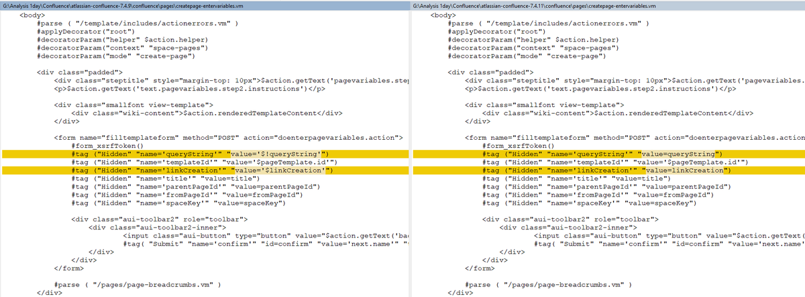
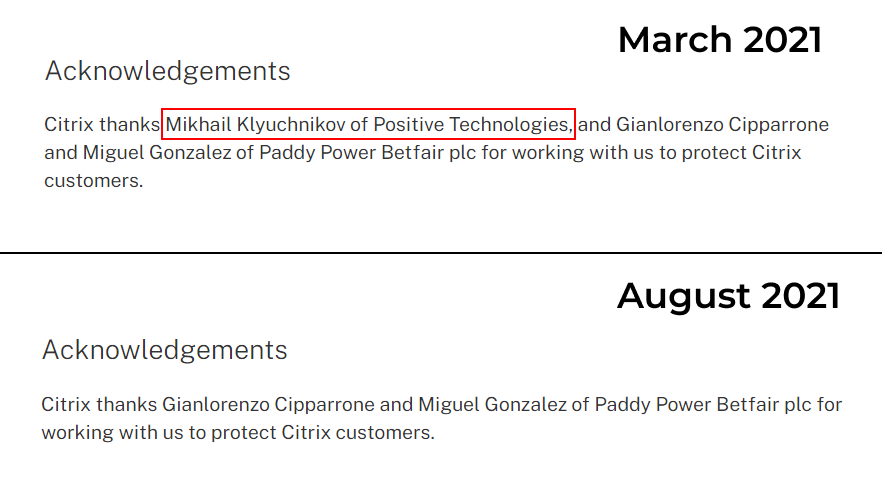
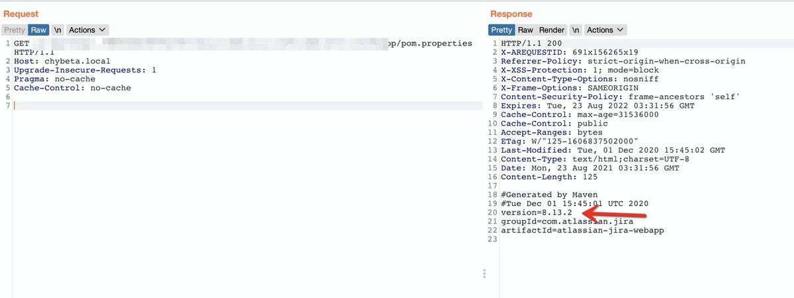
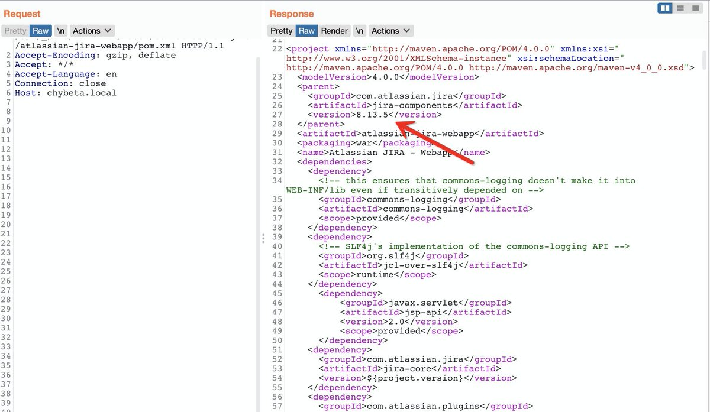
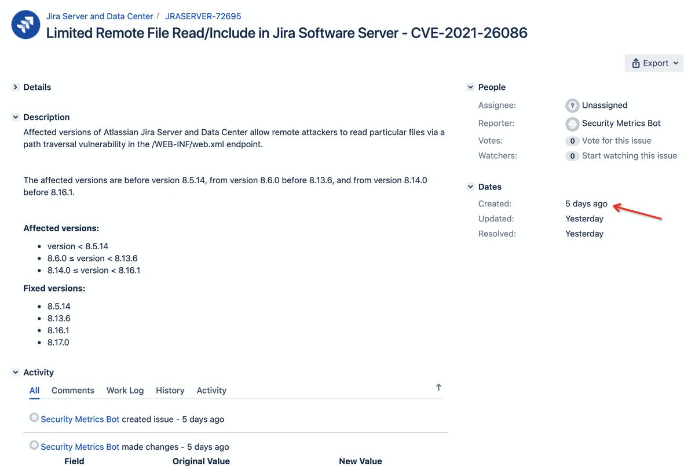
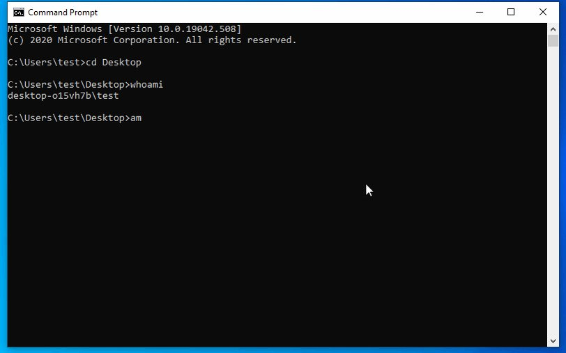
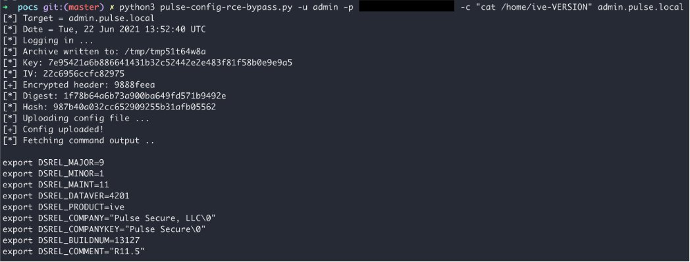

# testanull
**https://twitter.com/testanull/status/1432772135722762242 _at 2021-08-31, 18:27:51_**
<blockquote>
Continue on CVE-2021-26084
There was some tweet telling that block the entrypoint "/pages/createpage-entervariables.action" will reduce the risk.
But it's not enough,
After rechecking, there're more than 2 entrypoints can be used with the Pre-Auth RCE.
RT wisely!
</blockquote>

<table><tr>
<td>Quotes: <code>2</code></td>
<td>Replies: <code>3</code></td>
<td>Retweets: <code>21</code></td>
<td>Favorites: <code>102</code></td>
</tr></table>

---

# haxor31337
**https://twitter.com/haxor31337/status/1432731786719551489 _at 2021-08-31, 15:47:31_**
<blockquote>
About CVE-2021-26084, Block endpoint /pages/createpage-entervariables.action
If you can't patch your server. The attacker can exploit without authentication although signup is disabled by default
Mass scan already start and bug bounty hunters are farming it 🙂
#RCE #Confluence https://t.co/C0JfIEYPhb
</blockquote>

<table><tr>
<td></td>
</table></tr>
<table><tr>
<td>Quotes: <code>6</code></td>
<td>Replies: <code>5</code></td>
<td>Retweets: <code>86</code></td>
<td>Favorites: <code>229</code></td>
</tr></table>

---

# testanull
**https://twitter.com/testanull/status/1432656820829507585 _at 2021-08-31, 10:49:38_**
<blockquote>
About the CVE-2021-26084, 
It's a Pre-Auth RCE vulnerability by default, even if the Sign-Up function is disabled. 
Patch your server before the PoC is released!
cc @rootxharsh @iamnoooob @peterjson
</blockquote>

<table><tr>
<td>Quotes: <code>3</code></td>
<td>Replies: <code>3</code></td>
<td>Retweets: <code>25</code></td>
<td>Favorites: <code>172</code></td>
</tr></table>

---

# elhackernet
**https://twitter.com/elhackernet/status/1432609783316717570 _at 2021-08-31, 07:42:43_**
<blockquote>
Script NSE Nmap para detectar vulnerabilidad CVE-2021-31195 en Microsoft Exchange
- ProxyOracle RCE
https://t.co/wqoQiHHQX6 https://t.co/dtHI7FXVZj
</blockquote>

* https://github.com/DIVD-NL/ProxyOracleNSE/blob/master/CVE-2021-31195.nse

<table><tr>
<td></td>
</table></tr>
<table><tr>
<td>Quotes: <code>1</code></td>
<td>Replies: <code>0</code></td>
<td>Retweets: <code>30</code></td>
<td>Favorites: <code>42</code></td>
</tr></table>

---

# thezdi
**https://twitter.com/thezdi/status/1432327247197884418 _at 2021-08-30, 13:00:01_**
<blockquote>
Introducing #ProxyToken, which allows an unauthenticated attacker to modify the configuration of a victim’s mailbox on an #Exchange Server. Originally reported to us by Le Xuan Tuyen, @HexKitchen details CVE-2021-33766 &amp; shows how it could be exploited. https://t.co/GIjXrGF4Xb
</blockquote>

* https://www.zerodayinitiative.com/blog/2021/8/30/proxytoken-an-authentication-bypass-in-microsoft-exchange-server

<table><tr>
<td>Quotes: <code>11</code></td>
<td>Replies: <code>3</code></td>
<td>Retweets: <code>122</code></td>
<td>Favorites: <code>220</code></td>
</tr></table>

---

# pixiepointsec
**https://twitter.com/pixiepointsec/status/1432206932668940288 _at 2021-08-30, 05:01:56_**
<blockquote>
CVE-2021-34486: ETW TimeCallbackContext Object UAF Vulnerability 
https://t.co/R7ESDrssei
</blockquote>

* https://www.pixiepointsecurity.com/blog/cve-2021-34486.html

<table><tr>
<td>Quotes: <code>3</code></td>
<td>Replies: <code>3</code></td>
<td>Retweets: <code>66</code></td>
<td>Favorites: <code>137</code></td>
</tr></table>

---

# bad_packets
**https://twitter.com/bad_packets/status/1432024809425145864 _at 2021-08-29, 16:58:14_**
<blockquote>
Mass scanning activity detected from 213.232.127.67 (🇮🇷) checking for Microsoft Exchange servers vulnerable to #ProxyShell (CVE-2021-34473).
#threatintel
</blockquote>

<table><tr>
<td>Quotes: <code>1</code></td>
<td>Replies: <code>2</code></td>
<td>Retweets: <code>40</code></td>
<td>Favorites: <code>83</code></td>
</tr></table>

---

# cyber_advising
**https://twitter.com/cyber_advising/status/1430827417539596290 _at 2021-08-26, 09:40:14_**
<blockquote>
👺XSTREAM&lt;=1.4.17: 
-CVE-2021-39141（RCE）
- CVE-2021-39144（RCE）
- CVE-2021-39150（SSRF）
- CVE-2021-39152（SSRF).

PoC
https://t.co/hzyk189ApL https://t.co/E7wemc8A2J
</blockquote>

* https://github.com/zwjjustdoit/Xstream-1.4.17

<table><tr>
<td></td>
</table></tr>
<table><tr>
<td>Quotes: <code>1</code></td>
<td>Replies: <code>0</code></td>
<td>Retweets: <code>44</code></td>
<td>Favorites: <code>126</code></td>
</tr></table>

---

# bad_packets
**https://twitter.com/bad_packets/status/1430700842907103234 _at 2021-08-26, 01:17:16_**
<blockquote>
Mass scanning activity detected from 45.141.84.35 (🇷🇺) targeting Fortinet VPN servers vulnerable to unauthenticated arbitrary file read (CVE-2018-13379) leading to disclosure of usernames and passwords in plaintext. #threatintel https://t.co/1etmqQrkIf
</blockquote>

<table><tr>
<td></td>
</table></tr>
<table><tr>
<td>Quotes: <code>0</code></td>
<td>Replies: <code>2</code></td>
<td>Retweets: <code>22</code></td>
<td>Favorites: <code>40</code></td>
</tr></table>

---

# chybeta
**https://twitter.com/chybeta/status/1430418351755456518 _at 2021-08-25, 06:34:45_**
<blockquote>
CVE-2020-29448 Pre-Authorization Limited Arbitrary File Read in Confluence Server

https://t.co/SBE9HB5ids

https://t.co/ZvgqLpqEHj

https://t.co/Ae8gOqmkH0 https://t.co/NcN23KuW1i
</blockquote>

* https://jira.atlassian.com/browse/CONFSERVER-60469
* https://mp.weixin.qq.com/s/uZ6JIAMXFOV9Pr6l-M1iMg
* https://t.zsxq.com/ybQrBAE

<table><tr>
<td></td>
</table></tr>
<table><tr>
<td>Quotes: <code>2</code></td>
<td>Replies: <code>0</code></td>
<td>Retweets: <code>48</code></td>
<td>Favorites: <code>98</code></td>
</tr></table>

---

# bad_packets
**https://twitter.com/bad_packets/status/1430013950364585991 _at 2021-08-24, 03:47:48_**
<blockquote>
We've detected mass scanning activity from multiple hosts targeting routers vulnerable to CVE-2021-35395.

First seen: 2021-08-21T04:01:39Z
Last seen: 2021-08-23T20:06:25Z

Vendor advisory: https://t.co/kBNlbtF4vP
#threatintel
</blockquote>

* https://www.realtek.com/images/safe-report/Realtek_APRouter_SDK_Advisory-CVE-2021-35392_35395.pdf

<table><tr>
<td>Quotes: <code>4</code></td>
<td>Replies: <code>0</code></td>
<td>Retweets: <code>46</code></td>
<td>Favorites: <code>81</code></td>
</tr></table>

---

# __mn1__
**https://twitter.com/__mn1__/status/1429836893496266761 _at 2021-08-23, 16:04:15_**
<blockquote>
2019: Citrix thanked me for responsible disclosure of the unauth RCE (CVE-2019-19781)
2021: Citrix removed all mentions of me from their website 

What that means?
</blockquote>

<table><tr>
<td>Quotes: <code>2</code></td>
<td>Replies: <code>14</code></td>
<td>Retweets: <code>19</code></td>
<td>Favorites: <code>202</code></td>
</tr></table>

---

# ptswarm
**https://twitter.com/ptswarm/status/1429797465499316229 _at 2021-08-23, 13:27:34_**
<blockquote>
🙈🙉🙊Citrix has removed the acknowledgement of our researcher Mikhail Klyuchnikov who discovered and reported CVE-2019-19781 - the Citrix ADC RCE!

@Citrix we will be pleased to hear your response.

Current: https://t.co/ld0MpvKoj9

Mar 2021: https://t.co/lHRMw6eBxx https://t.co/fifYfAZPQZ
</blockquote>

* https://support.citrix.com/article/CTX267027
* http://web.archive.org/web/20210321090412/https://support.citrix.com/article/CTX267027

<table><tr>
<td></td>
</table></tr>
<table><tr>
<td>Quotes: <code>25</code></td>
<td>Replies: <code>22</code></td>
<td>Retweets: <code>104</code></td>
<td>Favorites: <code>265</code></td>
</tr></table>

---

# chybeta
**https://twitter.com/chybeta/status/1429652441868357636 _at 2021-08-23, 03:51:18_**
<blockquote>
CVE-2020-29453 Pre-Authorization Limited Arbitrary File Read in Jira Server
https://t.co/CZZKFK7PzM 

https://t.co/ForOAI8ngJ https://t.co/lTlgc6TKmX
</blockquote>

* https://jira.atlassian.com/browse/JRASERVER-72014
* https://t.zsxq.com/iUn2vRz

<table><tr>
<td></td>
</table></tr>
<table><tr>
<td>Quotes: <code>1</code></td>
<td>Replies: <code>2</code></td>
<td>Retweets: <code>51</code></td>
<td>Favorites: <code>157</code></td>
</tr></table>

---

# azz_maher
**https://twitter.com/azz_maher/status/1428725266487074819 _at 2021-08-20, 14:27:02_**
<blockquote>
I wrote an LPE exploit for CVE-2017-11176 for Linux Kernel version 4.8.11, I managed to bypass SMEP and SMAP (by stack pivoting inside the kernel and ROP).

The vulnerability is a UAF, and the patch is only 1 line of code.
Exploit and Write-up + Refs here:
https://t.co/0mIpaK7mqV https://t.co/NlvTDtSISw
</blockquote>

* https://git.io/J0p8v

<table><tr>
<td></td>
</table></tr>
<table><tr>
<td>Quotes: <code>4</code></td>
<td>Replies: <code>8</code></td>
<td>Retweets: <code>193</code></td>
<td>Favorites: <code>651</code></td>
</tr></table>

---

# pattern_F_
**https://twitter.com/pattern_F_/status/1428337572405649408 _at 2021-08-19, 12:46:29_**
<blockquote>
Reproduced @CodeColorist 's RCE (CVE-2021-1748).
Never wrote userspace exploit before. I had to learn too many concepts about Objective-C and JavaScriptCore in these days. It's really a painful experience. https://t.co/pzjpqUDLQX
</blockquote>

<table><tr>
<td></td>
</table></tr>
<table><tr>
<td>Quotes: <code>1</code></td>
<td>Replies: <code>14</code></td>
<td>Retweets: <code>34</code></td>
<td>Favorites: <code>224</code></td>
</tr></table>

---

# Atredis
**https://twitter.com/Atredis/status/1428050526193819659 _at 2021-08-18, 17:45:51_**
<blockquote>
When you come across an Unauth RCE CVE with no public details, what do you do? Justin Kennedy (@jstnkndy) shares his adventure, both failures and successes, in uncovering the mysteries of CVE-2020-25223 in this writeup: https://t.co/Ap0yeY3L2Z https://t.co/EL8NUfls6V
</blockquote>

* https://j.mp/2XCM2f4

<table><tr>
<td></td>
</table></tr>
<table><tr>
<td>Quotes: <code>7</code></td>
<td>Replies: <code>7</code></td>
<td>Retweets: <code>66</code></td>
<td>Favorites: <code>156</code></td>
</tr></table>

---

# chybeta
**https://twitter.com/chybeta/status/1427569271387803651 _at 2021-08-17, 09:53:31_**
<blockquote>
CVE-2021-26086 Pre-Auth Limited Remote File Read/Include in Jira Software Server

https://t.co/x54JqhVJHR

details: https://t.co/M3TDFgC8XR https://t.co/X2VubtIFJ6
</blockquote>

* https://jira.atlassian.com/browse/JRASERVER-72695
* https://wx.zsxq.com/dweb2/index/topic_detail/418428484242888

<table><tr>
<td></td>
<td></td>
</table></tr>
<table><tr>
<td>Quotes: <code>1</code></td>
<td>Replies: <code>2</code></td>
<td>Retweets: <code>107</code></td>
<td>Favorites: <code>275</code></td>
</tr></table>

---

# alexjplaskett
**https://twitter.com/alexjplaskett/status/1427543895173443602 _at 2021-08-17, 08:12:41_**
<blockquote>
Ever wanted to exploit Windows 10 with CVE-2021-31956? Obsessive about kernel memory layouts? https://t.co/Du29syIf46 is now up focusing on exploit reliability, stability and detection! #windows https://t.co/ymrqhlNwuM
</blockquote>

* https://research.nccgroup.com/2021/08/17/cve-2021-31956-exploiting-the-windows-kernel-ntfs-with-wnf-part-2/

<table><tr>
<td></td>
</table></tr>
<table><tr>
<td>Quotes: <code>2</code></td>
<td>Replies: <code>1</code></td>
<td>Retweets: <code>71</code></td>
<td>Favorites: <code>188</code></td>
</tr></table>

---

# piedpiper1616
**https://twitter.com/piedpiper1616/status/1427222078856450049 _at 2021-08-16, 10:53:54_**
<blockquote>
GitHub - whichbuffer/CVE-2021-34473: CVE-2021-34473 Microsoft Exchange Server Remote Code Execution Vulnerability - https://t.co/aohTuSKPgJ
</blockquote>

* https://github.com/whichbuffer/CVE-2021-34473

<table><tr>
<td>Quotes: <code>4</code></td>
<td>Replies: <code>1</code></td>
<td>Retweets: <code>55</code></td>
<td>Favorites: <code>129</code></td>
</tr></table>

---

# bad_packets
**https://twitter.com/bad_packets/status/1426583017737256960 _at 2021-08-14, 16:34:30_**
<blockquote>
Mass scanning activity detected from 194.48.199.78 (🇬🇧) checking for Microsoft Exchange servers vulnerable to #ProxyShell (CVE-2021-34473).
#threatintel
</blockquote>

<table><tr>
<td>Quotes: <code>3</code></td>
<td>Replies: <code>4</code></td>
<td>Retweets: <code>45</code></td>
<td>Favorites: <code>65</code></td>
</tr></table>

---

# briankrebs
**https://twitter.com/briankrebs/status/1425820762305404928 _at 2021-08-12, 14:05:34_**
<blockquote>
Yes, yet another remote code execution flaw in the Windows Print Spooler service. Microsoft's advisory on CVE-2021-36958 here: https://t.co/sfUXlxevol
</blockquote>

* https://msrc.microsoft.com/update-guide/vulnerability/CVE-2021-36958

<table><tr>
<td>Quotes: <code>6</code></td>
<td>Replies: <code>6</code></td>
<td>Retweets: <code>70</code></td>
<td>Favorites: <code>142</code></td>
</tr></table>

---

# TheHackersNews
**https://twitter.com/TheHackersNews/status/1425704653971283971 _at 2021-08-12, 06:24:12_**
<blockquote>
Microsoft warns of yet another UNPATCHED Windows Print Spooler #vulnerability  (CVE-2021-36958) allowing RCE attacks.

Read: https://t.co/69Mwhba0dA

Users are advised to stop and disable the Print Spooler service to prevent malicious actors from exploiting the vulnerability.
</blockquote>

* https://thehackernews.com/2021/08/microsoft-security-bulletin-warns-of.html

<table><tr>
<td>Quotes: <code>21</code></td>
<td>Replies: <code>5</code></td>
<td>Retweets: <code>165</code></td>
<td>Favorites: <code>217</code></td>
</tr></table>

---

# Steph3nSims
**https://twitter.com/Steph3nSims/status/1425606804956876800 _at 2021-08-11, 23:55:23_**
<blockquote>
CVE-2022-101010 Windows Print Spooler Remote Code Execution Vulnerability

CVE-2023-324352 Windows Print Spooler Remote Code Execution Vulnerability

CVE-2024-010224 Windows Print Spooler Remote Code Execution Vulnerability

...
</blockquote>

<table><tr>
<td>Quotes: <code>1</code></td>
<td>Replies: <code>1</code></td>
<td>Retweets: <code>2</code></td>
<td>Favorites: <code>40</code></td>
</tr></table>

---

# bad_packets
**https://twitter.com/bad_packets/status/1425598895569006594 _at 2021-08-11, 23:23:57_**
<blockquote>
Mass scanning activity detected from 3.15.221.32 (🇺🇸) checking for Microsoft Exchange servers vulnerable to #ProxyShell (CVE-2021-34473).
#threatintel
</blockquote>

<table><tr>
<td>Quotes: <code>1</code></td>
<td>Replies: <code>2</code></td>
<td>Retweets: <code>57</code></td>
<td>Favorites: <code>127</code></td>
</tr></table>

---

# offenseindepth
**https://twitter.com/offenseindepth/status/1425586599639887874 _at 2021-08-11, 22:35:06_**
<blockquote>
This week Microsoft published two of my reports: CVE-2021-34483 and CVE-2021-36958. Full write-up to be released once CVE-2021-36958 is officially patched.
</blockquote>

<table><tr>
<td>Quotes: <code>2</code></td>
<td>Replies: <code>2</code></td>
<td>Retweets: <code>36</code></td>
<td>Favorites: <code>155</code></td>
</tr></table>

---

# GossiTheDog
**https://twitter.com/GossiTheDog/status/1425568875190624268 _at 2021-08-11, 21:24:40_**
<blockquote>
There’s now a CVE for this. No patch yet, recommendation is disable print Spooler (which disables all printing). CVE-2021-36958. 

cc @gentilkiwi https://t.co/5ot4CW4KtX https://t.co/9DDvoywkD0
</blockquote>

* https://msrc.microsoft.com/update-guide/vulnerability/CVE-2021-36958

<table><tr>
<td></td>
</table></tr>
<table><tr>
<td>Quotes: <code>6</code></td>
<td>Replies: <code>15</code></td>
<td>Retweets: <code>14</code></td>
<td>Favorites: <code>65</code></td>
</tr></table>

---

# _Icewall
**https://twitter.com/_Icewall/status/1425547843603996678 _at 2021-08-11, 20:01:05_**
<blockquote>
CVE-2021-29985 - Mozilla Firefox MediaCacheStream::NotifyDataReceived use-after-free vulnerability
a bit more info : https://t.co/FMMY1HVigL
</blockquote>

* https://talosintelligence.com/vulnerability_reports/TALOS-2021-1345

<table><tr>
<td>Quotes: <code>0</code></td>
<td>Replies: <code>0</code></td>
<td>Retweets: <code>6</code></td>
<td>Favorites: <code>39</code></td>
</tr></table>

---

# wdormann
**https://twitter.com/wdormann/status/1425203448988016642 _at 2021-08-10, 21:12:35_**
<blockquote>
Microsoft did fix *something* related to your attack in their update for CVE-2021-36936, which describes nothing about what it fixes.
For example, my PoC for VU#131152 now prompts for admin creds.
However, @gentilkiwi 's PoC still works fine.
Time for MS to issue a new CVE? https://t.co/Par25spjeY
</blockquote>

<table><tr>
<td></td>
<td></td>
</table></tr>
<table><tr>
<td>Quotes: <code>7</code></td>
<td>Replies: <code>3</code></td>
<td>Retweets: <code>57</code></td>
<td>Favorites: <code>164</code></td>
</tr></table>

---

# _r_netsec
**https://twitter.com/_r_netsec/status/1425139406671736834 _at 2021-08-10, 16:58:07_**
<blockquote>
Building an exploit for a Use-After-Free in ProFTPd (CVE-2020-9273) https://t.co/lWuM9YYcte
</blockquote>

* https://adepts.of0x.cc/proftpd-cve-2020-9273-exploit/

<table><tr>
<td>Quotes: <code>1</code></td>
<td>Replies: <code>0</code></td>
<td>Retweets: <code>33</code></td>
<td>Favorites: <code>79</code></td>
</tr></table>

---

# AdeptsOf0xCC
**https://twitter.com/AdeptsOf0xCC/status/1425101774122328075 _at 2021-08-10, 14:28:34_**
<blockquote>
Dear Fellowlship, How is your summer going?  

Our N-Day owl @lockedbyte was bored in his holidays and decided to build an exploit for CVE-2020-9273.  Check our post:

Having fun with a Use-After-Free in ProFTPd (CVE-2020-9273)

https://t.co/nfdZ6UMiYn https://t.co/GXS0g2ypBT
</blockquote>

* https://adepts.of0x.cc/proftpd-cve-2020-9273-exploit/

<table><tr>
<td></td>
</table></tr>
<table><tr>
<td>Quotes: <code>1</code></td>
<td>Replies: <code>1</code></td>
<td>Retweets: <code>52</code></td>
<td>Favorites: <code>91</code></td>
</tr></table>

---

# TheHackersNews
**https://twitter.com/TheHackersNews/status/1424663195579342855 _at 2021-08-09, 09:25:49_**
<blockquote>
A new security patch update for Pulse Secure VPNs has been released to address an incomplete patch previously issued for a critical RCE #vulnerability (CVE-2020-8260) that was under active exploitation.

Read: https://t.co/uqTg42ckad

#infosec #cybersecurity #hacking
</blockquote>

* https://thehackernews.com/2021/08/pulse-secure-vpns-get-new-urgent-update.html

<table><tr>
<td>Quotes: <code>5</code></td>
<td>Replies: <code>0</code></td>
<td>Retweets: <code>76</code></td>
<td>Favorites: <code>103</code></td>
</tr></table>

---

# campuscodi
**https://twitter.com/campuscodi/status/1423997101550096389 _at 2021-08-07, 13:19:00_**
<blockquote>
CVE-2021-1609: Critical Remote Code Execution Vulnerability in Cisco Small Business VPN Routers

https://t.co/G57pvdyx9E https://t.co/ZY09lj3HPA
</blockquote>

* https://www.tenable.com/blog/cve-2021-1609-critical-rce-vulnerability-cisco-small-business-vpn-routers

<table><tr>
<td></td>
</table></tr>
<table><tr>
<td>Quotes: <code>4</code></td>
<td>Replies: <code>0</code></td>
<td>Retweets: <code>47</code></td>
<td>Favorites: <code>73</code></td>
</tr></table>

---

# GossiTheDog
**https://twitter.com/GossiTheDog/status/1423661857471090692 _at 2021-08-06, 15:06:51_**
<blockquote>
Just to widen this one out, these are pre-authentication (no password required) remote code execution bugs in Microsoft Exchange on premise. 

CVE's CVE-2021-34523, CVE-2021-34473 and CVE-2021-31207 - allocated in July but fixed in April's Security Updates.

Thread about details:
</blockquote>

<table><tr>
<td>Quotes: <code>5</code></td>
<td>Replies: <code>1</code></td>
<td>Retweets: <code>57</code></td>
<td>Favorites: <code>143</code></td>
</tr></table>

---

# NCCGroupInfosec
**https://twitter.com/NCCGroupInfosec/status/1423341781907804164 _at 2021-08-05, 17:54:59_**
<blockquote>
Technical Advisory: Pulse Connect Secure – RCE via Uncontrolled Archive Extraction – CVE-2021-22937 (Patch Bypass) by @buffaloverflow - https://t.co/nfHXF0B5nH https://t.co/AEIkhbgtI3
</blockquote>

* https://research.nccgroup.com/2021/08/05/technical-advisory-pulse-connect-secure-rce-via-uncontrolled-archive-extraction-cve-2021-22937-patch-bypass/

<table><tr>
<td></td>
</table></tr>
<table><tr>
<td>Quotes: <code>4</code></td>
<td>Replies: <code>2</code></td>
<td>Retweets: <code>41</code></td>
<td>Favorites: <code>81</code></td>
</tr></table>

---

# buffaloverflow
**https://twitter.com/buffaloverflow/status/1423313959311056898 _at 2021-08-05, 16:04:26_**
<blockquote>
Here is the advisory for CVE-2021-22937, which is a patch bypass of CVE-2020-8260 (Pulse Connect Secure RCE)

https://t.co/MVYNSVuIMn https://t.co/0uq18GE3yb
</blockquote>

* https://research.nccgroup.com/2021/08/05/technical-advisory-pulse-connect-secure-rce-via-uncontrolled-archive-extraction-cve-2021-22937-patch-bypass/

<table><tr>
<td></td>
</table></tr>
<table><tr>
<td>Quotes: <code>9</code></td>
<td>Replies: <code>6</code></td>
<td>Retweets: <code>108</code></td>
<td>Favorites: <code>241</code></td>
</tr></table>

---

# CodeColorist
**https://twitter.com/CodeColorist/status/1423072149946789889 _at 2021-08-05, 00:03:34_**
<blockquote>
Thank everybody that joined our BlackHat session! Here’s the 1st part of my write-up for TianfuCup 2020. Meet CVE-2021-1748, a client-side XSS introduced by iOS 3 to bypass WebContent sandbox and open up new attack surfaces https://t.co/VZVya6W349
</blockquote>

* https://blog.chichou.me/2021/08/04/mistuned-part-i/

<table><tr>
<td>Quotes: <code>1</code></td>
<td>Replies: <code>2</code></td>
<td>Retweets: <code>52</code></td>
<td>Favorites: <code>152</code></td>
</tr></table>

---

# 0xdea
**https://twitter.com/0xdea/status/1422964075563298817 _at 2021-08-04, 16:54:07_**
<blockquote>
Arbitrary file write in node tar - CVE-2021-32804 &lt;&lt; 😂 

https://t.co/mM7J27wOkK https://t.co/lsOoMXInSk
</blockquote>

* https://nvd.nist.gov/vuln/detail/CVE-2021-32804

<table><tr>
<td></td>
</table></tr>
<table><tr>
<td>Quotes: <code>3</code></td>
<td>Replies: <code>2</code></td>
<td>Retweets: <code>11</code></td>
<td>Favorites: <code>33</code></td>
</tr></table>

---

# bad_packets
**https://twitter.com/bad_packets/status/1422794953734778881 _at 2021-08-04, 05:42:05_**
<blockquote>
Ongoing mass scanning activity detected from 45.95.147.15 (🇳🇱) checking for Fortinet VPN servers vulnerable to unauthenticated arbitrary file read (CVE-2018-13379) leading to disclosure of usernames and passwords in plaintext. #threatintel
</blockquote>

<table><tr>
<td>Quotes: <code>2</code></td>
<td>Replies: <code>3</code></td>
<td>Retweets: <code>45</code></td>
<td>Favorites: <code>102</code></td>
</tr></table>

---

