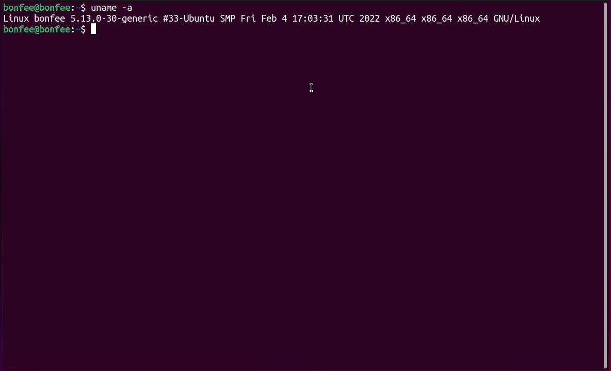

# bad_packets
**https://twitter.com/bad_packets/status/1509603994166956049 _at 2022-03-31, 18:50:13_**
<blockquote>
Spring Cloud Function RCE (CVE-2022-22963) mass scanning activity detected from 45.155.204.146 (🇷🇺).

Spring Framework RCE (CVE-2022-22965) mass scanning activity detected from multiple Tor exit nodes.

Tags available now for both vulnerabilities.
</blockquote>

<table><tr>
<td>Quotes: <code>7</code></td>
<td>Replies: <code>3</code></td>
<td>Retweets: <code>49</code></td>
<td>Favorites: <code>110</code></td>
</tr></table>

---

# hrbrmstr
**https://twitter.com/hrbrmstr/status/1509263113966821377 _at 2022-03-30, 20:15:41_**
<blockquote>
This is so daft.

The new no-CVE PoC for an unpatched RCE vulnerability in the Spring framework is really just a bypass for a not-exactly-fixed patch for CVE-2010-1622 … a *12 year old* weakness.

I really need to exit this industry at some point. No org seems to care.
</blockquote>

<table><tr>
<td>Quotes: <code>0</code></td>
<td>Replies: <code>4</code></td>
<td>Retweets: <code>1</code></td>
<td>Favorites: <code>33</code></td>
</tr></table>

---

# wdormann
**https://twitter.com/wdormann/status/1509225394561507333 _at 2022-03-30, 17:45:48_**
<blockquote>
OK, where are we with Spring stuff?
1) CVE-2022-22963 is a thing, and it affects Spring Cloud Connector.  It's RCE, so the CVSS score of 5.4 seems way off.
2) Spring4Shell / SpringShell, invented by Cyber Kendra, isn't a Spring vulnerability at all.
Does that sound about right? https://t.co/OwPgA2BSIS
</blockquote>

<table><tr>
<td></td>
<td></td>
<td></td>
</table></tr>
<table><tr>
<td>Quotes: <code>13</code></td>
<td>Replies: <code>11</code></td>
<td>Retweets: <code>109</code></td>
<td>Favorites: <code>372</code></td>
</tr></table>

---

# JFrogSecurity
**https://twitter.com/JFrogSecurity/status/1509175542205095940 _at 2022-03-30, 14:27:43_**
<blockquote>
[1/5] 🚨 Some clarifications about CVE-2022-22963, a high-severity RCE in Spring Cloud Function. The vulnerability is remotely exploitable (with a published exploit) under the default configuration, when running a Spring Boot application that depends on Spring Cloud Function. 🧵
</blockquote>

<table><tr>
<td>Quotes: <code>10</code></td>
<td>Replies: <code>1</code></td>
<td>Retweets: <code>26</code></td>
<td>Favorites: <code>39</code></td>
</tr></table>

---

# terorie_dev
**https://twitter.com/terorie_dev/status/1509146657631387651 _at 2022-03-30, 12:32:56_**
<blockquote>
CVE-2021-30551 in a nutshell (V8 type confusion allowing RCE). CVE-2022-1096 has same exploit strategy. PoC incoming.
pic credit Google Project Zero https://t.co/P9KdBEu7GN
</blockquote>

<table><tr>
<td></td>
</table></tr>
<table><tr>
<td>Quotes: <code>2</code></td>
<td>Replies: <code>4</code></td>
<td>Retweets: <code>26</code></td>
<td>Favorites: <code>89</code></td>
</tr></table>

---

# Yassineaboukir
**https://twitter.com/Yassineaboukir/status/1509038814739767299 _at 2022-03-30, 05:24:24_**
<blockquote>
It couldn’t get any worse as some of the widely used firewall appliances are undergoing active exploitation nowadays 🤯

• Watchguard (CVE-2022-26318): Pre-Auth RCE.
• Sophos (CVE-2022-1040): Auth bypass to RCE.
• SonicWall (CVE-2022-22274): DoS/RCE.
</blockquote>

<table><tr>
<td>Quotes: <code>0</code></td>
<td>Replies: <code>0</code></td>
<td>Retweets: <code>12</code></td>
<td>Favorites: <code>66</code></td>
</tr></table>

---

# bytehx343
**https://twitter.com/bytehx343/status/1509034539330732033 _at 2022-03-30, 05:07:25_**
<blockquote>
Spring Cloud Function Spel RCE aka CVE-2022-22963 POC.
payload
https://t.co/4Yb3FFRFoC.function.routing-expression: T(java.lang.Runtime).getRuntime().exec("xcalc") https://t.co/1loEZJrIX3
</blockquote>

* http://spring.cloud

<table><tr>
<td></td>
</table></tr>
<table><tr>
<td>Quotes: <code>21</code></td>
<td>Replies: <code>6</code></td>
<td>Retweets: <code>208</code></td>
<td>Favorites: <code>629</code></td>
</tr></table>

---

# SinSinology
**https://twitter.com/SinSinology/status/1508812050407034894 _at 2022-03-29, 14:23:19_**
<blockquote>
🔥Our Technical Analysis for Veeam Agent local privilege escalation has been published: CVE-2022-26503
Thanks to @MDSecLabs https://t.co/eBcAjrcvdL
</blockquote>

<table><tr>
<td></td>
</table></tr>
<table><tr>
<td>Quotes: <code>1</code></td>
<td>Replies: <code>2</code></td>
<td>Retweets: <code>37</code></td>
<td>Favorites: <code>112</code></td>
</tr></table>

---

# TheHackersNews
**https://twitter.com/TheHackersNews/status/1508754081006833666 _at 2022-03-29, 10:32:58_**
<blockquote>
A new critical authentication bypass #vulnerability (CVE-2022-1040) that allows remote code execution on Sophos #Firewall devices is being actively exploited in real-world attacks.

Read details: https://t.co/liH5EOvWpn

#infosec #cybersecurity #hackernews #hacking
</blockquote>

* https://thehackernews.com/2022/03/critical-sophos-firewall-rce.html

<table><tr>
<td>Quotes: <code>5</code></td>
<td>Replies: <code>1</code></td>
<td>Retweets: <code>99</code></td>
<td>Favorites: <code>146</code></td>
</tr></table>

---

# _r_netsec
**https://twitter.com/_r_netsec/status/1508265900524580869 _at 2022-03-28, 02:13:07_**
<blockquote>
Google Issues Urgent Chrome Update to Patch Actively Exploited Zero-Day Vulnerability. CVE-2022-1096 is the second zero-day vulnerability addressed by Google in Chrome since the start of the year. https://t.co/wAyVbj0k4o
</blockquote>

* https://cwe.mitre.org/data/definitions/843.html

<table><tr>
<td>Quotes: <code>1</code></td>
<td>Replies: <code>0</code></td>
<td>Retweets: <code>12</code></td>
<td>Favorites: <code>32</code></td>
</tr></table>

---

# piedpiper1616
**https://twitter.com/piedpiper1616/status/1508106160758730758 _at 2022-03-27, 15:38:22_**
<blockquote>
GitHub - Throns1956/watchguard_cve-2022-26318: Watchguard RCE POC CVE-2022-26318 - https://t.co/b4MFbOTGaF
</blockquote>

* https://github.com/Throns1956/watchguard_cve-2022-26318

<table><tr>
<td>Quotes: <code>5</code></td>
<td>Replies: <code>1</code></td>
<td>Retweets: <code>75</code></td>
<td>Favorites: <code>162</code></td>
</tr></table>

---

# ptracesecurity
**https://twitter.com/ptracesecurity/status/1507613626412290048 _at 2022-03-26, 07:01:13_**
<blockquote>
CVE-2019-0708 (BlueKeep) proof of concept allowing pre-auth RCE on Windows7 https://t.co/HbLdzcSHmw  #Pentesting #Windows #CVE #CyberSecurity #Infosec https://t.co/bwzjVFKtXM
</blockquote>

* https://github.com/RICSecLab/CVE-2019-0708

<table><tr>
<td></td>
<td></td>
<td></td>
<td></td>
</table></tr>
<table><tr>
<td>Quotes: <code>1</code></td>
<td>Replies: <code>0</code></td>
<td>Retweets: <code>28</code></td>
<td>Favorites: <code>83</code></td>
</tr></table>

---

# bad_packets
**https://twitter.com/bad_packets/status/1507502101219274756 _at 2022-03-25, 23:38:03_**
<blockquote>
⚠️ CVE-2021-26084 event detected ⚠️

Source IP:
109.237.96.124 (🇷🇺)

Target:
Atlassian Confluence servers vulnerable to unauthenticated remote code execution (https://t.co/7xYox852b2).
#threatintel https://t.co/zNsAbt6J6B
</blockquote>

* https://jira.atlassian.com/browse/CONFSERVER-67940

<table><tr>
<td></td>
</table></tr>
<table><tr>
<td>Quotes: <code>6</code></td>
<td>Replies: <code>2</code></td>
<td>Retweets: <code>88</code></td>
<td>Favorites: <code>268</code></td>
</tr></table>

---

# tekwizz123
**https://twitter.com/tekwizz123/status/1507416172358209546 _at 2022-03-25, 17:56:36_**
<blockquote>
If anyone wants an interesting way to end their Friday, put up PR at https://t.co/0n5Jwt8JPc that exploits CVE-2022-26904, aka SuperProfile, an unpatched LPE vulnerability affecting Windows User Profile service. Bug has been reported to MS. Credit to @KLINIX5 for code n discovery
</blockquote>

* https://github.com/rapid7/metasploit-framework/pull/16382

<table><tr>
<td>Quotes: <code>1</code></td>
<td>Replies: <code>1</code></td>
<td>Retweets: <code>73</code></td>
<td>Favorites: <code>169</code></td>
</tr></table>

---

# bad_packets
**https://twitter.com/bad_packets/status/1507105314243428373 _at 2022-03-24, 21:21:22_**
<blockquote>
⚠️ CVE-2018-13379 event detected ⚠️

Source IP:
179.60.147.11 (*)

Target:
Fortinet VPN servers vulnerable to unauthenticated arbitrary file read leading to disclosure of usernames and passwords in plaintext.
#threatintel
</blockquote>

<table><tr>
<td>Quotes: <code>2</code></td>
<td>Replies: <code>1</code></td>
<td>Retweets: <code>20</code></td>
<td>Favorites: <code>50</code></td>
</tr></table>

---

# cyber_advising
**https://twitter.com/cyber_advising/status/1507035556596883460 _at 2022-03-24, 16:44:10_**
<blockquote>
CVE-2022-27254: PoC for vulnerability in Honda's Remote Keyless System(CVE-2022-27254)

PoC
https://t.co/4awYUnR1oJ https://t.co/6DEOM7AHoN
</blockquote>

* https://github.com/nonamecoder/CVE-2022-27254

<table><tr>
<td></td>
</table></tr>
<table><tr>
<td>Quotes: <code>2</code></td>
<td>Replies: <code>0</code></td>
<td>Retweets: <code>29</code></td>
<td>Favorites: <code>106</code></td>
</tr></table>

---

# cyber_advising
**https://twitter.com/cyber_advising/status/1507035260613275654 _at 2022-03-24, 16:43:00_**
<blockquote>
Dirty Pipe (CVE-2022-0847) temporary root PoC for Android.

PoC
https://t.co/XXHUV5XQUz https://t.co/P64wagltT6
</blockquote>

* https://github.com/polygraphene/DirtyPipe-Android

<table><tr>
<td></td>
</table></tr>
<table><tr>
<td>Quotes: <code>1</code></td>
<td>Replies: <code>2</code></td>
<td>Retweets: <code>51</code></td>
<td>Favorites: <code>162</code></td>
</tr></table>

---

# Dinosn
**https://twitter.com/Dinosn/status/1505273954478530569 _at 2022-03-19, 20:04:12_**
<blockquote>
It's always to be amongst @synack's channel. CVE-2021-44529 PoC (Ivanti Endpoint Manager RCE) was created amongst us today under 5 min, @duty_1g, @phyr3wall awesome work.  Cookie: ab=ab; c=aWQK; d=; e=; .  There is no other PoC available so far.
</blockquote>

<table><tr>
<td>Quotes: <code>2</code></td>
<td>Replies: <code>6</code></td>
<td>Retweets: <code>26</code></td>
<td>Favorites: <code>113</code></td>
</tr></table>

---

# bad_packets
**https://twitter.com/bad_packets/status/1505248108422213635 _at 2022-03-19, 18:21:29_**
<blockquote>
⚠️ CVE-2018-13379 event detected ⚠️

Source IP:
91.240.118.47 (🇷🇺)

Target:
Fortinet VPN servers vulnerable to unauthenticated arbitrary file read leading to disclosure of usernames and passwords in plaintext.
#threatintel https://t.co/tysTFq50LH
</blockquote>

<table><tr>
<td></td>
</table></tr>
<table><tr>
<td>Quotes: <code>5</code></td>
<td>Replies: <code>3</code></td>
<td>Retweets: <code>49</code></td>
<td>Favorites: <code>120</code></td>
</tr></table>

---

# th3_protoCOL
**https://twitter.com/th3_protoCOL/status/1504507763300323363 _at 2022-03-17, 17:19:37_**
<blockquote>
Ransomware access brokers these days:
 
▪️ Fake employee personas (social media, websites &amp; AI-generated pfp's)

▪️ Spear phishing w/ the pretext of a business proposal

▪️ Weaponized a twitter PoC in &lt; 1 month (cc @mrd0x)  

▪️ 0day exploits (CVE-2021-40444)

💥 #Conti &amp; #Diavol https://t.co/oo2fAOq9L1
</blockquote>

<table><tr>
<td></td>
<td></td>
</table></tr>
<table><tr>
<td>Quotes: <code>0</code></td>
<td>Replies: <code>1</code></td>
<td>Retweets: <code>14</code></td>
<td>Favorites: <code>49</code></td>
</tr></table>

---

# RealTryHackMe
**https://twitter.com/RealTryHackMe/status/1503685718769651720 _at 2022-03-15, 10:53:07_**
<blockquote>
A new FREE lab demonstrating the recent Dirty Pipe vulnerability (CVE-2022-0847) has been released on TryHackMe!

🔴 Understand the vulnerability
🔴 Practice exploiting it via a web-based lab

Dirty Pipe is a privilege escalation vulnerability in Linux 👉https://t.co/CNZyVanGtq https://t.co/GLhAdzZii7
</blockquote>

* https://tryhackme.com/room/dirtypipe

<table><tr>
<td></td>
</table></tr>
<table><tr>
<td>Quotes: <code>6</code></td>
<td>Replies: <code>5</code></td>
<td>Retweets: <code>63</code></td>
<td>Favorites: <code>306</code></td>
</tr></table>

---

# bad_packets
**https://twitter.com/bad_packets/status/1503528517253836800 _at 2022-03-15, 00:28:27_**
<blockquote>
⚠️ CVE-2018-13379 event detected ⚠️

Source IP:
85.143.223.17 (🇷🇺)

Target:
Fortinet VPN servers vulnerable to unauthenticated arbitrary file read leading to disclosure of usernames and passwords in plaintext.
#threatintel https://t.co/0Quirk5sJ4
</blockquote>

<table><tr>
<td></td>
</table></tr>
<table><tr>
<td>Quotes: <code>5</code></td>
<td>Replies: <code>3</code></td>
<td>Retweets: <code>63</code></td>
<td>Favorites: <code>151</code></td>
</tr></table>

---

# ptswarm
**https://twitter.com/ptswarm/status/1503360681978077185 _at 2022-03-14, 13:21:32_**
<blockquote>
🔥 Veeam fixed an Unauth RCE (CVE-2022-26500, CVE-2022-26501) in Veeam Backup &amp; Replication and a Local Privilege Escalation (CVE-2022-26503) in Veeam Agent for Microsoft Windows found by our researcher @ultrayoba.

Advisory: https://t.co/tRYsKBn3HD https://t.co/0zMluR7Zki
</blockquote>

* https://www.veeam.com/kb4288

<table><tr>
<td></td>
</table></tr>
<table><tr>
<td>Quotes: <code>11</code></td>
<td>Replies: <code>7</code></td>
<td>Retweets: <code>188</code></td>
<td>Favorites: <code>457</code></td>
</tr></table>

---

# Securityblog
**https://twitter.com/Securityblog/status/1503103998743793664 _at 2022-03-13, 20:21:34_**
<blockquote>
GitHub - 0vercl0k/CVE-2022-21971: PoC for CVE-2022-21971 "Windows Runtime Remote Code Execution Vulnerability" https://t.co/DHSKYV6eY1
</blockquote>

* https://github.com/0vercl0k/CVE-2022-21971

<table><tr>
<td>Quotes: <code>3</code></td>
<td>Replies: <code>0</code></td>
<td>Retweets: <code>76</code></td>
<td>Favorites: <code>154</code></td>
</tr></table>

---

# CyberWarship
**https://twitter.com/CyberWarship/status/1502956904649302021 _at 2022-03-13, 10:37:04_**
<blockquote>
Unpacking CVE-2021-40444: A Deep Technical Analysis of an Office RCE Exploit 

#infosec #pentest #redteam

https://t.co/xx3a70mHaH https://t.co/KCXnMm8u03
</blockquote>

* https://billdemirkapi.me/unpacking-cve-2021-40444-microsoft-office-rce/

<table><tr>
<td></td>
<td></td>
<td></td>
<td></td>
</table></tr>
<table><tr>
<td>Quotes: <code>3</code></td>
<td>Replies: <code>3</code></td>
<td>Retweets: <code>125</code></td>
<td>Favorites: <code>273</code></td>
</tr></table>

---

# Viperian
**https://twitter.com/Viperian/status/1502748344514396167 _at 2022-03-12, 20:48:19_**
<blockquote>
Vulnerability (CVE-2022-26503) in Veeam Agent for Microsoft Windows allows local privilege escalation. An attacker who successfully exploited this vulnerability could run arbitrary code with LOCAL SYSTEM privileges. #veeam https://t.co/Sla74zabkJ https://t.co/1yvp1Ag144
</blockquote>

* https://www.veeam.com/kb4289

<table><tr>
<td></td>
</table></tr>
<table><tr>
<td>Quotes: <code>6</code></td>
<td>Replies: <code>0</code></td>
<td>Retweets: <code>88</code></td>
<td>Favorites: <code>123</code></td>
</tr></table>

---

# 0xInfection
**https://twitter.com/0xInfection/status/1502687968532000768 _at 2022-03-12, 16:48:24_**
<blockquote>
We published a write-up on the recent "Dirty Pipe" Linux Kernel Privilege Escalation vulnerability (CVE-2022-0847). Blog includes a demo of how the exploit works in gaining privilege escalation. :)

https://t.co/NKjl5bk8fp https://t.co/d1a1lmQfFc
</blockquote>

* https://redhuntlabs.com/blog/the-dirty-pipe-vulnerability.html

<table><tr>
<td></td>
</table></tr>
<table><tr>
<td>Quotes: <code>3</code></td>
<td>Replies: <code>1</code></td>
<td>Retweets: <code>112</code></td>
<td>Favorites: <code>319</code></td>
</tr></table>

---

# 33y0re
**https://twitter.com/33y0re/status/1502029931227893770 _at 2022-03-10, 21:13:36_**
<blockquote>
12 ROP chains later - from CVE-2019-0567 crash POC to code execution.

ASLR, DEP, &amp; CFG bypass + ACG bypass using (since-patched) CVE-2017-8637 to abuse the way Chakra-based Edge handled (pun intended) supplying a handle from the out-of-process JIT server to a content process. https://t.co/aAC7WBGa1P
</blockquote>

<table><tr>
<td></td>
</table></tr>
<table><tr>
<td>Quotes: <code>2</code></td>
<td>Replies: <code>5</code></td>
<td>Retweets: <code>90</code></td>
<td>Favorites: <code>412</code></td>
</tr></table>

---

# n0x08
**https://twitter.com/n0x08/status/1502023452236025865 _at 2022-03-10, 20:47:51_**
<blockquote>
{cough}
~4yrs after the @orange_8361
spoke at BlackHat about path traversal
~3 yrs after CVE-2019-19781
~2 yrs after CVE-2020-5902

Path traversal strikes again!!! 

Seriously folks, this isn't a new attack surface. You've seen how this plays out. Do better. Please.
</blockquote>

<table><tr>
<td>Quotes: <code>2</code></td>
<td>Replies: <code>1</code></td>
<td>Retweets: <code>10</code></td>
<td>Favorites: <code>38</code></td>
</tr></table>

---

# phithon_xg
**https://twitter.com/phithon_xg/status/1501941198126075919 _at 2022-03-10, 15:21:01_**
<blockquote>
#Vulhub Redis Lua Sandbox Escape &amp;&amp; RCE (CVE-2022-0543)
Awesome vulnerability, without any binary technique, just one Redis command.
So how to reproduce the vulnerability: https://t.co/rw6ocye1N2
Original vulnerability reference: https://t.co/Dt340JSelA https://t.co/jL9MDjT4EN
</blockquote>

* https://github.com/vulhub/vulhub/tree/master/redis/CVE-2022-0543
* https://www.ubercomp.com/posts/2022-01-20_redis_on_debian_rce

<table><tr>
<td></td>
</table></tr>
<table><tr>
<td>Quotes: <code>2</code></td>
<td>Replies: <code>1</code></td>
<td>Retweets: <code>75</code></td>
<td>Favorites: <code>227</code></td>
</tr></table>

---

# testanull
**https://twitter.com/testanull/status/1501567794022092805 _at 2022-03-09, 14:37:14_**
<blockquote>
As promised,
Here is the detail and a part of PoC about the OAM Pre-Auth RCE (CVE-2021-35587)
It may require more work to get fully functional PoC,
Have fun with it!
cc @peterjson 
https://t.co/N7zSCUOvWt
</blockquote>

* https://testbnull.medium.com/oracle-access-manager-pre-auth-rce-cve-2021-35587-analysis-1302a4542316

<table><tr>
<td>Quotes: <code>6</code></td>
<td>Replies: <code>10</code></td>
<td>Retweets: <code>213</code></td>
<td>Favorites: <code>459</code></td>
</tr></table>

---

# rufusmbrown
**https://twitter.com/rufusmbrown/status/1501211223521742855 _at 2022-03-08, 15:00:21_**
<blockquote>
New Mandiant blog: APT41 🇨🇳🐉🐉 Targeting U.S. State Government Networks 

Check out our new blog detailing an ongoing months-long campaign, updated anti-analysis techniques, a new zero-day vulnerability (CVE-2021-44207), and more:
https://t.co/5qmOUBcEq5
</blockquote>

* https://www.mandiant.com/resources/apt41-us-state-governments

<table><tr>
<td>Quotes: <code>3</code></td>
<td>Replies: <code>3</code></td>
<td>Retweets: <code>57</code></td>
<td>Favorites: <code>103</code></td>
</tr></table>

---

# hosselot
**https://twitter.com/hosselot/status/1501195453228097539 _at 2022-03-08, 13:57:41_**
<blockquote>
Mozilla just fixed a UAF RCE vulnerability I found in Firefox (ESR also affected):
CVE-2022-26381: Use-after-free in text reflows

Firefox:
https://t.co/lHa1YkssES

Firefox ESR:
https://t.co/2IQPKfnAum
</blockquote>

* https://www.mozilla.org/en-US/security/advisories/mfsa2022-10/#CVE-2022-26381
* https://www.mozilla.org/en-US/security/advisories/mfsa2022-11/#CVE-2022-26381

<table><tr>
<td>Quotes: <code>2</code></td>
<td>Replies: <code>2</code></td>
<td>Retweets: <code>21</code></td>
<td>Favorites: <code>69</code></td>
</tr></table>

---

# cyber_advising
**https://twitter.com/cyber_advising/status/1501181807664013319 _at 2022-03-08, 13:03:28_**
<blockquote>
CVE-2022-0824 Webmin revshell -  Post-Auth Reverse.
PoC
https://t.co/m6kPMHi5kI https://t.co/WL7eNQoEyi
</blockquote>

* https://github.com/faisalfs10x/Webmin-CVE-2022-0824-revshell/blob/main/Webmin-revshell.py

<table><tr>
<td></td>
</table></tr>
<table><tr>
<td>Quotes: <code>2</code></td>
<td>Replies: <code>2</code></td>
<td>Retweets: <code>46</code></td>
<td>Favorites: <code>140</code></td>
</tr></table>

---

# 0x1c3N
**https://twitter.com/0x1c3N/status/1500883793485484036 _at 2022-03-07, 17:19:16_**
<blockquote>
Local Privilege Escalation with #DirtyPipe CVE-2022-0847

Just write into the /etc/passwd 
Full PoC -&gt; https://t.co/DvlIPSezIk https://t.co/8aoa5a9Mjr
</blockquote>

* https://dirtypipe.cm4all.com/

<table><tr>
<td></td>
</table></tr>
<table><tr>
<td>Quotes: <code>1</code></td>
<td>Replies: <code>0</code></td>
<td>Retweets: <code>4</code></td>
<td>Favorites: <code>42</code></td>
</tr></table>

---

# campuscodi
**https://twitter.com/campuscodi/status/1500847226083549186 _at 2022-03-07, 14:53:57_**
<blockquote>
DirtyPipe (CVE-2022-0847) is a vulnerability in the Linux kernel since 5.8 which allows overwriting data in arbitrary read-only files.

This leads to privilege escalation. It is similar to CVE-2016-5195 “Dirty Cow” but is easier to exploit.

https://t.co/F540rO33Mq https://t.co/3y6B1Rb3UD
</blockquote>

* https://dirtypipe.cm4all.com/

<table><tr>
<td></td>
</table></tr>
<table><tr>
<td>Quotes: <code>18</code></td>
<td>Replies: <code>2</code></td>
<td>Retweets: <code>196</code></td>
<td>Favorites: <code>407</code></td>
</tr></table>

---

# vcslab
**https://twitter.com/vcslab/status/1500844769823494147 _at 2022-03-07, 14:44:12_**
<blockquote>
🔥 Microsoft SharePoint RCE, CVE-2022-22005 detailed analysis from our researcher @hnd3884 👉https://t.co/wicJjYKnHH
</blockquote>

* https://hnd3884.github.io/posts/cve-2022-22005-microsoft-sharepoint-RCE/

<table><tr>
<td>Quotes: <code>3</code></td>
<td>Replies: <code>0</code></td>
<td>Retweets: <code>139</code></td>
<td>Favorites: <code>256</code></td>
</tr></table>

---

# Bonfee1
**https://twitter.com/Bonfee1/status/1500837241991618565 _at 2022-03-07, 14:14:17_**
<blockquote>
CVE-2022-25636 exploit - LPE on Ubuntu 21.10, using the FUSE technique ( which i first saw from @cor_ctf ).
I also developed an exploit which is not using FUSE, but for now: https://t.co/dK1FowNcOG.
I'll soon publish a writeup with the exploitation details. https://t.co/TqnwM8ZTTt
</blockquote>

* https://github.com/Bonfee/CVE-2022-25636

<table><tr>
<td></td>
</table></tr>
<table><tr>
<td>Quotes: <code>1</code></td>
<td>Replies: <code>1</code></td>
<td>Retweets: <code>12</code></td>
<td>Favorites: <code>39</code></td>
</tr></table>

---

# testanull
**https://twitter.com/testanull/status/1500410338046791686 _at 2022-03-06, 09:57:55_**
<blockquote>
CVE-2021-35587 Oracle Access Manager Pre-Auth RCE found by me and 
@peterjson
Blog post will be published soon, stay tuned!
https://t.co/g99AbRABXZ
</blockquote>

* https://youtu.be/pkoHPJSAB2o

<table><tr>
<td>Quotes: <code>6</code></td>
<td>Replies: <code>4</code></td>
<td>Retweets: <code>120</code></td>
<td>Favorites: <code>401</code></td>
</tr></table>

---

# yongdaek
**https://twitter.com/yongdaek/status/1500255150790754305 _at 2022-03-05, 23:41:15_**
<blockquote>
* SVE-2021-23582 (CVE-2022-23425): LTE NAS Authentication Bypass
Eunsoo Kim, CheolJun Park of KAIST
Severity: Critical
Improper input validation in Exynos baseband prior to SMR Feb-2022 Release 1 allows attackers to send arbitrary NAS signaling messages with fake base station.
</blockquote>

<table><tr>
<td>Quotes: <code>2</code></td>
<td>Replies: <code>1</code></td>
<td>Retweets: <code>2</code></td>
<td>Favorites: <code>32</code></td>
</tr></table>

---

# bad_packets
**https://twitter.com/bad_packets/status/1500212779675836416 _at 2022-03-05, 20:52:53_**
<blockquote>
CVE-2018-13379 exploit activity detected from 185.7.214.223 (🇷🇺) and 185.7.214.224 (🇷🇺).

Target:
Fortinet VPN servers vulnerable to unauthenticated arbitrary file read leading to disclosure of usernames and passwords in plaintext.
#threatintel
</blockquote>

<table><tr>
<td>Quotes: <code>3</code></td>
<td>Replies: <code>0</code></td>
<td>Retweets: <code>35</code></td>
<td>Favorites: <code>63</code></td>
</tr></table>

---

# TheHackersNews
**https://twitter.com/TheHackersNews/status/1499634111857655808 _at 2022-03-04, 06:33:28_**
<blockquote>
A new #vulnerability (CVE-2021-4191) affects thousands of #GitLab instances that could allow a remote, unauthenticated attacker to access user-related information.

https://t.co/zMjdUHtwnc

Patched versions 14.8.2, 14.7.4, 14.6.5 issued for self-managed servers.

#cybersecurity
</blockquote>

* https://thehackernews.com/2022/03/new-security-vulnerability-affects.html

<table><tr>
<td>Quotes: <code>4</code></td>
<td>Replies: <code>2</code></td>
<td>Retweets: <code>119</code></td>
<td>Favorites: <code>170</code></td>
</tr></table>

---

# wdahlenb
**https://twitter.com/wdahlenb/status/1498881801565130756 _at 2022-03-02, 04:44:04_**
<blockquote>
Turns out it was an RCE the whole time (CVE-2022-22947)!

https://t.co/x0IJARsJKC

Full details here: https://t.co/hk9wtktAb7

#SpringGatewayActuator #CodeQL
</blockquote>

* https://tanzu.vmware.com/security/cve-2022-22947
* https://wya.pl/2022/02/26/cve-2022-22947-spel-casting-and-evil-beans/

<table><tr>
<td>Quotes: <code>2</code></td>
<td>Replies: <code>4</code></td>
<td>Retweets: <code>38</code></td>
<td>Favorites: <code>76</code></td>
</tr></table>

---

# hackthebox_eu
**https://twitter.com/hackthebox_eu/status/1498685759498424327 _at 2022-03-01, 15:45:03_**
<blockquote>
CVE-2022-0185: A modern #Linux kernel heap overflow #0day POC. How @clubby789 and his team pwned #Linux kernel version 5.11.0-44. 😎
Read all about this amazing #PrivEsc here: https://t.co/WlH9hWtL5M

#HackTheBox #HTB #CyberSecurity https://t.co/Dx1JV1qoPJ
</blockquote>

* https://www.hackthebox.com/blog/CVE-2022-0185:_A_case_study

<table><tr>
<td></td>
</table></tr>
<table><tr>
<td>Quotes: <code>1</code></td>
<td>Replies: <code>0</code></td>
<td>Retweets: <code>81</code></td>
<td>Favorites: <code>194</code></td>
</tr></table>

---

# vcslab
**https://twitter.com/vcslab/status/1498601420991332352 _at 2022-03-01, 10:09:56_**
<blockquote>
Phew! Our researcher has done with CVE-2022-22005, a Microsoft Sharepoint RCE bug. Detailed analysis will be published on March 07 on our blog.
@hnd3884 
https://t.co/e4oLyDVeCD
</blockquote>

* https://www.youtube.com/watch?v=1Ckjh-uuNu4

<table><tr>
<td>Quotes: <code>1</code></td>
<td>Replies: <code>1</code></td>
<td>Retweets: <code>13</code></td>
<td>Favorites: <code>69</code></td>
</tr></table>

---

