# Yassineaboukir
**https://twitter.com/Yassineaboukir/status/1519769001454444547 _at 2022-04-28, 20:02:20_**
<blockquote>
Blogged about an SSRF vulnerability on a BBP that @thaivd98 and I recently exploited against EC2 IMDSv2 to exfiltrate AWS security credentials. 

You'll read how this new metadata endpoint works and takeaway on how to exploit CVE-2019-8451 against it.

https://t.co/LYUAipLyeI
</blockquote>

* https://www.yassineaboukir.com/blog/exploitation-of-an-SSRF-vulnerability-against-EC2-IMDSv2/

<table><tr>
<td>Quotes: <code>1</code></td>
<td>Replies: <code>10</code></td>
<td>Retweets: <code>104</code></td>
<td>Favorites: <code>271</code></td>
</tr></table>

---

# pdnuclei
**https://twitter.com/pdnuclei/status/1519609615385710592 _at 2022-04-28, 09:28:59_**
<blockquote>
Scan for VMWare Workspace One UEM SSRF (CVE-2021-22054) using nuclei template shared by @xiaoheihei1107

Template PR: https://t.co/EOmDl4gcez

Advisory: https://t.co/feRNYdPdQE

#hackwithautomation #security https://t.co/ctd9PXMWch
</blockquote>

* https://github.com/projectdiscovery/nuclei-templates/pull/4251
* https://blog.assetnote.io/2022/04/27/advisory-vmware-workspace-one-uem/

<table><tr>
<td>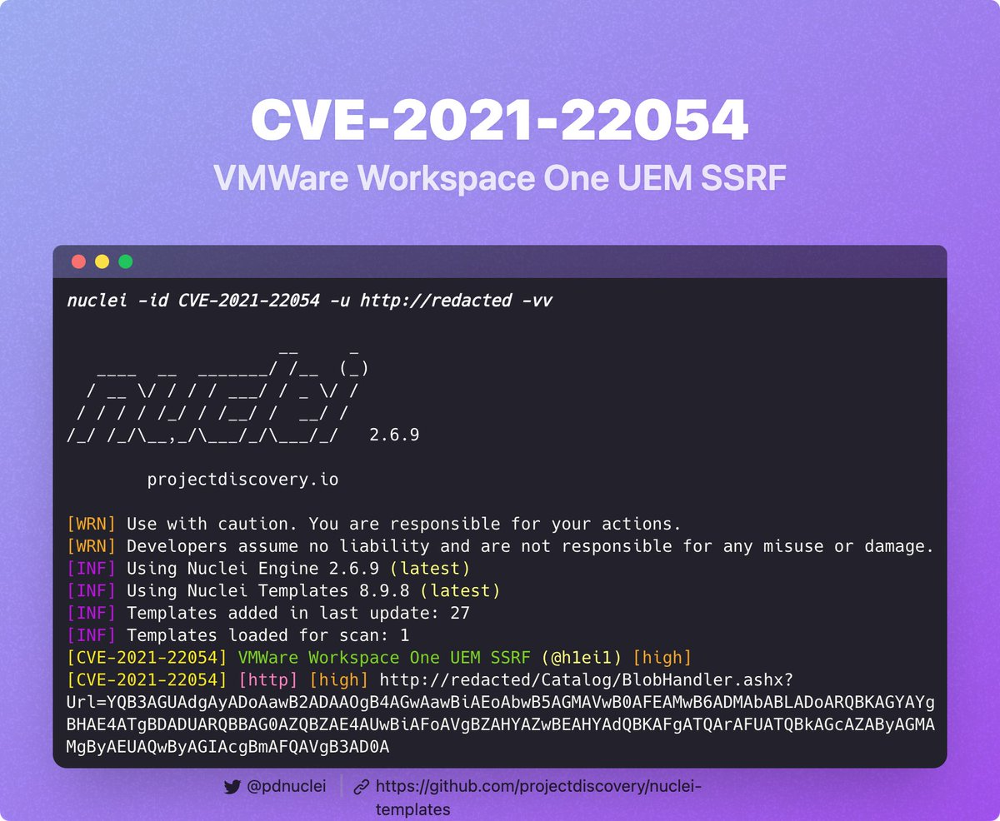</td>
</table></tr>
<table><tr>
<td>Quotes: <code>1</code></td>
<td>Replies: <code>3</code></td>
<td>Retweets: <code>18</code></td>
<td>Favorites: <code>88</code></td>
</tr></table>

---

# 0xBADCA7
**https://twitter.com/0xBADCA7/status/1519197496291237893 _at 2022-04-27, 06:11:23_**
<blockquote>
While looking into CVE-2022-0540, found perhaps the most user-friendly #SSRF in #Jira (along with a whole bunch of other bugs) https://t.co/SOMO4mabmk
</blockquote>

<table><tr>
<td>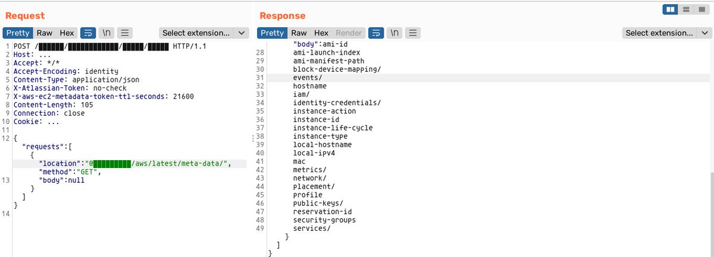</td>
</table></tr>
<table><tr>
<td>Quotes: <code>1</code></td>
<td>Replies: <code>6</code></td>
<td>Retweets: <code>37</code></td>
<td>Favorites: <code>240</code></td>
</tr></table>

---

# TheHackersNews
**https://twitter.com/TheHackersNews/status/1519155036101963776 _at 2022-04-27, 03:22:39_**
<blockquote>
#Microsoft discovers a set of two new root privilege escalation vulnerabilities affecting #Linux systems — tracked as CVE-2022-29799 &amp; CVE-2022-29800; and collectively called "Nimbuspwn," that can be exploited to perform malicious actions.

Read: https://t.co/XrQcZJwC9p

#infosec
</blockquote>

* https://thehackernews.com/2022/04/microsoft-discovers-new-privilege.html

<table><tr>
<td>Quotes: <code>6</code></td>
<td>Replies: <code>1</code></td>
<td>Retweets: <code>102</code></td>
<td>Favorites: <code>154</code></td>
</tr></table>

---

# Junior_Baines
**https://twitter.com/Junior_Baines/status/1518989229434540034 _at 2022-04-26, 16:23:48_**
<blockquote>
A little behind on this one, but here's a Metasploit module for the Redis sandbox escape RCE (CVE-2022-0543). PoC video and pcap within: https://t.co/jdLzt95ehm
</blockquote>

* https://github.com/rapid7/metasploit-framework/pull/16504

<table><tr>
<td>Quotes: <code>4</code></td>
<td>Replies: <code>2</code></td>
<td>Retweets: <code>56</code></td>
<td>Favorites: <code>173</code></td>
</tr></table>

---

# ptracesecurity
**https://twitter.com/ptracesecurity/status/1518032099852308480 _at 2022-04-24, 01:00:30_**
<blockquote>
WSO2 RCE (CVE-2022-29464) exploit and writeup.  https://t.co/0p2YbP9ETA  #Pentesting #CyberSecurity #Infosec https://t.co/wkVDYrYkfD
</blockquote>

* https://github.com/hakivvi/CVE-2022-29464

<table><tr>
<td>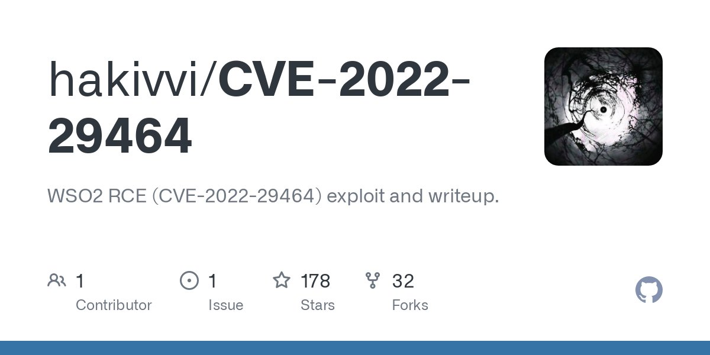</td>
<td>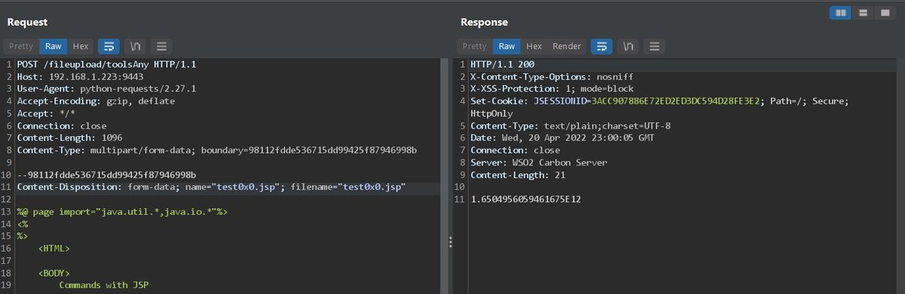</td>
</table></tr>
<table><tr>
<td>Quotes: <code>1</code></td>
<td>Replies: <code>1</code></td>
<td>Retweets: <code>36</code></td>
<td>Favorites: <code>111</code></td>
</tr></table>

---

# sunnynehrabro
**https://twitter.com/sunnynehrabro/status/1517737945343545344 _at 2022-04-23, 05:31:39_**
<blockquote>
Many organisations (even top ones) are affected by CVE-2022-29464 of WS02 and our govt (concerned departments) should announce a major notification (advisory) on the same.

An attacker can perform Unrestricted Arbitrary (desired) File Upload &amp; can get root access of the victims. https://t.co/1Nwsd9JhSL
</blockquote>

<table><tr>
<td>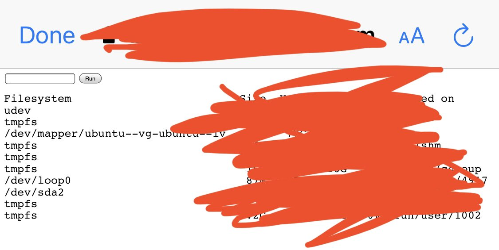</td>
</table></tr>
<table><tr>
<td>Quotes: <code>1</code></td>
<td>Replies: <code>2</code></td>
<td>Retweets: <code>7</code></td>
<td>Favorites: <code>51</code></td>
</tr></table>

---

# bad_packets
**https://twitter.com/bad_packets/status/1517727360958615552 _at 2022-04-23, 04:49:35_**
<blockquote>
⚠️ CVE-2022-29464 event detected ⚠️

Source IP:
37.19.221.142 (🇺🇸)

Target:
WSO2 API Manager and Identity Server endpoints vulnerable to unrestricted arbitrary file upload leading to remote code execution.

Vendor advisory:
https://t.co/7TOHOQIDR6
#threatintel https://t.co/gv0sOMhDkT
</blockquote>

* https://docs.wso2.com/display/Security/Security+Advisory+WSO2-2021-1738

<table><tr>
<td>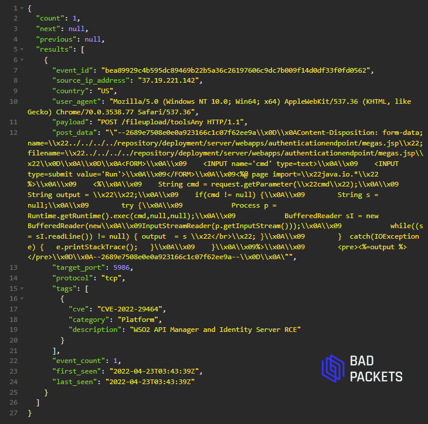</td>
</table></tr>
<table><tr>
<td>Quotes: <code>2</code></td>
<td>Replies: <code>1</code></td>
<td>Retweets: <code>26</code></td>
<td>Favorites: <code>56</code></td>
</tr></table>

---

# Dinosn
**https://twitter.com/Dinosn/status/1517723212263657474 _at 2022-04-23, 04:33:06_**
<blockquote>
WSO2 RCE (CVE-2022-29464) exploit and writeup https://t.co/nsrFdXoyrQ
</blockquote>

* https://www.reddit.com/r/netsec/comments/u9f88r/wso2_rce_cve202229464_exploit_and_writeup/

<table><tr>
<td>Quotes: <code>1</code></td>
<td>Replies: <code>0</code></td>
<td>Retweets: <code>25</code></td>
<td>Favorites: <code>59</code></td>
</tr></table>

---

# cyber_advising
**https://twitter.com/cyber_advising/status/1517259076140511233 _at 2022-04-21, 21:48:47_**
<blockquote>
CVE-2022-29464 is critical vulnerability on WSO2 discovered by @orange_8361 . the vulnerability is an unauthenticated unrestricted arbitrary file upload which allows unauthenticated attackers to gain RCE on WSO2 servers via uploading malicious files.
PoC
https://t.co/hI9AyiefqR https://t.co/cxVplXs1a9
</blockquote>

* https://github.com/hakivvi/CVE-2022-29464

<table><tr>
<td>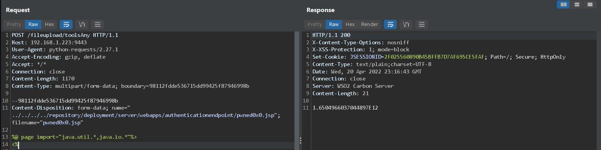</td>
</table></tr>
<table><tr>
<td>Quotes: <code>2</code></td>
<td>Replies: <code>0</code></td>
<td>Retweets: <code>31</code></td>
<td>Favorites: <code>91</code></td>
</tr></table>

---

# pdnuclei
**https://twitter.com/pdnuclei/status/1517226834676518912 _at 2022-04-21, 19:40:40_**
<blockquote>
Scan for CVE-2022-29464 (WSO2 Management - Unrestricted Arbitrary File Upload RCE) using nuclei template shared by @servantoflucy @DhiyaneshDK 

Template: https://t.co/C04XEZijUU

Advisory: https://t.co/F2Jd7HtBP6

#hackwithautomation https://t.co/FQme56p993
</blockquote>

* https://github.com/projectdiscovery/nuclei-templates/pull/4209
* https://docs.wso2.com/display/Security/Security+Advisory+WSO2-2021-1738

<table><tr>
<td></td>
</table></tr>
<table><tr>
<td>Quotes: <code>1</code></td>
<td>Replies: <code>1</code></td>
<td>Retweets: <code>45</code></td>
<td>Favorites: <code>153</code></td>
</tr></table>

---

# kmkz_security
**https://twitter.com/kmkz_security/status/1517028524196081664 _at 2022-04-21, 06:32:39_**
<blockquote>
Crypto3/Hydseven exploit chain: a Firefox RCE + sandbox escape. Links w/ the CVE-2019-11707 (RCE)+CVE-2019-11708 (sandbox escape) Firefox exploits were emailed at Coinbase in a phishing campaign targeting exclusively the FF browser on Win, Linux, Mac
https://t.co/dNWzat4h0U
</blockquote>

* https://github.com/forrest-orr/Exploits/tree/main/Chains/Hydseven

<table><tr>
<td>Quotes: <code>1</code></td>
<td>Replies: <code>2</code></td>
<td>Retweets: <code>42</code></td>
<td>Favorites: <code>90</code></td>
</tr></table>

---

# kmkz_security
**https://twitter.com/kmkz_security/status/1517011184066695168 _at 2022-04-21, 05:23:45_**
<blockquote>
Documentation and proof of concept code for CVE-2022-24125 and CVE-2022-24126 

-&gt; Chaining 2 vulns in Dark Souls 3 for RCE 
https://t.co/lJCgllEW1J
</blockquote>

* https://github.com/tremwil/ds3-nrssr-rce

<table><tr>
<td>Quotes: <code>1</code></td>
<td>Replies: <code>0</code></td>
<td>Retweets: <code>23</code></td>
<td>Favorites: <code>43</code></td>
</tr></table>

---

# vcslab
**https://twitter.com/vcslab/status/1516369262469738496 _at 2022-04-19, 10:52:59_**
<blockquote>
🔥 CVE-2022-29464 WSO2 Unauthen RCE analysis DONE 👌
Nice catch @hoangnx99 @_q5ca 💪💪💪 https://t.co/SHFkbCw0TA
</blockquote>

<table><tr>
<td>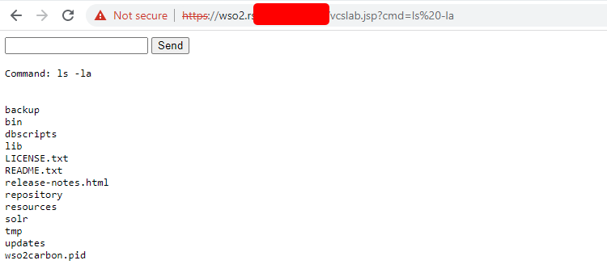</td>
<td>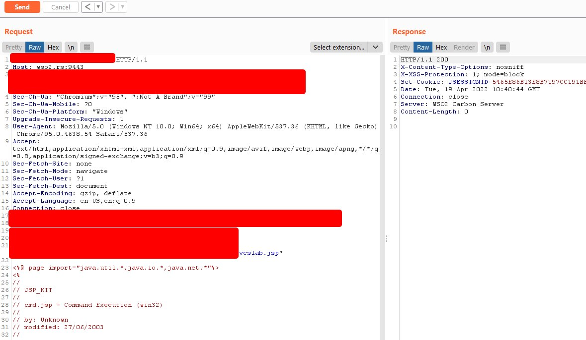</td>
</table></tr>
<table><tr>
<td>Quotes: <code>3</code></td>
<td>Replies: <code>3</code></td>
<td>Retweets: <code>75</code></td>
<td>Favorites: <code>258</code></td>
</tr></table>

---

# ptracesecurity
**https://twitter.com/ptracesecurity/status/1515102808961429507 _at 2022-04-15, 23:00:33_**
<blockquote>
Proof of Concept: CVE-2022-21907 HTTP Protocol Stack Remote Code Execution Vulnerability https://t.co/azsz7P8b3n #Pentesting #CVE #RCE #Vulnerability #CyberSecurity #Infosec https://t.co/1vwbKzxTpN
</blockquote>

* https://www.coresecurity.com/core-labs/articles/proof-concept-cve-2022-21907-http-protocol-stack-remote-code-execution

<table><tr>
<td>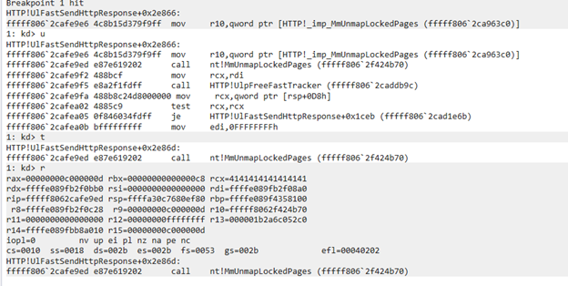</td>
<td>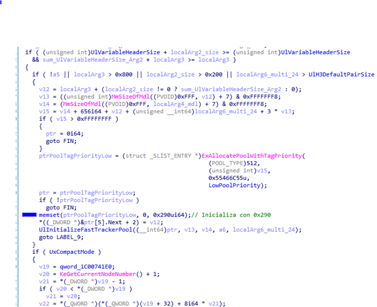</td>
<td>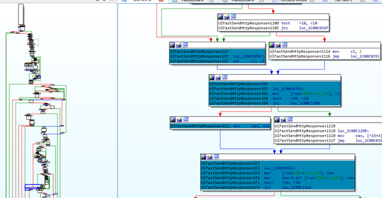</td>
<td>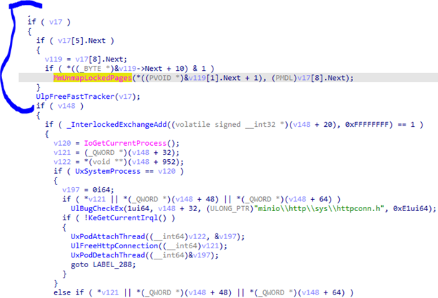</td>
</table></tr>
<table><tr>
<td>Quotes: <code>2</code></td>
<td>Replies: <code>0</code></td>
<td>Retweets: <code>48</code></td>
<td>Favorites: <code>81</code></td>
</tr></table>

---

# TheHackersNews
**https://twitter.com/TheHackersNews/status/1514807438125375489 _at 2022-04-15, 03:26:51_**
<blockquote>
⚡An urgent update for Google #Chrome browser has been released to patch a new zero-day security #vulnerability (CVE-2022-1364) that is being actively exploited by hackers.

Read details: https://t.co/qmn4lFkPiJ

#infosec #hackernews #cybersecurity #malware #cyberattack https://t.co/JBMe7SRJ8P
</blockquote>

* https://thehackernews.com/2022/04/google-releases-urgent-chrome-update-to.html

<table><tr>
<td>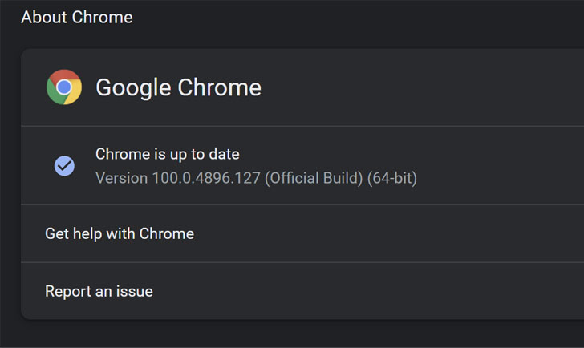</td>
</table></tr>
<table><tr>
<td>Quotes: <code>16</code></td>
<td>Replies: <code>3</code></td>
<td>Retweets: <code>132</code></td>
<td>Favorites: <code>213</code></td>
</tr></table>

---

# ShaneHuntley
**https://twitter.com/ShaneHuntley/status/1514719656619114506 _at 2022-04-14, 21:38:02_**
<blockquote>
Another Chrome 0day (CVE-2022-1364) in the wild found by @_clem1 . Reported to Chrome yesterday and updated release out now: https://t.co/JIboCmb0yJ

Incredibly impressive how fast @googlechrome is getting at rolling out fixes.
</blockquote>

* https://chromereleases.googleblog.com/2022/04/stable-channel-update-for-desktop_14.html

<table><tr>
<td>Quotes: <code>4</code></td>
<td>Replies: <code>7</code></td>
<td>Retweets: <code>88</code></td>
<td>Favorites: <code>166</code></td>
</tr></table>

---

# ptracesecurity
**https://twitter.com/ptracesecurity/status/1514672426268954628 _at 2022-04-14, 18:30:22_**
<blockquote>
CVE-2022-24527: Microsoft Connected Cache Local Privilege Escalation (Fixed)  https://t.co/Wc46XYwwwe  #Pentesting #CyberSecurity #Infosec https://t.co/4H6qfcf8tT
</blockquote>

* https://www.rapid7.com/blog/post/2022/04/12/cve-2022-24527-microsoft-connected-cache-local-privilege-escalation-fixed/

<table><tr>
<td>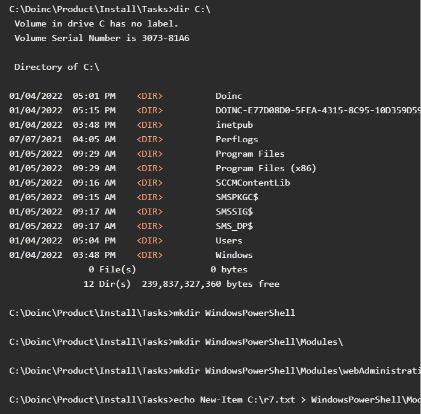</td>
</table></tr>
<table><tr>
<td>Quotes: <code>2</code></td>
<td>Replies: <code>0</code></td>
<td>Retweets: <code>30</code></td>
<td>Favorites: <code>54</code></td>
</tr></table>

---

# ollieatnccgroup
**https://twitter.com/ollieatnccgroup/status/1514489612114219008 _at 2022-04-14, 06:23:56_**
<blockquote>
So CVE-2022-26809 or Remote Procedure Call Runtime Remote Code Execution Vulnerability in Windows from yesterday...

Can it be triggered by RPC over HTTP in Exchange/OWA?

https://t.co/ROZQGYxScY
</blockquote>

* https://msrc.microsoft.com/update-guide/vulnerability/CVE-2022-26809

<table><tr>
<td>Quotes: <code>4</code></td>
<td>Replies: <code>5</code></td>
<td>Retweets: <code>17</code></td>
<td>Favorites: <code>109</code></td>
</tr></table>

---

# OphirHarpaz
**https://twitter.com/OphirHarpaz/status/1514358026668552197 _at 2022-04-13, 21:41:03_**
<blockquote>
Everyone's talking about the 9.8 RCE bug in Windows RPC runtime (CVE-2022-26809). @nachoskrnl bin-diffed rpcrt4.dll and located the integer overflow that was patched. Read about it here - https://t.co/jIakqMaDHh
Patch now, and ffs don't expose TCP 445 to the internet. https://t.co/Adj8tvctlA
</blockquote>

* https://www.akamai.com/blog/security/critical-remote-code-execution-vulnerabilities-windows-rpc-runtime

<table><tr>
<td>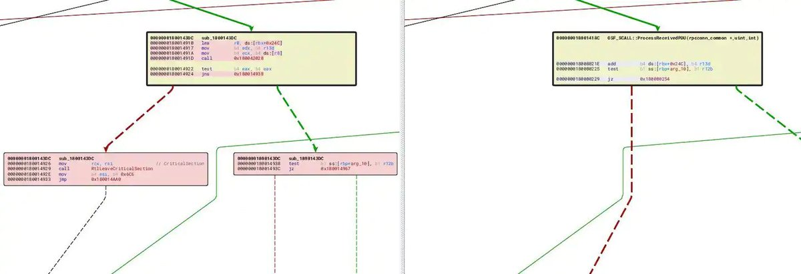</td>
</table></tr>
<table><tr>
<td>Quotes: <code>16</code></td>
<td>Replies: <code>9</code></td>
<td>Retweets: <code>336</code></td>
<td>Favorites: <code>810</code></td>
</tr></table>

---

# USCERT_gov
**https://twitter.com/USCERT_gov/status/1514333579559505922 _at 2022-04-13, 20:03:54_**
<blockquote>
Microsoft has released an advisory to address a critical #RCE vulnerability (CVE-2022-26809). Learn more at https://t.co/wWARlL8I1p. #Cybersecurity #InfoSec
</blockquote>

* https://go.usa.gov/xu46J

<table><tr>
<td>Quotes: <code>6</code></td>
<td>Replies: <code>0</code></td>
<td>Retweets: <code>89</code></td>
<td>Favorites: <code>119</code></td>
</tr></table>

---

# cyb3rops
**https://twitter.com/cyb3rops/status/1514307028201754625 _at 2022-04-13, 18:18:24_**
<blockquote>
Sigma rule to detect LPE reported in CVE-2022-24527

Report with PoC
https://t.co/ceHUcDIMar

Rule
https://t.co/TjsUaGKMWe https://t.co/m6gjBxP7Ze
</blockquote>

* https://www.rapid7.com/blog/post/2022/04/12/cve-2022-24527-microsoft-connected-cache-local-privilege-escalation-fixed/
* https://github.com/SigmaHQ/sigma/blob/master/rules/windows/file_event/file_event_win_cve_2022_24527_lpe.yml

<table><tr>
<td>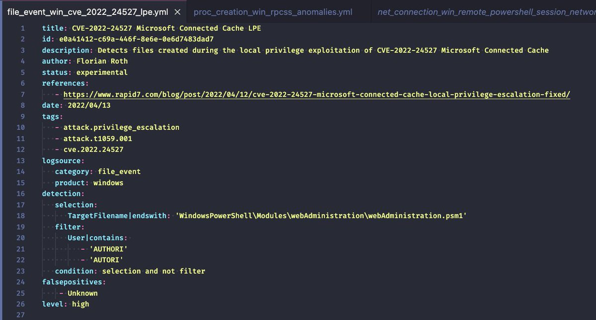</td>
</table></tr>
<table><tr>
<td>Quotes: <code>2</code></td>
<td>Replies: <code>1</code></td>
<td>Retweets: <code>29</code></td>
<td>Favorites: <code>97</code></td>
</tr></table>

---

# rapid7
**https://twitter.com/rapid7/status/1514243264190337026 _at 2022-04-13, 14:05:02_**
<blockquote>
Yesterday, Microsoft published CVE-2022-24527, a local privilege escalation vulnerability in Microsoft Connected Cache. Read more about exploitation and remediation in this blog write up from @Junior_Baines: https://t.co/9fV7Z5bzCi
</blockquote>

* https://r-7.co/3rngOEA

<table><tr>
<td>Quotes: <code>3</code></td>
<td>Replies: <code>0</code></td>
<td>Retweets: <code>20</code></td>
<td>Favorites: <code>37</code></td>
</tr></table>

---

# sherlocksecure
**https://twitter.com/sherlocksecure/status/1514167122293047304 _at 2022-04-13, 09:02:28_**
<blockquote>
What about #CVE-2022-26809? POC? Let's dig in!! A RCE via RPC (no information) #infosec #cybersecurity #microsoft #bugbounty 

Shodan Query: port:445 that's all...
</blockquote>

<table><tr>
<td>Quotes: <code>1</code></td>
<td>Replies: <code>1</code></td>
<td>Retweets: <code>10</code></td>
<td>Favorites: <code>85</code></td>
</tr></table>

---

# mikko
**https://twitter.com/mikko/status/1514143775819546626 _at 2022-04-13, 07:29:42_**
<blockquote>
PSA: Patch CVE-2022-26809 - Windows RPC remote code execution. Before we see Blaster worm all over again.
</blockquote>

<table><tr>
<td>Quotes: <code>5</code></td>
<td>Replies: <code>3</code></td>
<td>Retweets: <code>26</code></td>
<td>Favorites: <code>47</code></td>
</tr></table>

---

# l33d0hyun
**https://twitter.com/l33d0hyun/status/1514063211087396866 _at 2022-04-13, 02:09:34_**
<blockquote>
CVE-2022-24543: Windows Upgrade Assistant Remote Code Execution Vulnerability

I was assigned a second Microsoft Product Remote Code Execution CVE. https://t.co/zwIBNSB1vR
</blockquote>

<table><tr>
<td>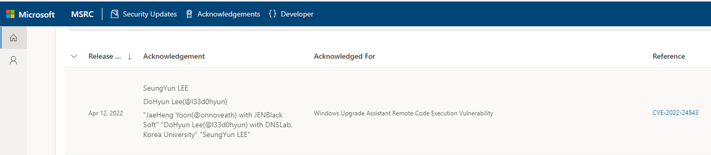</td>
</table></tr>
<table><tr>
<td>Quotes: <code>1</code></td>
<td>Replies: <code>2</code></td>
<td>Retweets: <code>36</code></td>
<td>Favorites: <code>211</code></td>
</tr></table>

---

# jorgeorchilles
**https://twitter.com/jorgeorchilles/status/1514063122566316037 _at 2022-04-13, 02:09:13_**
<blockquote>
CVE-2022-26809 looks really bad. Remote Procedure Call Runtime Remote Code Execution Vulnerability. Patch ASAP

https://t.co/ezprIockg7
</blockquote>

* https://msrc.microsoft.com/update-guide/vulnerability/CVE-2022-26809

<table><tr>
<td>Quotes: <code>10</code></td>
<td>Replies: <code>7</code></td>
<td>Retweets: <code>130</code></td>
<td>Favorites: <code>279</code></td>
</tr></table>

---

# hackerfantastic
**https://twitter.com/hackerfantastic/status/1514032353491959808 _at 2022-04-13, 00:06:57_**
<blockquote>
Microsoft Patch Tuesday includes an RPC service RCE... doesn't appear to be service specific, CVE-2022-26809.... this could end up being a very useful attack vector. Patch this urgently. https://t.co/fSG1PHOjwD
</blockquote>

<table><tr>
<td></td>
</table></tr>
<table><tr>
<td>Quotes: <code>3</code></td>
<td>Replies: <code>5</code></td>
<td>Retweets: <code>38</code></td>
<td>Favorites: <code>115</code></td>
</tr></table>

---

# Junior_Baines
**https://twitter.com/Junior_Baines/status/1514004288804204544 _at 2022-04-12, 22:15:25_**
<blockquote>
Here's a pretty obvious LPE I found in Microsoft Connected Cache (CVE-2022-24527): https://t.co/KWre7iUDpg
</blockquote>

* https://www.rapid7.com/blog/post/2022/04/12/cve-2022-24527-microsoft-connected-cache-local-privilege-escalation-fixed/

<table><tr>
<td>Quotes: <code>2</code></td>
<td>Replies: <code>1</code></td>
<td>Retweets: <code>48</code></td>
<td>Favorites: <code>152</code></td>
</tr></table>

---

# campuscodi
**https://twitter.com/campuscodi/status/1513938373362208772 _at 2022-04-12, 17:53:30_**
<blockquote>
The Microsoft Patch Tuesday security updates for April 2022 are out.

This month, MSFT has rolled out fixes for 145 security flaws, including a fix for an actively-exploited zero-day (CVE-2022-24521)

https://t.co/rxZ3ZYT6a2 https://t.co/cwGbpfG4q6
</blockquote>

* https://rawcdn.githack.com/campuscodi/Microsoft-Patch-Tuesday-Security-Reports/4ce397cd5236c01dd9767c1916fa71084702988e/Reports/MSRC_CVEs2022-Apr.html

<table><tr>
<td>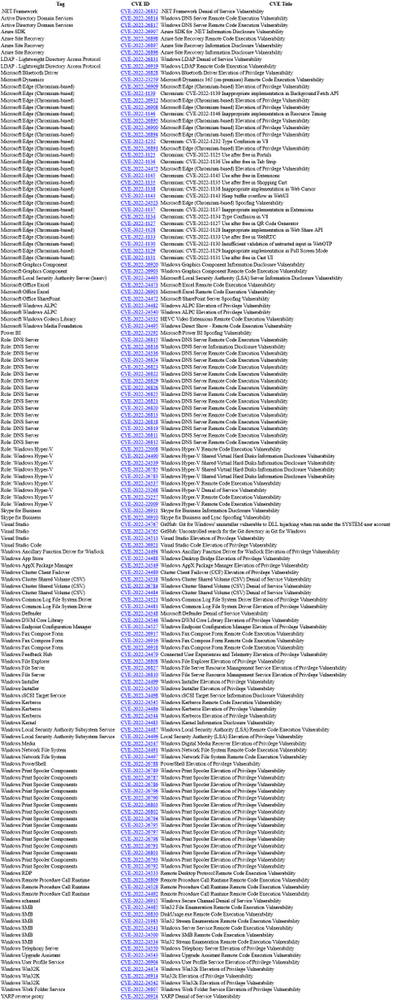</td>
</table></tr>
<table><tr>
<td>Quotes: <code>5</code></td>
<td>Replies: <code>1</code></td>
<td>Retweets: <code>49</code></td>
<td>Favorites: <code>98</code></td>
</tr></table>

---

# VirtualAllocEx
**https://twitter.com/VirtualAllocEx/status/1513758250969276418 _at 2022-04-12, 05:57:45_**
<blockquote>
Received my first CVE-2022-0354, local privilege escalation bug in @Lenovo Commercial Vantage Tool in context of specific update packages.

More details about the vulnerability on https://t.co/fSTsQDTNcZ

#itsec #infosecurity #infosec #redteam #pentest #hacking https://t.co/xBN1otqGDI
</blockquote>

* https://www.infosec.tirol/cve-2022-0354/

<table><tr>
<td>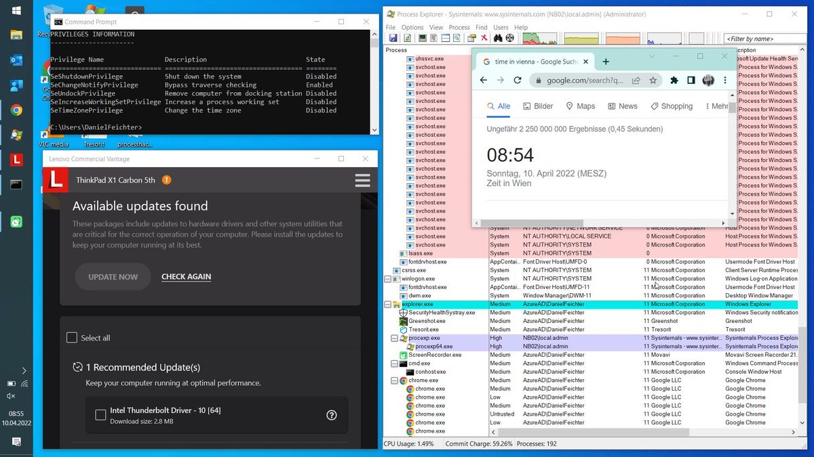</td>
</table></tr>
<table><tr>
<td>Quotes: <code>3</code></td>
<td>Replies: <code>5</code></td>
<td>Retweets: <code>91</code></td>
<td>Favorites: <code>231</code></td>
</tr></table>

---

# three_cube
**https://twitter.com/three_cube/status/1513180935226679298 _at 2022-04-10, 15:43:43_**
<blockquote>
Most of the Russian military is using Astra Linux, a distribution of Linux specifically designed for security. 

The DirtyPipe vulnerability ( CVE-2022-0847) makes it vulnerable to privilege escalation

https://t.co/fMp8gajE9g https://t.co/2yu77A0PXu
</blockquote>

* https://dirtypipe.cm4all.com

<table><tr>
<td></td>
</table></tr>
<table><tr>
<td>Quotes: <code>1</code></td>
<td>Replies: <code>0</code></td>
<td>Retweets: <code>14</code></td>
<td>Favorites: <code>40</code></td>
</tr></table>

---

# sourceincite
**https://twitter.com/sourceincite/status/1512907871700324361 _at 2022-04-09, 21:38:39_**
<blockquote>
The rumors are true, we will be including technical analysis of CVE-2022-22954 - VMware Workspace ONE Access Server-side Template Injection Remote Code Execution in our upcoming training!
</blockquote>

<table><tr>
<td>Quotes: <code>2</code></td>
<td>Replies: <code>0</code></td>
<td>Retweets: <code>14</code></td>
<td>Favorites: <code>64</code></td>
</tr></table>

---

# Y4er_ChaBug
**https://twitter.com/Y4er_ChaBug/status/1512619471399419909 _at 2022-04-09, 02:32:39_**
<blockquote>
VMware Workspace ONE Access and Identity Manager Server-side Template Injection Remote Code Execution Vulnerability (CVE-2022-22954) https://t.co/NSXBsKJiqu
</blockquote>

<table><tr>
<td>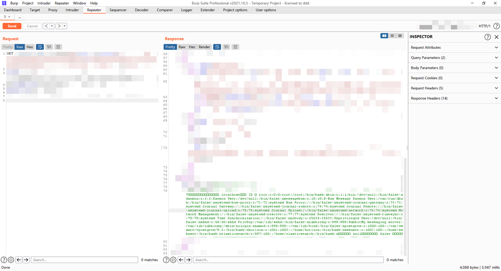</td>
</table></tr>
<table><tr>
<td>Quotes: <code>0</code></td>
<td>Replies: <code>5</code></td>
<td>Retweets: <code>34</code></td>
<td>Favorites: <code>190</code></td>
</tr></table>

---

# Yalujb
**https://twitter.com/Yalujb/status/1512273942203211782 _at 2022-04-08, 03:39:39_**
<blockquote>
CVE-2022-22639: Vulnerability could allow malicious actors to gain root privilege escalation. This issue is fixed in iOS 15.4. POC - https://t.co/GU3ucIgia2. https://t.co/3C0N5OPufW
</blockquote>

* https://github.com/jhftss/CVE-2022-22639

<table><tr>
<td>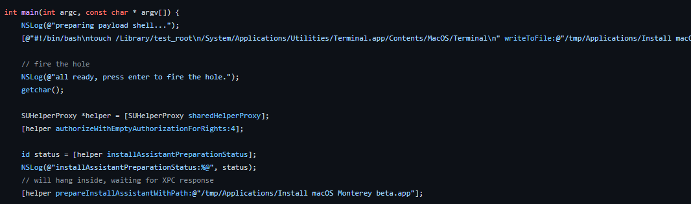</td>
</table></tr>
<table><tr>
<td>Quotes: <code>1</code></td>
<td>Replies: <code>5</code></td>
<td>Retweets: <code>19</code></td>
<td>Favorites: <code>164</code></td>
</tr></table>

---

# thezdi
**https://twitter.com/thezdi/status/1512095836729221131 _at 2022-04-07, 15:51:55_**
<blockquote>
CVE-2022-26381: @hosselot details triggering a #UAF bug in #Mozilla #Firefox. His write-up includes PoC, root cause, and a look at the fix. Read the details at https://t.co/ambx0trURA
</blockquote>

* https://www.zerodayinitiative.com/blog/2022/4/7/cve-2022-26381-gone-by-others-triggering-a-uaf-in-firefox

<table><tr>
<td>Quotes: <code>2</code></td>
<td>Replies: <code>0</code></td>
<td>Retweets: <code>43</code></td>
<td>Favorites: <code>165</code></td>
</tr></table>

---

# ptswarm
**https://twitter.com/ptswarm/status/1512083327884271619 _at 2022-04-07, 15:02:13_**
<blockquote>
🔥 We have reproduced the fresh CVE-2022-22954 Server-Side Template Injection in VMware Workspace ONE Access.

Successful exploitation could lead to RCE from an unauthenticated user.

Patch ASAP! https://t.co/FRfAD1VCN8
</blockquote>

<table><tr>
<td>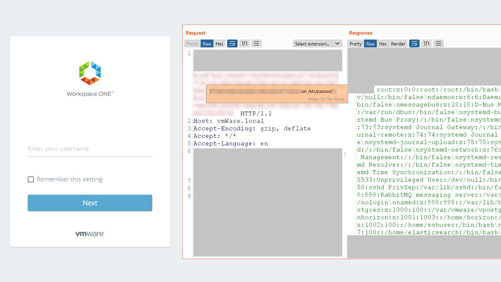</td>
</table></tr>
<table><tr>
<td>Quotes: <code>8</code></td>
<td>Replies: <code>7</code></td>
<td>Retweets: <code>212</code></td>
<td>Favorites: <code>561</code></td>
</tr></table>

---

# Haxatron1
**https://twitter.com/Haxatron1/status/1511366975943245825 _at 2022-04-05, 15:35:41_**
<blockquote>
Just finished writing up on an interesting vulnerability (CVE-2021-4119) I disclosed via @huntrdev, it involves an access control vulnerability where unauthenticated users can disclose user emails via SQL LIKE exploitaion in Bookstack prior to v21.11.3. 

https://t.co/sHdYlnLjfq
</blockquote>

* https://haxatron.gitbook.io/vulnerability-research/vr1

<table><tr>
<td>Quotes: <code>1</code></td>
<td>Replies: <code>3</code></td>
<td>Retweets: <code>15</code></td>
<td>Favorites: <code>63</code></td>
</tr></table>

---

# GossiTheDog
**https://twitter.com/GossiTheDog/status/1510901921657331716 _at 2022-04-04, 08:47:43_**
<blockquote>
Interesting one for Trend Micro customers - CVE-2022-26871

Exploited in the wild, Trend Micro Apex Central (on-premise and SaaS), being used for webshell deployment.

They don't mention but I've heard it was a zero day used for weeks to access customers.
https://t.co/U7zlMdLXse
</blockquote>

* https://success.trendmicro.com/dcx/s/solution/000290678?language=en_US

<table><tr>
<td>Quotes: <code>3</code></td>
<td>Replies: <code>5</code></td>
<td>Retweets: <code>34</code></td>
<td>Favorites: <code>122</code></td>
</tr></table>

---

# pqlqpql
**https://twitter.com/pqlqpql/status/1510108201483710467 _at 2022-04-02, 04:13:46_**
<blockquote>
Happy to finally publish my work on the two vulnerabilities in the Linux kernel I've found: CVE-2022-1015 and CVE-2022-1016! I'll be talking some background, a deeper look into nf_tables, and a local privilege escalation PoC!  (code on my github)

https://t.co/8cummKtTHT
</blockquote>

* https://blog.dbouman.nl/2022/04/02/How-The-Tables-Have-Turned-CVE-2022-1015-1016/

<table><tr>
<td>Quotes: <code>13</code></td>
<td>Replies: <code>20</code></td>
<td>Retweets: <code>426</code></td>
<td>Favorites: <code>1384</code></td>
</tr></table>

---

# cyber_advising
**https://twitter.com/cyber_advising/status/1509892248003043341 _at 2022-04-01, 13:55:39_**
<blockquote>
CVE-2022-22965: Spring4Shell: Security Analysis of the latest Java RCE '0-day' vulnerabilities in Spring
https://t.co/dEyDFCArou https://t.co/iSYf03YOMK
</blockquote>

* https://www.lunasec.io/docs/blog/spring-rce-vulnerabilities/

<table><tr>
<td></td>
</table></tr>
<table><tr>
<td>Quotes: <code>3</code></td>
<td>Replies: <code>0</code></td>
<td>Retweets: <code>46</code></td>
<td>Favorites: <code>135</code></td>
</tr></table>

---

# Unit42_Intel
**https://twitter.com/Unit42_Intel/status/1509699571244535811 _at 2022-04-01, 01:10:01_**
<blockquote>
#SpringShell (CVE-2022-22965) is a remote code execution vulnerability in the Spring Framework, used for building enterprise Java applications. Read our analysis and learn how to protect your organization. https://t.co/5gs5aJTEUv https://t.co/wYKrz55TK1
</blockquote>

* https://bit.ly/3IYmzyG

<table><tr>
<td></td>
</table></tr>
<table><tr>
<td>Quotes: <code>2</code></td>
<td>Replies: <code>3</code></td>
<td>Retweets: <code>22</code></td>
<td>Favorites: <code>31</code></td>
</tr></table>

---

