# Shadowserver
**https://twitter.com/Shadowserver/status/1553823393140580352 _at 2022-07-31, 19:22:20_**
<blockquote>
We first saw exploitation attempts in the wild for Apache Spark CVE-2022-33891 RCE July 26th. Exploitation is public &amp; trivial, though pre-conditions likely limit affected number of instances. If you run Spark, update:

https://t.co/AWxzHZUbSQ

NVD entry: https://t.co/MGz9oS8xdp
</blockquote>

* https://lists.apache.org/thread/p847l3kopoo5bjtmxrcwk21xp6tjxqlc
* https://nvd.nist.gov/vuln/detail/CVE-2022-33891

<table><tr>
<td>Quotes: <code>4</code></td>
<td>Replies: <code>1</code></td>
<td>Retweets: <code>29</code></td>
<td>Favorites: <code>53</code></td>
</tr></table>

---

# Vulnmachines
**https://twitter.com/Vulnmachines/status/1552943813714255873 _at 2022-07-29, 09:07:12_**
<blockquote>
CVE-2021-26084 : The OGNL injection vulnerability allows an unauthenticated user to execute arbitrary code on a Confluence Server or Data Center instance.
[PoC] : https://t.co/IWbGMQIMLK
Start your #pentesting Journey with us.
https://t.co/TKYo5q9VOB

#infosec #bugbountytips
</blockquote>

* https://youtu.be/RXLdWwAMjz8
* https://www.vulnmachines.com

<table><tr>
<td>Quotes: <code>2</code></td>
<td>Replies: <code>0</code></td>
<td>Retweets: <code>18</code></td>
<td>Favorites: <code>53</code></td>
</tr></table>

---

# starlabs_sg
**https://twitter.com/starlabs_sg/status/1552893294749057026 _at 2022-07-29, 05:46:27_**
<blockquote>
Our team member, @testanull , just made the PoC for CVE-2022-2185 available.
https://t.co/M8EcvjKfAY
It's related to https://t.co/6XNBPPZQAc
</blockquote>

* https://github.com/star-sg/CVE/tree/master/CVE-2022-2185
* https://starlabs.sg/blog/2022/07-gitlab-project-import-rce-analysis-cve-2022-2185/

<table><tr>
<td>Quotes: <code>1</code></td>
<td>Replies: <code>1</code></td>
<td>Retweets: <code>44</code></td>
<td>Favorites: <code>144</code></td>
</tr></table>

---

# h1pmnh
**https://twitter.com/h1pmnh/status/1552613522500161536 _at 2022-07-28, 11:14:44_**
<blockquote>
Awarded CVE-2022-36364 (https://t.co/yvSyEP2Lui), RCE in JDBC driver, on Apache Calcite Avatica project. Thanks to the Calcite PMC for working with me on responsible disclosure: https://t.co/ChmbAyoY47 - anyone exposing this driver to end users should upgrade.
</blockquote>

* https://cve.mitre.org/cgi-bin/cvename.cgi?name=CVE-2022-36364
* https://lists.apache.org/thread/5csdj8bv4h3hfgw27okm84jh1j2fyw0c

<table><tr>
<td>Quotes: <code>1</code></td>
<td>Replies: <code>2</code></td>
<td>Retweets: <code>12</code></td>
<td>Favorites: <code>46</code></td>
</tr></table>

---

# payloadartist
**https://twitter.com/payloadartist/status/1552324122935435265 _at 2022-07-27, 16:04:46_**
<blockquote>
⛓️ Awesome chain of bugs to exploit SQLi in WordPress Transposh plugin leading to $30k bounties

1⃣ Weak Default Configuration - CVE-2022-2461
2⃣ Unauthenticated XSS - CVE-2021-24911
3⃣ Blind SQL injection - CVE-2022-25811

https://t.co/FX0b646yJ7

#pentesting #BugBounty #hacking https://t.co/zhiU8QI4dd
</blockquote>

* https://www.rcesecurity.com/2022/07/WordPress-Transposh-Exploiting-a-Blind-SQL-Injection-via-XSS/

<table><tr>
<td>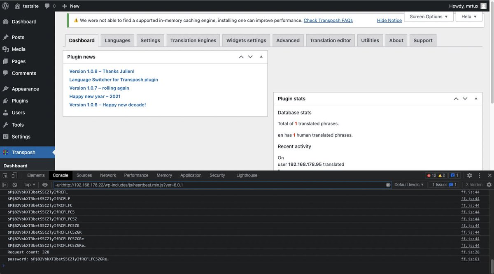</td>
</table></tr>
<table><tr>
<td>Quotes: <code>0</code></td>
<td>Replies: <code>1</code></td>
<td>Retweets: <code>30</code></td>
<td>Favorites: <code>72</code></td>
</tr></table>

---

# l33d0hyun
**https://twitter.com/l33d0hyun/status/1552265704187240449 _at 2022-07-27, 12:12:38_**
<blockquote>
My bug has been published!

CVE-2022-32816 : Apple Safari UI Spoofing Vulnerability

@SecuriTeam_SSD, @LabsSsd
</blockquote>

<table><tr>
<td>Quotes: <code>1</code></td>
<td>Replies: <code>0</code></td>
<td>Retweets: <code>11</code></td>
<td>Favorites: <code>46</code></td>
</tr></table>

---

# catc0n
**https://twitter.com/catc0n/status/1551650510452793345 _at 2022-07-25, 19:28:04_**
<blockquote>
Fantastic analysis of a command injection RCE (CVE-2022-2143) in Advantech iView courtesy of @SpaceySpacek 👀 https://t.co/9CA2ZmgHtN
</blockquote>

* https://attackerkb.com/assessments/43c07d86-44d8-4554-a895-bf40f9eb1a49?referrer=twttr

<table><tr>
<td>Quotes: <code>3</code></td>
<td>Replies: <code>0</code></td>
<td>Retweets: <code>21</code></td>
<td>Favorites: <code>65</code></td>
</tr></table>

---

# TheHackersNews
**https://twitter.com/TheHackersNews/status/1551175799340146688 _at 2022-07-24, 12:01:44_**
<blockquote>
Researchers have identified an XXE #vulnerability (CVE-2022-34001) in Unit4's Enterprise Resource Planning (ERP), a well-known enterprise management suite that includes financial and project management tools.

https://t.co/l4nbnhoq8B

#cybersecurity https://t.co/nIplttgeXv
</blockquote>

* https://prisminfosec.com/cve-2022-34001/

<table><tr>
<td>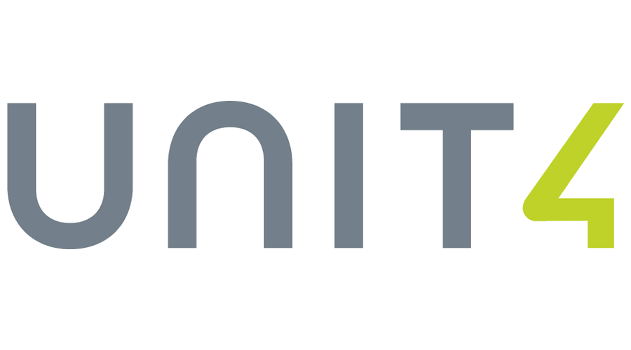</td>
</table></tr>
<table><tr>
<td>Quotes: <code>3</code></td>
<td>Replies: <code>1</code></td>
<td>Retweets: <code>25</code></td>
<td>Favorites: <code>53</code></td>
</tr></table>

---

# pdnuclei
**https://twitter.com/pdnuclei/status/1550889156301422592 _at 2022-07-23, 17:02:43_**
<blockquote>
Scanning for recently being mass exploited file upload vulnerability - CVE-2021-24284 (WordPress Kaswara Modern VC Addons pluing - File Upload RCE) using nuclei template shared by @pussycat0x

Template: https://t.co/FsI7wxZEFG

Source:
https://t.co/mtOvFr6vZT

#hackwithautomation https://t.co/4MOOHaPIdL
</blockquote>

* https://github.com/projectdiscovery/nuclei-templates/pull/4869
* https://thehackernews.com/2022/07/experts-notice-sudden-surge-in.html

<table><tr>
<td>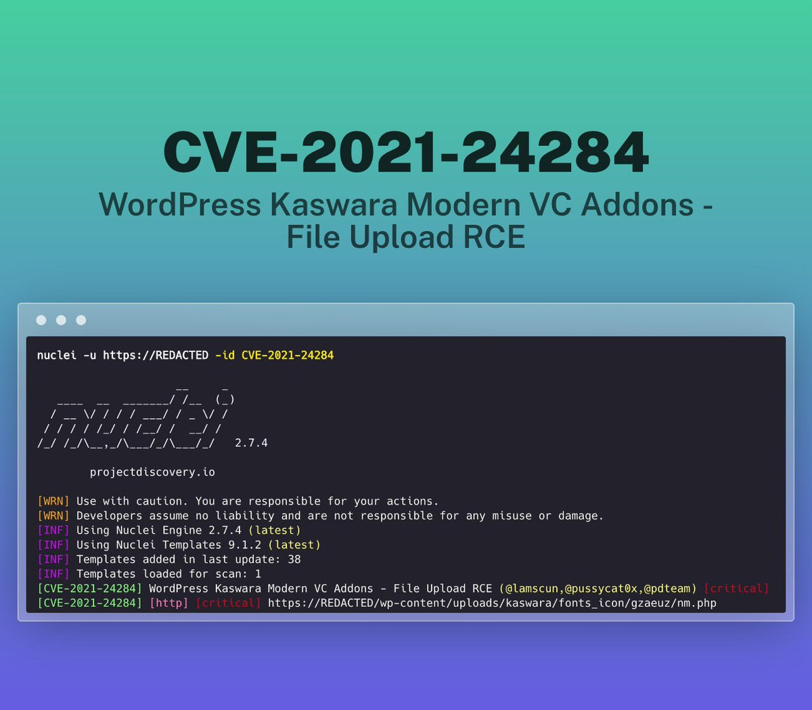</td>
</table></tr>
<table><tr>
<td>Quotes: <code>1</code></td>
<td>Replies: <code>0</code></td>
<td>Retweets: <code>22</code></td>
<td>Favorites: <code>89</code></td>
</tr></table>

---

# TheHackersNews
**https://twitter.com/TheHackersNews/status/1550370436747501568 _at 2022-07-22, 06:41:31_**
<blockquote>
Spyware sold by Israeli company #Candiru has been caught exploiting a recently discovered zero-day #vulnerability in #Google Chrome (CVE-2022-2294) to attack journalists.

Read details: https://t.co/Odu2f0URkX

#infosec #cybersecurity #hacking #malware #privacy
</blockquote>

* https://thehackernews.com/2022/07/candiru-spyware-caught-exploiting.html

<table><tr>
<td>Quotes: <code>4</code></td>
<td>Replies: <code>7</code></td>
<td>Retweets: <code>88</code></td>
<td>Favorites: <code>135</code></td>
</tr></table>

---

# TheHackersNews
**https://twitter.com/TheHackersNews/status/1550312808633749504 _at 2022-07-22, 02:52:31_**
<blockquote>
Gitlab Project Import RCE Analysis (CVE-2022-2185)

https://t.co/OlctfSkJM0

#infosec
</blockquote>

* https://starlabs.sg/blog/2022/07-gitlab-project-import-rce-analysis-cve-2022-2185/

<table><tr>
<td>Quotes: <code>2</code></td>
<td>Replies: <code>2</code></td>
<td>Retweets: <code>21</code></td>
<td>Favorites: <code>63</code></td>
</tr></table>

---

# GeoffreyHuntley
**https://twitter.com/GeoffreyHuntley/status/1550287484549943296 _at 2022-07-22, 01:11:53_**
<blockquote>
CVE-2022-244622: A local unauthenticated attacker within a @McDonalds could exploit this knowledge to pop calc.exe.

The default user on the terminals is Administrator and touch screen input is enabled. https://t.co/uG1pXG6iYb
</blockquote>

<table><tr>
<td></td>
</table></tr>
<table><tr>
<td>Quotes: <code>16</code></td>
<td>Replies: <code>15</code></td>
<td>Retweets: <code>81</code></td>
<td>Favorites: <code>228</code></td>
</tr></table>

---

# DahvidSchloss
**https://twitter.com/DahvidSchloss/status/1550181413353299971 _at 2022-07-21, 18:10:24_**
<blockquote>
Just dropped my first CVE. CVE-2022-42069 A privilege escalation exists where an unauthenticated user can escalate to an authenticated user by sending a specially crafted email and gathering the user/pass of the recipient. #Hacking
</blockquote>

<table><tr>
<td>Quotes: <code>6</code></td>
<td>Replies: <code>43</code></td>
<td>Retweets: <code>70</code></td>
<td>Favorites: <code>799</code></td>
</tr></table>

---

# AvastThreatLabs
**https://twitter.com/AvastThreatLabs/status/1550136415559761922 _at 2022-07-21, 15:11:36_**
<blockquote>
Candiru is back at it again, exploiting browser #0day in the Middle East. Read our latest blog post for more details about our discovery of CVE-2022-2294, a #vulnerability that affected Chrome, Edge, Safari, and others. https://t.co/JroEayxGY9
</blockquote>

* https://decoded.avast.io/janvojtesek/the-return-of-candiru-zero-days-in-the-middle-east/

<table><tr>
<td>Quotes: <code>4</code></td>
<td>Replies: <code>0</code></td>
<td>Retweets: <code>47</code></td>
<td>Favorites: <code>97</code></td>
</tr></table>

---

# sirifu4k1
**https://twitter.com/sirifu4k1/status/1550134309562249216 _at 2022-07-21, 15:03:14_**
<blockquote>
CVE-2022-26134 Vulnerability analysis - Critical severity unauthenticated remote code execution vulnerability in Confluence Server and Data Center 
#CVE #POC #confluence  https://t.co/ZASNjRpb4V
</blockquote>

* https://www.secpulse.com/archives/181830.html

<table><tr>
<td>Quotes: <code>1</code></td>
<td>Replies: <code>1</code></td>
<td>Retweets: <code>15</code></td>
<td>Favorites: <code>33</code></td>
</tr></table>

---

# megabeets_
**https://twitter.com/megabeets_/status/1550121359761555460 _at 2022-07-21, 14:11:46_**
<blockquote>
Two #0day exploits were used against targets in the Middle East, and led to the deployment of Candiru's #DevilsTongue spyware!

- Heap BOF in WebRTC, Chromium (CVE-2022-2294)
- LPE in a 3rd party driver

Great finding by the team @ @AvastThreatLabs!

https://t.co/03GtyS8Eno

&gt;&gt;
</blockquote>

* https://decoded.avast.io/janvojtesek/the-return-of-candiru-zero-days-in-the-middle-east/

<table><tr>
<td>Quotes: <code>4</code></td>
<td>Replies: <code>1</code></td>
<td>Retweets: <code>62</code></td>
<td>Favorites: <code>142</code></td>
</tr></table>

---

# starlabs_sg
**https://twitter.com/starlabs_sg/status/1550089927030755328 _at 2022-07-21, 12:06:52_**
<blockquote>
It's time for another "Show &amp; Tell" session by Meme master @testanull - Gitlab Project Import RCE Analysis (CVE-2022-2185)
@_jsoo_ thinks it was full of images and a lengthy blog post :P
Grateful for our co-worker, Frances for editing it.😘
https://t.co/6XNBPQgTCc
</blockquote>

* https://starlabs.sg/blog/2022/07-gitlab-project-import-rce-analysis-cve-2022-2185/

<table><tr>
<td>Quotes: <code>3</code></td>
<td>Replies: <code>2</code></td>
<td>Retweets: <code>29</code></td>
<td>Favorites: <code>107</code></td>
</tr></table>

---

# testanull
**https://twitter.com/testanull/status/1550089562349015042 _at 2022-07-21, 12:05:25_**
<blockquote>
Successfully reproduced the Gitlab Project Import RCE (CVE-2022-2185)
Got headache while reading Ruby for last 2 weeks, but it worth definitely digging in
Have good read!
https://t.co/MDWcIMfxTh
</blockquote>

* https://starlabs.sg/blog/2022/07-gitlab-project-import-rce-analysis-cve-2022-2185/

<table><tr>
<td>Quotes: <code>4</code></td>
<td>Replies: <code>5</code></td>
<td>Retweets: <code>116</code></td>
<td>Favorites: <code>309</code></td>
</tr></table>

---

# soheilhashemi_
**https://twitter.com/soheilhashemi_/status/1550065195896143873 _at 2022-07-21, 10:28:36_**
<blockquote>
LPE exploit for CVE-2022-34918. This exploit has been written for the kernel Linux ubuntu 5.15.0-39-generic

Blog:

https://t.co/30PhGTjHWj

POC:

https://t.co/rGcsbuhzPE

#Linux #LPE
</blockquote>

* https://www.randorisec.fr/crack-linux-firewall/
* https://github.com/randorisec/CVE-2022-34918-LPE-PoC

<table><tr>
<td>Quotes: <code>3</code></td>
<td>Replies: <code>2</code></td>
<td>Retweets: <code>69</code></td>
<td>Favorites: <code>156</code></td>
</tr></table>

---

# TheHackersNews
**https://twitter.com/TheHackersNews/status/1550038562459947008 _at 2022-07-21, 08:42:46_**
<blockquote>
#Atlassian has rolled out security patches to address a new critical hard-coded credentials #vulnerability (CVE-2022-26138) affecting the #Confluence app for Confluence Server and Confluence Data Center.

Details: https://t.co/YDUMVseBtZ

#infosec #cybersecurity #hacking
</blockquote>

* https://thehackernews.com/2022/07/atlassian-releases-patch-for-critical.html

<table><tr>
<td>Quotes: <code>4</code></td>
<td>Replies: <code>0</code></td>
<td>Retweets: <code>47</code></td>
<td>Favorites: <code>72</code></td>
</tr></table>

---

# 0xdea
**https://twitter.com/0xdea/status/1550015102966980610 _at 2022-07-21, 07:09:33_**
<blockquote>
A prime example of the whack-a-mole game of sandbox escaping (and yet another way to abuse python 🐍)

Uncovering a macOS App Sandbox escape vulnerability: A deep dive into CVE-2022-26706

https://t.co/pr7eLeLCXY
</blockquote>

* https://www.microsoft.com/security/blog/2022/07/13/uncovering-a-macos-app-sandbox-escape-vulnerability-a-deep-dive-into-cve-2022-26706/

<table><tr>
<td>Quotes: <code>1</code></td>
<td>Replies: <code>1</code></td>
<td>Retweets: <code>17</code></td>
<td>Favorites: <code>51</code></td>
</tr></table>

---

# l33d0hyun
**https://twitter.com/l33d0hyun/status/1549938793557692416 _at 2022-07-21, 02:06:19_**
<blockquote>
Apple Safari 2 Kill

CVE-2022-32787 : Apple Safari ICU Out-Of-Bounds Write Vulnerability
CVE-2022-32816 : Apple Safari UI Spoofing Vulnerability

https://t.co/jGEtUzXaJN https://t.co/MpH3qByben
</blockquote>

* https://support.apple.com/ko-kr/HT213346

<table><tr>
<td>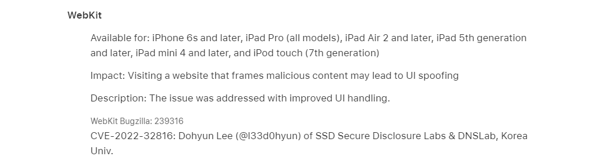</td>
<td>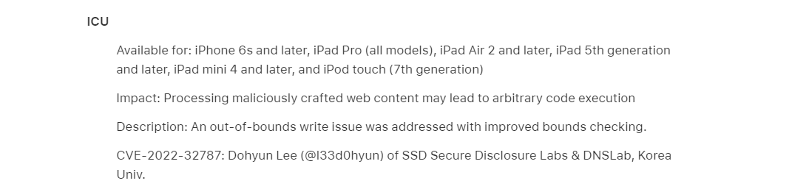</td>
</table></tr>
<table><tr>
<td>Quotes: <code>1</code></td>
<td>Replies: <code>2</code></td>
<td>Retweets: <code>9</code></td>
<td>Favorites: <code>52</code></td>
</tr></table>

---

# three_cube
**https://twitter.com/three_cube/status/1549902099520991232 _at 2022-07-20, 23:40:30_**
<blockquote>
13 of these F5 Big IP systems in Russia. 

Use this exploit to take them down!

#CVE-2022-1388 F5's BIG-IP Unauth RCE

Connection: keep-alive, X-F5-Auth-Token
Authorization: Basic YWRtaW46
X-F5-Auth-Token: anything

https://x.x.x.x:443/mgmt/tm/util/bash https://t.co/HPloQX1A2Y
</blockquote>

<table><tr>
<td></td>
</table></tr>
<table><tr>
<td>Quotes: <code>2</code></td>
<td>Replies: <code>1</code></td>
<td>Retweets: <code>11</code></td>
<td>Favorites: <code>47</code></td>
</tr></table>

---

# fluepke
**https://twitter.com/fluepke/status/1549892089181257729 _at 2022-07-20, 23:00:44_**
<blockquote>
Discovered by a fried of mine:

CVE-2022-26138: A remote, unauthenticated attacker with knowledge of the hardcoded password could exploit this to log into Confluence and access all content accessible to users in the confluence-users group

The password is disabled1system1user6708 https://t.co/6D3g8ZFxTn
</blockquote>

<table><tr>
<td></td>
</table></tr>
<table><tr>
<td>Quotes: <code>88</code></td>
<td>Replies: <code>27</code></td>
<td>Retweets: <code>532</code></td>
<td>Favorites: <code>1677</code></td>
</tr></table>

---

# sirifu4k1
**https://twitter.com/sirifu4k1/status/1549213318354571264 _at 2022-07-19, 02:03:32_**
<blockquote>
CVE-2022-33891 Apache Spark shell command injection #apache #CVE #Spark #RCE  https://t.co/Dmp52gFsm4
</blockquote>

* https://github.com/W01fh4cker/cve-2022-33891/blob/main/cve_2022_33891_poc.py

<table><tr>
<td>Quotes: <code>1</code></td>
<td>Replies: <code>1</code></td>
<td>Retweets: <code>58</code></td>
<td>Favorites: <code>105</code></td>
</tr></table>

---

# Alra3ees
**https://twitter.com/Alra3ees/status/1547983577291567104 _at 2022-07-15, 16:36:59_**
<blockquote>
CVE-2022-26135 - Full-Read Server Side Request Forgery in Mobile Plugin for Jira Data Center and Server
https://t.co/La2auEhpGN
</blockquote>

* https://github.com/assetnote/jira-mobile-ssrf-exploit

<table><tr>
<td>Quotes: <code>0</code></td>
<td>Replies: <code>3</code></td>
<td>Retweets: <code>9</code></td>
<td>Favorites: <code>49</code></td>
</tr></table>

---

# Dinosn
**https://twitter.com/Dinosn/status/1547902946720894981 _at 2022-07-15, 11:16:35_**
<blockquote>
CVE-2022-32224: Ruby on Rails Remote Code Execution Vulnerability https://t.co/DTibc0T5Hq
</blockquote>

* https://securityonline.info/cve-2022-32224-ruby-on-rails-remote-code-execution-vulnerability/

<table><tr>
<td>Quotes: <code>1</code></td>
<td>Replies: <code>0</code></td>
<td>Retweets: <code>11</code></td>
<td>Favorites: <code>42</code></td>
</tr></table>

---

# momika233
**https://twitter.com/momika233/status/1547809344200540160 _at 2022-07-15, 05:04:39_**
<blockquote>
CVE-2022-32119 - Arox-Unrestricted-File-Upload
https://t.co/QjbTLocXSH https://t.co/90bSATsIrL
</blockquote>

* https://github.com/JC175/CVE-2022-32119

<table><tr>
<td>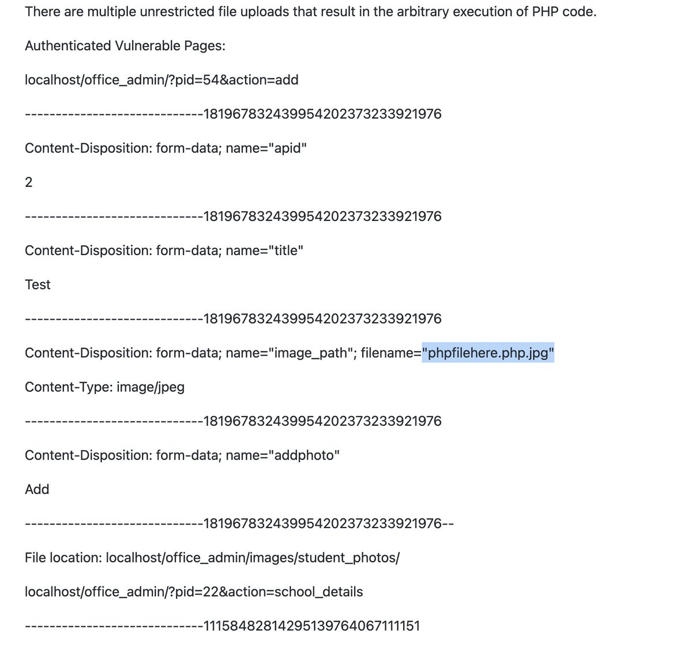</td>
</table></tr>
<table><tr>
<td>Quotes: <code>2</code></td>
<td>Replies: <code>3</code></td>
<td>Retweets: <code>55</code></td>
<td>Favorites: <code>138</code></td>
</tr></table>

---

# thezdi
**https://twitter.com/thezdi/status/1547617488552148992 _at 2022-07-14, 16:22:17_**
<blockquote>
Following up from last month, the Trend Micro Research Team returns with details about CVE-2022-30136 - another remote, unauthenticated RCE (at SYSTEM) in #NFS. They cover the root cause and offer detection guidance. Read all the details at https://t.co/Pga8lJLjZ5
</blockquote>

* https://www.zerodayinitiative.com/blog/2022/7/13/cve-2022-30136-microsoft-windows-network-file-system-v4-remote-code-execution-vulnerability

<table><tr>
<td>Quotes: <code>3</code></td>
<td>Replies: <code>0</code></td>
<td>Retweets: <code>43</code></td>
<td>Favorites: <code>79</code></td>
</tr></table>

---

# TheHackersNews
**https://twitter.com/TheHackersNews/status/1547535206256885760 _at 2022-07-14, 10:55:19_**
<blockquote>
#Microsoft has disclosed details of a now-patched #vulnerability (CVE-2022-26706) in #Apple operating systems — #iOS, iPadOS, #macOS, tvOS and watchOS — that could allow attackers to escalate privileges and deploy #malware.

Read: https://t.co/fbUhrppdKV

#infosec #cybersecurity
</blockquote>

* https://thehackernews.com/2022/07/microsoft-details-app-sandbox-escape.html

<table><tr>
<td>Quotes: <code>4</code></td>
<td>Replies: <code>4</code></td>
<td>Retweets: <code>79</code></td>
<td>Favorites: <code>124</code></td>
</tr></table>

---

# MsftSecIntel
**https://twitter.com/MsftSecIntel/status/1547252013192331266 _at 2022-07-13, 16:10:01_**
<blockquote>
We uncovered a vulnerability that could allow specially crafted codes to escape the macOS App Sandbox and run unrestricted on the system. Apple patched this vulnerability (CVE-2022-26706) in May. This blog details our research that led to this discovery: https://t.co/7JUyb3q7Jm
</blockquote>

* https://msft.it/6015bN0sx

<table><tr>
<td>Quotes: <code>5</code></td>
<td>Replies: <code>4</code></td>
<td>Retweets: <code>75</code></td>
<td>Favorites: <code>126</code></td>
</tr></table>

---

# TheZDIBugs
**https://twitter.com/TheZDIBugs/status/1547217782130999297 _at 2022-07-13, 13:53:59_**
<blockquote>
[ZDI-22-973|CVE-2022-22034] Microsoft Windows win32kfull UMPDDrvTransparentBlt Use-After-Free Local Privilege Escalation Vulnerability (CVSS 8.8) https://t.co/ep1EECJ8bV
</blockquote>

* https://www.zerodayinitiative.com/advisories/ZDI-22-973/

<table><tr>
<td>Quotes: <code>1</code></td>
<td>Replies: <code>1</code></td>
<td>Retweets: <code>18</code></td>
<td>Favorites: <code>47</code></td>
</tr></table>

---

# GossiTheDog
**https://twitter.com/GossiTheDog/status/1546916355772907525 _at 2022-07-12, 17:56:14_**
<blockquote>
CVE-2022-30222 - Windows Shell Remote Code Execution Vulnerability

This will be a fun one to reverse engineer.  If you have Japanese language pack installed, you can use the IME to gain SYSTEM rights from the login screen it appears.  (Think the RDP login screen). Risky 4 japan.
</blockquote>

<table><tr>
<td>Quotes: <code>2</code></td>
<td>Replies: <code>1</code></td>
<td>Retweets: <code>11</code></td>
<td>Favorites: <code>47</code></td>
</tr></table>

---

# campuscodi
**https://twitter.com/campuscodi/status/1546913198569390080 _at 2022-07-12, 17:43:41_**
<blockquote>
The Microsoft Patch Tuesday for July 2022 is out:

-86 vulnerabilities patched
-one actively exploited zero-day included (CVE-2022-22047)

[repost because I'm blind, didn't see the zero-day]

https://t.co/axtGSVFRf6 https://t.co/BHLg8e0X6j
</blockquote>

* https://rawcdn.githack.com/campuscodi/Microsoft-Patch-Tuesday-Security-Reports/ae0b10fc8bfefefb0cec726e6c30556508f4c32d/Reports/MSRC_CVEs2022-Jul.html

<table><tr>
<td>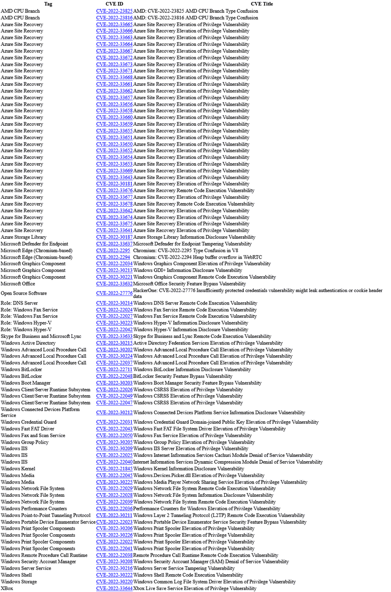</td>
</table></tr>
<table><tr>
<td>Quotes: <code>1</code></td>
<td>Replies: <code>0</code></td>
<td>Retweets: <code>21</code></td>
<td>Favorites: <code>50</code></td>
</tr></table>

---

# Securityblog
**https://twitter.com/Securityblog/status/1546399704652603392 _at 2022-07-11, 07:43:14_**
<blockquote>
CVE-2022-28219: Unauthenticated XXE to RCE and Domain Compromise in ManageEngine ADAudit Plus – https://t.co/fIzSrTltVW https://t.co/QGDMHMagV2
</blockquote>

* http://Horizon3.ai
* https://www.horizon3.ai/red-team-blog-cve-2022-28219/

<table><tr>
<td>Quotes: <code>3</code></td>
<td>Replies: <code>2</code></td>
<td>Retweets: <code>84</code></td>
<td>Favorites: <code>282</code></td>
</tr></table>

---

# cyber_advising
**https://twitter.com/cyber_advising/status/1545055784152625153 _at 2022-07-07, 14:42:59_**
<blockquote>
CVE-2022-26135 - Full-Read Server Side Request Forgery in Mobile Plugin for Jira Data Center and Server...

PoC
https://t.co/SuuWk2ThBX https://t.co/AUC4fYucE4
</blockquote>

* https://github.com/assetnote/jira-mobile-ssrf-exploit

<table><tr>
<td>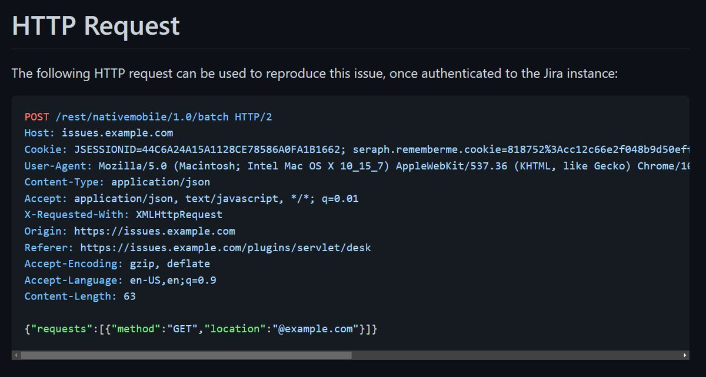</td>
</table></tr>
<table><tr>
<td>Quotes: <code>1</code></td>
<td>Replies: <code>0</code></td>
<td>Retweets: <code>33</code></td>
<td>Favorites: <code>79</code></td>
</tr></table>

---

# cyber_advising
**https://twitter.com/cyber_advising/status/1545055486029938692 _at 2022-07-07, 14:41:48_**
<blockquote>
CVE-2022-34265: An issue was discovered in Django 3.2 before 3.2.14 and 4.0 before 4.0.6. The Trunc() and Extract() database functions are subject to SQL injection...

PoC
https://t.co/QeA8u67o5J https://t.co/bHGGVaEDbi
</blockquote>

* https://github.com/aeyesec/CVE-2022-34265

<table><tr>
<td>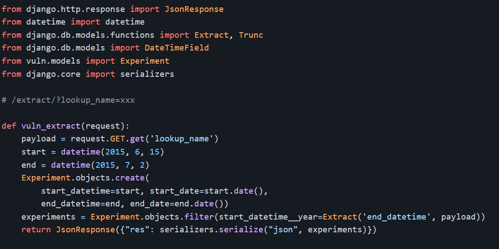</td>
</table></tr>
<table><tr>
<td>Quotes: <code>2</code></td>
<td>Replies: <code>0</code></td>
<td>Retweets: <code>61</code></td>
<td>Favorites: <code>157</code></td>
</tr></table>

---

# iagox86
**https://twitter.com/iagox86/status/1544444796072185856 _at 2022-07-05, 22:15:08_**
<blockquote>
My analysis of CVE-2022-28219 - a ManageEngine ADAudit Plus RCE.

I learned a lot from @Horizon3Attack's writeup - I only had vague awareness of what you could do with XXE, this blew my mind! Props to them on their great exploit chain

https://t.co/lrBSLNmqs5
</blockquote>

* https://attackerkb.com/topics/Zx3qJlmRGY/cve-2022-28219/rapid7-analysis

<table><tr>
<td>Quotes: <code>2</code></td>
<td>Replies: <code>1</code></td>
<td>Retweets: <code>29</code></td>
<td>Favorites: <code>75</code></td>
</tr></table>

---

# infosec_au
**https://twitter.com/infosec_au/status/1544437538399862784 _at 2022-07-05, 21:46:18_**
<blockquote>
The security research team at @assetnote discovered a high risk SSRF vulnerability in Jira Server and Datacenter - CVE-2022-26135. This SSRF allows attackers to make requests with any HTTP method, headers and body. You can read about it here: https://t.co/mUehIRuf17
</blockquote>

* https://blog.assetnote.io/2022/06/26/exploiting-ssrf-in-jira/

<table><tr>
<td>Quotes: <code>6</code></td>
<td>Replies: <code>8</code></td>
<td>Retweets: <code>155</code></td>
<td>Favorites: <code>503</code></td>
</tr></table>

---

# campuscodi
**https://twitter.com/campuscodi/status/1544289927877332995 _at 2022-07-05, 11:59:44_**
<blockquote>
Google released Chrome v103.0.5060.114 for Windows users to patch an actively exploited zero-day (CVE-2022-2294).

The vulnerability was described as a heap buffer overflow in Chrome's WebRTC component and was found by Jan Vojtesek from security firm Avast last Friday. https://t.co/lZKHfi2ldQ
</blockquote>

<table><tr>
<td>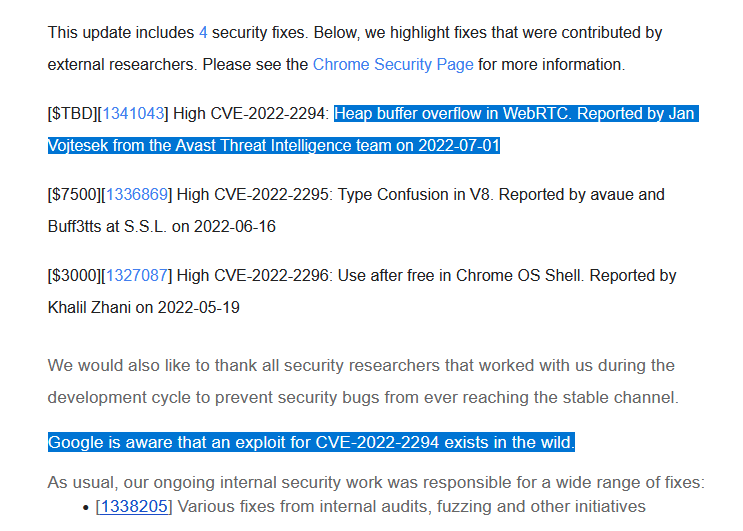</td>
</table></tr>
<table><tr>
<td>Quotes: <code>4</code></td>
<td>Replies: <code>1</code></td>
<td>Retweets: <code>48</code></td>
<td>Favorites: <code>93</code></td>
</tr></table>

---

# TheHackersNews
**https://twitter.com/TheHackersNews/status/1544153367189958656 _at 2022-07-05, 02:57:06_**
<blockquote>
UPDATE your #Google Chrome browser for Windows, #macOS, #Linux and #Android devices to patch a newly discovered high-severity zero-day #vulnerability (CVE-2022-2294) that is being exploited in the wild.

Details: https://t.co/KWFVecr1d7

#infosec #cybersecurity #hacking #technews
</blockquote>

* https://thehackernews.com/2022/07/update-google-chrome-browser-to-patch.html

<table><tr>
<td>Quotes: <code>14</code></td>
<td>Replies: <code>7</code></td>
<td>Retweets: <code>203</code></td>
<td>Favorites: <code>243</code></td>
</tr></table>

---

# hackinparis
**https://twitter.com/hackinparis/status/1542825470550491137 _at 2022-07-01, 11:00:31_**
<blockquote>
@egeblc showed us how to abuse #rsync tool functionality in order to achieve remote code execution (disclosed as CVE-2022-29154), this vulnerability allows to write/overwrite arbitrary files on clients and could lead to silent lateral movement within networks.

#CyberSecurity https://t.co/eLRtCV9Y3E
</blockquote>

<table><tr>
<td>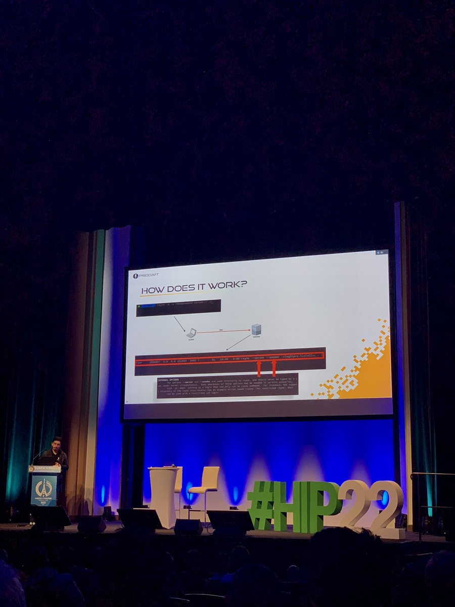</td>
<td></td>
<td>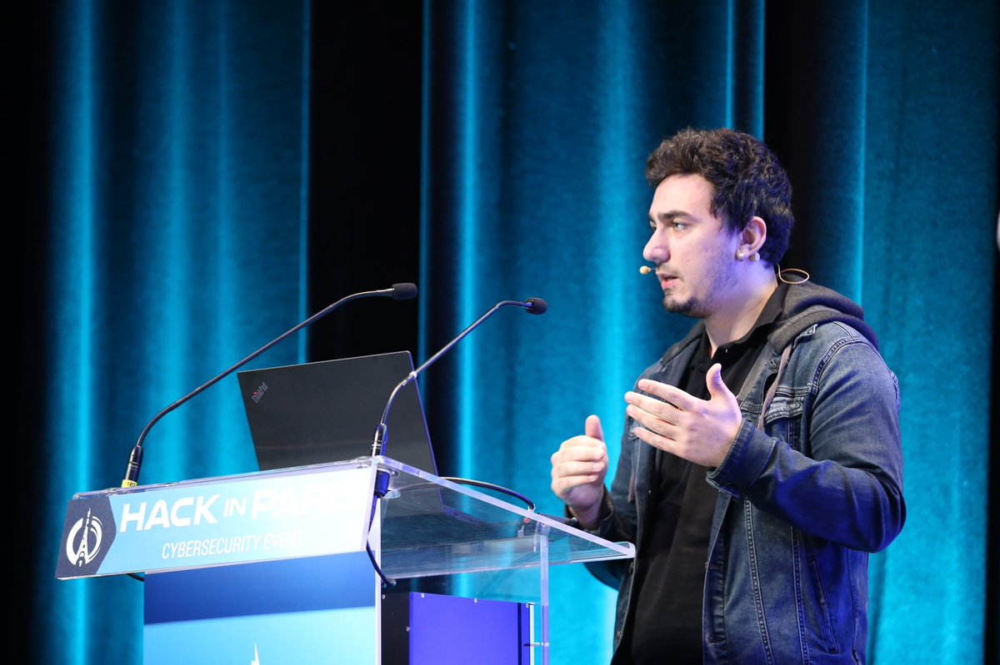</td>
<td>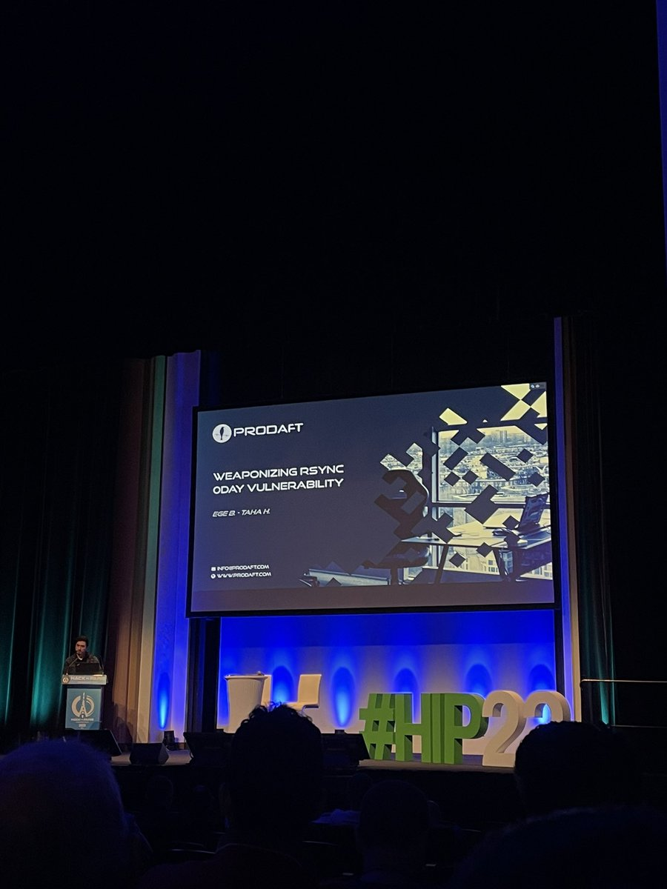</td>
</table></tr>
<table><tr>
<td>Quotes: <code>0</code></td>
<td>Replies: <code>1</code></td>
<td>Retweets: <code>7</code></td>
<td>Favorites: <code>59</code></td>
</tr></table>

---

