# 0xrobiul
**https://twitter.com/0xrobiul/status/1570636852952178691 _at 2022-09-16, 04:53:01_**
<blockquote>
New #WordPress #0Day #BackupBuddy Plugin #LFI
#CVE-2022-31474 At A Scale!

#BugBounty #BugBountyTips #CyberSecurity #InfoSec #0xRobiul https://t.co/ohl7kSWRAr
</blockquote>

<table><tr>
<td>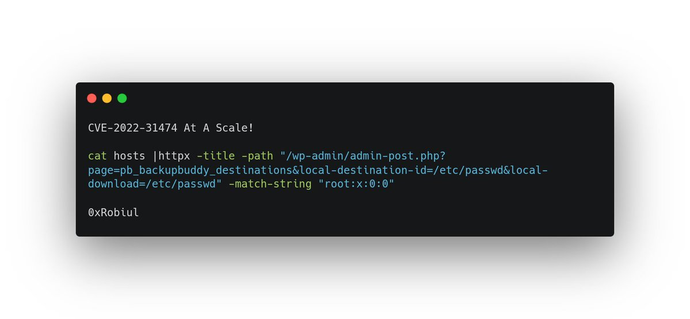</td>
</table></tr>
<table><tr>
<td>Quotes: <code>1</code></td>
<td>Replies: <code>2</code></td>
<td>Retweets: <code>21</code></td>
<td>Favorites: <code>50</code></td>
</tr></table>

---

# SwiftOnSecurity
**https://twitter.com/SwiftOnSecurity/status/1570582477886062592 _at 2022-09-16, 01:16:57_**
<blockquote>
PUBLIC NOTE:
I am working multiple paths on clarifying Microsoft guidance for CVE-2022-34718, both internally and what I can say publicly. For now, your message is PATCH. It's free even Win7/2008.
Please DO NOT fuck around with OS internals preemptively. DIRECT - MSFT engineers.
</blockquote>

<table><tr>
<td>Quotes: <code>8</code></td>
<td>Replies: <code>4</code></td>
<td>Retweets: <code>36</code></td>
<td>Favorites: <code>167</code></td>
</tr></table>

---

# campuscodi
**https://twitter.com/campuscodi/status/1570485373683507201 _at 2022-09-15, 18:51:05_**
<blockquote>
Security firm 78ResearchLab has published a proof-of-concept exploit for CVE-2022-34721, a remote code execution vulnerability in Windows' IKE protocol extensions

https://t.co/WbqhC9BTyy https://t.co/reSZK11HD0
</blockquote>

* https://github.com/78ResearchLab/PoC/tree/main/CVE-2022-34721

<table><tr>
<td>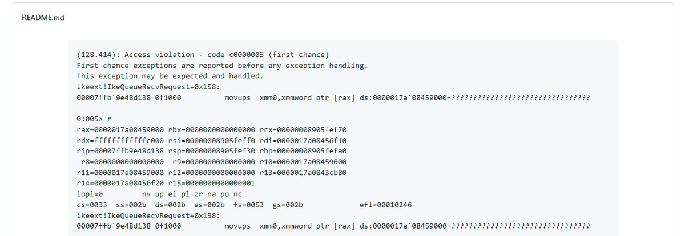</td>
</table></tr>
<table><tr>
<td>Quotes: <code>6</code></td>
<td>Replies: <code>4</code></td>
<td>Retweets: <code>77</code></td>
<td>Favorites: <code>169</code></td>
</tr></table>

---

# Dinosn
**https://twitter.com/Dinosn/status/1570293136840171524 _at 2022-09-15, 06:07:13_**
<blockquote>
Researcher releases PoC code for Windows IKE RCE (CVE-2022-34721) https://t.co/AkDa3FCmxK
</blockquote>

* https://securityonline.info/researcher-releases-poc-code-for-windows-ike-rce-cve-2022-34721/

<table><tr>
<td>Quotes: <code>2</code></td>
<td>Replies: <code>0</code></td>
<td>Retweets: <code>23</code></td>
<td>Favorites: <code>52</code></td>
</tr></table>

---

# fluepke
**https://twitter.com/fluepke/status/1570009150452826112 _at 2022-09-14, 11:18:45_**
<blockquote>
CVE-2022-34718 is gonna spark hatred and myths about #IPv6.

My personal recommendation is to also disable IPv4 if you already disabled IPv6 for safety reasons, just to be 100% sure.
</blockquote>

<table><tr>
<td>Quotes: <code>4</code></td>
<td>Replies: <code>19</code></td>
<td>Retweets: <code>37</code></td>
<td>Favorites: <code>267</code></td>
</tr></table>

---

# Dinosn
**https://twitter.com/Dinosn/status/1569959238474031104 _at 2022-09-14, 08:00:25_**
<blockquote>
CVE-2022-35405 Manage engines RCE (Password Manager Pro, PAM360 and Access Manager Plus)  https://t.co/Yv3i4bHHjF PoC https://t.co/iAssi44gbF
</blockquote>

* https://www.bigous.me/2022/09/06/CVE-2022-35405.html
* https://github.com/viniciuspereiras/CVE-2022-35405

<table><tr>
<td>Quotes: <code>1</code></td>
<td>Replies: <code>0</code></td>
<td>Retweets: <code>13</code></td>
<td>Favorites: <code>48</code></td>
</tr></table>

---

# TheHackersNews
**https://twitter.com/TheHackersNews/status/1569913849960341506 _at 2022-09-14, 05:00:04_**
<blockquote>
Other critical flaws of note are:

CVE-2022-34718 - Windows TCP/IP RCE
CVE-2022-34721 - Windows IKE Protocol Extensions RCE
CVE-2022-34722 - Windows IKE Protocol Extensions RCE
CVE-2022-34700 - Dynamics 365 (on-premises) RCE
CVE-2022-35805 - Dynamics 365 (on-premises) RCE
</blockquote>

<table><tr>
<td>Quotes: <code>5</code></td>
<td>Replies: <code>1</code></td>
<td>Retweets: <code>32</code></td>
<td>Favorites: <code>76</code></td>
</tr></table>

---

# TheHackersNews
**https://twitter.com/TheHackersNews/status/1569913405783552000 _at 2022-09-14, 04:58:18_**
<blockquote>
The actively exploited #vulnerability (CVE-2022-37969) is a privilege escalation issue affecting the Windows Common Log File System (CLFS) driver that could be exploited to gain SYSTEM on compromised systems.
</blockquote>

<table><tr>
<td>Quotes: <code>1</code></td>
<td>Replies: <code>1</code></td>
<td>Retweets: <code>26</code></td>
<td>Favorites: <code>47</code></td>
</tr></table>

---

# netspooky
**https://twitter.com/netspooky/status/1569849045127929858 _at 2022-09-14, 00:42:33_**
<blockquote>
CVE-2022-34718 FAQ

How could an attacker exploit this vulnerability?

An unauthenticated attacker could send a specially crafted IPv6 packet to a Windows node where IPSec is enabled, which could enable a remote code execution exploitation on that machine.
https://t.co/WKO2tWTK58 https://t.co/Y4ZT6U63xO
</blockquote>

* https://msrc.microsoft.com/update-guide/en-US/vulnerability/CVE-2022-34718

<table><tr>
<td></td>
</table></tr>
<table><tr>
<td>Quotes: <code>1</code></td>
<td>Replies: <code>3</code></td>
<td>Retweets: <code>21</code></td>
<td>Favorites: <code>72</code></td>
</tr></table>

---

# __kokumoto
**https://twitter.com/__kokumoto/status/1569829884427665408 _at 2022-09-13, 23:26:25_**
<blockquote>
WordPressのプラグインWPGatewayのゼロデイが悪用されている。権限昇格の脆弱性(CVE-2022-3180)で、認証されていない攻撃者がadminになれる。9/8にWordfenceが発見。パッチ提供されるまでの無効化を推奨。 https://t.co/Z61Oe0Tvpr
</blockquote>

* https://www.bleepingcomputer.com/news/security/zero-day-in-wpgateway-wordpress-plugin-actively-exploited-in-attacks/

<table><tr>
<td>Quotes: <code>4</code></td>
<td>Replies: <code>0</code></td>
<td>Retweets: <code>31</code></td>
<td>Favorites: <code>42</code></td>
</tr></table>

---

# gsuberland
**https://twitter.com/gsuberland/status/1569820019072139267 _at 2022-09-13, 22:47:13_**
<blockquote>
CVE-2022-34718: An unauthenticated attacker could send a specially crafted IPv6 packet to a Windows node where IPSec is enabled, which could enable a remote code execution exploitation on that machine.

https://t.co/afnXcy9WQI
</blockquote>

* https://msrc.microsoft.com/update-guide/en-US/vulnerability/CVE-2022-34718

<table><tr>
<td>Quotes: <code>11</code></td>
<td>Replies: <code>1</code></td>
<td>Retweets: <code>37</code></td>
<td>Favorites: <code>100</code></td>
</tr></table>

---

# notameadow
**https://twitter.com/notameadow/status/1569819322335514624 _at 2022-09-13, 22:44:26_**
<blockquote>
CVE-2022-34718

Hahahhahahahahhahahahahah 🥲
</blockquote>

<table><tr>
<td>Quotes: <code>6</code></td>
<td>Replies: <code>7</code></td>
<td>Retweets: <code>13</code></td>
<td>Favorites: <code>64</code></td>
</tr></table>

---

# Threatlabz
**https://twitter.com/Threatlabz/status/1569807855238402048 _at 2022-09-13, 21:58:52_**
<blockquote>
ThreatLabz discovered a #0day #exploit that targeted CVE-2022-37969 on fully patched Windows 10 and Windows 11 systems. This vulnerability was addressed in today's #PatchTuesday. More information can be found here: https://t.co/jqdxmadTtj https://t.co/eYGihXX6fV
</blockquote>

* https://msrc.microsoft.com/update-guide/vulnerability/CVE-2022-37969

<table><tr>
<td>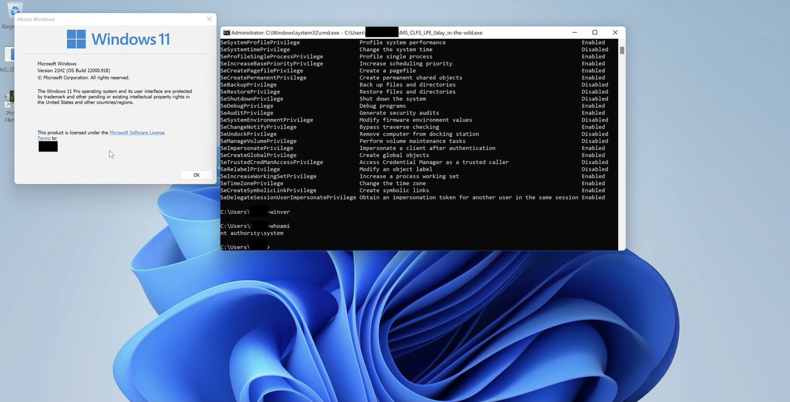</td>
</table></tr>
<table><tr>
<td>Quotes: <code>6</code></td>
<td>Replies: <code>1</code></td>
<td>Retweets: <code>99</code></td>
<td>Favorites: <code>253</code></td>
</tr></table>

---

# campuscodi
**https://twitter.com/campuscodi/status/1569743594273050634 _at 2022-09-13, 17:43:31_**
<blockquote>
The Microsoft September 2022 Patch Tuesday security updates are out:

-79 security bugs fixed
-one zero-day (CVE-2022-37969)

https://t.co/FHC2M7Dj9i https://t.co/3oITiyVR06
</blockquote>

* https://rawcdn.githack.com/campuscodi/Microsoft-Patch-Tuesday-Security-Reports/628f9be4c9a195d679cd91d785a475cedcf51d1e/Reports/MSRC_CVEs2022-Sep.html

<table><tr>
<td>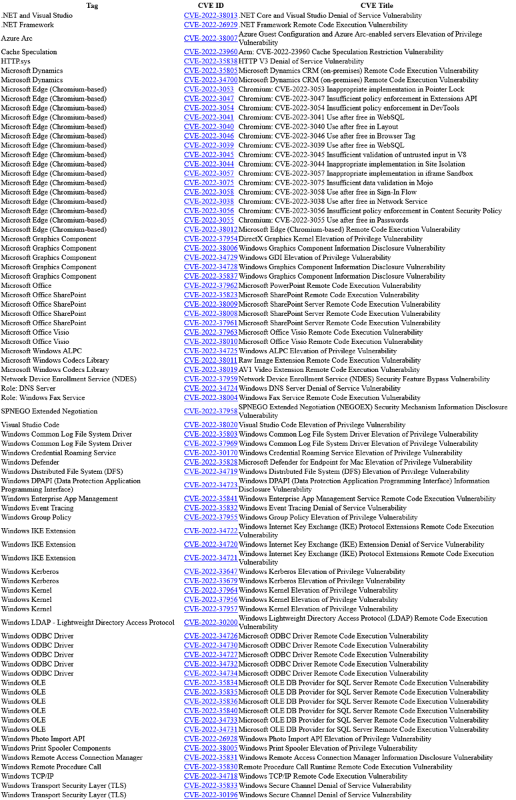</td>
</table></tr>
<table><tr>
<td>Quotes: <code>1</code></td>
<td>Replies: <code>2</code></td>
<td>Retweets: <code>50</code></td>
<td>Favorites: <code>88</code></td>
</tr></table>

---

# ReconOne_bk
**https://twitter.com/ReconOne_bk/status/1569687199523966977 _at 2022-09-13, 13:59:26_**
<blockquote>
[Oh noo] New 0-Day affecting WordPress exploited in the wild 👇

WordPress BackupBuddy Plugin LFI
(CVE-2022-31474) 

Try this non-destructive Template to detect the vulnerability at scale 👇

#recon #AttackSurface #bugbountytips #bugbounty #nuclei #cve #cve2022 #wordpress #0day https://t.co/VsHdwMn6QK
</blockquote>

<table><tr>
<td>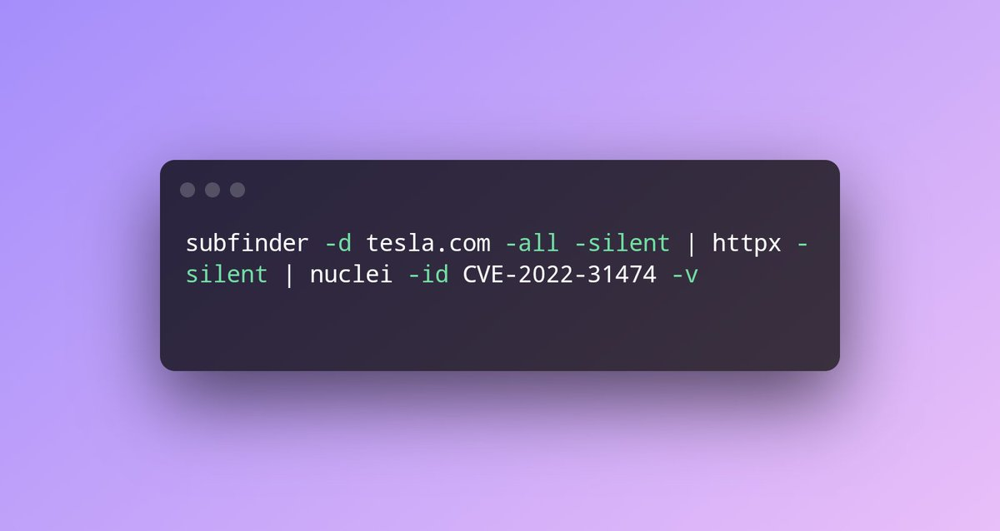</td>
</table></tr>
<table><tr>
<td>Quotes: <code>2</code></td>
<td>Replies: <code>2</code></td>
<td>Retweets: <code>113</code></td>
<td>Favorites: <code>314</code></td>
</tr></table>

---

# maherazz2
**https://twitter.com/maherazz2/status/1569665311707734023 _at 2022-09-13, 12:32:27_**
<blockquote>
CVE-2022-37706 is a 0day that was found on Enlightenment window manager.

This vulnerability is critical and can be used to Escalate Privileges to root.
The exploit was tested under Ubuntu 22.04.

Exploit + Write-up here:
https://t.co/Wbv0L2AR7h
#0day #LPE #Linux #CVE #PWN https://t.co/IKbVmMr0WF
</blockquote>

* https://github.com/MaherAzzouzi/CVE-2022-37706-LPE-exploit

<table><tr>
<td>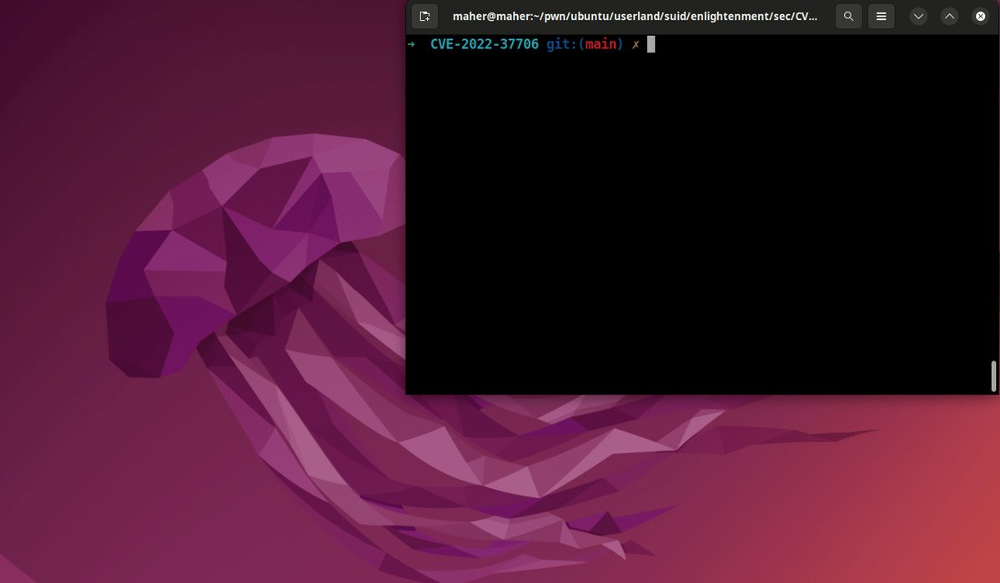</td>
</table></tr>
<table><tr>
<td>Quotes: <code>6</code></td>
<td>Replies: <code>3</code></td>
<td>Retweets: <code>43</code></td>
<td>Favorites: <code>101</code></td>
</tr></table>

---

# 0xor0ne
**https://twitter.com/0xor0ne/status/1569581651276996610 _at 2022-09-13, 07:00:01_**
<blockquote>
CVE-2022-32250 (credits @nccgroupinfosec)

"UAF vulnerability affecting the netlink subsystem can be exploited twice to open up other more powerful use-after-free primitives"

https://t.co/094qboRdLj 

#cve #infosec #cybersecurity #hacking #exploit #vulnerability #Linux #kernel https://t.co/051fUymAR3
</blockquote>

* https://buff.ly/3cDhCkJ

<table><tr>
<td></td>
<td>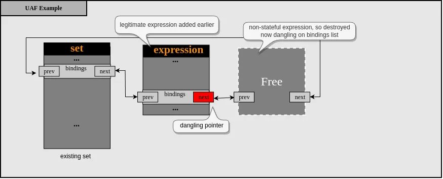</td>
<td>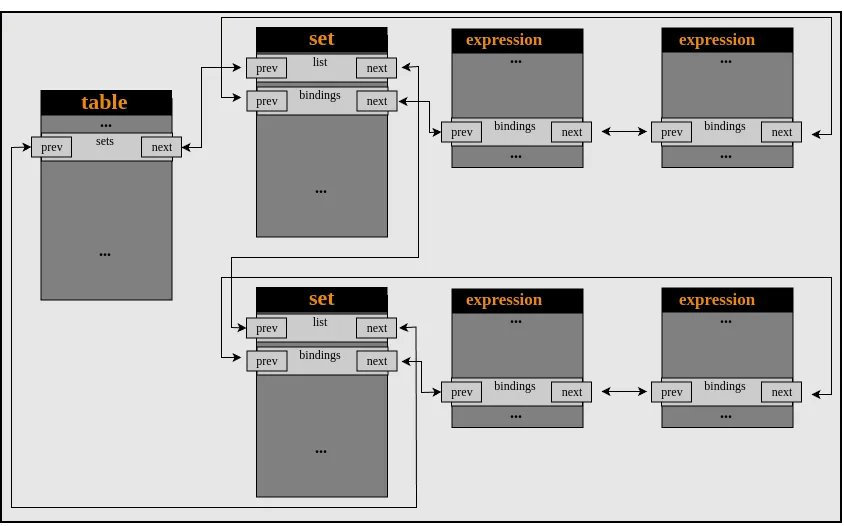</td>
</table></tr>
<table><tr>
<td>Quotes: <code>1</code></td>
<td>Replies: <code>0</code></td>
<td>Retweets: <code>17</code></td>
<td>Favorites: <code>48</code></td>
</tr></table>

---

# TheHackersNews
**https://twitter.com/TheHackersNews/status/1569530691171528707 _at 2022-09-13, 03:37:31_**
<blockquote>
#Apple has released another round of security updates to fix several new vulnerabilities in #iOS and #macOS, including a new zero-day #vulnerability (CVE-2022-32917) that has been exploited for attacks in the wild.

Details: https://t.co/QukeBo0PUw

#infosec #iPhone14 #hacking
</blockquote>

* https://thehackernews.com/2022/09/apple-releases-ios-and-macos-updates-to.html

<table><tr>
<td>Quotes: <code>11</code></td>
<td>Replies: <code>16</code></td>
<td>Retweets: <code>117</code></td>
<td>Favorites: <code>181</code></td>
</tr></table>

---

# NationalCyberS1
**https://twitter.com/NationalCyberS1/status/1568834219886882816 _at 2022-09-11, 05:30:00_**
<blockquote>
Remote Code Execution exploit for CVE-2022-36804 (BitBucket Server and DataCenter). 

Link: https://t.co/M9fuYFZvvF

#hacking #bugbountytips #informationsecurity #cybersecurity #infosec #cybersecuritytips #Ethicalhacking #Pentesting 

https://t.co/uJj502wyNf
+918016167754 https://t.co/ipE1TrgARc
</blockquote>

* https://github.com/cryptolakk/CVE-2022-36804-RCE
* https://ncybersecurity.com

<table><tr>
<td>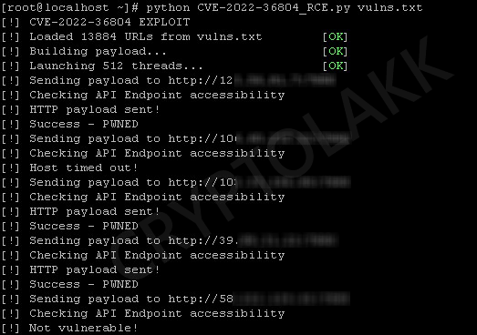</td>
</table></tr>
<table><tr>
<td>Quotes: <code>1</code></td>
<td>Replies: <code>1</code></td>
<td>Retweets: <code>25</code></td>
<td>Favorites: <code>68</code></td>
</tr></table>

---

# 0xor0ne
**https://twitter.com/0xor0ne/status/1568320891746152448 _at 2022-09-09, 19:30:13_**
<blockquote>
CVE-2022-2586: N-day exploit writeup by @lockedbyte.
Use-after-free in Linux kernel nft_object

https://t.co/U20vVsxKJL 

#Linux #kernel #exploit #cve #exploitation #hacking #infosec #cybersecurity https://t.co/gyITyDTj6x
</blockquote>

* https://buff.ly/3Q0lCt2

<table><tr>
<td>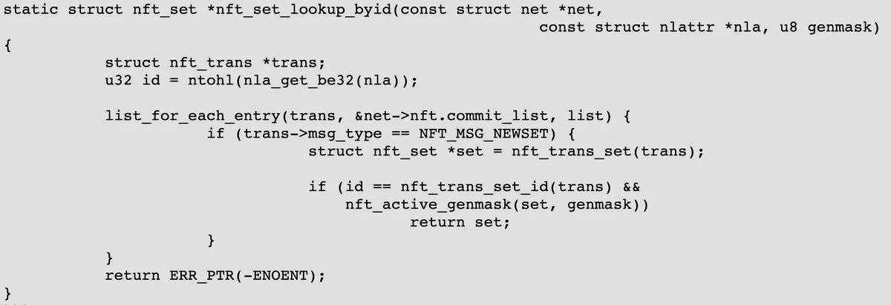</td>
</table></tr>
<table><tr>
<td>Quotes: <code>2</code></td>
<td>Replies: <code>0</code></td>
<td>Retweets: <code>25</code></td>
<td>Favorites: <code>64</code></td>
</tr></table>

---

# TheHackersNews
**https://twitter.com/TheHackersNews/status/1567384408445026309 _at 2022-09-07, 05:28:58_**
<blockquote>
A new critical remote code execution #vulnerability (CVE-2022-34747) has been found in #Zyxel network-attached storage (NAS) devices — Firmware patch update released.

Read: https://t.co/UJnVCFJhv1

#infosec #cybersecurity #hacking #technews
</blockquote>

* https://thehackernews.com/2022/09/critical-rce-vulnerability-affects.html

<table><tr>
<td>Quotes: <code>2</code></td>
<td>Replies: <code>0</code></td>
<td>Retweets: <code>26</code></td>
<td>Favorites: <code>38</code></td>
</tr></table>

---

# 1ZRR4H
**https://twitter.com/1ZRR4H/status/1567222528027795460 _at 2022-09-06, 18:45:42_**
<blockquote>
NOW: Massive exploitation of CVE-2022-30525 (Zyxel Firewall Unauthenticated RCE).

Attacker IP: 171.22.30.213
Downloader: http://205.185.113.157/All.sh

After installation, #Mirai performs the classic brute-force attack (default passwords) on thousands of IPs with telnet enabled. https://t.co/gOL12lLj5n
</blockquote>

<table><tr>
<td></td>
<td>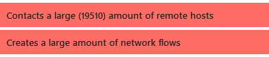</td>
<td>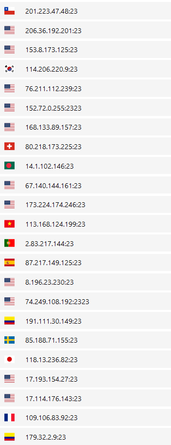</td>
<td></td>
</table></tr>
<table><tr>
<td>Quotes: <code>6</code></td>
<td>Replies: <code>2</code></td>
<td>Retweets: <code>67</code></td>
<td>Favorites: <code>179</code></td>
</tr></table>

---

# big0x75
**https://twitter.com/big0x75/status/1567219701670969348 _at 2022-09-06, 18:34:29_**
<blockquote>
CVE-2022-35405, unauth RCE in ManageEngine Password Manager Pro and PMP360, my first CVE :)
- https://t.co/M9hwFIuBBz (my blog post)
- https://t.co/CXrEe627ib (my exploit)
🥰
[+]
</blockquote>

* https://www.bigous.me/2022/09/06/CVE-2022-35405.html
* https://github.com/viniciuspereiras/CVE-2022-35405

<table><tr>
<td>Quotes: <code>2</code></td>
<td>Replies: <code>3</code></td>
<td>Retweets: <code>48</code></td>
<td>Favorites: <code>134</code></td>
</tr></table>

---

# 0xdea
**https://twitter.com/0xdea/status/1567183541032685568 _at 2022-09-06, 16:10:47_**
<blockquote>
CVE-2022-34715: More Microsoft Windows NFS V4 Remote Code Execution 

// via @thezdi

https://t.co/YreYncmvw3
</blockquote>

* https://www.thezdi.com/blog/2022/8/31/cve-2022-34715-more-microsoft-windows-nfs-v4-remote-code-execution

<table><tr>
<td>Quotes: <code>1</code></td>
<td>Replies: <code>1</code></td>
<td>Retweets: <code>19</code></td>
<td>Favorites: <code>49</code></td>
</tr></table>

---

# thezdi
**https://twitter.com/thezdi/status/1567155606821240832 _at 2022-09-06, 14:19:47_**
<blockquote>
For the last 3 months, there's been a critical #Microsoft #NFS bug, and each has received a full analysis from the Trend Micro Research Team. This month, it's CVE-2022-34715. They detail the root cause of this latest bug and offer detection guidance: https://t.co/0iLXYmrRy7
</blockquote>

* https://www.zerodayinitiative.com/blog/2022/8/31/cve-2022-34715-more-microsoft-windows-nfs-v4-remote-code-execution

<table><tr>
<td>Quotes: <code>0</code></td>
<td>Replies: <code>0</code></td>
<td>Retweets: <code>34</code></td>
<td>Favorites: <code>77</code></td>
</tr></table>

---

# hackerfantastic
**https://twitter.com/hackerfantastic/status/1567135339055136768 _at 2022-09-06, 12:59:15_**
<blockquote>
Enjoy from team @myhackerhouse 3x n-day UAC bypasses, CVE-2021-34527 LPE, FAX service persist &amp; exec mechanism &amp; remote DoS for Quake3.  https://t.co/2iyph7pLHw
https://t.co/Iuvhn0yrZg
https://t.co/nypzaEvrka
https://t.co/jlWeWZUJzM
https://t.co/VrGMv6s8Kc
https://t.co/lxhVV3dgYi https://t.co/o972X8hBrK
</blockquote>

* https://github.com/hackerhouse-opensource/ColorDataProxyUACBypass
* https://github.com/hackerhouse-opensource/envschtasksuacbypass
* https://github.com/hackerhouse-opensource/MsSettingsDelegateExecute
* https://github.com/hackerhouse-opensource/cve-2021-34527
* https://github.com/hackerhouse-opensource/NoFaxGiven
* https://github.com/hackerhouse-opensource/hfioquake3_DoS

<table><tr>
<td>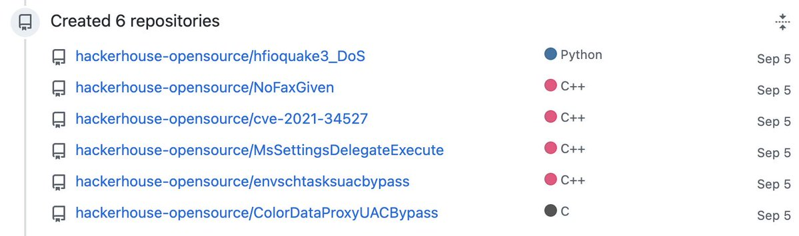</td>
<td>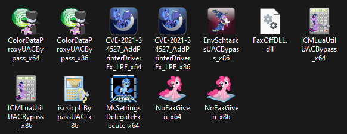</td>
</table></tr>
<table><tr>
<td>Quotes: <code>4</code></td>
<td>Replies: <code>2</code></td>
<td>Retweets: <code>12</code></td>
<td>Favorites: <code>33</code></td>
</tr></table>

---

# reverseame
**https://twitter.com/reverseame/status/1567084496477888514 _at 2022-09-06, 09:37:13_**
<blockquote>
CVE-2022-28219: Unauthenticated XXE to RCE and Domain Compromise in ManageEngine ADAudit Plus https://t.co/a7beVDoOyt
</blockquote>

* https://www.horizon3.ai/red-team-blog-cve-2022-28219/

<table><tr>
<td>Quotes: <code>1</code></td>
<td>Replies: <code>0</code></td>
<td>Retweets: <code>64</code></td>
<td>Favorites: <code>145</code></td>
</tr></table>

---

# kmkz_security
**https://twitter.com/kmkz_security/status/1566080871345668097 _at 2022-09-03, 15:09:10_**
<blockquote>
Anatomy of an exploit in Windows win32k – CVE-2022-21882 - by @Avira

"A new manipulation technique of window objects in kernel memory that leads to privilege escalation"
https://t.co/FAxAJQ5mBk
</blockquote>

* https://www.avira.com/en/blog/anatomy-of-an-exploit-in-windows-win32k-cve-2022-21882

<table><tr>
<td>Quotes: <code>1</code></td>
<td>Replies: <code>0</code></td>
<td>Retweets: <code>30</code></td>
<td>Favorites: <code>84</code></td>
</tr></table>

---

# campuscodi
**https://twitter.com/campuscodi/status/1566044990047936512 _at 2022-09-03, 12:46:35_**
<blockquote>
Google releases Chrome 105.0.5195.102 to patch actively exploited zero-day

"Google is aware of reports that an exploit for CVE-2022-3075 exists in the wild."

https://t.co/9bOyHp4xM9
</blockquote>

* https://chromereleases.googleblog.com/2022/09/stable-channel-update-for-desktop.html

<table><tr>
<td>Quotes: <code>1</code></td>
<td>Replies: <code>0</code></td>
<td>Retweets: <code>44</code></td>
<td>Favorites: <code>54</code></td>
</tr></table>

---

# Haider_k_87
**https://twitter.com/Haider_k_87/status/1566034247709777922 _at 2022-09-03, 12:03:54_**
<blockquote>
New Bug - CVE-2022-38463 - Reflected XSS 
Publish Date : 2022-08-23
Last Update Date : 2022-08-26
ServiceNow allows reflected XSS in the logout functionality.
template is available on nuclieTool
nuclei -u https://xxx  -t /root/nuclei-templates/cves/2022/CVE-2022-38463.yaml https://t.co/J6RXoZriY2
</blockquote>

<table><tr>
<td></td>
</table></tr>
<table><tr>
<td>Quotes: <code>1</code></td>
<td>Replies: <code>2</code></td>
<td>Retweets: <code>10</code></td>
<td>Favorites: <code>58</code></td>
</tr></table>

---

# wdormann
**https://twitter.com/wdormann/status/1565516672529846274 _at 2022-09-02, 01:47:15_**
<blockquote>
Yeah, so this CVE-2022-2586 Linux LPE works!
WIth two caveats:
- It's not 100% reliable (so what? Just keep trying!)
- The exploit as written needs to specifically target a particular target kernel (both for viability of available ROP gadgets, and for the offsets used).
👍 https://t.co/1Pp2WkB00O
</blockquote>

<table><tr>
<td>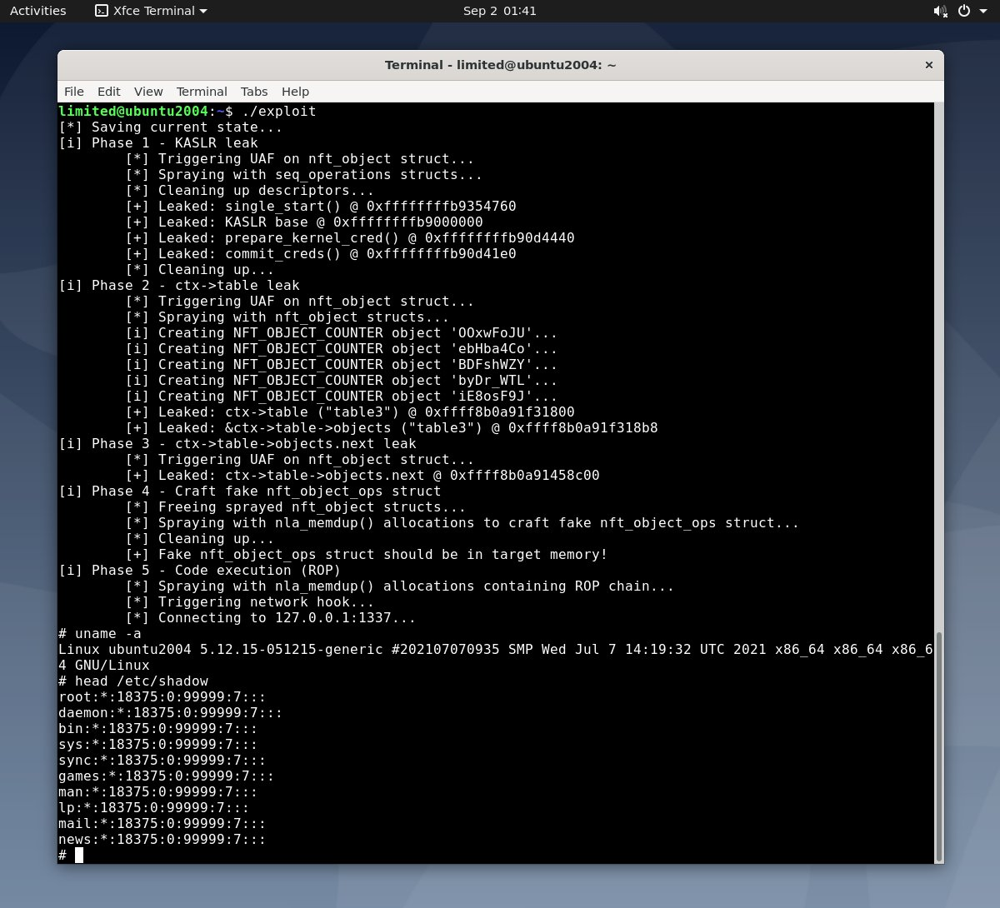</td>
</table></tr>
<table><tr>
<td>Quotes: <code>2</code></td>
<td>Replies: <code>3</code></td>
<td>Retweets: <code>13</code></td>
<td>Favorites: <code>34</code></td>
</tr></table>

---

# alexjplaskett
**https://twitter.com/alexjplaskett/status/1565267179452469248 _at 2022-09-01, 09:15:51_**
<blockquote>
🔥 1/ As promised here is the long blog write-up of a 6 year old Linux kernel UAF vulnerability (CVE-2022-32250) which we exploited multiple times to gain reliable priv esc on Ubuntu 22.04. https://t.co/XRHFN66WJ2 @nccgroupinfosec EDG @saidelike @fidgetingbits @alexjplaskett 🧵 https://t.co/o9rc0M84Hh
</blockquote>

* https://research.nccgroup.com/2022/09/01/settlers-of-netlink-exploiting-a-limited-uaf-in-nf_tables-cve-2022-32250

<table><tr>
<td>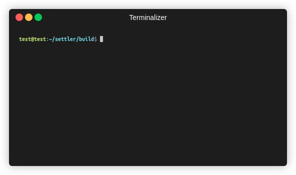</td>
</table></tr>
<table><tr>
<td>Quotes: <code>5</code></td>
<td>Replies: <code>6</code></td>
<td>Retweets: <code>121</code></td>
<td>Favorites: <code>273</code></td>
</tr></table>

---

# NCCGroupInfosec
**https://twitter.com/NCCGroupInfosec/status/1565265069184847872 _at 2022-09-01, 09:07:28_**
<blockquote>
Blog: SETTLERS OF NETLINK: Exploiting a limited UAF in nf_tables (CVE-2022-32250) against the latest Ubuntu (22.04) and Linux kernel 5.15 - by @saidelike , @alexjplaskett and @FidgetingBits -  https://t.co/3XHuzQ5mBj https://t.co/MUYovvJwVk
</blockquote>

* https://research.nccgroup.com/2022/09/01/settlers-of-netlink-exploiting-a-limited-uaf-in-nf_tables-cve-2022-32250/

<table><tr>
<td>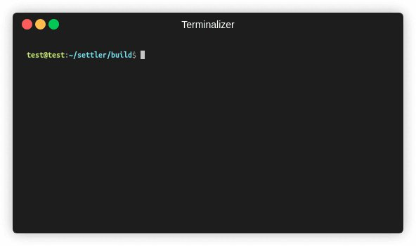</td>
</table></tr>
<table><tr>
<td>Quotes: <code>5</code></td>
<td>Replies: <code>1</code></td>
<td>Retweets: <code>67</code></td>
<td>Favorites: <code>156</code></td>
</tr></table>

---

