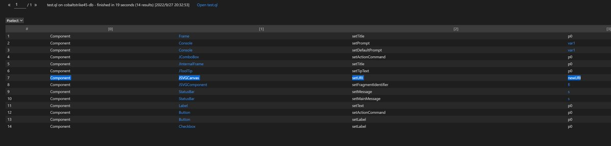

# _bettercyber_
**https://twitter.com/_bettercyber_/status/1586820924531085312 _at 2022-10-30, 20:42:44_**
<blockquote>
#Telecom Fibercorp's Cloud Office could have been impacted by the zero-day RCE vulnerability (CVE-2022-41352) in #Zimbra Collaboration Suite. 3,641 email domains hosted in Cloud Office could be affected, including 5 gob[.]ar 🇦🇷 domains 👇...
</blockquote>

<table><tr>
<td>Quotes: <code>5</code></td>
<td>Replies: <code>2</code></td>
<td>Retweets: <code>24</code></td>
<td>Favorites: <code>47</code></td>
</tr></table>

---

# K3vinLuSec
**https://twitter.com/K3vinLuSec/status/1586048292160356354 _at 2022-10-28, 17:32:34_**
<blockquote>
My new blog series: Technical Analysis of Windows CLFS Zero-Day Vulnerability CVE-2022-37969 - Part 1: Root Cause Analysis https://t.co/WAoH9jkDJ0
Part 2: Exploit Analysis https://t.co/HAL0XSKf9M
#0day #exploit #vulnerability #CVE_2022_37969 https://t.co/qbK60MHhv8
</blockquote>

* https://www.zscaler.com/blogs/security-research/technical-analysis-windows-clfs-zero-day-vulnerability-cve-2022-37969-part
* https://www.zscaler.com/blogs/security-research/technical-analysis-windows-clfs-zero-day-vulnerability-cve-2022-37969-part2-exploit-analysis

<table><tr>
<td></td>
<td></td>
<td></td>
<td></td>
</table></tr>
<table><tr>
<td>Quotes: <code>2</code></td>
<td>Replies: <code>0</code></td>
<td>Retweets: <code>76</code></td>
<td>Favorites: <code>170</code></td>
</tr></table>

---

# TheHackersNews
**https://twitter.com/TheHackersNews/status/1585944782651592704 _at 2022-10-28, 10:41:16_**
<blockquote>
⚡ #Google is rolling out an emergency update for the #Chrome browser to patch an actively exploited zero-day #vulnerability (CVE-2022-3723).

Read: https://t.co/arqUfV2VjT

#cybersecurity #technology #infosec #hacking
</blockquote>

* https://thehackernews.com/2022/10/google-issues-urgent-chrome-update-to.html

<table><tr>
<td>Quotes: <code>11</code></td>
<td>Replies: <code>6</code></td>
<td>Retweets: <code>148</code></td>
<td>Favorites: <code>196</code></td>
</tr></table>

---

# 0xor0ne
**https://twitter.com/0xor0ne/status/1585715511173808133 _at 2022-10-27, 19:30:13_**
<blockquote>
CVE-2022-32250 exploitation writeup by https://t.co/3dvjkq6bTh
use-after-free vulnerability in the Netfilter subsystem 

https://t.co/WhRlqQtsdT 

#Linux #kernel #exploit #cve #infosec #cybersecurity #hacking https://t.co/8dLeKblXsu
</blockquote>

* https://buff.ly/3gbozef
* https://blog.theori.io/research/CVE-2022-32250-linux-kernel-lpe-2022/

<table><tr>
<td></td>
<td></td>
<td></td>
</table></tr>
<table><tr>
<td>Quotes: <code>1</code></td>
<td>Replies: <code>2</code></td>
<td>Retweets: <code>83</code></td>
<td>Favorites: <code>184</code></td>
</tr></table>

---

# Dinosn
**https://twitter.com/Dinosn/status/1585601569713692674 _at 2022-10-27, 11:57:27_**
<blockquote>
CVE-2022-39944: Apache Linkis RCE Vulnerability https://t.co/1daSgmUsBB
</blockquote>

* https://securityonline.info/cve-2022-39944-apache-linkis-rce-vulnerability/

<table><tr>
<td>Quotes: <code>1</code></td>
<td>Replies: <code>0</code></td>
<td>Retweets: <code>23</code></td>
<td>Favorites: <code>40</code></td>
</tr></table>

---

# SecurityBDog
**https://twitter.com/SecurityBDog/status/1585371836829044736 _at 2022-10-26, 20:44:35_**
<blockquote>
Is CVE-2022-42889 important to you? Unless you know that this CVE is the Windows TCP/IP Remote Code Execution vuln and have Microsoft in your IT environment. There is a better way—machine learning: https://t.co/FJ6kpUdsow
#cybersecurity #microsoft #machinelearning #windows
</blockquote>

* https://securitybulldog.com/blog/how-to-find-remediation-instructions-news-to-cve-to-microsoft/

<table><tr>
<td>Quotes: <code>0</code></td>
<td>Replies: <code>2</code></td>
<td>Retweets: <code>3</code></td>
<td>Favorites: <code>31</code></td>
</tr></table>

---

# Dinosn
**https://twitter.com/Dinosn/status/1585328304722411520 _at 2022-10-26, 17:51:36_**
<blockquote>
Researchers Release PoC for Windows TCP/IP RCE Flaw (CVE-2022-34718) https://t.co/E48KL9yzSO
</blockquote>

* https://securityonline.info/researchers-release-poc-for-windows-tcp-ip-rce-flaw-cve-2022-34718/

<table><tr>
<td>Quotes: <code>3</code></td>
<td>Replies: <code>0</code></td>
<td>Retweets: <code>71</code></td>
<td>Favorites: <code>173</code></td>
</tr></table>

---

# ma1fan
**https://twitter.com/ma1fan/status/1585132930611154944 _at 2022-10-26, 04:55:15_**
<blockquote>
this is our analysis of the tcpip vulnerability cve-2022-34718 including PoC https://t.co/ZaKkpLlhht
</blockquote>

* https://medium.com/@numencyberlabs/analysis-and-summary-of-tcp-ip-protocol-remote-code-execution-vulnerability-cve-2022-34718-8fcc28538acf

<table><tr>
<td>Quotes: <code>2</code></td>
<td>Replies: <code>1</code></td>
<td>Retweets: <code>75</code></td>
<td>Favorites: <code>234</code></td>
</tr></table>

---

# SinSinology
**https://twitter.com/SinSinology/status/1585001574228987904 _at 2022-10-25, 20:13:17_**
<blockquote>
A beautiful collaboration with @steventseeley  leading to Unauthenticated RCE as root, PATCH NOW 🚨
Also blog post coming soon 🔥

#vmware
CVE-2022-31678
</blockquote>

<table><tr>
<td>Quotes: <code>0</code></td>
<td>Replies: <code>0</code></td>
<td>Retweets: <code>5</code></td>
<td>Favorites: <code>41</code></td>
</tr></table>

---

# LinaAsahi
**https://twitter.com/LinaAsahi/status/1584780043573567488 _at 2022-10-25, 05:33:00_**
<blockquote>
I got credited by Apple for a security report!!! ✨✨

Now you know what I was doing that time I took one week off of streaming! 😊

I can't talk about the details yet, but look forward to a stream all about CVE-2022-32947 in the future! 💫

https://t.co/UqriYSIeFK https://t.co/igMhNO8yKD
</blockquote>

* https://support.apple.com/en-us/HT213489

<table><tr>
<td></td>
</table></tr>
<table><tr>
<td>Quotes: <code>19</code></td>
<td>Replies: <code>39</code></td>
<td>Retweets: <code>188</code></td>
<td>Favorites: <code>2003</code></td>
</tr></table>

---

# l33d0hyun
**https://twitter.com/l33d0hyun/status/1584728805482336257 _at 2022-10-25, 02:09:24_**
<blockquote>
My new Apple Safari Vulnerability :)

UI Spoofing in Apple Safari : CVE-2022-42799 (with @gPayl0ad)
Type confusion in Apple Safari : CVE-2022-42823
Same-Origin Policy Bypass in Apple Safari : CVE-2022-42824 (with Ryan)

https://t.co/7t8VdZoPoh https://t.co/nA28H0X6RT
</blockquote>

* https://support.apple.com/ko-kr/HT213495

<table><tr>
<td></td>
</table></tr>
<table><tr>
<td>Quotes: <code>0</code></td>
<td>Replies: <code>5</code></td>
<td>Retweets: <code>8</code></td>
<td>Favorites: <code>103</code></td>
</tr></table>

---

# sirifu4k1
**https://twitter.com/sirifu4k1/status/1584370428386025477 _at 2022-10-24, 02:25:20_**
<blockquote>
CVE-2022-42045 POC : Arbitrary code injection in Zemana amsdk.sys kernel-mode driver, a part of Zemana Antimalware SDK. 
#CVE #infosec #hacktools #cybersecurity #pentesting  https://t.co/vnUIf9yBRa
</blockquote>

* https://github.com/ReCryptLLC/CVE-2022-42045

<table><tr>
<td>Quotes: <code>1</code></td>
<td>Replies: <code>0</code></td>
<td>Retweets: <code>36</code></td>
<td>Favorites: <code>63</code></td>
</tr></table>

---

# malmoeb
**https://twitter.com/malmoeb/status/1584273884072665088 _at 2022-10-23, 20:01:43_**
<blockquote>
1/ Detect a compromise of a Fortinet firewall with the FortiAnalyzer Event Handler 🔎

A customer affected by CVE-2022-40684 ("may allow an unauthenticated attacker to perform operations on the administrative interface" [1]) received the email below. 🧵

#CyberSecurity https://t.co/xHOMRzh2mc
</blockquote>

<table><tr>
<td></td>
</table></tr>
<table><tr>
<td>Quotes: <code>1</code></td>
<td>Replies: <code>2</code></td>
<td>Retweets: <code>54</code></td>
<td>Favorites: <code>185</code></td>
</tr></table>

---

# 18a
**https://twitter.com/18a/status/1584152191740219392 _at 2022-10-23, 11:58:09_**
<blockquote>
Windows TCP/IP Remote Code Execution Vulnerability.
CVE-2022-34718 
PoC: https://t.co/seAsYggGuo
</blockquote>

<table><tr>
<td></td>
</table></tr>
<table><tr>
<td>Quotes: <code>0</code></td>
<td>Replies: <code>1</code></td>
<td>Retweets: <code>9</code></td>
<td>Favorites: <code>67</code></td>
</tr></table>

---

# chompie1337
**https://twitter.com/chompie1337/status/1583666434668101637 _at 2022-10-22, 03:47:55_**
<blockquote>
Remotely exploiting CVE-2022-34718, TCP/IP RCE bug #EvilEsp for DoS. This is a bug in Ipv6 fragmentation/IpSec, which allows OOB write if an Ipv6 fragment is contained inside an IpSec ESP payload. https://t.co/k1aoZX2kWq
</blockquote>

<table><tr>
<td></td>
</table></tr>
<table><tr>
<td>Quotes: <code>44</code></td>
<td>Replies: <code>53</code></td>
<td>Retweets: <code>528</code></td>
<td>Favorites: <code>2940</code></td>
</tr></table>

---

# sirifu4k1
**https://twitter.com/sirifu4k1/status/1583609952668594176 _at 2022-10-22, 00:03:29_**
<blockquote>
Check for Microsoft Exchange servers potentially vulnerable to ProxyNotShell (CVE-2022-40140 &amp; CVE-2022-41082) 
due to the fact that temporary mitigation is not applied.
#windows #exchange  https://t.co/OlXLLythpZ
</blockquote>

* https://github.com/NitinYadav00/Exploit-Microsoft-Exchange-Server-

<table><tr>
<td>Quotes: <code>1</code></td>
<td>Replies: <code>0</code></td>
<td>Retweets: <code>19</code></td>
<td>Favorites: <code>38</code></td>
</tr></table>

---

# TheHackersNews
**https://twitter.com/TheHackersNews/status/1583413996043968512 _at 2022-10-21, 11:04:49_**
<blockquote>
Researchers have detected active exploitation attempts targeting the recently disclosed critical RCE #vulnerability (CVE-2022-42889) in Apache Commons Text.

Read details: https://t.co/ggzc7VCyC4

#infosec #cybersecurity #hacking
</blockquote>

* https://thehackernews.com/2022/10/hackers-started-exploiting-critical.html

<table><tr>
<td>Quotes: <code>5</code></td>
<td>Replies: <code>4</code></td>
<td>Retweets: <code>79</code></td>
<td>Favorites: <code>115</code></td>
</tr></table>

---

# cyber_advising
**https://twitter.com/cyber_advising/status/1583407936763674624 _at 2022-10-21, 10:40:45_**
<blockquote>
CVE-2022-42889: Apache Commons Text Remote Code Execution.
org.apache.commons.text.lookup.StringLookup lookups are: - "script" - execute expressions using the JVM script execution engine (javax.script) - "dns" - resolve dns records - "url" ...

PoC
https://t.co/tDxE9oC0i3 https://t.co/X9w67aVQLh
</blockquote>

* https://sysdig.com/blog/cve-2022-42889-text4shell/?fbclid=IwAR390dT6t-APZtG9HJiUaWYWY-MARztD_-Z2ggwEbaYngaTaCvXCRar2sk8

<table><tr>
<td></td>
</table></tr>
<table><tr>
<td>Quotes: <code>1</code></td>
<td>Replies: <code>2</code></td>
<td>Retweets: <code>33</code></td>
<td>Favorites: <code>106</code></td>
</tr></table>

---

# Dinosn
**https://twitter.com/Dinosn/status/1583036740565991425 _at 2022-10-20, 10:05:45_**
<blockquote>
Metasploit script(POC) about CVE-2022-41040. Microsoft Exchange are vulnerable to a server-side request forgery (SSRF) attack. An authenticated attacker can use the vulnerability to elevate privileges.

https://t.co/t620czZG8D
</blockquote>

* https://github.com/TaroballzChen/CVE-2022-41040-metasploit-ProxyNotShell

<table><tr>
<td>Quotes: <code>1</code></td>
<td>Replies: <code>1</code></td>
<td>Retweets: <code>21</code></td>
<td>Favorites: <code>51</code></td>
</tr></table>

---

# thezdi
**https://twitter.com/thezdi/status/1582734265242251265 _at 2022-10-19, 14:03:49_**
<blockquote>
The latest blog from the researchers at the Trend Micro Research Team looks at CVE-2022-3236: a recently patched bug in #Sophos firewall that is reported to be under active attack. https://t.co/ynBjisbnl1
</blockquote>

* https://www.zerodayinitiative.com/blog/2022/10/19/cve-2022-3236-sophos-firewall-user-portal-and-web-admin-code-injection

<table><tr>
<td>Quotes: <code>1</code></td>
<td>Replies: <code>0</code></td>
<td>Retweets: <code>14</code></td>
<td>Favorites: <code>34</code></td>
</tr></table>

---

# TheHackersNews
**https://twitter.com/TheHackersNews/status/1582606041606287360 _at 2022-10-19, 05:34:18_**
<blockquote>
A critical remote code execution (RCE) #vulnerability (CVE-2022-42889) has been discovered in Apache Commons Text.

https://t.co/02zX7PVWVS

#infosec
</blockquote>

* https://securitylab.github.com/advisories/GHSL-2022-018_Apache_Commons_Text/

<table><tr>
<td>Quotes: <code>1</code></td>
<td>Replies: <code>2</code></td>
<td>Retweets: <code>35</code></td>
<td>Favorites: <code>62</code></td>
</tr></table>

---

# l33d0hyun
**https://twitter.com/l33d0hyun/status/1582520121222115328 _at 2022-10-18, 23:52:53_**
<blockquote>
My new vulnerability!

CVE-2022-39421: Oracle VirtualBox Remote Code Execution Vulnerability

"Successful attacks of this vulnerability can result in takeover of Oracle VM VirtualBox."

Timeline:
10-03: Reported to Vendor
10-18 : Fixed (CVE-2022-39421)

https://t.co/60KDG9Muvh https://t.co/pLnMGjwdpA
</blockquote>

* https://www.oracle.com/security-alerts/cpuoct2022.html

<table><tr>
<td></td>
<td></td>
<td></td>
</table></tr>
<table><tr>
<td>Quotes: <code>1</code></td>
<td>Replies: <code>2</code></td>
<td>Retweets: <code>26</code></td>
<td>Favorites: <code>157</code></td>
</tr></table>

---

# sirifu4k1
**https://twitter.com/sirifu4k1/status/1582321562740756481 _at 2022-10-18, 10:43:53_**
<blockquote>
PoC for CVE-2022-26809 #windows rpc #rce #infosec https://t.co/WsHuQyoB4c
</blockquote>

* https://github.com/s1ckb017/PoC-CVE-2022-26809

<table><tr>
<td>Quotes: <code>2</code></td>
<td>Replies: <code>2</code></td>
<td>Retweets: <code>59</code></td>
<td>Favorites: <code>135</code></td>
</tr></table>

---

# d0znpp
**https://twitter.com/d0znpp/status/1582236237230133250 _at 2022-10-18, 05:04:50_**
<blockquote>
Here is the thing called #text4shell. Probably the first thing you will care about after waking up tomorrow. CVE-2022-42889 with a CVSS score of 9.8. https://t.co/R7SV6cTLca
</blockquote>

* https://lnkd.in/eX88eNE5

<table><tr>
<td>Quotes: <code>2</code></td>
<td>Replies: <code>1</code></td>
<td>Retweets: <code>27</code></td>
<td>Favorites: <code>69</code></td>
</tr></table>

---

# Herdwolfman
**https://twitter.com/Herdwolfman/status/1582214982552649729 _at 2022-10-18, 03:40:22_**
<blockquote>
Cobalt Strike 4.7.1远程命令执行漏洞复现过程，带视频演示。复现过程参考了赛博回忆录上月的文章。
#CVE-2022-39197 https://t.co/4Zt8FJtQSn
</blockquote>

* https://securityintelligence.com/posts/analysis-rce-vulnerability-cobalt-strike/

<table><tr>
<td>Quotes: <code>1</code></td>
<td>Replies: <code>1</code></td>
<td>Retweets: <code>18</code></td>
<td>Favorites: <code>36</code></td>
</tr></table>

---

# jas502n
**https://twitter.com/jas502n/status/1582192282547392512 _at 2022-10-18, 02:10:10_**
<blockquote>
#CVE-2022-39197 Cobalt Strike RCE =&lt; 4.7

use codeql to search exploit chain from the database compiled by openjdk and cobaltstrike4.5 db

org.apache.batik.swing.JSVGCanvas#setURI
org.apache.batik.bridge.BaseScriptingEnvironment#loadScript https://t.co/iNWnl9yPo2
</blockquote>

<table><tr>
<td></td>
<td></td>
<td></td>
<td></td>
</table></tr>
<table><tr>
<td>Quotes: <code>1</code></td>
<td>Replies: <code>0</code></td>
<td>Retweets: <code>39</code></td>
<td>Favorites: <code>88</code></td>
</tr></table>

---

# sammwy
**https://twitter.com/sammwy/status/1582127622490054656 _at 2022-10-17, 21:53:14_**
<blockquote>
Vulnerabilidad RCE en Apache Commons Configuration 2.7 (CVE-2022-33980) 

Descubierta unos meses atrás pero olvidé subir el POC.
https://t.co/kTIgKfWAwS https://t.co/2zsctfx19w
</blockquote>

* https://github.com/sammwyy/CVE-2022-33980-POC

<table><tr>
<td></td>
</table></tr>
<table><tr>
<td>Quotes: <code>0</code></td>
<td>Replies: <code>0</code></td>
<td>Retweets: <code>1</code></td>
<td>Favorites: <code>60</code></td>
</tr></table>

---

# GreyNoiseIO
**https://twitter.com/GreyNoiseIO/status/1582003925963530242 _at 2022-10-17, 13:41:42_**
<blockquote>
We are currently investigating CVE-2022-42889, a vulnerability in Apache Commons Text versions 1.5 through 1.9 which can allow RCE when applied to untrusted input due to insecure interpolation defaults.
</blockquote>

<table><tr>
<td>Quotes: <code>10</code></td>
<td>Replies: <code>3</code></td>
<td>Retweets: <code>78</code></td>
<td>Favorites: <code>316</code></td>
</tr></table>

---

# TheHackersNews
**https://twitter.com/TheHackersNews/status/1581945944261607424 _at 2022-10-17, 09:51:18_**
<blockquote>
Zimbra has finally released security patches for an actively exploited RCE #vulnerability (CVE-2022-41352) in its Enterprise Collaboration Suite that could be used to upload arbitrary files to vulnerable instances.

Read: https://t.co/Tjk1gHjTn0

#infosec #hacking #cybersecurity
</blockquote>

* https://thehackernews.com/2022/10/zimbra-releases-patch-for-actively.html

<table><tr>
<td>Quotes: <code>4</code></td>
<td>Replies: <code>4</code></td>
<td>Retweets: <code>29</code></td>
<td>Favorites: <code>31</code></td>
</tr></table>

---

# TheHackersNews
**https://twitter.com/TheHackersNews/status/1580975686688247808 _at 2022-10-14, 17:35:51_**
<blockquote>
Researchers disclose technical details of a Windows zero-day #vulnerability (CVE-2022-37969) in the Common Log File System (CLFS) driver that was under active exploitation last month.

Read: https://t.co/MvqKVG3Jsc

#infosec #cybersecurity #hacking
</blockquote>

* https://thehackernews.com/2022/10/researchers-reveal-detail-for-windows.html

<table><tr>
<td>Quotes: <code>4</code></td>
<td>Replies: <code>1</code></td>
<td>Retweets: <code>60</code></td>
<td>Favorites: <code>94</code></td>
</tr></table>

---

# K3vinLuSec
**https://twitter.com/K3vinLuSec/status/1580970751028383745 _at 2022-10-14, 17:16:14_**
<blockquote>
Here is my new blog "Technical Analysis of Windows CLFS Zero-Day Vulnerability CVE-2022-37969 - Part 1: Root Cause Analysis",  Part 2 will be released soon. Stay tuned!
</blockquote>

<table><tr>
<td>Quotes: <code>3</code></td>
<td>Replies: <code>1</code></td>
<td>Retweets: <code>40</code></td>
<td>Favorites: <code>87</code></td>
</tr></table>

---

# S0ufi4n3
**https://twitter.com/S0ufi4n3/status/1580845252784443392 _at 2022-10-14, 08:57:33_**
<blockquote>
CVE-2022-40684 PoC 
 
PUT /api/v2/cmdb/system/admin/admin HTTP/1.1
 Host: Hostname
User-Agent: Report Runner
Content-Type: application/json
Forwarded: for=[127.0.0.1]:8000;by=[127.0.0.1]:9000;
Content-Length: 606
{
"ssh-public-key1": "key"
}
</blockquote>

<table><tr>
<td>Quotes: <code>2</code></td>
<td>Replies: <code>0</code></td>
<td>Retweets: <code>9</code></td>
<td>Favorites: <code>32</code></td>
</tr></table>

---

# gentilkiwi
**https://twitter.com/gentilkiwi/status/1580677951481577473 _at 2022-10-13, 21:52:45_**
<blockquote>
Seen CVE-2022-34689 ? (NSA/NCSC)

Windows CryptoAPI Spoofing Vulnerability
[...] could manipulate an existing public x.509 certificate to spoof their identify and perform actions [...]

&gt; https://t.co/1RxwiDNZGX

Seems bad enough for Microsoft to release a version for Windows 7 https://t.co/jpgu1zZjrN
</blockquote>

* https://msrc.microsoft.com/update-guide/en-US/vulnerability/CVE-2022-34689

<table><tr>
<td></td>
</table></tr>
<table><tr>
<td>Quotes: <code>3</code></td>
<td>Replies: <code>5</code></td>
<td>Retweets: <code>49</code></td>
<td>Favorites: <code>146</code></td>
</tr></table>

---

# PaulosYibelo
**https://twitter.com/PaulosYibelo/status/1580622023352414208 _at 2022-10-13, 18:10:31_**
<blockquote>
CVE-2022-22241 is a recently patched preauth phar deserialization vulnerability leading to remote RCE in all #Juniper SSLVPN / JunOS devices. Write-up on this and a bunch of other bugs soon.
</blockquote>

<table><tr>
<td>Quotes: <code>14</code></td>
<td>Replies: <code>6</code></td>
<td>Retweets: <code>66</code></td>
<td>Favorites: <code>283</code></td>
</tr></table>

---

# Horizon3Attack
**https://twitter.com/Horizon3Attack/status/1580602337064030208 _at 2022-10-13, 16:52:17_**
<blockquote>
Here is our technical deep dive for the #Fortinet CVE-2022-40684 Auth Bypass. POC within. 

This year has been filled with interesting HTTP header abuse!

https://t.co/gkg6F7vh2n
</blockquote>

* https://www.horizon3.ai/fortios-fortiproxy-and-fortiswitchmanager-authentication-bypass-technical-deep-dive-cve-2022-40684

<table><tr>
<td>Quotes: <code>26</code></td>
<td>Replies: <code>10</code></td>
<td>Retweets: <code>370</code></td>
<td>Favorites: <code>877</code></td>
</tr></table>

---

# hkashfi
**https://twitter.com/hkashfi/status/1580559529007542272 _at 2022-10-13, 14:02:11_**
<blockquote>
Linux kernel WiFi stack bugs exploitable over the air are always worth following up with!

CVE-2022-41674 (RCE)
CVE-2022-42719 (RCE) &lt;&lt;&lt;
CVE-2022-42720 (RCE)
CVE-2022-42721 (DoS)
CVE-2022-42722 (DoS)

https://t.co/mTzRoYfdJW
</blockquote>

* https://www.openwall.com/lists/oss-security/2022/10/13/2

<table><tr>
<td>Quotes: <code>2</code></td>
<td>Replies: <code>2</code></td>
<td>Retweets: <code>103</code></td>
<td>Favorites: <code>279</code></td>
</tr></table>

---

# PenTestPartners
**https://twitter.com/PenTestPartners/status/1580480583137779712 _at 2022-10-13, 08:48:29_**
<blockquote>
Our @_EthicalChaos_ found that you could remotely install Windows Store apps and execute privileged services on the latest versions of Windows. This post has all the juicy CVE-2022-35841 details
https://t.co/R4EyMaidrh
#rce #cve https://t.co/Jy0Yms6AUj
</blockquote>

* https://www.pentestpartners.com/security-blog/ms-enterprise-app-management-service-rce-cve-2022-35841/

<table><tr>
<td></td>
</table></tr>
<table><tr>
<td>Quotes: <code>4</code></td>
<td>Replies: <code>1</code></td>
<td>Retweets: <code>60</code></td>
<td>Favorites: <code>155</code></td>
</tr></table>

---

# reverseame
**https://twitter.com/reverseame/status/1580449772259151873 _at 2022-10-13, 06:46:03_**
<blockquote>
Linux Kernel Exploit (CVE-2022-32250) with mqueue https://t.co/oLNSdc5aTi
</blockquote>

* https://blog.theori.io/research/CVE-2022-32250-linux-kernel-lpe-2022/

<table><tr>
<td>Quotes: <code>4</code></td>
<td>Replies: <code>0</code></td>
<td>Retweets: <code>91</code></td>
<td>Favorites: <code>237</code></td>
</tr></table>

---

# bad_packets
**https://twitter.com/bad_packets/status/1580326950060838913 _at 2022-10-12, 22:38:00_**
<blockquote>
⚠️ CVE-2022-41082 event detected ⚠️

Source IP:
80.78.25.253 (🇸🇪)

Target:
Microsoft Exchange servers vulnerable to remote code execution.
#ProxyNotShell #threatintel
</blockquote>

<table><tr>
<td>Quotes: <code>1</code></td>
<td>Replies: <code>0</code></td>
<td>Retweets: <code>19</code></td>
<td>Favorites: <code>31</code></td>
</tr></table>

---

# TecR0c
**https://twitter.com/TecR0c/status/1580136942469275648 _at 2022-10-12, 10:02:59_**
<blockquote>
My Microsoft Word Remote Code Execution Vulnerability CVE-2022-41031 and Microsoft Office Graphics Remote Code Execution Vulnerability CVE-2022-38049 got patched thanks to @msftsecresponse !
</blockquote>

<table><tr>
<td>Quotes: <code>0</code></td>
<td>Replies: <code>1</code></td>
<td>Retweets: <code>2</code></td>
<td>Favorites: <code>63</code></td>
</tr></table>

---

# blackorbird
**https://twitter.com/blackorbird/status/1580112593817305088 _at 2022-10-12, 08:26:14_**
<blockquote>
Windows CryptoAPI Spoofing Vulnerability
CVE-2022-34689
Report by UK National Cyber Security Centre (NCSC) and the National Security Agency (NSA)
https://t.co/mJRbEyOW7I https://t.co/z75kNVAexi
</blockquote>

* https://msrc.microsoft.com/update-guide/en-US/vulnerability/CVE-2022-34689

<table><tr>
<td></td>
</table></tr>
<table><tr>
<td>Quotes: <code>2</code></td>
<td>Replies: <code>0</code></td>
<td>Retweets: <code>9</code></td>
<td>Favorites: <code>33</code></td>
</tr></table>

---

# Horizon3Attack
**https://twitter.com/Horizon3Attack/status/1579920320685035520 _at 2022-10-11, 19:42:12_**
<blockquote>
With reports of #Fortinet CVE-2022-40684 being exploited in the wild, we have detailed some early Indicators of Compromise in the following blog to help organizations assess their environments.

https://t.co/If9AJzubqg
</blockquote>

* https://www.horizon3.ai/fortinet-iocs-cve-2022-40684/

<table><tr>
<td>Quotes: <code>13</code></td>
<td>Replies: <code>6</code></td>
<td>Retweets: <code>169</code></td>
<td>Favorites: <code>382</code></td>
</tr></table>

---

# fabian_bader
**https://twitter.com/fabian_bader/status/1579891317685252096 _at 2022-10-11, 17:46:57_**
<blockquote>
📢 Azure Arc-enabled Kubernetes cluster Connect Elevation of Privilege Vulnerability

CVSS 10 🚨
CVE-2022-37968

This vuln could allow an unauthenticated user to elevate their privileges and gain administrative control over the Kubernetes cluster.

https://t.co/79GthCQB6W
</blockquote>

* https://msrc.microsoft.com/update-guide/vulnerability/CVE-2022-37968

<table><tr>
<td>Quotes: <code>5</code></td>
<td>Replies: <code>1</code></td>
<td>Retweets: <code>29</code></td>
<td>Favorites: <code>45</code></td>
</tr></table>

---

# SecuriTears
**https://twitter.com/SecuriTears/status/1579797071733100544 _at 2022-10-11, 11:32:27_**
<blockquote>
According to @AhnLab_SecuInfo, there is a new Exchange 0day.
Different from GTSC’s CVE-2022-41040, CVE-2022-41082.

https://t.co/01xiQdIfwl
</blockquote>

* https://asec.ahnlab.com/ko/39682/

<table><tr>
<td>Quotes: <code>9</code></td>
<td>Replies: <code>4</code></td>
<td>Retweets: <code>59</code></td>
<td>Favorites: <code>136</code></td>
</tr></table>

---

# TheHackersNews
**https://twitter.com/TheHackersNews/status/1579796325834838016 _at 2022-10-11, 11:29:29_**
<blockquote>
Researchers warn of a recently reported critical RCE #vulnerability (CVE-2022-36067 / CVSS 10) in the popular vm2 #JavaScript sandbox module that could be exploited by hackers to overcome security barriers and perform arbitrary operations.

Read: https://t.co/g4pI363lzN

#infosec
</blockquote>

* https://thehackernews.com/2022/10/researchers-detail-critical-rce-flaw.html

<table><tr>
<td>Quotes: <code>9</code></td>
<td>Replies: <code>3</code></td>
<td>Retweets: <code>64</code></td>
<td>Favorites: <code>85</code></td>
</tr></table>

---

# pyn3rd
**https://twitter.com/pyn3rd/status/1579718705763987456 _at 2022-10-11, 06:21:03_**
<blockquote>
#CVE-2022-40146 Apache Batik DefaultScriptSecurity Server-Side Request Forgery Remote Code Execution Vulnerability. Reported by @chudyPB 

https://t.co/RssRbB0tur

Interpreting JavaScript language though Rhino interpreter in my illustration. https://t.co/wPe66wCLGg
</blockquote>

* https://www.zerodayinitiative.com/advisories/ZDI-22-1327/

<table><tr>
<td></td>
</table></tr>
<table><tr>
<td>Quotes: <code>1</code></td>
<td>Replies: <code>2</code></td>
<td>Retweets: <code>15</code></td>
<td>Favorites: <code>87</code></td>
</tr></table>

---

# TheZDIBugs
**https://twitter.com/TheZDIBugs/status/1579488445692628993 _at 2022-10-10, 15:06:05_**
<blockquote>
[ZDI-22-1407|CVE-2022-42431] Tesla bcmdhd Buffer Overflow Privilege Escalation Vulnerability (CVSS 8.8; Credit: @Synacktiv) https://t.co/smIsWEndp4
</blockquote>

* https://www.zerodayinitiative.com/advisories/ZDI-22-1407/

<table><tr>
<td>Quotes: <code>1</code></td>
<td>Replies: <code>0</code></td>
<td>Retweets: <code>17</code></td>
<td>Favorites: <code>41</code></td>
</tr></table>

---

# securestep9
**https://twitter.com/securestep9/status/1579396722945822723 _at 2022-10-10, 09:01:37_**
<blockquote>
#GitLab patches Remote Code Execution (#RCE) #vulnerability CVE-2022-2992. A great find by @wcbowling earning him a whopping $33,510 #BugBounty. The exploit #POC is now on GitHub:

https://t.co/G3uiG8IARn
</blockquote>

* https://github.com/CsEnox/CVE-2022-2992

<table><tr>
<td>Quotes: <code>0</code></td>
<td>Replies: <code>2</code></td>
<td>Retweets: <code>7</code></td>
<td>Favorites: <code>32</code></td>
</tr></table>

---

# Horizon3Attack
**https://twitter.com/Horizon3Attack/status/1579285863108087810 _at 2022-10-10, 01:41:06_**
<blockquote>
Another appliance vuln down... 

CVE-2022-40684, affecting multiple #Fortinet solutions, is an auth bypass that allows remote attackers to interact with all management API endpoints.

Blog post and POC coming later this week. Patch now. https://t.co/YS7svIljAw
</blockquote>

<table><tr>
<td></td>
</table></tr>
<table><tr>
<td>Quotes: <code>42</code></td>
<td>Replies: <code>17</code></td>
<td>Retweets: <code>483</code></td>
<td>Favorites: <code>1408</code></td>
</tr></table>

---

# pyn3rd
**https://twitter.com/pyn3rd/status/1579129700597010433 _at 2022-10-09, 15:20:34_**
<blockquote>
#CVE-2022-41852 Apache Commons JXPath Remote Code Execution. Apparently, it’s a real RCE, however, the official vulnerability description misled me to wast too much time. https://t.co/vKsNTgFSyd
</blockquote>

<table><tr>
<td></td>
</table></tr>
<table><tr>
<td>Quotes: <code>2</code></td>
<td>Replies: <code>4</code></td>
<td>Retweets: <code>58</code></td>
<td>Favorites: <code>223</code></td>
</tr></table>

---

# sirifu4k1
**https://twitter.com/sirifu4k1/status/1579102701123616768 _at 2022-10-09, 13:33:16_**
<blockquote>
exploit for CVE-2022-41352:
Unpatched Zero-Day Remote Code Execution Vulnerability in Zimbra Collaboration Suite 
#CVE  https://t.co/MmrRAGhxe7
</blockquote>

* https://github.com/rapid7/metasploit-framework/pull/17114

<table><tr>
<td>Quotes: <code>1</code></td>
<td>Replies: <code>5</code></td>
<td>Retweets: <code>32</code></td>
<td>Favorites: <code>99</code></td>
</tr></table>

---

# TheGrandPew
**https://twitter.com/TheGrandPew/status/1579082187106037762 _at 2022-10-09, 12:11:45_**
<blockquote>
JXPath #CVE-2022-41852 is actually an RCE ....

Idk what the description is on about 😂

#CVE-2022-41852 RCE POC https://t.co/e84G2d3Onp
</blockquote>

<table><tr>
<td></td>
</table></tr>
<table><tr>
<td>Quotes: <code>1</code></td>
<td>Replies: <code>2</code></td>
<td>Retweets: <code>50</code></td>
<td>Favorites: <code>209</code></td>
</tr></table>

---

# TheHackersNews
**https://twitter.com/TheHackersNews/status/1578654161964781573 _at 2022-10-08, 07:50:56_**
<blockquote>
Hackers are exploiting a severe UNPATCHED remote code execution #vulnerability (CVE-2022-41352) in Zimbra enterprise collaboration #software and email platform.

Read: https://t.co/23UVGRpEzm

#infosec #cybersecurity #hacking
</blockquote>

* https://thehackernews.com/2022/10/hackers-exploiting-unpatched-rce-flaw.html

<table><tr>
<td>Quotes: <code>3</code></td>
<td>Replies: <code>1</code></td>
<td>Retweets: <code>65</code></td>
<td>Favorites: <code>76</code></td>
</tr></table>

---

# cyber_advising
**https://twitter.com/cyber_advising/status/1578326322127941632 _at 2022-10-07, 10:08:13_**
<blockquote>
CVE-2022-41343:  PHP Dompdf RCE via Remote CSS Font Cache Installation...
PoC
https://t.co/pJTms92Hlb https://t.co/58qugTkNcG
</blockquote>

* https://tantosec.com/blog/cve-2022-41343/

<table><tr>
<td></td>
</table></tr>
<table><tr>
<td>Quotes: <code>2</code></td>
<td>Replies: <code>2</code></td>
<td>Retweets: <code>67</code></td>
<td>Favorites: <code>185</code></td>
</tr></table>

---

# Gi7w0rm
**https://twitter.com/Gi7w0rm/status/1578299492822003712 _at 2022-10-07, 08:21:37_**
<blockquote>
#Fortinet is currently advising it's customers on a high severity #vulnerability in 
FortiOS: From 7.0.0 to 7.0.6 and from 7.2.0 to 7.2.1
FortiProxy: From 7.0.0 to 7.0.6 and 7.2.0
#CVE: CVE-2022-40684

#authbypass #RCE #prepareforimpact

@campuscodi @uuallan @GossiTheDog https://t.co/eiVrtsozC0
</blockquote>

<table><tr>
<td></td>
</table></tr>
<table><tr>
<td>Quotes: <code>32</code></td>
<td>Replies: <code>13</code></td>
<td>Retweets: <code>212</code></td>
<td>Favorites: <code>407</code></td>
</tr></table>

---

# bad_packets
**https://twitter.com/bad_packets/status/1578135518952439810 _at 2022-10-06, 21:30:02_**
<blockquote>
Mass scanning activity detected from multiple Tor exit nodes targeting Microsoft Exchange servers vulnerable to remote code execution (CVE-2022-41082). #threatintel #ProxyNotShell
</blockquote>

<table><tr>
<td>Quotes: <code>2</code></td>
<td>Replies: <code>1</code></td>
<td>Retweets: <code>49</code></td>
<td>Favorites: <code>45</code></td>
</tr></table>

---

# wdormann
**https://twitter.com/wdormann/status/1578037381533503488 _at 2022-10-06, 15:00:04_**
<blockquote>
Let's look a little at this ProxyNotShell CVE-2022-41040 vulnerability. Per MS, it's a "Server-Side Request Forgery (SSRF) vulnerability"
Where have I seen that before?
Oh right, when it was first called CVE-2021-34473 in July 2021 as part of @orange_8361's ProxyShell. https://t.co/3MgheJTyfk
</blockquote>

<table><tr>
<td></td>
</table></tr>
<table><tr>
<td>Quotes: <code>0</code></td>
<td>Replies: <code>1</code></td>
<td>Retweets: <code>8</code></td>
<td>Favorites: <code>31</code></td>
</tr></table>

---

# CitrixADS
**https://twitter.com/CitrixADS/status/1577999707950948352 _at 2022-10-06, 12:30:22_**
<blockquote>
On 9/29 two new Microsoft Exchange Server zero day attacks were reported.

Our threat research team has released updated Web App Firewall signatures designed to mitigate in part the CVE-2022-41082 and CVE-2022-41040 vulnerabilities. Get the details here. https://t.co/vjLZcRXMy4
</blockquote>

* https://buff.ly/3yi1b4T

<table><tr>
<td>Quotes: <code>0</code></td>
<td>Replies: <code>2</code></td>
<td>Retweets: <code>9</code></td>
<td>Favorites: <code>128</code></td>
</tr></table>

---

# ToolsWatch
**https://twitter.com/ToolsWatch/status/1577959109416067073 _at 2022-10-06, 09:49:03_**
<blockquote>
[WARNING] Attackers are massively targeting &amp; exploiting RCE #vulnerability in #Sophos #firewall (CVE-2022-3236). 
Tagged as T1562.003, T1574.006 &amp; T1574.007. Here are so far our vFeed Intel IoVs (indicators of vulnerability). https://t.co/H80IGlccdb
</blockquote>

<table><tr>
<td></td>
<td></td>
<td></td>
</table></tr>
<table><tr>
<td>Quotes: <code>2</code></td>
<td>Replies: <code>1</code></td>
<td>Retweets: <code>42</code></td>
<td>Favorites: <code>72</code></td>
</tr></table>

---

# marcioalm
**https://twitter.com/marcioalm/status/1577906958023405568 _at 2022-10-06, 06:21:49_**
<blockquote>
This is the technical writeup in how we found and exploited the CVE-2022-41343 (RCE via Phar Deserialisation in Dompdf &lt;= v2.0.0). We presented this vulnerability at Ruxmon September and we are finally doing the public disclosure! I hope you like it ;-) https://t.co/DPgmK2ELXO
</blockquote>

* https://tantosec.com/blog/cve-2022-41343/

<table><tr>
<td>Quotes: <code>4</code></td>
<td>Replies: <code>1</code></td>
<td>Retweets: <code>77</code></td>
<td>Favorites: <code>200</code></td>
</tr></table>

---

# therceman
**https://twitter.com/therceman/status/1577888525646692358 _at 2022-10-06, 05:08:34_**
<blockquote>
Bug Bounty Writeup

Unauthenticated Full-Read SSRF in Grafana from version 3.0.1 to 7.0.1 via chained Open-Redirects

In-depth description with multiple exploitation scenarios

🔹 CVE-2020-13379

https://t.co/ZicNbXF8UT
</blockquote>

* https://rhynorater.github.io/CVE-2020-13379-Write-Up

<table><tr>
<td>Quotes: <code>0</code></td>
<td>Replies: <code>0</code></td>
<td>Retweets: <code>23</code></td>
<td>Favorites: <code>73</code></td>
</tr></table>

---

# Unit42_Intel
**https://twitter.com/Unit42_Intel/status/1577750518562275328 _at 2022-10-05, 20:00:11_**
<blockquote>
CVE-2022-41040 and CVE-2022-41082 (aka #ProxyNotShell) can be used for remote code execution. Read our analysis and suggestions for how to mitigate. https://t.co/6986G9wa5x https://t.co/1FIMVviKBB
</blockquote>

* https://bit.ly/3yditAg

<table><tr>
<td></td>
</table></tr>
<table><tr>
<td>Quotes: <code>2</code></td>
<td>Replies: <code>1</code></td>
<td>Retweets: <code>21</code></td>
<td>Favorites: <code>38</code></td>
</tr></table>

---

# therceman
**https://twitter.com/therceman/status/1577392774890012674 _at 2022-10-04, 20:18:38_**
<blockquote>
Bug Bounty Tips

jQuery-UI XSS Payloads - Part 2

🔹 CVE-2021-41184
🔹 CVE-2016-7103
🔹 CVE-2012-6662
🔹 CVE-2010-5312 https://t.co/va9ggcTNB2
</blockquote>

<table><tr>
<td></td>
</table></tr>
<table><tr>
<td>Quotes: <code>4</code></td>
<td>Replies: <code>7</code></td>
<td>Retweets: <code>110</code></td>
<td>Favorites: <code>387</code></td>
</tr></table>

---

# Vulnmachines
**https://twitter.com/Vulnmachines/status/1577215196757561344 _at 2022-10-04, 08:33:00_**
<blockquote>
oracle weblogic #rce | CVE-2021-2109 | CVE-2020-14882
Chaining of 2 CVEs (CVE-2020-14882 + CVE-2021-2109) authentication bypass to RCE

[PoC] : https://t.co/cVN5N2JVg1

Start your #pentesting journey with us.
https://t.co/TKYo5q9VOB

#bugbounty #bugbountytips #infosecurity
</blockquote>

* https://youtu.be/inRhBK3IfRY
* https://www.vulnmachines.com

<table><tr>
<td>Quotes: <code>2</code></td>
<td>Replies: <code>2</code></td>
<td>Retweets: <code>25</code></td>
<td>Favorites: <code>50</code></td>
</tr></table>

---

# ReconOne_bk
**https://twitter.com/ReconOne_bk/status/1576883375964844032 _at 2022-10-03, 10:34:28_**
<blockquote>
[Oh noo] Two new #0day vulnerabilities affecting Microsoft Exchange Server (CVE-2022-41040, CVE-2022-41082) exploited in the wild

How to search for it at mass scale
👇 🚨

#exchange #microsoft #recon #AttackSurface #bugbountytips #bugbounty #cve2022 #ProxyNotShell #rce https://t.co/NobzbFXPsi
</blockquote>

<table><tr>
<td></td>
</table></tr>
<table><tr>
<td>Quotes: <code>3</code></td>
<td>Replies: <code>4</code></td>
<td>Retweets: <code>110</code></td>
<td>Favorites: <code>284</code></td>
</tr></table>

---

# M4yFly
**https://twitter.com/M4yFly/status/1576875657732435968 _at 2022-10-03, 10:03:48_**
<blockquote>
CVE-2022-35914 - GLPI unauthenticated RCE with htmlawed lib
https://t.co/FmRuiOxEQe
TL;DR https://t.co/MO9jbxkwX6
</blockquote>

* https://mayfly277.github.io/posts/GLPI-htmlawed-CVE-2022-35914/

<table><tr>
<td></td>
</table></tr>
<table><tr>
<td>Quotes: <code>4</code></td>
<td>Replies: <code>2</code></td>
<td>Retweets: <code>78</code></td>
<td>Favorites: <code>202</code></td>
</tr></table>

---

# FuzzySec
**https://twitter.com/FuzzySec/status/1576565560812269569 _at 2022-10-02, 13:31:35_**
<blockquote>
Here is an RCE demo for Cobalt Strike CVE-2022-39197. Like @0x09AL said the patch is not a complete fix, be careful. Also I don't want to see any more java code for a while, holy f. Maybe at some point I will post some patch analysis 🥃
https://t.co/CVZ1ZgwcQ6
</blockquote>

* https://www.youtube.com/watch?v=cjg9FJFoezo

<table><tr>
<td>Quotes: <code>5</code></td>
<td>Replies: <code>12</code></td>
<td>Retweets: <code>90</code></td>
<td>Favorites: <code>207</code></td>
</tr></table>

---

# nav1n0x
**https://twitter.com/nav1n0x/status/1576534319824138240 _at 2022-10-02, 11:27:27_**
<blockquote>
My 2nd RoR 'CVE-2019-5418' LFI in last 15 days. This is 3 years old bug and still exists... The page gives 404, but the buggy app is still in the server running. 

Add "Accept: ../../../../../../../../etc/passwd{{" to GET Request and read /etc/passwd #bugbountytips  #BugBounty https://t.co/lHooK4hgAM
</blockquote>

<table><tr>
<td></td>
<td></td>
</table></tr>
<table><tr>
<td>Quotes: <code>3</code></td>
<td>Replies: <code>14</code></td>
<td>Retweets: <code>153</code></td>
<td>Favorites: <code>587</code></td>
</tr></table>

---

# cyber_advising
**https://twitter.com/cyber_advising/status/1576513784721862656 _at 2022-10-02, 10:05:51_**
<blockquote>
CVE-2022-35914: /vendor/htmlawed/htmlawed/htmLawedTest.php in the htmlawed module for GLPI through 10.0.2 allows PHP code injection.

PoC
https://t.co/PNNp7mTsiw https://t.co/YC46Q4fC6N
</blockquote>

* https://github.com/cosad3s/CVE-2022-35914-poc

<table><tr>
<td></td>
</table></tr>
<table><tr>
<td>Quotes: <code>2</code></td>
<td>Replies: <code>2</code></td>
<td>Retweets: <code>36</code></td>
<td>Favorites: <code>141</code></td>
</tr></table>

---

# 1ZRR4H
**https://twitter.com/1ZRR4H/status/1576471006373613569 _at 2022-10-02, 07:15:51_**
<blockquote>
I wrote a quick Nmap script to scan for servers potentially vulnerable to #ProxyNotShell (based on Microsoft's recommended URL blocking rule) I hope it can be useful for someone :)

[+] https://t.co/QsCw3D0dr7

#0day CVE-2022-40140 CVE-2022-41082 https://t.co/7Rzghqsfyi
</blockquote>

* https://github.com/CronUp/Vulnerabilidades/blob/main/proxynotshell_checker.nse

<table><tr>
<td></td>
</table></tr>
<table><tr>
<td>Quotes: <code>12</code></td>
<td>Replies: <code>24</code></td>
<td>Retweets: <code>585</code></td>
<td>Favorites: <code>1802</code></td>
</tr></table>

---

