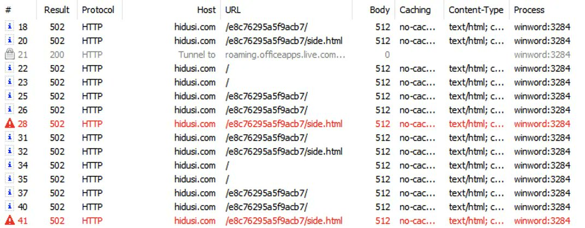

# Dinosn
**https://twitter.com/Dinosn/status/1597568762525683712 _at 2022-11-29, 12:30:49_**
<blockquote>
Cybersecurity firm warns of actively exploited Windows IKE RCE (CVE-2022-34721) flaw https://t.co/8ldhAXiM2e
</blockquote>

* https://securityonline.info/cybersecurity-firm-warns-of-actively-exploited-windows-ike-rce-cve-2022-34721-flaw/

<table><tr>
<td>Quotes: <code>1</code></td>
<td>Replies: <code>0</code></td>
<td>Retweets: <code>17</code></td>
<td>Favorites: <code>46</code></td>
</tr></table>

---

# kmkz_security
**https://twitter.com/kmkz_security/status/1597431127400419328 _at 2022-11-29, 03:23:54_**
<blockquote>
Enter "Sandbreak" - Vulnerability In vm2 Sandbox Module Enables Remote Code Execution (CVE-2022-36067)
https://t.co/STovk3sJR0
</blockquote>

* https://www.oxeye.io/blog/vm2-sandbreak-vulnerability-cve-2022-36067

<table><tr>
<td>Quotes: <code>1</code></td>
<td>Replies: <code>0</code></td>
<td>Retweets: <code>20</code></td>
<td>Favorites: <code>42</code></td>
</tr></table>

---

# CyberWarship
**https://twitter.com/CyberWarship/status/1596815356735246336 _at 2022-11-27, 10:37:03_**
<blockquote>
"Unpacking CVE-2021-40444: A Deep Technical Analysis of an Office RCE Exploit" 

#infosec #redteam #pentest
https://t.co/xx3a70mHaH https://t.co/A1z5Zpv0hg
</blockquote>

* https://billdemirkapi.me/unpacking-cve-2021-40444-microsoft-office-rce/

<table><tr>
<td></td>
<td></td>
<td></td>
<td></td>
</table></tr>
<table><tr>
<td>Quotes: <code>1</code></td>
<td>Replies: <code>0</code></td>
<td>Retweets: <code>28</code></td>
<td>Favorites: <code>58</code></td>
</tr></table>

---

# Dinosn
**https://twitter.com/Dinosn/status/1596037616050257920 _at 2022-11-25, 07:06:35_**
<blockquote>
CVE-2022-4135: New Zero-Day Vulnerability in Google Chrome https://t.co/NoDKGHXKBh
</blockquote>

* https://securityonline.info/cve-2022-4135-new-zero-day-vulnerability-in-google-chrome/

<table><tr>
<td>Quotes: <code>1</code></td>
<td>Replies: <code>0</code></td>
<td>Retweets: <code>49</code></td>
<td>Favorites: <code>94</code></td>
</tr></table>

---

# ProjectZeroBugs
**https://twitter.com/ProjectZeroBugs/status/1595826866929119233 _at 2022-11-24, 17:09:08_**
<blockquote>
Chrome: heap-use-after-free in blink::LocalFrameView::PerformLayout (incomplete fix for CVE-2022-3199) https://t.co/RJZvGYoGAv
</blockquote>

* https://bugs.chromium.org/p/project-zero/issues/detail?id=2358

<table><tr>
<td>Quotes: <code>2</code></td>
<td>Replies: <code>0</code></td>
<td>Retweets: <code>13</code></td>
<td>Favorites: <code>51</code></td>
</tr></table>

---

# OpenSourceHacks
**https://twitter.com/OpenSourceHacks/status/1595673739135442949 _at 2022-11-24, 07:00:40_**
<blockquote>
(CVE-2022-4096): Server-Side Request Forgery (SSRF) in appsmithorg/appsmith.

https://t.co/evdmtpWweH

Disclosed by @basu_banakar, fixed by @theappsmith...

#opensource #CVE #bugbounty #security #vulnerability
</blockquote>

* https://huntr.dev/bounties/7969e834-5982-456e-9683-861a7a5e2d22

<table><tr>
<td>Quotes: <code>2</code></td>
<td>Replies: <code>1</code></td>
<td>Retweets: <code>32</code></td>
<td>Favorites: <code>69</code></td>
</tr></table>

---

# thezdi
**https://twitter.com/thezdi/status/1595447545903435776 _at 2022-11-23, 16:01:51_**
<blockquote>
The latest post from the researchers at the Trend Micro Research Team looks at CVE-2022-40300 - a SQL injection in #ManageEngine Privileged Access Management. Some light reading for your holiday enjoyment. https://t.co/RnaL5YGVqN
</blockquote>

* https://www.zerodayinitiative.com/blog/2022/11/22/cve-2022-40300-sql-injection-in-manageengine-privileged-access-management

<table><tr>
<td>Quotes: <code>1</code></td>
<td>Replies: <code>0</code></td>
<td>Retweets: <code>9</code></td>
<td>Favorites: <code>45</code></td>
</tr></table>

---

# momika233
**https://twitter.com/momika233/status/1595085371754291200 _at 2022-11-22, 16:02:42_**
<blockquote>
CVE-2022-40127
Apache Airflow &lt; 2.4.0 DAG example_bash_operator RCE
https://t.co/KCrDO9yevc
</blockquote>

* https://github.com/Mr-xn/CVE-2022-40127

<table><tr>
<td>Quotes: <code>2</code></td>
<td>Replies: <code>1</code></td>
<td>Retweets: <code>42</code></td>
<td>Favorites: <code>110</code></td>
</tr></table>

---

# basu_banakar
**https://twitter.com/basu_banakar/status/1595036923802058753 _at 2022-11-22, 12:50:11_**
<blockquote>
Hi Everyone, I have published a writeup on
my 2nd CVE i.e CVE-2022-4096 (SSRF Via DNS Rebinding)
Check it out here
https://t.co/1XzAO6rV09 

#bugbountytip #bugbountytips #ssrf #hacking  #awssecurity #aws #bugbounty
</blockquote>

* https://basu-banakar.medium.com/ssrf-via-dns-rebinding-cve-2022-4096-b7bf75928bb2

<table><tr>
<td>Quotes: <code>3</code></td>
<td>Replies: <code>1</code></td>
<td>Retweets: <code>90</code></td>
<td>Favorites: <code>228</code></td>
</tr></table>

---

# cyber_advising
**https://twitter.com/cyber_advising/status/1595018573486899202 _at 2022-11-22, 11:37:16_**
<blockquote>
CVE-2022-40127 : Apache Airflow &lt; 2.4.0 DAG example_bash_operator Remote Code Execution.

PoC
https://t.co/bkM3PmBMaN https://t.co/oJGzB02lUc
</blockquote>

* https://github.com/Mr-xn/CVE-2022-40127

<table><tr>
<td></td>
</table></tr>
<table><tr>
<td>Quotes: <code>1</code></td>
<td>Replies: <code>0</code></td>
<td>Retweets: <code>44</code></td>
<td>Favorites: <code>123</code></td>
</tr></table>

---

# nav1n0x
**https://twitter.com/nav1n0x/status/1594402341373067269 _at 2022-11-20, 18:48:35_**
<blockquote>
CVE-2020-11110 (Grafana 6.7.x stored XSS) in a biggest drinks maker's monitoring system. Funny that they still run tens of vulnerable apps. So, closing the day with a Critical finding. #BugBounty #Grafana #XSS https://t.co/AvP4GIPXkp
</blockquote>

<table><tr>
<td></td>
<td></td>
</table></tr>
<table><tr>
<td>Quotes: <code>1</code></td>
<td>Replies: <code>1</code></td>
<td>Retweets: <code>35</code></td>
<td>Favorites: <code>133</code></td>
</tr></table>

---

# 0xor0ne
**https://twitter.com/0xor0ne/status/1594050393323053058 _at 2022-11-19, 19:30:04_**
<blockquote>
RCE and other vulnerabilities in Juniper SSLVPN / JunOS (CVE-2022-22241)
Credits @OctagonNetworks   

https://t.co/9i0v76DJkH 

#juniper #cve #exploit #rce #infosec #embedded #cybersecurity https://t.co/evmEwEvWc2
</blockquote>

* https://octagon.net/blog/2022/10/28/juniper-sslvpn-junos-rce-and-multiple-vulnerabilities/

<table><tr>
<td></td>
<td></td>
<td></td>
</table></tr>
<table><tr>
<td>Quotes: <code>3</code></td>
<td>Replies: <code>1</code></td>
<td>Retweets: <code>39</code></td>
<td>Favorites: <code>67</code></td>
</tr></table>

---

# SaraBadran18
**https://twitter.com/SaraBadran18/status/1593559912386371584 _at 2022-11-18, 11:01:04_**
<blockquote>
this is a working PoC script of the Exchange 0day exploited ITW for CVE-2022-41040 and CVE-2022-41082 (A.K.A #ProxyNotShell) 🔥🔥🔥👩‍💻👨‍💻
------
https://t.co/3NO7Pw96qI
-----
By @testanull
----
#hackerone #BugBounty #bugbountytips
#writeups
#bugbountytips 
#bugbountytip #poc https://t.co/3jQIHtPseB
</blockquote>

* https://github.com/testanull/ProxyNotShell-PoC

<table><tr>
<td></td>
</table></tr>
<table><tr>
<td>Quotes: <code>1</code></td>
<td>Replies: <code>0</code></td>
<td>Retweets: <code>27</code></td>
<td>Favorites: <code>76</code></td>
</tr></table>

---

# ntsuji
**https://twitter.com/ntsuji/status/1593311472293056512 _at 2022-11-17, 18:33:51_**
<blockquote>
F5製品のBIG-IPとBIG-IQに2つのリモートコード実行の脆弱性（CVE-2022-41622, CVE-2022-41800）を修正するHotFixが提供されています。CVE-2022-41622は既にPoCが公開されていますね。

F5 fixes two remote code execution flaws in BIG-IP, BIG-IQ https://t.co/MMOGc33gBg
</blockquote>

* https://www.bleepingcomputer.com/news/security/f5-fixes-two-remote-code-execution-flaws-in-big-ip-big-iq/

<table><tr>
<td>Quotes: <code>1</code></td>
<td>Replies: <code>1</code></td>
<td>Retweets: <code>9</code></td>
<td>Favorites: <code>37</code></td>
</tr></table>

---

# wdormann
**https://twitter.com/wdormann/status/1593311129874403335 _at 2022-11-17, 18:32:30_**
<blockquote>
Can confirm.
This is a working exploit for #ProxyNotShell CVE-2022-41040 / CVE-2022-41082
Here we have an Exchange 2019 box that's only up to date with what was available in October, and we have successful execution of calc.exe as SYSTEM.
🎉 https://t.co/BlCJSJMcJM
</blockquote>

<table><tr>
<td></td>
<td></td>
</table></tr>
<table><tr>
<td>Quotes: <code>2</code></td>
<td>Replies: <code>5</code></td>
<td>Retweets: <code>100</code></td>
<td>Favorites: <code>251</code></td>
</tr></table>

---

# sirifu4k1
**https://twitter.com/sirifu4k1/status/1593193765954801664 _at 2022-11-17, 10:46:08_**
<blockquote>
Microsoft Exchange Server Remote Code Execution Vulnerability.
PoC for CVE-2022-41040 and CVE-2022-41082
#CVE #bugbounty #infosec #hacktools #cybersecurity #pentesting 
https://t.co/6uzq42WyrQ
</blockquote>

* https://github.com/testanull/ProxyNotShell-PoC

<table><tr>
<td>Quotes: <code>1</code></td>
<td>Replies: <code>0</code></td>
<td>Retweets: <code>19</code></td>
<td>Favorites: <code>31</code></td>
</tr></table>

---

# chudyPB
**https://twitter.com/chudyPB/status/1592931157095907328 _at 2022-11-16, 17:22:37_**
<blockquote>
My analysis of amazing Exchange RCE (CVE-2022-41082). Spoiler alert: there will be part 2 ;)
</blockquote>

<table><tr>
<td>Quotes: <code>2</code></td>
<td>Replies: <code>0</code></td>
<td>Retweets: <code>36</code></td>
<td>Favorites: <code>116</code></td>
</tr></table>

---

# thezdi
**https://twitter.com/thezdi/status/1592925234298224640 _at 2022-11-16, 16:59:05_**
<blockquote>
Control Your Types or Get Pwned: Remote Code Execution in Exchange PowerShell Backend - @chudyPB provides the details of CVE-2022-41040 and -41082. These were the #Exchange bugs used in active attacks and recently patched. https://t.co/vEG63C2jKo
</blockquote>

* https://www.zerodayinitiative.com/blog/2022/11/14/control-your-types-or-get-pwned-remote-code-execution-in-exchange-powershell-backend

<table><tr>
<td>Quotes: <code>3</code></td>
<td>Replies: <code>1</code></td>
<td>Retweets: <code>67</code></td>
<td>Favorites: <code>170</code></td>
</tr></table>

---

# Dinosn
**https://twitter.com/Dinosn/status/1592045400110026752 _at 2022-11-14, 06:42:56_**
<blockquote>
CVE-2022-3977: Linux kernel Local Privilege Escalation Vulnerability https://t.co/fui0qdodjy
</blockquote>

* https://securityonline.info/cve-2022-3977-linux-kernel-local-privilege-escalation-vulnerability/

<table><tr>
<td>Quotes: <code>6</code></td>
<td>Replies: <code>3</code></td>
<td>Retweets: <code>110</code></td>
<td>Favorites: <code>280</code></td>
</tr></table>

---

# momika233
**https://twitter.com/momika233/status/1591807843673735170 _at 2022-11-13, 14:58:58_**
<blockquote>
CVE-2022-41352 Zimbra Unauthenticated RCE
#bugbounty #bugbountytip #RCE

https://t.co/gFLIMLWqOT
</blockquote>

* https://github.com/Cr4ckC4t/cve-2022-41352-zimbra-rce

<table><tr>
<td>Quotes: <code>1</code></td>
<td>Replies: <code>1</code></td>
<td>Retweets: <code>77</code></td>
<td>Favorites: <code>178</code></td>
</tr></table>

---

# 0xor0ne
**https://twitter.com/0xor0ne/status/1591347602381066240 _at 2022-11-12, 08:30:08_**
<blockquote>
CVE-2021-1961: vulnerability in Qualcomm’s TrustZone (QSEE) which allows to modify the Android kernel memory and achieve RCE
Great writeup by @tamir_zb
 
https://t.co/2GD7Cgju7l 

#android #exploit #qualcomm #trustzome #infosec #cybersecurity #Linux #kernel https://t.co/UepvnoB3vm
</blockquote>

* https://tamirzb.com/attacking-android-kernel-using-qualcomm-trustzone

<table><tr>
<td></td>
<td></td>
<td></td>
<td></td>
</table></tr>
<table><tr>
<td>Quotes: <code>2</code></td>
<td>Replies: <code>0</code></td>
<td>Retweets: <code>59</code></td>
<td>Favorites: <code>170</code></td>
</tr></table>

---

# eed3si9n
**https://twitter.com/eed3si9n/status/1590844226509864963 _at 2022-11-10, 23:09:54_**
<blockquote>
⚠️ sbt 1.8.0 is released!

the highlights are:
- Coursier 2.1.0-RC1 and Ivy fork update to fix CVE-2022-37866, path traversal security vulnerability
- updates to scala-xml 2.x
https://t.co/s0lwyb6Zgq #Scala
</blockquote>

* https://eed3si9n.com/sbt-1.8.0

<table><tr>
<td>Quotes: <code>2</code></td>
<td>Replies: <code>2</code></td>
<td>Retweets: <code>16</code></td>
<td>Favorites: <code>58</code></td>
</tr></table>

---

# hetmehtaa
**https://twitter.com/hetmehtaa/status/1590303719438323714 _at 2022-11-09, 11:22:07_**
<blockquote>
SMBleedingGhost Writeup📝

Part 1 - Chaining SMBleed (CVE-2020-1206) with SMBGhost
https://t.co/Gn7WTrKRti

Part 2 - Unauthenticated Memory Read - Preparing the Ground for an RCE
https://t.co/lE177ci0Ig

Part 3 - From Remote Read (SMBleed) to RCE
https://t.co/qoL9jlhlhv

#infosec
</blockquote>

* https://blog.zecops.com/research/smbleedingghost-writeup-chaining-smbleed-cve-2020-1206-with-smbghost
* https://blog.zecops.com/research/smbleedingghost-writeup-part-ii-unauthenticated-memory-read-preparing-the-ground-for-an-rce
* https://blog.zecops.com/research/smbleedingghost-writeup-part-iii-from-remote-read-smbleed-to-rce

<table><tr>
<td>Quotes: <code>1</code></td>
<td>Replies: <code>4</code></td>
<td>Retweets: <code>40</code></td>
<td>Favorites: <code>86</code></td>
</tr></table>

---

# buffaloverflow
**https://twitter.com/buffaloverflow/status/1590060508610461696 _at 2022-11-08, 19:15:41_**
<blockquote>
RT @wdormann: It's time to reveal the #ZippyReads CVE-2022-41091 3-word description:
read-only files
When you zip a read-only file, Windows…
</blockquote>

<table><tr>
<td>Quotes: <code>0</code></td>
<td>Replies: <code>0</code></td>
<td>Retweets: <code>122</code></td>
<td>Favorites: <code>0</code></td>
</tr></table>

---

# campuscodi
**https://twitter.com/campuscodi/status/1590044645756919808 _at 2022-11-08, 18:12:39_**
<blockquote>
The Microsoft November 2022 Patch Tuesday updates are out. 68 vulnerabilities fixed.

Also, 4 zero-days:
-CVE-2022-41128, JScript9 RCE, via Google TAG
-CVE-2022-41091, MOTW bypass
-CVE-2022-41073, Print spooler EoP, via MSTIC
-CVE-2022-41125, CNG EoP

https://t.co/NC7rup8OtG https://t.co/CgTSrMHsHp
</blockquote>

* https://rawcdn.githack.com/campuscodi/Microsoft-Patch-Tuesday-Security-Reports/1a976afcf461b6f104d40601305e4c9773175f57/Reports/MSRC_CVEs2022-Nov.html

<table><tr>
<td></td>
</table></tr>
<table><tr>
<td>Quotes: <code>6</code></td>
<td>Replies: <code>2</code></td>
<td>Retweets: <code>65</code></td>
<td>Favorites: <code>162</code></td>
</tr></table>

---

# wdormann
**https://twitter.com/wdormann/status/1590044005395357697 _at 2022-11-08, 18:10:07_**
<blockquote>
It's time to reveal the #ZippyReads CVE-2022-41091 3-word description:
read-only files
When you zip a read-only file, Windows will upon extraction:
1) Write file
2) Mark as read-only
3) Attempt to set the MotW on the read-only file (and fail)
That's it.  That's the bug. https://t.co/6Z8TXGEbey
</blockquote>

<table><tr>
<td></td>
</table></tr>
<table><tr>
<td>Quotes: <code>17</code></td>
<td>Replies: <code>12</code></td>
<td>Retweets: <code>124</code></td>
<td>Favorites: <code>297</code></td>
</tr></table>

---

# 0xor0ne
**https://twitter.com/0xor0ne/status/1589890581295243266 _at 2022-11-08, 08:00:27_**
<blockquote>
CVE-2021-25682: Ubuntu's apport crash handler exploitation writeup by @Gr33nh4t 

https://t.co/cLhsDMMTTl 

#ubuntu #Linux #lpe #exploit #infosec #cybersecurity https://t.co/6TFPCDnhwn
</blockquote>

* https://alephsecurity.com/2021/02/16/apport-lpe/

<table><tr>
<td></td>
<td></td>
<td></td>
</table></tr>
<table><tr>
<td>Quotes: <code>1</code></td>
<td>Replies: <code>0</code></td>
<td>Retweets: <code>20</code></td>
<td>Favorites: <code>57</code></td>
</tr></table>

---

# wdormann
**https://twitter.com/wdormann/status/1589611238795145223 _at 2022-11-07, 13:30:27_**
<blockquote>
OpenSSL OPENSSLDIR variable usage is the Windows privilege escalation gift that keeps on giving.
This time: CVE-2022-43751 in McAfee Total Protection
https://t.co/2OlvGShWsy https://t.co/9Iogt66K8E
</blockquote>

* https://www.mcafee.com/support/?articleId=TS103348&page=shell&shell=article-view

<table><tr>
<td></td>
</table></tr>
<table><tr>
<td>Quotes: <code>1</code></td>
<td>Replies: <code>0</code></td>
<td>Retweets: <code>14</code></td>
<td>Favorites: <code>57</code></td>
</tr></table>

---

# h4x0r_dz
**https://twitter.com/h4x0r_dz/status/1588486231494885380 _at 2022-11-04, 11:00:04_**
<blockquote>
CVE-2022-41040 &amp; CVE-2022-41082
#proxynotshell https://t.co/jdx33sbrm1
</blockquote>

<table><tr>
<td></td>
</table></tr>
<table><tr>
<td>Quotes: <code>3</code></td>
<td>Replies: <code>8</code></td>
<td>Retweets: <code>74</code></td>
<td>Favorites: <code>281</code></td>
</tr></table>

---

# 0xor0ne
**https://twitter.com/0xor0ne/status/1588440983603134465 _at 2022-11-04, 08:00:16_**
<blockquote>
CVE-2022-32250: limited use-after-free in nf_tables exploitation by @saidelike (@NCCGroupInfosec)

https://t.co/NKTlRmplK6 

#exploitation #infosec #cybersecurity #hacking #cve #Linux #kernel #nftables https://t.co/NMK2NmYY8N
</blockquote>

* https://research.nccgroup.com/2022/09/01/settlers-of-netlink-exploiting-a-limited-uaf-in-nf_tables-cve-2022-32250/

<table><tr>
<td></td>
<td></td>
<td></td>
<td></td>
</table></tr>
<table><tr>
<td>Quotes: <code>1</code></td>
<td>Replies: <code>2</code></td>
<td>Retweets: <code>29</code></td>
<td>Favorites: <code>77</code></td>
</tr></table>

---

# kmkz_security
**https://twitter.com/kmkz_security/status/1588085516175659009 _at 2022-11-03, 08:27:46_**
<blockquote>
Technical Analysis of CVE-2021-1732, a win32k window object type confusion leading to an OOB write which can be used to create arbitrary memory RW capabilities within the Windows kernel (leading to LPE) - by @REAL__security 
https://t.co/IEFOeyQHTb
</blockquote>

* https://www.real-sec.com/2022/01/technical-analysis-of-cve-2021-1732/

<table><tr>
<td>Quotes: <code>1</code></td>
<td>Replies: <code>0</code></td>
<td>Retweets: <code>14</code></td>
<td>Favorites: <code>34</code></td>
</tr></table>

---

# datadoghq
**https://twitter.com/datadoghq/status/1587490953790717954 _at 2022-11-01, 17:05:12_**
<blockquote>
Today, #OpenSSL released a patch for two vulnerabilities, CVE-2022-3602 and CVE-2022-3786. Our Security Labs team published a technical blog to help customers and the community understand the impact of CVE-2022-3602, with a PoC crash to boot! https://t.co/kC8X2zwwTe
</blockquote>

* http://dtdg.co/openssl-punycode-vulnerability

<table><tr>
<td>Quotes: <code>11</code></td>
<td>Replies: <code>4</code></td>
<td>Retweets: <code>58</code></td>
<td>Favorites: <code>116</code></td>
</tr></table>

---

