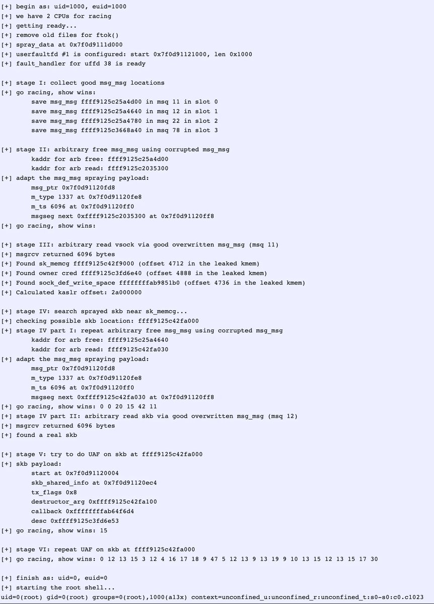

# 0xor0ne
**https://twitter.com/0xor0ne/status/1600037430303801344 _at 2022-12-06, 08:00:25_**
<blockquote>
CVE-2021-26708: exploit writeup by @a13xp0p0v 
five race condition bugs in the virtual socket implementation of the Linux kernel that allow a local privilege escalation bypassing SMEP and SMAP 

https://t.co/5bpxnsvzjh 

#Linux #kernel #infosec #cybersecurity #hacking https://t.co/DH6ZMNgX6I
</blockquote>

* https://a13xp0p0v.github.io/2021/02/09/CVE-2021-26708.html

<table><tr>
<td></td>
<td></td>
<td></td>
<td></td>
</table></tr>
<table><tr>
<td>Quotes: <code>2</code></td>
<td>Replies: <code>2</code></td>
<td>Retweets: <code>66</code></td>
<td>Favorites: <code>168</code></td>
</tr></table>

---

# TheHackersNews
**https://twitter.com/TheHackersNews/status/1599670378540191744 _at 2022-12-05, 07:41:53_**
<blockquote>
A new RCE #vulnerability [CVE-2022-23093] has been reported in the ping module of the FreeBSD operating system that could be exploited to remotely crash the program or execute malicious code.

Read: https://t.co/Zl1iWHPFvU

#infosec #cybersecurity #hacking #technology
</blockquote>

* https://thehackernews.com/2022/12/critical-ping-vulnerability-allows.html

<table><tr>
<td>Quotes: <code>12</code></td>
<td>Replies: <code>4</code></td>
<td>Retweets: <code>97</code></td>
<td>Favorites: <code>153</code></td>
</tr></table>

---

# S0ufi4n3
**https://twitter.com/S0ufi4n3/status/1599646814495350785 _at 2022-12-05, 06:08:15_**
<blockquote>
CVE-2022-41040 : Visual Studio Code: Remote Code Execution PoC

https://t.co/MfBAH49oP4
</blockquote>

* https://github.com/google/security-research/security/advisories/GHSA-pw56-c55x-cm9m

<table><tr>
<td>Quotes: <code>1</code></td>
<td>Replies: <code>0</code></td>
<td>Retweets: <code>10</code></td>
<td>Favorites: <code>35</code></td>
</tr></table>

---

# NandanLohitaksh
**https://twitter.com/NandanLohitaksh/status/1599495693563203585 _at 2022-12-04, 20:07:45_**
<blockquote>
Top 10 exploited vulnerabilities in 2022

1.Log4Shell (CVE-2021-44228)
2.Follina (CVE-2022-30190)
3.Spring4Shell (CVE-2022-22965)
https://t.co/pWuHaAIFa0 Chrome zero-day (CVE-2022-0609)
5.F5 BIG-IP (CVE-2022-1388)

#bugbounty #bugbountytips #cybersecurity #infosec
</blockquote>

* http://4.Google

<table><tr>
<td>Quotes: <code>3</code></td>
<td>Replies: <code>6</code></td>
<td>Retweets: <code>88</code></td>
<td>Favorites: <code>256</code></td>
</tr></table>

---

# securestep9
**https://twitter.com/securestep9/status/1599450503074959360 _at 2022-12-04, 17:08:10_**
<blockquote>
#WordPress Core v5.8.2 SQL Injection (#SQLi) #vulnerability CVE-2022-21661 POC:

https://t.co/EJTSFcGLit https://t.co/IGkNV1Tylo
</blockquote>

* https://github.com/APTIRAN/CVE-2022-21661

<table><tr>
<td></td>
</table></tr>
<table><tr>
<td>Quotes: <code>3</code></td>
<td>Replies: <code>1</code></td>
<td>Retweets: <code>32</code></td>
<td>Favorites: <code>119</code></td>
</tr></table>

---

# sunnynehrabro
**https://twitter.com/sunnynehrabro/status/1599371692241203211 _at 2022-12-04, 11:55:00_**
<blockquote>
Threat actors have been actively exploiting Zimbra CVE-2022-41352 flaw to #hack several servers in the wild.

This flaw is an RCE flaw and has a CVSS score of 9.8 of 10 (very very critical).

#AIIMS Delhi was also using Zimbra (exploitation of this flaw in AIIMS is not confirmed)
</blockquote>

<table><tr>
<td>Quotes: <code>2</code></td>
<td>Replies: <code>5</code></td>
<td>Retweets: <code>65</code></td>
<td>Favorites: <code>222</code></td>
</tr></table>

---

# cyberkendra
**https://twitter.com/cyberkendra/status/1599310245918289920 _at 2022-12-04, 07:50:51_**
<blockquote>
CVE-2022-21661 :  WordPress Core 5.8.2 - 'WP_Query' SQL Injection 

https://t.co/zy9f6sO8Ag
#WordPress #security #hack https://t.co/2NJaGdk3ZE
</blockquote>

* https://github.com/APTIRAN/CVE-2022-21661

<table><tr>
<td></td>
</table></tr>
<table><tr>
<td>Quotes: <code>5</code></td>
<td>Replies: <code>4</code></td>
<td>Retweets: <code>130</code></td>
<td>Favorites: <code>415</code></td>
</tr></table>

---

# cyber_advising
**https://twitter.com/cyber_advising/status/1599278556885839874 _at 2022-12-04, 05:44:55_**
<blockquote>
CVE-2022-44721 Privilege escalation in Crowdstrike Falcon Uninstaller. 
Exploiting this vulnerability allows an attacker with administrative privileges to bypass the token check on Windows end-devices and to uninstall the sensor from the device...

PoC
https://t.co/2gnwqVu9xX https://t.co/RYixATcl9O
</blockquote>

* https://github.com/purplededa/CVE-2022-44721-CsFalconUninstaller

<table><tr>
<td></td>
</table></tr>
<table><tr>
<td>Quotes: <code>3</code></td>
<td>Replies: <code>4</code></td>
<td>Retweets: <code>74</code></td>
<td>Favorites: <code>190</code></td>
</tr></table>

---

# TheHackersNews
**https://twitter.com/TheHackersNews/status/1599026414526906370 _at 2022-12-03, 13:03:00_**
<blockquote>
It's time to update your #Chrome browser!

#Google just rolled out a patch update for yet another zero-day #vulnerability [CVE-2022-4262] that attackers are exploiting in the wild.

Read: https://t.co/zZeVKa8VKU

#cybersecurity #software #technology #infosec #hacking
</blockquote>

* https://thehackernews.com/2022/12/google-rolls-out-new-chrome-browser.html

<table><tr>
<td>Quotes: <code>3</code></td>
<td>Replies: <code>3</code></td>
<td>Retweets: <code>68</code></td>
<td>Favorites: <code>98</code></td>
</tr></table>

---

# osamta210
**https://twitter.com/osamta210/status/1598930287601233920 _at 2022-12-03, 06:41:01_**
<blockquote>
CVE-2022-21661

POC  | WordPress Core 5.8.2 - 'WP_Query' SQL Injection

https://t.co/qOgADBKBea…

https://t.co/FQwS0Gv63Y

#Bugbounty #hacker #exploit #WordPress https://t.co/4xjsy7H7rj
</blockquote>

* http://github.com/APTIRAN/CVE-20
* https://www.exploit-db.com/exploits/50663

<table><tr>
<td></td>
</table></tr>
<table><tr>
<td>Quotes: <code>3</code></td>
<td>Replies: <code>3</code></td>
<td>Retweets: <code>42</code></td>
<td>Favorites: <code>119</code></td>
</tr></table>

---

# TheHackersNews
**https://twitter.com/TheHackersNews/status/1598900629002661889 _at 2022-12-03, 04:43:10_**
<blockquote>
It's time to update your #Chrome browser!

#Google just rolled out a patch update for yet another zero-day #vulnerability [CVE-2022-4262] that attackers are exploiting in the wild.

Read: https://t.co/zZeVKa9tAs

#cybersecurity #software #technology #infosec #hacking
</blockquote>

* https://thehackernews.com/2022/12/google-rolls-out-new-chrome-browser.html

<table><tr>
<td>Quotes: <code>6</code></td>
<td>Replies: <code>4</code></td>
<td>Retweets: <code>61</code></td>
<td>Favorites: <code>109</code></td>
</tr></table>

---

# MrTuxracer
**https://twitter.com/MrTuxracer/status/1598337144480796673 _at 2022-12-01, 15:24:05_**
<blockquote>
In the first part, I've shown you how to bypass @Intel DCM's authentication. In this part, you'll learn how to finally gain Remote Code Execution through an authenticated SQL Injection (aka CVE-2022-21225).

#BugBounty #security

https://t.co/TYAWd7XcPc
</blockquote>

* https://www.rcesecurity.com/2022/12/from-zero-to-hero-part-2-intel-dcm-sql-injection-to-rce-cve-2022-21225

<table><tr>
<td>Quotes: <code>1</code></td>
<td>Replies: <code>0</code></td>
<td>Retweets: <code>40</code></td>
<td>Favorites: <code>109</code></td>
</tr></table>

---

# TheHackersNews
**https://twitter.com/TheHackersNews/status/1598282337502269441 _at 2022-12-01, 11:46:18_**
<blockquote>
Researchers have disclosed a critical remote code execution (RCE) #vulnerability (CVE-2022-4116) affecting the Quarkus Java framework.

Read: https://t.co/EW6fnJ82j8

#infosec #cybersecurity #hacking
</blockquote>

* https://thehackernews.com/2022/12/researchers-disclose-critical-rce.html

<table><tr>
<td>Quotes: <code>3</code></td>
<td>Replies: <code>0</code></td>
<td>Retweets: <code>37</code></td>
<td>Favorites: <code>43</code></td>
</tr></table>

---

