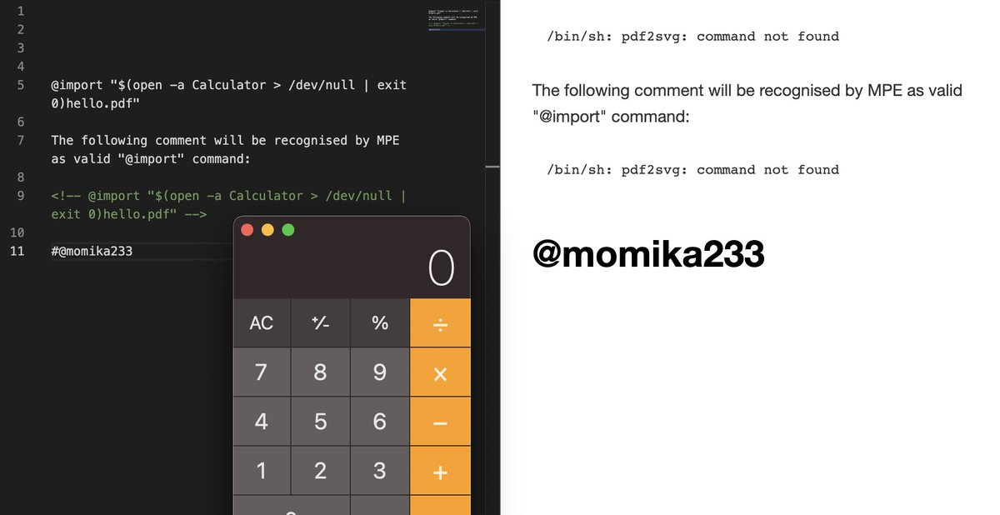

# OmarHashem666
**https://twitter.com/OmarHashem666/status/1608861749180239875 _at 2022-12-30, 16:25:06_**
<blockquote>
Hello guys, I end this year by sharing with you a new article about how I found a SQL Injection Zero Day (CVE-2022-38627) via static analysis
Research:
https://t.co/9kce6RkcxJ

Exploit:
https://t.co/1hCgqxUTb6

#BugBounty #bugbountytips #Zeroday #0day #redteam #Pentesting
</blockquote>

* https://omar0x01.medium.com/15cebd072ed6
* https://github.com/omarhashem123/Security-Research/tree/main/CVE-2022-38627

<table><tr>
<td>Quotes: <code>2</code></td>
<td>Replies: <code>5</code></td>
<td>Retweets: <code>120</code></td>
<td>Favorites: <code>321</code></td>
</tr></table>

---

# 0xor0ne
**https://twitter.com/0xor0ne/status/1608436428538519554 _at 2022-12-29, 12:15:02_**
<blockquote>
Cool blog post by @cutesmilee__ on CVE-2019-2215 (use after free in binder)

https://t.co/YURrIRnYgm 

#exploit #cve #infosec #cybersecurity https://t.co/nCNClNvKaW
</blockquote>

* https://cutesmilee.github.io/kernel/linux/android/2022/02/17/cve-2019-2215_writeup.html

<table><tr>
<td></td>
<td></td>
<td></td>
</table></tr>
<table><tr>
<td>Quotes: <code>2</code></td>
<td>Replies: <code>1</code></td>
<td>Retweets: <code>23</code></td>
<td>Favorites: <code>88</code></td>
</tr></table>

---

# ptracesecurity
**https://twitter.com/ptracesecurity/status/1607058809842696194 _at 2022-12-25, 17:00:52_**
<blockquote>
CVE-2022-42046 Proof of Concept of wfshbr64.sys local privilege escalation via DKOM https://t.co/bMtadh0XRc #Pentesting #CyberSecurity #Infosec https://t.co/BgOfxjjR4y
</blockquote>

* https://github.com/kkent030315/CVE-2022-42046

<table><tr>
<td></td>
</table></tr>
<table><tr>
<td>Quotes: <code>1</code></td>
<td>Replies: <code>0</code></td>
<td>Retweets: <code>11</code></td>
<td>Favorites: <code>41</code></td>
</tr></table>

---

# Dinosn
**https://twitter.com/Dinosn/status/1606883825287585792 _at 2022-12-25, 05:25:33_**
<blockquote>
CVE-2022-42046 Proof of Concept of wfshbr64.sys local privilege escalation via DKOM https://t.co/DLKfcDiwJC
</blockquote>

* https://github.com/kkent030315/CVE-2022-42046

<table><tr>
<td>Quotes: <code>2</code></td>
<td>Replies: <code>0</code></td>
<td>Retweets: <code>46</code></td>
<td>Favorites: <code>147</code></td>
</tr></table>

---

# jack_halon
**https://twitter.com/jack_halon/status/1606805314132639744 _at 2022-12-25, 00:13:34_**
<blockquote>
Merry Christmas to me! 🎅🎄 I finally developed a working RCE exploit for CVE-2018-17463! 🥳 I'll be sharing details on how this was achieved in the 3rd and final part of my browser exploitation series on Chrome. Keep an eye out for the update! https://t.co/3zuulNher4
</blockquote>

<table><tr>
<td></td>
</table></tr>
<table><tr>
<td>Quotes: <code>3</code></td>
<td>Replies: <code>2</code></td>
<td>Retweets: <code>23</code></td>
<td>Favorites: <code>209</code></td>
</tr></table>

---

# kento932376
**https://twitter.com/kento932376/status/1606600706802475008 _at 2022-12-24, 10:40:32_**
<blockquote>
CVE-2022-42046 is now published.

wfshbr64.sys and wfshbr32.sys are vulnerable to local privilege escalation through intentional manipulation of kernel objects using a specially crafted IOCTL.

Co-Authored @DoranekoSystems 

PoC: https://t.co/EvJ1kTOJAC
</blockquote>

* https://github.com/kkent030315/CVE-2022-42046

<table><tr>
<td>Quotes: <code>2</code></td>
<td>Replies: <code>1</code></td>
<td>Retweets: <code>146</code></td>
<td>Favorites: <code>363</code></td>
</tr></table>

---

# Dinosn
**https://twitter.com/Dinosn/status/1605655765217206272 _at 2022-12-21, 20:05:40_**
<blockquote>
PoC Code for Linux Kernel Privilege Escalation Flaw (CVE-2022-2602) Published https://t.co/m7KvdfzwNx
</blockquote>

* https://securityonline.info/poc-code-for-linux-kernel-privilege-escalation-flaw-cve-2022-2602-published/

<table><tr>
<td>Quotes: <code>2</code></td>
<td>Replies: <code>0</code></td>
<td>Retweets: <code>35</code></td>
<td>Favorites: <code>68</code></td>
</tr></table>

---

# LukeGix
**https://twitter.com/LukeGix/status/1605471913563680768 _at 2022-12-21, 07:55:07_**
<blockquote>
@kiks7_7 and I released a blogpost about the exploitation of CVE-2022-2602: a Linux use-after-free vulnerability in the io_uring subsystem.
 https://t.co/e0X0JsxzRb
</blockquote>

* https://exploiter.dev/blog/2022/CVE-2022-2602.html

<table><tr>
<td>Quotes: <code>2</code></td>
<td>Replies: <code>3</code></td>
<td>Retweets: <code>51</code></td>
<td>Favorites: <code>124</code></td>
</tr></table>

---

# hacktivesec
**https://twitter.com/hacktivesec/status/1605448579337916419 _at 2022-12-21, 06:22:23_**
<blockquote>
https://t.co/UHU4aH4xyu A new blog post by our Security Researcher @kiks7_7  on a very interesting bug (CVE-2022-2602 without a public exploit) that impacts the io_uring subsystem with an Use-After-Free vulnerability.

#cybersecurity #infosec #exploitation #training https://t.co/A8VYk8X1qw
</blockquote>

* https://blog.hacktivesecurity.com/index.php/2022/12/21/cve-2022-2602-dirtycred-file-exploitation-applied-on-an-io_uring-uaf/

<table><tr>
<td></td>
</table></tr>
<table><tr>
<td>Quotes: <code>3</code></td>
<td>Replies: <code>0</code></td>
<td>Retweets: <code>21</code></td>
<td>Favorites: <code>61</code></td>
</tr></table>

---

# momika233
**https://twitter.com/momika233/status/1605077081255161856 _at 2022-12-20, 05:46:11_**
<blockquote>
CVE-2022-41040 and CVE-2022-41082 – zero-days in MS Exchange
https://t.co/bNnCKELBd3
</blockquote>

* https://securelist.com/cve-2022-41040-and-cve-2022-41082-zero-days-in-ms-exchange/108364/

<table><tr>
<td>Quotes: <code>2</code></td>
<td>Replies: <code>2</code></td>
<td>Retweets: <code>79</code></td>
<td>Favorites: <code>199</code></td>
</tr></table>

---

# tbbhunter
**https://twitter.com/tbbhunter/status/1604748719873720320 _at 2022-12-19, 08:01:24_**
<blockquote>
CVE-2021-43444 to 43449: Exploiting ONLYOFFICE Web Sockets for Unauthenticated Remote Code Execution

https://t.co/znO60gAZcg
</blockquote>

* https://labs.nettitude.com/blog/exploiting-onlyoffice-web-sockets-for-unauthenticated-remote-code-execution/

<table><tr>
<td>Quotes: <code>1</code></td>
<td>Replies: <code>0</code></td>
<td>Retweets: <code>11</code></td>
<td>Favorites: <code>43</code></td>
</tr></table>

---

# Dinosn
**https://twitter.com/Dinosn/status/1604730641970393088 _at 2022-12-19, 06:49:34_**
<blockquote>
CVE-2022-46689 PoC Exploit Released for macOS Privilege Escalation Vulnerability https://t.co/2gQoPOMhmu
</blockquote>

* https://securityonline.info/cve-2022-46689-poc-macos-privilege-escalation-vulnerability/

<table><tr>
<td>Quotes: <code>1</code></td>
<td>Replies: <code>0</code></td>
<td>Retweets: <code>28</code></td>
<td>Favorites: <code>76</code></td>
</tr></table>

---

# cyber_advising
**https://twitter.com/cyber_advising/status/1603612846713180165 _at 2022-12-16, 04:47:50_**
<blockquote>
CVE-2022-39066: There is a SQL injection vulnerability in ZTE MF286R. Due to insufficient validation of the input parameters of the phonebook interface

PoC
https://t.co/m0Oq0VXD4i https://t.co/VSVgfkpasf
</blockquote>

* https://github.com/v0lp3/CVE-2022-39066

<table><tr>
<td></td>
</table></tr>
<table><tr>
<td>Quotes: <code>1</code></td>
<td>Replies: <code>0</code></td>
<td>Retweets: <code>28</code></td>
<td>Favorites: <code>66</code></td>
</tr></table>

---

# ptracesecurity
**https://twitter.com/ptracesecurity/status/1603252270547849224 _at 2022-12-15, 04:55:02_**
<blockquote>
SETTLERS OF NETLINK: Exploiting a limited UAF in nf_tables (CVE-2022-32250) https://t.co/MtPdHGe1Wg  #Pentesting #Exploit #CVE #CyberSecurity #Infosec https://t.co/iZN1xFEPPC
</blockquote>

* https://research.nccgroup.com/2022/09/01/settlers-of-netlink-exploiting-a-limited-uaf-in-nf_tables-cve-2022-32250/

<table><tr>
<td></td>
<td></td>
<td></td>
<td></td>
</table></tr>
<table><tr>
<td>Quotes: <code>1</code></td>
<td>Replies: <code>0</code></td>
<td>Retweets: <code>14</code></td>
<td>Favorites: <code>32</code></td>
</tr></table>

---

# kevin_mizu
**https://twitter.com/kevin_mizu/status/1603071806776164355 _at 2022-12-14, 16:57:57_**
<blockquote>
Yesterday, I did a talk on @rootme_org about #electron security. In this talk I also presented a step-by-step writeup of the research leading to finding the XSS to RCE vulnerability on @drawio last summer (CVE-2022-3133) ☀️

You can find the slides here: https://t.co/XHlYtUFG7Z
</blockquote>

* https://slides.com/kevin-mizu/electron-cve-2022-3133

<table><tr>
<td>Quotes: <code>1</code></td>
<td>Replies: <code>2</code></td>
<td>Retweets: <code>37</code></td>
<td>Favorites: <code>90</code></td>
</tr></table>

---

# ryanaraine
**https://twitter.com/ryanaraine/status/1603020237544169472 _at 2022-12-14, 13:33:01_**
<blockquote>
Microsoft upgraded the CVE-2022-37958 vuln to “critical” after IBM Security X-Force Red security researcher Valentina Palmiotti discovered the vulnerability could allow attackers to remotely execute code.

https://t.co/gCbVdyytXI &lt;-- research by @chompie1337
</blockquote>

* https://securityintelligence.com/posts/critical-remote-code-execution-vulnerability-spnego-extended-negotiation-security-mechanism/

<table><tr>
<td>Quotes: <code>4</code></td>
<td>Replies: <code>0</code></td>
<td>Retweets: <code>25</code></td>
<td>Favorites: <code>68</code></td>
</tr></table>

---

# TheHackersNews
**https://twitter.com/TheHackersNews/status/1602886290051153925 _at 2022-12-14, 04:40:46_**
<blockquote>
Warning: Hackers are exploiting a new critical zero-day RCE #vulnerability (CVE-2022-27518) in Citrix ADC &amp; Gateway to gain control of affected systems.

https://t.co/LYMhAjK8XD

It is important that users apply latest security patches immediately to protect against this threat.
</blockquote>

* https://thehackernews.com/2022/12/hackers-actively-exploiting-citrix-adc.html

<table><tr>
<td>Quotes: <code>3</code></td>
<td>Replies: <code>0</code></td>
<td>Retweets: <code>43</code></td>
<td>Favorites: <code>51</code></td>
</tr></table>

---

# chompie1337
**https://twitter.com/chompie1337/status/1602757336908660736 _at 2022-12-13, 20:08:21_**
<blockquote>
Demonstrating CVE-2022-37958 RCE Vuln. Reachable via any Windows application protocol that authenticates. Yes, that means RDP, SMB and many more. Please patch this one, it's serious! 

https://t.co/ikOrTvQIJs https://t.co/bOTmL5Fh2H
</blockquote>

* https://securityintelligence.com/posts/critical-remote-code-execution-vulnerability-spnego-extended-negotiation-security-mechanism/

<table><tr>
<td></td>
</table></tr>
<table><tr>
<td>Quotes: <code>57</code></td>
<td>Replies: <code>78</code></td>
<td>Retweets: <code>1086</code></td>
<td>Favorites: <code>3802</code></td>
</tr></table>

---

# TheHackersNews
**https://twitter.com/TheHackersNews/status/1602633683151699968 _at 2022-12-13, 11:57:00_**
<blockquote>
Urgent: Fortinet has issued emergency patches for a severe pre-auth RCE vulnerability (CVE-2022-42475) affecting its FortiOS SSL-VPN product that is being actively exploited in the wild.

Read: https://t.co/JgEGIJzQgk

#infosec #cybersecurity #hacking
</blockquote>

* https://thehackernews.com/2022/12/fortinet-warns-of-active-exploitation.html

<table><tr>
<td>Quotes: <code>4</code></td>
<td>Replies: <code>0</code></td>
<td>Retweets: <code>61</code></td>
<td>Favorites: <code>80</code></td>
</tr></table>

---

# _0xf4n9x_
**https://twitter.com/_0xf4n9x_/status/1602536041461690368 _at 2022-12-13, 05:29:00_**
<blockquote>
#CVE-2022-46169 Cacti RCE PoC: https://t.co/bOh35P3PuX https://t.co/mA4HDJxCDD
</blockquote>

* http://github.com/0xf4n9x/CVE-2022-46169

<table><tr>
<td></td>
</table></tr>
<table><tr>
<td>Quotes: <code>3</code></td>
<td>Replies: <code>4</code></td>
<td>Retweets: <code>50</code></td>
<td>Favorites: <code>136</code></td>
</tr></table>

---

# TheHackersNews
**https://twitter.com/TheHackersNews/status/1602507809177968645 _at 2022-12-13, 03:36:49_**
<blockquote>
Urgent: Fortinet has issued emergency patches for a severe pre-auth RCE vulnerability (CVE-2022-42475) affecting its FortiOS SSL-VPN product that is being actively exploited in the wild.

Read: https://t.co/JgEGIJifoM

#infosec #cybersecurity #hacking
</blockquote>

* https://thehackernews.com/2022/12/fortinet-warns-of-active-exploitation.html

<table><tr>
<td>Quotes: <code>8</code></td>
<td>Replies: <code>3</code></td>
<td>Retweets: <code>90</code></td>
<td>Favorites: <code>127</code></td>
</tr></table>

---

# apjone
**https://twitter.com/apjone/status/1602440718332592129 _at 2022-12-12, 23:10:13_**
<blockquote>
#CVE-2022-42475 Critical Unauthenticated Remote Code Execution Vulnerability in #FortiOS #CWE-122

https://t.co/uMqml2J4nh https://t.co/yuHBl2VH1Q
</blockquote>

* https://www.fortiguard.com/psirt/FG-IR-22-398

<table><tr>
<td></td>
</table></tr>
<table><tr>
<td>Quotes: <code>4</code></td>
<td>Replies: <code>3</code></td>
<td>Retweets: <code>58</code></td>
<td>Favorites: <code>172</code></td>
</tr></table>

---

# rapid7
**https://twitter.com/rapid7/status/1602378004021354498 _at 2022-12-12, 19:01:01_**
<blockquote>
New emergent threat response: "CVE-2022-42475: Unauthenticated Remote Code Execution Vulnerability in FortiOS; Exploitation Reported." More details in the blog post ⤵️
https://t.co/FbArKf5Fwl
</blockquote>

* https://r-7.co/3hkuRsW

<table><tr>
<td>Quotes: <code>5</code></td>
<td>Replies: <code>1</code></td>
<td>Retweets: <code>20</code></td>
<td>Favorites: <code>40</code></td>
</tr></table>

---

# sirifu4k1
**https://twitter.com/sirifu4k1/status/1602260506458599424 _at 2022-12-12, 11:14:07_**
<blockquote>
pwndoc Privilege escalation + Remote code execution (#RCE ) . CVE-2022-45771 #CVE  https://t.co/AjkUival4B
</blockquote>

* https://github.com/pwndoc/pwndoc/issues/401

<table><tr>
<td>Quotes: <code>1</code></td>
<td>Replies: <code>1</code></td>
<td>Retweets: <code>34</code></td>
<td>Favorites: <code>82</code></td>
</tr></table>

---

# 0x_rood
**https://twitter.com/0x_rood/status/1601855784291545088 _at 2022-12-11, 08:25:54_**
<blockquote>
1- found server in shodan with ibm http server 8.5.5
2- search on google about cve’s on it
3- found CVE-2020-4463 XXE and pii leak
4- search exploit on github
5- exploit it 
6- the rest servers i’m found it on shodan than test it directly

#bugbountytips #bugbounty https://t.co/4gClvKdSOA
</blockquote>

<table><tr>
<td></td>
</table></tr>
<table><tr>
<td>Quotes: <code>2</code></td>
<td>Replies: <code>10</code></td>
<td>Retweets: <code>62</code></td>
<td>Favorites: <code>281</code></td>
</tr></table>

---

# momika233
**https://twitter.com/momika233/status/1601606440459739136 _at 2022-12-10, 15:55:06_**
<blockquote>
CVE-2022-45025
Command injection via PDF import in Markdown Preview Enhanced (VSCode, Atom)
https://t.co/ckY6LVAY1g https://t.co/h4xpnrzCMO
</blockquote>

* https://github.com/yuriisanin/CVE-2022-45025

<table><tr>
<td></td>
</table></tr>
<table><tr>
<td>Quotes: <code>5</code></td>
<td>Replies: <code>12</code></td>
<td>Retweets: <code>196</code></td>
<td>Favorites: <code>593</code></td>
</tr></table>

---

# nav1n0x
**https://twitter.com/nav1n0x/status/1601158148316098560 _at 2022-12-09, 10:13:45_**
<blockquote>
Another Tip: I found this VMWare vCenter #Log4Shell  vulnerability in an endpoint using POST: /analytics/telemetry/ph/api/hyper/send?_c="${payload}". This RCE method actually of CVE-2021-22005, however this ep is vulnerable to Log4Shell as well. #BugBounty --&gt; Bounty $2100.00. https://t.co/qdMlg9cN9V
</blockquote>

<table><tr>
<td></td>
<td></td>
</table></tr>
<table><tr>
<td>Quotes: <code>1</code></td>
<td>Replies: <code>11</code></td>
<td>Retweets: <code>100</code></td>
<td>Favorites: <code>439</code></td>
</tr></table>

---

# XssPayloads
**https://twitter.com/XssPayloads/status/1601090815383642112 _at 2022-12-09, 05:46:11_**
<blockquote>
TheHole New World - how a small leak will sink a great browser (CVE-2021-38003), a V8 RCE in Chromium by @bruce30262. Impressive !
https://t.co/k6Qg6JsZBD
</blockquote>

* https://bit.ly/3uCsuo9

<table><tr>
<td>Quotes: <code>1</code></td>
<td>Replies: <code>0</code></td>
<td>Retweets: <code>20</code></td>
<td>Favorites: <code>35</code></td>
</tr></table>

---

# _0xf4n9x_
**https://twitter.com/_0xf4n9x_/status/1600360393825980416 _at 2022-12-07, 05:23:45_**
<blockquote>
#CVE-2022-46169 Cacti remote_agent.php Unauth #RCE
https://t.co/h7woLWol7n
</blockquote>

* https://github.com/Cacti/cacti/security/advisories/GHSA-6p93-p743-35gf

<table><tr>
<td>Quotes: <code>4</code></td>
<td>Replies: <code>0</code></td>
<td>Retweets: <code>42</code></td>
<td>Favorites: <code>131</code></td>
</tr></table>

---

# 0xor0ne
**https://twitter.com/0xor0ne/status/1600037430303801344 _at 2022-12-06, 08:00:25_**
<blockquote>
CVE-2021-26708: exploit writeup by @a13xp0p0v 
five race condition bugs in the virtual socket implementation of the Linux kernel that allow a local privilege escalation bypassing SMEP and SMAP 

https://t.co/5bpxnsvzjh 

#Linux #kernel #infosec #cybersecurity #hacking https://t.co/DH6ZMNgX6I
</blockquote>

* https://a13xp0p0v.github.io/2021/02/09/CVE-2021-26708.html

<table><tr>
<td></td>
<td></td>
<td></td>
<td></td>
</table></tr>
<table><tr>
<td>Quotes: <code>2</code></td>
<td>Replies: <code>2</code></td>
<td>Retweets: <code>61</code></td>
<td>Favorites: <code>169</code></td>
</tr></table>

---

# TheHackersNews
**https://twitter.com/TheHackersNews/status/1599670378540191744 _at 2022-12-05, 07:41:53_**
<blockquote>
A new RCE #vulnerability [CVE-2022-23093] has been reported in the ping module of the FreeBSD operating system that could be exploited to remotely crash the program or execute malicious code.

Read: https://t.co/Zl1iWHPFvU

#infosec #cybersecurity #hacking #technology
</blockquote>

* https://thehackernews.com/2022/12/critical-ping-vulnerability-allows.html

<table><tr>
<td>Quotes: <code>12</code></td>
<td>Replies: <code>4</code></td>
<td>Retweets: <code>99</code></td>
<td>Favorites: <code>161</code></td>
</tr></table>

---

# S0ufi4n3
**https://twitter.com/S0ufi4n3/status/1599646814495350785 _at 2022-12-05, 06:08:15_**
<blockquote>
CVE-2022-41040 : Visual Studio Code: Remote Code Execution PoC

https://t.co/MfBAH49oP4
</blockquote>

* https://github.com/google/security-research/security/advisories/GHSA-pw56-c55x-cm9m

<table><tr>
<td>Quotes: <code>1</code></td>
<td>Replies: <code>0</code></td>
<td>Retweets: <code>10</code></td>
<td>Favorites: <code>34</code></td>
</tr></table>

---

# NandanLohitaksh
**https://twitter.com/NandanLohitaksh/status/1599495693563203585 _at 2022-12-04, 20:07:45_**
<blockquote>
Top 10 exploited vulnerabilities in 2022

1.Log4Shell (CVE-2021-44228)
2.Follina (CVE-2022-30190)
3.Spring4Shell (CVE-2022-22965)
https://t.co/pWuHaAIFa0 Chrome zero-day (CVE-2022-0609)
5.F5 BIG-IP (CVE-2022-1388)

#bugbounty #bugbountytips #cybersecurity #infosec
</blockquote>

* http://4.Google

<table><tr>
<td>Quotes: <code>3</code></td>
<td>Replies: <code>6</code></td>
<td>Retweets: <code>84</code></td>
<td>Favorites: <code>256</code></td>
</tr></table>

---

# securestep9
**https://twitter.com/securestep9/status/1599450503074959360 _at 2022-12-04, 17:08:10_**
<blockquote>
#WordPress Core v5.8.2 SQL Injection (#SQLi) #vulnerability CVE-2022-21661 POC:

https://t.co/EJTSFcGLit https://t.co/IGkNV1Tylo
</blockquote>

* https://github.com/APTIRAN/CVE-2022-21661

<table><tr>
<td></td>
</table></tr>
<table><tr>
<td>Quotes: <code>3</code></td>
<td>Replies: <code>1</code></td>
<td>Retweets: <code>33</code></td>
<td>Favorites: <code>120</code></td>
</tr></table>

---

# sunnynehrabro
**https://twitter.com/sunnynehrabro/status/1599371692241203211 _at 2022-12-04, 11:55:00_**
<blockquote>
Threat actors have been actively exploiting Zimbra CVE-2022-41352 flaw to #hack several servers in the wild.

This flaw is an RCE flaw and has a CVSS score of 9.8 of 10 (very very critical).

#AIIMS Delhi was also using Zimbra (exploitation of this flaw in AIIMS is not confirmed)
</blockquote>

<table><tr>
<td>Quotes: <code>2</code></td>
<td>Replies: <code>5</code></td>
<td>Retweets: <code>64</code></td>
<td>Favorites: <code>221</code></td>
</tr></table>

---

# cyberkendra
**https://twitter.com/cyberkendra/status/1599310245918289920 _at 2022-12-04, 07:50:51_**
<blockquote>
CVE-2022-21661 :  WordPress Core 5.8.2 - 'WP_Query' SQL Injection 

https://t.co/zy9f6sO8Ag
#WordPress #security #hack https://t.co/2NJaGdk3ZE
</blockquote>

* https://github.com/APTIRAN/CVE-2022-21661

<table><tr>
<td></td>
</table></tr>
<table><tr>
<td>Quotes: <code>5</code></td>
<td>Replies: <code>4</code></td>
<td>Retweets: <code>132</code></td>
<td>Favorites: <code>418</code></td>
</tr></table>

---

# cyber_advising
**https://twitter.com/cyber_advising/status/1599278556885839874 _at 2022-12-04, 05:44:55_**
<blockquote>
CVE-2022-44721 Privilege escalation in Crowdstrike Falcon Uninstaller. 
Exploiting this vulnerability allows an attacker with administrative privileges to bypass the token check on Windows end-devices and to uninstall the sensor from the device...

PoC
https://t.co/2gnwqVu9xX https://t.co/RYixATcl9O
</blockquote>

* https://github.com/purplededa/CVE-2022-44721-CsFalconUninstaller

<table><tr>
<td></td>
</table></tr>
<table><tr>
<td>Quotes: <code>3</code></td>
<td>Replies: <code>4</code></td>
<td>Retweets: <code>71</code></td>
<td>Favorites: <code>192</code></td>
</tr></table>

---

# cyber_advising
**https://twitter.com/cyber_advising/status/1599276871182856192 _at 2022-12-04, 05:38:13_**
<blockquote>
(CVE-2022-41120/CVE-2022-XXXXX) Proof of Concept for arbitrary file delete/write in Microsoft Sysmon.
Vulnerability is in code responsible for ClipboardChange event that can be reached through RPC. Local users can send data to RPC server ...

PoC
https://t.co/iEXFIvvfob https://t.co/PD3UHQIlS2
</blockquote>

* https://github.com/Wh04m1001/SysmonEoP

<table><tr>
<td></td>
</table></tr>
<table><tr>
<td>Quotes: <code>4</code></td>
<td>Replies: <code>1</code></td>
<td>Retweets: <code>118</code></td>
<td>Favorites: <code>250</code></td>
</tr></table>

---

# TheHackersNews
**https://twitter.com/TheHackersNews/status/1599026414526906370 _at 2022-12-03, 13:03:00_**
<blockquote>
It's time to update your #Chrome browser!

#Google just rolled out a patch update for yet another zero-day #vulnerability [CVE-2022-4262] that attackers are exploiting in the wild.

Read: https://t.co/zZeVKa8VKU

#cybersecurity #software #technology #infosec #hacking
</blockquote>

* https://thehackernews.com/2022/12/google-rolls-out-new-chrome-browser.html

<table><tr>
<td>Quotes: <code>3</code></td>
<td>Replies: <code>3</code></td>
<td>Retweets: <code>65</code></td>
<td>Favorites: <code>97</code></td>
</tr></table>

---

# osamta210
**https://twitter.com/osamta210/status/1598930287601233920 _at 2022-12-03, 06:41:01_**
<blockquote>
CVE-2022-21661

POC  | WordPress Core 5.8.2 - 'WP_Query' SQL Injection

https://t.co/qOgADBKBea…

https://t.co/FQwS0Gv63Y

#Bugbounty #hacker #exploit #WordPress https://t.co/4xjsy7H7rj
</blockquote>

* http://github.com/APTIRAN/CVE-20
* https://www.exploit-db.com/exploits/50663

<table><tr>
<td></td>
</table></tr>
<table><tr>
<td>Quotes: <code>3</code></td>
<td>Replies: <code>3</code></td>
<td>Retweets: <code>42</code></td>
<td>Favorites: <code>120</code></td>
</tr></table>

---

# TheHackersNews
**https://twitter.com/TheHackersNews/status/1598900629002661889 _at 2022-12-03, 04:43:10_**
<blockquote>
It's time to update your #Chrome browser!

#Google just rolled out a patch update for yet another zero-day #vulnerability [CVE-2022-4262] that attackers are exploiting in the wild.

Read: https://t.co/zZeVKa9tAs

#cybersecurity #software #technology #infosec #hacking
</blockquote>

* https://thehackernews.com/2022/12/google-rolls-out-new-chrome-browser.html

<table><tr>
<td>Quotes: <code>6</code></td>
<td>Replies: <code>4</code></td>
<td>Retweets: <code>61</code></td>
<td>Favorites: <code>109</code></td>
</tr></table>

---

# MrTuxracer
**https://twitter.com/MrTuxracer/status/1598337144480796673 _at 2022-12-01, 15:24:05_**
<blockquote>
In the first part, I've shown you how to bypass @Intel DCM's authentication. In this part, you'll learn how to finally gain Remote Code Execution through an authenticated SQL Injection (aka CVE-2022-21225).

#BugBounty #security

https://t.co/TYAWd7XcPc
</blockquote>

* https://www.rcesecurity.com/2022/12/from-zero-to-hero-part-2-intel-dcm-sql-injection-to-rce-cve-2022-21225

<table><tr>
<td>Quotes: <code>1</code></td>
<td>Replies: <code>0</code></td>
<td>Retweets: <code>40</code></td>
<td>Favorites: <code>109</code></td>
</tr></table>

---

# TheHackersNews
**https://twitter.com/TheHackersNews/status/1598282337502269441 _at 2022-12-01, 11:46:18_**
<blockquote>
Researchers have disclosed a critical remote code execution (RCE) #vulnerability (CVE-2022-4116) affecting the Quarkus Java framework.

Read: https://t.co/EW6fnJ82j8

#infosec #cybersecurity #hacking
</blockquote>

* https://thehackernews.com/2022/12/researchers-disclose-critical-rce.html

<table><tr>
<td>Quotes: <code>3</code></td>
<td>Replies: <code>0</code></td>
<td>Retweets: <code>37</code></td>
<td>Favorites: <code>43</code></td>
</tr></table>

---

