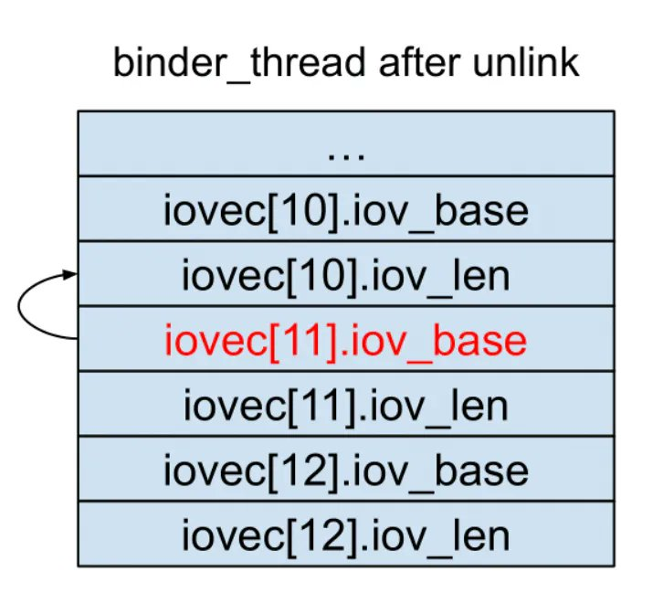
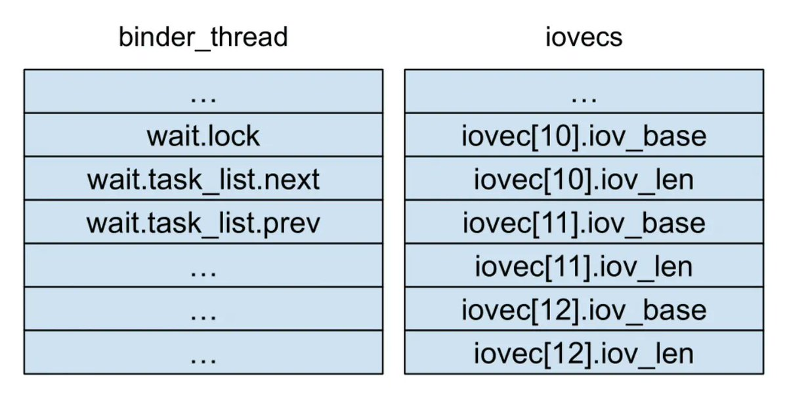
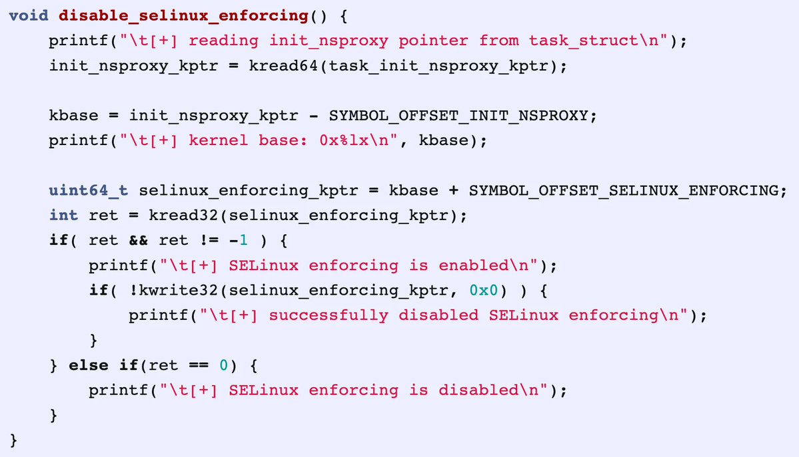
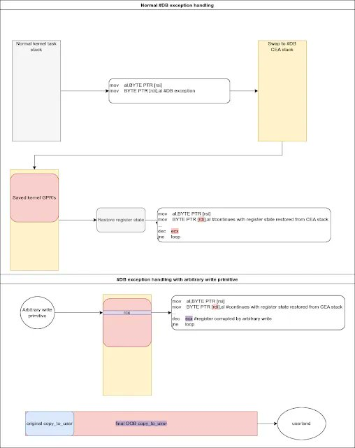
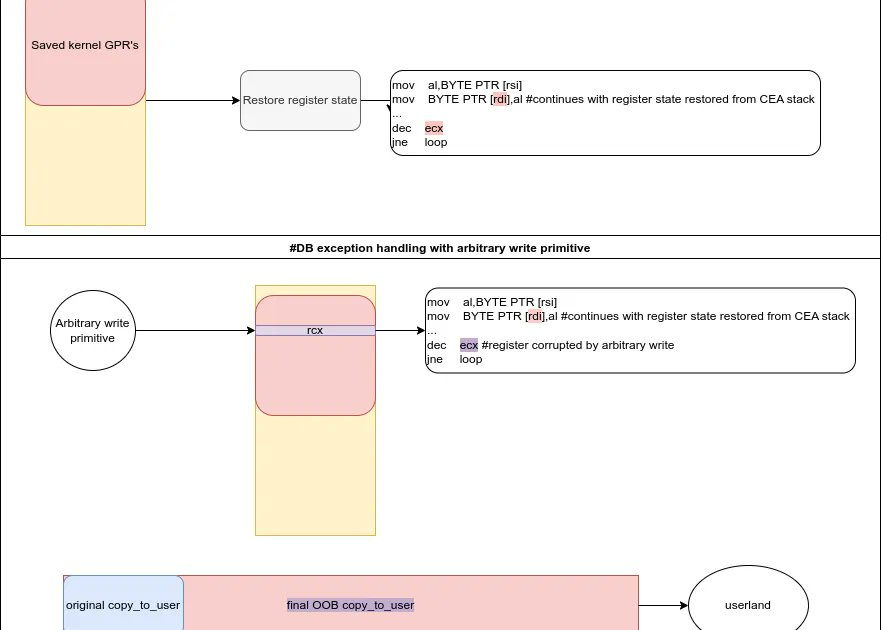
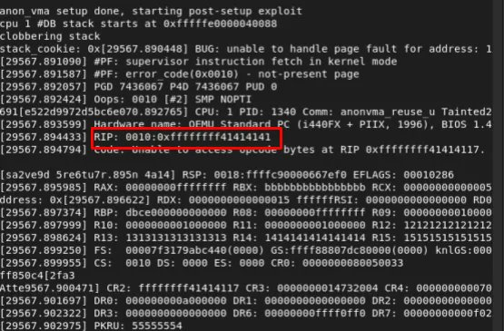

# Dinosn
**https://twitter.com/Dinosn/status/1621368313270996993 _at 2023-02-03, 04:41:44_**
<blockquote>
PoC Exploit for Adobe Acrobat Reader DC RCE Vulnerability (CVE-2023-21608) Released https://t.co/dTLD1buxcq
</blockquote>

* https://securityonline.info/poc-exploit-for-adobe-acrobat-reader-dc-rce-vulnerability-cve-2023-21608-released/

<table><tr>
<td>Quotes: <code>1</code></td>
<td>Replies: <code>0</code></td>
<td>Retweets: <code>30</code></td>
<td>Favorites: <code>67</code></td>
</tr></table>

---

# assetnote
**https://twitter.com/assetnote/status/1621340274768355329 _at 2023-02-03, 02:50:19_**
<blockquote>
Our security research team discovered a critical pre-authentication RCE vulnerability in IBM Aspera Faspex CVE-2022-47986. You can read the research on our blog: https://t.co/GC46ck1wZH
</blockquote>

* https://blog.assetnote.io/2023/02/02/pre-auth-rce-aspera-faspex/

<table><tr>
<td>Quotes: <code>0</code></td>
<td>Replies: <code>0</code></td>
<td>Retweets: <code>8</code></td>
<td>Favorites: <code>38</code></td>
</tr></table>

---

# 0xor0ne
**https://twitter.com/0xor0ne/status/1621244624886009860 _at 2023-02-02, 20:30:14_**
<blockquote>
Analysis and exploitation of CVE-2019-2215 (binder use-after-free)
(Credits @cutesmilee__)

https://t.co/YURrIRnYgm 

#Linux #kernel #exploit #cve #infosec #cybersecurity https://t.co/OH747aaIPK
</blockquote>

* https://cutesmilee.github.io/kernel/linux/android/2022/02/17/cve-2019-2215_writeup.html

<table><tr>
<td></td>
<td></td>
<td></td>
<td></td>
</table></tr>
<table><tr>
<td>Quotes: <code>1</code></td>
<td>Replies: <code>1</code></td>
<td>Retweets: <code>21</code></td>
<td>Favorites: <code>66</code></td>
</tr></table>

---

# piedpiper1616
**https://twitter.com/piedpiper1616/status/1621171115631706113 _at 2023-02-02, 15:38:08_**
<blockquote>
GitHub - hacksysteam/CVE-2023-21608: Adobe Acrobat Reader - CVE-2023-21608 - Remote Code Execution Exploit - https://t.co/xVfZvBgsfC
</blockquote>

* https://github.com/hacksysteam/CVE-2023-21608

<table><tr>
<td>Quotes: <code>3</code></td>
<td>Replies: <code>0</code></td>
<td>Retweets: <code>31</code></td>
<td>Favorites: <code>40</code></td>
</tr></table>

---

# 0xor0ne
**https://twitter.com/0xor0ne/status/1620757632423284736 _at 2023-02-01, 12:15:06_**
<blockquote>
Writeup on CVE-2022-42703 by Seth Jenkins  
Use after free in Linux kernel's memory management (MM) subsystem 

https://t.co/5EGdpc3aFL 

#Linux #kernel #exploit #infosec #cybersecurity https://t.co/LRVHiICunJ
</blockquote>

* https://googleprojectzero.blogspot.com/2022/12/exploiting-CVE-2022-42703-bringing-back-the-stack-attack.html

<table><tr>
<td></td>
<td></td>
<td></td>
</table></tr>
<table><tr>
<td>Quotes: <code>2</code></td>
<td>Replies: <code>1</code></td>
<td>Retweets: <code>39</code></td>
<td>Favorites: <code>128</code></td>
</tr></table>

---

