# bad_packets
**https://twitter.com/bad_packets/status/1630671937318862849 _at 2023-02-28, 20:51:00_**
<blockquote>
⚠️ CVE-2022-40684 event detected ⚠️

Source IP:
185.205.209.236 (🇧🇬)

Target:
Multiple Fortinet products (FortiOS, FortiProxy, and FortiSwitchManager) vulnerable to authentication bypass.
#threatintel
</blockquote>

<table><tr>
<td>Quotes: <code>2</code></td>
<td>Replies: <code>3</code></td>
<td>Retweets: <code>34</code></td>
<td>Favorites: <code>85</code></td>
</tr></table>

---

# kmkz_security
**https://twitter.com/kmkz_security/status/1629871731706851335 _at 2023-02-26, 15:51:17_**
<blockquote>
Adobe Acrobat Reader - CVE-2023-21608 - Remote Code Execution Exploit
https://t.co/IjngCUorov - @HackSysTeam
</blockquote>

* https://github.com/hacksysteam/CVE-2023-21608

<table><tr>
<td>Quotes: <code>2</code></td>
<td>Replies: <code>0</code></td>
<td>Retweets: <code>35</code></td>
<td>Favorites: <code>88</code></td>
</tr></table>

---

# kmkz_security
**https://twitter.com/kmkz_security/status/1629772938390937601 _at 2023-02-26, 09:18:42_**
<blockquote>
CVE-2022-25845: Analyzing the Fastjson “Auto Type Bypass” RCE vulnerability
https://t.co/BTjcUZmJue via @jfrog
</blockquote>

* https://jfrog.com/blog/cve-2022-25845-analyzing-the-fastjson-auto-type-bypass-rce-vulnerability/

<table><tr>
<td>Quotes: <code>2</code></td>
<td>Replies: <code>0</code></td>
<td>Retweets: <code>28</code></td>
<td>Favorites: <code>73</code></td>
</tr></table>

---

# payloadartist
**https://twitter.com/payloadartist/status/1629488890217377792 _at 2023-02-25, 14:30:00_**
<blockquote>
Good Analysis Of Unauthenticated Arbitrary File Write (and RCE) Vulnerability In FortiNAC (CVE-2022-39952) 

https://t.co/zavCJOo0GP

PoC: https://t.co/7Q5lc7hEzG

By @Horizon3ai 

#infosec #cybersecurity #bugbounty #hacking https://t.co/RZ77FsofDo
</blockquote>

* https://www.horizon3.ai/fortinet-fortinac-cve-2022-39952-deep-dive-and-iocs/
* https://github.com/horizon3ai/CVE-2022-39952

<table><tr>
<td>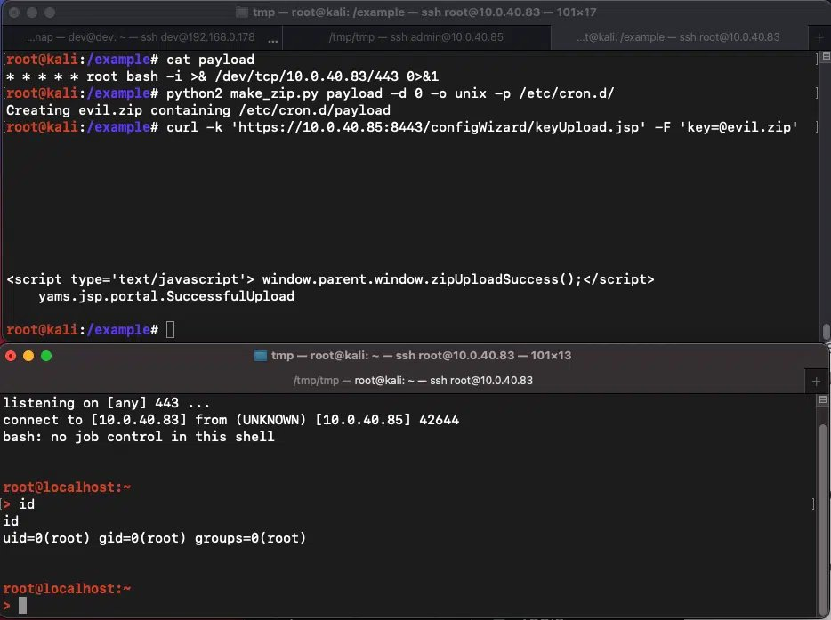</td>
<td>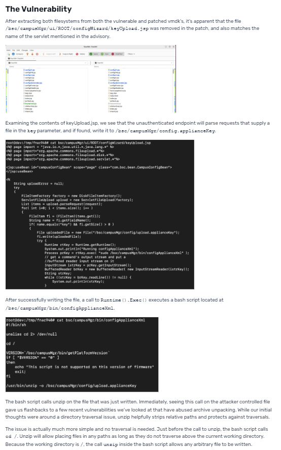</td>
</table></tr>
<table><tr>
<td>Quotes: <code>3</code></td>
<td>Replies: <code>0</code></td>
<td>Retweets: <code>19</code></td>
<td>Favorites: <code>60</code></td>
</tr></table>

---

# TheHackersNews
**https://twitter.com/TheHackersNews/status/1629034897431048194 _at 2023-02-24, 08:26:00_**
<blockquote>
Researchers have identified a concerning uptick in opportunistic cyberattacks that exploit a critical RCE #vulnerability (CVE-2022-47966) affecting 24 Zoho ManageEngine products.

Learn more: https://t.co/rfjysc2B0a

#cybersecurity #hacking #malware
</blockquote>

* https://thehackernews.com/2023/02/experts-sound-alarm-over-growing.html

<table><tr>
<td>Quotes: <code>1</code></td>
<td>Replies: <code>1</code></td>
<td>Retweets: <code>23</code></td>
<td>Favorites: <code>38</code></td>
</tr></table>

---

# momika233
**https://twitter.com/momika233/status/1628235245161160705 _at 2023-02-22, 03:28:28_**
<blockquote>
CVE-2023-21839 Wheels made by public poc according to the network
Affected version
12.2.1.3.0
12.2.1.4.0
14.1.1.0.0
https://t.co/auA2sreYpn
</blockquote>

* https://github.com/Scarehehe/Weblogic-CVE-2023-21839

<table><tr>
<td>Quotes: <code>1</code></td>
<td>Replies: <code>0</code></td>
<td>Retweets: <code>50</code></td>
<td>Favorites: <code>124</code></td>
</tr></table>

---

# cyber_advising
**https://twitter.com/cyber_advising/status/1628214777586626566 _at 2023-02-22, 02:07:08_**
<blockquote>
CVE-2023-21839: Vulnerability in the Oracle WebLogic Server product of Oracle Fusion Middleware..affected are 12.2.1.3.0, 12.2.1.4.0 and 14.1.1.0.0. Easily exploitable vulnerability allows unauthenticated attacker with network access via T3, IIOP..

PoC
https://t.co/cNwytE2kpn https://t.co/vc7vRhbE8q
</blockquote>

* https://github.com/Scarehehe/Weblogic-CVE-2023-21839

<table><tr>
<td>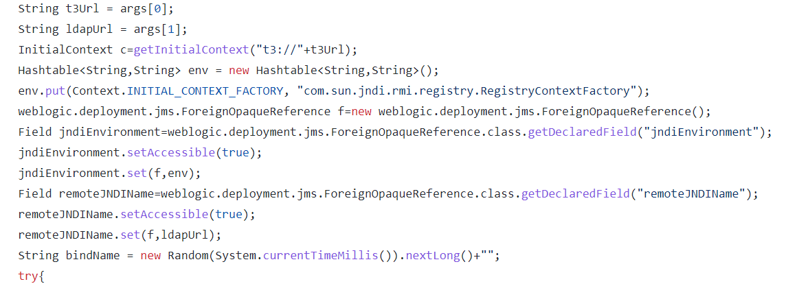</td>
</table></tr>
<table><tr>
<td>Quotes: <code>4</code></td>
<td>Replies: <code>2</code></td>
<td>Retweets: <code>42</code></td>
<td>Favorites: <code>86</code></td>
</tr></table>

---

# momika233
**https://twitter.com/momika233/status/1628048916053917696 _at 2023-02-21, 15:08:03_**
<blockquote>
POC for CVE-2022-39952 affecting Fortinet FortiNAC

The default configuration of this exploit writes a cron job to create a reverse shell. Be sure to change the payload file to suite your environment.
https://t.co/dhhOCINfoI
</blockquote>

* https://github.com/horizon3ai/CVE-2022-39952

<table><tr>
<td>Quotes: <code>2</code></td>
<td>Replies: <code>2</code></td>
<td>Retweets: <code>45</code></td>
<td>Favorites: <code>148</code></td>
</tr></table>

---

# Horizon3Attack
**https://twitter.com/Horizon3Attack/status/1628013432640356352 _at 2023-02-21, 12:47:04_**
<blockquote>
Our technical deep-dive for the recent #Fortinet FortiNAC CVE-2022-39952
🔺 POC Exploit for RCE
🔺 Reversing the Patch
🔺 Indicators of Compromise

https://t.co/XWMIdV4PAs
</blockquote>

* https://www.horizon3.ai/fortinet-fortinac-cve-2022-39952-deep-dive-and-iocs/

<table><tr>
<td>Quotes: <code>17</code></td>
<td>Replies: <code>4</code></td>
<td>Retweets: <code>209</code></td>
<td>Favorites: <code>504</code></td>
</tr></table>

---

# hack_git
**https://twitter.com/hack_git/status/1627959342757470208 _at 2023-02-21, 09:12:07_**
<blockquote>
CVE-2022-39952

Unauthenticated RCE in Fortinet FortiNAC

https://t.co/B5cQ62RfTV

#cve #RCE https://t.co/0LpjCAHEEx https://t.co/91v32Kqov2
</blockquote>

* https://github.com/Florian-R0th/CVE-2022-39952
* https://t.me/hackgit/7638

<table><tr>
<td>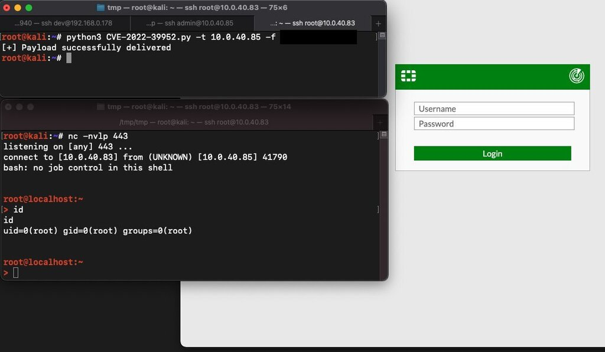</td>
</table></tr>
<table><tr>
<td>Quotes: <code>1</code></td>
<td>Replies: <code>11</code></td>
<td>Retweets: <code>131</code></td>
<td>Favorites: <code>366</code></td>
</tr></table>

---

# SeguInfo
**https://twitter.com/SeguInfo/status/1627781233550712833 _at 2023-02-20, 21:24:23_**
<blockquote>
[+] Feb 2023 = 102 vulnerabilidades 
- 13 EoP
- 2 Bypass
- 40 RCE
- 8 Inf. Disc
- 10 DoS
- 7 Spoofing
- 12 Edge/Chromium

[+] 3 explotada In-the-Wild
- CVE-2023-21823 - 7.3
- CVE-2023-21715 - 7.3
- CVE-2023-23376 - 7.8

Tool: https://t.co/kO6xMFGnLj https://t.co/7a1NWc3XnW
</blockquote>

* https://github.com/Immersive-Labs-Sec/msrc-api

<table><tr>
<td>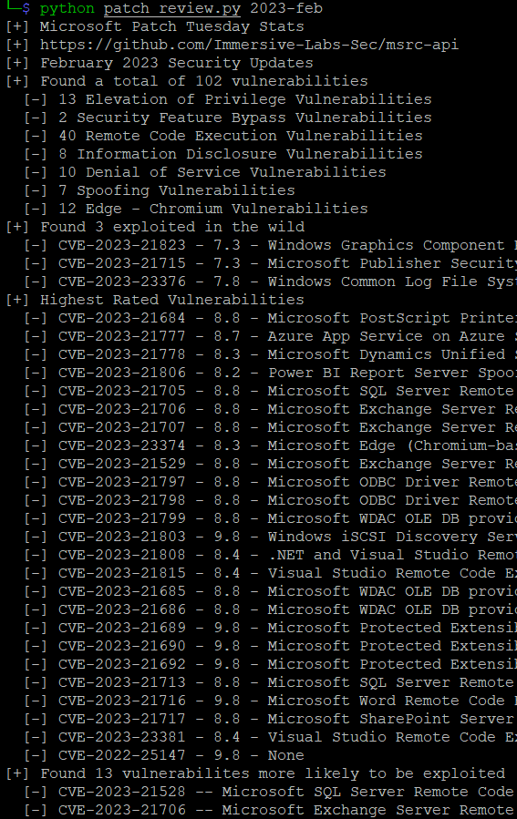</td>
</table></tr>
<table><tr>
<td>Quotes: <code>0</code></td>
<td>Replies: <code>2</code></td>
<td>Retweets: <code>19</code></td>
<td>Favorites: <code>64</code></td>
</tr></table>

---

# LeighGi66657535
**https://twitter.com/LeighGi66657535/status/1627424701466157056 _at 2023-02-19, 21:47:39_**
<blockquote>
Tonight we are on port 3389, exploiting Remote Desktop protocol.🙂 First I try remote code execution. If not I attack with a Bluekeep scanner Dos function and take the server offline. CVE-2019-0708(Bluekeep), a couple beer, Iranian servers. My evening in is all planned.🙂❤️🇨🇦 https://t.co/cbTqzGLph3
</blockquote>

<table><tr>
<td>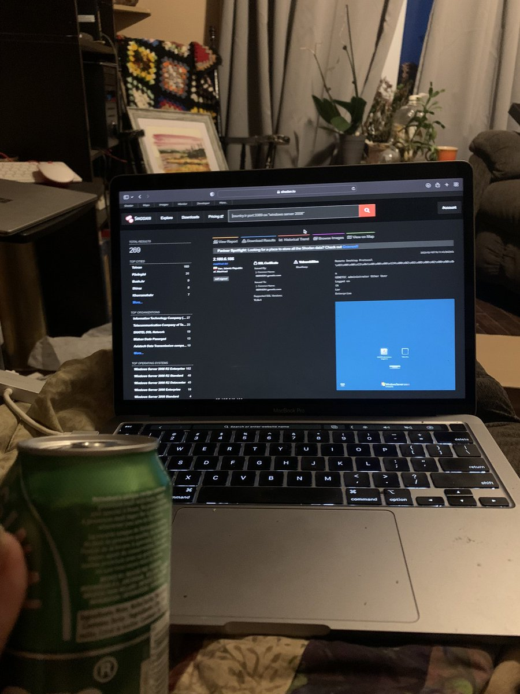</td>
</table></tr>
<table><tr>
<td>Quotes: <code>0</code></td>
<td>Replies: <code>14</code></td>
<td>Retweets: <code>5</code></td>
<td>Favorites: <code>92</code></td>
</tr></table>

---

# cyber_advising
**https://twitter.com/cyber_advising/status/1627266839649693698 _at 2023-02-19, 11:20:22_**
<blockquote>
CVE-2023-23752: Joomla! 4.0.0 through 4.2.7. An improper access check allows unauthorized access to webservice endpoints

PoC
https://t.co/MZp3vbPLH0 https://t.co/fomFKSCPvJ
</blockquote>

* https://xz.aliyun.com/t/12175

<table><tr>
<td>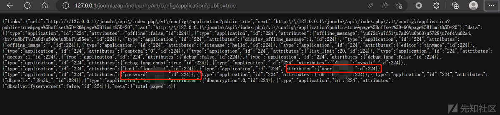</td>
</table></tr>
<table><tr>
<td>Quotes: <code>3</code></td>
<td>Replies: <code>5</code></td>
<td>Retweets: <code>93</code></td>
<td>Favorites: <code>227</code></td>
</tr></table>

---

# hyp3rlinx
**https://twitter.com/hyp3rlinx/status/1627125374755774464 _at 2023-02-19, 01:58:14_**
<blockquote>
Microsoft Windows Contact file / Remote Code Execution (Resurrected) CVE-2022-44666

https://t.co/MJFWBhGORW
</blockquote>

* http://hyp3rlinx.altervista.org/advisories/MICROSOFT_WINDOWS_CONTACT_FILE_RCE_CVE-2022-44666.txt

<table><tr>
<td>Quotes: <code>1</code></td>
<td>Replies: <code>1</code></td>
<td>Retweets: <code>19</code></td>
<td>Favorites: <code>52</code></td>
</tr></table>

---

# GreyNoiseIO
**https://twitter.com/GreyNoiseIO/status/1626760618853253120 _at 2023-02-18, 01:48:49_**
<blockquote>
Thanks to @Horizon3Attack, we are now tracking CVE-2022-39952, an unauthenticated external control of file name/path in Fortinet FortiNAC products, leading to remote code execution.

https://t.co/lqkE7cuBOk
</blockquote>

* https://viz.greynoise.io/tag/fortinac-rce-attempt?days=3

<table><tr>
<td>Quotes: <code>7</code></td>
<td>Replies: <code>1</code></td>
<td>Retweets: <code>19</code></td>
<td>Favorites: <code>31</code></td>
</tr></table>

---

# Horizon3Attack
**https://twitter.com/Horizon3Attack/status/1626692778062237713 _at 2023-02-17, 21:19:15_**
<blockquote>
CVE-2022-39952, announced today, allows for unauthenticated RCE against #Fortinet FortiNAC as the root user. Blog post and POC to be released soon. 

See Fortinet's PSIRT: https://t.co/sBsrs8Wxqb https://t.co/EqkIo3ap4s
</blockquote>

* https://www.fortiguard.com/psirt/FG-IR-22-300

<table><tr>
<td>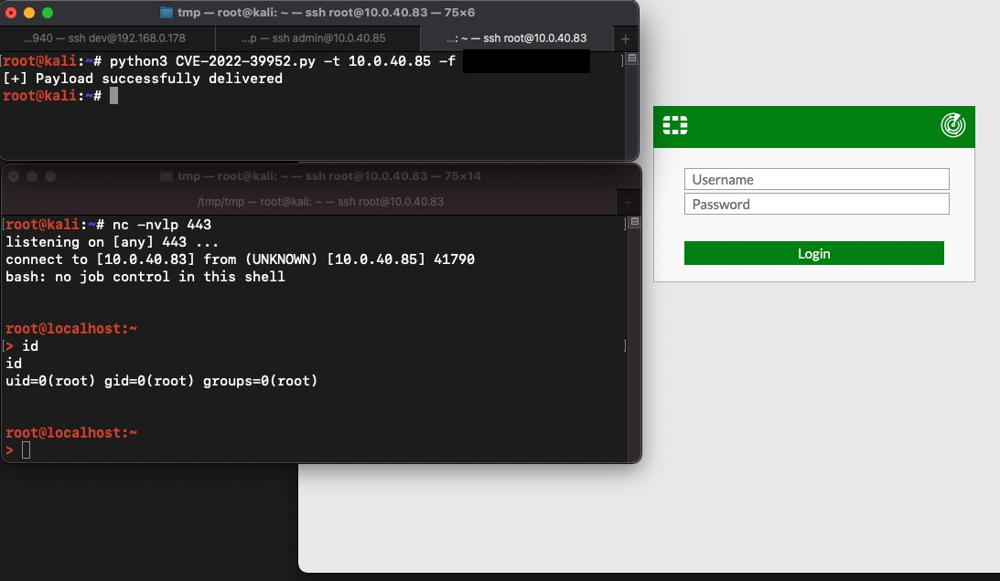</td>
</table></tr>
<table><tr>
<td>Quotes: <code>39</code></td>
<td>Replies: <code>19</code></td>
<td>Retweets: <code>382</code></td>
<td>Favorites: <code>997</code></td>
</tr></table>

---

# cyber_advising
**https://twitter.com/cyber_advising/status/1626636728218812438 _at 2023-02-17, 17:36:32_**
<blockquote>
CVE-2022-44666: Microsoft Windows Contacts (VCF/Contact/LDAP) syslink control href attribute escape vulnerability.

PoC
https://t.co/TllWpr8E0Q https://t.co/IT1lc91eoI
</blockquote>

* https://github.com/j00sean/CVE-2022-44666

<table><tr>
<td>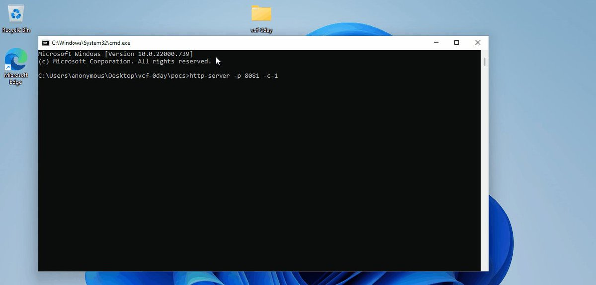</td>
</table></tr>
<table><tr>
<td>Quotes: <code>1</code></td>
<td>Replies: <code>0</code></td>
<td>Retweets: <code>31</code></td>
<td>Favorites: <code>71</code></td>
</tr></table>

---

# momika233
**https://twitter.com/momika233/status/1626464189261942786 _at 2023-02-17, 06:10:55_**
<blockquote>
CVE-2023-23752
Joomla webservice endpoint access
PoC
httpx -l ip.txt -path '/api/index.php/v1/config/application?public=true'
</blockquote>

<table><tr>
<td>Quotes: <code>2</code></td>
<td>Replies: <code>5</code></td>
<td>Retweets: <code>132</code></td>
<td>Favorites: <code>438</code></td>
</tr></table>

---

# sirifu4k1
**https://twitter.com/sirifu4k1/status/1626456640663724033 _at 2023-02-17, 05:40:55_**
<blockquote>
CVE-2022-44666: Write-up for another forgotten Windows vulnerability (0day): Microsoft Windows Contacts (VCF/Contact/LDAP) syslink control href attribute escape, which was not fully fixed as CVE-2022-44666 in the patches https://t.co/5UaRuBytyg
</blockquote>

* https://github.com/j00sean/CVE-2022-44666

<table><tr>
<td>Quotes: <code>1</code></td>
<td>Replies: <code>1</code></td>
<td>Retweets: <code>18</code></td>
<td>Favorites: <code>33</code></td>
</tr></table>

---

# Dinosn
**https://twitter.com/Dinosn/status/1626439202110840833 _at 2023-02-17, 04:31:38_**
<blockquote>
Write-up for another forgotten Windows vulnerability (0day): Microsoft Windows Contacts (VCF/Contact/LDAP) syslink control href attribute escape, which was not fully fixed as CVE-2022-44666 in the patches released on December, 2022.

https://t.co/BCQo3u1aX1
</blockquote>

* https://github.com/j00sean/CVE-2022-44666

<table><tr>
<td>Quotes: <code>0</code></td>
<td>Replies: <code>0</code></td>
<td>Retweets: <code>15</code></td>
<td>Favorites: <code>31</code></td>
</tr></table>

---

# momika233
**https://twitter.com/momika233/status/1626429647029440512 _at 2023-02-17, 03:53:40_**
<blockquote>
Microsoft Windows Contacts (VCF/Contact/LDAP) syslink control href attribute escape vulnerability (CVE-2022-44666) (0day).
https://t.co/7B1iMDTtFI
</blockquote>

* https://github.com/j00sean/CVE-2022-44666

<table><tr>
<td>Quotes: <code>1</code></td>
<td>Replies: <code>1</code></td>
<td>Retweets: <code>21</code></td>
<td>Favorites: <code>74</code></td>
</tr></table>

---

# 0patch
**https://twitter.com/0patch/status/1626223864996040708 _at 2023-02-16, 14:15:57_**
<blockquote>
We have just issued patches for incompletely fixed remote code execution CVE-2022-44666 for all affected Windows systems (all legacy and still-supported versions):

- Windows 11
- Windows 10
- Windows 7
- Server 2022
- Server 2019
- Server 2016
- Server 2012 R2
- Server 2008 R2
</blockquote>

<table><tr>
<td>Quotes: <code>2</code></td>
<td>Replies: <code>1</code></td>
<td>Retweets: <code>23</code></td>
<td>Favorites: <code>46</code></td>
</tr></table>

---

# j00sean
**https://twitter.com/j00sean/status/1626190347578507265 _at 2023-02-16, 12:02:46_**
<blockquote>
My write-up for CVE-2022-44666 is just released!

https://t.co/wEMmOOObCM
</blockquote>

* https://github.com/j00sean/CVE-2022-44666

<table><tr>
<td>Quotes: <code>3</code></td>
<td>Replies: <code>3</code></td>
<td>Retweets: <code>50</code></td>
<td>Favorites: <code>150</code></td>
</tr></table>

---

# starlabs_sg
**https://twitter.com/starlabs_sg/status/1626132758367174656 _at 2023-02-16, 08:13:56_**
<blockquote>
Glad to see that the "Microsoft Exchange Server Post-Authentication Remote Code Execution Vulnerability" found by @testanull had been fixed and the CVE is CVE-2023-21707. We will release the details soon.
https://t.co/0WZOa8rFiG
</blockquote>

* https://msrc.microsoft.com/update-guide/vulnerability/CVE-2023-21707

<table><tr>
<td>Quotes: <code>0</code></td>
<td>Replies: <code>1</code></td>
<td>Retweets: <code>8</code></td>
<td>Favorites: <code>56</code></td>
</tr></table>

---

# momika233
**https://twitter.com/momika233/status/1625850779360968707 _at 2023-02-15, 13:33:27_**
<blockquote>
Adobe Acrobat Reader - resetForm - CAgg UaF - RCE Exploit - CVE-2023-21608

https://t.co/NvNlbg5lBN
</blockquote>

* https://hacksys.io/blogs/adobe-reader-resetform-cagg-rce-cve-2023-21608

<table><tr>
<td>Quotes: <code>2</code></td>
<td>Replies: <code>0</code></td>
<td>Retweets: <code>20</code></td>
<td>Favorites: <code>51</code></td>
</tr></table>

---

# HaifeiLi
**https://twitter.com/HaifeiLi/status/1625658350422687744 _at 2023-02-15, 00:48:48_**
<blockquote>
Today, Microsoft issued CVE-2023-21715, a "Microsoft Publisher Security Features Bypass Vulnerability" related to macros, which is said being exploited as ZERO-DAY IN THE WILD (!), according to https://t.co/OIVjdP6ZEZ.

I did a closer look, let's see what it really is..:) 1/n
</blockquote>

* https://msrc.microsoft.com/update-guide/en-US/vulnerability/CVE-2023-21715

<table><tr>
<td>Quotes: <code>5</code></td>
<td>Replies: <code>3</code></td>
<td>Retweets: <code>61</code></td>
<td>Favorites: <code>197</code></td>
</tr></table>

---

# TheHackersNews
**https://twitter.com/TheHackersNews/status/1625355675047194625 _at 2023-02-14, 04:46:05_**
<blockquote>
⚡ Apple has released URGENT security updates to address a new ZERO-DAY #vulnerability (CVE-2023-23529) discovered in WebKit that attackers are exploiting in the wild.

Learn more: https://t.co/jOKQusPf5n

Update #iOS, iPadOS, macOS systems &amp; Safari immediately to stay protected.
</blockquote>

* https://thehackernews.com/2023/02/patch-now-apples-ios-ipados-macos-and.html

<table><tr>
<td>Quotes: <code>14</code></td>
<td>Replies: <code>1</code></td>
<td>Retweets: <code>137</code></td>
<td>Favorites: <code>140</code></td>
</tr></table>

---

# wallet_guard
**https://twitter.com/wallet_guard/status/1625331505131134980 _at 2023-02-14, 03:10:02_**
<blockquote>
⚠️ CRITICAL ALERT
🚨 ZERO-DAY on iOS &amp; macOS DEVICES

Apple fixed a WebKit Zero-Day allowing attackers to execute arbitrary code on compromised devices. This vulnerability is ALREADY in the wild. 

UPDATE YOUR DEVICES NOW &amp; PLEASE SHARE

CVE-2023-23529 https://t.co/rYHlvsRIc3
</blockquote>

<table><tr>
<td></td>
</table></tr>
<table><tr>
<td>Quotes: <code>68</code></td>
<td>Replies: <code>34</code></td>
<td>Retweets: <code>576</code></td>
<td>Favorites: <code>1132</code></td>
</tr></table>

---

# 0xor0ne
**https://twitter.com/0xor0ne/status/1624490971521073159 _at 2023-02-11, 19:30:03_**
<blockquote>
Analysis and exploitation of CVE-2021-3560: privilege escalation through Polkit tookit
Credits @kevin_backhouse (@GHSecurityLab)

https://t.co/SiUJXsef1Y 

#cve #infsec #cybersecurity https://t.co/COU26l1zKB
</blockquote>

* https://github.blog/2021-06-10-privilege-escalation-polkit-root-on-linux-with-bug/

<table><tr>
<td>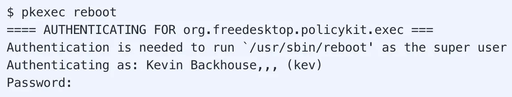</td>
<td>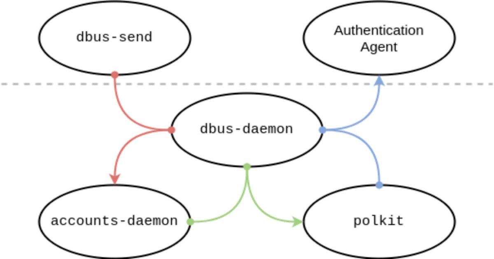</td>
<td>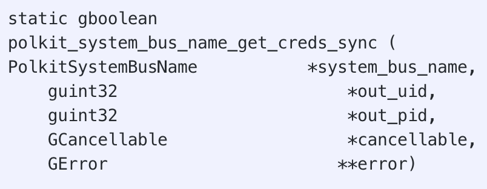</td>
</table></tr>
<table><tr>
<td>Quotes: <code>3</code></td>
<td>Replies: <code>1</code></td>
<td>Retweets: <code>64</code></td>
<td>Favorites: <code>135</code></td>
</tr></table>

---

# momika233
**https://twitter.com/momika233/status/1624354737461276677 _at 2023-02-11, 10:28:43_**
<blockquote>
CVE-2023-24055 PoC (KeePass 2.5x)
https://t.co/CVzndZOj5M
</blockquote>

* https://github.com/alt3kx/CVE-2023-24055_PoC

<table><tr>
<td>Quotes: <code>2</code></td>
<td>Replies: <code>1</code></td>
<td>Retweets: <code>53</code></td>
<td>Favorites: <code>131</code></td>
</tr></table>

---

# _0xf4n9x_
**https://twitter.com/_0xf4n9x_/status/1624308803960438791 _at 2023-02-11, 07:26:11_**
<blockquote>
CVE-2023-0669 GoAnywhere MFT Deserialization #RCE Vulnerability.

#EXP:
https://t.co/I3oFkUykrS https://t.co/JPcn4ZsRyJ
</blockquote>

* https://github.com/0xf4n9x/CVE-2023-0669

<table><tr>
<td>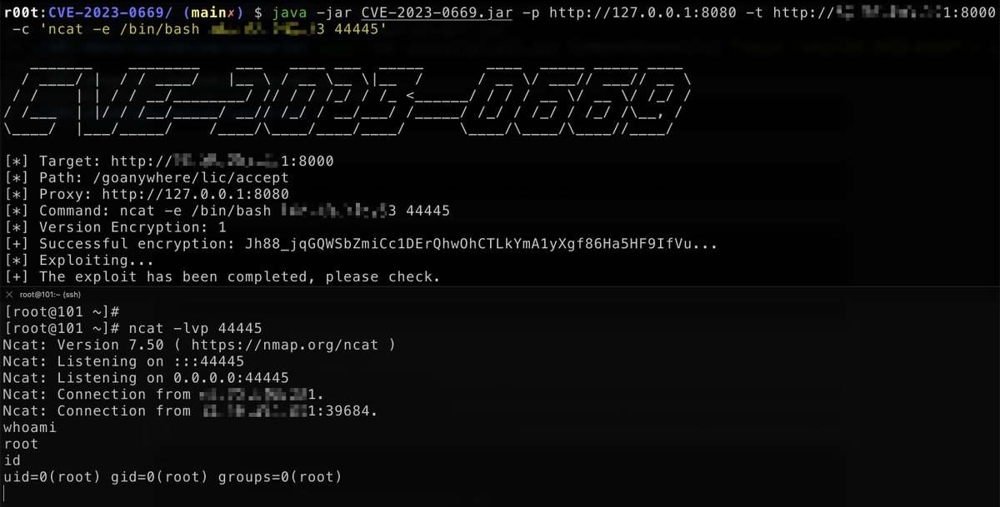</td>
</table></tr>
<table><tr>
<td>Quotes: <code>1</code></td>
<td>Replies: <code>1</code></td>
<td>Retweets: <code>40</code></td>
<td>Favorites: <code>111</code></td>
</tr></table>

---

# TheZDIBugs
**https://twitter.com/TheZDIBugs/status/1623723640242987011 _at 2023-02-09, 16:40:57_**
<blockquote>
[ZDI-23-118|CVE-2023-21838] Oracle WebLogic Server ForeignOpaqueReference JNDI Injection Remote Code Execution Vulnerability (CVSS 9.8) https://t.co/GVUEaOkhnB
</blockquote>

* https://www.zerodayinitiative.com/advisories/ZDI-23-118/

<table><tr>
<td>Quotes: <code>3</code></td>
<td>Replies: <code>0</code></td>
<td>Retweets: <code>17</code></td>
<td>Favorites: <code>48</code></td>
</tr></table>

---

# 0xor0ne
**https://twitter.com/0xor0ne/status/1621954295233974272 _at 2023-02-04, 19:30:13_**
<blockquote>
CVE-2022-47949: analysis and exploitation of a buffer overflow vulnerability in Nintendo games network code by @Pablomf6 

https://t.co/bMdPnwjzhk 

#nintendo #cve #exploit #infosec #cybersecurity https://t.co/vCw0Pr2Pba
</blockquote>

* https://github.com/PabloMK7/ENLBufferPwn

<table><tr>
<td>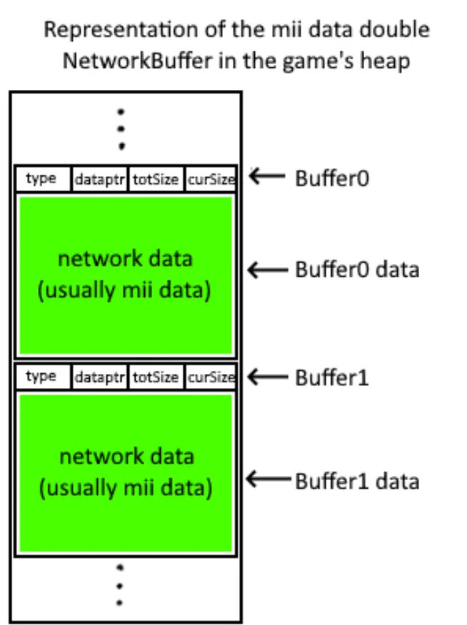</td>
<td>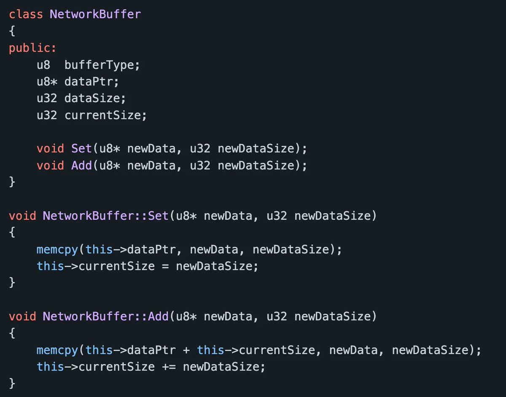</td>
<td>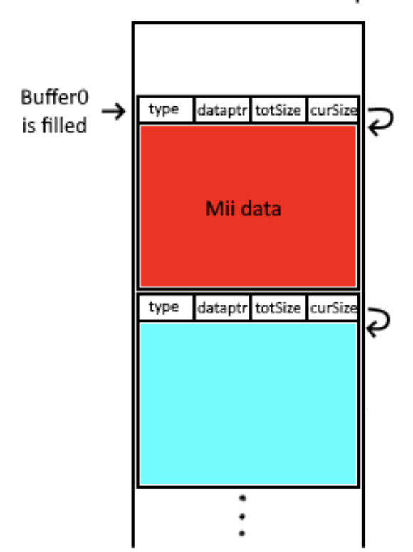</td>
</table></tr>
<table><tr>
<td>Quotes: <code>2</code></td>
<td>Replies: <code>0</code></td>
<td>Retweets: <code>72</code></td>
<td>Favorites: <code>259</code></td>
</tr></table>

---

# Junior_Baines
**https://twitter.com/Junior_Baines/status/1621503271322935297 _at 2023-02-03, 13:38:00_**
<blockquote>
I asked MITRE to assign a CVE for this and they assigned CVE-2023-25135. If you are going to publish a lengthy blog/exploit, spend 2 minutes requesting a CVE @ambionics  https://t.co/SUhqFzYlr8
</blockquote>

* https://www.ambionics.io/blog/vbulletin-unserializable-but-unreachable

<table><tr>
<td>Quotes: <code>3</code></td>
<td>Replies: <code>2</code></td>
<td>Retweets: <code>8</code></td>
<td>Favorites: <code>34</code></td>
</tr></table>

---

# cyber_advising
**https://twitter.com/cyber_advising/status/1621483132577873922 _at 2023-02-03, 12:17:59_**
<blockquote>
CVE-2022-44268 - a vulnerability in ImageMagick that could lead to an arbitrary file read.

PoC
https://t.co/HObSqHbYXa https://t.co/cdE9BCCY6G
</blockquote>

* https://www.metabaseq.com/imagemagick-zero-days/

<table><tr>
<td>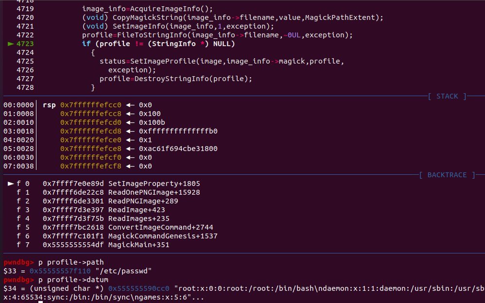</td>
</table></tr>
<table><tr>
<td>Quotes: <code>2</code></td>
<td>Replies: <code>0</code></td>
<td>Retweets: <code>26</code></td>
<td>Favorites: <code>60</code></td>
</tr></table>

---

# Dinosn
**https://twitter.com/Dinosn/status/1621368313270996993 _at 2023-02-03, 04:41:44_**
<blockquote>
PoC Exploit for Adobe Acrobat Reader DC RCE Vulnerability (CVE-2023-21608) Released https://t.co/dTLD1buxcq
</blockquote>

* https://securityonline.info/poc-exploit-for-adobe-acrobat-reader-dc-rce-vulnerability-cve-2023-21608-released/

<table><tr>
<td>Quotes: <code>1</code></td>
<td>Replies: <code>0</code></td>
<td>Retweets: <code>49</code></td>
<td>Favorites: <code>126</code></td>
</tr></table>

---

# Dinosn
**https://twitter.com/Dinosn/status/1621368172145254403 _at 2023-02-03, 04:41:10_**
<blockquote>
Researcher Publishes PoC Exploit for Privilege Escalation Flaw (CVE-2023-0179) in Linux Kernel https://t.co/GHMb6k1ut6
</blockquote>

* https://securityonline.info/researcher-publishes-poc-exploit-for-privilege-escalation-flaw-cve-2023-0179-in-linux-kernel/

<table><tr>
<td>Quotes: <code>1</code></td>
<td>Replies: <code>0</code></td>
<td>Retweets: <code>20</code></td>
<td>Favorites: <code>34</code></td>
</tr></table>

---

# HackSysTeam
**https://twitter.com/HackSysTeam/status/1621343726621675520 _at 2023-02-03, 03:04:02_**
<blockquote>
Apologies had to delete the last tweet with Adobe blog post URL due to a typo in the URL. The URL has been updated and you can find the blog post here: 

Adobe Acrobat Reader - resetForm - CAgg UaF - RCE Exploit - CVE-2023-21608

https://t.co/r2vLpCBL74
</blockquote>

* https://hacksys.io/blogs/adobe-reader-resetform-cagg-rce-cve-2023-21608

<table><tr>
<td>Quotes: <code>0</code></td>
<td>Replies: <code>1</code></td>
<td>Retweets: <code>16</code></td>
<td>Favorites: <code>38</code></td>
</tr></table>

---

# assetnote
**https://twitter.com/assetnote/status/1621340274768355329 _at 2023-02-03, 02:50:19_**
<blockquote>
Our security research team discovered a critical pre-authentication RCE vulnerability in IBM Aspera Faspex CVE-2022-47986. You can read the research on our blog: https://t.co/GC46ck1wZH
</blockquote>

* https://blog.assetnote.io/2023/02/02/pre-auth-rce-aspera-faspex/

<table><tr>
<td>Quotes: <code>1</code></td>
<td>Replies: <code>0</code></td>
<td>Retweets: <code>14</code></td>
<td>Favorites: <code>58</code></td>
</tr></table>

---

# TurtleARM97
**https://twitter.com/TurtleARM97/status/1621323334678970371 _at 2023-02-03, 01:43:00_**
<blockquote>
LPE for CVE-2023-0179 is live! Compatibility with other versions should be just a matter of offsets. It was nice not having to deal with stack offset randomization. 
https://t.co/DvqIyXaerr
</blockquote>

* https://github.com/TurtleARM/CVE-2023-0179-PoC/blob/master/needle.c

<table><tr>
<td>Quotes: <code>2</code></td>
<td>Replies: <code>1</code></td>
<td>Retweets: <code>33</code></td>
<td>Favorites: <code>68</code></td>
</tr></table>

---

# 0xdea
**https://twitter.com/0xdea/status/1621281568768540672 _at 2023-02-02, 22:57:02_**
<blockquote>
Some cool #XNU #bugs by @adamdoupe 

CVE-2022-42845: 20-Year-Old XNU Use After Free Vulnerability in ndrv.c

https://t.co/pFYaK8VCNp

CVE-2023-23504: XNU Heap Underwrite in dlil.c

https://t.co/bHhzRBRhKz
</blockquote>

* http://adamdoupe.com/blog/2022/12/13/cve-2022-42845-xnu-use-after-free-vulnerability-in-ndrv-dot-c/
* http://adamdoupe.com/blog/2023/01/23/cve-2023-23504-xnu-heap-underwrite-in-dlil-dot-c/

<table><tr>
<td>Quotes: <code>1</code></td>
<td>Replies: <code>0</code></td>
<td>Retweets: <code>8</code></td>
<td>Favorites: <code>31</code></td>
</tr></table>

---

# 0xor0ne
**https://twitter.com/0xor0ne/status/1621244624886009860 _at 2023-02-02, 20:30:14_**
<blockquote>
Analysis and exploitation of CVE-2019-2215 (binder use-after-free)
(Credits @cutesmilee__)

https://t.co/YURrIRnYgm 

#Linux #kernel #exploit #cve #infosec #cybersecurity https://t.co/OH747aaIPK
</blockquote>

* https://cutesmilee.github.io/kernel/linux/android/2022/02/17/cve-2019-2215_writeup.html

<table><tr>
<td></td>
<td></td>
<td>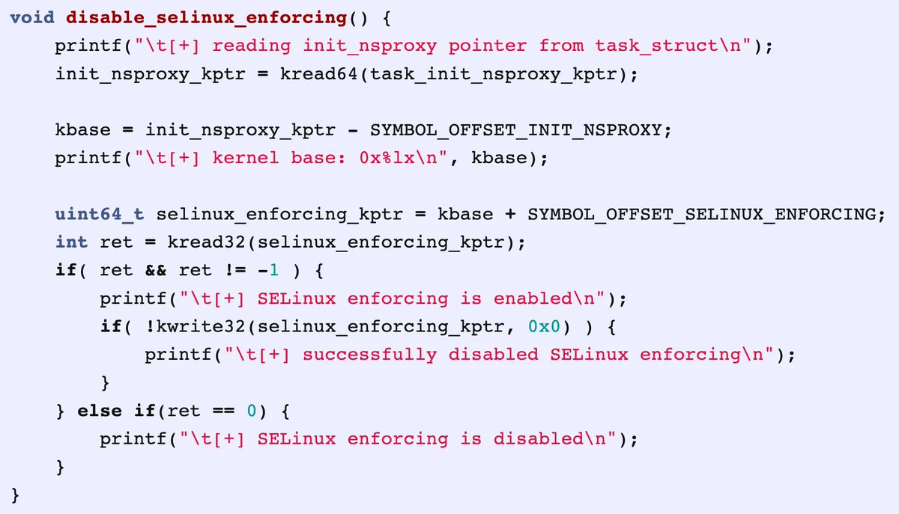</td>
<td>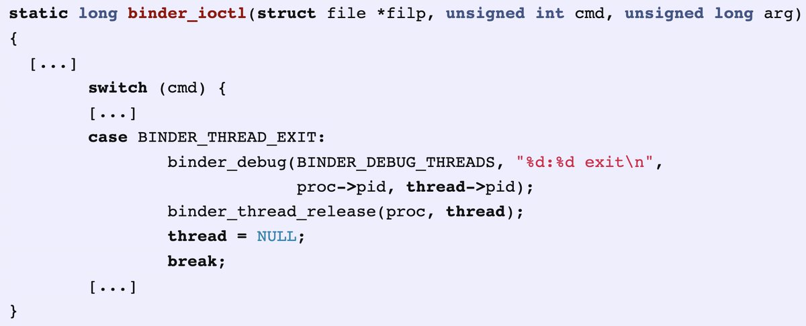</td>
</table></tr>
<table><tr>
<td>Quotes: <code>1</code></td>
<td>Replies: <code>1</code></td>
<td>Retweets: <code>23</code></td>
<td>Favorites: <code>80</code></td>
</tr></table>

---

# piedpiper1616
**https://twitter.com/piedpiper1616/status/1621171115631706113 _at 2023-02-02, 15:38:08_**
<blockquote>
GitHub - hacksysteam/CVE-2023-21608: Adobe Acrobat Reader - CVE-2023-21608 - Remote Code Execution Exploit - https://t.co/xVfZvBgsfC
</blockquote>

* https://github.com/hacksysteam/CVE-2023-21608

<table><tr>
<td>Quotes: <code>4</code></td>
<td>Replies: <code>0</code></td>
<td>Retweets: <code>51</code></td>
<td>Favorites: <code>92</code></td>
</tr></table>

---

# ptswarm
**https://twitter.com/ptswarm/status/1621138934393901060 _at 2023-02-02, 13:30:15_**
<blockquote>
🧙‍♂️ CVE-2022-44268 - a vulnerability in ImageMagick that could lead to an arbitrary file read.

How does it work? See here 👇 https://t.co/JXVw9KPF6T
</blockquote>

<table><tr>
<td>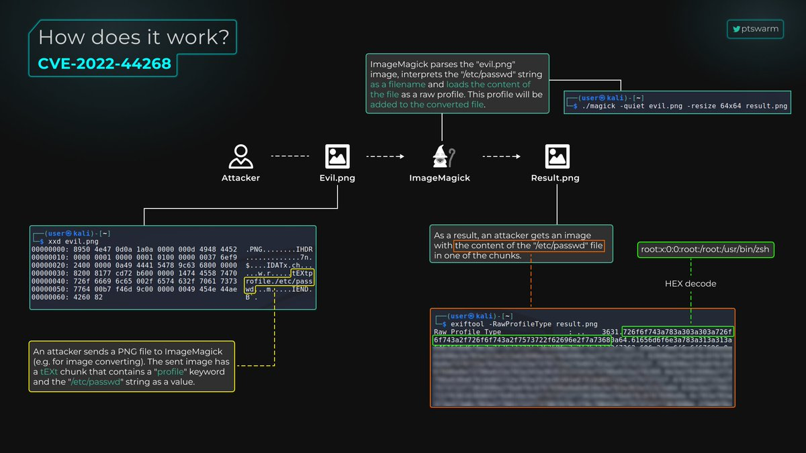</td>
</table></tr>
<table><tr>
<td>Quotes: <code>7</code></td>
<td>Replies: <code>4</code></td>
<td>Retweets: <code>131</code></td>
<td>Favorites: <code>462</code></td>
</tr></table>

---

# 0xor0ne
**https://twitter.com/0xor0ne/status/1620757632423284736 _at 2023-02-01, 12:15:06_**
<blockquote>
Writeup on CVE-2022-42703 by Seth Jenkins  
Use after free in Linux kernel's memory management (MM) subsystem 

https://t.co/5EGdpc3aFL 

#Linux #kernel #exploit #infosec #cybersecurity https://t.co/LRVHiICunJ
</blockquote>

* https://googleprojectzero.blogspot.com/2022/12/exploiting-CVE-2022-42703-bringing-back-the-stack-attack.html

<table><tr>
<td></td>
<td></td>
<td></td>
</table></tr>
<table><tr>
<td>Quotes: <code>3</code></td>
<td>Replies: <code>1</code></td>
<td>Retweets: <code>49</code></td>
<td>Favorites: <code>155</code></td>
</tr></table>

---

# cyb3rops
**https://twitter.com/cyb3rops/status/1620696377851367425 _at 2023-02-01, 08:11:42_**
<blockquote>
Reading @rapid7's analysis on CVE-2021-22005 affecting VMWare vCenter &amp; the new RCE vuln in VMWare vRealize I think its a good idea to point to my auditd config, which includes rules to monitor for crond modifications

Analysis
https://t.co/A5Gy9vZ0cQ

https://t.co/oDz2SOFtlm https://t.co/PelFLNxe7E
</blockquote>

* https://attackerkb.com/topics/15E0q0tdEZ/cve-2021-22005/rapid7-analysis
* https://github.com/Neo23x0/auditd/blob/master/audit.rules#L158

<table><tr>
<td>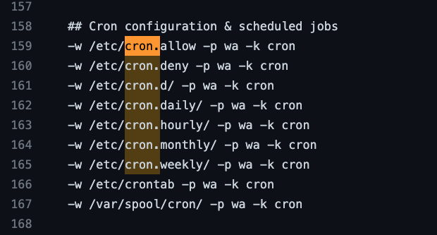</td>
<td>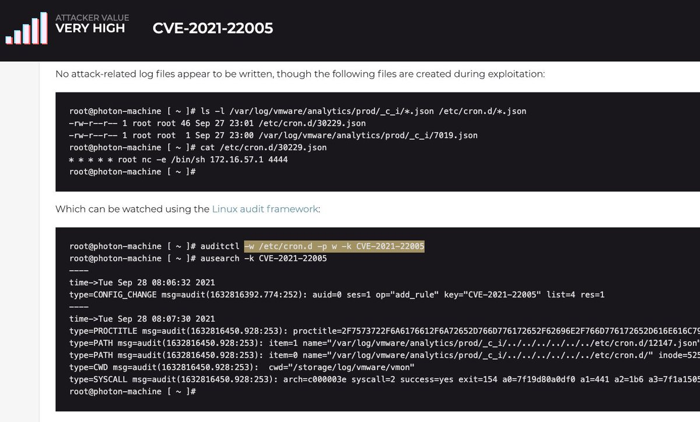</td>
</table></tr>
<table><tr>
<td>Quotes: <code>1</code></td>
<td>Replies: <code>0</code></td>
<td>Retweets: <code>16</code></td>
<td>Favorites: <code>53</code></td>
</tr></table>

---

# momika233
**https://twitter.com/momika233/status/1620656226349768709 _at 2023-02-01, 05:32:09_**
<blockquote>
CVE-2023-23924: Critical-Severity RCE Flaw Found in Popular Dompdf Library
https://t.co/EUdDRSJpI0 https://t.co/pa3VLXXRAD
</blockquote>

* https://github.com/advisories/GHSA-3cw5-7cxw-v5qg

<table><tr>
<td>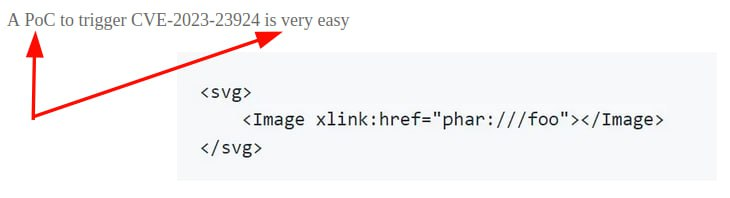</td>
</table></tr>
<table><tr>
<td>Quotes: <code>1</code></td>
<td>Replies: <code>6</code></td>
<td>Retweets: <code>83</code></td>
<td>Favorites: <code>275</code></td>
</tr></table>

---

