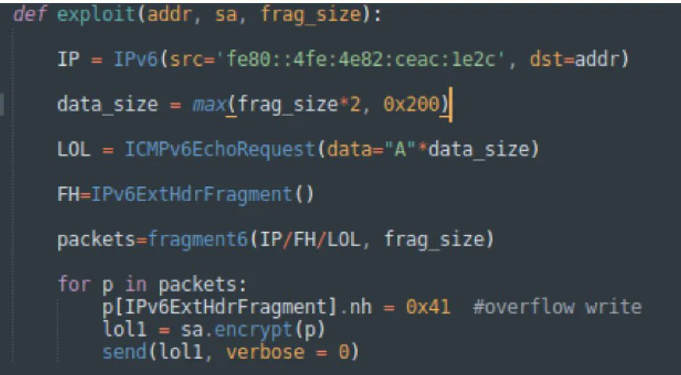

# cyber_advising
**https://twitter.com/cyber_advising/status/1645254503568998404 _at 2023-04-10, 02:36:55_**
<blockquote>
CVE-2023-29017: VM2 JavaScript sandbox escape; bypass the sandbox protections to gain remote code execution rights on the host running the sandbox.

vm2 version: ~3.9.14
Node version: 18.15.0, 19.8.1, 17.9.1

PoC
https://t.co/8C7ZEL11Ri https://t.co/ayFSIJkww6
</blockquote>

* https://gist.github.com/seongil-wi/2a44e082001b959bfe304b62121fb76d

<table><tr>
<td></td>
</table></tr>
<table><tr>
<td>Quotes: <code>1</code></td>
<td>Replies: <code>0</code></td>
<td>Retweets: <code>12</code></td>
<td>Favorites: <code>35</code></td>
</tr></table>

---

# 0xor0ne
**https://twitter.com/0xor0ne/status/1644603530416627713 _at 2023-04-08, 07:30:11_**
<blockquote>
Patch analysis, vulnerability bug identification and exploit development for CVE-2022-34718 (Windows TCP/IP Remote Code Execution Vulnerability)
Great writeup by @chompie1337 

https://t.co/ZDEOVqM765 

#infosec #cybersecurity #cve #exploit https://t.co/IXb4omcfiJ
</blockquote>

* https://securityintelligence.com/posts/dissecting-exploiting-tcp-ip-rce-vulnerability-evilesp/

<table><tr>
<td></td>
<td></td>
<td></td>
<td></td>
</table></tr>
<table><tr>
<td>Quotes: <code>4</code></td>
<td>Replies: <code>2</code></td>
<td>Retweets: <code>78</code></td>
<td>Favorites: <code>288</code></td>
</tr></table>

---

# thezdi
**https://twitter.com/thezdi/status/1644010134958481411 _at 2023-04-06, 16:12:15_**
<blockquote>
VM escapes in #Parallels Desktop are a common target for many researchers. @renorobertr details some local privilege escalation via setuid root binaries in his latest blog. His write-up includes root cause analysis of CVE-2023-27322, -27324, &amp; -27325. https://t.co/LkZFgsYHpD
</blockquote>

* https://www.zerodayinitiative.com/blog/2023/4/5/bash-privileged-mode-vulnerabilities-in-parallels-desktop-and-cdpath-handling-in-macos

<table><tr>
<td>Quotes: <code>1</code></td>
<td>Replies: <code>0</code></td>
<td>Retweets: <code>36</code></td>
<td>Favorites: <code>100</code></td>
</tr></table>

---

# stephenfewer
**https://twitter.com/stephenfewer/status/1642965097764257792 _at 2023-04-03, 18:59:38_**
<blockquote>
Our @rapid7 AttackerKB Analysis of CVE-2023-26359 in Adobe ColdFusion has been updated to detail unauthenticated remote code execution and arbitrary file reading. A @metasploit module will be available soon. All the details here: https://t.co/wlX0roWDGH
</blockquote>

* https://attackerkb.com/topics/1iRdvtUgtW/cve-2023-26359/rapid7-analysis

<table><tr>
<td>Quotes: <code>4</code></td>
<td>Replies: <code>3</code></td>
<td>Retweets: <code>42</code></td>
<td>Favorites: <code>91</code></td>
</tr></table>

---

