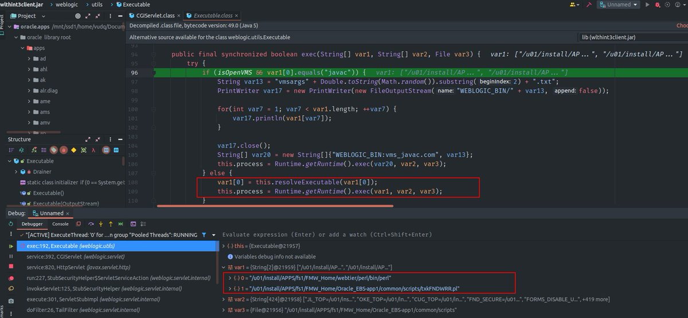
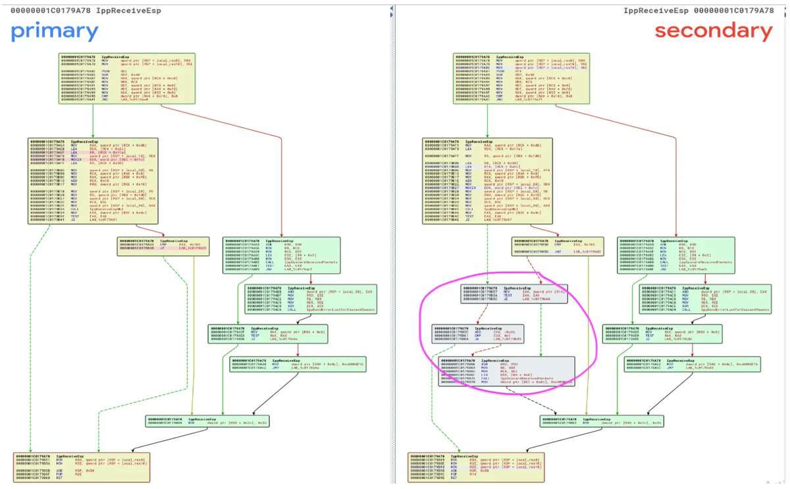

# cyber_advising
**https://twitter.com/cyber_advising/status/1651584864544604162 _at 2023-04-27, 13:51:31_**
<blockquote>
CVE-2023-29489: XSS in million websites cPanel...

Poc
https://t.co/mclgvGs5dD https://t.co/wo5r1G7Esq
</blockquote>

* https://blog.assetnote.io/2023/04/26/xss-million-websites-cpanel/

<table><tr>
<td></td>
</table></tr>
<table><tr>
<td>Quotes: <code>4</code></td>
<td>Replies: <code>8</code></td>
<td>Retweets: <code>131</code></td>
<td>Favorites: <code>383</code></td>
</tr></table>

---

# SinSinology
**https://twitter.com/SinSinology/status/1651528362584846336 _at 2023-04-27, 10:07:00_**
<blockquote>
CVE-2022-21587 (Oracle E-Business Suite Unauthenticated #RCE) by @vcslab 

https://t.co/qvR2JyEGh8 https://t.co/dNchGHMCxR
</blockquote>

* https://blog.viettelcybersecurity.com/cve-2022-21587-oracle-e-business-suite-unauth-rce/

<table><tr>
<td></td>
<td></td>
</table></tr>
<table><tr>
<td>Quotes: <code>2</code></td>
<td>Replies: <code>0</code></td>
<td>Retweets: <code>27</code></td>
<td>Favorites: <code>102</code></td>
</tr></table>

---

# MsftSecIntel
**https://twitter.com/MsftSecIntel/status/1651346653901725696 _at 2023-04-26, 22:04:57_**
<blockquote>
Microsoft is attributing the recently reported attacks exploiting the CVE-2023-27350 and CVE-2023-27351 vulnerabilities in print management software PaperCut to deliver Clop ransomware to the threat actor tracked as Lace Tempest (overlaps with FIN11 and TA505).
</blockquote>

<table><tr>
<td>Quotes: <code>31</code></td>
<td>Replies: <code>4</code></td>
<td>Retweets: <code>169</code></td>
<td>Favorites: <code>359</code></td>
</tr></table>

---

# rootxharsh
**https://twitter.com/rootxharsh/status/1650884170363846656 _at 2023-04-25, 15:27:12_**
<blockquote>
CVE-2023-20864 - VMware Aria Operations for Logs / Log Insight Pre-Authentication RCE PoC.

@pdnuclei Template - https://t.co/Hgc0Nm70Cf 

cc @iamnoooob @wvuuuuuuuuuuuuu ! https://t.co/MBwLUboCgz
</blockquote>

* https://github.com/projectdiscovery/nuclei-templates/pull/7128

<table><tr>
<td></td>
</table></tr>
<table><tr>
<td>Quotes: <code>5</code></td>
<td>Replies: <code>6</code></td>
<td>Retweets: <code>42</code></td>
<td>Favorites: <code>198</code></td>
</tr></table>

---

# cyber_advising
**https://twitter.com/cyber_advising/status/1650269289260122113 _at 2023-04-23, 22:43:53_**
<blockquote>
CVE-2023-1671: A pre-auth command injection vulnerability in the warn-proceed handler of Sophos Web Appliance older than version 4.3.10.4 allows execution of arbitrary code.

PoC
https://t.co/Wsdk95jFc7 https://t.co/aQWMtd3Hn9
</blockquote>

* https://vulncheck.com/blog/cve-2023-1671-analysis

<table><tr>
<td></td>
</table></tr>
<table><tr>
<td>Quotes: <code>2</code></td>
<td>Replies: <code>0</code></td>
<td>Retweets: <code>20</code></td>
<td>Favorites: <code>63</code></td>
</tr></table>

---

# RandoriAttack
**https://twitter.com/RandoriAttack/status/1649170230797541378 _at 2023-04-20, 21:56:37_**
<blockquote>
We've been able to trigger CVE-2023-21554 AKA #QueueJumper, a recently patched RCE in Microsoft’s Message Queueing Service reported by @_CPResearch_. We can confirm it appears exploitable. IOCs and more: https://t.co/NxMiZIAb9P
</blockquote>

* https://www.randori.com/blog/vulnerability-analysis-queuejumper-cve-2023-21554/

<table><tr>
<td>Quotes: <code>6</code></td>
<td>Replies: <code>2</code></td>
<td>Retweets: <code>61</code></td>
<td>Favorites: <code>120</code></td>
</tr></table>

---

# maddiestone
**https://twitter.com/maddiestone/status/1649154462525829121 _at 2023-04-20, 20:53:58_**
<blockquote>
🔍New RCA! CVE-2022-32917, and in-the-wild 0-day affecting macOS and iOS that was patched in Sept 2022. Thanks to @NedWilliamson for writing! 

https://t.co/odTULQsYaI https://t.co/WHr9sDl2Dd
</blockquote>

* https://googleprojectzero.github.io/0days-in-the-wild//0day-RCAs/2022/CVE-2022-32917.html

<table><tr>
<td></td>
</table></tr>
<table><tr>
<td>Quotes: <code>1</code></td>
<td>Replies: <code>1</code></td>
<td>Retweets: <code>17</code></td>
<td>Favorites: <code>94</code></td>
</tr></table>

---

# cyber_advising
**https://twitter.com/cyber_advising/status/1648926773709504520 _at 2023-04-20, 05:49:13_**
<blockquote>
CVE-2023-25136: OpenSSH server (sshd) 9.1 introduced a double-free vulnerability during options.kex_algorithms handling. This is fixed in OpenSSH 9.2

PoC
https://t.co/DHxVaTJXh2 https://t.co/ySWPLacLtY
</blockquote>

* https://github.com/adhikara13/CVE-2023-25136

<table><tr>
<td></td>
</table></tr>
<table><tr>
<td>Quotes: <code>2</code></td>
<td>Replies: <code>1</code></td>
<td>Retweets: <code>22</code></td>
<td>Favorites: <code>76</code></td>
</tr></table>

---

# hosselot
**https://twitter.com/hosselot/status/1648698008249171968 _at 2023-04-19, 14:40:11_**
<blockquote>
And here is Chrome sandbox escape fix (Integer overflow in Skia (CVE-2023-2136)):
https://t.co/cU6dTN906G

https://t.co/rsy8HMz8iv
</blockquote>

* https://skia.googlesource.com/skia.git/+/1cbd33ecd73523f8d4bf88e9c5576303b39e5556
* https://skia.googlesource.com/skia.git/+/4dc748f14c6650cb45c7086a39af1760bfda41d2

<table><tr>
<td>Quotes: <code>1</code></td>
<td>Replies: <code>0</code></td>
<td>Retweets: <code>17</code></td>
<td>Favorites: <code>74</code></td>
</tr></table>

---

# momika233
**https://twitter.com/momika233/status/1648498847449231364 _at 2023-04-19, 01:28:47_**
<blockquote>
OpenSSH Pre-Auth Double Free CVE-2023-25136 POC
https://t.co/uylVZCmtnF
</blockquote>

* https://github.com/adhikara13/CVE-2023-25136

<table><tr>
<td>Quotes: <code>1</code></td>
<td>Replies: <code>0</code></td>
<td>Retweets: <code>28</code></td>
<td>Favorites: <code>105</code></td>
</tr></table>

---

# maddiestone
**https://twitter.com/maddiestone/status/1648493028125073408 _at 2023-04-19, 01:05:40_**
<blockquote>
Chrome patches an in-the-wild 0-day: CVE-2023-2136, an integer overflow in Skia. Discovered by @_clem1 of Google TAG 🎯 #itw0days

Kudos to Chrome on some super quick patching -- 3 days for the RCE, patched on Friday, and 6 days for this sbx escape. 👏🏽

https://t.co/lqlLJXsTIT
</blockquote>

* https://chromereleases.googleblog.com/2023/04/stable-channel-update-for-desktop_18.html

<table><tr>
<td>Quotes: <code>3</code></td>
<td>Replies: <code>1</code></td>
<td>Retweets: <code>30</code></td>
<td>Favorites: <code>115</code></td>
</tr></table>

---

# mj0011sec
**https://twitter.com/mj0011sec/status/1648035523292991488 _at 2023-04-17, 18:47:42_**
<blockquote>
Repro of recently patched in the wild Chrome 0day CVE-2023-2033 by Kunlun Lab: https://t.co/99tSSB4wIW (CN) , more details available via CyberKunlun Intelligence Service
</blockquote>

* https://mp.weixin.qq.com/s/2yy3ViqcBEbH3ceH6zP8Ag

<table><tr>
<td>Quotes: <code>1</code></td>
<td>Replies: <code>0</code></td>
<td>Retweets: <code>14</code></td>
<td>Favorites: <code>68</code></td>
</tr></table>

---

# cyber_advising
**https://twitter.com/cyber_advising/status/1647788260763025413 _at 2023-04-17, 02:25:10_**
<blockquote>
CVE-2023-25135: vBulletin before 5.6.9 PL1 allows an unauthenticated remote attacker to execute arbitrary code via a crafted HTTP request that triggers deserialization.

PoC
https://t.co/hknrQNdTNJ https://t.co/mQ1tAd3vZ5
</blockquote>

* https://github.com/ambionics/vbulletin-exploits

<table><tr>
<td></td>
</table></tr>
<table><tr>
<td>Quotes: <code>3</code></td>
<td>Replies: <code>0</code></td>
<td>Retweets: <code>11</code></td>
<td>Favorites: <code>56</code></td>
</tr></table>

---

# momika233
**https://twitter.com/momika233/status/1647771486160314368 _at 2023-04-17, 01:18:31_**
<blockquote>
CVE-2023-29084 Command injection in ManageEngine ADManager Plus
https://t.co/1c6bgq333b
</blockquote>

* https://hnd3884.github.io/posts/CVE-2023-29084-Command-injection-in-ManageEngine-ADManager-plus/

<table><tr>
<td>Quotes: <code>2</code></td>
<td>Replies: <code>1</code></td>
<td>Retweets: <code>24</code></td>
<td>Favorites: <code>101</code></td>
</tr></table>

---

# hosselot
**https://twitter.com/hosselot/status/1647242623386542080 _at 2023-04-15, 14:17:00_**
<blockquote>
Apparently, recent Chrome actively exploited zero-day vulnerability (CVE-2023-2033: type confusion in V8 engine) happens during handling of "ErrorCaptureStackTrace" builtin with Proxy involved. Here is the fix:
https://t.co/YV5R3CYEbM
</blockquote>

* https://chromium.googlesource.com/v8/v8.git/+/c605df24af3cf95e313391b542eb57b04d642e7a

<table><tr>
<td>Quotes: <code>2</code></td>
<td>Replies: <code>1</code></td>
<td>Retweets: <code>12</code></td>
<td>Favorites: <code>72</code></td>
</tr></table>

---

# cyber_advising
**https://twitter.com/cyber_advising/status/1647207292062904322 _at 2023-04-15, 11:56:36_**
<blockquote>
CVE-2023-29084: Zoho ManageEngine ADManager Plus through 7180 allows for authenticated users to exploit command injection via Proxy settings.

PoC
https://t.co/A1FDduTP5P https://t.co/wUzJmOSOKv
</blockquote>

* https://hnd3884.github.io/posts/CVE-2023-29084-Command-injection-in-ManageEngine-ADManager-plus/

<table><tr>
<td></td>
</table></tr>
<table><tr>
<td>Quotes: <code>1</code></td>
<td>Replies: <code>1</code></td>
<td>Retweets: <code>31</code></td>
<td>Favorites: <code>109</code></td>
</tr></table>

---

# momika233
**https://twitter.com/momika233/status/1646103786874888192 _at 2023-04-12, 10:51:40_**
<blockquote>
Shell in the Ghost: Ghostscript CVE-2023-28879 writeup
https://t.co/tLL4YqbU1Z
</blockquote>

* https://offsec.almond.consulting/ghostscript-cve-2023-28879.html

<table><tr>
<td>Quotes: <code>1</code></td>
<td>Replies: <code>0</code></td>
<td>Retweets: <code>21</code></td>
<td>Favorites: <code>69</code></td>
</tr></table>

---

# Gi7w0rm
**https://twitter.com/Gi7w0rm/status/1645898658976608258 _at 2023-04-11, 21:16:34_**
<blockquote>
⚠️New unauthenticated #RCE #vulnerability in Windows discovered and patched.
CVE-2023-21554 dupped #QueueJumper by @CheckPointSW is a weakness in Microsoft Message Queuing (#MSMQ) used in Windows Servers (up to Server 2022), Clients (up to Windows 11), and Windows Embedded since…
</blockquote>

<table><tr>
<td>Quotes: <code>1</code></td>
<td>Replies: <code>1</code></td>
<td>Retweets: <code>33</code></td>
<td>Favorites: <code>80</code></td>
</tr></table>

---

# cyber_advising
**https://twitter.com/cyber_advising/status/1645865819606339596 _at 2023-04-11, 19:06:04_**
<blockquote>
CVE-2023-21817: Windows Kerberos Elevation of Privilege Vulnerability.

PoC
https://t.co/nLkVRH16kT https://t.co/OKsyQG5yst
</blockquote>

* https://gist.github.com/monoxgas/f615514fb51ebb55a7229f3cf79cf95b

<table><tr>
<td></td>
</table></tr>
<table><tr>
<td>Quotes: <code>3</code></td>
<td>Replies: <code>0</code></td>
<td>Retweets: <code>30</code></td>
<td>Favorites: <code>121</code></td>
</tr></table>

---

# cherepanov74
**https://twitter.com/cherepanov74/status/1645864573008859169 _at 2023-04-11, 19:01:07_**
<blockquote>
RT @oct0xor: We found a new zero-day (CVE-2023-28252) in Microsoft Windows used in Nokoyawa ransomware attacks
https://t.co/LHM1ITb6KQ
</blockquote>

* https://securelist.com/nokoyawa-ransomware-attacks-with-windows-zero-day/109483/

<table><tr>
<td>Quotes: <code>0</code></td>
<td>Replies: <code>0</code></td>
<td>Retweets: <code>198</code></td>
<td>Favorites: <code>0</code></td>
</tr></table>

---

# K3vinLuSec
**https://twitter.com/K3vinLuSec/status/1645849496969150466 _at 2023-04-11, 18:01:13_**
<blockquote>
I got an acknowledgment of Microsoft Office Graphics Remote Code Execution Vulnerability(CVE-2023-28285), 11 different vulnerabilities I reported were included in this CVE. Microsoft just assigned one CVE for them. @msftsecresponse #patchTuesday https://t.co/dzYmJqXhHq
</blockquote>

<table><tr>
<td></td>
</table></tr>
<table><tr>
<td>Quotes: <code>0</code></td>
<td>Replies: <code>5</code></td>
<td>Retweets: <code>2</code></td>
<td>Favorites: <code>39</code></td>
</tr></table>

---

# HaifeiLi
**https://twitter.com/HaifeiLi/status/1645846180902088704 _at 2023-04-11, 17:48:02_**
<blockquote>
🚨This unauthorized RCE bug (CVE-2023-21554) in the "forgotten" MSMQ service may have big impact. If you’re a Windows admin, you need to check your environments ASAP (you may have unawarely enabled the service).
https://t.co/oNelXKq2ZO
</blockquote>

* https://twitter.com/_CPResearch_/status/1645836723660771328

<table><tr>
<td>Quotes: <code>4</code></td>
<td>Replies: <code>5</code></td>
<td>Retweets: <code>69</code></td>
<td>Favorites: <code>166</code></td>
</tr></table>

---

# oct0xor
**https://twitter.com/oct0xor/status/1645846093526355968 _at 2023-04-11, 17:47:41_**
<blockquote>
We found a new zero-day (CVE-2023-28252) in Microsoft Windows used in Nokoyawa ransomware attacks
https://t.co/LHM1ITb6KQ
</blockquote>

* https://securelist.com/nokoyawa-ransomware-attacks-with-windows-zero-day/109483/

<table><tr>
<td>Quotes: <code>8</code></td>
<td>Replies: <code>4</code></td>
<td>Retweets: <code>110</code></td>
<td>Favorites: <code>238</code></td>
</tr></table>

---

# _CPResearch_
**https://twitter.com/_CPResearch_/status/1645836723660771328 _at 2023-04-11, 17:10:27_**
<blockquote>
🚨 We discovered 3 vulnerabilities in Microsoft Message Queuing (MSMQ) service, including #QueueJumper (CVE-2023-21554), a Critical vulnerability that could allow unauthorized attackers to remotely execute code.

More details in our blog 👉 https://t.co/sobbPgFBQi

#PatchNow https://t.co/NvfUTgbI1N
</blockquote>

* https://research.checkpoint.com/2023/queuejumper-critical-unauthorized-rce-vulnerability-in-msmq-service/

<table><tr>
<td></td>
</table></tr>
<table><tr>
<td>Quotes: <code>12</code></td>
<td>Replies: <code>4</code></td>
<td>Retweets: <code>113</code></td>
<td>Favorites: <code>286</code></td>
</tr></table>

---

# AlmondOffSec
**https://twitter.com/AlmondOffSec/status/1645785869432004611 _at 2023-04-11, 13:48:23_**
<blockquote>
Ghostscript RCE CVE-2023-28879 can impact many applications processing images and PDF files.
Discovery and exploitation write-up by team member @sigabrt9 : https://t.co/tQyDkVf7tx https://t.co/phsvZNNzi2
</blockquote>

* https://offsec.almond.consulting/ghostscript-cve-2023-28879.html

<table><tr>
<td></td>
</table></tr>
<table><tr>
<td>Quotes: <code>6</code></td>
<td>Replies: <code>2</code></td>
<td>Retweets: <code>131</code></td>
<td>Favorites: <code>343</code></td>
</tr></table>

---

# momika233
**https://twitter.com/momika233/status/1645602653433651200 _at 2023-04-11, 01:40:21_**
<blockquote>
Needle (CVE-2023-0179) exploit
This repository contains the exploit for my recently discovered vulnerability in the nftables subsystem that was assigned CVE-2023-0179
https://t.co/LL9quUUN69
</blockquote>

* https://github.com/H4K6/CVE-2023-0179-PoC

<table><tr>
<td>Quotes: <code>1</code></td>
<td>Replies: <code>5</code></td>
<td>Retweets: <code>76</code></td>
<td>Favorites: <code>212</code></td>
</tr></table>

---

# piedpiper1616
**https://twitter.com/piedpiper1616/status/1645572998601269249 _at 2023-04-10, 23:42:30_**
<blockquote>
Minimal PoC code for Kerberos Unlock LPE (CVE-2023-21817) · GitHub - https://t.co/kdeq2a56j9
</blockquote>

* https://gist.github.com/monoxgas/f615514fb51ebb55a7229f3cf79cf95b

<table><tr>
<td>Quotes: <code>2</code></td>
<td>Replies: <code>1</code></td>
<td>Retweets: <code>25</code></td>
<td>Favorites: <code>79</code></td>
</tr></table>

---

# monoxgas
**https://twitter.com/monoxgas/status/1645565092229189632 _at 2023-04-10, 23:11:05_**
<blockquote>
A short🧵 detailing a Kerberos LPE I discovered while working with @tiraniddo on our BlackHat research.

https://t.co/LjM3t1b0DC (CVE-2023-21817)

This was fixed in Feb, but I think some will find the vulnerability &amp; exploitation interesting.

1/
</blockquote>

* https://msrc.microsoft.com/update-guide/vulnerability/CVE-2023-21817

<table><tr>
<td>Quotes: <code>0</code></td>
<td>Replies: <code>1</code></td>
<td>Retweets: <code>111</code></td>
<td>Favorites: <code>223</code></td>
</tr></table>

---

# cyber_advising
**https://twitter.com/cyber_advising/status/1645391437729595392 _at 2023-04-10, 11:41:03_**
<blockquote>
CVE-2023-28206: iOS 16.4.1 and iPadOS 16.4.1 out-of-bounds write vulnerability that may allow attackers to use a maliciously crafted app to execute arbitrary code with kernel privileges on a vulnerable device...

PoC
https://t.co/hrLIkRNqwV https://t.co/ZNLQ5EapUN
</blockquote>

* https://gist.github.com/LinusHenze/728db96a836b6817ecb727cfbde606b3

<table><tr>
<td></td>
</table></tr>
<table><tr>
<td>Quotes: <code>2</code></td>
<td>Replies: <code>0</code></td>
<td>Retweets: <code>9</code></td>
<td>Favorites: <code>40</code></td>
</tr></table>

---

# cyber_advising
**https://twitter.com/cyber_advising/status/1645254503568998404 _at 2023-04-10, 02:36:55_**
<blockquote>
CVE-2023-29017: VM2 JavaScript sandbox escape; bypass the sandbox protections to gain remote code execution rights on the host running the sandbox.

vm2 version: ~3.9.14
Node version: 18.15.0, 19.8.1, 17.9.1

PoC
https://t.co/8C7ZEL11Ri https://t.co/ayFSIJkww6
</blockquote>

* https://gist.github.com/seongil-wi/2a44e082001b959bfe304b62121fb76d

<table><tr>
<td></td>
</table></tr>
<table><tr>
<td>Quotes: <code>1</code></td>
<td>Replies: <code>0</code></td>
<td>Retweets: <code>13</code></td>
<td>Favorites: <code>39</code></td>
</tr></table>

---

# carlos_crowsec
**https://twitter.com/carlos_crowsec/status/1644719284868861954 _at 2023-04-08, 15:10:09_**
<blockquote>
CVE-2023-28838 is a SQL Injection that allows the user with low privileges to gain access to all data in the database and in some cases RCE by writing a webshell on the server.

PoC and more information here: https://t.co/zOD9fR0XvL
</blockquote>

* https://huntr.dev/bounties/b2e7ea1e-061a-47aa-b292-d4198cdaad4b/

<table><tr>
<td>Quotes: <code>1</code></td>
<td>Replies: <code>0</code></td>
<td>Retweets: <code>7</code></td>
<td>Favorites: <code>37</code></td>
</tr></table>

---

# AdmVonSchneider
**https://twitter.com/AdmVonSchneider/status/1644648800680542215 _at 2023-04-08, 10:30:04_**
<blockquote>
RT @maddiestone: 🎯@_clem1 is at it again! Apple patched 2 new iOS in-the-wild 0days: CVE-2023-28205 in Safari and CVE-2023-28206 in IOSurfa…
</blockquote>

<table><tr>
<td>Quotes: <code>0</code></td>
<td>Replies: <code>0</code></td>
<td>Retweets: <code>35</code></td>
<td>Favorites: <code>0</code></td>
</tr></table>

---

# 0xor0ne
**https://twitter.com/0xor0ne/status/1644603530416627713 _at 2023-04-08, 07:30:11_**
<blockquote>
Patch analysis, vulnerability bug identification and exploit development for CVE-2022-34718 (Windows TCP/IP Remote Code Execution Vulnerability)
Great writeup by @chompie1337 

https://t.co/ZDEOVqM765 

#infosec #cybersecurity #cve #exploit https://t.co/IXb4omcfiJ
</blockquote>

* https://securityintelligence.com/posts/dissecting-exploiting-tcp-ip-rce-vulnerability-evilesp/

<table><tr>
<td></td>
<td></td>
<td></td>
<td></td>
</table></tr>
<table><tr>
<td>Quotes: <code>4</code></td>
<td>Replies: <code>2</code></td>
<td>Retweets: <code>78</code></td>
<td>Favorites: <code>292</code></td>
</tr></table>

---

# GHSecurityLab
**https://twitter.com/GHSecurityLab/status/1644025303671382034 _at 2023-04-06, 17:12:31_**
<blockquote>
In his latest post, @mmolgtm sheds light on a patching problem in Pixel 6 (GHSL-2023-005) that can leave your device vulnerable to a variant of CVE-2022-38181, enabling malicious apps to gain root access. Read 👉 https://t.co/My1wutUWJ7 https://t.co/uhS0o9gujk
</blockquote>

* https://gh.io/pwn-pixel6

<table><tr>
<td></td>
</table></tr>
<table><tr>
<td>Quotes: <code>0</code></td>
<td>Replies: <code>1</code></td>
<td>Retweets: <code>27</code></td>
<td>Favorites: <code>65</code></td>
</tr></table>

---

# thezdi
**https://twitter.com/thezdi/status/1644010134958481411 _at 2023-04-06, 16:12:15_**
<blockquote>
VM escapes in #Parallels Desktop are a common target for many researchers. @renorobertr details some local privilege escalation via setuid root binaries in his latest blog. His write-up includes root cause analysis of CVE-2023-27322, -27324, &amp; -27325. https://t.co/LkZFgsYHpD
</blockquote>

* https://www.zerodayinitiative.com/blog/2023/4/5/bash-privileged-mode-vulnerabilities-in-parallels-desktop-and-cdpath-handling-in-macos

<table><tr>
<td>Quotes: <code>1</code></td>
<td>Replies: <code>0</code></td>
<td>Retweets: <code>36</code></td>
<td>Favorites: <code>100</code></td>
</tr></table>

---

# GHSecurityLab
**https://twitter.com/GHSecurityLab/status/1643909512850489345 _at 2023-04-06, 09:32:24_**
<blockquote>
GHSL-2023-023: Type confusion in the Chrome renderer - CVE-2023-1214 https://t.co/Rs5nn1S0WN
</blockquote>

* https://securitylab.github.com/advisories/GHSL-2023-023_Chromium/

<table><tr>
<td>Quotes: <code>4</code></td>
<td>Replies: <code>0</code></td>
<td>Retweets: <code>34</code></td>
<td>Favorites: <code>110</code></td>
</tr></table>

---

# stephenfewer
**https://twitter.com/stephenfewer/status/1642965097764257792 _at 2023-04-03, 18:59:38_**
<blockquote>
Our @rapid7 AttackerKB Analysis of CVE-2023-26359 in Adobe ColdFusion has been updated to detail unauthenticated remote code execution and arbitrary file reading. A @metasploit module will be available soon. All the details here: https://t.co/wlX0roWDGH
</blockquote>

* https://attackerkb.com/topics/1iRdvtUgtW/cve-2023-26359/rapid7-analysis

<table><tr>
<td>Quotes: <code>5</code></td>
<td>Replies: <code>3</code></td>
<td>Retweets: <code>42</code></td>
<td>Favorites: <code>88</code></td>
</tr></table>

---

