# GHSecurityLab
**https://twitter.com/GHSecurityLab/status/1673715721174392832 _at 2023-06-27, 15:31:38_**
<blockquote>
GHSL-2023-045: LDAP injection in Bounty Castle For Java - CVE-2023-33201
https://t.co/oh5wSbp1ho
</blockquote>

* https://securitylab.github.com/advisories/GHSL-2023-045_Bouncy_Castle_For_Java/

<table><tr>
<td>Quotes: <code>0</code></td>
<td>Replies: <code>0</code></td>
<td>Retweets: <code>10</code></td>
<td>Favorites: <code>36</code></td>
</tr></table>

---

# momika233
**https://twitter.com/momika233/status/1673696438570864640 _at 2023-06-27, 14:15:01_**
<blockquote>
CVE-2023-27372 SPIP &lt; 4.2.1 - Remote Code Execution
https://t.co/IWRxFWAtK6
</blockquote>

* https://github.com/Chocapikk/CVE-2023-27372/tree/main

<table><tr>
<td>Quotes: <code>0</code></td>
<td>Replies: <code>3</code></td>
<td>Retweets: <code>7</code></td>
<td>Favorites: <code>41</code></td>
</tr></table>

---

# shaybt12
**https://twitter.com/shaybt12/status/1673612503547355137 _at 2023-06-27, 08:41:29_**
<blockquote>
CVE-2023-34598 - Local File Inclusion
Gibbon https://t.co/rtUytwhIZV
</blockquote>

<table><tr>
<td>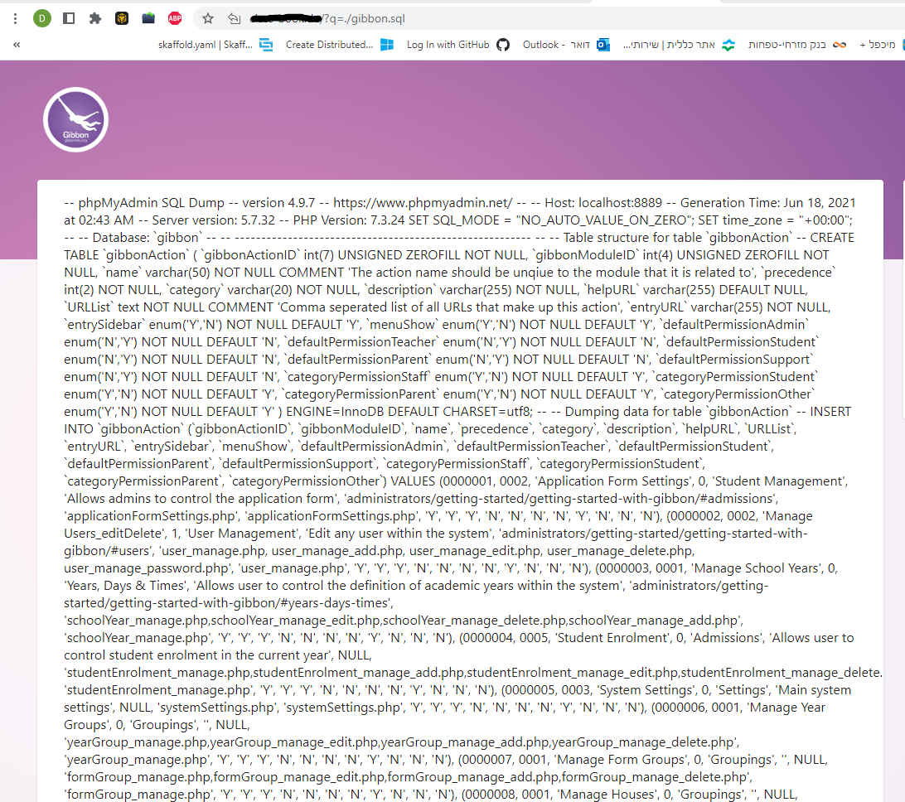</td>
</table></tr>
<table><tr>
<td>Quotes: <code>1</code></td>
<td>Replies: <code>4</code></td>
<td>Retweets: <code>43</code></td>
<td>Favorites: <code>190</code></td>
</tr></table>

---

# TheHackersNews
**https://twitter.com/TheHackersNews/status/1673566086728503297 _at 2023-06-27, 05:37:03_**
<blockquote>
⚡️ Urgent security alert! Fortinet has released urgent updates to fix a critical #vulnerability (CVE-2023-33299) in FortiNAC, exposing networks to arbitrary code execution. 

Learn more: https://t.co/mAuDsuD6U0

#cybersecurity #informationsecurity #hacking #infosec
</blockquote>

* https://thehackernews.com/2023/06/new-fortinets-fortinac-vulnerability.html

<table><tr>
<td>Quotes: <code>1</code></td>
<td>Replies: <code>2</code></td>
<td>Retweets: <code>47</code></td>
<td>Favorites: <code>63</code></td>
</tr></table>

---

# ptracesecurity
**https://twitter.com/ptracesecurity/status/1673254919606870018 _at 2023-06-26, 09:00:35_**
<blockquote>
OpenSSH Pre-Auth Double Free CVE-2023-25136 – Writeup and Proof-of-Concept https://t.co/R4jxqjVQdm  #Pentesting #CVE #CyberSecurity #Infosec https://t.co/RB6fq4rqxP
</blockquote>

* https://jfrog.com/blog/openssh-pre-auth-double-free-cve-2023-25136-writeup-and-proof-of-concept/

<table><tr>
<td>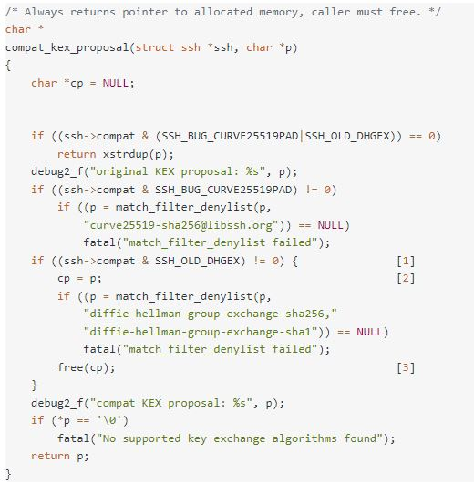</td>
</table></tr>
<table><tr>
<td>Quotes: <code>0</code></td>
<td>Replies: <code>0</code></td>
<td>Retweets: <code>25</code></td>
<td>Favorites: <code>77</code></td>
</tr></table>

---

# ptracesecurity
**https://twitter.com/ptracesecurity/status/1672815648114606082 _at 2023-06-25, 03:55:04_**
<blockquote>
Analysis of VirtualBox CVE-2023-21987 and CVE-2023-21991 https://t.co/iR0dIHO0WL  #Pentesting #VirtualBox #CVE #CyberSecurity #Infosec https://t.co/U6ronAwTH9
</blockquote>

* https://qriousec.github.io/post/vbox-pwn2own-2023/

<table><tr>
<td>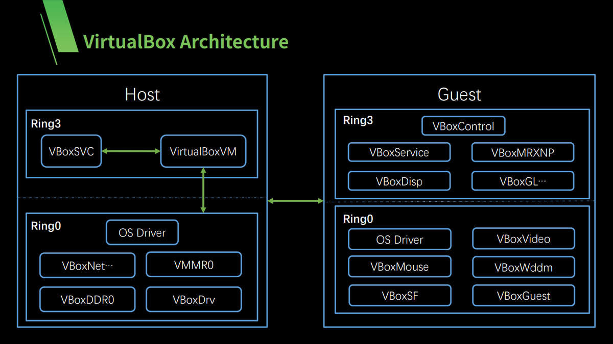</td>
<td>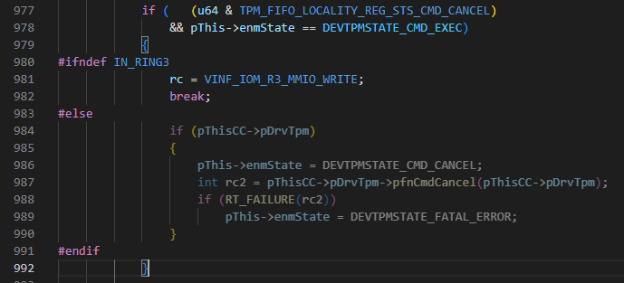</td>
</table></tr>
<table><tr>
<td>Quotes: <code>0</code></td>
<td>Replies: <code>0</code></td>
<td>Retweets: <code>21</code></td>
<td>Favorites: <code>64</code></td>
</tr></table>

---

# ptracesecurity
**https://twitter.com/ptracesecurity/status/1672620761323012098 _at 2023-06-24, 15:00:39_**
<blockquote>
chonked pt.2: exploiting cve-2023-33476 for remote code execution https://t.co/mBALFl9d3u  #Pentesting  #RCE #Exploit #CVE #CyberSecurity #Infosec https://t.co/2MPym2YrfY
</blockquote>

* https://blog.coffinsec.com/0day/2023/06/19/minidlna-cve-2023-33476-exploits.html

<table><tr>
<td>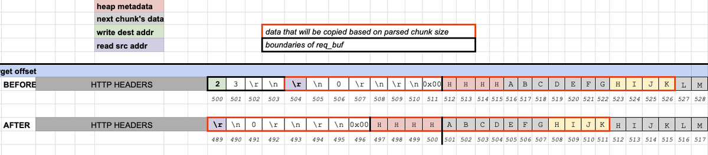</td>
<td>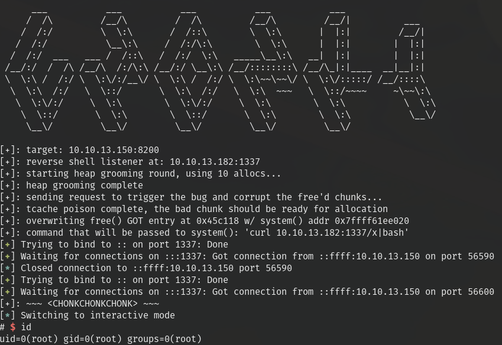</td>
<td>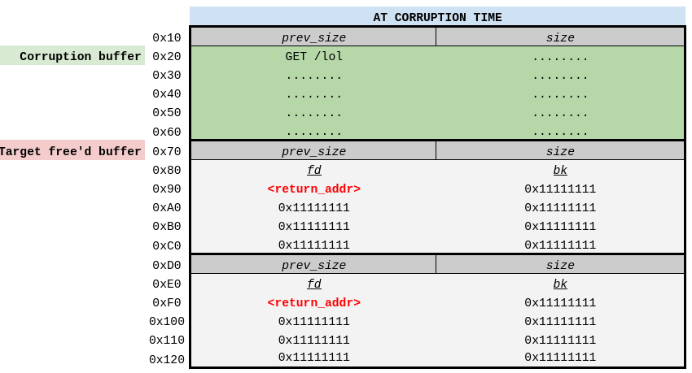</td>
<td>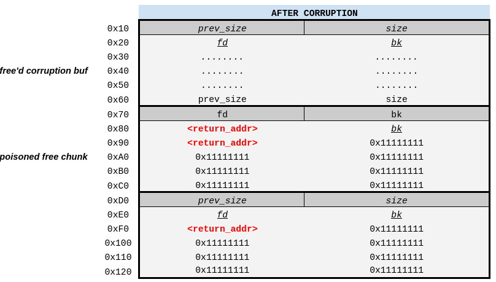</td>
</table></tr>
<table><tr>
<td>Quotes: <code>1</code></td>
<td>Replies: <code>0</code></td>
<td>Retweets: <code>18</code></td>
<td>Favorites: <code>49</code></td>
</tr></table>

---

# wvuuuuuuuuuuuuu
**https://twitter.com/wvuuuuuuuuuuuuu/status/1672275558229581826 _at 2023-06-23, 16:08:57_**
<blockquote>
RT @filip_dragovic: Here is my PoC for CVE-2023-20178 / Arbitrary File Delete vulnerability in Cisco Secure Client and Cisco AnyConnect whi…
</blockquote>

<table><tr>
<td>Quotes: <code>0</code></td>
<td>Replies: <code>0</code></td>
<td>Retweets: <code>69</code></td>
<td>Favorites: <code>0</code></td>
</tr></table>

---

# CyberWarship
**https://twitter.com/CyberWarship/status/1672172658543271936 _at 2023-06-23, 09:20:03_**
<blockquote>
"CVE-2023-25690-POC: CVE 2023 25690 Proof of concept - mod_proxy vulnerable configuration on Apache HTTP Server versions 2.4.0 - 2.4.55 leads to HTTP Request Smuggling vulnerability."

#infosec #pentest #redteam 
https://t.co/hUPqajzIsx https://t.co/Osf18FLo2E
</blockquote>

* https://github.com/dhmosfunk/CVE-2023-25690-POC

<table><tr>
<td>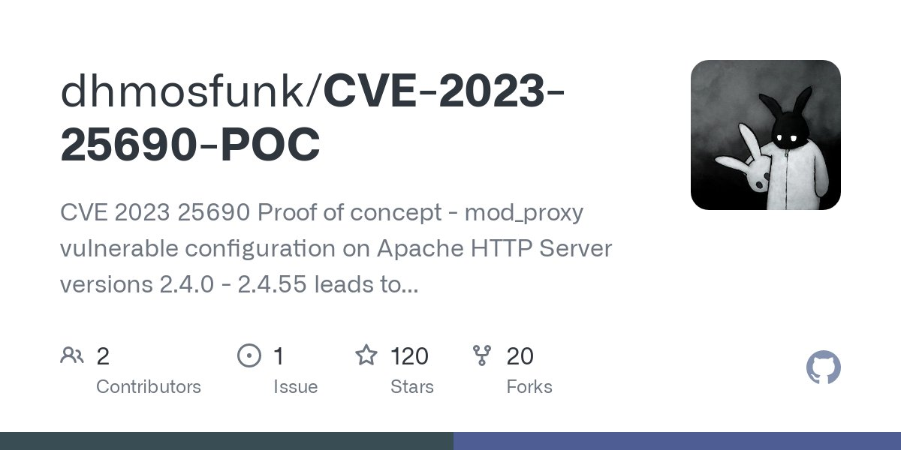</td>
<td>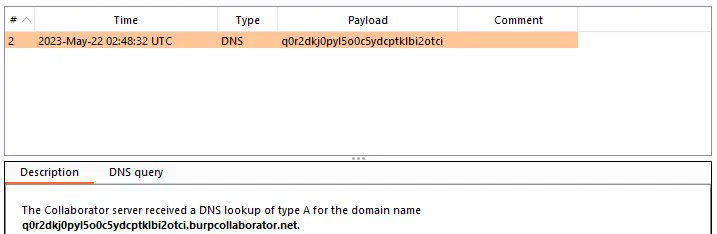</td>
<td>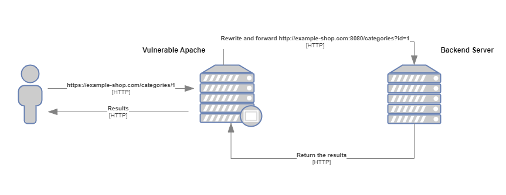</td>
</table></tr>
<table><tr>
<td>Quotes: <code>1</code></td>
<td>Replies: <code>0</code></td>
<td>Retweets: <code>32</code></td>
<td>Favorites: <code>57</code></td>
</tr></table>

---

# threatinsight
**https://twitter.com/threatinsight/status/1671987722183909378 _at 2023-06-22, 21:05:11_**
<blockquote>
Proofpoint researched CVE-2023-2868 impacting #BarracudaESG appliances following @Mandiant's incredible recent research on #0day exploitation ITW.

This 🧵details threat actor #UNC4841's geo targeting, victimology, &amp; strategic areas of focus based on detected phishing emails. 1/6 https://t.co/AFQIKr6Urm
</blockquote>

<table><tr>
<td>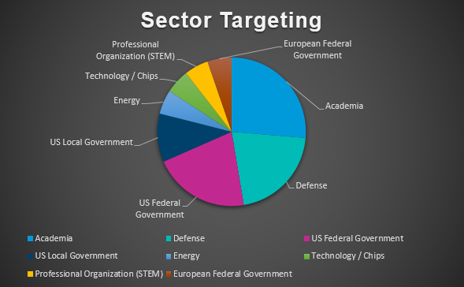</td>
<td>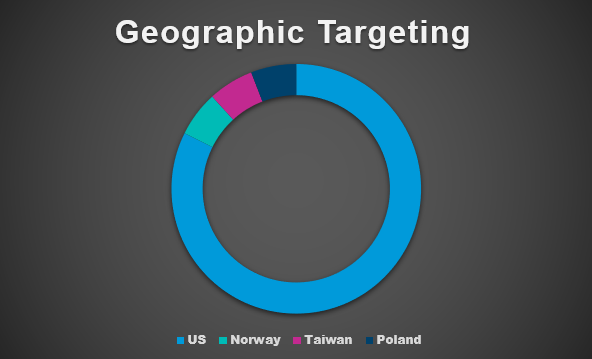</td>
</table></tr>
<table><tr>
<td>Quotes: <code>4</code></td>
<td>Replies: <code>1</code></td>
<td>Retweets: <code>40</code></td>
<td>Favorites: <code>86</code></td>
</tr></table>

---

# kmkz_security
**https://twitter.com/kmkz_security/status/1671912395315331074 _at 2023-06-22, 16:05:52_**
<blockquote>
RT @thezdi: CVE-2022-31696: @renorobertr takes an in-depth look at this #VMware #ESXi type confusion privilege escalation he discovered. He…
</blockquote>

<table><tr>
<td>Quotes: <code>0</code></td>
<td>Replies: <code>0</code></td>
<td>Retweets: <code>32</code></td>
<td>Favorites: <code>0</code></td>
</tr></table>

---

# thezdi
**https://twitter.com/thezdi/status/1671911673886547972 _at 2023-06-22, 16:03:00_**
<blockquote>
CVE-2022-31696: @renorobertr takes an in-depth look at this #VMware #ESXi type confusion privilege escalation he discovered. He shows his research methodology and looks at the patch released to fix it.

https://t.co/hrx3RjUv1L
</blockquote>

* https://www.zerodayinitiative.com/blog/2023/6/21/cve-2022-31696-an-analysis-of-a-vmware-esxi-tcp-socket-keepalive-type-confusion-lpe

<table><tr>
<td>Quotes: <code>0</code></td>
<td>Replies: <code>0</code></td>
<td>Retweets: <code>32</code></td>
<td>Favorites: <code>87</code></td>
</tr></table>

---

# DhiyaneshDK
**https://twitter.com/DhiyaneshDK/status/1671822227661115393 _at 2023-06-22, 10:07:34_**
<blockquote>
New #CVE's 🔥

1. CVE-2023-33510 - Jeecg P3 Biz Chat - LFI [high]
2. CVE-2023-1454 - JeecgBoot 3.5.0 qurestSql - SQL Injection [critical]
3. CVE-2022-40022 - Symmetricom SyncServer Unauthenticated - RCE [critical]
4. CVE-2023-27372 - SPIP - RCE [critical]

https://t.co/9n0mfnNTUR https://t.co/8jFJoZkHIn
</blockquote>

* https://github.com/projectdiscovery/nuclei-templates

<table><tr>
<td>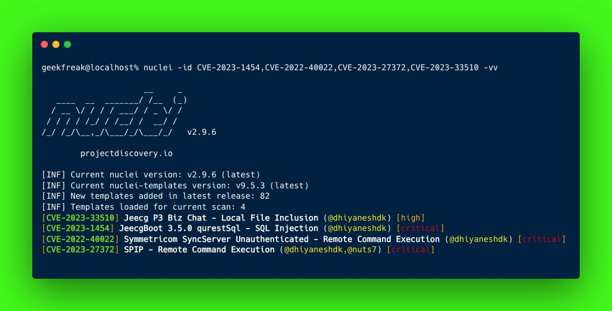</td>
</table></tr>
<table><tr>
<td>Quotes: <code>0</code></td>
<td>Replies: <code>3</code></td>
<td>Retweets: <code>28</code></td>
<td>Favorites: <code>99</code></td>
</tr></table>

---

# wdormann
**https://twitter.com/wdormann/status/1671676332302843904 _at 2023-06-22, 00:27:50_**
<blockquote>
Apple has released updates for WebKit CVE-2023-32439, which was being exploited in the wild.
You know the drill.
https://t.co/XcklPbL1J3 https://t.co/pmuUKmnCvF
</blockquote>

* https://support.apple.com/en-us/HT201222

<table><tr>
<td>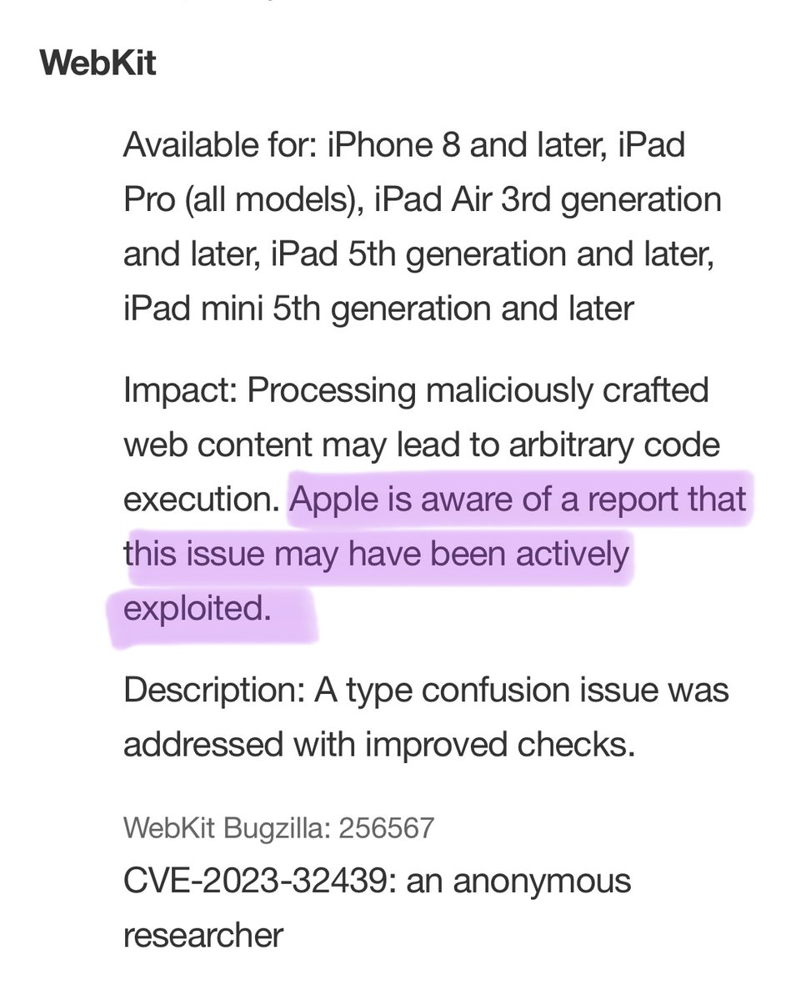</td>
</table></tr>
<table><tr>
<td>Quotes: <code>2</code></td>
<td>Replies: <code>2</code></td>
<td>Retweets: <code>22</code></td>
<td>Favorites: <code>52</code></td>
</tr></table>

---

# maddiestone
**https://twitter.com/maddiestone/status/1671610223818330115 _at 2023-06-21, 20:05:09_**
<blockquote>
RT @oct0xor: Today Apple released updates for CVE-2023-32434 (Kernel) and CVE-2023-32435 (WebKit) in-the-wild zero-days which were discover…
</blockquote>

<table><tr>
<td>Quotes: <code>0</code></td>
<td>Replies: <code>0</code></td>
<td>Retweets: <code>122</code></td>
<td>Favorites: <code>0</code></td>
</tr></table>

---

# pdnuclei
**https://twitter.com/pdnuclei/status/1671602986382942224 _at 2023-06-21, 19:36:23_**
<blockquote>
RT @RitikChaddha: CVE-2023-34362 - MOVEit Transfer - Remote Code Execution (critical) 🚨🚨

Nuclei Template :
https://t.co/PTiasZqMjl

@pdnuc…
</blockquote>

* https://github.com/projectdiscovery/nuclei-templates/pull/7500/files

<table><tr>
<td>Quotes: <code>0</code></td>
<td>Replies: <code>0</code></td>
<td>Retweets: <code>47</code></td>
<td>Favorites: <code>0</code></td>
</tr></table>

---

# wvuuuuuuuuuuuuu
**https://twitter.com/wvuuuuuuuuuuuuu/status/1671273436625375232 _at 2023-06-20, 21:46:52_**
<blockquote>
RT @bishopfox: We’ve created a tool to quickly check if a remote #FortiGate firewall is affected by critical #vulnerability #CVE-2023-27997…
</blockquote>

<table><tr>
<td>Quotes: <code>0</code></td>
<td>Replies: <code>0</code></td>
<td>Retweets: <code>38</code></td>
<td>Favorites: <code>0</code></td>
</tr></table>

---

# chompie1337
**https://twitter.com/chompie1337/status/1671132952690847745 _at 2023-06-20, 12:28:38_**
<blockquote>
RT @hyprdude: part 2 of my latest blog post covering the heap overflow I found in MiniDLNA (CVE-2023-33476) is up! this one focuses on the…
</blockquote>

<table><tr>
<td>Quotes: <code>0</code></td>
<td>Replies: <code>0</code></td>
<td>Retweets: <code>114</code></td>
<td>Favorites: <code>0</code></td>
</tr></table>

---

# testanull
**https://twitter.com/testanull/status/1671115931605696512 _at 2023-06-20, 11:21:00_**
<blockquote>
Retweet due to so many people asked for the gadgetchain of CVE-2021-35587 in OAM 10g,
The step to reproduce it has already been provided in  section "Universal gadget chain for 10.3.x"
Detail: https://t.co/mDXx1HCVQh https://t.co/Gmm6CbA2P8
</blockquote>

* https://peterjson.medium.com/miracle-one-vulnerability-to-rule-them-all-c3aed9edeea2

<table><tr>
<td>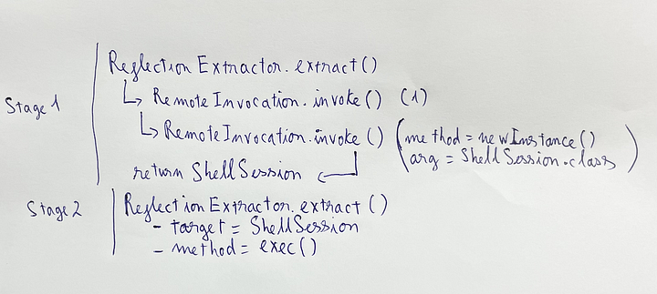</td>
</table></tr>
<table><tr>
<td>Quotes: <code>0</code></td>
<td>Replies: <code>0</code></td>
<td>Retweets: <code>13</code></td>
<td>Favorites: <code>54</code></td>
</tr></table>

---

# steventseeley
**https://twitter.com/steventseeley/status/1671058613216096260 _at 2023-06-20, 07:33:14_**
<blockquote>
RT @hyprdude: part 2 of my latest blog post covering the heap overflow I found in MiniDLNA (CVE-2023-33476) is up! this one focuses on the…
</blockquote>

<table><tr>
<td>Quotes: <code>0</code></td>
<td>Replies: <code>0</code></td>
<td>Retweets: <code>114</code></td>
<td>Favorites: <code>0</code></td>
</tr></table>

---

# kmkz_security
**https://twitter.com/kmkz_security/status/1671036384516112384 _at 2023-06-20, 06:04:55_**
<blockquote>
RT @hyprdude: part 2 of my latest blog post covering the heap overflow I found in MiniDLNA (CVE-2023-33476) is up! this one focuses on the…
</blockquote>

<table><tr>
<td>Quotes: <code>0</code></td>
<td>Replies: <code>0</code></td>
<td>Retweets: <code>114</code></td>
<td>Favorites: <code>0</code></td>
</tr></table>

---

# cyber_advising
**https://twitter.com/cyber_advising/status/1670977312211324931 _at 2023-06-20, 02:10:11_**
<blockquote>
CVE-2022-39952: A external control of file name or path in Fortinet FortiNAC allow an unauthenticated attacker to execute unauthorized code or commands via specifically crafted HTTP request.

cc @frycos 

PoC
https://t.co/dxaP2DmeB2 https://t.co/G3QFLVyYN2
</blockquote>

* https://frycos.github.io/vulns4free/2023/06/18/fortinac.html

<table><tr>
<td>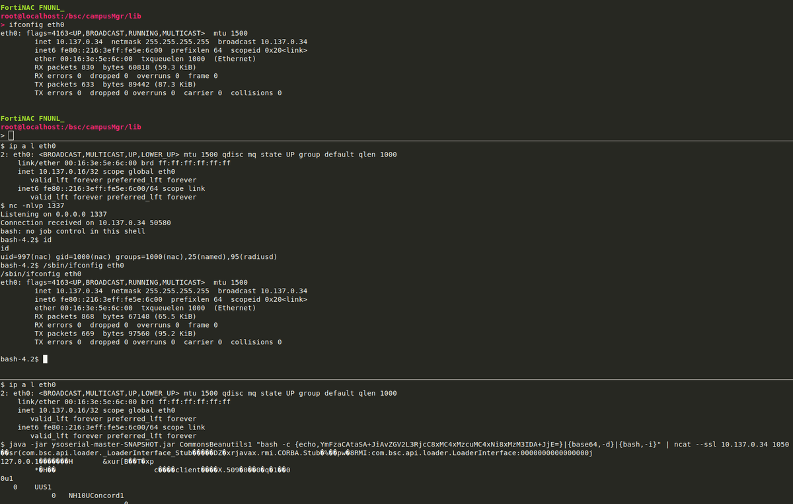</td>
</table></tr>
<table><tr>
<td>Quotes: <code>1</code></td>
<td>Replies: <code>2</code></td>
<td>Retweets: <code>35</code></td>
<td>Favorites: <code>82</code></td>
</tr></table>

---

# ptracesecurity
**https://twitter.com/ptracesecurity/status/1670899388468568066 _at 2023-06-19, 21:00:32_**
<blockquote>
Microsoft Windows Contacts (VCF/Contact/LDAP) syslink control href attribute escape vulnerability (CVE-2022-44666) (0day). https://t.co/hOx0hmtnOS  #Pentesting #vulnerability #Windows  #CyberSecurity #Infosec https://t.co/KZCi24V0Fs
</blockquote>

* https://github.com/j00sean/CVE-2022-44666#jar-files-as-payload

<table><tr>
<td>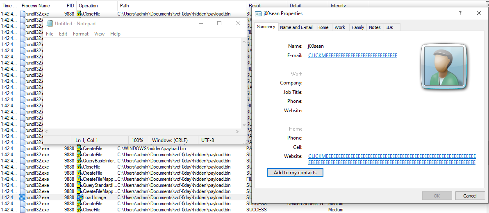</td>
<td>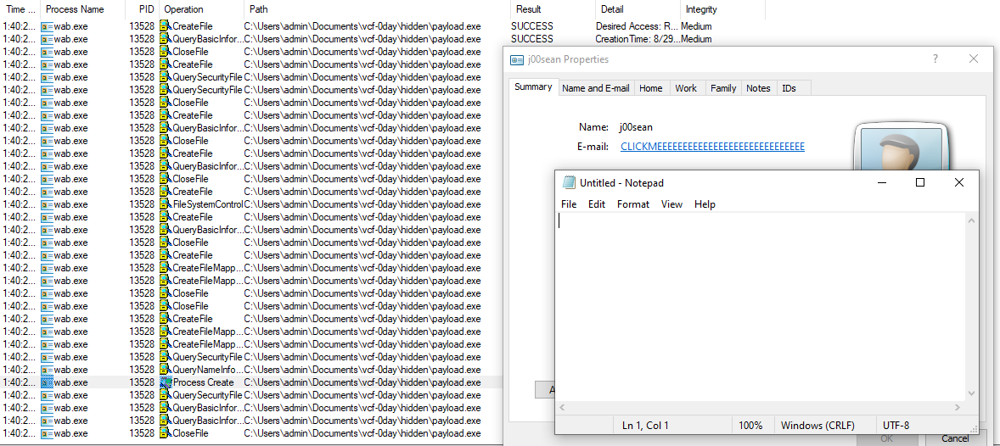</td>
</table></tr>
<table><tr>
<td>Quotes: <code>1</code></td>
<td>Replies: <code>1</code></td>
<td>Retweets: <code>16</code></td>
<td>Favorites: <code>39</code></td>
</tr></table>

---

# kmkz_security
**https://twitter.com/kmkz_security/status/1670870300538335250 _at 2023-06-19, 19:04:57_**
<blockquote>
RT @starlabs_sg: "Breaking the Code - Exploiting and Examining CVE-2023-1829 in cls_tcindex Classifier Vulnerability" is by our former inte…
</blockquote>

<table><tr>
<td>Quotes: <code>0</code></td>
<td>Replies: <code>0</code></td>
<td>Retweets: <code>43</code></td>
<td>Favorites: <code>0</code></td>
</tr></table>

---

# chompie1337
**https://twitter.com/chompie1337/status/1670816786713812992 _at 2023-06-19, 15:32:18_**
<blockquote>
RT @starlabs_sg: "Breaking the Code - Exploiting and Examining CVE-2023-1829 in cls_tcindex Classifier Vulnerability" is by our former inte…
</blockquote>

<table><tr>
<td>Quotes: <code>0</code></td>
<td>Replies: <code>0</code></td>
<td>Retweets: <code>43</code></td>
<td>Favorites: <code>0</code></td>
</tr></table>

---

# 80vul
**https://twitter.com/80vul/status/1670654790391730176 _at 2023-06-19, 04:48:35_**
<blockquote>
https://t.co/7ZztFwHNpL CVE-2023-23333 SolarView Compact through 6.00 RCE. ZoomEye: "SolarView Compact" Mainly distributed in Japan. https://t.co/RyZnIcYoeD
</blockquote>

* https://cve.mitre.org/cgi-bin/cvename.cgi?name=CVE-2023-23333

<table><tr>
<td>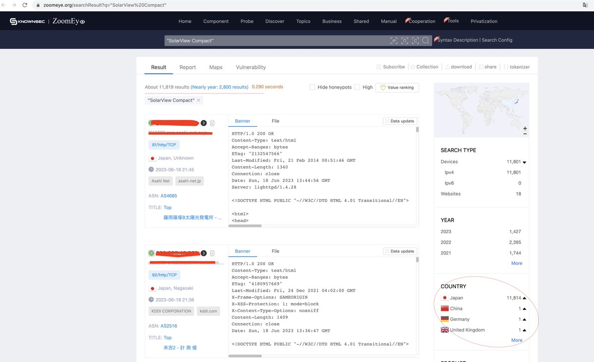</td>
<td>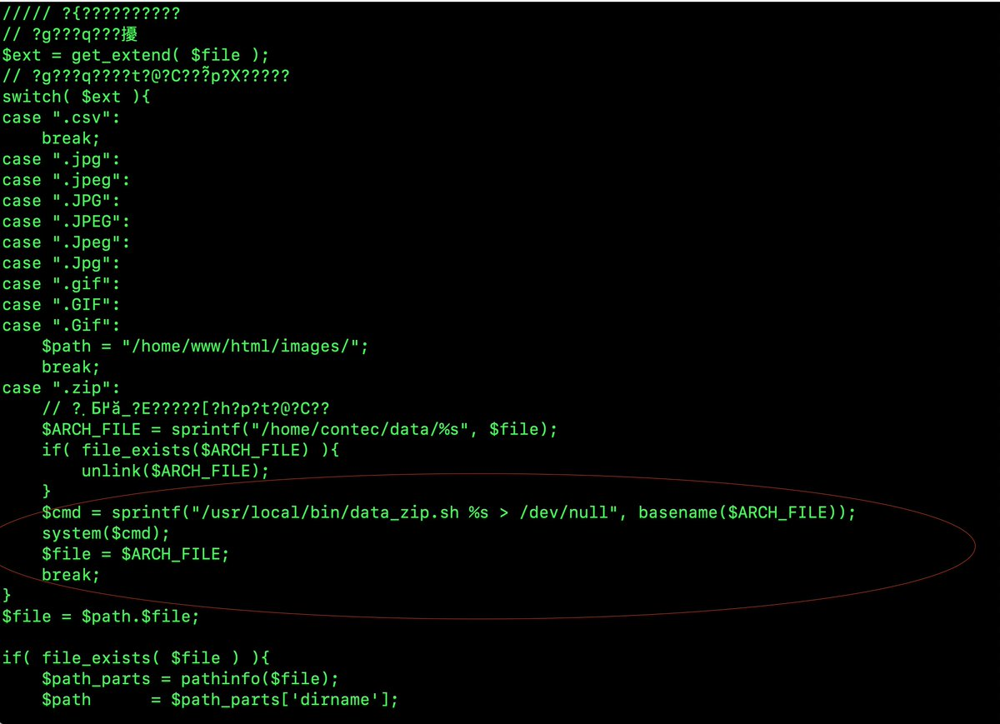</td>
</table></tr>
<table><tr>
<td>Quotes: <code>2</code></td>
<td>Replies: <code>0</code></td>
<td>Retweets: <code>12</code></td>
<td>Favorites: <code>39</code></td>
</tr></table>

---

# cyber_advising
**https://twitter.com/cyber_advising/status/1670613364232564737 _at 2023-06-19, 02:03:59_**
<blockquote>
CVE-2023-20178: Arbitrary File Delete vulnerability in Cisco Secure Client (tested on 5.0.01242) and Cisco AnyConnect (tested on 4.10.06079).

PoC
https://t.co/qWnrOu3ktJ https://t.co/v3feJ2Qp2V
</blockquote>

* https://github.com/Wh04m1001/CVE-2023-20178

<table><tr>
<td>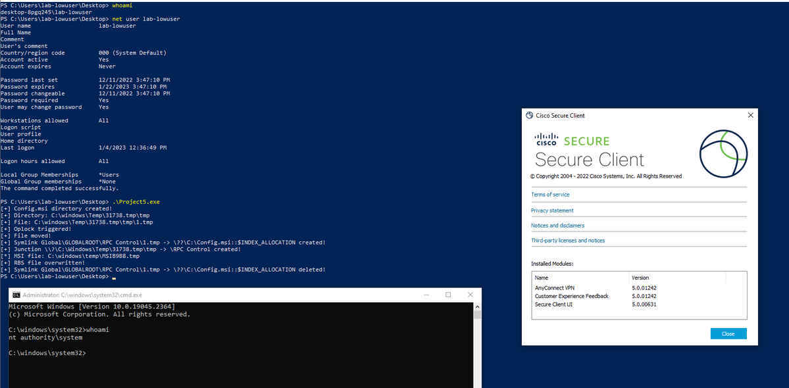</td>
</table></tr>
<table><tr>
<td>Quotes: <code>0</code></td>
<td>Replies: <code>0</code></td>
<td>Retweets: <code>29</code></td>
<td>Favorites: <code>66</code></td>
</tr></table>

---

# s0urc3c0d3err0r
**https://twitter.com/s0urc3c0d3err0r/status/1670554539681013760 _at 2023-06-18, 22:10:14_**
<blockquote>
CVE-2023-20887

POC for CVE-2023-20887 VMWare Aria Operations for Networks (vRealize Network Insight) unauthenticated RCE
https://t.co/wafSz8olxc
https://t.co/AEuxL9Z1Ok #cybersecurity #infosec
</blockquote>

* https://github.com/sinsinology/CVE-2023-20887

<table><tr>
<td></td>
</table></tr>
<table><tr>
<td>Quotes: <code>1</code></td>
<td>Replies: <code>2</code></td>
<td>Retweets: <code>73</code></td>
<td>Favorites: <code>182</code></td>
</tr></table>

---

# Dinosn
**https://twitter.com/Dinosn/status/1670475171415613441 _at 2023-06-18, 16:54:51_**
<blockquote>
PoC Released for Windows SysInternals Sysmon Privilege Escalation (CVE-2023-29343) Bug https://t.co/HqOyRw6etH
</blockquote>

* https://securityonline.info/poc-released-for-windows-sysinternals-sysmon-privilege-escalation-cve-2023-29343-bug/

<table><tr>
<td>Quotes: <code>5</code></td>
<td>Replies: <code>1</code></td>
<td>Retweets: <code>193</code></td>
<td>Favorites: <code>569</code></td>
</tr></table>

---

# momika233
**https://twitter.com/momika233/status/1669885874291740672 _at 2023-06-17, 01:53:12_**
<blockquote>
CVE-2023-34960 Chamilo PoC
https://t.co/wSut4tZdJa
</blockquote>

* https://github.com/Aituglo/CVE-2023-34960/blob/master/poc.py

<table><tr>
<td>Quotes: <code>0</code></td>
<td>Replies: <code>4</code></td>
<td>Retweets: <code>33</code></td>
<td>Favorites: <code>103</code></td>
</tr></table>

---

# wdormann
**https://twitter.com/wdormann/status/1669689677824049154 _at 2023-06-16, 12:53:35_**
<blockquote>
There's a new MOVEit Transfer vulnerability.
No, not that one. A new one: CVE-2023-35708
Get patching (again).
https://t.co/HT1TR3E40Q https://t.co/JqvXdGbE9V
</blockquote>

* https://community.progress.com/s/article/MOVEit-Transfer-Critical-Vulnerability-15June2023

<table><tr>
<td>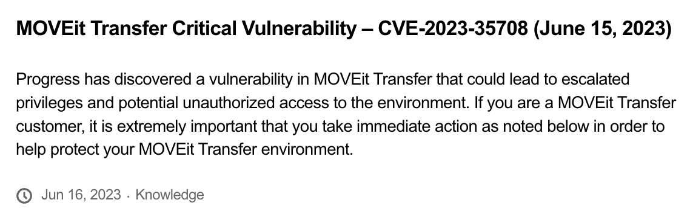</td>
</table></tr>
<table><tr>
<td>Quotes: <code>6</code></td>
<td>Replies: <code>3</code></td>
<td>Retweets: <code>44</code></td>
<td>Favorites: <code>137</code></td>
</tr></table>

---

# cyber_advising
**https://twitter.com/cyber_advising/status/1669663093587099648 _at 2023-06-16, 11:07:57_**
<blockquote>
CVE-2023-1829: A use-after-free vulnerability in the Linux Kernel traffic control index filter (tcindex) can be exploited to achieve local privilege escalation.

Poc

https://t.co/o5tCESU91N https://t.co/mS1EnUcfIW
</blockquote>

* https://github.com/lanleft/CVE2023-1829

<table><tr>
<td>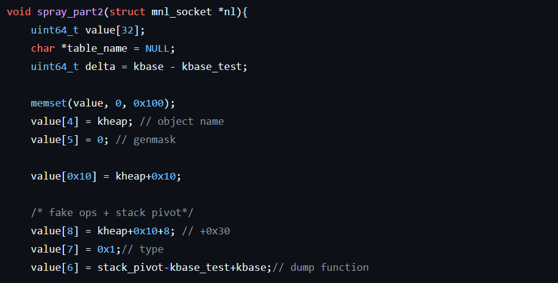</td>
</table></tr>
<table><tr>
<td>Quotes: <code>0</code></td>
<td>Replies: <code>1</code></td>
<td>Retweets: <code>14</code></td>
<td>Favorites: <code>37</code></td>
</tr></table>

---

# cyber_advising
**https://twitter.com/cyber_advising/status/1669661786457423873 _at 2023-06-16, 11:02:45_**
<blockquote>
CVE-2023-24243: CData Arc/API/Sync &lt;= v22.0.8336 Server-Side Request Forgery (SSRF) vulnerablity

PoC
https://t.co/rjaaQNZhGi https://t.co/NyxRJz6Y7G
</blockquote>

* https://gist.github.com/d3vc0r3/6460a5f006e32a2ebffe739e411ab1b8

<table><tr>
<td>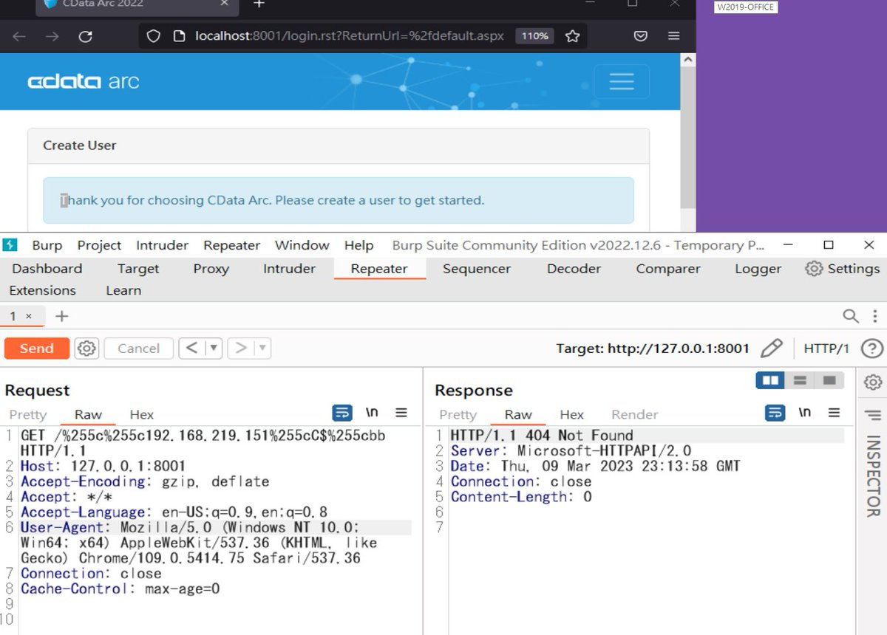</td>
</table></tr>
<table><tr>
<td>Quotes: <code>0</code></td>
<td>Replies: <code>1</code></td>
<td>Retweets: <code>14</code></td>
<td>Favorites: <code>42</code></td>
</tr></table>

---

# wvuuuuuuuuuuuuu
**https://twitter.com/wvuuuuuuuuuuuuu/status/1669390680689344512 _at 2023-06-15, 17:05:28_**
<blockquote>
RT @Y4er_ChaBug: Great article! But I think you are missing a very critical part, CVE-2023-20887 is actually a patch bypass for CVE-2022-31…
</blockquote>

<table><tr>
<td>Quotes: <code>0</code></td>
<td>Replies: <code>0</code></td>
<td>Retweets: <code>31</code></td>
<td>Favorites: <code>0</code></td>
</tr></table>

---

# cyber_advising
**https://twitter.com/cyber_advising/status/1669314110670921728 _at 2023-06-15, 12:01:12_**
<blockquote>
CVE-2023-3224:  Nuxt contains a test-component-wrapper component.... accepts arbitrary user input on the server side. This pattern will almost always lead to an RCE bug.

PoC
https://t.co/Nc4vhONAk4 https://t.co/TOaojcQufi
</blockquote>

* https://huntr.dev/bounties/1eb74fd8-0258-4c1f-a904-83b52e373a87/

<table><tr>
<td>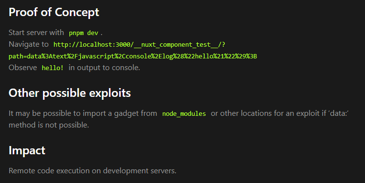</td>
</table></tr>
<table><tr>
<td>Quotes: <code>0</code></td>
<td>Replies: <code>1</code></td>
<td>Retweets: <code>17</code></td>
<td>Favorites: <code>82</code></td>
</tr></table>

---

# momika233
**https://twitter.com/momika233/status/1669027565917597697 _at 2023-06-14, 17:02:35_**
<blockquote>
The bug is exploitable by issuing GET/POST requests to any of the two URLs: /remote/hostcheck_validate, and /remote/logincheck
XORtigate: Pre-authentication Remote Code Execution on Fortigate VPN (CVE-2023-27997)
https://t.co/aznfja8zF8
</blockquote>

* https://blog.lexfo.fr/xortigate-cve-2023-27997.html

<table><tr>
<td>Quotes: <code>3</code></td>
<td>Replies: <code>1</code></td>
<td>Retweets: <code>34</code></td>
<td>Favorites: <code>105</code></td>
</tr></table>

---

# _Icewall
**https://twitter.com/_Icewall/status/1668944401442258948 _at 2023-06-14, 11:32:07_**
<blockquote>
2 more to the collection :
CVE-2023-33133 - Microsoft Office Excel WebCharts out-of-bounds write vulnerability : https://t.co/e51pNDk79W

CVE-2023-32029 - Microsoft Office Excel FreePhisxdb arbitrary free vulnerability : https://t.co/fy3w2WpkLI
</blockquote>

* https://talosintelligence.com/vulnerability_reports/TALOS-2023-1734
* https://talosintelligence.com/vulnerability_reports/TALOS-2023-1730

<table><tr>
<td>Quotes: <code>0</code></td>
<td>Replies: <code>1</code></td>
<td>Retweets: <code>13</code></td>
<td>Favorites: <code>42</code></td>
</tr></table>

---

# hack_git
**https://twitter.com/hack_git/status/1668850531979108354 _at 2023-06-14, 05:19:07_**
<blockquote>
CVE-2023-20887

POC for CVE-2023-20887 VMWare Aria Operations for Networks (vRealize Network Insight) unauthenticated RCE

https://t.co/5oRf0sj1NW

#cve #cybersecurity #infosec https://t.co/QH3xZv87qx
</blockquote>

* https://github.com/sinsinology/CVE-2023-20887

<table><tr>
<td></td>
</table></tr>
<table><tr>
<td>Quotes: <code>1</code></td>
<td>Replies: <code>0</code></td>
<td>Retweets: <code>38</code></td>
<td>Favorites: <code>143</code></td>
</tr></table>

---

# steventseeley
**https://twitter.com/steventseeley/status/1668816036865638400 _at 2023-06-14, 03:02:02_**
<blockquote>
RT @SinSinology: 🚨 Here is the #Exploit and technical detail for the CVE-2023-20887 Pre-Authenticated Remote Code Execution in #VMWare vRea…
</blockquote>

<table><tr>
<td>Quotes: <code>0</code></td>
<td>Replies: <code>0</code></td>
<td>Retweets: <code>105</code></td>
<td>Favorites: <code>0</code></td>
</tr></table>

---

# steventseeley
**https://twitter.com/steventseeley/status/1668774635037675520 _at 2023-06-14, 00:17:31_**
<blockquote>
RT @LexfoSecurite: #Fortinet patched #CVE-2023-27997, a critical vulnerability affecting its VPN #Fortigate. Our latest blogpost describes…
</blockquote>

<table><tr>
<td>Quotes: <code>0</code></td>
<td>Replies: <code>0</code></td>
<td>Retweets: <code>111</code></td>
<td>Favorites: <code>0</code></td>
</tr></table>

---

# piedpiper1616
**https://twitter.com/piedpiper1616/status/1668736363024510979 _at 2023-06-13, 21:45:27_**
<blockquote>
RT @LexfoSecurite: #Fortinet patched #CVE-2023-27997, a critical vulnerability affecting its VPN #Fortigate. Our latest blogpost describes…
</blockquote>

<table><tr>
<td>Quotes: <code>0</code></td>
<td>Replies: <code>0</code></td>
<td>Retweets: <code>111</code></td>
<td>Favorites: <code>0</code></td>
</tr></table>

---

# mstfknn
**https://twitter.com/mstfknn/status/1668724153749327875 _at 2023-06-13, 20:56:56_**
<blockquote>
Urgent update! A critical #RCE vulnerability (CVE-2023-32571) has been identified in #DynamicLinq library. The issue could allow arbitrary code execution. Check the details and patching guidelines in our latest research post. Don't delay! 🔐👉 https://t.co/e6mIzzFp4T…
</blockquote>

* https://research.nccgroup.com/2023/06/13/dynamic-linq-injection-remote-code-execution-vulnerability-cve-2023-32571/

<table><tr>
<td>Quotes: <code>1</code></td>
<td>Replies: <code>1</code></td>
<td>Retweets: <code>21</code></td>
<td>Favorites: <code>57</code></td>
</tr></table>

---

# GHSecurityLab
**https://twitter.com/GHSecurityLab/status/1668720964903882754 _at 2023-06-13, 20:44:16_**
<blockquote>
RT @kevin_backhouse: This video shows my PoC for libssh CVE-2023-2283 (authentication bypass vuln). The attacker logs in with ED25519 authe…
</blockquote>

<table><tr>
<td>Quotes: <code>0</code></td>
<td>Replies: <code>0</code></td>
<td>Retweets: <code>274</code></td>
<td>Favorites: <code>0</code></td>
</tr></table>

---

# maddiestone
**https://twitter.com/maddiestone/status/1668668207920717826 _at 2023-06-13, 17:14:37_**
<blockquote>
😍 New RCA! The v8 security team is at it again with a new RCA for CVE-2022-4262, the #itw0days patched in December 2022. I really like how they modified the fuzzing flag to better find this class of bugs! Thank you @5aelo! 🔥

 https://t.co/nsVXKPHjym https://t.co/ARp4s5meAn
</blockquote>

* https://googleprojectzero.github.io/0days-in-the-wild//0day-RCAs/2022/CVE-2022-4262.html

<table><tr>
<td>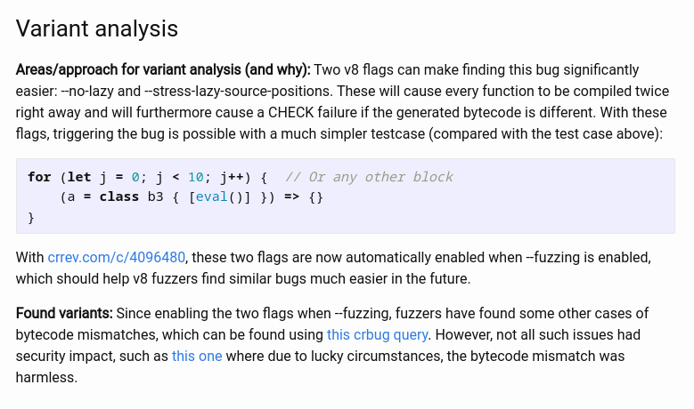</td>
</table></tr>
<table><tr>
<td>Quotes: <code>0</code></td>
<td>Replies: <code>0</code></td>
<td>Retweets: <code>40</code></td>
<td>Favorites: <code>129</code></td>
</tr></table>

---

# SinSinology
**https://twitter.com/SinSinology/status/1668616053856030725 _at 2023-06-13, 13:47:23_**
<blockquote>
🚨 #VMWare Pre-Authenticated Remote Code Execution (CVE-2023-20887) #PoC is ready https://t.co/6fi4keigOE
</blockquote>

<table><tr>
<td>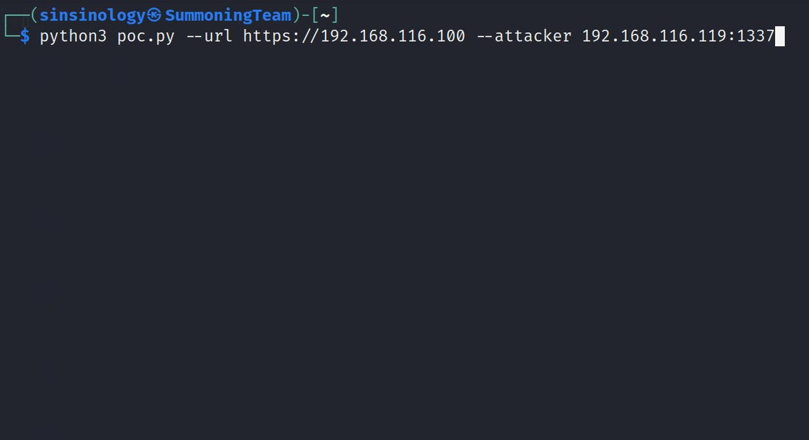</td>
</table></tr>
<table><tr>
<td>Quotes: <code>5</code></td>
<td>Replies: <code>2</code></td>
<td>Retweets: <code>168</code></td>
<td>Favorites: <code>697</code></td>
</tr></table>

---

# 0xdea
**https://twitter.com/0xdea/status/1668487640725823488 _at 2023-06-13, 05:17:07_**
<blockquote>
#Xortigate, or CVE-2023-27997 - The Rumoured #RCE That Was

#Fortinet #Fortigate 

https://t.co/HNGALfvsmO
</blockquote>

* https://labs.watchtowr.com/xortigate-or-cve-2023-27997/

<table><tr>
<td>Quotes: <code>1</code></td>
<td>Replies: <code>1</code></td>
<td>Retweets: <code>27</code></td>
<td>Favorites: <code>71</code></td>
</tr></table>

---

# Dinosn
**https://twitter.com/Dinosn/status/1668471213402849280 _at 2023-06-13, 04:11:50_**
<blockquote>
CVE-2023-30845 JWT authentication bypass via `X-HTTP-Method-Override` header https://t.co/xzo6zEgfL6
</blockquote>

* https://github.com/GoogleCloudPlatform/esp-v2/security/advisories/GHSA-6qmp-9p95-fc5f

<table><tr>
<td>Quotes: <code>2</code></td>
<td>Replies: <code>1</code></td>
<td>Retweets: <code>197</code></td>
<td>Favorites: <code>605</code></td>
</tr></table>

---

# wdormann
**https://twitter.com/wdormann/status/1668422054872219650 _at 2023-06-13, 00:56:30_**
<blockquote>
RT @BushidoToken: Confirmed: Volt Typhoon used an auth bypass CVE-2022-40684 in FortiOS products for initial access

Unconfirmed: If Volt T…
</blockquote>

<table><tr>
<td>Quotes: <code>0</code></td>
<td>Replies: <code>0</code></td>
<td>Retweets: <code>57</code></td>
<td>Favorites: <code>0</code></td>
</tr></table>

---

# 0xor0ne
**https://twitter.com/0xor0ne/status/1668339915963129864 _at 2023-06-12, 19:30:06_**
<blockquote>
Still a great series for learning Linux kernel exploitation
Guide for exploiting CVE-2017-11176 (UaF in mq_notify function)
Credits @LexfoSecurite

https://t.co/9dvQOGgpeG
https://t.co/JsvFkbr9iQ
https://t.co/PANcb1P6In
https://t.co/2qEPjbier7

#Linux #kernel #exploit #infosec https://t.co/H9MBn8xizo
</blockquote>

* https://blog.lexfo.fr/cve-2017-11176-linux-kernel-exploitation-part1.html
* https://blog.lexfo.fr/cve-2017-11176-linux-kernel-exploitation-part2.html
* https://blog.lexfo.fr/cve-2017-11176-linux-kernel-exploitation-part3.html
* https://blog.lexfo.fr/cve-2017-11176-linux-kernel-exploitation-part4.html

<table><tr>
<td>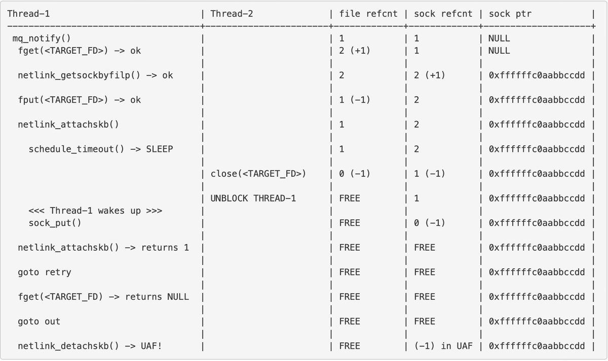</td>
<td>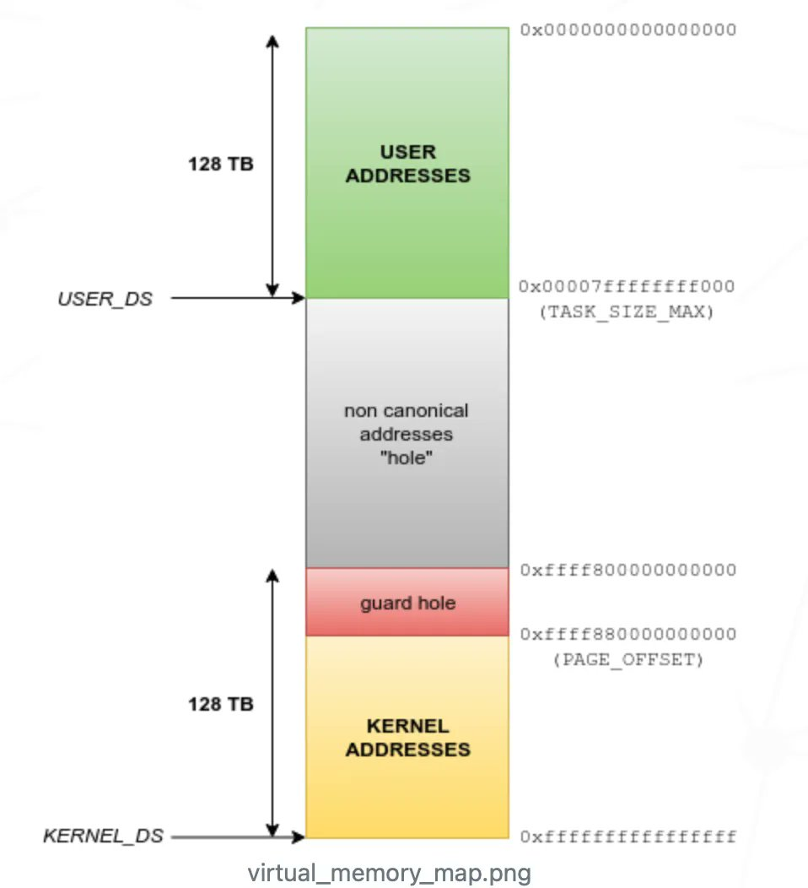</td>
<td>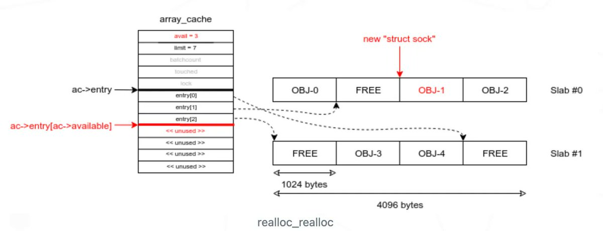</td>
<td>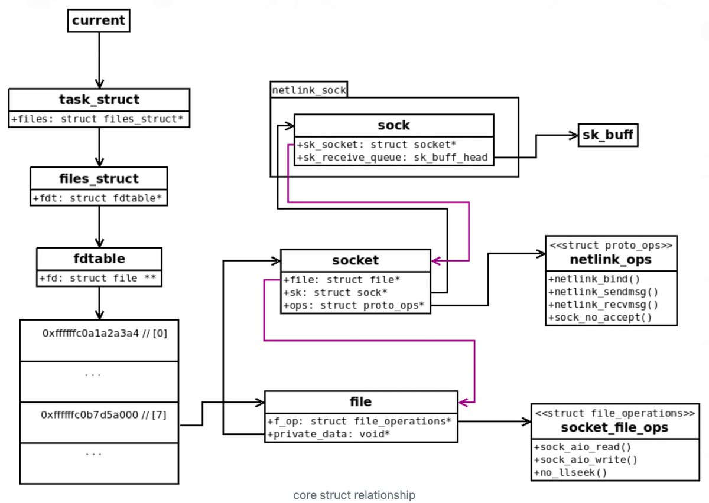</td>
</table></tr>
<table><tr>
<td>Quotes: <code>2</code></td>
<td>Replies: <code>2</code></td>
<td>Retweets: <code>118</code></td>
<td>Favorites: <code>422</code></td>
</tr></table>

---

# S0ufi4n3
**https://twitter.com/S0ufi4n3/status/1668261421698752514 _at 2023-06-12, 14:18:12_**
<blockquote>
Here we are.. CVE-2023-34362: MOVEit Transfer Unauthenticated RCE PoC

https://t.co/6AeB1Kugf5
</blockquote>

* https://github.com/sfewer-r7/CVE-2023-34362

<table><tr>
<td>Quotes: <code>1</code></td>
<td>Replies: <code>2</code></td>
<td>Retweets: <code>33</code></td>
<td>Favorites: <code>60</code></td>
</tr></table>

---

# piedpiper1616
**https://twitter.com/piedpiper1616/status/1668238879714062343 _at 2023-06-12, 12:48:37_**
<blockquote>
GitHub - horizon3ai/CVE-2023-34362: MOVEit CVE-2023-34362 - https://t.co/BfEVOjC4K2
</blockquote>

* https://github.com/horizon3ai/CVE-2023-34362

<table><tr>
<td>Quotes: <code>1</code></td>
<td>Replies: <code>0</code></td>
<td>Retweets: <code>17</code></td>
<td>Favorites: <code>68</code></td>
</tr></table>

---

# testanull
**https://twitter.com/testanull/status/1668227888041304064 _at 2023-06-12, 12:04:57_**
<blockquote>
RT @Horizon3Attack: CVE-2023-34362, affecting MOVEit Transfer, enables unauth RCE through a series of issues:
🔺 Custom Header abuse to SSRF…
</blockquote>

<table><tr>
<td>Quotes: <code>0</code></td>
<td>Replies: <code>0</code></td>
<td>Retweets: <code>82</code></td>
<td>Favorites: <code>0</code></td>
</tr></table>

---

# steventseeley
**https://twitter.com/steventseeley/status/1668221781952569346 _at 2023-06-12, 11:40:41_**
<blockquote>
RT @Horizon3Attack: CVE-2023-34362, affecting MOVEit Transfer, enables unauth RCE through a series of issues:
🔺 Custom Header abuse to SSRF…
</blockquote>

<table><tr>
<td>Quotes: <code>0</code></td>
<td>Replies: <code>0</code></td>
<td>Retweets: <code>82</code></td>
<td>Favorites: <code>0</code></td>
</tr></table>

---

# wdormann
**https://twitter.com/wdormann/status/1667883233122320384 _at 2023-06-11, 13:15:25_**
<blockquote>
I heard a rumor that the recent FortiOS versions 7.2.5, 7.0.12, 6.4.13, 6.2.15, 6.0.17 fix remotely exploitable CVE-2023-27997
Not that you would know this by looking at #Fortinet PSIRT publications or anything.
Can't have miscreants finding out about this, amirite? https://t.co/TXouhIc3vW
</blockquote>

<table><tr>
<td>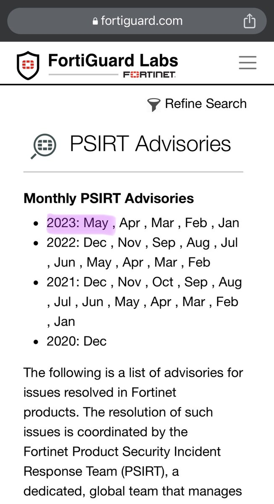</td>
</table></tr>
<table><tr>
<td>Quotes: <code>3</code></td>
<td>Replies: <code>6</code></td>
<td>Retweets: <code>31</code></td>
<td>Favorites: <code>93</code></td>
</tr></table>

---

# cfreal_
**https://twitter.com/cfreal_/status/1667852157536616451 _at 2023-06-11, 11:11:56_**
<blockquote>
#Fortinet published a patch for CVE-2023-27997, the Remote Code Execution vulnerability @DDXhunter and I reported. This is reachable pre-authentication, on every SSL VPN appliance. Patch your #Fortigate. Details at a later time. #xortigate
</blockquote>

<table><tr>
<td>Quotes: <code>37</code></td>
<td>Replies: <code>25</code></td>
<td>Retweets: <code>313</code></td>
<td>Favorites: <code>734</code></td>
</tr></table>

---

# chompie1337
**https://twitter.com/chompie1337/status/1667205864942387214 _at 2023-06-09, 16:23:48_**
<blockquote>
RT @kevin_backhouse: This video shows my PoC for libssh CVE-2023-2283 (authentication bypass vuln). The attacker logs in with ED25519 authe…
</blockquote>

<table><tr>
<td>Quotes: <code>0</code></td>
<td>Replies: <code>0</code></td>
<td>Retweets: <code>274</code></td>
<td>Favorites: <code>0</code></td>
</tr></table>

---

# cyber_advising
**https://twitter.com/cyber_advising/status/1667129932168810498 _at 2023-06-09, 11:22:04_**
<blockquote>
CVE-2023-29336: The recent Microsoft security patch uncovered a critical privilege escalation vulnerability within win32k, which has already been exploited in real-world

PoC
https://t.co/1QqtCm2hxm https://t.co/lBCcGDORuD
</blockquote>

* https://www.numencyber.com/cve-2023-29336-win32k-analysis/

<table><tr>
<td>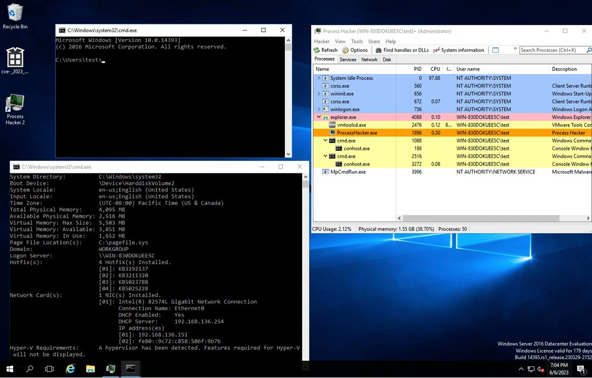</td>
</table></tr>
<table><tr>
<td>Quotes: <code>0</code></td>
<td>Replies: <code>2</code></td>
<td>Retweets: <code>12</code></td>
<td>Favorites: <code>50</code></td>
</tr></table>

---

# piedpiper1616
**https://twitter.com/piedpiper1616/status/1666952946649829376 _at 2023-06-08, 23:38:47_**
<blockquote>
GitHub - 86x/CVE-2023-32353-PoC: Proof of Concept Code for CVE-2023-32353: Local privilege escalation via iTunes in Windows - https://t.co/oLiSQZD6h9
</blockquote>

* https://github.com/86x/CVE-2023-32353-PoC

<table><tr>
<td>Quotes: <code>2</code></td>
<td>Replies: <code>0</code></td>
<td>Retweets: <code>52</code></td>
<td>Favorites: <code>134</code></td>
</tr></table>

---

# maddiestone
**https://twitter.com/maddiestone/status/1666936207954284545 _at 2023-06-08, 22:32:16_**
<blockquote>
😎NEW RCA! Genwei Jiang of @Mandiant authored an RCA on CVE-2023-28252, the Windows CLFS in-the-wild 0-day that was patched in April. #itw0days

https://t.co/ui9KVo9ylp https://t.co/Brwg8e0Bei
</blockquote>

* https://googleprojectzero.github.io/0days-in-the-wild//0day-RCAs/2023/CVE-2023-28252.html

<table><tr>
<td>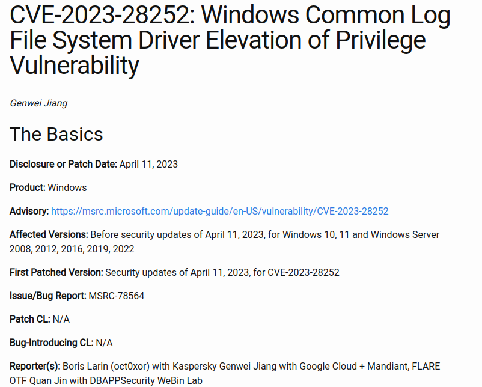</td>
</table></tr>
<table><tr>
<td>Quotes: <code>3</code></td>
<td>Replies: <code>2</code></td>
<td>Retweets: <code>29</code></td>
<td>Favorites: <code>130</code></td>
</tr></table>

---

# piedpiper1616
**https://twitter.com/piedpiper1616/status/1666834647354060801 _at 2023-06-08, 15:48:42_**
<blockquote>
RT @kevin_backhouse: This video shows my PoC for libssh CVE-2023-2283 (authentication bypass vuln). The attacker logs in with ED25519 authe…
</blockquote>

<table><tr>
<td>Quotes: <code>0</code></td>
<td>Replies: <code>0</code></td>
<td>Retweets: <code>274</code></td>
<td>Favorites: <code>0</code></td>
</tr></table>

---

# hosselot
**https://twitter.com/hosselot/status/1666632372870103040 _at 2023-06-08, 02:24:56_**
<blockquote>
Latest In-The-Wild Google Chrome V8 type confusion vulnerability (CVE-2023-3079) is patched[1] by fixing store handler selection for arguments objects [2] during inline caching [3]:
1- https://t.co/G0wbhUskzR
2- https://t.co/GlNtSg5EjS
3- https://t.co/C4c5Lme99v
</blockquote>

* https://chromium.googlesource.com/v8/v8.git/+/e144f3b71e64e01d6ffd247eb15ca1ff56f6287b
* https://developer.mozilla.org/en-US/docs/Web/JavaScript/Reference/Functions/arguments
* https://mathiasbynens.be/notes/shapes-ics

<table><tr>
<td>Quotes: <code>2</code></td>
<td>Replies: <code>2</code></td>
<td>Retweets: <code>16</code></td>
<td>Favorites: <code>73</code></td>
</tr></table>

---

# DailyDarkWeb
**https://twitter.com/DailyDarkWeb/status/1666467386449330178 _at 2023-06-07, 15:29:21_**
<blockquote>
RCE PoC for CVE-2023-34362, a vulnerability in MOVEit, is detected

#MOVEit #exploit https://t.co/c6dp0CUAO6
</blockquote>

<table><tr>
<td>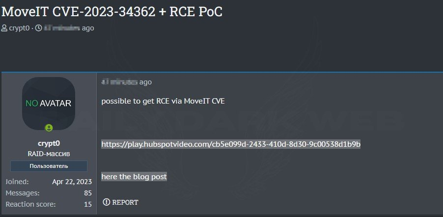</td>
</table></tr>
<table><tr>
<td>Quotes: <code>2</code></td>
<td>Replies: <code>2</code></td>
<td>Retweets: <code>10</code></td>
<td>Favorites: <code>32</code></td>
</tr></table>

---

# wallet_guard
**https://twitter.com/wallet_guard/status/1666115231347605504 _at 2023-06-06, 16:10:00_**
<blockquote>
🚨 CHROME 0-DAY: CVE-2023-3079

New Zero-Day in Chrome is being actively exploited in the wild leading to Chrome issuing an emergency update. This is another type confusion vulnerability that can lead to arbitrary code execution on your device. 

UPDATE YOUR DEVICES NOW! https://t.co/8wbycoKgdN
</blockquote>

<table><tr>
<td></td>
</table></tr>
<table><tr>
<td>Quotes: <code>13</code></td>
<td>Replies: <code>8</code></td>
<td>Retweets: <code>84</code></td>
<td>Favorites: <code>184</code></td>
</tr></table>

---

# maddiestone
**https://twitter.com/maddiestone/status/1666096831372328968 _at 2023-06-06, 14:56:53_**
<blockquote>
Another #itw0days discovered by @_clem1! CVE-2023-3079 in v8. Patch released by Chrome within 4 days of report!

https://t.co/FACjoECvOc
</blockquote>

* https://chromereleases.googleblog.com/2023/06/stable-channel-update-for-desktop.html

<table><tr>
<td>Quotes: <code>1</code></td>
<td>Replies: <code>2</code></td>
<td>Retweets: <code>19</code></td>
<td>Favorites: <code>62</code></td>
</tr></table>

---

# TheHackersNews
**https://twitter.com/TheHackersNews/status/1666074252527931394 _at 2023-06-06, 13:27:10_**
<blockquote>
UPDATE — KeePass releases v2.54 update, fixing CVE-2023-32784, a critical flaw that enables extraction of the master password from memory.

https://t.co/a7demQDwSX
</blockquote>

* https://thehackernews.com/2023/05/keepass-exploit-allows-attackers-to.html

<table><tr>
<td>Quotes: <code>5</code></td>
<td>Replies: <code>3</code></td>
<td>Retweets: <code>89</code></td>
<td>Favorites: <code>184</code></td>
</tr></table>

---

# Synacktiv
**https://twitter.com/Synacktiv/status/1666069541112143875 _at 2023-06-06, 13:08:27_**
<blockquote>
During a security assessment, our ninjas @kalimer0x00 and @us3r777 found multiple vulnerabilities on the DELMIA Apriso software:

CVE-2023-2141: an unsafe deserialization
CVE-2023-2140: a pre-auth SSRF
CVE-2023-2139: a reflected XSS

https://t.co/IM9PWNBUHu https://t.co/YMHPHk7IO6
</blockquote>

* https://www.synacktiv.com/sites/default/files/2023-06/Synacktiv-3DS-Delmia_Apriso_2017_to_2022-Multiple-Vulnerabilities.pdf

<table><tr>
<td></td>
</table></tr>
<table><tr>
<td>Quotes: <code>0</code></td>
<td>Replies: <code>0</code></td>
<td>Retweets: <code>12</code></td>
<td>Favorites: <code>33</code></td>
</tr></table>

---

# kmkz_security
**https://twitter.com/kmkz_security/status/1665639456747945991 _at 2023-06-05, 08:39:27_**
<blockquote>
Adobe Acrobat Reader - CVE-2023-21608 - Remote Code Execution Exploit - by @HackSysTeam 
https://t.co/IjngCUorov
</blockquote>

* https://github.com/hacksysteam/CVE-2023-21608

<table><tr>
<td>Quotes: <code>6</code></td>
<td>Replies: <code>2</code></td>
<td>Retweets: <code>142</code></td>
<td>Favorites: <code>366</code></td>
</tr></table>

---

# kmkz_security
**https://twitter.com/kmkz_security/status/1665543797562920960 _at 2023-06-05, 02:19:20_**
<blockquote>
RT @MsftSecIntel: Microsoft is attributing attacks exploiting the CVE-2023-34362 MOVEit Transfer 0-day vulnerability to Lace Tempest, known…
</blockquote>

<table><tr>
<td>Quotes: <code>0</code></td>
<td>Replies: <code>0</code></td>
<td>Retweets: <code>402</code></td>
<td>Favorites: <code>0</code></td>
</tr></table>

---

# kmkz_security
**https://twitter.com/kmkz_security/status/1665543682513068033 _at 2023-06-05, 02:18:52_**
<blockquote>
RT @ShawarkOFFICIAL: Imagemagick CVE-2023-34152 Shell command injection

https://t.co/Bb5d2gczCD
</blockquote>

* https://github.com/ImageMagick/ImageMagick/issues/6338

<table><tr>
<td>Quotes: <code>0</code></td>
<td>Replies: <code>0</code></td>
<td>Retweets: <code>67</code></td>
<td>Favorites: <code>0</code></td>
</tr></table>

---

# MsftSecIntel
**https://twitter.com/MsftSecIntel/status/1665537736231583744 _at 2023-06-05, 01:55:15_**
<blockquote>
Microsoft strongly urges organizations affected by the CVE-2023-34362 MOVEit Transfer vulnerability to apply security patches and perform mitigation actions provided by Progress in their security advisory. https://t.co/Zo5KuQliOq
</blockquote>

* https://msft.it/6019g9J5l

<table><tr>
<td>Quotes: <code>1</code></td>
<td>Replies: <code>1</code></td>
<td>Retweets: <code>13</code></td>
<td>Favorites: <code>40</code></td>
</tr></table>

---

# MsftSecIntel
**https://twitter.com/MsftSecIntel/status/1665537734746816512 _at 2023-06-05, 01:55:14_**
<blockquote>
Exploitation is often followed by deployment of a web shell w/ data exfil capabilities. CVE-2023-34362 allows attackers to authenticate as any user. Lace Tempest (Storm-0950, overlaps w/ FIN11, TA505) authenticates as the user with the highest privileges to exfiltrate files.
</blockquote>

<table><tr>
<td>Quotes: <code>2</code></td>
<td>Replies: <code>1</code></td>
<td>Retweets: <code>6</code></td>
<td>Favorites: <code>36</code></td>
</tr></table>

---

# MsftSecIntel
**https://twitter.com/MsftSecIntel/status/1665537730946670595 _at 2023-06-05, 01:55:13_**
<blockquote>
Microsoft is attributing attacks exploiting the CVE-2023-34362 MOVEit Transfer 0-day vulnerability to Lace Tempest, known for ransomware operations &amp; running the Clop extortion site. The threat actor has used similar vulnerabilities in the past to steal data &amp; extort victims. https://t.co/q73WtGru7j
</blockquote>

<table><tr>
<td>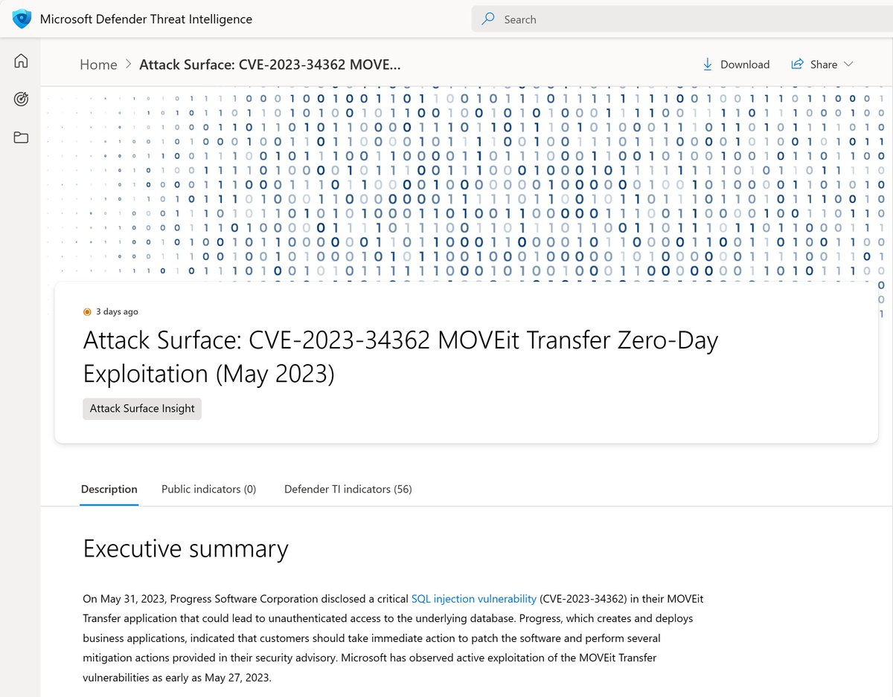</td>
</table></tr>
<table><tr>
<td>Quotes: <code>41</code></td>
<td>Replies: <code>10</code></td>
<td>Retweets: <code>411</code></td>
<td>Favorites: <code>817</code></td>
</tr></table>

---

# kmkz_security
**https://twitter.com/kmkz_security/status/1665471481344655361 _at 2023-06-04, 21:31:58_**
<blockquote>
CVE-2022-2602: DirtyCred File Exploitation applied on an io_uring UAF -exploit:
https://t.co/C9DI6WTyMO
</blockquote>

* https://github.com/kiks7/CVE-2022-2602-Kernel-Exploit

<table><tr>
<td>Quotes: <code>0</code></td>
<td>Replies: <code>0</code></td>
<td>Retweets: <code>37</code></td>
<td>Favorites: <code>100</code></td>
</tr></table>

---

# 1ZRR4H
**https://twitter.com/1ZRR4H/status/1664764361515192322 _at 2023-06-02, 22:42:08_**
<blockquote>
🚨 Massive zero-day exploitation for MOVEit Transfer (now formally CVE-2023-34362).

At this moment, at least 57 instances potentially compromised with the human2.aspx backdoor, 39 in the US.

After the respective analysis, the validation process I use is as follows:
1.- I verify… https://t.co/f6Z2lcog8g
</blockquote>

<table><tr>
<td>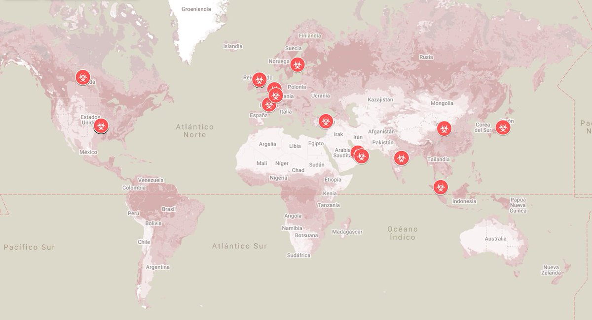</td>
<td>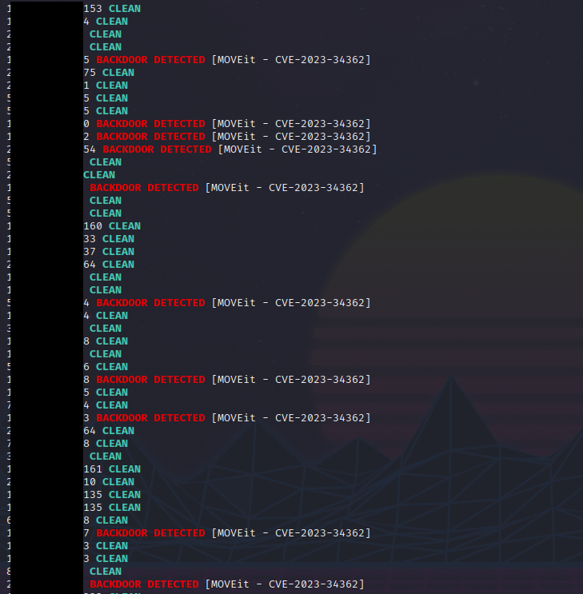</td>
</table></tr>
<table><tr>
<td>Quotes: <code>9</code></td>
<td>Replies: <code>5</code></td>
<td>Retweets: <code>176</code></td>
<td>Favorites: <code>467</code></td>
</tr></table>

---

# testanull
**https://twitter.com/testanull/status/1664480204692283393 _at 2023-06-02, 03:53:00_**
<blockquote>
RT @maddiestone: ✨🤖 New RCA by @tehjh up! CVE-2023-20963 is a 0-day in Android's Parcel serialization/deserialization which was used in-the…
</blockquote>

<table><tr>
<td>Quotes: <code>0</code></td>
<td>Replies: <code>0</code></td>
<td>Retweets: <code>72</code></td>
<td>Favorites: <code>0</code></td>
</tr></table>

---

# CodeColorist
**https://twitter.com/CodeColorist/status/1664317165732872211 _at 2023-06-01, 17:05:08_**
<blockquote>
RT @maddiestone: ✨🤖 New RCA by @tehjh up! CVE-2023-20963 is a 0-day in Android's Parcel serialization/deserialization which was used in-the…
</blockquote>

<table><tr>
<td>Quotes: <code>0</code></td>
<td>Replies: <code>0</code></td>
<td>Retweets: <code>73</code></td>
<td>Favorites: <code>0</code></td>
</tr></table>

---

# maddiestone
**https://twitter.com/maddiestone/status/1664300280853446656 _at 2023-06-01, 15:58:02_**
<blockquote>
✨🤖 New RCA by @tehjh up! CVE-2023-20963 is a 0-day in Android's Parcel serialization/deserialization which was used in-the-wild by the pinduoduo app. #itw0days

https://t.co/7Jah3SRvpu
</blockquote>

* https://googleprojectzero.github.io/0days-in-the-wild//0day-RCAs/2023/CVE-2023-20963.html

<table><tr>
<td>Quotes: <code>3</code></td>
<td>Replies: <code>2</code></td>
<td>Retweets: <code>73</code></td>
<td>Favorites: <code>176</code></td>
</tr></table>

---

# thezdi
**https://twitter.com/thezdi/status/1664286932455550977 _at 2023-06-01, 15:05:00_**
<blockquote>
CVE-2023-24941: #Microsoft patched another RCE in the NFS server (CVSS 9.8), and the folks from Trend Micro research provide all the details and some detection guidance. Read all about it at https://t.co/ijxPnd0tl0
</blockquote>

* https://www.zerodayinitiative.com/blog/2023/5/31/cve-2023-24941-microsoft-network-file-system-remote-code-execution

<table><tr>
<td>Quotes: <code>2</code></td>
<td>Replies: <code>0</code></td>
<td>Retweets: <code>38</code></td>
<td>Favorites: <code>98</code></td>
</tr></table>

---

# TheHackersNews
**https://twitter.com/TheHackersNews/status/1664124498725969920 _at 2023-06-01, 04:19:33_**
<blockquote>
U.S. Cybersecurity Agency raises alarm over critical flaw in Zyxel gear! Active exploitation detected. Learn more about the CVE-2023-28771 vulnerability and its potential risks.

Read: https://t.co/UVTbaR3Oe1

#infosec #cybersecurity #hacking
</blockquote>

* https://thehackernews.com/2023/06/active-mirai-botnet-variant-exploiting.html

<table><tr>
<td>Quotes: <code>2</code></td>
<td>Replies: <code>0</code></td>
<td>Retweets: <code>29</code></td>
<td>Favorites: <code>55</code></td>
</tr></table>

---

