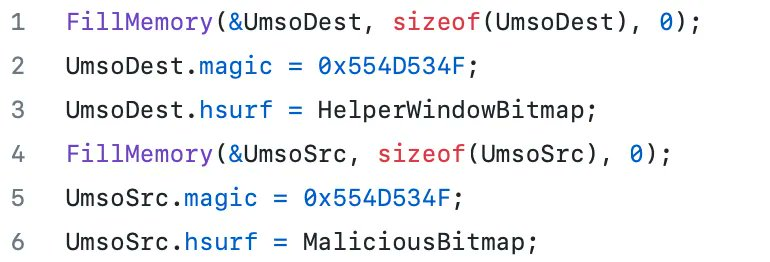

# 0xor0ne
**https://twitter.com/0xor0ne/status/1708021407970463944 _at 2023-09-30, 07:30:11_**
<blockquote>
Analysis of an RCE vulnerability affecting the Microsoft Message Queueing (MSMQ) service (CVE-2023-21554).
Great work by Valentina Palmiotti (@chompie1337), Fabius Watson (@FabiusArtrel), and Aaron Portnoy (@aaronportnoy)

https://t.co/b8tNhGALSF

#exploit #rce #cybersecurity https://t.co/fxanxj5TE5
</blockquote>

* https://securityintelligence.com/posts/msmq-queuejumper-rce-vulnerability-technical-analysis/#

<table><tr>
<td></td>
<td></td>
<td></td>
<td></td>
</table></tr>
<table><tr>
<td>Quotes: <code>0</code></td>
<td>Replies: <code>0</code></td>
<td>Retweets: <code>51</code></td>
<td>Favorites: <code>182</code></td>
</tr></table>

---

# 0xor0ne
**https://twitter.com/0xor0ne/status/1705847042843492538 _at 2023-09-24, 07:30:02_**
<blockquote>
Interesting reading on Windows privilege escalation through Use-After-Free (UAF) in win32kfull (CVE-2023-21822)
Credits Marcin Wiązowski (@thezdi)

https://t.co/H842SjZa71

#exploit #Windows #infosec https://t.co/c5H0IwuJt2
</blockquote>

* https://www.zerodayinitiative.com/blog/2023/8/1/exploiting-a-flaw-in-bitmap-handling-in-windows-user-mode-printer-drivers

<table><tr>
<td></td>
<td></td>
<td></td>
</table></tr>
<table><tr>
<td>Quotes: <code>1</code></td>
<td>Replies: <code>1</code></td>
<td>Retweets: <code>75</code></td>
<td>Favorites: <code>256</code></td>
</tr></table>

---

# Dinosn
**https://twitter.com/Dinosn/status/1705279848279584988 _at 2023-09-22, 17:56:13_**
<blockquote>
PoC released for Chrome zero-day CVE-2023-4863 vulnerability https://t.co/PaGnSvv4gq
</blockquote>

* https://securityonline.info/poc-released-for-chrome-zero-day-cve-2023-4863-vulnerability/

<table><tr>
<td>Quotes: <code>0</code></td>
<td>Replies: <code>1</code></td>
<td>Retweets: <code>22</code></td>
<td>Favorites: <code>83</code></td>
</tr></table>

---

# chybeta
**https://twitter.com/chybeta/status/1703685169637704121 _at 2023-09-18, 08:19:32_**
<blockquote>
CVE-2023-41892 Craftcms RCE using PHP reflection https://t.co/SHFQ5MGX9B
</blockquote>

<table><tr>
<td></td>
</table></tr>
<table><tr>
<td>Quotes: <code>3</code></td>
<td>Replies: <code>4</code></td>
<td>Retweets: <code>59</code></td>
<td>Favorites: <code>349</code></td>
</tr></table>

---

# blackorbird
**https://twitter.com/blackorbird/status/1701785666005430395 _at 2023-09-13, 02:31:35_**
<blockquote>
New Chrome 0day 
CVE-2023-4863
I saw the person who submitted the vulnerability and wondered if it was related to Pegasus.
https://t.co/fIcSSRholN https://t.co/HpRyizECyF
</blockquote>

* https://chromereleases.googleblog.com/2023/09/stable-channel-update-for-desktop_11.html

<table><tr>
<td></td>
</table></tr>
<table><tr>
<td>Quotes: <code>1</code></td>
<td>Replies: <code>2</code></td>
<td>Retweets: <code>52</code></td>
<td>Favorites: <code>121</code></td>
</tr></table>

---

# ajxchapman
**https://twitter.com/ajxchapman/status/1698687203419828522 _at 2023-09-04, 13:19:24_**
<blockquote>
The past week I completely failed to port a Chrome sandbox escape exploit for CVE-2021-30633 to Chrome 90. And by completely, I mean _completely_. This is not something I've attempted before, and I have learned so much in the process.... but man, do I feel like a failure 😆
</blockquote>

<table><tr>
<td>Quotes: <code>0</code></td>
<td>Replies: <code>3</code></td>
<td>Retweets: <code>1</code></td>
<td>Favorites: <code>38</code></td>
</tr></table>

---

