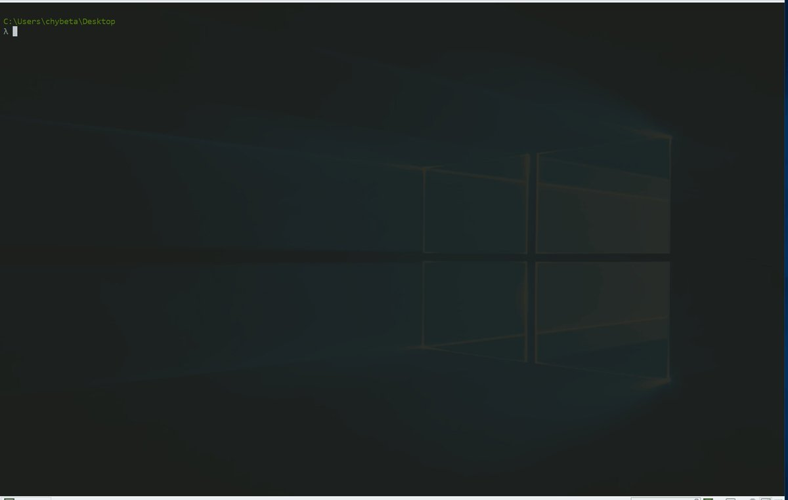
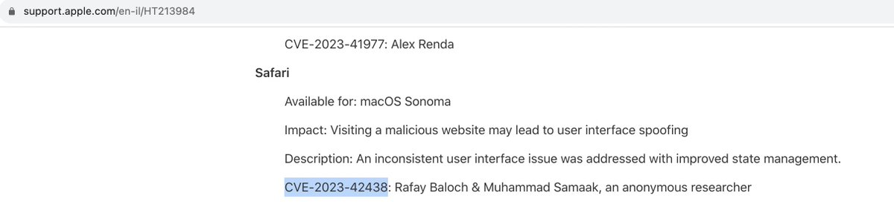
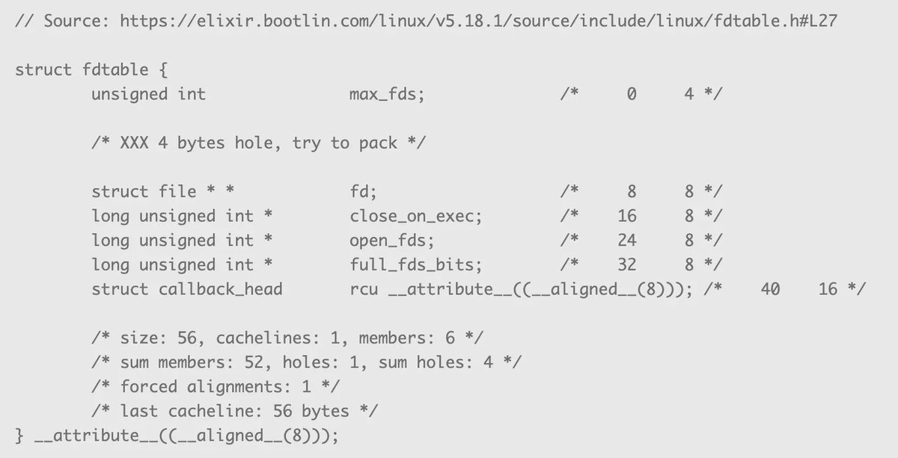

# Synacktiv
**https://twitter.com/Synacktiv/status/1719390961610957164 _at 2023-10-31, 16:28:44_**
<blockquote>
Our ninja @__jbms__ found 4 vulnerabilities allowing to  compromise accounts and gain super-admin privileges on GLPI. Update to  10.0.10 and read the security details in the technical advisory: https://t.co/husDYRZtE2
CVE-2023-41321 CVE-2023-43322 CVE-2023-41323 CVE-2023-43324
</blockquote>

* https://www.synacktiv.com/advisories/multiple-vulnerabilities-in-glpi

<table><tr>
<td>Quotes: <code>0</code></td>
<td>Replies: <code>1</code></td>
<td>Retweets: <code>7</code></td>
<td>Favorites: <code>60</code></td>
</tr></table>

---

# pdnuclei
**https://twitter.com/pdnuclei/status/1719307154153496576 _at 2023-10-31, 10:55:43_**
<blockquote>
Scan for Cisco IOS XE - Authentication Bypass (CVE-2023-20198) using nuclei template 🔯

POC - https://t.co/hTUIqCFtx6

CISA Advisory - https://t.co/XWOSBra6HA

Template: https://t.co/yeXHk2HDn2 

#hackwithautomation #security #bugbounty #cisco
</blockquote>

* https://www.horizon3.ai/cisco-ios-xe-cve-2023-20198-deep-dive-and-poc/
* https://www.cisa.gov/guidance-addressing-cisco-ios-xe-web-ui-vulnerabilities
* https://templates.nuclei.sh/public/CVE-2023-20198

<table><tr>
<td>Quotes: <code>1</code></td>
<td>Replies: <code>1</code></td>
<td>Retweets: <code>42</code></td>
<td>Favorites: <code>122</code></td>
</tr></table>

---

# cyber_advising
**https://twitter.com/cyber_advising/status/1719282790821240955 _at 2023-10-31, 09:18:54_**
<blockquote>
CVE-2023-20198: Cisco Cisco IOS XE is aware of active exploitation ..  This vulnerability allows a remote, unauthenticated attacker to create an account on an affected system with privilege level 15 access.

PoC
https://t.co/MTfvAtJL3b https://t.co/ysKgV68wls
</blockquote>

* https://www.horizon3.ai/cisco-ios-xe-cve-2023-20198-deep-dive-and-poc/

<table><tr>
<td></td>
</table></tr>
<table><tr>
<td>Quotes: <code>0</code></td>
<td>Replies: <code>0</code></td>
<td>Retweets: <code>19</code></td>
<td>Favorites: <code>74</code></td>
</tr></table>

---

# piedpiper1616
**https://twitter.com/piedpiper1616/status/1719205957681774926 _at 2023-10-31, 04:13:36_**
<blockquote>
RT @Horizon3Attack: 🔍 New POC Available! We’ve developed a Proof of Concept for CVE-2023-20198 in #Cisco IOS XE. This authentication-bypass…
</blockquote>

<table><tr>
<td>Quotes: <code>0</code></td>
<td>Replies: <code>0</code></td>
<td>Retweets: <code>120</code></td>
<td>Favorites: <code>0</code></td>
</tr></table>

---

# Dinosn
**https://twitter.com/Dinosn/status/1718905441256718451 _at 2023-10-30, 08:19:27_**
<blockquote>
CVE-2023-46747, BIG-IP - Unauthenticated RCE via AJP Smuggling PoC with Nuclei, https://t.co/LYCaCfA1cm
</blockquote>

* https://github.com/projectdiscovery/nuclei-templates/pull/8496

<table><tr>
<td>Quotes: <code>0</code></td>
<td>Replies: <code>0</code></td>
<td>Retweets: <code>16</code></td>
<td>Favorites: <code>64</code></td>
</tr></table>

---

# pdnuclei
**https://twitter.com/pdnuclei/status/1718707055308005468 _at 2023-10-29, 19:11:08_**
<blockquote>
Scan for F5 BIG-IP - Unauthenticated RCE via AJP Smuggling (CVE-2023-46747) using nuclei templates shared by  @iamnoooob @rootxharsh 

Template - https://t.co/rRWXJTXS55

Analysis - https://t.co/F9Z7VKdL7j by @praetorianlabs

Advisory - https://t.co/5Rqei12XBR… https://t.co/fKE1dxU8ps
</blockquote>

* https://github.com/projectdiscovery/nuclei-templates/pull/8496
* https://www.praetorian.com/blog/refresh-compromising-f5-big-ip-with-request-smuggling-cve-2023-46747/
* https://my.f5.com/manage/s/article/K000137353

<table><tr>
<td></td>
</table></tr>
<table><tr>
<td>Quotes: <code>7</code></td>
<td>Replies: <code>4</code></td>
<td>Retweets: <code>177</code></td>
<td>Favorites: <code>528</code></td>
</tr></table>

---

# chybeta
**https://twitter.com/chybeta/status/1718632371527029195 _at 2023-10-29, 14:14:22_**
<blockquote>
CVE-2023-46747  request smuggling to RCE https://t.co/cQgKyFsdg3
</blockquote>

<table><tr>
<td></td>
</table></tr>
<table><tr>
<td>Quotes: <code>2</code></td>
<td>Replies: <code>4</code></td>
<td>Retweets: <code>57</code></td>
<td>Favorites: <code>310</code></td>
</tr></table>

---

# DailyDarkWeb
**https://twitter.com/DailyDarkWeb/status/1717913537031356661 _at 2023-10-27, 14:37:59_**
<blockquote>
CVE-2023-46747

CVSS score: 9.8

Affected product(s),verison(s): F5 BIG-IP from 17.1.0 to 13.1.5

This vulnerability may allow an unauthenticated attacker with network access to the BIG-IP system through the management port and/or self IP addresses to execute arbitrary system… https://t.co/CVy2uXYJki
</blockquote>

<table><tr>
<td></td>
</table></tr>
<table><tr>
<td>Quotes: <code>0</code></td>
<td>Replies: <code>0</code></td>
<td>Retweets: <code>52</code></td>
<td>Favorites: <code>123</code></td>
</tr></table>

---

# rafaybaloch
**https://twitter.com/rafaybaloch/status/1717865128484327774 _at 2023-10-27, 11:25:37_**
<blockquote>
.@Apple has fixed an 'Address Bar Spoofing' vulnerability that I reported alongside @Haalim1337. It has been designated as CVE-2023-42438. The fix is shipped with "macOS Sanoma", the bug is a variant of a regression bug, I discovered many years ago. #apple #CyberSecurity https://t.co/TC8JHv5fnv
</blockquote>

<table><tr>
<td></td>
</table></tr>
<table><tr>
<td>Quotes: <code>0</code></td>
<td>Replies: <code>2</code></td>
<td>Retweets: <code>3</code></td>
<td>Favorites: <code>31</code></td>
</tr></table>

---

# cyber_advising
**https://twitter.com/cyber_advising/status/1717856574293606621 _at 2023-10-27, 10:51:38_**
<blockquote>
CVE-2023-46747: Compromising F5 BIG-IP With Request Smuggling. bypass configuration utility authentication, allowing an attacker with network access to the BIG-IP .... to execute arbitrary system commands. 

PoC
https://t.co/hJ50WrUqv8 https://t.co/lKyjxF5OOD
</blockquote>

* https://www.praetorian.com/blog/refresh-compromising-f5-big-ip-with-request-smuggling-cve-2023-46747/

<table><tr>
<td></td>
</table></tr>
<table><tr>
<td>Quotes: <code>2</code></td>
<td>Replies: <code>0</code></td>
<td>Retweets: <code>77</code></td>
<td>Favorites: <code>183</code></td>
</tr></table>

---

# maddiestone
**https://twitter.com/maddiestone/status/1717855323468255490 _at 2023-10-27, 10:46:39_**
<blockquote>
The CVE-2023-41990 (TrueType) entry was added to the iOS 15.7.8 (July 2023) and iOS 16.3 (Jan 2023) release notes in September with annotations of ITW exploitation.
</blockquote>

<table><tr>
<td>Quotes: <code>0</code></td>
<td>Replies: <code>0</code></td>
<td>Retweets: <code>23</code></td>
<td>Favorites: <code>39</code></td>
</tr></table>

---

# HunterMapping
**https://twitter.com/HunterMapping/status/1717802007673942345 _at 2023-10-27, 07:14:48_**
<blockquote>
🚨Alert🚨CVE-2023-46747   F5 BIG-IP Remote Code Execution Vulnerability
CVSS score：9.8
 Hunter：https://t.co/D4wg629B40

Dorks 👇👇👇
FOFA app="f5-BIGIP"
SHODAN product:"BIG-IP"
📰refer to https://t.co/DquM1SVSon
#infosec #infosecurity #Infosys https://t.co/ZrKRjU7tkK
</blockquote>

* https://hunter.how/list?searchValue=web.title%3D%22BIG-IP%22
* https://my.f5.com/manage/s/article/K000137353

<table><tr>
<td></td>
</table></tr>
<table><tr>
<td>Quotes: <code>0</code></td>
<td>Replies: <code>3</code></td>
<td>Retweets: <code>72</code></td>
<td>Favorites: <code>206</code></td>
</tr></table>

---

# TheHackersNews
**https://twitter.com/TheHackersNews/status/1717759211948343410 _at 2023-10-27, 04:24:45_**
<blockquote>
⚡ Urgent — F5 warns of a critical #vulnerability (CVE-2023-46747) in BIG-IP, allowing unauthenticated remote code execution.

Learn more: https://t.co/V2KdfBcqPH

#cybersecurity #hacking
</blockquote>

* https://thehackernews.com/2023/10/f5-issues-warning-big-ip-vulnerability.html

<table><tr>
<td>Quotes: <code>2</code></td>
<td>Replies: <code>2</code></td>
<td>Retweets: <code>94</code></td>
<td>Favorites: <code>182</code></td>
</tr></table>

---

# chybeta
**https://twitter.com/chybeta/status/1717694249750417423 _at 2023-10-27, 00:06:37_**
<blockquote>
https://t.co/rqh910AOX7

K000137353: BIG-IP Configuration utility unauthenticated remote code execution vulnerability CVE-2023-46747 https://t.co/UwJyKiW4fW
</blockquote>

* https://my.f5.com/manage/s/article/K000137353

<table><tr>
<td></td>
</table></tr>
<table><tr>
<td>Quotes: <code>2</code></td>
<td>Replies: <code>1</code></td>
<td>Retweets: <code>9</code></td>
<td>Favorites: <code>63</code></td>
</tr></table>

---

# cherepanov74
**https://twitter.com/cherepanov74/status/1717127848622690463 _at 2023-10-25, 10:35:56_**
<blockquote>
RT @ESETresearch: #ESETResearch discovered a zero-day XSS vulnerability (#CVE-2023-5631) in Roundcube Webmail servers. It is actively used…
</blockquote>

<table><tr>
<td>Quotes: <code>0</code></td>
<td>Replies: <code>0</code></td>
<td>Retweets: <code>88</code></td>
<td>Favorites: <code>0</code></td>
</tr></table>

---

# cyber_advising
**https://twitter.com/cyber_advising/status/1717076572539117655 _at 2023-10-25, 07:12:11_**
<blockquote>
CVE-2023-36745:  Microsoft Exchange Server Remote Code Execution Vulnerability.

PoC
https://t.co/t7kkChV08Z https://t.co/UFUmuYBOy7
</blockquote>

* https://n1k0la-t.github.io/2023/10/24/Microsoft-Exchange-Server-CVE-2023-36745/

<table><tr>
<td></td>
</table></tr>
<table><tr>
<td>Quotes: <code>0</code></td>
<td>Replies: <code>0</code></td>
<td>Retweets: <code>79</code></td>
<td>Favorites: <code>242</code></td>
</tr></table>

---

# piedpiper1616
**https://twitter.com/piedpiper1616/status/1716957382230827114 _at 2023-10-24, 23:18:34_**
<blockquote>
RT @webdxg: Exchange Server CVE-2023-36745
https://t.co/VDjXJiH3Kw
Standing on the Shoulder of Giants @chudyPB .
</blockquote>

* https://n1k0la-t.github.io/2023/10/24/Microsoft-Exchange-Server-CVE-2023-36745/

<table><tr>
<td>Quotes: <code>0</code></td>
<td>Replies: <code>0</code></td>
<td>Retweets: <code>71</code></td>
<td>Favorites: <code>0</code></td>
</tr></table>

---

# piedpiper1616
**https://twitter.com/piedpiper1616/status/1716956820902908139 _at 2023-10-24, 23:16:20_**
<blockquote>
RT @Gi7w0rm: #Citrix Netscaler #CVE-2023-4966 PoC released.

Dupped "Citrix Bleed", it allows to leak sensitive info from Citrix devices.…
</blockquote>

<table><tr>
<td>Quotes: <code>0</code></td>
<td>Replies: <code>0</code></td>
<td>Retweets: <code>69</code></td>
<td>Favorites: <code>0</code></td>
</tr></table>

---

# 0xor0ne
**https://twitter.com/0xor0ne/status/1716854626899702179 _at 2023-10-24, 16:30:15_**
<blockquote>
Linux kernel exploitation writeup by @ExodusIntel
CVE-2022-32250 : use-after-free targeting Linux kernel 5.18.1 

https://t.co/W6U8j5bZtq

#Linux #kernel #exploit #cve #infosec #cybersecurity https://t.co/b1osYO4V6O
</blockquote>

* https://blog.exodusintel.com/2022/12/19/linux-kernel-exploiting-a-netfilter-use-after-free-in-kmalloc-cg/

<table><tr>
<td></td>
<td></td>
<td></td>
<td></td>
</table></tr>
<table><tr>
<td>Quotes: <code>0</code></td>
<td>Replies: <code>1</code></td>
<td>Retweets: <code>65</code></td>
<td>Favorites: <code>246</code></td>
</tr></table>

---

# testanull
**https://twitter.com/testanull/status/1716817661886386240 _at 2023-10-24, 14:03:22_**
<blockquote>
RT @webdxg: Exchange Server CVE-2023-36745
https://t.co/VDjXJiH3Kw
Standing on the Shoulder of Giants @chudyPB .
</blockquote>

* https://n1k0la-t.github.io/2023/10/24/Microsoft-Exchange-Server-CVE-2023-36745/

<table><tr>
<td>Quotes: <code>0</code></td>
<td>Replies: <code>0</code></td>
<td>Retweets: <code>71</code></td>
<td>Favorites: <code>0</code></td>
</tr></table>

---

# Dinosn
**https://twitter.com/Dinosn/status/1716756356877713617 _at 2023-10-24, 09:59:45_**
<blockquote>
Microsoft Exchange Server RCE (CVE-2023-36745) Flaw Gets PoC Exploit https://t.co/XsLfbaFA5r
</blockquote>

* https://securityonline.info/microsoft-exchange-server-rce-cve-2023-36745-flaw-gets-poc-exploit/

<table><tr>
<td>Quotes: <code>0</code></td>
<td>Replies: <code>1</code></td>
<td>Retweets: <code>48</code></td>
<td>Favorites: <code>133</code></td>
</tr></table>

---

# the_yellow_fall
**https://twitter.com/the_yellow_fall/status/1716722572619030814 _at 2023-10-24, 07:45:31_**
<blockquote>
Microsoft Exchange Server RCE (CVE-2023-36745) Flaw Gets PoC Exploit
https://t.co/ZCdYTfc0Ma
#infosec #security #pentesting https://t.co/aEH8hG0FgV
</blockquote>

* https://securityonline.info/microsoft-exchange-server-rce-cve-2023-36745-flaw-gets-poc-exploit/

<table><tr>
<td></td>
</table></tr>
<table><tr>
<td>Quotes: <code>0</code></td>
<td>Replies: <code>2</code></td>
<td>Retweets: <code>10</code></td>
<td>Favorites: <code>44</code></td>
</tr></table>

---

# 0vercl0k
**https://twitter.com/0vercl0k/status/1716344831260143739 _at 2023-10-23, 06:44:30_**
<blockquote>
RT @mmolgtm: In this post I'll use CVE-2023-4069, a type confusion bug in the Maglev JIT compiler of Chrome that I reported in July, to gai…
</blockquote>

<table><tr>
<td>Quotes: <code>0</code></td>
<td>Replies: <code>0</code></td>
<td>Retweets: <code>90</code></td>
<td>Favorites: <code>0</code></td>
</tr></table>

---

# momika233
**https://twitter.com/momika233/status/1716053883313967372 _at 2023-10-22, 11:28:23_**
<blockquote>
RT @cyber_advising: CVE-2023-34051: VMware Aria Operations for Logs contains an authentication bypass vulnerability. An unauthenticated, ma…
</blockquote>

<table><tr>
<td>Quotes: <code>0</code></td>
<td>Replies: <code>0</code></td>
<td>Retweets: <code>36</code></td>
<td>Favorites: <code>0</code></td>
</tr></table>

---

# cyber_advising
**https://twitter.com/cyber_advising/status/1715786031587303601 _at 2023-10-21, 17:44:02_**
<blockquote>
CVE-2023-34051: VMware Aria Operations for Logs contains an authentication bypass vulnerability. An unauthenticated, malicious actor can inject files into the operating system of an impacted appliance which can result in remote code execution.

PoC
https://t.co/Usl4Nx8Zvv https://t.co/9QZwLddFSl
</blockquote>

* https://github.com/horizon3ai/CVE-2023-34051

<table><tr>
<td></td>
</table></tr>
<table><tr>
<td>Quotes: <code>0</code></td>
<td>Replies: <code>1</code></td>
<td>Retweets: <code>36</code></td>
<td>Favorites: <code>62</code></td>
</tr></table>

---

# hack_git
**https://twitter.com/hack_git/status/1715625220621373598 _at 2023-10-21, 07:05:02_**
<blockquote>
CVE-2023-34051

CVE-2023-34051 is an authentication bypass that bypasses the patch for VMSA-2023-0001. VMSA-2023-0001 for vRealize Log Insight includes the following CVEs:

• VMware vRealize Log Insight Directory Traversal Vulnerability (CVE-2022-31706)
• VMware vRealize Log… https://t.co/baY4M7eUGI
</blockquote>

<table><tr>
<td></td>
</table></tr>
<table><tr>
<td>Quotes: <code>0</code></td>
<td>Replies: <code>0</code></td>
<td>Retweets: <code>12</code></td>
<td>Favorites: <code>54</code></td>
</tr></table>

---

# TheHackersNews
**https://twitter.com/TheHackersNews/status/1715575368315277463 _at 2023-10-21, 03:46:56_**
<blockquote>
🚨 Cisco issued an alert about a new zero-day #vulnerability in IOS XE (CVE-2023-20273). Attackers are actively exploiting it to install a malicious Lua-based implant on vulnerable devices.

Learn more: https://t.co/smPcpky38W

#cybersecurity #informationsecurity #hacking
</blockquote>

* https://thehackernews.com/2023/10/cisco-zero-day-exploited-to-implant.html

<table><tr>
<td>Quotes: <code>1</code></td>
<td>Replies: <code>4</code></td>
<td>Retweets: <code>77</code></td>
<td>Favorites: <code>170</code></td>
</tr></table>

---

# momika233
**https://twitter.com/momika233/status/1715297556878725470 _at 2023-10-20, 09:23:00_**
<blockquote>
CVE-2023-20198 Cisco IOS XE Vulnerability NSE Script for Nmap
https://t.co/thVZSlp2mI
</blockquote>

* https://github.com/abuyv/CVElab/tree/main/cves/cve-2023-20198

<table><tr>
<td>Quotes: <code>0</code></td>
<td>Replies: <code>2</code></td>
<td>Retweets: <code>44</code></td>
<td>Favorites: <code>121</code></td>
</tr></table>

---

# stephenfewer
**https://twitter.com/stephenfewer/status/1715106608785604840 _at 2023-10-19, 20:44:15_**
<blockquote>
This weeks @metasploit release has our unauthenticated RCE exploit module for CVE-2023-22515, affecting Atlassian Confluence. Get all the release details here: https://t.co/APJ35inKNi https://t.co/xmjqDuJlDC
</blockquote>

* https://www.rapid7.com/blog/post/2023/10/19/metasploit-weekly-wrap-up-32/

<table><tr>
<td></td>
</table></tr>
<table><tr>
<td>Quotes: <code>2</code></td>
<td>Replies: <code>2</code></td>
<td>Retweets: <code>87</code></td>
<td>Favorites: <code>224</code></td>
</tr></table>

---

# hosselot
**https://twitter.com/hosselot/status/1714687829065035845 _at 2023-10-18, 17:00:10_**
<blockquote>
RT @thezdi: CVE-2023-38600: @hosselot tells the story of an innocent #Apple #Safari copyWithin gone (way) outside. Read all of the details…
</blockquote>

<table><tr>
<td>Quotes: <code>0</code></td>
<td>Replies: <code>0</code></td>
<td>Retweets: <code>36</code></td>
<td>Favorites: <code>0</code></td>
</tr></table>

---

# MsftSecIntel
**https://twitter.com/MsftSecIntel/status/1714681498115440898 _at 2023-10-18, 16:35:01_**
<blockquote>
Since early October 2023, Microsoft has observed North Korean nation-state threat actors Diamond Sleet and Onyx Sleet exploiting the TeamCity CVE-2023-42793 RCE vulnerability, posing a particularly high risk to affected orgs. Get TTPs &amp; protection info: https://t.co/s8SRIDQfWT
</blockquote>

* https://msft.it/60109adfp

<table><tr>
<td>Quotes: <code>8</code></td>
<td>Replies: <code>1</code></td>
<td>Retweets: <code>103</code></td>
<td>Favorites: <code>168</code></td>
</tr></table>

---

# maddiestone
**https://twitter.com/maddiestone/status/1714522558890995970 _at 2023-10-18, 06:03:26_**
<blockquote>
RT @_clem1: I just published a new RCA for CVE-2023-26369, the PDF 0-day that was used in the following campaign. https://t.co/cwABjAOc38
</blockquote>

* https://googleprojectzero.github.io/0days-in-the-wild//0day-RCAs/2023/CVE-2023-26369.html

<table><tr>
<td>Quotes: <code>0</code></td>
<td>Replies: <code>0</code></td>
<td>Retweets: <code>111</code></td>
<td>Favorites: <code>0</code></td>
</tr></table>

---

# blackorbird
**https://twitter.com/blackorbird/status/1714483299765354777 _at 2023-10-18, 03:27:26_**
<blockquote>
#Lazarus CVE-2023-26369 Exploit: Adobe Acrobat PDF Reader RCE when processing TTF fonts
https://t.co/cQWuyR6fHg
ref:
https://t.co/mwQUWkk8QG https://t.co/S8gU4Q9Pku
</blockquote>

* https://googleprojectzero.github.io/0days-in-the-wild//0day-RCAs/2023/CVE-2023-26369.html
* https://blog.google/threat-analysis-group/active-north-korean-campaign-targeting-security-researchers/

<table><tr>
<td></td>
</table></tr>
<table><tr>
<td>Quotes: <code>2</code></td>
<td>Replies: <code>3</code></td>
<td>Retweets: <code>103</code></td>
<td>Favorites: <code>235</code></td>
</tr></table>

---

# BushidoToken
**https://twitter.com/BushidoToken/status/1714380340557439071 _at 2023-10-17, 20:38:19_**
<blockquote>
Vulnerability Flash Alert - One You Can't Ignore
🔥 0day ITW exploitation of CVE-2023-20198 
💥 Thousands of Cisco IOS XE compromised 
☣️ Malware implants w/ HighPrivs installed on them
🔟 CVSS 10.0, no patch or no workaround

1. https://t.co/nYyBAB6Jby
2. https://t.co/YxZpODMzmO
</blockquote>

* https://blog.talosintelligence.com/active-exploitation-of-cisco-ios-xe-software/
* https://vulncheck.com/blog/cisco-implants

<table><tr>
<td>Quotes: <code>1</code></td>
<td>Replies: <code>5</code></td>
<td>Retweets: <code>41</code></td>
<td>Favorites: <code>119</code></td>
</tr></table>

---

# mmolgtm
**https://twitter.com/mmolgtm/status/1714301029146099903 _at 2023-10-17, 15:23:10_**
<blockquote>
In this post I'll use CVE-2023-4069, a type confusion bug in the Maglev JIT compiler of Chrome that I reported in July, to gain RCE in the Chrome renderer sandbox: https://t.co/Mas6ALpKiO
</blockquote>

* https://github.blog/2023-10-17-getting-rce-in-chrome-with-incomplete-object-initialization-in-the-maglev-compiler/

<table><tr>
<td>Quotes: <code>4</code></td>
<td>Replies: <code>3</code></td>
<td>Retweets: <code>88</code></td>
<td>Favorites: <code>277</code></td>
</tr></table>

---

# DailyDarkWeb
**https://twitter.com/DailyDarkWeb/status/1714299619528552779 _at 2023-10-17, 15:17:34_**
<blockquote>
CVE-2023-20198

CVSS Score: 10.0

Affected product(s),verison(s): Cisco IOS XE Software

This vulnerability allows a remote, unauthenticated attacker to create an account on an affected system with privilege level 15 access.

https://t.co/C7wrs5kENd

#cybersecurity #infosec https://t.co/OcrdezDABd
</blockquote>

* https://sec.cloudapps.cisco.com/security/center/content/CiscoSecurityAdvisory/cisco-sa-iosxe-webui-privesc-j22SaA4z

<table><tr>
<td></td>
</table></tr>
<table><tr>
<td>Quotes: <code>3</code></td>
<td>Replies: <code>2</code></td>
<td>Retweets: <code>34</code></td>
<td>Favorites: <code>93</code></td>
</tr></table>

---

# GHSecurityLab
**https://twitter.com/GHSecurityLab/status/1714296777711431943 _at 2023-10-17, 15:06:16_**
<blockquote>
In this post @mmolgtm shows how to get Remote Code Execution (RCE) in Chrome, by exploiting the type confusion vulnerability CVE-2023-4069 in the Maglev compiler.

https://t.co/8CPoUbz70b
</blockquote>

* https://github.blog/2023-10-17-getting-rce-in-chrome-with-incomplete-object-initialization-in-the-maglev-compiler/

<table><tr>
<td>Quotes: <code>0</code></td>
<td>Replies: <code>0</code></td>
<td>Retweets: <code>16</code></td>
<td>Favorites: <code>69</code></td>
</tr></table>

---

# 0xor0ne
**https://twitter.com/0xor0ne/status/1712868312885899663 _at 2023-10-13, 16:30:04_**
<blockquote>
Analysis of CVE-2023-29360 (LPE in Windows mskssrv driver)

https://t.co/zSWI8EmPZd

#lpe #exploit #cybersecurity https://t.co/Z0unm1CND8
</blockquote>

* https://big5-sec.github.io/posts/CVE-2023-29360-analysis/

<table><tr>
<td></td>
<td></td>
<td></td>
</table></tr>
<table><tr>
<td>Quotes: <code>0</code></td>
<td>Replies: <code>0</code></td>
<td>Retweets: <code>45</code></td>
<td>Favorites: <code>160</code></td>
</tr></table>

---

# win3zz
**https://twitter.com/win3zz/status/1712398236441550870 _at 2023-10-12, 09:22:09_**
<blockquote>
CVE-2023-38545: A heap buffer overflow vulnerability in cURL, which gained attention due to an early patch exposure.
Exploitation requires certain conditions, like the use of SOCKS proxies and certain redirect settings.
This cannot be used to convert SSRF into RCE.
#infosec https://t.co/XxEQV9X9Gj
</blockquote>

<table><tr>
<td></td>
</table></tr>
<table><tr>
<td>Quotes: <code>0</code></td>
<td>Replies: <code>4</code></td>
<td>Retweets: <code>12</code></td>
<td>Favorites: <code>71</code></td>
</tr></table>

---

# RedTeamPT
**https://twitter.com/RedTeamPT/status/1712379361146318896 _at 2023-10-12, 08:07:08_**
<blockquote>
Did you know you can still exploit CVE-2023-43115 for RCE on a fully patched Fedora 38 with a LibreOffice document?🤯 https://t.co/9JFEjreVxi
</blockquote>

<table><tr>
<td></td>
</table></tr>
<table><tr>
<td>Quotes: <code>1</code></td>
<td>Replies: <code>3</code></td>
<td>Retweets: <code>56</code></td>
<td>Favorites: <code>186</code></td>
</tr></table>

---

# maddiestone
**https://twitter.com/maddiestone/status/1712225038437609891 _at 2023-10-11, 21:53:55_**
<blockquote>
🔮NEW RCA!! A few hours after it was patched, TAG found an ITW exploit sample for CVE-2023-36802. @benoitsevens analyzed it in detail ✨

https://t.co/uPkFuA5KPm
</blockquote>

* https://googleprojectzero.github.io/0days-in-the-wild//0day-RCAs/2023/CVE-2023-36802.html

<table><tr>
<td>Quotes: <code>1</code></td>
<td>Replies: <code>0</code></td>
<td>Retweets: <code>91</code></td>
<td>Favorites: <code>238</code></td>
</tr></table>

---

# _CPResearch_
**https://twitter.com/_CPResearch_/status/1712151387897753697 _at 2023-10-11, 17:01:15_**
<blockquote>
Uncovering Stayin’ Alive operation, active since at least 2021:

📞 Targets telecoms in Asia 🇰🇿🇺🇿🇻🇳🇵🇰

🛠️ Spearphishing + DLL side-loading  (such as CVE-2022-23748 in Zoom)

🐱 Linked to a China-affiliated threat actor, referred as ToddyCat

👉 Read more: https://t.co/4Hz0fTYY3d https://t.co/mkVlxjef5B
</blockquote>

* https://research.checkpoint.com/2023/stayin-alive-targeted-attacks-against-telecoms-and-government-ministries-in-asia/

<table><tr>
<td></td>
</table></tr>
<table><tr>
<td>Quotes: <code>1</code></td>
<td>Replies: <code>1</code></td>
<td>Retweets: <code>38</code></td>
<td>Favorites: <code>93</code></td>
</tr></table>

---

# cyber_advising
**https://twitter.com/cyber_advising/status/1712072118265868298 _at 2023-10-11, 11:46:16_**
<blockquote>
CVE-2023-36723 · Windows Container Manager Service Elevation of Privilege Vulnerability.

PoC
https://t.co/8tOyWsjryP https://t.co/kWdEMfrku4
</blockquote>

* https://github.com/Wh04m1001/CVE-2023-36723

<table><tr>
<td></td>
</table></tr>
<table><tr>
<td>Quotes: <code>0</code></td>
<td>Replies: <code>0</code></td>
<td>Retweets: <code>33</code></td>
<td>Favorites: <code>99</code></td>
</tr></table>

---

# piedpiper1616
**https://twitter.com/piedpiper1616/status/1712006864089854247 _at 2023-10-11, 07:26:58_**
<blockquote>
GitHub - chompie1337/Windows_MSKSSRV_LPE_CVE-2023-36802: LPE exploit for CVE-2023-36802 - https://t.co/0BrOuIjOzC
</blockquote>

* https://github.com/chompie1337/Windows_MSKSSRV_LPE_CVE-2023-36802

<table><tr>
<td>Quotes: <code>0</code></td>
<td>Replies: <code>0</code></td>
<td>Retweets: <code>20</code></td>
<td>Favorites: <code>53</code></td>
</tr></table>

---

# ptswarm
**https://twitter.com/ptswarm/status/1711699559359865200 _at 2023-10-10, 11:05:51_**
<blockquote>
⚠️ We have reproduced CVE-2023-22515 in Atlassian Confluence.

Broken access control allows unauthenticated users to gain administrative access to the web application! 

Update your software ASAP! https://t.co/MlE4ygyf3E
</blockquote>

<table><tr>
<td></td>
</table></tr>
<table><tr>
<td>Quotes: <code>6</code></td>
<td>Replies: <code>8</code></td>
<td>Retweets: <code>173</code></td>
<td>Favorites: <code>631</code></td>
</tr></table>

---

# 1ZRR4H
**https://twitter.com/1ZRR4H/status/1711686844490936568 _at 2023-10-10, 10:15:19_**
<blockquote>
🚨 Hundreds of Citrix VPN instances exploited via CVE-2023-3519 are harvesting corporate credentials in cleartext.

At this time, Shodan shows 406 compromised instances with malicious JavaScript code injected into the login page: https://t.co/AiG1RAOTAP (URL shortener because… https://t.co/EjfpsleMPe
</blockquote>

* https://shorturl.at/qQVX4

<table><tr>
<td></td>
<td></td>
<td></td>
<td></td>
</table></tr>
<table><tr>
<td>Quotes: <code>10</code></td>
<td>Replies: <code>13</code></td>
<td>Retweets: <code>258</code></td>
<td>Favorites: <code>633</code></td>
</tr></table>

---

# maddiestone
**https://twitter.com/maddiestone/status/1711474447369351495 _at 2023-10-09, 20:11:20_**
<blockquote>
RT @zhuowei: For CVE-2023-42824, vm_object-&gt;vo_copy now has an extra generation count.
In vm_object_copy_delayed, after setting vo_copy, it…
</blockquote>

<table><tr>
<td>Quotes: <code>0</code></td>
<td>Replies: <code>0</code></td>
<td>Retweets: <code>33</code></td>
<td>Favorites: <code>0</code></td>
</tr></table>

---

# GHSecurityLab
**https://twitter.com/GHSecurityLab/status/1711450679187997067 _at 2023-10-09, 18:36:53_**
<blockquote>
RT @kevin_backhouse: Video of my PoC for CVE-2023-43641: out-of-bounds array access in libcue. libcue is used by tracker-miners, which auto…
</blockquote>

<table><tr>
<td>Quotes: <code>0</code></td>
<td>Replies: <code>0</code></td>
<td>Retweets: <code>117</code></td>
<td>Favorites: <code>0</code></td>
</tr></table>

---

# GHSecurityLab
**https://twitter.com/GHSecurityLab/status/1711428403881001246 _at 2023-10-09, 17:08:22_**
<blockquote>
Today we're disclosing CVE-2023-43641 in libcue. Its severity is magnified by its use in GNOME's tracker-miners, as @kevin_backhouse explains in this blog post. https://t.co/FwWKsmhpee
</blockquote>

* https://github.blog/2023-10-09-coordinated-disclosure-1-click-rce-on-gnome-cve-2023-43641/

<table><tr>
<td>Quotes: <code>0</code></td>
<td>Replies: <code>0</code></td>
<td>Retweets: <code>18</code></td>
<td>Favorites: <code>49</code></td>
</tr></table>

---

# pentest_swissky
**https://twitter.com/pentest_swissky/status/1711123550466122106 _at 2023-10-08, 20:57:00_**
<blockquote>
“Game of Rars” – Exploring a New Remote Code Execution Vulnerability in WinRAR with Proof-of-Concept (CVE-2023-40477) 
https://t.co/YsNfobASgc
</blockquote>

* https://wildptr.io/winrar-cve-2023-40477-poc-new-vulnerability-winrar-security-research/

<table><tr>
<td>Quotes: <code>0</code></td>
<td>Replies: <code>1</code></td>
<td>Retweets: <code>41</code></td>
<td>Favorites: <code>88</code></td>
</tr></table>

---

# stephenfewer
**https://twitter.com/stephenfewer/status/1710366208392937703 _at 2023-10-06, 18:47:35_**
<blockquote>
The weeks @metasploit release includes our exploit for CVE-2023-40044, an unauthenticated RCE in the Ad Hoc Transfer module of WS_FTP Server, due to unsafe .NET deserialization. Get all the details here: https://t.co/5VPn5OqtId https://t.co/VXV1os351P
</blockquote>

* https://www.rapid7.com/blog/post/2023/10/06/metasploit-weekly-wrap-up-30/

<table><tr>
<td></td>
</table></tr>
<table><tr>
<td>Quotes: <code>2</code></td>
<td>Replies: <code>2</code></td>
<td>Retweets: <code>43</code></td>
<td>Favorites: <code>118</code></td>
</tr></table>

---

# assetnote
**https://twitter.com/assetnote/status/1708272163772682602 _at 2023-10-01, 00:06:36_**
<blockquote>
Our security research team discovered a pre-auth RCE vulnerability in Progress WS_FTP (CVE-2023-40044). Due to the exploit being released on Twitter, we've also published - 
Blog: https://t.co/pOGLRrJPDo
Advisory: https://t.co/ae5N3nQXEP https://t.co/dVJOUyLDjd
</blockquote>

* https://www.assetnote.io/resources/research/rce-in-progress-ws-ftp-ad-hoc-via-iis-http-modules-cve-2023-40044
* https://www.assetnote.io/resources/research/advisory-progress-ws-ftp-rce-cve-2023-40044

<table><tr>
<td></td>
</table></tr>
<table><tr>
<td>Quotes: <code>0</code></td>
<td>Replies: <code>0</code></td>
<td>Retweets: <code>39</code></td>
<td>Favorites: <code>158</code></td>
</tr></table>

---

# infosec_au
**https://twitter.com/infosec_au/status/1708271663182381240 _at 2023-10-01, 00:04:37_**
<blockquote>
Our team at @assetnote has published the blog post on the Progress WS_FTP RCE (CVE-2023-40044). It was fun to find an RCE in the middleware layer (IIS HTTP Module), and it was also quite surprising that the exploit did not require authentication: https://t.co/W7MdGNXvLH https://t.co/CoGFp4Uf8A
</blockquote>

* https://www.assetnote.io/resources/research/rce-in-progress-ws-ftp-ad-hoc-via-iis-http-modules-cve-2023-40044

<table><tr>
<td></td>
</table></tr>
<table><tr>
<td>Quotes: <code>3</code></td>
<td>Replies: <code>15</code></td>
<td>Retweets: <code>126</code></td>
<td>Favorites: <code>450</code></td>
</tr></table>

---

