# elhackernet
**https://twitter.com/elhackernet/status/1726513356121813408 _at 2023-11-20, 08:10:35_**
<blockquote>
CVE-2023-43177: La vulnerabilidad de día cero de CrushFTP amenaza a miles de organizaciones
https://t.co/au2Ivui6SC
</blockquote>

* https://meterpreter.org/cve-2023-43177-crushftp-zero-day-vulnerability-threatens-thousands-of-organizations/

<table><tr>
<td>Quotes: <code>0</code></td>
<td>Replies: <code>0</code></td>
<td>Retweets: <code>14</code></td>
<td>Favorites: <code>40</code></td>
</tr></table>

---

# Dinosn
**https://twitter.com/Dinosn/status/1726107240711819355 _at 2023-11-19, 05:16:50_**
<blockquote>
Splunk RCE -  Proof of concept exploit for CVE-2023-46214, SVD-2023-1104 https://t.co/GTu2IugDtO
</blockquote>

* https://github.com/nathan31337/Splunk-RCE-poc

<table><tr>
<td>Quotes: <code>2</code></td>
<td>Replies: <code>0</code></td>
<td>Retweets: <code>48</code></td>
<td>Favorites: <code>148</code></td>
</tr></table>

---

# RempahRz
**https://twitter.com/RempahRz/status/1725549321234403562 _at 2023-11-17, 16:19:51_**
<blockquote>
CVE-2023-46865 - Post-Auth Unrestricted File Upload  and Code Execution via IDAT in Crater Invoice by @asylumdx 

https://t.co/wKj08wEUDQ
</blockquote>

* https://notes.netbytesec.com/2023/11/post-auth-rce-in-crater-invoice.html

<table><tr>
<td>Quotes: <code>2</code></td>
<td>Replies: <code>1</code></td>
<td>Retweets: <code>20</code></td>
<td>Favorites: <code>31</code></td>
</tr></table>

---

# cyber_advising
**https://twitter.com/cyber_advising/status/1725533144143568967 _at 2023-11-17, 15:15:35_**
<blockquote>
CVE-2023-47246: SysAid ITSM On-Premise before 23.3.36, a path traversal vulnerability leads to code execution after an attacker writes a file to the Tomcat webroot, as exploited in the wild in November 2023.

PoC
https://t.co/Mu5JDhqcjU https://t.co/OJssCU6kUp
</blockquote>

* https://github.com/W01fh4cker/CVE-2023-47246-EXP

<table><tr>
<td>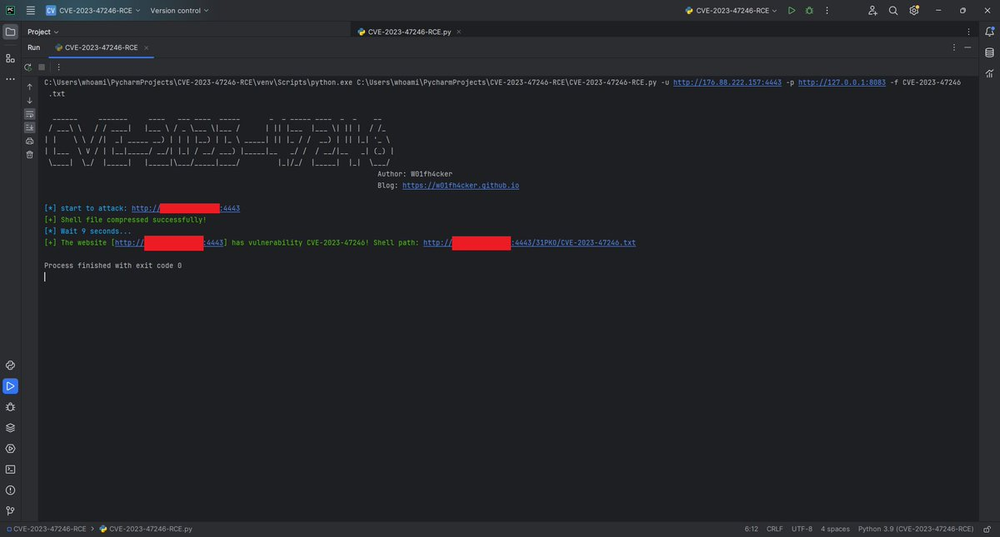</td>
</table></tr>
<table><tr>
<td>Quotes: <code>0</code></td>
<td>Replies: <code>0</code></td>
<td>Retweets: <code>14</code></td>
<td>Favorites: <code>52</code></td>
</tr></table>

---

# piedpiper1616
**https://twitter.com/piedpiper1616/status/1725516669223915637 _at 2023-11-17, 14:10:07_**
<blockquote>
GitHub - W01fh4cker/CVE-2023-47246-EXP: exploit for cve-2023-47246 SysAid RCE (shell upload) - https://t.co/yUEZgscSnX
</blockquote>

* https://github.com/W01fh4cker/CVE-2023-47246-EXP

<table><tr>
<td>Quotes: <code>1</code></td>
<td>Replies: <code>0</code></td>
<td>Retweets: <code>20</code></td>
<td>Favorites: <code>61</code></td>
</tr></table>

---

# Synacktiv
**https://twitter.com/Synacktiv/status/1725445308656538056 _at 2023-11-17, 09:26:33_**
<blockquote>
Uncovering the hidden risks of a one-year-old Magento CVE! The next article by @_bluesheet in our web frameworks analysis series delves into the intricacies of CVE-2022-24086, a template engine flaw leading to a Remote Code Execution in this popular CMS.
https://t.co/2couUVhKA7
</blockquote>

* https://www.synacktiv.com/publications/magento-template-engine-a-story-of-cve-2022-24086

<table><tr>
<td>Quotes: <code>0</code></td>
<td>Replies: <code>0</code></td>
<td>Retweets: <code>21</code></td>
<td>Favorites: <code>57</code></td>
</tr></table>

---

# AdmVonSchneider
**https://twitter.com/AdmVonSchneider/status/1725423147581923799 _at 2023-11-17, 07:58:29_**
<blockquote>
RT @maddiestone: 🪲 New blog from me, @_clem1, and Kristen on the Zimbra in-the-wild 0-day, CVE-2023-37580, discovered by TAG in the summer.…
</blockquote>

<table><tr>
<td>Quotes: <code>0</code></td>
<td>Replies: <code>0</code></td>
<td>Retweets: <code>69</code></td>
<td>Favorites: <code>0</code></td>
</tr></table>

---

# Dinosn
**https://twitter.com/Dinosn/status/1725286539784007918 _at 2023-11-16, 22:55:40_**
<blockquote>
Magento Template Engine, a story of CVE-2022-24086 https://t.co/jsfdoFpXbG
</blockquote>

* https://www.synacktiv.com/publications/magento-template-engine-a-story-of-cve-2022-24086.html

<table><tr>
<td>Quotes: <code>1</code></td>
<td>Replies: <code>0</code></td>
<td>Retweets: <code>14</code></td>
<td>Favorites: <code>33</code></td>
</tr></table>

---

# cyb3rops
**https://twitter.com/cyb3rops/status/1725220962684043769 _at 2023-11-16, 18:35:05_**
<blockquote>
RT @wdormann: OK, this is now fixed with CVE-2023-36025
With this update, SmartScreen will engage if the remote (SMB/WebDav) target lives i…
</blockquote>

<table><tr>
<td>Quotes: <code>0</code></td>
<td>Replies: <code>0</code></td>
<td>Retweets: <code>48</code></td>
<td>Favorites: <code>0</code></td>
</tr></table>

---

# x0rz
**https://twitter.com/x0rz/status/1725194527885902130 _at 2023-11-16, 16:50:02_**
<blockquote>
RT @craiu: After #Sandworm, now #APT29 also embracing Winrar #CVE-2023-38831 with their evergreen spearphishing doc theme "Diplomatic car f…
</blockquote>

<table><tr>
<td>Quotes: <code>0</code></td>
<td>Replies: <code>0</code></td>
<td>Retweets: <code>32</code></td>
<td>Favorites: <code>0</code></td>
</tr></table>

---

# kmkz_security
**https://twitter.com/kmkz_security/status/1725189641056190864 _at 2023-11-16, 16:30:37_**
<blockquote>
RT @wdormann: OK, this is now fixed with CVE-2023-36025
With this update, SmartScreen will engage if the remote (SMB/WebDav) target lives i…
</blockquote>

<table><tr>
<td>Quotes: <code>0</code></td>
<td>Replies: <code>0</code></td>
<td>Retweets: <code>48</code></td>
<td>Favorites: <code>0</code></td>
</tr></table>

---

# maddiestone
**https://twitter.com/maddiestone/status/1725188141521523026 _at 2023-11-16, 16:24:40_**
<blockquote>
🪲 New blog from me, @_clem1, and Kristen on the Zimbra in-the-wild 0-day, CVE-2023-37580, discovered by TAG in the summer. We discovered 4 different campaigns using the bug against organizations in Greece, Moldova, Tunisia, Vietnam, and Pakistan.

https://t.co/m1vxz51QMC
</blockquote>

* https://blog.google/threat-analysis-group/zimbra-0-day-used-to-target-international-government-organizations/

<table><tr>
<td>Quotes: <code>3</code></td>
<td>Replies: <code>3</code></td>
<td>Retweets: <code>70</code></td>
<td>Favorites: <code>197</code></td>
</tr></table>

---

# wdormann
**https://twitter.com/wdormann/status/1725148437115473947 _at 2023-11-16, 13:46:53_**
<blockquote>
OK, this is now fixed with CVE-2023-36025
With this update, SmartScreen will engage if the remote (SMB/WebDav) target lives inside of a ZIP file.
Prior to the update, remote targets inside of a ZIP got no SmartScreen warning love.
Publicly disclosed: No
🤷
https://t.co/YwXHHCdBsj https://t.co/elisTPaU7e
</blockquote>

* https://msrc.microsoft.com/update-guide/vulnerability/CVE-2023-36025

<table><tr>
<td>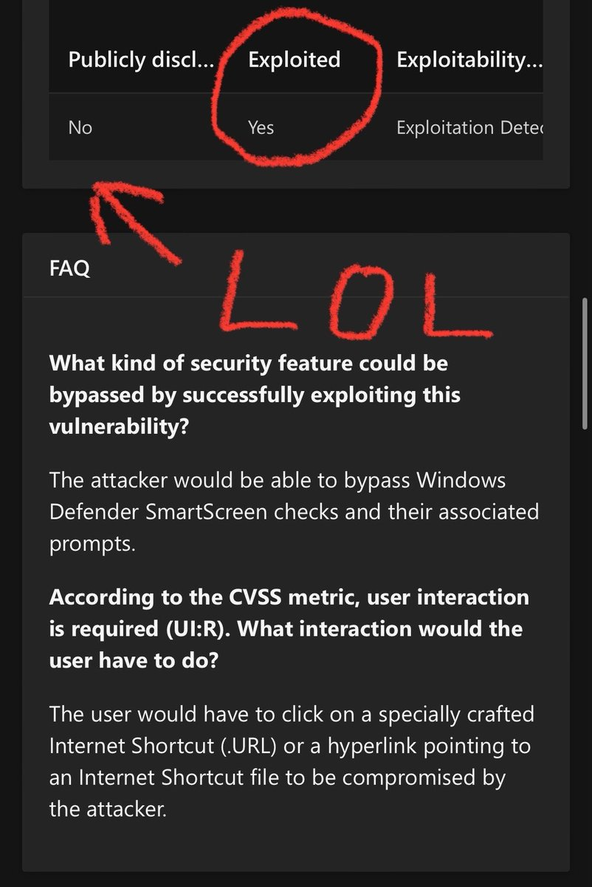</td>
</table></tr>
<table><tr>
<td>Quotes: <code>2</code></td>
<td>Replies: <code>2</code></td>
<td>Retweets: <code>48</code></td>
<td>Favorites: <code>155</code></td>
</tr></table>

---

# 1ZRR4H
**https://twitter.com/1ZRR4H/status/1724822455208784245 _at 2023-11-15, 16:11:33_**
<blockquote>
RT @blackorbird: #Sandworm have breached Danish energy sector companies. 
Very nice timeline analysis.#DigitalForensics
CVE-2023-28771 + CV…
</blockquote>

<table><tr>
<td>Quotes: <code>0</code></td>
<td>Replies: <code>0</code></td>
<td>Retweets: <code>40</code></td>
<td>Favorites: <code>0</code></td>
</tr></table>

---

# TheHackersNews
**https://twitter.com/TheHackersNews/status/1724786822830800972 _at 2023-11-15, 13:49:58_**
<blockquote>
⚠️ New PoC exploit for CVE-2023-46604 flaw in Apache ActiveMQ could let attackers stealthily execute malicious code.

CVSS score: 10.0! Are your servers secure?

Learn more about this critical vulnerability: https://t.co/YbLnOHUQ4K

#cybersecurity #hacking
</blockquote>

* https://thehackernews.com/2023/11/new-poc-exploit-for-apache-activemq.html

<table><tr>
<td>Quotes: <code>5</code></td>
<td>Replies: <code>0</code></td>
<td>Retweets: <code>55</code></td>
<td>Favorites: <code>80</code></td>
</tr></table>

---

# irsdl
**https://twitter.com/irsdl/status/1724706088329638243 _at 2023-11-15, 08:29:09_**
<blockquote>
CVE-2023-36558 "An unauthenticated attacker could bypass validations on Blazor Server forms": https://t.co/lyvwYs11zL

Reported by @blowdart 😊 Not sure we are going to see any post from him though 😱
</blockquote>

* https://msrc.microsoft.com/update-guide/vulnerability/CVE-2023-36558

<table><tr>
<td>Quotes: <code>0</code></td>
<td>Replies: <code>1</code></td>
<td>Retweets: <code>6</code></td>
<td>Favorites: <code>42</code></td>
</tr></table>

---

# blackorbird
**https://twitter.com/blackorbird/status/1724699004016234686 _at 2023-11-15, 08:01:00_**
<blockquote>
#Sandworm have breached Danish energy sector companies. 
Very nice timeline analysis.#DigitalForensics
CVE-2023-28771 + CVE-2023-33009 + CVE-2023-33010
https://t.co/z0eToaVTtQ https://t.co/qikuIqmZTk
</blockquote>

* https://github.com/blackorbird/APT_REPORT/blob/master/Sandworm/sektorcert-angrebet-mod-dansk-kritisk-infrastruktur-tlp-clear-en.pdf

<table><tr>
<td>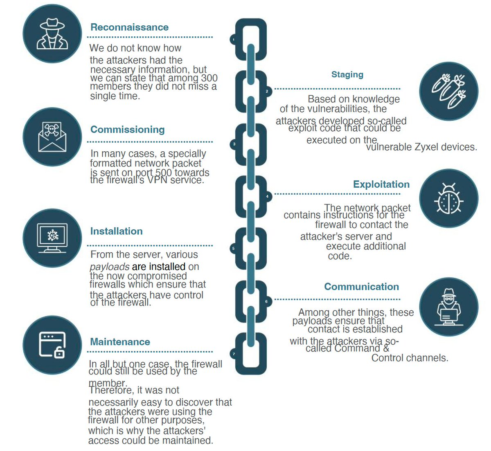</td>
<td>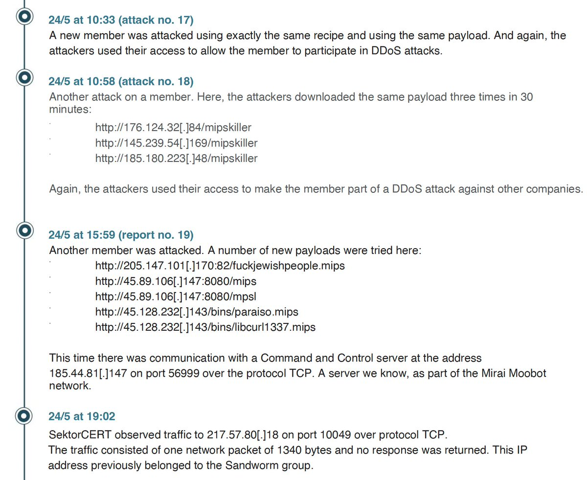</td>
<td>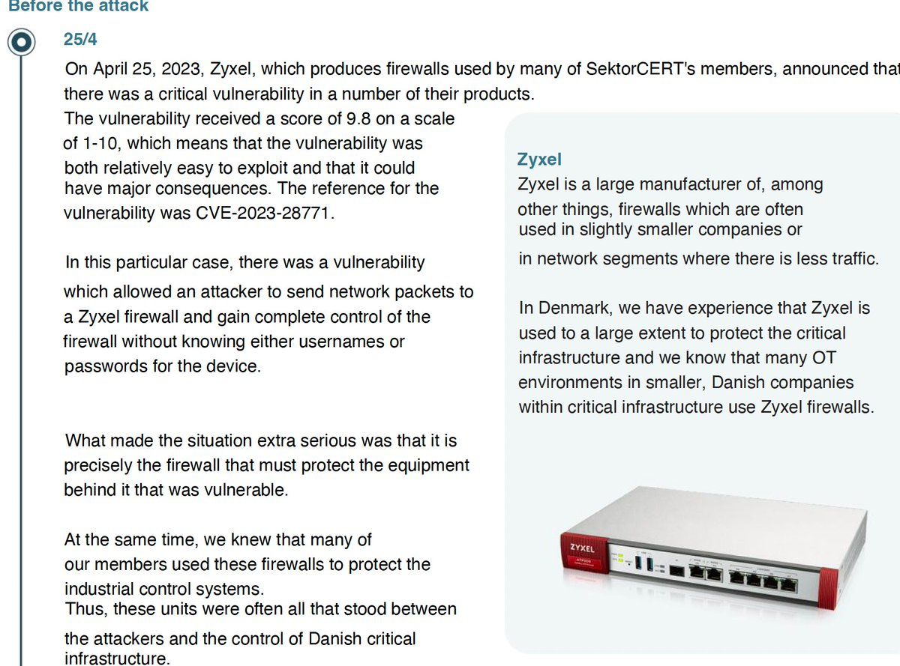</td>
</table></tr>
<table><tr>
<td>Quotes: <code>0</code></td>
<td>Replies: <code>2</code></td>
<td>Retweets: <code>40</code></td>
<td>Favorites: <code>97</code></td>
</tr></table>

---

# TheHackersNews
**https://twitter.com/TheHackersNews/status/1724697332967493949 _at 2023-11-15, 07:54:22_**
<blockquote>
Intel releases critical fixes for a high-severity CPU #vulnerability called "Reptar" (CVE-2023-23583) that affects multi-tenant virtualized environments, allowing privilege escalation, information disclosure and DoS attacks.

🔗 Read more: https://t.co/HeLM8BpKfC

#cybersecurity
</blockquote>

* https://thehackernews.com/2023/11/reptar-new-intel-cpu-vulnerability.html

<table><tr>
<td>Quotes: <code>2</code></td>
<td>Replies: <code>0</code></td>
<td>Retweets: <code>93</code></td>
<td>Favorites: <code>109</code></td>
</tr></table>

---

# piedpiper1616
**https://twitter.com/piedpiper1616/status/1724670872504676383 _at 2023-11-15, 06:09:13_**
<blockquote>
GitHub - tandasat/CVE-2023-36427: Report and exploit of CVE-2023-36427 - https://t.co/nv8eec4Uib
</blockquote>

* https://github.com/tandasat/CVE-2023-36427

<table><tr>
<td>Quotes: <code>0</code></td>
<td>Replies: <code>0</code></td>
<td>Retweets: <code>23</code></td>
<td>Favorites: <code>40</code></td>
</tr></table>

---

# HunterMapping
**https://twitter.com/HunterMapping/status/1724624725358583841 _at 2023-11-15, 03:05:51_**
<blockquote>
🚨Alert🚨CVE-2023-40054
Directory Traversal Remote Code Execution Vulnerability
🔗Hunter:https://t.co/78djgdsP4w
Dorks 👇👇👇
FOFA app="SolarWinds-Network-Management"

📰Refer to  https://t.co/mQ045rgdFz
#infosec #infosecurity #Infosys #Vulnerability #cybersecurity https://t.co/9Hg7Ioqkws
</blockquote>

* https://hunter.how/list?searchValue=web.title%3D%22SolarWinds%20Network%20Management%22%20and%20web.body%3D%22%2FSolarWinds.css%22
* https://www.solarwinds.com/trust-center/security-advisories/cve-2023-40054

<table><tr>
<td>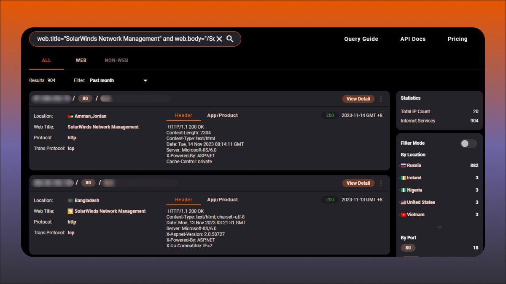</td>
</table></tr>
<table><tr>
<td>Quotes: <code>0</code></td>
<td>Replies: <code>0</code></td>
<td>Retweets: <code>40</code></td>
<td>Favorites: <code>120</code></td>
</tr></table>

---

# wvuuuuuuuuuuuuu
**https://twitter.com/wvuuuuuuuuuuuuu/status/1724538941091557563 _at 2023-11-14, 21:24:58_**
<blockquote>
RT @pdnuclei: Scan for latest CVE-2023-47246 (SysAid Server - Remote Code Execution) using nuclei templates

Template: https://t.co/fS9ACW7…
</blockquote>

<table><tr>
<td>Quotes: <code>0</code></td>
<td>Replies: <code>0</code></td>
<td>Retweets: <code>40</code></td>
<td>Favorites: <code>0</code></td>
</tr></table>

---

# TheHackersNews
**https://twitter.com/TheHackersNews/status/1724498099283059036 _at 2023-11-14, 18:42:41_**
<blockquote>
🔒💻 Researchers found a #vulnerability in AMD's SEV technology, called CacheWarp (CVE-2023-20592), that allows privilege escalation and remote code execution in virtual machines.

📰 Full story: https://t.co/JG86bazXGm

#cybersecurity #informationsecurity
</blockquote>

* https://thehackernews.com/2023/11/cachewarp-attack-new-vulnerability-in.html

<table><tr>
<td>Quotes: <code>1</code></td>
<td>Replies: <code>0</code></td>
<td>Retweets: <code>46</code></td>
<td>Favorites: <code>75</code></td>
</tr></table>

---

# wdormann
**https://twitter.com/wdormann/status/1724489491031695651 _at 2023-11-14, 18:08:28_**
<blockquote>
If you like weird CPU bugs, check out Reptar CVE-2023-23583:
https://t.co/Xj2woGdlvV
Affected Intel CPUs include:
Ice Lake
Rocket Lake
Tiger Lake
Raptor Lake
Alder Lake
Sapphire Rapids
Apply those firmware updates!
https://t.co/FsC0I7D5KC
</blockquote>

* https://lock.cmpxchg8b.com/reptar.html
* https://www.intel.com/content/www/us/en/security-center/advisory/intel-sa-00950.html

<table><tr>
<td>Quotes: <code>1</code></td>
<td>Replies: <code>1</code></td>
<td>Retweets: <code>19</code></td>
<td>Favorites: <code>65</code></td>
</tr></table>

---

# pdnuclei
**https://twitter.com/pdnuclei/status/1724427823174017141 _at 2023-11-14, 14:03:26_**
<blockquote>
Scan for latest CVE-2023-47246 (SysAid Server - Remote Code Execution) using nuclei templates

Template: https://t.co/fS9ACW7xTt

Advisory: https://t.co/8AZNjyQF1O

#hackwithautomation #appsec #bugbounty #cybersecurity https://t.co/Klcq5KiUsK
</blockquote>

* https://github.com/projectdiscovery/nuclei-templates/pull/8625
* https://www.sysaid.com/blog/service-desk/on-premise-software-security-vulnerability-notification

<table><tr>
<td></td>
</table></tr>
<table><tr>
<td>Quotes: <code>0</code></td>
<td>Replies: <code>0</code></td>
<td>Retweets: <code>40</code></td>
<td>Favorites: <code>156</code></td>
</tr></table>

---

# 0xdea
**https://twitter.com/0xdea/status/1724336195776225308 _at 2023-11-14, 07:59:20_**
<blockquote>
#Ubuntu Privilege Escalation bash one-liner using CVE-2023-32629 &amp; CVE-2023-2640

https://t.co/q2kisqzeWb

Nifty #PoC!

https://t.co/to1G6PGc94
</blockquote>

* https://github.com/ThrynSec/CVE-2023-32629-CVE-2023-2640---POC-Escalation
* https://infosec.exchange/@raptor/111407835699201753

<table><tr>
<td>Quotes: <code>4</code></td>
<td>Replies: <code>3</code></td>
<td>Retweets: <code>97</code></td>
<td>Favorites: <code>281</code></td>
</tr></table>

---

# hosselot
**https://twitter.com/hosselot/status/1724106627106603492 _at 2023-11-13, 16:47:06_**
<blockquote>
"Tianfu Cup 2023" Chrome use-after-free vulnerability in WebAudio (CVE-2023-5996 [1497859]) is fixed by ignoring channel count update after the context is closed:
https://t.co/9wZdcSA3FB
</blockquote>

* https://github.com/chromium/chromium/commit/4997f2ba263ff7e1dbc7987dd3665459be14dffe

<table><tr>
<td>Quotes: <code>0</code></td>
<td>Replies: <code>0</code></td>
<td>Retweets: <code>15</code></td>
<td>Favorites: <code>73</code></td>
</tr></table>

---

# the_yellow_fall
**https://twitter.com/the_yellow_fall/status/1723698649249821071 _at 2023-11-12, 13:45:57_**
<blockquote>
CVE-2023-46850: OpenVPN Access Server Flaw Exposes Sensitive Data, RCE Possible
https://t.co/g5ViH1m9YE
#opensource #pentesting #infosec #security #vulnerability #OpenVPN #VPN https://t.co/eN2Z4G1xDV
</blockquote>

* https://securityonline.info/cve-2023-46850-openvpn-access-server-flaw-exposes-sensitive-data-rce-possible/

<table><tr>
<td></td>
</table></tr>
<table><tr>
<td>Quotes: <code>3</code></td>
<td>Replies: <code>1</code></td>
<td>Retweets: <code>74</code></td>
<td>Favorites: <code>232</code></td>
</tr></table>

---

# hack_git
**https://twitter.com/hack_git/status/1723313191763984563 _at 2023-11-11, 12:14:17_**
<blockquote>
CVE-2021-43609

A SQLi in a sort parameter of Spiceworks. The full exploit chain is SQLi -&gt; file read -&gt; RCE.

https://t.co/5DwmM2aoRa

#cve #cybersecurity #infosec https://t.co/1tg4q9qrE7
</blockquote>

* https://github.com/d5sec/CVE-2021-43609-POC

<table><tr>
<td>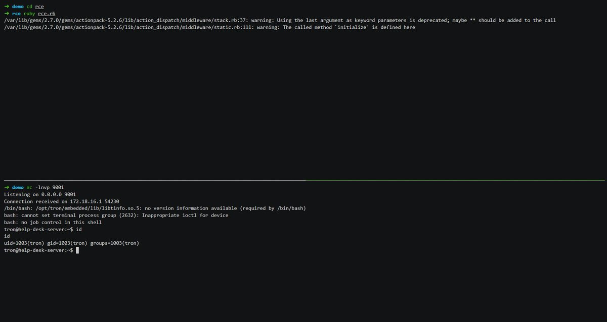</td>
</table></tr>
<table><tr>
<td>Quotes: <code>1</code></td>
<td>Replies: <code>0</code></td>
<td>Retweets: <code>6</code></td>
<td>Favorites: <code>34</code></td>
</tr></table>

---

# stephenfewer
**https://twitter.com/stephenfewer/status/1723126289203110124 _at 2023-11-10, 23:51:36_**
<blockquote>
This week's @metasploit release includes our unauth RCE exploit against Cisco IOS XE (CVE-2023-20198 and CVE-2023-20273), get all the details here: https://t.co/QatqBDxKgL https://t.co/fupSi3EH5l
</blockquote>

* https://www.rapid7.com/blog/post/2023/11/10/metasploit-weekly-wrap-up-35/

<table><tr>
<td>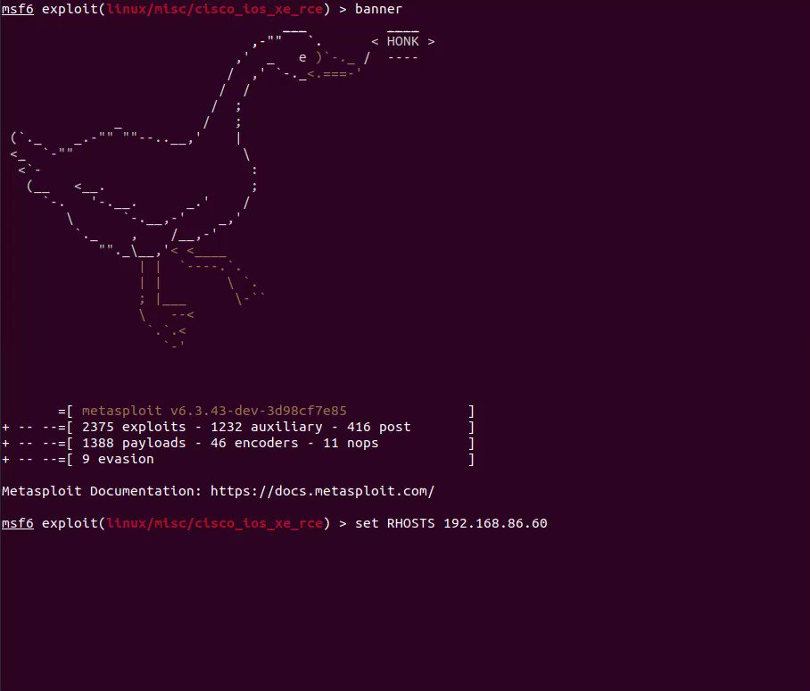</td>
</table></tr>
<table><tr>
<td>Quotes: <code>0</code></td>
<td>Replies: <code>2</code></td>
<td>Retweets: <code>61</code></td>
<td>Favorites: <code>154</code></td>
</tr></table>

---

# wvuuuuuuuuuuuuu
**https://twitter.com/wvuuuuuuuuuuuuu/status/1723054967676702847 _at 2023-11-10, 19:08:11_**
<blockquote>
RT @stephenfewer: We have posted our @rapid7 AttackerKB Analysis for CVE-2023-38548, an NTLM hash leak via the Veeam ONE Web Client. Read a…
</blockquote>

<table><tr>
<td>Quotes: <code>0</code></td>
<td>Replies: <code>0</code></td>
<td>Retweets: <code>38</code></td>
<td>Favorites: <code>0</code></td>
</tr></table>

---

# HunterMapping
**https://twitter.com/HunterMapping/status/1722904053615907116 _at 2023-11-10, 09:08:31_**
<blockquote>
🚨Alert🚨CVE-2023-47246
Zero-Day Vulnerability in SysAid On-Prem Software
🔗 Hunter：https://t.co/0oaEk8qpz1
Dorks 👇👇👇
FOFA   icon_hash="1540720428"
📰refer to  https://t.co/CH4a0AwbVL

#infosec #infosecurity #Infosys #Vulnerability #cybersecurity https://t.co/rq8uz1xGE1
</blockquote>

* https://hunter.how/list?searchValue=favicon_hash%3D%225f30870725d650d7377a134c74f41cfd%22
* https://www.sysaid.com/blog/service-desk/on-premise-software-security-vulnerability-notification

<table><tr>
<td>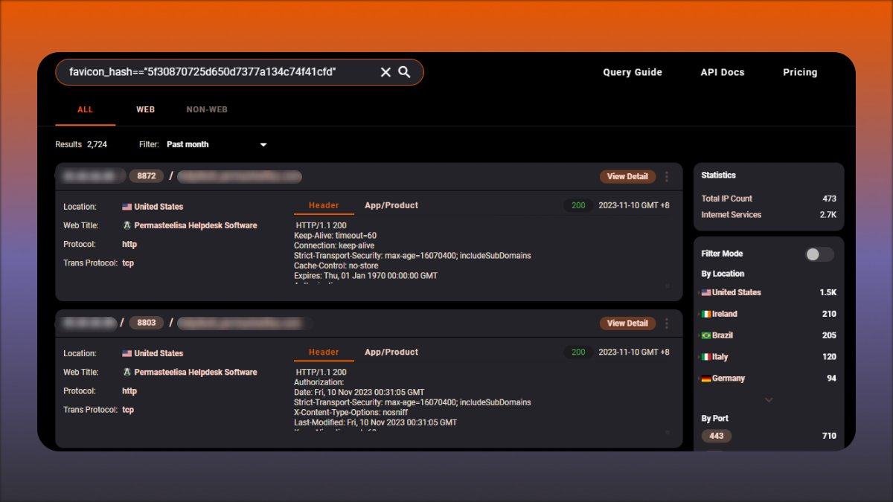</td>
</table></tr>
<table><tr>
<td>Quotes: <code>0</code></td>
<td>Replies: <code>0</code></td>
<td>Retweets: <code>13</code></td>
<td>Favorites: <code>36</code></td>
</tr></table>

---

# _JohnHammond
**https://twitter.com/_JohnHammond/status/1722666437112922300 _at 2023-11-09, 17:24:18_**
<blockquote>
We've recreated a proof-of-concept for the SysAid CVE-2023-47246 remote code execution and compromise -- blog post coming ASAP😜

Big thanks to @gleeda @HuskyHacksMK @DaveKleinatland @calebjstewart and the whole @HuntressLabs crew helping dig into this one! https://t.co/zma48YUrCq
</blockquote>

<table><tr>
<td>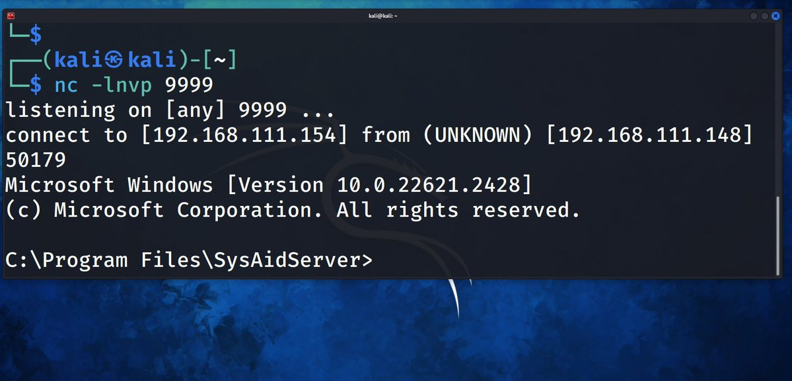</td>
</table></tr>
<table><tr>
<td>Quotes: <code>8</code></td>
<td>Replies: <code>7</code></td>
<td>Retweets: <code>88</code></td>
<td>Favorites: <code>415</code></td>
</tr></table>

---

# catc0n
**https://twitter.com/catc0n/status/1722620847029186594 _at 2023-11-09, 14:23:09_**
<blockquote>
A small bit of potentially good news on the new SysAid 0day (CVE-2023-47246) — it looks like there are only a few hundred servers exposed to the internet. https://t.co/HKLlyqCkFQ
</blockquote>

* https://www.rapid7.com/blog/post/2023/11/09/etr-cve-2023-47246-sysaid-zero-day-vulnerability-exploited-by-lace-tempest/

<table><tr>
<td>Quotes: <code>0</code></td>
<td>Replies: <code>1</code></td>
<td>Retweets: <code>13</code></td>
<td>Favorites: <code>31</code></td>
</tr></table>

---

# Gi7w0rm
**https://twitter.com/Gi7w0rm/status/1722575618225709567 _at 2023-11-09, 11:23:25_**
<blockquote>
New #ZeroDay abused by #Cl0p #ransomware affiliate!
#CVE-2023-47246 is a Path Traversal vulnerability in #SysAid On-Prem software leading to code execution. 
In the observed case it was abused to deploy a #Webshell on the affected system.

https://t.co/CIzGY2gCAk
</blockquote>

* https://www.sysaid.com/blog/service-desk/on-premise-software-security-vulnerability-notification

<table><tr>
<td>Quotes: <code>2</code></td>
<td>Replies: <code>2</code></td>
<td>Retweets: <code>37</code></td>
<td>Favorites: <code>108</code></td>
</tr></table>

---

# TodayCyberNews
**https://twitter.com/TodayCyberNews/status/1722560539547840543 _at 2023-11-09, 10:23:30_**
<blockquote>
☄️ CVE-2023-46604: Apache ActiveMQ RCE

The vulnerability allows arbitrary shell commands to be executed using serialized class types in the OpenWire protocol 👺

 📣 Link to PoC:
https://t.co/jeieLiNsgk

#cve #rce #exploit #Cybersecurity #infosec
</blockquote>

* https://github.com/sule01u/CVE-2023-46604

<table><tr>
<td>Quotes: <code>0</code></td>
<td>Replies: <code>0</code></td>
<td>Retweets: <code>12</code></td>
<td>Favorites: <code>39</code></td>
</tr></table>

---

# 0xor0ne
**https://twitter.com/0xor0ne/status/1722328386280849899 _at 2023-11-08, 19:01:01_**
<blockquote>
Windows privilege escalation through Use-After-Free (UAF) in win32kfull (CVE-2023-21822)
Interesting writeup by Marcin Wiązowski (@thezdi)

https://t.co/Q3j7bxjs44

#exploit #Windows #infosec https://t.co/eCiIS8xueo
</blockquote>

* https://zerodayinitiative.com/blog/2023/8/1/exploiting-a-flaw-in-bitmap-handling-in-windows-user-mode-printer-drivers

<table><tr>
<td>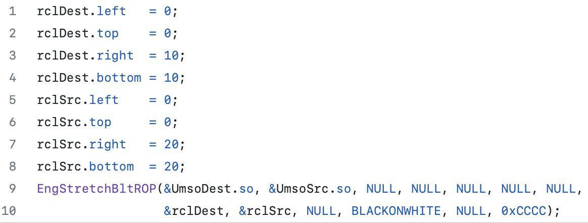</td>
<td>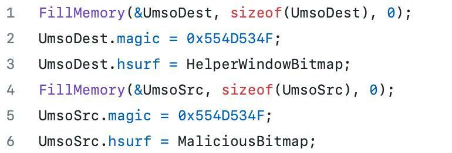</td>
<td>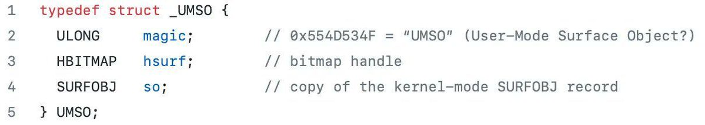</td>
</table></tr>
<table><tr>
<td>Quotes: <code>0</code></td>
<td>Replies: <code>1</code></td>
<td>Retweets: <code>68</code></td>
<td>Favorites: <code>229</code></td>
</tr></table>

---

# USCERT_gov
**https://twitter.com/USCERT_gov/status/1721924719077700072 _at 2023-11-07, 16:16:59_**
<blockquote>
🛡️ @CISAgov added 2 🆕 vulnerabilities to the Known Exploited Vulnerabilities Catalog: CVE-2023-46604: #Apache ActiveMQ Deserialization of Untrusted Data Vulnerability &amp; CVE-2023-29552: Service Location Protocol (SLP) Denial-of-Service Vulnerability. 👉https://t.co/myxOwap1Tf https://t.co/wT815lxT12
</blockquote>

* https://go.dhs.gov/Z3Q

<table><tr>
<td>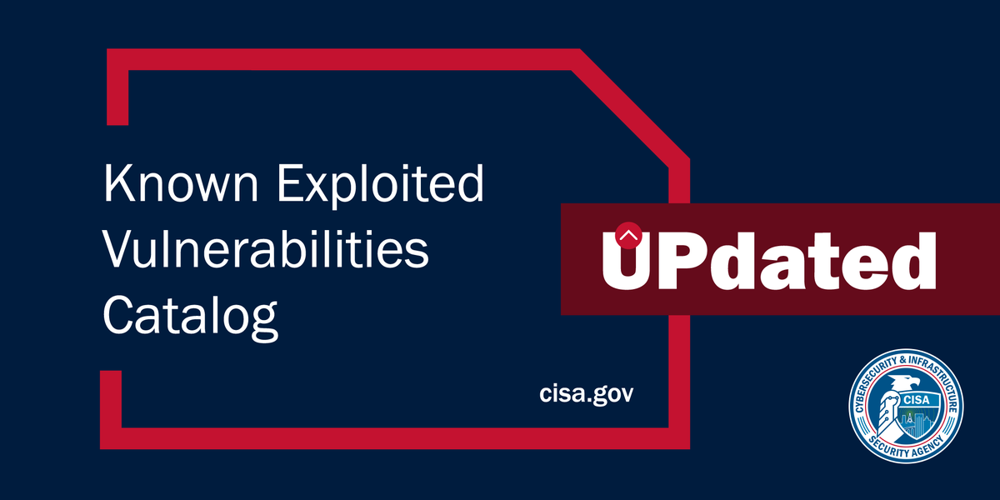</td>
</table></tr>
<table><tr>
<td>Quotes: <code>2</code></td>
<td>Replies: <code>12</code></td>
<td>Retweets: <code>32</code></td>
<td>Favorites: <code>63</code></td>
</tr></table>

---

# tbbhunter
**https://twitter.com/tbbhunter/status/1721293919978143837 _at 2023-11-05, 22:30:25_**
<blockquote>
BlueKeep: A Journey from DoS to RCE (CVE-2019-0708) – MalwareTech

https://t.co/YyF8tqg4tN
</blockquote>

* https://malwaretech.com/2019/09/bluekeep-a-journey-from-dos-to-rce-cve-2019-0708.html

<table><tr>
<td>Quotes: <code>0</code></td>
<td>Replies: <code>0</code></td>
<td>Retweets: <code>12</code></td>
<td>Favorites: <code>57</code></td>
</tr></table>

---

# ddouhine
**https://twitter.com/ddouhine/status/1720561227766628353 _at 2023-11-03, 21:58:57_**
<blockquote>
RT @stephenfewer: We have added 2 modules to the @metasploit pull queue for the recent Cisco IOS XE vulns (CVE-2023-20198 and CVE-2023-2027…
</blockquote>

<table><tr>
<td>Quotes: <code>0</code></td>
<td>Replies: <code>0</code></td>
<td>Retweets: <code>48</code></td>
<td>Favorites: <code>0</code></td>
</tr></table>

---

# 80vul
**https://twitter.com/80vul/status/1720086286676230215 _at 2023-11-02, 14:31:43_**
<blockquote>
CVE-2023-22518 should be noted that it ultimately causes RCE by overwriting the original data. That is, this vulnerability will cause the loss of the original Confluence data when attacked! https://t.co/927diq5K6S
</blockquote>

<table><tr>
<td>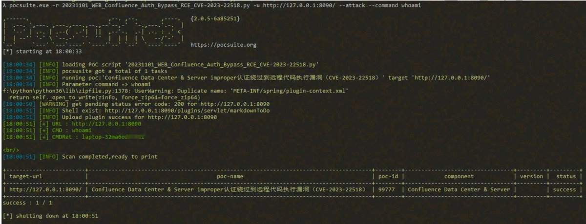</td>
</table></tr>
<table><tr>
<td>Quotes: <code>0</code></td>
<td>Replies: <code>0</code></td>
<td>Retweets: <code>8</code></td>
<td>Favorites: <code>42</code></td>
</tr></table>

---

# chybeta
**https://twitter.com/chybeta/status/1720020520132137382 _at 2023-11-02, 10:10:23_**
<blockquote>
analysis for CVE-2023-22518
confluence unauth RCE

https://t.co/fQrejfcPA6

​https://t.co/eNWmwtqcTh https://t.co/jfvC4CLrdp
</blockquote>

* https://t.zsxq.com/13ZBgTRdQ
* https://t.zsxq.com/13OZcG8KI

<table><tr>
<td></td>
<td></td>
</table></tr>
<table><tr>
<td>Quotes: <code>0</code></td>
<td>Replies: <code>1</code></td>
<td>Retweets: <code>24</code></td>
<td>Favorites: <code>106</code></td>
</tr></table>

---

