# wdormann
**https://twitter.com/wdormann/status/1740496848635437248 _at 2023-12-28, 22:16:00_**
<blockquote>
Microsoft (December 2021): Hey everybody, we've fixed CVE-2021-43890!
Microsoft (December 2023): Hey everybody, CVE-2021-43890 is being exploited in the wild!
The unspoken part (as far as I can tell): Whoops, we accidentally unfixed CVE-2021-43890 in April 2023.
🤦‍♂️ https://t.co/TP7ZRcCBVF
</blockquote>

<table><tr>
<td>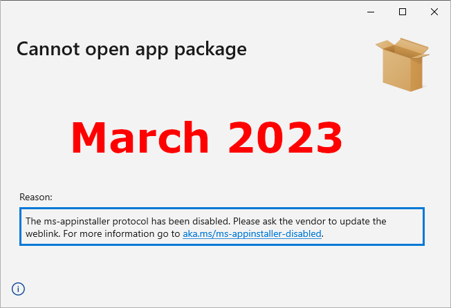</td>
<td>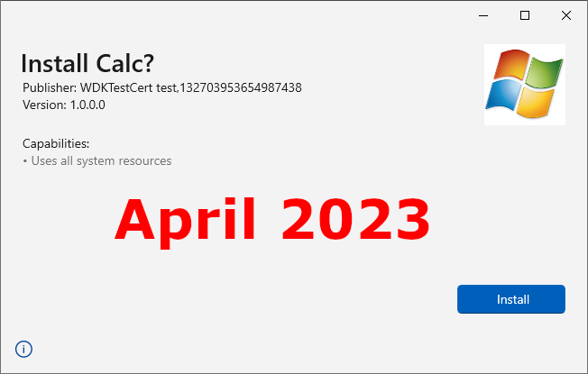</td>
</table></tr>
<table><tr>
<td>Quotes: <code>6</code></td>
<td>Replies: <code>3</code></td>
<td>Retweets: <code>38</code></td>
<td>Favorites: <code>111</code></td>
</tr></table>

---

# TheHackersNews
**https://twitter.com/TheHackersNews/status/1740329294918984166 _at 2023-12-28, 11:10:12_**
<blockquote>
Google Cloud said it observed the exploitation of CVE-2023-7102 targeting high-tech, information technology providers, and government entities, chiefly located in the U.S. and Asia-Pacific regions, no earlier than November 30, 2023.

More: https://t.co/KyFWfDZhyd
</blockquote>

* https://thehackernews.com/2023/12/chinese-hackers-exploited-new-zero-day.html

<table><tr>
<td>Quotes: <code>2</code></td>
<td>Replies: <code>1</code></td>
<td>Retweets: <code>48</code></td>
<td>Favorites: <code>94</code></td>
</tr></table>

---

# ptracesecurity
**https://twitter.com/ptracesecurity/status/1740130468966682635 _at 2023-12-27, 22:00:08_**
<blockquote>
CrushFTP - CVE-2023-43177 Unauthenticated Remote Code Execution https://t.co/l18DBBUj9r  #pentesting #cybersecurity #Infosec https://t.co/tWpYUPl6oS
</blockquote>

* https://blog.projectdiscovery.io/crushftp-rce/

<table><tr>
<td>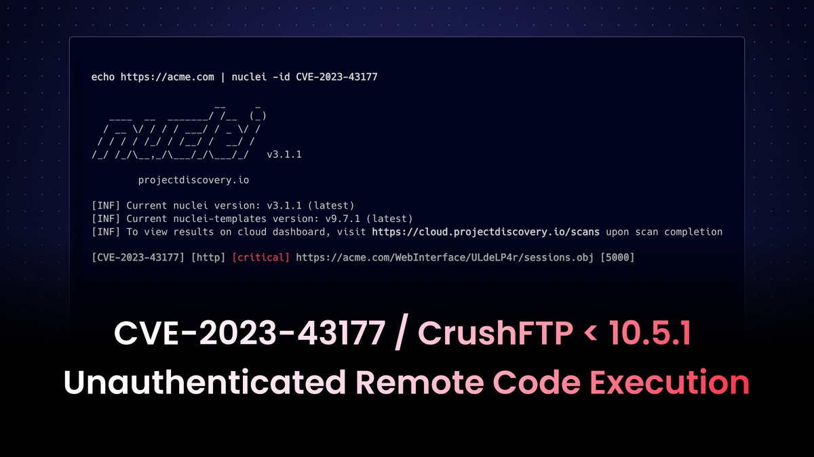</td>
</table></tr>
<table><tr>
<td>Quotes: <code>0</code></td>
<td>Replies: <code>0</code></td>
<td>Retweets: <code>11</code></td>
<td>Favorites: <code>33</code></td>
</tr></table>

---

# TheHackersNews
**https://twitter.com/TheHackersNews/status/1740035041860911146 _at 2023-12-27, 15:40:56_**
<blockquote>
🚨 A new zero-day security flaw discovered in Apache OfBiz ERP system could allow unauthorized access.

CVE-2023-51467 exposes incomplete patch for CVE-2023-49070 with a high CVSS score of 9.8.

Details: https://t.co/o5McGAS3rc

Update now to protect your system!
</blockquote>

* https://thehackernews.com/2023/12/critical-zero-day-in-apache-ofbiz-erp.html

<table><tr>
<td>Quotes: <code>2</code></td>
<td>Replies: <code>5</code></td>
<td>Retweets: <code>64</code></td>
<td>Favorites: <code>99</code></td>
</tr></table>

---

# hackerfantastic
**https://twitter.com/hackerfantastic/status/1740007027131457689 _at 2023-12-27, 13:49:37_**
<blockquote>
RT @TheHackersNews: ⚠️ALERT: Chinese threat actors exploited a new zero-day #vulnerability (CVE-2023-7102) in Barracuda's Email Security Ga…
</blockquote>

<table><tr>
<td>Quotes: <code>0</code></td>
<td>Replies: <code>0</code></td>
<td>Retweets: <code>42</code></td>
<td>Favorites: <code>0</code></td>
</tr></table>

---

# TheHackersNews
**https://twitter.com/TheHackersNews/status/1739988409463308499 _at 2023-12-27, 12:35:38_**
<blockquote>
⚠️ALERT: Chinese threat actors exploited a new zero-day #vulnerability (CVE-2023-7102) in Barracuda's Email Security Gateway (ESG) appliances.

Learn how they deployed a backdoor on select devices.

Read details: https://t.co/KyFWfDZhyd

#cybersecurity #hacking
</blockquote>

* https://thehackernews.com/2023/12/chinese-hackers-exploited-new-zero-day.html

<table><tr>
<td>Quotes: <code>7</code></td>
<td>Replies: <code>1</code></td>
<td>Retweets: <code>122</code></td>
<td>Favorites: <code>167</code></td>
</tr></table>

---

# zapstiko
**https://twitter.com/zapstiko/status/1739360082536911220 _at 2023-12-25, 18:58:54_**
<blockquote>
CVE-2023-3793 - Weaver E-Cology SQL Injection.  Nuclei Template 
#BugBounty #SQLInjection
https://t.co/vkij3yneeL https://t.co/HbFTmEpbV6
</blockquote>

* https://github.com/UltimateSec/ultimaste-nuclei-templates/blob/main/ecology-oa%2Fecology-oa-filedownloadforoutdoc-sqli.yaml

<table><tr>
<td>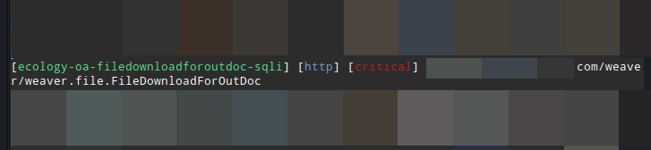</td>
</table></tr>
<table><tr>
<td>Quotes: <code>0</code></td>
<td>Replies: <code>1</code></td>
<td>Retweets: <code>12</code></td>
<td>Favorites: <code>54</code></td>
</tr></table>

---

# nav1n0x
**https://twitter.com/nav1n0x/status/1739357946574745661 _at 2023-12-25, 18:50:24_**
<blockquote>
A less known CVE-2023-3793 - Weaver E-Cology SQL Injection.  Nuclei Template Link Link: https://t.co/jhLMknvhcz 

#BugBounty #SQLInjection https://t.co/LuMIi3CLcE
</blockquote>

* https://github.com/UltimateSec/ultimaste-nuclei-templates/blob/main/ecology-oa/ecology-oa-filedownloadforoutdoc-sqli.yaml

<table><tr>
<td></td>
<td>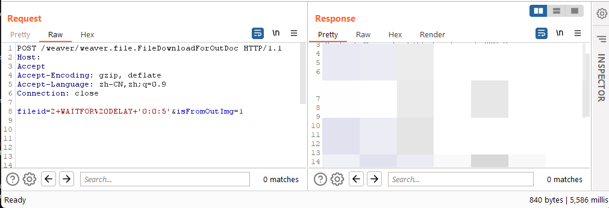</td>
<td>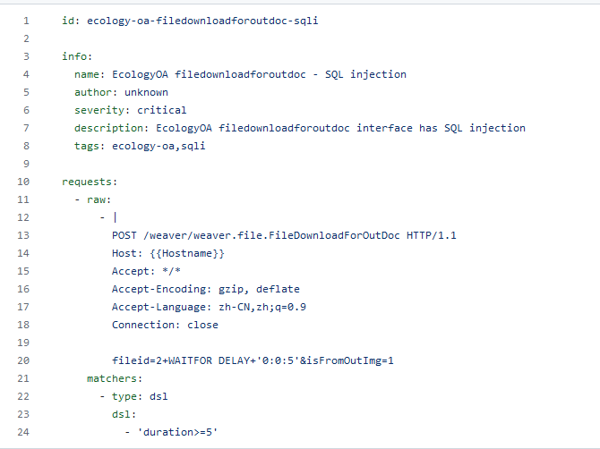</td>
</table></tr>
<table><tr>
<td>Quotes: <code>0</code></td>
<td>Replies: <code>3</code></td>
<td>Retweets: <code>56</code></td>
<td>Favorites: <code>260</code></td>
</tr></table>

---

# Dinosn
**https://twitter.com/Dinosn/status/1739234304868122845 _at 2023-12-25, 10:39:06_**
<blockquote>
Threat Actor “UAC-0099”: Exploiting CVE-2023-38831 Against Ukraine https://t.co/oDNmXHBoaC
</blockquote>

* https://securityonline.info/threat-actor-uac-0099-exploiting-cve-2023-38831-against-ukraine/

<table><tr>
<td>Quotes: <code>0</code></td>
<td>Replies: <code>1</code></td>
<td>Retweets: <code>42</code></td>
<td>Favorites: <code>124</code></td>
</tr></table>

---

# ptracesecurity
**https://twitter.com/ptracesecurity/status/1739088626808463424 _at 2023-12-25, 01:00:13_**
<blockquote>
CVE-2023-42465: SUDO Affected by Stack/Register Flaw, OpenSSH, OpenSSL, and MySQL are Vulnerable https://t.co/jMoNpbApXM #pentesting #Vulnerability #cybersecurity #Infosec https://t.co/4WsDBkiLuG
</blockquote>

* https://securityonline.info/cve-2023-42465-sudo-affected-by-stack-register-flaw-openssh-openssl-and-mysql-are-vulnerable/

<table><tr>
<td>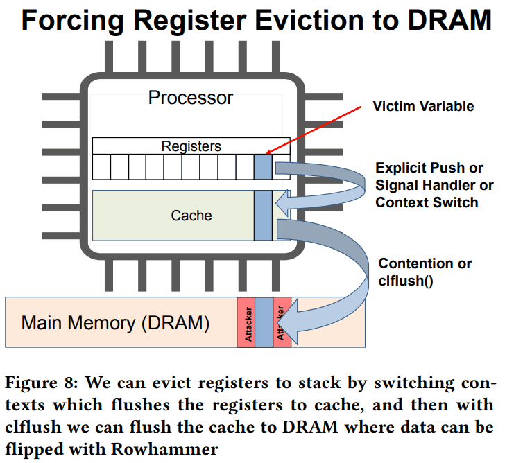</td>
</table></tr>
<table><tr>
<td>Quotes: <code>0</code></td>
<td>Replies: <code>2</code></td>
<td>Retweets: <code>28</code></td>
<td>Favorites: <code>96</code></td>
</tr></table>

---

# pdnuclei
**https://twitter.com/pdnuclei/status/1739024531355001267 _at 2023-12-24, 20:45:32_**
<blockquote>
RT @DhiyaneshDK: #KEV 🔥 CVE @pdnuclei  Template 

• CVE-2023-41265 - Qlik Sense Enterprise - HTTP Request Smuggling [critical] 🚨
• CVE-2023…
</blockquote>

<table><tr>
<td>Quotes: <code>0</code></td>
<td>Replies: <code>0</code></td>
<td>Retweets: <code>31</code></td>
<td>Favorites: <code>0</code></td>
</tr></table>

---

# CyberWarship
**https://twitter.com/CyberWarship/status/1738929525424087496 _at 2023-12-24, 14:28:01_**
<blockquote>
"Abusing .NET Core CLR Diagnostic Features (+ CVE-2023-33127)"

#infosec #pentest #redteam 
https://t.co/slxKLGIM0U https://t.co/MFd6R4vUWC
</blockquote>

* https://bohops.com/2023/11/27/abusing-net-core-clr-diagnostic-features-cve-2023-33127/

<table><tr>
<td>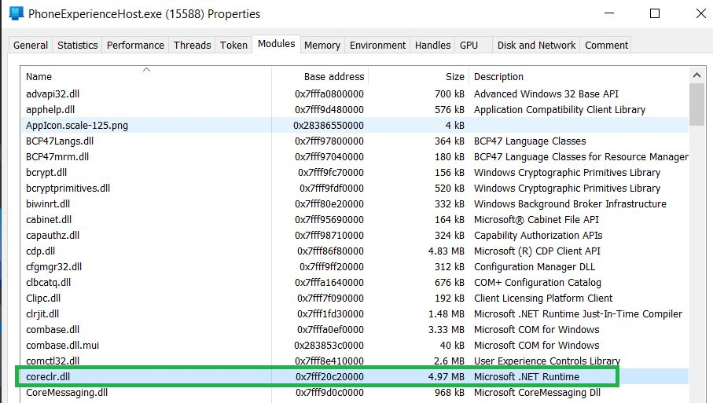</td>
</table></tr>
<table><tr>
<td>Quotes: <code>0</code></td>
<td>Replies: <code>0</code></td>
<td>Retweets: <code>16</code></td>
<td>Favorites: <code>60</code></td>
</tr></table>

---

# MarcVlp
**https://twitter.com/MarcVlp/status/1738900605463081039 _at 2023-12-24, 12:33:06_**
<blockquote>
⚠️Una vulnerabilidad cŕítica en Outlook (CVE-2023-35628) de ejecución remota de código (RCE) afecta a la plataforma Microsoft Windows MSHTML, con una puntuación de gravedad de (CVSS) de 8,1 sobre 10.

Esta vulnerabilidad es particularmente preocupante porque puede explotarse sin… https://t.co/IY58eqmlp7
</blockquote>

<table><tr>
<td>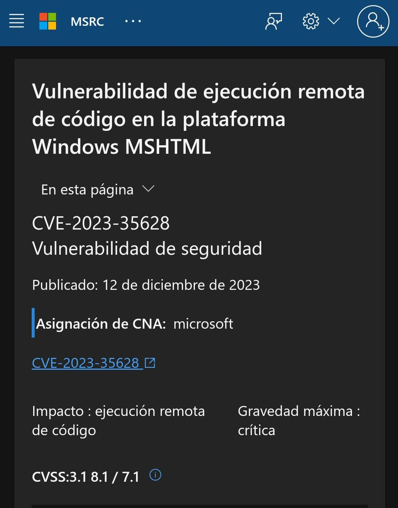</td>
</table></tr>
<table><tr>
<td>Quotes: <code>2</code></td>
<td>Replies: <code>2</code></td>
<td>Retweets: <code>112</code></td>
<td>Favorites: <code>242</code></td>
</tr></table>

---

# 0xor0ne
**https://twitter.com/0xor0ne/status/1738839474119852081 _at 2023-12-24, 08:30:11_**
<blockquote>
A few years old but sill a great series for learning Linux kernel exploitation
CVE-2017-11176 (UaF in mq_notify function)
Credits @LexfoSecurite

https://t.co/9dvQOGgpeG
https://t.co/JsvFkbr9iQ
https://t.co/PANcb1P6In
https://t.co/2qEPjbier7

#Linux #kernel #infosec https://t.co/L0nsDvJPdM
</blockquote>

* https://blog.lexfo.fr/cve-2017-11176-linux-kernel-exploitation-part1.html
* https://blog.lexfo.fr/cve-2017-11176-linux-kernel-exploitation-part2.html
* https://blog.lexfo.fr/cve-2017-11176-linux-kernel-exploitation-part3.html
* https://blog.lexfo.fr/cve-2017-11176-linux-kernel-exploitation-part4.html

<table><tr>
<td>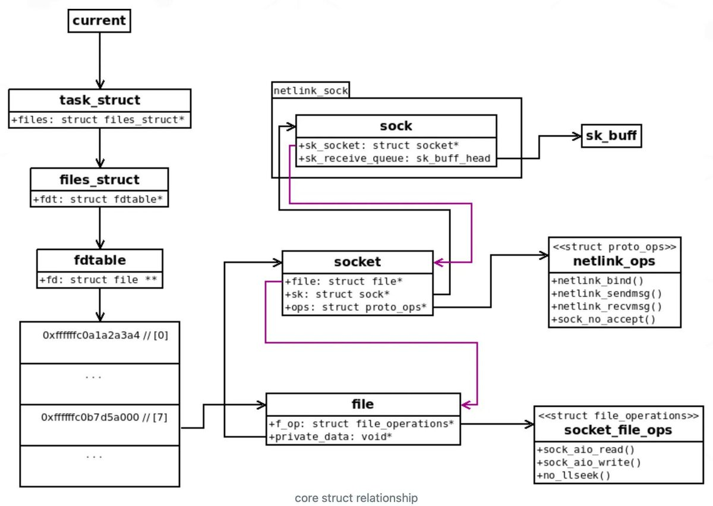</td>
<td>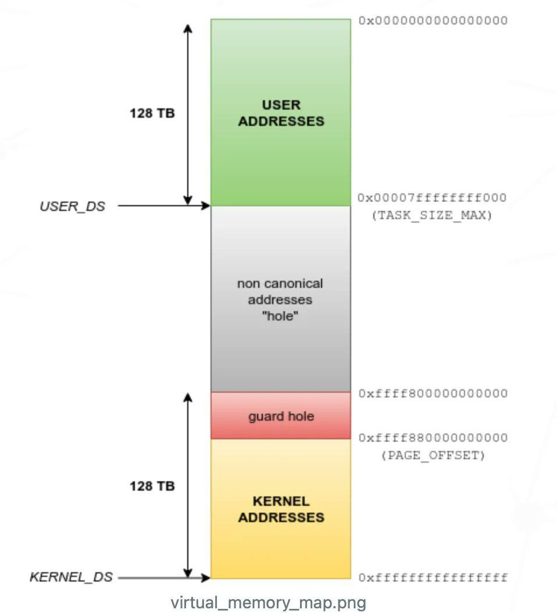</td>
<td>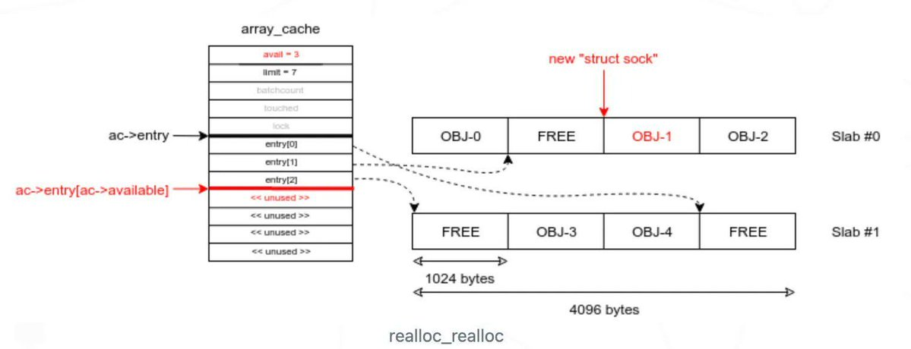</td>
<td>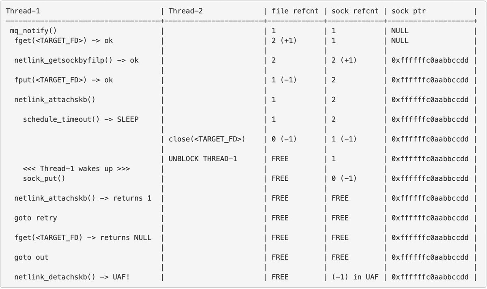</td>
</table></tr>
<table><tr>
<td>Quotes: <code>0</code></td>
<td>Replies: <code>1</code></td>
<td>Retweets: <code>66</code></td>
<td>Favorites: <code>317</code></td>
</tr></table>

---

# piedpiper1616
**https://twitter.com/piedpiper1616/status/1738790572431974482 _at 2023-12-24, 05:15:52_**
<blockquote>
RT @S0ufi4n3: Potentiel shitstorm ahead:

CVE-2023-51385: OpenSSH OS command injection vulnerability.

Merry Christmas! 

https://t.co/RY6s…
</blockquote>

<table><tr>
<td>Quotes: <code>0</code></td>
<td>Replies: <code>0</code></td>
<td>Retweets: <code>135</code></td>
<td>Favorites: <code>0</code></td>
</tr></table>

---

# cyber_advising
**https://twitter.com/cyber_advising/status/1738732185371259158 _at 2023-12-24, 01:23:51_**
<blockquote>
CVE-2023-51385: OpenSSH before 9.6, OS command injection might occur if a user name or host name has shell metacharacters, ...
https://t.co/yeBGsdMD0X https://t.co/SCrciIStz5
</blockquote>

* https://vin01.github.io/piptagole/ssh/security/openssh/libssh/remote-code-execution/2023/12/20/openssh-proxycommand-libssh-rce.html

<table><tr>
<td>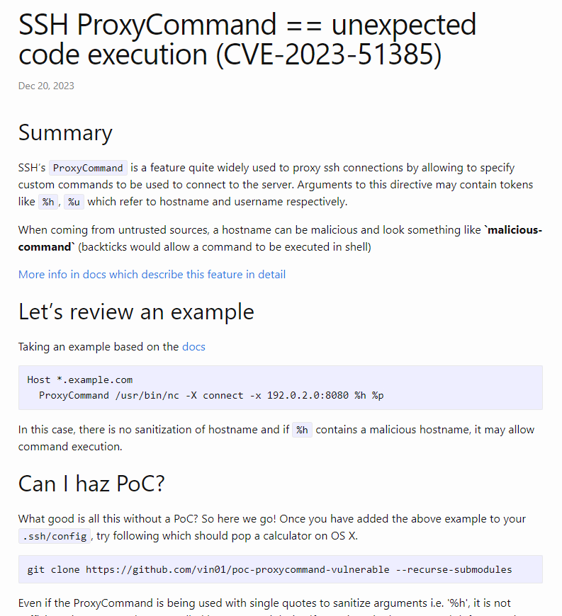</td>
</table></tr>
<table><tr>
<td>Quotes: <code>2</code></td>
<td>Replies: <code>1</code></td>
<td>Retweets: <code>134</code></td>
<td>Favorites: <code>325</code></td>
</tr></table>

---

# kmkz_security
**https://twitter.com/kmkz_security/status/1738693241296375994 _at 2023-12-23, 22:49:06_**
<blockquote>
RT @hackerfantastic: Someone has posted a PoC for CVE-2023-51385 (client-side ssh RCE when using ProxyCommand) https://t.co/YKdeCexOlC
</blockquote>

* https://vin01.github.io/piptagole/ssh/security/openssh/libssh/remote-code-execution/2023/12/20/openssh-proxycommand-libssh-rce.html

<table><tr>
<td>Quotes: <code>0</code></td>
<td>Replies: <code>0</code></td>
<td>Retweets: <code>34</code></td>
<td>Favorites: <code>0</code></td>
</tr></table>

---

# hackerfantastic
**https://twitter.com/hackerfantastic/status/1738688588609380786 _at 2023-12-23, 22:30:37_**
<blockquote>
Someone has posted a PoC for CVE-2023-51385 (client-side ssh RCE when using ProxyCommand) https://t.co/YKdeCexOlC
</blockquote>

* https://vin01.github.io/piptagole/ssh/security/openssh/libssh/remote-code-execution/2023/12/20/openssh-proxycommand-libssh-rce.html

<table><tr>
<td>Quotes: <code>1</code></td>
<td>Replies: <code>2</code></td>
<td>Retweets: <code>34</code></td>
<td>Favorites: <code>77</code></td>
</tr></table>

---

# Dinosn
**https://twitter.com/Dinosn/status/1738646955759206699 _at 2023-12-23, 19:45:11_**
<blockquote>
RT @LiveOverflow: "A Vulnerability to Hack The World" - CVE-2023-4863

The start of a mini series digging into the recent WebP vulnerabilit…
</blockquote>

<table><tr>
<td>Quotes: <code>0</code></td>
<td>Replies: <code>0</code></td>
<td>Retweets: <code>99</code></td>
<td>Favorites: <code>0</code></td>
</tr></table>

---

# Dinosn
**https://twitter.com/Dinosn/status/1738646358821675019 _at 2023-12-23, 19:42:49_**
<blockquote>
RT @wugeej: RCE in Sophos Firewall (CVE-2022-1040) 
Cc @Dinosn @ExWareLabs 

curl -sk -H "X-Requested-With: XMLHttpRequest" -X POST 'hxxps:…
</blockquote>

<table><tr>
<td>Quotes: <code>0</code></td>
<td>Replies: <code>0</code></td>
<td>Retweets: <code>138</code></td>
<td>Favorites: <code>0</code></td>
</tr></table>

---

# S0ufi4n3
**https://twitter.com/S0ufi4n3/status/1738614180033265808 _at 2023-12-23, 17:34:57_**
<blockquote>
Potentiel shitstorm ahead:

CVE-2023-51385: OpenSSH OS command injection vulnerability.

Merry Christmas! 

https://t.co/RY6sEJf7dG
</blockquote>

* https://vin01.github.io/piptagole/ssh/security/openssh/libssh/remote-code-execution/2023/12/20/openssh-proxycommand-libssh-rce.html

<table><tr>
<td>Quotes: <code>7</code></td>
<td>Replies: <code>7</code></td>
<td>Retweets: <code>126</code></td>
<td>Favorites: <code>461</code></td>
</tr></table>

---

# hackerfantastic
**https://twitter.com/hackerfantastic/status/1738599670002094243 _at 2023-12-23, 16:37:17_**
<blockquote>
RT @the_yellow_fall: CVE-2023-51385: OpenSSH OS command injection vulnerability
The vulnerability is tracked under the CVE identifier CVE-2…
</blockquote>

<table><tr>
<td>Quotes: <code>0</code></td>
<td>Replies: <code>0</code></td>
<td>Retweets: <code>116</code></td>
<td>Favorites: <code>0</code></td>
</tr></table>

---

# Dinosn
**https://twitter.com/Dinosn/status/1738536707002155283 _at 2023-12-23, 12:27:06_**
<blockquote>
CVE-2023-50254 – Deepin-Reader Flaw: A Shortcut to Remote Command Execution https://t.co/FT5ogqhIT6
</blockquote>

* https://securityonline.info/cve-2023-50254-deepin-reader-flaw-a-shortcut-to-remote-command-execution/

<table><tr>
<td>Quotes: <code>1</code></td>
<td>Replies: <code>0</code></td>
<td>Retweets: <code>11</code></td>
<td>Favorites: <code>38</code></td>
</tr></table>

---

# e11i0t_4lders0n
**https://twitter.com/e11i0t_4lders0n/status/1738451066281398490 _at 2023-12-23, 06:46:47_**
<blockquote>
=Mass exploitation of Sitecore remote code execution vulnerability (CVE-2023-35813).

1-Shodan Dork : title:"Sitecore"
CLI Command: shodan download --limit -1 sitecore 'title:"Sitecore"'

#bugbounty #bugbountytip #bugbountytips https://t.co/AeuXpNtE6a
</blockquote>

<table><tr>
<td></td>
</table></tr>
<table><tr>
<td>Quotes: <code>0</code></td>
<td>Replies: <code>2</code></td>
<td>Retweets: <code>19</code></td>
<td>Favorites: <code>107</code></td>
</tr></table>

---

# Dinosn
**https://twitter.com/Dinosn/status/1738126352203550857 _at 2023-12-22, 09:16:29_**
<blockquote>
CVE-2023-42465: SUDO Affected by Stack/Register Flaw, OpenSSH, OpenSSL, and MySQL are Vulnerable https://t.co/QTLK7q6jUY
</blockquote>

* https://securityonline.info/cve-2023-42465-sudo-affected-by-stack-register-flaw-openssh-openssl-and-mysql-are-vulnerable/

<table><tr>
<td>Quotes: <code>1</code></td>
<td>Replies: <code>2</code></td>
<td>Retweets: <code>73</code></td>
<td>Favorites: <code>184</code></td>
</tr></table>

---

# elhackernet
**https://twitter.com/elhackernet/status/1737867019922657606 _at 2023-12-21, 16:06:00_**
<blockquote>
Cadena de vulnerabilidades lleva a un RCE 0-click en Microsoft Outlook
https://t.co/HwswtTWSOM
🔊Atacante enviando un recordatorio por e-mail con una notificación sonora especificada como ruta, provoca el envío del hash Net-NTLMv2

⏩CVE-2023-36710
https://t.co/sp8Zof9cCp https://t.co/fElAaZAkwd
</blockquote>

* https://www.akamai.com/blog/security-research/chaining-vulnerabilities-to-achieve-rce-part-two
* https://www.securityweek.com/outlook-plays-attacker-tunes-vulnerability-chain-leading-to-zero-click-rce/

<table><tr>
<td></td>
</table></tr>
<table><tr>
<td>Quotes: <code>1</code></td>
<td>Replies: <code>0</code></td>
<td>Retweets: <code>52</code></td>
<td>Favorites: <code>100</code></td>
</tr></table>

---

# kmkz_security
**https://twitter.com/kmkz_security/status/1737790135125651911 _at 2023-12-21, 11:00:29_**
<blockquote>
RT @CyberWarship: "Exploit &amp; Debug Looney Tunables CVE-2023-4911 Local Privilege Escalation in the glibc's https://t.co/ekQ24oYJ6a"

#infos…
</blockquote>

* http://ld.so

<table><tr>
<td>Quotes: <code>0</code></td>
<td>Replies: <code>0</code></td>
<td>Retweets: <code>31</code></td>
<td>Favorites: <code>0</code></td>
</tr></table>

---

# CyberWarship
**https://twitter.com/CyberWarship/status/1737782217907015919 _at 2023-12-21, 10:29:01_**
<blockquote>
"Exploit &amp; Debug Looney Tunables CVE-2023-4911 Local Privilege Escalation in the glibc's https://t.co/ekQ24oYJ6a"

#infosec #pentest #redteam 
https://t.co/9ISAD12O8O https://t.co/q7qgdQCIGS
</blockquote>

* http://ld.so
* https://flex0geek.blogspot.com/2023/11/exploit-debug-looney-tunables-cve-2023.html

<table><tr>
<td>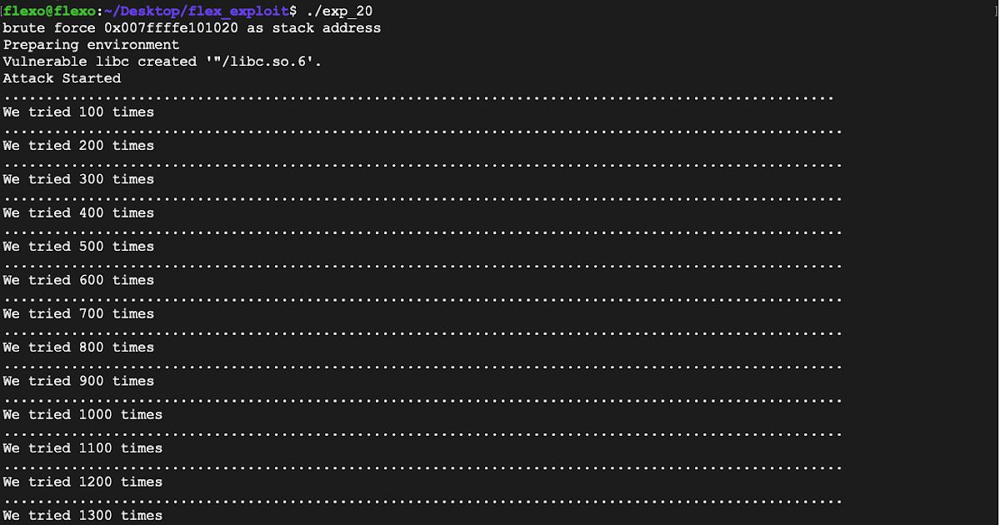</td>
</table></tr>
<table><tr>
<td>Quotes: <code>0</code></td>
<td>Replies: <code>0</code></td>
<td>Retweets: <code>31</code></td>
<td>Favorites: <code>58</code></td>
</tr></table>

---

# TheMsterDoctor1
**https://twitter.com/TheMsterDoctor1/status/1737777531925745729 _at 2023-12-21, 10:10:24_**
<blockquote>
ofbiz-CVE-2023-49070-RCE-POC
This is a pre-auth RCE POC For CVE-2023-49070 which affected Apache ofbiz applications &lt; 18.12.10 due to xml-rpc java deserialzation bug. 

Repo: https://t.co/3ajtHTEpPx https://t.co/hl3B7GkXdw
</blockquote>

* https://github.com/abdoghazy2015/ofbiz-CVE-2023-49070-RCE-POC

<table><tr>
<td>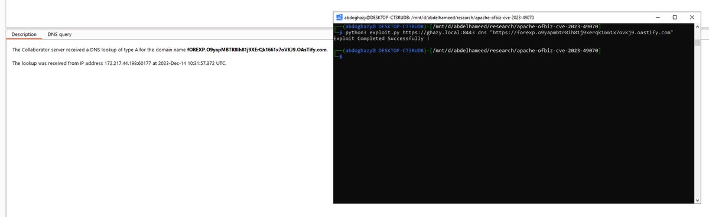</td>
<td>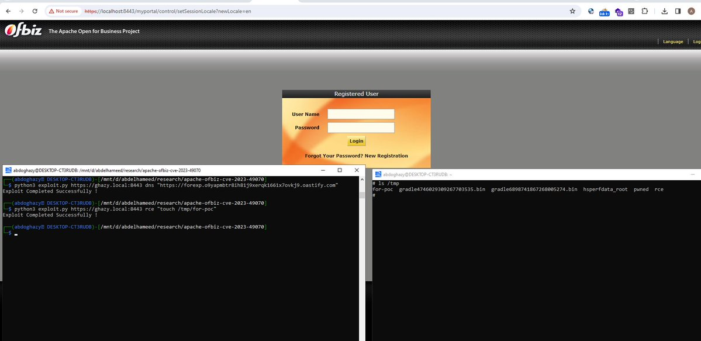</td>
</table></tr>
<table><tr>
<td>Quotes: <code>0</code></td>
<td>Replies: <code>0</code></td>
<td>Retweets: <code>9</code></td>
<td>Favorites: <code>67</code></td>
</tr></table>

---

# TheHackersNews
**https://twitter.com/TheHackersNews/status/1737735354214670418 _at 2023-12-21, 07:22:48_**
<blockquote>
🚨 💻 Beware of phishing emails with invoice-themed attachments! Attackers are using an old Office #vulnerability (CVE-2017-11882) to spread the Agent Tesla #malware and steal sensitive information.

Learn more: https://t.co/pBdCAqNpUl

#cybersecurity #hacking
</blockquote>

* https://thehackernews.com/2023/12/hackers-exploiting-old-ms-excel.html

<table><tr>
<td>Quotes: <code>1</code></td>
<td>Replies: <code>1</code></td>
<td>Retweets: <code>68</code></td>
<td>Favorites: <code>110</code></td>
</tr></table>

---

# TheHackersNews
**https://twitter.com/TheHackersNews/status/1737679769343250566 _at 2023-12-21, 03:41:56_**
<blockquote>
Attention Chrome users!

Urgent security updates released for #Chrome due to a zero-day flaw (CVE-2023-7024) in WebRTC.

This #vulnerability:
- Actively exploited
- May cause crashes or code execution

Details: https://t.co/WsdhXVP4bS

Update your browser now!
</blockquote>

* https://thehackernews.com/2023/12/urgent-new-chrome-zero-day.html

<table><tr>
<td>Quotes: <code>8</code></td>
<td>Replies: <code>5</code></td>
<td>Retweets: <code>160</code></td>
<td>Favorites: <code>239</code></td>
</tr></table>

---

# wallet_guard
**https://twitter.com/wallet_guard/status/1737650186644607284 _at 2023-12-21, 01:44:23_**
<blockquote>
🚨 CHROME ZERO-DAY: CVE-2023-7024

Update your Chrome browsers (Brave, Opera, Edge, etc.) now! Google has released emergency updates to address this zero-day vulnerability.

Share &amp; stay safe! 🫡 https://t.co/yyN6kjFSFM
</blockquote>

<table><tr>
<td></td>
</table></tr>
<table><tr>
<td>Quotes: <code>20</code></td>
<td>Replies: <code>12</code></td>
<td>Retweets: <code>140</code></td>
<td>Favorites: <code>269</code></td>
</tr></table>

---

# hosselot
**https://twitter.com/hosselot/status/1737577567547199579 _at 2023-12-20, 20:55:49_**
<blockquote>
Google Chrome In-The-Wild Heap buffer overflow in WebRTC (CVE-2023-7024 [1513170]) happens due to "WebRtcAudioSink()" function allowing invalid configuration during setting format:
https://t.co/rOgJJH500p
</blockquote>

* https://github.com/chromium/chromium/commit/340b7e300d380460a039a07b90f62d1febae9da5

<table><tr>
<td>Quotes: <code>0</code></td>
<td>Replies: <code>0</code></td>
<td>Retweets: <code>7</code></td>
<td>Favorites: <code>49</code></td>
</tr></table>

---

# maddiestone
**https://twitter.com/maddiestone/status/1737573842649043270 _at 2023-12-20, 20:41:01_**
<blockquote>
💪🏼 Yesterday @_clem1 and @vladhiewsha discovered and reported a new ITW 0-day to the Chrome team. TODAY, 1 day later, Chrome has a fix out to protect users!!! Thank you, Chrome! CVE-2023-7024

https://t.co/2tkx0Zc9pf
</blockquote>

* https://chromereleases.googleblog.com/2023/12/stable-channel-update-for-desktop_20.html

<table><tr>
<td>Quotes: <code>4</code></td>
<td>Replies: <code>6</code></td>
<td>Retweets: <code>55</code></td>
<td>Favorites: <code>230</code></td>
</tr></table>

---

# kmkz_security
**https://twitter.com/kmkz_security/status/1737570510269985242 _at 2023-12-20, 20:27:46_**
<blockquote>
RT @maddiestone: 🎁 New RCA up from @binjo of Mandiant FLARE on CVE-2023-36033, an EoP in Windows DWM Core Library that was patched in Novem…
</blockquote>

<table><tr>
<td>Quotes: <code>0</code></td>
<td>Replies: <code>0</code></td>
<td>Retweets: <code>69</code></td>
<td>Favorites: <code>0</code></td>
</tr></table>

---

# maddiestone
**https://twitter.com/maddiestone/status/1737567252071973027 _at 2023-12-20, 20:14:49_**
<blockquote>
🎁 New RCA up from @binjo of Mandiant FLARE on CVE-2023-36033, an EoP in Windows DWM Core Library that was patched in November! 

https://t.co/LUQUGh7fzU https://t.co/XJc9pOt3Ug
</blockquote>

* https://googleprojectzero.github.io/0days-in-the-wild/0day-RCAs/2023/CVE-2023-36033.html

<table><tr>
<td>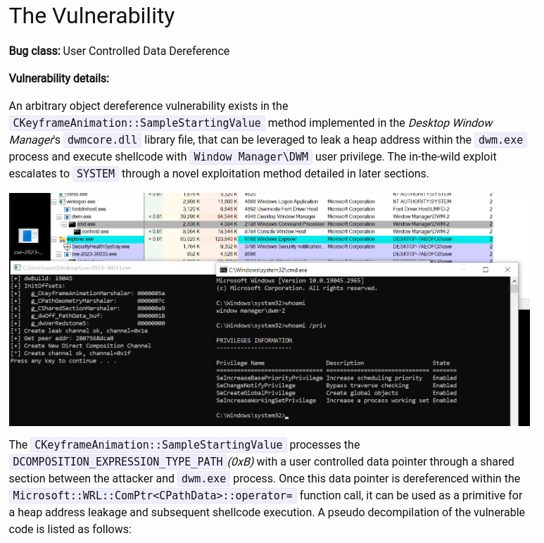</td>
</table></tr>
<table><tr>
<td>Quotes: <code>2</code></td>
<td>Replies: <code>4</code></td>
<td>Retweets: <code>69</code></td>
<td>Favorites: <code>219</code></td>
</tr></table>

---

# HunterMapping
**https://twitter.com/HunterMapping/status/1737394026259877982 _at 2023-12-20, 08:46:29_**
<blockquote>
🚨Alert🚨CVE-2023-35384&amp;CVE-2023-36710: 
0-click RCE against Outlook

🔗Hunter:https://t.co/D4e39xFXWj

Dorks 👇👇👇
FOFA  app="Microsoft-Outlook"
SHODAN  http.component:"Outlook Web App"

📰A deep-dive from @nachoskrnl https://t.co/cbjmcyuCpG
📰Refer to https://t.co/VVNCOz1adJ https://t.co/AC2lSio3GI
</blockquote>

* https://hunter.how/list?searchValue=product.name%3D%22Outlook%20Web%20App%22
* https://twitter.com/nachoskrnl/status/1736783878700892253
* https://www.akamai.com/blog/security-research/2023/dec/chaining-vulnerabilities-to-achieve-rce-part-one

<table><tr>
<td>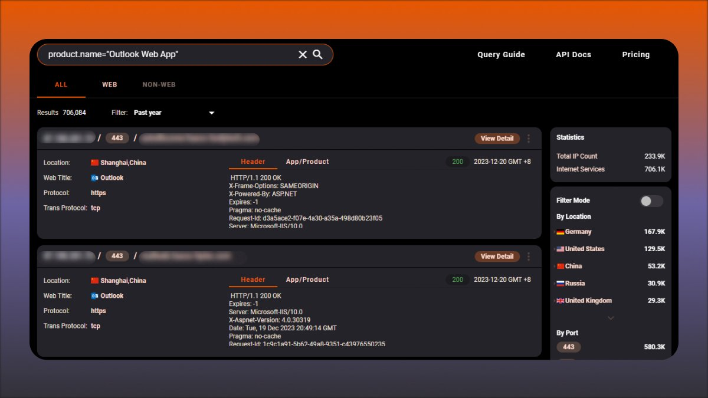</td>
</table></tr>
<table><tr>
<td>Quotes: <code>0</code></td>
<td>Replies: <code>0</code></td>
<td>Retweets: <code>22</code></td>
<td>Favorites: <code>60</code></td>
</tr></table>

---

# Dinosn
**https://twitter.com/Dinosn/status/1737338799489716273 _at 2023-12-20, 05:07:02_**
<blockquote>
Apache Struts (CVE-2023-50164) RCE Vulnerability Affects some Cisco Products https://t.co/5P7tEtTTYd
</blockquote>

* https://securityonline.info/apache-struts-cve-2023-50164-rce-vulnerability-affects-some-cisco-products/

<table><tr>
<td>Quotes: <code>1</code></td>
<td>Replies: <code>0</code></td>
<td>Retweets: <code>20</code></td>
<td>Favorites: <code>76</code></td>
</tr></table>

---

# wdormann
**https://twitter.com/wdormann/status/1737146147414688103 _at 2023-12-19, 16:21:30_**
<blockquote>
Yeah, so this works just fine!
Unauthenticated RCE on SharePoint as the SharePoint Admin user.
But just to be clear, CVE-2023-24955 and CVE-2023-29357 patches were released in May and June of this year, respectively.
If you don't have those patches installed by now, well... https://t.co/Ll3qaL16Gu
</blockquote>

<table><tr>
<td>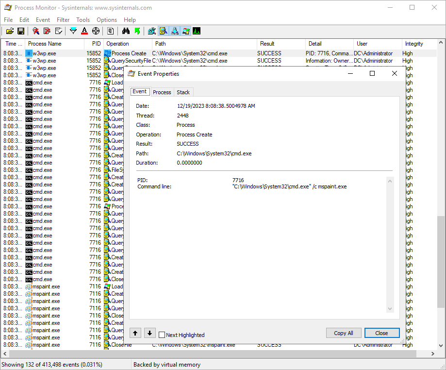</td>
</table></tr>
<table><tr>
<td>Quotes: <code>0</code></td>
<td>Replies: <code>2</code></td>
<td>Retweets: <code>35</code></td>
<td>Favorites: <code>100</code></td>
</tr></table>

---

# TheHackersNews
**https://twitter.com/TheHackersNews/status/1737004487682760719 _at 2023-12-19, 06:58:36_**
<blockquote>
🚨 Threat Alert: The notorious 8220 Gang is exploiting a high-severity flaw (CVE-2020-14883) in #Oracle WebLogic Server to spread malware.

Find details here: https://t.co/msIchXPsrq

#cybersecurity #hacking
</blockquote>

* https://thehackernews.com/2023/12/8220-gang-exploiting-oracle-weblogic.html

<table><tr>
<td>Quotes: <code>1</code></td>
<td>Replies: <code>0</code></td>
<td>Retweets: <code>30</code></td>
<td>Favorites: <code>67</code></td>
</tr></table>

---

# h4x0r_dz
**https://twitter.com/h4x0r_dz/status/1736826483044159796 _at 2023-12-18, 19:11:16_**
<blockquote>
CVE-2023-6553 is a Critical Unauthenticated Remote Code Execution in Backup Migration Plugin.

and guess what, ChatGPT-4 was able to find the bug by reading the PHP source code.
insane! 
#bugbountytip #bugbounty #ChatGPT 
poc here : https://t.co/DJLY0dz2vo https://t.co/XGnLzLMIeN
</blockquote>

* https://github.com/Chocapikk/CVE-2023-6553/tree/main

<table><tr>
<td>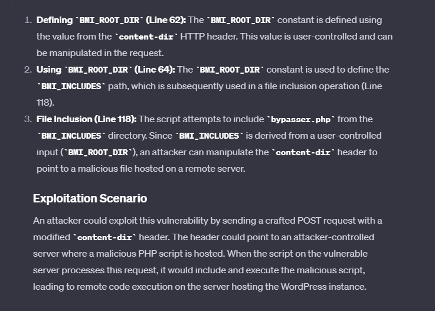</td>
</table></tr>
<table><tr>
<td>Quotes: <code>1</code></td>
<td>Replies: <code>9</code></td>
<td>Retweets: <code>32</code></td>
<td>Favorites: <code>242</code></td>
</tr></table>

---

# nachoskrnl
**https://twitter.com/nachoskrnl/status/1736783878700892253 _at 2023-12-18, 16:21:59_**
<blockquote>
Happy to finally publish my research of finding a 0-click RCE vulnerability chain against Outlook client.
First blogpost goes into details of bypassing Outlook's CVE-2023-23397 mitigation using Windows paths tricks.
The second one goes into audio codec decoding.
</blockquote>

<table><tr>
<td>Quotes: <code>4</code></td>
<td>Replies: <code>3</code></td>
<td>Retweets: <code>115</code></td>
<td>Favorites: <code>355</code></td>
</tr></table>

---

# Netlas_io
**https://twitter.com/Netlas_io/status/1736761688542630314 _at 2023-12-18, 14:53:48_**
<blockquote>
CVE-2023-42325,-42326,-42327: XSS and RCE in pfSense Security, 5.4 - 8.8 rating 🔥

By combining vulns, an attacker can force a user to activate XSS payload and achieve RCE.

Search at https://t.co/hv7QKSqxTR:
👉 Link: https://t.co/LKxjIGdJNe

#cybersecurity #vulnerability_map https://t.co/WbqZBflEUC
</blockquote>

* http://Netlas.io
* https://nt.ls/Zq8XN

<table><tr>
<td>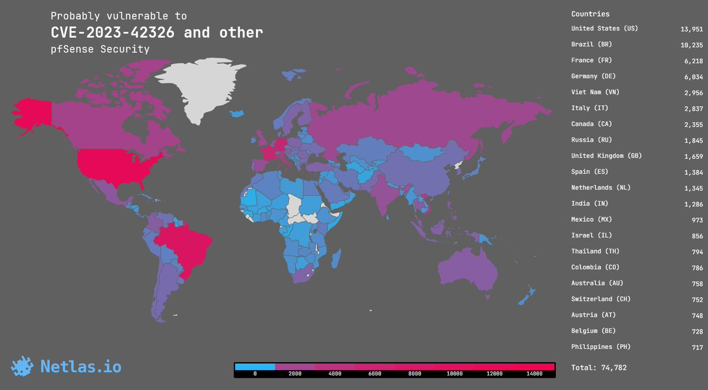</td>
</table></tr>
<table><tr>
<td>Quotes: <code>0</code></td>
<td>Replies: <code>0</code></td>
<td>Retweets: <code>8</code></td>
<td>Favorites: <code>41</code></td>
</tr></table>

---

# __kokumoto
**https://twitter.com/__kokumoto/status/1736593922888220829 _at 2023-12-18, 03:47:10_**
<blockquote>
SharePointにおける、認証前状態からの遠隔コード実行のチェーン（攻撃コードを連鎖させる手法）に関するPoC（概念実証コード）が公開された。CVE-2023-29357とCVE-2023-24955を用いるもの。ハッキングコンテストPwn2Own Vancouver 2023て使用されたもの。 https://t.co/3b5IbYUfmp
</blockquote>

* https://securityonline.info/poc-released-for-sharepoint-pre-auth-rce-chain-cve-2023-29357-cve-2023-24955/

<table><tr>
<td>Quotes: <code>0</code></td>
<td>Replies: <code>0</code></td>
<td>Retweets: <code>10</code></td>
<td>Favorites: <code>40</code></td>
</tr></table>

---

# _r_netsec
**https://twitter.com/_r_netsec/status/1736419254281576686 _at 2023-12-17, 16:13:05_**
<blockquote>
GitHub - dwisiswant0/cve-2023-50164-poc: Proof of Concept for Path Traversal in Apache Struts ("CVE-2023-50164") https://t.co/cwYxKW2IW1
</blockquote>

* https://github.com/dwisiswant0/cve-2023-50164-poc

<table><tr>
<td>Quotes: <code>1</code></td>
<td>Replies: <code>0</code></td>
<td>Retweets: <code>30</code></td>
<td>Favorites: <code>78</code></td>
</tr></table>

---

# kmkz_security
**https://twitter.com/kmkz_security/status/1736147899921174568 _at 2023-12-16, 22:14:50_**
<blockquote>
RT @the_yellow_fall: PoC Released for SharePoint Pre-Auth RCE Chain (CVE-2023-29357 &amp; CVE-2023-24955)
It can be exploited to achieve unauth…
</blockquote>

<table><tr>
<td>Quotes: <code>0</code></td>
<td>Replies: <code>0</code></td>
<td>Retweets: <code>164</code></td>
<td>Favorites: <code>0</code></td>
</tr></table>

---

# Dinosn
**https://twitter.com/Dinosn/status/1736104726855389628 _at 2023-12-16, 19:23:16_**
<blockquote>
PoC Released for SharePoint Pre-Auth RCE Chain (CVE-2023-29357 &amp; CVE-2023-24955) https://t.co/RbbX7CQkyA
</blockquote>

* https://securityonline.info/poc-released-for-sharepoint-pre-auth-rce-chain-cve-2023-29357-cve-2023-24955/

<table><tr>
<td>Quotes: <code>0</code></td>
<td>Replies: <code>2</code></td>
<td>Retweets: <code>61</code></td>
<td>Favorites: <code>188</code></td>
</tr></table>

---

# hack_git
**https://twitter.com/hack_git/status/1735976563152388498 _at 2023-12-16, 10:54:00_**
<blockquote>
CVE-2023-22524

RCE Vulnerability in Atlassian Companion for #macOS

https://t.co/QgsITCOQoZ

#cve #cybersecurity #infosec https://t.co/4gIbt4vPDH
</blockquote>

* https://github.com/ron-imperva/CVE-2023-22524

<table><tr>
<td>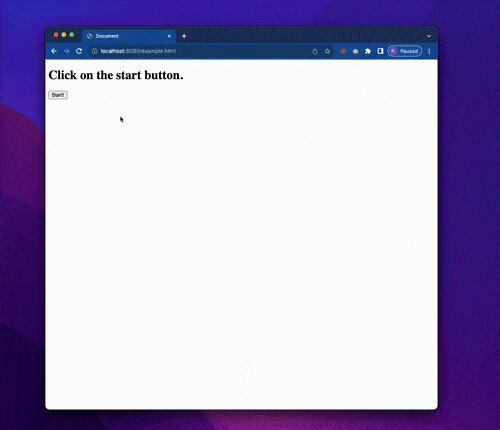</td>
</table></tr>
<table><tr>
<td>Quotes: <code>1</code></td>
<td>Replies: <code>0</code></td>
<td>Retweets: <code>14</code></td>
<td>Favorites: <code>85</code></td>
</tr></table>

---

# hack_git
**https://twitter.com/hack_git/status/1735958947126013986 _at 2023-12-16, 09:44:00_**
<blockquote>
SharePoint 

Pre-Auth Code Injection RCE chain CVE-2023-29357 &amp; CVE-2023-24955 PoC

https://t.co/7fTwwsltUr

#cve #cybersecurity #infosec https://t.co/2GlF50UCy0
</blockquote>

* https://gist.github.com/testanull/dac6029d306147e6cc8dce9424d09868

<table><tr>
<td></td>
</table></tr>
<table><tr>
<td>Quotes: <code>0</code></td>
<td>Replies: <code>0</code></td>
<td>Retweets: <code>22</code></td>
<td>Favorites: <code>60</code></td>
</tr></table>

---

# hack_git
**https://twitter.com/hack_git/status/1735941274593550383 _at 2023-12-16, 08:33:46_**
<blockquote>
CVE-2023-49070

This is a pre-auth RCE POC For CVE-2023-49070 which affected Apache ofbiz applications &lt; 18.12.10 due to xml-rpc java deserialzation bug.

https://t.co/PsLh5zWzJ6

#cve #cybersecurity #infosec https://t.co/TZl24ryu8Q
</blockquote>

* https://github.com/abdoghazy2015/ofbiz-CVE-2023-49070-RCE-POC

<table><tr>
<td>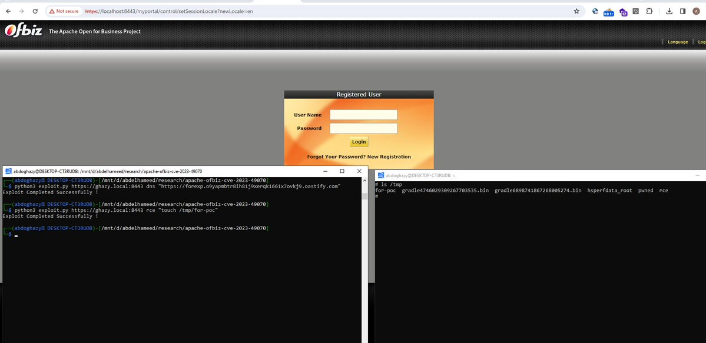</td>
</table></tr>
<table><tr>
<td>Quotes: <code>0</code></td>
<td>Replies: <code>0</code></td>
<td>Retweets: <code>24</code></td>
<td>Favorites: <code>89</code></td>
</tr></table>

---

# the_yellow_fall
**https://twitter.com/the_yellow_fall/status/1735930032152023288 _at 2023-12-16, 07:49:06_**
<blockquote>
PoC Released for SharePoint Pre-Auth RCE Chain (CVE-2023-29357 &amp; CVE-2023-24955)
It can be exploited to achieve unauthenticated remote code execution
https://t.co/uRjXzpnW54 https://t.co/UtMv4LZBLt
</blockquote>

* https://securityonline.info/poc-released-for-sharepoint-pre-auth-rce-chain-cve-2023-29357-cve-2023-24955/

<table><tr>
<td>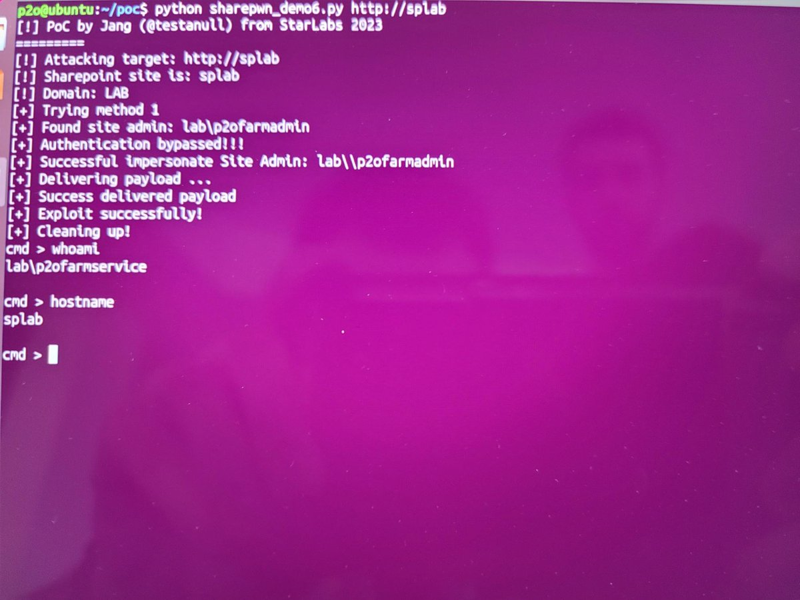</td>
</table></tr>
<table><tr>
<td>Quotes: <code>3</code></td>
<td>Replies: <code>3</code></td>
<td>Retweets: <code>166</code></td>
<td>Favorites: <code>482</code></td>
</tr></table>

---

# hosselot
**https://twitter.com/hosselot/status/1735743032828334291 _at 2023-12-15, 19:26:02_**
<blockquote>
Chrome ITW WebP vulnerability bug entry (CVE-2023-4863 [1479274]) is now open with a PoC:
https://t.co/mo7LoHXATJ
</blockquote>

* https://bugs.chromium.org/p/chromium/issues/detail?id=1479274

<table><tr>
<td>Quotes: <code>0</code></td>
<td>Replies: <code>2</code></td>
<td>Retweets: <code>23</code></td>
<td>Favorites: <code>92</code></td>
</tr></table>

---

# adrielsec
**https://twitter.com/adrielsec/status/1735677621214580906 _at 2023-12-15, 15:06:06_**
<blockquote>
PoC CVE-2023-6553 RCE Unauth Backup Migration plugin &lt; 1.3.7, via /includes/backup-heart.php.  According to official Wordpress statistics, 50k sites running WordPress still use the vulnerable version. 

 https://t.co/5jwcQb6BI6 

#bugbounty #bugbountytip #bugbountytips #hacking
</blockquote>

* https://github.com/Chocapikk/CVE-2023-6553

<table><tr>
<td>Quotes: <code>0</code></td>
<td>Replies: <code>0</code></td>
<td>Retweets: <code>14</code></td>
<td>Favorites: <code>54</code></td>
</tr></table>

---

# momika233
**https://twitter.com/momika233/status/1735588947760398729 _at 2023-12-15, 09:13:45_**
<blockquote>
RT @piedpiper1616: GitHub - ron-imperva/CVE-2023-22524: Atlassian Companion RCE Vulnerability Proof of Concept - https://t.co/nAaeIhetaQ
</blockquote>

* https://github.com/ron-imperva/CVE-2023-22524

<table><tr>
<td>Quotes: <code>0</code></td>
<td>Replies: <code>0</code></td>
<td>Retweets: <code>41</code></td>
<td>Favorites: <code>0</code></td>
</tr></table>

---

# kmkz_security
**https://twitter.com/kmkz_security/status/1735551129025458522 _at 2023-12-15, 06:43:28_**
<blockquote>
RT @piedpiper1616: GitHub - ron-imperva/CVE-2023-22524: Atlassian Companion RCE Vulnerability Proof of Concept - https://t.co/nAaeIhetaQ
</blockquote>

* https://github.com/ron-imperva/CVE-2023-22524

<table><tr>
<td>Quotes: <code>0</code></td>
<td>Replies: <code>0</code></td>
<td>Retweets: <code>42</code></td>
<td>Favorites: <code>0</code></td>
</tr></table>

---

# piedpiper1616
**https://twitter.com/piedpiper1616/status/1735520642152194501 _at 2023-12-15, 04:42:20_**
<blockquote>
GitHub - ron-imperva/CVE-2023-22524: Atlassian Companion RCE Vulnerability Proof of Concept - https://t.co/nAaeIhetaQ
</blockquote>

* https://github.com/ron-imperva/CVE-2023-22524

<table><tr>
<td>Quotes: <code>0</code></td>
<td>Replies: <code>1</code></td>
<td>Retweets: <code>41</code></td>
<td>Favorites: <code>100</code></td>
</tr></table>

---

# HunterMapping
**https://twitter.com/HunterMapping/status/1735498778545918460 _at 2023-12-15, 03:15:27_**
<blockquote>
CVE-2023-50164 Apache Struts Remote Code Execution Vulnerability POC released. 
Credit to jakabakos
📰https://t.co/WxeDfeq971
</blockquote>

* https://github.com/jakabakos/CVE-2023-50164-Apache-Struts-RCE

<table><tr>
<td>Quotes: <code>0</code></td>
<td>Replies: <code>2</code></td>
<td>Retweets: <code>19</code></td>
<td>Favorites: <code>59</code></td>
</tr></table>

---

# TheHackersNews
**https://twitter.com/TheHackersNews/status/1735246347983262045 _at 2023-12-14, 10:32:23_**
<blockquote>
⚠️ Warning: Russian SVR-linked APT29 targets unpatched JetBrains TeamCity servers using CVE-2023-42793, a #vulnerability enabling remote code execution by unauthenticated attackers.

Details 👉 https://t.co/RQLTxE6xzy

#cybersecurity #hacking #infosec
</blockquote>

* https://thehackernews.com/2023/12/russian-svr-linked-apt29-targets.html

<table><tr>
<td>Quotes: <code>6</code></td>
<td>Replies: <code>5</code></td>
<td>Retweets: <code>84</code></td>
<td>Favorites: <code>121</code></td>
</tr></table>

---

# Dinosn
**https://twitter.com/Dinosn/status/1735210517302497354 _at 2023-12-14, 08:10:00_**
<blockquote>
CVE-2023-50164: Apache Struts path traversal to RCE vulnerability PoC https://t.co/jnMWat5gTW
</blockquote>

* https://github.com/jakabakos/CVE-2023-50164-Apache-Struts-RCE

<table><tr>
<td>Quotes: <code>0</code></td>
<td>Replies: <code>0</code></td>
<td>Retweets: <code>37</code></td>
<td>Favorites: <code>86</code></td>
</tr></table>

---

# Shadowserver
**https://twitter.com/Shadowserver/status/1734919288257974380 _at 2023-12-13, 12:52:46_**
<blockquote>
We have started to see attempts to use PoC exploit code published for Apache Struts CVE-2023-50164 CVSS 9.8 RCE in our sensors (a few src IPs). Make sure to update your Struts installs ... 

Apache Security Bulletin: https://t.co/iVAinVdl7M

NVD entry: https://t.co/oHoHGlcyu7
</blockquote>

* https://cwiki.apache.org/confluence/display/WW/S2-066
* https://nvd.nist.gov/vuln/detail/CVE-2023-50164

<table><tr>
<td>Quotes: <code>6</code></td>
<td>Replies: <code>3</code></td>
<td>Retweets: <code>23</code></td>
<td>Favorites: <code>34</code></td>
</tr></table>

---

# ptracesecurity
**https://twitter.com/ptracesecurity/status/1734845683331383694 _at 2023-12-13, 08:00:17_**
<blockquote>
Researcher to Release PoC for 0-day Windows CVE-2023-36036 Flaw https://t.co/Rxp0H2LSjM  #pentesting #Windows  #cybersecurity #Infosec
</blockquote>

* https://securityonline.info/researcher-to-release-poc-0day-cve-2023-36036-vulnerability/

<table><tr>
<td>Quotes: <code>0</code></td>
<td>Replies: <code>0</code></td>
<td>Retweets: <code>14</code></td>
<td>Favorites: <code>41</code></td>
</tr></table>

---

# wvuuuuuuuuuuuuu
**https://twitter.com/wvuuuuuuuuuuuuu/status/1734703050453844138 _at 2023-12-12, 22:33:31_**
<blockquote>
RT @steventseeley: I can confirm that this is the correct analysis of the Apache struts bug I reported (CVE-2023-50164) https://t.co/xjpePY…
</blockquote>

<table><tr>
<td>Quotes: <code>0</code></td>
<td>Replies: <code>0</code></td>
<td>Retweets: <code>70</code></td>
<td>Favorites: <code>0</code></td>
</tr></table>

---

# kmkz_security
**https://twitter.com/kmkz_security/status/1734679336731783580 _at 2023-12-12, 20:59:17_**
<blockquote>
RT @melihkaanyldz: We continue with Confluence. Another OGNL injection preauth RCE,  CVE-2022-26134 

https://t.co/dA0qpl1CWf
</blockquote>

* https://morph3.blog/posts/Studying-old-CVEs-Part-2-CVE-2022-26134/

<table><tr>
<td>Quotes: <code>0</code></td>
<td>Replies: <code>0</code></td>
<td>Retweets: <code>35</code></td>
<td>Favorites: <code>0</code></td>
</tr></table>

---

# AndrewOliveau
**https://twitter.com/AndrewOliveau/status/1734663199511785613 _at 2023-12-12, 19:55:09_**
<blockquote>
Got my first Microsoft CVE 🔥

CVE-2023-36004: Windows DPAPI (Data Protection Application Programming Interface) Spoofing Vulnerability

https://t.co/nWuuldqKnp
</blockquote>

* https://msrc.microsoft.com/update-guide/en-US/advisory/CVE-2023-36004

<table><tr>
<td>Quotes: <code>4</code></td>
<td>Replies: <code>20</code></td>
<td>Retweets: <code>36</code></td>
<td>Favorites: <code>267</code></td>
</tr></table>

---

# ptracesecurity
**https://twitter.com/ptracesecurity/status/1734656908131213752 _at 2023-12-12, 19:30:09_**
<blockquote>
Studying old CVEs: Part 2 - CVE-2022-26134 https://t.co/PzNN8Pgx8y   #Pentesting #CVE #cybersecurity #infosec https://t.co/cAO1OT9vAK
</blockquote>

* https://morph3.blog/posts/Studying-old-CVEs-Part-2-CVE-2022-26134/

<table><tr>
<td>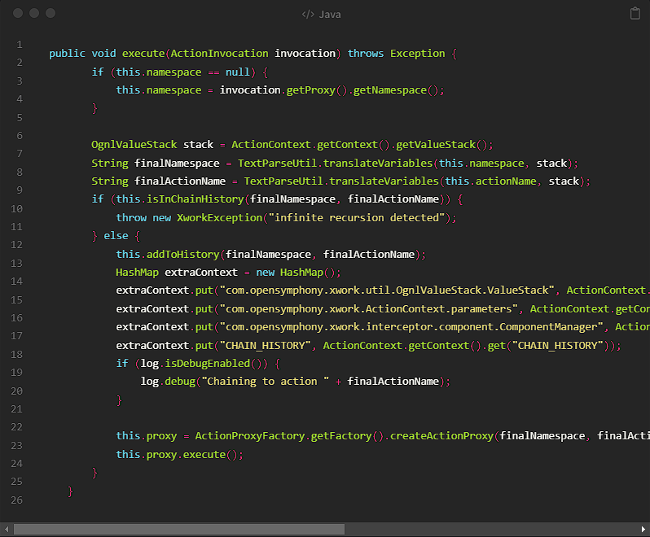</td>
<td>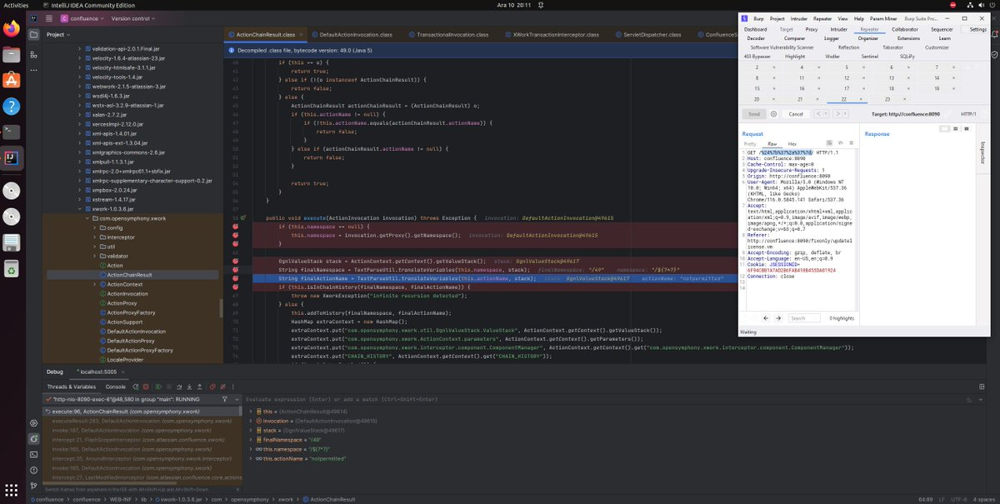</td>
<td>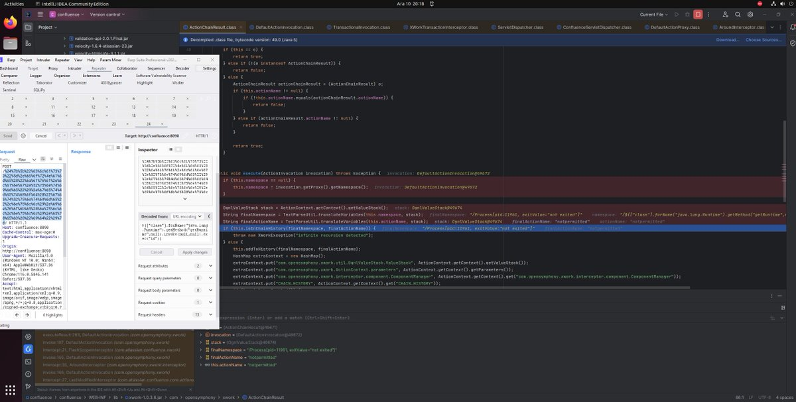</td>
<td>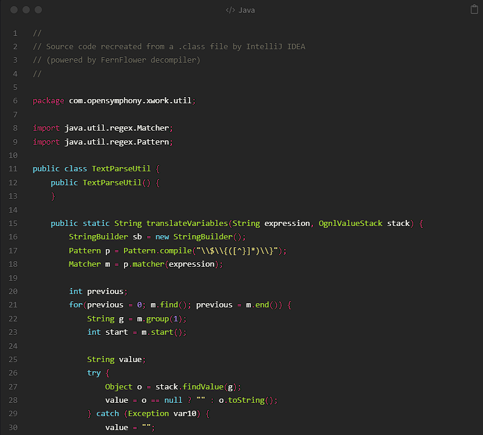</td>
</table></tr>
<table><tr>
<td>Quotes: <code>0</code></td>
<td>Replies: <code>0</code></td>
<td>Retweets: <code>8</code></td>
<td>Favorites: <code>34</code></td>
</tr></table>

---

# payloadartist
**https://twitter.com/payloadartist/status/1734597895603794126 _at 2023-12-12, 15:35:40_**
<blockquote>
Excellent analysis of vulnerable code in pfSense by @Sonar_Research 

- Reflected XSS - CVE-2023-42325 leading to RCE if victim is admin
- Command injection - CVE-2023-42326)

https://t.co/OWodF6zGth

#cybersecurity #infosec #appsec #hacking https://t.co/HyS4u6jVGi
</blockquote>

* https://www.sonarsource.com/blog/pfsense-vulnerabilities-sonarcloud/

<table><tr>
<td>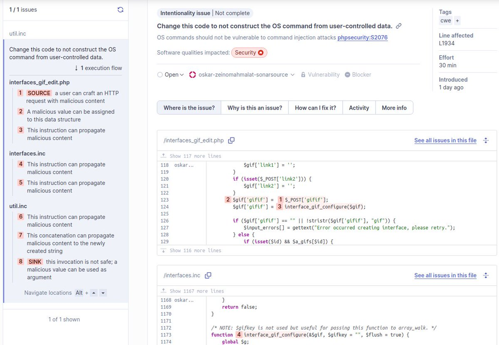</td>
<td>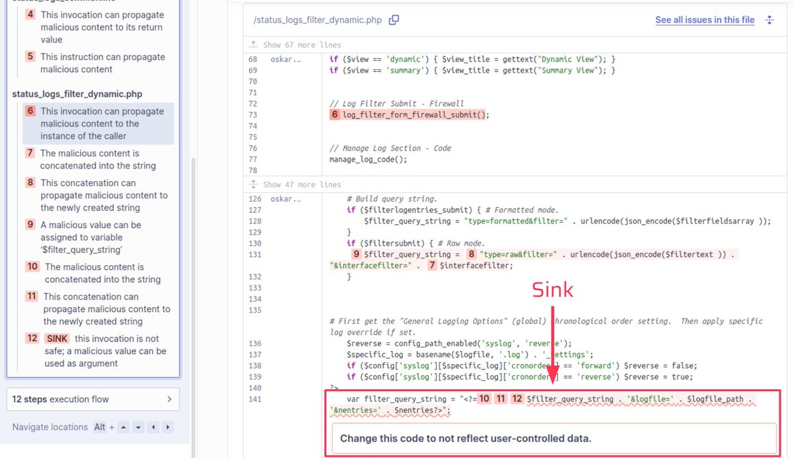</td>
<td>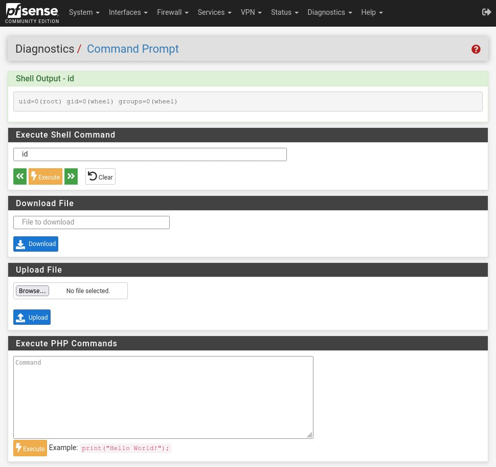</td>
<td>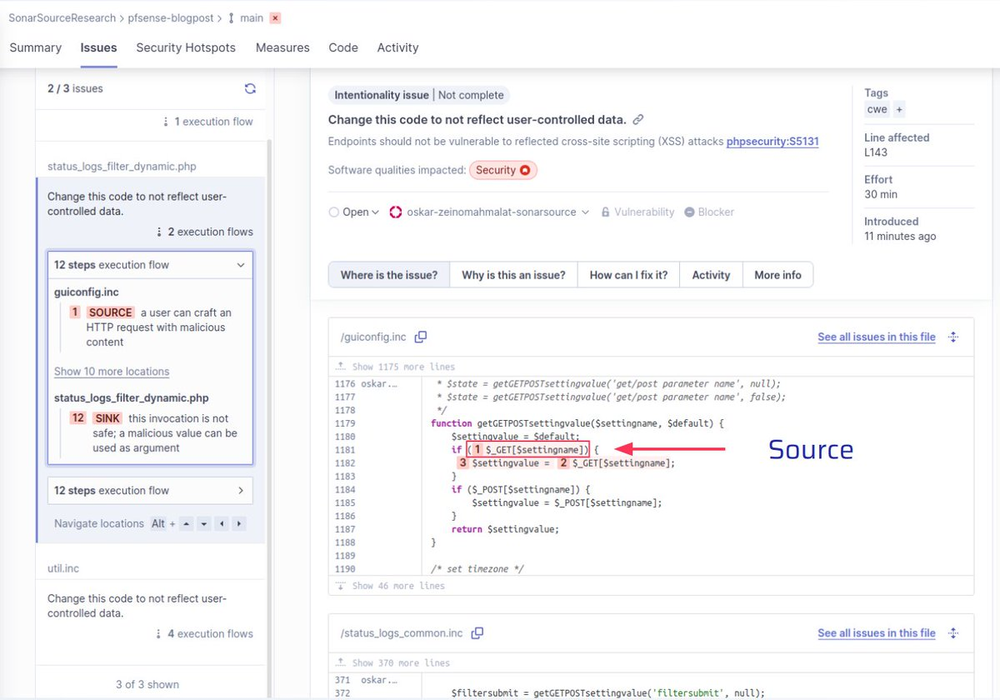</td>
</table></tr>
<table><tr>
<td>Quotes: <code>0</code></td>
<td>Replies: <code>1</code></td>
<td>Retweets: <code>22</code></td>
<td>Favorites: <code>81</code></td>
</tr></table>

---

# momika233
**https://twitter.com/momika233/status/1734558663430607089 _at 2023-12-12, 12:59:46_**
<blockquote>
CVE-2023-50164 Vulnerability details
The conditions of utilization are limited
https://t.co/F1B2yG2JR9
</blockquote>

* https://github.com/wy876/POC/blob/8ceccb96e4ba5bbcc4227d6769bc713f08c46a3f/Apache%20Struts2%20CVE-2023-50164.md

<table><tr>
<td>Quotes: <code>0</code></td>
<td>Replies: <code>2</code></td>
<td>Retweets: <code>30</code></td>
<td>Favorites: <code>82</code></td>
</tr></table>

---

# testanull
**https://twitter.com/testanull/status/1734528218429079937 _at 2023-12-12, 10:58:47_**
<blockquote>
RT @steventseeley: I can confirm that this is the correct analysis of the Apache struts bug I reported (CVE-2023-50164) https://t.co/xjpePY…
</blockquote>

<table><tr>
<td>Quotes: <code>0</code></td>
<td>Replies: <code>0</code></td>
<td>Retweets: <code>71</code></td>
<td>Favorites: <code>0</code></td>
</tr></table>

---

# kmkz_security
**https://twitter.com/kmkz_security/status/1734527256494514176 _at 2023-12-12, 10:54:58_**
<blockquote>
RT @steventseeley: I can confirm that this is the correct analysis of the Apache struts bug I reported (CVE-2023-50164) https://t.co/xjpePY…
</blockquote>

<table><tr>
<td>Quotes: <code>0</code></td>
<td>Replies: <code>0</code></td>
<td>Retweets: <code>69</code></td>
<td>Favorites: <code>0</code></td>
</tr></table>

---

# PentestingN
**https://twitter.com/PentestingN/status/1734496865683460489 _at 2023-12-12, 08:54:12_**
<blockquote>
CVE-2023-30547

PoC Exploit for VM2 Sandbox Escape Vulnerability

https://t.co/TD63bRhWX5

#cve #cybersecurity #infosec https://t.co/FqTvk4MUUR
</blockquote>

* https://github.com/rvizx/CVE-2023-30547

<table><tr>
<td>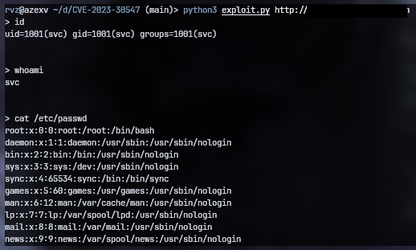</td>
</table></tr>
<table><tr>
<td>Quotes: <code>0</code></td>
<td>Replies: <code>0</code></td>
<td>Retweets: <code>19</code></td>
<td>Favorites: <code>93</code></td>
</tr></table>

---

# steventseeley
**https://twitter.com/steventseeley/status/1734487560473477153 _at 2023-12-12, 08:17:14_**
<blockquote>
I can confirm that this is the correct analysis of the Apache struts bug I reported (CVE-2023-50164) https://t.co/xjpePYUKDf well done! 👏🏻
</blockquote>

* http://xz.aliyun.com/t/13172

<table><tr>
<td>Quotes: <code>1</code></td>
<td>Replies: <code>2</code></td>
<td>Retweets: <code>70</code></td>
<td>Favorites: <code>276</code></td>
</tr></table>

---

# TheHackersNews
**https://twitter.com/TheHackersNews/status/1734445077676597563 _at 2023-12-12, 05:28:25_**
<blockquote>
⚠️ Urgent Update: Apache warns of a critical RCE flaw in Struts 2 web app framework (CVE-2023-50164) that could lead to remote code execution.

Find details here: https://t.co/U8OGZ9CW2h

Upgrade to patched versions now to prevent potential breaches.
</blockquote>

* https://thehackernews.com/2023/12/new-critical-rce-vulnerability.html

<table><tr>
<td>Quotes: <code>4</code></td>
<td>Replies: <code>1</code></td>
<td>Retweets: <code>81</code></td>
<td>Favorites: <code>118</code></td>
</tr></table>

---

# Dinosn
**https://twitter.com/Dinosn/status/1734144663026614751 _at 2023-12-11, 09:34:41_**
<blockquote>
CVE-2023-50428: Bitcoin Core Client Vulnerability https://t.co/ax1QIxDao4
</blockquote>

* https://securityonline.info/cve-2023-50428-bitcoin-core-client-vulnerability/

<table><tr>
<td>Quotes: <code>0</code></td>
<td>Replies: <code>2</code></td>
<td>Retweets: <code>9</code></td>
<td>Favorites: <code>42</code></td>
</tr></table>

---

# Dinosn
**https://twitter.com/Dinosn/status/1734132671872147481 _at 2023-12-11, 08:47:02_**
<blockquote>
Researcher to Release PoC for 0-day Windows CVE-2023-36036 Flaw https://t.co/4uofzCDXTu
</blockquote>

* https://securityonline.info/researcher-to-release-poc-0day-cve-2023-36036-vulnerability/

<table><tr>
<td>Quotes: <code>1</code></td>
<td>Replies: <code>0</code></td>
<td>Retweets: <code>10</code></td>
<td>Favorites: <code>46</code></td>
</tr></table>

---

# momika233
**https://twitter.com/momika233/status/1734112461933207689 _at 2023-12-11, 07:26:43_**
<blockquote>
RT @7h3h4ckv157: PoC Exploit for Windows NTLM Privilege Escalation Flaw - 🚨CVE-2023-21746 ‼️ 

https://t.co/bkFUKMfw0o

#cybersecurity #Pen…
</blockquote>

* https://securityonline.info/poc-exploit-for-windows-ntlm-privilege-escalation-flaw-cve-2023-21746-published/?expand_article=1

<table><tr>
<td>Quotes: <code>0</code></td>
<td>Replies: <code>0</code></td>
<td>Retweets: <code>64</code></td>
<td>Favorites: <code>0</code></td>
</tr></table>

---

# 0xdea
**https://twitter.com/0xdea/status/1733967361177264292 _at 2023-12-10, 21:50:09_**
<blockquote>
CVE-2023-45866: Unauthenticated #Bluetooth keystroke-injection in #Android, #Linux, #macOS and #iOS

https://t.co/SWEMqsDCkL

https://t.co/EUGkFCpUE8
</blockquote>

* https://github.com/skysafe/reblog/tree/main/cve-2023-45866
* https://infosec.exchange/@raptor/111558327842695800

<table><tr>
<td>Quotes: <code>0</code></td>
<td>Replies: <code>0</code></td>
<td>Retweets: <code>13</code></td>
<td>Favorites: <code>48</code></td>
</tr></table>

---

# Alra3ees
**https://twitter.com/Alra3ees/status/1733694032637735268 _at 2023-12-10, 03:44:02_**
<blockquote>
Proxyshell-Scanner:-
nuclei scanner for Proxyshell RCE (CVE-2021-34423,CVE-2021-34473,CVE-2021-31207) 

https://t.co/loZtvHpsic

Find Vulnerable url:-
nuclei -l urls -c 200 -t proxyshell.yaml

Exploit:-
python3 ProxyShell .py -u url

And you will get a shell on the server.
</blockquote>

* https://github.com/kh4sh3i/ProxyShell

<table><tr>
<td>Quotes: <code>0</code></td>
<td>Replies: <code>0</code></td>
<td>Retweets: <code>11</code></td>
<td>Favorites: <code>55</code></td>
</tr></table>

---

# kmkz_security
**https://twitter.com/kmkz_security/status/1733472456063553543 _at 2023-12-09, 13:03:34_**
<blockquote>
How to exploit CVE-2023-43641 (a memory corruption vulnerability in libcue) to create a reliable 1-click RCE on Ubuntu 23.04 and Fedora 38 --&gt; very good one ! thank you @kevin_backhouse 
https://t.co/A9em8BD150

CVE-2023-43641 PoC :
https://t.co/Bo24mIysl1
</blockquote>

* https://github.blog/author/kevinbackhouse/
* https://github.com/github/securitylab/tree/0a8ede65e0ac860d195868b093d3ddcbd00e6997/SecurityExploits/libcue/track_set_index_CVE-2023-43641

<table><tr>
<td>Quotes: <code>0</code></td>
<td>Replies: <code>3</code></td>
<td>Retweets: <code>40</code></td>
<td>Favorites: <code>125</code></td>
</tr></table>

---

# akaclandestine
**https://twitter.com/akaclandestine/status/1733339962735554628 _at 2023-12-09, 04:17:05_**
<blockquote>
#exploit
1. CVE-2023-1326:
Privilege escalation in apport-cli 2.26.0
https://t.co/zoqCjnGCQb

2. CVE-2023-45866:
Unauthenticated Bluetooth keystroke-injection in Android, Linux, macOS and iOS
https://t.co/tG7vumiWnS

3. CVE-2023-24893:
VSCode RCE
https://t.co/eMUS68C1yb
</blockquote>

* https://github.com/diego-tella/CVE-2023-1326-PoC
* https://ift.tt/BHxK2mO
* https://blog.solidsnail.com/posts/vscode-shell-integ-rce

<table><tr>
<td>Quotes: <code>0</code></td>
<td>Replies: <code>0</code></td>
<td>Retweets: <code>12</code></td>
<td>Favorites: <code>42</code></td>
</tr></table>

---

# kmkz_security
**https://twitter.com/kmkz_security/status/1733236046194749566 _at 2023-12-08, 21:24:10_**
<blockquote>
RT @TecR0c: Uncovered a EoP flaw with @sickcodes at #Hardpwn in Android Google Chromecast's KeyChain, tagged CVE-2023-48417. This allows an…
</blockquote>

<table><tr>
<td>Quotes: <code>0</code></td>
<td>Replies: <code>0</code></td>
<td>Retweets: <code>33</code></td>
<td>Favorites: <code>0</code></td>
</tr></table>

---

# _r_netsec
**https://twitter.com/_r_netsec/status/1733206836093075815 _at 2023-12-08, 19:28:05_**
<blockquote>
CVE-2023-45866: Unauthenticated Bluetooth keystroke-injection in Android, Linux, macOS and iOS https://t.co/kZNLWai2Qc
</blockquote>

* https://github.com/skysafe/reblog/tree/main/cve-2023-45866

<table><tr>
<td>Quotes: <code>0</code></td>
<td>Replies: <code>0</code></td>
<td>Retweets: <code>19</code></td>
<td>Favorites: <code>47</code></td>
</tr></table>

---

# HunterMapping
**https://twitter.com/HunterMapping/status/1733009272802554233 _at 2023-12-08, 06:23:03_**
<blockquote>
🚨Alert🚨CVE-2023-50164
Apache Struts Remote Code Execution Vulnerability

🔗Hunter:https://t.co/iVneFHpQMi

Dorks 👇👇👇
FOFA    app="Struts2"
📰Refer to  https://t.co/z1mKDFRpyX
#infosec #infosecurity #Infosys https://t.co/rGcvdi3EvV
</blockquote>

* https://hunter.how/list?searchValue=product.name%3D%22Apache%20Struts%22
* https://securityonline.info/cve-2023-50164-apache-struts-remote-code-execution-vulnerability/

<table><tr>
<td>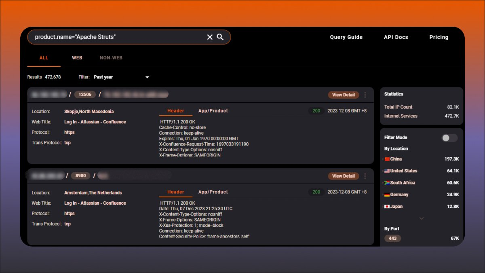</td>
</table></tr>
<table><tr>
<td>Quotes: <code>0</code></td>
<td>Replies: <code>0</code></td>
<td>Retweets: <code>16</code></td>
<td>Favorites: <code>53</code></td>
</tr></table>

---

# momika233
**https://twitter.com/momika233/status/1733001995966095650 _at 2023-12-08, 05:54:08_**
<blockquote>
CVE-2023-50164
Apache Struts vulnerable to path traversal
#apache #struts2
https://t.co/aTa7TGgkpu
https://t.co/ECLblQ2cFV
</blockquote>

* https://github.com/apache/struts/commit/162e29fee9136f4bfd9b2376da2cbf590f9ea163
* https://github.com/apache/struts/commit/d8c69691ef1d15e76a5f4fcf33039316da2340b6

<table><tr>
<td>Quotes: <code>2</code></td>
<td>Replies: <code>1</code></td>
<td>Retweets: <code>40</code></td>
<td>Favorites: <code>176</code></td>
</tr></table>

---

# 1ZRR4H
**https://twitter.com/1ZRR4H/status/1732776974483910966 _at 2023-12-07, 14:59:58_**
<blockquote>
🚨🍯 CVE-2023-1389: Unauthenticated Command Injection on TP-Link Archer AX21 leads to #MooBot (Mirai DDoS variant).

Attacker: 172.104.228.72 🇩🇪
Path: POST /cgi-bin/luci/;stok=/locale?form=country
Payload: hxxp://91.92.249.96/condi/bot.x86_64
C2: 91.92.249.96

[+]… https://t.co/wUlS1R8OVs
</blockquote>

<table><tr>
<td>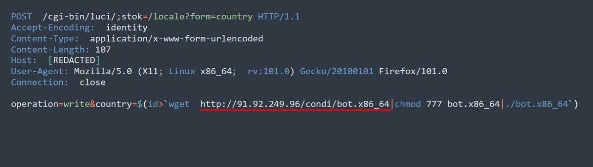</td>
</table></tr>
<table><tr>
<td>Quotes: <code>4</code></td>
<td>Replies: <code>3</code></td>
<td>Retweets: <code>33</code></td>
<td>Favorites: <code>81</code></td>
</tr></table>

---

# TheHackersNews
**https://twitter.com/TheHackersNews/status/1732728274013376944 _at 2023-12-07, 11:46:27_**
<blockquote>
⚠️ Urgent Security Warning -

A new critical Bluetooth #vulnerability (CVE-2023-45866) could enable attackers to take control of Android, #Linux, macOS, and #iOS devices.

Learn how it works: https://t.co/NnebS6yx4O

#cybersecurity #hacking
</blockquote>

* https://thehackernews.com/2023/12/new-bluetooth-flaw-let-hackers-take.html

<table><tr>
<td>Quotes: <code>8</code></td>
<td>Replies: <code>6</code></td>
<td>Retweets: <code>197</code></td>
<td>Favorites: <code>372</code></td>
</tr></table>

---

# CyberWarship
**https://twitter.com/CyberWarship/status/1732676824511988072 _at 2023-12-07, 08:22:01_**
<blockquote>
"Analysis of CVE-2023-38831 Zero-Day vulnerability in WinRAR" 

#infosec #pentest #redteam 
https://t.co/Utfw8dfQrm https://t.co/H9m3B882X6
</blockquote>

* https://blog.securelayer7.net/analysis-of-cve-2023-38831-zero-day-vulnerability-in-winrar/

<table><tr>
<td>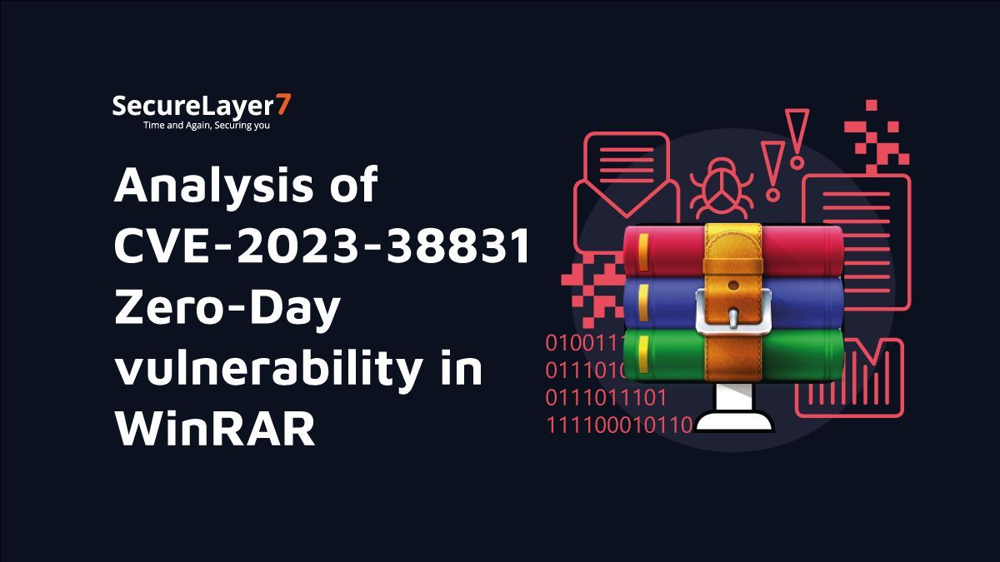</td>
</table></tr>
<table><tr>
<td>Quotes: <code>1</code></td>
<td>Replies: <code>0</code></td>
<td>Retweets: <code>48</code></td>
<td>Favorites: <code>130</code></td>
</tr></table>

---

# steventseeley
**https://twitter.com/steventseeley/status/1732623449892462856 _at 2023-12-07, 04:49:55_**
<blockquote>
RT @kevin_backhouse: My blog post about how to exploit CVE-2023-43641 (1-click RCE in GNOME) is out.
</blockquote>

<table><tr>
<td>Quotes: <code>0</code></td>
<td>Replies: <code>0</code></td>
<td>Retweets: <code>37</code></td>
<td>Favorites: <code>0</code></td>
</tr></table>

---

# 0xor0ne
**https://twitter.com/0xor0ne/status/1732475392257142873 _at 2023-12-06, 19:01:36_**
<blockquote>
Another great writeup by @mmolgtm on Chrome RCE through type confusion (CVE-2023-4069)

https://t.co/YH8IQzdQs1

#chrome #infosec https://t.co/7qwQT1CuaY
</blockquote>

* https://github.blog/2023-10-17-getting-rce-in-chrome-with-incomplete-object-initialization-in-the-maglev-compiler/?ref=0xor0ne.xyz

<table><tr>
<td>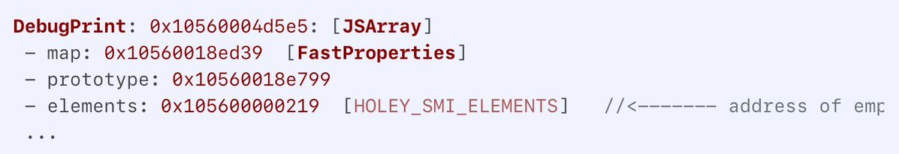</td>
<td>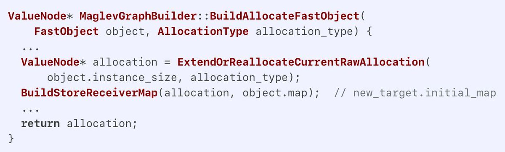</td>
<td>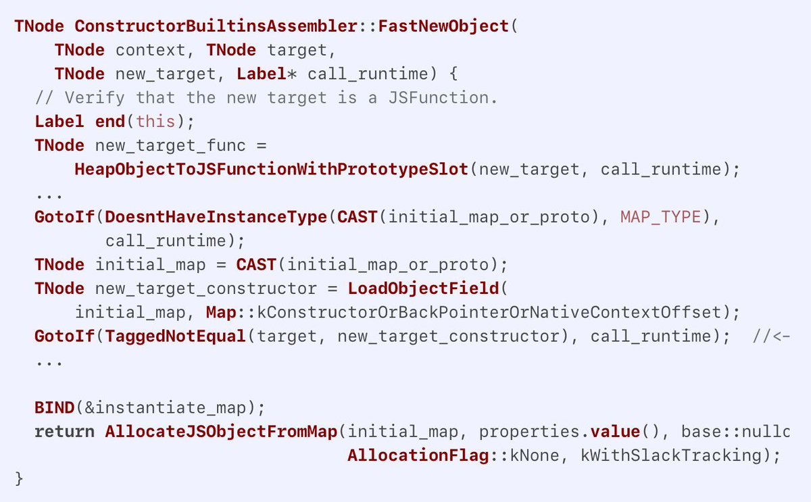</td>
</table></tr>
<table><tr>
<td>Quotes: <code>1</code></td>
<td>Replies: <code>1</code></td>
<td>Retweets: <code>45</code></td>
<td>Favorites: <code>166</code></td>
</tr></table>

---

# kevin_backhouse
**https://twitter.com/kevin_backhouse/status/1732459975014821904 _at 2023-12-06, 18:00:20_**
<blockquote>
My blog post about how to exploit CVE-2023-43641 (1-click RCE in GNOME) is out.
</blockquote>

<table><tr>
<td>Quotes: <code>1</code></td>
<td>Replies: <code>1</code></td>
<td>Retweets: <code>37</code></td>
<td>Favorites: <code>137</code></td>
</tr></table>

---

# cyb3rops
**https://twitter.com/cyb3rops/status/1732365216422203588 _at 2023-12-06, 11:43:48_**
<blockquote>
The sample mentioned in the @CISACyber report AA23-339A on attacks against Adobe ColdFusion CVE-2023-26360 is ForkDump by @BillDemirkapi 

- only ESET gets it right

Sample
https://t.co/dojObhUwLo

CISA report
https://t.co/neT9tchHmF https://t.co/sfqKZeSOSd
</blockquote>

* https://www.virustotal.com/gui/file/a3acb9f79647f813671c1a21097a51836b0b95397ebc9cd178bc806e1773c864/detection
* https://www.cisa.gov/news-events/cybersecurity-advisories/aa23-339a

<table><tr>
<td>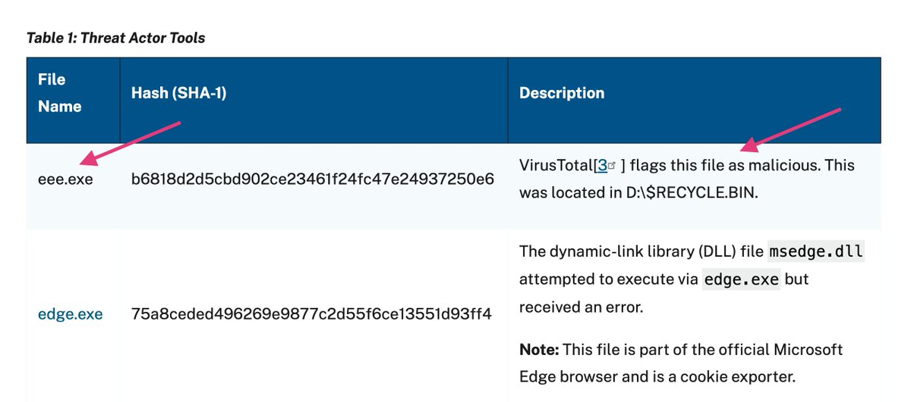</td>
<td></td>
<td>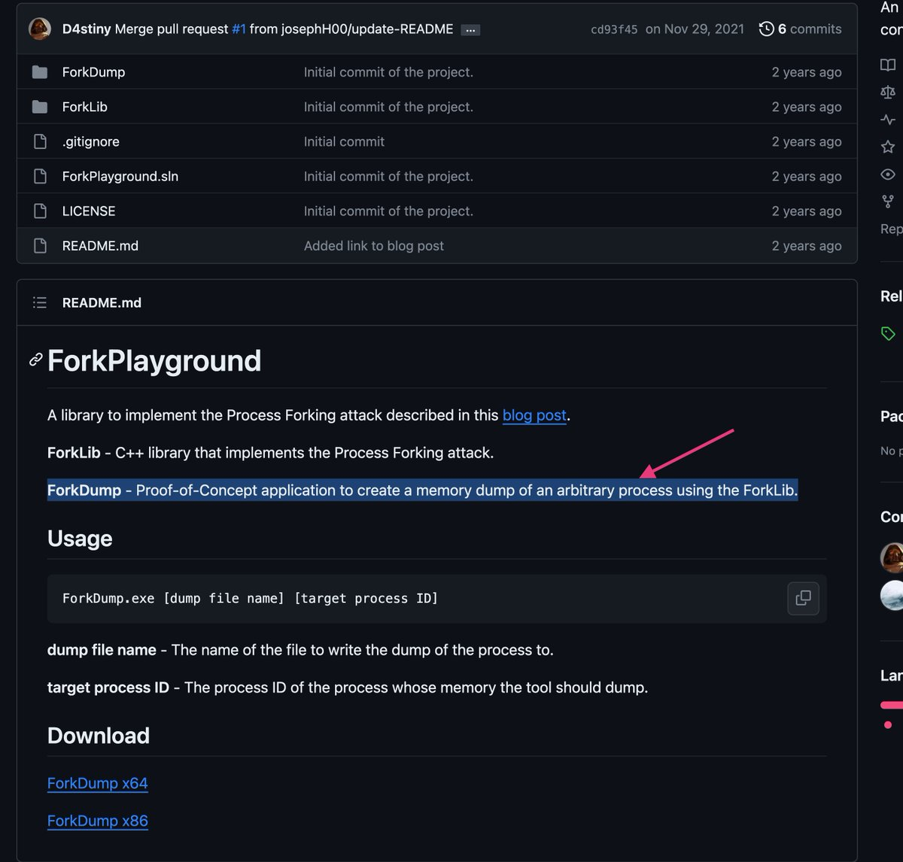</td>
<td>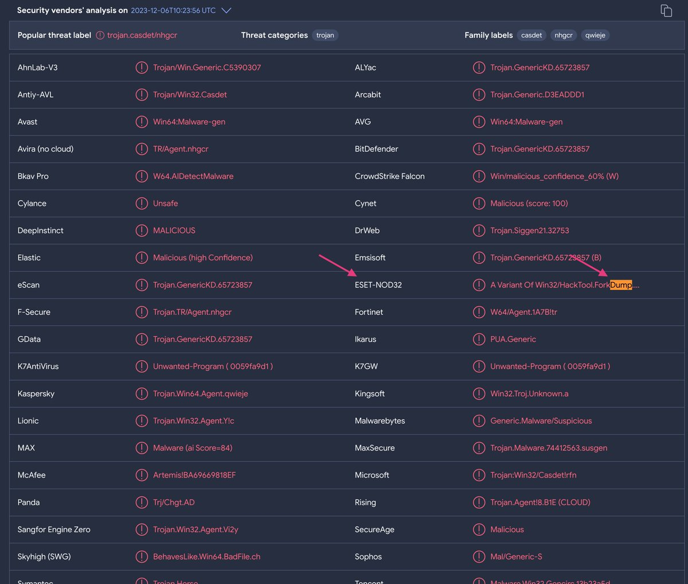</td>
</table></tr>
<table><tr>
<td>Quotes: <code>2</code></td>
<td>Replies: <code>1</code></td>
<td>Retweets: <code>18</code></td>
<td>Favorites: <code>72</code></td>
</tr></table>

---

# Netlas_io
**https://twitter.com/Netlas_io/status/1732361747271422220 _at 2023-12-06, 11:30:00_**
<blockquote>
CVE-2023-22522, -25524: Two RCE in Atlassian Confluence Data&amp;Server, 9.0 rating 🔥

New problems with Atlassian software. This time, an attacker can inject code for RCE. 

Search at https://t.co/hv7QKSqxTR:
👉 Link: https://t.co/uWKYdzjpQd

#cybersecurity #vulnerability_map https://t.co/KCbT1ggkcG
</blockquote>

* http://Netlas.io
* https://nt.ls/Siajm

<table><tr>
<td>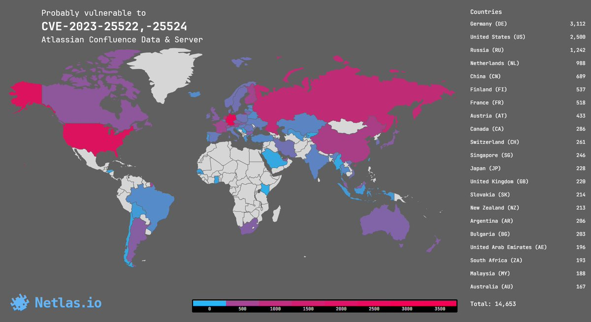</td>
</table></tr>
<table><tr>
<td>Quotes: <code>0</code></td>
<td>Replies: <code>1</code></td>
<td>Retweets: <code>7</code></td>
<td>Favorites: <code>32</code></td>
</tr></table>

---

# TheHackersNews
**https://twitter.com/TheHackersNews/status/1732342146470973613 _at 2023-12-06, 10:12:07_**
<blockquote>
🕵️‍♂️ CISA warns of an ongoing cyber threat targeting government servers via an Adobe ColdFusion #vulnerability (CVE-2023-26360).

Learn more: https://t.co/Bos77d2txV

Update your software now.
</blockquote>

* https://thehackernews.com/2023/12/hackers-exploited-coldfusion.html

<table><tr>
<td>Quotes: <code>1</code></td>
<td>Replies: <code>2</code></td>
<td>Retweets: <code>56</code></td>
<td>Favorites: <code>84</code></td>
</tr></table>

---

# HunterMapping
**https://twitter.com/HunterMapping/status/1732226971822960874 _at 2023-12-06, 02:34:27_**
<blockquote>
🚨Alert🚨CVE-2023-49070:Critical Pre-auth RCE Vulnerability Discovered in Apache OFBiz
🔗 Hunter:https://t.co/sqZxG1XMDY
Dorks 👇👇👇
FOFA    app="Apache_OFBiz"

📰Refer to https://t.co/KY5tJDUuJ9
#infosec #infosecurity #Infosys #Vulnerability #cybersecurity https://t.co/PiRJmYPeIE
</blockquote>

* https://hunter.how/list?searchValue=product.name%3D%22OFBiz%22
* https://securityonline.info/cve-2023-49070-rce-vulnerability-apache-ofbiz/

<table><tr>
<td>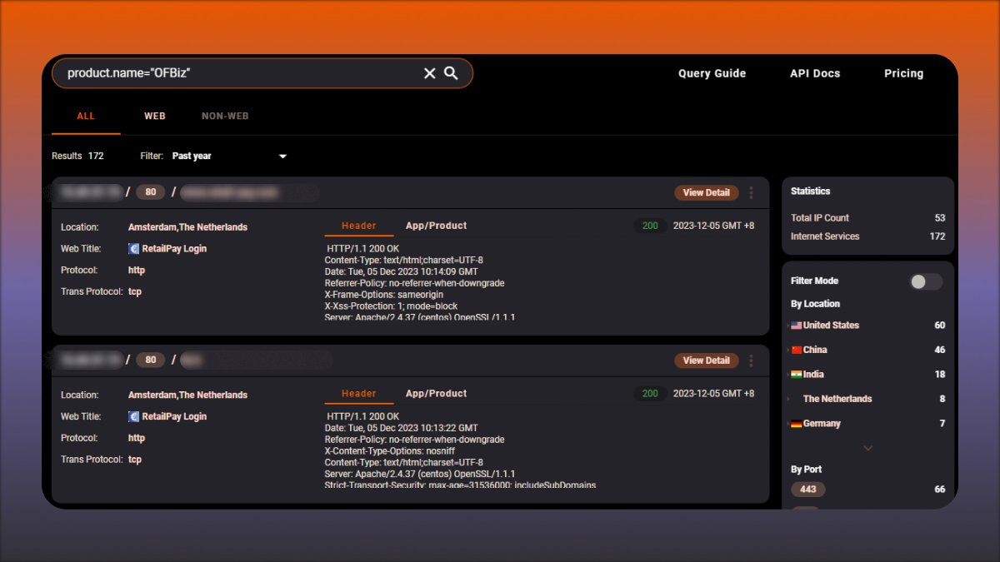</td>
</table></tr>
<table><tr>
<td>Quotes: <code>0</code></td>
<td>Replies: <code>2</code></td>
<td>Retweets: <code>38</code></td>
<td>Favorites: <code>77</code></td>
</tr></table>

---

# wvuuuuuuuuuuuuu
**https://twitter.com/wvuuuuuuuuuuuuu/status/1732096292946424024 _at 2023-12-05, 17:55:11_**
<blockquote>
RT @steventseeley: Here's a POC for CVE-2023-44414 (A pre-auth RCE): https://t.co/hJ7DDSONRW https://t.co/ADpXdVGZZo
</blockquote>

* https://www.zerodayinitiative.com/advisories/ZDI-23-1512/

<table><tr>
<td>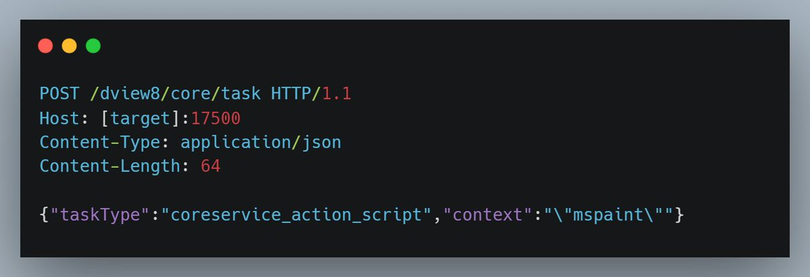</td>
</table></tr>
<table><tr>
<td>Quotes: <code>0</code></td>
<td>Replies: <code>0</code></td>
<td>Retweets: <code>41</code></td>
<td>Favorites: <code>0</code></td>
</tr></table>

---

# hosselot
**https://twitter.com/hosselot/status/1732079371219804299 _at 2023-12-05, 16:47:57_**
<blockquote>
Apple Safari In-The-Wild memory corruption vulnerability (CVE-2023-42917 [265067]) happens because flattenDictionaryStructure can shrink butterfly for named properties (like Array shift/unshift) and got exploited by triggering a race condition:
https://t.co/LJyHF4QQSr
</blockquote>

* https://github.com/WebKit/WebKit/commit/00352dd86bfa102b6e4b792120e3ef3498a27d1e

<table><tr>
<td>Quotes: <code>3</code></td>
<td>Replies: <code>3</code></td>
<td>Retweets: <code>13</code></td>
<td>Favorites: <code>75</code></td>
</tr></table>

---

# steventseeley
**https://twitter.com/steventseeley/status/1731815163613806924 _at 2023-12-04, 23:18:05_**
<blockquote>
Here's a POC for CVE-2023-44414 (A pre-auth RCE): https://t.co/hJ7DDSONRW https://t.co/ADpXdVGZZo
</blockquote>

* https://www.zerodayinitiative.com/advisories/ZDI-23-1512/

<table><tr>
<td></td>
</table></tr>
<table><tr>
<td>Quotes: <code>1</code></td>
<td>Replies: <code>1</code></td>
<td>Retweets: <code>41</code></td>
<td>Favorites: <code>178</code></td>
</tr></table>

---

# HaifeiLi
**https://twitter.com/HaifeiLi/status/1731783615623663631 _at 2023-12-04, 21:12:43_**
<blockquote>
Hey! Coincidentally, we just released a white paper which talks about this Outlook attack vector for CVE-2023-23397 (3.2 – special object attack vector), it has a perfect score 0!
https://t.co/stmTY1jIwB

The paper: https://t.co/3tQFrL2kzu
</blockquote>

* https://twitter.com/MsftSecIntel/status/1731626192300634585
* https://research.checkpoint.com/2023/the-obvious-the-normal-and-the-advanced-a-comprehensive-analysis-of-outlook-attack-vectors/

<table><tr>
<td>Quotes: <code>0</code></td>
<td>Replies: <code>1</code></td>
<td>Retweets: <code>13</code></td>
<td>Favorites: <code>64</code></td>
</tr></table>

---

# kmkz_security
**https://twitter.com/kmkz_security/status/1731760856570941893 _at 2023-12-04, 19:42:17_**
<blockquote>
RT @maddiestone: 🪲 New RCA up for CVE-2021-4102 by @btiszka! It's a wild one in Chrome's Turbofan #itw0days

https://t.co/Vr5Wj6aLSu
</blockquote>

* https://googleprojectzero.github.io/0days-in-the-wild//0day-RCAs/2021/CVE-2021-4102.html

<table><tr>
<td>Quotes: <code>0</code></td>
<td>Replies: <code>0</code></td>
<td>Retweets: <code>46</code></td>
<td>Favorites: <code>0</code></td>
</tr></table>

---

# maddiestone
**https://twitter.com/maddiestone/status/1731753641667854625 _at 2023-12-04, 19:13:37_**
<blockquote>
🪲 New RCA up for CVE-2021-4102 by @btiszka! It's a wild one in Chrome's Turbofan #itw0days

https://t.co/Vr5Wj6aLSu
</blockquote>

* https://googleprojectzero.github.io/0days-in-the-wild//0day-RCAs/2021/CVE-2021-4102.html

<table><tr>
<td>Quotes: <code>1</code></td>
<td>Replies: <code>0</code></td>
<td>Retweets: <code>46</code></td>
<td>Favorites: <code>134</code></td>
</tr></table>

---

# 0vercl0k
**https://twitter.com/0vercl0k/status/1730872103803519360 _at 2023-12-02, 08:50:42_**
<blockquote>
RT @maddiestone: 💥New ITW 0-days discovered by @_clem1 and @benoitsevens . CVE-2023-6345 in Chrome (Skia) and CVE-2023-42916 and CVE-2023-4…
</blockquote>

<table><tr>
<td>Quotes: <code>0</code></td>
<td>Replies: <code>0</code></td>
<td>Retweets: <code>92</code></td>
<td>Favorites: <code>0</code></td>
</tr></table>

---

# cyb3rops
**https://twitter.com/cyb3rops/status/1730861198751433004 _at 2023-12-02, 08:07:22_**
<blockquote>
🧵 on CVE-2023-49103 in ownCloud
</blockquote>

<table><tr>
<td>Quotes: <code>0</code></td>
<td>Replies: <code>0</code></td>
<td>Retweets: <code>6</code></td>
<td>Favorites: <code>34</code></td>
</tr></table>

---

# kmkz_security
**https://twitter.com/kmkz_security/status/1730783165176762762 _at 2023-12-02, 02:57:17_**
<blockquote>
RT @bohops: [Blog] Abusing .NET Core CLR Diagnostic Features (+ CVE-2023-33127) 

- Analysis of .NET diagnostic features and tradecraft 
-…
</blockquote>

<table><tr>
<td>Quotes: <code>0</code></td>
<td>Replies: <code>0</code></td>
<td>Retweets: <code>80</code></td>
<td>Favorites: <code>0</code></td>
</tr></table>

---

# kmkz_security
**https://twitter.com/kmkz_security/status/1730564997686690170 _at 2023-12-01, 12:30:22_**
<blockquote>
RT @zerodaytraining: Research insights on recent Chrome 0day in Skia (CVE-2023-6435) from our lab:

1. The bug is an integer overflow in Sk…
</blockquote>

<table><tr>
<td>Quotes: <code>0</code></td>
<td>Replies: <code>0</code></td>
<td>Retweets: <code>46</code></td>
<td>Favorites: <code>0</code></td>
</tr></table>

---

# cyb3rops
**https://twitter.com/cyb3rops/status/1730546991518580808 _at 2023-12-01, 11:18:49_**
<blockquote>
RT @maddiestone: 💥New ITW 0-days discovered by @_clem1 and @benoitsevens . CVE-2023-6345 in Chrome (Skia) and CVE-2023-42916 and CVE-2023-4…
</blockquote>

<table><tr>
<td>Quotes: <code>0</code></td>
<td>Replies: <code>0</code></td>
<td>Retweets: <code>91</code></td>
<td>Favorites: <code>0</code></td>
</tr></table>

---

# CyberWarship
**https://twitter.com/CyberWarship/status/1730502496945127871 _at 2023-12-01, 08:22:01_**
<blockquote>
"CVE-2023-46604-RCE-Reverse-Shell-Apache-ActiveMQ: Achieving a Reverse Shell Exploit for Apache ActiveMQ (CVE_2023-46604)"

#infosec #pentest #redteam 
 https://t.co/b8bDOqPu84 https://t.co/QlmQdZKYGp
</blockquote>

* https://github.com/SaumyajeetDas/CVE-2023-46604-RCE-Reverse-Shell-Apache-ActiveMQ

<table><tr>
<td>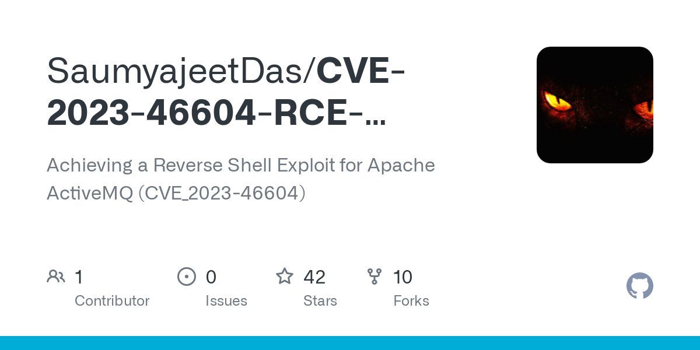</td>
</table></tr>
<table><tr>
<td>Quotes: <code>0</code></td>
<td>Replies: <code>0</code></td>
<td>Retweets: <code>14</code></td>
<td>Favorites: <code>32</code></td>
</tr></table>

---

# TheHackersNews
**https://twitter.com/TheHackersNews/status/1730443447675257077 _at 2023-12-01, 04:27:22_**
<blockquote>
🚨 Urgent: Update your devices ASAP!

Two critical security flaws in iOS, macOS, and Safari are under attack. Learn about CVE-2023-42916 &amp; CVE-2023-42917 and how they can expose your sensitive data while browsing.

Details here ➥ https://t.co/zV5s4fCVZm

#cybersecurity #hacking
</blockquote>

* https://thehackernews.com/2023/12/zero-day-alert-apple-rolls-out-ios.html

<table><tr>
<td>Quotes: <code>20</code></td>
<td>Replies: <code>8</code></td>
<td>Retweets: <code>257</code></td>
<td>Favorites: <code>398</code></td>
</tr></table>

---

