# wallet_guard
**https://twitter.com/wallet_guard/status/1747451110594347467 _at 2024-01-17, 02:49:45_**
<blockquote>
🚨 CHROME ZERO-DAY: CVE-2024-0519

The first Chrome zero-day exploit of 2024.

Update your Chrome browsers (Brave, Opera, Edge, etc.) now! Google has released emergency updates to address this vulnerability.

Share &amp; stay safe! 🫡 More information &amp; steps below ⬇️ https://t.co/LxnOMYe5oO
</blockquote>

<table><tr>
<td></td>
</table></tr>
<table><tr>
<td>Quotes: <code>16</code></td>
<td>Replies: <code>16</code></td>
<td>Retweets: <code>105</code></td>
<td>Favorites: <code>206</code></td>
</tr></table>

---

# TheHackersNews
**https://twitter.com/TheHackersNews/status/1747444890425024787 _at 2024-01-17, 02:25:02_**
<blockquote>
🔥 Chrome Zero-Day Alert!

Update your browser NOW to patch a new critical flaw exploited by hackers. This memory leak bug lets attackers steal your secrets.

Learn more about CVE-2024-0519: https://t.co/tlplEnSeYD

#cybersecurity #informationsecurity
</blockquote>

* https://thehackernews.com/2024/01/zero-day-alert-update-chrome-now-to-fix.html

<table><tr>
<td>Quotes: <code>8</code></td>
<td>Replies: <code>3</code></td>
<td>Retweets: <code>139</code></td>
<td>Favorites: <code>214</code></td>
</tr></table>

---

# standa_t
**https://twitter.com/standa_t/status/1747432523444191347 _at 2024-01-17, 01:35:53_**
<blockquote>
Write up of the HVCI bypass vuln (CVE-2024-21305) with @aall86 !
https://t.co/dJiiEpvPh3 https://t.co/pbMjmuX6iG
</blockquote>

* https://tandasat.github.io/blog/2024/01/15/CVE-2024-21305.html

<table><tr>
<td>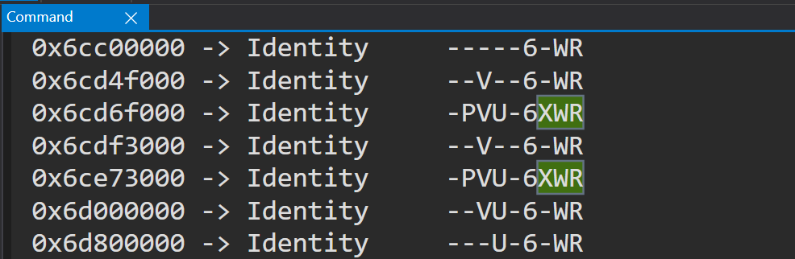</td>
</table></tr>
<table><tr>
<td>Quotes: <code>0</code></td>
<td>Replies: <code>2</code></td>
<td>Retweets: <code>20</code></td>
<td>Favorites: <code>39</code></td>
</tr></table>

---

# VietPetrus
**https://twitter.com/VietPetrus/status/1747296196505530780 _at 2024-01-16, 16:34:11_**
<blockquote>
I discovered the CVE-2023-22527 vulnerability leading to unauthenticated RCE on Confluence. Unfortunately, it couldn't be exploited on the latest versions. Nevertheless, Atlassian still awarded me a bounty as an encouragement. So nice 🩷 https://t.co/9NKWzS6QIE
</blockquote>

<table><tr>
<td>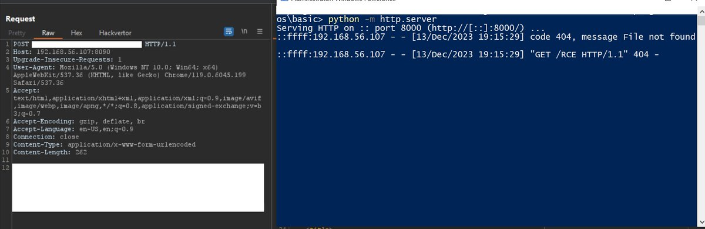</td>
<td>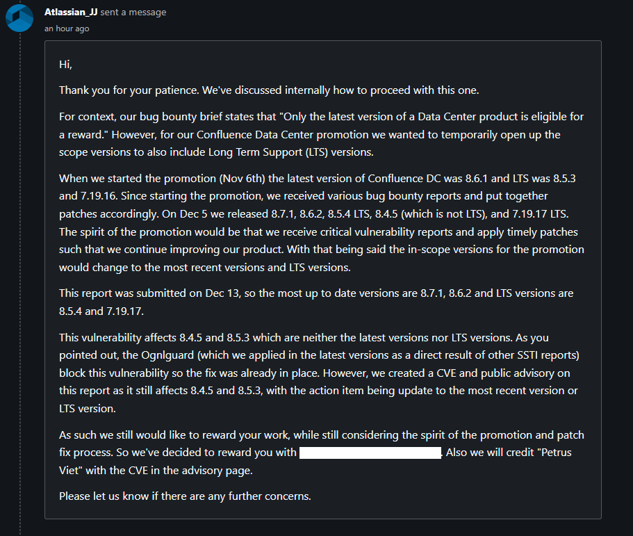</td>
</table></tr>
<table><tr>
<td>Quotes: <code>0</code></td>
<td>Replies: <code>4</code></td>
<td>Retweets: <code>8</code></td>
<td>Favorites: <code>76</code></td>
</tr></table>

---

# cyb3rops
**https://twitter.com/cyb3rops/status/1747259479564128687 _at 2024-01-16, 14:08:17_**
<blockquote>
RT @Volexity: .@Volexity provides an update on its Ivanti Connect Secure VPN report concerning chained exploitation of CVE-2024-21887/CVE-2…
</blockquote>

<table><tr>
<td>Quotes: <code>0</code></td>
<td>Replies: <code>0</code></td>
<td>Retweets: <code>103</code></td>
<td>Favorites: <code>0</code></td>
</tr></table>

---

# Dinosn
**https://twitter.com/Dinosn/status/1747249900515971279 _at 2024-01-16, 13:30:13_**
<blockquote>
RT @buffaloverflow: I reproduced the full chain of Ivanti Connect Secure CVE-2023-46805 (auth bypass) + CVE-2024-21887 (RCE) 🥳

While it is…
</blockquote>

<table><tr>
<td>Quotes: <code>0</code></td>
<td>Replies: <code>0</code></td>
<td>Retweets: <code>38</code></td>
<td>Favorites: <code>0</code></td>
</tr></table>

---

# Dinosn
**https://twitter.com/Dinosn/status/1747199382166929685 _at 2024-01-16, 10:09:28_**
<blockquote>
CVE-2023-34063 (CVSS 9.9): A Critical Flaw in VMware Aria Automation https://t.co/GDrNg5Q2tZ
</blockquote>

* https://securityonline.info/cve-2023-34063-cvss-9-9-a-critical-flaw-in-vmware-aria-automation/

<table><tr>
<td>Quotes: <code>0</code></td>
<td>Replies: <code>0</code></td>
<td>Retweets: <code>16</code></td>
<td>Favorites: <code>46</code></td>
</tr></table>

---

# kmkz_security
**https://twitter.com/kmkz_security/status/1747198054619291764 _at 2024-01-16, 10:04:12_**
<blockquote>
RT @Volexity: .@Volexity provides an update on its Ivanti Connect Secure VPN report concerning chained exploitation of CVE-2024-21887/CVE-2…
</blockquote>

<table><tr>
<td>Quotes: <code>0</code></td>
<td>Replies: <code>0</code></td>
<td>Retweets: <code>109</code></td>
<td>Favorites: <code>0</code></td>
</tr></table>

---

# HunterMapping
**https://twitter.com/HunterMapping/status/1747157760142459156 _at 2024-01-16, 07:24:05_**
<blockquote>
🚨Alert🚨Atlassian Confluence CVE-2023-22527
RCE Vulnerability In Confluence Data Center and Confluence Server  CVSS score：9.0 
📊461k+ Services are found
Affected version: Atlassian Confluence Data Center and Server 8.0.x/ 8.1.x/8.2.x/8.3.x/8.4.x/8.5.0-8.5.3
🔗Hunter… https://t.co/7uMmUXSHyC
</blockquote>

<table><tr>
<td></td>
</table></tr>
<table><tr>
<td>Quotes: <code>1</code></td>
<td>Replies: <code>0</code></td>
<td>Retweets: <code>23</code></td>
<td>Favorites: <code>83</code></td>
</tr></table>

---

# x0rz
**https://twitter.com/x0rz/status/1747156419030172058 _at 2024-01-16, 07:18:45_**
<blockquote>
RT @Volexity: .@Volexity provides an update on its Ivanti Connect Secure VPN report concerning chained exploitation of CVE-2024-21887/CVE-2…
</blockquote>

<table><tr>
<td>Quotes: <code>0</code></td>
<td>Replies: <code>0</code></td>
<td>Retweets: <code>105</code></td>
<td>Favorites: <code>0</code></td>
</tr></table>

---

# TheHackersNews
**https://twitter.com/TheHackersNews/status/1747155337499537776 _at 2024-01-16, 07:14:27_**
<blockquote>
⚠️ Windows users, beware!

Cybercriminals are weaponizing the CVE-2023-36025 Windows #vulnerability to deploy "Phemedrone Stealer," an open-source data stealer, that targets browsers, crypto wallets, and chat apps.

Learn more: https://t.co/bCC1IxAV22

#cybersecurity
</blockquote>

* https://thehackernews.com/2024/01/hackers-weaponize-windows-flaw-to.html

<table><tr>
<td>Quotes: <code>0</code></td>
<td>Replies: <code>1</code></td>
<td>Retweets: <code>44</code></td>
<td>Favorites: <code>54</code></td>
</tr></table>

---

# wvuuuuuuuuuuuuu
**https://twitter.com/wvuuuuuuuuuuuuu/status/1747047562211651691 _at 2024-01-16, 00:06:12_**
<blockquote>
RT @Volexity: .@Volexity provides an update on its Ivanti Connect Secure VPN report concerning chained exploitation of CVE-2024-21887/CVE-2…
</blockquote>

<table><tr>
<td>Quotes: <code>0</code></td>
<td>Replies: <code>0</code></td>
<td>Retweets: <code>97</code></td>
<td>Favorites: <code>0</code></td>
</tr></table>

---

# cyber_advising
**https://twitter.com/cyber_advising/status/1746954633589785078 _at 2024-01-15, 17:56:56_**
<blockquote>
CVE-2023-26360: Unauthenticated RCE in Adobe Coldfusion.

PoC
https://t.co/UhWmip3uLb https://t.co/atdxo3H4F6
</blockquote>

* https://blog.securelayer7.net/unauthorized-rce-in-adobe-coldfusion/

<table><tr>
<td>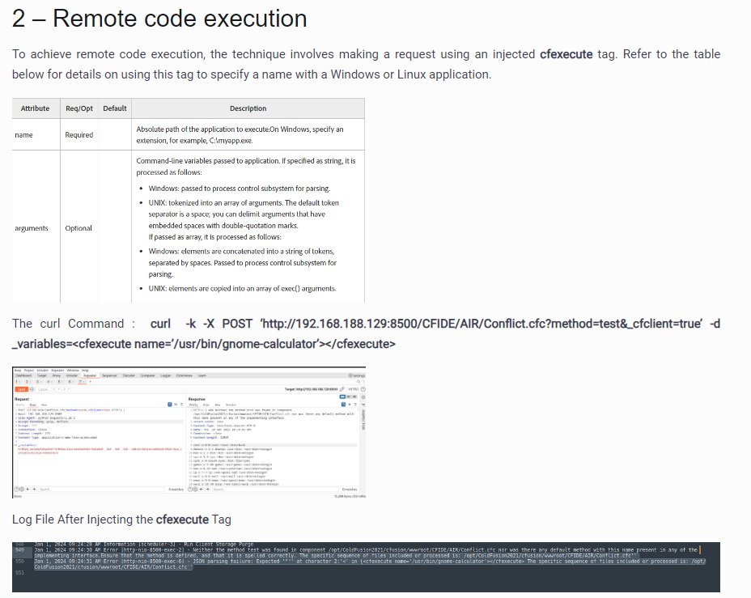</td>
</table></tr>
<table><tr>
<td>Quotes: <code>0</code></td>
<td>Replies: <code>0</code></td>
<td>Retweets: <code>26</code></td>
<td>Favorites: <code>89</code></td>
</tr></table>

---

# cyber_advising
**https://twitter.com/cyber_advising/status/1746954228621246977 _at 2024-01-15, 17:55:19_**
<blockquote>
CVE-2023-36003: Privilege escalation using the XAML diagnostics API.

PoC
https://t.co/lP1FxclNhX
</blockquote>

* https://github.com/m417z/CVE-2023-36003-POC

<table><tr>
<td>Quotes: <code>0</code></td>
<td>Replies: <code>0</code></td>
<td>Retweets: <code>8</code></td>
<td>Favorites: <code>33</code></td>
</tr></table>

---

# cyber_advising
**https://twitter.com/cyber_advising/status/1746953384077226352 _at 2024-01-15, 17:51:58_**
<blockquote>
Ivanti Secure Access VPN - SSL VPN: CVE-2023-46805 &amp; CVE-2024-21887

PoC
https://t.co/KW6eRlNfSe https://t.co/tmOaJIYt7C
</blockquote>

* https://labs.watchtowr.com/welcome-to-2024-the-sslvpn-chaos-continues-ivanti-cve-2023-46805-cve-2024-21887/

<table><tr>
<td>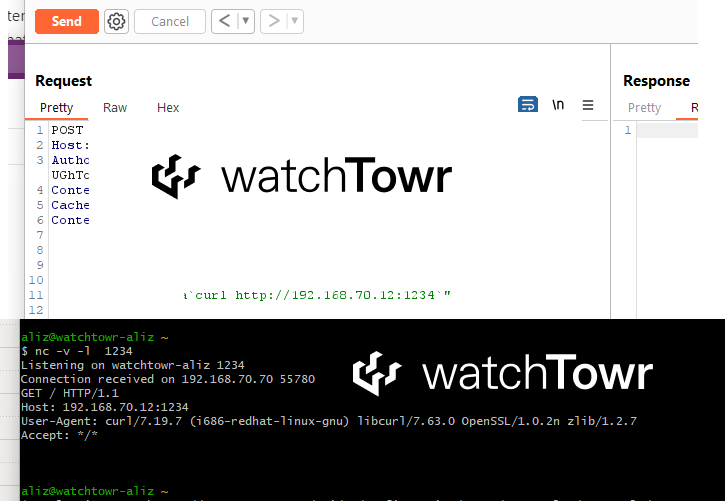</td>
</table></tr>
<table><tr>
<td>Quotes: <code>1</code></td>
<td>Replies: <code>0</code></td>
<td>Retweets: <code>13</code></td>
<td>Favorites: <code>41</code></td>
</tr></table>

---

# bishopfox
**https://twitter.com/bishopfox/status/1746942721762443694 _at 2024-01-15, 17:09:36_**
<blockquote>
SonicWall next-gen firewall (NGFW) series 6 and 7 devices are affected by 2 DoS #vulnerabilities that can lead to remote code execution (RCE): #CVE-2022-22274 and CVE-2023-0656. Bishop Fox research revealed that these issues are fundamentally the same, but exploitable at… https://t.co/vgHquSp3Dc
</blockquote>

<table><tr>
<td></td>
</table></tr>
<table><tr>
<td>Quotes: <code>1</code></td>
<td>Replies: <code>2</code></td>
<td>Retweets: <code>10</code></td>
<td>Favorites: <code>37</code></td>
</tr></table>

---

# steventseeley
**https://twitter.com/steventseeley/status/1746761587942453494 _at 2024-01-15, 05:09:50_**
<blockquote>
First bug for 2024 and first (public) targeted exploitation of CVE-2023-50164/S2-066 Apache Struts File Upload RCE! Thats 10 years of VR with public disclosure!
</blockquote>

<table><tr>
<td>Quotes: <code>1</code></td>
<td>Replies: <code>1</code></td>
<td>Retweets: <code>20</code></td>
<td>Favorites: <code>117</code></td>
</tr></table>

---

# jedisct1
**https://twitter.com/jedisct1/status/1746490540684632551 _at 2024-01-14, 11:12:47_**
<blockquote>
RT @JusticeRage: RCE in Redis &lt; 7.2.4 (CVE-2023-41056)
I haven't seen a lot of noise about this one. Redis is everywhere (NextCloud, Mastod…
</blockquote>

<table><tr>
<td>Quotes: <code>0</code></td>
<td>Replies: <code>0</code></td>
<td>Retweets: <code>73</code></td>
<td>Favorites: <code>0</code></td>
</tr></table>

---

# wvuuuuuuuuuuuuu
**https://twitter.com/wvuuuuuuuuuuuuu/status/1746331733023146247 _at 2024-01-14, 00:41:45_**
<blockquote>
RT @watchtowrcyber: 🚀 We have reproduced both in-the-wild exploited Ivanti zero-days (CVE-2023-46805 &amp; CVE-2024-21887) 🥷

We've released so…
</blockquote>

<table><tr>
<td>Quotes: <code>0</code></td>
<td>Replies: <code>0</code></td>
<td>Retweets: <code>35</code></td>
<td>Favorites: <code>0</code></td>
</tr></table>

---

# Dinosn
**https://twitter.com/Dinosn/status/1746190732375847147 _at 2024-01-13, 15:21:27_**
<blockquote>
Welcome To 2024, The SSLVPN Chaos Continues - Ivanti CVE-2023-46805 &amp; CVE-2024-21887 https://t.co/TXz5OwpcVK
</blockquote>

* https://labs.watchtowr.com/welcome-to-2024-the-sslvpn-chaos-continues-ivanti-cve-2023-46805-cve-2024-21887/

<table><tr>
<td>Quotes: <code>0</code></td>
<td>Replies: <code>0</code></td>
<td>Retweets: <code>12</code></td>
<td>Favorites: <code>38</code></td>
</tr></table>

---

# wdormann
**https://twitter.com/wdormann/status/1746182026246402548 _at 2024-01-13, 14:46:52_**
<blockquote>
RT @watchtowrcyber: 🚀 We have reproduced both in-the-wild exploited Ivanti zero-days (CVE-2023-46805 &amp; CVE-2024-21887) 🥷

We've released so…
</blockquote>

<table><tr>
<td>Quotes: <code>0</code></td>
<td>Replies: <code>0</code></td>
<td>Retweets: <code>35</code></td>
<td>Favorites: <code>0</code></td>
</tr></table>

---

# ptracesecurity
**https://twitter.com/ptracesecurity/status/1746147618189709581 _at 2024-01-13, 12:30:08_**
<blockquote>
CVE-2024-20656 – Local Privilege Escalation in the VSStandardCollectorService150 Service https://t.co/x4VrWu0rIX #pentesting #cybersecurity #Infosec https://t.co/kXTe6ktZ14
</blockquote>

* https://www.mdsec.co.uk/2024/01/cve-2024-20656-local-privilege-escalation-in-vsstandardcollectorservice150-service/

<table><tr>
<td>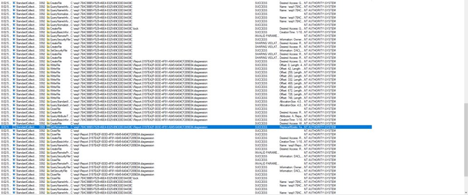</td>
<td>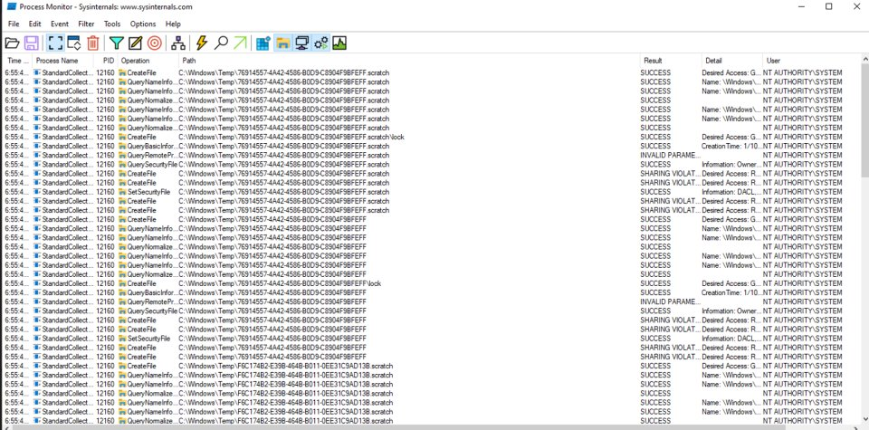</td>
<td>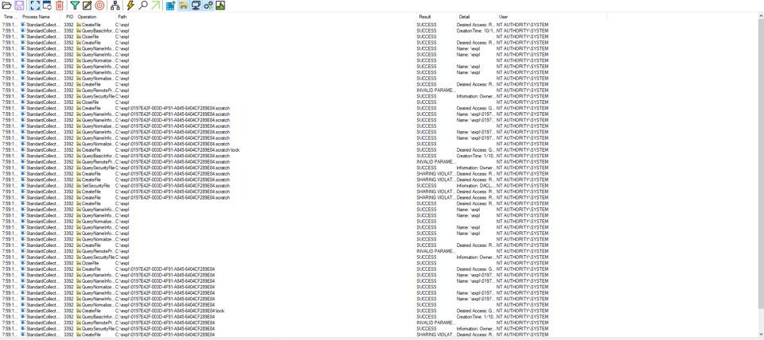</td>
<td>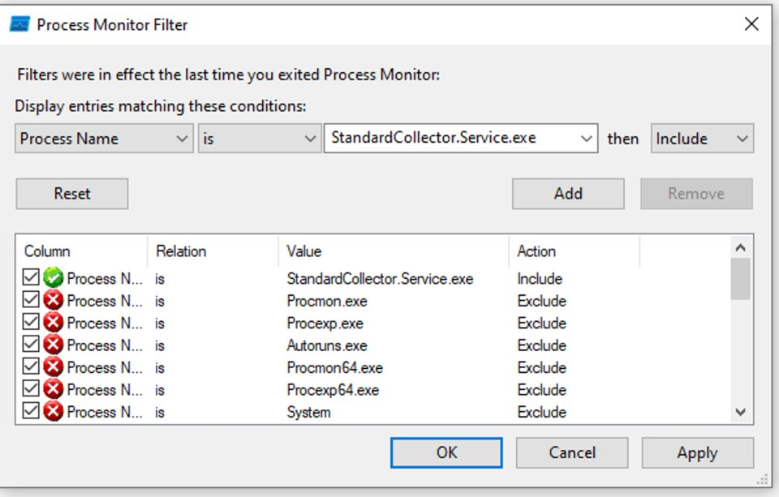</td>
</table></tr>
<table><tr>
<td>Quotes: <code>0</code></td>
<td>Replies: <code>0</code></td>
<td>Retweets: <code>13</code></td>
<td>Favorites: <code>52</code></td>
</tr></table>

---

# TheHackersNews
**https://twitter.com/TheHackersNews/status/1746121570571960764 _at 2024-01-13, 10:46:38_**
<blockquote>
🚨 Critical Update! Juniper Networks addresses a major 9.8-rated RCE #vulnerability in SRX Series firewalls &amp; EX Series switches.

CVE-2024-21591 details here: https://t.co/JGccZ8wLOf

#hacking
</blockquote>

* https://thehackernews.com/2024/01/critical-rce-vulnerability-uncovered-in.html

<table><tr>
<td>Quotes: <code>2</code></td>
<td>Replies: <code>1</code></td>
<td>Retweets: <code>52</code></td>
<td>Favorites: <code>96</code></td>
</tr></table>

---

# steventseeley
**https://twitter.com/steventseeley/status/1746099074473050386 _at 2024-01-13, 09:17:14_**
<blockquote>
It appears that @AllegraSoftware forgot to mention that they were vulnerable to CVE-2023-50164 struts pre-auth RCE late last year. I think it might be time to drop a full exploit? https://t.co/piXOrXBVy8
</blockquote>

* https://www.trackplus.com/en/service/release-notes-reader/7-5-1-release-notes-2.html

<table><tr>
<td>Quotes: <code>1</code></td>
<td>Replies: <code>2</code></td>
<td>Retweets: <code>7</code></td>
<td>Favorites: <code>65</code></td>
</tr></table>

---

# momika233
**https://twitter.com/momika233/status/1746095807517114660 _at 2024-01-13, 09:04:16_**
<blockquote>
Chrome's V8 type confusion CVE-2023-4069
https://t.co/5hCBtAh1Fb
</blockquote>

* https://github.com/github/securitylab/tree/main/SecurityExploits/Chrome/v8/CVE_2023_4069

<table><tr>
<td>Quotes: <code>0</code></td>
<td>Replies: <code>3</code></td>
<td>Retweets: <code>7</code></td>
<td>Favorites: <code>35</code></td>
</tr></table>

---

# x0rz
**https://twitter.com/x0rz/status/1746069943781646826 _at 2024-01-13, 07:21:29_**
<blockquote>
RT @Gi7w0rm: One has to admire @circl_lu for truthfully sharing their opinion regarding #Ivanti 's handling of the 2 #0day s
#CVE-2023-4680…
</blockquote>

<table><tr>
<td>Quotes: <code>0</code></td>
<td>Replies: <code>0</code></td>
<td>Retweets: <code>39</code></td>
<td>Favorites: <code>0</code></td>
</tr></table>

---

# hack_git
**https://twitter.com/hack_git/status/1746062732103737543 _at 2024-01-13, 06:52:50_**
<blockquote>
CVE-2024-20656 

Windows LPE in the VSStandardCollectorService150 service

https://t.co/YCTRscoqFN

#cve #cybersecurity #infosec https://t.co/7zYvFVdq2R
</blockquote>

* https://github.com/Wh04m1001/CVE-2024-20656

<table><tr>
<td>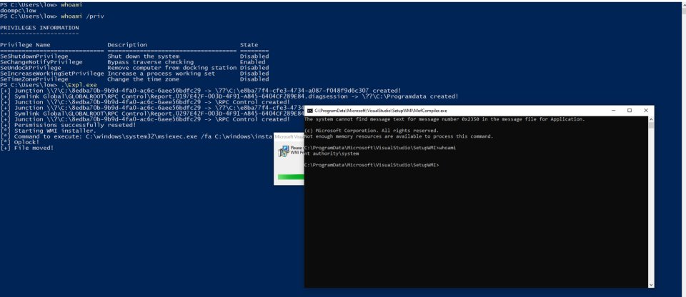</td>
</table></tr>
<table><tr>
<td>Quotes: <code>0</code></td>
<td>Replies: <code>0</code></td>
<td>Retweets: <code>29</code></td>
<td>Favorites: <code>105</code></td>
</tr></table>

---

# piedpiper1616
**https://twitter.com/piedpiper1616/status/1745983773009965559 _at 2024-01-13, 01:39:04_**
<blockquote>
RT @MDSecLabs: Exploiting CVE-2024-20656, a Local Privilege Escalation in the VSStandardCollectorService150 Service https://t.co/zCj3o31RPn…
</blockquote>

* https://www.mdsec.co.uk/2024/01/cve-2024-20656-local-privilege-escalation-in-vsstandardcollectorservice150-service/

<table><tr>
<td>Quotes: <code>0</code></td>
<td>Replies: <code>0</code></td>
<td>Retweets: <code>115</code></td>
<td>Favorites: <code>0</code></td>
</tr></table>

---

# hackerfantastic
**https://twitter.com/hackerfantastic/status/1745973775819014403 _at 2024-01-13, 00:59:21_**
<blockquote>
RT @reverseame: Analysis of VirtualBox CVE-2023-21987 and CVE-2023-21991 https://t.co/KXagYQVM5a
</blockquote>

* https://qriousec.github.io/post/vbox-pwn2own-2023/

<table><tr>
<td>Quotes: <code>0</code></td>
<td>Replies: <code>0</code></td>
<td>Retweets: <code>31</code></td>
<td>Favorites: <code>0</code></td>
</tr></table>

---

# cyb3rops
**https://twitter.com/cyb3rops/status/1745871283735212123 _at 2024-01-12, 18:12:05_**
<blockquote>
RT @MDSecLabs: Exploiting CVE-2024-20656, a Local Privilege Escalation in the VSStandardCollectorService150 Service https://t.co/zCj3o31RPn…
</blockquote>

* https://www.mdsec.co.uk/2024/01/cve-2024-20656-local-privilege-escalation-in-vsstandardcollectorservice150-service/

<table><tr>
<td>Quotes: <code>0</code></td>
<td>Replies: <code>0</code></td>
<td>Retweets: <code>117</code></td>
<td>Favorites: <code>0</code></td>
</tr></table>

---

# cyb3rops
**https://twitter.com/cyb3rops/status/1745871232010965403 _at 2024-01-12, 18:11:53_**
<blockquote>
RT @HackingLZ: Another one? CVE-2024-21591 Juniper Pre Auth/RCE

https://t.co/JK85ORet9S
</blockquote>

* https://www.bleepingcomputer.com/news/security/juniper-warns-of-critical-rce-bug-in-its-firewalls-and-switches/

<table><tr>
<td>Quotes: <code>0</code></td>
<td>Replies: <code>0</code></td>
<td>Retweets: <code>36</code></td>
<td>Favorites: <code>0</code></td>
</tr></table>

---

# TheHackersNews
**https://twitter.com/TheHackersNews/status/1745794541041373399 _at 2024-01-12, 13:07:08_**
<blockquote>
#GitLab users, beware! Security updates released to address critical vulnerabilities (CVE-2023-7028 and CVE-2023-5356).

One of these could allow account takeover without user interaction.

Find details here: https://t.co/xgyuMfbj6Y

#cybersecurity #hacking #infosec
</blockquote>

* https://thehackernews.com/2024/01/urgent-gitlab-releases-patch-for.html

<table><tr>
<td>Quotes: <code>5</code></td>
<td>Replies: <code>5</code></td>
<td>Retweets: <code>53</code></td>
<td>Favorites: <code>108</code></td>
</tr></table>

---

# momika233
**https://twitter.com/momika233/status/1745777697069150454 _at 2024-01-12, 12:00:12_**
<blockquote>
RT @rwincey: GitLab CVE-2023-7028 POC

user[email][]=valid@email.com&amp;user[email][]=attacker@email.com 

- PWNED
</blockquote>

<table><tr>
<td>Quotes: <code>0</code></td>
<td>Replies: <code>0</code></td>
<td>Retweets: <code>148</code></td>
<td>Favorites: <code>0</code></td>
</tr></table>

---

# cyb3rops
**https://twitter.com/cyb3rops/status/1745741334923637002 _at 2024-01-12, 09:35:43_**
<blockquote>
RT @Volexity: .@Volexity detected an incident where it discovered a threat actor chained 2 #0days in Ivanti Connect Secure, CVE-2023-46805/…
</blockquote>

<table><tr>
<td>Quotes: <code>0</code></td>
<td>Replies: <code>0</code></td>
<td>Retweets: <code>163</code></td>
<td>Favorites: <code>0</code></td>
</tr></table>

---

# piedpiper1616
**https://twitter.com/piedpiper1616/status/1745656907652817193 _at 2024-01-12, 04:00:14_**
<blockquote>
GitHub - m417z/CVE-2023-36003-POC: Privilege escalation using the XAML diagnostics API (CVE-2023-36003) - https://t.co/xl3v685NG1
</blockquote>

* https://github.com/m417z/CVE-2023-36003-POC

<table><tr>
<td>Quotes: <code>0</code></td>
<td>Replies: <code>0</code></td>
<td>Retweets: <code>12</code></td>
<td>Favorites: <code>33</code></td>
</tr></table>

---

# chompie1337
**https://twitter.com/chompie1337/status/1745573348765995099 _at 2024-01-11, 22:28:12_**
<blockquote>
RT @m417z: Privilege escalation using the XAML diagnostics API (CVE-2023-36003) - a write-up of a vulnerability that I discovered in Window…
</blockquote>

<table><tr>
<td>Quotes: <code>0</code></td>
<td>Replies: <code>0</code></td>
<td>Retweets: <code>33</code></td>
<td>Favorites: <code>0</code></td>
</tr></table>

---

# DailyDarkWeb
**https://twitter.com/DailyDarkWeb/status/1745520957484044476 _at 2024-01-11, 19:00:01_**
<blockquote>
A threat actor claims to have a target, a company with $22 billion in revenue, vulnerable to CVE-2019-11510

CVE-2019-11510 - In Pulse Connect Secure an unauthenticated remote attacker can send a specially crafted URI to perform an arbitrary file reading vulnerability.

#DarkWeb https://t.co/cjK6RBg60P
</blockquote>

<table><tr>
<td>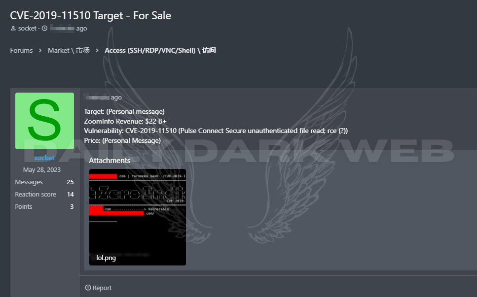</td>
</table></tr>
<table><tr>
<td>Quotes: <code>0</code></td>
<td>Replies: <code>0</code></td>
<td>Retweets: <code>18</code></td>
<td>Favorites: <code>71</code></td>
</tr></table>

---

# hetmehtaa
**https://twitter.com/hetmehtaa/status/1745520211032465820 _at 2024-01-11, 18:57:03_**
<blockquote>
Unauthenticated RCE in Adobe Coldfusion – CVE-2023-26360

#Infosec #RCE #BugBounty https://t.co/iHlXwNUyIc
</blockquote>

* https://blog.securelayer7.net/unauthorized-rce-in-adobe-coldfusion/

<table><tr>
<td>Quotes: <code>0</code></td>
<td>Replies: <code>0</code></td>
<td>Retweets: <code>10</code></td>
<td>Favorites: <code>39</code></td>
</tr></table>

---

# payloadartist
**https://twitter.com/payloadartist/status/1745500192139546688 _at 2024-01-11, 17:37:30_**
<blockquote>
Debug Case Study: SharePoint Pre-Auth Code Injection RCE chain CVE-2023-29357 &amp; CVE-2023-24955

Interesting memory dump analysis by @DebugPrivilege 

https://t.co/TbED9DJvCU

#infosec #cybersecurity #hacking https://t.co/PU0mp1tsZC
</blockquote>

* https://github.com/DebugPrivilege/InsightEngineering/tree/main/Debugging%20Case%20Studies/Debug%20Case%20Study%3A%20SharePoint%20Pre-Auth%20Code%20Injection%20RCE%20chain%20CVE-2023-29357%20%26%20CVE-2023-24955

<table><tr>
<td>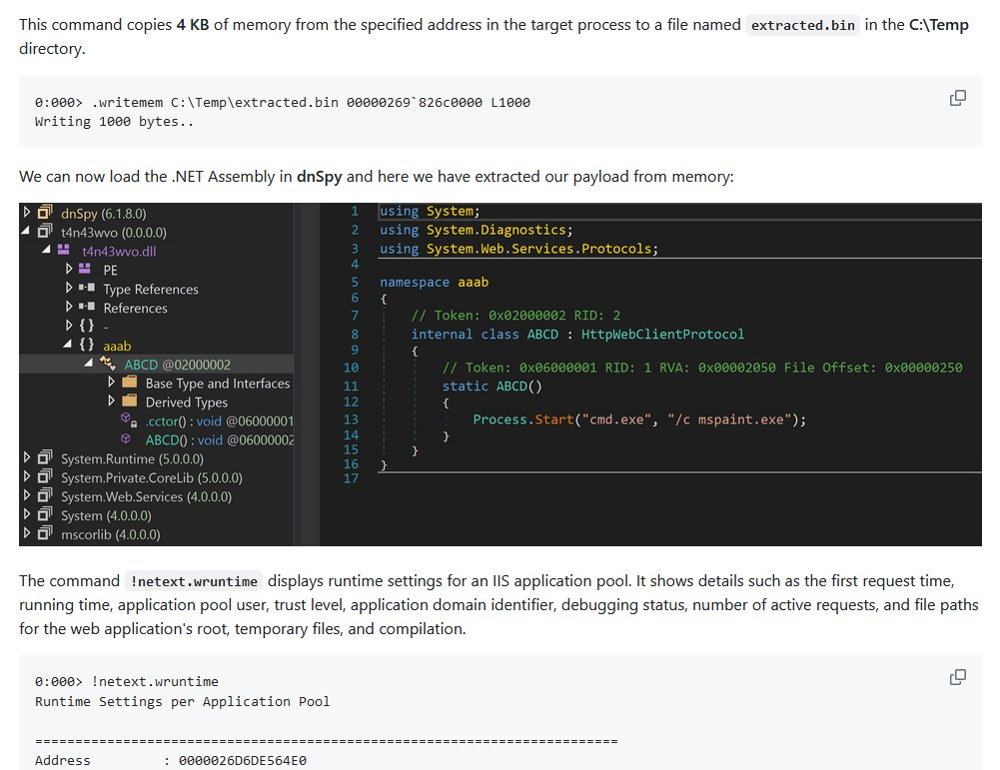</td>
<td>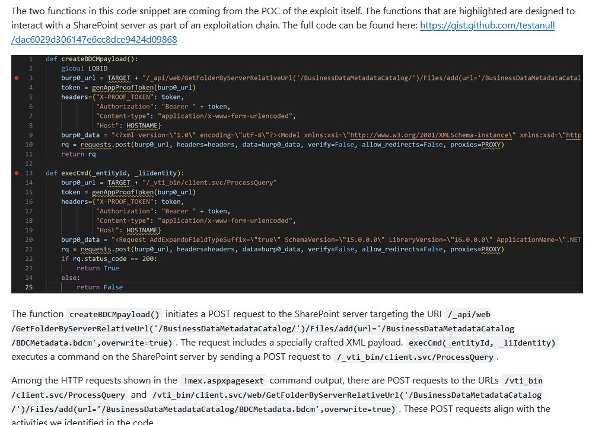</td>
<td>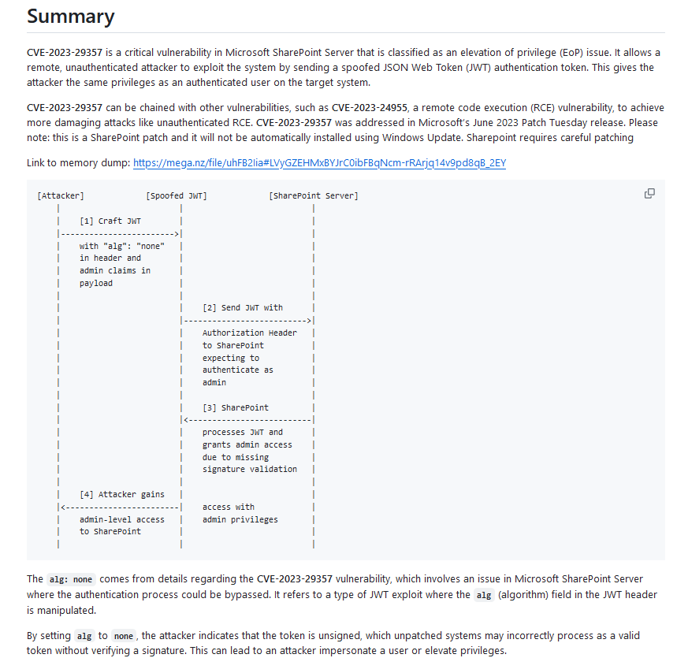</td>
</table></tr>
<table><tr>
<td>Quotes: <code>0</code></td>
<td>Replies: <code>0</code></td>
<td>Retweets: <code>27</code></td>
<td>Favorites: <code>76</code></td>
</tr></table>

---

# Synacktiv
**https://twitter.com/Synacktiv/status/1745351273514221591 _at 2024-01-11, 07:45:45_**
<blockquote>
Our ninja @_Worty identified a remote code execution from a privileged user in Cisco Access Point WAP371. This vulnerability referenced as CVE-2024-20287 will not be patched, apply network restrictions to protect your appliances.
https://t.co/lDFkEqkvXP
</blockquote>

* https://www.synacktiv.com/advisories/remote-code-execution-on-cisco-access-point-wap371-firmware-1307

<table><tr>
<td>Quotes: <code>1</code></td>
<td>Replies: <code>7</code></td>
<td>Retweets: <code>37</code></td>
<td>Favorites: <code>176</code></td>
</tr></table>

---

# TheHackersNews
**https://twitter.com/TheHackersNews/status/1745322177736409140 _at 2024-01-11, 05:50:08_**
<blockquote>
⚠️ Urgent Alert: Chinese hackers exploiting two NEW ZERO-DAY vulnerabilities (CVE-2023-46805 &amp; CVE-2024-21887) in Ivanti Connect Secure and Policy Secure. 

Read more: https://t.co/ViOGfKOORp

Patches incoming, but immediate action (temporary workarounds) is needed.
</blockquote>

* https://thehackernews.com/2024/01/chinese-hackers-exploit-zero-day-flaws.html

<table><tr>
<td>Quotes: <code>3</code></td>
<td>Replies: <code>0</code></td>
<td>Retweets: <code>95</code></td>
<td>Favorites: <code>158</code></td>
</tr></table>

---

# TheHackersNews
**https://twitter.com/TheHackersNews/status/1745309090874626333 _at 2024-01-11, 04:58:08_**
<blockquote>
🚨 Cisco patches a serious flaw in Unity Connection (CVE-2024-20272, CVSS 7.3).

Don't let attackers compromise your system. Check if your version is affected and update now.

Full details here 👉 https://t.co/NXyRCVCMZ7

#cybersecurity #informationsecurity
</blockquote>

* https://thehackernews.com/2024/01/cisco-fixes-high-risk-vulnerability.html

<table><tr>
<td>Quotes: <code>3</code></td>
<td>Replies: <code>1</code></td>
<td>Retweets: <code>47</code></td>
<td>Favorites: <code>81</code></td>
</tr></table>

---

# piedpiper1616
**https://twitter.com/piedpiper1616/status/1745224159087788540 _at 2024-01-10, 23:20:38_**
<blockquote>
RT @DebugPrivilege: Did a write-up about analyzing 'SharePoint Pre-Auth Code Injection RCE chain CVE-2023-29357 &amp; CVE-2023-24955' through a…
</blockquote>

<table><tr>
<td>Quotes: <code>0</code></td>
<td>Replies: <code>0</code></td>
<td>Retweets: <code>118</code></td>
<td>Favorites: <code>0</code></td>
</tr></table>

---

# x0rz
**https://twitter.com/x0rz/status/1745188118490202221 _at 2024-01-10, 20:57:26_**
<blockquote>
RT @Volexity: .@Volexity detected an incident where it discovered a threat actor chained 2 #0days in Ivanti Connect Secure, CVE-2023-46805/…
</blockquote>

<table><tr>
<td>Quotes: <code>0</code></td>
<td>Replies: <code>0</code></td>
<td>Retweets: <code>163</code></td>
<td>Favorites: <code>0</code></td>
</tr></table>

---

# kmkz_security
**https://twitter.com/kmkz_security/status/1745186858378604919 _at 2024-01-10, 20:52:25_**
<blockquote>
RT @Volexity: .@Volexity detected an incident where it discovered a threat actor chained 2 #0days in Ivanti Connect Secure, CVE-2023-46805/…
</blockquote>

<table><tr>
<td>Quotes: <code>0</code></td>
<td>Replies: <code>0</code></td>
<td>Retweets: <code>163</code></td>
<td>Favorites: <code>0</code></td>
</tr></table>

---

# 1ZRR4H
**https://twitter.com/1ZRR4H/status/1745176269505912839 _at 2024-01-10, 20:10:21_**
<blockquote>
RT @Volexity: .@Volexity detected an incident where it discovered a threat actor chained 2 #0days in Ivanti Connect Secure, CVE-2023-46805/…
</blockquote>

<table><tr>
<td>Quotes: <code>0</code></td>
<td>Replies: <code>0</code></td>
<td>Retweets: <code>150</code></td>
<td>Favorites: <code>0</code></td>
</tr></table>

---

# buffaloverflow
**https://twitter.com/buffaloverflow/status/1745174347126346166 _at 2024-01-10, 20:02:42_**
<blockquote>
RT @Volexity: .@Volexity detected an incident where it discovered a threat actor chained 2 #0days in Ivanti Connect Secure, CVE-2023-46805/…
</blockquote>

<table><tr>
<td>Quotes: <code>0</code></td>
<td>Replies: <code>0</code></td>
<td>Retweets: <code>163</code></td>
<td>Favorites: <code>0</code></td>
</tr></table>

---

# cyb3rops
**https://twitter.com/cyb3rops/status/1745167720256045428 _at 2024-01-10, 19:36:22_**
<blockquote>
RT @ImposeCost: CVE-2023-46805 (Authentication Bypass) &amp; CVE-2024-21887 (Command Injection) for Ivanti Connect Secure and Ivanti Policy Sec…
</blockquote>

<table><tr>
<td>Quotes: <code>0</code></td>
<td>Replies: <code>0</code></td>
<td>Retweets: <code>31</code></td>
<td>Favorites: <code>0</code></td>
</tr></table>

---

# wvuuuuuuuuuuuuu
**https://twitter.com/wvuuuuuuuuuuuuu/status/1745163805481369772 _at 2024-01-10, 19:20:49_**
<blockquote>
RT @Volexity: .@Volexity detected an incident where it discovered a threat actor chained 2 #0days in Ivanti Connect Secure, CVE-2023-46805/…
</blockquote>

<table><tr>
<td>Quotes: <code>0</code></td>
<td>Replies: <code>0</code></td>
<td>Retweets: <code>164</code></td>
<td>Favorites: <code>0</code></td>
</tr></table>

---

# wvuuuuuuuuuuuuu
**https://twitter.com/wvuuuuuuuuuuuuu/status/1745163746119430554 _at 2024-01-10, 19:20:35_**
<blockquote>
RT @DebugPrivilege: Did a write-up about analyzing 'SharePoint Pre-Auth Code Injection RCE chain CVE-2023-29357 &amp; CVE-2023-24955' through a…
</blockquote>

<table><tr>
<td>Quotes: <code>0</code></td>
<td>Replies: <code>0</code></td>
<td>Retweets: <code>118</code></td>
<td>Favorites: <code>0</code></td>
</tr></table>

---

# Volexity
**https://twitter.com/Volexity/status/1745158750472728666 _at 2024-01-10, 19:00:44_**
<blockquote>
.@Volexity detected an incident where it discovered a threat actor chained 2 #0days in Ivanti Connect Secure, CVE-2023-46805/CVE-2024-21887, to achieve RCE, modifying components of the software to backdoor the device.

https://t.co/RibC5G0aOp

#dfir #threatintel #memoryforensics
</blockquote>

* https://www.volexity.com/blog/2024/01/10/active-exploitation-of-two-zero-day-vulnerabilities-in-ivanti-connect-secure-vpn

<table><tr>
<td>Quotes: <code>21</code></td>
<td>Replies: <code>5</code></td>
<td>Retweets: <code>164</code></td>
<td>Favorites: <code>302</code></td>
</tr></table>

---

# Dinosn
**https://twitter.com/Dinosn/status/1745146115274498159 _at 2024-01-10, 18:10:31_**
<blockquote>
Unauthenticated RCE in Adobe Coldfusion – CVE-2023-26360 https://t.co/s6NqXVyEKl
</blockquote>

* https://blog.securelayer7.net/unauthorized-rce-in-adobe-coldfusion/

<table><tr>
<td>Quotes: <code>0</code></td>
<td>Replies: <code>0</code></td>
<td>Retweets: <code>24</code></td>
<td>Favorites: <code>81</code></td>
</tr></table>

---

# hackerfantastic
**https://twitter.com/hackerfantastic/status/1745115058345062492 _at 2024-01-10, 16:07:07_**
<blockquote>
RT @akamai_research: Akamai researcher Ben Barnea found a remote code execution vulnerability in the MSHTML platform (CVE-2023-35628) that…
</blockquote>

<table><tr>
<td>Quotes: <code>0</code></td>
<td>Replies: <code>0</code></td>
<td>Retweets: <code>75</code></td>
<td>Favorites: <code>0</code></td>
</tr></table>

---

# hackerfantastic
**https://twitter.com/hackerfantastic/status/1745114351902625871 _at 2024-01-10, 16:04:18_**
<blockquote>
RT @DebugPrivilege: Did a write-up about analyzing 'SharePoint Pre-Auth Code Injection RCE chain CVE-2023-29357 &amp; CVE-2023-24955' through a…
</blockquote>

<table><tr>
<td>Quotes: <code>0</code></td>
<td>Replies: <code>0</code></td>
<td>Retweets: <code>99</code></td>
<td>Favorites: <code>0</code></td>
</tr></table>

---

# testanull
**https://twitter.com/testanull/status/1745083104161648746 _at 2024-01-10, 14:00:08_**
<blockquote>
RT @DebugPrivilege: Did a write-up about analyzing 'SharePoint Pre-Auth Code Injection RCE chain CVE-2023-29357 &amp; CVE-2023-24955' through a…
</blockquote>

<table><tr>
<td>Quotes: <code>0</code></td>
<td>Replies: <code>0</code></td>
<td>Retweets: <code>118</code></td>
<td>Favorites: <code>0</code></td>
</tr></table>

---

# wdormann
**https://twitter.com/wdormann/status/1745079381783982409 _at 2024-01-10, 13:45:21_**
<blockquote>
RT @DebugPrivilege: Did a write-up about analyzing 'SharePoint Pre-Auth Code Injection RCE chain CVE-2023-29357 &amp; CVE-2023-24955' through a…
</blockquote>

<table><tr>
<td>Quotes: <code>0</code></td>
<td>Replies: <code>0</code></td>
<td>Retweets: <code>118</code></td>
<td>Favorites: <code>0</code></td>
</tr></table>

---

# DebugPrivilege
**https://twitter.com/DebugPrivilege/status/1745075738783453604 _at 2024-01-10, 13:30:52_**
<blockquote>
Did a write-up about analyzing 'SharePoint Pre-Auth Code Injection RCE chain CVE-2023-29357 &amp; CVE-2023-24955' through a memory dump of the w3wp.exe process. I cover different debugging techniques that can be applied to other w3wp.exe dumps as well. https://t.co/9EYBfr4opF https://t.co/X2NMluwQsL
</blockquote>

* https://github.com/DebugPrivilege/InsightEngineering/tree/main/Debugging%20Case%20Studies/Debug%20Case%20Study%3A%20SharePoint%20Pre-Auth%20Code%20Injection%20RCE%20chain%20CVE-2023-29357%20%26%20CVE-2023-24955

<table><tr>
<td></td>
</table></tr>
<table><tr>
<td>Quotes: <code>1</code></td>
<td>Replies: <code>5</code></td>
<td>Retweets: <code>118</code></td>
<td>Favorites: <code>303</code></td>
</tr></table>

---

# _r_netsec
**https://twitter.com/_r_netsec/status/1745063716788527325 _at 2024-01-10, 12:43:06_**
<blockquote>
Unauthenticated RCE in Adobe Coldfusion – CVE-2023-26360 https://t.co/k770Dfxv7Q
</blockquote>

* https://blog.securelayer7.net/unauthorized-rce-in-adobe-coldfusion/

<table><tr>
<td>Quotes: <code>2</code></td>
<td>Replies: <code>0</code></td>
<td>Retweets: <code>20</code></td>
<td>Favorites: <code>50</code></td>
</tr></table>

---

# Dinosn
**https://twitter.com/Dinosn/status/1745032601822187848 _at 2024-01-10, 10:39:28_**
<blockquote>
CVE-2023-41056: Redis Remote Code Execution Vulnerability https://t.co/rFBi9pqhEH
</blockquote>

* https://securityonline.info/cve-2023-41056-redis-remote-code-execution-vulnerability/

<table><tr>
<td>Quotes: <code>2</code></td>
<td>Replies: <code>1</code></td>
<td>Retweets: <code>85</code></td>
<td>Favorites: <code>285</code></td>
</tr></table>

---

# HunterMapping
**https://twitter.com/HunterMapping/status/1745016756392108477 _at 2024-01-10, 09:36:30_**
<blockquote>
🚨Alert🚨CVE-2023-41056: Redis Remote Code Execution Vulnerability
Redis may incorrectly handle resizing of memory buffers which can result in incorrect accounting of buffer sizes and lead to heap overflow and potential remote code execution.

📊 1.4M+ services are found on the… https://t.co/CDwt2l9GMh
</blockquote>

<table><tr>
<td>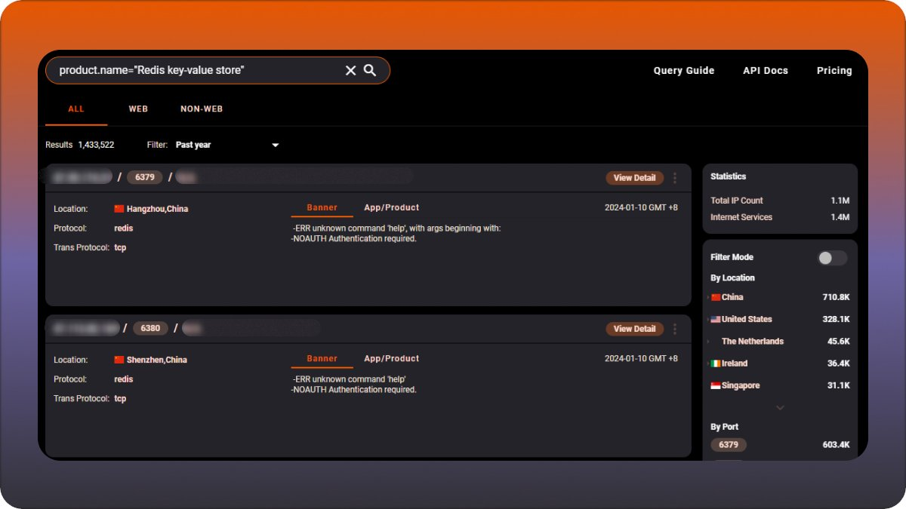</td>
</table></tr>
<table><tr>
<td>Quotes: <code>0</code></td>
<td>Replies: <code>0</code></td>
<td>Retweets: <code>42</code></td>
<td>Favorites: <code>124</code></td>
</tr></table>

---

# ptracesecurity
**https://twitter.com/ptracesecurity/status/1744913217762005411 _at 2024-01-10, 02:45:04_**
<blockquote>
Great tutorial by Nicolas Fabretti on Linux kernel exploitation using CVE-2017-11176 as example

Part 1: https://t.co/h3p4DVcwGu
Part 2: https://t.co/iiuRKsR26B
Part 3: https://t.co/TtSVOwWAr4
Part 4: https://t.co/4TNrDVqiBB

#Linux #kernel #exploit https://t.co/asSYquWGFE
</blockquote>

* https://blog.lexfo.fr/cve-2017-11176-linux-kernel-exploitation-part1.html
* https://blog.lexfo.fr/cve-2017-11176-linux-kernel-exploitation-part2.html
* https://blog.lexfo.fr/cve-2017-11176-linux-kernel-exploitation-part3.html
* https://blog.lexfo.fr/cve-2017-11176-linux-kernel-exploitation-part4.html

<table><tr>
<td>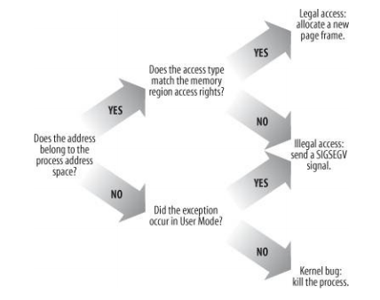</td>
<td>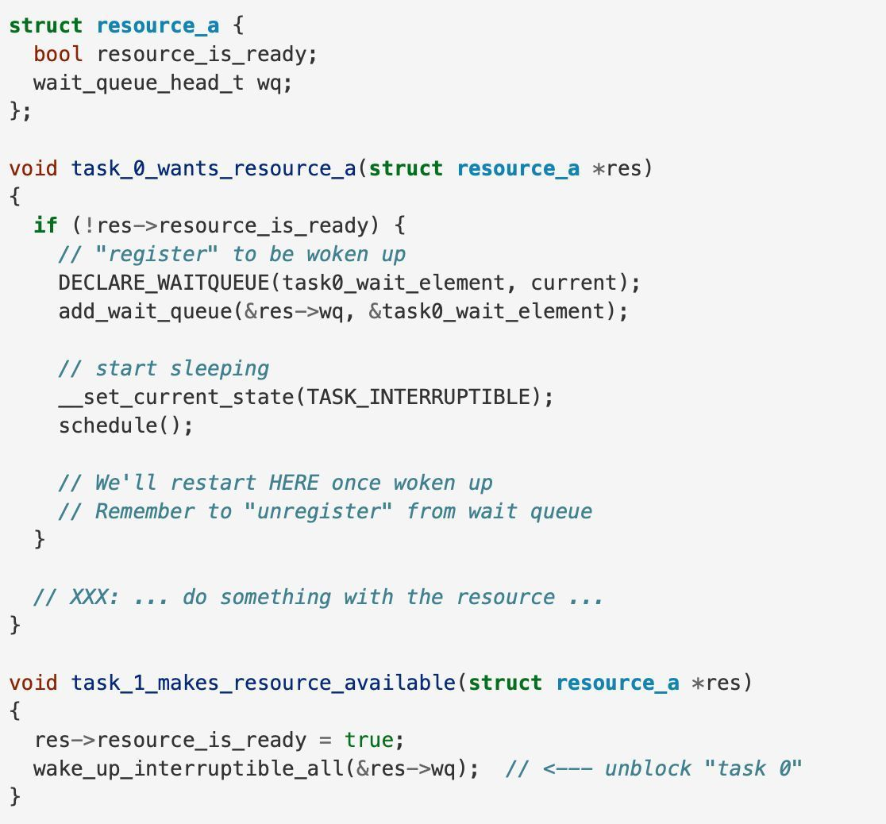</td>
<td>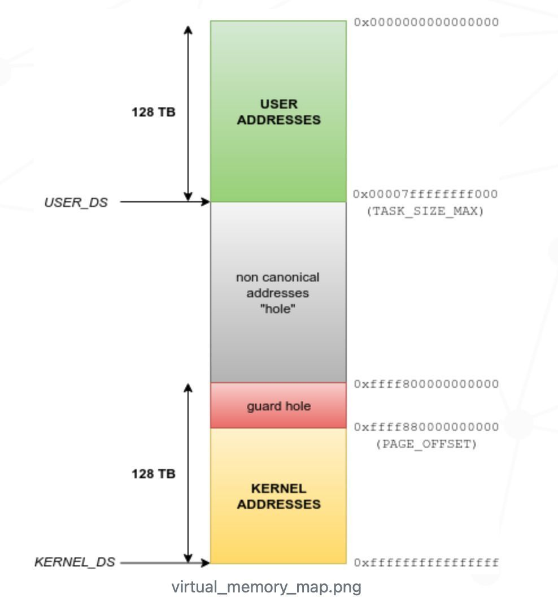</td>
<td>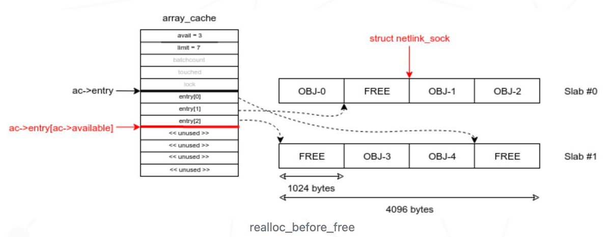</td>
</table></tr>
<table><tr>
<td>Quotes: <code>0</code></td>
<td>Replies: <code>0</code></td>
<td>Retweets: <code>21</code></td>
<td>Favorites: <code>74</code></td>
</tr></table>

---

# akamai_research
**https://twitter.com/akamai_research/status/1744850325977075828 _at 2024-01-09, 22:35:10_**
<blockquote>
Akamai researcher Ben Barnea found a remote code execution vulnerability in the MSHTML platform (CVE-2023-35628) that can be targeted at Microsoft Outlook. We will share more technical details about this vulnerability in the upcoming weeks, so stay tuned.
</blockquote>

<table><tr>
<td>Quotes: <code>6</code></td>
<td>Replies: <code>1</code></td>
<td>Retweets: <code>77</code></td>
<td>Favorites: <code>221</code></td>
</tr></table>

---

# _r_netsec
**https://twitter.com/_r_netsec/status/1744736591661400567 _at 2024-01-09, 15:03:13_**
<blockquote>
MobSF Remote code execution (via CVE-2024-21633) https://t.co/2k0UBlDvpX
</blockquote>

* https://github.com/0x33c0unt/CVE-2024-21633

<table><tr>
<td>Quotes: <code>0</code></td>
<td>Replies: <code>0</code></td>
<td>Retweets: <code>17</code></td>
<td>Favorites: <code>32</code></td>
</tr></table>

---

# TheHackersNews
**https://twitter.com/TheHackersNews/status/1744713874618655176 _at 2024-01-09, 13:32:57_**
<blockquote>
⚠️ Attention Kyocera &amp; QNAP users:

Kyocera addresses dangerous CVE-2023-50916 flaw, preventing unauthorized access. QNAP tackles CVE-2023-39296, safeguarding against crashes.

Read details here: https://t.co/y3kjBuXbxH

#cybersecurity #informationsecurity
</blockquote>

* https://thehackernews.com/2024/01/alert-new-vulnerabilities-discovered-in.html

<table><tr>
<td>Quotes: <code>1</code></td>
<td>Replies: <code>1</code></td>
<td>Retweets: <code>32</code></td>
<td>Favorites: <code>36</code></td>
</tr></table>

---

# HunterMapping
**https://twitter.com/HunterMapping/status/1744603258537324886 _at 2024-01-09, 06:13:24_**
<blockquote>
Exploit for F5 BIG-IP RCE CVE-2023-46747
🔗https://t.co/J5SpgBCMKy
</blockquote>

* https://github.com/W01fh4cker/CVE-2023-46747-RCE

<table><tr>
<td>Quotes: <code>0</code></td>
<td>Replies: <code>0</code></td>
<td>Retweets: <code>13</code></td>
<td>Favorites: <code>42</code></td>
</tr></table>

---

# kmkz_security
**https://twitter.com/kmkz_security/status/1744481209009176904 _at 2024-01-08, 22:08:25_**
<blockquote>
RT @Dinosn: Exploit for F5-big-ip RCE cve-2023-46747

https://t.co/dzYEjc4mG5
</blockquote>

* https://github.com/W01fh4cker/CVE-2023-46747-RCE

<table><tr>
<td>Quotes: <code>0</code></td>
<td>Replies: <code>0</code></td>
<td>Retweets: <code>88</code></td>
<td>Favorites: <code>0</code></td>
</tr></table>

---

# Dinosn
**https://twitter.com/Dinosn/status/1744318756984172648 _at 2024-01-08, 11:22:54_**
<blockquote>
Exploit for F5-big-ip RCE cve-2023-46747

https://t.co/dzYEjc4mG5
</blockquote>

* https://github.com/W01fh4cker/CVE-2023-46747-RCE

<table><tr>
<td>Quotes: <code>1</code></td>
<td>Replies: <code>0</code></td>
<td>Retweets: <code>88</code></td>
<td>Favorites: <code>259</code></td>
</tr></table>

---

# TodayCyberNews
**https://twitter.com/TodayCyberNews/status/1744040834167910580 _at 2024-01-07, 16:58:32_**
<blockquote>
Zoho ManageEngine Opmanager deserialization RCE (CVE-2023-31099).

Read More:- 
https://t.co/R9bw5kmWFx

#exploit #RCE #bugbounty #CyberSecurity https://t.co/EEafgGEB3j
</blockquote>

* https://xz.aliyun.com/t/13216

<table><tr>
<td></td>
</table></tr>
<table><tr>
<td>Quotes: <code>0</code></td>
<td>Replies: <code>0</code></td>
<td>Retweets: <code>18</code></td>
<td>Favorites: <code>80</code></td>
</tr></table>

---

# hetmehtaa
**https://twitter.com/hetmehtaa/status/1743652830379143231 _at 2024-01-06, 15:16:44_**
<blockquote>
Top 10 Vulnerabilities of 2023:

1. CVE-2023-34362: MOVEit Vulnerability

2. CVE-2023-23397: MS Outlook PE

3. CVE-2023-43641: 1-Click RCE on GNOME

4. CVE-2023-28252: Windows CLFS PE

5. CVE-2023-2868: Barracuda ESG CI

6. CVE-2023-26360: Adobe ColdFusion

7. CVE-2023-4966:…
</blockquote>

<table><tr>
<td>Quotes: <code>0</code></td>
<td>Replies: <code>4</code></td>
<td>Retweets: <code>96</code></td>
<td>Favorites: <code>292</code></td>
</tr></table>

---

# ptracesecurity
**https://twitter.com/ptracesecurity/status/1743407075101696109 _at 2024-01-05, 23:00:12_**
<blockquote>
Technical Details of CVE-2023-30990 - Unauthenticated RCE in IBM i DDM Service https://t.co/ekowXbObbL #pentesting #RCE #CVE #cybersecurity #Infosec https://t.co/EGvnNs4uuU
</blockquote>

* https://blog.silentsignal.eu/2023/07/03/ibm-i-dde-vulnerability-cve-2023-30990/

<table><tr>
<td>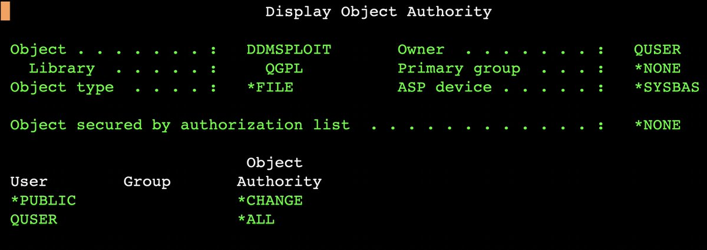</td>
</table></tr>
<table><tr>
<td>Quotes: <code>0</code></td>
<td>Replies: <code>1</code></td>
<td>Retweets: <code>9</code></td>
<td>Favorites: <code>45</code></td>
</tr></table>

---

# hackerfantastic
**https://twitter.com/hackerfantastic/status/1743228048839704933 _at 2024-01-05, 11:08:49_**
<blockquote>
RT @reverseame: PoC released for Microsoft WordPad CVE-2023-36563 flaw exploited in attacks https://t.co/hleaRzs5wM
</blockquote>

* https://securityonline.info/poc-released-for-microsoft-wordpad-cve-2023-36563-flaw-exploited-in-attacks/

<table><tr>
<td>Quotes: <code>0</code></td>
<td>Replies: <code>0</code></td>
<td>Retweets: <code>44</code></td>
<td>Favorites: <code>0</code></td>
</tr></table>

---

# TheHackersNews
**https://twitter.com/TheHackersNews/status/1743176571903492492 _at 2024-01-05, 07:44:16_**
<blockquote>
🚨 Alert: Ivanti releases updates for a critical #security vulnerability (CVE-2023-39336 / CVSS 9.6) in Endpoint Manager, which poses a risk of remote code execution on vulnerable servers.

Learn more: https://t.co/PSs44OErG8

#cybersecurity #informationsecurity
</blockquote>

* https://thehackernews.com/2024/01/alert-ivanti-releases-patch-for.html

<table><tr>
<td>Quotes: <code>1</code></td>
<td>Replies: <code>1</code></td>
<td>Retweets: <code>45</code></td>
<td>Favorites: <code>71</code></td>
</tr></table>

---

# piedpiper1616
**https://twitter.com/piedpiper1616/status/1743054893802500415 _at 2024-01-04, 23:40:45_**
<blockquote>
RT @TecR0c: Two major insecure deserialisation flaws in Inductive Automation’s Ignition (CVE-2023-39475 &amp; CVE-2023-39476) resulting in pre-…
</blockquote>

<table><tr>
<td>Quotes: <code>0</code></td>
<td>Replies: <code>0</code></td>
<td>Retweets: <code>39</code></td>
<td>Favorites: <code>0</code></td>
</tr></table>

---

# wvuuuuuuuuuuuuu
**https://twitter.com/wvuuuuuuuuuuuuu/status/1743013519480475898 _at 2024-01-04, 20:56:21_**
<blockquote>
RT @TecR0c: Two major insecure deserialisation flaws in Inductive Automation’s Ignition (CVE-2023-39475 &amp; CVE-2023-39476) resulting in pre-…
</blockquote>

<table><tr>
<td>Quotes: <code>0</code></td>
<td>Replies: <code>0</code></td>
<td>Retweets: <code>39</code></td>
<td>Favorites: <code>0</code></td>
</tr></table>

---

# pentest_swissky
**https://twitter.com/pentest_swissky/status/1742935416876019871 _at 2024-01-04, 15:46:00_**
<blockquote>
Technical Details of CVE-2023-30990 - Unauthenticated RCE in IBM i DDM Service
https://t.co/vUKIlJRWzs
</blockquote>

* https://blog.silentsignal.eu/2023/07/03/ibm-i-dde-vulnerability-cve-2023-30990/

<table><tr>
<td>Quotes: <code>0</code></td>
<td>Replies: <code>0</code></td>
<td>Retweets: <code>26</code></td>
<td>Favorites: <code>59</code></td>
</tr></table>

---

# steventseeley
**https://twitter.com/steventseeley/status/1742824609630871724 _at 2024-01-04, 08:25:41_**
<blockquote>
RT @TecR0c: Two major insecure deserialisation flaws in Inductive Automation’s Ignition (CVE-2023-39475 &amp; CVE-2023-39476) resulting in pre-…
</blockquote>

<table><tr>
<td>Quotes: <code>0</code></td>
<td>Replies: <code>0</code></td>
<td>Retweets: <code>39</code></td>
<td>Favorites: <code>0</code></td>
</tr></table>

---

# TecR0c
**https://twitter.com/TecR0c/status/1742824420031545434 _at 2024-01-04, 08:24:56_**
<blockquote>
Two major insecure deserialisation flaws in Inductive Automation’s Ignition (CVE-2023-39475 &amp; CVE-2023-39476) resulting in pre-auth remote code execution. For an in-depth root cause analysis and details on exploitation, see our full write-up below👇

https://t.co/pE8R9eNWl5
</blockquote>

* https://github.com/TecR0c/DoubleTrouble

<table><tr>
<td>Quotes: <code>2</code></td>
<td>Replies: <code>3</code></td>
<td>Retweets: <code>39</code></td>
<td>Favorites: <code>135</code></td>
</tr></table>

---

# wvuuuuuuuuuuuuu
**https://twitter.com/wvuuuuuuuuuuuuu/status/1742663607924719832 _at 2024-01-03, 21:45:55_**
<blockquote>
RT @iagox86: Before the break, I started looking at CVE-2022-1471 in Confluence et al, which led me learn about SnakeYAML deserialization.…
</blockquote>

<table><tr>
<td>Quotes: <code>0</code></td>
<td>Replies: <code>0</code></td>
<td>Retweets: <code>34</code></td>
<td>Favorites: <code>0</code></td>
</tr></table>

---

# hosselot
**https://twitter.com/hosselot/status/1742644408527327290 _at 2024-01-03, 20:29:38_**
<blockquote>
Chrome ITW libvpx vulnerability bug entry (CVE-2023-5217 [1486441]) is now open with a PoC:
https://t.co/MJrrnGjC7u
</blockquote>

* https://bugs.chromium.org/p/chromium/issues/detail?id=1486441

<table><tr>
<td>Quotes: <code>1</code></td>
<td>Replies: <code>0</code></td>
<td>Retweets: <code>30</code></td>
<td>Favorites: <code>80</code></td>
</tr></table>

---

# hackerfantastic
**https://twitter.com/hackerfantastic/status/1742497142718022101 _at 2024-01-03, 10:44:27_**
<blockquote>
RT @R00tkitSMM: Seems someone has published an exploit for CVE-2023-32434, XNU kernel int overflow, one of CVEs in Operation Triangulation,…
</blockquote>

<table><tr>
<td>Quotes: <code>0</code></td>
<td>Replies: <code>0</code></td>
<td>Retweets: <code>68</code></td>
<td>Favorites: <code>0</code></td>
</tr></table>

---

# ddouhine
**https://twitter.com/ddouhine/status/1742312271978639626 _at 2024-01-02, 22:29:50_**
<blockquote>
RT @R00tkitSMM: Seems someone has published an exploit for CVE-2023-32434, XNU kernel int overflow, one of CVEs in Operation Triangulation,…
</blockquote>

<table><tr>
<td>Quotes: <code>0</code></td>
<td>Replies: <code>0</code></td>
<td>Retweets: <code>68</code></td>
<td>Favorites: <code>0</code></td>
</tr></table>

---

# wvuuuuuuuuuuuuu
**https://twitter.com/wvuuuuuuuuuuuuu/status/1742246640100970928 _at 2024-01-02, 18:09:03_**
<blockquote>
RT @steventseeley: CVE-2023-51572. Beautiful bug, so simple. https://t.co/Xfxf7xQUt7
</blockquote>

<table><tr>
<td>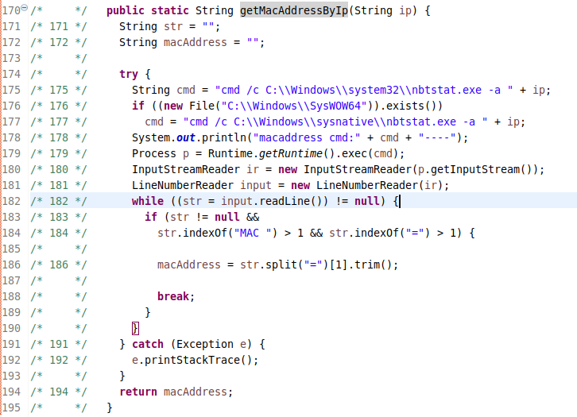</td>
</table></tr>
<table><tr>
<td>Quotes: <code>0</code></td>
<td>Replies: <code>0</code></td>
<td>Retweets: <code>210</code></td>
<td>Favorites: <code>0</code></td>
</tr></table>

---

# the_yellow_fall
**https://twitter.com/the_yellow_fall/status/1742199402851106870 _at 2024-01-02, 15:01:20_**
<blockquote>
CVE-2023-32434 Exploited: PoC Unlocks Full Command of iOS Devices
Proof-of-concept (PoC) code has been released for a zero-day iOS vulnerability (CVE-2023-32434) that can be chained to take full control of a mobile device
https://t.co/zNPOWz17tE https://t.co/GkynlvAo78
</blockquote>

* https://securityonline.info/cve-2023-32434-exploited-poc-unlocks-full-command-of-ios-devices/

<table><tr>
<td></td>
</table></tr>
<table><tr>
<td>Quotes: <code>0</code></td>
<td>Replies: <code>0</code></td>
<td>Retweets: <code>40</code></td>
<td>Favorites: <code>94</code></td>
</tr></table>

---

# kmkz_security
**https://twitter.com/kmkz_security/status/1742155633472708830 _at 2024-01-02, 12:07:25_**
<blockquote>
RT @MrTuxracer: As promised: Here's the first $10,000 @Intel bug (aka CVE-2022-33942) that allows to bypass the authentication of Intel's D…
</blockquote>

<table><tr>
<td>Quotes: <code>0</code></td>
<td>Replies: <code>0</code></td>
<td>Retweets: <code>259</code></td>
<td>Favorites: <code>0</code></td>
</tr></table>

---

# kmkz_security
**https://twitter.com/kmkz_security/status/1741930330767114433 _at 2024-01-01, 21:12:09_**
<blockquote>
RT @0xor0ne: VirtualBox internals and exploitation (CVE-2023-21987 and CVE-2023-21991) by @qriousec

https://t.co/E3vPy2raRR

#cybersecurit…
</blockquote>

* https://qriousec.github.io/post/vbox-pwn2own-2023/

<table><tr>
<td>Quotes: <code>0</code></td>
<td>Replies: <code>0</code></td>
<td>Retweets: <code>128</code></td>
<td>Favorites: <code>0</code></td>
</tr></table>

---

