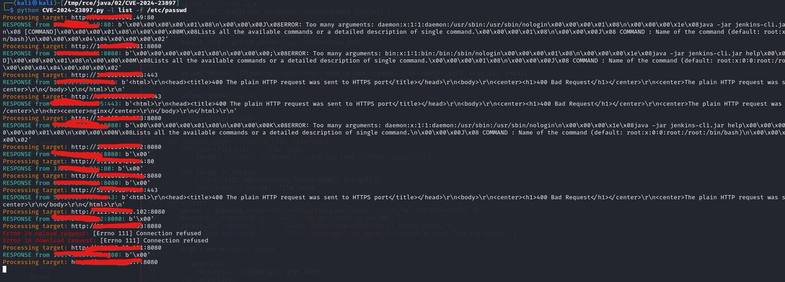
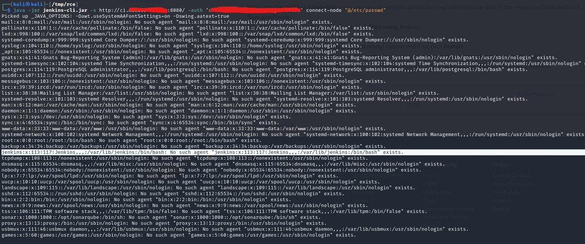
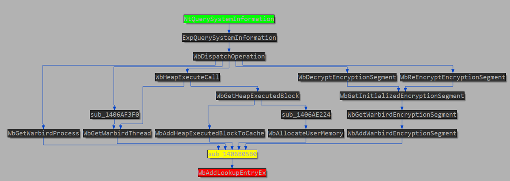
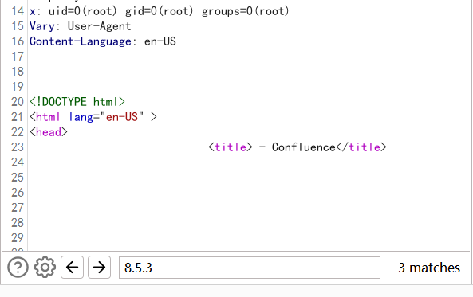
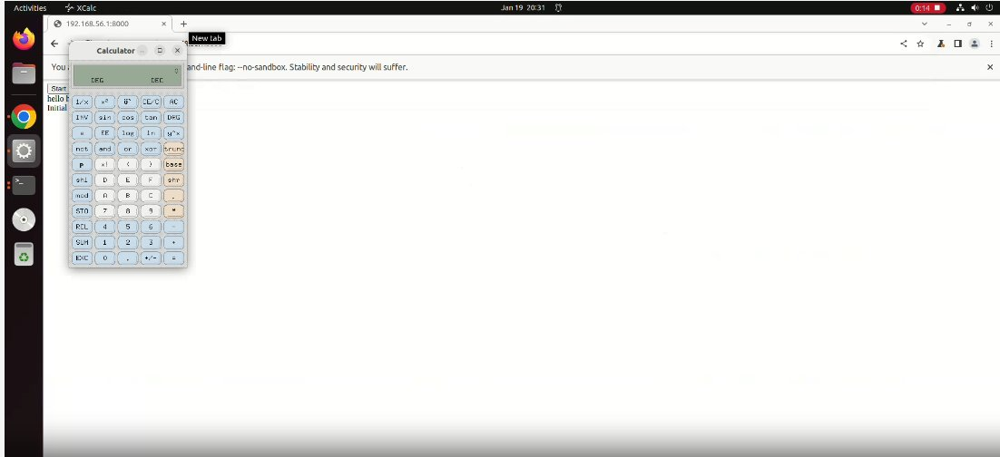
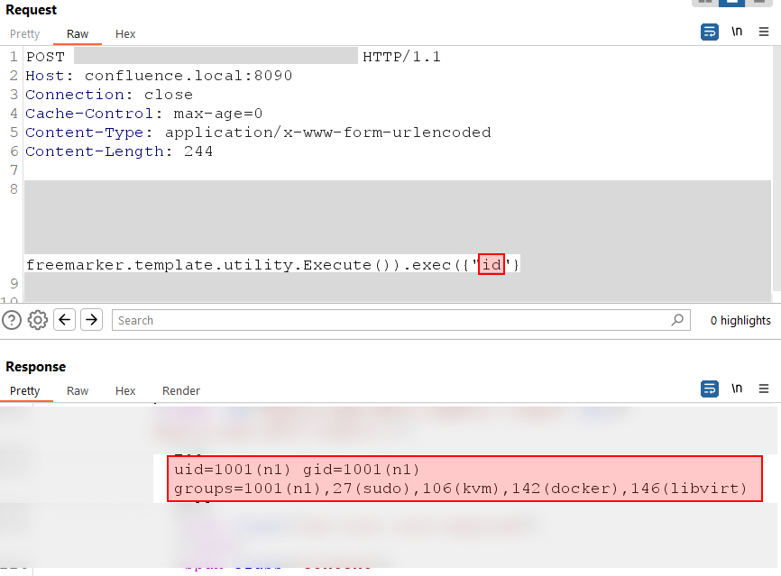
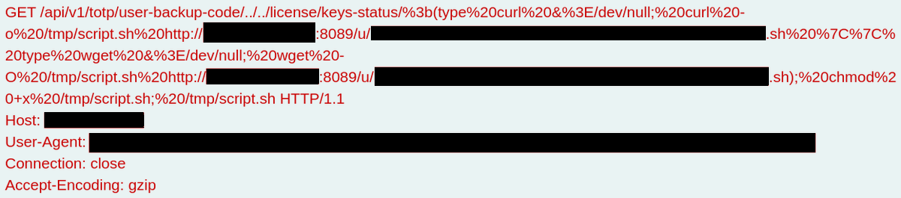

# TheHackersNews
**https://twitter.com/TheHackersNews/status/1752366058185310602 _at 2024-01-30, 16:20:00_**
<blockquote>
Hackers could write ANY file on your #GitLab server while creating a workspace. This critical flaw (CVE-2024-0402) affects all versions before 16.5.8!

Patch NOW. Details here → https://t.co/PrlKTUKunZ

#Cybersecurity #DevSecOps
</blockquote>

* https://thehackernews.com/2024/01/urgent-upgrade-gitlab-critical.html

<table><tr>
<td>Quotes: <code>2</code></td>
<td>Replies: <code>2</code></td>
<td>Retweets: <code>34</code></td>
<td>Favorites: <code>53</code></td>
</tr></table>

---

# TheHackersNews
**https://twitter.com/TheHackersNews/status/1752195820743442860 _at 2024-01-30, 05:03:32_**
<blockquote>
🚨 Patch now! High-severity Junos OS vulnerabilities exposed (CVE-2024-21619, CVE-2024-21620). These flaws could let attackers steal sensitive data or even take control of your devices.

Details here: https://t.co/EUOMld7c7k

Don't wait - update your Junos OS now!
</blockquote>

* https://thehackernews.com/2024/01/juniper-networks-releases-urgent-junos.html

<table><tr>
<td>Quotes: <code>1</code></td>
<td>Replies: <code>0</code></td>
<td>Retweets: <code>48</code></td>
<td>Favorites: <code>77</code></td>
</tr></table>

---

# kmkz_security
**https://twitter.com/kmkz_security/status/1752080951000093136 _at 2024-01-29, 21:27:05_**
<blockquote>
RT @pdnuclei: Scan for Jenkins &lt; 2.441 - Arbitrary File Read (CVE-2024-23897) using nuclei templates.

Vulnerability Advisory -https://t.co…
</blockquote>

<table><tr>
<td>Quotes: <code>0</code></td>
<td>Replies: <code>0</code></td>
<td>Retweets: <code>40</code></td>
<td>Favorites: <code>0</code></td>
</tr></table>

---

# hackerfantastic
**https://twitter.com/hackerfantastic/status/1752061596770390312 _at 2024-01-29, 20:10:11_**
<blockquote>
RT @stephenfewer: We now have an RCE exploit module in the @metasploit pull queue for CVE-2024-0204 in Fortra GoAnywhere MFT: https://t.co/…
</blockquote>

<table><tr>
<td>Quotes: <code>0</code></td>
<td>Replies: <code>0</code></td>
<td>Retweets: <code>36</code></td>
<td>Favorites: <code>0</code></td>
</tr></table>

---

# wvuuuuuuuuuuuuu
**https://twitter.com/wvuuuuuuuuuuuuu/status/1752047726966013972 _at 2024-01-29, 19:15:04_**
<blockquote>
RT @stephenfewer: We now have an RCE exploit module in the @metasploit pull queue for CVE-2024-0204 in Fortra GoAnywhere MFT: https://t.co/…
</blockquote>

<table><tr>
<td>Quotes: <code>0</code></td>
<td>Replies: <code>0</code></td>
<td>Retweets: <code>40</code></td>
<td>Favorites: <code>0</code></td>
</tr></table>

---

# stephenfewer
**https://twitter.com/stephenfewer/status/1752046784241676734 _at 2024-01-29, 19:11:19_**
<blockquote>
We now have an RCE exploit module in the @metasploit pull queue for CVE-2024-0204 in Fortra GoAnywhere MFT: https://t.co/ktMvdn9weB https://t.co/9rvtrqML6N
</blockquote>

* https://github.com/rapid7/metasploit-framework/pull/18762

<table><tr>
<td></td>
</table></tr>
<table><tr>
<td>Quotes: <code>1</code></td>
<td>Replies: <code>1</code></td>
<td>Retweets: <code>26</code></td>
<td>Favorites: <code>58</code></td>
</tr></table>

---

# __kokumoto
**https://twitter.com/__kokumoto/status/1751727668859752603 _at 2024-01-28, 22:03:16_**
<blockquote>
Jenkinsの重大な脆弱性CVE-2024-23897に対応する攻撃コードのPoC（概念実証コード）複数が公開された。既にハニーポットには攻撃が来ているとの報告も。 https://t.co/gGqWa78UyH
</blockquote>

* https://www.bleepingcomputer.com/news/security/exploits-released-for-critical-jenkins-rce-flaw-patch-now/

<table><tr>
<td>Quotes: <code>0</code></td>
<td>Replies: <code>1</code></td>
<td>Retweets: <code>13</code></td>
<td>Favorites: <code>37</code></td>
</tr></table>

---

# pdnuclei
**https://twitter.com/pdnuclei/status/1751713675831083085 _at 2024-01-28, 21:07:40_**
<blockquote>
Scan for Jenkins &lt; 2.441 - Arbitrary File Read (CVE-2024-23897) using nuclei templates.

Vulnerability Advisory -https://t.co/7ERMZdsyAo

Vulnerability Analysis - https://t.co/hUopMxRzE1 by @Sonar_Research

Nuclei Template - https://t.co/vfC0ZkJJeo

#hackwithautomation #bugbounty…
</blockquote>

* https://www.jenkins.io/security/advisory/2024-01-24/#SECURITY-3314
* https://www.sonarsource.com/blog/excessive-expansion-uncovering-critical-security-vulnerabilities-in-jenkins/
* https://cloud.projectdiscovery.io/@sandeep/nqTESMRNHscR4wv9LABGua

<table><tr>
<td>Quotes: <code>2</code></td>
<td>Replies: <code>0</code></td>
<td>Retweets: <code>40</code></td>
<td>Favorites: <code>138</code></td>
</tr></table>

---

# ptracesecurity
**https://twitter.com/ptracesecurity/status/1751364508390510704 _at 2024-01-27, 22:00:12_**
<blockquote>
nftables Adventures: Bug Hunting and N-day Exploitation (CVE-2023-31248) https://t.co/7K5ZEMsRKp #pentesting #exploit #CVE #cybersecurity #Infosec https://t.co/SrbKfIL2co
</blockquote>

* https://starlabs.sg/blog/2023/09-nftables-adventures-bug-hunting-and-n-day-exploitation/

<table><tr>
<td></td>
<td></td>
</table></tr>
<table><tr>
<td>Quotes: <code>0</code></td>
<td>Replies: <code>0</code></td>
<td>Retweets: <code>12</code></td>
<td>Favorites: <code>48</code></td>
</tr></table>

---

# payloadartist
**https://twitter.com/payloadartist/status/1751251212307960146 _at 2024-01-27, 14:30:00_**
<blockquote>
CVE-2023-5480: Chrome new XSS Vector (Bounty: $16k)

https://t.co/51iK2OXQWJ

by @slonser_

#bugbountytips #cybersecurity #infosec https://t.co/DogI2nbFC8
</blockquote>

* https://blog.slonser.info/posts/cve-2023-5480/

<table><tr>
<td></td>
</table></tr>
<table><tr>
<td>Quotes: <code>0</code></td>
<td>Replies: <code>0</code></td>
<td>Retweets: <code>20</code></td>
<td>Favorites: <code>109</code></td>
</tr></table>

---

# cyber_advising
**https://twitter.com/cyber_advising/status/1751027690595872986 _at 2024-01-26, 23:41:48_**
<blockquote>
CVE-2024-23897: Jenkins 2.441 and earlier, LTS 2.426.2 and earlier does not disable a feature of its CLI command parser that replaces an '@' character ... allowing unauthenticated attackers to read arbitrary files

PoC
https://t.co/pAk3Cw7xQx https://t.co/EVAOj8omt2
</blockquote>

* https://github.com/h4x0r-dz/CVE-2024-23897

<table><tr>
<td></td>
</table></tr>
<table><tr>
<td>Quotes: <code>0</code></td>
<td>Replies: <code>0</code></td>
<td>Retweets: <code>19</code></td>
<td>Favorites: <code>46</code></td>
</tr></table>

---

# Dinosn
**https://twitter.com/Dinosn/status/1750970075840938083 _at 2024-01-26, 19:52:52_**
<blockquote>
A modification of Fortra's excellent CVE-2023-2852 Privesc Exploit. Works on Windows 11 21H2 clfs.sys version 10.0.22000.1574 - also works on Windows 10 21H2, Windows 10 22H2, Windows 11 22H2 and Windows server 2022. https://t.co/Vk4FYFnLiS
</blockquote>

* https://github.com/duck-sec/CVE-2023-28252-Compiled-exe

<table><tr>
<td>Quotes: <code>0</code></td>
<td>Replies: <code>0</code></td>
<td>Retweets: <code>32</code></td>
<td>Favorites: <code>93</code></td>
</tr></table>

---

# payloadartist
**https://twitter.com/payloadartist/status/1750888823943512141 _at 2024-01-26, 14:30:00_**
<blockquote>
Unauthenticated data leak (CVE-2024-23897), and CSWSH vulnerability in Jenkins that can allow an attacker to execute arbitrary CLI commands with user interaction (CVE-2024-23898)

https://t.co/GRRSPkj7iZ

By @SonarSource 

#infosec #cybersecurity #bugbounty https://t.co/GFQKrmlroL
</blockquote>

* https://www.sonarsource.com/blog/excessive-expansion-uncovering-critical-security-vulnerabilities-in-jenkins/

<table><tr>
<td></td>
</table></tr>
<table><tr>
<td>Quotes: <code>0</code></td>
<td>Replies: <code>0</code></td>
<td>Retweets: <code>9</code></td>
<td>Favorites: <code>47</code></td>
</tr></table>

---

# 1ZRR4H
**https://twitter.com/1ZRR4H/status/1750872468535812354 _at 2024-01-26, 13:25:00_**
<blockquote>
🚨 CVE-2024-23897: Unauthenticated Arbitrary File Read vulnerability could lead to RCE on Jenkins servers.

▪ Exploits are already available.

https://t.co/xreXZ88kIZ
</blockquote>

* https://www.shodan.io/search?query=http.favicon.hash%3A81586312+-%222.442%22+-%222.426.3%22

<table><tr>
<td>Quotes: <code>3</code></td>
<td>Replies: <code>1</code></td>
<td>Retweets: <code>69</code></td>
<td>Favorites: <code>184</code></td>
</tr></table>

---

# HunterMapping
**https://twitter.com/HunterMapping/status/1750814929891008527 _at 2024-01-26, 09:36:22_**
<blockquote>
🚨Alert🚨CVE-2024-20253 (CVSS 9.9): Cisco Unified Communications Products RCE Vulnerability

📊2k+ Services are found on the https://t.co/WrjZaG0jRH

⚠This flaw opens the door for unauthenticated, remote attackers to craft and dispatch malicious messages to a listening port on… https://t.co/MmXHyNNlie
</blockquote>

* http://Hunter.how

<table><tr>
<td></td>
</table></tr>
<table><tr>
<td>Quotes: <code>0</code></td>
<td>Replies: <code>1</code></td>
<td>Retweets: <code>16</code></td>
<td>Favorites: <code>35</code></td>
</tr></table>

---

# HunterMapping
**https://twitter.com/HunterMapping/status/1750805486059073834 _at 2024-01-26, 08:58:50_**
<blockquote>
🚨CVE-2024-23879🚨 Jenkins RCE
POC Released
Credit to binganao
🔗https://t.co/glxDUSvjhE
#vulnerability #infosecurity
</blockquote>

* https://github.com/binganao/CVE-2024-23897

<table><tr>
<td>Quotes: <code>0</code></td>
<td>Replies: <code>2</code></td>
<td>Retweets: <code>42</code></td>
<td>Favorites: <code>146</code></td>
</tr></table>

---

# momika233
**https://twitter.com/momika233/status/1750803560445735317 _at 2024-01-26, 08:51:11_**
<blockquote>
Arbitrary file read vulnerability through the #Jenkins CLI can lead to RCE CVE-2024-23897 https://t.co/CU6zhLwwS4
</blockquote>

<table><tr>
<td></td>
</table></tr>
<table><tr>
<td>Quotes: <code>1</code></td>
<td>Replies: <code>3</code></td>
<td>Retweets: <code>17</code></td>
<td>Favorites: <code>73</code></td>
</tr></table>

---

# TheHackersNews
**https://twitter.com/TheHackersNews/status/1750748911554183294 _at 2024-01-26, 05:14:02_**
<blockquote>
🚨 Cisco's Unified &amp; Contact Center solutions have a CRITICAL flaw (CVE-2024-20253) allowing remote attackers to take control.

Patch NOW! Don't let attackers eavesdrop on your business secrets.

Get the details: https://t.co/j6aIpX5yuV

#cybersecurity #hacking
</blockquote>

* https://thehackernews.com/2024/01/critical-cisco-flaw-lets-hackers.html

<table><tr>
<td>Quotes: <code>2</code></td>
<td>Replies: <code>2</code></td>
<td>Retweets: <code>59</code></td>
<td>Favorites: <code>75</code></td>
</tr></table>

---

# hackerfantastic
**https://twitter.com/hackerfantastic/status/1750708355318866357 _at 2024-01-26, 02:32:53_**
<blockquote>
RT @TheHackersNews: 🚨 Urgent: Critical Jenkins RCE #vulnerability (CVE-2024-23897) discovered.

Hackers can remotely control your CI/CD pip…
</blockquote>

<table><tr>
<td>Quotes: <code>0</code></td>
<td>Replies: <code>0</code></td>
<td>Retweets: <code>150</code></td>
<td>Favorites: <code>0</code></td>
</tr></table>

---

# h4x0r_dz
**https://twitter.com/h4x0r_dz/status/1750595628797989287 _at 2024-01-25, 19:04:57_**
<blockquote>
Jenkins CVE-2024-23897 Arbitrary file read vulnerability through the CLI can lead to RCE 

POC 

#BugBounty  #vulnerabilities #rce https://t.co/Lxf8TI5Oug
</blockquote>

<table><tr>
<td></td>
</table></tr>
<table><tr>
<td>Quotes: <code>1</code></td>
<td>Replies: <code>12</code></td>
<td>Retweets: <code>77</code></td>
<td>Favorites: <code>506</code></td>
</tr></table>

---

# ripstech
**https://twitter.com/ripstech/status/1750517756100006183 _at 2024-01-25, 13:55:30_**
<blockquote>
🔍Uncovering critical vulnerabilities in Jenkins, which could lead to RCE (CVE-2024-23898, CVE-2024-23897):

Check out our latest blog post for the technical details on how attackers could potentially gain unauthenticated RCE on #Jenkins

https://t.co/U7FS1oO5UB

#vulnerability
</blockquote>

* https://www.sonarsource.com/blog/excessive-expansion-uncovering-critical-security-vulnerabilities-in-jenkins/?utm_medium=social&utm_source=twitter&utm_campaign=research&utm_content=blog-excessive-expansion-uncovering-critical-security-vulnerabilities-in-jenkins-240125-p1&utm_term=ww_en_all_x

<table><tr>
<td>Quotes: <code>4</code></td>
<td>Replies: <code>0</code></td>
<td>Retweets: <code>21</code></td>
<td>Favorites: <code>65</code></td>
</tr></table>

---

# cyber_advising
**https://twitter.com/cyber_advising/status/1750511565457986024 _at 2024-01-25, 13:30:54_**
<blockquote>
CVE-2024-20698:  Windows Kernel Elevation of Privilege Vulnerability.

PoC
https://t.co/CzMtWKoyRu https://t.co/Y9lB57bqOF
</blockquote>

* https://github.com/RomanRybachek/CVE-2024-20698

<table><tr>
<td></td>
</table></tr>
<table><tr>
<td>Quotes: <code>0</code></td>
<td>Replies: <code>1</code></td>
<td>Retweets: <code>54</code></td>
<td>Favorites: <code>163</code></td>
</tr></table>

---

# TheHackersNews
**https://twitter.com/TheHackersNews/status/1750488188349510118 _at 2024-01-25, 11:58:01_**
<blockquote>
🚨 Urgent: Critical Jenkins RCE #vulnerability (CVE-2024-23897) discovered.

Hackers can remotely control your CI/CD pipelines. Patch immediately to prevent malicious code in builds.

Details here: https://t.co/AdrFH8Yl5P

#cybersecurity #informationsecurity
</blockquote>

* https://thehackernews.com/2024/01/critical-jenkins-vulnerability-exposes.html

<table><tr>
<td>Quotes: <code>14</code></td>
<td>Replies: <code>3</code></td>
<td>Retweets: <code>180</code></td>
<td>Favorites: <code>347</code></td>
</tr></table>

---

# HunterMapping
**https://twitter.com/HunterMapping/status/1750438751380341091 _at 2024-01-25, 08:41:34_**
<blockquote>
🚨Alert🚨CVE-2024-23897 (CVSS 9.8): Critical Jenkins Security Vulnerability, RCE Possible
⚠A critical vulnerability within Jenkins’ built-in command line interface (CLI),  opens the door to arbitrary file reads through the CLI, potentially culminating in remote code execution… https://t.co/smsW1QSyiH
</blockquote>

<table><tr>
<td></td>
</table></tr>
<table><tr>
<td>Quotes: <code>3</code></td>
<td>Replies: <code>0</code></td>
<td>Retweets: <code>53</code></td>
<td>Favorites: <code>171</code></td>
</tr></table>

---

# Dinosn
**https://twitter.com/Dinosn/status/1750379099468480970 _at 2024-01-25, 04:44:32_**
<blockquote>
CVE-2024-23897 (CVSS 9.8): Critical Jenkins Security Vulnerability, RCE Possible https://t.co/zmnyPcKAQw
</blockquote>

* https://securityonline.info/cve-2024-23897-cvss-9-8-critical-jenkins-security-vulnerability-rce-possible/

<table><tr>
<td>Quotes: <code>6</code></td>
<td>Replies: <code>4</code></td>
<td>Retweets: <code>175</code></td>
<td>Favorites: <code>509</code></td>
</tr></table>

---

# Dinosn
**https://twitter.com/Dinosn/status/1750377024906998050 _at 2024-01-25, 04:36:17_**
<blockquote>
CVE-2024-20253 (CVSS 9.9): Cisco Unified Communications Products RCE Vulnerability https://t.co/jmFZEV9cm2
</blockquote>

* https://securityonline.info/cve-2024-20253-cvss-9-9-cisco-unified-communications-products-rce-vulnerability/

<table><tr>
<td>Quotes: <code>0</code></td>
<td>Replies: <code>0</code></td>
<td>Retweets: <code>10</code></td>
<td>Favorites: <code>32</code></td>
</tr></table>

---

# steventseeley
**https://twitter.com/steventseeley/status/1750304231905710319 _at 2024-01-24, 23:47:02_**
<blockquote>
RT @p1k4l4: I'm excited to announce that the technical analysis and the exploit of my CVE-2023-6546 (ZDI-24-020) 
Linux Kernel GSM Multiple…
</blockquote>

<table><tr>
<td>Quotes: <code>0</code></td>
<td>Replies: <code>0</code></td>
<td>Retweets: <code>101</code></td>
<td>Favorites: <code>0</code></td>
</tr></table>

---

# 1ZRR4H
**https://twitter.com/1ZRR4H/status/1750225276196323532 _at 2024-01-24, 18:33:18_**
<blockquote>
RT @HackingLZ: Imagine working an IR where someone exploits Fortas GoAnywhere MFT via CVE-2024-0204 then deploys Fortas CobaltStrike and mo…
</blockquote>

<table><tr>
<td>Quotes: <code>0</code></td>
<td>Replies: <code>0</code></td>
<td>Retweets: <code>35</code></td>
<td>Favorites: <code>0</code></td>
</tr></table>

---

# kmkz_security
**https://twitter.com/kmkz_security/status/1750207818827722946 _at 2024-01-24, 17:23:55_**
<blockquote>
RT @mistymntncop: Exploit for CVE-2022-4262. Fukin finally! Shoutout to @_clem1 for finding the ITW exploit. And shoutout to @5aelo, @bjrjk…
</blockquote>

<table><tr>
<td>Quotes: <code>0</code></td>
<td>Replies: <code>0</code></td>
<td>Retweets: <code>62</code></td>
<td>Favorites: <code>0</code></td>
</tr></table>

---

# cyb3rops
**https://twitter.com/cyb3rops/status/1750204163886104695 _at 2024-01-24, 17:09:24_**
<blockquote>
RT @HackingLZ: Imagine working an IR where someone exploits Fortas GoAnywhere MFT via CVE-2024-0204 then deploys Fortas CobaltStrike and mo…
</blockquote>

<table><tr>
<td>Quotes: <code>0</code></td>
<td>Replies: <code>0</code></td>
<td>Retweets: <code>35</code></td>
<td>Favorites: <code>0</code></td>
</tr></table>

---

# DailyDarkWeb
**https://twitter.com/DailyDarkWeb/status/1750201797405220907 _at 2024-01-24, 17:00:00_**
<blockquote>
A threat actor claims to be selling CVE-2023-20198 &amp; CVE-2023-20273 RCE exploit

These vulnerabilities affect the web UI feature of Cisco IOS XE and the exploit can be used without any authentication.

Price: $5000

#DarkWeb https://t.co/S91tqlHe3k
</blockquote>

<table><tr>
<td></td>
</table></tr>
<table><tr>
<td>Quotes: <code>0</code></td>
<td>Replies: <code>0</code></td>
<td>Retweets: <code>22</code></td>
<td>Favorites: <code>42</code></td>
</tr></table>

---

# hackerfantastic
**https://twitter.com/hackerfantastic/status/1750167260780548597 _at 2024-01-24, 14:42:46_**
<blockquote>
RT @mistymntncop: Exploit for CVE-2022-4262. Fukin finally! Shoutout to @_clem1 for finding the ITW exploit. And shoutout to @5aelo, @bjrjk…
</blockquote>

<table><tr>
<td>Quotes: <code>0</code></td>
<td>Replies: <code>0</code></td>
<td>Retweets: <code>38</code></td>
<td>Favorites: <code>0</code></td>
</tr></table>

---

# steventseeley
**https://twitter.com/steventseeley/status/1750087367371964505 _at 2024-01-24, 09:25:18_**
<blockquote>
RT @mmolgtm: In this post I'll use CVE-2023-3420, an incorrect side effect modelling bug in the JIT compiler that I reported to Chrome, to…
</blockquote>

<table><tr>
<td>Quotes: <code>0</code></td>
<td>Replies: <code>0</code></td>
<td>Retweets: <code>107</code></td>
<td>Favorites: <code>0</code></td>
</tr></table>

---

# steventseeley
**https://twitter.com/steventseeley/status/1750087159116337575 _at 2024-01-24, 09:24:28_**
<blockquote>
RT @mmolgtm: In this post I'll use CVE-2023-4069, a type confusion bug in the Maglev JIT compiler of Chrome that I reported in July, to gai…
</blockquote>

<table><tr>
<td>Quotes: <code>0</code></td>
<td>Replies: <code>0</code></td>
<td>Retweets: <code>102</code></td>
<td>Favorites: <code>0</code></td>
</tr></table>

---

# ptracesecurity
**https://twitter.com/ptracesecurity/status/1750065937225490924 _at 2024-01-24, 08:00:08_**
<blockquote>
[Confluence] CVE-2023-22527 realworld poc https://t.co/daKqJu1uC9    #pentesting #cybersecurity #Infosec https://t.co/qDrdnQA7fh
</blockquote>

* https://github.com/VNCERT-CC/CVE-2023-22527-confluence

<table><tr>
<td></td>
</table></tr>
<table><tr>
<td>Quotes: <code>0</code></td>
<td>Replies: <code>0</code></td>
<td>Retweets: <code>16</code></td>
<td>Favorites: <code>55</code></td>
</tr></table>

---

# TheHackersNews
**https://twitter.com/TheHackersNews/status/1750029363914097024 _at 2024-01-24, 05:34:48_**
<blockquote>
🔒 GoAnywhere users, listen up! Critical bug lets anyone become admin.

Remember Cl0p #ransomware? They hit 130 victims using a Fortra's GoAnywhere flaw last year. Now, CVE-2024-0204 is even worse. Update to 7.4.1 immediately.

Learn more: https://t.co/oo1tcnCWeL

#cybersecurity
</blockquote>

* https://thehackernews.com/2024/01/patch-your-goanywhere-mft-immediately.html

<table><tr>
<td>Quotes: <code>5</code></td>
<td>Replies: <code>1</code></td>
<td>Retweets: <code>36</code></td>
<td>Favorites: <code>60</code></td>
</tr></table>

---

# hosselot
**https://twitter.com/hosselot/status/1749950271487447354 _at 2024-01-24, 00:20:31_**
<blockquote>
Apple Safari In-The-Wild type confusion vulnerability (CVE-2024-23222 [267134]) happens because DFG constant property load does not check the validity at the main thread:
https://t.co/WBMvhbfIYv
</blockquote>

* https://github.com/WebKit/WebKit/commit/61d47f64edd9a39dc2c14fcb6f6dd944a359eb79

<table><tr>
<td>Quotes: <code>1</code></td>
<td>Replies: <code>6</code></td>
<td>Retweets: <code>20</code></td>
<td>Favorites: <code>49</code></td>
</tr></table>

---

# piedpiper1616
**https://twitter.com/piedpiper1616/status/1749942915751915599 _at 2024-01-23, 23:51:18_**
<blockquote>
GitHub - RomanRybachek/CVE-2024-20698: Analysis of the vulnerability - https://t.co/weF2YvUqIn
</blockquote>

* https://github.com/RomanRybachek/CVE-2024-20698

<table><tr>
<td>Quotes: <code>0</code></td>
<td>Replies: <code>0</code></td>
<td>Retweets: <code>14</code></td>
<td>Favorites: <code>34</code></td>
</tr></table>

---

# kmkz_security
**https://twitter.com/kmkz_security/status/1749916058926866642 _at 2024-01-23, 22:04:34_**
<blockquote>
RT @HackingLZ: Imagine working an IR where someone exploits Fortas GoAnywhere MFT via CVE-2024-0204 then deploys Fortas CobaltStrike and mo…
</blockquote>

<table><tr>
<td>Quotes: <code>0</code></td>
<td>Replies: <code>0</code></td>
<td>Retweets: <code>35</code></td>
<td>Favorites: <code>0</code></td>
</tr></table>

---

# steventseeley
**https://twitter.com/steventseeley/status/1749897509651320896 _at 2024-01-23, 20:50:52_**
<blockquote>
RT @Horizon3Attack: CVE-2024-0204, announced today but silently patched in December, details an authentication bypass in #Fortra #GoAnywher…
</blockquote>

<table><tr>
<td>Quotes: <code>0</code></td>
<td>Replies: <code>0</code></td>
<td>Retweets: <code>90</code></td>
<td>Favorites: <code>0</code></td>
</tr></table>

---

# kmkz_security
**https://twitter.com/kmkz_security/status/1749896793905619391 _at 2024-01-23, 20:48:01_**
<blockquote>
RT @Horizon3Attack: CVE-2024-0204, announced today but silently patched in December, details an authentication bypass in #Fortra #GoAnywher…
</blockquote>

<table><tr>
<td>Quotes: <code>0</code></td>
<td>Replies: <code>0</code></td>
<td>Retweets: <code>88</code></td>
<td>Favorites: <code>0</code></td>
</tr></table>

---

# wvuuuuuuuuuuuuu
**https://twitter.com/wvuuuuuuuuuuuuu/status/1749896598757236963 _at 2024-01-23, 20:47:15_**
<blockquote>
RT @Horizon3Attack: CVE-2024-0204, announced today but silently patched in December, details an authentication bypass in #Fortra #GoAnywher…
</blockquote>

<table><tr>
<td>Quotes: <code>0</code></td>
<td>Replies: <code>0</code></td>
<td>Retweets: <code>88</code></td>
<td>Favorites: <code>0</code></td>
</tr></table>

---

# Cloudflare
**https://twitter.com/Cloudflare/status/1749794365189341408 _at 2024-01-23, 14:01:00_**
<blockquote>
In response to recent critical vulnerabilities (CVE-2023-46805 and CVE-2024-21887), Cloudflare's AI-powered WAF, along with WAF Emergency Rules deployed on January 17, 2024, ensured immediate customer protection. Read the blog post for all the details. https://t.co/xPazniGfz2
</blockquote>

* https://cfl.re/48KBxWv

<table><tr>
<td>Quotes: <code>0</code></td>
<td>Replies: <code>6</code></td>
<td>Retweets: <code>13</code></td>
<td>Favorites: <code>52</code></td>
</tr></table>

---

# _r_netsec
**https://twitter.com/_r_netsec/status/1749733234265727201 _at 2024-01-23, 09:58:06_**
<blockquote>
Exploiting 0-click Android Bluetooth vulnerability to inject keystrokes without pairing (CVE-2023-45866) https://t.co/5Nbz5d5HRT
</blockquote>

* https://www.mobile-hacker.com/2024/01/23/exploiting-0-click-android-bluetooth-vulnerability-to-inject-keystrokes-without-pairing/

<table><tr>
<td>Quotes: <code>0</code></td>
<td>Replies: <code>0</code></td>
<td>Retweets: <code>15</code></td>
<td>Favorites: <code>35</code></td>
</tr></table>

---

# kmkz_security
**https://twitter.com/kmkz_security/status/1749538677296976141 _at 2024-01-22, 21:05:00_**
<blockquote>
RT @TheDFIRReport: 🚨Active Exploitation🚨

➡️CVE-2023-22527 - Confluence template injection
➡️Executed whoami
➡️Source IP: 45.61.137[.]90
➡️…
</blockquote>

<table><tr>
<td>Quotes: <code>0</code></td>
<td>Replies: <code>0</code></td>
<td>Retweets: <code>120</code></td>
<td>Favorites: <code>0</code></td>
</tr></table>

---

# GreyNoiseIO
**https://twitter.com/GreyNoiseIO/status/1749520693862060355 _at 2024-01-22, 19:53:32_**
<blockquote>
We are detecting activity for CVE-2023-22527, which relates to a critical Atlassian Confluence Template Injection RCE vulnerability. So far, commands are focused on `id` `whoami` and `cat /etc/shadow` - Patch before it's too late!

https://t.co/emEWll0PFk
</blockquote>

* https://viz.greynoise.io/tag/atlassian-confluence-template-injection-rce-attempt-cve-2023-22527?days=1

<table><tr>
<td>Quotes: <code>0</code></td>
<td>Replies: <code>0</code></td>
<td>Retweets: <code>18</code></td>
<td>Favorites: <code>38</code></td>
</tr></table>

---

# linkersec
**https://twitter.com/linkersec/status/1749506321731199339 _at 2024-01-22, 18:56:26_**
<blockquote>
Linux Kernel GSM Multiplexing Race Condition Local Privilege Escalation Vulnerability (CVE-2023-6546)

An article by @p1k4l4 about exploiting a race condition that leads to a kmalloc-1k use-after-free in the n_gsm TTY line discipline module.

https://t.co/8GeGa9n6hT
</blockquote>

* https://github.com/Nassim-Asrir/ZDI-24-020/

<table><tr>
<td>Quotes: <code>0</code></td>
<td>Replies: <code>1</code></td>
<td>Retweets: <code>18</code></td>
<td>Favorites: <code>62</code></td>
</tr></table>

---

# ptracesecurity
**https://twitter.com/ptracesecurity/status/1749473283823509788 _at 2024-01-22, 16:45:09_**
<blockquote>
Atlassian Confluence - Remote Code Execution (CVE-2023-22527) https://t.co/jsi3aOTgcj #pentesting #cybersecurity #Infosec https://t.co/tF9TYnj6bc
</blockquote>

* https://blog.projectdiscovery.io/atlassian-confluence-ssti-remote-code-execution/

<table><tr>
<td></td>
<td></td>
</table></tr>
<table><tr>
<td>Quotes: <code>0</code></td>
<td>Replies: <code>0</code></td>
<td>Retweets: <code>25</code></td>
<td>Favorites: <code>77</code></td>
</tr></table>

---

# momika233
**https://twitter.com/momika233/status/1749451067417645186 _at 2024-01-22, 15:16:52_**
<blockquote>
Writeup for CVE-2023-39143: PaperCut WebDAV Vulnerability
https://t.co/hDrO5nwM7W
</blockquote>

* https://www.horizon3.ai/writeup-for-cve-2023-39143-papercut-webdav-vulnerability/

<table><tr>
<td>Quotes: <code>0</code></td>
<td>Replies: <code>1</code></td>
<td>Retweets: <code>28</code></td>
<td>Favorites: <code>75</code></td>
</tr></table>

---

# Dinosn
**https://twitter.com/Dinosn/status/1749446672428433705 _at 2024-01-22, 14:59:24_**
<blockquote>
CVE-2024-22233: A high-severity Spring Framework Vulnerability https://t.co/IfCHBibNpr
</blockquote>

* https://securityonline.info/cve-2024-22233-a-high-severity-spring-framework-vulnerability/

<table><tr>
<td>Quotes: <code>1</code></td>
<td>Replies: <code>0</code></td>
<td>Retweets: <code>23</code></td>
<td>Favorites: <code>66</code></td>
</tr></table>

---

# piedpiper1616
**https://twitter.com/piedpiper1616/status/1749427714191466744 _at 2024-01-22, 13:44:04_**
<blockquote>
RT @_0xf4n9x_: #CVE-2023-22527 Confluence SSTI #RCE
https://t.co/H6ynoQI6K5 https://t.co/IKR2FzNcbK
</blockquote>

* https://twitter.com/TheDFIRReport/status/1749066611678466205

<table><tr>
<td></td>
</table></tr>
<table><tr>
<td>Quotes: <code>0</code></td>
<td>Replies: <code>0</code></td>
<td>Retweets: <code>77</code></td>
<td>Favorites: <code>0</code></td>
</tr></table>

---

# pdnuclei
**https://twitter.com/pdnuclei/status/1749366741187367179 _at 2024-01-22, 09:41:47_**
<blockquote>
RT @pdiscoveryio: 🚀 Just released our in-depth analysis of CVE-2023-22527, a critical RCE vulnerability in Atlassian Confluence Data Center…
</blockquote>

<table><tr>
<td>Quotes: <code>0</code></td>
<td>Replies: <code>0</code></td>
<td>Retweets: <code>61</code></td>
<td>Favorites: <code>0</code></td>
</tr></table>

---

# pdiscoveryio
**https://twitter.com/pdiscoveryio/status/1749365694100349165 _at 2024-01-22, 09:37:37_**
<blockquote>
🚀 Just released our in-depth analysis of CVE-2023-22527, a critical RCE vulnerability in Atlassian Confluence Data Center &amp; Server. 🛡️ Don't miss out on our findings and learn how to detect and protect your systems! 🔍 https://t.co/jp6lHRHe5f 

#cybersecurity #CVE #RCE…
</blockquote>

* https://blog.projectdiscovery.io/atlassian-confluence-ssti-remote-code-execution/

<table><tr>
<td>Quotes: <code>2</code></td>
<td>Replies: <code>4</code></td>
<td>Retweets: <code>61</code></td>
<td>Favorites: <code>172</code></td>
</tr></table>

---

# Dinosn
**https://twitter.com/Dinosn/status/1749319854904021392 _at 2024-01-22, 06:35:28_**
<blockquote>
Experts Reveal Details and PoC on Chrome CVE-2024-0517 RCE Flaw https://t.co/M5UWxHlpum
</blockquote>

* https://securityonline.info/experts-reveal-details-and-poc-on-chrome-cve-2024-0517-rce-flaw/

<table><tr>
<td>Quotes: <code>0</code></td>
<td>Replies: <code>0</code></td>
<td>Retweets: <code>46</code></td>
<td>Favorites: <code>140</code></td>
</tr></table>

---

# TheHackersNews
**https://twitter.com/TheHackersNews/status/1749277187151450229 _at 2024-01-22, 03:45:56_**
<blockquote>
Hackers Feast on Unpatched ActiveMQ!  CVE-2023-46604, a critical remote code execution flaw, is back in the spotlight.

Learn more: https://t.co/YN34Y44boN

Update your Apache ASAP or risk ransomware, rootkits, and botnets.

#cybersecurity #hacking
</blockquote>

* https://thehackernews.com/2024/01/apache-activemq-flaw-exploited-in-new.html

<table><tr>
<td>Quotes: <code>4</code></td>
<td>Replies: <code>4</code></td>
<td>Retweets: <code>92</code></td>
<td>Favorites: <code>200</code></td>
</tr></table>

---

# chybeta
**https://twitter.com/chybeta/status/1749277108952871311 _at 2024-01-22, 03:45:37_**
<blockquote>
CVE-2023-22527 Confluence SSTI RCE https://t.co/S2OIwfoFti
</blockquote>

<table><tr>
<td></td>
</table></tr>
<table><tr>
<td>Quotes: <code>0</code></td>
<td>Replies: <code>0</code></td>
<td>Retweets: <code>27</code></td>
<td>Favorites: <code>224</code></td>
</tr></table>

---

# _r_netsec
**https://twitter.com/_r_netsec/status/1749125479322587588 _at 2024-01-21, 17:43:06_**
<blockquote>
CVE-2023-39143: PaperCut WebDAV RCE Deep-Dive https://t.co/MzPHhgiUpD
</blockquote>

* https://www.horizon3.ai/writeup-for-cve-2023-39143-papercut-webdav-vulnerability/

<table><tr>
<td>Quotes: <code>0</code></td>
<td>Replies: <code>0</code></td>
<td>Retweets: <code>10</code></td>
<td>Favorites: <code>50</code></td>
</tr></table>

---

# ptracesecurity
**https://twitter.com/ptracesecurity/status/1748932193869586915 _at 2024-01-21, 04:55:03_**
<blockquote>
Google Chrome V8 CVE-2024-0517 Out-of-Bounds Write Code Execution https://t.co/RKyWLwyIEz  #pentesting #cybersecurity #Infosec https://t.co/TAHH3ETRTw
</blockquote>

* https://blog.exodusintel.com/2024/01/19/google-chrome-v8-cve-2024-0517-out-of-bounds-write-code-execution/

<table><tr>
<td></td>
<td></td>
<td></td>
<td></td>
</table></tr>
<table><tr>
<td>Quotes: <code>0</code></td>
<td>Replies: <code>0</code></td>
<td>Retweets: <code>10</code></td>
<td>Favorites: <code>34</code></td>
</tr></table>

---

# hackerfantastic
**https://twitter.com/hackerfantastic/status/1748726982815125880 _at 2024-01-20, 15:19:37_**
<blockquote>
RT @BleepinComputer: A Chinese hacking group has been exploiting a critical VMware vCenter Server vulnerability (CVE-2023-34048) as a zero-…
</blockquote>

<table><tr>
<td>Quotes: <code>0</code></td>
<td>Replies: <code>0</code></td>
<td>Retweets: <code>148</code></td>
<td>Favorites: <code>0</code></td>
</tr></table>

---

# LetsDefendIO
**https://twitter.com/LetsDefendIO/status/1748720289024802894 _at 2024-01-20, 14:53:01_**
<blockquote>
⚠️ NEW SOC Alert: Apache OFBiz Auth Bypass and Code Injection 0-Day 

SonicWall researchers observed widespread exploitation attempts targeting CVE-2023-51467, identified as a zero-day vulnerability, on December 26, 2023. 

So, you can investigate this on LetsDefend! https://t.co/2Z5goPTQ81
</blockquote>

<table><tr>
<td></td>
</table></tr>
<table><tr>
<td>Quotes: <code>0</code></td>
<td>Replies: <code>0</code></td>
<td>Retweets: <code>9</code></td>
<td>Favorites: <code>41</code></td>
</tr></table>

---

# cyber_advising
**https://twitter.com/cyber_advising/status/1748668725887144410 _at 2024-01-20, 11:28:07_**
<blockquote>
CVE-2024-0517: Google Chrome V8 Out-of-Bounds Write Code Execution

PoC
https://t.co/hEpegMkuay https://t.co/3NHjadUVog
</blockquote>

* https://blog.exodusintel.com/2024/01/19/google-chrome-v8-cve-2024-0517-out-of-bounds-write-code-execution/

<table><tr>
<td></td>
</table></tr>
<table><tr>
<td>Quotes: <code>2</code></td>
<td>Replies: <code>5</code></td>
<td>Retweets: <code>99</code></td>
<td>Favorites: <code>313</code></td>
</tr></table>

---

# TheHackersNews
**https://twitter.com/TheHackersNews/status/1748653375300972629 _at 2024-01-20, 10:27:07_**
<blockquote>
A China-linked cyber espionage group called UNC3886 has been exploiting a zero-day #vulnerability in #VMware vCenter Server (CVE-2023-34048) since late 2021.

Learn more: https://t.co/oKqtCCgPyo

#Cybersecurity #Hacking
</blockquote>

* https://thehackernews.com/2024/01/chinese-hackers-silently-weaponized.html

<table><tr>
<td>Quotes: <code>9</code></td>
<td>Replies: <code>5</code></td>
<td>Retweets: <code>139</code></td>
<td>Favorites: <code>288</code></td>
</tr></table>

---

# kmkz_security
**https://twitter.com/kmkz_security/status/1748466688889139204 _at 2024-01-19, 22:05:18_**
<blockquote>
RT @ptswarm: 💥 We have reproduced CVE-2023-22527 in Atlassian Confluence.

A template injection vulnerability allows an unauthenticated att…
</blockquote>

<table><tr>
<td>Quotes: <code>0</code></td>
<td>Replies: <code>0</code></td>
<td>Retweets: <code>87</code></td>
<td>Favorites: <code>0</code></td>
</tr></table>

---

# Byron_Wan
**https://twitter.com/Byron_Wan/status/1748436186497220872 _at 2024-01-19, 20:04:05_**
<blockquote>
🇨🇳 cyber espionage group UNC3886 has been exploiting a critical vulnerability (CVE-2023-34048) in VMware vCenter Server as a zero-day since at least late 2021.

The flaw wasn’t patched until Oct 2023.


https://t.co/ifL1Fj3LNU https://t.co/E368DI0tOS
</blockquote>

* https://www.bleepingcomputer.com/news/security/chinese-hackers-exploit-vmware-bug-as-zero-day-for-two-years/#google_vignette

<table><tr>
<td></td>
</table></tr>
<table><tr>
<td>Quotes: <code>1</code></td>
<td>Replies: <code>0</code></td>
<td>Retweets: <code>18</code></td>
<td>Favorites: <code>41</code></td>
</tr></table>

---

# wvuuuuuuuuuuuuu
**https://twitter.com/wvuuuuuuuuuuuuu/status/1748413634257039863 _at 2024-01-19, 18:34:29_**
<blockquote>
RT @BleepinComputer: A Chinese hacking group has been exploiting a critical VMware vCenter Server vulnerability (CVE-2023-34048) as a zero-…
</blockquote>

<table><tr>
<td>Quotes: <code>0</code></td>
<td>Replies: <code>0</code></td>
<td>Retweets: <code>151</code></td>
<td>Favorites: <code>0</code></td>
</tr></table>

---

# hackerfantastic
**https://twitter.com/hackerfantastic/status/1748399718319731073 _at 2024-01-19, 17:39:11_**
<blockquote>
RT @TheHackersNews: 🔒 Alert: Researchers have discovered a new SSH protocol #vulnerability, "Terrapin" (CVE-2023-48795), enabling attackers…
</blockquote>

<table><tr>
<td>Quotes: <code>0</code></td>
<td>Replies: <code>0</code></td>
<td>Retweets: <code>172</code></td>
<td>Favorites: <code>0</code></td>
</tr></table>

---

# hackerfantastic
**https://twitter.com/hackerfantastic/status/1748399588610859068 _at 2024-01-19, 17:38:40_**
<blockquote>
RT @alisaesage: Quick test of Safari JavaScript WASM RCE bug from Operation Triangulation (CVE-2023-32435) https://t.co/UPEvTLab41
</blockquote>

<table><tr>
<td></td>
</table></tr>
<table><tr>
<td>Quotes: <code>0</code></td>
<td>Replies: <code>0</code></td>
<td>Retweets: <code>59</code></td>
<td>Favorites: <code>0</code></td>
</tr></table>

---

# BleepinComputer
**https://twitter.com/BleepinComputer/status/1748383046808563916 _at 2024-01-19, 16:32:56_**
<blockquote>
A Chinese hacking group has been exploiting a critical VMware vCenter Server vulnerability (CVE-2023-34048) as a zero-day since at least late 2021 - @serghei
https://t.co/fYPOCW0UPx
</blockquote>

* https://www.bleepingcomputer.com/news/security/chinese-hackers-exploit-vmware-bug-as-zero-day-for-two-years/

<table><tr>
<td>Quotes: <code>13</code></td>
<td>Replies: <code>2</code></td>
<td>Retweets: <code>153</code></td>
<td>Favorites: <code>359</code></td>
</tr></table>

---

# ptswarm
**https://twitter.com/ptswarm/status/1748331385968795882 _at 2024-01-19, 13:07:39_**
<blockquote>
💥 We have reproduced CVE-2023-22527 in Atlassian Confluence.

A template injection vulnerability allows an unauthenticated attacker to achieve RCE on an affected instance.

Update your software ASAP! https://t.co/O0VsYui97B
</blockquote>

<table><tr>
<td></td>
</table></tr>
<table><tr>
<td>Quotes: <code>1</code></td>
<td>Replies: <code>5</code></td>
<td>Retweets: <code>88</code></td>
<td>Favorites: <code>302</code></td>
</tr></table>

---

# kmkz_security
**https://twitter.com/kmkz_security/status/1748260540760162622 _at 2024-01-19, 08:26:08_**
<blockquote>
RT @standa_t: Write up of the HVCI bypass vuln (CVE-2024-21305) with @aall86 !
https://t.co/dJiiEpvPh3 https://t.co/pbMjmuX6iG
</blockquote>

* https://tandasat.github.io/blog/2024/01/15/CVE-2024-21305.html

<table><tr>
<td></td>
</table></tr>
<table><tr>
<td>Quotes: <code>0</code></td>
<td>Replies: <code>0</code></td>
<td>Retweets: <code>121</code></td>
<td>Favorites: <code>0</code></td>
</tr></table>

---

# TheHackersNews
**https://twitter.com/TheHackersNews/status/1748207713245646951 _at 2024-01-19, 04:56:13_**
<blockquote>
🆘 Patch your Ivanti ASAP! CISA urges action, especially for government agencies.

A critical flaw (CVE-2023-35082) in Ivanti EPMM is being exploited in the wild, giving attackers access to your data.

Don't wait, read more: https://t.co/Ico82JNaw8

#hacking #cybersecurity
</blockquote>

* https://thehackernews.com/2024/01/us-cybersecurity-agency-warns-of.html

<table><tr>
<td>Quotes: <code>0</code></td>
<td>Replies: <code>0</code></td>
<td>Retweets: <code>31</code></td>
<td>Favorites: <code>71</code></td>
</tr></table>

---

# Dinosn
**https://twitter.com/Dinosn/status/1748197821021331656 _at 2024-01-19, 04:16:55_**
<blockquote>
New Outlook Exploit Unveiled: CVE-2023-35636 Leads to NTLM v2 Password Breach https://t.co/CbIUiYgY2e
</blockquote>

* https://securityonline.info/new-outlook-exploit-unveiled-cve-2023-35636-leads-to-ntlm-v2-password-breach/

<table><tr>
<td>Quotes: <code>0</code></td>
<td>Replies: <code>1</code></td>
<td>Retweets: <code>21</code></td>
<td>Favorites: <code>73</code></td>
</tr></table>

---

# akaclandestine
**https://twitter.com/akaclandestine/status/1748193558467613014 _at 2024-01-19, 03:59:58_**
<blockquote>
#exploit
1. Automated Exploitation of SQL Injection
https://t.co/5dKkGQAtum

2. CVE-2023-42882:
macOS AppleVADriver OOB Write
https://t.co/X88sbVfwZZ
</blockquote>

* https://github.com/AkshatM1707/Automated-Exploitation-of-SQL-Injection
* https://packetstormsecurity.com/files/176536/macOS-AppleVADriver-Out-Of-Bounds-Write.html

<table><tr>
<td>Quotes: <code>0</code></td>
<td>Replies: <code>0</code></td>
<td>Retweets: <code>46</code></td>
<td>Favorites: <code>150</code></td>
</tr></table>

---

# akaclandestine
**https://twitter.com/akaclandestine/status/1748192108240928903 _at 2024-01-19, 03:54:13_**
<blockquote>
#exploit
1. CVE-2023-26602:
Asus ASMB8 iKVM RCE and SSH Root Access
https://t.co/718WXDqst7

2. CVE-2024-0193:
Linux Kernel Root Bypass
https://t.co/QHo8pRwOH0

3. CVE-2024-0252:
Zoho ManageEngine ADSelfService Plus RCE
https://t.co/8MMRz8CMmN
</blockquote>

* https://github.com/d1gg0r/CVE-2023-26602
* https://github.com/forsaken0128/CVE-2024-0193-Kernel-Root-Bypass
* https://github.com/forsaken0128/CVE-2024-0252-RCE

<table><tr>
<td>Quotes: <code>0</code></td>
<td>Replies: <code>1</code></td>
<td>Retweets: <code>32</code></td>
<td>Favorites: <code>89</code></td>
</tr></table>

---

# akaclandestine
**https://twitter.com/akaclandestine/status/1748191282155921753 _at 2024-01-19, 03:50:56_**
<blockquote>
#exploit
1. CVE-2023-21823:
Windows Graphics Component RCE
https://t.co/B8YyPWJvMG

2. CVE-2023-6875:
WordPress POST SMTP Mailer 2.8.7 Authorization Bypass / Cross Site Scripting
https://t.co/dEZ3gHbt2f
</blockquote>

* https://github.com/Elizarfish/CVE-2023-21823
* https://github.com/UlyssesSaicha/CVE-2023-6875

<table><tr>
<td>Quotes: <code>0</code></td>
<td>Replies: <code>1</code></td>
<td>Retweets: <code>24</code></td>
<td>Favorites: <code>85</code></td>
</tr></table>

---

# Dinosn
**https://twitter.com/Dinosn/status/1748189257154416989 _at 2024-01-19, 03:42:53_**
<blockquote>
CVE-2023-50643: Evernote Remote Code Execution Flaw, PoC Published https://t.co/2Ek39Vho1N
</blockquote>

* https://securityonline.info/cve-2023-50643-evernote-remote-code-execution-flaw-poc-published/

<table><tr>
<td>Quotes: <code>1</code></td>
<td>Replies: <code>0</code></td>
<td>Retweets: <code>15</code></td>
<td>Favorites: <code>53</code></td>
</tr></table>

---

# wvuuuuuuuuuuuuu
**https://twitter.com/wvuuuuuuuuuuuuu/status/1747712024425976020 _at 2024-01-17, 20:06:32_**
<blockquote>
RT @GreyNoiseIO: We're seeing more than just scanning for the recent pair of Ivanti Connect Secure vulnerabilities (CVE-2023-46805 and CVE-…
</blockquote>

<table><tr>
<td>Quotes: <code>0</code></td>
<td>Replies: <code>0</code></td>
<td>Retweets: <code>46</code></td>
<td>Favorites: <code>0</code></td>
</tr></table>

---

# GreyNoiseIO
**https://twitter.com/GreyNoiseIO/status/1747711939466453301 _at 2024-01-17, 20:06:11_**
<blockquote>
We're seeing more than just scanning for the recent pair of Ivanti Connect Secure vulnerabilities (CVE-2023-46805 and CVE-2024-21887) - we're seeing real exploitation attempts - this one installs a Bitcoin miner! Patch your hosts ASAP! https://t.co/wfyQq9MgCO
</blockquote>

<table><tr>
<td></td>
</table></tr>
<table><tr>
<td>Quotes: <code>6</code></td>
<td>Replies: <code>3</code></td>
<td>Retweets: <code>48</code></td>
<td>Favorites: <code>130</code></td>
</tr></table>

---

# hosselot
**https://twitter.com/hosselot/status/1747647598536593787 _at 2024-01-17, 15:50:31_**
<blockquote>
Google Chrome In-The-Wild "out of bounds memory access in V8" (CVE-2024-0519 [1517354]) is related to fast last-property deletion and fixed by removing "DeleteObjectPropertyFast" function (reachable via "DeleteObjectProperty" runtime):
https://t.co/u3huVHn0MO
</blockquote>

* https://chromium.googlesource.com/v8/v8.git/+/389ea9be7d68bb189e16da79f6414edbd4f7594f

<table><tr>
<td>Quotes: <code>0</code></td>
<td>Replies: <code>0</code></td>
<td>Retweets: <code>8</code></td>
<td>Favorites: <code>38</code></td>
</tr></table>

---

# 0vercl0k
**https://twitter.com/0vercl0k/status/1747644263196934634 _at 2024-01-17, 15:37:16_**
<blockquote>
RT @standa_t: Write up of the HVCI bypass vuln (CVE-2024-21305) with @aall86 !
https://t.co/dJiiEpvPh3 https://t.co/pbMjmuX6iG
</blockquote>

* https://tandasat.github.io/blog/2024/01/15/CVE-2024-21305.html

<table><tr>
<td></td>
</table></tr>
<table><tr>
<td>Quotes: <code>0</code></td>
<td>Replies: <code>0</code></td>
<td>Retweets: <code>122</code></td>
<td>Favorites: <code>0</code></td>
</tr></table>

---

# kmkz_security
**https://twitter.com/kmkz_security/status/1747570273161777373 _at 2024-01-17, 10:43:16_**
<blockquote>
RT @p1k4l4: I'm excited to announce that the technical analysis and the exploit of my CVE-2023-6546 (ZDI-24-020) 
Linux Kernel GSM Multiple…
</blockquote>

<table><tr>
<td>Quotes: <code>0</code></td>
<td>Replies: <code>0</code></td>
<td>Retweets: <code>86</code></td>
<td>Favorites: <code>0</code></td>
</tr></table>

---

# TheHackersNews
**https://twitter.com/TheHackersNews/status/1747524898434740446 _at 2024-01-17, 07:42:57_**
<blockquote>
🚨 GitHub fixes high-severity bug (CVE-2024-0200) that could've exposed your credentials in production containers.

Your keys have been rotated — Import new ones for commit signing, Actions, Codespaces, or Dependabot.

Details here: https://t.co/X89g2ybSCB

#cybersecurity #tech
</blockquote>

* https://thehackernews.com/2024/01/github-rotates-keys-after-high-severity.html

<table><tr>
<td>Quotes: <code>2</code></td>
<td>Replies: <code>1</code></td>
<td>Retweets: <code>71</code></td>
<td>Favorites: <code>135</code></td>
</tr></table>

---

# chompie1337
**https://twitter.com/chompie1337/status/1747485342716883125 _at 2024-01-17, 05:05:47_**
<blockquote>
RT @standa_t: Write up of the HVCI bypass vuln (CVE-2024-21305) with @aall86 !
https://t.co/dJiiEpvPh3 https://t.co/pbMjmuX6iG
</blockquote>

* https://tandasat.github.io/blog/2024/01/15/CVE-2024-21305.html

<table><tr>
<td></td>
</table></tr>
<table><tr>
<td>Quotes: <code>0</code></td>
<td>Replies: <code>0</code></td>
<td>Retweets: <code>122</code></td>
<td>Favorites: <code>0</code></td>
</tr></table>

---

# wvuuuuuuuuuuuuu
**https://twitter.com/wvuuuuuuuuuuuuu/status/1747476381028737397 _at 2024-01-17, 04:30:10_**
<blockquote>
RT @TheHackersNews: More Zero-Days !!!

✅ Citrix fixes critical RCE flaws (CVE-2023-6548, CVE-2023-6549) exploited in wild.

✅ VMware Aria…
</blockquote>

<table><tr>
<td>Quotes: <code>0</code></td>
<td>Replies: <code>0</code></td>
<td>Retweets: <code>120</code></td>
<td>Favorites: <code>0</code></td>
</tr></table>

---

# TheHackersNews
**https://twitter.com/TheHackersNews/status/1747474556095455588 _at 2024-01-17, 04:22:55_**
<blockquote>
More Zero-Days !!!

✅ Citrix fixes critical RCE flaws (CVE-2023-6548, CVE-2023-6549) exploited in wild.

✅ VMware Aria Automation bug (CVE-2023-34063) allows attacker control.

✅ Atlassian issues fixes for 24+ flaws, including RCE.

Patch, Update ASAP: https://t.co/HGZgFgb7xL
</blockquote>

* https://thehackernews.com/2024/01/citrix-vmware-and-atlassian-hit-with.html

<table><tr>
<td>Quotes: <code>5</code></td>
<td>Replies: <code>2</code></td>
<td>Retweets: <code>120</code></td>
<td>Favorites: <code>226</code></td>
</tr></table>

---

# wallet_guard
**https://twitter.com/wallet_guard/status/1747451110594347467 _at 2024-01-17, 02:49:45_**
<blockquote>
🚨 CHROME ZERO-DAY: CVE-2024-0519

The first Chrome zero-day exploit of 2024.

Update your Chrome browsers (Brave, Opera, Edge, etc.) now! Google has released emergency updates to address this vulnerability.

Share &amp; stay safe! 🫡 More information &amp; steps below ⬇️ https://t.co/LxnOMYe5oO
</blockquote>

<table><tr>
<td></td>
</table></tr>
<table><tr>
<td>Quotes: <code>23</code></td>
<td>Replies: <code>23</code></td>
<td>Retweets: <code>155</code></td>
<td>Favorites: <code>304</code></td>
</tr></table>

---

# hackerfantastic
**https://twitter.com/hackerfantastic/status/1747448250687246806 _at 2024-01-17, 02:38:23_**
<blockquote>
RT @TheHackersNews: PATCH Now — More than 178,000 SonicWall firewalls remain exposed to the potentially devastating CVE-2022-22274 and CVE-…
</blockquote>

<table><tr>
<td>Quotes: <code>0</code></td>
<td>Replies: <code>0</code></td>
<td>Retweets: <code>125</code></td>
<td>Favorites: <code>0</code></td>
</tr></table>

---

# TheHackersNews
**https://twitter.com/TheHackersNews/status/1747444890425024787 _at 2024-01-17, 02:25:02_**
<blockquote>
🔥 Chrome Zero-Day Alert!

Update your browser NOW to patch a new critical flaw exploited by hackers. This memory leak bug lets attackers steal your secrets.

Learn more about CVE-2024-0519: https://t.co/tlplEnSeYD

#cybersecurity #informationsecurity
</blockquote>

* https://thehackernews.com/2024/01/zero-day-alert-update-chrome-now-to-fix.html

<table><tr>
<td>Quotes: <code>15</code></td>
<td>Replies: <code>3</code></td>
<td>Retweets: <code>216</code></td>
<td>Favorites: <code>360</code></td>
</tr></table>

---

# standa_t
**https://twitter.com/standa_t/status/1747432523444191347 _at 2024-01-17, 01:35:53_**
<blockquote>
Write up of the HVCI bypass vuln (CVE-2024-21305) with @aall86 !
https://t.co/dJiiEpvPh3 https://t.co/pbMjmuX6iG
</blockquote>

* https://tandasat.github.io/blog/2024/01/15/CVE-2024-21305.html

<table><tr>
<td></td>
</table></tr>
<table><tr>
<td>Quotes: <code>3</code></td>
<td>Replies: <code>4</code></td>
<td>Retweets: <code>122</code></td>
<td>Favorites: <code>283</code></td>
</tr></table>

---

# p1k4l4
**https://twitter.com/p1k4l4/status/1747384486524866972 _at 2024-01-16, 22:25:01_**
<blockquote>
I'm excited to announce that the technical analysis and the exploit of my CVE-2023-6546 (ZDI-24-020) 
Linux Kernel GSM Multiplexing Race Condition LPE is now available on : https://t.co/bk4yjCMtdl 

Happy Reading

#Cybersecurity #Vulnerability #CVE #InfoSec #exploit #Security
</blockquote>

* https://github.com/Nassim-Asrir/ZDI-24-020/

<table><tr>
<td>Quotes: <code>3</code></td>
<td>Replies: <code>6</code></td>
<td>Retweets: <code>85</code></td>
<td>Favorites: <code>282</code></td>
</tr></table>

---

# wvuuuuuuuuuuuuu
**https://twitter.com/wvuuuuuuuuuuuuu/status/1747376015247081626 _at 2024-01-16, 21:51:21_**
<blockquote>
RT @wdormann: This is great stuff.
Ivanti Connect Secure CVE-2023-46805: You can access resources by prefixing with any number of no-auth r…
</blockquote>

<table><tr>
<td>Quotes: <code>0</code></td>
<td>Replies: <code>0</code></td>
<td>Retweets: <code>57</code></td>
<td>Favorites: <code>0</code></td>
</tr></table>

---

# hackerfantastic
**https://twitter.com/hackerfantastic/status/1747327505990623404 _at 2024-01-16, 18:38:35_**
<blockquote>
RT @buffaloverflow: I reproduced the full chain of Ivanti Connect Secure CVE-2023-46805 (auth bypass) + CVE-2024-21887 (RCE) 🥳

While it is…
</blockquote>

<table><tr>
<td>Quotes: <code>0</code></td>
<td>Replies: <code>0</code></td>
<td>Retweets: <code>65</code></td>
<td>Favorites: <code>0</code></td>
</tr></table>

---

# VietPetrus
**https://twitter.com/VietPetrus/status/1747296196505530780 _at 2024-01-16, 16:34:11_**
<blockquote>
I discovered the CVE-2023-22527 vulnerability leading to unauthenticated RCE on Confluence. Unfortunately, it couldn't be exploited on the latest versions. Nevertheless, Atlassian still awarded me a bounty as an encouragement. So nice 🩷 https://t.co/9NKWzS6QIE
</blockquote>

<table><tr>
<td></td>
<td></td>
</table></tr>
<table><tr>
<td>Quotes: <code>1</code></td>
<td>Replies: <code>7</code></td>
<td>Retweets: <code>28</code></td>
<td>Favorites: <code>238</code></td>
</tr></table>

---

# reverseame
**https://twitter.com/reverseame/status/1747286846965497909 _at 2024-01-16, 15:57:01_**
<blockquote>
BlueKeep: A Journey from DoS to RCE (CVE-2019-0708) https://t.co/C3bdwPt52P
</blockquote>

* https://malwaretech.com/2019/09/bluekeep-a-journey-from-dos-to-rce-cve-2019-0708.html

<table><tr>
<td>Quotes: <code>0</code></td>
<td>Replies: <code>0</code></td>
<td>Retweets: <code>17</code></td>
<td>Favorites: <code>63</code></td>
</tr></table>

---

# TheHackersNews
**https://twitter.com/TheHackersNews/status/1747279541389918501 _at 2024-01-16, 15:28:00_**
<blockquote>
PATCH Now — More than 178,000 SonicWall firewalls remain exposed to the potentially devastating CVE-2022-22274 and CVE-2023-0656 security flaws.

These  vulnerabilities open the door to DoS and RCE attacks.

Learn more: https://t.co/QOJRv5ibOo

#cybersecurity #hacking
</blockquote>

* https://thehackernews.com/2024/01/alert-over-178000-sonicwall-firewalls.html

<table><tr>
<td>Quotes: <code>5</code></td>
<td>Replies: <code>3</code></td>
<td>Retweets: <code>125</code></td>
<td>Favorites: <code>204</code></td>
</tr></table>

---

# cyb3rops
**https://twitter.com/cyb3rops/status/1747259479564128687 _at 2024-01-16, 14:08:17_**
<blockquote>
RT @Volexity: .@Volexity provides an update on its Ivanti Connect Secure VPN report concerning chained exploitation of CVE-2024-21887/CVE-2…
</blockquote>

<table><tr>
<td>Quotes: <code>0</code></td>
<td>Replies: <code>0</code></td>
<td>Retweets: <code>110</code></td>
<td>Favorites: <code>0</code></td>
</tr></table>

---

# Dinosn
**https://twitter.com/Dinosn/status/1747249900515971279 _at 2024-01-16, 13:30:13_**
<blockquote>
RT @buffaloverflow: I reproduced the full chain of Ivanti Connect Secure CVE-2023-46805 (auth bypass) + CVE-2024-21887 (RCE) 🥳

While it is…
</blockquote>

<table><tr>
<td>Quotes: <code>0</code></td>
<td>Replies: <code>0</code></td>
<td>Retweets: <code>38</code></td>
<td>Favorites: <code>0</code></td>
</tr></table>

---

# stephenfewer
**https://twitter.com/stephenfewer/status/1747248773481308229 _at 2024-01-16, 13:25:44_**
<blockquote>
We have posted our AttackerKB @rapid7 Analysis of the recent 0day exploit chain affecting Ivanti Connect Secure (CVE-2023-46805 and CVE-2024-21887). Full details of the auth bypass and command injection vulns. Read all the details here: https://t.co/qvnnV4d4y8
</blockquote>

* https://attackerkb.com/topics/AdUh6by52K/cve-2023-46805/rapid7-analysis

<table><tr>
<td>Quotes: <code>5</code></td>
<td>Replies: <code>5</code></td>
<td>Retweets: <code>63</code></td>
<td>Favorites: <code>158</code></td>
</tr></table>

---

# Netlas_io
**https://twitter.com/Netlas_io/status/1747212096880721953 _at 2024-01-16, 11:00:00_**
<blockquote>
CVE-2023-46805, CVE-2024-21887: 0-days in Ivanti Connect Secure, 8.2 &amp; 9.1 rating 🔥

Vulns allow to access restricted resources and execute arbitrary commands.

Search at https://t.co/hv7QKSqxTR:
👉🏻 Link: https://t.co/FXtTtgcuks

#cybersecurity #vulnerability_map #0day https://t.co/EAUxhAXux3
</blockquote>

* http://Netlas.io
* https://nt.ls/NEbd7

<table><tr>
<td></td>
</table></tr>
<table><tr>
<td>Quotes: <code>0</code></td>
<td>Replies: <code>0</code></td>
<td>Retweets: <code>7</code></td>
<td>Favorites: <code>36</code></td>
</tr></table>

---

# Dinosn
**https://twitter.com/Dinosn/status/1747199382166929685 _at 2024-01-16, 10:09:28_**
<blockquote>
CVE-2023-34063 (CVSS 9.9): A Critical Flaw in VMware Aria Automation https://t.co/GDrNg5Q2tZ
</blockquote>

* https://securityonline.info/cve-2023-34063-cvss-9-9-a-critical-flaw-in-vmware-aria-automation/

<table><tr>
<td>Quotes: <code>0</code></td>
<td>Replies: <code>0</code></td>
<td>Retweets: <code>16</code></td>
<td>Favorites: <code>46</code></td>
</tr></table>

---

# kmkz_security
**https://twitter.com/kmkz_security/status/1747198054619291764 _at 2024-01-16, 10:04:12_**
<blockquote>
RT @Volexity: .@Volexity provides an update on its Ivanti Connect Secure VPN report concerning chained exploitation of CVE-2024-21887/CVE-2…
</blockquote>

<table><tr>
<td>Quotes: <code>0</code></td>
<td>Replies: <code>0</code></td>
<td>Retweets: <code>109</code></td>
<td>Favorites: <code>0</code></td>
</tr></table>

---

# HunterMapping
**https://twitter.com/HunterMapping/status/1747157760142459156 _at 2024-01-16, 07:24:05_**
<blockquote>
🚨Alert🚨Atlassian Confluence CVE-2023-22527
RCE Vulnerability In Confluence Data Center and Confluence Server  CVSS score：9.0 
📊461k+ Services are found
Affected version: Atlassian Confluence Data Center and Server 8.0.x/ 8.1.x/8.2.x/8.3.x/8.4.x/8.5.0-8.5.3
🔗Hunter… https://t.co/7uMmUXSHyC
</blockquote>

<table><tr>
<td></td>
</table></tr>
<table><tr>
<td>Quotes: <code>1</code></td>
<td>Replies: <code>0</code></td>
<td>Retweets: <code>47</code></td>
<td>Favorites: <code>139</code></td>
</tr></table>

---

# x0rz
**https://twitter.com/x0rz/status/1747156419030172058 _at 2024-01-16, 07:18:45_**
<blockquote>
RT @Volexity: .@Volexity provides an update on its Ivanti Connect Secure VPN report concerning chained exploitation of CVE-2024-21887/CVE-2…
</blockquote>

<table><tr>
<td>Quotes: <code>0</code></td>
<td>Replies: <code>0</code></td>
<td>Retweets: <code>110</code></td>
<td>Favorites: <code>0</code></td>
</tr></table>

---

# TheHackersNews
**https://twitter.com/TheHackersNews/status/1747155337499537776 _at 2024-01-16, 07:14:27_**
<blockquote>
⚠️ Windows users, beware!

Cybercriminals are weaponizing the CVE-2023-36025 Windows #vulnerability to deploy "Phemedrone Stealer," an open-source data stealer, that targets browsers, crypto wallets, and chat apps.

Learn more: https://t.co/bCC1IxAV22

#cybersecurity
</blockquote>

* https://thehackernews.com/2024/01/hackers-weaponize-windows-flaw-to.html

<table><tr>
<td>Quotes: <code>5</code></td>
<td>Replies: <code>2</code></td>
<td>Retweets: <code>138</code></td>
<td>Favorites: <code>223</code></td>
</tr></table>

---

# wvuuuuuuuuuuuuu
**https://twitter.com/wvuuuuuuuuuuuuu/status/1747047562211651691 _at 2024-01-16, 00:06:12_**
<blockquote>
RT @Volexity: .@Volexity provides an update on its Ivanti Connect Secure VPN report concerning chained exploitation of CVE-2024-21887/CVE-2…
</blockquote>

<table><tr>
<td>Quotes: <code>0</code></td>
<td>Replies: <code>0</code></td>
<td>Retweets: <code>97</code></td>
<td>Favorites: <code>0</code></td>
</tr></table>

---

# cyber_advising
**https://twitter.com/cyber_advising/status/1746954633589785078 _at 2024-01-15, 17:56:56_**
<blockquote>
CVE-2023-26360: Unauthenticated RCE in Adobe Coldfusion.

PoC
https://t.co/UhWmip3uLb https://t.co/atdxo3H4F6
</blockquote>

* https://blog.securelayer7.net/unauthorized-rce-in-adobe-coldfusion/

<table><tr>
<td></td>
</table></tr>
<table><tr>
<td>Quotes: <code>0</code></td>
<td>Replies: <code>0</code></td>
<td>Retweets: <code>28</code></td>
<td>Favorites: <code>98</code></td>
</tr></table>

---

# cyber_advising
**https://twitter.com/cyber_advising/status/1746954228621246977 _at 2024-01-15, 17:55:19_**
<blockquote>
CVE-2023-36003: Privilege escalation using the XAML diagnostics API.

PoC
https://t.co/lP1FxclNhX
</blockquote>

* https://github.com/m417z/CVE-2023-36003-POC

<table><tr>
<td>Quotes: <code>0</code></td>
<td>Replies: <code>0</code></td>
<td>Retweets: <code>9</code></td>
<td>Favorites: <code>32</code></td>
</tr></table>

---

# cyber_advising
**https://twitter.com/cyber_advising/status/1746953384077226352 _at 2024-01-15, 17:51:58_**
<blockquote>
Ivanti Secure Access VPN - SSL VPN: CVE-2023-46805 &amp; CVE-2024-21887

PoC
https://t.co/KW6eRlNfSe https://t.co/tmOaJIYt7C
</blockquote>

* https://labs.watchtowr.com/welcome-to-2024-the-sslvpn-chaos-continues-ivanti-cve-2023-46805-cve-2024-21887/

<table><tr>
<td></td>
</table></tr>
<table><tr>
<td>Quotes: <code>1</code></td>
<td>Replies: <code>1</code></td>
<td>Retweets: <code>17</code></td>
<td>Favorites: <code>44</code></td>
</tr></table>

---

# bishopfox
**https://twitter.com/bishopfox/status/1746942721762443694 _at 2024-01-15, 17:09:36_**
<blockquote>
SonicWall next-gen firewall (NGFW) series 6 and 7 devices are affected by 2 DoS #vulnerabilities that can lead to remote code execution (RCE): #CVE-2022-22274 and CVE-2023-0656. Bishop Fox research revealed that these issues are fundamentally the same, but exploitable at… https://t.co/vgHquSp3Dc
</blockquote>

<table><tr>
<td></td>
</table></tr>
<table><tr>
<td>Quotes: <code>2</code></td>
<td>Replies: <code>2</code></td>
<td>Retweets: <code>19</code></td>
<td>Favorites: <code>55</code></td>
</tr></table>

---

# steventseeley
**https://twitter.com/steventseeley/status/1746761587942453494 _at 2024-01-15, 05:09:50_**
<blockquote>
First bug for 2024 and first (public) targeted exploitation of CVE-2023-50164/S2-066 Apache Struts File Upload RCE! Thats 10 years of VR with public disclosure!
</blockquote>

<table><tr>
<td>Quotes: <code>1</code></td>
<td>Replies: <code>1</code></td>
<td>Retweets: <code>21</code></td>
<td>Favorites: <code>130</code></td>
</tr></table>

---

# jedisct1
**https://twitter.com/jedisct1/status/1746490540684632551 _at 2024-01-14, 11:12:47_**
<blockquote>
RT @JusticeRage: RCE in Redis &lt; 7.2.4 (CVE-2023-41056)
I haven't seen a lot of noise about this one. Redis is everywhere (NextCloud, Mastod…
</blockquote>

<table><tr>
<td>Quotes: <code>0</code></td>
<td>Replies: <code>0</code></td>
<td>Retweets: <code>73</code></td>
<td>Favorites: <code>0</code></td>
</tr></table>

---

# wvuuuuuuuuuuuuu
**https://twitter.com/wvuuuuuuuuuuuuu/status/1746331733023146247 _at 2024-01-14, 00:41:45_**
<blockquote>
RT @watchtowrcyber: 🚀 We have reproduced both in-the-wild exploited Ivanti zero-days (CVE-2023-46805 &amp; CVE-2024-21887) 🥷

We've released so…
</blockquote>

<table><tr>
<td>Quotes: <code>0</code></td>
<td>Replies: <code>0</code></td>
<td>Retweets: <code>35</code></td>
<td>Favorites: <code>0</code></td>
</tr></table>

---

# Dinosn
**https://twitter.com/Dinosn/status/1746190732375847147 _at 2024-01-13, 15:21:27_**
<blockquote>
Welcome To 2024, The SSLVPN Chaos Continues - Ivanti CVE-2023-46805 &amp; CVE-2024-21887 https://t.co/TXz5OwpcVK
</blockquote>

* https://labs.watchtowr.com/welcome-to-2024-the-sslvpn-chaos-continues-ivanti-cve-2023-46805-cve-2024-21887/

<table><tr>
<td>Quotes: <code>0</code></td>
<td>Replies: <code>0</code></td>
<td>Retweets: <code>12</code></td>
<td>Favorites: <code>38</code></td>
</tr></table>

---

# wdormann
**https://twitter.com/wdormann/status/1746182026246402548 _at 2024-01-13, 14:46:52_**
<blockquote>
RT @watchtowrcyber: 🚀 We have reproduced both in-the-wild exploited Ivanti zero-days (CVE-2023-46805 &amp; CVE-2024-21887) 🥷

We've released so…
</blockquote>

<table><tr>
<td>Quotes: <code>0</code></td>
<td>Replies: <code>0</code></td>
<td>Retweets: <code>36</code></td>
<td>Favorites: <code>0</code></td>
</tr></table>

---

# ptracesecurity
**https://twitter.com/ptracesecurity/status/1746147618189709581 _at 2024-01-13, 12:30:08_**
<blockquote>
CVE-2024-20656 – Local Privilege Escalation in the VSStandardCollectorService150 Service https://t.co/x4VrWu0rIX #pentesting #cybersecurity #Infosec https://t.co/kXTe6ktZ14
</blockquote>

* https://www.mdsec.co.uk/2024/01/cve-2024-20656-local-privilege-escalation-in-vsstandardcollectorservice150-service/

<table><tr>
<td></td>
<td></td>
<td></td>
<td></td>
</table></tr>
<table><tr>
<td>Quotes: <code>0</code></td>
<td>Replies: <code>0</code></td>
<td>Retweets: <code>13</code></td>
<td>Favorites: <code>52</code></td>
</tr></table>

---

# TheHackersNews
**https://twitter.com/TheHackersNews/status/1746121570571960764 _at 2024-01-13, 10:46:38_**
<blockquote>
🚨 Critical Update! Juniper Networks addresses a major 9.8-rated RCE #vulnerability in SRX Series firewalls &amp; EX Series switches.

CVE-2024-21591 details here: https://t.co/JGccZ8wLOf

#hacking
</blockquote>

* https://thehackernews.com/2024/01/critical-rce-vulnerability-uncovered-in.html

<table><tr>
<td>Quotes: <code>2</code></td>
<td>Replies: <code>2</code></td>
<td>Retweets: <code>52</code></td>
<td>Favorites: <code>100</code></td>
</tr></table>

---

# steventseeley
**https://twitter.com/steventseeley/status/1746099074473050386 _at 2024-01-13, 09:17:14_**
<blockquote>
It appears that @AllegraSoftware forgot to mention that they were vulnerable to CVE-2023-50164 struts pre-auth RCE late last year. I think it might be time to drop a full exploit? https://t.co/piXOrXBVy8
</blockquote>

* https://www.trackplus.com/en/service/release-notes-reader/7-5-1-release-notes-2.html

<table><tr>
<td>Quotes: <code>1</code></td>
<td>Replies: <code>2</code></td>
<td>Retweets: <code>7</code></td>
<td>Favorites: <code>65</code></td>
</tr></table>

---

# momika233
**https://twitter.com/momika233/status/1746095807517114660 _at 2024-01-13, 09:04:16_**
<blockquote>
Chrome's V8 type confusion CVE-2023-4069
https://t.co/5hCBtAh1Fb
</blockquote>

* https://github.com/github/securitylab/tree/main/SecurityExploits/Chrome/v8/CVE_2023_4069

<table><tr>
<td>Quotes: <code>0</code></td>
<td>Replies: <code>3</code></td>
<td>Retweets: <code>7</code></td>
<td>Favorites: <code>36</code></td>
</tr></table>

---

# x0rz
**https://twitter.com/x0rz/status/1746069943781646826 _at 2024-01-13, 07:21:29_**
<blockquote>
RT @Gi7w0rm: One has to admire @circl_lu for truthfully sharing their opinion regarding #Ivanti 's handling of the 2 #0day s
#CVE-2023-4680…
</blockquote>

<table><tr>
<td>Quotes: <code>0</code></td>
<td>Replies: <code>0</code></td>
<td>Retweets: <code>41</code></td>
<td>Favorites: <code>0</code></td>
</tr></table>

---

# hack_git
**https://twitter.com/hack_git/status/1746062732103737543 _at 2024-01-13, 06:52:50_**
<blockquote>
CVE-2024-20656 

Windows LPE in the VSStandardCollectorService150 service

https://t.co/YCTRscoqFN

#cve #cybersecurity #infosec https://t.co/7zYvFVdq2R
</blockquote>

* https://github.com/Wh04m1001/CVE-2024-20656

<table><tr>
<td></td>
</table></tr>
<table><tr>
<td>Quotes: <code>0</code></td>
<td>Replies: <code>0</code></td>
<td>Retweets: <code>30</code></td>
<td>Favorites: <code>107</code></td>
</tr></table>

---

# piedpiper1616
**https://twitter.com/piedpiper1616/status/1745983773009965559 _at 2024-01-13, 01:39:04_**
<blockquote>
RT @MDSecLabs: Exploiting CVE-2024-20656, a Local Privilege Escalation in the VSStandardCollectorService150 Service https://t.co/zCj3o31RPn…
</blockquote>

* https://www.mdsec.co.uk/2024/01/cve-2024-20656-local-privilege-escalation-in-vsstandardcollectorservice150-service/

<table><tr>
<td>Quotes: <code>0</code></td>
<td>Replies: <code>0</code></td>
<td>Retweets: <code>119</code></td>
<td>Favorites: <code>0</code></td>
</tr></table>

---

# hackerfantastic
**https://twitter.com/hackerfantastic/status/1745973775819014403 _at 2024-01-13, 00:59:21_**
<blockquote>
RT @reverseame: Analysis of VirtualBox CVE-2023-21987 and CVE-2023-21991 https://t.co/KXagYQVM5a
</blockquote>

* https://qriousec.github.io/post/vbox-pwn2own-2023/

<table><tr>
<td>Quotes: <code>0</code></td>
<td>Replies: <code>0</code></td>
<td>Retweets: <code>31</code></td>
<td>Favorites: <code>0</code></td>
</tr></table>

---

# cyb3rops
**https://twitter.com/cyb3rops/status/1745871283735212123 _at 2024-01-12, 18:12:05_**
<blockquote>
RT @MDSecLabs: Exploiting CVE-2024-20656, a Local Privilege Escalation in the VSStandardCollectorService150 Service https://t.co/zCj3o31RPn…
</blockquote>

* https://www.mdsec.co.uk/2024/01/cve-2024-20656-local-privilege-escalation-in-vsstandardcollectorservice150-service/

<table><tr>
<td>Quotes: <code>0</code></td>
<td>Replies: <code>0</code></td>
<td>Retweets: <code>117</code></td>
<td>Favorites: <code>0</code></td>
</tr></table>

---

# cyb3rops
**https://twitter.com/cyb3rops/status/1745871232010965403 _at 2024-01-12, 18:11:53_**
<blockquote>
RT @HackingLZ: Another one? CVE-2024-21591 Juniper Pre Auth/RCE

https://t.co/JK85ORet9S
</blockquote>

* https://www.bleepingcomputer.com/news/security/juniper-warns-of-critical-rce-bug-in-its-firewalls-and-switches/

<table><tr>
<td>Quotes: <code>0</code></td>
<td>Replies: <code>0</code></td>
<td>Retweets: <code>36</code></td>
<td>Favorites: <code>0</code></td>
</tr></table>

---

# TheHackersNews
**https://twitter.com/TheHackersNews/status/1745794541041373399 _at 2024-01-12, 13:07:08_**
<blockquote>
#GitLab users, beware! Security updates released to address critical vulnerabilities (CVE-2023-7028 and CVE-2023-5356).

One of these could allow account takeover without user interaction.

Find details here: https://t.co/xgyuMfbj6Y

#cybersecurity #hacking #infosec
</blockquote>

* https://thehackernews.com/2024/01/urgent-gitlab-releases-patch-for.html

<table><tr>
<td>Quotes: <code>5</code></td>
<td>Replies: <code>5</code></td>
<td>Retweets: <code>53</code></td>
<td>Favorites: <code>108</code></td>
</tr></table>

---

# momika233
**https://twitter.com/momika233/status/1745777697069150454 _at 2024-01-12, 12:00:12_**
<blockquote>
RT @rwincey: GitLab CVE-2023-7028 POC

user[email][]=valid@email.com&amp;user[email][]=attacker@email.com 

- PWNED
</blockquote>

<table><tr>
<td>Quotes: <code>0</code></td>
<td>Replies: <code>0</code></td>
<td>Retweets: <code>152</code></td>
<td>Favorites: <code>0</code></td>
</tr></table>

---

# cyb3rops
**https://twitter.com/cyb3rops/status/1745741334923637002 _at 2024-01-12, 09:35:43_**
<blockquote>
RT @Volexity: .@Volexity detected an incident where it discovered a threat actor chained 2 #0days in Ivanti Connect Secure, CVE-2023-46805/…
</blockquote>

<table><tr>
<td>Quotes: <code>0</code></td>
<td>Replies: <code>0</code></td>
<td>Retweets: <code>163</code></td>
<td>Favorites: <code>0</code></td>
</tr></table>

---

# piedpiper1616
**https://twitter.com/piedpiper1616/status/1745656907652817193 _at 2024-01-12, 04:00:14_**
<blockquote>
GitHub - m417z/CVE-2023-36003-POC: Privilege escalation using the XAML diagnostics API (CVE-2023-36003) - https://t.co/xl3v685NG1
</blockquote>

* https://github.com/m417z/CVE-2023-36003-POC

<table><tr>
<td>Quotes: <code>0</code></td>
<td>Replies: <code>0</code></td>
<td>Retweets: <code>12</code></td>
<td>Favorites: <code>33</code></td>
</tr></table>

---

# chompie1337
**https://twitter.com/chompie1337/status/1745573348765995099 _at 2024-01-11, 22:28:12_**
<blockquote>
RT @m417z: Privilege escalation using the XAML diagnostics API (CVE-2023-36003) - a write-up of a vulnerability that I discovered in Window…
</blockquote>

<table><tr>
<td>Quotes: <code>0</code></td>
<td>Replies: <code>0</code></td>
<td>Retweets: <code>33</code></td>
<td>Favorites: <code>0</code></td>
</tr></table>

---

# DailyDarkWeb
**https://twitter.com/DailyDarkWeb/status/1745520957484044476 _at 2024-01-11, 19:00:01_**
<blockquote>
A threat actor claims to have a target, a company with $22 billion in revenue, vulnerable to CVE-2019-11510

CVE-2019-11510 - In Pulse Connect Secure an unauthenticated remote attacker can send a specially crafted URI to perform an arbitrary file reading vulnerability.

#DarkWeb https://t.co/cjK6RBg60P
</blockquote>

<table><tr>
<td></td>
</table></tr>
<table><tr>
<td>Quotes: <code>0</code></td>
<td>Replies: <code>0</code></td>
<td>Retweets: <code>18</code></td>
<td>Favorites: <code>71</code></td>
</tr></table>

---

# hetmehtaa
**https://twitter.com/hetmehtaa/status/1745520211032465820 _at 2024-01-11, 18:57:03_**
<blockquote>
Unauthenticated RCE in Adobe Coldfusion – CVE-2023-26360

#Infosec #RCE #BugBounty https://t.co/iHlXwNUyIc
</blockquote>

* https://blog.securelayer7.net/unauthorized-rce-in-adobe-coldfusion/

<table><tr>
<td>Quotes: <code>0</code></td>
<td>Replies: <code>0</code></td>
<td>Retweets: <code>10</code></td>
<td>Favorites: <code>39</code></td>
</tr></table>

---

# payloadartist
**https://twitter.com/payloadartist/status/1745500192139546688 _at 2024-01-11, 17:37:30_**
<blockquote>
Debug Case Study: SharePoint Pre-Auth Code Injection RCE chain CVE-2023-29357 &amp; CVE-2023-24955

Interesting memory dump analysis by @DebugPrivilege 

https://t.co/TbED9DJvCU

#infosec #cybersecurity #hacking https://t.co/PU0mp1tsZC
</blockquote>

* https://github.com/DebugPrivilege/InsightEngineering/tree/main/Debugging%20Case%20Studies/Debug%20Case%20Study%3A%20SharePoint%20Pre-Auth%20Code%20Injection%20RCE%20chain%20CVE-2023-29357%20%26%20CVE-2023-24955

<table><tr>
<td></td>
<td></td>
<td></td>
</table></tr>
<table><tr>
<td>Quotes: <code>0</code></td>
<td>Replies: <code>1</code></td>
<td>Retweets: <code>27</code></td>
<td>Favorites: <code>77</code></td>
</tr></table>

---

# Synacktiv
**https://twitter.com/Synacktiv/status/1745351273514221591 _at 2024-01-11, 07:45:45_**
<blockquote>
Our ninja @_Worty identified a remote code execution from a privileged user in Cisco Access Point WAP371. This vulnerability referenced as CVE-2024-20287 will not be patched, apply network restrictions to protect your appliances.
https://t.co/lDFkEqkvXP
</blockquote>

* https://www.synacktiv.com/advisories/remote-code-execution-on-cisco-access-point-wap371-firmware-1307

<table><tr>
<td>Quotes: <code>1</code></td>
<td>Replies: <code>7</code></td>
<td>Retweets: <code>37</code></td>
<td>Favorites: <code>179</code></td>
</tr></table>

---

# TheHackersNews
**https://twitter.com/TheHackersNews/status/1745322177736409140 _at 2024-01-11, 05:50:08_**
<blockquote>
⚠️ Urgent Alert: Chinese hackers exploiting two NEW ZERO-DAY vulnerabilities (CVE-2023-46805 &amp; CVE-2024-21887) in Ivanti Connect Secure and Policy Secure. 

Read more: https://t.co/ViOGfKOORp

Patches incoming, but immediate action (temporary workarounds) is needed.
</blockquote>

* https://thehackernews.com/2024/01/chinese-hackers-exploit-zero-day-flaws.html

<table><tr>
<td>Quotes: <code>3</code></td>
<td>Replies: <code>0</code></td>
<td>Retweets: <code>95</code></td>
<td>Favorites: <code>158</code></td>
</tr></table>

---

# TheHackersNews
**https://twitter.com/TheHackersNews/status/1745309090874626333 _at 2024-01-11, 04:58:08_**
<blockquote>
🚨 Cisco patches a serious flaw in Unity Connection (CVE-2024-20272, CVSS 7.3).

Don't let attackers compromise your system. Check if your version is affected and update now.

Full details here 👉 https://t.co/NXyRCVCMZ7

#cybersecurity #informationsecurity
</blockquote>

* https://thehackernews.com/2024/01/cisco-fixes-high-risk-vulnerability.html

<table><tr>
<td>Quotes: <code>3</code></td>
<td>Replies: <code>1</code></td>
<td>Retweets: <code>47</code></td>
<td>Favorites: <code>81</code></td>
</tr></table>

---

# piedpiper1616
**https://twitter.com/piedpiper1616/status/1745224159087788540 _at 2024-01-10, 23:20:38_**
<blockquote>
RT @DebugPrivilege: Did a write-up about analyzing 'SharePoint Pre-Auth Code Injection RCE chain CVE-2023-29357 &amp; CVE-2023-24955' through a…
</blockquote>

<table><tr>
<td>Quotes: <code>0</code></td>
<td>Replies: <code>0</code></td>
<td>Retweets: <code>120</code></td>
<td>Favorites: <code>0</code></td>
</tr></table>

---

# x0rz
**https://twitter.com/x0rz/status/1745188118490202221 _at 2024-01-10, 20:57:26_**
<blockquote>
RT @Volexity: .@Volexity detected an incident where it discovered a threat actor chained 2 #0days in Ivanti Connect Secure, CVE-2023-46805/…
</blockquote>

<table><tr>
<td>Quotes: <code>0</code></td>
<td>Replies: <code>0</code></td>
<td>Retweets: <code>165</code></td>
<td>Favorites: <code>0</code></td>
</tr></table>

---

# kmkz_security
**https://twitter.com/kmkz_security/status/1745186858378604919 _at 2024-01-10, 20:52:25_**
<blockquote>
RT @Volexity: .@Volexity detected an incident where it discovered a threat actor chained 2 #0days in Ivanti Connect Secure, CVE-2023-46805/…
</blockquote>

<table><tr>
<td>Quotes: <code>0</code></td>
<td>Replies: <code>0</code></td>
<td>Retweets: <code>163</code></td>
<td>Favorites: <code>0</code></td>
</tr></table>

---

# 1ZRR4H
**https://twitter.com/1ZRR4H/status/1745176269505912839 _at 2024-01-10, 20:10:21_**
<blockquote>
RT @Volexity: .@Volexity detected an incident where it discovered a threat actor chained 2 #0days in Ivanti Connect Secure, CVE-2023-46805/…
</blockquote>

<table><tr>
<td>Quotes: <code>0</code></td>
<td>Replies: <code>0</code></td>
<td>Retweets: <code>150</code></td>
<td>Favorites: <code>0</code></td>
</tr></table>

---

# buffaloverflow
**https://twitter.com/buffaloverflow/status/1745174347126346166 _at 2024-01-10, 20:02:42_**
<blockquote>
RT @Volexity: .@Volexity detected an incident where it discovered a threat actor chained 2 #0days in Ivanti Connect Secure, CVE-2023-46805/…
</blockquote>

<table><tr>
<td>Quotes: <code>0</code></td>
<td>Replies: <code>0</code></td>
<td>Retweets: <code>165</code></td>
<td>Favorites: <code>0</code></td>
</tr></table>

---

# cyb3rops
**https://twitter.com/cyb3rops/status/1745167720256045428 _at 2024-01-10, 19:36:22_**
<blockquote>
RT @ImposeCost: CVE-2023-46805 (Authentication Bypass) &amp; CVE-2024-21887 (Command Injection) for Ivanti Connect Secure and Ivanti Policy Sec…
</blockquote>

<table><tr>
<td>Quotes: <code>0</code></td>
<td>Replies: <code>0</code></td>
<td>Retweets: <code>31</code></td>
<td>Favorites: <code>0</code></td>
</tr></table>

---

# wvuuuuuuuuuuuuu
**https://twitter.com/wvuuuuuuuuuuuuu/status/1745163805481369772 _at 2024-01-10, 19:20:49_**
<blockquote>
RT @Volexity: .@Volexity detected an incident where it discovered a threat actor chained 2 #0days in Ivanti Connect Secure, CVE-2023-46805/…
</blockquote>

<table><tr>
<td>Quotes: <code>0</code></td>
<td>Replies: <code>0</code></td>
<td>Retweets: <code>164</code></td>
<td>Favorites: <code>0</code></td>
</tr></table>

---

# wvuuuuuuuuuuuuu
**https://twitter.com/wvuuuuuuuuuuuuu/status/1745163746119430554 _at 2024-01-10, 19:20:35_**
<blockquote>
RT @DebugPrivilege: Did a write-up about analyzing 'SharePoint Pre-Auth Code Injection RCE chain CVE-2023-29357 &amp; CVE-2023-24955' through a…
</blockquote>

<table><tr>
<td>Quotes: <code>0</code></td>
<td>Replies: <code>0</code></td>
<td>Retweets: <code>118</code></td>
<td>Favorites: <code>0</code></td>
</tr></table>

---

# Volexity
**https://twitter.com/Volexity/status/1745158750472728666 _at 2024-01-10, 19:00:44_**
<blockquote>
.@Volexity detected an incident where it discovered a threat actor chained 2 #0days in Ivanti Connect Secure, CVE-2023-46805/CVE-2024-21887, to achieve RCE, modifying components of the software to backdoor the device.

https://t.co/RibC5G0aOp

#dfir #threatintel #memoryforensics
</blockquote>

* https://www.volexity.com/blog/2024/01/10/active-exploitation-of-two-zero-day-vulnerabilities-in-ivanti-connect-secure-vpn

<table><tr>
<td>Quotes: <code>21</code></td>
<td>Replies: <code>5</code></td>
<td>Retweets: <code>164</code></td>
<td>Favorites: <code>302</code></td>
</tr></table>

---

# Dinosn
**https://twitter.com/Dinosn/status/1745146115274498159 _at 2024-01-10, 18:10:31_**
<blockquote>
Unauthenticated RCE in Adobe Coldfusion – CVE-2023-26360 https://t.co/s6NqXVyEKl
</blockquote>

* https://blog.securelayer7.net/unauthorized-rce-in-adobe-coldfusion/

<table><tr>
<td>Quotes: <code>0</code></td>
<td>Replies: <code>0</code></td>
<td>Retweets: <code>24</code></td>
<td>Favorites: <code>81</code></td>
</tr></table>

---

# hackerfantastic
**https://twitter.com/hackerfantastic/status/1745115058345062492 _at 2024-01-10, 16:07:07_**
<blockquote>
RT @akamai_research: Akamai researcher Ben Barnea found a remote code execution vulnerability in the MSHTML platform (CVE-2023-35628) that…
</blockquote>

<table><tr>
<td>Quotes: <code>0</code></td>
<td>Replies: <code>0</code></td>
<td>Retweets: <code>75</code></td>
<td>Favorites: <code>0</code></td>
</tr></table>

---

# hackerfantastic
**https://twitter.com/hackerfantastic/status/1745114351902625871 _at 2024-01-10, 16:04:18_**
<blockquote>
RT @DebugPrivilege: Did a write-up about analyzing 'SharePoint Pre-Auth Code Injection RCE chain CVE-2023-29357 &amp; CVE-2023-24955' through a…
</blockquote>

<table><tr>
<td>Quotes: <code>0</code></td>
<td>Replies: <code>0</code></td>
<td>Retweets: <code>99</code></td>
<td>Favorites: <code>0</code></td>
</tr></table>

---

# testanull
**https://twitter.com/testanull/status/1745083104161648746 _at 2024-01-10, 14:00:08_**
<blockquote>
RT @DebugPrivilege: Did a write-up about analyzing 'SharePoint Pre-Auth Code Injection RCE chain CVE-2023-29357 &amp; CVE-2023-24955' through a…
</blockquote>

<table><tr>
<td>Quotes: <code>0</code></td>
<td>Replies: <code>0</code></td>
<td>Retweets: <code>120</code></td>
<td>Favorites: <code>0</code></td>
</tr></table>

---

# wdormann
**https://twitter.com/wdormann/status/1745079381783982409 _at 2024-01-10, 13:45:21_**
<blockquote>
RT @DebugPrivilege: Did a write-up about analyzing 'SharePoint Pre-Auth Code Injection RCE chain CVE-2023-29357 &amp; CVE-2023-24955' through a…
</blockquote>

<table><tr>
<td>Quotes: <code>0</code></td>
<td>Replies: <code>0</code></td>
<td>Retweets: <code>119</code></td>
<td>Favorites: <code>0</code></td>
</tr></table>

---

# DebugPrivilege
**https://twitter.com/DebugPrivilege/status/1745075738783453604 _at 2024-01-10, 13:30:52_**
<blockquote>
Did a write-up about analyzing 'SharePoint Pre-Auth Code Injection RCE chain CVE-2023-29357 &amp; CVE-2023-24955' through a memory dump of the w3wp.exe process. I cover different debugging techniques that can be applied to other w3wp.exe dumps as well. https://t.co/9EYBfr4opF https://t.co/X2NMluwQsL
</blockquote>

* https://github.com/DebugPrivilege/InsightEngineering/tree/main/Debugging%20Case%20Studies/Debug%20Case%20Study%3A%20SharePoint%20Pre-Auth%20Code%20Injection%20RCE%20chain%20CVE-2023-29357%20%26%20CVE-2023-24955

<table><tr>
<td></td>
</table></tr>
<table><tr>
<td>Quotes: <code>1</code></td>
<td>Replies: <code>5</code></td>
<td>Retweets: <code>118</code></td>
<td>Favorites: <code>303</code></td>
</tr></table>

---

# _r_netsec
**https://twitter.com/_r_netsec/status/1745063716788527325 _at 2024-01-10, 12:43:06_**
<blockquote>
Unauthenticated RCE in Adobe Coldfusion – CVE-2023-26360 https://t.co/k770Dfxv7Q
</blockquote>

* https://blog.securelayer7.net/unauthorized-rce-in-adobe-coldfusion/

<table><tr>
<td>Quotes: <code>2</code></td>
<td>Replies: <code>0</code></td>
<td>Retweets: <code>20</code></td>
<td>Favorites: <code>50</code></td>
</tr></table>

---

# Dinosn
**https://twitter.com/Dinosn/status/1745032601822187848 _at 2024-01-10, 10:39:28_**
<blockquote>
CVE-2023-41056: Redis Remote Code Execution Vulnerability https://t.co/rFBi9pqhEH
</blockquote>

* https://securityonline.info/cve-2023-41056-redis-remote-code-execution-vulnerability/

<table><tr>
<td>Quotes: <code>2</code></td>
<td>Replies: <code>1</code></td>
<td>Retweets: <code>85</code></td>
<td>Favorites: <code>285</code></td>
</tr></table>

---

# HunterMapping
**https://twitter.com/HunterMapping/status/1745016756392108477 _at 2024-01-10, 09:36:30_**
<blockquote>
🚨Alert🚨CVE-2023-41056: Redis Remote Code Execution Vulnerability
Redis may incorrectly handle resizing of memory buffers which can result in incorrect accounting of buffer sizes and lead to heap overflow and potential remote code execution.

📊 1.4M+ services are found on the… https://t.co/CDwt2l9GMh
</blockquote>

<table><tr>
<td></td>
</table></tr>
<table><tr>
<td>Quotes: <code>0</code></td>
<td>Replies: <code>0</code></td>
<td>Retweets: <code>42</code></td>
<td>Favorites: <code>124</code></td>
</tr></table>

---

# ptracesecurity
**https://twitter.com/ptracesecurity/status/1744913217762005411 _at 2024-01-10, 02:45:04_**
<blockquote>
Great tutorial by Nicolas Fabretti on Linux kernel exploitation using CVE-2017-11176 as example

Part 1: https://t.co/h3p4DVcwGu
Part 2: https://t.co/iiuRKsR26B
Part 3: https://t.co/TtSVOwWAr4
Part 4: https://t.co/4TNrDVqiBB

#Linux #kernel #exploit https://t.co/asSYquWGFE
</blockquote>

* https://blog.lexfo.fr/cve-2017-11176-linux-kernel-exploitation-part1.html
* https://blog.lexfo.fr/cve-2017-11176-linux-kernel-exploitation-part2.html
* https://blog.lexfo.fr/cve-2017-11176-linux-kernel-exploitation-part3.html
* https://blog.lexfo.fr/cve-2017-11176-linux-kernel-exploitation-part4.html

<table><tr>
<td></td>
<td></td>
<td></td>
<td></td>
</table></tr>
<table><tr>
<td>Quotes: <code>0</code></td>
<td>Replies: <code>0</code></td>
<td>Retweets: <code>21</code></td>
<td>Favorites: <code>74</code></td>
</tr></table>

---

# akamai_research
**https://twitter.com/akamai_research/status/1744850325977075828 _at 2024-01-09, 22:35:10_**
<blockquote>
Akamai researcher Ben Barnea found a remote code execution vulnerability in the MSHTML platform (CVE-2023-35628) that can be targeted at Microsoft Outlook. We will share more technical details about this vulnerability in the upcoming weeks, so stay tuned.
</blockquote>

<table><tr>
<td>Quotes: <code>6</code></td>
<td>Replies: <code>1</code></td>
<td>Retweets: <code>77</code></td>
<td>Favorites: <code>221</code></td>
</tr></table>

---

# _r_netsec
**https://twitter.com/_r_netsec/status/1744736591661400567 _at 2024-01-09, 15:03:13_**
<blockquote>
MobSF Remote code execution (via CVE-2024-21633) https://t.co/2k0UBlDvpX
</blockquote>

* https://github.com/0x33c0unt/CVE-2024-21633

<table><tr>
<td>Quotes: <code>0</code></td>
<td>Replies: <code>0</code></td>
<td>Retweets: <code>17</code></td>
<td>Favorites: <code>32</code></td>
</tr></table>

---

# TheHackersNews
**https://twitter.com/TheHackersNews/status/1744713874618655176 _at 2024-01-09, 13:32:57_**
<blockquote>
⚠️ Attention Kyocera &amp; QNAP users:

Kyocera addresses dangerous CVE-2023-50916 flaw, preventing unauthorized access. QNAP tackles CVE-2023-39296, safeguarding against crashes.

Read details here: https://t.co/y3kjBuXbxH

#cybersecurity #informationsecurity
</blockquote>

* https://thehackernews.com/2024/01/alert-new-vulnerabilities-discovered-in.html

<table><tr>
<td>Quotes: <code>1</code></td>
<td>Replies: <code>1</code></td>
<td>Retweets: <code>32</code></td>
<td>Favorites: <code>36</code></td>
</tr></table>

---

# HunterMapping
**https://twitter.com/HunterMapping/status/1744603258537324886 _at 2024-01-09, 06:13:24_**
<blockquote>
Exploit for F5 BIG-IP RCE CVE-2023-46747
🔗https://t.co/J5SpgBCMKy
</blockquote>

* https://github.com/W01fh4cker/CVE-2023-46747-RCE

<table><tr>
<td>Quotes: <code>0</code></td>
<td>Replies: <code>0</code></td>
<td>Retweets: <code>13</code></td>
<td>Favorites: <code>42</code></td>
</tr></table>

---

# kmkz_security
**https://twitter.com/kmkz_security/status/1744481209009176904 _at 2024-01-08, 22:08:25_**
<blockquote>
RT @Dinosn: Exploit for F5-big-ip RCE cve-2023-46747

https://t.co/dzYEjc4mG5
</blockquote>

* https://github.com/W01fh4cker/CVE-2023-46747-RCE

<table><tr>
<td>Quotes: <code>0</code></td>
<td>Replies: <code>0</code></td>
<td>Retweets: <code>88</code></td>
<td>Favorites: <code>0</code></td>
</tr></table>

---

# Dinosn
**https://twitter.com/Dinosn/status/1744318756984172648 _at 2024-01-08, 11:22:54_**
<blockquote>
Exploit for F5-big-ip RCE cve-2023-46747

https://t.co/dzYEjc4mG5
</blockquote>

* https://github.com/W01fh4cker/CVE-2023-46747-RCE

<table><tr>
<td>Quotes: <code>1</code></td>
<td>Replies: <code>0</code></td>
<td>Retweets: <code>88</code></td>
<td>Favorites: <code>259</code></td>
</tr></table>

---

# TodayCyberNews
**https://twitter.com/TodayCyberNews/status/1744040834167910580 _at 2024-01-07, 16:58:32_**
<blockquote>
Zoho ManageEngine Opmanager deserialization RCE (CVE-2023-31099).

Read More:- 
https://t.co/R9bw5kmWFx

#exploit #RCE #bugbounty #CyberSecurity https://t.co/EEafgGEB3j
</blockquote>

* https://xz.aliyun.com/t/13216

<table><tr>
<td></td>
</table></tr>
<table><tr>
<td>Quotes: <code>0</code></td>
<td>Replies: <code>0</code></td>
<td>Retweets: <code>18</code></td>
<td>Favorites: <code>80</code></td>
</tr></table>

---

# hetmehtaa
**https://twitter.com/hetmehtaa/status/1743652830379143231 _at 2024-01-06, 15:16:44_**
<blockquote>
Top 10 Vulnerabilities of 2023:

1. CVE-2023-34362: MOVEit Vulnerability

2. CVE-2023-23397: MS Outlook PE

3. CVE-2023-43641: 1-Click RCE on GNOME

4. CVE-2023-28252: Windows CLFS PE

5. CVE-2023-2868: Barracuda ESG CI

6. CVE-2023-26360: Adobe ColdFusion

7. CVE-2023-4966:…
</blockquote>

<table><tr>
<td>Quotes: <code>0</code></td>
<td>Replies: <code>4</code></td>
<td>Retweets: <code>96</code></td>
<td>Favorites: <code>292</code></td>
</tr></table>

---

# ptracesecurity
**https://twitter.com/ptracesecurity/status/1743407075101696109 _at 2024-01-05, 23:00:12_**
<blockquote>
Technical Details of CVE-2023-30990 - Unauthenticated RCE in IBM i DDM Service https://t.co/ekowXbObbL #pentesting #RCE #CVE #cybersecurity #Infosec https://t.co/EGvnNs4uuU
</blockquote>

* https://blog.silentsignal.eu/2023/07/03/ibm-i-dde-vulnerability-cve-2023-30990/

<table><tr>
<td></td>
</table></tr>
<table><tr>
<td>Quotes: <code>0</code></td>
<td>Replies: <code>1</code></td>
<td>Retweets: <code>9</code></td>
<td>Favorites: <code>45</code></td>
</tr></table>

---

# hackerfantastic
**https://twitter.com/hackerfantastic/status/1743228048839704933 _at 2024-01-05, 11:08:49_**
<blockquote>
RT @reverseame: PoC released for Microsoft WordPad CVE-2023-36563 flaw exploited in attacks https://t.co/hleaRzs5wM
</blockquote>

* https://securityonline.info/poc-released-for-microsoft-wordpad-cve-2023-36563-flaw-exploited-in-attacks/

<table><tr>
<td>Quotes: <code>0</code></td>
<td>Replies: <code>0</code></td>
<td>Retweets: <code>44</code></td>
<td>Favorites: <code>0</code></td>
</tr></table>

---

# TheHackersNews
**https://twitter.com/TheHackersNews/status/1743176571903492492 _at 2024-01-05, 07:44:16_**
<blockquote>
🚨 Alert: Ivanti releases updates for a critical #security vulnerability (CVE-2023-39336 / CVSS 9.6) in Endpoint Manager, which poses a risk of remote code execution on vulnerable servers.

Learn more: https://t.co/PSs44OErG8

#cybersecurity #informationsecurity
</blockquote>

* https://thehackernews.com/2024/01/alert-ivanti-releases-patch-for.html

<table><tr>
<td>Quotes: <code>1</code></td>
<td>Replies: <code>1</code></td>
<td>Retweets: <code>45</code></td>
<td>Favorites: <code>71</code></td>
</tr></table>

---

# piedpiper1616
**https://twitter.com/piedpiper1616/status/1743054893802500415 _at 2024-01-04, 23:40:45_**
<blockquote>
RT @TecR0c: Two major insecure deserialisation flaws in Inductive Automation’s Ignition (CVE-2023-39475 &amp; CVE-2023-39476) resulting in pre-…
</blockquote>

<table><tr>
<td>Quotes: <code>0</code></td>
<td>Replies: <code>0</code></td>
<td>Retweets: <code>39</code></td>
<td>Favorites: <code>0</code></td>
</tr></table>

---

# wvuuuuuuuuuuuuu
**https://twitter.com/wvuuuuuuuuuuuuu/status/1743013519480475898 _at 2024-01-04, 20:56:21_**
<blockquote>
RT @TecR0c: Two major insecure deserialisation flaws in Inductive Automation’s Ignition (CVE-2023-39475 &amp; CVE-2023-39476) resulting in pre-…
</blockquote>

<table><tr>
<td>Quotes: <code>0</code></td>
<td>Replies: <code>0</code></td>
<td>Retweets: <code>39</code></td>
<td>Favorites: <code>0</code></td>
</tr></table>

---

# pentest_swissky
**https://twitter.com/pentest_swissky/status/1742935416876019871 _at 2024-01-04, 15:46:00_**
<blockquote>
Technical Details of CVE-2023-30990 - Unauthenticated RCE in IBM i DDM Service
https://t.co/vUKIlJRWzs
</blockquote>

* https://blog.silentsignal.eu/2023/07/03/ibm-i-dde-vulnerability-cve-2023-30990/

<table><tr>
<td>Quotes: <code>0</code></td>
<td>Replies: <code>0</code></td>
<td>Retweets: <code>26</code></td>
<td>Favorites: <code>59</code></td>
</tr></table>

---

# steventseeley
**https://twitter.com/steventseeley/status/1742824609630871724 _at 2024-01-04, 08:25:41_**
<blockquote>
RT @TecR0c: Two major insecure deserialisation flaws in Inductive Automation’s Ignition (CVE-2023-39475 &amp; CVE-2023-39476) resulting in pre-…
</blockquote>

<table><tr>
<td>Quotes: <code>0</code></td>
<td>Replies: <code>0</code></td>
<td>Retweets: <code>39</code></td>
<td>Favorites: <code>0</code></td>
</tr></table>

---

# TecR0c
**https://twitter.com/TecR0c/status/1742824420031545434 _at 2024-01-04, 08:24:56_**
<blockquote>
Two major insecure deserialisation flaws in Inductive Automation’s Ignition (CVE-2023-39475 &amp; CVE-2023-39476) resulting in pre-auth remote code execution. For an in-depth root cause analysis and details on exploitation, see our full write-up below👇

https://t.co/pE8R9eNWl5
</blockquote>

* https://github.com/TecR0c/DoubleTrouble

<table><tr>
<td>Quotes: <code>2</code></td>
<td>Replies: <code>3</code></td>
<td>Retweets: <code>39</code></td>
<td>Favorites: <code>137</code></td>
</tr></table>

---

# wvuuuuuuuuuuuuu
**https://twitter.com/wvuuuuuuuuuuuuu/status/1742663607924719832 _at 2024-01-03, 21:45:55_**
<blockquote>
RT @iagox86: Before the break, I started looking at CVE-2022-1471 in Confluence et al, which led me learn about SnakeYAML deserialization.…
</blockquote>

<table><tr>
<td>Quotes: <code>0</code></td>
<td>Replies: <code>0</code></td>
<td>Retweets: <code>34</code></td>
<td>Favorites: <code>0</code></td>
</tr></table>

---

# hosselot
**https://twitter.com/hosselot/status/1742644408527327290 _at 2024-01-03, 20:29:38_**
<blockquote>
Chrome ITW libvpx vulnerability bug entry (CVE-2023-5217 [1486441]) is now open with a PoC:
https://t.co/MJrrnGjC7u
</blockquote>

* https://bugs.chromium.org/p/chromium/issues/detail?id=1486441

<table><tr>
<td>Quotes: <code>1</code></td>
<td>Replies: <code>0</code></td>
<td>Retweets: <code>30</code></td>
<td>Favorites: <code>80</code></td>
</tr></table>

---

# hackerfantastic
**https://twitter.com/hackerfantastic/status/1742497142718022101 _at 2024-01-03, 10:44:27_**
<blockquote>
RT @R00tkitSMM: Seems someone has published an exploit for CVE-2023-32434, XNU kernel int overflow, one of CVEs in Operation Triangulation,…
</blockquote>

<table><tr>
<td>Quotes: <code>0</code></td>
<td>Replies: <code>0</code></td>
<td>Retweets: <code>68</code></td>
<td>Favorites: <code>0</code></td>
</tr></table>

---

# ddouhine
**https://twitter.com/ddouhine/status/1742312271978639626 _at 2024-01-02, 22:29:50_**
<blockquote>
RT @R00tkitSMM: Seems someone has published an exploit for CVE-2023-32434, XNU kernel int overflow, one of CVEs in Operation Triangulation,…
</blockquote>

<table><tr>
<td>Quotes: <code>0</code></td>
<td>Replies: <code>0</code></td>
<td>Retweets: <code>68</code></td>
<td>Favorites: <code>0</code></td>
</tr></table>

---

# wvuuuuuuuuuuuuu
**https://twitter.com/wvuuuuuuuuuuuuu/status/1742246640100970928 _at 2024-01-02, 18:09:03_**
<blockquote>
RT @steventseeley: CVE-2023-51572. Beautiful bug, so simple. https://t.co/Xfxf7xQUt7
</blockquote>

<table><tr>
<td></td>
</table></tr>
<table><tr>
<td>Quotes: <code>0</code></td>
<td>Replies: <code>0</code></td>
<td>Retweets: <code>210</code></td>
<td>Favorites: <code>0</code></td>
</tr></table>

---

# the_yellow_fall
**https://twitter.com/the_yellow_fall/status/1742199402851106870 _at 2024-01-02, 15:01:20_**
<blockquote>
CVE-2023-32434 Exploited: PoC Unlocks Full Command of iOS Devices
Proof-of-concept (PoC) code has been released for a zero-day iOS vulnerability (CVE-2023-32434) that can be chained to take full control of a mobile device
https://t.co/zNPOWz17tE https://t.co/GkynlvAo78
</blockquote>

* https://securityonline.info/cve-2023-32434-exploited-poc-unlocks-full-command-of-ios-devices/

<table><tr>
<td></td>
</table></tr>
<table><tr>
<td>Quotes: <code>0</code></td>
<td>Replies: <code>0</code></td>
<td>Retweets: <code>40</code></td>
<td>Favorites: <code>94</code></td>
</tr></table>

---

# kmkz_security
**https://twitter.com/kmkz_security/status/1742155633472708830 _at 2024-01-02, 12:07:25_**
<blockquote>
RT @MrTuxracer: As promised: Here's the first $10,000 @Intel bug (aka CVE-2022-33942) that allows to bypass the authentication of Intel's D…
</blockquote>

<table><tr>
<td>Quotes: <code>0</code></td>
<td>Replies: <code>0</code></td>
<td>Retweets: <code>259</code></td>
<td>Favorites: <code>0</code></td>
</tr></table>

---

# kmkz_security
**https://twitter.com/kmkz_security/status/1741930330767114433 _at 2024-01-01, 21:12:09_**
<blockquote>
RT @0xor0ne: VirtualBox internals and exploitation (CVE-2023-21987 and CVE-2023-21991) by @qriousec

https://t.co/E3vPy2raRR

#cybersecurit…
</blockquote>

* https://qriousec.github.io/post/vbox-pwn2own-2023/

<table><tr>
<td>Quotes: <code>0</code></td>
<td>Replies: <code>0</code></td>
<td>Retweets: <code>128</code></td>
<td>Favorites: <code>0</code></td>
</tr></table>

---

