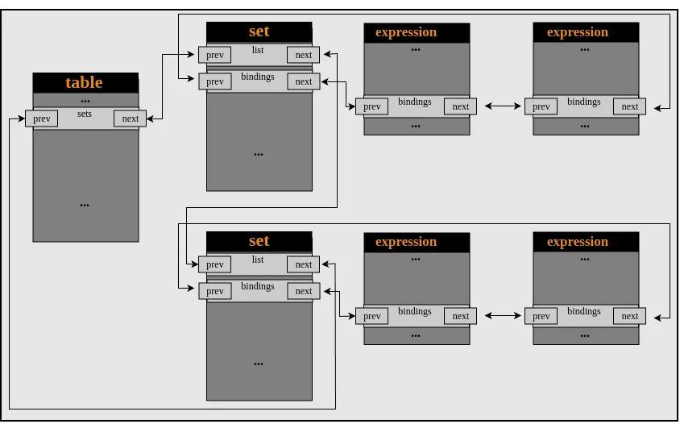

# hackerfantastic
**https://twitter.com/hackerfantastic/status/1768334124022895009 _at 2024-03-14, 17:51:23_**
<blockquote>
RT @TheHackersNews: Researchers detail a high-severity flaw in #Kubernetes, CVE-2023-5528, that allowed attackers remote code execution wit…
</blockquote>

<table><tr>
<td>Quotes: <code>0</code></td>
<td>Replies: <code>0</code></td>
<td>Retweets: <code>42</code></td>
<td>Favorites: <code>0</code></td>
</tr></table>

---

# TheHackersNews
**https://twitter.com/TheHackersNews/status/1768246221502591129 _at 2024-03-14, 12:02:06_**
<blockquote>
Researchers detail a high-severity flaw in #Kubernetes, CVE-2023-5528, that allowed attackers remote code execution with SYSTEM privileges on Windows endpoints within a cluster.

Learn more: https://t.co/mBFuSM1SuG

#hacking #cybersecurity #infosec
</blockquote>

* https://thehackernews.com/2024/03/researchers-detail-kubernetes.html

<table><tr>
<td>Quotes: <code>0</code></td>
<td>Replies: <code>2</code></td>
<td>Retweets: <code>40</code></td>
<td>Favorites: <code>73</code></td>
</tr></table>

---

# momika233
**https://twitter.com/momika233/status/1768173921323675734 _at 2024-03-14, 07:14:48_**
<blockquote>
RT @cyber_advising: CVE-2024-21762: A out-of-bounds write in Fortinet FortiOS versions 7.4.0 through 7.4.2, 7.2.0 through 7.2.6, 7.0.0 thro…
</blockquote>

<table><tr>
<td>Quotes: <code>0</code></td>
<td>Replies: <code>0</code></td>
<td>Retweets: <code>62</code></td>
<td>Favorites: <code>0</code></td>
</tr></table>

---

# steventseeley
**https://twitter.com/steventseeley/status/1768146507709206734 _at 2024-03-14, 05:25:52_**
<blockquote>
RT @cyber_advising: CVE-2024-21762: A out-of-bounds write in Fortinet FortiOS versions 7.4.0 through 7.4.2, 7.2.0 through 7.2.6, 7.0.0 thro…
</blockquote>

<table><tr>
<td>Quotes: <code>0</code></td>
<td>Replies: <code>0</code></td>
<td>Retweets: <code>68</code></td>
<td>Favorites: <code>0</code></td>
</tr></table>

---

# TheHackersNews
**https://twitter.com/TheHackersNews/status/1768139807278932067 _at 2024-03-14, 04:59:15_**
<blockquote>
🛑 A new DarkGate #malware campaign uses a recently patched #Microsoft Windows flaw (CVE-2024-21412) to deploy malicious software via bogus installers.

Learn more: https://t.co/J8OjMzntrR

#hacking #cybersecurity
</blockquote>

* https://thehackernews.com/2024/03/darkgate-malware-exploits-recently.html

<table><tr>
<td>Quotes: <code>2</code></td>
<td>Replies: <code>1</code></td>
<td>Retweets: <code>28</code></td>
<td>Favorites: <code>70</code></td>
</tr></table>

---

# TheHackersNews
**https://twitter.com/TheHackersNews/status/1768130697951130112 _at 2024-03-14, 04:23:03_**
<blockquote>
⚠️ Vulnerability Alert: Fortinet warns of a severe SQL Injection #vulnerability (CVE-2023-48788) in FortiClientEMS allowing unauthenticated attackers to execute code remotely.

Details: https://t.co/yHa0OB0Cs4

Check if your versions are affected and upgrade ASAP!
</blockquote>

* https://thehackernews.com/2024/03/fortinet-warns-of-severe-sqli.html

<table><tr>
<td>Quotes: <code>5</code></td>
<td>Replies: <code>1</code></td>
<td>Retweets: <code>90</code></td>
<td>Favorites: <code>142</code></td>
</tr></table>

---

# piedpiper1616
**https://twitter.com/piedpiper1616/status/1768061890608136478 _at 2024-03-13, 23:49:38_**
<blockquote>
GitHub - nettitude/CVE-2024-25153: Proof-of-concept exploit for CVE-2024-25153. - https://t.co/nVuld3yXNu
</blockquote>

* https://github.com/nettitude/CVE-2024-25153

<table><tr>
<td>Quotes: <code>1</code></td>
<td>Replies: <code>0</code></td>
<td>Retweets: <code>17</code></td>
<td>Favorites: <code>40</code></td>
</tr></table>

---

# GreyNoiseIO
**https://twitter.com/GreyNoiseIO/status/1768026057083359428 _at 2024-03-13, 21:27:15_**
<blockquote>
We published a tag today for CVE-2023-48788, a CVSS 9.8 SQL 💉 injection vulnerability in FortiNet FortiClientEMS, thanks to our friends at @Horizon3ai  https://t.co/Ir0Uc7QQku
</blockquote>

* https://viz.greynoise.io/tags/fortinet-forticlientems-cve-2023-48788-sql-injection-attempt?days=10

<table><tr>
<td>Quotes: <code>0</code></td>
<td>Replies: <code>0</code></td>
<td>Retweets: <code>12</code></td>
<td>Favorites: <code>32</code></td>
</tr></table>

---

# standa_t
**https://twitter.com/standa_t/status/1768019723940507912 _at 2024-03-13, 21:02:05_**
<blockquote>
RT @0xor0ne: Interesting short reading on CVE-2024-21305: Hypervisor-Protected Code Integrity
(HVCI) bypass for arbitrary kernel-mode code…
</blockquote>

<table><tr>
<td>Quotes: <code>0</code></td>
<td>Replies: <code>0</code></td>
<td>Retweets: <code>78</code></td>
<td>Favorites: <code>0</code></td>
</tr></table>

---

# kmkz_security
**https://twitter.com/kmkz_security/status/1767979010133221438 _at 2024-03-13, 18:20:18_**
<blockquote>
RT @Horizon3Attack: The recent #Fortinet #FortiClient Endpoint Management Server (EMS) SQL injection vulnerability, CVE-2023-48788, allows…
</blockquote>

<table><tr>
<td>Quotes: <code>0</code></td>
<td>Replies: <code>0</code></td>
<td>Retweets: <code>77</code></td>
<td>Favorites: <code>0</code></td>
</tr></table>

---

# wvuuuuuuuuuuuuu
**https://twitter.com/wvuuuuuuuuuuuuu/status/1767968639141994960 _at 2024-03-13, 17:39:05_**
<blockquote>
RT @Horizon3Attack: The recent #Fortinet #FortiClient Endpoint Management Server (EMS) SQL injection vulnerability, CVE-2023-48788, allows…
</blockquote>

<table><tr>
<td>Quotes: <code>0</code></td>
<td>Replies: <code>0</code></td>
<td>Retweets: <code>95</code></td>
<td>Favorites: <code>0</code></td>
</tr></table>

---

# Horizon3Attack
**https://twitter.com/Horizon3Attack/status/1767965754744312161 _at 2024-03-13, 17:27:37_**
<blockquote>
The recent #Fortinet #FortiClient Endpoint Management Server (EMS) SQL injection vulnerability, CVE-2023-48788, allows an unauth attacker to obtain RCE as SYSTEM on the server.

IOCs, POC, and deep-dive blog to be released next week. In the meantime, check DAS service logs for… https://t.co/57ps2WiY8R
</blockquote>

<table><tr>
<td></td>
</table></tr>
<table><tr>
<td>Quotes: <code>3</code></td>
<td>Replies: <code>0</code></td>
<td>Retweets: <code>78</code></td>
<td>Favorites: <code>182</code></td>
</tr></table>

---

# Nettitude_Labs
**https://twitter.com/Nettitude_Labs/status/1767932490679779717 _at 2024-03-13, 15:15:27_**
<blockquote>
CVE-2024-25153: Remote Code Execution vulnerability in Fortra FileCatalyst. 

Full exploit and technical details included in our latest Labs post.

https://t.co/EaMuLuYaOo
</blockquote>

* https://labs.nettitude.com/blog/cve-2024-25153-remote-code-execution-in-fortra-filecatalyst/

<table><tr>
<td>Quotes: <code>0</code></td>
<td>Replies: <code>0</code></td>
<td>Retweets: <code>13</code></td>
<td>Favorites: <code>32</code></td>
</tr></table>

---

# kmkz_security
**https://twitter.com/kmkz_security/status/1767930818553315579 _at 2024-03-13, 15:08:48_**
<blockquote>
RT @cyber_advising: CVE-2024-21762: A out-of-bounds write in Fortinet FortiOS versions 7.4.0 through 7.4.2, 7.2.0 through 7.2.6, 7.0.0 thro…
</blockquote>

<table><tr>
<td>Quotes: <code>0</code></td>
<td>Replies: <code>0</code></td>
<td>Retweets: <code>56</code></td>
<td>Favorites: <code>0</code></td>
</tr></table>

---

# ptracesecurity
**https://twitter.com/ptracesecurity/status/1767921171176059138 _at 2024-03-13, 14:30:28_**
<blockquote>
CVE-2024-21378 — Remote Code Execution in Microsoft Outlook https://t.co/7ELyXiPiBi #Pentesting #CyberSecurity #Infosec https://t.co/IYWQLMnTht
</blockquote>

* https://www.netspi.com/blog/technical/red-team-operations/microsoft-outlook-remote-code-execution-cve-2024-21378/?utm_source=organic_social&utm_medium=organic_social&utm_campaign=tech_blog&utm_term=outlook-cve

<table><tr>
<td></td>
<td></td>
<td></td>
<td></td>
</table></tr>
<table><tr>
<td>Quotes: <code>0</code></td>
<td>Replies: <code>0</code></td>
<td>Retweets: <code>25</code></td>
<td>Favorites: <code>88</code></td>
</tr></table>

---

# cyber_advising
**https://twitter.com/cyber_advising/status/1767915098805256633 _at 2024-03-13, 14:06:20_**
<blockquote>
CVE-2024-21762: A out-of-bounds write in Fortinet FortiOS versions 7.4.0 through 7.4.2, 7.2.0 through 7.2.6, 7.0.0 through .... allows attacker to execute unauthorized code or commands via specifically crafted requests.

PoC
https://t.co/UBZcnCPfuR https://t.co/xe0RwLybhF
</blockquote>

* https://github.com/h4x0r-dz/CVE-2024-21762

<table><tr>
<td></td>
</table></tr>
<table><tr>
<td>Quotes: <code>1</code></td>
<td>Replies: <code>0</code></td>
<td>Retweets: <code>62</code></td>
<td>Favorites: <code>161</code></td>
</tr></table>

---

# piedpiper1616
**https://twitter.com/piedpiper1616/status/1767885274720461273 _at 2024-03-13, 12:07:49_**
<blockquote>
GitHub - h4x0r-dz/CVE-2024-21762: out-of-bounds write in Fortinet FortiOS CVE-2024-21762 vulnerability - https://t.co/ScC0UlNRUC
</blockquote>

* https://github.com/h4x0r-dz/CVE-2024-21762

<table><tr>
<td>Quotes: <code>1</code></td>
<td>Replies: <code>0</code></td>
<td>Retweets: <code>21</code></td>
<td>Favorites: <code>68</code></td>
</tr></table>

---

# Dinosn
**https://twitter.com/Dinosn/status/1767859506032025809 _at 2024-03-13, 10:25:26_**
<blockquote>
CVE-2024-27135: Apache Pulsar Remote Code Execution Vulnerability https://t.co/YtreVbFhN0
</blockquote>

* https://securityonline.info/cve-2024-27135-apache-pulsar-remote-code-execution-vulnerability/

<table><tr>
<td>Quotes: <code>0</code></td>
<td>Replies: <code>0</code></td>
<td>Retweets: <code>16</code></td>
<td>Favorites: <code>44</code></td>
</tr></table>

---

# testanull
**https://twitter.com/testanull/status/1767756105407463656 _at 2024-03-13, 03:34:33_**
<blockquote>
CVE-2024-21426 &amp; CVE-2024-26198

Attacker be like: https://t.co/tu3La44GOs
</blockquote>

<table><tr>
<td></td>
</table></tr>
<table><tr>
<td>Quotes: <code>0</code></td>
<td>Replies: <code>0</code></td>
<td>Retweets: <code>8</code></td>
<td>Favorites: <code>99</code></td>
</tr></table>

---

# chybeta
**https://twitter.com/chybeta/status/1767745935633949052 _at 2024-03-13, 02:54:08_**
<blockquote>
analysis for CVE-2024-23917 

https://t.co/CBABOYOBec
</blockquote>

* https://t.zsxq.com/183GqPIax

<table><tr>
<td>Quotes: <code>2</code></td>
<td>Replies: <code>0</code></td>
<td>Retweets: <code>14</code></td>
<td>Favorites: <code>82</code></td>
</tr></table>

---

# elhackernet
**https://twitter.com/elhackernet/status/1767616547215085645 _at 2024-03-12, 18:20:00_**
<blockquote>
Explotando la vulnerabilidad RCE en Microsoft Outlook

⏭️CVE-2024-21378 — Remote Code Execution
https://t.co/KrmUFQjSeN
</blockquote>

* https://www.netspi.com/blog/technical/red-team-operations/microsoft-outlook-remote-code-execution-cve-2024-21378/

<table><tr>
<td>Quotes: <code>2</code></td>
<td>Replies: <code>0</code></td>
<td>Retweets: <code>24</code></td>
<td>Favorites: <code>86</code></td>
</tr></table>

---

# Dinosn
**https://twitter.com/Dinosn/status/1767574171398062332 _at 2024-03-12, 15:31:37_**
<blockquote>
CVE-2024-22039 (CVSS 10): Siemens Fire Protection Systems Vulnerable to Remote Attacks https://t.co/mR990hlNwq
</blockquote>

* https://securityonline.info/cve-2024-22039-cvss-10-siemens-fire-protection-systems-vulnerable-to-remote-attacks/

<table><tr>
<td>Quotes: <code>0</code></td>
<td>Replies: <code>1</code></td>
<td>Retweets: <code>25</code></td>
<td>Favorites: <code>56</code></td>
</tr></table>

---

# HunterMapping
**https://twitter.com/HunterMapping/status/1767383273146376540 _at 2024-03-12, 02:53:03_**
<blockquote>
🚨Alert🚨CVE-2024-21378:Remote Code Execution in Microsoft Outlook 
⚠New research has been published on how to discover and exploit the vulnerability️!
📊662K+ Services are found on https://t.co/WrjZaG0jRH
🔗Hunter:https://t.co/D4e39xFXWj

Dorks 👇👇👇
Hunter:… https://t.co/BuDUXFkD3I
</blockquote>

* http://Hunter.how
* https://hunter.how/list?searchValue=product.name%3D%22Outlook%20Web%20App%22

<table><tr>
<td></td>
</table></tr>
<table><tr>
<td>Quotes: <code>3</code></td>
<td>Replies: <code>5</code></td>
<td>Retweets: <code>117</code></td>
<td>Favorites: <code>298</code></td>
</tr></table>

---

# piedpiper1616
**https://twitter.com/piedpiper1616/status/1767338224903712957 _at 2024-03-11, 23:54:03_**
<blockquote>
RT @Horizon3Attack: Today we are disclosing a critical SSRF vulnerability, CVE-2023-49785, in a popular Gen AI chatbot, NextChat a.k.a Chat…
</blockquote>

<table><tr>
<td>Quotes: <code>0</code></td>
<td>Replies: <code>0</code></td>
<td>Retweets: <code>58</code></td>
<td>Favorites: <code>0</code></td>
</tr></table>

---

# pdnuclei
**https://twitter.com/pdnuclei/status/1767264821366419874 _at 2024-03-11, 19:02:22_**
<blockquote>
RT @DhiyaneshDK: Scan for [CVE-2023-49785] ChatGPT-Next-Web - SSRF/XSS (https://t.co/acAaQmQlkB) [critical] using @pdnuclei 

Nuclei Templa…
</blockquote>

* https://github.com/nvn1729

<table><tr>
<td>Quotes: <code>0</code></td>
<td>Replies: <code>0</code></td>
<td>Retweets: <code>34</code></td>
<td>Favorites: <code>0</code></td>
</tr></table>

---

# kmkz_security
**https://twitter.com/kmkz_security/status/1767255673803346291 _at 2024-03-11, 18:26:01_**
<blockquote>
RT @NetSPI: [Blog] CVE-2024-21378 – Microsoft Outlook Remote Code Execution 

How we discovered &amp; were able to exploit this vulnerability:…
</blockquote>

<table><tr>
<td>Quotes: <code>0</code></td>
<td>Replies: <code>0</code></td>
<td>Retweets: <code>83</code></td>
<td>Favorites: <code>0</code></td>
</tr></table>

---

# cyb3rops
**https://twitter.com/cyb3rops/status/1767249703186387369 _at 2024-03-11, 18:02:17_**
<blockquote>
RT @NetSPI: [Blog] CVE-2024-21378 – Microsoft Outlook Remote Code Execution 

How we discovered &amp; were able to exploit this vulnerability:…
</blockquote>

<table><tr>
<td>Quotes: <code>0</code></td>
<td>Replies: <code>0</code></td>
<td>Retweets: <code>83</code></td>
<td>Favorites: <code>0</code></td>
</tr></table>

---

# wvuuuuuuuuuuuuu
**https://twitter.com/wvuuuuuuuuuuuuu/status/1767212600041836788 _at 2024-03-11, 15:34:51_**
<blockquote>
RT @DhiyaneshDK: Scan for [CVE-2023-49785] ChatGPT-Next-Web - SSRF/XSS (https://t.co/acAaQmQlkB) [critical] using @pdnuclei 

Nuclei Templa…
</blockquote>

* https://github.com/nvn1729

<table><tr>
<td>Quotes: <code>0</code></td>
<td>Replies: <code>0</code></td>
<td>Retweets: <code>34</code></td>
<td>Favorites: <code>0</code></td>
</tr></table>

---

# DhiyaneshDK
**https://twitter.com/DhiyaneshDK/status/1767212195727728793 _at 2024-03-11, 15:33:15_**
<blockquote>
Scan for [CVE-2023-49785] ChatGPT-Next-Web - SSRF/XSS (https://t.co/acAaQmQlkB) [critical] using @pdnuclei 

Nuclei Template : https://t.co/44pVMqxbPK

#cve #nextchat #chatgpt #xss #ssrf #pdteam #hackwithutomation https://t.co/d6T4HmlPD4
</blockquote>

* https://github.com/nvn1729
* https://github.com/projectdiscovery/nuclei-templates/pull/9319/files

<table><tr>
<td></td>
</table></tr>
<table><tr>
<td>Quotes: <code>2</code></td>
<td>Replies: <code>1</code></td>
<td>Retweets: <code>38</code></td>
<td>Favorites: <code>169</code></td>
</tr></table>

---

# hackerfantastic
**https://twitter.com/hackerfantastic/status/1767208323932209481 _at 2024-03-11, 15:17:52_**
<blockquote>
RT @NetSPI: [Blog] CVE-2024-21378 – Microsoft Outlook Remote Code Execution 

How we discovered &amp; were able to exploit this vulnerability:…
</blockquote>

<table><tr>
<td>Quotes: <code>0</code></td>
<td>Replies: <code>0</code></td>
<td>Retweets: <code>47</code></td>
<td>Favorites: <code>0</code></td>
</tr></table>

---

# wvuuuuuuuuuuuuu
**https://twitter.com/wvuuuuuuuuuuuuu/status/1767205865143062564 _at 2024-03-11, 15:08:06_**
<blockquote>
RT @Horizon3Attack: Today we are disclosing a critical SSRF vulnerability, CVE-2023-49785, in a popular Gen AI chatbot, NextChat a.k.a Chat…
</blockquote>

<table><tr>
<td>Quotes: <code>0</code></td>
<td>Replies: <code>0</code></td>
<td>Retweets: <code>56</code></td>
<td>Favorites: <code>0</code></td>
</tr></table>

---

# kmkz_security
**https://twitter.com/kmkz_security/status/1767187069015609503 _at 2024-03-11, 13:53:24_**
<blockquote>
RT @Horizon3Attack: Today we are disclosing a critical SSRF vulnerability, CVE-2023-49785, in a popular Gen AI chatbot, NextChat a.k.a Chat…
</blockquote>

<table><tr>
<td>Quotes: <code>0</code></td>
<td>Replies: <code>0</code></td>
<td>Retweets: <code>57</code></td>
<td>Favorites: <code>0</code></td>
</tr></table>

---

# Dinosn
**https://twitter.com/Dinosn/status/1767183629455589743 _at 2024-03-11, 13:39:44_**
<blockquote>
CVE-2024-21378 — Remote Code Execution in Microsoft Outlook https://t.co/usVxdegKJw
</blockquote>

* https://www.netspi.com/blog/technical/red-team-operations/microsoft-outlook-remote-code-execution-cve-2024-21378/

<table><tr>
<td>Quotes: <code>5</code></td>
<td>Replies: <code>2</code></td>
<td>Retweets: <code>186</code></td>
<td>Favorites: <code>455</code></td>
</tr></table>

---

# NetSPI
**https://twitter.com/NetSPI/status/1767175389569290359 _at 2024-03-11, 13:07:00_**
<blockquote>
[Blog] CVE-2024-21378 – Microsoft Outlook Remote Code Execution 

How we discovered &amp; were able to exploit this vulnerability: https://t.co/6R2THE2paW

Written by: Rich Wolferd, NetSPI’s Director of Red Team Operations &amp; Nick Landers @monoxgas https://t.co/LrAelKRs3R
</blockquote>

* https://ow.ly/L29F50QQ7s4

<table><tr>
<td></td>
</table></tr>
<table><tr>
<td>Quotes: <code>4</code></td>
<td>Replies: <code>2</code></td>
<td>Retweets: <code>83</code></td>
<td>Favorites: <code>180</code></td>
</tr></table>

---

# TheHackersNews
**https://twitter.com/TheHackersNews/status/1767075326356820322 _at 2024-03-11, 06:29:23_**
<blockquote>
⚠️ URGENT patch needed! Progress OpenEdge Authentication Gateway/AdminServer #vulnerability (CVE-2024-1403) allows authentication bypass.

Proof-of-concept exploit is available.

Learn more: https://t.co/CFmuQu8H5Q

Update to supported versions ASAP.

#hacking
</blockquote>

* https://thehackernews.com/2024/03/proof-of-concept-exploit-released-for.html

<table><tr>
<td>Quotes: <code>3</code></td>
<td>Replies: <code>0</code></td>
<td>Retweets: <code>71</code></td>
<td>Favorites: <code>113</code></td>
</tr></table>

---

# hd3s5
**https://twitter.com/hd3s5/status/1766320498072228313 _at 2024-03-09, 04:29:58_**
<blockquote>
#itw #0day #ALPC
The first #poc of CVE-2023-21674 in github.
The attackers break out of the sandbox in Chromium by using this vulnerability.
https://t.co/elBEAj7YTJ
</blockquote>

* https://github.com/hd3s5aa/CVE-2023-21674

<table><tr>
<td>Quotes: <code>0</code></td>
<td>Replies: <code>0</code></td>
<td>Retweets: <code>30</code></td>
<td>Favorites: <code>144</code></td>
</tr></table>

---

# GreyNoiseIO
**https://twitter.com/GreyNoiseIO/status/1766172187721892238 _at 2024-03-08, 18:40:38_**
<blockquote>
🔍 Curiosity led GreyNoise's own @h0wdeee on a mission to unravel the mysteries of CVE-2024-21762, a critical Fortinet FortiOS &amp; FortiProxy vulnerability. With no PoC in sight, we crafted our own detection. Join them on this gripping journey.  
https://t.co/jALN253nFs…
</blockquote>

* https://www.greynoise.io/blog/hunting-for-fortinets-cve-2024-21762

<table><tr>
<td>Quotes: <code>1</code></td>
<td>Replies: <code>1</code></td>
<td>Retweets: <code>28</code></td>
<td>Favorites: <code>66</code></td>
</tr></table>

---

# momika233
**https://twitter.com/momika233/status/1766134622654787679 _at 2024-03-08, 16:11:21_**
<blockquote>
1Panel Unauthorized access vulnerability
CVE-2024-27288

https://t.co/VmhvXBU2Pr
</blockquote>

* https://github.com/advisories/GHSA-26w3-q4j8-4xjp

<table><tr>
<td>Quotes: <code>1</code></td>
<td>Replies: <code>2</code></td>
<td>Retweets: <code>11</code></td>
<td>Favorites: <code>50</code></td>
</tr></table>

---

# TheHackersNews
**https://twitter.com/TheHackersNews/status/1766014347204231307 _at 2024-03-08, 08:13:25_**
<blockquote>
🚨 #Cisco issued patches for a high-severity flaw (CVE-2024-20337) in Secure Client software on Windows, #Linux, and macOS. Attackers could hijack VPN sessions.

Check and update now: https://t.co/lIcBk5pFTh

#hacking #cybersecurity #infosec
</blockquote>

* https://thehackernews.com/2024/03/cisco-issues-patch-for-high-severity.html

<table><tr>
<td>Quotes: <code>4</code></td>
<td>Replies: <code>5</code></td>
<td>Retweets: <code>101</code></td>
<td>Favorites: <code>190</code></td>
</tr></table>

---

# chybeta
**https://twitter.com/chybeta/status/1765785473895780688 _at 2024-03-07, 17:03:58_**
<blockquote>
CVE-2024-23917 Teamcity &lt; 2023.11.3 unauth RCE

yes, CVE-2024-23917 ,  
not  CVE-2024-27198 https://t.co/embVgw5RI3
</blockquote>

<table><tr>
<td></td>
</table></tr>
<table><tr>
<td>Quotes: <code>4</code></td>
<td>Replies: <code>4</code></td>
<td>Retweets: <code>29</code></td>
<td>Favorites: <code>203</code></td>
</tr></table>

---

# cyber_advising
**https://twitter.com/cyber_advising/status/1765731342715695199 _at 2024-03-07, 13:28:52_**
<blockquote>
CVE-2023-36899 - CVE-2023-36560: Source Code Disclosure in https://t.co/dKq4ojYEin apps.

PoC
https://t.co/S6Vh6lSn0K https://t.co/nIunrAnQNq
</blockquote>

* http://ASP.NET
* https://swarm.ptsecurity.com/source-code-disclosure-in-asp-net-apps/

<table><tr>
<td></td>
</table></tr>
<table><tr>
<td>Quotes: <code>0</code></td>
<td>Replies: <code>0</code></td>
<td>Retweets: <code>11</code></td>
<td>Favorites: <code>41</code></td>
</tr></table>

---

# kmkz_security
**https://twitter.com/kmkz_security/status/1765636858891936050 _at 2024-03-07, 07:13:25_**
<blockquote>
RT @W01fh4cker: Happy PWN!!!
RCE script: https://t.co/ETIagkeOxQ
#CVE-2024-27198 #redteam #jetbrains #teamcity https://t.co/zgD8ngccWo
</blockquote>

* https://github.com/W01fh4cker/CVE-2024-27198-RCE

<table><tr>
<td></td>
</table></tr>
<table><tr>
<td>Quotes: <code>0</code></td>
<td>Replies: <code>0</code></td>
<td>Retweets: <code>35</code></td>
<td>Favorites: <code>0</code></td>
</tr></table>

---

# pdnuclei
**https://twitter.com/pdnuclei/status/1765537192099618852 _at 2024-03-07, 00:37:23_**
<blockquote>
RT @DhiyaneshDK: Scan for JetBrains TeamCity Authentication Bypass Vulnerabilities using @pdnuclei 

CVE-2024-27198 (Critical) - https://t.…
</blockquote>

<table><tr>
<td>Quotes: <code>0</code></td>
<td>Replies: <code>0</code></td>
<td>Retweets: <code>59</code></td>
<td>Favorites: <code>0</code></td>
</tr></table>

---

# wdormann
**https://twitter.com/wdormann/status/1765495461249466676 _at 2024-03-06, 21:51:33_**
<blockquote>
RT @Horizon3Attack: The recent #Progress #OpenEdge auth bypass, CVE-2024-1403, allows an unauth user to obtain admin perms to control svcs.…
</blockquote>

<table><tr>
<td>Quotes: <code>0</code></td>
<td>Replies: <code>0</code></td>
<td>Retweets: <code>39</code></td>
<td>Favorites: <code>0</code></td>
</tr></table>

---

# wvuuuuuuuuuuuuu
**https://twitter.com/wvuuuuuuuuuuuuu/status/1765429313820561855 _at 2024-03-06, 17:28:43_**
<blockquote>
RT @Horizon3Attack: The recent #Progress #OpenEdge auth bypass, CVE-2024-1403, allows an unauth user to obtain admin perms to control svcs.…
</blockquote>

<table><tr>
<td>Quotes: <code>0</code></td>
<td>Replies: <code>0</code></td>
<td>Retweets: <code>33</code></td>
<td>Favorites: <code>0</code></td>
</tr></table>

---

# thezdi
**https://twitter.com/thezdi/status/1765424395516817910 _at 2024-03-06, 17:09:10_**
<blockquote>
In our latest guest blog, the Trend Micro Research team details CVE-2023-36049 - a .NET LPE bug originally found by ZDI's own @chudyPB. An attacker could write/delete arbitrary files in the context of the FTP server. Read all the details at https://t.co/eJxSjAVHR2
</blockquote>

* https://www.zerodayinitiative.com/blog/2024/3/6/cve-2023-36049-microsoft-net-crlf-injection-arbitrary-file-writedeletion-vulnerability

<table><tr>
<td>Quotes: <code>1</code></td>
<td>Replies: <code>0</code></td>
<td>Retweets: <code>19</code></td>
<td>Favorites: <code>59</code></td>
</tr></table>

---

# TheHackersNews
**https://twitter.com/TheHackersNews/status/1765255083472867523 _at 2024-03-06, 05:56:23_**
<blockquote>
🚨 Heads up, Apple users!

Apple rolls out crucial updates for #iOS &amp; iPadOS to patch actively exploited vulnerabilities CVE-2024-23225 &amp; CVE-2024-23296, enhancing kernel memory protection.

Ensure your devices are updated: https://t.co/Jj3Ndx6efF

#cybersecurity #hacking
</blockquote>

* https://thehackernews.com/2024/03/urgent-apple-issues-critical-updates.html

<table><tr>
<td>Quotes: <code>9</code></td>
<td>Replies: <code>9</code></td>
<td>Retweets: <code>132</code></td>
<td>Favorites: <code>225</code></td>
</tr></table>

---

# blackorbird
**https://twitter.com/blackorbird/status/1765195442835382433 _at 2024-03-06, 01:59:23_**
<blockquote>
#Kimsuky  CVE-2024-1709 + CVE-2024-1708
ConnectWise ScreenConnect Vulnerability Exploited to Deploy BABYSHARK Variant
https://t.co/okyQjwRTLN https://t.co/JIHTOAnn3p
</blockquote>

* https://www.kroll.com/en/insights/publications/cyber/screenconnect-vulnerability-exploited-to-deploy-babyshark

<table><tr>
<td></td>
</table></tr>
<table><tr>
<td>Quotes: <code>1</code></td>
<td>Replies: <code>1</code></td>
<td>Retweets: <code>21</code></td>
<td>Favorites: <code>56</code></td>
</tr></table>

---

# wvuuuuuuuuuuuuu
**https://twitter.com/wvuuuuuuuuuuuuu/status/1765083317026848868 _at 2024-03-05, 18:33:51_**
<blockquote>
RT @DhiyaneshDK: Scan for JetBrains TeamCity Authentication Bypass Vulnerabilities using @pdnuclei 

CVE-2024-27198 (Critical) - https://t.…
</blockquote>

<table><tr>
<td>Quotes: <code>0</code></td>
<td>Replies: <code>0</code></td>
<td>Retweets: <code>59</code></td>
<td>Favorites: <code>0</code></td>
</tr></table>

---

# wvuuuuuuuuuuuuu
**https://twitter.com/wvuuuuuuuuuuuuu/status/1765058599024312380 _at 2024-03-05, 16:55:37_**
<blockquote>
RT @stephenfewer: Our exploit module for CVE-2024-27198 is now in the @metasploit pull queue. Unauthenticated RCE in JetBrains TeamCity due…
</blockquote>

<table><tr>
<td>Quotes: <code>0</code></td>
<td>Replies: <code>0</code></td>
<td>Retweets: <code>35</code></td>
<td>Favorites: <code>0</code></td>
</tr></table>

---

# hackerfantastic
**https://twitter.com/hackerfantastic/status/1765058577234837807 _at 2024-03-05, 16:55:32_**
<blockquote>
RT @TheHackersNews: North Korean hackers exploit ConnectWise ScreenConnect vulnerabilities (CVE-2024-1708 &amp; CVE-2024-1709) to deploy TODDLE…
</blockquote>

<table><tr>
<td>Quotes: <code>0</code></td>
<td>Replies: <code>0</code></td>
<td>Retweets: <code>48</code></td>
<td>Favorites: <code>0</code></td>
</tr></table>

---

# stephenfewer
**https://twitter.com/stephenfewer/status/1765052628096971202 _at 2024-03-05, 16:31:54_**
<blockquote>
Our exploit module for CVE-2024-27198 is now in the @metasploit pull queue. Unauthenticated RCE in JetBrains TeamCity due to an authentication bypass vulnerability: https://t.co/2kANTPjfMi https://t.co/FG8FP7kWnI
</blockquote>

* https://github.com/rapid7/metasploit-framework/pull/18922

<table><tr>
<td></td>
</table></tr>
<table><tr>
<td>Quotes: <code>2</code></td>
<td>Replies: <code>0</code></td>
<td>Retweets: <code>35</code></td>
<td>Favorites: <code>115</code></td>
</tr></table>

---

# TheHackersNews
**https://twitter.com/TheHackersNews/status/1765049848007631057 _at 2024-03-05, 16:20:51_**
<blockquote>
North Korean hackers exploit ConnectWise ScreenConnect vulnerabilities (CVE-2024-1708 &amp; CVE-2024-1709) to deploy TODDLERSHARK malware, adding to the notorious Kimsuky arsenal alongside BabyShark and ReconShark.

Learn more: https://t.co/6dbXdY6Zfx
</blockquote>

* https://thehackernews.com/2024/03/hackers-exploit-connectwise.html

<table><tr>
<td>Quotes: <code>6</code></td>
<td>Replies: <code>4</code></td>
<td>Retweets: <code>86</code></td>
<td>Favorites: <code>208</code></td>
</tr></table>

---

# kmkz_security
**https://twitter.com/kmkz_security/status/1765011091040383045 _at 2024-03-05, 13:46:51_**
<blockquote>
RT @stephenfewer: We have disclosed 2 authentication bypass vulnerabilities, CVE-2024-27198 and CVE-2024-27199, affecting JetBrains TeamCit…
</blockquote>

<table><tr>
<td>Quotes: <code>0</code></td>
<td>Replies: <code>0</code></td>
<td>Retweets: <code>73</code></td>
<td>Favorites: <code>0</code></td>
</tr></table>

---

# cyb3rops
**https://twitter.com/cyb3rops/status/1764954803589845054 _at 2024-03-05, 10:03:11_**
<blockquote>
RT @X1r0z: My detailed analysis report of SolarWinds Security Event Manager AMF Deserialization RCE (CVE-2024-0692), with two methods to ac…
</blockquote>

<table><tr>
<td>Quotes: <code>0</code></td>
<td>Replies: <code>0</code></td>
<td>Retweets: <code>63</code></td>
<td>Favorites: <code>0</code></td>
</tr></table>

---

# kmkz_security
**https://twitter.com/kmkz_security/status/1764949897298530456 _at 2024-03-05, 09:43:41_**
<blockquote>
RT @X1r0z: My detailed analysis report of SolarWinds Security Event Manager AMF Deserialization RCE (CVE-2024-0692), with two methods to ac…
</blockquote>

<table><tr>
<td>Quotes: <code>0</code></td>
<td>Replies: <code>0</code></td>
<td>Retweets: <code>60</code></td>
<td>Favorites: <code>0</code></td>
</tr></table>

---

# 0xor0ne
**https://twitter.com/0xor0ne/status/1764923891690958863 _at 2024-03-05, 08:00:21_**
<blockquote>
CVE-2022-32250 (credits @nccgroupinfosec)

"UAF vulnerability affecting the netlink subsystem can be exploited twice to open up other more powerful use-after-free primitives"

https://t.co/NKTlRmplK6

#cybersecurity #Linux https://t.co/yClXooPzem
</blockquote>

* https://research.nccgroup.com/2022/09/01/settlers-of-netlink-exploiting-a-limited-uaf-in-nf_tables-cve-2022-32250/

<table><tr>
<td></td>
<td></td>
<td></td>
</table></tr>
<table><tr>
<td>Quotes: <code>0</code></td>
<td>Replies: <code>1</code></td>
<td>Retweets: <code>22</code></td>
<td>Favorites: <code>95</code></td>
</tr></table>

---

# steventseeley
**https://twitter.com/steventseeley/status/1764917598830104889 _at 2024-03-05, 07:35:20_**
<blockquote>
RT @X1r0z: My detailed analysis report of SolarWinds Security Event Manager AMF Deserialization RCE (CVE-2024-0692), with two methods to ac…
</blockquote>

<table><tr>
<td>Quotes: <code>0</code></td>
<td>Replies: <code>0</code></td>
<td>Retweets: <code>65</code></td>
<td>Favorites: <code>0</code></td>
</tr></table>

---

# piedpiper1616
**https://twitter.com/piedpiper1616/status/1764899471195021371 _at 2024-03-05, 06:23:18_**
<blockquote>
RT @stephenfewer: We have disclosed 2 authentication bypass vulnerabilities, CVE-2024-27198 and CVE-2024-27199, affecting JetBrains TeamCit…
</blockquote>

<table><tr>
<td>Quotes: <code>0</code></td>
<td>Replies: <code>0</code></td>
<td>Retweets: <code>74</code></td>
<td>Favorites: <code>0</code></td>
</tr></table>

---

# testanull
**https://twitter.com/testanull/status/1764867985343418506 _at 2024-03-05, 04:18:12_**
<blockquote>
RT @X1r0z: My detailed analysis report of SolarWinds Security Event Manager AMF Deserialization RCE (CVE-2024-0692), with two methods to ac…
</blockquote>

<table><tr>
<td>Quotes: <code>0</code></td>
<td>Replies: <code>0</code></td>
<td>Retweets: <code>65</code></td>
<td>Favorites: <code>0</code></td>
</tr></table>

---

# wvuuuuuuuuuuuuu
**https://twitter.com/wvuuuuuuuuuuuuu/status/1764862860344033722 _at 2024-03-05, 03:57:50_**
<blockquote>
RT @X1r0z: My detailed analysis report of SolarWinds Security Event Manager AMF Deserialization RCE (CVE-2024-0692), with two methods to ac…
</blockquote>

<table><tr>
<td>Quotes: <code>0</code></td>
<td>Replies: <code>0</code></td>
<td>Retweets: <code>60</code></td>
<td>Favorites: <code>0</code></td>
</tr></table>

---

# wvuuuuuuuuuuuuu
**https://twitter.com/wvuuuuuuuuuuuuu/status/1764858062102212729 _at 2024-03-05, 03:38:46_**
<blockquote>
RT @TheHackersNews: Critical TeamCity software flaws leave CI/CD servers open to complete takeover.

Read more about CVE-2024-27198, CVE-20…
</blockquote>

<table><tr>
<td>Quotes: <code>0</code></td>
<td>Replies: <code>0</code></td>
<td>Retweets: <code>55</code></td>
<td>Favorites: <code>0</code></td>
</tr></table>

---

# TheHackersNews
**https://twitter.com/TheHackersNews/status/1764857621247647862 _at 2024-03-05, 03:37:01_**
<blockquote>
Critical TeamCity software flaws leave CI/CD servers open to complete takeover.

Read more about CVE-2024-27198, CVE-2024-27199 and update your systems now → https://t.co/Sjt6bPiDE2

#cybersecurity #hacking
</blockquote>

* https://thehackernews.com/2024/03/critical-jetbrains-teamcity-on-premises.html

<table><tr>
<td>Quotes: <code>1</code></td>
<td>Replies: <code>5</code></td>
<td>Retweets: <code>55</code></td>
<td>Favorites: <code>115</code></td>
</tr></table>

---

# wvuuuuuuuuuuuuu
**https://twitter.com/wvuuuuuuuuuuuuu/status/1764780754377015465 _at 2024-03-04, 22:31:34_**
<blockquote>
RT @h4x0r_dz: what an incredible auth bypass! 

/foo?jsp=/authenticated-endpoint;.jsp

CVE-2024-27198 TeamCity authentication bypass
https:…
</blockquote>

<table><tr>
<td>Quotes: <code>0</code></td>
<td>Replies: <code>0</code></td>
<td>Retweets: <code>113</code></td>
<td>Favorites: <code>0</code></td>
</tr></table>

---

# steventseeley
**https://twitter.com/steventseeley/status/1764765832792637945 _at 2024-03-04, 21:32:16_**
<blockquote>
RT @stephenfewer: We have disclosed 2 authentication bypass vulnerabilities, CVE-2024-27198 and CVE-2024-27199, affecting JetBrains TeamCit…
</blockquote>

<table><tr>
<td>Quotes: <code>0</code></td>
<td>Replies: <code>0</code></td>
<td>Retweets: <code>73</code></td>
<td>Favorites: <code>0</code></td>
</tr></table>

---

# h1Disclosed
**https://twitter.com/h1Disclosed/status/1764742893296550106 _at 2024-03-04, 20:01:07_**
<blockquote>
⚡ CVE-2022-21371:  Oracle WebLogic Server Local File Inclusion 
👨🏻‍💻 deb0con ➟ Mars 
🟥 High
💰 None
🔗 https://t.co/boVBURmONU
#bugbounty #bugbountytips #cybersecurity #infosec https://t.co/HADmLKoVr4
</blockquote>

* https://hackerone.com/reports/2387600

<table><tr>
<td></td>
</table></tr>
<table><tr>
<td>Quotes: <code>0</code></td>
<td>Replies: <code>0</code></td>
<td>Retweets: <code>4</code></td>
<td>Favorites: <code>34</code></td>
</tr></table>

---

# binitamshah
**https://twitter.com/binitamshah/status/1764278987444924869 _at 2024-03-03, 13:17:43_**
<blockquote>
Bluetooth vulnerabilities in Android, Linux, macOS, iOS and Windows can be exploited to pair an emulated bluetooth keyboard and inject keystrokes without user confirmation : https://t.co/lekyzS2abA  credits @marcnewlin 

Slides : https://t.co/RS6gZHxiIJ 

CVE's : 

CVE-2024-0230… https://t.co/ugUME8JMrf
</blockquote>

* https://github.com/skysafe/reblog/blob/main/cve-2024-0230/README.md
* https://github.com/marcnewlin/hi_my_name_is_keyboard/blob/main/slides/hi_my_name_is_keyboard.pdf

<table><tr>
<td></td>
</table></tr>
<table><tr>
<td>Quotes: <code>11</code></td>
<td>Replies: <code>7</code></td>
<td>Retweets: <code>152</code></td>
<td>Favorites: <code>477</code></td>
</tr></table>

---

# ptracesecurity
**https://twitter.com/ptracesecurity/status/1764199068123709744 _at 2024-03-03, 08:00:09_**
<blockquote>
Safely detect whether a FortiGate SSL VPN is vulnerable to CVE-2024-21762 https://t.co/Pmoh8VWzCr #Pentesting #WebSecurity #Infosec https://t.co/lDSpckjJ3N
</blockquote>

* https://github.com/BishopFox/cve-2024-21762-check

<table><tr>
<td></td>
</table></tr>
<table><tr>
<td>Quotes: <code>0</code></td>
<td>Replies: <code>0</code></td>
<td>Retweets: <code>18</code></td>
<td>Favorites: <code>62</code></td>
</tr></table>

---

# hackerfantastic
**https://twitter.com/hackerfantastic/status/1764022964318527604 _at 2024-03-02, 20:20:23_**
<blockquote>
RT @piedpiper1616: GitHub - BishopFox/cve-2024-21762-check: Safely detect whether a FortiGate SSL VPN is vulnerable to CVE-2024-21762 - htt…
</blockquote>

<table><tr>
<td>Quotes: <code>0</code></td>
<td>Replies: <code>0</code></td>
<td>Retweets: <code>34</code></td>
<td>Favorites: <code>0</code></td>
</tr></table>

---

# binitamshah
**https://twitter.com/binitamshah/status/1763929767932227801 _at 2024-03-02, 14:10:03_**
<blockquote>
PoC Released for CVE-2023-42942 – a macOS Root Privilege Escalation Vulnerability : https://t.co/DWqPDzfxek
</blockquote>

* https://jhftss.github.io/CVE-2023-42942-xpcroleaccountd-Root-Privilege-Escalation/

<table><tr>
<td>Quotes: <code>0</code></td>
<td>Replies: <code>2</code></td>
<td>Retweets: <code>16</code></td>
<td>Favorites: <code>46</code></td>
</tr></table>

---

# Dinosn
**https://twitter.com/Dinosn/status/1763891852682404210 _at 2024-03-02, 11:39:23_**
<blockquote>
Hikvision Patches Security Flaws (CVE-2024-25063 &amp; 25064): Update Your HikCentral Pro https://t.co/H9Vvx4V9z1
</blockquote>

* https://securityonline.info/hikvision-patches-security-flaws-cve-2024-25063-25064-update-your-hikcentral-pro/

<table><tr>
<td>Quotes: <code>0</code></td>
<td>Replies: <code>1</code></td>
<td>Retweets: <code>16</code></td>
<td>Favorites: <code>63</code></td>
</tr></table>

---

# piedpiper1616
**https://twitter.com/piedpiper1616/status/1763777455809331653 _at 2024-03-02, 04:04:49_**
<blockquote>
GitHub - BishopFox/cve-2024-21762-check: Safely detect whether a FortiGate SSL VPN is vulnerable to CVE-2024-21762 - https://t.co/PXD8flXrtz
</blockquote>

* https://github.com/BishopFox/cve-2024-21762-check

<table><tr>
<td>Quotes: <code>1</code></td>
<td>Replies: <code>0</code></td>
<td>Retweets: <code>34</code></td>
<td>Favorites: <code>92</code></td>
</tr></table>

---

# Dinosn
**https://twitter.com/Dinosn/status/1763773971655188807 _at 2024-03-02, 03:50:58_**
<blockquote>
CVE-2024-0692: SolarWinds Security Event Manager Unauthenticated RCE Flaw https://t.co/ytGrysMAGv
</blockquote>

* https://securityonline.info/cve-2024-0692-solarwinds-security-event-manager-unauthenticated-rce-flaw/

<table><tr>
<td>Quotes: <code>0</code></td>
<td>Replies: <code>5</code></td>
<td>Retweets: <code>10</code></td>
<td>Favorites: <code>34</code></td>
</tr></table>

---

# ptracesecurity
**https://twitter.com/ptracesecurity/status/1763632873867747490 _at 2024-03-01, 18:30:18_**
<blockquote>
Apache Solr Backup/Restore APIs RCE Poc (CVE-2023-50386) https://t.co/PR8KYjJxvR  #Pentesting #CyberSecurity #Infosec https://t.co/xkjCXbQKAD
</blockquote>

* https://github.com/vvmdx/Apache-Solr-RCE_CVE-2023-50386_POC

<table><tr>
<td></td>
</table></tr>
<table><tr>
<td>Quotes: <code>0</code></td>
<td>Replies: <code>0</code></td>
<td>Retweets: <code>19</code></td>
<td>Favorites: <code>44</code></td>
</tr></table>

---

# Dinosn
**https://twitter.com/Dinosn/status/1763521311920267632 _at 2024-03-01, 11:07:00_**
<blockquote>
CVE-2024-21762 Vulnerability Scanner for FortiGate Firewalls https://t.co/Am7Pm2e17X
</blockquote>

* https://bishopfox.com/blog/cve-2024-21762-vulnerability-scanner-for-fortigate-firewalls

<table><tr>
<td>Quotes: <code>0</code></td>
<td>Replies: <code>1</code></td>
<td>Retweets: <code>26</code></td>
<td>Favorites: <code>101</code></td>
</tr></table>

---

# CVEnew
**https://twitter.com/CVEnew/status/1763494657974301161 _at 2024-03-01, 09:21:05_**
<blockquote>
CVE-2024-0692 The SolarWinds Security Event Manager was susceptible to Remote Code Execution Vulnerability. This vulnerability allows an unauthenticated user to abuse SolarWinds’ ser… https://t.co/EPktfpIHs5
</blockquote>

* https://www.cve.org/CVERecord?id=CVE-2024-0692

<table><tr>
<td>Quotes: <code>13</code></td>
<td>Replies: <code>3</code></td>
<td>Retweets: <code>34</code></td>
<td>Favorites: <code>73</code></td>
</tr></table>

---

# piedpiper1616
**https://twitter.com/piedpiper1616/status/1763451675459911823 _at 2024-03-01, 06:30:17_**
<blockquote>
GitHub - vvmdx/Apache-Solr-RCE_CVE-2023-50386_POC: Apache Solr Backup/Restore APIs RCE Poc (CVE-2023-50386) - https://t.co/FEuFMCEl2P
</blockquote>

* https://github.com/vvmdx/Apache-Solr-RCE_CVE-2023-50386_POC

<table><tr>
<td>Quotes: <code>0</code></td>
<td>Replies: <code>0</code></td>
<td>Retweets: <code>12</code></td>
<td>Favorites: <code>42</code></td>
</tr></table>

---

# HunterMapping
**https://twitter.com/HunterMapping/status/1763403867050721759 _at 2024-03-01, 03:20:19_**
<blockquote>
🚨Alert🚨CVE-2023-50386: Apache Solr Backup/Restore APIs RCE POC Released
⚠Backup/Restore APIs allow for deployment of executables in malicious ConfigSets.
📊 87.3k+ Services are found on https://t.co/WrjZaG0jRH
🔗Hunter Link: https://t.co/84D8rqNUgJ

👇👇👇Query
Hunter:… https://t.co/PaE7r2A3CZ
</blockquote>

* http://Hunter.how
* https://hunter.how/list?searchValue=product.name%3D%22Solr%22

<table><tr>
<td></td>
</table></tr>
<table><tr>
<td>Quotes: <code>1</code></td>
<td>Replies: <code>0</code></td>
<td>Retweets: <code>27</code></td>
<td>Favorites: <code>64</code></td>
</tr></table>

---

