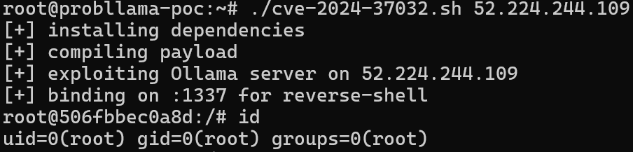
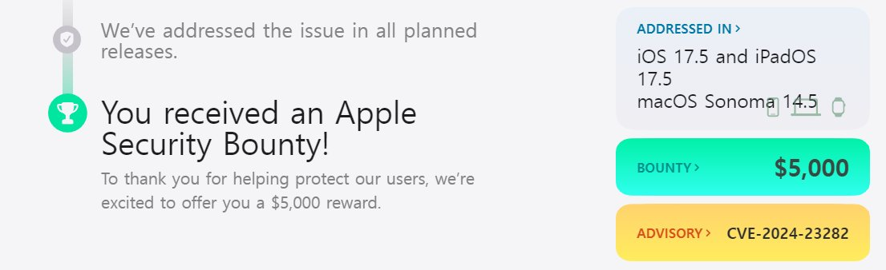

# cyber_advising
**https://twitter.com/cyber_advising/status/1807038611075821689 _at 2024-06-29, 13:09:12_**
<blockquote>
CVE-2024-34102: Adobe Commerce versions 2.4.7, 2.4.6-p5, 2.4.5-p7, 2.4.4-p8 and earlier are affected by an Improper Restriction of XML External Entity Reference ('XXE') vulnerability that could result in arbitrary code execution.

PoC
https://t.co/XjtjhVHReX https://t.co/9q8upGebCM
</blockquote>

* https://github.com/bigb0x/CVE-2024-34102

<table><tr>
<td></td>
</table></tr>
<table><tr>
<td>Quotes: <code>0</code></td>
<td>Replies: <code>1</code></td>
<td>Retweets: <code>13</code></td>
<td>Favorites: <code>35</code></td>
</tr></table>

---

# elhackernet
**https://twitter.com/elhackernet/status/1806371899615658124 _at 2024-06-27, 16:59:56_**
<blockquote>
Análisis técnico y detallado de la grave vulnerabilidad en Microsoft Outlook 

➡️ CVE-2024-21378 — Remote Code Execution (RCE) en Microsoft Outlook 
https://t.co/VyrGHPMdUF https://t.co/gNQ1sotpPt
</blockquote>

* https://www.netspi.com/blog/technical-blog/red-team-operations/microsoft-outlook-remote-code-execution-cve-2024-21378/

<table><tr>
<td></td>
<td></td>
<td></td>
<td></td>
</table></tr>
<table><tr>
<td>Quotes: <code>1</code></td>
<td>Replies: <code>3</code></td>
<td>Retweets: <code>82</code></td>
<td>Favorites: <code>184</code></td>
</tr></table>

---

# mmolgtm
**https://twitter.com/mmolgtm/status/1806004969167864276 _at 2024-06-26, 16:41:53_**
<blockquote>
In this post I'll use CVE-2024-3833, a type confusion in v8 to gain remote code execution in the Chrome renderer sandbox: https://t.co/p37oaM71PL
</blockquote>

* https://github.blog/2024-06-26-attack-of-the-clones-getting-rce-in-chromes-renderer-with-duplicate-object-properties/

<table><tr>
<td>Quotes: <code>2</code></td>
<td>Replies: <code>1</code></td>
<td>Retweets: <code>86</code></td>
<td>Favorites: <code>268</code></td>
</tr></table>

---

# 0xor0ne
**https://twitter.com/0xor0ne/status/1805979438238040107 _at 2024-06-26, 15:00:26_**
<blockquote>
Linux kernel vulnerability analysis (CVE-2023-0179) and exploitation to achieve Local Privilege Escalation (LPE)
Credits Davide Ornaghi (@TurtleARM97)

Part 1: https://t.co/hxivM2oF14
Part 2: https://t.co/2Q1UcKmXpv

#lpe #infosec https://t.co/qDSKsmwmHM
</blockquote>

* https://betrusted.it/blog/64-bytes-and-a-rop-chain-part-1/
* https://betrusted.it/blog/64-bytes-and-a-rop-chain-part-2/

<table><tr>
<td></td>
<td></td>
</table></tr>
<table><tr>
<td>Quotes: <code>0</code></td>
<td>Replies: <code>2</code></td>
<td>Retweets: <code>29</code></td>
<td>Favorites: <code>122</code></td>
</tr></table>

---

# pdnuclei
**https://twitter.com/pdnuclei/status/1805922117604594080 _at 2024-06-26, 11:12:39_**
<blockquote>
RT @DhiyaneshDK: 🚨 Scan for Adobe Commerce &amp; Magento - XXE  

(CVE-2024-34102) discovered by Sergey Temnikov using Nuclei Template @pdnucle…
</blockquote>

<table><tr>
<td>Quotes: <code>0</code></td>
<td>Replies: <code>0</code></td>
<td>Retweets: <code>40</code></td>
<td>Favorites: <code>0</code></td>
</tr></table>

---

# 0xor0ne
**https://twitter.com/0xor0ne/status/1805858539916669319 _at 2024-06-26, 07:00:01_**
<blockquote>
Well written blog post on exploiting a Use-after-Free (UaF) in Linux kernel (CVE-2024-0582, io_uring)
Credits Oriol Castejón (@XI_Research)

https://t.co/8eKtsR9t8G

#iouring #infosec https://t.co/0x0ALrpjI9
</blockquote>

* https://blog.exodusintel.com/2024/03/27/mind-the-patch-gap-exploiting-an-io_uring-vulnerability-in-ubuntu/

<table><tr>
<td></td>
</table></tr>
<table><tr>
<td>Quotes: <code>0</code></td>
<td>Replies: <code>1</code></td>
<td>Retweets: <code>48</code></td>
<td>Favorites: <code>207</code></td>
</tr></table>

---

# Dinosn
**https://twitter.com/Dinosn/status/1805791859509223766 _at 2024-06-26, 02:35:03_**
<blockquote>
PoC Exploit Published for Windows Kernel Elevation of Privilege Vulnerability (CVE-2024-30088) https://t.co/rAXyin7uyf
</blockquote>

* https://securityonline.info/poc-exploit-published-for-windows-kernel-elevation-of-privilege-vulnerability-cve-2024-30088/

<table><tr>
<td>Quotes: <code>0</code></td>
<td>Replies: <code>1</code></td>
<td>Retweets: <code>114</code></td>
<td>Favorites: <code>306</code></td>
</tr></table>

---

# chybeta
**https://twitter.com/chybeta/status/1805635705303187718 _at 2024-06-25, 16:14:33_**
<blockquote>
CVE-2024-34102 Pre Auth XXE in magento https://t.co/ZxRCmgc2eu
</blockquote>

<table><tr>
<td></td>
</table></tr>
<table><tr>
<td>Quotes: <code>2</code></td>
<td>Replies: <code>3</code></td>
<td>Retweets: <code>37</code></td>
<td>Favorites: <code>227</code></td>
</tr></table>

---

# hd3s5
**https://twitter.com/hd3s5/status/1805419248992284755 _at 2024-06-25, 01:54:26_**
<blockquote>
The latest #Chrome 0day #POC. (CVE-2024-5274)
  (v1 = class C1 {
    static {
      this;
    }
  }) =&gt; {} https://t.co/ePv6InxBce
</blockquote>

<table><tr>
<td></td>
</table></tr>
<table><tr>
<td>Quotes: <code>3</code></td>
<td>Replies: <code>9</code></td>
<td>Retweets: <code>132</code></td>
<td>Favorites: <code>670</code></td>
</tr></table>

---

# sagitz_
**https://twitter.com/sagitz_/status/1805261557481312623 _at 2024-06-24, 15:27:50_**
<blockquote>
We found a Remote Code Execution (RCE) vulnerability in @Ollama - one of the most popular AI inference projects on GitHub. Here is everything you need to know about #Probllama (CVE-2024-37032) 🧵👇 https://t.co/DcYmrwisPC
</blockquote>

<table><tr>
<td></td>
</table></tr>
<table><tr>
<td>Quotes: <code>27</code></td>
<td>Replies: <code>24</code></td>
<td>Retweets: <code>341</code></td>
<td>Favorites: <code>1624</code></td>
</tr></table>

---

# ptracesecurity
**https://twitter.com/ptracesecurity/status/1804514719488696677 _at 2024-06-22, 14:00:10_**
<blockquote>
CVE-2024-21378 — Remote Code Execution in Microsoft Outlook  https://t.co/eznxII9y9T  #Pentesting #CyberSecurity #Infosec https://t.co/NR2Ukme5Mp
</blockquote>

* https://www.netspi.com/blog/technical-blog/adversary-simulation/microsoft-outlook-remote-code-execution-cve-2024-21378/

<table><tr>
<td></td>
<td></td>
<td></td>
<td></td>
</table></tr>
<table><tr>
<td>Quotes: <code>0</code></td>
<td>Replies: <code>0</code></td>
<td>Retweets: <code>19</code></td>
<td>Favorites: <code>58</code></td>
</tr></table>

---

# cyber_advising
**https://twitter.com/cyber_advising/status/1804119011086549017 _at 2024-06-21, 11:47:45_**
<blockquote>
CVE-2024-30270 mailcow: A security vulnerability has been identified in mailcow affecting versions prior to 2024-04. This vulnerability is a combination of path traversal and arbitrary code execution.

PoC
https://t.co/Foia4KG5d5 https://t.co/wbxqwbgeVq
</blockquote>

* https://github.com/Alchemist3dot14/CVE-2024-30270-PoC

<table><tr>
<td></td>
</table></tr>
<table><tr>
<td>Quotes: <code>0</code></td>
<td>Replies: <code>0</code></td>
<td>Retweets: <code>3</code></td>
<td>Favorites: <code>37</code></td>
</tr></table>

---

# sirifu4k1
**https://twitter.com/sirifu4k1/status/1804011883340665242 _at 2024-06-21, 04:42:04_**
<blockquote>
CVE-2024-31982:XWiki Remote code execution as guest via DatabaseSearch 
#RCE #POC 
%7D%7D%7D%7B%7Basync%20async%3Dfalse%7D%7D%7B%7Bgroovy%7D%7Dprintln%28%22Hello%20from%22%20%2B%20%22%20search%20text%3A%22%20%2B%20%2823%20%2B%2019%29%29%7B%7B%2Fgroovy%7D%7D%7B%7B%2Fasync%7D%7D%20 https://t.co/KrKdgBwx6T
</blockquote>

<table><tr>
<td></td>
</table></tr>
<table><tr>
<td>Quotes: <code>2</code></td>
<td>Replies: <code>1</code></td>
<td>Retweets: <code>15</code></td>
<td>Favorites: <code>86</code></td>
</tr></table>

---

# h4x0r_dz
**https://twitter.com/h4x0r_dz/status/1803982888930513268 _at 2024-06-21, 02:46:51_**
<blockquote>
Remote Code Execution in Microsoft Outlook or CVE-2024-21378 Is Real ☠️‼️

https://t.co/k5a8B22yrv
</blockquote>

* https://www.netspi.com/blog/technical-blog/adversary-simulation/microsoft-outlook-remote-code-execution-cve-2024-21378/

<table><tr>
<td>Quotes: <code>0</code></td>
<td>Replies: <code>0</code></td>
<td>Retweets: <code>28</code></td>
<td>Favorites: <code>216</code></td>
</tr></table>

---

# binitamshah
**https://twitter.com/binitamshah/status/1803745265368945111 _at 2024-06-20, 11:02:37_**
<blockquote>
RCE in Microsoft Outlook (CVE-2024-21378) : https://t.co/FTv44MaWQx https://t.co/xfiHCfCkaM
</blockquote>

* https://www.netspi.com/blog/technical-blog/red-team-operations/microsoft-outlook-remote-code-execution-cve-2024-21378/

<table><tr>
<td></td>
</table></tr>
<table><tr>
<td>Quotes: <code>0</code></td>
<td>Replies: <code>1</code></td>
<td>Retweets: <code>51</code></td>
<td>Favorites: <code>176</code></td>
</tr></table>

---

# win3zz
**https://twitter.com/win3zz/status/1803422369987567859 _at 2024-06-19, 13:39:33_**
<blockquote>
CVE-2024-28397: js2py (JS interpreter) Sandbox Escape, bypassing restrictions to execute commands.

An official fix is unavailable. Check here for a temporary fix: https://t.co/Hno3mp3PY6

Vulnerability originally discovered by Marven11 (GitHub username) https://t.co/AtOPXsOfLf
</blockquote>

* https://github.com/Marven11/CVE-2024-28397-js2py-Sandbox-Escape

<table><tr>
<td></td>
<td></td>
</table></tr>
<table><tr>
<td>Quotes: <code>0</code></td>
<td>Replies: <code>2</code></td>
<td>Retweets: <code>37</code></td>
<td>Favorites: <code>118</code></td>
</tr></table>

---

# sirifu4k1
**https://twitter.com/sirifu4k1/status/1803267896656929099 _at 2024-06-19, 03:25:44_**
<blockquote>
#Zyxel #NAS #RCE #POC of
CVE-2024-29973 #CVE https://t.co/XWGX4G626Y
</blockquote>

<table><tr>
<td></td>
</table></tr>
<table><tr>
<td>Quotes: <code>1</code></td>
<td>Replies: <code>1</code></td>
<td>Retweets: <code>20</code></td>
<td>Favorites: <code>83</code></td>
</tr></table>

---

# Gi7w0rm
**https://twitter.com/Gi7w0rm/status/1803064364536045631 _at 2024-06-18, 13:56:58_**
<blockquote>
⚠️0-click #RCE in Outlook⚠️

The #CVE-2024-30103 vulnerability leverages a flaw in how Microsoft Outlook handles specific types of email content. An attacker can embed malicious code within the body of an email, which gets executed as soon as the email is opened. https://t.co/4JWs8FLaEW
</blockquote>

<table><tr>
<td></td>
</table></tr>
<table><tr>
<td>Quotes: <code>13</code></td>
<td>Replies: <code>13</code></td>
<td>Retweets: <code>142</code></td>
<td>Favorites: <code>406</code></td>
</tr></table>

---

# HunterMapping
**https://twitter.com/HunterMapping/status/1803013162297598162 _at 2024-06-18, 10:33:30_**
<blockquote>
🚨Alert🚨CVE-2024-37079 &amp; CVE-2024-37080 (CVSS scores: 9.8): Multiple heap-overflow vulnerabilities in the implementation of the DCE/RPC protocol!
⚠They could allow a bad actor with network access to vCenter Server to achieve remote code execution by sending a specially crafted https://t.co/yaciVaJDDO
</blockquote>

<table><tr>
<td></td>
</table></tr>
<table><tr>
<td>Quotes: <code>1</code></td>
<td>Replies: <code>1</code></td>
<td>Retweets: <code>93</code></td>
<td>Favorites: <code>231</code></td>
</tr></table>

---

# DailyDarkWeb
**https://twitter.com/DailyDarkWeb/status/1802717847057051854 _at 2024-06-17, 15:00:02_**
<blockquote>
Threat Actor Claims to Sell Exploit for Windows WiFi RCE (CVE-2024-30078)

https://t.co/FR7WnjTAvk

#DarkWeb #exploit #RCE #Windows #WiFi https://t.co/KavHwVBDmb
</blockquote>

* https://dailydarkweb.net/threat-actor-claims-to-sell-exploit-for-windows-wifi-rce-cve-2024-30078

<table><tr>
<td></td>
</table></tr>
<table><tr>
<td>Quotes: <code>0</code></td>
<td>Replies: <code>2</code></td>
<td>Retweets: <code>11</code></td>
<td>Favorites: <code>48</code></td>
</tr></table>

---

# Dinosn
**https://twitter.com/Dinosn/status/1802707396072022240 _at 2024-06-17, 14:18:30_**
<blockquote>
CVE-2024-21378 — Remote Code Execution in Microsoft Outlook https://t.co/CMJrt9399E
</blockquote>

* https://www.netspi.com/blog/technical-blog/red-team-operations/microsoft-outlook-remote-code-execution-cve-2024-21378/

<table><tr>
<td>Quotes: <code>4</code></td>
<td>Replies: <code>1</code></td>
<td>Retweets: <code>89</code></td>
<td>Favorites: <code>267</code></td>
</tr></table>

---

# elhackernet
**https://twitter.com/elhackernet/status/1802670723908948237 _at 2024-06-17, 11:52:47_**
<blockquote>
🚨Vulnerabilidad crítica sin intervención del usuario en Microsoft Outlook 

CVE-2024-30103 : Zero-Click Critical Microsoft Outlook Vulnerability

https://t.co/3ZrgekvzUq https://t.co/VN3EySfNj6
</blockquote>

* https://ironscales.com/blog/zero-click-critical-microsoft-outlook-vulnerability.-what-you-need-to-know

<table><tr>
<td></td>
</table></tr>
<table><tr>
<td>Quotes: <code>5</code></td>
<td>Replies: <code>2</code></td>
<td>Retweets: <code>83</code></td>
<td>Favorites: <code>239</code></td>
</tr></table>

---

# HunterMapping
**https://twitter.com/HunterMapping/status/1802612402510512523 _at 2024-06-17, 08:01:02_**
<blockquote>
🚨Alert🚨CVE-2024-30103: Microsoft Outlook Remote Code Execution Vulnerability
⚠This Microsoft Outlook vulnerability can be circulated from user to user and doesn’t require a click to execute. Rather, execution initiates when an affected email is opened.This is notably dangerous https://t.co/bP3FfbT0Vu
</blockquote>

<table><tr>
<td></td>
</table></tr>
<table><tr>
<td>Quotes: <code>7</code></td>
<td>Replies: <code>6</code></td>
<td>Retweets: <code>176</code></td>
<td>Favorites: <code>411</code></td>
</tr></table>

---

# 0xor0ne
**https://twitter.com/0xor0ne/status/1802242228598743169 _at 2024-06-16, 07:30:05_**
<blockquote>
Exploiting a Linux kernel io_uring use-after-free (UAF) vulnerability (CVE-2024-0582)
Credits Oriol Castejón (@ExodusIntel)

https://t.co/8eKtsR9t8G

#Linux https://t.co/MdusDariPC
</blockquote>

* https://blog.exodusintel.com/2024/03/27/mind-the-patch-gap-exploiting-an-io_uring-vulnerability-in-ubuntu/

<table><tr>
<td></td>
<td></td>
</table></tr>
<table><tr>
<td>Quotes: <code>0</code></td>
<td>Replies: <code>0</code></td>
<td>Retweets: <code>44</code></td>
<td>Favorites: <code>181</code></td>
</tr></table>

---

# Dinosn
**https://twitter.com/Dinosn/status/1801820954407944208 _at 2024-06-15, 03:36:06_**
<blockquote>
CVE-2024-26229: Windows Elevation of Privilege Flaw Weaponized, PoC Exploit on GitHub https://t.co/ykkAVrizPl
</blockquote>

* https://securityonline.info/cve-2024-26229-windows-elevation-of-privilege-flaw-weaponized-poc-exploit-on-github/

<table><tr>
<td>Quotes: <code>1</code></td>
<td>Replies: <code>0</code></td>
<td>Retweets: <code>106</code></td>
<td>Favorites: <code>302</code></td>
</tr></table>

---

# sector7_nl
**https://twitter.com/sector7_nl/status/1801581297023713487 _at 2024-06-14, 11:43:47_**
<blockquote>
We've published our writeup of CVE-2024-20693, a vulnerability in Windows that allowed spoofing the code signature of binaries by placing them on an SMB share. This research originally was about something different, but we ran into a signature check...

https://t.co/NXpMN4DNQz https://t.co/jhVoCPiVRO
</blockquote>

* https://sector7.computest.nl/post/2024-06-cve-2024-20693-windows-cached-code-signature-manipulation/

<table><tr>
<td></td>
</table></tr>
<table><tr>
<td>Quotes: <code>4</code></td>
<td>Replies: <code>6</code></td>
<td>Retweets: <code>95</code></td>
<td>Favorites: <code>298</code></td>
</tr></table>

---

# securityfreax
**https://twitter.com/securityfreax/status/1801580000228905359 _at 2024-06-14, 11:38:38_**
<blockquote>
Why has Outlook RCE #CVE-2024-30103 only a CVSS of 8.8? What the fuck is this?

Why is privilege required = low? 

What privileges are required to simply send an email to a victim? The RCE will be triggered by only viewing a malicious email.

It's should be a CVSS 10.0. https://t.co/qBHV3x2n0Z
</blockquote>

<table><tr>
<td></td>
</table></tr>
<table><tr>
<td>Quotes: <code>0</code></td>
<td>Replies: <code>2</code></td>
<td>Retweets: <code>4</code></td>
<td>Favorites: <code>52</code></td>
</tr></table>

---

# linkersec
**https://twitter.com/linkersec/status/1801391631066599584 _at 2024-06-13, 23:10:07_**
<blockquote>
Attacking Android Binder: Analysis and Exploitation of CVE-2023-20938

An article by @abc_sup, Gulshan Singh, and @vxradius about exploiting a vulnerability in the Android Binder device driver that leads to a slab use-after-free.

https://t.co/oXBNfePtSm https://t.co/fRfeiS9a7W
</blockquote>

* https://androidoffsec.withgoogle.com/posts/attacking-android-binder-analysis-and-exploitation-of-cve-2023-20938/

<table><tr>
<td></td>
</table></tr>
<table><tr>
<td>Quotes: <code>1</code></td>
<td>Replies: <code>1</code></td>
<td>Retweets: <code>15</code></td>
<td>Favorites: <code>61</code></td>
</tr></table>

---

# SinSinology
**https://twitter.com/SinSinology/status/1801210994963751236 _at 2024-06-13, 11:12:20_**
<blockquote>
🚨🚨DO NOT PANIC! I'm publishing my detailed analysis of CVE-2024-29855 which targets Veeam Recovery Orchestrator Authentication 🩸, this has a score of CVSS 9 🪲, but IMHO its not as severe, however, I like the technical details of it, so here we go 🔥
https://t.co/skbvln88Lg
</blockquote>

* https://summoning.team/blog/veeam-recovery-orchestrator-auth-bypass-cve-2024-29855/

<table><tr>
<td>Quotes: <code>0</code></td>
<td>Replies: <code>2</code></td>
<td>Retweets: <code>46</code></td>
<td>Favorites: <code>392</code></td>
</tr></table>

---

# chybeta
**https://twitter.com/chybeta/status/1801196898692555138 _at 2024-06-13, 10:16:19_**
<blockquote>
CVE-2024-28995 https://t.co/VsXVXWrvRy
</blockquote>

<table><tr>
<td></td>
</table></tr>
<table><tr>
<td>Quotes: <code>1</code></td>
<td>Replies: <code>11</code></td>
<td>Retweets: <code>31</code></td>
<td>Favorites: <code>431</code></td>
</tr></table>

---

# stephenfewer
**https://twitter.com/stephenfewer/status/1801191416741130575 _at 2024-06-13, 09:54:32_**
<blockquote>
We have published our @rapid7 AttackerKB Analysis of CVE-2024-28995, a high-severity directory traversal vulnerability affecting SolarWinds Serv-U. An unauthenticated attacker can read arbitrary files, full technical details here: https://t.co/TKNrWVJrBz
</blockquote>

* https://attackerkb.com/topics/2k7UrkHyl3/cve-2024-28995/rapid7-analysis

<table><tr>
<td>Quotes: <code>0</code></td>
<td>Replies: <code>2</code></td>
<td>Retweets: <code>38</code></td>
<td>Favorites: <code>97</code></td>
</tr></table>

---

# _odisseus
**https://twitter.com/_odisseus/status/1801141549050302704 _at 2024-06-13, 06:36:23_**
<blockquote>
RT @cyber_advising: CVE-2024-26229: An attacker who successfully exploited this vulnerability could gain SYSTEM privileges.

PoC
https://t.…
</blockquote>

<table><tr>
<td>Quotes: <code>0</code></td>
<td>Replies: <code>0</code></td>
<td>Retweets: <code>184</code></td>
<td>Favorites: <code>0</code></td>
</tr></table>

---

# Shadowserver
**https://twitter.com/Shadowserver/status/1800986234753302891 _at 2024-06-12, 20:19:13_**
<blockquote>
Critical Microsoft Message Queuing (MSMQ) Remote Code Execution (RCE) vulnerability CVE-2024-30080

~256,000 publicly exposed devices: 
https://t.co/qjYHm5hikZ

https://t.co/DQdwlz6u0t

Check our free Accessible MSMQ Service Report &amp; patch immediately:
https://t.co/F80eTnh6cx https://t.co/X51kAWyOnr
</blockquote>

* https://dashboard.shadowserver.org/statistics/combined/time-series/?date_range=30&source=population&source=population6&tag=msmq&dataset=unique_ips&style=stacked
* https://dashboard.shadowserver.org/statistics/combined/tree/?day=2024-06-11&source=population&source=population6&tag=msmq&geo=all&data_set=count&scale=log
* https://www.shadowserver.org/what-we-do/network-reporting/accessible-msmq-service-report/

<table><tr>
<td></td>
<td></td>
</table></tr>
<table><tr>
<td>Quotes: <code>12</code></td>
<td>Replies: <code>4</code></td>
<td>Retweets: <code>75</code></td>
<td>Favorites: <code>148</code></td>
</tr></table>

---

# cyber_advising
**https://twitter.com/cyber_advising/status/1800498964980269148 _at 2024-06-11, 12:02:59_**
<blockquote>
CVE-2024-26229: An attacker who successfully exploited this vulnerability could gain SYSTEM privileges.

PoC
https://t.co/19siS5H6E6 https://t.co/UabSUIkGO2
</blockquote>

* https://github.com/varwara/CVE-2024-26229

<table><tr>
<td></td>
</table></tr>
<table><tr>
<td>Quotes: <code>3</code></td>
<td>Replies: <code>8</code></td>
<td>Retweets: <code>180</code></td>
<td>Favorites: <code>627</code></td>
</tr></table>

---

# WangTielei
**https://twitter.com/WangTielei/status/1800472065407094973 _at 2024-06-11, 10:16:06_**
<blockquote>
Still interested in exploiting IPC memory corruptions on Apple devices? Try this one:

CVE-2024-27801, UAF in the low level implementation of NSXPC that has been present since the initial release of NSXPC (over decade ago).

POC: https://t.co/MeMWo8Ey5L
</blockquote>

* https://github.com/wangtielei/POCs/blob/main/CVE-2024-27801/POC.m

<table><tr>
<td>Quotes: <code>0</code></td>
<td>Replies: <code>1</code></td>
<td>Retweets: <code>43</code></td>
<td>Favorites: <code>178</code></td>
</tr></table>

---

# certik_io
**https://twitter.com/certik_io/status/1800461903514239158 _at 2024-06-11, 09:35:43_**
<blockquote>
The @CertiKSkyfall  team identified and collaborated with @Apple  to fix a vulnerability (CVE-2024-27801) in the low-level implementation of NSXPC, affecting all Apple platforms. 

This vulnerability could have potentially allowed malicious apps to gain unauthorized access to https://t.co/sjgS1SExF9
</blockquote>

<table><tr>
<td></td>
</table></tr>
<table><tr>
<td>Quotes: <code>7</code></td>
<td>Replies: <code>796</code></td>
<td>Retweets: <code>928</code></td>
<td>Favorites: <code>1196</code></td>
</tr></table>

---

# HunterMapping
**https://twitter.com/HunterMapping/status/1800366198393332099 _at 2024-06-11, 03:15:25_**
<blockquote>
🚨Alert🚨CVE-2024-23692: Unauthenticated RCE Flaw in Rejetto HTTP File Server
🔥PoC: https://t.co/ie2opiLnO3
📰Refer: https://t.co/OPypHteE9h
⚠It allows remote attackers to execute arbitrary code on affected servers without authentication, potentially leading to data breaches, https://t.co/ozcHMK0EnK
</blockquote>

* https://github.com/rapid7/metasploit-framework/pull/19240
* https://mohemiv.com/all/rejetto-http-file-server-2-3m-unauthenticated-rce/#/

<table><tr>
<td></td>
</table></tr>
<table><tr>
<td>Quotes: <code>1</code></td>
<td>Replies: <code>1</code></td>
<td>Retweets: <code>99</code></td>
<td>Favorites: <code>266</code></td>
</tr></table>

---

# l33d0hyun
**https://twitter.com/l33d0hyun/status/1800299745623367867 _at 2024-06-10, 22:51:21_**
<blockquote>
CVE-2024-23282 : A maliciously crafted email may be able to initiate FaceTime calls without user authorization

I submitted a complete PoC for this vulnerability to Apple, but they awarded me a reward of $5,000. I requested a re-evaluation, but Apple declined.😢 https://t.co/CyfMz87GSG
</blockquote>

<table><tr>
<td></td>
<td></td>
</table></tr>
<table><tr>
<td>Quotes: <code>10</code></td>
<td>Replies: <code>37</code></td>
<td>Retweets: <code>73</code></td>
<td>Favorites: <code>641</code></td>
</tr></table>

---

# injectexp
**https://twitter.com/injectexp/status/1800273284745023740 _at 2024-06-10, 21:06:13_**
<blockquote>
[CVE-2024-26229] Windows #LPE (PoC)

CWE-781: Improper Address Validation in IOCTL with METHOD_NEITHER I/O Control Code in the csc.sys driver

https://t.co/fzn36DOlVW https://t.co/LItWczp13R
</blockquote>

* https://github.com/varwara/CVE-2024-26229

<table><tr>
<td></td>
</table></tr>
<table><tr>
<td>Quotes: <code>0</code></td>
<td>Replies: <code>5</code></td>
<td>Retweets: <code>98</code></td>
<td>Favorites: <code>269</code></td>
</tr></table>

---

# elhackernet
**https://twitter.com/elhackernet/status/1800112169054548010 _at 2024-06-10, 10:26:00_**
<blockquote>
Poc Exploit Releases para Microsoft SharePoint Server

↔️CVE-2024-30043
XML External Entity (XXE)
https://t.co/xZak7EjZiN https://t.co/RrC3V00vNq
</blockquote>

* https://securityonline.info/poc-exploit-releases-for-microsoft-sharepoint-information-disclosure-flaw-cve-2024-30043/

<table><tr>
<td></td>
<td></td>
</table></tr>
<table><tr>
<td>Quotes: <code>0</code></td>
<td>Replies: <code>0</code></td>
<td>Retweets: <code>7</code></td>
<td>Favorites: <code>33</code></td>
</tr></table>

---

# SinSinology
**https://twitter.com/SinSinology/status/1800055281230979080 _at 2024-06-10, 06:39:57_**
<blockquote>
⚠️Here is the Exploit 🩸 for the Veeam Enterprise Manager Authentication Bypass CVE-2024-29849 🔥🔥🔥
https://t.co/UlZeyatSqm https://t.co/6QBxV21nXy
</blockquote>

* https://github.com/sinsinology/CVE-2024-29849

<table><tr>
<td></td>
</table></tr>
<table><tr>
<td>Quotes: <code>1</code></td>
<td>Replies: <code>6</code></td>
<td>Retweets: <code>75</code></td>
<td>Favorites: <code>252</code></td>
</tr></table>

---

# _mohemiv
**https://twitter.com/_mohemiv/status/1799128357071888714 _at 2024-06-07, 17:16:41_**
<blockquote>
😲 Stephen Fewer of Rapid7 has shared the POC for my for Unauth RCE in Rejetto HTTP File Server 2.3m!

👉 https://t.co/Wm8p92D3Fp
👉 https://t.co/dABxpTgIB4
CVE: CVE-2024-23692

🚨 After an adjustment, RCE can now be achieved via SSRF without modifying the Host header! ⬇️ https://t.co/HPBqmiGSaI
</blockquote>

* https://github.com/rapid7/metasploit-framework/pull/19240
* https://mohemiv.com/all/rejetto-http-file-server-2-3m-unauthenticated-rce/

<table><tr>
<td></td>
</table></tr>
<table><tr>
<td>Quotes: <code>4</code></td>
<td>Replies: <code>1</code></td>
<td>Retweets: <code>42</code></td>
<td>Favorites: <code>118</code></td>
</tr></table>

---

# momika233
**https://twitter.com/momika233/status/1799078561141375026 _at 2024-06-07, 13:58:48_**
<blockquote>
CVE-2024-4577 PHP CGI Argument Injection

https://t.co/NYGKfQKM4a
</blockquote>

* https://github.com/11whoami99/CVE-2024-4577/blob/88e8aa48f001d9538418783cb16179e5dfc59769/CVE-2024-4577.yaml

<table><tr>
<td>Quotes: <code>0</code></td>
<td>Replies: <code>1</code></td>
<td>Retweets: <code>47</code></td>
<td>Favorites: <code>168</code></td>
</tr></table>

---

# chybeta
**https://twitter.com/chybeta/status/1799007762594324826 _at 2024-06-07, 09:17:29_**
<blockquote>
CVE-2024-4577 in  XAMPP with default Config 

POST /php-cgi/xxxx  HTTP/1.1
xxx: 1

xxxx"dir"xxxx
</blockquote>

<table><tr>
<td>Quotes: <code>0</code></td>
<td>Replies: <code>8</code></td>
<td>Retweets: <code>83</code></td>
<td>Favorites: <code>373</code></td>
</tr></table>

---

# alexjplaskett
**https://twitter.com/alexjplaskett/status/1798954358798950880 _at 2024-06-07, 05:45:16_**
<blockquote>
✍️ An Introduction to Chrome Exploitation: Maglev Edition" by @matteomalvica is a great write up for understanding the V8 pipeline and Chromium security. The post features a detailed walkthrough of CVE-2023-4069. Highly recommended! 

https://t.co/5012zvrXIq https://t.co/R6eakGSZRr
</blockquote>

* https://www.matteomalvica.com/blog/2024/06/05/intro-v8-exploitation-maglev

<table><tr>
<td></td>
<td></td>
<td></td>
<td></td>
</table></tr>
<table><tr>
<td>Quotes: <code>0</code></td>
<td>Replies: <code>1</code></td>
<td>Retweets: <code>23</code></td>
<td>Favorites: <code>117</code></td>
</tr></table>

---

# steventseeley
**https://twitter.com/steventseeley/status/1798928176774791368 _at 2024-06-07, 04:01:14_**
<blockquote>
CVE-2024-29849 is neat :D https://t.co/8CRHiKlhYh
</blockquote>

<table><tr>
<td></td>
</table></tr>
<table><tr>
<td>Quotes: <code>2</code></td>
<td>Replies: <code>0</code></td>
<td>Retweets: <code>11</code></td>
<td>Favorites: <code>107</code></td>
</tr></table>

---

# 0xor0ne
**https://twitter.com/0xor0ne/status/1798731586046943588 _at 2024-06-06, 15:00:03_**
<blockquote>
Writeup on exploiting a Use-after-free (UAF) vulnerability in Linux kernel nf_tables (CVE-2022-2586)

https://t.co/hHnuzFbFDO

#cve https://t.co/8XgJ36d06c
</blockquote>

* https://www.jmpeax.dev/CVE-2022-2586-writeup.html

<table><tr>
<td></td>
</table></tr>
<table><tr>
<td>Quotes: <code>0</code></td>
<td>Replies: <code>1</code></td>
<td>Retweets: <code>36</code></td>
<td>Favorites: <code>162</code></td>
</tr></table>

---

# matteomalvica
**https://twitter.com/matteomalvica/status/1798242981268586541 _at 2024-06-05, 06:38:31_**
<blockquote>
What started as a quick note on the Maglev compiler turned into a deeper dive into the V8 pipeline and CVE-2023-4069 analysis. Here's my latest post "An Introduction to Chrome Exploitation - Maglev Edition."🚅👾  #V8 #exploitation #maglev
https://t.co/S46KgoBLMP
</blockquote>

* https://www.matteomalvica.com/blog/2024/06/05/intro-v8-exploitation-maglev/

<table><tr>
<td>Quotes: <code>2</code></td>
<td>Replies: <code>1</code></td>
<td>Retweets: <code>72</code></td>
<td>Favorites: <code>200</code></td>
</tr></table>

---

# ynsmroztas
**https://twitter.com/ynsmroztas/status/1797867594063450317 _at 2024-06-04, 05:46:51_**
<blockquote>
Always test the :83 default port on servers, maybe there is Telerik Report Server, you can take advantage of the newly revealed vulnerability.

#BugBounty #BugBountyTip
 
#CVE-2024-4358 / #CVE-2024-1800

https://t.co/9yEQkk5toi https://t.co/4HyHrNFAwG
</blockquote>

* https://github.com/sinsinology/CVE-2024-4358

<table><tr>
<td></td>
</table></tr>
<table><tr>
<td>Quotes: <code>0</code></td>
<td>Replies: <code>3</code></td>
<td>Retweets: <code>74</code></td>
<td>Favorites: <code>326</code></td>
</tr></table>

---

# wvuuuuuuuuuuuuu
**https://twitter.com/wvuuuuuuuuuuuuu/status/1797717430338535509 _at 2024-06-03, 19:50:10_**
<blockquote>
PSA: curl can do variables. Example using Nexus CVE-2024-4956:

curl -v --variable hax=////../../../../etc/passwd --expand-url http://127.0.0.2:8081/{{hax:url}}

https://t.co/u0DR4P3hEJ
</blockquote>

* https://everything.curl.dev/cmdline/variables.html

<table><tr>
<td>Quotes: <code>0</code></td>
<td>Replies: <code>1</code></td>
<td>Retweets: <code>17</code></td>
<td>Favorites: <code>77</code></td>
</tr></table>

---

# 0xor0ne
**https://twitter.com/0xor0ne/status/1797645115319566667 _at 2024-06-03, 15:02:48_**
<blockquote>
Achieving unauthenticated remote code execution on IoT smart lights (CVE-2022-47758)
Credits @notselwyn (2023)

https://t.co/ehSBmZk6hc

#iot https://t.co/DJDwVi5jqD
</blockquote>

* https://pwning.tech/cve-2022-47758/

<table><tr>
<td></td>
<td></td>
</table></tr>
<table><tr>
<td>Quotes: <code>3</code></td>
<td>Replies: <code>1</code></td>
<td>Retweets: <code>59</code></td>
<td>Favorites: <code>212</code></td>
</tr></table>

---

# testanull
**https://twitter.com/testanull/status/1797616547881738531 _at 2024-06-03, 13:09:17_**
<blockquote>
RT @SinSinology: 🚨🚨🚨 PoC DROP! Full Details of the CVE-2024-4358 are out now!, a deserialization issue 🔥 chained with an authentication byp…
</blockquote>

<table><tr>
<td>Quotes: <code>0</code></td>
<td>Replies: <code>0</code></td>
<td>Retweets: <code>114</code></td>
<td>Favorites: <code>0</code></td>
</tr></table>

---

# SinSinology
**https://twitter.com/SinSinology/status/1797565174024646729 _at 2024-06-03, 09:45:09_**
<blockquote>
⚠️Here is the Exploit Chain targeting Telerik Report Server CVE-2024-4358/CVE-2024-1800 that allows pre-authenticated Remote Code Execution 🩸 by chaining a deserialization 🪲 and an interesting authentication bypass 🔥🔥🔥
https://t.co/ZkPL8vggcH https://t.co/Og7n4qRoXN
</blockquote>

* https://github.com/sinsinology/CVE-2024-4358

<table><tr>
<td></td>
</table></tr>
<table><tr>
<td>Quotes: <code>2</code></td>
<td>Replies: <code>2</code></td>
<td>Retweets: <code>62</code></td>
<td>Favorites: <code>158</code></td>
</tr></table>

---

# SinSinology
**https://twitter.com/SinSinology/status/1797564978624692305 _at 2024-06-03, 09:44:22_**
<blockquote>
🚨🚨🚨 PoC DROP! Full Details of the CVE-2024-4358 are out now!, a deserialization issue 🔥 chained with an authentication bypass 🪲 leading to pre-auth RCE🩸, This research would've not been possible without the help of my dear friend Soroush @irsdl 💪
https://t.co/qb1noefRtE
</blockquote>

* https://summoning.team/blog/progress-report-server-rce-cve-2024-4358-cve-2024-1800/

<table><tr>
<td>Quotes: <code>4</code></td>
<td>Replies: <code>10</code></td>
<td>Retweets: <code>114</code></td>
<td>Favorites: <code>287</code></td>
</tr></table>

---

# adrielsec
**https://twitter.com/adrielsec/status/1797307496408784921 _at 2024-06-02, 16:41:14_**
<blockquote>
CVE-2024-27348 (RCE) - Unauth users can execute commands via Groovy injection in Apache HugeGraph-Server.

Fix: Upgrade to version 1.3.0

Python Scanner: https://t.co/1yZjtsRVuW

#bugbounty #bugbountytip #bugbountytips https://t.co/6XTeioqU4E
</blockquote>

* https://github.com/Zeyad-Azima/CVE-2024-27348

<table><tr>
<td></td>
</table></tr>
<table><tr>
<td>Quotes: <code>2</code></td>
<td>Replies: <code>3</code></td>
<td>Retweets: <code>51</code></td>
<td>Favorites: <code>242</code></td>
</tr></table>

---

# win3zz
**https://twitter.com/win3zz/status/1797247708681683391 _at 2024-06-02, 12:43:39_**
<blockquote>
CVE-2024-27348: Unauthenticated users can execute OS commands via Groovy injection in Apache HugeGraph-Server. Upgrade to version 1.3.0 to mitigate. https://t.co/9Sk13i6XKL
</blockquote>

<table><tr>
<td></td>
</table></tr>
<table><tr>
<td>Quotes: <code>1</code></td>
<td>Replies: <code>2</code></td>
<td>Retweets: <code>71</code></td>
<td>Favorites: <code>415</code></td>
</tr></table>

---

