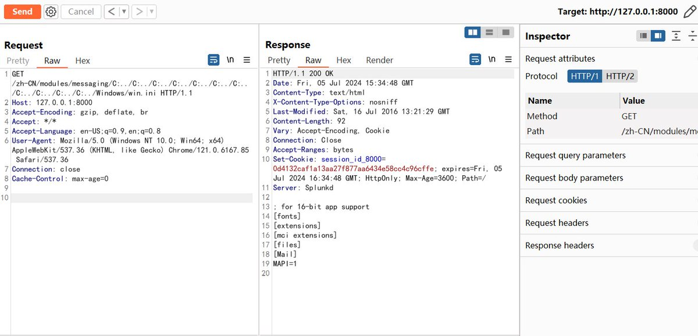
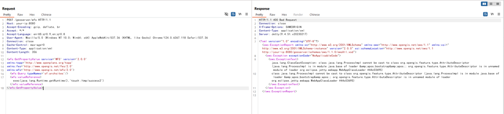
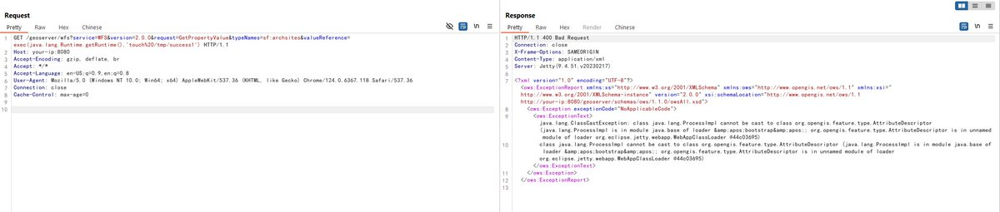

# momika233
**https://twitter.com/momika233/status/1818097898665681122 _at 2024-07-30, 01:34:52_**
<blockquote>
#Outlook CVE-2024-21413 for RCE. Hacking through a letter.
https://t.co/ig84mkKWH0
</blockquote>

* https://blog.injectexp.dev/outlook-cve-2024-21413-for-rce-hacking-through-a-letter/07/rce/

<table><tr>
<td>Quotes: <code>0</code></td>
<td>Replies: <code>1</code></td>
<td>Retweets: <code>51</code></td>
<td>Favorites: <code>200</code></td>
</tr></table>

---

# MsftSecIntel
**https://twitter.com/MsftSecIntel/status/1817956927000682955 _at 2024-07-29, 16:14:42_**
<blockquote>
Microsoft has uncovered a vulnerability in ESXi hypervisors, identified as CVE-2024-37085, being exploited by threat actors to obtain full administrative permissions on domain-joined ESXi hypervisors and encrypt critical servers in ransomware attacks. https://t.co/7NUvHGrzXM
</blockquote>

* https://msft.it/6012lbTai

<table><tr>
<td>Quotes: <code>108</code></td>
<td>Replies: <code>26</code></td>
<td>Retweets: <code>490</code></td>
<td>Favorites: <code>1252</code></td>
</tr></table>

---

# momika233
**https://twitter.com/momika233/status/1814645515033944292 _at 2024-07-20, 12:56:19_**
<blockquote>
CVE-2024-40725 and CVE-2024-40898

https://t.co/QcJDNKEQXn
</blockquote>

* https://github.com/TAM-K592/CVE-2024-40725-CVE-2024-40898

<table><tr>
<td>Quotes: <code>1</code></td>
<td>Replies: <code>1</code></td>
<td>Retweets: <code>33</code></td>
<td>Favorites: <code>167</code></td>
</tr></table>

---

# momika233
**https://twitter.com/momika233/status/1811035441996648532 _at 2024-07-10, 13:51:11_**
<blockquote>
VMware vCenter - CVE-2024-37081 Proof of Concept
https://t.co/tcmxKJGE3B
</blockquote>

* https://github.com/Mr-r00t11/CVE-2024-37081

<table><tr>
<td>Quotes: <code>1</code></td>
<td>Replies: <code>13</code></td>
<td>Retweets: <code>53</code></td>
<td>Favorites: <code>185</code></td>
</tr></table>

---

# HaifeiLi
**https://twitter.com/HaifeiLi/status/1810793921103921639 _at 2024-07-09, 21:51:28_**
<blockquote>
Thanks to the CP&lt;r&gt; team - many folks involved on this discovery.

Full details regarding the .url &amp; IE spoofing "technically zero-day" attacks have been released! 
https://t.co/37zEiUt2tE

#CVE-2024-38112 #URLFile #IE #zeroday #0day #itw #exploit
</blockquote>

* https://x.com/_CPResearch_/status/1810786417985069286

<table><tr>
<td>Quotes: <code>1</code></td>
<td>Replies: <code>1</code></td>
<td>Retweets: <code>5</code></td>
<td>Favorites: <code>43</code></td>
</tr></table>

---

# _CPResearch_
**https://twitter.com/_CPResearch_/status/1810786417985069286 _at 2024-07-09, 21:21:39_**
<blockquote>
In May, CPR discovered in the wild that threat actors have been using previously unknown tricks in .url files &amp; IE to lure victims for RCE. These “technically zero-day” attacks have lasted over a year. Microsoft patched it as CVE-2024-38112 this Tuesday.
https://t.co/jOupdxg0as
</blockquote>

* https://research.checkpoint.com/2024/resurrecting-internet-explorer-threat-actors-using-zero-day-tricks-in-internet-shortcut-file-to-lure-victims-cve-2024-38112/

<table><tr>
<td>Quotes: <code>12</code></td>
<td>Replies: <code>1</code></td>
<td>Retweets: <code>75</code></td>
<td>Favorites: <code>180</code></td>
</tr></table>

---

# chybeta
**https://twitter.com/chybeta/status/1809249794122215557 _at 2024-07-05, 15:35:39_**
<blockquote>
CVE-2024-36991 https://t.co/75mjWgktHr
</blockquote>

<table><tr>
# momika233
**https://twitter.com/momika233/status/1818097898665681122 _at 2024-07-30, 01:34:52_**
<blockquote>
#Outlook CVE-2024-21413 for RCE. Hacking through a letter.
https://t.co/ig84mkKWH0
</blockquote>

* https://blog.injectexp.dev/outlook-cve-2024-21413-for-rce-hacking-through-a-letter/07/rce/

<table><tr>
<td>Quotes: <code>0</code></td>
<td>Replies: <code>1</code></td>
<td>Retweets: <code>51</code></td>
<td>Favorites: <code>200</code></td>
</tr></table>

---

# MsftSecIntel
**https://twitter.com/MsftSecIntel/status/1817956927000682955 _at 2024-07-29, 16:14:42_**
<blockquote>
Microsoft has uncovered a vulnerability in ESXi hypervisors, identified as CVE-2024-37085, being exploited by threat actors to obtain full administrative permissions on domain-joined ESXi hypervisors and encrypt critical servers in ransomware attacks. https://t.co/7NUvHGrzXM
</blockquote>

* https://msft.it/6012lbTai

<table><tr>
<td>Quotes: <code>108</code></td>
<td>Replies: <code>26</code></td>
<td>Retweets: <code>490</code></td>
<td>Favorites: <code>1252</code></td>
</tr></table>

---

# momika233
**https://twitter.com/momika233/status/1814645515033944292 _at 2024-07-20, 12:56:19_**
<blockquote>
CVE-2024-40725 and CVE-2024-40898

https://t.co/QcJDNKEQXn
</blockquote>

* https://github.com/TAM-K592/CVE-2024-40725-CVE-2024-40898

<table><tr>
<td>Quotes: <code>1</code></td>
<td>Replies: <code>1</code></td>
<td>Retweets: <code>33</code></td>
<td>Favorites: <code>167</code></td>
</tr></table>

---

# momika233
**https://twitter.com/momika233/status/1811035441996648532 _at 2024-07-10, 13:51:11_**
<blockquote>
VMware vCenter - CVE-2024-37081 Proof of Concept
https://t.co/tcmxKJGE3B
</blockquote>

* https://github.com/Mr-r00t11/CVE-2024-37081

<table><tr>
<td>Quotes: <code>1</code></td>
<td>Replies: <code>13</code></td>
<td>Retweets: <code>53</code></td>
<td>Favorites: <code>185</code></td>
</tr></table>

---

# HaifeiLi
**https://twitter.com/HaifeiLi/status/1810793921103921639 _at 2024-07-09, 21:51:28_**
<blockquote>
Thanks to the CP&lt;r&gt; team - many folks involved on this discovery.

Full details regarding the .url &amp; IE spoofing "technically zero-day" attacks have been released! 
https://t.co/37zEiUt2tE

#CVE-2024-38112 #URLFile #IE #zeroday #0day #itw #exploit
</blockquote>

* https://x.com/_CPResearch_/status/1810786417985069286

<table><tr>
<td>Quotes: <code>1</code></td>
<td>Replies: <code>1</code></td>
<td>Retweets: <code>5</code></td>
<td>Favorites: <code>43</code></td>
</tr></table>

---

# _CPResearch_
**https://twitter.com/_CPResearch_/status/1810786417985069286 _at 2024-07-09, 21:21:39_**
<blockquote>
In May, CPR discovered in the wild that threat actors have been using previously unknown tricks in .url files &amp; IE to lure victims for RCE. These “technically zero-day” attacks have lasted over a year. Microsoft patched it as CVE-2024-38112 this Tuesday.
https://t.co/jOupdxg0as
</blockquote>

* https://research.checkpoint.com/2024/resurrecting-internet-explorer-threat-actors-using-zero-day-tricks-in-internet-shortcut-file-to-lure-victims-cve-2024-38112/

<table><tr>
<td>Quotes: <code>12</code></td>
<td>Replies: <code>1</code></td>
<td>Retweets: <code>75</code></td>
<td>Favorites: <code>180</code></td>
</tr></table>

---

# chybeta
**https://twitter.com/chybeta/status/1809249794122215557 _at 2024-07-05, 15:35:39_**
<blockquote>
CVE-2024-36991 https://t.co/75mjWgktHr
</blockquote>

<table><tr>
# momika233
**https://twitter.com/momika233/status/1818097898665681122 _at 2024-07-30, 01:34:52_**
<blockquote>
#Outlook CVE-2024-21413 for RCE. Hacking through a letter.
https://t.co/ig84mkKWH0
</blockquote>

* https://blog.injectexp.dev/outlook-cve-2024-21413-for-rce-hacking-through-a-letter/07/rce/

<table><tr>
<td>Quotes: <code>0</code></td>
<td>Replies: <code>1</code></td>
<td>Retweets: <code>51</code></td>
<td>Favorites: <code>200</code></td>
</tr></table>

---

# MsftSecIntel
**https://twitter.com/MsftSecIntel/status/1817956927000682955 _at 2024-07-29, 16:14:42_**
<blockquote>
Microsoft has uncovered a vulnerability in ESXi hypervisors, identified as CVE-2024-37085, being exploited by threat actors to obtain full administrative permissions on domain-joined ESXi hypervisors and encrypt critical servers in ransomware attacks. https://t.co/7NUvHGrzXM
</blockquote>

* https://msft.it/6012lbTai

<table><tr>
<td>Quotes: <code>108</code></td>
<td>Replies: <code>26</code></td>
<td>Retweets: <code>490</code></td>
<td>Favorites: <code>1252</code></td>
</tr></table>

---

# momika233
**https://twitter.com/momika233/status/1814645515033944292 _at 2024-07-20, 12:56:19_**
<blockquote>
CVE-2024-40725 and CVE-2024-40898

https://t.co/QcJDNKEQXn
</blockquote>

* https://github.com/TAM-K592/CVE-2024-40725-CVE-2024-40898

<table><tr>
<td>Quotes: <code>1</code></td>
<td>Replies: <code>1</code></td>
<td>Retweets: <code>33</code></td>
<td>Favorites: <code>167</code></td>
</tr></table>

---

# momika233
**https://twitter.com/momika233/status/1811035441996648532 _at 2024-07-10, 13:51:11_**
<blockquote>
VMware vCenter - CVE-2024-37081 Proof of Concept
https://t.co/tcmxKJGE3B
</blockquote>

* https://github.com/Mr-r00t11/CVE-2024-37081

<table><tr>
<td>Quotes: <code>1</code></td>
<td>Replies: <code>13</code></td>
<td>Retweets: <code>53</code></td>
<td>Favorites: <code>185</code></td>
</tr></table>

---

# HaifeiLi
**https://twitter.com/HaifeiLi/status/1810793921103921639 _at 2024-07-09, 21:51:28_**
<blockquote>
Thanks to the CP&lt;r&gt; team - many folks involved on this discovery.

Full details regarding the .url &amp; IE spoofing "technically zero-day" attacks have been released! 
https://t.co/37zEiUt2tE

#CVE-2024-38112 #URLFile #IE #zeroday #0day #itw #exploit
</blockquote>

* https://x.com/_CPResearch_/status/1810786417985069286

<table><tr>
<td>Quotes: <code>1</code></td>
<td>Replies: <code>1</code></td>
<td>Retweets: <code>5</code></td>
<td>Favorites: <code>43</code></td>
</tr></table>

---

# _CPResearch_
**https://twitter.com/_CPResearch_/status/1810786417985069286 _at 2024-07-09, 21:21:39_**
<blockquote>
In May, CPR discovered in the wild that threat actors have been using previously unknown tricks in .url files &amp; IE to lure victims for RCE. These “technically zero-day” attacks have lasted over a year. Microsoft patched it as CVE-2024-38112 this Tuesday.
https://t.co/jOupdxg0as
</blockquote>

* https://research.checkpoint.com/2024/resurrecting-internet-explorer-threat-actors-using-zero-day-tricks-in-internet-shortcut-file-to-lure-victims-cve-2024-38112/

<table><tr>
<td>Quotes: <code>12</code></td>
<td>Replies: <code>1</code></td>
<td>Retweets: <code>75</code></td>
<td>Favorites: <code>180</code></td>
</tr></table>

---

# chybeta
**https://twitter.com/chybeta/status/1809249794122215557 _at 2024-07-05, 15:35:39_**
<blockquote>
CVE-2024-36991 https://t.co/75mjWgktHr
</blockquote>

<table><tr>
<td></td>
</table></tr>
<table><tr>
<td>Quotes: <code>4</code></td>
<td>Replies: <code>4</code></td>
<td>Retweets: <code>54</code></td>
<td>Favorites: <code>339</code></td>
</tr></table>

---

# phithon_xg
**https://twitter.com/phithon_xg/status/1808508432557003002 _at 2024-07-03, 14:29:45_**
<blockquote>
GeoServer xpath expression injection to RCE (CVE-2024-36401) TWO POC
https://t.co/yt13M4Oerq https://t.co/CWeFK7eNiA
</blockquote>

* https://github.com/vulhub/vulhub/blob/master/geoserver/CVE-2024-36401/README.md

<table><tr>
<td></td>
<td></td>
</table></tr>
<table><tr>
<td>Quotes: <code>0</code></td>
<td>Replies: <code>3</code></td>
<td>Retweets: <code>52</code></td>
<td>Favorites: <code>157</code></td>
</tr></table>

---

# momika233
**https://twitter.com/momika233/status/1807939868523483273 _at 2024-07-02, 00:50:29_**
<blockquote>
SSH RCE Exploit for CVE-2024-6387
https://t.co/Z6Ef4yEaqP
</blockquote>

* https://github.com/zgzhang/cve-2024-6387-poc/

<table><tr>
<td>Quotes: <code>1</code></td>
<td>Replies: <code>3</code></td>
<td>Retweets: <code>172</code></td>
<td>Favorites: <code>575</code></td>
</tr></table>

---

