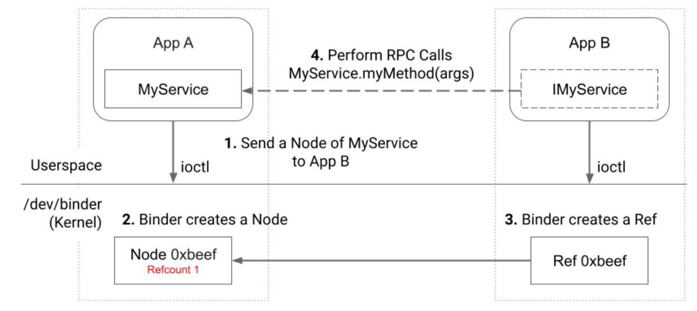
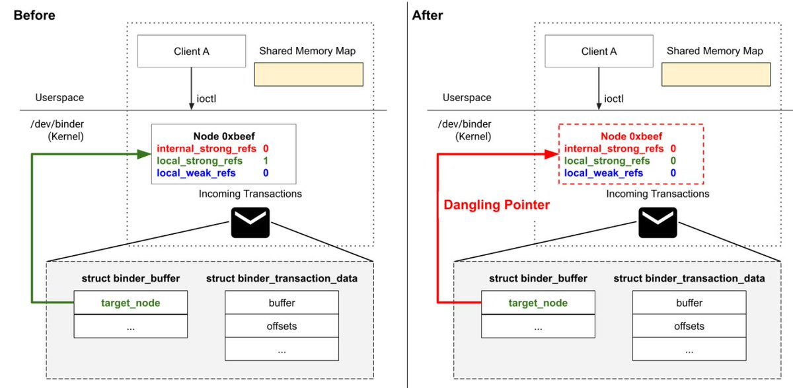
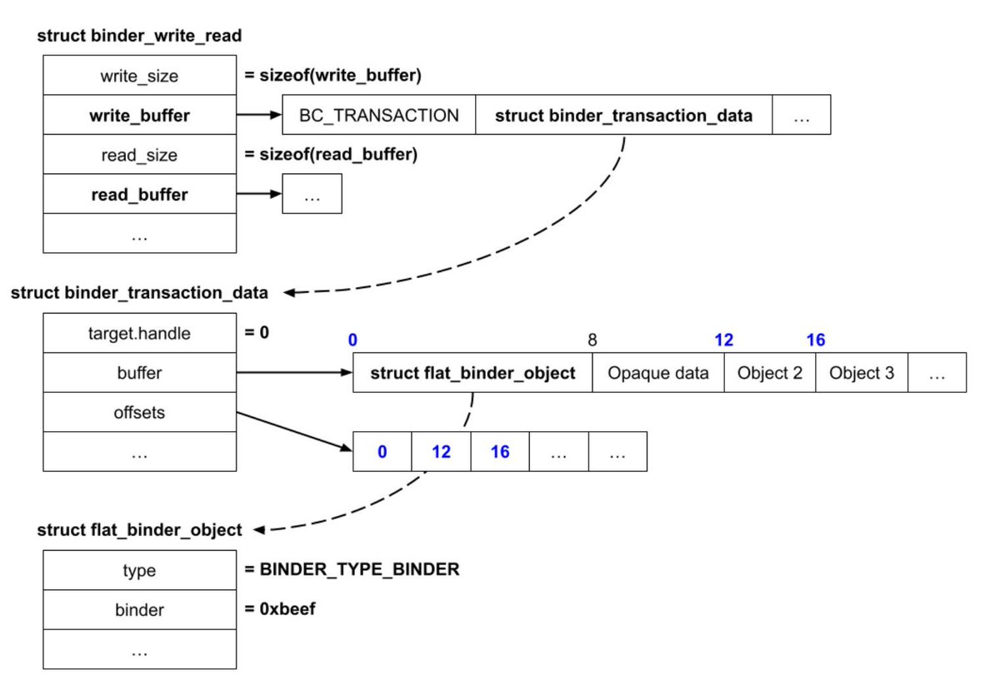
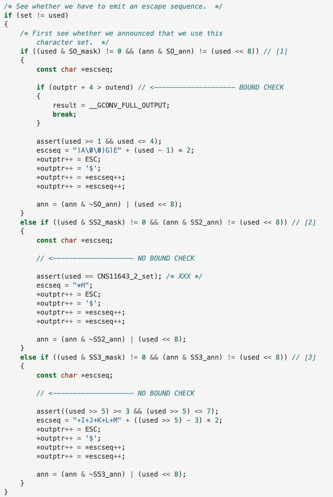
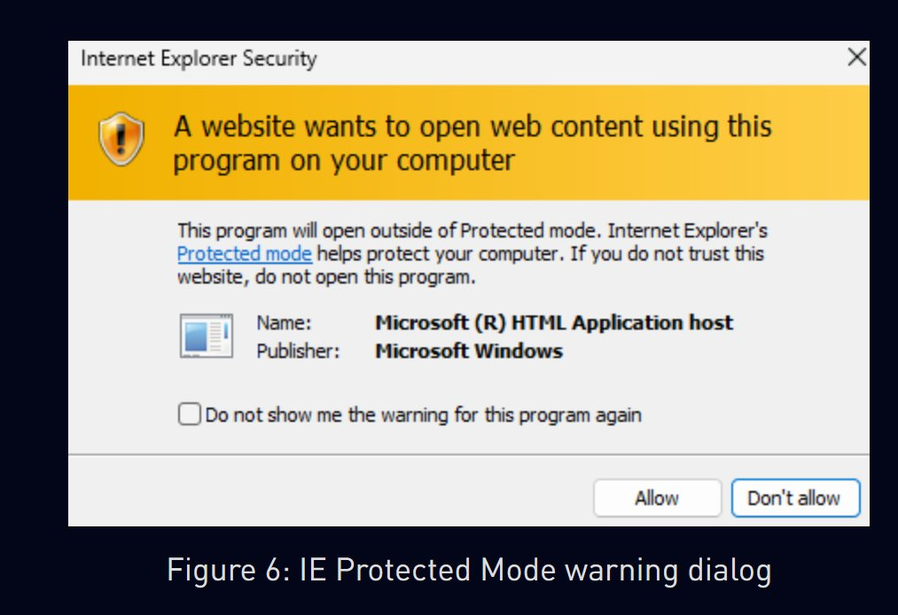
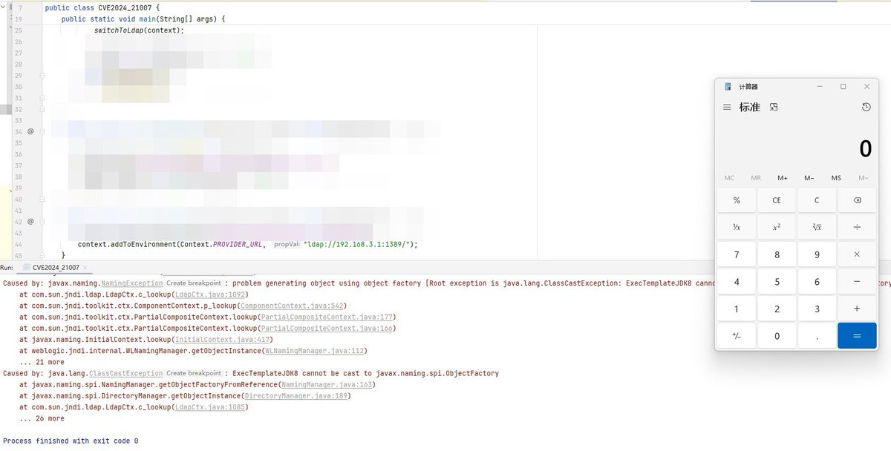
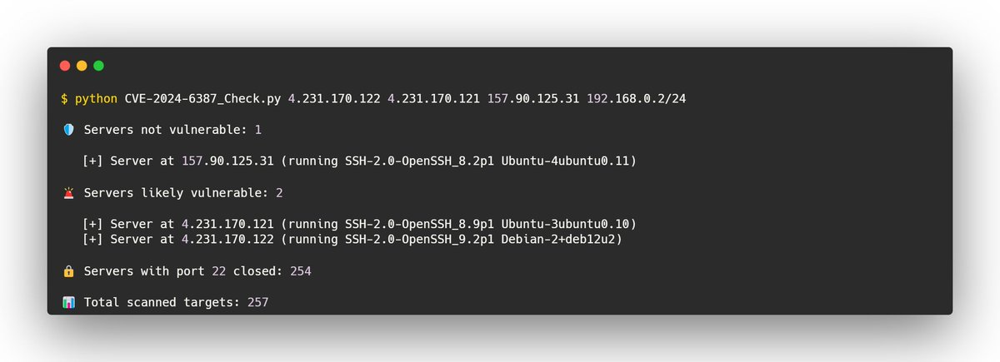

# momika233
**https://twitter.com/momika233/status/1818097898665681122 _at 2024-07-30, 01:34:52_**
<blockquote>
#Outlook CVE-2024-21413 for RCE. Hacking through a letter.
https://t.co/ig84mkKWH0
</blockquote>

* https://blog.injectexp.dev/outlook-cve-2024-21413-for-rce-hacking-through-a-letter/07/rce/

<table><tr>
<td>Quotes: <code>0</code></td>
<td>Replies: <code>1</code></td>
<td>Retweets: <code>51</code></td>
<td>Favorites: <code>200</code></td>
</tr></table>

---

# MsftSecIntel
**https://twitter.com/MsftSecIntel/status/1817956927000682955 _at 2024-07-29, 16:14:42_**
<blockquote>
Microsoft has uncovered a vulnerability in ESXi hypervisors, identified as CVE-2024-37085, being exploited by threat actors to obtain full administrative permissions on domain-joined ESXi hypervisors and encrypt critical servers in ransomware attacks. https://t.co/7NUvHGrzXM
</blockquote>

* https://msft.it/6012lbTai

<table><tr>
<td>Quotes: <code>108</code></td>
<td>Replies: <code>24</code></td>
<td>Retweets: <code>464</code></td>
<td>Favorites: <code>1192</code></td>
</tr></table>

---

# 0xor0ne
**https://twitter.com/0xor0ne/status/1817220936279396617 _at 2024-07-27, 15:30:08_**
<blockquote>
Great write up on exploiting CVE-2023-20938: Use-after-free in Android's Binder Linux kernel driver

https://t.co/qtlAMph0wW

#Linux https://t.co/cy52O0Nv1i
</blockquote>

* https://androidoffsec.withgoogle.com/posts/attacking-android-binder-analysis-and-exploitation-of-cve-2023-20938/

<table><tr>
<td></td>
<td></td>
</table></tr>
<table><tr>
<td>Quotes: <code>0</code></td>
<td>Replies: <code>1</code></td>
<td>Retweets: <code>46</code></td>
<td>Favorites: <code>226</code></td>
</tr></table>

---

# 0xor0ne
**https://twitter.com/0xor0ne/status/1816866314188640317 _at 2024-07-26, 16:00:59_**
<blockquote>
Great blog post by the Android Red Team on exploiting CVE-2023-20938 (Binder Use After Free)

https://t.co/qtlAMph0wW

#android https://t.co/oloShnkCU3
</blockquote>

* https://androidoffsec.withgoogle.com/posts/attacking-android-binder-analysis-and-exploitation-of-cve-2023-20938/

<table><tr>
<td></td>
</table></tr>
<table><tr>
<td>Quotes: <code>0</code></td>
<td>Replies: <code>7</code></td>
<td>Retweets: <code>37</code></td>
<td>Favorites: <code>176</code></td>
</tr></table>

---

# cyber_advising
**https://twitter.com/cyber_advising/status/1815988100390179113 _at 2024-07-24, 05:51:17_**
<blockquote>
CVE-2024-41107: The CloudStack SAML authentication (disabled by default) ...attacker that initiates CloudStack SAML single sign-on authentication bypass...

PoC
https://t.co/tdnIQjuRRQ https://t.co/xWpmUex3eh
</blockquote>

* https://github.com/d0rb/CVE-2024-41107

<table><tr>
<td></td>
</table></tr>
<table><tr>
<td>Quotes: <code>0</code></td>
<td>Replies: <code>0</code></td>
<td>Retweets: <code>13</code></td>
<td>Favorites: <code>31</code></td>
</tr></table>

---

# 0xor0ne
**https://twitter.com/0xor0ne/status/1815771372334772653 _at 2024-07-23, 15:30:05_**
<blockquote>
Exploiting a buffer overflow (CVE-2024-2961) in glibc's iconv()

Blog post: https://t.co/d2SdBplIfs
PoC: https://t.co/7l9AJveV0D

#glibc https://t.co/tRu2uRV28K
</blockquote>

* https://www.ambionics.io/blog/iconv-cve-2024-2961-p1
* https://github.com/ambionics/cnext-exploits/

<table><tr>
<td></td>
</table></tr>
<table><tr>
<td>Quotes: <code>0</code></td>
<td>Replies: <code>3</code></td>
<td>Retweets: <code>85</code></td>
<td>Favorites: <code>401</code></td>
</tr></table>

---

# momika233
**https://twitter.com/momika233/status/1814645515033944292 _at 2024-07-20, 12:56:19_**
<blockquote>
CVE-2024-40725 and CVE-2024-40898

https://t.co/QcJDNKEQXn
</blockquote>

* https://github.com/TAM-K592/CVE-2024-40725-CVE-2024-40898

<table><tr>
<td>Quotes: <code>1</code></td>
<td>Replies: <code>1</code></td>
<td>Retweets: <code>33</code></td>
<td>Favorites: <code>167</code></td>
</tr></table>

---

# cyber_advising
**https://twitter.com/cyber_advising/status/1814625787670110679 _at 2024-07-20, 11:37:56_**
<blockquote>
CVE-2024-40725, CVE-2024-40898: vulnerability found in Apache HTTP Server versions 2.4.0 to 2.4.61.
PoC

https://t.co/12KmzzgdOf https://t.co/HdTy15mplL
</blockquote>

* https://github.com/TAM-K592/CVE-2024-40725-CVE-2024-40898

<table><tr>
<td></td>
</table></tr>
<table><tr>
<td>Quotes: <code>1</code></td>
<td>Replies: <code>4</code></td>
<td>Retweets: <code>54</code></td>
<td>Favorites: <code>241</code></td>
</tr></table>

---

# blackorbird
**https://twitter.com/blackorbird/status/1813506977919848720 _at 2024-07-17, 09:32:11_**
<blockquote>
APT Group Void Banshee +  Microsoft 0day CVE-2024-38112 
https://t.co/wKtY6a1blW
https://t.co/oFlIgm5FHC
ioc:
https://t.co/O0nK9mVkl0 https://t.co/yuAJFvUNxO
</blockquote>

* https://research.checkpoint.com/2024/resurrecting-internet-explorer-threat-actors-using-zero-day-tricks-in-internet-shortcut-file-to-lure-victims-cve-2024-38112/
* https://www.trendmicro.com/en_us/research/24/g/CVE-2024-38112-void-banshee.html
* https://www.trendmicro.com/content/dam/trendmicro/global/en/research/24/g/cve-2024-38112-void-banshee-targets-windows-users-through-zombie-internet-explorer-in-zero-day-attacks/IOCs-CVE-2024-38112.txt

<table><tr>
<td></td>
<td></td>
</table></tr>
<table><tr>
<td>Quotes: <code>3</code></td>
<td>Replies: <code>0</code></td>
<td>Retweets: <code>46</code></td>
<td>Favorites: <code>98</code></td>
</tr></table>

---

# fdfalcon
**https://twitter.com/fdfalcon/status/1813304728065052811 _at 2024-07-16, 20:08:31_**
<blockquote>
RT @thatjiaozi: Excited to publish a new report on a linux kernel eBPF vulnerability. CVE-2024-41003

https://t.co/ZfHbgclUtA

We found thi…
</blockquote>

* https://github.com/google/security-research/security/advisories/GHSA-hfqc-63c7-rj9f#event-251168

<table><tr>
<td>Quotes: <code>0</code></td>
<td>Replies: <code>0</code></td>
<td>Retweets: <code>126</code></td>
<td>Favorites: <code>0</code></td>
</tr></table>

---

# SeguInfo
**https://twitter.com/SeguInfo/status/1813198335387337145 _at 2024-07-16, 13:05:45_**
<blockquote>
Troyanos que roban datos personales y financieros (#infostealers) son instalados vía #phishing (ZIP) y aprovechando la vulnerabilidad Zero-Day en Windows (CVE-2024-38112).
Parchea YA!

Info: https://t.co/aBPMHXpq6j https://t.co/CR6fnXKBPu
</blockquote>

* https://blog.segu-info.com.ar/2024/07/zero-day-en-windows-mshtml-utilizado-en.html

<table><tr>
<td></td>
</table></tr>
<table><tr>
<td>Quotes: <code>2</code></td>
<td>Replies: <code>2</code></td>
<td>Retweets: <code>53</code></td>
<td>Favorites: <code>113</code></td>
</tr></table>

---

# momika233
**https://twitter.com/momika233/status/1812842490690711872 _at 2024-07-15, 13:31:45_**
<blockquote>
Mass Exploit - CVE-2024-29824 - Ivanti EPM - Remote Code Execution (RCE)
https://t.co/JtkT6DEmyI
</blockquote>

* https://github.com/codeb0ss/CVE-2024-29824-PoC

<table><tr>
<td>Quotes: <code>1</code></td>
<td>Replies: <code>0</code></td>
<td>Retweets: <code>47</code></td>
<td>Favorites: <code>127</code></td>
</tr></table>

---

# 7h3h4ckv157
**https://twitter.com/7h3h4ckv157/status/1812442611632025947 _at 2024-07-14, 11:02:46_**
<blockquote>
🚨 CVE-2024-29824 

Mass Exploit - CVE-2024-29824 - Ivanti EPM - Remote Code Execution (RCE) ⚡

https://t.co/Jc8pFmHfRo https://t.co/6WPUeTIpcl
</blockquote>

* https://github.com/codeb0ss/CVE-2024-29824-PoC

<table><tr>
<td></td>
</table></tr>
<table><tr>
<td>Quotes: <code>0</code></td>
<td>Replies: <code>0</code></td>
<td>Retweets: <code>43</code></td>
<td>Favorites: <code>174</code></td>
</tr></table>

---

# malmoeb
**https://twitter.com/malmoeb/status/1811798851919007776 _at 2024-07-12, 16:24:42_**
<blockquote>
My team colleague @hackerkartellet investigated an intrusion this week that started via CVE-2023-48788: A vulnerability in the Fortinet FortiClient EMS application that allows unauthenticated users the ability to execute commands (under SYSTEM rights) via specially crafted https://t.co/CMwCFCH1HE
</blockquote>

<table><tr>
<td></td>
</table></tr>
<table><tr>
<td>Quotes: <code>1</code></td>
<td>Replies: <code>5</code></td>
<td>Retweets: <code>44</code></td>
<td>Favorites: <code>151</code></td>
</tr></table>

---

# TheHackersNews
**https://twitter.com/TheHackersNews/status/1811748338535919704 _at 2024-07-12, 13:03:59_**
<blockquote>
🚨 A critical security flaw in Exim mail transfer agent has been disclosed.

CVE-2024-39929 allows remote attackers to bypass security and deliver malicious attachments.

Details here: https://t.co/69295wvCew

Update to version 4.98 now!
</blockquote>

* https://thehackernews.com/2024/07/critical-exim-mail-server-vulnerability.html

<table><tr>
<td>Quotes: <code>2</code></td>
<td>Replies: <code>1</code></td>
<td>Retweets: <code>17</code></td>
<td>Favorites: <code>53</code></td>
</tr></table>

---

# mistymntncop
**https://twitter.com/mistymntncop/status/1811571304040136967 _at 2024-07-12, 01:20:30_**
<blockquote>
"Weaponizing Chrome CVE-2023-2033 for RCE in Electron: Some Assembly Required" by @7urb01 
https://t.co/YyZ42Pxf1I
</blockquote>

* http://www.turb0.one/pages/Weaponizing_Chrome_CVE-2023-2033_for_RCE_in_Electron:_Some_Assembly_Required.html

<table><tr>
<td>Quotes: <code>0</code></td>
<td>Replies: <code>0</code></td>
<td>Retweets: <code>21</code></td>
<td>Favorites: <code>115</code></td>
</tr></table>

---

# cyber_advising
**https://twitter.com/cyber_advising/status/1811397734626144535 _at 2024-07-11, 13:50:48_**
<blockquote>
CVE-2024-37081: The vCenter Server contains multiple local privilege escalation vulnerabilities due to misconfiguration of sudo. ..
https://t.co/rNcawNXCMn https://t.co/iQBtTwehw1
</blockquote>

* https://github.com/Mr-r00t11/CVE-2024-37081

<table><tr>
<td></td>
</table></tr>
<table><tr>
<td>Quotes: <code>1</code></td>
<td>Replies: <code>1</code></td>
<td>Retweets: <code>25</code></td>
<td>Favorites: <code>98</code></td>
</tr></table>

---

# Gi7w0rm
**https://twitter.com/Gi7w0rm/status/1811125503916384258 _at 2024-07-10, 19:49:03_**
<blockquote>
#ZeroClick #RCE in Outlook ones again. 
Unlike the previously discovered vulnerability CVE-2024-30103 disclosed in June —which required authentication (at least an NTLM token)— this new vulnerability does not require any authentication
It requires 0clicks for known senders else 1
</blockquote>

<table><tr>
<td>Quotes: <code>0</code></td>
<td>Replies: <code>3</code></td>
<td>Retweets: <code>63</code></td>
<td>Favorites: <code>180</code></td>
</tr></table>

---

# momika233
**https://twitter.com/momika233/status/1811035441996648532 _at 2024-07-10, 13:51:11_**
<blockquote>
VMware vCenter - CVE-2024-37081 Proof of Concept
https://t.co/tcmxKJGE3B
</blockquote>

* https://github.com/Mr-r00t11/CVE-2024-37081

<table><tr>
<td>Quotes: <code>1</code></td>
<td>Replies: <code>13</code></td>
<td>Retweets: <code>53</code></td>
<td>Favorites: <code>185</code></td>
</tr></table>

---

# securityshell
**https://twitter.com/securityshell/status/1811029535699222558 _at 2024-07-10, 13:27:43_**
<blockquote>
CVE-2024-38021 - a zero-click remote code execution (RCE) vulnerability that impacts most Microsoft Outlook applications. https://t.co/wZfZzcXv3n
</blockquote>

* https://blog.morphisec.com/cve-2024-38021-microsoft-outlook-moniker-rce-vulnerability

<table><tr>
<td>Quotes: <code>4</code></td>
<td>Replies: <code>2</code></td>
<td>Retweets: <code>93</code></td>
<td>Favorites: <code>257</code></td>
</tr></table>

---

# HaifeiLi
**https://twitter.com/HaifeiLi/status/1810793921103921639 _at 2024-07-09, 21:51:28_**
<blockquote>
Thanks to the CP&lt;r&gt; team - many folks involved on this discovery.

Full details regarding the .url &amp; IE spoofing "technically zero-day" attacks have been released! 
https://t.co/37zEiUt2tE

#CVE-2024-38112 #URLFile #IE #zeroday #0day #itw #exploit
</blockquote>

* https://x.com/_CPResearch_/status/1810786417985069286

<table><tr>
<td>Quotes: <code>1</code></td>
<td>Replies: <code>1</code></td>
<td>Retweets: <code>5</code></td>
<td>Favorites: <code>43</code></td>
</tr></table>

---

# _CPResearch_
**https://twitter.com/_CPResearch_/status/1810786417985069286 _at 2024-07-09, 21:21:39_**
<blockquote>
In May, CPR discovered in the wild that threat actors have been using previously unknown tricks in .url files &amp; IE to lure victims for RCE. These “technically zero-day” attacks have lasted over a year. Microsoft patched it as CVE-2024-38112 this Tuesday.
https://t.co/jOupdxg0as
</blockquote>

* https://research.checkpoint.com/2024/resurrecting-internet-explorer-threat-actors-using-zero-day-tricks-in-internet-shortcut-file-to-lure-victims-cve-2024-38112/

<table><tr>
<td>Quotes: <code>12</code></td>
<td>Replies: <code>1</code></td>
<td>Retweets: <code>75</code></td>
<td>Favorites: <code>180</code></td>
</tr></table>

---

# SinSinology
**https://twitter.com/SinSinology/status/1810289238212034784 _at 2024-07-08, 12:26:02_**
<blockquote>
🤷‍♂️Enjoying the blog posts so far? well this is the 3rd writeup for today ☠️, details of my privilege escalation ⏫against progress is out now, this is CVE-2024-5009 🔥
https://t.co/cuLTzY2UwC https://t.co/dm8nNnJcrG
</blockquote>

* https://summoning.team/blog/progress-whatsup-gold-privesc-setadminpassword-cve-2024-5009/

<table><tr>
<td></td>
</table></tr>
<table><tr>
<td>Quotes: <code>1</code></td>
<td>Replies: <code>2</code></td>
<td>Retweets: <code>30</code></td>
<td>Favorites: <code>158</code></td>
</tr></table>

---

# SinSinology
**https://twitter.com/SinSinology/status/1810289028803051538 _at 2024-07-08, 12:25:12_**
<blockquote>
Aaaaaand that's a wrap ♾, here is the 3/3 exploit of today, a privilege escalation ⏫ targeting progress whatsup gold, this is CVE-2024-5009 🚨 don't forget, I teach things like this (and waaay more) in my Advanced .NET Exploitation Training 🔥🪲🔥
https://t.co/AjR5M04lLd https://t.co/DAl4sECRYf
</blockquote>

* https://github.com/sinsinology/CVE-2024-5009

<table><tr>
<td></td>
</table></tr>
<table><tr>
<td>Quotes: <code>0</code></td>
<td>Replies: <code>1</code></td>
<td>Retweets: <code>16</code></td>
<td>Favorites: <code>141</code></td>
</tr></table>

---

# SinSinology
**https://twitter.com/SinSinology/status/1810288180882559251 _at 2024-07-08, 12:21:50_**
<blockquote>
Here is the second blog post of today (2/3) ⚡️⚡️, I've just published the details of my other pre-auth Remote Code Execution 🔥 against progress this is CVE-2024-4883 🪲
https://t.co/eexo572A8o
</blockquote>

* https://summoning.team/blog/progress-whatsup-gold-writedatafile-cve-2024-4883-rce/

<table><tr>
<td>Quotes: <code>1</code></td>
<td>Replies: <code>1</code></td>
<td>Retweets: <code>32</code></td>
<td>Favorites: <code>301</code></td>
</tr></table>

---

# H4ckManac
**https://twitter.com/H4ckManac/status/1809838917203493180 _at 2024-07-07, 06:36:37_**
<blockquote>
⚠️ CVE-2024-6376 (CVSS 9.8) in MongoDB Compass Exposes Systems to Code Injection Risks

A critical security vulnerability, CVE-2024-6376, has been discovered in MongoDB Compass, a widely-used GUI for MongoDB data management.

This vulnerability affects MongoDB Compass versions https://t.co/J9IBTfRjbT
</blockquote>

<table><tr>
<td></td>
</table></tr>
<table><tr>
<td>Quotes: <code>2</code></td>
<td>Replies: <code>1</code></td>
<td>Retweets: <code>35</code></td>
<td>Favorites: <code>79</code></td>
</tr></table>

---

# momika233
**https://twitter.com/momika233/status/1809516449452683759 _at 2024-07-06, 09:15:15_**
<blockquote>
RT @binitamshah: PoC :  Linux Kernel Privilege Escalation (CVE-2024-0193) : https://t.co/YAwc8RGeaT
</blockquote>

* https://github.com/google/security-research/blob/master/pocs/linux/kernelctf/CVE-2024-0193_cos/docs/exploit.md

<table><tr>
<td>Quotes: <code>0</code></td>
<td>Replies: <code>0</code></td>
<td>Retweets: <code>82</code></td>
<td>Favorites: <code>0</code></td>
</tr></table>

---

# chybeta
**https://twitter.com/chybeta/status/1809249794122215557 _at 2024-07-05, 15:35:39_**
<blockquote>
CVE-2024-36991 https://t.co/75mjWgktHr
</blockquote>

<table><tr>
<td></td>
</table></tr>
<table><tr>
<td>Quotes: <code>4</code></td>
<td>Replies: <code>4</code></td>
<td>Retweets: <code>54</code></td>
<td>Favorites: <code>339</code></td>
</tr></table>

---

# binitamshah
**https://twitter.com/binitamshah/status/1809200258926383567 _at 2024-07-05, 12:18:49_**
<blockquote>
PoC :  Linux Kernel Privilege Escalation (CVE-2024-0193) : https://t.co/YAwc8RGeaT
</blockquote>

* https://github.com/google/security-research/blob/master/pocs/linux/kernelctf/CVE-2024-0193_cos/docs/exploit.md

<table><tr>
<td>Quotes: <code>0</code></td>
<td>Replies: <code>0</code></td>
<td>Retweets: <code>79</code></td>
<td>Favorites: <code>245</code></td>
</tr></table>

---

# pyn3rd
**https://twitter.com/pyn3rd/status/1809101367149219987 _at 2024-07-05, 05:45:52_**
<blockquote>
#CVE-2024-21007 Weblogic Server Remote Code Execution https://t.co/suiMbdfZTL
</blockquote>

<table><tr>
<td></td>
</table></tr>
<table><tr>
<td>Quotes: <code>2</code></td>
<td>Replies: <code>3</code></td>
<td>Retweets: <code>38</code></td>
<td>Favorites: <code>254</code></td>
</tr></table>

---

# GHSecurityLab
**https://twitter.com/GHSecurityLab/status/1808561609515708697 _at 2024-07-03, 18:01:03_**
<blockquote>
GHSL-2024-070: Remote Code Execution (RCE) in Chromium - CVE-2024-3833
https://t.co/kjUEZaxXWP
</blockquote>

* https://securitylab.github.com/advisories/GHSL-2024-070_Chromium/

<table><tr>
<td>Quotes: <code>0</code></td>
<td>Replies: <code>0</code></td>
<td>Retweets: <code>17</code></td>
<td>Favorites: <code>49</code></td>
</tr></table>

---

# phithon_xg
**https://twitter.com/phithon_xg/status/1808508432557003002 _at 2024-07-03, 14:29:45_**
<blockquote>
GeoServer xpath expression injection to RCE (CVE-2024-36401) TWO POC
https://t.co/yt13M4Oerq https://t.co/CWeFK7eNiA
</blockquote>

* https://github.com/vulhub/vulhub/blob/master/geoserver/CVE-2024-36401/README.md

<table><tr>
<td></td>
<td></td>
</table></tr>
<table><tr>
<td>Quotes: <code>0</code></td>
<td>Replies: <code>3</code></td>
<td>Retweets: <code>52</code></td>
<td>Favorites: <code>157</code></td>
</tr></table>

---

# HunterMapping
**https://twitter.com/HunterMapping/status/1808342808849441201 _at 2024-07-03, 03:31:37_**
<blockquote>
🚨Alert🚨CVE-2024-36401 (CVSS 9.8): GeoServer Unauthenticated Remote Code Execution in Evaluating Property Name Expressions 
🔥PoC: https://t.co/92Ov2433mW
📊6.4K+ Services are found on https://t.co/ysWb28Crld
🔗Hunter Link: https://t.co/0Qu4uLondE

👇Search Query
Hunter: https://t.co/VcolV2OfOn
</blockquote>

* https://github.com/vulhub/vulhub/tree/master/geoserver/CVE-2024-36401
* http://hunter.how
* https://hunter.how/list?searchValue=product.name%3D%22GeoServer%22

<table><tr>
<td></td>
</table></tr>
<table><tr>
<td>Quotes: <code>3</code></td>
<td>Replies: <code>1</code></td>
<td>Retweets: <code>42</code></td>
<td>Favorites: <code>176</code></td>
</tr></table>

---

# Dinosn
**https://twitter.com/Dinosn/status/1807985477154120102 _at 2024-07-02, 03:51:43_**
<blockquote>
CVE-2024-1724: Snap Sandbox Escape Vulnerability Threatens Linux Systems https://t.co/BetgFj9pBE
</blockquote>

* https://securityonline.info/cve-2024-1724-snap-sandbox-escape-vulnerability-threatens-linux-systems/

<table><tr>
<td>Quotes: <code>0</code></td>
<td>Replies: <code>0</code></td>
<td>Retweets: <code>11</code></td>
<td>Favorites: <code>37</code></td>
</tr></table>

---

# HunterMapping
**https://twitter.com/HunterMapping/status/1807952010991620464 _at 2024-07-02, 01:38:44_**
<blockquote>
🚨Alert🚨CVE-2024-6387: Remote Unauthenticated Code Execution Vulnerability in OpenSSH server
🔗Hunter Link: https://t.co/P2bN5nm6UJ
💼Scan Tool @xaitax: https://t.co/IwIP1EChQq
⚠The vulnerability, which is a signal handler race condition in OpenSSH’s server (sshd), allows https://t.co/msUJVaodFT
</blockquote>

* https://hunter.how/list?searchValue=product.name%3D%22OpenSSH%22
* https://github.com/xaitax/CVE-2024-6387_Check

<table><tr>
<td></td>
</table></tr>
<table><tr>
<td>Quotes: <code>3</code></td>
<td>Replies: <code>0</code></td>
<td>Retweets: <code>80</code></td>
<td>Favorites: <code>269</code></td>
</tr></table>

---

# momika233
**https://twitter.com/momika233/status/1807939868523483273 _at 2024-07-02, 00:50:29_**
<blockquote>
SSH RCE Exploit for CVE-2024-6387
https://t.co/Z6Ef4yEaqP
</blockquote>

* https://github.com/zgzhang/cve-2024-6387-poc/

<table><tr>
<td>Quotes: <code>1</code></td>
<td>Replies: <code>3</code></td>
<td>Retweets: <code>172</code></td>
<td>Favorites: <code>575</code></td>
</tr></table>

---

# kaspersky
**https://twitter.com/kaspersky/status/1807766971049476193 _at 2024-07-01, 13:23:27_**
<blockquote>
🚒 This week started with an RCE in OpenSSH 🔥

CVE-2024-6387 affects OpenSSH versions from 8.5p1 to 9.7p1 and is a regression of an old flaw, CVE-2006-5051. An unauthenticated attacker can gain root access on glibc-based Linux systems, but they need to trigger a race condition https://t.co/tvRuui65J5
</blockquote>

<table><tr>
<td></td>
</table></tr>
<table><tr>
<td>Quotes: <code>0</code></td>
<td>Replies: <code>1</code></td>
<td>Retweets: <code>32</code></td>
<td>Favorites: <code>64</code></td>
</tr></table>

---

# binitamshah
**https://twitter.com/binitamshah/status/1807748282518810922 _at 2024-07-01, 12:09:11_**
<blockquote>
regreSSHion: RCE in OpenSSH's server, on glibc-based Linux systems (CVE-2024-6387) - Technical Details  : https://t.co/hoiazZIHZn

Remote Unauthenticated Code Execution Vulnerability in OpenSSH server : https://t.co/l0DpziLdAj
</blockquote>

* https://www.qualys.com/2024/07/01/cve-2024-6387/regresshion.txt
* https://blog.qualys.com/vulnerabilities-threat-research/2024/07/01/regresshion-remote-unauthenticated-code-execution-vulnerability-in-openssh-server

<table><tr>
<td>Quotes: <code>0</code></td>
<td>Replies: <code>1</code></td>
<td>Retweets: <code>38</code></td>
<td>Favorites: <code>75</code></td>
</tr></table>

---

# TheHackersNews
**https://twitter.com/TheHackersNews/status/1807735158990111005 _at 2024-07-01, 11:17:02_**
<blockquote>
🚨 A critical OpenSSH flaw (CVE-2024-6387) allows unauthenticated remote code execution on glibc-based Linux systems. 14 million servers at risk. 

https://t.co/9cP7e5ax7r

Apply the latest patches now!
</blockquote>

* https://thehackernews.com/2024/07/new-openssh-vulnerability-could-lead-to.html

<table><tr>
<td>Quotes: <code>48</code></td>
<td>Replies: <code>13</code></td>
<td>Retweets: <code>493</code></td>
<td>Favorites: <code>857</code></td>
</tr></table>

---

# Dinosn
**https://twitter.com/Dinosn/status/1807704207035658652 _at 2024-07-01, 09:14:03_**
<blockquote>
CVE-2024-6387: Critical OpenSSH Unauthenticated RCE Flaw ‘regreSSHion’ Exposes Millions of Linux Systems https://t.co/k11ECE3RHl
</blockquote>

* https://securityonline.info/cve-2024-6387-critical-openssh-unauthenticated-rce-flaw-regresshion-exposes-millions-of-linux-systems/

<table><tr>
<td>Quotes: <code>18</code></td>
<td>Replies: <code>9</code></td>
<td>Retweets: <code>274</code></td>
<td>Favorites: <code>721</code></td>
</tr></table>

---

# qualys
**https://twitter.com/qualys/status/1807693619161133539 _at 2024-07-01, 08:31:58_**
<blockquote>
The award-winning Qualys Threat Research Unit (TRU) has discovered a critical vulnerability in OpenSSH, designated CVE-2024-6387 and aptly named "regreSSHion." This Remote Code Execution bug grants full root access, posing a significant exploitation risk. https://t.co/uDHHSuzd5f
</blockquote>

* https://blog.qualys.com/vulnerabilities-threat-research/2024/07/01/regresshion-remote-unauthenticated-code-execution-vulnerability-in-openssh-server

<table><tr>
<td>Quotes: <code>185</code></td>
<td>Replies: <code>28</code></td>
<td>Retweets: <code>843</code></td>
<td>Favorites: <code>1326</code></td>
</tr></table>

---

# Dinosn
**https://twitter.com/Dinosn/status/1807622898783322373 _at 2024-07-01, 03:50:57_**
<blockquote>
PoC Exploit Published for Linux Kernel Privilege Escalation Flaw (CVE-2024-0193) https://t.co/xXlXZfg9lM
</blockquote>

* https://securityonline.info/poc-exploit-published-for-linux-kernel-privilege-escalation-flaw-cve-2024-0193/

<table><tr>
<td>Quotes: <code>3</code></td>
<td>Replies: <code>0</code></td>
<td>Retweets: <code>81</code></td>
<td>Favorites: <code>216</code></td>
</tr></table>

---

