# kmkz_security
**https://twitter.com/kmkz_security/status/1829923108033347634 _at 2024-08-31, 16:44:01_**
<blockquote>
RT @MsftSecIntel: Microsoft identified a North Korean threat actor exploiting a zero-day vulnerability in Chromium (CVE-2024-7971) to gain…
</blockquote>

<table><tr>
<td>Quotes: <code>0</code></td>
<td>Replies: <code>0</code></td>
<td>Retweets: <code>258</code></td>
<td>Favorites: <code>0</code></td>
</tr></table>

---

# blackorbird
**https://twitter.com/blackorbird/status/1829695919635513513 _at 2024-08-31, 01:41:16_**
<blockquote>
North Korean threat actor exploiting a zero-day vulnerability in Chromium CVE-2024-7971
https://t.co/sNlGAA3gyY https://t.co/8P5FyHTY79
</blockquote>

* https://www.microsoft.com/en-us/security/blog/2024/08/30/north-korean-threat-actor-citrine-sleet-exploiting-chromium-zero-day/

<table><tr>
<td>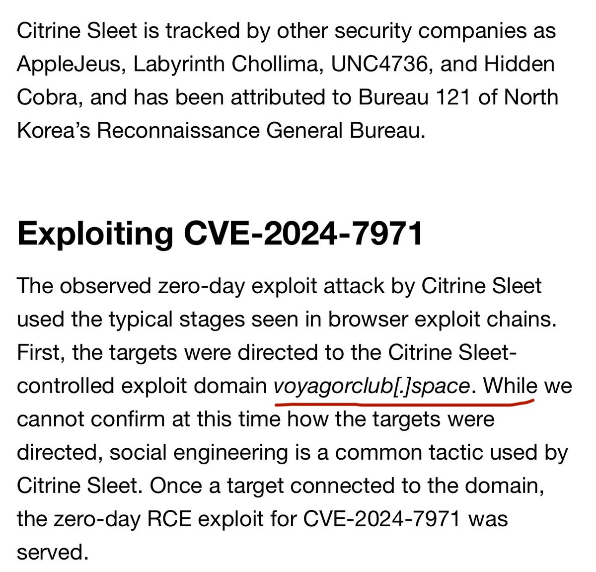</td>
</table></tr>
<table><tr>
<td>Quotes: <code>1</code></td>
<td>Replies: <code>3</code></td>
<td>Retweets: <code>29</code></td>
<td>Favorites: <code>95</code></td>
</tr></table>

---

# wvuuuuuuuuuuuuu
**https://twitter.com/wvuuuuuuuuuuuuu/status/1829588991857058149 _at 2024-08-30, 18:36:22_**
<blockquote>
RT @hyprdude: New blog post is up! This one goes over 4 different exploits for CVE-2024-20017, using it as a case study to explore exploit…
</blockquote>

<table><tr>
<td>Quotes: <code>0</code></td>
<td>Replies: <code>0</code></td>
<td>Retweets: <code>91</code></td>
<td>Favorites: <code>0</code></td>
</tr></table>

---

# cyber_advising
**https://twitter.com/cyber_advising/status/1829575735595417897 _at 2024-08-30, 17:43:41_**
<blockquote>
CVE-2024-43044: Jenkins 2.470 and earlier, LTS 2.452.3 and earlier allows agent processes to read arbitrary files from the Jenkins controller file system by using the `ClassLoaderProxy#fetchJar` method in the Remoting library.

PoC
https://t.co/5yoWLrrTdb https://t.co/uU0h08LCpu
</blockquote>

* https://github.com/convisolabs/CVE-2024-43044-jenkins

<table><tr>
<td></td>
</table></tr>
<table><tr>
<td>Quotes: <code>0</code></td>
<td>Replies: <code>0</code></td>
<td>Retweets: <code>31</code></td>
<td>Favorites: <code>98</code></td>
</tr></table>

---

# MsftSecIntel
**https://twitter.com/MsftSecIntel/status/1829550899766653064 _at 2024-08-30, 16:05:00_**
<blockquote>
Microsoft identified a North Korean threat actor exploiting a zero-day vulnerability in Chromium (CVE-2024-7971) to gain remote code execution. Our assessment of ongoing analysis and observed infrastructure attributes this activity to Citrine Sleet. https://t.co/ITqOQpWn2v
</blockquote>

* https://msft.it/6010l7S6w

<table><tr>
<td>Quotes: <code>30</code></td>
<td>Replies: <code>25</code></td>
<td>Retweets: <code>247</code></td>
<td>Favorites: <code>586</code></td>
</tr></table>

---

# wvuuuuuuuuuuuuu
**https://twitter.com/wvuuuuuuuuuuuuu/status/1829375173977374922 _at 2024-08-30, 04:26:44_**
<blockquote>
RT @mistymntncop: In light of the issue page for CVE-2024-5274 being made public. Me and @buptsb have decided to make our exploit public. I…
</blockquote>

<table><tr>
<td>Quotes: <code>0</code></td>
<td>Replies: <code>0</code></td>
<td>Retweets: <code>42</code></td>
<td>Favorites: <code>0</code></td>
</tr></table>

---

# ptracesecurity
**https://twitter.com/ptracesecurity/status/1829194851646099488 _at 2024-08-29, 16:30:12_**
<blockquote>
CVE-2024-38063 - Remotely Exploiting The Kernel Via IPv6 https://t.co/VH1eWgCvUQ  #Pentesting #Exploit #CyberSecurity #Infosec https://t.co/95VBGetYXN
</blockquote>

* https://malwaretech.com/2024/08/exploiting-CVE-2024-38063.html

<table><tr>
<td></td>
<td></td>
<td></td>
<td></td>
</table></tr>
<table><tr>
<td>Quotes: <code>0</code></td>
<td>Replies: <code>0</code></td>
<td>Retweets: <code>12</code></td>
<td>Favorites: <code>46</code></td>
</tr></table>

---

# mistymntncop
**https://twitter.com/mistymntncop/status/1829127856389271818 _at 2024-08-29, 12:03:59_**
<blockquote>
In light of the issue page for CVE-2024-5274 being made public. Me and @buptsb have decided to make our exploit public. It's a bit different than the issue page POC.
https://t.co/goBkUUIoWX
</blockquote>

* https://github.com/mistymntncop/CVE-2024-5274/blob/main/exploit.js

<table><tr>
<td>Quotes: <code>2</code></td>
<td>Replies: <code>12</code></td>
<td>Retweets: <code>46</code></td>
<td>Favorites: <code>242</code></td>
</tr></table>

---

# wvuuuuuuuuuuuuu
**https://twitter.com/wvuuuuuuuuuuuuu/status/1828914644783882481 _at 2024-08-28, 21:56:45_**
<blockquote>
RT @1ue1166323: [CVE-2024-21096] mysqldump rce : )  learn form defcon32 https://t.co/8QrAQJqbN2
</blockquote>

<table><tr>
<td></td>
</table></tr>
<table><tr>
<td>Quotes: <code>0</code></td>
<td>Replies: <code>0</code></td>
<td>Retweets: <code>71</code></td>
<td>Favorites: <code>0</code></td>
</tr></table>

---

# wvuuuuuuuuuuuuu
**https://twitter.com/wvuuuuuuuuuuuuu/status/1828856447519826190 _at 2024-08-28, 18:05:30_**
<blockquote>
RT @TheHackersNews: 🚨 A critical #vulnerability in Fortra's FileCatalyst Workflow, tracked as CVE-2024-6633, exposes users to remote admin…
</blockquote>

<table><tr>
<td>Quotes: <code>0</code></td>
<td>Replies: <code>0</code></td>
<td>Retweets: <code>38</code></td>
<td>Favorites: <code>0</code></td>
</tr></table>

---

# wvuuuuuuuuuuuuu
**https://twitter.com/wvuuuuuuuuuuuuu/status/1828856213162844512 _at 2024-08-28, 18:04:34_**
<blockquote>
RT @win3zz: Don’t blindly run scripts

I found fake CVE-2024-5932 RCE PoCs on GitHub. One Python script contained malicious code that clone…
</blockquote>

<table><tr>
<td>Quotes: <code>0</code></td>
<td>Replies: <code>0</code></td>
<td>Retweets: <code>90</code></td>
<td>Favorites: <code>0</code></td>
</tr></table>

---

# wvuuuuuuuuuuuuu
**https://twitter.com/wvuuuuuuuuuuuuu/status/1828855811252121870 _at 2024-08-28, 18:02:58_**
<blockquote>
RT @thezdi: When CVE-2024-37079 was patched by VMware, it received quite a bit of attention. In their latest blog, the Trend Micro Research…
</blockquote>

<table><tr>
<td>Quotes: <code>0</code></td>
<td>Replies: <code>0</code></td>
<td>Retweets: <code>34</code></td>
<td>Favorites: <code>0</code></td>
</tr></table>

---

# hosselot
**https://twitter.com/hosselot/status/1828838352570986584 _at 2024-08-28, 16:53:36_**
<blockquote>
Google Chrome In-The-Wild Type Confusion in V8 (CVE-2024-5274 [341663589]]) bug entry is now open with a PoC:
https://t.co/U6F3E61YdS
</blockquote>

* https://issues.chromium.org/issues/341663589

<table><tr>
<td>Quotes: <code>0</code></td>
<td>Replies: <code>5</code></td>
<td>Retweets: <code>9</code></td>
<td>Favorites: <code>52</code></td>
</tr></table>

---

# TheHackersNews
**https://twitter.com/TheHackersNews/status/1828828592094224814 _at 2024-08-28, 16:14:49_**
<blockquote>
🚨 A critical #vulnerability in Fortra's FileCatalyst Workflow, tracked as CVE-2024-6633, exposes users to remote admin access attacks.

Severity Level: CVSS 9.8

Learn more: https://t.co/ky5jjHMsnH

If you haven’t patched your system yet, do it NOW.

#cybersecurity #hacking
</blockquote>

* https://thehackernews.com/2024/08/fortra-issues-patch-for-high-risk.html

<table><tr>
<td>Quotes: <code>0</code></td>
<td>Replies: <code>2</code></td>
<td>Retweets: <code>34</code></td>
<td>Favorites: <code>59</code></td>
</tr></table>

---

# thezdi
**https://twitter.com/thezdi/status/1828811023702233418 _at 2024-08-28, 15:05:00_**
<blockquote>
When CVE-2024-37079 was patched by VMware, it received quite a bit of attention. In their latest blog, the Trend Micro Research team details the root cause of this vCenter bug and shows how it can be used for RCE. Read all about it at https://t.co/uBGoiEpXMD
</blockquote>

* https://www.zerodayinitiative.com/blog/2024/8/27/cve-2024-37079-vmware-vcenter-server-integer-underflow-code-execution-vulnerability

<table><tr>
<td>Quotes: <code>0</code></td>
<td>Replies: <code>2</code></td>
<td>Retweets: <code>29</code></td>
<td>Favorites: <code>75</code></td>
</tr></table>

---

# TheHackersNews
**https://twitter.com/TheHackersNews/status/1828792175439892824 _at 2024-08-28, 13:50:06_**
<blockquote>
A South Korea-aligned cyber espionage group, APT-C-60, has exploited a critical flaw in Kingsoft WPS Office to deploy the SpyGlace backdoor.

Read: https://t.co/TsERcimowq

Ensure your security teams are updated on CVE-2024-7262 and CVE-2024-7263.

#CyberSecurity #Hacking
</blockquote>

* https://thehackernews.com/2024/08/apt-c-60-group-exploit-wps-office-flaw.html

<table><tr>
<td>Quotes: <code>0</code></td>
<td>Replies: <code>0</code></td>
<td>Retweets: <code>17</code></td>
<td>Favorites: <code>42</code></td>
</tr></table>

---

# elhackernet
**https://twitter.com/elhackernet/status/1828755125566853627 _at 2024-08-28, 11:22:53_**
<blockquote>
CVE-2024-38063 - Remotely Exploiting The Kernel Via IPv6
https://t.co/WDqNk42uN7 https://t.co/lUq8dnkbZ4
</blockquote>

* https://malwaretech.com/2024/08/exploiting-CVE-2024-38063.html

<table><tr>
<td></td>
</table></tr>
<table><tr>
<td>Quotes: <code>1</code></td>
<td>Replies: <code>1</code></td>
<td>Retweets: <code>42</code></td>
<td>Favorites: <code>94</code></td>
</tr></table>

---

# TheHackersNews
**https://twitter.com/TheHackersNews/status/1828740349134594126 _at 2024-08-28, 10:24:10_**
<blockquote>
🚨 Alert: BlackByte #ransomware is exploiting the VMware ESXi vulnerability (CVE-2024-37085) to escalate privileges and compromise systems.

They're also using vulnerable drivers to disable security measures, making this attack especially dangerous.

https://t.co/sQo2lEKPLM
</blockquote>

* https://thehackernews.com/2024/08/blackbyte-ransomware-exploits-vmware.html

<table><tr>
<td>Quotes: <code>2</code></td>
<td>Replies: <code>2</code></td>
<td>Retweets: <code>68</code></td>
<td>Favorites: <code>121</code></td>
</tr></table>

---

# win3zz
**https://twitter.com/win3zz/status/1828704644987511107 _at 2024-08-28, 08:02:17_**
<blockquote>
Don’t blindly run scripts

I found fake CVE-2024-5932 RCE PoCs on GitHub. One Python script contained malicious code that clones a repo, executes a shell script, and then cleans up. The shell script downloads and sets up xmrig to run at startup using cron and starts crypto mining
</blockquote>

<table><tr>
<td>Quotes: <code>8</code></td>
<td>Replies: <code>16</code></td>
<td>Retweets: <code>75</code></td>
<td>Favorites: <code>364</code></td>
</tr></table>

---

# wvuuuuuuuuuuuuu
**https://twitter.com/wvuuuuuuuuuuuuu/status/1828676475198804204 _at 2024-08-28, 06:10:21_**
<blockquote>
RT @D4mianWayne: Developed a PoC for exploiting CVE-2024-38653 (Ivanti Avalanche XXE). Credits to Lucas Millar (Trend Micro Security Resear…
</blockquote>

<table><tr>
<td>Quotes: <code>0</code></td>
<td>Replies: <code>0</code></td>
<td>Retweets: <code>55</code></td>
<td>Favorites: <code>0</code></td>
</tr></table>

---

# TheHackersNews
**https://twitter.com/TheHackersNews/status/1828662719534231770 _at 2024-08-28, 05:15:41_**
<blockquote>
CISA has added a critical Apache OFBiz flaw, CVE-2024-38856, to its Known Exploited Vulnerabilities list. It allows RCE attacks, putting countless businesses at serious risk.

https://t.co/MMPvYw3KEt

PoC exploits are already public, so update your systems immediately.
</blockquote>

* https://thehackernews.com/2024/08/cisa-flags-critical-apache-ofbiz-flaw.html

<table><tr>
<td>Quotes: <code>1</code></td>
<td>Replies: <code>1</code></td>
<td>Retweets: <code>20</code></td>
<td>Favorites: <code>38</code></td>
</tr></table>

---

# hackerfantastic
**https://twitter.com/hackerfantastic/status/1828660397710188860 _at 2024-08-28, 05:06:28_**
<blockquote>
RT @hd3s5aa: CVE-2024-7971 #itw #chrome #0day #POC https://t.co/WPFTKEeY9r
</blockquote>

<table><tr>
<td></td>
</table></tr>
<table><tr>
<td>Quotes: <code>0</code></td>
<td>Replies: <code>0</code></td>
<td>Retweets: <code>66</code></td>
<td>Favorites: <code>0</code></td>
</tr></table>

---

# TheHackersNews
**https://twitter.com/TheHackersNews/status/1828648221566218727 _at 2024-08-28, 04:18:05_**
<blockquote>
A critical #vulnerability (CVE-2024-6386) has been discovered in the WPML WordPress plugin.

With a CVSS score of 9.9, this flaw could allow attackers to execute code remotely, putting over a million websites at risk.

Read: https://t.co/mnhUqgSpQC

#CyberSecurity
</blockquote>

* https://thehackernews.com/2024/08/critical-wpml-plugin-flaw-exposes.html

<table><tr>
<td>Quotes: <code>5</code></td>
<td>Replies: <code>0</code></td>
<td>Retweets: <code>60</code></td>
<td>Favorites: <code>105</code></td>
</tr></table>

---

# HackingTeam1
**https://twitter.com/HackingTeam1/status/1828501616288239707 _at 2024-08-27, 18:35:31_**
<blockquote>
WordPress GiveWP POP to RCE (CVE-2024-5932 CVSS 10) (https://t.co/WVPXMrBIMV)

POC: https://t.co/54gpkoqdj4

Search Query:
HUNTER:  web.body="/wp-content/plugins/give" https://t.co/nCD8vdJLBd
</blockquote>

* https://www.rcesecurity.com/2024/08/wordpress-givewp-pop-to-rce-cve-2024-5932/
* https://github.com/EQSTSeminar/CVE-2024-5932

<table><tr>
<td></td>
</table></tr>
<table><tr>
<td>Quotes: <code>0</code></td>
<td>Replies: <code>0</code></td>
<td>Retweets: <code>11</code></td>
<td>Favorites: <code>33</code></td>
</tr></table>

---

# ripstech
**https://twitter.com/ripstech/status/1828450082858954972 _at 2024-08-27, 15:10:45_**
<blockquote>
Critical Roundcube XSS technical details: Desanitization, unsafe Content-Types, CSS exfiltration, and a Service Worker come together to persistently leak emails from a victim's browser.

Read about it here:
https://t.co/fOa2l0ujwV

(CVE-2024-42008, CVE-2024-42009, CVE-2024-42010) https://t.co/fVurDab5Cm
</blockquote>

* https://sonarsource.com/blog/government-emails-at-risk-critical-cross-site-scripting-vulnerability-in-roundcube-webmail?utm_medium=social&utm_source=twitter&utm_campaign=research&utm_content=blog-government-emails-at-risk-critical-cross-site-scripting-vulnerability-in-roundcube-webmail-240805-&utm_term=&s_category=Organic&s_source=Social%20Media&s_origin=twitter

<table><tr>
<td></td>
</table></tr>
<table><tr>
<td>Quotes: <code>2</code></td>
<td>Replies: <code>0</code></td>
<td>Retweets: <code>33</code></td>
<td>Favorites: <code>76</code></td>
</tr></table>

---

# hosselot
**https://twitter.com/hosselot/status/1828442542410465533 _at 2024-08-27, 14:40:47_**
<blockquote>
Chrome 128.0.6613.84 also fixed another In-The-Wild vulnerability in V8 (CVE-2024-7965 [356196918]) which happens within compiler due to not clearing phi_states_ data from previous calls to ZeroExtendsWord32ToWord64:
https://t.co/jzKEVjLpn8
</blockquote>

* https://chromium-review.googlesource.com/c/v8/v8/+/5766478

<table><tr>
<td>Quotes: <code>0</code></td>
<td>Replies: <code>0</code></td>
<td>Retweets: <code>3</code></td>
<td>Favorites: <code>38</code></td>
</tr></table>

---

# h4x0r_dz
**https://twitter.com/h4x0r_dz/status/1828416404824965617 _at 2024-08-27, 12:56:55_**
<blockquote>
CVE-2024-43425 : Moodle remote code execution via calculated question types 
payload : (1)-&gt;{system($_GET[chr(97)])}
then ?a=&lt;cmd&gt;

https://t.co/jNlWhp1Tk8
</blockquote>

* https://blog.redteam-pentesting.de/2024/moodle-rce/

<table><tr>
<td>Quotes: <code>2</code></td>
<td>Replies: <code>2</code></td>
<td>Retweets: <code>58</code></td>
<td>Favorites: <code>191</code></td>
</tr></table>

---

# binitamshah
**https://twitter.com/binitamshah/status/1828371393282744718 _at 2024-08-27, 09:58:04_**
<blockquote>
POC for CVE-2024-38063 (RCE in Windows TCP/IP) : https://t.co/ZnSrAbjqQ3 https://t.co/vmS3wudegs
</blockquote>

* https://github.com/ynwarcs/CVE-2024-38063

<table><tr>
<td>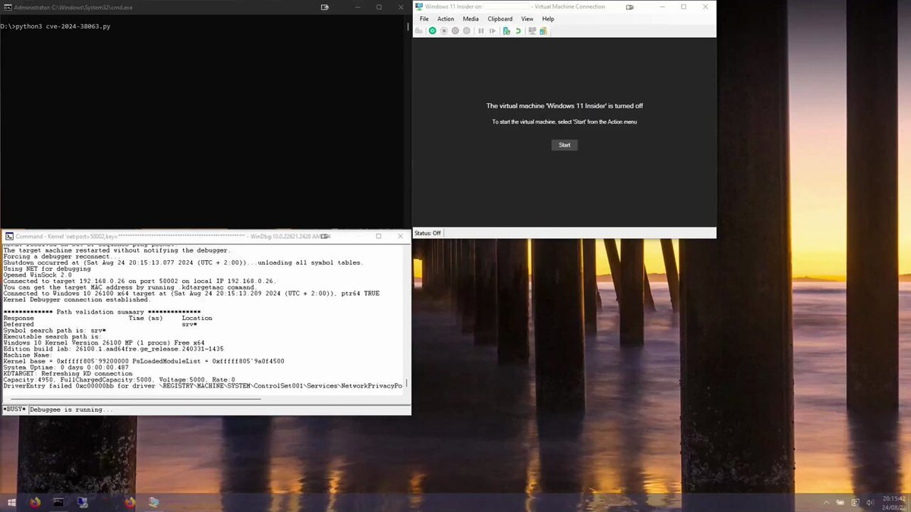</td>
</table></tr>
<table><tr>
<td>Quotes: <code>1</code></td>
<td>Replies: <code>4</code></td>
<td>Retweets: <code>118</code></td>
<td>Favorites: <code>478</code></td>
</tr></table>

---

# piedpiper1616
**https://twitter.com/piedpiper1616/status/1828362823111745588 _at 2024-08-27, 09:24:01_**
<blockquote>
RT @cyb3rops: A POC for CVE-2024-38063 (RCE in tcpip.sys / IPv6)
https://t.co/AUfWhb5gZL
</blockquote>

* https://github.com/ynwarcs/CVE-2024-38063

<table><tr>
<td>Quotes: <code>0</code></td>
<td>Replies: <code>0</code></td>
<td>Retweets: <code>71</code></td>
<td>Favorites: <code>0</code></td>
</tr></table>

---

# kmkz_security
**https://twitter.com/kmkz_security/status/1828360833023266983 _at 2024-08-27, 09:16:06_**
<blockquote>
RT @Dinosn: Kernel exploit for Xbox SystemOS using CVE-2024-30088 https://t.co/NGAHmhxVrm
</blockquote>

* https://github.com/exploits-forsale/collateral-damage

<table><tr>
<td>Quotes: <code>0</code></td>
<td>Replies: <code>0</code></td>
<td>Retweets: <code>35</code></td>
<td>Favorites: <code>0</code></td>
</tr></table>

---

# TheHackersNews
**https://twitter.com/TheHackersNews/status/1828293232507396385 _at 2024-08-27, 04:47:29_**
<blockquote>
Google has disclosed active exploitation of a high severity Chrome #vulnerability, CVE-2024-7965, which was patched last week.

This flaw in Chrome's V8 engine could enable remote attacks.

Learn more: https://t.co/HZ0qsigJa6

#cybersecurity
</blockquote>

* https://thehackernews.com/2024/08/google-warns-of-cve-2024-7965-chrome.html

<table><tr>
<td>Quotes: <code>3</code></td>
<td>Replies: <code>2</code></td>
<td>Retweets: <code>22</code></td>
<td>Favorites: <code>46</code></td>
</tr></table>

---

# steventseeley
**https://twitter.com/steventseeley/status/1828288710187618576 _at 2024-08-27, 04:29:31_**
<blockquote>
RT @linkersec: CVE-2022-22265: Samsung NPU driver

An article by @javierprtd about exploiting a slab double-free in the Samsung's NPU drive…
</blockquote>

<table><tr>
<td>Quotes: <code>0</code></td>
<td>Replies: <code>0</code></td>
<td>Retweets: <code>41</code></td>
<td>Favorites: <code>0</code></td>
</tr></table>

---

# __kokumoto
**https://twitter.com/__kokumoto/status/1828274047224029675 _at 2024-08-27, 03:31:15_**
<blockquote>
Windowsの深刻なIPv6の脆弱性CVE-2024-38063のPoC（攻撃の概念実証コード）が公開された。PoCはDoS。IPv6の終点オプションヘッダのパースエラーが原因で、IPv6パケットのリアセンブルにおけるタイムアウトから悪用することで整数アンダーフローバッファオーバーフロー可能。 https://t.co/Fa8s8GkYod
</blockquote>

* https://securityonline.info/zero-click-windows-rce-threat-researcher-publishes-poc-exploit-for-cve-2024-38063/

<table><tr>
<td>Quotes: <code>5</code></td>
<td>Replies: <code>2</code></td>
<td>Retweets: <code>75</code></td>
<td>Favorites: <code>162</code></td>
</tr></table>

---

# Dinosn
**https://twitter.com/Dinosn/status/1828273918936842674 _at 2024-08-27, 03:30:44_**
<blockquote>
PoC for CVE-2024-38063 (Zero-Click Windows RCE in tcpip.sys) https://t.co/wk5g5YrBVo
</blockquote>

* https://github.com/ynwarcs/CVE-2024-38063

<table><tr>
<td>Quotes: <code>1</code></td>
<td>Replies: <code>1</code></td>
<td>Retweets: <code>138</code></td>
<td>Favorites: <code>355</code></td>
</tr></table>

---

# kmkz_security
**https://twitter.com/kmkz_security/status/1828173937911488514 _at 2024-08-26, 20:53:27_**
<blockquote>
RT @MrTuxracer: POP chains are always a fun ride 😎 
So here's an exploit for the PHP object injection bug in GiveWP (CVE-2024-5932) leading…
</blockquote>

<table><tr>
<td>Quotes: <code>0</code></td>
<td>Replies: <code>0</code></td>
<td>Retweets: <code>46</code></td>
<td>Favorites: <code>0</code></td>
</tr></table>

---

# MrTuxracer
**https://twitter.com/MrTuxracer/status/1828172466675687758 _at 2024-08-26, 20:47:36_**
<blockquote>
POP chains are always a fun ride 😎 
So here's an exploit for the PHP object injection bug in GiveWP (CVE-2024-5932) leading to RCE.

https://t.co/VhvUt1V3ly

#security #BugBounty
</blockquote>

* https://www.rcesecurity.com/2024/08/wordpress-givewp-pop-to-rce-cve-2024-5932/

<table><tr>
<td>Quotes: <code>2</code></td>
<td>Replies: <code>2</code></td>
<td>Retweets: <code>71</code></td>
<td>Favorites: <code>208</code></td>
</tr></table>

---

# _r_netsec
**https://twitter.com/_r_netsec/status/1828076960767205695 _at 2024-08-26, 14:28:06_**
<blockquote>
POC for CVE-2024-38063 (RCE in Windows TCP/IP) https://t.co/6tyr0BZMQ6
</blockquote>

* https://github.com/ynwarcs/CVE-2024-38063

<table><tr>
<td>Quotes: <code>0</code></td>
<td>Replies: <code>0</code></td>
<td>Retweets: <code>33</code></td>
<td>Favorites: <code>90</code></td>
</tr></table>

---

# momika233
**https://twitter.com/momika233/status/1827944171711451402 _at 2024-08-26, 05:40:26_**
<blockquote>
This can be considered a variant bug of CVE-2024-2887 discovered by Manfred Paul and presented in Vancouver 2024.
Google Chrome Type Confusion Remote command execution
https://t.co/4Ckt2pfX71
</blockquote>

* https://ssd-disclosure.com/ssd-advisory-google-chrome-rce/

<table><tr>
<td>Quotes: <code>0</code></td>
<td>Replies: <code>1</code></td>
<td>Retweets: <code>14</code></td>
<td>Favorites: <code>58</code></td>
</tr></table>

---

# binitamshah
**https://twitter.com/binitamshah/status/1827646851962585344 _at 2024-08-25, 09:59:00_**
<blockquote>
Streaming vulnerabilities from Windows Kernel - Proxying to Kernel - Part I : https://t.co/4OTnWIRSW2 credits @d3vc0r3 

Ref :

 A look at CVE-2023-29360, a beautiful logical LPE vuln : https://t.co/9MDhryYE3M https://t.co/FidxNOnxCb
</blockquote>

* https://devco.re/blog/2024/08/23/streaming-vulnerabilities-from-windows-kernel-proxying-to-kernel-part1-en/
* https://big5-sec.github.io/posts/CVE-2023-29360-analysis/

<table><tr>
<td>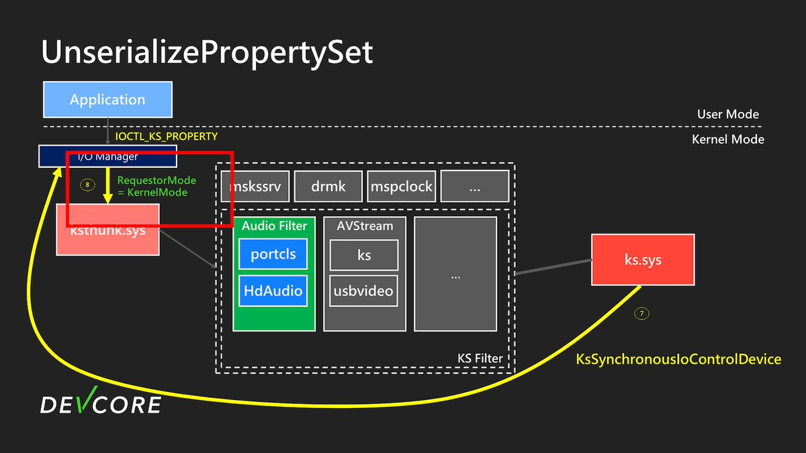</td>
<td></td>
<td>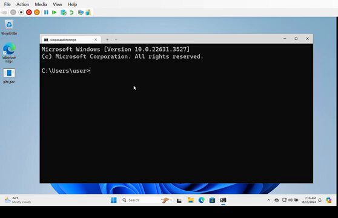</td>
<td>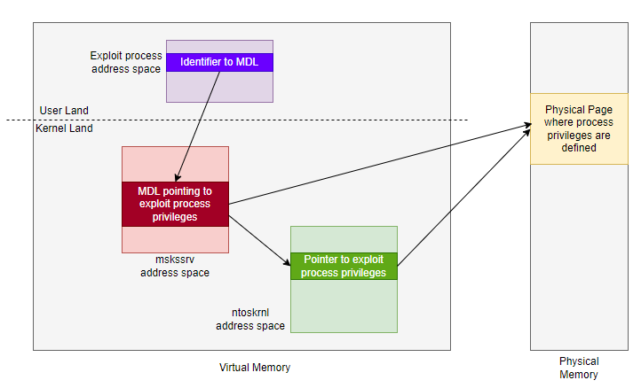</td>
</table></tr>
<table><tr>
<td>Quotes: <code>0</code></td>
<td>Replies: <code>0</code></td>
<td>Retweets: <code>38</code></td>
<td>Favorites: <code>119</code></td>
</tr></table>

---

# ptracesecurity
**https://twitter.com/ptracesecurity/status/1827345163183657201 _at 2024-08-24, 14:00:11_**
<blockquote>
CVE-2024-20693: Windows cached code signature manipulation https://t.co/CHzSRjpHkA  #Pentesting #Windows  #CyberSecurity #Infosec https://t.co/CkOF1knxdm
</blockquote>

* https://sector7.computest.nl/post/2024-06-cve-2024-20693-windows-cached-code-signature-manipulation/

<table><tr>
<td></td>
<td></td>
</table></tr>
<table><tr>
<td>Quotes: <code>0</code></td>
<td>Replies: <code>1</code></td>
<td>Retweets: <code>11</code></td>
<td>Favorites: <code>41</code></td>
</tr></table>

---

# cyber_advising
**https://twitter.com/cyber_advising/status/1827310305791082720 _at 2024-08-24, 11:41:41_**
<blockquote>
CVE-2024-28000: Incorrect Privilege Assignment vulnerability in LiteSpeed Technologies LiteSpeed Cache litespeed-cache allows Privilege Escalation.

PoC
https://t.co/dR0mm0cKyz https://t.co/FIhquqErab
</blockquote>

* https://github.com/Alucard0x1/CVE-2024-28000

<table><tr>
<td></td>
</table></tr>
<table><tr>
<td>Quotes: <code>1</code></td>
<td>Replies: <code>0</code></td>
<td>Retweets: <code>10</code></td>
<td>Favorites: <code>51</code></td>
</tr></table>

---

# piedpiper1616
**https://twitter.com/piedpiper1616/status/1827270641365749770 _at 2024-08-24, 09:04:04_**
<blockquote>
GitHub - Alucard0x1/CVE-2024-28000: LiteSpeed Cache Privilege Escalation PoC - https://t.co/DTDTaBA18q
</blockquote>

* https://github.com/Alucard0x1/CVE-2024-28000

<table><tr>
<td>Quotes: <code>0</code></td>
<td>Replies: <code>1</code></td>
<td>Retweets: <code>16</code></td>
<td>Favorites: <code>52</code></td>
</tr></table>

---

# TheHackersNews
**https://twitter.com/TheHackersNews/status/1827240906967101588 _at 2024-08-24, 07:05:55_**
<blockquote>
CISA has added a new #vulnerability in Versa Director (CVE-2024-39717) to its Known Exploited Vulnerabilities catalog due to active exploitation.

This flaw lets attackers upload malicious files, posing a serious threat to organizations.

Read: https://t.co/vk6gYXpgG6

#infosec
</blockquote>

* https://thehackernews.com/2024/08/cisa-urges-federal-agencies-to-patch.html

<table><tr>
<td>Quotes: <code>2</code></td>
<td>Replies: <code>0</code></td>
<td>Retweets: <code>27</code></td>
<td>Favorites: <code>66</code></td>
</tr></table>

---

# ksg93rd
**https://twitter.com/ksg93rd/status/1827106095011393551 _at 2024-08-23, 22:10:13_**
<blockquote>
#exploit
1. CVE-2024-38148:
Windows Secure Channel RCE
https://t.co/VomCo7xA1p

2. CVE-2024-31317:
https://t.co/PLGuDuftY1

3. CVE-2024-29050:
Windows Cryptographic Services RCE
https://t.co/Xlj7orz8Kd
</blockquote>

* https://v-v.space/2024/08/19/CVE-2024-38148
* https://blog.flanker017.me/the-new-mystique-bug-cve-2024-31317
* https://v-v.space/2024/08/23/CVE-2024-29050

<table><tr>
<td>Quotes: <code>0</code></td>
<td>Replies: <code>0</code></td>
<td>Retweets: <code>33</code></td>
<td>Favorites: <code>104</code></td>
</tr></table>

---

# elhackernet
**https://twitter.com/elhackernet/status/1827097734316486806 _at 2024-08-23, 21:37:00_**
<blockquote>
El software de monitorización Zabbix ha publicado un parche para corregir una vulnerabilidad RCE (CVE-2024-22116) con una calificación de 9,9/10
https://t.co/q9gbUFVPAt https://t.co/mXSvzXg2Nz
</blockquote>

* https://support.zabbix.com/browse/ZBX-25016

<table><tr>
<td></td>
</table></tr>
<table><tr>
<td>Quotes: <code>2</code></td>
<td>Replies: <code>0</code></td>
<td>Retweets: <code>93</code></td>
<td>Favorites: <code>215</code></td>
</tr></table>

---

# CyberWarship
**https://twitter.com/CyberWarship/status/1826882569993925008 _at 2024-08-23, 07:22:01_**
<blockquote>
''No Way, PHP Strikes Again! (CVE-2024-4577)''

#infosec #pentest #redteam #blueteam
https://t.co/WnenxIpx1I
</blockquote>

* https://labs.watchtowr.com/no-way-php-strikes-again-cve-2024-4577/

<table><tr>
<td>Quotes: <code>0</code></td>
<td>Replies: <code>2</code></td>
<td>Retweets: <code>32</code></td>
<td>Favorites: <code>78</code></td>
</tr></table>

---

# Dinosn
**https://twitter.com/Dinosn/status/1826864358552437124 _at 2024-08-23, 06:09:39_**
<blockquote>
Exploit for CVE-2024-38054 Released: Elevation of Privilege Flaw in Windows Kernel Streaming WOW Thunk https://t.co/8fPI9DgEAY
</blockquote>

* https://securityonline.info/exploit-for-cve-2024-38054-released-elevation-of-privilege-flaw-in-windows-kernel-streaming-wow-thunk/

<table><tr>
<td>Quotes: <code>0</code></td>
<td>Replies: <code>0</code></td>
<td>Retweets: <code>43</code></td>
<td>Favorites: <code>136</code></td>
</tr></table>

---

# hd3s5
**https://twitter.com/hd3s5/status/1826655261366640832 _at 2024-08-22, 16:18:46_**
<blockquote>
Recently, the #itw #chrome #0day, CVE-2024-7971 was patched.
This is the ninth of the actively exploited chrome 0days in this year. https://t.co/dJgIZkD5u6
</blockquote>

<table><tr>
<td></td>
</table></tr>
<table><tr>
<td>Quotes: <code>0</code></td>
<td>Replies: <code>0</code></td>
<td>Retweets: <code>17</code></td>
<td>Favorites: <code>78</code></td>
</tr></table>

---

# TheHackersNews
**https://twitter.com/TheHackersNews/status/1826654533315166445 _at 2024-08-22, 16:15:52_**
<blockquote>
A China-linked threat group, Velvet Ant, has exploited a #vulnerability (CVE-2024-20399) in Cisco switches as zero-day to gain control and evade detection.

Read: https://t.co/AEwe4ibvTl

#infosec #cybersecurity #hacking
</blockquote>

* https://thehackernews.com/2024/08/chinese-hackers-exploit-zero-day-cisco.html

<table><tr>
<td>Quotes: <code>3</code></td>
<td>Replies: <code>1</code></td>
<td>Retweets: <code>48</code></td>
<td>Favorites: <code>90</code></td>
</tr></table>

---

# CyberWarship
**https://twitter.com/CyberWarship/status/1826552142443815297 _at 2024-08-22, 09:29:01_**
<blockquote>
''Exploitable PoC Released for CVE-2024-38077: 0-Click RCE Threatens All Windows Servers''

#infosec #pentest #redteam #blueteam
https://t.co/qV5PsiyMhM
</blockquote>

* https://securityonline.info/exploitable-poc-released-for-cve-2024-38077-0-click-rce-threatens-all-windows-servers/

<table><tr>
<td>Quotes: <code>1</code></td>
<td>Replies: <code>0</code></td>
<td>Retweets: <code>69</code></td>
<td>Favorites: <code>171</code></td>
</tr></table>

---

# H4ckManac
**https://twitter.com/H4ckManac/status/1826498569764761656 _at 2024-08-22, 05:56:08_**
<blockquote>
⚠️ Urgent Chrome Update: Active #0Day Exploit Detected (CVE-2024-7971) ⚠️
https://t.co/ViEhy0hVrM
</blockquote>

* https://securityonline.info/urgent-chrome-update-active-zero-day-exploit-detected-cve-2024-7971/

<table><tr>
<td>Quotes: <code>4</code></td>
<td>Replies: <code>1</code></td>
<td>Retweets: <code>31</code></td>
<td>Favorites: <code>56</code></td>
</tr></table>

---

# TheHackersNews
**https://twitter.com/TheHackersNews/status/1826490018073899315 _at 2024-08-22, 05:22:09_**
<blockquote>
⚠️ URGENT: Google has urgently patched a critical Chrome flaw, CVE-2024-7971, that’s being actively exploited.

This #vulnerability could let attackers compromise your system via a malicious HTML page.

Details: https://t.co/7eAWs30jwy

Ensure your browser is updated now.
</blockquote>

* https://thehackernews.com/2024/08/google-fixes-high-severity-chrome-flaw.html

<table><tr>
<td>Quotes: <code>14</code></td>
<td>Replies: <code>4</code></td>
<td>Retweets: <code>246</code></td>
<td>Favorites: <code>375</code></td>
</tr></table>

---

# hosselot
**https://twitter.com/hosselot/status/1826382690628894739 _at 2024-08-21, 22:15:40_**
<blockquote>
Google Chrome In-The-Wild Type Confusion in V8 (CVE-2024-7971 [360700873]) happens when handling loop inputs inside WASM baseline (A.K.A Liftoff) compiler/assembler:
https://t.co/qhBhbIiPeY
</blockquote>

* https://chromium-review.googlesource.com/c/v8/v8/+/5797073

<table><tr>
<td>Quotes: <code>0</code></td>
<td>Replies: <code>0</code></td>
<td>Retweets: <code>12</code></td>
<td>Favorites: <code>56</code></td>
</tr></table>

---

# steventseeley
**https://twitter.com/steventseeley/status/1826349440749502807 _at 2024-08-21, 20:03:33_**
<blockquote>
RT @androidmalware2: RCE on Xiaomi 13 Pro (CVE-2023-26324)

👉Exploitation:
1) Open URL in WebView
2) Inject JavaScript
3) Execute JavaScrip…
</blockquote>

<table><tr>
<td>Quotes: <code>0</code></td>
<td>Replies: <code>0</code></td>
<td>Retweets: <code>141</code></td>
<td>Favorites: <code>0</code></td>
</tr></table>

---

# H4ckManac
**https://twitter.com/H4ckManac/status/1826166670798270471 _at 2024-08-21, 07:57:17_**
<blockquote>
#PoC Exploit for Windows #0Day Flaws CVE-2024-38202 and CVE-2024-21302 Released

These vulnerabilities could reintroduce old issues, turning patched Windows systems into zero-day targets.
https://t.co/Zv4QE57DUi
</blockquote>

* https://securityonline.info/poc-exploit-for-windows-0-day-flaws-cve-2024-38202-and-cve-2024-21302-released/

<table><tr>
<td>Quotes: <code>0</code></td>
<td>Replies: <code>0</code></td>
<td>Retweets: <code>17</code></td>
<td>Favorites: <code>34</code></td>
</tr></table>

---

# blackorbird
**https://twitter.com/blackorbird/status/1826124185888034979 _at 2024-08-21, 05:08:28_**
<blockquote>
#Lazarus APT group used CVE-2024-38193(0day in wild)
https://t.co/TqoqeSTShk https://t.co/OMqRxgvZr9
</blockquote>

* https://www.gendigital.com/blog/news/innovation/protecting-windows-users

<table><tr>
<td></td>
</table></tr>
<table><tr>
<td>Quotes: <code>1</code></td>
<td>Replies: <code>0</code></td>
<td>Retweets: <code>43</code></td>
<td>Favorites: <code>93</code></td>
</tr></table>

---

# ksg93rd
**https://twitter.com/ksg93rd/status/1826115480182264151 _at 2024-08-21, 04:33:52_**
<blockquote>
#exploit
CVE-2024-38063:
Windows TCP/IP RCE
]-&gt; https://t.co/kPXgQpxUOU
</blockquote>

* https://github.com/Sachinart/CVE-2024-38063-POC

<table><tr>
<td>Quotes: <code>2</code></td>
<td>Replies: <code>0</code></td>
<td>Retweets: <code>38</code></td>
<td>Favorites: <code>127</code></td>
</tr></table>

---

# stargravy
**https://twitter.com/stargravy/status/1825883433408618685 _at 2024-08-20, 13:11:48_**
<blockquote>
This was the last thing I found / worked on while still at Tenable. 
A fun SSRF via Microsoft Copilot Studio leading to a critical info disclosure (CVE-2024-38206).

Thanks to @DinoBytes and the team for helping get this one out.

https://t.co/VExmmKYgvE https://t.co/mBDzcUxZV9
</blockquote>

* https://www.tenable.com/blog/ssrfing-the-web-with-the-help-of-copilot-studio

<table><tr>
<td></td>
</table></tr>
<table><tr>
<td>Quotes: <code>2</code></td>
<td>Replies: <code>1</code></td>
<td>Retweets: <code>24</code></td>
<td>Favorites: <code>73</code></td>
</tr></table>

---

# cyb3rops
**https://twitter.com/cyb3rops/status/1825834849778667633 _at 2024-08-20, 09:58:45_**
<blockquote>
RT @inversecos: NEW LAB 🥳: WinDbg Crash Dump Analysis by @DebugPrivilege 

Using WinDbg to analyze dumps of CVE-2024-29824 and CVE-2023-293…
</blockquote>

<table><tr>
<td>Quotes: <code>0</code></td>
<td>Replies: <code>0</code></td>
<td>Retweets: <code>88</code></td>
<td>Favorites: <code>0</code></td>
</tr></table>

---

# inversecos
**https://twitter.com/inversecos/status/1825833704306126924 _at 2024-08-20, 09:54:12_**
<blockquote>
NEW LAB 🥳: WinDbg Crash Dump Analysis by @DebugPrivilege 

Using WinDbg to analyze dumps of CVE-2024-29824 and CVE-2023-29357 exploited in the wild.

👇Solve the incident here 👇
https://t.co/HSjQ9Itkwp 

Test your memory forensic skills on:   
👀Reflective DLL Injection https://t.co/EQzECGGYWv
</blockquote>

* https://xintra.org

<table><tr>
<td>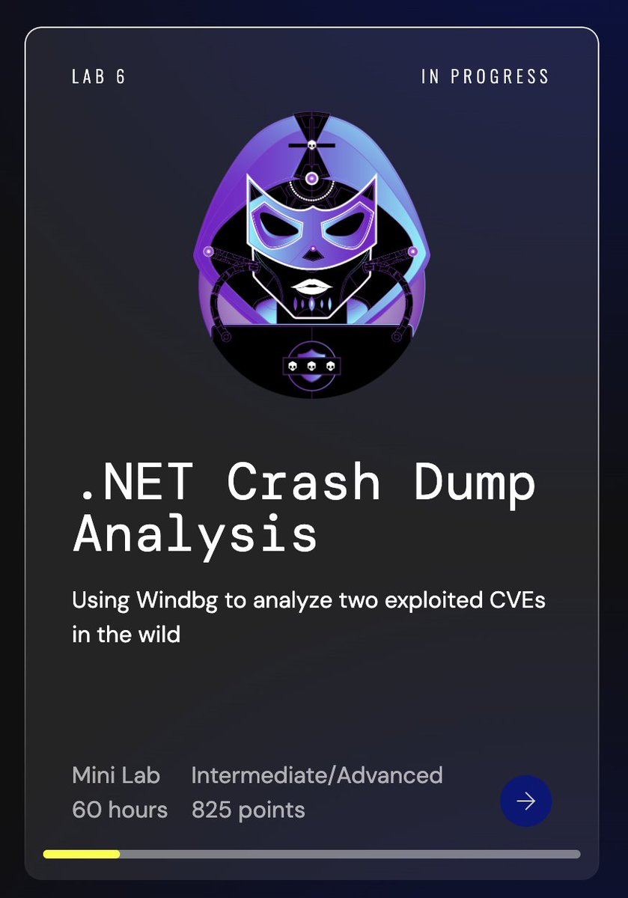</td>
<td>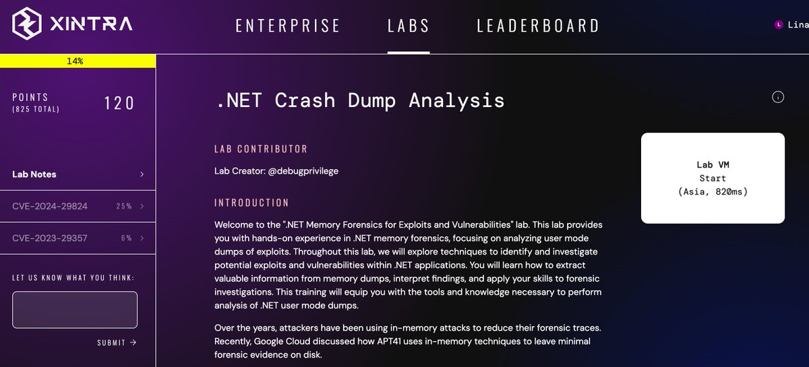</td>
</table></tr>
<table><tr>
<td>Quotes: <code>1</code></td>
<td>Replies: <code>8</code></td>
<td>Retweets: <code>85</code></td>
<td>Favorites: <code>286</code></td>
</tr></table>

---

# HunterMapping
**https://twitter.com/HunterMapping/status/1825795597850292566 _at 2024-08-20, 07:22:46_**
<blockquote>
🚨Alert🚨CVE-2024-5932 (CVSS 10): Critical RCE Vulnerability Impacts 100k+ WordPress Sites!
📊 173K+ Services are found on https://t.co/ysWb28BTvF yearly
🔗Hunter Link: https://t.co/oyEIfqsipF
👇Search Query
HUNTER:  web.body="/wp-content/plugins/give" https://t.co/CrX5kmdWrH
</blockquote>

* http://hunter.how
* https://hunter.how/list?searchValue=web.body%3D%22%2Fwp-content%2Fplugins%2Fgive%22

<table><tr>
<td>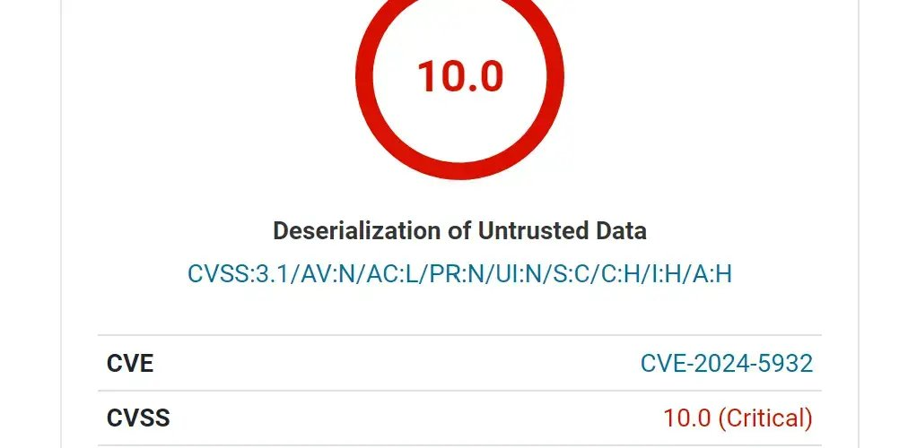</td>
</table></tr>
<table><tr>
<td>Quotes: <code>8</code></td>
<td>Replies: <code>4</code></td>
<td>Retweets: <code>129</code></td>
<td>Favorites: <code>392</code></td>
</tr></table>

---

# Dinosn
**https://twitter.com/Dinosn/status/1825731522382442665 _at 2024-08-20, 03:08:10_**
<blockquote>
PoC Exploit for Windows 0-Day Flaws CVE-2024-38202 and CVE-2024-21302 Released https://t.co/iolk0rBIiP
</blockquote>

* https://securityonline.info/poc-exploit-for-windows-0-day-flaws-cve-2024-38202-and-cve-2024-21302-released/

<table><tr>
<td>Quotes: <code>1</code></td>
<td>Replies: <code>0</code></td>
<td>Retweets: <code>164</code></td>
<td>Favorites: <code>411</code></td>
</tr></table>

---

# USCERT_gov
**https://twitter.com/USCERT_gov/status/1825550833150251488 _at 2024-08-19, 15:10:10_**
<blockquote>
🛡️ We added #Jenkins command line interface path traversal vulnerability, #CVE-2024-23897, to our Known Exploited Vulnerabilities Catalog. Visit https://t.co/myxOwap1Tf &amp; apply mitigations to protect your org from cyberattacks. #Cybersecurity #InfoSec https://t.co/upuaGpgluf
</blockquote>

* https://go.dhs.gov/Z3Q

<table><tr>
<td>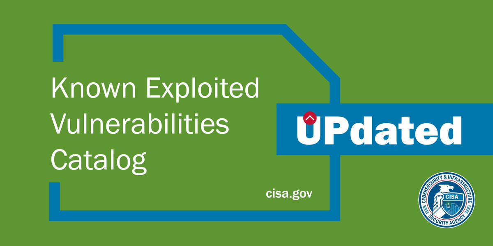</td>
</table></tr>
<table><tr>
<td>Quotes: <code>2</code></td>
<td>Replies: <code>2</code></td>
<td>Retweets: <code>21</code></td>
<td>Favorites: <code>38</code></td>
</tr></table>

---

# 0xor0ne
**https://twitter.com/0xor0ne/status/1825442697882042791 _at 2024-08-19, 08:00:28_**
<blockquote>
Exploiting an object corruption bug in v8 Javascript engine (CVE-2024-3833)

https://t.co/wyJGIFK3Tp

Credits @mmolgtm

#chrome #cybersecurity https://t.co/XTZqnTHtkX
</blockquote>

* https://github.blog/2024-06-26-attack-of-the-clones-getting-rce-in-chromes-renderer-with-duplicate-object-properties/

<table><tr>
<td>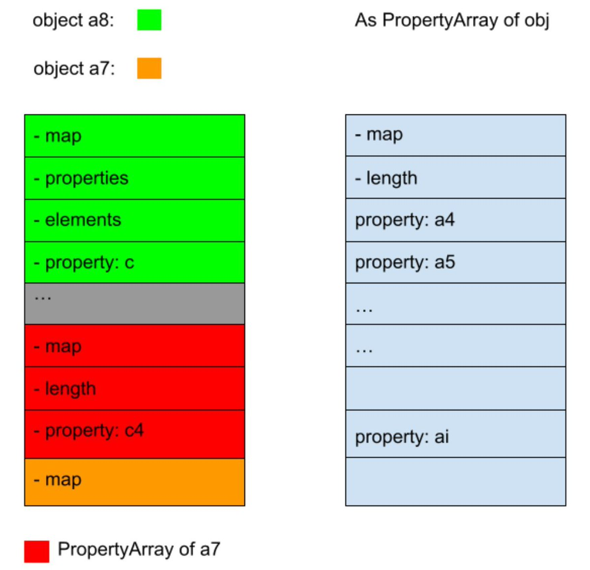</td>
</table></tr>
<table><tr>
<td>Quotes: <code>0</code></td>
<td>Replies: <code>1</code></td>
<td>Retweets: <code>27</code></td>
<td>Favorites: <code>138</code></td>
</tr></table>

---

# TheHackersNews
**https://twitter.com/TheHackersNews/status/1825430026893869145 _at 2024-08-19, 07:10:07_**
<blockquote>
Lazarus Group exploited a zero-day Windows #vulnerability (CVE-2024-38193) to gain SYSTEM privileges.

This flaw, used with a rootkit called FudModule, posed a major threat and was hard to detect before being patched.

Read: https://t.co/Ge22T0J6rX

#cybersecurity
</blockquote>

* https://thehackernews.com/2024/08/microsoft-patches-zero-day-flaw.html

<table><tr>
<td>Quotes: <code>8</code></td>
<td>Replies: <code>2</code></td>
<td>Retweets: <code>174</code></td>
<td>Favorites: <code>311</code></td>
</tr></table>

---

# steventseeley
**https://twitter.com/steventseeley/status/1825298744025489808 _at 2024-08-18, 22:28:27_**
<blockquote>
RT @javierprtd: I just released the blog explaining how I leveraged CVE-2022-22265 in the Samsung npu driver. Double free to achieve UAF ov…
</blockquote>

<table><tr>
<td>Quotes: <code>0</code></td>
<td>Replies: <code>0</code></td>
<td>Retweets: <code>92</code></td>
<td>Favorites: <code>0</code></td>
</tr></table>

---

# piedpiper1616
**https://twitter.com/piedpiper1616/status/1825034502215024827 _at 2024-08-18, 04:58:27_**
<blockquote>
RT @clearbluejar: jumping on the CVE-2024-38063 tcpip.sys train...🚂can't resist..  just need to figure out the right packet... 🤓

#patchdif…
</blockquote>

<table><tr>
<td>Quotes: <code>0</code></td>
<td>Replies: <code>0</code></td>
<td>Retweets: <code>50</code></td>
<td>Favorites: <code>0</code></td>
</tr></table>

---

# the_yellow_fall
**https://twitter.com/the_yellow_fall/status/1824386995613032948 _at 2024-08-16, 10:05:29_**
<blockquote>
ZDI Details Copy2Pwn: Zero-Day CVE-2024-38213 Evades Windows Security Measures

Discover the critical #Windows vulnerability (CVE-2024-38213) and the #Copy2Pwn attack that bypasses Mark-of-the-Web protections, leaving millions of users at risk
https://t.co/EbB7heH6QH
</blockquote>

* https://securityonline.info/zdi-details-copy2pwn-zero-day-cve-2024-38213-evades-windows-security-measures/

<table><tr>
<td>Quotes: <code>0</code></td>
<td>Replies: <code>1</code></td>
<td>Retweets: <code>21</code></td>
<td>Favorites: <code>57</code></td>
</tr></table>

---

# thezdi
**https://twitter.com/thezdi/status/1824109359061684280 _at 2024-08-15, 15:42:16_**
<blockquote>
Microsoft fixed CVE-2024-38213 last Tuesday. It was discovered in the wild by ZDI threat hunter @gothburz. Today, he makes the details of the vulnerability and how it's being used by threat actors. https://t.co/vpTQJ7vzCv
</blockquote>

* https://www.zerodayinitiative.com/blog/2024/8/14/cve-2024-38213-copy2pwn-exploit-evades-windows-web-protections

<table><tr>
<td>Quotes: <code>1</code></td>
<td>Replies: <code>0</code></td>
<td>Retweets: <code>31</code></td>
<td>Favorites: <code>65</code></td>
</tr></table>

---

# cyb3rops
**https://twitter.com/cyb3rops/status/1824108238830219587 _at 2024-08-15, 15:37:49_**
<blockquote>
Looks like your Windows systems are safe from the TCP/IP RCE vulnerability (CVE-2024-38063) when you and your team decided to say "not today" and disabled IPv6 on your systems
</blockquote>

<table><tr>
<td>Quotes: <code>3</code></td>
<td>Replies: <code>15</code></td>
<td>Retweets: <code>53</code></td>
<td>Favorites: <code>349</code></td>
</tr></table>

---

# cyb3rops
**https://twitter.com/cyb3rops/status/1824106655388508579 _at 2024-08-15, 15:31:31_**
<blockquote>
💥 Windows TCP/IP RCE Vulnerability
💥 CVSS 9.8
💥 Microsoft just released patches for end-of-life Windows 2008

Need I say more?

CVE-2024-38063

https://t.co/RSo8OJFZWZ https://t.co/4xv30ukyRk
</blockquote>

* https://msrc.microsoft.com/update-guide/vulnerability/CVE-2024-38063

<table><tr>
<td>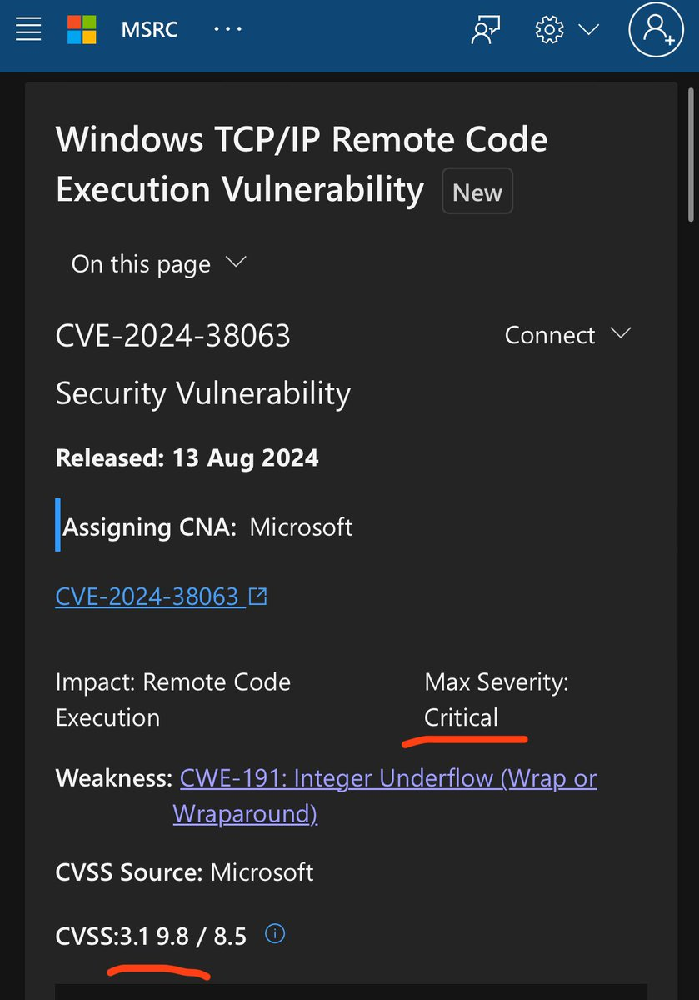</td>
<td>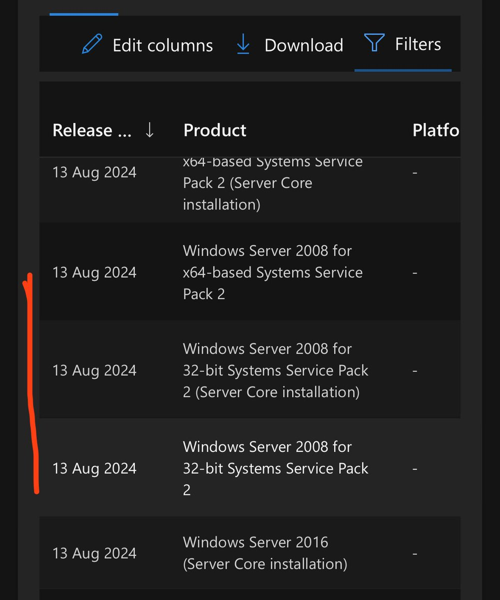</td>
</table></tr>
<table><tr>
<td>Quotes: <code>22</code></td>
<td>Replies: <code>27</code></td>
<td>Retweets: <code>304</code></td>
<td>Favorites: <code>940</code></td>
</tr></table>

---

# BleepinComputer
**https://twitter.com/BleepinComputer/status/1824105591297475048 _at 2024-08-15, 15:27:17_**
<blockquote>
Microsoft has disabled the fix for a BitLocker security feature bypass vulnerability (CVE-2024-38058) and advises customers to apply manual mitigations instead, which require eight restarts - @serghei
https://t.co/ySWF3LNkg4
</blockquote>

* https://www.bleepingcomputer.com/news/microsoft/microsoft-disables-bitlocker-security-fix-advises-manual-mitigation/

<table><tr>
<td>Quotes: <code>26</code></td>
<td>Replies: <code>17</code></td>
<td>Retweets: <code>203</code></td>
<td>Favorites: <code>375</code></td>
</tr></table>

---

# pyn3rd
**https://twitter.com/pyn3rd/status/1824101455969788274 _at 2024-08-15, 15:10:51_**
<blockquote>
#CVE-2024-21733, a Tomcat HTTP Request Smuggling vulnerability, reminds me of the HeartBleed vulnerability, which had a profound impact 10 years ago. In both cases, buffer over-reading is the root cause. Attacker is overwhelmingly likely to skim sensitive data from buffer cache. https://t.co/VG9qu2SCs4
</blockquote>

<table><tr>
<td>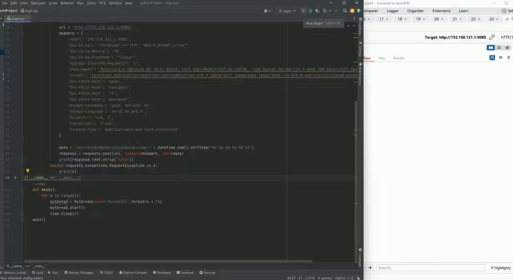</td>
</table></tr>
<table><tr>
<td>Quotes: <code>2</code></td>
<td>Replies: <code>2</code></td>
<td>Retweets: <code>48</code></td>
<td>Favorites: <code>249</code></td>
</tr></table>

---

# Unit42_Intel
**https://twitter.com/Unit42_Intel/status/1824088429207912733 _at 2024-08-15, 14:19:06_**
<blockquote>
Make sure to assess if CVE-2024-38063 (Windows TCP/IP Remote Code Execution Vulnerability) could impact your environment and patch accordingly. Microsoft has labeled this as “Exploitation More Likely.” https://t.co/1f0kmL4y8T

#CVE202438063 #RemoteCodeExecution https://t.co/3lBeJTi33W
</blockquote>

* https://bit.ly/46PQiXS

<table><tr>
<td></td>
</table></tr>
<table><tr>
<td>Quotes: <code>2</code></td>
<td>Replies: <code>1</code></td>
<td>Retweets: <code>11</code></td>
<td>Favorites: <code>44</code></td>
</tr></table>

---

# piedpiper1616
**https://twitter.com/piedpiper1616/status/1824066008157688119 _at 2024-08-15, 12:50:00_**
<blockquote>
GitHub - LtmThink/CVE-2024-21733: 一个验证对CVE-2024-21733 - https://t.co/BywjvyuWeu
</blockquote>

* https://github.com/LtmThink/CVE-2024-21733

<table><tr>
<td>Quotes: <code>1</code></td>
<td>Replies: <code>0</code></td>
<td>Retweets: <code>12</code></td>
<td>Favorites: <code>36</code></td>
</tr></table>

---

# nekono_naha
**https://twitter.com/nekono_naha/status/1823966950315507846 _at 2024-08-15, 06:16:23_**
<blockquote>
話題のWindows脆弱性2件について調査
結論、今月は至急のパッチ適用と悪用発生に関する状況の注視を推奨⚠️

1⃣CVE-2024-38063
・IPv6が有効な端末に細工したIPv6パケットを繰り返し送信することで認証前RCEが可能
・脆弱性発見者やMS自身が容易に悪用可能と評価
（このケースは大抵本当に容易…） https://t.co/IuvfzT15vg
</blockquote>

<table><tr>
<td></td>
<td></td>
</table></tr>
<table><tr>
<td>Quotes: <code>3</code></td>
<td>Replies: <code>1</code></td>
<td>Retweets: <code>78</code></td>
<td>Favorites: <code>189</code></td>
</tr></table>

---

# cudeso
**https://twitter.com/cudeso/status/1823751605906227638 _at 2024-08-14, 16:00:41_**
<blockquote>
IPv4 is dead. Long live IPv6. Unless you're on Windows. A critical flaw (CVE-2024-38063, CVSS 9.8) in the Windows TCP/IP stack allows for remote code execution. The fix? Disable IPv6 for now. https://t.co/SIIMHeuTRX https://t.co/LeuADauNMI
</blockquote>

* https://msrc.microsoft.com/update-guide/vulnerability/CVE-2024-38063

<table><tr>
<td>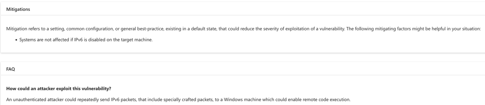</td>
</table></tr>
<table><tr>
<td>Quotes: <code>4</code></td>
<td>Replies: <code>5</code></td>
<td>Retweets: <code>33</code></td>
<td>Favorites: <code>134</code></td>
</tr></table>

---

# 0vercl0k
**https://twitter.com/0vercl0k/status/1823728483182501983 _at 2024-08-14, 14:28:48_**
<blockquote>
RT @mmolgtm: In this post I'll use CVE-2024-5830, a bug in object transitions in Chrome to gain RCE in the Chrome renderer sandbox: https:/…
</blockquote>

<table><tr>
<td>Quotes: <code>0</code></td>
<td>Replies: <code>0</code></td>
<td>Retweets: <code>78</code></td>
<td>Favorites: <code>0</code></td>
</tr></table>

---

# cibernicola_es
**https://twitter.com/cibernicola_es/status/1823709283953074517 _at 2024-08-14, 13:12:30_**
<blockquote>
CVE-2024-38063, puntuación de 9.8
Windows TCP/IP Remote Code Execution Vulnerability 
Impact: Remote Code Execution Max Severity: Critical
Systems are not affected if IPv6 is disabled on the target machine.
👇ñapa mitigadora, desactivar IPv6
https://t.co/Qq8BE4QwlX https://t.co/OLEyfBkVdW
</blockquote>

* https://msrc.microsoft.com/update-guide/vulnerability/CVE-2024-38063

<table><tr>
<td>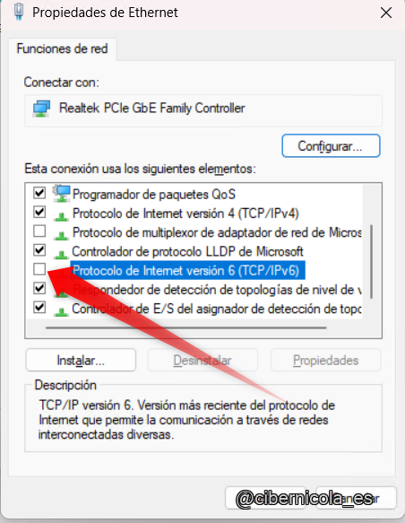</td>
</table></tr>
<table><tr>
<td>Quotes: <code>7</code></td>
<td>Replies: <code>4</code></td>
<td>Retweets: <code>117</code></td>
<td>Favorites: <code>254</code></td>
</tr></table>

---

# Gi7w0rm
**https://twitter.com/Gi7w0rm/status/1823699406912413765 _at 2024-08-14, 12:33:15_**
<blockquote>
⚠️Please take a moment to look at #CVE-2024-38036. An unauthenticated remote code execution in the Windows #TCPIP stack. Seems to be a buffer related problem handling IPv6 packets.
Affecting Win10, Win11, Server 2008 - 2022.
No details yet, but likely bad!
https://t.co/fJkEC7u4Fh
</blockquote>

* https://msrc.microsoft.com/update-guide/vulnerability/CVE-2024-38063

<table><tr>
<td>Quotes: <code>1</code></td>
<td>Replies: <code>8</code></td>
<td>Retweets: <code>43</code></td>
<td>Favorites: <code>105</code></td>
</tr></table>

---

# t31m0
**https://twitter.com/t31m0/status/1823690332132802667 _at 2024-08-14, 11:57:12_**
<blockquote>
Windows TCP/IP Remote Code Execution Vulnerability 
CVE-2024-38063 "se vienen problemas ..."
[simplemente mandando un paquete en IPV6 te permite ejecutar codigo remoto en una maquina windows]
https://t.co/elIgb5UbG1
</blockquote>

* https://msrc.microsoft.com/update-guide/vulnerability/CVE-2024-38063

<table><tr>
<td>Quotes: <code>8</code></td>
<td>Replies: <code>0</code></td>
<td>Retweets: <code>28</code></td>
<td>Favorites: <code>71</code></td>
</tr></table>

---

# circl_lu
**https://twitter.com/circl_lu/status/1823671723469799723 _at 2024-08-14, 10:43:15_**
<blockquote>
Windows TCP/IP Remote Code Execution Vulnerability when IPv6 is enabled

🔗  https://t.co/9mxFu2AcJE

#vulnerability #windows #infosec 

CVE-2024-38063
</blockquote>

* https://vulnerability.circl.lu/vuln/CVE-2024-38063

<table><tr>
<td>Quotes: <code>4</code></td>
<td>Replies: <code>0</code></td>
<td>Retweets: <code>33</code></td>
<td>Favorites: <code>58</code></td>
</tr></table>

---

# Dinosn
**https://twitter.com/Dinosn/status/1823559514018156568 _at 2024-08-14, 03:17:22_**
<blockquote>
CVE-2024-38063 (CVSS 9.8): 0-Click RCE Affects All Windows Systems https://t.co/8xBL9qMiFM
</blockquote>

* https://securityonline.info/cve-2024-38063-cvss-9-8-0-click-rce-affects-all-windows-systems/

<table><tr>
<td>Quotes: <code>13</code></td>
<td>Replies: <code>1</code></td>
<td>Retweets: <code>148</code></td>
<td>Favorites: <code>347</code></td>
</tr></table>

---

# KyleHanslovan
**https://twitter.com/KyleHanslovan/status/1823519875358187822 _at 2024-08-14, 00:39:52_**
<blockquote>
Anyone else side-eyeing  CVE-2024-38063 patched today? 👀  Unauthenticated RCE w/SYSTEM privs 😒. Microsoft assessed this sucker with Max criticality &amp; Low attack complexity. https://t.co/vACoXeJ98w
</blockquote>

<table><tr>
<td>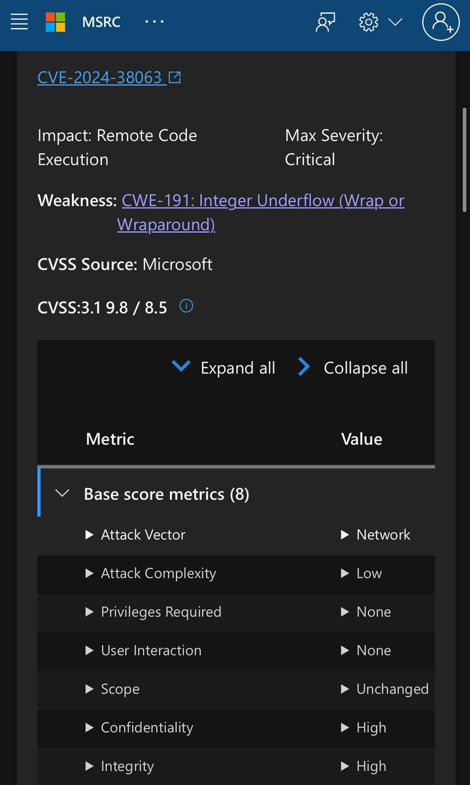</td>
</table></tr>
<table><tr>
<td>Quotes: <code>9</code></td>
<td>Replies: <code>9</code></td>
<td>Retweets: <code>55</code></td>
<td>Favorites: <code>236</code></td>
</tr></table>

---

# NikitaTarakanov
**https://twitter.com/NikitaTarakanov/status/1823481987014791309 _at 2024-08-13, 22:09:19_**
<blockquote>
In-the-wild recent kernel LPE 0day in ntoskrnl (CVE-2024-38106) is Race Condition in NtQueryInfromationJobObject and NtSetInfromationJobObject. Probably its even Chrome sandbox escape
</blockquote>

<table><tr>
<td>Quotes: <code>1</code></td>
<td>Replies: <code>1</code></td>
<td>Retweets: <code>22</code></td>
<td>Favorites: <code>99</code></td>
</tr></table>

---

# bienpnn
**https://twitter.com/bienpnn/status/1823435680707760221 _at 2024-08-13, 19:05:18_**
<blockquote>
My Windows LPE bug at TyphoonPwn has been fixed, though I don't know why it is credited as Anonymous here.
CVE-2024-38196 https://t.co/wuqBj8IIhO
</blockquote>

<table><tr>
<td>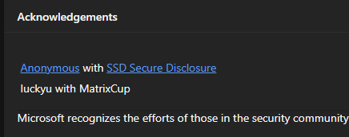</td>
</table></tr>
<table><tr>
<td>Quotes: <code>0</code></td>
<td>Replies: <code>2</code></td>
<td>Retweets: <code>5</code></td>
<td>Favorites: <code>75</code></td>
</tr></table>

---

# GHSecurityLab
**https://twitter.com/GHSecurityLab/status/1823381239656567155 _at 2024-08-13, 15:28:58_**
<blockquote>
Read on to discover how @mmolgtm exploits CVE-2024-5830, a type confusion in Chrome that allows remote code execution (RCE) in the renderer sandbox of Chrome by a single visit to a malicious site. https://t.co/kdEOShMh0J
</blockquote>

* https://github.blog/security/vulnerability-research/from-object-transition-to-rce-in-the-chrome-renderer/

<table><tr>
<td>Quotes: <code>1</code></td>
<td>Replies: <code>0</code></td>
<td>Retweets: <code>9</code></td>
<td>Favorites: <code>41</code></td>
</tr></table>

---

# mmolgtm
**https://twitter.com/mmolgtm/status/1823379224406659134 _at 2024-08-13, 15:20:58_**
<blockquote>
In this post I'll use CVE-2024-5830, a bug in object transitions in Chrome to gain RCE in the Chrome renderer sandbox: https://t.co/HT4cLMMA1q
</blockquote>

* https://github.blog/security/vulnerability-research/from-object-transition-to-rce-in-the-chrome-renderer/

<table><tr>
<td>Quotes: <code>3</code></td>
<td>Replies: <code>2</code></td>
<td>Retweets: <code>73</code></td>
<td>Favorites: <code>231</code></td>
</tr></table>

---

# ripstech
**https://twitter.com/ripstech/status/1823376673577840877 _at 2024-08-13, 15:10:50_**
<blockquote>
Firefly III CVE-2024-22075: When Bypassing Built-in Sanitization Might Backfire.

Check out our latest blog post to see how a Client-Side Path Traversal (CSPT) vulnerability can be used to control data that was assumed to be uncontrollable:

https://t.co/gL7QYdDCqU https://t.co/Db22eEWgNV
</blockquote>

* https://www.sonarsource.com/blog/front-end-frameworks-when-bypassing-built-in-sanitization-might-backfire/?utm_medium=social&utm_source=twitter&utm_campaign=research&utm_content=blog-front-end-frameworks-when-bypassing-built-in-sanitization-might-backfire-240812-&utm_term=&s_category=Organic&s_source=Social%20Media&s_origin=twitter

<table><tr>
<td></td>
</table></tr>
<table><tr>
<td>Quotes: <code>1</code></td>
<td>Replies: <code>0</code></td>
<td>Retweets: <code>24</code></td>
<td>Favorites: <code>97</code></td>
</tr></table>

---

# CyberWarship
**https://twitter.com/CyberWarship/status/1823353818370719965 _at 2024-08-13, 13:40:01_**
<blockquote>
''From Limited file read to full access on Jenkins (CVE-2024-23897)''

#infosec #pentest #redteam #blueteam
https://t.co/b8i8jd4eNM
</blockquote>

* https://xphantom.nl/posts/crypto-attack-jenkins/

<table><tr>
<td>Quotes: <code>0</code></td>
<td>Replies: <code>0</code></td>
<td>Retweets: <code>39</code></td>
<td>Favorites: <code>102</code></td>
</tr></table>

---

# HunterMapping
**https://twitter.com/HunterMapping/status/1823246652238434376 _at 2024-08-13, 06:34:10_**
<blockquote>
🚨Alert🚨CVE-2024-22116 (CVSS 9.9): Critical RCE Vulnerability Found in Zabbix Monitoring Solution
🤖An administrator with restricted permissions can exploit the lack of default escaping for script parameters.
📊 138K+ Services are found on https://t.co/ysWb28BTvF nearly year. https://t.co/z1DzvJT0WM
</blockquote>

* http://hunter.how

<table><tr>
<td></td>
</table></tr>
<table><tr>
<td>Quotes: <code>0</code></td>
<td>Replies: <code>0</code></td>
<td>Retweets: <code>29</code></td>
<td>Favorites: <code>131</code></td>
</tr></table>

---

# censysio
**https://twitter.com/censysio/status/1823135176614146371 _at 2024-08-12, 23:11:12_**
<blockquote>
🚨 Microsoft has patched CVE-2024-38077, a critical RCE flaw in Windows Remote Desktop Licensing Service (CVSS 9.8). 79k instances exposed online. Apply patches immediately! #CVE #RCE #CensysRapidResponse https://t.co/1YUJ7CrrOK
</blockquote>

* https://censys.com/cve-2024-38077/

<table><tr>
<td>Quotes: <code>1</code></td>
<td>Replies: <code>0</code></td>
<td>Retweets: <code>12</code></td>
<td>Favorites: <code>34</code></td>
</tr></table>

---

# TheHackersNews
**https://twitter.com/TheHackersNews/status/1822940073559568875 _at 2024-08-12, 10:15:56_**
<blockquote>
A critical #vulnerability (CVE-2024-7589) in OpenSSH on FreeBSD could allow attackers to execute code remotely with root privileges.

Learn more: https://t.co/OBpbJiftuU

If you're using FreeBSD, update your systems immediately and restart sshd.

#Cybersecurity
</blockquote>

* https://thehackernews.com/2024/08/freebsd-releases-urgent-patch-for-high.html

<table><tr>
<td>Quotes: <code>13</code></td>
<td>Replies: <code>9</code></td>
<td>Retweets: <code>150</code></td>
<td>Favorites: <code>222</code></td>
</tr></table>

---

# CyberWarship
**https://twitter.com/CyberWarship/status/1822929520120226206 _at 2024-08-12, 09:34:00_**
<blockquote>
''Windows AppLocker Driver LPE Vulnerability - CVE-2024-21338 - Crowdfense''

#infosec #pentest #redteam #blueteam
https://t.co/DXQW9mBZY0
</blockquote>

* https://www.crowdfense.com/windows-applocker-driver-lpe-vulnerability-cve-2024-21338/

<table><tr>
<td>Quotes: <code>0</code></td>
<td>Replies: <code>0</code></td>
<td>Retweets: <code>17</code></td>
<td>Favorites: <code>34</code></td>
</tr></table>

---

# HunterMapping
**https://twitter.com/HunterMapping/status/1822928565526036757 _at 2024-08-12, 09:30:13_**
<blockquote>
🚨Alert🚨CVE-2022-31814: Exploiting pfsense Remote Code Execution
🔥PoC:https://t.co/fJVaHXjb48
🧐Deep Dive:https://t.co/Dh835xRkwV
📊 422K+ Services are found on https://t.co/ysWb28BTvF nearly year.
🔗Hunter Link:https://t.co/6CWfkiZZUv
👇Search Query https://t.co/vA3mWNZt3l
</blockquote>

* https://github.com/Laburity/CVE-2022-31814
* https://laburity.com/exploiting-pfsense-remote-code-execution-cve-2022-31814/
* http://hunter.how
* https://hunter.how/list?searchValue=product.name%3D%22pfsense%22

<table><tr>
<td>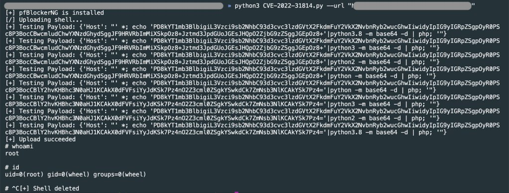</td>
</table></tr>
<table><tr>
<td>Quotes: <code>3</code></td>
<td>Replies: <code>1</code></td>
<td>Retweets: <code>78</code></td>
<td>Favorites: <code>253</code></td>
</tr></table>

---

# h4x0r_dz
**https://twitter.com/h4x0r_dz/status/1822314346422116466 _at 2024-08-10, 16:49:31_**
<blockquote>
CVE-2024-42005 Django SQL injection vulnerability in QuerySet.values() and values_list() methods 
https://t.co/TV1vntN4Lm
</blockquote>

* https://github.com/advisories/GHSA-pv4p-cwwg-4rph

<table><tr>
<td>Quotes: <code>0</code></td>
<td>Replies: <code>2</code></td>
<td>Retweets: <code>39</code></td>
<td>Favorites: <code>156</code></td>
</tr></table>

---

# 0xor0ne
**https://twitter.com/0xor0ne/status/1822294362551635981 _at 2024-08-10, 15:30:07_**
<blockquote>
Achieving arbitrary read/write in through a UAF vulnerability in Linux kernel nf_tables (CVE-2022-2586)

https://t.co/EAipCIRDDq

#Linux #infosec https://t.co/eQDVj9pPHl
</blockquote>

* https://jmpeax.dev/CVE-2022-2586-writeup.html

<table><tr>
<td>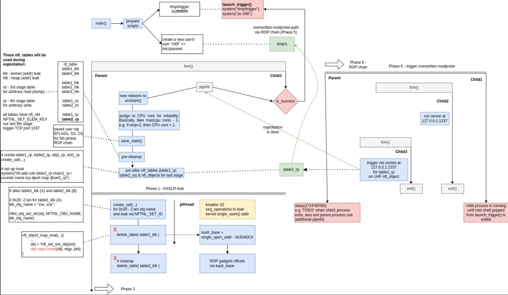</td>
</table></tr>
<table><tr>
<td>Quotes: <code>0</code></td>
<td>Replies: <code>0</code></td>
<td>Retweets: <code>50</code></td>
<td>Favorites: <code>221</code></td>
</tr></table>

---

# ptracesecurity
**https://twitter.com/ptracesecurity/status/1822271825885196589 _at 2024-08-10, 14:00:34_**
<blockquote>
Exploitable PoC Released for CVE-2024-38077: 0-Click RCE Threatens All Windows Servers https://t.co/Cl8PRRJi2s  #Pentesting #CyberSecurity #Infosec https://t.co/ax8z3DB08f
</blockquote>

* https://securityonline.info/exploitable-poc-released-for-cve-2024-38077-0-click-rce-threatens-all-windows-servers/#google_vignette

<table><tr>
<td>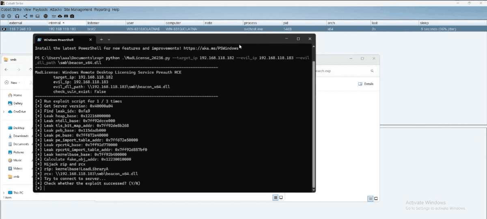</td>
</table></tr>
<table><tr>
<td>Quotes: <code>2</code></td>
<td>Replies: <code>0</code></td>
<td>Retweets: <code>37</code></td>
<td>Favorites: <code>102</code></td>
</tr></table>

---

# jedisct1
**https://twitter.com/jedisct1/status/1822190374879739952 _at 2024-08-10, 08:36:54_**
<blockquote>
RT @the_yellow_fall: Exploitable PoC Released for CVE-2024-38077: 0-Click RCE Threatens All Windows Servers

Researchers have successfully…
</blockquote>

<table><tr>
<td>Quotes: <code>0</code></td>
<td>Replies: <code>0</code></td>
<td>Retweets: <code>44</code></td>
<td>Favorites: <code>0</code></td>
</tr></table>

---

# cyber_advising
**https://twitter.com/cyber_advising/status/1822121098927800628 _at 2024-08-10, 04:01:38_**
<blockquote>
CVE-2024-38077: Windows Remote Desktop Licensing Service Remote Code Execution Vulnerability

PoC
https://t.co/gXC88Lra8Z
</blockquote>

* https://github.com/CloudCrowSec001/CVE-2024-38077-POC

<table><tr>
<td>Quotes: <code>1</code></td>
<td>Replies: <code>1</code></td>
<td>Retweets: <code>73</code></td>
<td>Favorites: <code>209</code></td>
</tr></table>

---

# ptracesecurity
**https://twitter.com/ptracesecurity/status/1822060340005196278 _at 2024-08-10, 00:00:11_**
<blockquote>
Exploiting pfsense Remote Code Execution – CVE-2022-31814 https://t.co/OxPJ0MGLi5  #Pentesting #Exploit #CyberSecurity #Infosec https://t.co/sVs7ZRYMxL
</blockquote>

* https://laburity.com/exploiting-pfsense-remote-code-execution-cve-2022-31814/

<table><tr>
<td></td>
<td></td>
</table></tr>
<table><tr>
<td>Quotes: <code>1</code></td>
<td>Replies: <code>1</code></td>
<td>Retweets: <code>17</code></td>
<td>Favorites: <code>52</code></td>
</tr></table>

---

# momika233
**https://twitter.com/momika233/status/1821921580383137907 _at 2024-08-09, 14:48:49_**
<blockquote>
https://t.co/IBmOBCv1Xs
CVE-2024-38077-EXP
</blockquote>

* https://github.com/CloudCrowSec001/CVE-2024-38077-POC

<table><tr>
<td>Quotes: <code>0</code></td>
<td>Replies: <code>0</code></td>
<td>Retweets: <code>19</code></td>
<td>Favorites: <code>104</code></td>
</tr></table>

---

# win3zz
**https://twitter.com/win3zz/status/1821831786906923350 _at 2024-08-09, 08:52:00_**
<blockquote>
CVE-2024-38077 - MadLicense: 0-Click RCE Vulnerability

Mitigation: Update Windows Server systems immediately.

Details: 
https://t.co/XihHDQYMk9

https://t.co/dSBT9LfOcB

PoC1: https://t.co/l886SBWUvW

PoC2: https://t.co/TE8IutgLwd

PoC authenticity unconfirmed.
</blockquote>

* https://github.com/CloudCrowSec001/CVE-2024-38077-POC/blob/main/CVE-2024-38077.md
* https://securityonline.info/exploitable-poc-released-for-cve-2024-38077-0-click-rce-threatens-all-windows-servers/
* https://github.com/CloudCrowSec001/CVE-2024-38077-POC
* https://github.com/qi4L/CVE-2024-38077

<table><tr>
<td>Quotes: <code>0</code></td>
<td>Replies: <code>0</code></td>
<td>Retweets: <code>36</code></td>
<td>Favorites: <code>124</code></td>
</tr></table>

---

# Dinosn
**https://twitter.com/Dinosn/status/1821738206670340379 _at 2024-08-09, 02:40:09_**
<blockquote>
Exploitable PoC Released for CVE-2024-38077: 0-Click RCE Threatens All Windows Servers https://t.co/PrjlyH8QEn
</blockquote>

* https://securityonline.info/exploitable-poc-released-for-cve-2024-38077-0-click-rce-threatens-all-windows-servers/

<table><tr>
<td>Quotes: <code>9</code></td>
<td>Replies: <code>14</code></td>
<td>Retweets: <code>143</code></td>
<td>Favorites: <code>399</code></td>
</tr></table>

---

# the_yellow_fall
**https://twitter.com/the_yellow_fall/status/1821733425067561425 _at 2024-08-09, 02:21:09_**
<blockquote>
Exploitable PoC Released for CVE-2024-38077: 0-Click RCE Threatens All Windows Servers

Researchers have successfully demonstrated a proof-of-concept (POC) exploit on Windows Server 2025, achieving a near 100% success rate
https://t.co/trGH9Y2z5D
</blockquote>

* https://securityonline.info/exploitable-poc-released-for-cve-2024-38077-0-click-rce-threatens-all-windows-servers/

<table><tr>
<td>Quotes: <code>1</code></td>
<td>Replies: <code>1</code></td>
<td>Retweets: <code>43</code></td>
<td>Favorites: <code>146</code></td>
</tr></table>

---

# chompie1337
**https://twitter.com/chompie1337/status/1821551172081406138 _at 2024-08-08, 14:16:56_**
<blockquote>
RT @thatjiaozi: *ahem* I interrupt your feeds to bring you a blog post about CVE-2023-2163

Here we detail how we found, RCA and develop an…
</blockquote>

<table><tr>
<td>Quotes: <code>0</code></td>
<td>Replies: <code>0</code></td>
<td>Retweets: <code>36</code></td>
<td>Favorites: <code>0</code></td>
</tr></table>

---

# TheHackersNews
**https://twitter.com/TheHackersNews/status/1821415068426190865 _at 2024-08-08, 05:16:07_**
<blockquote>
A critical security flaw in Progress Software's WhatsUp Gold is under active exploitation.

This #vulnerability (CVE-2024-4885) allows unauthenticated RCE, posing a severe threat to network security.

Read: https://t.co/sEqIDAdKWd

#cybersecurity
</blockquote>

* https://thehackernews.com/2024/08/critical-security-flaw-in-whatsup-gold.html

<table><tr>
<td>Quotes: <code>0</code></td>
<td>Replies: <code>2</code></td>
<td>Retweets: <code>19</code></td>
<td>Favorites: <code>45</code></td>
</tr></table>

---

# Dinosn
**https://twitter.com/Dinosn/status/1821385997625823536 _at 2024-08-08, 03:20:36_**
<blockquote>
CVE-2024-21302, CVE-2024-38202: Zero-Day Vulnerabilities Expose Windows Systems to “Unpatching” Attacks https://t.co/u3YGGGe7mh
</blockquote>

* https://securityonline.info/cve-2024-21302-cve-2024-38202-zero-day-vulnerabilities-expose-windows-systems-to-unpatching-attacks/

<table><tr>
<td>Quotes: <code>1</code></td>
<td>Replies: <code>1</code></td>
<td>Retweets: <code>26</code></td>
<td>Favorites: <code>63</code></td>
</tr></table>

---

# HunterMapping
**https://twitter.com/HunterMapping/status/1821371601553588552 _at 2024-08-08, 02:23:23_**
<blockquote>
🚨Alert🚨CVE-2024-43044/43045: Critical Jenkins Vulnerability Exposes Servers to RCE Attacks
📊360K+ Services are found on https://t.co/ysWb28BTvF nearly year.
🔗Hunter Link:https://t.co/oI9MCc8udL
👇Search Query
HUNTER:/product.name="Jenkins"
SHODAN: product:"Jenkins"
FOFA: https://t.co/0Vl4R1QsfB
</blockquote>

* http://hunter.how
* https://hunter.how/list?searchValue=product.name%3D%22Jenkins%22

<table><tr>
<td></td>
</table></tr>
<table><tr>
<td>Quotes: <code>2</code></td>
<td>Replies: <code>4</code></td>
<td>Retweets: <code>99</code></td>
<td>Favorites: <code>345</code></td>
</tr></table>

---

# piedpiper1616
**https://twitter.com/piedpiper1616/status/1820780422500151323 _at 2024-08-06, 11:14:15_**
<blockquote>
RT @Fr0st1706: My exploit code for CVE-2024-38054, a pretty interesting pool overflow bug in the ksthunk.sys driver: https://t.co/cvZYPSJpPT
</blockquote>

* https://github.com/Black-Frost/windows-learning/tree/main/CVE-2024-38054

<table><tr>
<td>Quotes: <code>0</code></td>
<td>Replies: <code>0</code></td>
<td>Retweets: <code>65</code></td>
<td>Favorites: <code>0</code></td>
</tr></table>

---

# TheHackersNews
**https://twitter.com/TheHackersNews/status/1820705012143579593 _at 2024-08-06, 06:14:36_**
<blockquote>
Google has patched a new #Android kernel vulnerability, CVE-2024-36971, that allows RCE.

It has been actively exploited by commercial #spyware vendors in targeted attacks, posing a severe risk to Android users.

Read: https://t.co/5xjfANga89

#CyberSecurity
</blockquote>

* https://thehackernews.com/2024/08/google-patches-new-android-kernel.html

<table><tr>
<td>Quotes: <code>1</code></td>
<td>Replies: <code>2</code></td>
<td>Retweets: <code>37</code></td>
<td>Favorites: <code>59</code></td>
</tr></table>

---

# TheHackersNews
**https://twitter.com/TheHackersNews/status/1820675640778985572 _at 2024-08-06, 04:17:53_**
<blockquote>
A zero-day #vulnerability in the Apache OFBiz ERP system, CVE-2024-38856, has been disclosed, allowing RCE attacks.

Read: https://t.co/P9rWB0JiSm

With a critical CVSS score of 9.8, it poses a severe risk to businesses using this software.

Share this to raise awareness!
</blockquote>

* https://thehackernews.com/2024/08/new-zero-day-flaw-in-apache-ofbiz-erp.html

<table><tr>
<td>Quotes: <code>1</code></td>
<td>Replies: <code>0</code></td>
<td>Retweets: <code>30</code></td>
<td>Favorites: <code>80</code></td>
</tr></table>

---

# ripstech
**https://twitter.com/ripstech/status/1820480654791864573 _at 2024-08-05, 15:23:05_**
<blockquote>
Critical XSS in Roundcube webmail⚠

A victim only has to view a malicious email. As reported by @ESETresearch, APTs have exploited similar vulns in the past to steal government emails.

Our announcement:
https://t.co/fOa2l0ujwV

(CVE-2024-42008, CVE-2024-42009, CVE-2024-42010)
</blockquote>

* https://sonarsource.com/blog/government-emails-at-risk-critical-cross-site-scripting-vulnerability-in-roundcube-webmail?utm_medium=social&utm_source=twitter&utm_campaign=research&utm_content=blog-government-emails-at-risk-critical-cross-site-scripting-vulnerability-in-roundcube-webmail-240805-&utm_term=&s_category=Organic&s_source=Social%20Media&s_origin=twitter

<table><tr>
<td>Quotes: <code>1</code></td>
<td>Replies: <code>0</code></td>
<td>Retweets: <code>24</code></td>
<td>Favorites: <code>100</code></td>
</tr></table>

---

# TheHackersNews
**https://twitter.com/TheHackersNews/status/1820342540995854683 _at 2024-08-05, 06:14:16_**
<blockquote>
A high-severity #vulnerability (CVE-2024-6242) has been found in Rockwell Automation ControlLogix 1756 devices.

Exploiting this #vulnerability could lead to unauthorized CIP commands, affecting device configurations and user projects.

Read: https://t.co/ivNsB06oh7

#infosec
</blockquote>

* https://thehackernews.com/2024/08/critical-flaw-in-rockwell-automation.html

<table><tr>
<td>Quotes: <code>2</code></td>
<td>Replies: <code>2</code></td>
<td>Retweets: <code>48</code></td>
<td>Favorites: <code>110</code></td>
</tr></table>

---

# Dinosn
**https://twitter.com/Dinosn/status/1820294925981831547 _at 2024-08-05, 03:05:04_**
<blockquote>
CVE-2024-38100: Leaked Wallpaper Exploit Exposes Windows Users to Privilege Escalation Attacks https://t.co/z5WlVcwljX
</blockquote>

* https://securityonline.info/cve-2024-38100-leaked-wallpaper-exploit-exposes-windows-users-to-privilege-escalation-attacks/

<table><tr>
<td>Quotes: <code>3</code></td>
<td>Replies: <code>5</code></td>
<td>Retweets: <code>168</code></td>
<td>Favorites: <code>502</code></td>
</tr></table>

---

# binitamshah
**https://twitter.com/binitamshah/status/1819385235244831193 _at 2024-08-02, 14:50:17_**
<blockquote>
Windows AppLocker Driver LPE Vulnerability – CVE-2024-21338 : https://t.co/iLvgJRKkOd 

PoC : 1 – Abusing PreviousMode : https://t.co/juyoIT9K87
</blockquote>

* https://www.crowdfense.com/windows-applocker-driver-lpe-vulnerability-cve-2024-21338/

<table><tr>
<td>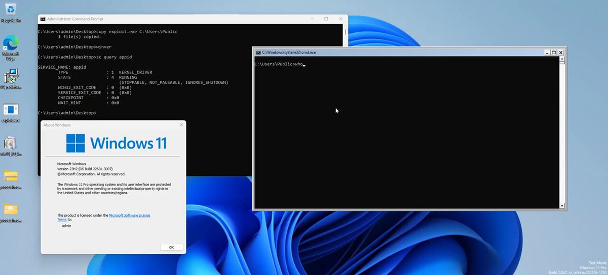</td>
</table></tr>
<table><tr>
<td>Quotes: <code>0</code></td>
<td>Replies: <code>3</code></td>
<td>Retweets: <code>64</code></td>
<td>Favorites: <code>251</code></td>
</tr></table>

---

# ptracesecurity
**https://twitter.com/ptracesecurity/status/1819338635050619181 _at 2024-08-02, 11:45:06_**
<blockquote>
Windows AppLocker Driver LPE Vulnerability – CVE-2024-21338 https://t.co/KZ7zigiyZp  #Pentesting #Windows #AppLocker #Vulnerability  #CyberSecurity #Infosec https://t.co/DMLYNuY2ff
</blockquote>

* https://www.crowdfense.com/windows-applocker-driver-lpe-vulnerability-cve-2024-21338/

<table><tr>
<td></td>
<td>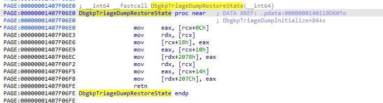</td>
<td>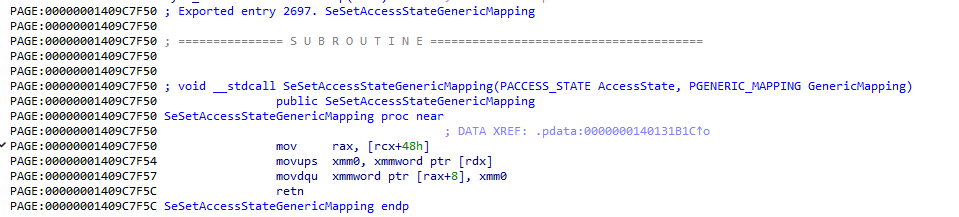</td>
<td>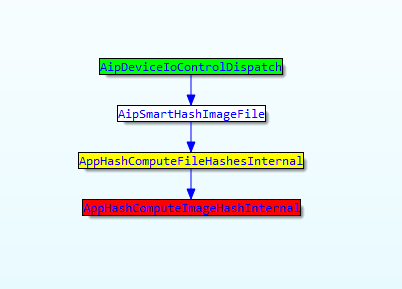</td>
</table></tr>
<table><tr>
<td>Quotes: <code>0</code></td>
<td>Replies: <code>0</code></td>
<td>Retweets: <code>23</code></td>
<td>Favorites: <code>56</code></td>
</tr></table>

---

# crowdfense
**https://twitter.com/crowdfense/status/1819040393352396932 _at 2024-08-01, 16:00:00_**
<blockquote>
We are proud to announce our very first technical blog post. An analysis of CVE-2024-21338, a Windows Kernel Elevation of Privileges vulnerability, its root cause, exploitation challenges and POC
https://t.co/cz0HxE2zuE
</blockquote>

* https://www.crowdfense.com/windows-applocker-driver-lpe-vulnerability-cve-2024-21338/

<table><tr>
<td>Quotes: <code>2</code></td>
<td>Replies: <code>0</code></td>
<td>Retweets: <code>54</code></td>
<td>Favorites: <code>156</code></td>
</tr></table>

---

# 0xor0ne
**https://twitter.com/0xor0ne/status/1819025297292874217 _at 2024-08-01, 15:00:01_**
<blockquote>
CVE-2022-24834: exploiting an integer overflow in Lua cjson module in Redis servers

https://t.co/QuZJiJRePF

Credits @NCCGroupInfosec

#infosec https://t.co/3Pin7hQb6e
</blockquote>

* https://research.nccgroup.com/2024/06/11/pumping-iron-on-the-musl-heap-real-world-cve-2022-24834-exploitation-on-an-alpine-mallocng-heap/

<table><tr>
<td>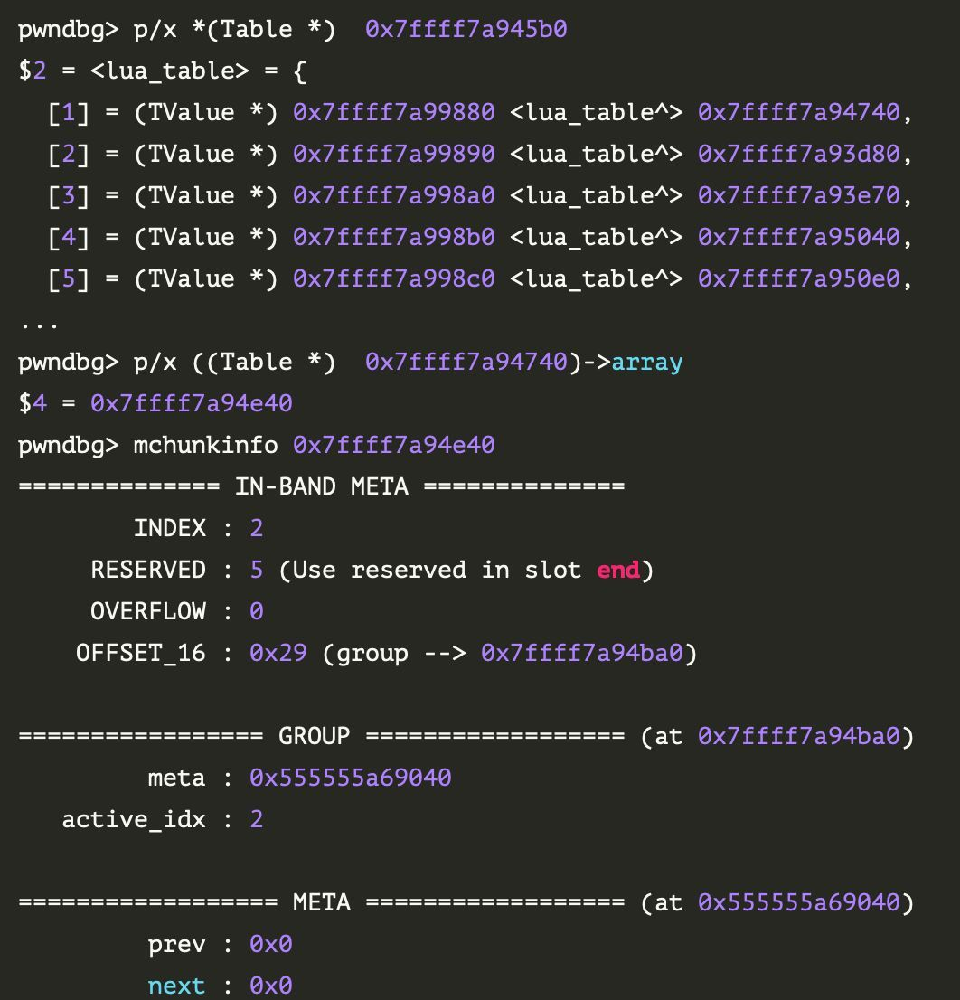</td>
</table></tr>
<table><tr>
<td>Quotes: <code>0</code></td>
<td>Replies: <code>3</code></td>
<td>Retweets: <code>55</code></td>
<td>Favorites: <code>215</code></td>
</tr></table>

---

# 0xor0ne
**https://twitter.com/0xor0ne/status/1818904544132174070 _at 2024-08-01, 07:00:11_**
<blockquote>
CVE-2024-31317: execute arbitrary code as any app on a device

https://t.co/gFFCgvdiMR

Technical blog post by Tom Hebb

#android #cybersecurity https://t.co/lwEcKr3vdT
</blockquote>

* https://rtx.meta.security/exploitation/2024/06/03/Android-Zygote-injection.html

<table><tr>
<td></td>
</table></tr>
<table><tr>
<td>Quotes: <code>1</code></td>
<td>Replies: <code>2</code></td>
<td>Retweets: <code>42</code></td>
<td>Favorites: <code>199</code></td>
</tr></table>

---

