# steventseeley
**https://twitter.com/steventseeley/status/1840799773030322379 _at 2024-09-30, 17:04:00_**
<blockquote>
RT @ptswarm: 🤠 A notorious RCE in Zimbra, CVE-2024-45519 – here’s our expert breakdown ⬇️ https://t.co/Otwg0k1hmc
</blockquote>

<table><tr>
<td></td>
</table></tr>
<table><tr>
<td>Quotes: <code>0</code></td>
<td>Replies: <code>0</code></td>
<td>Retweets: <code>74</code></td>
<td>Favorites: <code>0</code></td>
</tr></table>

---

# GreyNoiseIO
**https://twitter.com/GreyNoiseIO/status/1840793010851733910 _at 2024-09-30, 16:37:08_**
<blockquote>
🚨 Our honeypots are buzzing! We’ve tracked exploit attempts targeting SolarWinds Serv-U (CVE-2024-28995) in real time, revealing exactly what files attackers are after. Check out our latest Labs blog for all the details! 🔍 https://t.co/end5o4cSQf
</blockquote>

* https://www.greynoise.io/blog/what-are-hackers-searching-for-in-solarwinds-serv-u-cve-2024-28995

<table><tr>
<td>Quotes: <code>0</code></td>
<td>Replies: <code>1</code></td>
<td>Retweets: <code>13</code></td>
<td>Favorites: <code>35</code></td>
</tr></table>

---

# cyb3rops
**https://twitter.com/cyb3rops/status/1840790005905580245 _at 2024-09-30, 16:25:12_**
<blockquote>
RT @ptswarm: 🤠 A notorious RCE in Zimbra, CVE-2024-45519 – here’s our expert breakdown ⬇️ https://t.co/Otwg0k1hmc
</blockquote>

<table><tr>
<td></td>
</table></tr>
<table><tr>
<td>Quotes: <code>0</code></td>
<td>Replies: <code>0</code></td>
<td>Retweets: <code>68</code></td>
<td>Favorites: <code>0</code></td>
</tr></table>

---

# kmkz_security
**https://twitter.com/kmkz_security/status/1840785925996986799 _at 2024-09-30, 16:08:59_**
<blockquote>
RT @ptswarm: 🤠 A notorious RCE in Zimbra, CVE-2024-45519 – here’s our expert breakdown ⬇️ https://t.co/Otwg0k1hmc
</blockquote>

<table><tr>
<td></td>
</table></tr>
<table><tr>
<td>Quotes: <code>0</code></td>
<td>Replies: <code>0</code></td>
<td>Retweets: <code>75</code></td>
<td>Favorites: <code>0</code></td>
</tr></table>

---

# 0xor0ne
**https://twitter.com/0xor0ne/status/1840768810963407275 _at 2024-09-30, 15:00:59_**
<blockquote>
Exploitation of a type confusion vulnerability in v8 (Chrome, CVE-2024-5830)

https://t.co/d0ZT5O8vHK

Credits @mmolgtm

#infosec #chrome https://t.co/zzF0IrE3i0
</blockquote>

* https://github.blog/security/vulnerability-research/from-object-transition-to-rce-in-the-chrome-renderer/

<table><tr>
<td>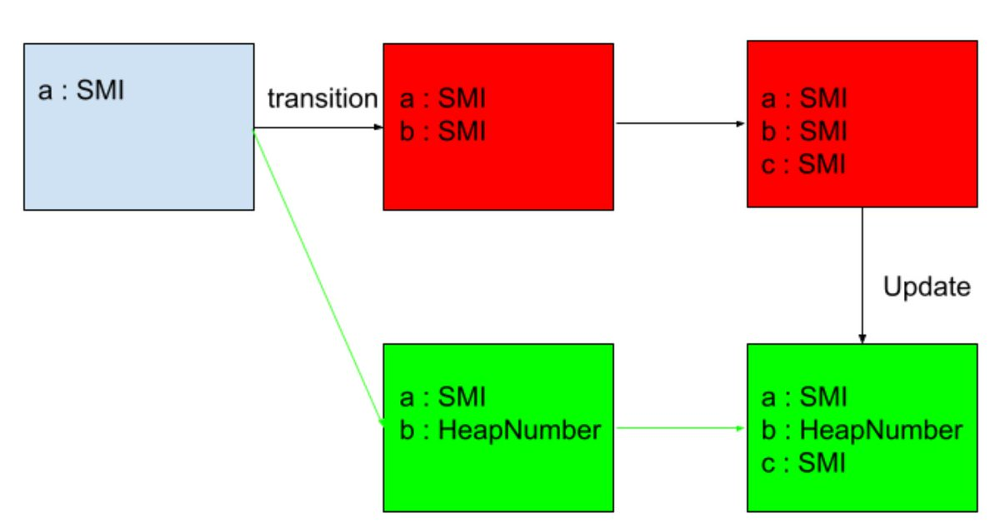</td>
<td>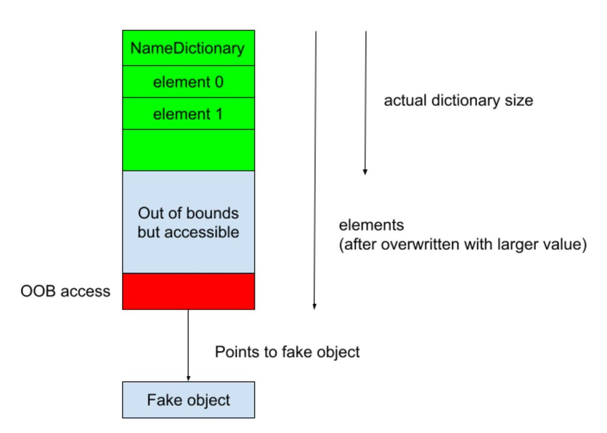</td>
</table></tr>
<table><tr>
<td>Quotes: <code>0</code></td>
<td>Replies: <code>2</code></td>
<td>Retweets: <code>38</code></td>
<td>Favorites: <code>154</code></td>
</tr></table>

---

# ptswarm
**https://twitter.com/ptswarm/status/1840757917596717360 _at 2024-09-30, 14:17:41_**
<blockquote>
🤠 A notorious RCE in Zimbra, CVE-2024-45519 – here’s our expert breakdown ⬇️ https://t.co/Otwg0k1hmc
</blockquote>

<table><tr>
<td>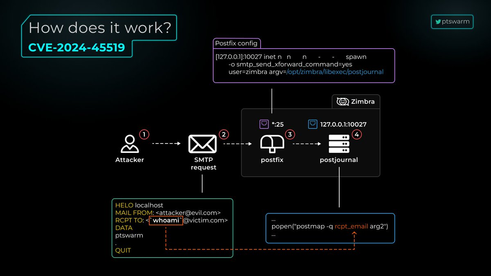</td>
</table></tr>
<table><tr>
<td>Quotes: <code>2</code></td>
<td>Replies: <code>5</code></td>
<td>Retweets: <code>77</code></td>
<td>Favorites: <code>213</code></td>
</tr></table>

---

# Netlas_io
**https://twitter.com/Netlas_io/status/1840664346818494971 _at 2024-09-30, 08:05:52_**
<blockquote>
CVE-2024-8353: RCE in WordPress GiveWP Plugin, 10.0 rating 🔥🔥🔥

With fresh vulnerability, an attacker can inject malicious PHP code into the system.

Search at https://t.co/hv7QKSqxTR:
👉 Link: https://t.co/v5ECucdLSU

#cybersecurity #vulnerability_map https://t.co/I5mThop61a
</blockquote>

* http://Netlas.io
* https://nt.ls/tpSXM

<table><tr>
<td></td>
</table></tr>
<table><tr>
<td>Quotes: <code>0</code></td>
<td>Replies: <code>0</code></td>
<td>Retweets: <code>19</code></td>
<td>Favorites: <code>50</code></td>
</tr></table>

---

# cfreal_
**https://twitter.com/cfreal_/status/1840658547287208319 _at 2024-09-30, 07:42:50_**
<blockquote>
Blind file read to RCE in PHP - without access to files, we need to build reliable arbitrary read primitive from the ISO-2022-CN-EXT overflow (CVE-2024-2961) #CNEXT https://t.co/XOiXdF9Nff
</blockquote>

<table><tr>
<td></td>
</table></tr>
<table><tr>
<td>Quotes: <code>1</code></td>
<td>Replies: <code>1</code></td>
<td>Retweets: <code>71</code></td>
<td>Favorites: <code>242</code></td>
</tr></table>

---

# YanZiShuang
**https://twitter.com/YanZiShuang/status/1840308559453782108 _at 2024-09-29, 08:32:06_**
<blockquote>
CVE-2024-38107 EOP
ALPC CallBack Race UAF
The vulnerability was confirmed by Microsoft to be exploited in the wild https://t.co/CO96vsYoAv
</blockquote>

<table><tr>
<td>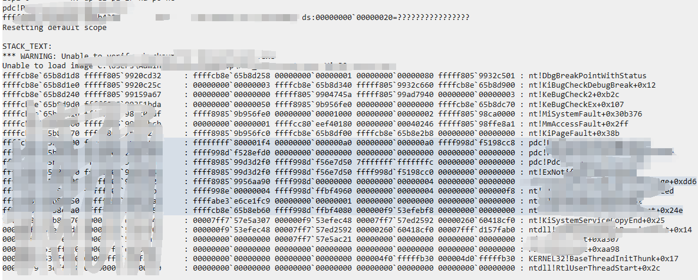</td>
<td>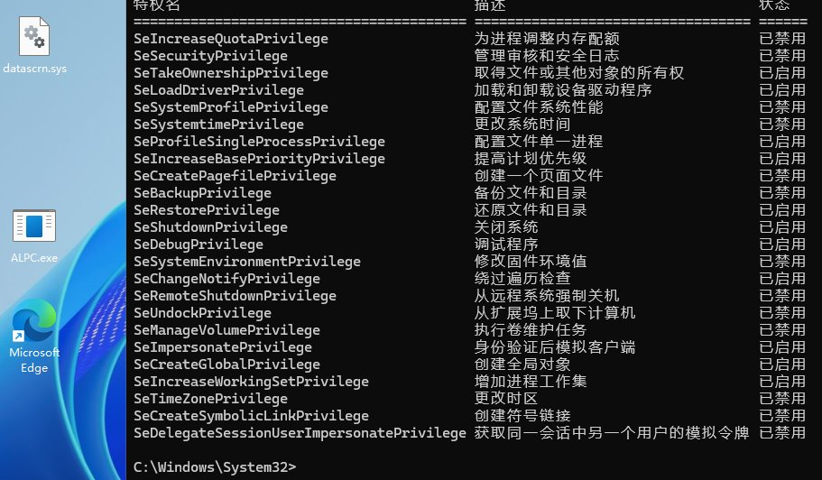</td>
</table></tr>
<table><tr>
<td>Quotes: <code>0</code></td>
<td>Replies: <code>4</code></td>
<td>Retweets: <code>38</code></td>
<td>Favorites: <code>244</code></td>
</tr></table>

---

# pdnuclei
**https://twitter.com/pdnuclei/status/1840195177098453308 _at 2024-09-29, 01:01:34_**
<blockquote>
Scan for CVE-2024-47176 (CUPS - Remote Code Execution) with Nuclei

Vulnerability discovery and analysis by @evilsocket: https://t.co/dA3I9v6lYq

Nuclei Template: https://t.co/lSprZ47Zzg

#hackwithautomation #cybersecurity #bugbounty https://t.co/k9VJsx3mq2
</blockquote>

* https://www.evilsocket.net/2024/09/26/Attacking-UNIX-systems-via-CUPS-Part-I/
* https://cloud.projectdiscovery.io/?template=CVE-2024-47176

<table><tr>
<td>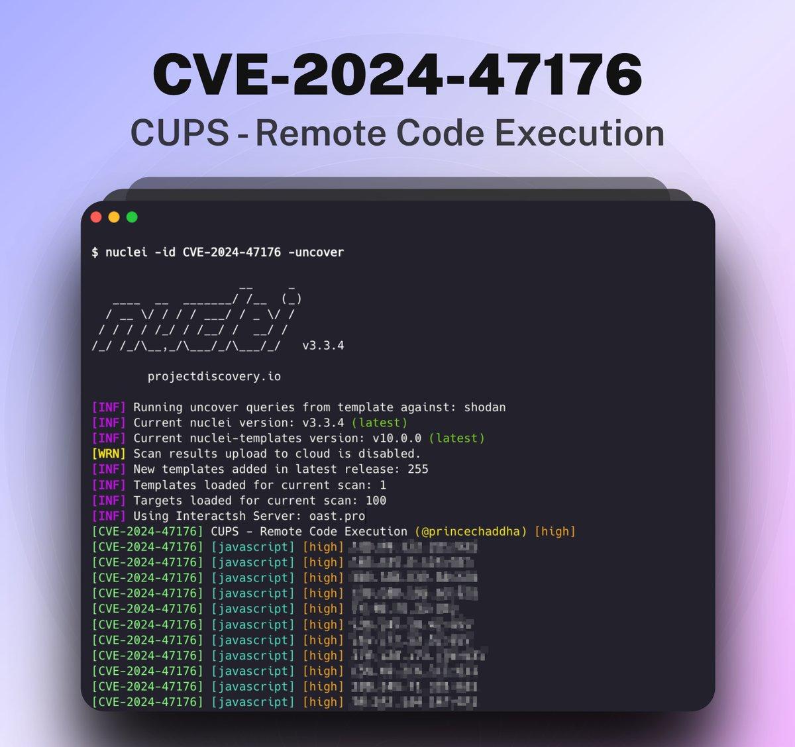</td>
</table></tr>
<table><tr>
<td>Quotes: <code>4</code></td>
<td>Replies: <code>1</code></td>
<td>Retweets: <code>117</code></td>
<td>Favorites: <code>568</code></td>
</tr></table>

---

# ptracesecurity
**https://twitter.com/ptracesecurity/status/1839876457264284147 _at 2024-09-28, 03:55:05_**
<blockquote>
Activation cache poisoning to elevate from medium to high integrity (CVE-2024-6769) https://t.co/cNinpMsf1F  #Pentesting #CyberSecurity #Infosec https://t.co/HpjhHcnlwv
</blockquote>

* https://github.com/fortra/CVE-2024-6769

<table><tr>
<td></td>
<td></td>
<td></td>
<td></td>
</table></tr>
<table><tr>
<td>Quotes: <code>0</code></td>
<td>Replies: <code>0</code></td>
<td>Retweets: <code>9</code></td>
<td>Favorites: <code>32</code></td>
</tr></table>

---

# Dinosn
**https://twitter.com/Dinosn/status/1839872956408738179 _at 2024-09-28, 03:41:10_**
<blockquote>
CVE-2024-38200 - Microsoft Office NTLMv2 Disclosure Vulnerability

https://t.co/BV591GkXpf
</blockquote>

* https://github.com/passtheticket/CVE-2024-38200

<table><tr>
<td>Quotes: <code>0</code></td>
<td>Replies: <code>0</code></td>
<td>Retweets: <code>69</code></td>
<td>Favorites: <code>207</code></td>
</tr></table>

---

# pdnuclei
**https://twitter.com/pdnuclei/status/1839857156708819391 _at 2024-09-28, 02:38:23_**
<blockquote>
🚨 New Vulnerability Analysis: Zimbra Collaboration Suite &lt; 9.0.0 is vulnerable to Remote Code Execution (CVE-2024-45519).

Our latest blog details the impact and analysis of this vulnerability and includes a Nuclei template for detection.

🔗 Analysis &amp; Template: https://t.co/9RSDnzjgDv
</blockquote>

<table><tr>
<td></td>
</table></tr>
<table><tr>
<td>Quotes: <code>0</code></td>
<td>Replies: <code>0</code></td>
<td>Retweets: <code>21</code></td>
<td>Favorites: <code>71</code></td>
</tr></table>

---

# Tinolle
**https://twitter.com/Tinolle/status/1839773361955651662 _at 2024-09-27, 21:05:25_**
<blockquote>
Analysis of CVE-2024-21310 Pool Overflow Windows Cloud Filter Driver
https://t.co/yR4uaA8GCc https://t.co/7vFO00SJ4x
</blockquote>

* https://gabrieldurdiak.github.io/clfd/

<table><tr>
<td></td>
</table></tr>
<table><tr>
<td>Quotes: <code>0</code></td>
<td>Replies: <code>0</code></td>
<td>Retweets: <code>13</code></td>
<td>Favorites: <code>32</code></td>
</tr></table>

---

# theevilbit
**https://twitter.com/theevilbit/status/1839579833233232359 _at 2024-09-27, 08:16:24_**
<blockquote>
As a morning exercise, I created a POC for CVE-2023-32413, originally found by Eloi Benoist-Vanderbeken (@elvanderb). Pretty neat file system logic bug!
https://t.co/hoahiEiC7D
</blockquote>

* https://github.com/theevilbit/exploits/blob/master/cve-2023-32413-chmodfd/chmodfd.c

<table><tr>
<td>Quotes: <code>0</code></td>
<td>Replies: <code>2</code></td>
<td>Retweets: <code>27</code></td>
<td>Favorites: <code>94</code></td>
</tr></table>

---

# HunterMapping
**https://twitter.com/HunterMapping/status/1839506035834282464 _at 2024-09-27, 03:23:09_**
<blockquote>
🚨Alert🚨CVE-2024-47076/CVE-2024-47175/CVE-2024-47176/CVE-2024-47177: Multiple CUPS flaws enable Linux remote code execution
🧐Deep Dive from @evilsocket: https://t.co/VtMvldO5cZ
🔥PoC: https://t.co/5ErQu0j2ix
🔥PoC: https://t.co/eZnz3xmmiq
📊 2.9M+ Services are found on https://t.co/3ktNXNChhk
</blockquote>

* https://www.evilsocket.net/2024/09/26/Attacking-UNIX-systems-via-CUPS-Part-I/
* https://github.com/RickdeJager/cupshax
* https://github.com/OpenPrinting/cups-browsed/security/advisories/GHSA-rj88-6mr5-rcw8

<table><tr>
<td>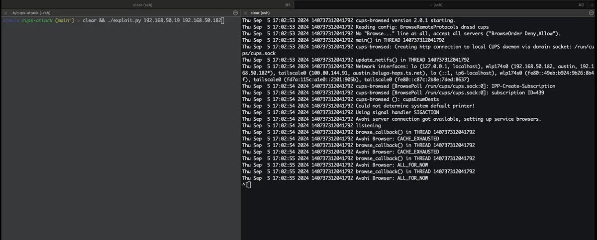</td>
</table></tr>
<table><tr>
<td>Quotes: <code>4</code></td>
<td>Replies: <code>3</code></td>
<td>Retweets: <code>154</code></td>
<td>Favorites: <code>401</code></td>
</tr></table>

---

# wvuuuuuuuuuuuuu
**https://twitter.com/wvuuuuuuuuuuuuu/status/1839079923732074740 _at 2024-09-25, 23:09:56_**
<blockquote>
RT @Horizon3Attack: Today, we are disclosing the details of CVE-2024-28987, a hardcoded cred vuln affecting #SolarWinds Web Help Desk. It a…
</blockquote>

<table><tr>
<td>Quotes: <code>0</code></td>
<td>Replies: <code>0</code></td>
<td>Retweets: <code>37</code></td>
<td>Favorites: <code>0</code></td>
</tr></table>

---

# __kokumoto
**https://twitter.com/__kokumoto/status/1838979632626008412 _at 2024-09-25, 16:31:25_**
<blockquote>
【独自】米国サイバーセキュリティ・社会基盤安全保障庁(CISA)の既知の悪用された脆弱性カタログから、Microsoft Windows Updateにおける解放後メモリ使用の脆弱性CVE-2024-43491がサイレント削除された… https://t.co/LHOFQYHy98
</blockquote>

<table><tr>
<td></td>
</table></tr>
<table><tr>
<td>Quotes: <code>1</code></td>
<td>Replies: <code>1</code></td>
<td>Retweets: <code>16</code></td>
<td>Favorites: <code>65</code></td>
</tr></table>

---

# steventseeley
**https://twitter.com/steventseeley/status/1838939340296122674 _at 2024-09-25, 13:51:19_**
<blockquote>
RT @Horizon3Attack: Today, we are disclosing the details of CVE-2024-28987, a hardcoded cred vuln affecting #SolarWinds Web Help Desk. It a…
</blockquote>

<table><tr>
<td>Quotes: <code>0</code></td>
<td>Replies: <code>0</code></td>
<td>Retweets: <code>38</code></td>
<td>Favorites: <code>0</code></td>
</tr></table>

---

# ptswarm
**https://twitter.com/ptswarm/status/1838933355275890860 _at 2024-09-25, 13:27:32_**
<blockquote>
🔥 ESET fixed CVE-2024-7400 found by our researcher Dmitriy Zuzlov!

This is an LPE that affects 13 ESET solutions and allows a low-privileged attacker to delete arbitrary files, which can be used to obtain NT AUTHORITY\SYSTEM privileges!

The advisory 👉 https://t.co/V3bcaOmPW7 https://t.co/mJjVmYoBWn
</blockquote>

* https://support.eset.com/en/ca8726-local-privilege-escalation-fixed-for-vulnerability-during-detected-file-removal-in-eset-products-for-windows

<table><tr>
<td>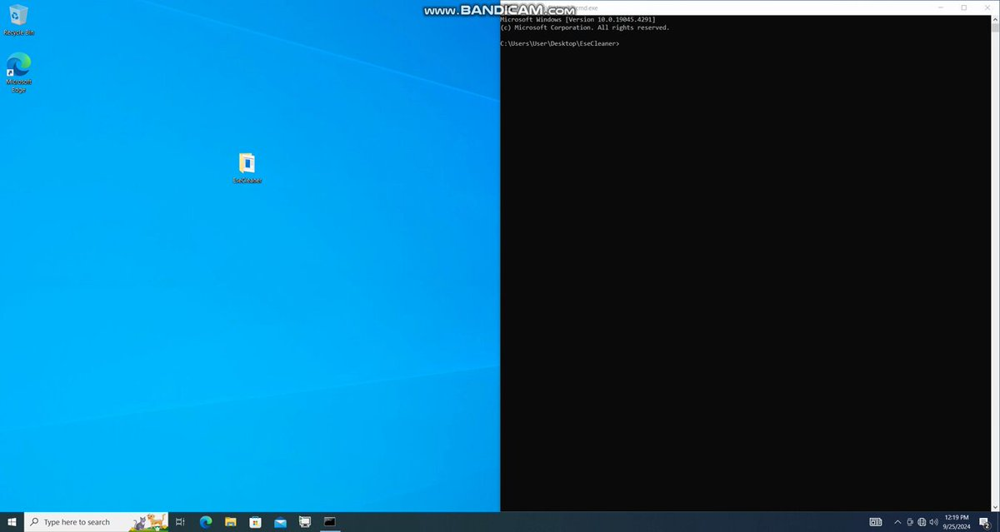</td>
</table></tr>
<table><tr>
<td>Quotes: <code>0</code></td>
<td>Replies: <code>1</code></td>
<td>Retweets: <code>37</code></td>
<td>Favorites: <code>133</code></td>
</tr></table>

---

# steventseeley
**https://twitter.com/steventseeley/status/1838648631517204578 _at 2024-09-24, 18:36:08_**
<blockquote>
RT @ptswarm: ⚠️ We've confirmed critical CVE-2024-45519 in Zimbra!

SMTP-based vulnerability in postjournal service allows unauthenticated…
</blockquote>

<table><tr>
<td>Quotes: <code>0</code></td>
<td>Replies: <code>0</code></td>
<td>Retweets: <code>130</code></td>
<td>Favorites: <code>0</code></td>
</tr></table>

---

# ptracesecurity
**https://twitter.com/ptracesecurity/status/1838624593302507617 _at 2024-09-24, 17:00:37_**
<blockquote>
CVE-2024-8190: Investigating CISA KEV Ivanti Cloud Service Appliance Command Injection Vulnerability https://t.co/3Ax8KYhZFo  #Pentesting #Vulnerability  #CyberSecurity #Infosec https://t.co/AXsspMhzXV
</blockquote>

* https://www.horizon3.ai/attack-research/cisa-kev-cve-2024-8190-ivanti-csa-command-injection/

<table><tr>
<td></td>
<td></td>
</table></tr>
<table><tr>
<td>Quotes: <code>0</code></td>
<td>Replies: <code>0</code></td>
<td>Retweets: <code>14</code></td>
<td>Favorites: <code>51</code></td>
</tr></table>

---

# ptswarm
**https://twitter.com/ptswarm/status/1838598724919914663 _at 2024-09-24, 15:17:50_**
<blockquote>
⚠️ We've confirmed critical CVE-2024-45519 in Zimbra!

SMTP-based vulnerability in postjournal service allows unauthenticated attackers to inject commands under zimbra user.

✅ Update your software ASAP to avoid exploitation! https://t.co/fD2epVMvqL
</blockquote>

<table><tr>
<td>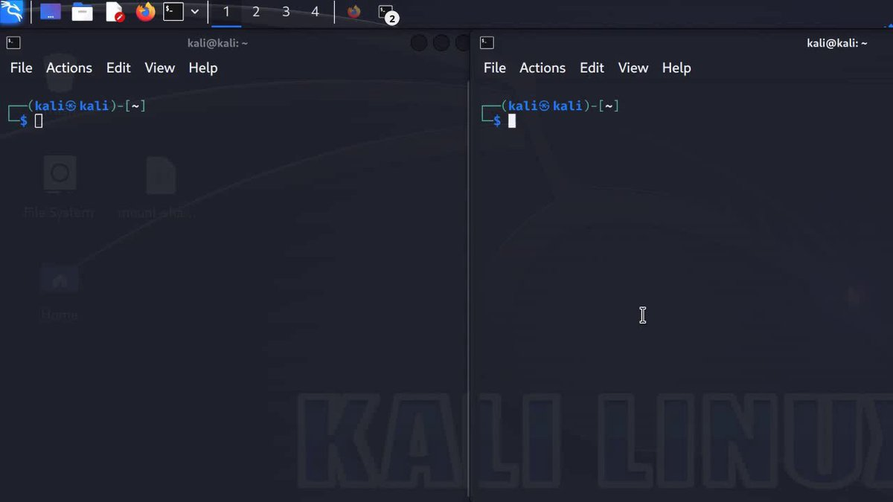</td>
</table></tr>
<table><tr>
<td>Quotes: <code>16</code></td>
<td>Replies: <code>8</code></td>
<td>Retweets: <code>182</code></td>
<td>Favorites: <code>586</code></td>
</tr></table>

---

# kmkz_security
**https://twitter.com/kmkz_security/status/1838240499892646301 _at 2024-09-23, 15:34:22_**
<blockquote>
RT @androidmalware2: 0-Click exploit discovered in MediaTek Wi-Fi chipsets affects routers and smartphones (CVE-2024-20017).
Published PoC…
</blockquote>

<table><tr>
<td>Quotes: <code>0</code></td>
<td>Replies: <code>0</code></td>
<td>Retweets: <code>263</code></td>
<td>Favorites: <code>0</code></td>
</tr></table>

---

# 0xor0ne
**https://twitter.com/0xor0ne/status/1838231955491451374 _at 2024-09-23, 15:00:25_**
<blockquote>
glibc's iconv() buffer overflow exploitation (CVE-2024-2961)

Blog post: https://t.co/hIzkUPwdzV
PoC: https://t.co/7l9AJveV0D

#glibc https://t.co/1OSCkKniPa
</blockquote>

* https://ambionics.io/blog/iconv-cve-2024-2961-p1
* https://github.com/ambionics/cnext-exploits/

<table><tr>
<td>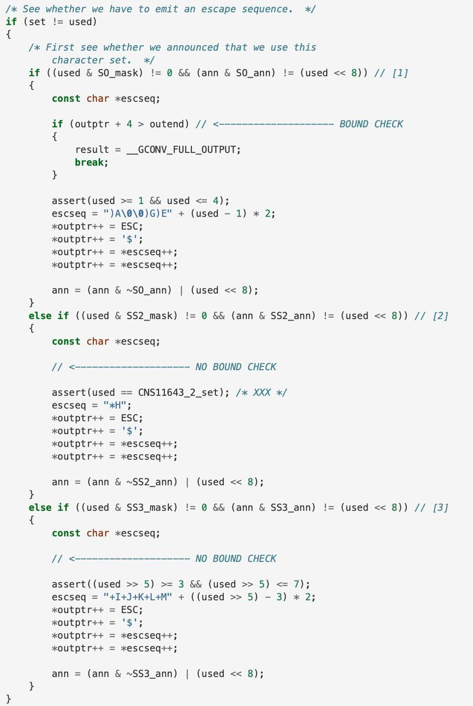</td>
</table></tr>
<table><tr>
<td>Quotes: <code>0</code></td>
<td>Replies: <code>1</code></td>
<td>Retweets: <code>67</code></td>
<td>Favorites: <code>264</code></td>
</tr></table>

---

# momika233
**https://twitter.com/momika233/status/1838204744554406369 _at 2024-09-23, 13:12:17_**
<blockquote>
RT @androidmalware2: 0-Click exploit discovered in MediaTek Wi-Fi chipsets affects routers and smartphones (CVE-2024-20017).
Published PoC…
</blockquote>

<table><tr>
<td>Quotes: <code>0</code></td>
<td>Replies: <code>0</code></td>
<td>Retweets: <code>256</code></td>
<td>Favorites: <code>0</code></td>
</tr></table>

---

# TheHackersNews
**https://twitter.com/TheHackersNews/status/1838157884862967952 _at 2024-09-23, 10:06:05_**
<blockquote>
🚨 Critical flaw (CVE-2024-7490) in Microchip's ASF may allow remote code execution in IoT devices.

CERT/CC’s advisory warns it could be widespread, impacting ASF v3.52.0.2574 and earlier.

Read: https://t.co/Z99vYrDr1c

#Cybersecurity #IoTSecurity
</blockquote>

* https://thehackernews.com/2024/09/critical-flaw-in-microchip-asf-exposes.html

<table><tr>
<td>Quotes: <code>4</code></td>
<td>Replies: <code>1</code></td>
<td>Retweets: <code>43</code></td>
<td>Favorites: <code>68</code></td>
</tr></table>

---

# cyber_advising
**https://twitter.com/cyber_advising/status/1838136939679014931 _at 2024-09-23, 08:42:52_**
<blockquote>
CVE-2024-40801 in macOS allowed a sandboxed app to bypass TCC protections and access sensitive user data without requiring user permission.

This issue has since been fixed in macOS Sonoma 14.7 and macOS Sequoia 15.0.

PoC
https://t.co/HkE5Vja6if https://t.co/lkROIWixrW
</blockquote>

* https://github.com/pvieito/ContainerMigrationExploit?tab=readme-ov-file

<table><tr>
<td></td>
</table></tr>
<table><tr>
<td>Quotes: <code>0</code></td>
<td>Replies: <code>1</code></td>
<td>Retweets: <code>20</code></td>
<td>Favorites: <code>89</code></td>
</tr></table>

---

# Dinosn
**https://twitter.com/Dinosn/status/1838044884613148753 _at 2024-09-23, 02:37:04_**
<blockquote>
CVE-2024-8698: Keycloak Vulnerability Puts SAML Authentication at Risk https://t.co/u1CyxFYDpj
</blockquote>

* https://securityonline.info/cve-2024-8698-keycloak-vulnerability-puts-saml-authentication-at-risk/

<table><tr>
<td>Quotes: <code>1</code></td>
<td>Replies: <code>0</code></td>
<td>Retweets: <code>22</code></td>
<td>Favorites: <code>80</code></td>
</tr></table>

---

# testanull
**https://twitter.com/testanull/status/1837789227494658330 _at 2024-09-22, 09:41:10_**
<blockquote>
RT @chybeta: CVE-2024-45519 Zimbra Unauth postjournal RCE

https://t.co/bGR0SNrxU0

https://t.co/OBWYLRipBk

Fixed a security vulnerability…
</blockquote>

* https://t.zsxq.com/xIYOU
* https://wiki.zimbra.com/wiki/Zimbra_Releases/10.1.1

<table><tr>
<td>Quotes: <code>0</code></td>
<td>Replies: <code>0</code></td>
<td>Retweets: <code>48</code></td>
<td>Favorites: <code>0</code></td>
</tr></table>

---

# kmkz_security
**https://twitter.com/kmkz_security/status/1837746029845733531 _at 2024-09-22, 06:49:31_**
<blockquote>
RT @hyprdude: New blog post is up! This one goes over 4 different exploits for CVE-2024-20017, using it as a case study to explore exploit…
</blockquote>

<table><tr>
<td>Quotes: <code>0</code></td>
<td>Replies: <code>0</code></td>
<td>Retweets: <code>115</code></td>
<td>Favorites: <code>0</code></td>
</tr></table>

---

# kmkz_security
**https://twitter.com/kmkz_security/status/1837629240180985902 _at 2024-09-21, 23:05:27_**
<blockquote>
RT @_r_netsec: 0-Click RCE in MediaTek Wi-Fi Chipsets — 4 exploits, 1 bug: exploiting CVE-2024-20017 4 different ways https://t.co/D0PoFJTK…
</blockquote>

<table><tr>
<td>Quotes: <code>0</code></td>
<td>Replies: <code>0</code></td>
<td>Retweets: <code>31</code></td>
<td>Favorites: <code>0</code></td>
</tr></table>

---

# kmkz_security
**https://twitter.com/kmkz_security/status/1837571241642696819 _at 2024-09-21, 19:14:59_**
<blockquote>
RT @chybeta: CVE-2024-45519 Zimbra Unauth postjournal RCE

https://t.co/bGR0SNrxU0

https://t.co/OBWYLRipBk

Fixed a security vulnerability…
</blockquote>

* https://t.zsxq.com/xIYOU
* https://wiki.zimbra.com/wiki/Zimbra_Releases/10.1.1

<table><tr>
<td>Quotes: <code>0</code></td>
<td>Replies: <code>0</code></td>
<td>Retweets: <code>50</code></td>
<td>Favorites: <code>0</code></td>
</tr></table>

---

# momika233
**https://twitter.com/momika233/status/1837539082689564982 _at 2024-09-21, 17:07:11_**
<blockquote>
Ivanti EPM AgentPortal RCE Vulnerability CVE-2023-28324
https://t.co/YHrTs5UpKL
</blockquote>

* https://github.com/horizon3ai/CVE-2023-28324

<table><tr>
<td>Quotes: <code>0</code></td>
<td>Replies: <code>0</code></td>
<td>Retweets: <code>19</code></td>
<td>Favorites: <code>55</code></td>
</tr></table>

---

# steventseeley
**https://twitter.com/steventseeley/status/1837517822966022347 _at 2024-09-21, 15:42:43_**
<blockquote>
RT @chybeta: CVE-2024-45519 Zimbra Unauth postjournal RCE

https://t.co/bGR0SNrxU0

https://t.co/OBWYLRipBk

Fixed a security vulnerability…
</blockquote>

* https://t.zsxq.com/xIYOU
* https://wiki.zimbra.com/wiki/Zimbra_Releases/10.1.1

<table><tr>
<td>Quotes: <code>0</code></td>
<td>Replies: <code>0</code></td>
<td>Retweets: <code>53</code></td>
<td>Favorites: <code>0</code></td>
</tr></table>

---

# chybeta
**https://twitter.com/chybeta/status/1837516606702080038 _at 2024-09-21, 15:37:53_**
<blockquote>
CVE-2024-45519 Zimbra Unauth postjournal RCE

https://t.co/bGR0SNrxU0

https://t.co/OBWYLRipBk

Fixed a security vulnerability in the postjournal service which may allow unauthenticated users to execute commands. https://t.co/de1VaV89Sp
</blockquote>

* https://t.zsxq.com/xIYOU
* https://wiki.zimbra.com/wiki/Zimbra_Releases/10.1.1

<table><tr>
<td></td>
</table></tr>
<table><tr>
<td>Quotes: <code>1</code></td>
<td>Replies: <code>1</code></td>
<td>Retweets: <code>47</code></td>
<td>Favorites: <code>229</code></td>
</tr></table>

---

# _r_netsec
**https://twitter.com/_r_netsec/status/1837378248822649137 _at 2024-09-21, 06:28:06_**
<blockquote>
0-Click RCE in MediaTek Wi-Fi Chipsets — 4 exploits, 1 bug: exploiting CVE-2024-20017 4 different ways https://t.co/D0PoFJTKOC
</blockquote>

* https://blog.coffinsec.com/0day/2024/08/30/exploiting-CVE-2024-20017-four-different-ways.html

<table><tr>
<td>Quotes: <code>2</code></td>
<td>Replies: <code>1</code></td>
<td>Retweets: <code>31</code></td>
<td>Favorites: <code>115</code></td>
</tr></table>

---

# TheHackersNews
**https://twitter.com/TheHackersNews/status/1836983909084713147 _at 2024-09-20, 04:21:08_**
<blockquote>
🚨 Alert: Critical Security Flaw (CVE-2024-8963) in Ivanti CSA Under Active Exploitation!

This vulnerability allows unauthenticated attackers to bypass admin authentication and execute arbitrary commands.

Details: https://t.co/TupOeR1TRr

#cybersecurity #hacking
</blockquote>

* https://thehackernews.com/2024/09/critical-ivanti-cloud-appliance.html

<table><tr>
<td>Quotes: <code>3</code></td>
<td>Replies: <code>3</code></td>
<td>Retweets: <code>23</code></td>
<td>Favorites: <code>78</code></td>
</tr></table>

---

# GreyNoiseIO
**https://twitter.com/GreyNoiseIO/status/1836836063358370211 _at 2024-09-19, 18:33:38_**
<blockquote>
🚨 U.S. takes down a 260K-device Chinese state-sponsored botnet 🛡️ GreyNoise was tracking 44 of the 66 CVEs, including CVE-2021-28799, used for device compromise. 🔐 https://t.co/kcxzbb8UwE
</blockquote>

<table><tr>
<td></td>
</table></tr>
<table><tr>
<td>Quotes: <code>1</code></td>
<td>Replies: <code>1</code></td>
<td>Retweets: <code>16</code></td>
<td>Favorites: <code>56</code></td>
</tr></table>

---

# GHSecurityLab
**https://twitter.com/GHSecurityLab/status/1836827694052368831 _at 2024-09-19, 18:00:23_**
<blockquote>
GHSL-2024-095: Type confusion leading to RCE in the Chrome renderer sandbox - CVE-2024-5830 https://t.co/UxiawabRC9
</blockquote>

* https://securitylab.github.com/advisories/GHSL-2024-095_Chromium/

<table><tr>
<td>Quotes: <code>0</code></td>
<td>Replies: <code>0</code></td>
<td>Retweets: <code>14</code></td>
<td>Favorites: <code>41</code></td>
</tr></table>

---

# Dinosn
**https://twitter.com/Dinosn/status/1836598929682518027 _at 2024-09-19, 02:51:21_**
<blockquote>
PoC Exploit Released for CVE-2024-7965 Zero-Day Chrome Vulnerability https://t.co/i2tRYdjr2z
</blockquote>

* https://securityonline.info/poc-exploit-released-for-cve-2024-7965-zero-day-chrome-vulnerability/

<table><tr>
<td>Quotes: <code>0</code></td>
<td>Replies: <code>0</code></td>
<td>Retweets: <code>13</code></td>
<td>Favorites: <code>49</code></td>
</tr></table>

---

# Dinosn
**https://twitter.com/Dinosn/status/1836597956914430312 _at 2024-09-19, 02:47:29_**
<blockquote>
Researchers Detail CVE-2024-38014 0-Day Vulnerability in Windows MSI Installers Exploited in the Wild https://t.co/t2KrfWMTYb
</blockquote>

* https://securityonline.info/researchers-detail-cve-2024-38014-0-day-vulnerability-in-windows-msi-installers-exploited-in-the-wild/

<table><tr>
<td>Quotes: <code>0</code></td>
<td>Replies: <code>1</code></td>
<td>Retweets: <code>30</code></td>
<td>Favorites: <code>83</code></td>
</tr></table>

---

# the_yellow_fall
**https://twitter.com/the_yellow_fall/status/1836582807226749131 _at 2024-09-19, 01:47:17_**
<blockquote>
#PoC Exploit Released for CVE-2024-7965 Zero-Day #Chrome Vulnerability

Find out about the highly dangerous #0day vulnerability and its exploitation. Learn how to protect your devices from this critical threat
https://t.co/xyEO5NSIeh
</blockquote>

* https://securityonline.info/poc-exploit-released-for-cve-2024-7965-zero-day-chrome-vulnerability/

<table><tr>
<td>Quotes: <code>0</code></td>
<td>Replies: <code>1</code></td>
<td>Retweets: <code>5</code></td>
<td>Favorites: <code>33</code></td>
</tr></table>

---

# HunterMapping
**https://twitter.com/HunterMapping/status/1836329515573707212 _at 2024-09-18, 09:00:48_**
<blockquote>
🚨Alert🚨CVE-2024-38812(CVSS: 9.8):Critical VMware vCenter vulnerability may allow remote code execution. Cybercriminals can exploit it with crafted packets, posing serious risks.
📊 34K+ Services are found on https://t.co/ysWb28BTvF yearly.
🔗Hunter Link: https://t.co/lINOgSDSE6 https://t.co/eM833Kznsx
</blockquote>

* http://hunter.how
* https://hunter.how/list?searchValue=product.name%3D%22VMware%20vCenter%20Server%22

<table><tr>
<td></td>
</table></tr>
<table><tr>
<td>Quotes: <code>0</code></td>
<td>Replies: <code>0</code></td>
<td>Retweets: <code>40</code></td>
<td>Favorites: <code>108</code></td>
</tr></table>

---

# HunterMapping
**https://twitter.com/HunterMapping/status/1836305769039380560 _at 2024-09-18, 07:26:26_**
<blockquote>
🆕🆕🆕CVE-2024-23692:Unauthenticated RCE Flaw in Rejetto HTTP File Server
🔥New PoC:https://t.co/Qn7OQJ8qcC
📊 89.7K+ Services are found on https://t.co/ysWb28BTvF yearly.
🔗Hunter Link: https://t.co/Gz8YVqp1pk
👇Query
HUNTER: web.body="HttpFileServer"&amp;&amp;header.server=="HFS 2.3m"
</blockquote>

* https://github.com/verylazytech/CVE-2024-23692
* http://hunter.how
* https://hunter.how/list?searchValue=web.body%3D%22HttpFileServer%22%26%26header.server%3D%3D%22HFS%202.3m%22

<table><tr>
<td>Quotes: <code>0</code></td>
<td>Replies: <code>0</code></td>
<td>Retweets: <code>33</code></td>
<td>Favorites: <code>101</code></td>
</tr></table>

---

# TheHackersNews
**https://twitter.com/TheHackersNews/status/1836271602058531162 _at 2024-09-18, 05:10:40_**
<blockquote>
⚠️ Critical VMware vCenter #vulnerability (CVE-2024-38812) may allow remote code execution. Cybercriminals can exploit it with crafted packets, posing serious risks.

Learn more: https://t.co/Bq2N6tTSEI

Make sure you’re not the next victim—patch your systems today.
</blockquote>

* https://thehackernews.com/2024/09/patch-issued-for-critical-vmware.html

<table><tr>
<td>Quotes: <code>1</code></td>
<td>Replies: <code>2</code></td>
<td>Retweets: <code>83</code></td>
<td>Favorites: <code>164</code></td>
</tr></table>

---

# TheHackersNews
**https://twitter.com/TheHackersNews/status/1835978961148408312 _at 2024-09-17, 09:47:49_**
<blockquote>
Update ⚡️ : Microsoft Confirms Active Exploitation of CVE-2024-43461 – Stay Alert

MSHTML spoofing flaw (CVSS 8.8) is delivering Atlantida stealer malware. Fourth zero-day patched by Microsoft this month.

https://t.co/M1tONxPmKQ
</blockquote>

* https://thehackernews.com/2024/09/microsoft-issues-patches-for-79-flaws.html#update

<table><tr>
<td>Quotes: <code>2</code></td>
<td>Replies: <code>0</code></td>
<td>Retweets: <code>79</code></td>
<td>Favorites: <code>119</code></td>
</tr></table>

---

# Dinosn
**https://twitter.com/Dinosn/status/1835879425193210167 _at 2024-09-17, 03:12:18_**
<blockquote>
PoC Exploit Released for Windows Hyper-V Zero-Day Vulnerability CVE-2024-38080 https://t.co/q7NxMSbyXx
</blockquote>

* https://securityonline.info/poc-exploit-released-for-windows-hyper-v-zero-day-vulnerability-cve-2024-38080/

<table><tr>
<td>Quotes: <code>2</code></td>
<td>Replies: <code>0</code></td>
<td>Retweets: <code>95</code></td>
<td>Favorites: <code>276</code></td>
</tr></table>

---

# matteomalvica
**https://twitter.com/matteomalvica/status/1835709640891408472 _at 2024-09-16, 15:57:38_**
<blockquote>
I have just ported the Chrome exploit for CVE-2024-5830 to Windows. 👾
A special thanks to  @mmolgtm  for the original research and invaluable pointers.
The proof of concept can be found here:
https://t.co/FzOwpJG3G6 https://t.co/lKf5FPEwnx
</blockquote>

* https://github.com/uf0o/exploit_dev/tree/main/browsers/v8/CVE-2024-5830

<table><tr>
<td></td>
</table></tr>
<table><tr>
<td>Quotes: <code>1</code></td>
<td>Replies: <code>2</code></td>
<td>Retweets: <code>36</code></td>
<td>Favorites: <code>140</code></td>
</tr></table>

---

# steventseeley
**https://twitter.com/steventseeley/status/1835600396892402174 _at 2024-09-16, 08:43:33_**
<blockquote>
RT @SinSinology: 🔥💀 Here is the "Real" writeup and exploit for the
pre-auth deserialization RCE I reported to Ivanti
CVE-2024-29847
Apparen…
</blockquote>

<table><tr>
<td>Quotes: <code>0</code></td>
<td>Replies: <code>0</code></td>
<td>Retweets: <code>56</code></td>
<td>Favorites: <code>0</code></td>
</tr></table>

---

# SinSinology
**https://twitter.com/SinSinology/status/1835589425415229466 _at 2024-09-16, 07:59:57_**
<blockquote>
🔥💀 Here is the "Real" writeup and exploit for the
pre-auth deserialization RCE I reported to Ivanti
CVE-2024-29847
Apparently, folks at horizon3 tried to write about my bug before me but they did it wrong
https://t.co/Df8lIDYNRH
</blockquote>

* https://summoning.team/blog/ivanti-epm-cve-2024-29847-deserialization-rce/

<table><tr>
<td>Quotes: <code>1</code></td>
<td>Replies: <code>5</code></td>
<td>Retweets: <code>58</code></td>
<td>Favorites: <code>218</code></td>
</tr></table>

---

# Dinosn
**https://twitter.com/Dinosn/status/1835509725015704022 _at 2024-09-16, 02:43:15_**
<blockquote>
CVE-2024-38816: Spring Framework Path Traversal Vulnerability Threatens Millions https://t.co/dNvH7VHChB
</blockquote>

* https://securityonline.info/cve-2024-38816-spring-framework-path-traversal-vulnerability-threatens-millions/

<table><tr>
<td>Quotes: <code>0</code></td>
<td>Replies: <code>0</code></td>
<td>Retweets: <code>30</code></td>
<td>Favorites: <code>96</code></td>
</tr></table>

---

# Dinosn
**https://twitter.com/Dinosn/status/1835509687963271529 _at 2024-09-16, 02:43:06_**
<blockquote>
New Zero-Day Emerges After Microsoft Patch Tuesday: CVE-2024-43461 Targets Windows MSHTML https://t.co/4QgOyBJm0B
</blockquote>

* https://securityonline.info/new-zero-day-emerges-after-microsoft-patch-tuesday-cve-2024-43461-targets-windows-mshtml/

<table><tr>
<td>Quotes: <code>0</code></td>
<td>Replies: <code>1</code></td>
<td>Retweets: <code>57</code></td>
<td>Favorites: <code>130</code></td>
</tr></table>

---

# ptracesecurity
**https://twitter.com/ptracesecurity/status/1835430929336009205 _at 2024-09-15, 21:30:08_**
<blockquote>
Exploit for CVE-2024-8504 &amp; CVE-2024-8503: SQLi and RCE  https://t.co/ekNqq5AJbF #Pentesting #Vulnerability  #CyberSecurity #Infosec https://t.co/irJiRSI58y
</blockquote>

* https://darkwebinformer.com/exploit-for-cve-2024-8504-cve-2024-8503-sqli-and-rce/

<table><tr>
<td></td>
<td></td>
</table></tr>
<table><tr>
<td>Quotes: <code>0</code></td>
<td>Replies: <code>0</code></td>
<td>Retweets: <code>6</code></td>
<td>Favorites: <code>33</code></td>
</tr></table>

---

# cyber_advising
**https://twitter.com/cyber_advising/status/1835083762717409785 _at 2024-09-14, 22:30:37_**
<blockquote>
CVE-2024-38014: Windows Installer Elevation of Privilege Vulnerability.

PoC
https://t.co/ISHslm3zc9 https://t.co/GshLJwCVpv
</blockquote>

* https://github.com/sec-consult/msiscan?tab=readme-ov-file

<table><tr>
<td></td>
</table></tr>
<table><tr>
<td>Quotes: <code>0</code></td>
<td>Replies: <code>0</code></td>
<td>Retweets: <code>27</code></td>
<td>Favorites: <code>102</code></td>
</tr></table>

---

# cyber_advising
**https://twitter.com/cyber_advising/status/1835083454834254269 _at 2024-09-14, 22:29:24_**
<blockquote>
CVE-2024-29847: Deserialization of untrusted data in the agent portal of Ivanti EPM before 2022 SU6, or the 2024 September update allows a remote unauthenticated attacker to achieve remote code execution.

PoC
https://t.co/wOiSzjspbv https://t.co/RAQ2AZBJhj
</blockquote>

* https://github.com/horizon3ai/CVE-2024-29847

<table><tr>
<td></td>
</table></tr>
<table><tr>
<td>Quotes: <code>0</code></td>
<td>Replies: <code>0</code></td>
<td>Retweets: <code>8</code></td>
<td>Favorites: <code>37</code></td>
</tr></table>

---

# pdnuclei
**https://twitter.com/pdnuclei/status/1834963633647821021 _at 2024-09-14, 14:33:16_**
<blockquote>
🚨 Scan for Cisco Smart Licensing Utility vulnerabilities (CVE-2024-20439 &amp; CVE-2024-20440, CVSS 9.8) with Nuclei templates!

🔍 More info: https://t.co/b5mt9Rejje

⚛️ Nuclei Templates 👇

CVE-2024-20439 👉https://t.co/p1rmrSDwpA
CVE-2024-20440 👉https://t.co/kes8frT9Po
</blockquote>

* https://thehackernews.com/2024/09/cisco-fixes-two-critical-flaws-in-smart.html
* https://cloud.projectdiscovery.io/?template=CVE-2024-20439
* https://cloud.projectdiscovery.io/?template=CVE-2024-20440

<table><tr>
<td>Quotes: <code>0</code></td>
<td>Replies: <code>0</code></td>
<td>Retweets: <code>9</code></td>
<td>Favorites: <code>40</code></td>
</tr></table>

---

# TheHackersNews
**https://twitter.com/TheHackersNews/status/1834808053289697397 _at 2024-09-14, 04:15:03_**
<blockquote>
🚨 A newly patched security flaw in Ivanti CSA (CVE-2024-8190) is under active exploitation.

This vulnerability could lead to full system compromise, especially since Ivanti CSA 4.6 has reached end-of-life.

Details here: https://t.co/n2T8FMlVYa

#cybersecurity
</blockquote>

* https://thehackernews.com/2024/09/ivanti-warns-of-active-exploitation-of.html

<table><tr>
<td>Quotes: <code>0</code></td>
<td>Replies: <code>3</code></td>
<td>Retweets: <code>27</code></td>
<td>Favorites: <code>61</code></td>
</tr></table>

---

# piedpiper1616
**https://twitter.com/piedpiper1616/status/1834807530910105838 _at 2024-09-14, 04:12:59_**
<blockquote>
GitHub - horizon3ai/CVE-2024-29847: Ivanti EPM AgentPortal RCE Vulnerability - https://t.co/YIHFPCX6Wu
</blockquote>

* https://github.com/horizon3ai/CVE-2024-29847

<table><tr>
<td>Quotes: <code>0</code></td>
<td>Replies: <code>0</code></td>
<td>Retweets: <code>19</code></td>
<td>Favorites: <code>62</code></td>
</tr></table>

---

# wvuuuuuuuuuuuuu
**https://twitter.com/wvuuuuuuuuuuuuu/status/1834709336787919257 _at 2024-09-13, 21:42:47_**
<blockquote>
RT @Horizon3Attack: CVE-2024-29847, affecting #Ivanti EPM, allows remote unauthenticated attackers to execute arbitrary commands as SYSTEM.…
</blockquote>

<table><tr>
<td>Quotes: <code>0</code></td>
<td>Replies: <code>0</code></td>
<td>Retweets: <code>48</code></td>
<td>Favorites: <code>0</code></td>
</tr></table>

---

# Horizon3Attack
**https://twitter.com/Horizon3Attack/status/1834602993850720741 _at 2024-09-13, 14:40:13_**
<blockquote>
CVE-2024-29847, affecting #Ivanti EPM, allows remote unauthenticated attackers to execute arbitrary commands as SYSTEM.

Check out our latest deep-dive: https://t.co/phiaoMF0O4

Credit to @SinSinology for the initial discovery.
</blockquote>

* https://www.horizon3.ai/attack-research/attack-blogs/cve-2024-29847-deep-dive-ivanti-endpoint-manager-agentportal-deserialization-of-untrusted-data-remote-code-execution-vulnerability

<table><tr>
<td>Quotes: <code>3</code></td>
<td>Replies: <code>2</code></td>
<td>Retweets: <code>48</code></td>
<td>Favorites: <code>121</code></td>
</tr></table>

---

# TheHackersNews
**https://twitter.com/TheHackersNews/status/1834591500153299127 _at 2024-09-13, 13:54:33_**
<blockquote>
🚨 CVE-2024-40865, aka GAZEploit, is a new #vulnerability in Apple's Vision Pro headset.

It lets attackers infer virtual keyboard inputs by analyzing eye movements, risking #privacy breaches.

Read: https://t.co/wp2bpSmz7t

#cybersecurity
</blockquote>

* https://thehackernews.com/2024/09/apple-vision-pro-vulnerability-exposed.html

<table><tr>
<td>Quotes: <code>0</code></td>
<td>Replies: <code>0</code></td>
<td>Retweets: <code>10</code></td>
<td>Favorites: <code>34</code></td>
</tr></table>

---

# TheHackersNews
**https://twitter.com/TheHackersNews/status/1834549190036423060 _at 2024-09-13, 11:06:25_**
<blockquote>
⚠️ Cybercriminals are exploiting PoC exploits for two critical vulnerabilities (CVE-2024-6670, CVE-2024-6671) in WhatsUp Gold, with attacks starting just 5 hours after the PoC release.

Details here: https://t.co/0aI3HtQ69m

Patch your systems NOW to avoid becoming a target!
</blockquote>

* https://thehackernews.com/2024/09/progress-whatsup-gold-exploited-just.html

<table><tr>
<td>Quotes: <code>0</code></td>
<td>Replies: <code>2</code></td>
<td>Retweets: <code>20</code></td>
<td>Favorites: <code>63</code></td>
</tr></table>

---

# TheHackersNews
**https://twitter.com/TheHackersNews/status/1834259625191113125 _at 2024-09-12, 15:55:48_**
<blockquote>
GitLab has just released patches for 17 vulnerabilities, including a critical flaw (CVE-2024-6678) with a CVSS score of 9.9/10.

Learn more: https://t.co/Tq7oWtrqaO

Don’t wait for an exploit—apply the update today!
</blockquote>

* https://thehackernews.com/2024/09/urgent-gitlab-patches-critical-flaw.html

<table><tr>
<td>Quotes: <code>1</code></td>
<td>Replies: <code>3</code></td>
<td>Retweets: <code>63</code></td>
<td>Favorites: <code>116</code></td>
</tr></table>

---

# reverseame
**https://twitter.com/reverseame/status/1834225962138919404 _at 2024-09-12, 13:42:02_**
<blockquote>
CVE-2024-43425: Moodle Remote Code Execution Vulnerability, PoC Published #CVE202443425 #MoodleRCE #Vulnerability #PoC #UpgradeNow https://t.co/xXFkEakMWV
</blockquote>

* https://securityonline.info/cve-2024-43425-moodle-remote-code-execution-vulnerability-poc-published/

<table><tr>
<td>Quotes: <code>0</code></td>
<td>Replies: <code>1</code></td>
<td>Retweets: <code>15</code></td>
<td>Favorites: <code>58</code></td>
</tr></table>

---

# sec_consult
**https://twitter.com/sec_consult/status/1834169340410593519 _at 2024-09-12, 09:57:02_**
<blockquote>
🚨 Windows MSI installers can let attackers escalate privileges to SYSTEM! Our latest blog explains these attacks &amp; introduces "msiscan" an open-source tool to detect #vulnerabilities like CVE-2024-38014. Learn about the new technique for reliable exploits https://t.co/CLfjGMl148
</blockquote>

<table><tr>
<td>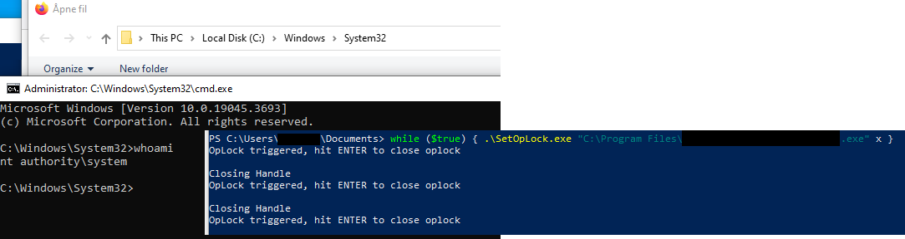</td>
</table></tr>
<table><tr>
<td>Quotes: <code>3</code></td>
<td>Replies: <code>4</code></td>
<td>Retweets: <code>107</code></td>
<td>Favorites: <code>312</code></td>
</tr></table>

---

# wvuuuuuuuuuuuuu
**https://twitter.com/wvuuuuuuuuuuuuu/status/1834014289734070399 _at 2024-09-11, 23:40:55_**
<blockquote>
RT @1ZRR4H: 🔥 CVE-2024-29847 - 10.0 (Critical)

Deserialization of untrusted data in the agent portal of Ivanti EPM allows a remote unauthe…
</blockquote>

<table><tr>
<td>Quotes: <code>0</code></td>
<td>Replies: <code>0</code></td>
<td>Retweets: <code>58</code></td>
<td>Favorites: <code>0</code></td>
</tr></table>

---

# 1ZRR4H
**https://twitter.com/1ZRR4H/status/1833928783474081896 _at 2024-09-11, 18:01:09_**
<blockquote>
🔥 CVE-2024-29847 - 10.0 (Critical)

Deserialization of untrusted data in the agent portal of Ivanti EPM allows a remote unauthenticated attacker to achieve remote code execution.

[+] https://t.co/EBSmDcUevh https://t.co/p0cQVtX8Bx
</blockquote>

* https://forums.ivanti.com/s/article/Security-Advisory-EPM-September-2024-for-EPM-2024-and-EPM-2022?language=en_US

<table><tr>
<td>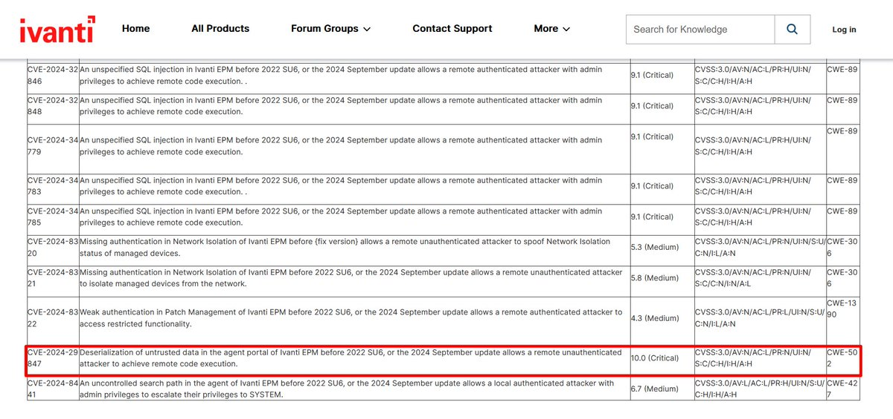</td>
</table></tr>
<table><tr>
<td>Quotes: <code>3</code></td>
<td>Replies: <code>5</code></td>
<td>Retweets: <code>55</code></td>
<td>Favorites: <code>147</code></td>
</tr></table>

---

# cyber_advising
**https://twitter.com/cyber_advising/status/1833838658790490284 _at 2024-09-11, 12:03:01_**
<blockquote>
CVE-2024-40711: Veeam Backup &amp; Response - RCE With Auth, But Mostly Without Auth.

PoC
https://t.co/MEb1lShm9I https://t.co/JOAdw3pUNe
</blockquote>

* https://labs.watchtowr.com/veeam-backup-response-rce-with-auth-but-mostly-without-auth-cve-2024-40711-2/

<table><tr>
<td></td>
</table></tr>
<table><tr>
<td>Quotes: <code>0</code></td>
<td>Replies: <code>2</code></td>
<td>Retweets: <code>26</code></td>
<td>Favorites: <code>48</code></td>
</tr></table>

---

# HunterMapping
**https://twitter.com/HunterMapping/status/1833701063511113895 _at 2024-09-11, 02:56:16_**
<blockquote>
🥳CALL BACK🥳CVE-2018-14714: ASUS RT-AC3200 WiFi router RCE
🔥New EXP: https://t.co/q3qNTq5yRV
🔥Original PoC: https://t.co/5v6yDJRHzc
📊 17K+ Services are found on https://t.co/ysWb28BTvF yearly.
🔗Hunter Link: https://t.co/0gl1LCt1LF
👇Search Query
HUNTER:/product.name="ASUS https://t.co/7n3wEjsmXk
</blockquote>

* https://github.com/sunn1day/CVE-2018-14714-POC
* https://twitter.com/HunterMapping/status/1833701063511113895/photo/1
* http://hunter.how
* https://github.com/BTtea/CVE-2018-14714-RCE-exploit
* https://hunter.how/list?searchValue=product.name%3D%22ASUS%20RT-AC3200%22

<table><tr>
<td></td>
</table></tr>
<table><tr>
<td>Quotes: <code>0</code></td>
<td>Replies: <code>0</code></td>
<td>Retweets: <code>15</code></td>
<td>Favorites: <code>32</code></td>
</tr></table>

---

# chudyPB
**https://twitter.com/chudyPB/status/1833567722502037643 _at 2024-09-10, 18:06:25_**
<blockquote>
My SharePoint RCE got fixed: CVE-2024-38018. Site Member privs should be enough to exploit. 

I also found a DoS vuln that got patched today: CVE-2024-43466

https://t.co/JldGOJfzeI
</blockquote>

* https://msrc.microsoft.com/update-guide/vulnerability/CVE-2024-38018

<table><tr>
<td>Quotes: <code>0</code></td>
<td>Replies: <code>4</code></td>
<td>Retweets: <code>16</code></td>
<td>Favorites: <code>97</code></td>
</tr></table>

---

# Dinosn
**https://twitter.com/Dinosn/status/1833555406376894823 _at 2024-09-10, 17:17:29_**
<blockquote>
4 CVE exploited in the wild, on Microsoft's Patch      
CVE-2024-43491 - 9.8 - Microsoft Windows Update Remote Code Execution Vulnerability
    CVE-2024-38014 - 7.8 - Windows Installer Elevation of Privilege Vulnerability
    CVE-2024-38226 - 7.3 - Microsoft Publisher Security
</blockquote>

<table><tr>
<td>Quotes: <code>1</code></td>
<td>Replies: <code>0</code></td>
<td>Retweets: <code>18</code></td>
<td>Favorites: <code>52</code></td>
</tr></table>

---

# binitamshah
**https://twitter.com/binitamshah/status/1833531235291091034 _at 2024-09-10, 15:41:26_**
<blockquote>
Windows DWM Core Library Elevation of Privilege Vulnerability (CVE-2024-30051) : https://t.co/0Rq4G4DTrA https://t.co/e7dMUEbays
</blockquote>

* https://github.com/fortra/CVE-2024-30051

<table><tr>
<td></td>
<td></td>
</table></tr>
<table><tr>
<td>Quotes: <code>0</code></td>
<td>Replies: <code>2</code></td>
<td>Retweets: <code>10</code></td>
<td>Favorites: <code>48</code></td>
</tr></table>

---

# piedpiper1616
**https://twitter.com/piedpiper1616/status/1833499945221148810 _at 2024-09-10, 13:37:06_**
<blockquote>
RT @watchtowrcyber: Happy Monday! watchTowr Labs member @SinSinology deep dives into Veeam Backup &amp; Response CVE-2024-40711 in our latest p…
</blockquote>

<table><tr>
<td>Quotes: <code>0</code></td>
<td>Replies: <code>0</code></td>
<td>Retweets: <code>39</code></td>
<td>Favorites: <code>0</code></td>
</tr></table>

---

# binitamshah
**https://twitter.com/binitamshah/status/1833471858831986706 _at 2024-09-10, 11:45:30_**
<blockquote>
How to exploit a use-after-free vulnerability due to a race condition in MIDI devices in Linux Kernel 5.6.13 (CVE-2020-27786) : https://t.co/vVTge7nrUJ https://t.co/obekyHh1uT
</blockquote>

* https://ii4gsp.github.io/cve-2020-27786/

<table><tr>
<td>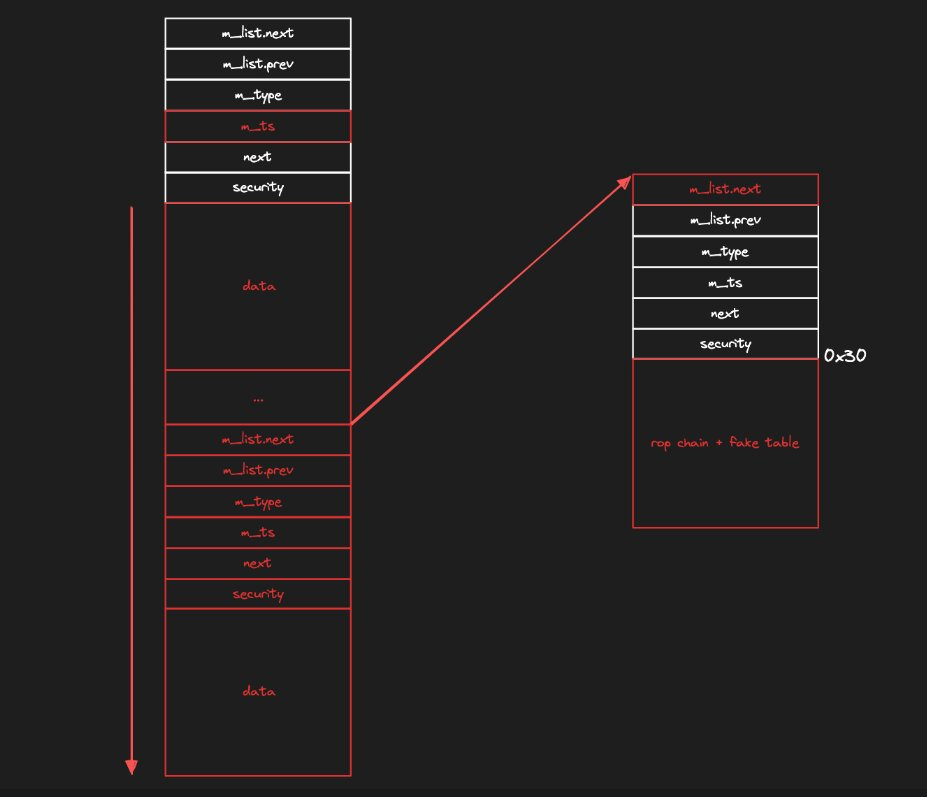</td>
<td>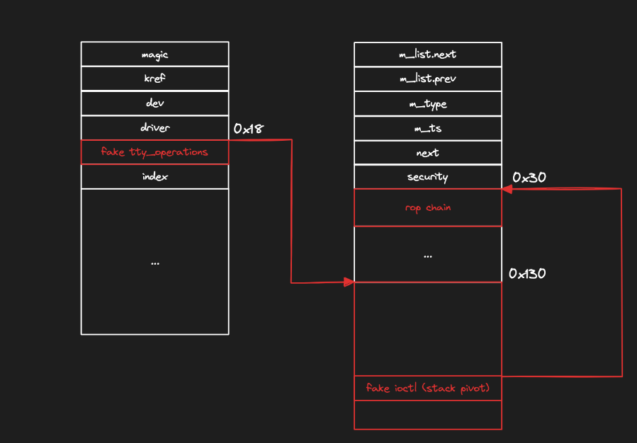</td>
</table></tr>
<table><tr>
<td>Quotes: <code>0</code></td>
<td>Replies: <code>1</code></td>
<td>Retweets: <code>20</code></td>
<td>Favorites: <code>87</code></td>
</tr></table>

---

# TheHackersNews
**https://twitter.com/TheHackersNews/status/1833350612349817192 _at 2024-09-10, 03:43:42_**
<blockquote>
UPDATE -- Critical flaw in SonicWall devices is under active exploitation by ransomware groups, warns Arctic Wolf and Rapid7.

The #vulnerability, CVE-2024-40766, could allow ransomware groups like Akira to access SSLVPN user accounts, posing a major threat to businesses. Stay
</blockquote>

<table><tr>
<td>Quotes: <code>0</code></td>
<td>Replies: <code>1</code></td>
<td>Retweets: <code>27</code></td>
<td>Favorites: <code>56</code></td>
</tr></table>

---

# kmkz_security
**https://twitter.com/kmkz_security/status/1833241815413362827 _at 2024-09-09, 20:31:23_**
<blockquote>
RT @watchtowrcyber: Happy Monday! watchTowr Labs member @SinSinology deep dives into Veeam Backup &amp; Response CVE-2024-40711 in our latest p…
</blockquote>

<table><tr>
<td>Quotes: <code>0</code></td>
<td>Replies: <code>0</code></td>
<td>Retweets: <code>43</code></td>
<td>Favorites: <code>0</code></td>
</tr></table>

---

# chybeta
**https://twitter.com/chybeta/status/1833184898913636424 _at 2024-09-09, 16:45:13_**
<blockquote>
CVE-2024-45507 Apache Ofbiz  SSRF to RCE https://t.co/GxKm4TUAGD
</blockquote>

<table><tr>
<td></td>
</table></tr>
<table><tr>
<td>Quotes: <code>3</code></td>
<td>Replies: <code>0</code></td>
<td>Retweets: <code>10</code></td>
<td>Favorites: <code>94</code></td>
</tr></table>

---

# wvuuuuuuuuuuuuu
**https://twitter.com/wvuuuuuuuuuuuuu/status/1833181543256170524 _at 2024-09-09, 16:31:53_**
<blockquote>
RT @watchtowrcyber: Happy Monday! watchTowr Labs member @SinSinology deep dives into Veeam Backup &amp; Response CVE-2024-40711 in our latest p…
</blockquote>

<table><tr>
<td>Quotes: <code>0</code></td>
<td>Replies: <code>0</code></td>
<td>Retweets: <code>37</code></td>
<td>Favorites: <code>0</code></td>
</tr></table>

---

# steventseeley
**https://twitter.com/steventseeley/status/1833171698092331342 _at 2024-09-09, 15:52:46_**
<blockquote>
RT @watchtowrcyber: Happy Monday! watchTowr Labs member @SinSinology deep dives into Veeam Backup &amp; Response CVE-2024-40711 in our latest p…
</blockquote>

<table><tr>
<td>Quotes: <code>0</code></td>
<td>Replies: <code>0</code></td>
<td>Retweets: <code>37</code></td>
<td>Favorites: <code>0</code></td>
</tr></table>

---

# HunterMapping
**https://twitter.com/HunterMapping/status/1833087466909106421 _at 2024-09-09, 10:18:03_**
<blockquote>
🚨Alert🚨CVE-2024-37288/CVE-2024-37285: Critical Kibana Flaws Expose Systems to Arbitrary Code Execution
📊 33.9K+ Services are found on https://t.co/ysWb28BTvF yearly
🔗Hunter Link:https://t.co/Xdrn76rGOr
👇Search Query
HUNTER:/product.name="Elastic Kibana"
FOFA: app="Kibana" https://t.co/3T7eYf2vmK
</blockquote>

* http://hunter.how
* https://hunter.how/list?searchValue=product.name%3D%22Elastic%20Kibana%22

<table><tr>
<td></td>
</table></tr>
<table><tr>
<td>Quotes: <code>0</code></td>
<td>Replies: <code>0</code></td>
<td>Retweets: <code>47</code></td>
<td>Favorites: <code>158</code></td>
</tr></table>

---

# TheHackersNews
**https://twitter.com/TheHackersNews/status/1833075600283873346 _at 2024-09-09, 09:30:54_**
<blockquote>
⚠️ Progress Software has released security updates for a critical #vulnerability (CVE-2024-7591) in LoadMaster &amp; Multi-Tenant hypervisors, allowing unauthenticated attackers to execute system commands.

https://t.co/BXPi2fuvHd

Don’t risk your infrastructure. Update systems now!
</blockquote>

* https://thehackernews.com/2024/09/progress-software-issues-patch-for.html

<table><tr>
<td>Quotes: <code>0</code></td>
<td>Replies: <code>0</code></td>
<td>Retweets: <code>11</code></td>
<td>Favorites: <code>41</code></td>
</tr></table>

---

# Netlas_io
**https://twitter.com/Netlas_io/status/1833071322693333321 _at 2024-09-09, 09:13:54_**
<blockquote>
CVE-2024-37288, -37285: RCE in Kibana, 9.9 rating 🔥🔥🔥

By improperly deserializing YAML, attackers can perform RCE.

Search at https://t.co/hv7QKSqxTR:
👉 Link: https://t.co/LIGOwwlyXP

#cybersecurity #vulnerability_map #kibana https://t.co/Xcq30MICca
</blockquote>

* http://Netlas.io
* https://nt.ls/cVF9O

<table><tr>
<td></td>
</table></tr>
<table><tr>
<td>Quotes: <code>0</code></td>
<td>Replies: <code>0</code></td>
<td>Retweets: <code>18</code></td>
<td>Favorites: <code>55</code></td>
</tr></table>

---

# Dinosn
**https://twitter.com/Dinosn/status/1832994123655106906 _at 2024-09-09, 04:07:09_**
<blockquote>
PoC Exploit Releases for Windows Elevation of Privilege Vulnerability CVE-2024-26230 https://t.co/QLuanb2PQl
</blockquote>

* https://securityonline.info/poc-exploit-releases-for-windows-elevation-of-privilege-vulnerability-cve-2024-26230/

<table><tr>
<td>Quotes: <code>0</code></td>
<td>Replies: <code>0</code></td>
<td>Retweets: <code>18</code></td>
<td>Favorites: <code>35</code></td>
</tr></table>

---

# 1ZRR4H
**https://twitter.com/1ZRR4H/status/1832971253239660768 _at 2024-09-09, 02:36:16_**
<blockquote>
Server with #opendir 213.109.147[.]108:4242 (now disabled) had an exploit for #CosmicSting (aka CVE-2024-34102), an Unauthorized XXE that combined with CVE-2024-2961 allows RCE in Magento and Adobe Commerce stores.

On the server there was a TXT file with about 3900 https://t.co/ABOcTPbJYR
</blockquote>

<table><tr>
<td></td>
<td></td>
</table></tr>
<table><tr>
<td>Quotes: <code>0</code></td>
<td>Replies: <code>0</code></td>
<td>Retweets: <code>18</code></td>
<td>Favorites: <code>38</code></td>
</tr></table>

---

# the_yellow_fall
**https://twitter.com/the_yellow_fall/status/1832958369327468653 _at 2024-09-09, 01:45:04_**
<blockquote>
PoC Exploit Releases for Windows Elevation of Privilege Vulnerability CVE-2024-26230

Get insights into the technical details and #PoC exploit of the serious elevation of privilege vulnerability (CVE-2024-26230) in #Windows Telephony service
https://t.co/le5JoUUfDC
</blockquote>

* https://securityonline.info/poc-exploit-releases-for-windows-elevation-of-privilege-vulnerability-cve-2024-26230/

<table><tr>
<td>Quotes: <code>0</code></td>
<td>Replies: <code>0</code></td>
<td>Retweets: <code>8</code></td>
<td>Favorites: <code>32</code></td>
</tr></table>

---

# ptracesecurity
**https://twitter.com/ptracesecurity/status/1832947092060262894 _at 2024-09-09, 01:00:15_**
<blockquote>
Windows DWM Core Library Elevation of Privilege Vulnerability (CVE-2024-30051) https://t.co/4V41ipglcm  #Pentesting #Windows #Vulnerability  #CyberSecurity #Infosec https://t.co/X1PLkbQz3H
</blockquote>

* https://www.coresecurity.com/core-labs/articles/windows-dwm-core-library-elevation-privilege-vulnerability-cve-2024-30051

<table><tr>
<td></td>
<td></td>
<td></td>
<td></td>
</table></tr>
<table><tr>
<td>Quotes: <code>0</code></td>
<td>Replies: <code>0</code></td>
<td>Retweets: <code>10</code></td>
<td>Favorites: <code>45</code></td>
</tr></table>

---

# SinSinology
**https://twitter.com/SinSinology/status/1832938871148908628 _at 2024-09-09, 00:27:35_**
<blockquote>
After not sleeping for 2 days, I finally cooked the exploit, unauthenticated RCE against Veeam backup and Replication CVE-2024-40711, Imma go sleep now https://t.co/qzuLSVfSr6
</blockquote>

<table><tr>
<td></td>
</table></tr>
<table><tr>
<td>Quotes: <code>2</code></td>
<td>Replies: <code>5</code></td>
<td>Retweets: <code>11</code></td>
<td>Favorites: <code>117</code></td>
</tr></table>

---

# ptracesecurity
**https://twitter.com/ptracesecurity/status/1832628733175320900 _at 2024-09-08, 03:55:13_**
<blockquote>
Windows DWM Core Library Elevation of Privilege Vulnerability (CVE-2024-30051) (Published August 15 of 2024) https://t.co/SUtsE2GLZK #Pentesting #Windows #exploit #CyberSecurity #Infosec https://t.co/hmKcfDFvYf
</blockquote>

* https://github.com/fortra/CVE-2024-30051?tab=readme-ov-file

<table><tr>
<td></td>
<td></td>
<td></td>
<td></td>
</table></tr>
<table><tr>
<td>Quotes: <code>0</code></td>
<td>Replies: <code>1</code></td>
<td>Retweets: <code>17</code></td>
<td>Favorites: <code>68</code></td>
</tr></table>

---

# 0xdf_
**https://twitter.com/0xdf_/status/1832433834752618649 _at 2024-09-07, 15:00:45_**
<blockquote>
Mailing from @hackthebox_eu has a file read leak hMailServer creds. Then I abuse CVE-2024-21413 through phishing to get more creds. For root, I'll exploit LibreOffice. In Beyond Root, I'll show the patched LFI to RCE via log poisoning and GodPotato.

https://t.co/WrLMQwopzk
</blockquote>

* https://0xdf.gitlab.io/2024/09/07/htb-mailing.html

<table><tr>
<td>Quotes: <code>0</code></td>
<td>Replies: <code>0</code></td>
<td>Retweets: <code>29</code></td>
<td>Favorites: <code>106</code></td>
</tr></table>

---

# binitamshah
**https://twitter.com/binitamshah/status/1832142301600334198 _at 2024-09-06, 19:42:18_**
<blockquote>
Windows Wi-Fi Driver RCE Vulnerability – CVE-2024-30078 : https://t.co/FoWALEWo6g credits @crowdfense @Void_Sec https://t.co/KbsLeLfPHB
</blockquote>

* https://www.crowdfense.com/windows-wi-fi-driver-rce-vulnerability-cve-2024-30078/

<table><tr>
<td></td>
<td>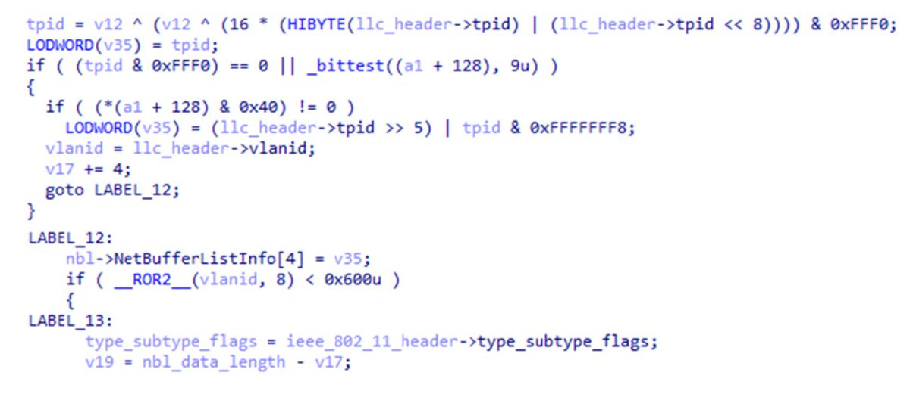</td>
</table></tr>
<table><tr>
<td>Quotes: <code>0</code></td>
<td>Replies: <code>1</code></td>
<td>Retweets: <code>18</code></td>
<td>Favorites: <code>71</code></td>
</tr></table>

---

# TheHackersNews
**https://twitter.com/TheHackersNews/status/1832085449860657156 _at 2024-09-06, 15:56:24_**
<blockquote>
🔥 A SonicWall #vulnerability (CVE-2024-40766) is under active exploitation.

This critical flaw allows attackers to bypass access controls and potentially crash firewalls, compromising business operations. Don't wait.

https://t.co/0jpl20wOAC

Patch now or risk falling victim.
</blockquote>

* https://thehackernews.com/2024/09/sonicwall-urges-users-to-patch-critical.html

<table><tr>
<td>Quotes: <code>3</code></td>
<td>Replies: <code>2</code></td>
<td>Retweets: <code>39</code></td>
<td>Favorites: <code>84</code></td>
</tr></table>

---

# kmkz_security
**https://twitter.com/kmkz_security/status/1832084266475491570 _at 2024-09-06, 15:51:42_**
<blockquote>
RT @cyber_advising: CVE-2024-30051: Windows DWM Core Library Elevation of Privilege Vulnerability.

PoC
https://t.co/iLkOkqmBft https://t.c…
</blockquote>

* https://github.com/fortra/CVE-2024-30051?tab=readme-ov-file

<table><tr>
<td>Quotes: <code>0</code></td>
<td>Replies: <code>0</code></td>
<td>Retweets: <code>35</code></td>
<td>Favorites: <code>0</code></td>
</tr></table>

---

# kmkz_security
**https://twitter.com/kmkz_security/status/1832084186343305274 _at 2024-09-06, 15:51:23_**
<blockquote>
RT @CoreAdvisories: In his latest blog, Core Labs' @ricnar456 takes a deep dive into CVE-2024-30051, reversing this Windows #vulnerability…
</blockquote>

<table><tr>
<td>Quotes: <code>0</code></td>
<td>Replies: <code>0</code></td>
<td>Retweets: <code>57</code></td>
<td>Favorites: <code>0</code></td>
</tr></table>

---

# CoreAdvisories
**https://twitter.com/CoreAdvisories/status/1832067618531868799 _at 2024-09-06, 14:45:33_**
<blockquote>
In his latest blog, Core Labs' @ricnar456 takes a deep dive into CVE-2024-30051, reversing this Windows #vulnerability to create a functional #PoC.  https://t.co/WIEyx3Zjoi https://t.co/mSsMe2QQFT
</blockquote>

* https://www.coresecurity.com/core-labs/articles/windows-dwm-core-library-elevation-privilege-vulnerability-cve-2024-30051

<table><tr>
<td></td>
</table></tr>
<table><tr>
<td>Quotes: <code>0</code></td>
<td>Replies: <code>1</code></td>
<td>Retweets: <code>57</code></td>
<td>Favorites: <code>199</code></td>
</tr></table>

---

# kmkz_security
**https://twitter.com/kmkz_security/status/1832008874313822622 _at 2024-09-06, 10:52:07_**
<blockquote>
RT @theori_io: 🚨 New Linux Kernel vulnerability (CVE-2024-27394) discovered &amp; patched by Theori! 
🔗 https://t.co/p9hDC5b3xI

Our researcher…
</blockquote>

* https://blog.theori.io/deep-dive-into-rcu-race-condition-analysis-of-tcp-ao-uaf-cve-2024-27394-f40508b84c42?source=social.tw

<table><tr>
<td>Quotes: <code>0</code></td>
<td>Replies: <code>0</code></td>
<td>Retweets: <code>44</code></td>
<td>Favorites: <code>0</code></td>
</tr></table>

---

# TheHackersNews
**https://twitter.com/TheHackersNews/status/1831984376156176422 _at 2024-09-06, 09:14:46_**
<blockquote>
New LiteSpeed Cache flaw (CVE-2024-44000) risks unauthorized access to WordPress sites via exposed debug logs.

Read: https://t.co/4WyY7bavlB

Even old logs can be exploited. Update and purge now!
</blockquote>

* https://thehackernews.com/2024/09/critical-security-flaw-found-in.html

<table><tr>
<td>Quotes: <code>1</code></td>
<td>Replies: <code>1</code></td>
<td>Retweets: <code>16</code></td>
<td>Favorites: <code>38</code></td>
</tr></table>

---

# kmkz_security
**https://twitter.com/kmkz_security/status/1831977249400307733 _at 2024-09-06, 08:46:27_**
<blockquote>
RT @watchtowrcyber: despite shenanigans with CVSS scores, we can confirm the latest Veeam vulnerabilities (CVE-2024-40711) allow auth bypas…
</blockquote>

<table><tr>
<td>Quotes: <code>0</code></td>
<td>Replies: <code>0</code></td>
<td>Retweets: <code>39</code></td>
<td>Favorites: <code>0</code></td>
</tr></table>

---

# 0xor0ne
**https://twitter.com/0xor0ne/status/1831950483486843230 _at 2024-09-06, 07:00:05_**
<blockquote>
Achieving unauthenticated remote code execution on IoT smart lights (CVE-2022-47758)

https://t.co/ehSBmZk6hc

Credits @notselwyn

#infosec #iot https://t.co/7TaAJccy3V
</blockquote>

* https://pwning.tech/cve-2022-47758/

<table><tr>
<td></td>
<td></td>
</table></tr>
<table><tr>
<td>Quotes: <code>0</code></td>
<td>Replies: <code>0</code></td>
<td>Retweets: <code>26</code></td>
<td>Favorites: <code>102</code></td>
</tr></table>

---

# theori_io
**https://twitter.com/theori_io/status/1831936617260708138 _at 2024-09-06, 06:04:59_**
<blockquote>
🚨 New Linux Kernel vulnerability (CVE-2024-27394) discovered &amp; patched by Theori! 
🔗 https://t.co/p9hDC5b3xI

Our researcher @v4bel at #Theori identified a critical #UAF vulnerability in TCP-AO caused by a race condition in the #RCU API. Using techniques from the ExpRace paper,
</blockquote>

* https://blog.theori.io/deep-dive-into-rcu-race-condition-analysis-of-tcp-ao-uaf-cve-2024-27394-f40508b84c42?source=social.tw

<table><tr>
<td>Quotes: <code>2</code></td>
<td>Replies: <code>0</code></td>
<td>Retweets: <code>44</code></td>
<td>Favorites: <code>156</code></td>
</tr></table>

---

# kmkz_security
**https://twitter.com/kmkz_security/status/1831932544516026751 _at 2024-09-06, 05:48:48_**
<blockquote>
RT @crowdfense: For our second technical post, we have an analysis of a Windows RCE vulnerability in the Wi-Fi driver (CVE-2024-30078), whi…
</blockquote>

<table><tr>
<td>Quotes: <code>0</code></td>
<td>Replies: <code>0</code></td>
<td>Retweets: <code>49</code></td>
<td>Favorites: <code>0</code></td>
</tr></table>

---

# HunterMapping
**https://twitter.com/HunterMapping/status/1831896961441513726 _at 2024-09-06, 03:27:25_**
<blockquote>
🚨Alert🚨CVE-2024-6670: Breaking Down Barriers: Exploiting Pre-Auth SQL Injection in Progress  WhatsUp Gold
🔥PoC: https://t.co/YPXjqGko0q
🧐Deep Dive:https://t.co/TxXiegi1BY
📊 3.4K+ Services are found on https://t.co/ysWb28BTvF yearly
🔗Hunter Link:https://t.co/tO9fyS5RQZ https://t.co/l39P5kVMw7
</blockquote>

* https://summoning.team/blog/progress-whatsup-gold-sqli-cve-2024-6670/
* http://hunter.how
* https://hunter.how/list?searchValue=product.name%3D%22Progress%20Whatsup%20Gold%22
* https://github.com/sinsinology/CVE-2024-6670

<table><tr>
<td></td>
</table></tr>
<table><tr>
<td>Quotes: <code>0</code></td>
<td>Replies: <code>1</code></td>
<td>Retweets: <code>14</code></td>
<td>Favorites: <code>34</code></td>
</tr></table>

---

# Dinosn
**https://twitter.com/Dinosn/status/1831896032114036865 _at 2024-09-06, 03:23:43_**
<blockquote>
CVE-2024-26581 PoC Exploit Released: Linux Systems at Risk of Root Compromise https://t.co/W9d9FOm9zb
</blockquote>

* https://securityonline.info/cve-2024-26581-poc-exploit-released-linux-systems-at-risk-of-root-compromise/

<table><tr>
<td>Quotes: <code>0</code></td>
<td>Replies: <code>0</code></td>
<td>Retweets: <code>18</code></td>
<td>Favorites: <code>40</code></td>
</tr></table>

---

# wvuuuuuuuuuuuuu
**https://twitter.com/wvuuuuuuuuuuuuu/status/1831867583492190563 _at 2024-09-06, 01:30:41_**
<blockquote>
RT @watchtowrcyber: despite shenanigans with CVSS scores, we can confirm the latest Veeam vulnerabilities (CVE-2024-40711) allow auth bypas…
</blockquote>

<table><tr>
<td>Quotes: <code>0</code></td>
<td>Replies: <code>0</code></td>
<td>Retweets: <code>39</code></td>
<td>Favorites: <code>0</code></td>
</tr></table>

---

# ptracesecurity
**https://twitter.com/ptracesecurity/status/1831822183582081324 _at 2024-09-05, 22:30:16_**
<blockquote>
Windows Wi-Fi Driver RCE Vulnerability – CVE-2024-30078 https://t.co/DxjvKNQpOw  #Pentesting #Vulnerability #Windows  #CyberSecurity #Infosec https://t.co/24WqVyAoGF
</blockquote>

* https://www.crowdfense.com/windows-wi-fi-driver-rce-vulnerability-cve-2024-30078/

<table><tr>
<td></td>
<td></td>
<td></td>
<td></td>
</table></tr>
<table><tr>
<td>Quotes: <code>0</code></td>
<td>Replies: <code>0</code></td>
<td>Retweets: <code>5</code></td>
<td>Favorites: <code>33</code></td>
</tr></table>

---

# wvuuuuuuuuuuuuu
**https://twitter.com/wvuuuuuuuuuuuuu/status/1831784629260710400 _at 2024-09-05, 20:01:03_**
<blockquote>
RT @TheHackersNews: ⚠️ Veeam has patched 18 security flaws, including 5 critical ones allowing remote code execution (e.g., CVE-2024-40711…
</blockquote>

<table><tr>
<td>Quotes: <code>0</code></td>
<td>Replies: <code>0</code></td>
<td>Retweets: <code>71</code></td>
<td>Favorites: <code>0</code></td>
</tr></table>

---

# wvuuuuuuuuuuuuu
**https://twitter.com/wvuuuuuuuuuuuuu/status/1831783895978930528 _at 2024-09-05, 19:58:08_**
<blockquote>
RT @codewhitesec: Better patch your Veeam Backup &amp; Replication servers! Full system takeover via CVE-2024-40711, discovered by our very own…
</blockquote>

<table><tr>
<td>Quotes: <code>0</code></td>
<td>Replies: <code>0</code></td>
<td>Retweets: <code>95</code></td>
<td>Favorites: <code>0</code></td>
</tr></table>

---

# three_cube
**https://twitter.com/three_cube/status/1831743572565184945 _at 2024-09-05, 17:17:54_**
<blockquote>
Using the Brand New (CVE-2024-38063) IPv6 Vulnerability to Crash a Windows System #ipv6 #bsod #cybersecurity #dos #infosec #cyberwarrior

https://t.co/i0Rn2wTQyG https://t.co/cMBd35S2vA
</blockquote>

* https://www.hackers-arise.com/post/using-the-brand-new-ipv6-exploit-to-dos-a-windows-system

<table><tr>
<td></td>
</table></tr>
<table><tr>
<td>Quotes: <code>0</code></td>
<td>Replies: <code>1</code></td>
<td>Retweets: <code>15</code></td>
<td>Favorites: <code>54</code></td>
</tr></table>

---

# ptracesecurity
**https://twitter.com/ptracesecurity/status/1831731581888712756 _at 2024-09-05, 16:30:15_**
<blockquote>
CVE-2020-27786 ( Race Condition + Use-After-Free ) 
 https://t.co/kDOdv6PIqb  #Pentesting #CyberSecurity #Infosec https://t.co/JChrN2wvtO
</blockquote>

* https://ii4gsp.github.io/cve-2020-27786/

<table><tr>
<td></td>
<td></td>
<td></td>
<td></td>
</table></tr>
<table><tr>
<td>Quotes: <code>0</code></td>
<td>Replies: <code>0</code></td>
<td>Retweets: <code>7</code></td>
<td>Favorites: <code>33</code></td>
</tr></table>

---

# TheHackersNews
**https://twitter.com/TheHackersNews/status/1831727612802285936 _at 2024-09-05, 16:14:29_**
<blockquote>
⚠️ Veeam has patched 18 security flaws, including 5 critical ones allowing remote code execution (e.g., CVE-2024-40711 with a 9.8 CVSS score). Update now to protect your data.

Learn more: https://t.co/0WwDkTUFx8

#cybersecurity #technology
</blockquote>

* https://thehackernews.com/2024/09/veeam-releases-security-updates-to-fix.html

<table><tr>
<td>Quotes: <code>0</code></td>
<td>Replies: <code>2</code></td>
<td>Retweets: <code>52</code></td>
<td>Favorites: <code>91</code></td>
</tr></table>

---

# crowdfense
**https://twitter.com/crowdfense/status/1831723971500265765 _at 2024-09-05, 16:00:01_**
<blockquote>
For our second technical post, we have an analysis of a Windows RCE vulnerability in the Wi-Fi driver (CVE-2024-30078), which includes a detailed root cause analysis and exploitation constraints. Enjoy :)

https://t.co/llaW6l6TlC
</blockquote>

* https://www.crowdfense.com/windows-wi-fi-driver-rce-vulnerability-cve-2024-30078/

<table><tr>
<td>Quotes: <code>2</code></td>
<td>Replies: <code>0</code></td>
<td>Retweets: <code>49</code></td>
<td>Favorites: <code>144</code></td>
</tr></table>

---

# fdfalcon
**https://twitter.com/fdfalcon/status/1831723329910124613 _at 2024-09-05, 15:57:28_**
<blockquote>
CVE-2024-41928: VM escape in FreeBSD's bhyve hypervisor via TPM device passthrough, by @Synacktiv

https://t.co/TrSYKoKSu8
</blockquote>

* https://www.freebsd.org/security/advisories/FreeBSD-SA-24:10.bhyve.asc

<table><tr>
<td>Quotes: <code>0</code></td>
<td>Replies: <code>1</code></td>
<td>Retweets: <code>13</code></td>
<td>Favorites: <code>50</code></td>
</tr></table>

---

# codewhitesec
**https://twitter.com/codewhitesec/status/1831720125747069389 _at 2024-09-05, 15:44:44_**
<blockquote>
Better patch your Veeam Backup &amp; Replication servers! Full system takeover via CVE-2024-40711, discovered by our very own @frycos - no technical details from us this time because this might instantly be abused by ransomware gangs https://t.co/pGLq1RQi3n https://t.co/uUkRA2wgji
</blockquote>

* https://code-white.com/public-vulnerability-list/#unauthenticated-remote-code-execution-in-backup-replication

<table><tr>
<td></td>
</table></tr>
<table><tr>
<td>Quotes: <code>2</code></td>
<td>Replies: <code>4</code></td>
<td>Retweets: <code>75</code></td>
<td>Favorites: <code>208</code></td>
</tr></table>

---

# thezdi
**https://twitter.com/thezdi/status/1831719997862752646 _at 2024-09-05, 15:44:13_**
<blockquote>
In the 1st of a 4 part series, @chudyPB details his research into exploiting #Microsoft #Exchange after ProxyNotShell was patched. Today's post covers CVE-2023-21529: abuse of the allowed MultiValuedProperty class for RCE. Check it out at https://t.co/FRN8VEalB7
</blockquote>

* https://www.zerodayinitiative.com/blog/2024/9/4/exploiting-exchange-powershell-after-proxynotshell-part-1-multivaluedproperty

<table><tr>
<td>Quotes: <code>2</code></td>
<td>Replies: <code>1</code></td>
<td>Retweets: <code>27</code></td>
<td>Favorites: <code>75</code></td>
</tr></table>

---

# linkersec
**https://twitter.com/linkersec/status/1831693325394391191 _at 2024-09-05, 13:58:14_**
<blockquote>
CVE-2020-27786 (Race Condition + Use-After-Free)

An article by @ii4gsp about exploiting a racy use-after-free in the MIDI subsystem.

https://t.co/jUQgPnDjLd https://t.co/eTaYMmcQSZ
</blockquote>

* https://ii4gsp.github.io/cve-2020-27786/

<table><tr>
<td></td>
</table></tr>
<table><tr>
<td>Quotes: <code>0</code></td>
<td>Replies: <code>0</code></td>
<td>Retweets: <code>19</code></td>
<td>Favorites: <code>79</code></td>
</tr></table>

---

# RedDrip7
**https://twitter.com/RedDrip7/status/1831641279186530738 _at 2024-09-05, 10:31:25_**
<blockquote>
Analysis of Windows DWM #EoP vuln (#CVE-2024-30051) in-the-wild exploitation sample and root cause

https://t.co/xUMTGuhnQD https://t.co/1TLu5Arq4O
</blockquote>

* https://ti.qianxin.com/blog/articles/public-secret-research-on-the-cve-2024-30051-privilege-escalation-vulnerability-in-the-wild-en/

<table><tr>
<td></td>
<td></td>
</table></tr>
<table><tr>
<td>Quotes: <code>3</code></td>
<td>Replies: <code>0</code></td>
<td>Retweets: <code>23</code></td>
<td>Favorites: <code>51</code></td>
</tr></table>

---

# TheHackersNews
**https://twitter.com/TheHackersNews/status/1831553777129943331 _at 2024-09-05, 04:43:43_**
<blockquote>
Cisco has issued urgent updates for two critical flaws (CVSS 9.8) in its Smart Licensing Utility. These flaws (CVE-2024-20439 &amp; CVE-2024-20440) let unauthenticated attackers elevate privileges or access sensitive data via crafted HTTP requests.

Read: https://t.co/x7j8s1TIEv
</blockquote>

* https://thehackernews.com/2024/09/cisco-fixes-two-critical-flaws-in-smart.html

<table><tr>
<td>Quotes: <code>5</code></td>
<td>Replies: <code>1</code></td>
<td>Retweets: <code>75</code></td>
<td>Favorites: <code>150</code></td>
</tr></table>

---

# TheHackersNews
**https://twitter.com/TheHackersNews/status/1831325852677845164 _at 2024-09-04, 13:38:02_**
<blockquote>
#Google has issued a update to fix the high-severity Android #vulnerability CVE-2024-32896, which allows attackers to take control of your device. Initially affecting Pixel devices, it now impacts the entire #Android ecosystem.

Read: https://t.co/MUi34tgq4O

#infosec #hacking
</blockquote>

* https://thehackernews.com/2024/09/google-confirms-cve-2024-32896.html

<table><tr>
<td>Quotes: <code>15</code></td>
<td>Replies: <code>6</code></td>
<td>Retweets: <code>120</code></td>
<td>Favorites: <code>182</code></td>
</tr></table>

---

# TheHackersNews
**https://twitter.com/TheHackersNews/status/1831293745465295102 _at 2024-09-04, 11:30:27_**
<blockquote>
Zyxel has patched a critical #vulnerability (CVE-2024-7261) that allowed unauthenticated attackers to execute OS commands on certain routers and access points.

Learn more: https://t.co/DH25VvoIC2

#CyberSecurity
</blockquote>

* https://thehackernews.com/2024/09/zyxel-patches-critical-os-command.html

<table><tr>
<td>Quotes: <code>2</code></td>
<td>Replies: <code>0</code></td>
<td>Retweets: <code>32</code></td>
<td>Favorites: <code>63</code></td>
</tr></table>

---

# 0xor0ne
**https://twitter.com/0xor0ne/status/1831225795164926263 _at 2024-09-04, 07:00:26_**
<blockquote>
Patch diffing  CVE-2024-20696 (libarchive vulnerability) and CVE-2024-20697 using Ghidriff

https://t.co/dextETvFy5

Credits @clearbluejar

#libarchive #infosec https://t.co/yxnSdcEB5V
</blockquote>

* https://clearbluejar.github.io/posts/patch-tuesday-diffing-cve-2024-20696-windows-libarchive-rce/

<table><tr>
<td></td>
<td></td>
</table></tr>
<table><tr>
<td>Quotes: <code>0</code></td>
<td>Replies: <code>1</code></td>
<td>Retweets: <code>61</code></td>
<td>Favorites: <code>249</code></td>
</tr></table>

---

# kmkz_security
**https://twitter.com/kmkz_security/status/1831224124972114066 _at 2024-09-04, 06:53:48_**
<blockquote>
RT @virusbtn: Trend Micro researchers have identified a new attack vector that exploits CVE-2023-22527 through the deployment of an in-memo…
</blockquote>

<table><tr>
<td>Quotes: <code>0</code></td>
<td>Replies: <code>0</code></td>
<td>Retweets: <code>34</code></td>
<td>Favorites: <code>0</code></td>
</tr></table>

---

# tbbhunter
**https://twitter.com/tbbhunter/status/1831063223803502883 _at 2024-09-03, 20:14:26_**
<blockquote>
CVE-2024-37084: Spring Cloud Remote Code Execution

https://t.co/vIE9sQmo3a
</blockquote>

* https://blog.securelayer7.net/spring-cloud-skipper-vulnerability/

<table><tr>
<td>Quotes: <code>1</code></td>
<td>Replies: <code>0</code></td>
<td>Retweets: <code>19</code></td>
<td>Favorites: <code>49</code></td>
</tr></table>

---

# cyb3rops
**https://twitter.com/cyb3rops/status/1830957600948789756 _at 2024-09-03, 13:14:44_**
<blockquote>
RT @Dinosn: CVE-2024-8105: An UEFI Flaw Putting Millions of Devices at Risk https://t.co/1cAD2DAzFk
</blockquote>

* https://securityonline.info/cve-2024-8105-an-uefi-flaw-putting-millions-of-devices-at-risk/

<table><tr>
<td>Quotes: <code>0</code></td>
<td>Replies: <code>0</code></td>
<td>Retweets: <code>87</code></td>
<td>Favorites: <code>0</code></td>
</tr></table>

---

# kmkz_security
**https://twitter.com/kmkz_security/status/1830741472741568989 _at 2024-09-02, 22:55:55_**
<blockquote>
RT @ksg93rd: #exploit
1. CVE-2024-20017:
MediaTek wappd Buffer Overflow
https://t.co/ie31ghtbiz

2. CVE-2023-41111:
Samsung Baseband RLC Da…
</blockquote>

* https://blog.coffinsec.com/0day/2024/08/30/exploiting-CVE-2024-20017-four-different-ways.html

<table><tr>
<td>Quotes: <code>0</code></td>
<td>Replies: <code>0</code></td>
<td>Retweets: <code>41</code></td>
<td>Favorites: <code>0</code></td>
</tr></table>

---

# ksg93rd
**https://twitter.com/ksg93rd/status/1830697211606237474 _at 2024-09-02, 20:00:02_**
<blockquote>
#exploit
1. CVE-2024-20017:
MediaTek wappd Buffer Overflow
https://t.co/ie31ghtbiz

2. CVE-2023-41111:
Samsung Baseband RLC Data Re-Assembly Buffer Overflow
https://t.co/yMx5XB65Zk
</blockquote>

* https://blog.coffinsec.com/0day/2024/08/30/exploiting-CVE-2024-20017-four-different-ways.html
* https://labs.taszk.io/blog/post/93_rlc_bof

<table><tr>
<td>Quotes: <code>0</code></td>
<td>Replies: <code>0</code></td>
<td>Retweets: <code>49</code></td>
<td>Favorites: <code>126</code></td>
</tr></table>

---

# momika233
**https://twitter.com/momika233/status/1830619250404590074 _at 2024-09-02, 14:50:15_**
<blockquote>
RT @HunterMapping: 🤖CVE-2024-43044: Critical Jenkins Vulnerability Exposes Servers to RCE, PoC Exploit Published
🔥PoC: https://t.co/87CR2g6…
</blockquote>

<table><tr>
<td>Quotes: <code>0</code></td>
<td>Replies: <code>0</code></td>
<td>Retweets: <code>190</code></td>
<td>Favorites: <code>0</code></td>
</tr></table>

---

# unpacker
**https://twitter.com/unpacker/status/1830593281207697782 _at 2024-09-02, 13:07:03_**
<blockquote>
Korean-speaking threat actors are on fire!🔥 Their adoption of 0-days proves once again just how resourceful, skilled, and surprisingly agile they are these days.

🕵️‍♂️ Group: APT-C-60
🏠 Origin: Known as 🇰🇷
💥 0-day: CVE-2024-7262 and CVE-2024-7263
🔗 Ref: https://t.co/ac3BglWvPf
</blockquote>

* https://www.welivesecurity.com/en/eset-research/analysis-of-two-arbitrary-code-execution-vulnerabilities-affecting-wps-office/

<table><tr>
<td>Quotes: <code>2</code></td>
<td>Replies: <code>2</code></td>
<td>Retweets: <code>39</code></td>
<td>Favorites: <code>143</code></td>
</tr></table>

---

# virusbtn
**https://twitter.com/virusbtn/status/1830538573537296579 _at 2024-09-02, 09:29:40_**
<blockquote>
Microsoft researchers share details on the North Korean threat actor Citrine Sleet and the observed tactics, techniques and procedures (TTPs) used to exploit CVE-2024-7971, deploy the FudModule rootkit, and compromise systems. https://t.co/b9pIhYqpF5 https://t.co/ehWY6EY6GA
</blockquote>

* https://www.microsoft.com/en-us/security/blog/2024/08/30/north-korean-threat-actor-citrine-sleet-exploiting-chromium-zero-day/

<table><tr>
<td></td>
</table></tr>
<table><tr>
<td>Quotes: <code>1</code></td>
<td>Replies: <code>0</code></td>
<td>Retweets: <code>23</code></td>
<td>Favorites: <code>47</code></td>
</tr></table>

---

# HunterMapping
**https://twitter.com/HunterMapping/status/1830488268502159869 _at 2024-09-02, 06:09:46_**
<blockquote>
🤖CVE-2024-43044: Critical Jenkins Vulnerability Exposes Servers to RCE, PoC Exploit Published
🔥PoC: https://t.co/87CR2g6bUD
🧐Deep Dive:https://t.co/1aCH9N8wul https://t.co/mxkynjmp1k
</blockquote>

* https://github.com/convisolabs/CVE-2024-43044-jenkins
* https://blog.convisoappsec.com/en/analysis-of-cve-2024-43044/

<table><tr>
<td>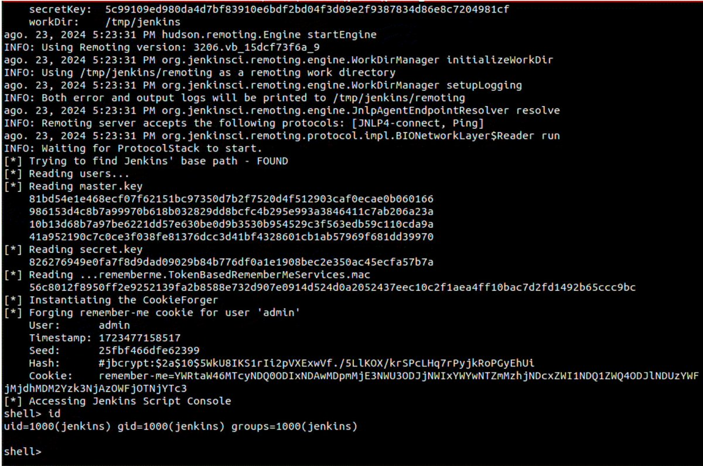</td>
</table></tr>
<table><tr>
<td>Quotes: <code>6</code></td>
<td>Replies: <code>0</code></td>
<td>Retweets: <code>189</code></td>
<td>Favorites: <code>591</code></td>
</tr></table>

---

# Dinosn
**https://twitter.com/Dinosn/status/1830452871483056183 _at 2024-09-02, 03:49:07_**
<blockquote>
CVE-2024-43044: Critical Jenkins Vulnerability Exposes Servers to RCE, PoC Exploit Published https://t.co/F7Jof6PvRe
</blockquote>

* https://securityonline.info/cve-2024-43044-critical-jenkins-vulnerability-exposes-servers-to-rce-poc-exploit-published/

<table><tr>
<td>Quotes: <code>0</code></td>
<td>Replies: <code>0</code></td>
<td>Retweets: <code>21</code></td>
<td>Favorites: <code>97</code></td>
</tr></table>

---

# __kokumoto
**https://twitter.com/__kokumoto/status/1830446836030861526 _at 2024-09-02, 03:25:08_**
<blockquote>
Jenkinsにおける重大(Critical)な脆弱性、CVE-2024-43044に対応するPoC（攻撃の概念実証コード）が公開された。任意コマンド実行により認証情報をダンプ可能なもの。 https://t.co/IWUy43opgZ
</blockquote>

* https://securityonline.info/cve-2024-43044-critical-jenkins-vulnerability-exposes-servers-to-rce-poc-exploit-published/

<table><tr>
<td>Quotes: <code>0</code></td>
<td>Replies: <code>1</code></td>
<td>Retweets: <code>17</code></td>
<td>Favorites: <code>33</code></td>
</tr></table>

---

# kmkz_security
**https://twitter.com/kmkz_security/status/1830235511782584382 _at 2024-09-01, 13:25:24_**
<blockquote>
RT @hackyboiz: [Research] Hyper-V 1-day Class: CVE-2024-38080
이번 연구글은 Hyper-V LPE 취약점인 CVE-2024-38080 patch diffing, poc 작성입니다. 익스플로잇은 못했습니…
</blockquote>

<table><tr>
<td>Quotes: <code>0</code></td>
<td>Replies: <code>0</code></td>
<td>Retweets: <code>31</code></td>
<td>Favorites: <code>0</code></td>
</tr></table>

---

# 0xor0ne
**https://twitter.com/0xor0ne/status/1830146076742938638 _at 2024-09-01, 07:30:01_**
<blockquote>
Well written blog post on exploiting a Use-after-Free (UaF) in Linux kernel (CVE-2024-0582, io_uring)

https://t.co/8eKtsR9t8G

Credits Oriol Castejón (@XI_Research)

#iouring #infosec https://t.co/AyTftwdFRm
</blockquote>

* https://blog.exodusintel.com/2024/03/27/mind-the-patch-gap-exploiting-an-io_uring-vulnerability-in-ubuntu/

<table><tr>
<td></td>
</table></tr>
<table><tr>
<td>Quotes: <code>0</code></td>
<td>Replies: <code>0</code></td>
<td>Retweets: <code>52</code></td>
<td>Favorites: <code>228</code></td>
</tr></table>

---

# kmkz_security
**https://twitter.com/kmkz_security/status/1830144422090080619 _at 2024-09-01, 07:23:27_**
<blockquote>
RT @gh0st_R1d3r_0x9: Wrote a thing at https://t.co/e9kBTZM2Ld

N-day analysis of CVE-2023-29360

Feedbacks welcomed. Tried to keep it short…
</blockquote>

* https://seg-fault.gitbook.io/researchs/windows-security-research/exploit-development/mskssrv.sys-cve-2023-29360

<table><tr>
<td>Quotes: <code>0</code></td>
<td>Replies: <code>0</code></td>
<td>Retweets: <code>56</code></td>
<td>Favorites: <code>0</code></td>
</tr></table>

---

