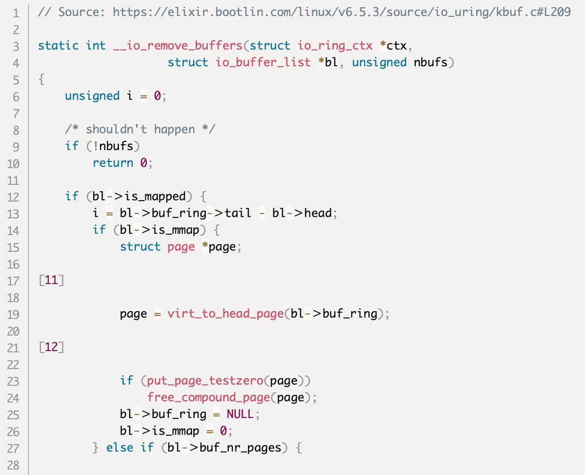

# 0xor0ne
**https://twitter.com/0xor0ne/status/1831225795164926263 _at 2024-09-04, 07:00:26_**
<blockquote>
Patch diffing  CVE-2024-20696 (libarchive vulnerability) and CVE-2024-20697 using Ghidriff

https://t.co/dextETvFy5

Credits @clearbluejar

#libarchive #infosec https://t.co/yxnSdcEB5V
</blockquote>

* https://clearbluejar.github.io/posts/patch-tuesday-diffing-cve-2024-20696-windows-libarchive-rce/

<table><tr>
<td></td>
<td></td>
</table></tr>
<table><tr>
<td>Quotes: <code>0</code></td>
<td>Replies: <code>1</code></td>
<td>Retweets: <code>61</code></td>
<td>Favorites: <code>249</code></td>
</tr></table>

---

# kmkz_security
**https://twitter.com/kmkz_security/status/1831224124972114066 _at 2024-09-04, 06:53:48_**
<blockquote>
RT @virusbtn: Trend Micro researchers have identified a new attack vector that exploits CVE-2023-22527 through the deployment of an in-memo…
</blockquote>

<table><tr>
<td>Quotes: <code>0</code></td>
<td>Replies: <code>0</code></td>
<td>Retweets: <code>34</code></td>
<td>Favorites: <code>0</code></td>
</tr></table>

---

# cyb3rops
**https://twitter.com/cyb3rops/status/1830957600948789756 _at 2024-09-03, 13:14:44_**
<blockquote>
RT @Dinosn: CVE-2024-8105: An UEFI Flaw Putting Millions of Devices at Risk https://t.co/1cAD2DAzFk
</blockquote>

* https://securityonline.info/cve-2024-8105-an-uefi-flaw-putting-millions-of-devices-at-risk/

<table><tr>
<td>Quotes: <code>0</code></td>
<td>Replies: <code>0</code></td>
<td>Retweets: <code>87</code></td>
<td>Favorites: <code>0</code></td>
</tr></table>

---

# kmkz_security
**https://twitter.com/kmkz_security/status/1830741472741568989 _at 2024-09-02, 22:55:55_**
<blockquote>
RT @ksg93rd: #exploit
1. CVE-2024-20017:
MediaTek wappd Buffer Overflow
https://t.co/ie31ghtbiz

2. CVE-2023-41111:
Samsung Baseband RLC Da…
</blockquote>

* https://blog.coffinsec.com/0day/2024/08/30/exploiting-CVE-2024-20017-four-different-ways.html

<table><tr>
<td>Quotes: <code>0</code></td>
<td>Replies: <code>0</code></td>
<td>Retweets: <code>41</code></td>
<td>Favorites: <code>0</code></td>
</tr></table>

---

# unpacker
**https://twitter.com/unpacker/status/1830593281207697782 _at 2024-09-02, 13:07:03_**
<blockquote>
Korean-speaking threat actors are on fire!🔥 Their adoption of 0-days proves once again just how resourceful, skilled, and surprisingly agile they are these days.

🕵️‍♂️ Group: APT-C-60
🏠 Origin: Known as 🇰🇷
💥 0-day: CVE-2024-7262 and CVE-2024-7263
🔗 Ref: https://t.co/ac3BglWvPf
</blockquote>

* https://www.welivesecurity.com/en/eset-research/analysis-of-two-arbitrary-code-execution-vulnerabilities-affecting-wps-office/

<table><tr>
<td>Quotes: <code>2</code></td>
<td>Replies: <code>2</code></td>
<td>Retweets: <code>39</code></td>
<td>Favorites: <code>143</code></td>
</tr></table>

---

# HunterMapping
**https://twitter.com/HunterMapping/status/1830488268502159869 _at 2024-09-02, 06:09:46_**
<blockquote>
🤖CVE-2024-43044: Critical Jenkins Vulnerability Exposes Servers to RCE, PoC Exploit Published
🔥PoC: https://t.co/87CR2g6bUD
🧐Deep Dive:https://t.co/1aCH9N8wul https://t.co/mxkynjmp1k
</blockquote>

* https://github.com/convisolabs/CVE-2024-43044-jenkins
* https://blog.convisoappsec.com/en/analysis-of-cve-2024-43044/

<table><tr>
<td></td>
</table></tr>
<table><tr>
<td>Quotes: <code>0</code></td>
<td>Replies: <code>0</code></td>
<td>Retweets: <code>60</code></td>
<td>Favorites: <code>165</code></td>
</tr></table>

---

# Dinosn
**https://twitter.com/Dinosn/status/1830452871483056183 _at 2024-09-02, 03:49:07_**
<blockquote>
CVE-2024-43044: Critical Jenkins Vulnerability Exposes Servers to RCE, PoC Exploit Published https://t.co/F7Jof6PvRe
</blockquote>

* https://securityonline.info/cve-2024-43044-critical-jenkins-vulnerability-exposes-servers-to-rce-poc-exploit-published/

<table><tr>
<td>Quotes: <code>0</code></td>
<td>Replies: <code>0</code></td>
<td>Retweets: <code>21</code></td>
<td>Favorites: <code>97</code></td>
</tr></table>

---

# __kokumoto
**https://twitter.com/__kokumoto/status/1830446836030861526 _at 2024-09-02, 03:25:08_**
<blockquote>
Jenkinsにおける重大(Critical)な脆弱性、CVE-2024-43044に対応するPoC（攻撃の概念実証コード）が公開された。任意コマンド実行により認証情報をダンプ可能なもの。 https://t.co/IWUy43opgZ
</blockquote>

* https://securityonline.info/cve-2024-43044-critical-jenkins-vulnerability-exposes-servers-to-rce-poc-exploit-published/

<table><tr>
<td>Quotes: <code>0</code></td>
<td>Replies: <code>1</code></td>
<td>Retweets: <code>17</code></td>
<td>Favorites: <code>33</code></td>
</tr></table>

---

# kmkz_security
**https://twitter.com/kmkz_security/status/1830235511782584382 _at 2024-09-01, 13:25:24_**
<blockquote>
RT @hackyboiz: [Research] Hyper-V 1-day Class: CVE-2024-38080
이번 연구글은 Hyper-V LPE 취약점인 CVE-2024-38080 patch diffing, poc 작성입니다. 익스플로잇은 못했습니…
</blockquote>

<table><tr>
<td>Quotes: <code>0</code></td>
<td>Replies: <code>0</code></td>
<td>Retweets: <code>31</code></td>
<td>Favorites: <code>0</code></td>
</tr></table>

---

# 0xor0ne
**https://twitter.com/0xor0ne/status/1830146076742938638 _at 2024-09-01, 07:30:01_**
<blockquote>
Well written blog post on exploiting a Use-after-Free (UaF) in Linux kernel (CVE-2024-0582, io_uring)

https://t.co/8eKtsR9t8G

Credits Oriol Castejón (@XI_Research)

#iouring #infosec https://t.co/AyTftwdFRm
</blockquote>

* https://blog.exodusintel.com/2024/03/27/mind-the-patch-gap-exploiting-an-io_uring-vulnerability-in-ubuntu/

<table><tr>
<td></td>
</table></tr>
<table><tr>
<td>Quotes: <code>0</code></td>
<td>Replies: <code>1</code></td>
<td>Retweets: <code>41</code></td>
<td>Favorites: <code>198</code></td>
</tr></table>

---

# kmkz_security
**https://twitter.com/kmkz_security/status/1830144422090080619 _at 2024-09-01, 07:23:27_**
<blockquote>
RT @gh0st_R1d3r_0x9: Wrote a thing at https://t.co/e9kBTZM2Ld

N-day analysis of CVE-2023-29360

Feedbacks welcomed. Tried to keep it short…
</blockquote>

* https://seg-fault.gitbook.io/researchs/windows-security-research/exploit-development/mskssrv.sys-cve-2023-29360

<table><tr>
<td>Quotes: <code>0</code></td>
<td>Replies: <code>0</code></td>
<td>Retweets: <code>56</code></td>
<td>Favorites: <code>0</code></td>
</tr></table>

---

