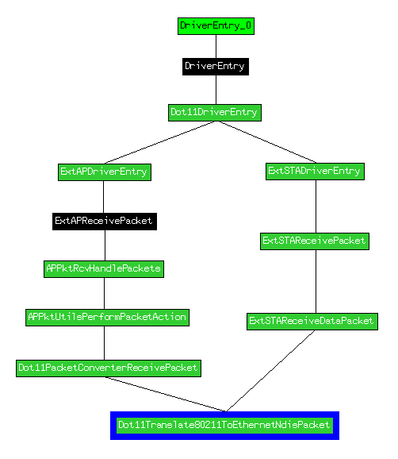

# 0xor0ne
**https://twitter.com/0xor0ne/status/1831225795164926263 _at 2024-09-04, 07:00:26_**
<blockquote>
Patch diffing  CVE-2024-20696 (libarchive vulnerability) and CVE-2024-20697 using Ghidriff

https://t.co/dextETvFy5

Credits @clearbluejar

#libarchive #infosec https://t.co/yxnSdcEB5V
</blockquote>

* https://clearbluejar.github.io/posts/patch-tuesday-diffing-cve-2024-20696-windows-libarchive-rce/

<table><tr>
<td></td>
<td></td>
</table></tr>
<table><tr>
<td>Quotes: <code>0</code></td>
<td>Replies: <code>1</code></td>
<td>Retweets: <code>61</code></td>
<td>Favorites: <code>249</code></td>
</tr></table>

---

# kmkz_security
**https://twitter.com/kmkz_security/status/1831224124972114066 _at 2024-09-04, 06:53:48_**
<blockquote>
RT @virusbtn: Trend Micro researchers have identified a new attack vector that exploits CVE-2023-22527 through the deployment of an in-memo…
</blockquote>

<table><tr>
<td>Quotes: <code>0</code></td>
<td>Replies: <code>0</code></td>
<td>Retweets: <code>34</code></td>
<td>Favorites: <code>0</code></td>
</tr></table>

---

# cyb3rops
**https://twitter.com/cyb3rops/status/1830957600948789756 _at 2024-09-03, 13:14:44_**
<blockquote>
RT @Dinosn: CVE-2024-8105: An UEFI Flaw Putting Millions of Devices at Risk https://t.co/1cAD2DAzFk
</blockquote>

* https://securityonline.info/cve-2024-8105-an-uefi-flaw-putting-millions-of-devices-at-risk/

<table><tr>
<td>Quotes: <code>0</code></td>
<td>Replies: <code>0</code></td>
<td>Retweets: <code>87</code></td>
<td>Favorites: <code>0</code></td>
</tr></table>

---

# kmkz_security
**https://twitter.com/kmkz_security/status/1830741472741568989 _at 2024-09-02, 22:55:55_**
<blockquote>
RT @ksg93rd: #exploit
1. CVE-2024-20017:
MediaTek wappd Buffer Overflow
https://t.co/ie31ghtbiz

2. CVE-2023-41111:
Samsung Baseband RLC Da…
</blockquote>

* https://blog.coffinsec.com/0day/2024/08/30/exploiting-CVE-2024-20017-four-different-ways.html

<table><tr>
<td>Quotes: <code>0</code></td>
<td>Replies: <code>0</code></td>
<td>Retweets: <code>41</code></td>
<td>Favorites: <code>0</code></td>
</tr></table>

---

# unpacker
**https://twitter.com/unpacker/status/1830593281207697782 _at 2024-09-02, 13:07:03_**
<blockquote>
Korean-speaking threat actors are on fire!🔥 Their adoption of 0-days proves once again just how resourceful, skilled, and surprisingly agile they are these days.

🕵️‍♂️ Group: APT-C-60
🏠 Origin: Known as 🇰🇷
💥 0-day: CVE-2024-7262 and CVE-2024-7263
🔗 Ref: https://t.co/ac3BglWvPf
</blockquote>

* https://www.welivesecurity.com/en/eset-research/analysis-of-two-arbitrary-code-execution-vulnerabilities-affecting-wps-office/

<table><tr>
<td>Quotes: <code>2</code></td>
<td>Replies: <code>2</code></td>
<td>Retweets: <code>39</code></td>
<td>Favorites: <code>143</code></td>
</tr></table>

---

# HunterMapping
**https://twitter.com/HunterMapping/status/1830488268502159869 _at 2024-09-02, 06:09:46_**
<blockquote>
🤖CVE-2024-43044: Critical Jenkins Vulnerability Exposes Servers to RCE, PoC Exploit Published
🔥PoC: https://t.co/87CR2g6bUD
🧐Deep Dive:https://t.co/1aCH9N8wul https://t.co/mxkynjmp1k
</blockquote>

* https://github.com/convisolabs/CVE-2024-43044-jenkins
* https://blog.convisoappsec.com/en/analysis-of-cve-2024-43044/

<table><tr>
<td></td>
</table></tr>
<table><tr>
<td>Quotes: <code>0</code></td>
<td>Replies: <code>0</code></td>
<td>Retweets: <code>60</code></td>
<td>Favorites: <code>165</code></td>
</tr></table>

---

# Dinosn
**https://twitter.com/Dinosn/status/1830452871483056183 _at 2024-09-02, 03:49:07_**
<blockquote>
CVE-2024-43044: Critical Jenkins Vulnerability Exposes Servers to RCE, PoC Exploit Published https://t.co/F7Jof6PvRe
</blockquote>

* https://securityonline.info/cve-2024-43044-critical-jenkins-vulnerability-exposes-servers-to-rce-poc-exploit-published/

<table><tr>
<td>Quotes: <code>0</code></td>
<td>Replies: <code>0</code></td>
<td>Retweets: <code>21</code></td>
<td>Favorites: <code>97</code></td>
</tr></table>

---

# __kokumoto
**https://twitter.com/__kokumoto/status/1830446836030861526 _at 2024-09-02, 03:25:08_**
<blockquote>
Jenkinsにおける重大(Critical)な脆弱性、CVE-2024-43044に対応するPoC（攻撃の概念実証コード）が公開された。任意コマンド実行により認証情報をダンプ可能なもの。 https://t.co/IWUy43opgZ
</blockquote>

* https://securityonline.info/cve-2024-43044-critical-jenkins-vulnerability-exposes-servers-to-rce-poc-exploit-published/

<table><tr>
<td>Quotes: <code>0</code></td>
<td>Replies: <code>1</code></td>
<td>Retweets: <code>17</code></td>
<td>Favorites: <code>33</code></td>
</tr></table>

---

# kmkz_security
**https://twitter.com/kmkz_security/status/1830235511782584382 _at 2024-09-01, 13:25:24_**
<blockquote>
RT @hackyboiz: [Research] Hyper-V 1-day Class: CVE-2024-38080
이번 연구글은 Hyper-V LPE 취약점인 CVE-2024-38080 patch diffing, poc 작성입니다. 익스플로잇은 못했습니…
</blockquote>

<table><tr>
<td>Quotes: <code>0</code></td>
<td>Replies: <code>0</code></td>
<td>Retweets: <code>31</code></td>
<td>Favorites: <code>0</code></td>
</tr></table>

---

# 0xor0ne
**https://twitter.com/0xor0ne/status/1830146076742938638 _at 2024-09-01, 07:30:01_**
<blockquote>
Well written blog post on exploiting a Use-after-Free (UaF) in Linux kernel (CVE-2024-0582, io_uring)

https://t.co/8eKtsR9t8G

Credits Oriol Castejón (@XI_Research)

#iouring #infosec https://t.co/AyTftwdFRm
</blockquote>

* https://blog.exodusintel.com/2024/03/27/mind-the-patch-gap-exploiting-an-io_uring-vulnerability-in-ubuntu/

<table><tr>
<td></td>
</table></tr>
<table><tr>
<td>Quotes: <code>0</code></td>
<td>Replies: <code>1</code></td>
<td>Retweets: <code>41</code></td>
<td>Favorites: <code>198</code></td>
</tr></table>

---

# kmkz_security
**https://twitter.com/kmkz_security/status/1830144422090080619 _at 2024-09-01, 07:23:27_**
<blockquote>
RT @gh0st_R1d3r_0x9: Wrote a thing at https://t.co/e9kBTZM2Ld

N-day analysis of CVE-2023-29360

Feedbacks welcomed. Tried to keep it short…
</blockquote>

* https://seg-fault.gitbook.io/researchs/windows-security-research/exploit-development/mskssrv.sys-cve-2023-29360

<table><tr>
<td>Quotes: <code>0</code></td>
<td>Replies: <code>0</code></td>
<td>Retweets: <code>56</code></td>
<td>Favorites: <code>0</code></td>
</tr></table>

---

# HunterMapping
**https://twitter.com/HunterMapping/status/1833701063511113895 _at 2024-09-11, 02:56:16_**
<blockquote>
🥳CALL BACK🥳CVE-2018-14714: ASUS RT-AC3200 WiFi router RCE
🔥New EXP: https://t.co/q3qNTq5yRV
🔥Original PoC: https://t.co/5v6yDJRHzc
📊 17K+ Services are found on https://t.co/ysWb28BTvF yearly.
🔗Hunter Link: https://t.co/0gl1LCt1LF
👇Search Query
HUNTER:/product.name="ASUS https://t.co/7n3wEjsmXk
</blockquote>

* https://github.com/sunn1day/CVE-2018-14714-POC
* https://twitter.com/HunterMapping/status/1833701063511113895/photo/1
* http://hunter.how
* https://github.com/BTtea/CVE-2018-14714-RCE-exploit
* https://hunter.how/list?searchValue=product.name%3D%22ASUS%20RT-AC3200%22

<table><tr>
<td></td>
</table></tr>
<table><tr>
<td>Quotes: <code>0</code></td>
<td>Replies: <code>0</code></td>
<td>Retweets: <code>15</code></td>
<td>Favorites: <code>32</code></td>
</tr></table>

---

# chudyPB
**https://twitter.com/chudyPB/status/1833567722502037643 _at 2024-09-10, 18:06:25_**
<blockquote>
My SharePoint RCE got fixed: CVE-2024-38018. Site Member privs should be enough to exploit. 

I also found a DoS vuln that got patched today: CVE-2024-43466

https://t.co/JldGOJfzeI
</blockquote>

* https://msrc.microsoft.com/update-guide/vulnerability/CVE-2024-38018

<table><tr>
<td>Quotes: <code>0</code></td>
<td>Replies: <code>3</code></td>
<td>Retweets: <code>14</code></td>
<td>Favorites: <code>76</code></td>
</tr></table>

---

# Dinosn
**https://twitter.com/Dinosn/status/1833555406376894823 _at 2024-09-10, 17:17:29_**
<blockquote>
4 CVE exploited in the wild, on Microsoft's Patch      
CVE-2024-43491 - 9.8 - Microsoft Windows Update Remote Code Execution Vulnerability
    CVE-2024-38014 - 7.8 - Windows Installer Elevation of Privilege Vulnerability
    CVE-2024-38226 - 7.3 - Microsoft Publisher Security
</blockquote>

<table><tr>
<td>Quotes: <code>1</code></td>
<td>Replies: <code>0</code></td>
<td>Retweets: <code>18</code></td>
<td>Favorites: <code>52</code></td>
</tr></table>

---

# binitamshah
**https://twitter.com/binitamshah/status/1833531235291091034 _at 2024-09-10, 15:41:26_**
<blockquote>
Windows DWM Core Library Elevation of Privilege Vulnerability (CVE-2024-30051) : https://t.co/0Rq4G4DTrA https://t.co/e7dMUEbays
</blockquote>

* https://github.com/fortra/CVE-2024-30051

<table><tr>
<td></td>
<td></td>
</table></tr>
<table><tr>
<td>Quotes: <code>0</code></td>
<td>Replies: <code>2</code></td>
<td>Retweets: <code>10</code></td>
<td>Favorites: <code>48</code></td>
</tr></table>

---

# piedpiper1616
**https://twitter.com/piedpiper1616/status/1833499945221148810 _at 2024-09-10, 13:37:06_**
<blockquote>
RT @watchtowrcyber: Happy Monday! watchTowr Labs member @SinSinology deep dives into Veeam Backup &amp; Response CVE-2024-40711 in our latest p…
</blockquote>

<table><tr>
<td>Quotes: <code>0</code></td>
<td>Replies: <code>0</code></td>
<td>Retweets: <code>39</code></td>
<td>Favorites: <code>0</code></td>
</tr></table>

---

# TheHackersNews
**https://twitter.com/TheHackersNews/status/1833350612349817192 _at 2024-09-10, 03:43:42_**
<blockquote>
UPDATE -- Critical flaw in SonicWall devices is under active exploitation by ransomware groups, warns Arctic Wolf and Rapid7.

The #vulnerability, CVE-2024-40766, could allow ransomware groups like Akira to access SSLVPN user accounts, posing a major threat to businesses. Stay
</blockquote>

<table><tr>
<td>Quotes: <code>0</code></td>
<td>Replies: <code>1</code></td>
<td>Retweets: <code>27</code></td>
<td>Favorites: <code>56</code></td>
</tr></table>

---

# kmkz_security
**https://twitter.com/kmkz_security/status/1833241815413362827 _at 2024-09-09, 20:31:23_**
<blockquote>
RT @watchtowrcyber: Happy Monday! watchTowr Labs member @SinSinology deep dives into Veeam Backup &amp; Response CVE-2024-40711 in our latest p…
</blockquote>

<table><tr>
<td>Quotes: <code>0</code></td>
<td>Replies: <code>0</code></td>
<td>Retweets: <code>43</code></td>
<td>Favorites: <code>0</code></td>
</tr></table>

---

# chybeta
**https://twitter.com/chybeta/status/1833184898913636424 _at 2024-09-09, 16:45:13_**
<blockquote>
CVE-2024-45507 Apache Ofbiz  SSRF to RCE https://t.co/GxKm4TUAGD
</blockquote>

<table><tr>
<td></td>
</table></tr>
<table><tr>
<td>Quotes: <code>3</code></td>
<td>Replies: <code>0</code></td>
<td>Retweets: <code>10</code></td>
<td>Favorites: <code>94</code></td>
</tr></table>

---

# wvuuuuuuuuuuuuu
**https://twitter.com/wvuuuuuuuuuuuuu/status/1833181543256170524 _at 2024-09-09, 16:31:53_**
<blockquote>
RT @watchtowrcyber: Happy Monday! watchTowr Labs member @SinSinology deep dives into Veeam Backup &amp; Response CVE-2024-40711 in our latest p…
</blockquote>

<table><tr>
<td>Quotes: <code>0</code></td>
<td>Replies: <code>0</code></td>
<td>Retweets: <code>37</code></td>
<td>Favorites: <code>0</code></td>
</tr></table>

---

# steventseeley
**https://twitter.com/steventseeley/status/1833171698092331342 _at 2024-09-09, 15:52:46_**
<blockquote>
RT @watchtowrcyber: Happy Monday! watchTowr Labs member @SinSinology deep dives into Veeam Backup &amp; Response CVE-2024-40711 in our latest p…
</blockquote>

<table><tr>
<td>Quotes: <code>0</code></td>
<td>Replies: <code>0</code></td>
<td>Retweets: <code>37</code></td>
<td>Favorites: <code>0</code></td>
</tr></table>

---

# TheHackersNews
**https://twitter.com/TheHackersNews/status/1833075600283873346 _at 2024-09-09, 09:30:54_**
<blockquote>
⚠️ Progress Software has released security updates for a critical #vulnerability (CVE-2024-7591) in LoadMaster &amp; Multi-Tenant hypervisors, allowing unauthenticated attackers to execute system commands.

https://t.co/BXPi2fuvHd

Don’t risk your infrastructure. Update systems now!
</blockquote>

* https://thehackernews.com/2024/09/progress-software-issues-patch-for.html

<table><tr>
<td>Quotes: <code>0</code></td>
<td>Replies: <code>0</code></td>
<td>Retweets: <code>11</code></td>
<td>Favorites: <code>41</code></td>
</tr></table>

---

# Netlas_io
**https://twitter.com/Netlas_io/status/1833071322693333321 _at 2024-09-09, 09:13:54_**
<blockquote>
CVE-2024-37288, -37285: RCE in Kibana, 9.9 rating 🔥🔥🔥

By improperly deserializing YAML, attackers can perform RCE.

Search at https://t.co/hv7QKSqxTR:
👉 Link: https://t.co/LIGOwwlyXP

#cybersecurity #vulnerability_map #kibana https://t.co/Xcq30MICca
</blockquote>

* http://Netlas.io
* https://nt.ls/cVF9O

<table><tr>
<td></td>
</table></tr>
<table><tr>
<td>Quotes: <code>0</code></td>
<td>Replies: <code>0</code></td>
<td>Retweets: <code>18</code></td>
<td>Favorites: <code>55</code></td>
</tr></table>

---

# Dinosn
**https://twitter.com/Dinosn/status/1832994123655106906 _at 2024-09-09, 04:07:09_**
<blockquote>
PoC Exploit Releases for Windows Elevation of Privilege Vulnerability CVE-2024-26230 https://t.co/QLuanb2PQl
</blockquote>

* https://securityonline.info/poc-exploit-releases-for-windows-elevation-of-privilege-vulnerability-cve-2024-26230/

<table><tr>
<td>Quotes: <code>0</code></td>
<td>Replies: <code>0</code></td>
<td>Retweets: <code>18</code></td>
<td>Favorites: <code>35</code></td>
</tr></table>

---

# 1ZRR4H
**https://twitter.com/1ZRR4H/status/1832971253239660768 _at 2024-09-09, 02:36:16_**
<blockquote>
Server with #opendir 213.109.147[.]108:4242 (now disabled) had an exploit for #CosmicSting (aka CVE-2024-34102), an Unauthorized XXE that combined with CVE-2024-2961 allows RCE in Magento and Adobe Commerce stores.

On the server there was a TXT file with about 3900 https://t.co/ABOcTPbJYR
</blockquote>

<table><tr>
<td></td>
<td></td>
</table></tr>
<table><tr>
<td>Quotes: <code>0</code></td>
<td>Replies: <code>0</code></td>
<td>Retweets: <code>18</code></td>
<td>Favorites: <code>38</code></td>
</tr></table>

---

# the_yellow_fall
**https://twitter.com/the_yellow_fall/status/1832958369327468653 _at 2024-09-09, 01:45:04_**
<blockquote>
PoC Exploit Releases for Windows Elevation of Privilege Vulnerability CVE-2024-26230

Get insights into the technical details and #PoC exploit of the serious elevation of privilege vulnerability (CVE-2024-26230) in #Windows Telephony service
https://t.co/le5JoUUfDC
</blockquote>

* https://securityonline.info/poc-exploit-releases-for-windows-elevation-of-privilege-vulnerability-cve-2024-26230/

<table><tr>
<td>Quotes: <code>0</code></td>
<td>Replies: <code>0</code></td>
<td>Retweets: <code>8</code></td>
<td>Favorites: <code>32</code></td>
</tr></table>

---

# ptracesecurity
**https://twitter.com/ptracesecurity/status/1832947092060262894 _at 2024-09-09, 01:00:15_**
<blockquote>
Windows DWM Core Library Elevation of Privilege Vulnerability (CVE-2024-30051) https://t.co/4V41ipglcm  #Pentesting #Windows #Vulnerability  #CyberSecurity #Infosec https://t.co/X1PLkbQz3H
</blockquote>

* https://www.coresecurity.com/core-labs/articles/windows-dwm-core-library-elevation-privilege-vulnerability-cve-2024-30051

<table><tr>
<td></td>
<td></td>
<td></td>
<td></td>
</table></tr>
<table><tr>
<td>Quotes: <code>0</code></td>
<td>Replies: <code>0</code></td>
<td>Retweets: <code>10</code></td>
<td>Favorites: <code>45</code></td>
</tr></table>

---

# SinSinology
**https://twitter.com/SinSinology/status/1832938871148908628 _at 2024-09-09, 00:27:35_**
<blockquote>
After not sleeping for 2 days, I finally cooked the exploit, unauthenticated RCE against Veeam backup and Replication CVE-2024-40711, Imma go sleep now https://t.co/qzuLSVfSr6
</blockquote>

<table><tr>
<td></td>
</table></tr>
<table><tr>
<td>Quotes: <code>2</code></td>
<td>Replies: <code>5</code></td>
<td>Retweets: <code>11</code></td>
<td>Favorites: <code>117</code></td>
</tr></table>

---

# ptracesecurity
**https://twitter.com/ptracesecurity/status/1832628733175320900 _at 2024-09-08, 03:55:13_**
<blockquote>
Windows DWM Core Library Elevation of Privilege Vulnerability (CVE-2024-30051) (Published August 15 of 2024) https://t.co/SUtsE2GLZK #Pentesting #Windows #exploit #CyberSecurity #Infosec https://t.co/hmKcfDFvYf
</blockquote>

* https://github.com/fortra/CVE-2024-30051?tab=readme-ov-file

<table><tr>
<td></td>
<td></td>
<td></td>
<td></td>
</table></tr>
<table><tr>
<td>Quotes: <code>0</code></td>
<td>Replies: <code>1</code></td>
<td>Retweets: <code>17</code></td>
<td>Favorites: <code>68</code></td>
</tr></table>

---

# 0xdf_
**https://twitter.com/0xdf_/status/1832433834752618649 _at 2024-09-07, 15:00:45_**
<blockquote>
Mailing from @hackthebox_eu has a file read leak hMailServer creds. Then I abuse CVE-2024-21413 through phishing to get more creds. For root, I'll exploit LibreOffice. In Beyond Root, I'll show the patched LFI to RCE via log poisoning and GodPotato.

https://t.co/WrLMQwopzk
</blockquote>

* https://0xdf.gitlab.io/2024/09/07/htb-mailing.html

<table><tr>
<td>Quotes: <code>0</code></td>
<td>Replies: <code>0</code></td>
<td>Retweets: <code>29</code></td>
<td>Favorites: <code>106</code></td>
</tr></table>

---

# binitamshah
**https://twitter.com/binitamshah/status/1832142301600334198 _at 2024-09-06, 19:42:18_**
<blockquote>
Windows Wi-Fi Driver RCE Vulnerability – CVE-2024-30078 : https://t.co/FoWALEWo6g credits @crowdfense @Void_Sec https://t.co/KbsLeLfPHB
</blockquote>

* https://www.crowdfense.com/windows-wi-fi-driver-rce-vulnerability-cve-2024-30078/

<table><tr>
<td></td>
<td></td>
</table></tr>
<table><tr>
<td>Quotes: <code>0</code></td>
<td>Replies: <code>2</code></td>
<td>Retweets: <code>19</code></td>
<td>Favorites: <code>73</code></td>
</tr></table>

---

# TheHackersNews
**https://twitter.com/TheHackersNews/status/1832085449860657156 _at 2024-09-06, 15:56:24_**
<blockquote>
🔥 A SonicWall #vulnerability (CVE-2024-40766) is under active exploitation.

This critical flaw allows attackers to bypass access controls and potentially crash firewalls, compromising business operations. Don't wait.

https://t.co/0jpl20wOAC

Patch now or risk falling victim.
</blockquote>

* https://thehackernews.com/2024/09/sonicwall-urges-users-to-patch-critical.html

<table><tr>
<td>Quotes: <code>3</code></td>
<td>Replies: <code>2</code></td>
<td>Retweets: <code>39</code></td>
<td>Favorites: <code>84</code></td>
</tr></table>

---

# kmkz_security
**https://twitter.com/kmkz_security/status/1832084266475491570 _at 2024-09-06, 15:51:42_**
<blockquote>
RT @cyber_advising: CVE-2024-30051: Windows DWM Core Library Elevation of Privilege Vulnerability.

PoC
https://t.co/iLkOkqmBft https://t.c…
</blockquote>

* https://github.com/fortra/CVE-2024-30051?tab=readme-ov-file

<table><tr>
<td>Quotes: <code>0</code></td>
<td>Replies: <code>0</code></td>
<td>Retweets: <code>35</code></td>
<td>Favorites: <code>0</code></td>
</tr></table>

---

# kmkz_security
**https://twitter.com/kmkz_security/status/1832084186343305274 _at 2024-09-06, 15:51:23_**
<blockquote>
RT @CoreAdvisories: In his latest blog, Core Labs' @ricnar456 takes a deep dive into CVE-2024-30051, reversing this Windows #vulnerability…
</blockquote>

<table><tr>
<td>Quotes: <code>0</code></td>
<td>Replies: <code>0</code></td>
<td>Retweets: <code>57</code></td>
<td>Favorites: <code>0</code></td>
</tr></table>

---

# CoreAdvisories
**https://twitter.com/CoreAdvisories/status/1832067618531868799 _at 2024-09-06, 14:45:33_**
<blockquote>
In his latest blog, Core Labs' @ricnar456 takes a deep dive into CVE-2024-30051, reversing this Windows #vulnerability to create a functional #PoC.  https://t.co/WIEyx3Zjoi https://t.co/mSsMe2QQFT
</blockquote>

* https://www.coresecurity.com/core-labs/articles/windows-dwm-core-library-elevation-privilege-vulnerability-cve-2024-30051

<table><tr>
<td></td>
</table></tr>
<table><tr>
<td>Quotes: <code>0</code></td>
<td>Replies: <code>1</code></td>
<td>Retweets: <code>57</code></td>
<td>Favorites: <code>199</code></td>
</tr></table>

---

# kmkz_security
**https://twitter.com/kmkz_security/status/1832008874313822622 _at 2024-09-06, 10:52:07_**
<blockquote>
RT @theori_io: 🚨 New Linux Kernel vulnerability (CVE-2024-27394) discovered &amp; patched by Theori! 
🔗 https://t.co/p9hDC5b3xI

Our researcher…
</blockquote>

* https://blog.theori.io/deep-dive-into-rcu-race-condition-analysis-of-tcp-ao-uaf-cve-2024-27394-f40508b84c42?source=social.tw

<table><tr>
<td>Quotes: <code>0</code></td>
<td>Replies: <code>0</code></td>
<td>Retweets: <code>44</code></td>
<td>Favorites: <code>0</code></td>
</tr></table>

---

# TheHackersNews
**https://twitter.com/TheHackersNews/status/1831984376156176422 _at 2024-09-06, 09:14:46_**
<blockquote>
New LiteSpeed Cache flaw (CVE-2024-44000) risks unauthorized access to WordPress sites via exposed debug logs.

Read: https://t.co/4WyY7bavlB

Even old logs can be exploited. Update and purge now!
</blockquote>

* https://thehackernews.com/2024/09/critical-security-flaw-found-in.html

<table><tr>
<td>Quotes: <code>1</code></td>
<td>Replies: <code>1</code></td>
<td>Retweets: <code>16</code></td>
<td>Favorites: <code>38</code></td>
</tr></table>

---

# kmkz_security
**https://twitter.com/kmkz_security/status/1831977249400307733 _at 2024-09-06, 08:46:27_**
<blockquote>
RT @watchtowrcyber: despite shenanigans with CVSS scores, we can confirm the latest Veeam vulnerabilities (CVE-2024-40711) allow auth bypas…
</blockquote>

<table><tr>
<td>Quotes: <code>0</code></td>
<td>Replies: <code>0</code></td>
<td>Retweets: <code>39</code></td>
<td>Favorites: <code>0</code></td>
</tr></table>

---

# theori_io
**https://twitter.com/theori_io/status/1831936617260708138 _at 2024-09-06, 06:04:59_**
<blockquote>
🚨 New Linux Kernel vulnerability (CVE-2024-27394) discovered &amp; patched by Theori! 
🔗 https://t.co/p9hDC5b3xI

Our researcher @v4bel at #Theori identified a critical #UAF vulnerability in TCP-AO caused by a race condition in the #RCU API. Using techniques from the ExpRace paper,
</blockquote>

* https://blog.theori.io/deep-dive-into-rcu-race-condition-analysis-of-tcp-ao-uaf-cve-2024-27394-f40508b84c42?source=social.tw

<table><tr>
<td>Quotes: <code>2</code></td>
<td>Replies: <code>0</code></td>
<td>Retweets: <code>44</code></td>
<td>Favorites: <code>156</code></td>
</tr></table>

---

# kmkz_security
**https://twitter.com/kmkz_security/status/1831932544516026751 _at 2024-09-06, 05:48:48_**
<blockquote>
RT @crowdfense: For our second technical post, we have an analysis of a Windows RCE vulnerability in the Wi-Fi driver (CVE-2024-30078), whi…
</blockquote>

<table><tr>
<td>Quotes: <code>0</code></td>
<td>Replies: <code>0</code></td>
<td>Retweets: <code>49</code></td>
<td>Favorites: <code>0</code></td>
</tr></table>

---

# HunterMapping
**https://twitter.com/HunterMapping/status/1831896961441513726 _at 2024-09-06, 03:27:25_**
<blockquote>
🚨Alert🚨CVE-2024-6670: Breaking Down Barriers: Exploiting Pre-Auth SQL Injection in Progress  WhatsUp Gold
🔥PoC: https://t.co/YPXjqGko0q
🧐Deep Dive:https://t.co/TxXiegi1BY
📊 3.4K+ Services are found on https://t.co/ysWb28BTvF yearly
🔗Hunter Link:https://t.co/tO9fyS5RQZ https://t.co/l39P5kVMw7
</blockquote>

* https://summoning.team/blog/progress-whatsup-gold-sqli-cve-2024-6670/
* http://hunter.how
* https://hunter.how/list?searchValue=product.name%3D%22Progress%20Whatsup%20Gold%22
* https://github.com/sinsinology/CVE-2024-6670

<table><tr>
<td></td>
</table></tr>
<table><tr>
<td>Quotes: <code>0</code></td>
<td>Replies: <code>1</code></td>
<td>Retweets: <code>14</code></td>
<td>Favorites: <code>34</code></td>
</tr></table>

---

# Dinosn
**https://twitter.com/Dinosn/status/1831896032114036865 _at 2024-09-06, 03:23:43_**
<blockquote>
CVE-2024-26581 PoC Exploit Released: Linux Systems at Risk of Root Compromise https://t.co/W9d9FOm9zb
</blockquote>

* https://securityonline.info/cve-2024-26581-poc-exploit-released-linux-systems-at-risk-of-root-compromise/

<table><tr>
<td>Quotes: <code>0</code></td>
<td>Replies: <code>0</code></td>
<td>Retweets: <code>18</code></td>
<td>Favorites: <code>40</code></td>
</tr></table>

---

# wvuuuuuuuuuuuuu
**https://twitter.com/wvuuuuuuuuuuuuu/status/1831867583492190563 _at 2024-09-06, 01:30:41_**
<blockquote>
RT @watchtowrcyber: despite shenanigans with CVSS scores, we can confirm the latest Veeam vulnerabilities (CVE-2024-40711) allow auth bypas…
</blockquote>

<table><tr>
<td>Quotes: <code>0</code></td>
<td>Replies: <code>0</code></td>
<td>Retweets: <code>39</code></td>
<td>Favorites: <code>0</code></td>
</tr></table>

---

# ptracesecurity
**https://twitter.com/ptracesecurity/status/1831822183582081324 _at 2024-09-05, 22:30:16_**
<blockquote>
Windows Wi-Fi Driver RCE Vulnerability – CVE-2024-30078 https://t.co/DxjvKNQpOw  #Pentesting #Vulnerability #Windows  #CyberSecurity #Infosec https://t.co/24WqVyAoGF
</blockquote>

* https://www.crowdfense.com/windows-wi-fi-driver-rce-vulnerability-cve-2024-30078/

<table><tr>
<td></td>
<td></td>
<td></td>
<td></td>
</table></tr>
<table><tr>
<td>Quotes: <code>0</code></td>
<td>Replies: <code>0</code></td>
<td>Retweets: <code>5</code></td>
<td>Favorites: <code>33</code></td>
</tr></table>

---

# wvuuuuuuuuuuuuu
**https://twitter.com/wvuuuuuuuuuuuuu/status/1831784629260710400 _at 2024-09-05, 20:01:03_**
<blockquote>
RT @TheHackersNews: ⚠️ Veeam has patched 18 security flaws, including 5 critical ones allowing remote code execution (e.g., CVE-2024-40711…
</blockquote>

<table><tr>
<td>Quotes: <code>0</code></td>
<td>Replies: <code>0</code></td>
<td>Retweets: <code>71</code></td>
<td>Favorites: <code>0</code></td>
</tr></table>

---

# wvuuuuuuuuuuuuu
**https://twitter.com/wvuuuuuuuuuuuuu/status/1831783895978930528 _at 2024-09-05, 19:58:08_**
<blockquote>
RT @codewhitesec: Better patch your Veeam Backup &amp; Replication servers! Full system takeover via CVE-2024-40711, discovered by our very own…
</blockquote>

<table><tr>
<td>Quotes: <code>0</code></td>
<td>Replies: <code>0</code></td>
<td>Retweets: <code>95</code></td>
<td>Favorites: <code>0</code></td>
</tr></table>

---

# three_cube
**https://twitter.com/three_cube/status/1831743572565184945 _at 2024-09-05, 17:17:54_**
<blockquote>
Using the Brand New (CVE-2024-38063) IPv6 Vulnerability to Crash a Windows System #ipv6 #bsod #cybersecurity #dos #infosec #cyberwarrior

https://t.co/i0Rn2wTQyG https://t.co/cMBd35S2vA
</blockquote>

* https://www.hackers-arise.com/post/using-the-brand-new-ipv6-exploit-to-dos-a-windows-system

<table><tr>
<td></td>
</table></tr>
<table><tr>
<td>Quotes: <code>0</code></td>
<td>Replies: <code>1</code></td>
<td>Retweets: <code>15</code></td>
<td>Favorites: <code>54</code></td>
</tr></table>

---

# ptracesecurity
**https://twitter.com/ptracesecurity/status/1831731581888712756 _at 2024-09-05, 16:30:15_**
<blockquote>
CVE-2020-27786 ( Race Condition + Use-After-Free ) 
 https://t.co/kDOdv6PIqb  #Pentesting #CyberSecurity #Infosec https://t.co/JChrN2wvtO
</blockquote>

* https://ii4gsp.github.io/cve-2020-27786/

<table><tr>
<td></td>
<td></td>
<td></td>
<td></td>
</table></tr>
<table><tr>
<td>Quotes: <code>0</code></td>
<td>Replies: <code>0</code></td>
<td>Retweets: <code>7</code></td>
<td>Favorites: <code>33</code></td>
</tr></table>

---

# TheHackersNews
**https://twitter.com/TheHackersNews/status/1831727612802285936 _at 2024-09-05, 16:14:29_**
<blockquote>
⚠️ Veeam has patched 18 security flaws, including 5 critical ones allowing remote code execution (e.g., CVE-2024-40711 with a 9.8 CVSS score). Update now to protect your data.

Learn more: https://t.co/0WwDkTUFx8

#cybersecurity #technology
</blockquote>

* https://thehackernews.com/2024/09/veeam-releases-security-updates-to-fix.html

<table><tr>
<td>Quotes: <code>0</code></td>
<td>Replies: <code>2</code></td>
<td>Retweets: <code>52</code></td>
<td>Favorites: <code>91</code></td>
</tr></table>

---

# crowdfense
**https://twitter.com/crowdfense/status/1831723971500265765 _at 2024-09-05, 16:00:01_**
<blockquote>
For our second technical post, we have an analysis of a Windows RCE vulnerability in the Wi-Fi driver (CVE-2024-30078), which includes a detailed root cause analysis and exploitation constraints. Enjoy :)

https://t.co/llaW6l6TlC
</blockquote>

* https://www.crowdfense.com/windows-wi-fi-driver-rce-vulnerability-cve-2024-30078/

<table><tr>
<td>Quotes: <code>2</code></td>
<td>Replies: <code>0</code></td>
<td>Retweets: <code>49</code></td>
<td>Favorites: <code>144</code></td>
</tr></table>

---

# fdfalcon
**https://twitter.com/fdfalcon/status/1831723329910124613 _at 2024-09-05, 15:57:28_**
<blockquote>
CVE-2024-41928: VM escape in FreeBSD's bhyve hypervisor via TPM device passthrough, by @Synacktiv

https://t.co/TrSYKoKSu8
</blockquote>

* https://www.freebsd.org/security/advisories/FreeBSD-SA-24:10.bhyve.asc

<table><tr>
<td>Quotes: <code>0</code></td>
<td>Replies: <code>1</code></td>
<td>Retweets: <code>13</code></td>
<td>Favorites: <code>50</code></td>
</tr></table>

---

# codewhitesec
**https://twitter.com/codewhitesec/status/1831720125747069389 _at 2024-09-05, 15:44:44_**
<blockquote>
Better patch your Veeam Backup &amp; Replication servers! Full system takeover via CVE-2024-40711, discovered by our very own @frycos - no technical details from us this time because this might instantly be abused by ransomware gangs https://t.co/pGLq1RQi3n https://t.co/uUkRA2wgji
</blockquote>

* https://code-white.com/public-vulnerability-list/#unauthenticated-remote-code-execution-in-backup-replication

<table><tr>
<td></td>
</table></tr>
<table><tr>
<td>Quotes: <code>2</code></td>
<td>Replies: <code>4</code></td>
<td>Retweets: <code>75</code></td>
<td>Favorites: <code>208</code></td>
</tr></table>

---

# thezdi
**https://twitter.com/thezdi/status/1831719997862752646 _at 2024-09-05, 15:44:13_**
<blockquote>
In the 1st of a 4 part series, @chudyPB details his research into exploiting #Microsoft #Exchange after ProxyNotShell was patched. Today's post covers CVE-2023-21529: abuse of the allowed MultiValuedProperty class for RCE. Check it out at https://t.co/FRN8VEalB7
</blockquote>

* https://www.zerodayinitiative.com/blog/2024/9/4/exploiting-exchange-powershell-after-proxynotshell-part-1-multivaluedproperty

<table><tr>
<td>Quotes: <code>2</code></td>
<td>Replies: <code>1</code></td>
<td>Retweets: <code>27</code></td>
<td>Favorites: <code>75</code></td>
</tr></table>

---

# linkersec
**https://twitter.com/linkersec/status/1831693325394391191 _at 2024-09-05, 13:58:14_**
<blockquote>
CVE-2020-27786 (Race Condition + Use-After-Free)

An article by @ii4gsp about exploiting a racy use-after-free in the MIDI subsystem.

https://t.co/jUQgPnDjLd https://t.co/eTaYMmcQSZ
</blockquote>

* https://ii4gsp.github.io/cve-2020-27786/

<table><tr>
<td></td>
</table></tr>
<table><tr>
<td>Quotes: <code>0</code></td>
<td>Replies: <code>0</code></td>
<td>Retweets: <code>19</code></td>
<td>Favorites: <code>79</code></td>
</tr></table>

---

# RedDrip7
**https://twitter.com/RedDrip7/status/1831641279186530738 _at 2024-09-05, 10:31:25_**
<blockquote>
Analysis of Windows DWM #EoP vuln (#CVE-2024-30051) in-the-wild exploitation sample and root cause

https://t.co/xUMTGuhnQD https://t.co/1TLu5Arq4O
</blockquote>

* https://ti.qianxin.com/blog/articles/public-secret-research-on-the-cve-2024-30051-privilege-escalation-vulnerability-in-the-wild-en/

<table><tr>
<td></td>
<td></td>
</table></tr>
<table><tr>
<td>Quotes: <code>3</code></td>
<td>Replies: <code>0</code></td>
<td>Retweets: <code>23</code></td>
<td>Favorites: <code>51</code></td>
</tr></table>

---

# TheHackersNews
**https://twitter.com/TheHackersNews/status/1831553777129943331 _at 2024-09-05, 04:43:43_**
<blockquote>
Cisco has issued urgent updates for two critical flaws (CVSS 9.8) in its Smart Licensing Utility. These flaws (CVE-2024-20439 &amp; CVE-2024-20440) let unauthenticated attackers elevate privileges or access sensitive data via crafted HTTP requests.

Read: https://t.co/x7j8s1TIEv
</blockquote>

* https://thehackernews.com/2024/09/cisco-fixes-two-critical-flaws-in-smart.html

<table><tr>
<td>Quotes: <code>5</code></td>
<td>Replies: <code>1</code></td>
<td>Retweets: <code>75</code></td>
<td>Favorites: <code>150</code></td>
</tr></table>

---

# TheHackersNews
**https://twitter.com/TheHackersNews/status/1831325852677845164 _at 2024-09-04, 13:38:02_**
<blockquote>
#Google has issued a update to fix the high-severity Android #vulnerability CVE-2024-32896, which allows attackers to take control of your device. Initially affecting Pixel devices, it now impacts the entire #Android ecosystem.

Read: https://t.co/MUi34tgq4O

#infosec #hacking
</blockquote>

* https://thehackernews.com/2024/09/google-confirms-cve-2024-32896.html

<table><tr>
<td>Quotes: <code>15</code></td>
<td>Replies: <code>6</code></td>
<td>Retweets: <code>120</code></td>
<td>Favorites: <code>182</code></td>
</tr></table>

---

# TheHackersNews
**https://twitter.com/TheHackersNews/status/1831293745465295102 _at 2024-09-04, 11:30:27_**
<blockquote>
Zyxel has patched a critical #vulnerability (CVE-2024-7261) that allowed unauthenticated attackers to execute OS commands on certain routers and access points.

Learn more: https://t.co/DH25VvoIC2

#CyberSecurity
</blockquote>

* https://thehackernews.com/2024/09/zyxel-patches-critical-os-command.html

<table><tr>
<td>Quotes: <code>2</code></td>
<td>Replies: <code>0</code></td>
<td>Retweets: <code>32</code></td>
<td>Favorites: <code>63</code></td>
</tr></table>

---

# 0xor0ne
**https://twitter.com/0xor0ne/status/1831225795164926263 _at 2024-09-04, 07:00:26_**
<blockquote>
Patch diffing  CVE-2024-20696 (libarchive vulnerability) and CVE-2024-20697 using Ghidriff

https://t.co/dextETvFy5

Credits @clearbluejar

#libarchive #infosec https://t.co/yxnSdcEB5V
</blockquote>

* https://clearbluejar.github.io/posts/patch-tuesday-diffing-cve-2024-20696-windows-libarchive-rce/

<table><tr>
<td></td>
<td></td>
</table></tr>
<table><tr>
<td>Quotes: <code>0</code></td>
<td>Replies: <code>1</code></td>
<td>Retweets: <code>61</code></td>
<td>Favorites: <code>249</code></td>
</tr></table>

---

# kmkz_security
**https://twitter.com/kmkz_security/status/1831224124972114066 _at 2024-09-04, 06:53:48_**
<blockquote>
RT @virusbtn: Trend Micro researchers have identified a new attack vector that exploits CVE-2023-22527 through the deployment of an in-memo…
</blockquote>

<table><tr>
<td>Quotes: <code>0</code></td>
<td>Replies: <code>0</code></td>
<td>Retweets: <code>34</code></td>
<td>Favorites: <code>0</code></td>
</tr></table>

---

# tbbhunter
**https://twitter.com/tbbhunter/status/1831063223803502883 _at 2024-09-03, 20:14:26_**
<blockquote>
CVE-2024-37084: Spring Cloud Remote Code Execution

https://t.co/vIE9sQmo3a
</blockquote>

* https://blog.securelayer7.net/spring-cloud-skipper-vulnerability/

<table><tr>
<td>Quotes: <code>1</code></td>
<td>Replies: <code>0</code></td>
<td>Retweets: <code>19</code></td>
<td>Favorites: <code>49</code></td>
</tr></table>

---

# cyb3rops
**https://twitter.com/cyb3rops/status/1830957600948789756 _at 2024-09-03, 13:14:44_**
<blockquote>
RT @Dinosn: CVE-2024-8105: An UEFI Flaw Putting Millions of Devices at Risk https://t.co/1cAD2DAzFk
</blockquote>

* https://securityonline.info/cve-2024-8105-an-uefi-flaw-putting-millions-of-devices-at-risk/

<table><tr>
<td>Quotes: <code>0</code></td>
<td>Replies: <code>0</code></td>
<td>Retweets: <code>87</code></td>
<td>Favorites: <code>0</code></td>
</tr></table>

---

# kmkz_security
**https://twitter.com/kmkz_security/status/1830741472741568989 _at 2024-09-02, 22:55:55_**
<blockquote>
RT @ksg93rd: #exploit
1. CVE-2024-20017:
MediaTek wappd Buffer Overflow
https://t.co/ie31ghtbiz

2. CVE-2023-41111:
Samsung Baseband RLC Da…
</blockquote>

* https://blog.coffinsec.com/0day/2024/08/30/exploiting-CVE-2024-20017-four-different-ways.html

<table><tr>
<td>Quotes: <code>0</code></td>
<td>Replies: <code>0</code></td>
<td>Retweets: <code>41</code></td>
<td>Favorites: <code>0</code></td>
</tr></table>

---

# ksg93rd
**https://twitter.com/ksg93rd/status/1830697211606237474 _at 2024-09-02, 20:00:02_**
<blockquote>
#exploit
1. CVE-2024-20017:
MediaTek wappd Buffer Overflow
https://t.co/ie31ghtbiz

2. CVE-2023-41111:
Samsung Baseband RLC Data Re-Assembly Buffer Overflow
https://t.co/yMx5XB65Zk
</blockquote>

* https://blog.coffinsec.com/0day/2024/08/30/exploiting-CVE-2024-20017-four-different-ways.html
* https://labs.taszk.io/blog/post/93_rlc_bof

<table><tr>
<td>Quotes: <code>0</code></td>
<td>Replies: <code>0</code></td>
<td>Retweets: <code>49</code></td>
<td>Favorites: <code>126</code></td>
</tr></table>

---

# momika233
**https://twitter.com/momika233/status/1830619250404590074 _at 2024-09-02, 14:50:15_**
<blockquote>
RT @HunterMapping: 🤖CVE-2024-43044: Critical Jenkins Vulnerability Exposes Servers to RCE, PoC Exploit Published
🔥PoC: https://t.co/87CR2g6…
</blockquote>

# HunterMapping
**https://twitter.com/HunterMapping/status/1833701063511113895 _at 2024-09-11, 02:56:16_**
<blockquote>
🥳CALL BACK🥳CVE-2018-14714: ASUS RT-AC3200 WiFi router RCE
🔥New EXP: https://t.co/q3qNTq5yRV
🔥Original PoC: https://t.co/5v6yDJRHzc
📊 17K+ Services are found on https://t.co/ysWb28BTvF yearly.
🔗Hunter Link: https://t.co/0gl1LCt1LF
👇Search Query
HUNTER:/product.name="ASUS https://t.co/7n3wEjsmXk
</blockquote>

* https://github.com/sunn1day/CVE-2018-14714-POC
* https://twitter.com/HunterMapping/status/1833701063511113895/photo/1
* http://hunter.how
* https://github.com/BTtea/CVE-2018-14714-RCE-exploit
* https://hunter.how/list?searchValue=product.name%3D%22ASUS%20RT-AC3200%22

<table><tr>
<td></td>
</table></tr>
<table><tr>
<td>Quotes: <code>0</code></td>
<td>Replies: <code>0</code></td>
<td>Retweets: <code>15</code></td>
<td>Favorites: <code>32</code></td>
</tr></table>

---

# chudyPB
**https://twitter.com/chudyPB/status/1833567722502037643 _at 2024-09-10, 18:06:25_**
<blockquote>
My SharePoint RCE got fixed: CVE-2024-38018. Site Member privs should be enough to exploit. 

I also found a DoS vuln that got patched today: CVE-2024-43466

https://t.co/JldGOJfzeI
</blockquote>

* https://msrc.microsoft.com/update-guide/vulnerability/CVE-2024-38018

<table><tr>
<td>Quotes: <code>0</code></td>
<td>Replies: <code>3</code></td>
<td>Retweets: <code>14</code></td>
<td>Favorites: <code>76</code></td>
</tr></table>

---

# Dinosn
**https://twitter.com/Dinosn/status/1833555406376894823 _at 2024-09-10, 17:17:29_**
<blockquote>
4 CVE exploited in the wild, on Microsoft's Patch      
CVE-2024-43491 - 9.8 - Microsoft Windows Update Remote Code Execution Vulnerability
    CVE-2024-38014 - 7.8 - Windows Installer Elevation of Privilege Vulnerability
    CVE-2024-38226 - 7.3 - Microsoft Publisher Security
</blockquote>

<table><tr>
<td>Quotes: <code>1</code></td>
<td>Replies: <code>0</code></td>
<td>Retweets: <code>18</code></td>
<td>Favorites: <code>52</code></td>
</tr></table>

---

# binitamshah
**https://twitter.com/binitamshah/status/1833531235291091034 _at 2024-09-10, 15:41:26_**
<blockquote>
Windows DWM Core Library Elevation of Privilege Vulnerability (CVE-2024-30051) : https://t.co/0Rq4G4DTrA https://t.co/e7dMUEbays
</blockquote>

* https://github.com/fortra/CVE-2024-30051

<table><tr>
<td></td>
<td></td>
</table></tr>
<table><tr>
<td>Quotes: <code>0</code></td>
<td>Replies: <code>2</code></td>
<td>Retweets: <code>10</code></td>
<td>Favorites: <code>48</code></td>
</tr></table>

---

# piedpiper1616
**https://twitter.com/piedpiper1616/status/1833499945221148810 _at 2024-09-10, 13:37:06_**
<blockquote>
RT @watchtowrcyber: Happy Monday! watchTowr Labs member @SinSinology deep dives into Veeam Backup &amp; Response CVE-2024-40711 in our latest p…
</blockquote>

<table><tr>
<td>Quotes: <code>0</code></td>
<td>Replies: <code>0</code></td>
<td>Retweets: <code>39</code></td>
<td>Favorites: <code>0</code></td>
</tr></table>

---

# TheHackersNews
**https://twitter.com/TheHackersNews/status/1833350612349817192 _at 2024-09-10, 03:43:42_**
<blockquote>
UPDATE -- Critical flaw in SonicWall devices is under active exploitation by ransomware groups, warns Arctic Wolf and Rapid7.

The #vulnerability, CVE-2024-40766, could allow ransomware groups like Akira to access SSLVPN user accounts, posing a major threat to businesses. Stay
</blockquote>

<table><tr>
<td>Quotes: <code>0</code></td>
<td>Replies: <code>1</code></td>
<td>Retweets: <code>27</code></td>
<td>Favorites: <code>56</code></td>
</tr></table>

---

# kmkz_security
**https://twitter.com/kmkz_security/status/1833241815413362827 _at 2024-09-09, 20:31:23_**
<blockquote>
RT @watchtowrcyber: Happy Monday! watchTowr Labs member @SinSinology deep dives into Veeam Backup &amp; Response CVE-2024-40711 in our latest p…
</blockquote>

<table><tr>
<td>Quotes: <code>0</code></td>
<td>Replies: <code>0</code></td>
<td>Retweets: <code>43</code></td>
<td>Favorites: <code>0</code></td>
</tr></table>

---

# chybeta
**https://twitter.com/chybeta/status/1833184898913636424 _at 2024-09-09, 16:45:13_**
<blockquote>
CVE-2024-45507 Apache Ofbiz  SSRF to RCE https://t.co/GxKm4TUAGD
</blockquote>

<table><tr>
<td></td>
</table></tr>
<table><tr>
<td>Quotes: <code>3</code></td>
<td>Replies: <code>0</code></td>
<td>Retweets: <code>10</code></td>
<td>Favorites: <code>94</code></td>
</tr></table>

---

# wvuuuuuuuuuuuuu
**https://twitter.com/wvuuuuuuuuuuuuu/status/1833181543256170524 _at 2024-09-09, 16:31:53_**
<blockquote>
RT @watchtowrcyber: Happy Monday! watchTowr Labs member @SinSinology deep dives into Veeam Backup &amp; Response CVE-2024-40711 in our latest p…
</blockquote>

<table><tr>
<td>Quotes: <code>0</code></td>
<td>Replies: <code>0</code></td>
<td>Retweets: <code>37</code></td>
<td>Favorites: <code>0</code></td>
</tr></table>

---

# steventseeley
**https://twitter.com/steventseeley/status/1833171698092331342 _at 2024-09-09, 15:52:46_**
<blockquote>
RT @watchtowrcyber: Happy Monday! watchTowr Labs member @SinSinology deep dives into Veeam Backup &amp; Response CVE-2024-40711 in our latest p…
</blockquote>

<table><tr>
<td>Quotes: <code>0</code></td>
<td>Replies: <code>0</code></td>
<td>Retweets: <code>37</code></td>
<td>Favorites: <code>0</code></td>
</tr></table>

---

# TheHackersNews
**https://twitter.com/TheHackersNews/status/1833075600283873346 _at 2024-09-09, 09:30:54_**
<blockquote>
⚠️ Progress Software has released security updates for a critical #vulnerability (CVE-2024-7591) in LoadMaster &amp; Multi-Tenant hypervisors, allowing unauthenticated attackers to execute system commands.

https://t.co/BXPi2fuvHd

Don’t risk your infrastructure. Update systems now!
</blockquote>

* https://thehackernews.com/2024/09/progress-software-issues-patch-for.html

<table><tr>
<td>Quotes: <code>0</code></td>
<td>Replies: <code>0</code></td>
<td>Retweets: <code>11</code></td>
<td>Favorites: <code>41</code></td>
</tr></table>

---

# Netlas_io
**https://twitter.com/Netlas_io/status/1833071322693333321 _at 2024-09-09, 09:13:54_**
<blockquote>
CVE-2024-37288, -37285: RCE in Kibana, 9.9 rating 🔥🔥🔥

By improperly deserializing YAML, attackers can perform RCE.

Search at https://t.co/hv7QKSqxTR:
👉 Link: https://t.co/LIGOwwlyXP

#cybersecurity #vulnerability_map #kibana https://t.co/Xcq30MICca
</blockquote>

* http://Netlas.io
* https://nt.ls/cVF9O

<table><tr>
<td></td>
</table></tr>
<table><tr>
<td>Quotes: <code>0</code></td>
<td>Replies: <code>0</code></td>
<td>Retweets: <code>18</code></td>
<td>Favorites: <code>55</code></td>
</tr></table>

---

# Dinosn
**https://twitter.com/Dinosn/status/1832994123655106906 _at 2024-09-09, 04:07:09_**
<blockquote>
PoC Exploit Releases for Windows Elevation of Privilege Vulnerability CVE-2024-26230 https://t.co/QLuanb2PQl
</blockquote>

* https://securityonline.info/poc-exploit-releases-for-windows-elevation-of-privilege-vulnerability-cve-2024-26230/

<table><tr>
<td>Quotes: <code>0</code></td>
<td>Replies: <code>0</code></td>
<td>Retweets: <code>18</code></td>
<td>Favorites: <code>35</code></td>
</tr></table>

---

# 1ZRR4H
**https://twitter.com/1ZRR4H/status/1832971253239660768 _at 2024-09-09, 02:36:16_**
<blockquote>
Server with #opendir 213.109.147[.]108:4242 (now disabled) had an exploit for #CosmicSting (aka CVE-2024-34102), an Unauthorized XXE that combined with CVE-2024-2961 allows RCE in Magento and Adobe Commerce stores.

On the server there was a TXT file with about 3900 https://t.co/ABOcTPbJYR
</blockquote>

<table><tr>
<td></td>
<td></td>
</table></tr>
<table><tr>
<td>Quotes: <code>0</code></td>
<td>Replies: <code>0</code></td>
<td>Retweets: <code>18</code></td>
<td>Favorites: <code>38</code></td>
</tr></table>

---

# the_yellow_fall
**https://twitter.com/the_yellow_fall/status/1832958369327468653 _at 2024-09-09, 01:45:04_**
<blockquote>
PoC Exploit Releases for Windows Elevation of Privilege Vulnerability CVE-2024-26230

Get insights into the technical details and #PoC exploit of the serious elevation of privilege vulnerability (CVE-2024-26230) in #Windows Telephony service
https://t.co/le5JoUUfDC
</blockquote>

* https://securityonline.info/poc-exploit-releases-for-windows-elevation-of-privilege-vulnerability-cve-2024-26230/

<table><tr>
<td>Quotes: <code>0</code></td>
<td>Replies: <code>0</code></td>
<td>Retweets: <code>8</code></td>
<td>Favorites: <code>32</code></td>
</tr></table>

---

# ptracesecurity
**https://twitter.com/ptracesecurity/status/1832947092060262894 _at 2024-09-09, 01:00:15_**
<blockquote>
Windows DWM Core Library Elevation of Privilege Vulnerability (CVE-2024-30051) https://t.co/4V41ipglcm  #Pentesting #Windows #Vulnerability  #CyberSecurity #Infosec https://t.co/X1PLkbQz3H
</blockquote>

* https://www.coresecurity.com/core-labs/articles/windows-dwm-core-library-elevation-privilege-vulnerability-cve-2024-30051

<table><tr>
<td></td>
<td></td>
<td></td>
<td></td>
</table></tr>
<table><tr>
<td>Quotes: <code>0</code></td>
<td>Replies: <code>0</code></td>
<td>Retweets: <code>10</code></td>
<td>Favorites: <code>45</code></td>
</tr></table>

---

# SinSinology
**https://twitter.com/SinSinology/status/1832938871148908628 _at 2024-09-09, 00:27:35_**
<blockquote>
After not sleeping for 2 days, I finally cooked the exploit, unauthenticated RCE against Veeam backup and Replication CVE-2024-40711, Imma go sleep now https://t.co/qzuLSVfSr6
</blockquote>

<table><tr>
<td></td>
</table></tr>
<table><tr>
<td>Quotes: <code>2</code></td>
<td>Replies: <code>5</code></td>
<td>Retweets: <code>11</code></td>
<td>Favorites: <code>117</code></td>
</tr></table>

---

# ptracesecurity
**https://twitter.com/ptracesecurity/status/1832628733175320900 _at 2024-09-08, 03:55:13_**
<blockquote>
Windows DWM Core Library Elevation of Privilege Vulnerability (CVE-2024-30051) (Published August 15 of 2024) https://t.co/SUtsE2GLZK #Pentesting #Windows #exploit #CyberSecurity #Infosec https://t.co/hmKcfDFvYf
</blockquote>

* https://github.com/fortra/CVE-2024-30051?tab=readme-ov-file

<table><tr>
<td></td>
<td></td>
<td></td>
<td></td>
</table></tr>
<table><tr>
<td>Quotes: <code>0</code></td>
<td>Replies: <code>1</code></td>
<td>Retweets: <code>17</code></td>
<td>Favorites: <code>68</code></td>
</tr></table>

---

# 0xdf_
**https://twitter.com/0xdf_/status/1832433834752618649 _at 2024-09-07, 15:00:45_**
<blockquote>
Mailing from @hackthebox_eu has a file read leak hMailServer creds. Then I abuse CVE-2024-21413 through phishing to get more creds. For root, I'll exploit LibreOffice. In Beyond Root, I'll show the patched LFI to RCE via log poisoning and GodPotato.

https://t.co/WrLMQwopzk
</blockquote>

* https://0xdf.gitlab.io/2024/09/07/htb-mailing.html

<table><tr>
<td>Quotes: <code>0</code></td>
<td>Replies: <code>0</code></td>
<td>Retweets: <code>29</code></td>
<td>Favorites: <code>106</code></td>
</tr></table>

---

# binitamshah
**https://twitter.com/binitamshah/status/1832142301600334198 _at 2024-09-06, 19:42:18_**
<blockquote>
Windows Wi-Fi Driver RCE Vulnerability – CVE-2024-30078 : https://t.co/FoWALEWo6g credits @crowdfense @Void_Sec https://t.co/KbsLeLfPHB
</blockquote>

* https://www.crowdfense.com/windows-wi-fi-driver-rce-vulnerability-cve-2024-30078/

<table><tr>
<td></td>
<td></td>
</table></tr>
<table><tr>
<td>Quotes: <code>0</code></td>
<td>Replies: <code>2</code></td>
<td>Retweets: <code>19</code></td>
<td>Favorites: <code>73</code></td>
</tr></table>

---

# TheHackersNews
**https://twitter.com/TheHackersNews/status/1832085449860657156 _at 2024-09-06, 15:56:24_**
<blockquote>
🔥 A SonicWall #vulnerability (CVE-2024-40766) is under active exploitation.

This critical flaw allows attackers to bypass access controls and potentially crash firewalls, compromising business operations. Don't wait.

https://t.co/0jpl20wOAC

Patch now or risk falling victim.
</blockquote>

* https://thehackernews.com/2024/09/sonicwall-urges-users-to-patch-critical.html

<table><tr>
<td>Quotes: <code>3</code></td>
<td>Replies: <code>2</code></td>
<td>Retweets: <code>39</code></td>
<td>Favorites: <code>84</code></td>
</tr></table>

---

# kmkz_security
**https://twitter.com/kmkz_security/status/1832084266475491570 _at 2024-09-06, 15:51:42_**
<blockquote>
RT @cyber_advising: CVE-2024-30051: Windows DWM Core Library Elevation of Privilege Vulnerability.

PoC
https://t.co/iLkOkqmBft https://t.c…
</blockquote>

* https://github.com/fortra/CVE-2024-30051?tab=readme-ov-file

<table><tr>
<td>Quotes: <code>0</code></td>
<td>Replies: <code>0</code></td>
<td>Retweets: <code>35</code></td>
<td>Favorites: <code>0</code></td>
</tr></table>

---

# kmkz_security
**https://twitter.com/kmkz_security/status/1832084186343305274 _at 2024-09-06, 15:51:23_**
<blockquote>
RT @CoreAdvisories: In his latest blog, Core Labs' @ricnar456 takes a deep dive into CVE-2024-30051, reversing this Windows #vulnerability…
</blockquote>

<table><tr>
<td>Quotes: <code>0</code></td>
<td>Replies: <code>0</code></td>
<td>Retweets: <code>57</code></td>
<td>Favorites: <code>0</code></td>
</tr></table>

---

# CoreAdvisories
**https://twitter.com/CoreAdvisories/status/1832067618531868799 _at 2024-09-06, 14:45:33_**
<blockquote>
In his latest blog, Core Labs' @ricnar456 takes a deep dive into CVE-2024-30051, reversing this Windows #vulnerability to create a functional #PoC.  https://t.co/WIEyx3Zjoi https://t.co/mSsMe2QQFT
</blockquote>

* https://www.coresecurity.com/core-labs/articles/windows-dwm-core-library-elevation-privilege-vulnerability-cve-2024-30051

<table><tr>
<td></td>
</table></tr>
<table><tr>
<td>Quotes: <code>0</code></td>
<td>Replies: <code>1</code></td>
<td>Retweets: <code>57</code></td>
<td>Favorites: <code>199</code></td>
</tr></table>

---

# kmkz_security
**https://twitter.com/kmkz_security/status/1832008874313822622 _at 2024-09-06, 10:52:07_**
<blockquote>
RT @theori_io: 🚨 New Linux Kernel vulnerability (CVE-2024-27394) discovered &amp; patched by Theori! 
🔗 https://t.co/p9hDC5b3xI

Our researcher…
</blockquote>

* https://blog.theori.io/deep-dive-into-rcu-race-condition-analysis-of-tcp-ao-uaf-cve-2024-27394-f40508b84c42?source=social.tw

<table><tr>
<td>Quotes: <code>0</code></td>
<td>Replies: <code>0</code></td>
<td>Retweets: <code>44</code></td>
<td>Favorites: <code>0</code></td>
</tr></table>

---

# TheHackersNews
**https://twitter.com/TheHackersNews/status/1831984376156176422 _at 2024-09-06, 09:14:46_**
<blockquote>
New LiteSpeed Cache flaw (CVE-2024-44000) risks unauthorized access to WordPress sites via exposed debug logs.

Read: https://t.co/4WyY7bavlB

Even old logs can be exploited. Update and purge now!
</blockquote>

* https://thehackernews.com/2024/09/critical-security-flaw-found-in.html

<table><tr>
<td>Quotes: <code>1</code></td>
<td>Replies: <code>1</code></td>
<td>Retweets: <code>16</code></td>
<td>Favorites: <code>38</code></td>
</tr></table>

---

# kmkz_security
**https://twitter.com/kmkz_security/status/1831977249400307733 _at 2024-09-06, 08:46:27_**
<blockquote>
RT @watchtowrcyber: despite shenanigans with CVSS scores, we can confirm the latest Veeam vulnerabilities (CVE-2024-40711) allow auth bypas…
</blockquote>

<table><tr>
<td>Quotes: <code>0</code></td>
<td>Replies: <code>0</code></td>
<td>Retweets: <code>39</code></td>
<td>Favorites: <code>0</code></td>
</tr></table>

---

# theori_io
**https://twitter.com/theori_io/status/1831936617260708138 _at 2024-09-06, 06:04:59_**
<blockquote>
🚨 New Linux Kernel vulnerability (CVE-2024-27394) discovered &amp; patched by Theori! 
🔗 https://t.co/p9hDC5b3xI

Our researcher @v4bel at #Theori identified a critical #UAF vulnerability in TCP-AO caused by a race condition in the #RCU API. Using techniques from the ExpRace paper,
</blockquote>

* https://blog.theori.io/deep-dive-into-rcu-race-condition-analysis-of-tcp-ao-uaf-cve-2024-27394-f40508b84c42?source=social.tw

<table><tr>
<td>Quotes: <code>2</code></td>
<td>Replies: <code>0</code></td>
<td>Retweets: <code>44</code></td>
<td>Favorites: <code>156</code></td>
</tr></table>

---

# kmkz_security
**https://twitter.com/kmkz_security/status/1831932544516026751 _at 2024-09-06, 05:48:48_**
<blockquote>
RT @crowdfense: For our second technical post, we have an analysis of a Windows RCE vulnerability in the Wi-Fi driver (CVE-2024-30078), whi…
</blockquote>

<table><tr>
<td>Quotes: <code>0</code></td>
<td>Replies: <code>0</code></td>
<td>Retweets: <code>49</code></td>
<td>Favorites: <code>0</code></td>
</tr></table>

---

# HunterMapping
**https://twitter.com/HunterMapping/status/1831896961441513726 _at 2024-09-06, 03:27:25_**
<blockquote>
🚨Alert🚨CVE-2024-6670: Breaking Down Barriers: Exploiting Pre-Auth SQL Injection in Progress  WhatsUp Gold
🔥PoC: https://t.co/YPXjqGko0q
🧐Deep Dive:https://t.co/TxXiegi1BY
📊 3.4K+ Services are found on https://t.co/ysWb28BTvF yearly
🔗Hunter Link:https://t.co/tO9fyS5RQZ https://t.co/l39P5kVMw7
</blockquote>

* https://summoning.team/blog/progress-whatsup-gold-sqli-cve-2024-6670/
* http://hunter.how
* https://hunter.how/list?searchValue=product.name%3D%22Progress%20Whatsup%20Gold%22
* https://github.com/sinsinology/CVE-2024-6670

<table><tr>
<td></td>
</table></tr>
<table><tr>
<td>Quotes: <code>0</code></td>
<td>Replies: <code>1</code></td>
<td>Retweets: <code>14</code></td>
<td>Favorites: <code>34</code></td>
</tr></table>

---

# Dinosn
**https://twitter.com/Dinosn/status/1831896032114036865 _at 2024-09-06, 03:23:43_**
<blockquote>
CVE-2024-26581 PoC Exploit Released: Linux Systems at Risk of Root Compromise https://t.co/W9d9FOm9zb
</blockquote>

* https://securityonline.info/cve-2024-26581-poc-exploit-released-linux-systems-at-risk-of-root-compromise/

<table><tr>
<td>Quotes: <code>0</code></td>
<td>Replies: <code>0</code></td>
<td>Retweets: <code>18</code></td>
<td>Favorites: <code>40</code></td>
</tr></table>

---

# wvuuuuuuuuuuuuu
**https://twitter.com/wvuuuuuuuuuuuuu/status/1831867583492190563 _at 2024-09-06, 01:30:41_**
<blockquote>
RT @watchtowrcyber: despite shenanigans with CVSS scores, we can confirm the latest Veeam vulnerabilities (CVE-2024-40711) allow auth bypas…
</blockquote>

<table><tr>
<td>Quotes: <code>0</code></td>
<td>Replies: <code>0</code></td>
<td>Retweets: <code>39</code></td>
<td>Favorites: <code>0</code></td>
</tr></table>

---

# ptracesecurity
**https://twitter.com/ptracesecurity/status/1831822183582081324 _at 2024-09-05, 22:30:16_**
<blockquote>
Windows Wi-Fi Driver RCE Vulnerability – CVE-2024-30078 https://t.co/DxjvKNQpOw  #Pentesting #Vulnerability #Windows  #CyberSecurity #Infosec https://t.co/24WqVyAoGF
</blockquote>

* https://www.crowdfense.com/windows-wi-fi-driver-rce-vulnerability-cve-2024-30078/

<table><tr>
<td></td>
<td></td>
<td></td>
<td></td>
</table></tr>
<table><tr>
<td>Quotes: <code>0</code></td>
<td>Replies: <code>0</code></td>
<td>Retweets: <code>5</code></td>
<td>Favorites: <code>33</code></td>
</tr></table>

---

# wvuuuuuuuuuuuuu
**https://twitter.com/wvuuuuuuuuuuuuu/status/1831784629260710400 _at 2024-09-05, 20:01:03_**
<blockquote>
RT @TheHackersNews: ⚠️ Veeam has patched 18 security flaws, including 5 critical ones allowing remote code execution (e.g., CVE-2024-40711…
</blockquote>

<table><tr>
<td>Quotes: <code>0</code></td>
<td>Replies: <code>0</code></td>
<td>Retweets: <code>71</code></td>
<td>Favorites: <code>0</code></td>
</tr></table>

---

# wvuuuuuuuuuuuuu
**https://twitter.com/wvuuuuuuuuuuuuu/status/1831783895978930528 _at 2024-09-05, 19:58:08_**
<blockquote>
RT @codewhitesec: Better patch your Veeam Backup &amp; Replication servers! Full system takeover via CVE-2024-40711, discovered by our very own…
</blockquote>

<table><tr>
<td>Quotes: <code>0</code></td>
<td>Replies: <code>0</code></td>
<td>Retweets: <code>95</code></td>
<td>Favorites: <code>0</code></td>
</tr></table>

---

# three_cube
**https://twitter.com/three_cube/status/1831743572565184945 _at 2024-09-05, 17:17:54_**
<blockquote>
Using the Brand New (CVE-2024-38063) IPv6 Vulnerability to Crash a Windows System #ipv6 #bsod #cybersecurity #dos #infosec #cyberwarrior

https://t.co/i0Rn2wTQyG https://t.co/cMBd35S2vA
</blockquote>

* https://www.hackers-arise.com/post/using-the-brand-new-ipv6-exploit-to-dos-a-windows-system

<table><tr>
<td></td>
</table></tr>
<table><tr>
<td>Quotes: <code>0</code></td>
<td>Replies: <code>1</code></td>
<td>Retweets: <code>15</code></td>
<td>Favorites: <code>54</code></td>
</tr></table>

---

# ptracesecurity
**https://twitter.com/ptracesecurity/status/1831731581888712756 _at 2024-09-05, 16:30:15_**
<blockquote>
CVE-2020-27786 ( Race Condition + Use-After-Free ) 
 https://t.co/kDOdv6PIqb  #Pentesting #CyberSecurity #Infosec https://t.co/JChrN2wvtO
</blockquote>

* https://ii4gsp.github.io/cve-2020-27786/

<table><tr>
<td></td>
<td></td>
<td></td>
<td></td>
</table></tr>
<table><tr>
<td>Quotes: <code>0</code></td>
<td>Replies: <code>0</code></td>
<td>Retweets: <code>7</code></td>
<td>Favorites: <code>33</code></td>
</tr></table>

---

# TheHackersNews
**https://twitter.com/TheHackersNews/status/1831727612802285936 _at 2024-09-05, 16:14:29_**
<blockquote>
⚠️ Veeam has patched 18 security flaws, including 5 critical ones allowing remote code execution (e.g., CVE-2024-40711 with a 9.8 CVSS score). Update now to protect your data.

Learn more: https://t.co/0WwDkTUFx8

#cybersecurity #technology
</blockquote>

* https://thehackernews.com/2024/09/veeam-releases-security-updates-to-fix.html

<table><tr>
<td>Quotes: <code>0</code></td>
<td>Replies: <code>2</code></td>
<td>Retweets: <code>52</code></td>
<td>Favorites: <code>91</code></td>
</tr></table>

---

# crowdfense
**https://twitter.com/crowdfense/status/1831723971500265765 _at 2024-09-05, 16:00:01_**
<blockquote>
For our second technical post, we have an analysis of a Windows RCE vulnerability in the Wi-Fi driver (CVE-2024-30078), which includes a detailed root cause analysis and exploitation constraints. Enjoy :)

https://t.co/llaW6l6TlC
</blockquote>

* https://www.crowdfense.com/windows-wi-fi-driver-rce-vulnerability-cve-2024-30078/

<table><tr>
<td>Quotes: <code>2</code></td>
<td>Replies: <code>0</code></td>
<td>Retweets: <code>49</code></td>
<td>Favorites: <code>144</code></td>
</tr></table>

---

# fdfalcon
**https://twitter.com/fdfalcon/status/1831723329910124613 _at 2024-09-05, 15:57:28_**
<blockquote>
CVE-2024-41928: VM escape in FreeBSD's bhyve hypervisor via TPM device passthrough, by @Synacktiv

https://t.co/TrSYKoKSu8
</blockquote>

* https://www.freebsd.org/security/advisories/FreeBSD-SA-24:10.bhyve.asc

<table><tr>
<td>Quotes: <code>0</code></td>
<td>Replies: <code>1</code></td>
<td>Retweets: <code>13</code></td>
<td>Favorites: <code>50</code></td>
</tr></table>

---

# codewhitesec
**https://twitter.com/codewhitesec/status/1831720125747069389 _at 2024-09-05, 15:44:44_**
<blockquote>
Better patch your Veeam Backup &amp; Replication servers! Full system takeover via CVE-2024-40711, discovered by our very own @frycos - no technical details from us this time because this might instantly be abused by ransomware gangs https://t.co/pGLq1RQi3n https://t.co/uUkRA2wgji
</blockquote>

* https://code-white.com/public-vulnerability-list/#unauthenticated-remote-code-execution-in-backup-replication

<table><tr>
<td></td>
</table></tr>
<table><tr>
<td>Quotes: <code>2</code></td>
<td>Replies: <code>4</code></td>
<td>Retweets: <code>75</code></td>
<td>Favorites: <code>208</code></td>
</tr></table>

---

# thezdi
**https://twitter.com/thezdi/status/1831719997862752646 _at 2024-09-05, 15:44:13_**
<blockquote>
In the 1st of a 4 part series, @chudyPB details his research into exploiting #Microsoft #Exchange after ProxyNotShell was patched. Today's post covers CVE-2023-21529: abuse of the allowed MultiValuedProperty class for RCE. Check it out at https://t.co/FRN8VEalB7
</blockquote>

* https://www.zerodayinitiative.com/blog/2024/9/4/exploiting-exchange-powershell-after-proxynotshell-part-1-multivaluedproperty

<table><tr>
<td>Quotes: <code>2</code></td>
<td>Replies: <code>1</code></td>
<td>Retweets: <code>27</code></td>
<td>Favorites: <code>75</code></td>
</tr></table>

---

# linkersec
**https://twitter.com/linkersec/status/1831693325394391191 _at 2024-09-05, 13:58:14_**
<blockquote>
CVE-2020-27786 (Race Condition + Use-After-Free)

An article by @ii4gsp about exploiting a racy use-after-free in the MIDI subsystem.

https://t.co/jUQgPnDjLd https://t.co/eTaYMmcQSZ
</blockquote>

* https://ii4gsp.github.io/cve-2020-27786/

<table><tr>
<td></td>
</table></tr>
<table><tr>
<td>Quotes: <code>0</code></td>
<td>Replies: <code>0</code></td>
<td>Retweets: <code>19</code></td>
<td>Favorites: <code>79</code></td>
</tr></table>

---

# RedDrip7
**https://twitter.com/RedDrip7/status/1831641279186530738 _at 2024-09-05, 10:31:25_**
<blockquote>
Analysis of Windows DWM #EoP vuln (#CVE-2024-30051) in-the-wild exploitation sample and root cause

https://t.co/xUMTGuhnQD https://t.co/1TLu5Arq4O
</blockquote>

* https://ti.qianxin.com/blog/articles/public-secret-research-on-the-cve-2024-30051-privilege-escalation-vulnerability-in-the-wild-en/

<table><tr>
<td></td>
<td></td>
</table></tr>
<table><tr>
<td>Quotes: <code>3</code></td>
<td>Replies: <code>0</code></td>
<td>Retweets: <code>23</code></td>
<td>Favorites: <code>51</code></td>
</tr></table>

---

# TheHackersNews
**https://twitter.com/TheHackersNews/status/1831553777129943331 _at 2024-09-05, 04:43:43_**
<blockquote>
Cisco has issued urgent updates for two critical flaws (CVSS 9.8) in its Smart Licensing Utility. These flaws (CVE-2024-20439 &amp; CVE-2024-20440) let unauthenticated attackers elevate privileges or access sensitive data via crafted HTTP requests.

Read: https://t.co/x7j8s1TIEv
</blockquote>

* https://thehackernews.com/2024/09/cisco-fixes-two-critical-flaws-in-smart.html

<table><tr>
<td>Quotes: <code>5</code></td>
<td>Replies: <code>1</code></td>
<td>Retweets: <code>75</code></td>
<td>Favorites: <code>150</code></td>
</tr></table>

---

# TheHackersNews
**https://twitter.com/TheHackersNews/status/1831325852677845164 _at 2024-09-04, 13:38:02_**
<blockquote>
#Google has issued a update to fix the high-severity Android #vulnerability CVE-2024-32896, which allows attackers to take control of your device. Initially affecting Pixel devices, it now impacts the entire #Android ecosystem.

Read: https://t.co/MUi34tgq4O

#infosec #hacking
</blockquote>

* https://thehackernews.com/2024/09/google-confirms-cve-2024-32896.html

<table><tr>
<td>Quotes: <code>15</code></td>
<td>Replies: <code>6</code></td>
<td>Retweets: <code>120</code></td>
<td>Favorites: <code>182</code></td>
</tr></table>

---

# TheHackersNews
**https://twitter.com/TheHackersNews/status/1831293745465295102 _at 2024-09-04, 11:30:27_**
<blockquote>
Zyxel has patched a critical #vulnerability (CVE-2024-7261) that allowed unauthenticated attackers to execute OS commands on certain routers and access points.

Learn more: https://t.co/DH25VvoIC2

#CyberSecurity
</blockquote>

* https://thehackernews.com/2024/09/zyxel-patches-critical-os-command.html

<table><tr>
<td>Quotes: <code>2</code></td>
<td>Replies: <code>0</code></td>
<td>Retweets: <code>32</code></td>
<td>Favorites: <code>63</code></td>
</tr></table>

---

# 0xor0ne
**https://twitter.com/0xor0ne/status/1831225795164926263 _at 2024-09-04, 07:00:26_**
<blockquote>
Patch diffing  CVE-2024-20696 (libarchive vulnerability) and CVE-2024-20697 using Ghidriff

https://t.co/dextETvFy5

Credits @clearbluejar

#libarchive #infosec https://t.co/yxnSdcEB5V
</blockquote>

* https://clearbluejar.github.io/posts/patch-tuesday-diffing-cve-2024-20696-windows-libarchive-rce/

<table><tr>
<td></td>
<td></td>
</table></tr>
<table><tr>
<td>Quotes: <code>0</code></td>
<td>Replies: <code>1</code></td>
<td>Retweets: <code>61</code></td>
<td>Favorites: <code>249</code></td>
</tr></table>

---

# kmkz_security
**https://twitter.com/kmkz_security/status/1831224124972114066 _at 2024-09-04, 06:53:48_**
<blockquote>
RT @virusbtn: Trend Micro researchers have identified a new attack vector that exploits CVE-2023-22527 through the deployment of an in-memo…
</blockquote>

<table><tr>
<td>Quotes: <code>0</code></td>
<td>Replies: <code>0</code></td>
<td>Retweets: <code>34</code></td>
<td>Favorites: <code>0</code></td>
</tr></table>

---

# tbbhunter
**https://twitter.com/tbbhunter/status/1831063223803502883 _at 2024-09-03, 20:14:26_**
<blockquote>
CVE-2024-37084: Spring Cloud Remote Code Execution

https://t.co/vIE9sQmo3a
</blockquote>

* https://blog.securelayer7.net/spring-cloud-skipper-vulnerability/

<table><tr>
<td>Quotes: <code>1</code></td>
<td>Replies: <code>0</code></td>
<td>Retweets: <code>19</code></td>
<td>Favorites: <code>49</code></td>
</tr></table>

---

# cyb3rops
**https://twitter.com/cyb3rops/status/1830957600948789756 _at 2024-09-03, 13:14:44_**
<blockquote>
RT @Dinosn: CVE-2024-8105: An UEFI Flaw Putting Millions of Devices at Risk https://t.co/1cAD2DAzFk
</blockquote>

* https://securityonline.info/cve-2024-8105-an-uefi-flaw-putting-millions-of-devices-at-risk/

<table><tr>
<td>Quotes: <code>0</code></td>
<td>Replies: <code>0</code></td>
<td>Retweets: <code>87</code></td>
<td>Favorites: <code>0</code></td>
</tr></table>

---

# kmkz_security
**https://twitter.com/kmkz_security/status/1830741472741568989 _at 2024-09-02, 22:55:55_**
<blockquote>
RT @ksg93rd: #exploit
1. CVE-2024-20017:
MediaTek wappd Buffer Overflow
https://t.co/ie31ghtbiz

2. CVE-2023-41111:
Samsung Baseband RLC Da…
</blockquote>

* https://blog.coffinsec.com/0day/2024/08/30/exploiting-CVE-2024-20017-four-different-ways.html

<table><tr>
<td>Quotes: <code>0</code></td>
<td>Replies: <code>0</code></td>
<td>Retweets: <code>41</code></td>
<td>Favorites: <code>0</code></td>
</tr></table>

---

# ksg93rd
**https://twitter.com/ksg93rd/status/1830697211606237474 _at 2024-09-02, 20:00:02_**
<blockquote>
#exploit
1. CVE-2024-20017:
MediaTek wappd Buffer Overflow
https://t.co/ie31ghtbiz

2. CVE-2023-41111:
Samsung Baseband RLC Data Re-Assembly Buffer Overflow
https://t.co/yMx5XB65Zk
</blockquote>

* https://blog.coffinsec.com/0day/2024/08/30/exploiting-CVE-2024-20017-four-different-ways.html
* https://labs.taszk.io/blog/post/93_rlc_bof

<table><tr>
<td>Quotes: <code>0</code></td>
<td>Replies: <code>0</code></td>
<td>Retweets: <code>49</code></td>
<td>Favorites: <code>126</code></td>
</tr></table>

---

# momika233
**https://twitter.com/momika233/status/1830619250404590074 _at 2024-09-02, 14:50:15_**
<blockquote>
RT @HunterMapping: 🤖CVE-2024-43044: Critical Jenkins Vulnerability Exposes Servers to RCE, PoC Exploit Published
🔥PoC: https://t.co/87CR2g6…
</blockquote>

# HunterMapping
**https://twitter.com/HunterMapping/status/1833701063511113895 _at 2024-09-11, 02:56:16_**
<blockquote>
🥳CALL BACK🥳CVE-2018-14714: ASUS RT-AC3200 WiFi router RCE
🔥New EXP: https://t.co/q3qNTq5yRV
🔥Original PoC: https://t.co/5v6yDJRHzc
📊 17K+ Services are found on https://t.co/ysWb28BTvF yearly.
🔗Hunter Link: https://t.co/0gl1LCt1LF
👇Search Query
HUNTER:/product.name="ASUS https://t.co/7n3wEjsmXk
</blockquote>

* https://github.com/sunn1day/CVE-2018-14714-POC
* https://twitter.com/HunterMapping/status/1833701063511113895/photo/1
* http://hunter.how
* https://github.com/BTtea/CVE-2018-14714-RCE-exploit
* https://hunter.how/list?searchValue=product.name%3D%22ASUS%20RT-AC3200%22

<table><tr>
<td></td>
</table></tr>
<table><tr>
<td>Quotes: <code>0</code></td>
<td>Replies: <code>0</code></td>
<td>Retweets: <code>15</code></td>
<td>Favorites: <code>32</code></td>
</tr></table>

---

# chudyPB
**https://twitter.com/chudyPB/status/1833567722502037643 _at 2024-09-10, 18:06:25_**
<blockquote>
My SharePoint RCE got fixed: CVE-2024-38018. Site Member privs should be enough to exploit. 

I also found a DoS vuln that got patched today: CVE-2024-43466

https://t.co/JldGOJfzeI
</blockquote>

* https://msrc.microsoft.com/update-guide/vulnerability/CVE-2024-38018

<table><tr>
<td>Quotes: <code>0</code></td>
<td>Replies: <code>3</code></td>
<td>Retweets: <code>14</code></td>
<td>Favorites: <code>76</code></td>
</tr></table>

---

# Dinosn
**https://twitter.com/Dinosn/status/1833555406376894823 _at 2024-09-10, 17:17:29_**
<blockquote>
4 CVE exploited in the wild, on Microsoft's Patch      
CVE-2024-43491 - 9.8 - Microsoft Windows Update Remote Code Execution Vulnerability
    CVE-2024-38014 - 7.8 - Windows Installer Elevation of Privilege Vulnerability
    CVE-2024-38226 - 7.3 - Microsoft Publisher Security
</blockquote>

<table><tr>
<td>Quotes: <code>1</code></td>
<td>Replies: <code>0</code></td>
<td>Retweets: <code>18</code></td>
<td>Favorites: <code>52</code></td>
</tr></table>

---

# binitamshah
**https://twitter.com/binitamshah/status/1833531235291091034 _at 2024-09-10, 15:41:26_**
<blockquote>
Windows DWM Core Library Elevation of Privilege Vulnerability (CVE-2024-30051) : https://t.co/0Rq4G4DTrA https://t.co/e7dMUEbays
</blockquote>

* https://github.com/fortra/CVE-2024-30051

<table><tr>
<td></td>
<td></td>
</table></tr>
<table><tr>
<td>Quotes: <code>0</code></td>
<td>Replies: <code>2</code></td>
<td>Retweets: <code>10</code></td>
<td>Favorites: <code>48</code></td>
</tr></table>

---

# piedpiper1616
**https://twitter.com/piedpiper1616/status/1833499945221148810 _at 2024-09-10, 13:37:06_**
<blockquote>
RT @watchtowrcyber: Happy Monday! watchTowr Labs member @SinSinology deep dives into Veeam Backup &amp; Response CVE-2024-40711 in our latest p…
</blockquote>

<table><tr>
<td>Quotes: <code>0</code></td>
<td>Replies: <code>0</code></td>
<td>Retweets: <code>39</code></td>
<td>Favorites: <code>0</code></td>
</tr></table>

---

# TheHackersNews
**https://twitter.com/TheHackersNews/status/1833350612349817192 _at 2024-09-10, 03:43:42_**
<blockquote>
UPDATE -- Critical flaw in SonicWall devices is under active exploitation by ransomware groups, warns Arctic Wolf and Rapid7.

The #vulnerability, CVE-2024-40766, could allow ransomware groups like Akira to access SSLVPN user accounts, posing a major threat to businesses. Stay
</blockquote>

<table><tr>
<td>Quotes: <code>0</code></td>
<td>Replies: <code>1</code></td>
<td>Retweets: <code>27</code></td>
<td>Favorites: <code>56</code></td>
</tr></table>

---

# kmkz_security
**https://twitter.com/kmkz_security/status/1833241815413362827 _at 2024-09-09, 20:31:23_**
<blockquote>
RT @watchtowrcyber: Happy Monday! watchTowr Labs member @SinSinology deep dives into Veeam Backup &amp; Response CVE-2024-40711 in our latest p…
</blockquote>

<table><tr>
<td>Quotes: <code>0</code></td>
<td>Replies: <code>0</code></td>
<td>Retweets: <code>43</code></td>
<td>Favorites: <code>0</code></td>
</tr></table>

---

# chybeta
**https://twitter.com/chybeta/status/1833184898913636424 _at 2024-09-09, 16:45:13_**
<blockquote>
CVE-2024-45507 Apache Ofbiz  SSRF to RCE https://t.co/GxKm4TUAGD
</blockquote>

<table><tr>
<td></td>
</table></tr>
<table><tr>
<td>Quotes: <code>3</code></td>
<td>Replies: <code>0</code></td>
<td>Retweets: <code>10</code></td>
<td>Favorites: <code>94</code></td>
</tr></table>

---

# wvuuuuuuuuuuuuu
**https://twitter.com/wvuuuuuuuuuuuuu/status/1833181543256170524 _at 2024-09-09, 16:31:53_**
<blockquote>
RT @watchtowrcyber: Happy Monday! watchTowr Labs member @SinSinology deep dives into Veeam Backup &amp; Response CVE-2024-40711 in our latest p…
</blockquote>

<table><tr>
<td>Quotes: <code>0</code></td>
<td>Replies: <code>0</code></td>
<td>Retweets: <code>37</code></td>
<td>Favorites: <code>0</code></td>
</tr></table>

---

# steventseeley
**https://twitter.com/steventseeley/status/1833171698092331342 _at 2024-09-09, 15:52:46_**
<blockquote>
RT @watchtowrcyber: Happy Monday! watchTowr Labs member @SinSinology deep dives into Veeam Backup &amp; Response CVE-2024-40711 in our latest p…
</blockquote>

<table><tr>
<td>Quotes: <code>0</code></td>
<td>Replies: <code>0</code></td>
<td>Retweets: <code>37</code></td>
<td>Favorites: <code>0</code></td>
</tr></table>

---

# TheHackersNews
**https://twitter.com/TheHackersNews/status/1833075600283873346 _at 2024-09-09, 09:30:54_**
<blockquote>
⚠️ Progress Software has released security updates for a critical #vulnerability (CVE-2024-7591) in LoadMaster &amp; Multi-Tenant hypervisors, allowing unauthenticated attackers to execute system commands.

https://t.co/BXPi2fuvHd

Don’t risk your infrastructure. Update systems now!
</blockquote>

* https://thehackernews.com/2024/09/progress-software-issues-patch-for.html

<table><tr>
<td>Quotes: <code>0</code></td>
<td>Replies: <code>0</code></td>
<td>Retweets: <code>11</code></td>
<td>Favorites: <code>41</code></td>
</tr></table>

---

# Netlas_io
**https://twitter.com/Netlas_io/status/1833071322693333321 _at 2024-09-09, 09:13:54_**
<blockquote>
CVE-2024-37288, -37285: RCE in Kibana, 9.9 rating 🔥🔥🔥

By improperly deserializing YAML, attackers can perform RCE.

Search at https://t.co/hv7QKSqxTR:
👉 Link: https://t.co/LIGOwwlyXP

#cybersecurity #vulnerability_map #kibana https://t.co/Xcq30MICca
</blockquote>

* http://Netlas.io
* https://nt.ls/cVF9O

<table><tr>
<td></td>
</table></tr>
<table><tr>
<td>Quotes: <code>0</code></td>
<td>Replies: <code>0</code></td>
<td>Retweets: <code>18</code></td>
<td>Favorites: <code>55</code></td>
</tr></table>

---

# Dinosn
**https://twitter.com/Dinosn/status/1832994123655106906 _at 2024-09-09, 04:07:09_**
<blockquote>
PoC Exploit Releases for Windows Elevation of Privilege Vulnerability CVE-2024-26230 https://t.co/QLuanb2PQl
</blockquote>

* https://securityonline.info/poc-exploit-releases-for-windows-elevation-of-privilege-vulnerability-cve-2024-26230/

<table><tr>
<td>Quotes: <code>0</code></td>
<td>Replies: <code>0</code></td>
<td>Retweets: <code>18</code></td>
<td>Favorites: <code>35</code></td>
</tr></table>

---

# 1ZRR4H
**https://twitter.com/1ZRR4H/status/1832971253239660768 _at 2024-09-09, 02:36:16_**
<blockquote>
Server with #opendir 213.109.147[.]108:4242 (now disabled) had an exploit for #CosmicSting (aka CVE-2024-34102), an Unauthorized XXE that combined with CVE-2024-2961 allows RCE in Magento and Adobe Commerce stores.

On the server there was a TXT file with about 3900 https://t.co/ABOcTPbJYR
</blockquote>

<table><tr>
<td></td>
<td></td>
</table></tr>
<table><tr>
<td>Quotes: <code>0</code></td>
<td>Replies: <code>0</code></td>
<td>Retweets: <code>18</code></td>
<td>Favorites: <code>38</code></td>
</tr></table>

---

# the_yellow_fall
**https://twitter.com/the_yellow_fall/status/1832958369327468653 _at 2024-09-09, 01:45:04_**
<blockquote>
PoC Exploit Releases for Windows Elevation of Privilege Vulnerability CVE-2024-26230

Get insights into the technical details and #PoC exploit of the serious elevation of privilege vulnerability (CVE-2024-26230) in #Windows Telephony service
https://t.co/le5JoUUfDC
</blockquote>

* https://securityonline.info/poc-exploit-releases-for-windows-elevation-of-privilege-vulnerability-cve-2024-26230/

<table><tr>
<td>Quotes: <code>0</code></td>
<td>Replies: <code>0</code></td>
<td>Retweets: <code>8</code></td>
<td>Favorites: <code>32</code></td>
</tr></table>

---

# ptracesecurity
**https://twitter.com/ptracesecurity/status/1832947092060262894 _at 2024-09-09, 01:00:15_**
<blockquote>
Windows DWM Core Library Elevation of Privilege Vulnerability (CVE-2024-30051) https://t.co/4V41ipglcm  #Pentesting #Windows #Vulnerability  #CyberSecurity #Infosec https://t.co/X1PLkbQz3H
</blockquote>

* https://www.coresecurity.com/core-labs/articles/windows-dwm-core-library-elevation-privilege-vulnerability-cve-2024-30051

<table><tr>
<td></td>
<td></td>
<td></td>
<td></td>
</table></tr>
<table><tr>
<td>Quotes: <code>0</code></td>
<td>Replies: <code>0</code></td>
<td>Retweets: <code>10</code></td>
<td>Favorites: <code>45</code></td>
</tr></table>

---

# SinSinology
**https://twitter.com/SinSinology/status/1832938871148908628 _at 2024-09-09, 00:27:35_**
<blockquote>
After not sleeping for 2 days, I finally cooked the exploit, unauthenticated RCE against Veeam backup and Replication CVE-2024-40711, Imma go sleep now https://t.co/qzuLSVfSr6
</blockquote>

<table><tr>
<td></td>
</table></tr>
<table><tr>
<td>Quotes: <code>2</code></td>
<td>Replies: <code>5</code></td>
<td>Retweets: <code>11</code></td>
<td>Favorites: <code>117</code></td>
</tr></table>

---

# ptracesecurity
**https://twitter.com/ptracesecurity/status/1832628733175320900 _at 2024-09-08, 03:55:13_**
<blockquote>
Windows DWM Core Library Elevation of Privilege Vulnerability (CVE-2024-30051) (Published August 15 of 2024) https://t.co/SUtsE2GLZK #Pentesting #Windows #exploit #CyberSecurity #Infosec https://t.co/hmKcfDFvYf
</blockquote>

* https://github.com/fortra/CVE-2024-30051?tab=readme-ov-file

<table><tr>
<td></td>
<td></td>
<td></td>
<td></td>
</table></tr>
<table><tr>
<td>Quotes: <code>0</code></td>
<td>Replies: <code>1</code></td>
<td>Retweets: <code>17</code></td>
<td>Favorites: <code>68</code></td>
</tr></table>

---

# 0xdf_
**https://twitter.com/0xdf_/status/1832433834752618649 _at 2024-09-07, 15:00:45_**
<blockquote>
Mailing from @hackthebox_eu has a file read leak hMailServer creds. Then I abuse CVE-2024-21413 through phishing to get more creds. For root, I'll exploit LibreOffice. In Beyond Root, I'll show the patched LFI to RCE via log poisoning and GodPotato.

https://t.co/WrLMQwopzk
</blockquote>

* https://0xdf.gitlab.io/2024/09/07/htb-mailing.html

<table><tr>
<td>Quotes: <code>0</code></td>
<td>Replies: <code>0</code></td>
<td>Retweets: <code>29</code></td>
<td>Favorites: <code>106</code></td>
</tr></table>

---

# binitamshah
**https://twitter.com/binitamshah/status/1832142301600334198 _at 2024-09-06, 19:42:18_**
<blockquote>
Windows Wi-Fi Driver RCE Vulnerability – CVE-2024-30078 : https://t.co/FoWALEWo6g credits @crowdfense @Void_Sec https://t.co/KbsLeLfPHB
</blockquote>

* https://www.crowdfense.com/windows-wi-fi-driver-rce-vulnerability-cve-2024-30078/

<table><tr>
<td></td>
<td></td>
</table></tr>
<table><tr>
<td>Quotes: <code>0</code></td>
<td>Replies: <code>2</code></td>
<td>Retweets: <code>19</code></td>
<td>Favorites: <code>73</code></td>
</tr></table>

---

# TheHackersNews
**https://twitter.com/TheHackersNews/status/1832085449860657156 _at 2024-09-06, 15:56:24_**
<blockquote>
🔥 A SonicWall #vulnerability (CVE-2024-40766) is under active exploitation.

This critical flaw allows attackers to bypass access controls and potentially crash firewalls, compromising business operations. Don't wait.

https://t.co/0jpl20wOAC

Patch now or risk falling victim.
</blockquote>

* https://thehackernews.com/2024/09/sonicwall-urges-users-to-patch-critical.html

<table><tr>
<td>Quotes: <code>3</code></td>
<td>Replies: <code>2</code></td>
<td>Retweets: <code>39</code></td>
<td>Favorites: <code>84</code></td>
</tr></table>

---

# kmkz_security
**https://twitter.com/kmkz_security/status/1832084266475491570 _at 2024-09-06, 15:51:42_**
<blockquote>
RT @cyber_advising: CVE-2024-30051: Windows DWM Core Library Elevation of Privilege Vulnerability.

PoC
https://t.co/iLkOkqmBft https://t.c…
</blockquote>

* https://github.com/fortra/CVE-2024-30051?tab=readme-ov-file

<table><tr>
<td>Quotes: <code>0</code></td>
<td>Replies: <code>0</code></td>
<td>Retweets: <code>35</code></td>
<td>Favorites: <code>0</code></td>
</tr></table>

---

# kmkz_security
**https://twitter.com/kmkz_security/status/1832084186343305274 _at 2024-09-06, 15:51:23_**
<blockquote>
RT @CoreAdvisories: In his latest blog, Core Labs' @ricnar456 takes a deep dive into CVE-2024-30051, reversing this Windows #vulnerability…
</blockquote>

<table><tr>
<td>Quotes: <code>0</code></td>
<td>Replies: <code>0</code></td>
<td>Retweets: <code>57</code></td>
<td>Favorites: <code>0</code></td>
</tr></table>

---

# CoreAdvisories
**https://twitter.com/CoreAdvisories/status/1832067618531868799 _at 2024-09-06, 14:45:33_**
<blockquote>
In his latest blog, Core Labs' @ricnar456 takes a deep dive into CVE-2024-30051, reversing this Windows #vulnerability to create a functional #PoC.  https://t.co/WIEyx3Zjoi https://t.co/mSsMe2QQFT
</blockquote>

* https://www.coresecurity.com/core-labs/articles/windows-dwm-core-library-elevation-privilege-vulnerability-cve-2024-30051

<table><tr>
<td></td>
</table></tr>
<table><tr>
<td>Quotes: <code>0</code></td>
<td>Replies: <code>1</code></td>
<td>Retweets: <code>57</code></td>
<td>Favorites: <code>199</code></td>
</tr></table>

---

# kmkz_security
**https://twitter.com/kmkz_security/status/1832008874313822622 _at 2024-09-06, 10:52:07_**
<blockquote>
RT @theori_io: 🚨 New Linux Kernel vulnerability (CVE-2024-27394) discovered &amp; patched by Theori! 
🔗 https://t.co/p9hDC5b3xI

Our researcher…
</blockquote>

* https://blog.theori.io/deep-dive-into-rcu-race-condition-analysis-of-tcp-ao-uaf-cve-2024-27394-f40508b84c42?source=social.tw

<table><tr>
<td>Quotes: <code>0</code></td>
<td>Replies: <code>0</code></td>
<td>Retweets: <code>44</code></td>
<td>Favorites: <code>0</code></td>
</tr></table>

---

# TheHackersNews
**https://twitter.com/TheHackersNews/status/1831984376156176422 _at 2024-09-06, 09:14:46_**
<blockquote>
New LiteSpeed Cache flaw (CVE-2024-44000) risks unauthorized access to WordPress sites via exposed debug logs.

Read: https://t.co/4WyY7bavlB

Even old logs can be exploited. Update and purge now!
</blockquote>

* https://thehackernews.com/2024/09/critical-security-flaw-found-in.html

<table><tr>
<td>Quotes: <code>1</code></td>
<td>Replies: <code>1</code></td>
<td>Retweets: <code>16</code></td>
<td>Favorites: <code>38</code></td>
</tr></table>

---

# kmkz_security
**https://twitter.com/kmkz_security/status/1831977249400307733 _at 2024-09-06, 08:46:27_**
<blockquote>
RT @watchtowrcyber: despite shenanigans with CVSS scores, we can confirm the latest Veeam vulnerabilities (CVE-2024-40711) allow auth bypas…
</blockquote>

<table><tr>
<td>Quotes: <code>0</code></td>
<td>Replies: <code>0</code></td>
<td>Retweets: <code>39</code></td>
<td>Favorites: <code>0</code></td>
</tr></table>

---

# theori_io
**https://twitter.com/theori_io/status/1831936617260708138 _at 2024-09-06, 06:04:59_**
<blockquote>
🚨 New Linux Kernel vulnerability (CVE-2024-27394) discovered &amp; patched by Theori! 
🔗 https://t.co/p9hDC5b3xI

Our researcher @v4bel at #Theori identified a critical #UAF vulnerability in TCP-AO caused by a race condition in the #RCU API. Using techniques from the ExpRace paper,
</blockquote>

* https://blog.theori.io/deep-dive-into-rcu-race-condition-analysis-of-tcp-ao-uaf-cve-2024-27394-f40508b84c42?source=social.tw

<table><tr>
<td>Quotes: <code>2</code></td>
<td>Replies: <code>0</code></td>
<td>Retweets: <code>44</code></td>
<td>Favorites: <code>156</code></td>
</tr></table>

---

# kmkz_security
**https://twitter.com/kmkz_security/status/1831932544516026751 _at 2024-09-06, 05:48:48_**
<blockquote>
RT @crowdfense: For our second technical post, we have an analysis of a Windows RCE vulnerability in the Wi-Fi driver (CVE-2024-30078), whi…
</blockquote>

<table><tr>
<td>Quotes: <code>0</code></td>
<td>Replies: <code>0</code></td>
<td>Retweets: <code>49</code></td>
<td>Favorites: <code>0</code></td>
</tr></table>

---

# HunterMapping
**https://twitter.com/HunterMapping/status/1831896961441513726 _at 2024-09-06, 03:27:25_**
<blockquote>
🚨Alert🚨CVE-2024-6670: Breaking Down Barriers: Exploiting Pre-Auth SQL Injection in Progress  WhatsUp Gold
🔥PoC: https://t.co/YPXjqGko0q
🧐Deep Dive:https://t.co/TxXiegi1BY
📊 3.4K+ Services are found on https://t.co/ysWb28BTvF yearly
🔗Hunter Link:https://t.co/tO9fyS5RQZ https://t.co/l39P5kVMw7
</blockquote>

* https://summoning.team/blog/progress-whatsup-gold-sqli-cve-2024-6670/
* http://hunter.how
* https://hunter.how/list?searchValue=product.name%3D%22Progress%20Whatsup%20Gold%22
* https://github.com/sinsinology/CVE-2024-6670

<table><tr>
<td></td>
</table></tr>
<table><tr>
<td>Quotes: <code>0</code></td>
<td>Replies: <code>1</code></td>
<td>Retweets: <code>14</code></td>
<td>Favorites: <code>34</code></td>
</tr></table>

---

# Dinosn
**https://twitter.com/Dinosn/status/1831896032114036865 _at 2024-09-06, 03:23:43_**
<blockquote>
CVE-2024-26581 PoC Exploit Released: Linux Systems at Risk of Root Compromise https://t.co/W9d9FOm9zb
</blockquote>

* https://securityonline.info/cve-2024-26581-poc-exploit-released-linux-systems-at-risk-of-root-compromise/

<table><tr>
<td>Quotes: <code>0</code></td>
<td>Replies: <code>0</code></td>
<td>Retweets: <code>18</code></td>
<td>Favorites: <code>40</code></td>
</tr></table>

---

# wvuuuuuuuuuuuuu
**https://twitter.com/wvuuuuuuuuuuuuu/status/1831867583492190563 _at 2024-09-06, 01:30:41_**
<blockquote>
RT @watchtowrcyber: despite shenanigans with CVSS scores, we can confirm the latest Veeam vulnerabilities (CVE-2024-40711) allow auth bypas…
</blockquote>

<table><tr>
<td>Quotes: <code>0</code></td>
<td>Replies: <code>0</code></td>
<td>Retweets: <code>39</code></td>
<td>Favorites: <code>0</code></td>
</tr></table>

---

# ptracesecurity
**https://twitter.com/ptracesecurity/status/1831822183582081324 _at 2024-09-05, 22:30:16_**
<blockquote>
Windows Wi-Fi Driver RCE Vulnerability – CVE-2024-30078 https://t.co/DxjvKNQpOw  #Pentesting #Vulnerability #Windows  #CyberSecurity #Infosec https://t.co/24WqVyAoGF
</blockquote>

* https://www.crowdfense.com/windows-wi-fi-driver-rce-vulnerability-cve-2024-30078/

<table><tr>
<td></td>
<td></td>
<td></td>
<td></td>
</table></tr>
<table><tr>
<td>Quotes: <code>0</code></td>
<td>Replies: <code>0</code></td>
<td>Retweets: <code>5</code></td>
<td>Favorites: <code>33</code></td>
</tr></table>

---

# wvuuuuuuuuuuuuu
**https://twitter.com/wvuuuuuuuuuuuuu/status/1831784629260710400 _at 2024-09-05, 20:01:03_**
<blockquote>
RT @TheHackersNews: ⚠️ Veeam has patched 18 security flaws, including 5 critical ones allowing remote code execution (e.g., CVE-2024-40711…
</blockquote>

<table><tr>
<td>Quotes: <code>0</code></td>
<td>Replies: <code>0</code></td>
<td>Retweets: <code>71</code></td>
<td>Favorites: <code>0</code></td>
</tr></table>

---

# wvuuuuuuuuuuuuu
**https://twitter.com/wvuuuuuuuuuuuuu/status/1831783895978930528 _at 2024-09-05, 19:58:08_**
<blockquote>
RT @codewhitesec: Better patch your Veeam Backup &amp; Replication servers! Full system takeover via CVE-2024-40711, discovered by our very own…
</blockquote>

<table><tr>
<td>Quotes: <code>0</code></td>
<td>Replies: <code>0</code></td>
<td>Retweets: <code>95</code></td>
<td>Favorites: <code>0</code></td>
</tr></table>

---

# three_cube
**https://twitter.com/three_cube/status/1831743572565184945 _at 2024-09-05, 17:17:54_**
<blockquote>
Using the Brand New (CVE-2024-38063) IPv6 Vulnerability to Crash a Windows System #ipv6 #bsod #cybersecurity #dos #infosec #cyberwarrior

https://t.co/i0Rn2wTQyG https://t.co/cMBd35S2vA
</blockquote>

* https://www.hackers-arise.com/post/using-the-brand-new-ipv6-exploit-to-dos-a-windows-system

<table><tr>
<td></td>
</table></tr>
<table><tr>
<td>Quotes: <code>0</code></td>
<td>Replies: <code>1</code></td>
<td>Retweets: <code>15</code></td>
<td>Favorites: <code>54</code></td>
</tr></table>

---

# ptracesecurity
**https://twitter.com/ptracesecurity/status/1831731581888712756 _at 2024-09-05, 16:30:15_**
<blockquote>
CVE-2020-27786 ( Race Condition + Use-After-Free ) 
 https://t.co/kDOdv6PIqb  #Pentesting #CyberSecurity #Infosec https://t.co/JChrN2wvtO
</blockquote>

* https://ii4gsp.github.io/cve-2020-27786/

<table><tr>
<td></td>
<td></td>
<td></td>
<td></td>
</table></tr>
<table><tr>
<td>Quotes: <code>0</code></td>
<td>Replies: <code>0</code></td>
<td>Retweets: <code>7</code></td>
<td>Favorites: <code>33</code></td>
</tr></table>

---

# TheHackersNews
**https://twitter.com/TheHackersNews/status/1831727612802285936 _at 2024-09-05, 16:14:29_**
<blockquote>
⚠️ Veeam has patched 18 security flaws, including 5 critical ones allowing remote code execution (e.g., CVE-2024-40711 with a 9.8 CVSS score). Update now to protect your data.

Learn more: https://t.co/0WwDkTUFx8

#cybersecurity #technology
</blockquote>

* https://thehackernews.com/2024/09/veeam-releases-security-updates-to-fix.html

<table><tr>
<td>Quotes: <code>0</code></td>
<td>Replies: <code>2</code></td>
<td>Retweets: <code>52</code></td>
<td>Favorites: <code>91</code></td>
</tr></table>

---

# crowdfense
**https://twitter.com/crowdfense/status/1831723971500265765 _at 2024-09-05, 16:00:01_**
<blockquote>
For our second technical post, we have an analysis of a Windows RCE vulnerability in the Wi-Fi driver (CVE-2024-30078), which includes a detailed root cause analysis and exploitation constraints. Enjoy :)

https://t.co/llaW6l6TlC
</blockquote>

* https://www.crowdfense.com/windows-wi-fi-driver-rce-vulnerability-cve-2024-30078/

<table><tr>
<td>Quotes: <code>2</code></td>
<td>Replies: <code>0</code></td>
<td>Retweets: <code>49</code></td>
<td>Favorites: <code>144</code></td>
</tr></table>

---

# fdfalcon
**https://twitter.com/fdfalcon/status/1831723329910124613 _at 2024-09-05, 15:57:28_**
<blockquote>
CVE-2024-41928: VM escape in FreeBSD's bhyve hypervisor via TPM device passthrough, by @Synacktiv

https://t.co/TrSYKoKSu8
</blockquote>

* https://www.freebsd.org/security/advisories/FreeBSD-SA-24:10.bhyve.asc

<table><tr>
<td>Quotes: <code>0</code></td>
<td>Replies: <code>1</code></td>
<td>Retweets: <code>13</code></td>
<td>Favorites: <code>50</code></td>
</tr></table>

---

# codewhitesec
**https://twitter.com/codewhitesec/status/1831720125747069389 _at 2024-09-05, 15:44:44_**
<blockquote>
Better patch your Veeam Backup &amp; Replication servers! Full system takeover via CVE-2024-40711, discovered by our very own @frycos - no technical details from us this time because this might instantly be abused by ransomware gangs https://t.co/pGLq1RQi3n https://t.co/uUkRA2wgji
</blockquote>

* https://code-white.com/public-vulnerability-list/#unauthenticated-remote-code-execution-in-backup-replication

<table><tr>
<td></td>
</table></tr>
<table><tr>
<td>Quotes: <code>2</code></td>
<td>Replies: <code>4</code></td>
<td>Retweets: <code>75</code></td>
<td>Favorites: <code>208</code></td>
</tr></table>

---

# thezdi
**https://twitter.com/thezdi/status/1831719997862752646 _at 2024-09-05, 15:44:13_**
<blockquote>
In the 1st of a 4 part series, @chudyPB details his research into exploiting #Microsoft #Exchange after ProxyNotShell was patched. Today's post covers CVE-2023-21529: abuse of the allowed MultiValuedProperty class for RCE. Check it out at https://t.co/FRN8VEalB7
</blockquote>

* https://www.zerodayinitiative.com/blog/2024/9/4/exploiting-exchange-powershell-after-proxynotshell-part-1-multivaluedproperty

<table><tr>
<td>Quotes: <code>2</code></td>
<td>Replies: <code>1</code></td>
<td>Retweets: <code>27</code></td>
<td>Favorites: <code>75</code></td>
</tr></table>

---

# linkersec
**https://twitter.com/linkersec/status/1831693325394391191 _at 2024-09-05, 13:58:14_**
<blockquote>
CVE-2020-27786 (Race Condition + Use-After-Free)

An article by @ii4gsp about exploiting a racy use-after-free in the MIDI subsystem.

https://t.co/jUQgPnDjLd https://t.co/eTaYMmcQSZ
</blockquote>

* https://ii4gsp.github.io/cve-2020-27786/

<table><tr>
<td></td>
</table></tr>
<table><tr>
<td>Quotes: <code>0</code></td>
<td>Replies: <code>0</code></td>
<td>Retweets: <code>19</code></td>
<td>Favorites: <code>79</code></td>
</tr></table>

---

# RedDrip7
**https://twitter.com/RedDrip7/status/1831641279186530738 _at 2024-09-05, 10:31:25_**
<blockquote>
Analysis of Windows DWM #EoP vuln (#CVE-2024-30051) in-the-wild exploitation sample and root cause

https://t.co/xUMTGuhnQD https://t.co/1TLu5Arq4O
</blockquote>

* https://ti.qianxin.com/blog/articles/public-secret-research-on-the-cve-2024-30051-privilege-escalation-vulnerability-in-the-wild-en/

<table><tr>
<td></td>
<td></td>
</table></tr>
<table><tr>
<td>Quotes: <code>3</code></td>
<td>Replies: <code>0</code></td>
<td>Retweets: <code>23</code></td>
<td>Favorites: <code>51</code></td>
</tr></table>

---

# TheHackersNews
**https://twitter.com/TheHackersNews/status/1831553777129943331 _at 2024-09-05, 04:43:43_**
<blockquote>
Cisco has issued urgent updates for two critical flaws (CVSS 9.8) in its Smart Licensing Utility. These flaws (CVE-2024-20439 &amp; CVE-2024-20440) let unauthenticated attackers elevate privileges or access sensitive data via crafted HTTP requests.

Read: https://t.co/x7j8s1TIEv
</blockquote>

* https://thehackernews.com/2024/09/cisco-fixes-two-critical-flaws-in-smart.html

<table><tr>
<td>Quotes: <code>5</code></td>
<td>Replies: <code>1</code></td>
<td>Retweets: <code>75</code></td>
<td>Favorites: <code>150</code></td>
</tr></table>

---

# TheHackersNews
**https://twitter.com/TheHackersNews/status/1831325852677845164 _at 2024-09-04, 13:38:02_**
<blockquote>
#Google has issued a update to fix the high-severity Android #vulnerability CVE-2024-32896, which allows attackers to take control of your device. Initially affecting Pixel devices, it now impacts the entire #Android ecosystem.

Read: https://t.co/MUi34tgq4O

#infosec #hacking
</blockquote>

* https://thehackernews.com/2024/09/google-confirms-cve-2024-32896.html

<table><tr>
<td>Quotes: <code>15</code></td>
<td>Replies: <code>6</code></td>
<td>Retweets: <code>120</code></td>
<td>Favorites: <code>182</code></td>
</tr></table>

---

# TheHackersNews
**https://twitter.com/TheHackersNews/status/1831293745465295102 _at 2024-09-04, 11:30:27_**
<blockquote>
Zyxel has patched a critical #vulnerability (CVE-2024-7261) that allowed unauthenticated attackers to execute OS commands on certain routers and access points.

Learn more: https://t.co/DH25VvoIC2

#CyberSecurity
</blockquote>

* https://thehackernews.com/2024/09/zyxel-patches-critical-os-command.html

<table><tr>
<td>Quotes: <code>2</code></td>
<td>Replies: <code>0</code></td>
<td>Retweets: <code>32</code></td>
<td>Favorites: <code>63</code></td>
</tr></table>

---

# 0xor0ne
**https://twitter.com/0xor0ne/status/1831225795164926263 _at 2024-09-04, 07:00:26_**
<blockquote>
Patch diffing  CVE-2024-20696 (libarchive vulnerability) and CVE-2024-20697 using Ghidriff

https://t.co/dextETvFy5

Credits @clearbluejar

#libarchive #infosec https://t.co/yxnSdcEB5V
</blockquote>

* https://clearbluejar.github.io/posts/patch-tuesday-diffing-cve-2024-20696-windows-libarchive-rce/

<table><tr>
<td></td>
<td></td>
</table></tr>
<table><tr>
<td>Quotes: <code>0</code></td>
<td>Replies: <code>1</code></td>
<td>Retweets: <code>61</code></td>
<td>Favorites: <code>249</code></td>
</tr></table>

---

# kmkz_security
**https://twitter.com/kmkz_security/status/1831224124972114066 _at 2024-09-04, 06:53:48_**
<blockquote>
RT @virusbtn: Trend Micro researchers have identified a new attack vector that exploits CVE-2023-22527 through the deployment of an in-memo…
</blockquote>

<table><tr>
<td>Quotes: <code>0</code></td>
<td>Replies: <code>0</code></td>
<td>Retweets: <code>34</code></td>
<td>Favorites: <code>0</code></td>
</tr></table>

---

# tbbhunter
**https://twitter.com/tbbhunter/status/1831063223803502883 _at 2024-09-03, 20:14:26_**
<blockquote>
CVE-2024-37084: Spring Cloud Remote Code Execution

https://t.co/vIE9sQmo3a
</blockquote>

* https://blog.securelayer7.net/spring-cloud-skipper-vulnerability/

<table><tr>
<td>Quotes: <code>1</code></td>
<td>Replies: <code>0</code></td>
<td>Retweets: <code>19</code></td>
<td>Favorites: <code>49</code></td>
</tr></table>

---

# cyb3rops
**https://twitter.com/cyb3rops/status/1830957600948789756 _at 2024-09-03, 13:14:44_**
<blockquote>
RT @Dinosn: CVE-2024-8105: An UEFI Flaw Putting Millions of Devices at Risk https://t.co/1cAD2DAzFk
</blockquote>

* https://securityonline.info/cve-2024-8105-an-uefi-flaw-putting-millions-of-devices-at-risk/

<table><tr>
<td>Quotes: <code>0</code></td>
<td>Replies: <code>0</code></td>
<td>Retweets: <code>87</code></td>
<td>Favorites: <code>0</code></td>
</tr></table>

---

# kmkz_security
**https://twitter.com/kmkz_security/status/1830741472741568989 _at 2024-09-02, 22:55:55_**
<blockquote>
RT @ksg93rd: #exploit
1. CVE-2024-20017:
MediaTek wappd Buffer Overflow
https://t.co/ie31ghtbiz

2. CVE-2023-41111:
Samsung Baseband RLC Da…
</blockquote>

* https://blog.coffinsec.com/0day/2024/08/30/exploiting-CVE-2024-20017-four-different-ways.html

<table><tr>
<td>Quotes: <code>0</code></td>
<td>Replies: <code>0</code></td>
<td>Retweets: <code>41</code></td>
<td>Favorites: <code>0</code></td>
</tr></table>

---

# ksg93rd
**https://twitter.com/ksg93rd/status/1830697211606237474 _at 2024-09-02, 20:00:02_**
<blockquote>
#exploit
1. CVE-2024-20017:
MediaTek wappd Buffer Overflow
https://t.co/ie31ghtbiz

2. CVE-2023-41111:
Samsung Baseband RLC Data Re-Assembly Buffer Overflow
https://t.co/yMx5XB65Zk
</blockquote>

* https://blog.coffinsec.com/0day/2024/08/30/exploiting-CVE-2024-20017-four-different-ways.html
* https://labs.taszk.io/blog/post/93_rlc_bof

<table><tr>
<td>Quotes: <code>0</code></td>
<td>Replies: <code>0</code></td>
<td>Retweets: <code>49</code></td>
<td>Favorites: <code>126</code></td>
</tr></table>

---

# momika233
**https://twitter.com/momika233/status/1830619250404590074 _at 2024-09-02, 14:50:15_**
<blockquote>
RT @HunterMapping: 🤖CVE-2024-43044: Critical Jenkins Vulnerability Exposes Servers to RCE, PoC Exploit Published
🔥PoC: https://t.co/87CR2g6…
</blockquote>

* 

<table><tr>
<td>Quotes: <code>0</code></td>
<td>Replies: <code>0</code></td>
<td>Retweets: <code>190</code></td>
<td>Favorites: <code>0</code></td>
</tr></table>

---

# unpacker
**https://twitter.com/unpacker/status/1830593281207697782 _at 2024-09-02, 13:07:03_**
<blockquote>
Korean-speaking threat actors are on fire!🔥 Their adoption of 0-days proves once again just how resourceful, skilled, and surprisingly agile they are these days.

🕵️‍♂️ Group: APT-C-60
🏠 Origin: Known as 🇰🇷
💥 0-day: CVE-2024-7262 and CVE-2024-7263
🔗 Ref: https://t.co/ac3BglWvPf
</blockquote>

* https://www.welivesecurity.com/en/eset-research/analysis-of-two-arbitrary-code-execution-vulnerabilities-affecting-wps-office/

<table><tr>
<td>Quotes: <code>2</code></td>
<td>Replies: <code>2</code></td>
<td>Retweets: <code>39</code></td>
<td>Favorites: <code>143</code></td>
</tr></table>

---

# HunterMapping
**https://twitter.com/HunterMapping/status/1830488268502159869 _at 2024-09-02, 06:09:46_**
<blockquote>
🤖CVE-2024-43044: Critical Jenkins Vulnerability Exposes Servers to RCE, PoC Exploit Published
🔥PoC: https://t.co/87CR2g6bUD
🧐Deep Dive:https://t.co/1aCH9N8wul https://t.co/mxkynjmp1k
</blockquote>

* https://github.com/convisolabs/CVE-2024-43044-jenkins
* https://blog.convisoappsec.com/en/analysis-of-cve-2024-43044/

<table><tr>
<td></td>
</table></tr>
<table><tr>
<td>Quotes: <code>0</code></td>
<td>Replies: <code>0</code></td>
<td>Retweets: <code>60</code></td>
<td>Favorites: <code>165</code></td>
</tr></table>

---

# Dinosn
**https://twitter.com/Dinosn/status/1830452871483056183 _at 2024-09-02, 03:49:07_**
<blockquote>
CVE-2024-43044: Critical Jenkins Vulnerability Exposes Servers to RCE, PoC Exploit Published https://t.co/F7Jof6PvRe
</blockquote>

* https://securityonline.info/cve-2024-43044-critical-jenkins-vulnerability-exposes-servers-to-rce-poc-exploit-published/

<table><tr>
<td>Quotes: <code>0</code></td>
<td>Replies: <code>0</code></td>
<td>Retweets: <code>21</code></td>
<td>Favorites: <code>97</code></td>
</tr></table>

---

# __kokumoto
**https://twitter.com/__kokumoto/status/1830446836030861526 _at 2024-09-02, 03:25:08_**
<blockquote>
Jenkinsにおける重大(Critical)な脆弱性、CVE-2024-43044に対応するPoC（攻撃の概念実証コード）が公開された。任意コマンド実行により認証情報をダンプ可能なもの。 https://t.co/IWUy43opgZ
</blockquote>

* https://securityonline.info/cve-2024-43044-critical-jenkins-vulnerability-exposes-servers-to-rce-poc-exploit-published/

<table><tr>
<td>Quotes: <code>0</code></td>
<td>Replies: <code>1</code></td>
<td>Retweets: <code>17</code></td>
<td>Favorites: <code>33</code></td>
</tr></table>

---

# kmkz_security
**https://twitter.com/kmkz_security/status/1830235511782584382 _at 2024-09-01, 13:25:24_**
<blockquote>
RT @hackyboiz: [Research] Hyper-V 1-day Class: CVE-2024-38080
이번 연구글은 Hyper-V LPE 취약점인 CVE-2024-38080 patch diffing, poc 작성입니다. 익스플로잇은 못했습니…
</blockquote>

<table><tr>
<td>Quotes: <code>0</code></td>
<td>Replies: <code>0</code></td>
<td>Retweets: <code>31</code></td>
<td>Favorites: <code>0</code></td>
</tr></table>

---

# 0xor0ne
**https://twitter.com/0xor0ne/status/1830146076742938638 _at 2024-09-01, 07:30:01_**
<blockquote>
Well written blog post on exploiting a Use-after-Free (UaF) in Linux kernel (CVE-2024-0582, io_uring)

https://t.co/8eKtsR9t8G

Credits Oriol Castejón (@XI_Research)

#iouring #infosec https://t.co/AyTftwdFRm
</blockquote>

* https://blog.exodusintel.com/2024/03/27/mind-the-patch-gap-exploiting-an-io_uring-vulnerability-in-ubuntu/

<table><tr>
<td></td>
</table></tr>
<table><tr>
<td>Quotes: <code>0</code></td>
<td>Replies: <code>1</code></td>
<td>Retweets: <code>41</code></td>
<td>Favorites: <code>198</code></td>
</tr></table>

---

# kmkz_security
**https://twitter.com/kmkz_security/status/1830144422090080619 _at 2024-09-01, 07:23:27_**
<blockquote>
RT @gh0st_R1d3r_0x9: Wrote a thing at https://t.co/e9kBTZM2Ld

N-day analysis of CVE-2023-29360

Feedbacks welcomed. Tried to keep it short…
</blockquote>

* https://seg-fault.gitbook.io/researchs/windows-security-research/exploit-development/mskssrv.sys-cve-2023-29360

<table><tr>
<td>Quotes: <code>0</code></td>
<td>Replies: <code>0</code></td>
<td>Retweets: <code>56</code></td>
<td>Favorites: <code>0</code></td>
</tr></table>

---

