# zoomeye_team
**https://twitter.com/zoomeye_team/status/1851830014326759735 _at 2024-10-31, 03:34:15_**
<blockquote>
🚨🚨CVE-2024-46538: PfSense Stored XSS lead to RCE
⚠️A cross-site scripting (XSS) vulnerability in pfsense v2.5.2 allows attackers to execute arbitrary web scripts or HTML via a crafted payload injected into the $pconfig variable at interfaces_groups_edit.php.

ZoomEye https://t.co/68gQ9pqk9U
</blockquote>

<table><tr>
<td></td>
</table></tr>
<table><tr>
<td>Quotes: <code>0</code></td>
<td>Replies: <code>1</code></td>
<td>Retweets: <code>44</code></td>
<td>Favorites: <code>153</code></td>
</tr></table>

---

# blackorbird
**https://twitter.com/blackorbird/status/1851468113071821031 _at 2024-10-30, 03:36:11_**
<blockquote>
LightSpy: Implant for iOS
⚠️The threat actor expanded support for the iOS platform, targeting up to version 13.3. They utilized the publicly available Safari exploit CVE-2020-9802 for initial access and CVE-2020-3837 for privilege escalation.
https://t.co/dYuvYOjvb9 https://t.co/JkJmO6Cq4W
</blockquote>

* https://www.threatfabric.com/blogs/lightspy-implant-for-ios

<table><tr>
<td></td>
</table></tr>
<table><tr>
<td>Quotes: <code>1</code></td>
<td>Replies: <code>0</code></td>
<td>Retweets: <code>35</code></td>
<td>Favorites: <code>93</code></td>
</tr></table>

---

# dreyand_
**https://twitter.com/dreyand_/status/1851430016363434362 _at 2024-10-30, 01:04:48_**
<blockquote>
Good news! This bug + the file upload bug mentioned in the blog (which seems like it was indeed a bypass of previous patch) have been assigned CVE-2024-51567 and CVE-2024-51568 along a security annoucement https://t.co/eWbb8wfRIJ which kinda blames the researchers though :/
</blockquote>

* https://cyberpanel.net/blog/detials-and-fix-of-recent-security-issue-and-patch-of-cyberpanel

<table><tr>
<td>Quotes: <code>0</code></td>
<td>Replies: <code>2</code></td>
<td>Retweets: <code>8</code></td>
<td>Favorites: <code>53</code></td>
</tr></table>

---

# 0xor0ne
**https://twitter.com/0xor0ne/status/1851300500886663194 _at 2024-10-29, 16:30:09_**
<blockquote>
Exploitation of an object corruption bug in v8 (CVE-2024-3833)

https://t.co/45cd2SkM2C

Credits @mmolgtm

#cybsersecurity #chrome https://t.co/WBWyVrHkQJ
</blockquote>

* https://github.blog/security/vulnerability-research/attack-of-the-clones-getting-rce-in-chromes-renderer-with-duplicate-object-properties/

<table><tr>
<td>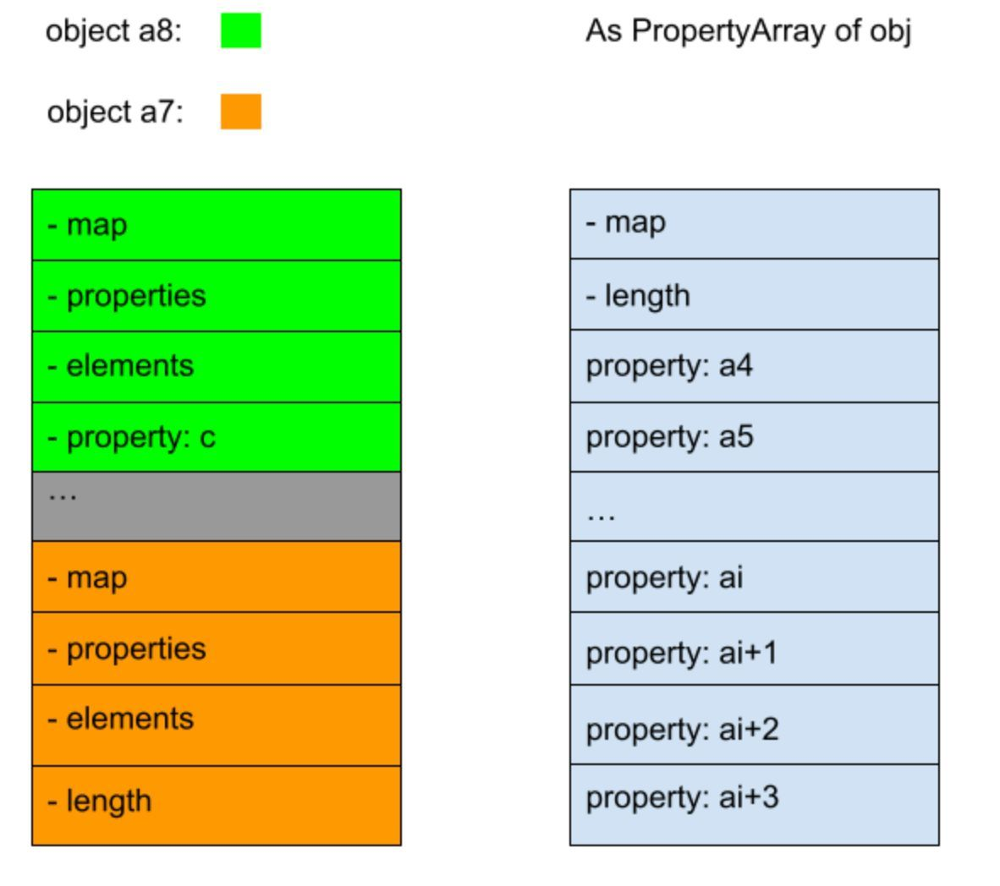</td>
<td></td>
</table></tr>
<table><tr>
<td>Quotes: <code>0</code></td>
<td>Replies: <code>0</code></td>
<td>Retweets: <code>35</code></td>
<td>Favorites: <code>164</code></td>
</tr></table>

---

# Dinosn
**https://twitter.com/Dinosn/status/1851111843168731223 _at 2024-10-29, 04:00:30_**
<blockquote>
CVE-2024-46483 (CVSS 9.8): Xlight FTP Server Flaw Leaves Users Exposed to Remote Attacks, PoC Published https://t.co/fzZCdsmcP0
</blockquote>

* https://securityonline.info/cve-2024-46483-cvss-9-8-xlight-ftp-server-flaw-leaves-users-exposed-to-remote-attacks-poc-published/

<table><tr>
<td>Quotes: <code>1</code></td>
<td>Replies: <code>0</code></td>
<td>Retweets: <code>14</code></td>
<td>Favorites: <code>44</code></td>
</tr></table>

---

# akaclandestine
**https://twitter.com/akaclandestine/status/1850869639108088227 _at 2024-10-28, 11:58:04_**
<blockquote>
#exploit
1. CVE-2024-41992:
Arcadyan FMIMG51AX000J (WiFi Alliance) RCE
https://t.co/NUO6IxocvM

2. CVE-2024-48930:
Remote Private key extraction over ECDH
(11 session..)
https://t.co/daRcBIpmxv
</blockquote>

* https://ssd-disclosure.com/ssd-advisory-arcadyan-fmimg51ax000j-wifi-alliance-rce
* https://github.com/cryptocoinjs/secp256k1-node/security/advisories/GHSA-584q-6j8j-r5pm

<table><tr>
<td>Quotes: <code>0</code></td>
<td>Replies: <code>6</code></td>
<td>Retweets: <code>37</code></td>
<td>Favorites: <code>88</code></td>
</tr></table>

---

# the_yellow_fall
**https://twitter.com/the_yellow_fall/status/1850735335950647399 _at 2024-10-28, 03:04:23_**
<blockquote>
Researcher Details CVE-2024-38812 (CVSS 9.8): Critical RCE Flaw in VMware vCenter

Understand the impact of CVE-2024-38812, a high-risk exploit, and how to secure your #VMware vCenter Server with the necessary updates.
https://t.co/yrWCVFwgzo
</blockquote>

* https://securityonline.info/researcher-details-cve-2024-38812-cvss-9-8-critical-rce-flaw-in-vmware-vcenter/

<table><tr>
<td>Quotes: <code>1</code></td>
<td>Replies: <code>0</code></td>
<td>Retweets: <code>25</code></td>
<td>Favorites: <code>55</code></td>
</tr></table>

---

# ntsuji
**https://twitter.com/ntsuji/status/1850688177625076125 _at 2024-10-27, 23:57:00_**
<blockquote>
5月に修正された CVE-2024-4947 などを悪用していたとのこと。

APT攻撃グループ「Lazarus」が、Google Chromeのゼロデイ脆弱性を悪用し暗号資産を窃取していたことを発見 https://t.co/Wvg04d2sGT
</blockquote>

* https://www.kaspersky.co.jp/about/press-releases/vir24102024

<table><tr>
<td>Quotes: <code>0</code></td>
<td>Replies: <code>1</code></td>
<td>Retweets: <code>9</code></td>
<td>Favorites: <code>47</code></td>
</tr></table>

---

# kmkz_security
**https://twitter.com/kmkz_security/status/1850686356248227863 _at 2024-10-27, 23:49:46_**
<blockquote>
RT @0xor0ne: Exploiting an object corruption bug in v8 (CVE-2024-3833)

https://t.co/45cd2Sked4

Credits @mmolgtm

#infosec #chrome https:/…
</blockquote>

* https://github.blog/security/vulnerability-research/attack-of-the-clones-getting-rce-in-chromes-renderer-with-duplicate-object-properties/

<table><tr>
<td>Quotes: <code>0</code></td>
<td>Replies: <code>0</code></td>
<td>Retweets: <code>34</code></td>
<td>Favorites: <code>0</code></td>
</tr></table>

---

# akaclandestine
**https://twitter.com/akaclandestine/status/1850474376531005934 _at 2024-10-27, 09:47:26_**
<blockquote>
#exploit
1. CVE-2024-39205:
Pyload RCE with js2py sandbox escape
https://t.co/xPx0YWbXQ9

2. CVE-2024-40431,
CVE-2022-25477 - 25480:
Vulnerabilities in RtsPer.sys (Realtek SD Card Reader Driver)
https://t.co/hP9Paw68cX

3. CVE-2024-1512:
SQLI in MasterStudy LMS WP Plugin
</blockquote>

* https://github.com/Marven11/CVE-2024-39205-Pyload-RCE
* https://github.com/zwclose/realteksd

<table><tr>
<td>Quotes: <code>0</code></td>
<td>Replies: <code>0</code></td>
<td>Retweets: <code>16</code></td>
<td>Favorites: <code>41</code></td>
</tr></table>

---

# 0xor0ne
**https://twitter.com/0xor0ne/status/1850454920836591951 _at 2024-10-27, 08:30:07_**
<blockquote>
Exploiting an object corruption bug in v8 (CVE-2024-3833)

https://t.co/45cd2Sked4

Credits @mmolgtm

#infosec #chrome https://t.co/bzrOqns74g
</blockquote>

* https://github.blog/security/vulnerability-research/attack-of-the-clones-getting-rce-in-chromes-renderer-with-duplicate-object-properties/

<table><tr>
<td></td>
<td></td>
</table></tr>
<table><tr>
<td>Quotes: <code>0</code></td>
<td>Replies: <code>0</code></td>
<td>Retweets: <code>28</code></td>
<td>Favorites: <code>126</code></td>
</tr></table>

---

# alisaesage
**https://twitter.com/alisaesage/status/1850176777399959715 _at 2024-10-26, 14:04:53_**
<blockquote>
Security patch for CVE-2024-9680 0day addressed not one, but five distinct Use-after-Free issues around Web Animations JavaScript API of Firefox. Looking at the code, my thoughts as to WTF is going on there:
- UaF1 must be the 0G
- UaF2: found by variant analysis
- UaF3:
</blockquote>

<table><tr>
<td>Quotes: <code>0</code></td>
<td>Replies: <code>1</code></td>
<td>Retweets: <code>8</code></td>
<td>Favorites: <code>45</code></td>
</tr></table>

---

# elhackernet
**https://twitter.com/elhackernet/status/1850074991959609617 _at 2024-10-26, 07:20:25_**
<blockquote>
Investigación de la vulnerabilidad de día cero de FortiManager (CVE-2024-47575)
https://t.co/L5Bla4IJ2Y https://t.co/NEyS5ivfKZ
</blockquote>

* https://cloud.google.com/blog/topics/threat-intelligence/fortimanager-zero-day-exploitation-cve-2024-47575

<table><tr>
<td></td>
<td></td>
<td></td>
<td></td>
</table></tr>
<table><tr>
<td>Quotes: <code>1</code></td>
<td>Replies: <code>0</code></td>
<td>Retweets: <code>34</code></td>
<td>Favorites: <code>83</code></td>
</tr></table>

---

# ptracesecurity
**https://twitter.com/ptracesecurity/status/1849949123115368544 _at 2024-10-25, 23:00:16_**
<blockquote>
Investigating FortiManager Zero-Day Exploitation (CVE-2024-47575) https://t.co/2M9L6M4Fcn  #Pentesting #Exploit #CyberSecurity #Infosec https://t.co/Rl4sNiQYDM
</blockquote>

* https://cloud.google.com/blog/topics/threat-intelligence/fortimanager-zero-day-exploitation-cve-2024-47575

<table><tr>
<td></td>
<td></td>
<td></td>
<td></td>
</table></tr>
<table><tr>
<td>Quotes: <code>0</code></td>
<td>Replies: <code>0</code></td>
<td>Retweets: <code>9</code></td>
<td>Favorites: <code>46</code></td>
</tr></table>

---

# elhackernet
**https://twitter.com/elhackernet/status/1849923984646721595 _at 2024-10-25, 21:20:22_**
<blockquote>
Actualización de seguridad para
Grafana

➡️ CVE-2024-9264 (LFi) Local File Inclusion via SQL
https://t.co/dPAUPYJ1M0 https://t.co/dHuxmNT7qj
</blockquote>

* https://grafana.com/blog/2024/10/17/grafana-security-release-critical-severity-fix-for-cve-2024-9264/

<table><tr>
<td></td>
</table></tr>
<table><tr>
<td>Quotes: <code>1</code></td>
<td>Replies: <code>0</code></td>
<td>Retweets: <code>5</code></td>
<td>Favorites: <code>42</code></td>
</tr></table>

---

# TheHackersNews
**https://twitter.com/TheHackersNews/status/1849808907474174325 _at 2024-10-25, 13:43:05_**
<blockquote>
Attention: CVE-2024-41992 #vulnerability in Wi-Fi Test Suite could give attackers full control over Arcadyan routers. The flaw allows for command injection, enabling full administrative access.

Find details here → https://t.co/BV9fHJO5Ns

#cybersecurity #infosec
</blockquote>

* https://thehackernews.com/2024/10/researchers-discover-command-injection.html

<table><tr>
<td>Quotes: <code>2</code></td>
<td>Replies: <code>4</code></td>
<td>Retweets: <code>31</code></td>
<td>Favorites: <code>61</code></td>
</tr></table>

---

# x0rz
**https://twitter.com/x0rz/status/1849693652597030996 _at 2024-10-25, 06:05:07_**
<blockquote>
RT @Mandiant: 🚨 Breaking: A zero-day vulnerability (CVE-2024-47575) has been observed impacting Fortinet FortiManager devices, posing serio…
</blockquote>

<table><tr>
<td>Quotes: <code>0</code></td>
<td>Replies: <code>0</code></td>
<td>Retweets: <code>123</code></td>
<td>Favorites: <code>0</code></td>
</tr></table>

---

# 1ZRR4H
**https://twitter.com/1ZRR4H/status/1849648578848792728 _at 2024-10-25, 03:06:00_**
<blockquote>
Is this a #FortiJump attempt? 🤔 I have no idea.

The image shows a scan received on 2024-10-20 19:22:50 from 104.238.141.143. The IP was mentioned in Mandiant's blog about CVE-2024-47575 (https://t.co/Zg98WFc9oN). https://t.co/9TtXV8MfEB
</blockquote>

* https://cloud.google.com/blog/topics/threat-intelligence/fortimanager-zero-day-exploitation-cve-2024-47575

<table><tr>
<td></td>
</table></tr>
<table><tr>
<td>Quotes: <code>0</code></td>
<td>Replies: <code>1</code></td>
<td>Retweets: <code>26</code></td>
<td>Favorites: <code>72</code></td>
</tr></table>

---

# 1ZRR4H
**https://twitter.com/1ZRR4H/status/1849638330666811704 _at 2024-10-25, 02:25:17_**
<blockquote>
RT @blackorbird: #Lazarus #BlueNoroff
A comprehensive analysis of the Chrome Remote Code Execution Vulnerability CVE-2024-4947

More import…
</blockquote>

<table><tr>
<td>Quotes: <code>0</code></td>
<td>Replies: <code>0</code></td>
<td>Retweets: <code>31</code></td>
<td>Favorites: <code>0</code></td>
</tr></table>

---

# HunterMapping
**https://twitter.com/HunterMapping/status/1849632371697422771 _at 2024-10-25, 02:01:36_**
<blockquote>
🚨Alert🚨CVE-2024-38094: Microsoft SharePoint Remote Code Execution Vulnerability
🔥PoC: https://t.co/8xzTthjaF4
📊 36K+ Services are found on https://t.co/ysWb28BTvF yearly.
🔗Hunter Link: https://t.co/EDWFkA1VZH
👇Query
HUNTER:/product.name="SharePoint Server"
FOFA: https://t.co/w8CFOw18zk
</blockquote>

* https://github.com/testanull/MS-SharePoint-July-Patch-RCE-PoC
* http://hunter.how
* https://hunter.how/list?searchValue=product.name%3D%22SharePoint%20Server%22

<table><tr>
<td>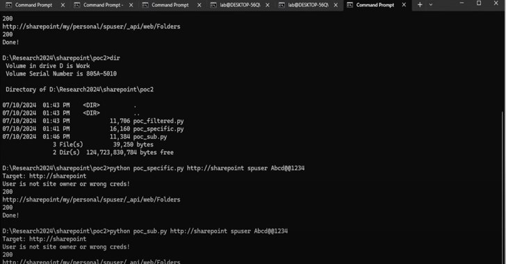</td>
</table></tr>
<table><tr>
<td>Quotes: <code>0</code></td>
<td>Replies: <code>1</code></td>
<td>Retweets: <code>94</code></td>
<td>Favorites: <code>272</code></td>
</tr></table>

---

# TheHackersNews
**https://twitter.com/TheHackersNews/status/1849431434077049009 _at 2024-10-24, 12:43:09_**
<blockquote>
Cisco has patched CVE-2024-20481, a #vulnerability affecting its ASA and Firepower devices that could lead to a denial-of-service (DoS) for Remote Access VPNs.

Learn more: https://t.co/ctQgrD1j6o

#cybersecurity #infosec
</blockquote>

* https://thehackernews.com/2024/10/cisco-issues-urgent-fix-for-asa-and-ftd.html

<table><tr>
<td>Quotes: <code>0</code></td>
<td>Replies: <code>2</code></td>
<td>Retweets: <code>33</code></td>
<td>Favorites: <code>60</code></td>
</tr></table>

---

# fr0gger_
**https://twitter.com/fr0gger_/status/1849385937501126843 _at 2024-10-24, 09:42:22_**
<blockquote>
🔥 Quick generated overview of the key findings from the latest threat report about CVE-2024-47575

https://t.co/gIAalrUHus https://t.co/TIaVda6mjD
</blockquote>

* https://cloud.google.com/blog/topics/threat-intelligence/fortimanager-zero-day-exploitation-cve-2024-47575?hl=en

<table><tr>
<td></td>
</table></tr>
<table><tr>
<td>Quotes: <code>2</code></td>
<td>Replies: <code>2</code></td>
<td>Retweets: <code>16</code></td>
<td>Favorites: <code>74</code></td>
</tr></table>

---

# blackorbird
**https://twitter.com/blackorbird/status/1849368696218853660 _at 2024-10-24, 08:33:51_**
<blockquote>
#Lazarus #BlueNoroff
A comprehensive analysis of the Chrome Remote Code Execution Vulnerability CVE-2024-4947

More importantly, the game can be played!
https://t.co/8gcpIJaP0c
ref:
https://t.co/h0sjnSv2xu https://t.co/akQz7l8q36
</blockquote>

* https://securelist.com/lazarus-apt-steals-crypto-with-a-tank-game/114282/
* https://x.com/blackorbird/status/1795639225083379821

<table><tr>
<td>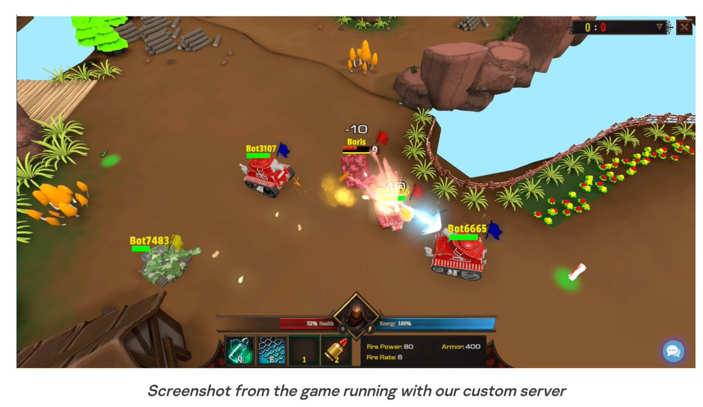</td>
<td>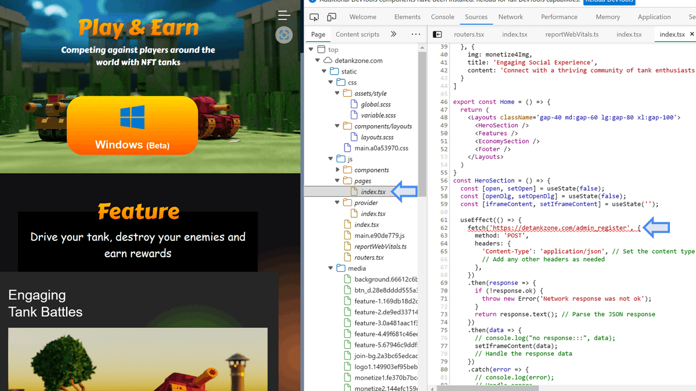</td>
</table></tr>
<table><tr>
<td>Quotes: <code>2</code></td>
<td>Replies: <code>1</code></td>
<td>Retweets: <code>32</code></td>
<td>Favorites: <code>92</code></td>
</tr></table>

---

# blackorbird
**https://twitter.com/blackorbird/status/1849362042777735523 _at 2024-10-24, 08:07:25_**
<blockquote>
Investigating FortiManager Zero-Day Exploitation (CVE-2024-47575)
https://t.co/I8mWkVqMqG https://t.co/rMgKqbboO9
</blockquote>

* https://cloud.google.com/blog/topics/threat-intelligence/fortimanager-zero-day-exploitation-cve-2024-47575

<table><tr>
<td></td>
</table></tr>
<table><tr>
<td>Quotes: <code>1</code></td>
<td>Replies: <code>1</code></td>
<td>Retweets: <code>38</code></td>
<td>Favorites: <code>111</code></td>
</tr></table>

---

# TheHackersNews
**https://twitter.com/TheHackersNews/status/1849336525672399005 _at 2024-10-24, 06:26:01_**
<blockquote>
🚨 Fortinet confirms a critical #vulnerability (CVE-2024-47575 / CVSS 9.8) affecting FortiManager is being actively exploited!

It could allow unauthorized remote access, potentially compromising sensitive data &amp; configurations.

https://t.co/OVP4aTx6vK

Don't wait—patch now.
</blockquote>

* https://thehackernews.com/2024/10/fortinet-warns-of-critical.html

<table><tr>
<td>Quotes: <code>5</code></td>
<td>Replies: <code>3</code></td>
<td>Retweets: <code>92</code></td>
<td>Favorites: <code>188</code></td>
</tr></table>

---

# Mandiant
**https://twitter.com/Mandiant/status/1849254485043950079 _at 2024-10-24, 01:00:01_**
<blockquote>
🚨 Breaking: A zero-day vulnerability (CVE-2024-47575) has been observed impacting Fortinet FortiManager devices, posing serious risks. Learn how the exploit works, and how to defend against the threat.

Read more -&gt; https://t.co/tGag4Okvvd

#ThreatIntelligence https://t.co/csSli2nh1b
</blockquote>

* https://bit.ly/4hbqmuR

<table><tr>
<td></td>
</table></tr>
<table><tr>
<td>Quotes: <code>3</code></td>
<td>Replies: <code>0</code></td>
<td>Retweets: <code>39</code></td>
<td>Favorites: <code>67</code></td>
</tr></table>

---

# 1ZRR4H
**https://twitter.com/1ZRR4H/status/1849137061250376072 _at 2024-10-23, 17:13:25_**
<blockquote>
🔴 CVE-2024-47575: FortiManager fgfmd daemon may allow a remote unauthenticated attacker to  execute arbitrary code or commands via specially crafted requests (critical) / aka #FortiJump.

Vulnerability used in zero-day attacks 🔥

Reported malicious IPs:
- 45.32.41.202
- https://t.co/fiMfTXbnju
</blockquote>

<table><tr>
<td></td>
<td></td>
</table></tr>
<table><tr>
<td>Quotes: <code>6</code></td>
<td>Replies: <code>1</code></td>
<td>Retweets: <code>60</code></td>
<td>Favorites: <code>177</code></td>
</tr></table>

---

# S0ufi4n3
**https://twitter.com/S0ufi4n3/status/1849106221782990939 _at 2024-10-23, 15:10:52_**
<blockquote>
CVE-2024-47575: A missing authentication for critical function vulnerability in FortiManager fgfmd daemon may allow a remote unauthenticated attacker to execute arbitrary code or commands via specially crafted requests.

https://t.co/c1ldenO14c
</blockquote>

* https://www.fortiguard.com/psirt/FG-IR-24-423A

<table><tr>
<td>Quotes: <code>1</code></td>
<td>Replies: <code>0</code></td>
<td>Retweets: <code>6</code></td>
<td>Favorites: <code>33</code></td>
</tr></table>

---

# 0xor0ne
**https://twitter.com/0xor0ne/status/1849103725505245277 _at 2024-10-23, 15:00:57_**
<blockquote>
Exploiting CVE-2024-26581: use-after-free in Linux kernel nftables subsystem

https://t.co/YX0UdVreSu

#Linux #cybersecurity https://t.co/mCUb5hoHfu
</blockquote>

* https://github.com/google/security-research/blob/master/pocs/linux/kernelctf/CVE-2024-26581_lts_cos_mitigation/docs/exploit.md

<table><tr>
<td></td>
<td></td>
</table></tr>
<table><tr>
<td>Quotes: <code>2</code></td>
<td>Replies: <code>1</code></td>
<td>Retweets: <code>37</code></td>
<td>Favorites: <code>186</code></td>
</tr></table>

---

# piedpiper1616
**https://twitter.com/piedpiper1616/status/1849100902713774291 _at 2024-10-23, 14:49:44_**
<blockquote>
GitHub - EQSTLab/CVE-2024-46538: PoC for CVE-2024-46538 - https://t.co/FMQHdEMjKE
</blockquote>

* https://github.com/EQSTLab/CVE-2024-46538

<table><tr>
<td>Quotes: <code>0</code></td>
<td>Replies: <code>3</code></td>
<td>Retweets: <code>15</code></td>
<td>Favorites: <code>62</code></td>
</tr></table>

---

# TheHackersNews
**https://twitter.com/TheHackersNews/status/1849072159437807812 _at 2024-10-23, 12:55:31_**
<blockquote>
⚠️ A high-severity flaw in #Microsoft SharePoint (CVE-2024-38094) has been added to CISA's Known Exploited Vulnerabilities catalog.

Proof-of-concept (PoC) scripts are already public, making exploitation more accessible.

Learn more: https://t.co/K0cmNL14rh

#cybersecurity
</blockquote>

* https://thehackernews.com/2024/10/cisa-warns-of-active-exploitation-of.html

<table><tr>
<td>Quotes: <code>6</code></td>
<td>Replies: <code>2</code></td>
<td>Retweets: <code>102</code></td>
<td>Favorites: <code>209</code></td>
</tr></table>

---

# hackerfantastic
**https://twitter.com/hackerfantastic/status/1848816598884192381 _at 2024-10-22, 20:00:01_**
<blockquote>
RT @maherazz2: CVE-2024-26926 Binder n-day analysis.
It is labeled EoP in Android Security Bulletin (Is it really exploitable?)

https://t.…
</blockquote>

<table><tr>
<td>Quotes: <code>0</code></td>
<td>Replies: <code>0</code></td>
<td>Retweets: <code>35</code></td>
<td>Favorites: <code>0</code></td>
</tr></table>

---

# kmkz_security
**https://twitter.com/kmkz_security/status/1848793568434962667 _at 2024-10-22, 18:28:30_**
<blockquote>
RT @0xor0ne: Execute arbitrary code as any app on a device (CVE-2024-31317) (Zygote injection)

https://t.co/gFFCgvdiMR

Technical blog pos…
</blockquote>

* https://rtx.meta.security/exploitation/2024/06/03/Android-Zygote-injection.html

<table><tr>
<td>Quotes: <code>0</code></td>
<td>Replies: <code>0</code></td>
<td>Retweets: <code>41</code></td>
<td>Favorites: <code>0</code></td>
</tr></table>

---

# binitamshah
**https://twitter.com/binitamshah/status/1848743153068871742 _at 2024-10-22, 15:08:10_**
<blockquote>
Escaping the Chrome Sandbox Through DevTools : https://t.co/hQHGhvwRgC 

A POC exploit for CVE-2024-5836 and CVE-2024-6778, allowing for a sandbox escape from a Chrome extension : https://t.co/433NhrlWTa https://t.co/AEmnjaazB9
</blockquote>

* https://ading.dev/blog/posts/chrome_sandbox_escape.html
* https://github.com/ading2210/CVE-2024-6778-POC

<table><tr>
<td>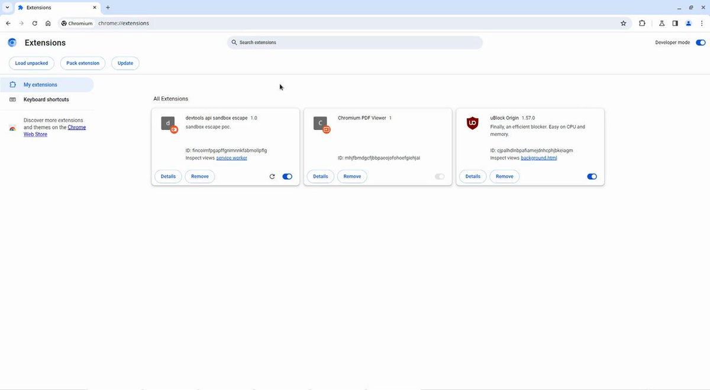</td>
</table></tr>
<table><tr>
<td>Quotes: <code>2</code></td>
<td>Replies: <code>0</code></td>
<td>Retweets: <code>48</code></td>
<td>Favorites: <code>152</code></td>
</tr></table>

---

# TheHackersNews
**https://twitter.com/TheHackersNews/status/1848729429478175147 _at 2024-10-22, 14:13:38_**
<blockquote>
A new #vulnerability in Styra's Open Policy Agent (CVE-2024-8260) could expose NTLM credentials to attackers.

Attackers can exploit it to relay authentication, reinforcing the need for stringent input validation across all applications.

Read: https://t.co/oQaC2TC40w

#infosec
</blockquote>

* https://thehackernews.com/2024/10/security-flaw-in-styras-opa-exposes.html

<table><tr>
<td>Quotes: <code>0</code></td>
<td>Replies: <code>3</code></td>
<td>Retweets: <code>27</code></td>
<td>Favorites: <code>60</code></td>
</tr></table>

---

# Dinosn
**https://twitter.com/Dinosn/status/1848648601884401948 _at 2024-10-22, 08:52:27_**
<blockquote>
VMware failed to fully address vCenter Server RCE flaw CVE-2024-38812 https://t.co/jzMbYIPvcv
</blockquote>

* https://securityaffairs.com/170096/security/vmware-failed-to-fix-rce-vcenter-server-cve-2024-38812.html

<table><tr>
<td>Quotes: <code>0</code></td>
<td>Replies: <code>0</code></td>
<td>Retweets: <code>8</code></td>
<td>Favorites: <code>32</code></td>
</tr></table>

---

# cyber_advising
**https://twitter.com/cyber_advising/status/1848642473804878324 _at 2024-10-22, 08:28:06_**
<blockquote>
CVE-2024-9264: SQL injection vulnerability in Grafana's experimental SQL Expressions feature. Any authenticated user can execute arbitrary DuckDB SQL queries through modified expressions in Grafana dashboards.

PoC
https://t.co/AhS3qmjWGu https://t.co/bmfdfOH3Z9
</blockquote>

* https://github.com/nollium/CVE-2024-9264?tab=readme-ov-file#grafana-post-auth-duckdb-sql-injection-file-read

<table><tr>
<td></td>
</table></tr>
<table><tr>
<td>Quotes: <code>1</code></td>
<td>Replies: <code>9</code></td>
<td>Retweets: <code>24</code></td>
<td>Favorites: <code>49</code></td>
</tr></table>

---

# TheHackersNews
**https://twitter.com/TheHackersNews/status/1848621784200892567 _at 2024-10-22, 07:05:53_**
<blockquote>
VMware has released updates for CVE-2024-38812, a critical #vulnerability in vCenter Server.

With a CVSS score of 9.8, this heap-overflow flaw could allow remote code execution, fundamentally jeopardizing organizational security.

Read: https://t.co/dsZD0lKQaA

#infosec
</blockquote>

* https://thehackernews.com/2024/10/vmware-releases-vcenter-server-update.html

<table><tr>
<td>Quotes: <code>1</code></td>
<td>Replies: <code>1</code></td>
<td>Retweets: <code>16</code></td>
<td>Favorites: <code>43</code></td>
</tr></table>

---

# kmkz_security
**https://twitter.com/kmkz_security/status/1848615170651595211 _at 2024-10-22, 06:39:36_**
<blockquote>
RT @maherazz2: CVE-2024-26926 Binder n-day analysis.
It is labeled EoP in Android Security Bulletin (Is it really exploitable?)

https://t.…
</blockquote>

<table><tr>
<td>Quotes: <code>0</code></td>
<td>Replies: <code>0</code></td>
<td>Retweets: <code>37</code></td>
<td>Favorites: <code>0</code></td>
</tr></table>

---

# TheHackersNews
**https://twitter.com/TheHackersNews/status/1848592183747875098 _at 2024-10-22, 05:08:16_**
<blockquote>
⚠️ CISA has added a critical zero-day #vulnerability (CVE-2024-9537) affecting ScienceLogic SL1 to its KEV catalog.

This flaw, with a staggering CVSS score of 9.3, allows for remote code execution.

Read 👉 https://t.co/HDXzWCCzpI

Apply the latest patches.
</blockquote>

* https://thehackernews.com/2024/10/cisa-adds-sciencelogic-sl1.html

<table><tr>
<td>Quotes: <code>0</code></td>
<td>Replies: <code>1</code></td>
<td>Retweets: <code>26</code></td>
<td>Favorites: <code>37</code></td>
</tr></table>

---

# reverseame
**https://twitter.com/reverseame/status/1848433351020945546 _at 2024-10-21, 18:37:07_**
<blockquote>
Exploiting Microsoft Kernel Applocker Driver (CVE-2024-38041) #MicrosoftKernelCVE #CyberSecurityServices #PatchDiffing #ExploitationProcess #RootCauseAnalysis https://t.co/oAPFdgAdz0
</blockquote>

* https://csa.limited/blog/20240916-Exploiting-Microsoft-Kernel-Applocker-Driver.html

<table><tr>
<td>Quotes: <code>0</code></td>
<td>Replies: <code>0</code></td>
<td>Retweets: <code>13</code></td>
<td>Favorites: <code>44</code></td>
</tr></table>

---

# akaclandestine
**https://twitter.com/akaclandestine/status/1848348494878183861 _at 2024-10-21, 12:59:56_**
<blockquote>
GitHub - Dor00tkit/CVE-2024-30090: CVE-2024-30090 - LPE PoC https://t.co/re1BrYNuer
</blockquote>

* https://github.com/Dor00tkit/CVE-2024-30090

<table><tr>
<td>Quotes: <code>0</code></td>
<td>Replies: <code>1</code></td>
<td>Retweets: <code>15</code></td>
<td>Favorites: <code>40</code></td>
</tr></table>

---

# kmkz_security
**https://twitter.com/kmkz_security/status/1848327647194956176 _at 2024-10-21, 11:37:06_**
<blockquote>
RT @reubensammut: Following our successful exploitation of CVE-2018-3048 on the ChakraCore engine, myself and @f00fc7c800 have decided to w…
</blockquote>

<table><tr>
<td>Quotes: <code>0</code></td>
<td>Replies: <code>0</code></td>
<td>Retweets: <code>31</code></td>
<td>Favorites: <code>0</code></td>
</tr></table>

---

# HunterMapping
**https://twitter.com/HunterMapping/status/1848261385290936556 _at 2024-10-21, 07:13:47_**
<blockquote>
🚨Alert🚨
CVE-2024-38819: Path Traversal Risk in Spring Framework Web Apps
📊 31.9K+ Services are found on https://t.co/ysWb28BTvF yearly.
🔗Hunter Link: https://t.co/wiRxP8PM5U
👇Query
Hunter:/product.name="Spring Framework LocaleResolver"
📰Refer: https://t.co/qEtEttssXa https://t.co/eQ4lQVI9oa
</blockquote>

* http://hunter.how
* https://hunter.how/list?searchValue=product.name%3D%22Spring%20Framework%20LocaleResolver%22
* https://securityonline.info/spring-framework-vulnerability-cve-2024-38819-path-traversal-risk-in-web-apps/

<table><tr>
<td></td>
</table></tr>
<table><tr>
<td>Quotes: <code>1</code></td>
<td>Replies: <code>1</code></td>
<td>Retweets: <code>32</code></td>
<td>Favorites: <code>91</code></td>
</tr></table>

---

# zapstiko
**https://twitter.com/zapstiko/status/1848244040090947883 _at 2024-10-21, 06:04:52_**
<blockquote>
CVE-2023-4220
#bugbounty #bugbountytip #cve 
Exploit: https://t.co/zUTWmKsrVF https://t.co/kYLV8Wpvze
</blockquote>

* https://github.com/m3m0o/chamilo-lms-unauthenticated-big-upload-rce-poc

<table><tr>
<td></td>
</table></tr>
<table><tr>
<td>Quotes: <code>1</code></td>
<td>Replies: <code>1</code></td>
<td>Retweets: <code>16</code></td>
<td>Favorites: <code>103</code></td>
</tr></table>

---

# piedpiper1616
**https://twitter.com/piedpiper1616/status/1848144722940010672 _at 2024-10-20, 23:30:13_**
<blockquote>
GitHub - r00tjunip3r1/POC-CVE-2024-6778 - https://t.co/OzlzXTTozv
</blockquote>

* https://github.com/r00tjunip3r1/POC-CVE-2024-6778?tab=readme-ov-file

<table><tr>
<td>Quotes: <code>0</code></td>
<td>Replies: <code>0</code></td>
<td>Retweets: <code>10</code></td>
<td>Favorites: <code>34</code></td>
</tr></table>

---

# piedpiper1616
**https://twitter.com/piedpiper1616/status/1848004228398358723 _at 2024-10-20, 14:11:56_**
<blockquote>
GitHub - nollium/CVE-2024-9264: Exploit for Grafana arbitrary file-read (CVE-2024-9264) - https://t.co/8y8xolgPFl
</blockquote>

* https://github.com/nollium/CVE-2024-9264

<table><tr>
<td>Quotes: <code>0</code></td>
<td>Replies: <code>1</code></td>
<td>Retweets: <code>33</code></td>
<td>Favorites: <code>90</code></td>
</tr></table>

---

# ptracesecurity
**https://twitter.com/ptracesecurity/status/1847967269126647929 _at 2024-10-20, 11:45:05_**
<blockquote>
Exploit for Grafana arbitrary file-read (CVE-2024-9264) https://t.co/xg4HMnC0Gv    #Pentesting #CyberSecurity #Infosec https://t.co/beOrqU0tXF
</blockquote>

* https://github.com/nollium/CVE-2024-9264/tree/main

<table><tr>
<td></td>
</table></tr>
<table><tr>
<td>Quotes: <code>0</code></td>
<td>Replies: <code>0</code></td>
<td>Retweets: <code>18</code></td>
<td>Favorites: <code>71</code></td>
</tr></table>

---

# 1ZRR4H
**https://twitter.com/1ZRR4H/status/1847683862211473857 _at 2024-10-19, 16:58:55_**
<blockquote>
🔴 CVE-2024-48904: Trend Micro Cloud Edge Command Injection RCE Vulnerability (critical). 

[+] https://t.co/JAdb7pFmAF https://t.co/3RTLghthdR
</blockquote>

* https://success.trendmicro.com/en-US/solution/KA-0017998

<table><tr>
<td></td>
</table></tr>
<table><tr>
<td>Quotes: <code>0</code></td>
<td>Replies: <code>0</code></td>
<td>Retweets: <code>54</code></td>
<td>Favorites: <code>132</code></td>
</tr></table>

---

# 0xdf_
**https://twitter.com/0xdf_/status/1847676961553797148 _at 2024-10-19, 16:31:30_**
<blockquote>
Editorial from @hackthebox_eu involves abusing a SSRF to read private data from an internal API, leaking a password. Then I'll abuse Git two ways, first finding another password in an old commit, and then exploiting CVE-2022-24439 to get root.

https://t.co/cPIFwkZ2ZP
</blockquote>

* https://0xdf.gitlab.io/2024/10/19/htb-editorial.html

<table><tr>
<td>Quotes: <code>0</code></td>
<td>Replies: <code>0</code></td>
<td>Retweets: <code>26</code></td>
<td>Favorites: <code>84</code></td>
</tr></table>

---

# nol_tech
**https://twitter.com/nol_tech/status/1847639874909749443 _at 2024-10-19, 14:04:08_**
<blockquote>
Wrote a POC and vulnerability analysis for CVE-2024-9264

Grafana authenticated ""RCE""
https://t.co/Q23VOGATkQ https://t.co/rBxzfrMpQP
</blockquote>

* https://github.com/nollium/CVE-2024-9264/tree/main

<table><tr>
<td>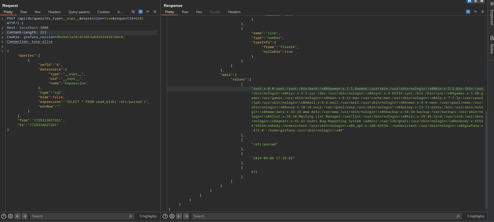</td>
</table></tr>
<table><tr>
<td>Quotes: <code>7</code></td>
<td>Replies: <code>7</code></td>
<td>Retweets: <code>154</code></td>
<td>Favorites: <code>624</code></td>
</tr></table>

---

# ksg93rd
**https://twitter.com/ksg93rd/status/1847301794818384373 _at 2024-10-18, 15:40:43_**
<blockquote>
#exploit
Streaming vulnerabilities from Windows Kernel - Proxying to Kernel
Part 1 (CVE-2024-30084, CVE-2024-35250):
https://t.co/PCeCq0JWCZ
Part 2 (CVE-2024-30090):
https://t.co/TjOAfoSNWv
]-&gt; https://t.co/heJDE8ujc3
</blockquote>

* https://devco.re/blog/2024/08/23/streaming-vulnerabilities-from-windows-kernel-proxying-to-kernel-part1-en
* https://devco.re/blog/2024/10/05/streaming-vulnerabilities-from-windows-kernel-proxying-to-kernel-part2-en
* https://github.com/Dor00tkit/CVE-2024-30090

<table><tr>
<td>Quotes: <code>0</code></td>
<td>Replies: <code>0</code></td>
<td>Retweets: <code>16</code></td>
<td>Favorites: <code>77</code></td>
</tr></table>

---

# TheHackersNews
**https://twitter.com/TheHackersNews/status/1847151565335154891 _at 2024-10-18, 05:43:46_**
<blockquote>
🛑 Microsoft discovered a serious security flaw (CVE-2024-44133) in #Apple’s macOS TCC framework that could bypass user consent for sensitive data access like your location, camera, or microphone!

Learn more: https://t.co/yI2HBqxavV

#privacy #infosec #cybersecurity
</blockquote>

* https://thehackernews.com/2024/10/microsoft-reveals-macos-vulnerability.html

<table><tr>
<td>Quotes: <code>1</code></td>
<td>Replies: <code>3</code></td>
<td>Retweets: <code>31</code></td>
<td>Favorites: <code>67</code></td>
</tr></table>

---

# 0xor0ne
**https://twitter.com/0xor0ne/status/1846929370054590890 _at 2024-10-17, 15:00:50_**
<blockquote>
Patch diffing nwifi.sys Wi-Fi driver for analysing CVE-2024-30078

https://t.co/5LeswHywYW

#infosec #windows https://t.co/OY1gv7Ce2t
</blockquote>

* https://www.crowdfense.com/windows-wi-fi-driver-rce-vulnerability-cve-2024-30078/

<table><tr>
<td></td>
</table></tr>
<table><tr>
<td>Quotes: <code>0</code></td>
<td>Replies: <code>0</code></td>
<td>Retweets: <code>30</code></td>
<td>Favorites: <code>106</code></td>
</tr></table>

---

# steventseeley
**https://twitter.com/steventseeley/status/1846881925451206795 _at 2024-10-17, 11:52:19_**
<blockquote>
RT @AabyssZG: 【情报】新Windows提权漏洞CVE-2024-35250🚨
PoC for the Untrusted Pointer Dereference in the ks.sys driver😢
Github地址：https://t.co/qHy6Oic…
</blockquote>

<table><tr>
<td>Quotes: <code>0</code></td>
<td>Replies: <code>0</code></td>
<td>Retweets: <code>86</code></td>
<td>Favorites: <code>0</code></td>
</tr></table>

---

# TheHackersNews
**https://twitter.com/TheHackersNews/status/1846783116175987197 _at 2024-10-17, 05:19:41_**
<blockquote>
🛑 Kubernetes Image Builder #vulnerability (CVE-2024-9486) has a serious root access flaw.

With a CVSS score of 9.8, this flaw lets attackers exploit default credentials to take over virtual machines using certain image builds.

Read: https://t.co/GEJyxvgo8i

#cybersecurity
</blockquote>

* https://thehackernews.com/2024/10/critical-kubernetes-image-builder.html

<table><tr>
<td>Quotes: <code>1</code></td>
<td>Replies: <code>1</code></td>
<td>Retweets: <code>40</code></td>
<td>Favorites: <code>95</code></td>
</tr></table>

---

# x0rz
**https://twitter.com/x0rz/status/1846594971140608292 _at 2024-10-16, 16:52:03_**
<blockquote>
RT @ajxchapman: CVE-2024-23113 🤦 https://t.co/gj7t5BaRWY
</blockquote>

<table><tr>
<td></td>
</table></tr>
<table><tr>
<td>Quotes: <code>0</code></td>
<td>Replies: <code>0</code></td>
<td>Retweets: <code>239</code></td>
<td>Favorites: <code>0</code></td>
</tr></table>

---

# TheHackersNews
**https://twitter.com/TheHackersNews/status/1846504587962052755 _at 2024-10-16, 10:52:54_**
<blockquote>
🔥 One click, and chaos begins!

North Korean APT group ScarCruft has been linked to the exploitation of a zero-day Windows flaw (CVE-2024-38178), targeting unpatched Internet Explorer Mode in Edge, infecting devices with RokRAT malware.

Read: https://t.co/7473o7Gf9r

#infosec
</blockquote>

* https://thehackernews.com/2024/10/north-korean-scarcruft-exploits-windows.html

<table><tr>
<td>Quotes: <code>0</code></td>
<td>Replies: <code>2</code></td>
<td>Retweets: <code>22</code></td>
<td>Favorites: <code>45</code></td>
</tr></table>

---

# blackorbird
**https://twitter.com/blackorbird/status/1846483524070891839 _at 2024-10-16, 09:29:12_**
<blockquote>
#Group123, after infiltrating an advertising company's server, deployed a backdoor using the IE 0day exploit CVE-2024-38178 within ad scripts. This strategy enables a zero-click attack as the ads are served, executing the malicious code without any user interaction.
sample: https://t.co/epc2wDfOzE
</blockquote>

<table><tr>
<td></td>
<td>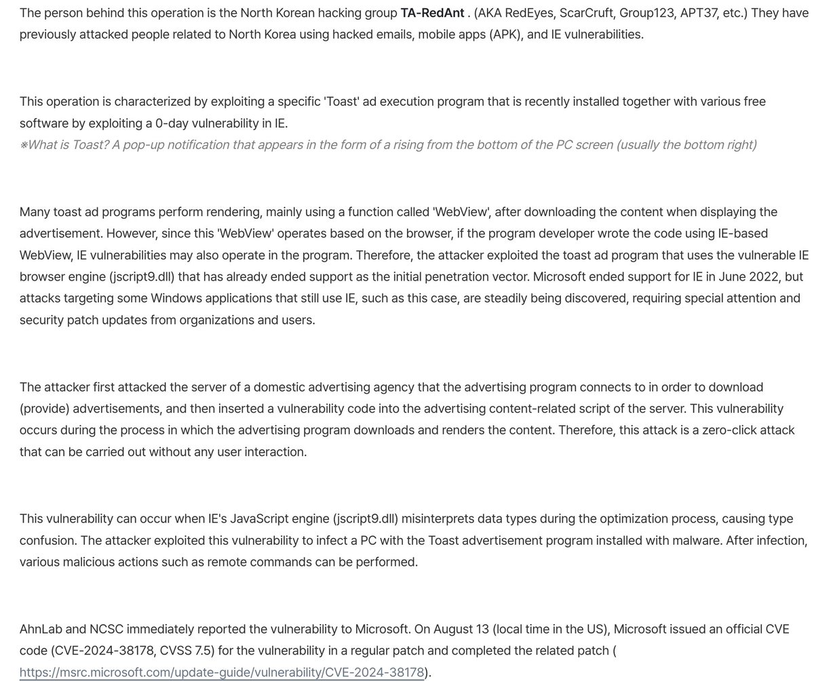</td>
</table></tr>
<table><tr>
<td>Quotes: <code>4</code></td>
<td>Replies: <code>1</code></td>
<td>Retweets: <code>40</code></td>
<td>Favorites: <code>116</code></td>
</tr></table>

---

# TheHackersNews
**https://twitter.com/TheHackersNews/status/1846417578987606155 _at 2024-10-16, 05:07:10_**
<blockquote>
🛡️ GitHub has released urgent security updates to fix a critical flaw (CVE-2024-9487) with a CVSS score of 9.5!

This bug allows unauthorized access by bypassing SAML SSO authentication—an immediate threat to your enterprise.

Details: https://t.co/gn7I8wf5TM

#infosec
</blockquote>

* https://thehackernews.com/2024/10/github-patches-critical-flaw-in.html

<table><tr>
<td>Quotes: <code>4</code></td>
<td>Replies: <code>3</code></td>
<td>Retweets: <code>62</code></td>
<td>Favorites: <code>117</code></td>
</tr></table>

---

# TheHackersNews
**https://twitter.com/TheHackersNews/status/1846414856456429758 _at 2024-10-16, 04:56:21_**
<blockquote>
💥 A critical flaw in SolarWinds Web Help Desk (CVE-2024-28987) has been actively exploited, and it involves hard-coded credentials that allow attackers to access sensitive help desk tickets.

Learn more: https://t.co/CFeKwQ1zTj

#infosec #cybersecurity
</blockquote>

* https://thehackernews.com/2024/10/cisa-warns-of-active-exploitation-in.html

<table><tr>
<td>Quotes: <code>0</code></td>
<td>Replies: <code>1</code></td>
<td>Retweets: <code>34</code></td>
<td>Favorites: <code>75</code></td>
</tr></table>

---

# hosselot
**https://twitter.com/hosselot/status/1846228724049383632 _at 2024-10-15, 16:36:43_**
<blockquote>
Mozilla fixed an almost similar ITW use-after-free vulnerability in Firefox several years ago (CVE-2016-9079). It happens during SVG animation handling with no JS callback involved!

A nice write-up by rapid7:
https://t.co/LpKuchYV5m

Mozilla bug entry:
https://t.co/wlvz389F0R
</blockquote>

* https://web.archive.org/web/20210804164844/https://www.rapid7.com/blog/post/2016/12/29/a-friendly-fireside-foray-into-a-firefox-fracas/
* https://bugzilla.mozilla.org/show_bug.cgi?id=1321066

<table><tr>
<td>Quotes: <code>0</code></td>
<td>Replies: <code>1</code></td>
<td>Retweets: <code>16</code></td>
<td>Favorites: <code>67</code></td>
</tr></table>

---

# piedpiper1616
**https://twitter.com/piedpiper1616/status/1846008791818818021 _at 2024-10-15, 02:02:47_**
<blockquote>
RT @watchtowrcyber: Some Fortinet Nday.. for now.... :-) CVE-2024-23113

https://t.co/Y10rZ8D0KC
</blockquote>

* https://labs.watchtowr.com/fortinet-fortigate-cve-2024-23113-a-super-complex-vulnerability-in-a-super-secure-appliance-in-2024/

<table><tr>
<td>Quotes: <code>0</code></td>
<td>Replies: <code>0</code></td>
<td>Retweets: <code>45</code></td>
<td>Favorites: <code>0</code></td>
</tr></table>

---

# ptracesecurity
**https://twitter.com/ptracesecurity/status/1845996801637101575 _at 2024-10-15, 01:15:09_**
<blockquote>
Fortinet FortiGate CVE-2024-23113 - A Super Complex Vulnerability In A Super Secure Appliance In 2024 https://t.co/GfsDCgdXVF  #Pentesting #CyberSecurity #Infosec https://t.co/QYZWorO8Vp
</blockquote>

* https://labs.watchtowr.com/fortinet-fortigate-cve-2024-23113-a-super-complex-vulnerability-in-a-super-secure-appliance-in-2024/

<table><tr>
<td></td>
<td></td>
<td></td>
</table></tr>
<table><tr>
<td>Quotes: <code>0</code></td>
<td>Replies: <code>0</code></td>
<td>Retweets: <code>12</code></td>
<td>Favorites: <code>40</code></td>
</tr></table>

---

# kmkz_security
**https://twitter.com/kmkz_security/status/1845924747441254846 _at 2024-10-14, 20:28:50_**
<blockquote>
RT @watchtowrcyber: Some Fortinet Nday.. for now.... :-) CVE-2024-23113

https://t.co/Y10rZ8D0KC
</blockquote>

* https://labs.watchtowr.com/fortinet-fortigate-cve-2024-23113-a-super-complex-vulnerability-in-a-super-secure-appliance-in-2024/

<table><tr>
<td>Quotes: <code>0</code></td>
<td>Replies: <code>0</code></td>
<td>Retweets: <code>46</code></td>
<td>Favorites: <code>0</code></td>
</tr></table>

---

# blackorbird
**https://twitter.com/blackorbird/status/1845820313285861517 _at 2024-10-14, 13:33:51_**
<blockquote>
APT34 exploit ngrok to bypass firewalls and network security controls for malicious purposes , also recently added CVE-2024-30088 to their toolset.
ref:
https://t.co/qtGMJSdKzK https://t.co/C3zSSuqJJH
</blockquote>

* https://www.trendmicro.com/en_us/research/24/j/earth-simnavaz-cyberattacks-uae-gulf-regions.html

<table><tr>
<td></td>
</table></tr>
<table><tr>
<td>Quotes: <code>2</code></td>
<td>Replies: <code>2</code></td>
<td>Retweets: <code>42</code></td>
<td>Favorites: <code>132</code></td>
</tr></table>

---

# blackorbird
**https://twitter.com/blackorbird/status/1845816449891483974 _at 2024-10-14, 13:18:29_**
<blockquote>
An adversary who had gained access to the customer’s network by exploiting the CVE-2024-8190 and two previously unknown vulnerabilities affecting the PHP front end of the Ivanti CSA appliance.
This top-level domain appears again😂
https://t.co/CegdEVBAMK https://t.co/OjvDiG6gpT
</blockquote>

* https://www.fortinet.com/blog/threat-research/burning-zero-days-suspected-nation-state-adversary-targets-ivanti-csa

<table><tr>
<td></td>
</table></tr>
<table><tr>
<td>Quotes: <code>0</code></td>
<td>Replies: <code>0</code></td>
<td>Retweets: <code>8</code></td>
<td>Favorites: <code>42</code></td>
</tr></table>

---

# TheHackersNews
**https://twitter.com/TheHackersNews/status/1845750632902189212 _at 2024-10-14, 08:56:57_**
<blockquote>
Veeam Backup flaw targeted for #ransomware attacks—CVE-2024-40711 exploited!

This flaw allows attackers to create local admin accounts, granting them full control to deploy ransomware like Akira and Fog.

Learn how to defend against active threats: https://t.co/nsJyoUrmae
</blockquote>

* https://thehackernews.com/2024/10/critical-veeam-vulnerability-exploited.html

<table><tr>
<td>Quotes: <code>0</code></td>
<td>Replies: <code>1</code></td>
<td>Retweets: <code>55</code></td>
<td>Favorites: <code>120</code></td>
</tr></table>

---

# TheHackersNews
**https://twitter.com/TheHackersNews/status/1845712642108981436 _at 2024-10-14, 06:26:00_**
<blockquote>
🔔 Update: The Tor Project has issued an emergency update (v13.5.7) to address CVE-2024-9680, a Firefox flaw currently under active exploitation, reportedly targeting Tor Browser users.

https://t.co/Agj4ZbBBOB

It may allow control of the browser but likely won't affect Tails'
</blockquote>

* https://thehackernews.com/2024/10/mozilla-warns-of-active-exploitation-in.html

<table><tr>
<td>Quotes: <code>4</code></td>
<td>Replies: <code>2</code></td>
<td>Retweets: <code>66</code></td>
<td>Favorites: <code>138</code></td>
</tr></table>

---

# TheHackersNews
**https://twitter.com/TheHackersNews/status/1845399506298286202 _at 2024-10-13, 09:41:42_**
<blockquote>
Iranian threat actor OilRig is exploiting a Windows Kernel #vulnerability (CVE-2024-30088) to gain SYSTEM privileges, enabling backdoor deployment and data theft.

Learn how to protect your systems now https://t.co/rKGvWw33NO

#cybersecurity #hacking #malware
</blockquote>

* https://thehackernews.com/2024/10/oilrig-exploits-windows-kernel-flaw-in.html

<table><tr>
<td>Quotes: <code>3</code></td>
<td>Replies: <code>1</code></td>
<td>Retweets: <code>103</code></td>
<td>Favorites: <code>171</code></td>
</tr></table>

---

# ptracesecurity
**https://twitter.com/ptracesecurity/status/1845260706653827411 _at 2024-10-13, 00:30:10_**
<blockquote>
Windows Wi-Fi Driver RCE Vulnerability – CVE-2024-30078 https://t.co/DxjvKNQpOw  #Pentesting #Vulnerability  #CyberSecurity #Infosec https://t.co/C5B6NDrKHW
</blockquote>

* https://www.crowdfense.com/windows-wi-fi-driver-rce-vulnerability-cve-2024-30078/

<table><tr>
<td></td>
<td></td>
<td></td>
<td></td>
</table></tr>
<table><tr>
<td>Quotes: <code>0</code></td>
<td>Replies: <code>0</code></td>
<td>Retweets: <code>25</code></td>
<td>Favorites: <code>90</code></td>
</tr></table>

---

# hackerfantastic
**https://twitter.com/hackerfantastic/status/1845190559930961926 _at 2024-10-12, 19:51:26_**
<blockquote>
RT @blackorbird: Asian APT group used this Firefox 0day vulnerability for nearly half a year for watering hole attacks
CVE-2024-9680
https:…
</blockquote>

<table><tr>
<td>Quotes: <code>0</code></td>
<td>Replies: <code>0</code></td>
<td>Retweets: <code>42</code></td>
<td>Favorites: <code>0</code></td>
</tr></table>

---

# ptracesecurity
**https://twitter.com/ptracesecurity/status/1845090841536143658 _at 2024-10-12, 13:15:11_**
<blockquote>
Windows Wi-Fi Driver RCE Vulnerability – CVE-2024-30078  https://t.co/DxjvKNQpOw  #Pentesting #Vulnerability #Windows #CyberSecurity #Infosec https://t.co/F8V0tPE7zf
</blockquote>

* https://www.crowdfense.com/windows-wi-fi-driver-rce-vulnerability-cve-2024-30078/

<table><tr>
<td></td>
<td></td>
<td></td>
<td></td>
</table></tr>
<table><tr>
<td>Quotes: <code>0</code></td>
<td>Replies: <code>0</code></td>
<td>Retweets: <code>12</code></td>
<td>Favorites: <code>42</code></td>
</tr></table>

---

# cyber_advising
**https://twitter.com/cyber_advising/status/1845077168784658929 _at 2024-10-12, 12:20:51_**
<blockquote>
CVE-2024-9570: A vulnerability was found in D-Link DIR-619L B1 2.06 and classified as critical. Affected by this issue is the function formEasySetTimezone of the file /goform/formEasySetTimezone. 

PoC
https://t.co/hxBtJxLyVN https://t.co/BnqII8UAX3
</blockquote>

* https://github.com/dylvie/CVE-2024-9570_D-Link-DIR-619L-bof

<table><tr>
<td></td>
</table></tr>
<table><tr>
<td>Quotes: <code>0</code></td>
<td>Replies: <code>3</code></td>
<td>Retweets: <code>33</code></td>
<td>Favorites: <code>88</code></td>
</tr></table>

---

# kmkz_security
**https://twitter.com/kmkz_security/status/1845032247931396508 _at 2024-10-12, 09:22:21_**
<blockquote>
RT @piedpiper1616: GitHub - rvizx/CVE-2024-42640: Unauthenticated Remote Code Execution via Angular-Base64-Upload Library - https://t.co/8H…
</blockquote>

<table><tr>
<td>Quotes: <code>0</code></td>
<td>Replies: <code>0</code></td>
<td>Retweets: <code>32</code></td>
<td>Favorites: <code>0</code></td>
</tr></table>

---

# blackorbird
**https://twitter.com/blackorbird/status/1845010164879065443 _at 2024-10-12, 07:54:36_**
<blockquote>
Asian APT group used this Firefox 0day vulnerability for nearly half a year for watering hole attacks
CVE-2024-9680
https://t.co/opiaKcVK04
</blockquote>

* https://www.mozilla.org/en-US/security/advisories/mfsa2024-51/

<table><tr>
<td>Quotes: <code>0</code></td>
<td>Replies: <code>13</code></td>
<td>Retweets: <code>45</code></td>
<td>Favorites: <code>125</code></td>
</tr></table>

---

# piedpiper1616
**https://twitter.com/piedpiper1616/status/1844994418128060865 _at 2024-10-12, 06:52:02_**
<blockquote>
GitHub - rvizx/CVE-2024-42640: Unauthenticated Remote Code Execution via Angular-Base64-Upload Library - https://t.co/8HJI4BlNOz
</blockquote>

* https://github.com/rvizx/CVE-2024-42640

<table><tr>
<td>Quotes: <code>0</code></td>
<td>Replies: <code>0</code></td>
<td>Retweets: <code>30</code></td>
<td>Favorites: <code>102</code></td>
</tr></table>

---

# HunterMapping
**https://twitter.com/HunterMapping/status/1844991212480029011 _at 2024-10-12, 06:39:17_**
<blockquote>
🚨Alert🚨CVE-2024-37404: Ivanti Connect Secure - Authenticated RCE via OpenSSL CRLF Injection
🔥PoC: https://t.co/ZOQmvreUoJ
📊 2.4M+ Services are found on https://t.co/ysWb28BTvF yearly
🔗Hunter Link: https://t.co/PWBEkvpQU0
👇Search Query
HUNTER:/product.name="Ivanti Connect https://t.co/C7vaMJdncn
</blockquote>

* https://blog.amberwolf.com/blog/2024/october/cve-2024-37404-ivanti-connect-secure-authenticated-rce-via-openssl-crlf-injection/
* http://hunter.how
* https://hunter.how/list?searchValue=product.name%3D%22Ivanti%20Connect%20Secure%22

<table><tr>
<td></td>
</table></tr>
<table><tr>
<td>Quotes: <code>0</code></td>
<td>Replies: <code>3</code></td>
<td>Retweets: <code>24</code></td>
<td>Favorites: <code>113</code></td>
</tr></table>

---

# binitamshah
**https://twitter.com/binitamshah/status/1844699509202559360 _at 2024-10-11, 11:20:10_**
<blockquote>
Proof of Concept Exploit for CVE-2024-9464 : https://t.co/MJdY8KUVOJ 

Palo Alto Expedition: From N-Day to Full Compromise : https://t.co/skvf12XotI https://t.co/Vj3AEWDRfR
</blockquote>

* https://github.com/horizon3ai/CVE-2024-9464
* https://www.horizon3.ai/attack-research/palo-alto-expedition-from-n-day-to-full-compromise/

<table><tr>
<td>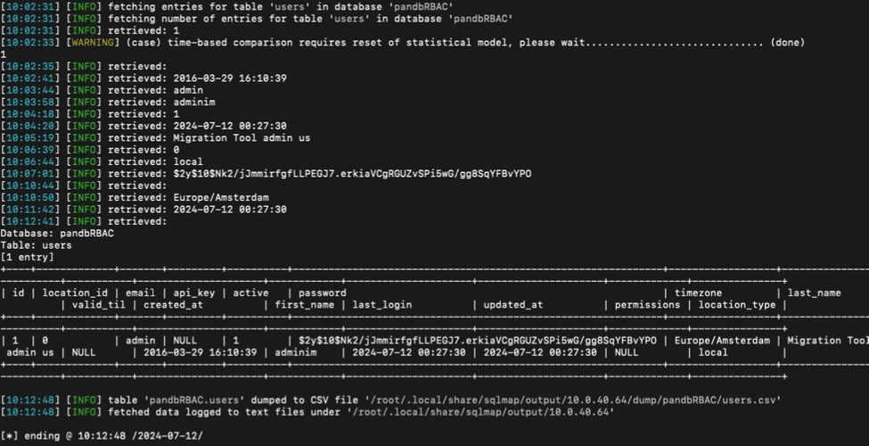</td>
</table></tr>
<table><tr>
<td>Quotes: <code>0</code></td>
<td>Replies: <code>0</code></td>
<td>Retweets: <code>84</code></td>
<td>Favorites: <code>328</code></td>
</tr></table>

---

# kmkz_security
**https://twitter.com/kmkz_security/status/1844635143958360270 _at 2024-10-11, 07:04:24_**
<blockquote>
RT @reverseame: Windows Wi-Fi Driver RCE Vulnerability – CVE-2024-30078 #Windows #WiFiDriver #RCEVulnerability #CVE-2024-30078 #Crowdfense…
</blockquote>

<table><tr>
<td>Quotes: <code>0</code></td>
<td>Replies: <code>0</code></td>
<td>Retweets: <code>53</code></td>
<td>Favorites: <code>0</code></td>
</tr></table>

---

# TheHackersNews
**https://twitter.com/TheHackersNews/status/1844626821431578911 _at 2024-10-11, 06:31:20_**
<blockquote>
🚩 A critical security flaw in #GitLab (CVE-2024-9164) could allow attackers to run CI/CD pipelines on unauthorized branches.

Find details here: https://t.co/YCBIt4cZ1T

Update your instance ASAP to avoid becoming the next victim.

#cybersecurity #devops
</blockquote>

* https://thehackernews.com/2024/10/new-critical-gitlab-vulnerability-could.html

<table><tr>
<td>Quotes: <code>3</code></td>
<td>Replies: <code>1</code></td>
<td>Retweets: <code>28</code></td>
<td>Favorites: <code>56</code></td>
</tr></table>

---

# ptracesecurity
**https://twitter.com/ptracesecurity/status/1844562344786980936 _at 2024-10-11, 02:15:07_**
<blockquote>
Patch Tuesday Diffing: CVE-2024-20696 - Windows Libarchive RCE https://t.co/UECZFSUpED  #Pentesting #Windows  #CyberSecurity #Infosec https://t.co/tPii1ir9LC
</blockquote>

* https://clearbluejar.github.io/posts/patch-tuesday-diffing-cve-2024-20696-windows-libarchive-rce/

<table><tr>
<td></td>
<td></td>
<td></td>
<td></td>
</table></tr>
<table><tr>
<td>Quotes: <code>1</code></td>
<td>Replies: <code>0</code></td>
<td>Retweets: <code>13</code></td>
<td>Favorites: <code>34</code></td>
</tr></table>

---

# x0rz
**https://twitter.com/x0rz/status/1844431004972482881 _at 2024-10-10, 17:33:14_**
<blockquote>
RT @cyb3rops: Omg … reading this report by
@Horizon3Attack
on PaloAlto‘s Expedition RCE CVE-2024-9464 (and others) seriously shakes any rem…
</blockquote>

<table><tr>
<td>Quotes: <code>0</code></td>
<td>Replies: <code>0</code></td>
<td>Retweets: <code>125</code></td>
<td>Favorites: <code>0</code></td>
</tr></table>

---

# GHSecurityLab
**https://twitter.com/GHSecurityLab/status/1844407944512774611 _at 2024-10-10, 16:01:36_**
<blockquote>
GHSL-2022-085: Java deserialization leading to RCE in pac4j-core - CVE-2023-25581 https://t.co/2qcYwPaCYk
</blockquote>

* https://securitylab.github.com/advisories/GHSL-2022-085_pac4j/

<table><tr>
<td>Quotes: <code>0</code></td>
<td>Replies: <code>2</code></td>
<td>Retweets: <code>11</code></td>
<td>Favorites: <code>38</code></td>
</tr></table>

---

# piedpiper1616
**https://twitter.com/piedpiper1616/status/1844403894434279820 _at 2024-10-10, 15:45:30_**
<blockquote>
Analyst CVE-2024-8698 on KeyCloak - https://t.co/DRUTEx80cS
</blockquote>

* https://huydoppa.hashnode.dev/analyst-cve-2024-8698-keycloak-with-zero-knowledge-about-keycloak

<table><tr>
<td>Quotes: <code>1</code></td>
<td>Replies: <code>0</code></td>
<td>Retweets: <code>30</code></td>
<td>Favorites: <code>96</code></td>
</tr></table>

---

# TheHackersNews
**https://twitter.com/TheHackersNews/status/1844350312016118170 _at 2024-10-10, 12:12:35_**
<blockquote>
A critical unpatched #vulnerability (CVE-2024-9441) in the Nice Linear eMerge E3 access controller has been uncovered, carrying a CVSS score of 9.8, with proof-of-concept exploits already circulating.

Learn more: https://t.co/TbQR90q0ce

#infosec #cybersecurity
</blockquote>

* https://thehackernews.com/2024/10/experts-warn-of-critical-unpatched.html

<table><tr>
<td>Quotes: <code>1</code></td>
<td>Replies: <code>1</code></td>
<td>Retweets: <code>38</code></td>
<td>Favorites: <code>64</code></td>
</tr></table>

---

# cyb3rops
**https://twitter.com/cyb3rops/status/1844289319084945886 _at 2024-10-10, 08:10:13_**
<blockquote>
Omg … reading this report by
@Horizon3Attack
on PaloAlto‘s Expedition RCE CVE-2024-9464 (and others) seriously shakes any remaining trust in their software. Every chapter feels like a slap in their face.
https://t.co/LOg490bfEL https://t.co/3YN5YwhdN5
</blockquote>

* https://www.horizon3.ai/attack-research/palo-alto-expedition-from-n-day-to-full-compromise/

<table><tr>
<td></td>
<td></td>
<td></td>
<td></td>
</table></tr>
<table><tr>
<td>Quotes: <code>6</code></td>
<td>Replies: <code>10</code></td>
<td>Retweets: <code>122</code></td>
<td>Favorites: <code>433</code></td>
</tr></table>

---

# TheHackersNews
**https://twitter.com/TheHackersNews/status/1844253342735925625 _at 2024-10-10, 05:47:16_**
<blockquote>
⚠️ Cyber Alerts:

—Fortinet CVE-2024-23113 actively exploited, patch by Oct 30!
—Palo Alto Expedition vulnerable to SQL &amp; OS injection.
—Cisco patches critical bug in Nexus Dashboard Fabric Controller.

Read: https://t.co/b7vOqgCVRe

Critical systems must be patched immediately.
</blockquote>

* https://thehackernews.com/2024/10/cisa-warns-of-critical-fortinet-flaw-as.html

<table><tr>
<td>Quotes: <code>0</code></td>
<td>Replies: <code>1</code></td>
<td>Retweets: <code>63</code></td>
<td>Favorites: <code>108</code></td>
</tr></table>

---

# TheHackersNews
**https://twitter.com/TheHackersNews/status/1844233197678362662 _at 2024-10-10, 04:27:13_**
<blockquote>
🚨 Warning: A critical #vulnerability (CVE-2024-9680) in Firefox is being actively exploited.

Don’t wait—ensure your browsers are updated now to protect against potential remote code execution.

Learn more: https://t.co/Agj4ZbBBOB

#cybersecurity #hacking
</blockquote>

* https://thehackernews.com/2024/10/mozilla-warns-of-active-exploitation-in.html

<table><tr>
<td>Quotes: <code>12</code></td>
<td>Replies: <code>12</code></td>
<td>Retweets: <code>244</code></td>
<td>Favorites: <code>401</code></td>
</tr></table>

---

# piedpiper1616
**https://twitter.com/piedpiper1616/status/1844162983561515299 _at 2024-10-09, 23:48:12_**
<blockquote>
RT @binitamshah: PoC  for CVE-2023-52447 released -  A Linux Kernel Flaw Enabling Container Escape : https://t.co/UHqpWTinfW
</blockquote>

* https://github.com/google/security-research/blob/master/pocs/linux/kernelctf/CVE-2023-52447_cos/docs/exploit.md

<table><tr>
<td>Quotes: <code>0</code></td>
<td>Replies: <code>0</code></td>
<td>Retweets: <code>41</code></td>
<td>Favorites: <code>0</code></td>
</tr></table>

---

# piedpiper1616
**https://twitter.com/piedpiper1616/status/1844162672176279614 _at 2024-10-09, 23:46:58_**
<blockquote>
RT @Horizon3Attack: Our latest post detailing compromising the #PaloAlto #Expedition. While investigating CVE-2024-5910, we discovered and…
</blockquote>

<table><tr>
<td>Quotes: <code>0</code></td>
<td>Replies: <code>0</code></td>
<td>Retweets: <code>78</code></td>
<td>Favorites: <code>0</code></td>
</tr></table>

---

# cyb3rops
**https://twitter.com/cyb3rops/status/1844121074965061802 _at 2024-10-09, 21:01:41_**
<blockquote>
RT @sekurlsa_pw: CVE-2024-38124: Predict the name of the New Domain controller and become Domain Admin. Reminds me of sAMAccountName Spoofi…
</blockquote>

<table><tr>
<td>Quotes: <code>0</code></td>
<td>Replies: <code>0</code></td>
<td>Retweets: <code>91</code></td>
<td>Favorites: <code>0</code></td>
</tr></table>

---

# momika233
**https://twitter.com/momika233/status/1844075123110027285 _at 2024-10-09, 17:59:05_**
<blockquote>
CVE-2024-9464: Palo Alto Expedition Authenticated Command Injection
https://t.co/zqgA0Db700
</blockquote>

* https://github.com/horizon3ai/CVE-2024-9464

<table><tr>
<td>Quotes: <code>0</code></td>
<td>Replies: <code>0</code></td>
<td>Retweets: <code>8</code></td>
<td>Favorites: <code>48</code></td>
</tr></table>

---

# wvuuuuuuuuuuuuu
**https://twitter.com/wvuuuuuuuuuuuuu/status/1844062624033669575 _at 2024-10-09, 17:09:25_**
<blockquote>
RT @Horizon3Attack: Our latest post detailing compromising the #PaloAlto #Expedition. While investigating CVE-2024-5910, we discovered and…
</blockquote>

<table><tr>
<td>Quotes: <code>0</code></td>
<td>Replies: <code>0</code></td>
<td>Retweets: <code>116</code></td>
<td>Favorites: <code>0</code></td>
</tr></table>

---

# Horizon3Attack
**https://twitter.com/Horizon3Attack/status/1844059174826803263 _at 2024-10-09, 16:55:42_**
<blockquote>
Our latest post detailing compromising the #PaloAlto #Expedition. While investigating CVE-2024-5910, we discovered and reported 3 additional vulnerabilities allowing an attacker to obtain RCE and leak integration credentials across the ecosystem.

https://t.co/6sp9GJXceZ
</blockquote>

* https://www.horizon3.ai/attack-research/palo-alto-expedition-from-n-day-to-full-compromise/

<table><tr>
<td>Quotes: <code>6</code></td>
<td>Replies: <code>4</code></td>
<td>Retweets: <code>120</code></td>
<td>Favorites: <code>237</code></td>
</tr></table>

---

# binitamshah
**https://twitter.com/binitamshah/status/1844023619334320505 _at 2024-10-09, 14:34:25_**
<blockquote>
PoC  for CVE-2023-52447 released -  A Linux Kernel Flaw Enabling Container Escape : https://t.co/UHqpWTinfW
</blockquote>

* https://github.com/google/security-research/blob/master/pocs/linux/kernelctf/CVE-2023-52447_cos/docs/exploit.md

<table><tr>
<td>Quotes: <code>0</code></td>
<td>Replies: <code>2</code></td>
<td>Retweets: <code>62</code></td>
<td>Favorites: <code>257</code></td>
</tr></table>

---

# hosselot
**https://twitter.com/hosselot/status/1844021741506740596 _at 2024-10-09, 14:26:58_**
<blockquote>
The fix for Mozilla Firefox In-The-Wild use-after-free vulnerability in Animation timeline (CVE-2024-9680 [1923344]):
https://t.co/MaJEW7nze9
</blockquote>

* https://github.com/mozilla/gecko-dev/commit/7a85a111b5f42cdc07f438e36f9597c4c6dc1d48

<table><tr>
<td>Quotes: <code>1</code></td>
<td>Replies: <code>2</code></td>
<td>Retweets: <code>11</code></td>
<td>Favorites: <code>48</code></td>
</tr></table>

---

# TheHackersNews
**https://twitter.com/TheHackersNews/status/1843907805008552386 _at 2024-10-09, 06:54:13_**
<blockquote>
👉 Microsoft has released patches for 118 vulnerabilities, two of which (CVE-2024-43572 and CVE-2024-43573) are being actively exploited in the wild.

Find details here: https://t.co/JZETALKYFs

Ensure your systems are protected—apply these patches ASAP!

#cybersecurity #infosec
</blockquote>

* https://thehackernews.com/2024/10/microsoft-issues-security-update-fixing.html

<table><tr>
<td>Quotes: <code>2</code></td>
<td>Replies: <code>1</code></td>
<td>Retweets: <code>39</code></td>
<td>Favorites: <code>72</code></td>
</tr></table>

---

# 1ZRR4H
**https://twitter.com/1ZRR4H/status/1843778083138208142 _at 2024-10-08, 22:18:45_**
<blockquote>
RT @ryanaraine: The zero-day, tagged as CVE-2024-43572, is  a remote code execution issue in Microsoft Management Console. Redmond says att…
</blockquote>

<table><tr>
<td>Quotes: <code>0</code></td>
<td>Replies: <code>0</code></td>
<td>Retweets: <code>35</code></td>
<td>Favorites: <code>0</code></td>
</tr></table>

---

# hackerfantastic
**https://twitter.com/hackerfantastic/status/1843776113258180773 _at 2024-10-08, 22:10:55_**
<blockquote>
RT @ryanaraine: The zero-day, tagged as CVE-2024-43572, is  a remote code execution issue in Microsoft Management Console. Redmond says att…
</blockquote>

<table><tr>
<td>Quotes: <code>0</code></td>
<td>Replies: <code>0</code></td>
<td>Retweets: <code>43</code></td>
<td>Favorites: <code>0</code></td>
</tr></table>

---

# sekurlsa_pw
**https://twitter.com/sekurlsa_pw/status/1843764943319109882 _at 2024-10-08, 21:26:32_**
<blockquote>
CVE-2024-38124: Predict the name of the New Domain controller and become Domain Admin. Reminds me of sAMAccountName Spoofing. 

To predict the name would be easy in some domains:
▪️DC1
▪️DC2

https://t.co/PiUB256H0L https://t.co/jXWRexzrn5
</blockquote>

* https://msrc.microsoft.com/update-guide/en-US/vulnerability/CVE-2024-38124

<table><tr>
<td></td>
</table></tr>
<table><tr>
<td>Quotes: <code>3</code></td>
<td>Replies: <code>2</code></td>
<td>Retweets: <code>91</code></td>
<td>Favorites: <code>301</code></td>
</tr></table>

---

# ryanaraine
**https://twitter.com/ryanaraine/status/1843728004264137137 _at 2024-10-08, 18:59:45_**
<blockquote>
The zero-day, tagged as CVE-2024-43572, is  a remote code execution issue in Microsoft Management Console. Redmond says attackers are rigging  Microsoft Saved Console (MSC) files to execute remote code on targeted Windows systems.
https://t.co/nGyZwHer25
</blockquote>

* https://www.securityweek.com/patch-tuesday-microsoft-confirms-exploited-zero-day-in-windows-management-console/

<table><tr>
<td>Quotes: <code>3</code></td>
<td>Replies: <code>1</code></td>
<td>Retweets: <code>68</code></td>
<td>Favorites: <code>152</code></td>
</tr></table>

---

# wvuuuuuuuuuuuuu
**https://twitter.com/wvuuuuuuuuuuuuu/status/1843709569094361165 _at 2024-10-08, 17:46:30_**
<blockquote>
RT @Chocapikk_: exploit + lab setup for CVE-2024-45519

https://t.co/twEOqIFZMn https://t.co/dJrPESiRJH
</blockquote>

* https://github.com/Chocapikk/CVE-2024-45519

<table><tr>
<td></td>
</table></tr>
<table><tr>
<td>Quotes: <code>0</code></td>
<td>Replies: <code>0</code></td>
<td>Retweets: <code>144</code></td>
<td>Favorites: <code>0</code></td>
</tr></table>

---

# wvuuuuuuuuuuuuu
**https://twitter.com/wvuuuuuuuuuuuuu/status/1843700716336230718 _at 2024-10-08, 17:11:19_**
<blockquote>
RT @buffaloverflow: Just published an advisory for CVE-2024-37404, an interesting CRLF issue leading to RCE in Ivanti Connect Secure! 🧐🐛

G…
</blockquote>

<table><tr>
<td>Quotes: <code>0</code></td>
<td>Replies: <code>0</code></td>
<td>Retweets: <code>50</code></td>
<td>Favorites: <code>0</code></td>
</tr></table>

---

# buffaloverflow
**https://twitter.com/buffaloverflow/status/1843673151664009337 _at 2024-10-08, 15:21:47_**
<blockquote>
Just published an advisory for CVE-2024-37404, an interesting CRLF issue leading to RCE in Ivanti Connect Secure! 🧐🐛

Get the technical details on the @AmberWolfSec blog👇

https://t.co/ChmrC70lE0
</blockquote>

* https://blog.amberwolf.com/blog/2024/october/cve-2024-37404-ivanti-connect-secure-authenticated-rce-via-openssl-crlf-injection/

<table><tr>
<td>Quotes: <code>1</code></td>
<td>Replies: <code>0</code></td>
<td>Retweets: <code>46</code></td>
<td>Favorites: <code>128</code></td>
</tr></table>

---

# TheHackersNews
**https://twitter.com/TheHackersNews/status/1843503670044115225 _at 2024-10-08, 04:08:20_**
<blockquote>
🔐 Qualcomm releases urgent security updates, including a critical patch for CVE-2024-43047—a flaw currently being exploited in the wild.

Learn more 👉 https://t.co/xBRVAlVOsW

Qualcomm urges OEMs to deploy the update ASAP.

#cybersecurity #infosec
</blockquote>

* https://thehackernews.com/2024/10/qualcomm-urges-oems-to-patch-critical.html

<table><tr>
<td>Quotes: <code>3</code></td>
<td>Replies: <code>4</code></td>
<td>Retweets: <code>71</code></td>
<td>Favorites: <code>125</code></td>
</tr></table>

---

# Synacktiv
**https://twitter.com/Synacktiv/status/1843257946236674404 _at 2024-10-07, 11:51:55_**
<blockquote>
GitLab recently released a patch for the Ruby-SAML / GitLab Authentication Bypass (CVE-2024-45409). Our ninjas @alexisdanizan and @b1two_ analyzed the patch and wrote the exploit code! https://t.co/RaP8lKDh8o
</blockquote>

* https://github.com/synacktiv/CVE-2024-45409

<table><tr>
<td>Quotes: <code>0</code></td>
<td>Replies: <code>0</code></td>
<td>Retweets: <code>31</code></td>
<td>Favorites: <code>119</code></td>
</tr></table>

---

# binitamshah
**https://twitter.com/binitamshah/status/1843233217069081034 _at 2024-10-07, 10:13:39_**
<blockquote>
GitLab Authentication Bypass (CVE-2024-45409) : https://t.co/Q48P9kfPzf 
 credits @rootxharsh @iamnoooob https://t.co/PwHEPmBP8p
</blockquote>

* https://blog.projectdiscovery.io/ruby-saml-gitlab-auth-bypass/

<table><tr>
<td>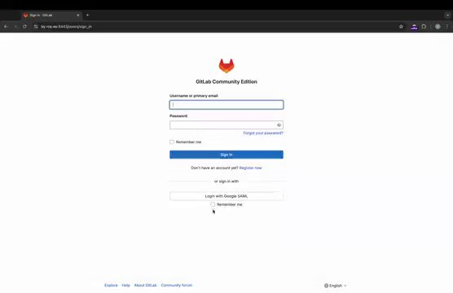</td>
</table></tr>
<table><tr>
<td>Quotes: <code>11</code></td>
<td>Replies: <code>6</code></td>
<td>Retweets: <code>335</code></td>
<td>Favorites: <code>1547</code></td>
</tr></table>

---

# TheHackersNews
**https://twitter.com/TheHackersNews/status/1843223494865346938 _at 2024-10-07, 09:35:01_**
<blockquote>
A critical security flaw in Apache Avro SDK (CVE-2024-47561) threatens large-scale data processing systems. 

Ensure your systems are patched to avoid arbitrary code execution risks.

Details here: https://t.co/9ebAKi27zL

#infosec #cybersecurity
</blockquote>

* https://thehackernews.com/2024/10/critical-apache-avro-sdk-flaw-allows.html

<table><tr>
<td>Quotes: <code>3</code></td>
<td>Replies: <code>1</code></td>
<td>Retweets: <code>33</code></td>
<td>Favorites: <code>77</code></td>
</tr></table>

---

# HackingTeam1
**https://twitter.com/HackingTeam1/status/1842902284851642681 _at 2024-10-06, 12:18:38_**
<blockquote>
exploit + lab setup for CVE-2024-45519 🔥

Github

#Cve #Exploit https://t.co/jUchsIMLqK
</blockquote>

<table><tr>
<td></td>
</table></tr>
<table><tr>
<td>Quotes: <code>0</code></td>
<td>Replies: <code>1</code></td>
<td>Retweets: <code>39</code></td>
<td>Favorites: <code>250</code></td>
</tr></table>

---

# piedpiper1616
**https://twitter.com/piedpiper1616/status/1842896351916699766 _at 2024-10-06, 11:55:04_**
<blockquote>
Ruby-SAML / GitLab Authentication Bypass (CVE-2024-45409) - https://t.co/soCUzAS2lD
</blockquote>

* https://blog.projectdiscovery.io/ruby-saml-gitlab-auth-bypass/

<table><tr>
<td>Quotes: <code>0</code></td>
<td>Replies: <code>0</code></td>
<td>Retweets: <code>11</code></td>
<td>Favorites: <code>39</code></td>
</tr></table>

---

# ptracesecurity
**https://twitter.com/ptracesecurity/status/1842822140384448967 _at 2024-10-06, 07:00:10_**
<blockquote>
TeamViewer User to Kernel Elevation of Privilege PoC. CVE-2024-7479 and CVE-2024-7481. ZDI-24-1289 and ZDI-24-1290. TV-2024-1006. https://t.co/HhuHAsLaxv  #Pentesting #Vulnerability  #CyberSecurity #Infosec https://t.co/OlTCSEmU4F
</blockquote>

* https://github.com/PeterGabaldon/CVE-2024-7479_CVE-2024-7481

<table><tr>
<td></td>
</table></tr>
<table><tr>
<td>Quotes: <code>0</code></td>
<td>Replies: <code>4</code></td>
<td>Retweets: <code>10</code></td>
<td>Favorites: <code>33</code></td>
</tr></table>

---

# 7h3h4ckv157
**https://twitter.com/7h3h4ckv157/status/1842651748378574966 _at 2024-10-05, 19:43:06_**
<blockquote>
Zimbra - Remote Command Execution (CVE-2024-45519) - by @Chocapikk_ 

Source: https://t.co/1Qqr2qiLfZ https://t.co/3FxpJ1D13P
</blockquote>

* https://github.com/Chocapikk/CVE-2024-45519

<table><tr>
<td>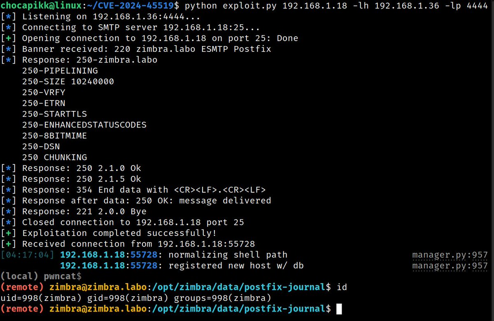</td>
</table></tr>
<table><tr>
<td>Quotes: <code>0</code></td>
<td>Replies: <code>2</code></td>
<td>Retweets: <code>38</code></td>
<td>Favorites: <code>293</code></td>
</tr></table>

---

# ptracesecurity
**https://twitter.com/ptracesecurity/status/1842640959072264598 _at 2024-10-05, 19:00:13_**
<blockquote>
4 exploits, 1 bug: exploiting cve-2024-20017 4 different ways https://t.co/rrq20Hhlo2   #Pentesting #exploit #Vulnerability  #CyberSecurity #Infosec https://t.co/dGm5kmsuOg
</blockquote>

* https://blog.coffinsec.com/0day/2024/08/30/exploiting-CVE-2024-20017-four-different-ways.html

<table><tr>
<td></td>
<td></td>
<td></td>
<td></td>
</table></tr>
<table><tr>
<td>Quotes: <code>0</code></td>
<td>Replies: <code>0</code></td>
<td>Retweets: <code>15</code></td>
<td>Favorites: <code>47</code></td>
</tr></table>

---

# httpvoid0x2f
**https://twitter.com/httpvoid0x2f/status/1842520432219423043 _at 2024-10-05, 11:01:18_**
<blockquote>
Checkout our new blogpost! In this post we talk about SAML and the recent Ruby-SAML Auth bypass.

CVE-2024-45409: Ruby-SAML Auth Bypass in GitLab

https://t.co/VYZ3YG0oXD https://t.co/ka6FjXvsyZ
</blockquote>

* https://blog.projectdiscovery.io/ruby-saml-gitlab-auth-bypass/

<table><tr>
<td></td>
</table></tr>
<table><tr>
<td>Quotes: <code>3</code></td>
<td>Replies: <code>3</code></td>
<td>Retweets: <code>155</code></td>
<td>Favorites: <code>544</code></td>
</tr></table>

---

# kmkz_security
**https://twitter.com/kmkz_security/status/1842516552396017862 _at 2024-10-05, 10:45:53_**
<blockquote>
RT @pdiscoveryio: 🚨 CVE-2024-45409: SAML Auth Bypass in GitLab

We just reversed a critical Ruby-SAML vuln affecting GitLab! 🔓

✅ Detailed…
</blockquote>

<table><tr>
<td>Quotes: <code>0</code></td>
<td>Replies: <code>0</code></td>
<td>Retweets: <code>58</code></td>
<td>Favorites: <code>0</code></td>
</tr></table>

---

# steventseeley
**https://twitter.com/steventseeley/status/1842511911184691397 _at 2024-10-05, 10:27:26_**
<blockquote>
RT @pdiscoveryio: 🚨 CVE-2024-45409: SAML Auth Bypass in GitLab

We just reversed a critical Ruby-SAML vuln affecting GitLab! 🔓

✅ Detailed…
</blockquote>

<table><tr>
<td>Quotes: <code>0</code></td>
<td>Replies: <code>0</code></td>
<td>Retweets: <code>58</code></td>
<td>Favorites: <code>0</code></td>
</tr></table>

---

# pdnuclei
**https://twitter.com/pdnuclei/status/1842489750663442791 _at 2024-10-05, 08:59:23_**
<blockquote>
RT @pdiscoveryio: 🚨 CVE-2024-45409: SAML Auth Bypass in GitLab

We just reversed a critical Ruby-SAML vuln affecting GitLab! 🔓

✅ Detailed…
</blockquote>

<table><tr>
<td>Quotes: <code>0</code></td>
<td>Replies: <code>0</code></td>
<td>Retweets: <code>58</code></td>
<td>Favorites: <code>0</code></td>
</tr></table>

---

# kmkz_security
**https://twitter.com/kmkz_security/status/1842483484238983460 _at 2024-10-05, 08:34:28_**
<blockquote>
RT @Chocapikk_: exploit + lab setup for CVE-2024-45519

https://t.co/twEOqIFZMn https://t.co/dJrPESiRJH
</blockquote>

* https://github.com/Chocapikk/CVE-2024-45519

<table><tr>
<td></td>
</table></tr>
<table><tr>
<td>Quotes: <code>0</code></td>
<td>Replies: <code>0</code></td>
<td>Retweets: <code>136</code></td>
<td>Favorites: <code>0</code></td>
</tr></table>

---

# TheHackersNews
**https://twitter.com/TheHackersNews/status/1842427630437773634 _at 2024-10-05, 04:52:32_**
<blockquote>
Apple has released critical iOS and iPadOS updates addressing a #vulnerability (CVE-2024-44204) that could expose your passwords via VoiceOver #technology.

Read: https://t.co/lG1aBnB75m

#iPhone XS and later, plus iPads from the Pro, Air, and Mini series, are impacted.

#infosec
</blockquote>

* https://thehackernews.com/2024/10/apple-releases-critical-ios-and-ipados.html

<table><tr>
<td>Quotes: <code>10</code></td>
<td>Replies: <code>3</code></td>
<td>Retweets: <code>96</code></td>
<td>Favorites: <code>173</code></td>
</tr></table>

---

# ptracesecurity
**https://twitter.com/ptracesecurity/status/1842377182540107973 _at 2024-10-05, 01:32:04_**
<blockquote>
Unauthenticated SSRF (CVE-2024-41570) on Havoc C2 teamserver via spoofed demon agent https://t.co/OU5FYk6cBB  #Pentesting #CyberSecurity #Infosec https://t.co/B381p2kt0C
</blockquote>

* https://blog.chebuya.com/posts/server-side-request-forgery-on-havoc-c2/

<table><tr>
<td></td>
</table></tr>
<table><tr>
<td>Quotes: <code>0</code></td>
<td>Replies: <code>2</code></td>
<td>Retweets: <code>5</code></td>
<td>Favorites: <code>34</code></td>
</tr></table>

---

# kmkz_security
**https://twitter.com/kmkz_security/status/1842330135426654505 _at 2024-10-04, 22:25:07_**
<blockquote>
RT @0xor0ne: Introduction to Chrome exploitation (architecture, v8 pipeline, CVE-2023-4069)

https://t.co/pS6WgfabP1

Credits @matteomalvic…
</blockquote>

* https://www.matteomalvica.com/blog/2024/06/05/intro-v8-exploitation-maglev/

<table><tr>
<td>Quotes: <code>0</code></td>
<td>Replies: <code>0</code></td>
<td>Retweets: <code>47</code></td>
<td>Favorites: <code>0</code></td>
</tr></table>

---

# _r_netsec
**https://twitter.com/_r_netsec/status/1842232738562379968 _at 2024-10-04, 15:58:06_**
<blockquote>
0-Click RCE in MediaTek Wi-Fi Chipsets — 4 exploits, 1 bug: exploiting CVE-2024-20017 4 different ways https://t.co/D0PoFJTKOC
</blockquote>

* https://blog.coffinsec.com/0day/2024/08/30/exploiting-CVE-2024-20017-four-different-ways.html

<table><tr>
<td>Quotes: <code>0</code></td>
<td>Replies: <code>0</code></td>
<td>Retweets: <code>17</code></td>
<td>Favorites: <code>73</code></td>
</tr></table>

---

# cyber_advising
**https://twitter.com/cyber_advising/status/1842202508682260520 _at 2024-10-04, 13:57:59_**
<blockquote>
CVE-2024-7479 &amp; CVE-2024-7481: exploit proof of concept of a vulnerability in TeamViewer that enables an unprivileged user to load an arbitrary Kernel Driver into the system.

PoC
https://t.co/VpW1aNdYW5 https://t.co/BDepFjWMiN
</blockquote>

* https://github.com/PeterGabaldon/CVE-2024-7479_CVE-2024-7481

<table><tr>
<td></td>
</table></tr>
<table><tr>
<td>Quotes: <code>4</code></td>
<td>Replies: <code>7</code></td>
<td>Retweets: <code>197</code></td>
<td>Favorites: <code>772</code></td>
</tr></table>

---

# reverseame
**https://twitter.com/reverseame/status/1842152211087774075 _at 2024-10-04, 10:38:07_**
<blockquote>
CVE-2024-38063: poc for CVE-2024-38063 (RCE in tcpip.sys) #GitHub #CVE-2024-38063 #RCE #tcpip.sys #poc https://t.co/2xibtWRFxC
</blockquote>

* https://github.com/ynwarcs/CVE-2024-38063

<table><tr>
<td>Quotes: <code>0</code></td>
<td>Replies: <code>1</code></td>
<td>Retweets: <code>19</code></td>
<td>Favorites: <code>46</code></td>
</tr></table>

---

# cyber_advising
**https://twitter.com/cyber_advising/status/1842096555500716105 _at 2024-10-04, 06:56:57_**
<blockquote>
RT @orange_8361: Remember CVE-2024-4577, the PHP-CGI RCE bypass? Actually, the Best-Fit 'feature' also impacts non-CJK codepages such as lo…
</blockquote>

<table><tr>
<td>Quotes: <code>0</code></td>
<td>Replies: <code>0</code></td>
<td>Retweets: <code>69</code></td>
<td>Favorites: <code>0</code></td>
</tr></table>

---

# 0x_shaq
**https://twitter.com/0x_shaq/status/1842066022544670723 _at 2024-10-04, 04:55:38_**
<blockquote>
Pwning LLaMA.cpp RPC Server with CVE-2024-42478 and CVE-2024-42479

https://t.co/i9jlGV32ZE https://t.co/e5nx9mTqA0
</blockquote>

* https://youtu.be/OJs1-zm0AqU

<table><tr>
<td></td>
</table></tr>
<table><tr>
<td>Quotes: <code>3</code></td>
<td>Replies: <code>9</code></td>
<td>Retweets: <code>41</code></td>
<td>Favorites: <code>281</code></td>
</tr></table>

---

# Dinosn
**https://twitter.com/Dinosn/status/1842047280251375822 _at 2024-10-04, 03:41:09_**
<blockquote>
Authd Vulnerability (CVE-2024-9313) Allows User Impersonation on Ubuntu Systems https://t.co/FRS1bo9U4x
</blockquote>

* https://securityonline.info/authd-vulnerability-cve-2024-9313-allows-user-impersonation-on-ubuntu-systems/

<table><tr>
<td>Quotes: <code>0</code></td>
<td>Replies: <code>0</code></td>
<td>Retweets: <code>34</code></td>
<td>Favorites: <code>87</code></td>
</tr></table>

---

# kmkz_security
**https://twitter.com/kmkz_security/status/1841892650179273017 _at 2024-10-03, 17:26:43_**
<blockquote>
RT @Dinosn: PoC Exploit Releases for Zimbra RCE Flaw CVE-2024-45519: Mass Exploitation Detected https://t.co/nc3n8SPZjo
</blockquote>

* https://securityonline.info/poc-exploit-releases-for-zimbra-rce-flaw-cve-2024-45519-mass-exploitation-detected/

<table><tr>
<td>Quotes: <code>0</code></td>
<td>Replies: <code>0</code></td>
<td>Retweets: <code>51</code></td>
<td>Favorites: <code>0</code></td>
</tr></table>

---

# 0xdea
**https://twitter.com/0xdea/status/1841780875026981195 _at 2024-10-03, 10:02:33_**
<blockquote>
RT @orange_8361: Remember CVE-2024-4577, the PHP-CGI RCE bypass? Actually, the Best-Fit 'feature' also impacts non-CJK codepages such as lo…
</blockquote>

<table><tr>
<td>Quotes: <code>0</code></td>
<td>Replies: <code>0</code></td>
<td>Retweets: <code>60</code></td>
<td>Favorites: <code>0</code></td>
</tr></table>

---

# Dinosn
**https://twitter.com/Dinosn/status/1841678856022798430 _at 2024-10-03, 03:17:10_**
<blockquote>
0-Day Flaw CVE-2024-38200 in Microsoft Office Exposes NTLMv2 Hashes: PoC Exploit Released https://t.co/J2fWzJzkZe
</blockquote>

* https://securityonline.info/0-day-flaw-cve-2024-38200-in-microsoft-office-exposes-ntlmv2-hashes-poc-exploit-released/

<table><tr>
<td>Quotes: <code>0</code></td>
<td>Replies: <code>0</code></td>
<td>Retweets: <code>33</code></td>
<td>Favorites: <code>85</code></td>
</tr></table>

---

# BleepinComputer
**https://twitter.com/BleepinComputer/status/1841552709943529783 _at 2024-10-02, 18:55:55_**
<blockquote>
Critical Ivanti Endpoint Manager vulnerability (CVE-2024-29824) with public exploit code now actively used in remote code execution attacks - @serghei
https://t.co/OsRM5x6BHq
</blockquote>

* https://www.bleepingcomputer.com/news/security/critical-ivanti-rce-flaw-with-public-exploit-now-used-in-attacks/

<table><tr>
<td>Quotes: <code>5</code></td>
<td>Replies: <code>0</code></td>
<td>Retweets: <code>55</code></td>
<td>Favorites: <code>102</code></td>
</tr></table>

---

# kmkz_security
**https://twitter.com/kmkz_security/status/1841521826020884500 _at 2024-10-02, 16:53:11_**
<blockquote>
RT @orange_8361: Remember CVE-2024-4577, the PHP-CGI RCE bypass? Actually, the Best-Fit 'feature' also impacts non-CJK codepages such as lo…
</blockquote>

<table><tr>
<td>Quotes: <code>0</code></td>
<td>Replies: <code>0</code></td>
<td>Retweets: <code>67</code></td>
<td>Favorites: <code>0</code></td>
</tr></table>

---

# SinSinology
**https://twitter.com/SinSinology/status/1841516562148163925 _at 2024-10-02, 16:32:16_**
<blockquote>
(CVE-2024-8885 🔥) At @watchtowrcyber I reported a Local Privilege Escalation in Sophos EDR leading to SYSTEM⏫
https://t.co/AoTPji2CaP https://t.co/yhIXoPp7h3
</blockquote>

* https://www.sophos.com/en-us/security-advisories/sophos-sa-20241002-cde-lpe

<table><tr>
<td></td>
</table></tr>
<table><tr>
<td>Quotes: <code>1</code></td>
<td>Replies: <code>10</code></td>
<td>Retweets: <code>28</code></td>
<td>Favorites: <code>159</code></td>
</tr></table>

---

# elhackernet
**https://twitter.com/elhackernet/status/1841474105691767280 _at 2024-10-02, 13:43:34_**
<blockquote>
🚨Vulnerabilidad crítica en Zimbra

➡️ CVE-2024-45519 (RCE)
https://t.co/esOiyD9q6e https://t.co/8ujpljp1nq
</blockquote>

* https://blog.projectdiscovery.io/zimbra-remote-code-execution/

<table><tr>
<td></td>
</table></tr>
<table><tr>
<td>Quotes: <code>0</code></td>
<td>Replies: <code>0</code></td>
<td>Retweets: <code>17</code></td>
<td>Favorites: <code>40</code></td>
</tr></table>

---

# TheHackersNews
**https://twitter.com/TheHackersNews/status/1841452032151974242 _at 2024-10-02, 12:15:51_**
<blockquote>
🚨 A critical #vulnerability, CosmicSting (CVE-2024-34102), has hit 5% of Adobe Commerce &amp; Magento stores.

7 hacker groups are injecting malicious scripts.

Details here: https://t.co/jvrvhsPbgJ

Patching isn’t enough—rotate your encryption keys now!

#cybersecurity
</blockquote>

* https://thehackernews.com/2024/10/alert-adobe-commerce-and-magento-stores.html

<table><tr>
<td>Quotes: <code>1</code></td>
<td>Replies: <code>1</code></td>
<td>Retweets: <code>12</code></td>
<td>Favorites: <code>39</code></td>
</tr></table>

---

# Dinosn
**https://twitter.com/Dinosn/status/1841201179402846375 _at 2024-10-01, 19:39:03_**
<blockquote>
Zimbra - Remote Command Execution (CVE-2024-45519) https://t.co/7eexZpA55t
</blockquote>

* https://www.reddit.com/r/netsec/comments/1ftojbr/zimbra_remote_command_execution_cve202445519/

<table><tr>
<td>Quotes: <code>0</code></td>
<td>Replies: <code>0</code></td>
<td>Retweets: <code>10</code></td>
<td>Favorites: <code>40</code></td>
</tr></table>

---

# sekurlsa_pw
**https://twitter.com/sekurlsa_pw/status/1841129017799258472 _at 2024-10-01, 14:52:19_**
<blockquote>
PoC and wirte-up for CVE-2024-38200: Microsoft Office NTLMv2 Disclosure Vulnerability 
https://t.co/ciHkPHPj1f

Patch: https://t.co/RUSNlgm078 https://t.co/z3l7DdvyUv
</blockquote>

* https://github.com/passtheticket/CVE-2024-38200
* https://msrc.microsoft.com/update-guide/vulnerability/CVE-2024-38200

<table><tr>
<td></td>
</table></tr>
<table><tr>
<td>Quotes: <code>2</code></td>
<td>Replies: <code>2</code></td>
<td>Retweets: <code>44</code></td>
<td>Favorites: <code>172</code></td>
</tr></table>

---

# threatinsight
**https://twitter.com/threatinsight/status/1841089939905134793 _at 2024-10-01, 12:17:02_**
<blockquote>
Beginning on September 28, @Proofpoint began observing attempts to exploit CVE-2024-45519, a remote code execution vulnerability in Zimbra mail servers.

The emails spoofing Gmail were sent to bogus addresses in the CC fields in an attempt for Zimbra servers to parse and execute https://t.co/RJr9jawwWl
</blockquote>

<table><tr>
<td>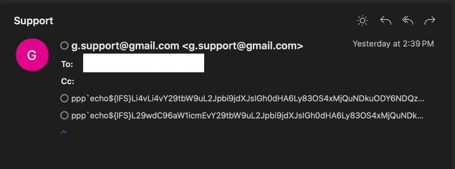</td>
<td>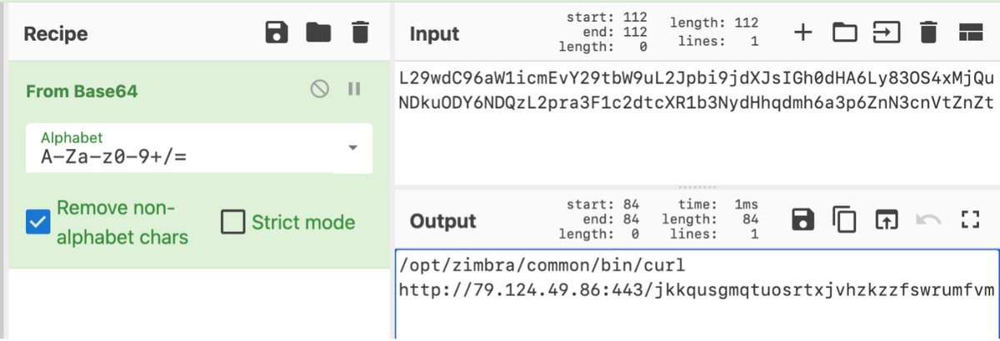</td>
</table></tr>
<table><tr>
<td>Quotes: <code>4</code></td>
<td>Replies: <code>1</code></td>
<td>Retweets: <code>26</code></td>
<td>Favorites: <code>37</code></td>
</tr></table>

---

# cyb3rops
**https://twitter.com/cyb3rops/status/1841036635296653427 _at 2024-10-01, 08:45:13_**
<blockquote>
RT @JusticeRage: If you're using @Zimbra, mass-exploitation of CVE-2024-45519 has begun. Patch yesterday.

Malicious emails are coming from…
</blockquote>

<table><tr>
<td>Quotes: <code>0</code></td>
<td>Replies: <code>0</code></td>
<td>Retweets: <code>41</code></td>
<td>Favorites: <code>0</code></td>
</tr></table>

---

# 0xor0ne
**https://twitter.com/0xor0ne/status/1841010207163322638 _at 2024-10-01, 07:00:12_**
<blockquote>
Exploitation of a type confusion vulnerability in v8 (Chrome, CVE-2024-5830)

https://t.co/d0ZT5O8vHK

Credits @mmolgtm

#infosec #chrome https://t.co/yIZJHp8FyP
</blockquote>

* https://github.blog/security/vulnerability-research/from-object-transition-to-rce-in-the-chrome-renderer/

<table><tr>
<td></td>
<td></td>
</table></tr>
<table><tr>
<td>Quotes: <code>0</code></td>
<td>Replies: <code>0</code></td>
<td>Retweets: <code>7</code></td>
<td>Favorites: <code>37</code></td>
</tr></table>

---

# kmkz_security
**https://twitter.com/kmkz_security/status/1841006000049946876 _at 2024-10-01, 06:43:29_**
<blockquote>
RT @0xor0ne: Exploitation of a type confusion vulnerability in v8 (Chrome, CVE-2024-5830)

https://t.co/d0ZT5O8vHK

Credits @mmolgtm

#info…
</blockquote>

* https://github.blog/security/vulnerability-research/from-object-transition-to-rce-in-the-chrome-renderer/

<table><tr>
<td>Quotes: <code>0</code></td>
<td>Replies: <code>0</code></td>
<td>Retweets: <code>42</code></td>
<td>Favorites: <code>0</code></td>
</tr></table>

---

# the_yellow_fall
**https://twitter.com/the_yellow_fall/status/1840930948092969451 _at 2024-10-01, 01:45:15_**
<blockquote>
A serious vulnerability, dubbed #KartLANPwn (CVE-2024-45200), has been identified in the wildly popular Nintendo game Mario Kart 8 Deluxe, putting millions of players at risk of remote code execution (RCE) during multiplayer sessions. PoC Published

https://t.co/IzGV1KBIQe
</blockquote>

* https://securityonline.info/kartlanpwn-cve-2024-45200-exploits-mario-kart-8-deluxe-lan-play-feature-for-rce/

<table><tr>
<td>Quotes: <code>0</code></td>
<td>Replies: <code>1</code></td>
<td>Retweets: <code>15</code></td>
<td>Favorites: <code>57</code></td>
</tr></table>

---

